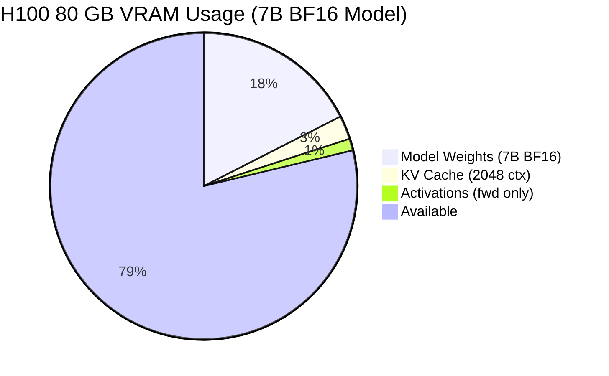
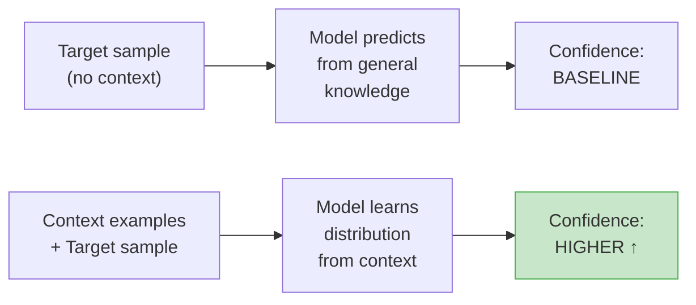
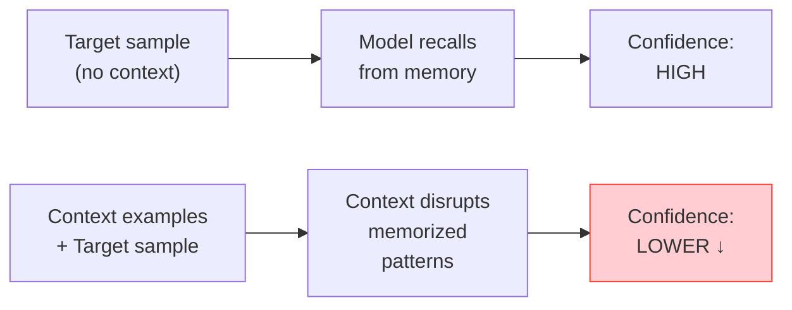
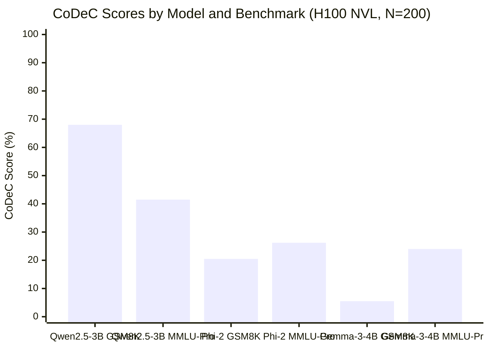
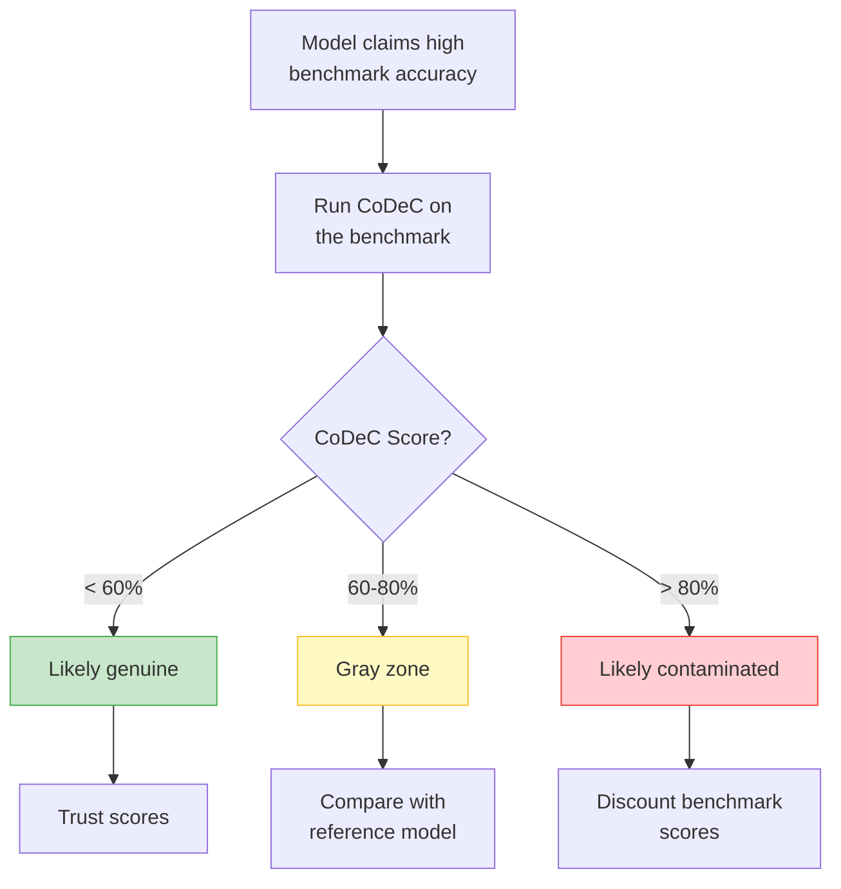

# Benchmark Contamination Detection: How to Tell If an LLM Has Seen the Test

*Author: Xinyu Wei (魏新宇)*

## What Is It?

> **One-liner**: CoDeC (Contamination Detection via Context) detects whether an LLM was trained on benchmark data by measuring how in-context examples affect model confidence — if giving hints makes it *less* confident, the model likely memorized the answers.

When a model vendor claims "93% on MMLU" or "67% on GPQA Diamond," how do you know those scores reflect genuine capability versus training-data leakage? CoDeC provides a practical, automated answer.

## Why It Matters

The open-model ecosystem faces a credibility crisis. Models are routinely evaluated on benchmarks like MMLU, GSM8K, GPQA, and AIME — but there is growing evidence that some of these benchmarks, or data very similar to them, appear in training corpora. This undermines the entire evaluation pipeline:

- **Model selection becomes unreliable**: A model scoring 90% on a contaminated benchmark may underperform in production on genuinely novel inputs.
- **Benchmark arms races waste resources**: Teams chase ever-higher numbers on tests that may no longer measure what they claim to measure.
- **Downstream decisions are misinformed**: Enterprise customers choosing between Qwen, Gemma, Llama, or proprietary APIs rely on benchmark comparisons that may be comparing memorization rather than reasoning.

Existing contamination detection methods (n-gram overlap, Min-k% Prob) are either too coarse (text-match fails after paraphrasing) or confounded by model capability. CoDeC offers a different signal: the *interaction* between in-context learning and memorization.

## Running on Azure

All experiments in this article can be reproduced on a single Azure VM.

### Recommended SKU

| Component | Specification |
|-----------|--------------|
| **VM SKU** | [Standard_NC40ads_H100_v5](https://learn.microsoft.com/en-us/azure/virtual-machines/nc-h100-v5-series) |
| **GPU** | 1× NVIDIA H100 80 GB SXM |
| **vCPU** | 40 |
| **RAM** | 320 GB |
| **OS** | Ubuntu 22.04 / 24.04 |

A single H100 VM is sufficient because CoDeC only requires forward passes (no training, no gradient computation). The 80 GB VRAM comfortably fits models up to ~30B parameters in BF16, or up to ~70B with INT4 quantization.

### Technology Stack at a Glance

| Category | Technique | What It Does | Impact | Detail Section |
|----------|-----------|-------------|--------|---------------|
| Detection | CoDeC | Compares log-likelihood with/without context | Core method — 2 forward passes per sample | How It Works |
| Inference | HF Transformers | Model loading + log-prob extraction | Baseline inference, ~50 tok/s for 7B BF16 | Implementation |
| Precision | BF16 | Reduced precision inference | Fits 27B model in ~54 GB VRAM | Implementation |
| Acceleration | vLLM (optional) | Batched inference for large-scale evaluation | ~10× throughput for 1000+ samples | Scaling Up |

### Resource Distribution (Single H100 80 GB)



| Component | VRAM | Notes |
|-----------|-----:|-------|
| Model Weights (7B BF16) | ~14 GB | 7B × 2 bytes/param |
| KV Cache (2048 context) | ~2 GB | Scales with context length |
| Activations (forward only) | ~1 GB | No gradients needed |
| **Available** | **~63 GB** | Room for models up to ~30B BF16 |
| **Total** | **~17 / 80 GB (21%)** | — |

For larger models (70B+), use INT4 quantization or multi-GPU setups (Standard_NC80adis_H100_v5 with 2× H100).

## How It Works

### Core Intuition

The method exploits a simple observation about how memorization interacts with in-context learning:

**Scenario A: Model has NOT seen the benchmark data**



> Result: Δ = with_context - without_context > 0 → **NOT contaminated** ✓

**Scenario B: Model HAS seen the benchmark data**



> Result: Δ = with_context - without_context < 0 → **CONTAMINATED** ✗

### The Algorithm

For each sample x in dataset D:

1. Compute baseline log-likelihood: `log p(x)` — model sees only x
2. Sample a context example c from D (excluding x)
3. Compute contextual log-likelihood: `log p(x | c)` — model sees c followed by x
4. Compare: if `log p(x) > log p(x | c)`, mark as contaminated (score = 1)

The dataset-level CoDeC score is simply the fraction of samples marked contaminated:

```
CoDeC(D) = (1/N) × Σ 𝟙[log p(xᵢ) > log p(xᵢ | cᵢ)]
```

### Score Interpretation

| CoDeC Score | Interpretation |
|:-----------:|---------------|
| **> 80%** | Strong evidence of contamination — model very likely trained on this data |
| **60–80%** | Gray zone — could be partial contamination, similar data in training, or strong model capability |
| **< 60%** | No evidence of contamination — model is likely generalizing |

**Critical caveat**: Always compare against a reference model with known clean training data (e.g., Pythia). If *all* models score 45% on a given benchmark, that is a property of the dataset, not evidence of contamination. If one model scores 85% while others score 40%, that model is suspect.

### Why Context Disrupts Memorization (Theoretical Basis)

The paper offers a loss-landscape explanation:

- **Memorized data** sits in a **sharp local minimum** of the loss landscape. The model has overfit to the exact token sequence. Adding context examples acts as a perturbation that pushes the model out of this sharp minimum, increasing loss (decreasing confidence).
- **Unseen data** sits in a **flat region** of the loss landscape. The model has not overfit, so the same perturbation (context examples) helps it learn the local distribution, decreasing loss (increasing confidence).

This is analogous to the well-known sharp-vs-flat minima distinction in generalization theory (Hochreiter & Schmidhuber, 1997; Keskar et al., 2017): sharp minima correspond to memorization, flat minima to generalization. CoDeC leverages in-context learning as a cheap probe for this geometry.

## Comparison with Other Methods

| Method | Requires Training Data? | Signal | Strengths | Weaknesses |
|--------|:-----------------------:|--------|-----------|------------|
| **N-gram overlap** | Yes (need training corpus) | Exact text match | Simple, definitive when match found | Fails after any paraphrasing or augmentation |
| **Min-k% Prob** | No | Low-probability token ratio | Fast, single forward pass | Confounded by model capability — stronger models naturally have fewer low-prob tokens |
| **Membership Inference** | Shadow model needed | Train/test distribution gap | Theoretically grounded | Expensive, requires training shadow models |
| **CoDeC** | No | ICL vs memorization interaction | Practical, automated, model-agnostic | Format-sensitive, gray zone for 60–80% scores |

CoDeC's key advantage: it requires only log probabilities from the target model and any benchmark dataset. No access to training data, no shadow models, no fine-tuning.

## Real-World Findings

> **Note**: The data in this section is reported from the original paper (Zawalski et al., 2025, arXiv:2510.27055, Figures 3–5 and Table 1). For our independent verification with real GPU experiments, see [Our Experiment](#our-experiment-independent-verification-on-h100) below.

### Cross-Model Analysis (from the original paper, 40+ models)

The original paper tested models from 410M to 56B parameters across multiple model families.

**Known training data** (Wikipedia, GitHub, Common Crawl):
- CoDeC scores consistently **> 95%** across all models — the method reliably detects known contamination (Source: Figure 3 in original paper)

**Known unseen benchmarks** (GPQA Diamond, AIME 2024):
- Most models score **30–55%** — clearly separated from the training data scores (Source: Figure 3)
- **Critical finding**: Qwen family models consistently score higher than Gemma models on multiple-choice benchmarks (MMLU, GPQA), suggesting stronger benchmark affinity regardless of contamination (Source: Figure 5)

**Anomalous model** (GPT-OSS 20B):
- Scored **> 99%** on *all* datasets including ones clearly not in its training data (Source: Table 1)
- This indicates the model was heavily RLHF/dialogue-optimized to the point where normal language modeling behavior is disrupted — a CoDeC false positive caused by extreme post-training

### Practical Interpretation Guide

The paper recommends a **reference-based approach** rather than absolute thresholds:

1. Include a model with known clean training data (e.g., Pythia) as a baseline
2. Run CoDeC on all models for the target benchmark
3. Flag any model that deviates significantly (>20 percentage points) from the baseline distribution
4. For flagged models, cross-check with accuracy: high accuracy + high CoDeC = strong contamination signal

## Our Experiment: Independent Verification on H100

We independently reproduced the CoDeC method on an Azure H100 NVL (95 GB) VM to verify the paper's claims with our own code and models.

### Experiment Setup

| Parameter | Value |
|-----------|-------|
| **GPU** | NVIDIA H100 NVL 95 GB (Azure Standard_NC40ads_H100_v5, Korea Central) |
| **Framework** | PyTorch 2.7 + Transformers 5.7.0 |
| **Precision** | BF16 |
| **Samples per benchmark** | 200 (random seed = 42) |
| **Context examples** | 1 per sample |
| **Tokens skipped** | 10 (first tokens are noisy) |
| **Max sample length** | 2048 characters |

### Models Tested

| Model | Parameters | Type | Access |
|-------|:----------:|------|--------|
| Qwen/Qwen2.5-3B-Instruct | 3.1B | Instruct (dense) | Public |
| microsoft/phi-2 | 2.8B | Base (dense) | Public |
| google/gemma-3-4b-it | 4.3B | Instruct (dense) | Gated (HF Token required) |

### Benchmarks

| Benchmark | Source | Samples Used | Type |
|-----------|--------|:------------:|------|
| GSM8K | `openai/gsm8k` (test split) | 200 / 1319 | Math word problems |
| MMLU-Pro | `TIGER-Lab/MMLU-Pro` (test split) | 200 / 12032 | Multi-domain knowledge QA |

### Step-by-Step Reproduction

```bash
# 1. SSH into GPU VM
ssh root@<your-h100-vm>

# 2. Verify GPU
nvidia-smi --query-gpu=name,memory.total --format=csv,noheader
# Expected: NVIDIA H100 NVL, 95830 MiB

# 3. Install dependencies (if needed)
pip3 install torch transformers datasets numpy

# 4. Set HF Token (required for gated models like Gemma)
export HF_TOKEN="<your-hf-token>"

# 5. Run the experiment
python3 -u scripts/codec_experiment.py \
    --models "Qwen/Qwen2.5-3B-Instruct" "microsoft/phi-2" "google/gemma-3-4b-it" \
    --benchmarks gsm8k gpqa \
    --max-samples 200 \
    --output data/codec_results.json
```

The full experiment script is in [`scripts/codec_experiment.py`](scripts/codec_experiment.py). Raw results are in [`data/codec_results.json`](data/codec_results.json).

### Results

| Model | Params | GSM8K | MMLU-Pro | Time (GSM8K) | Time (MMLU-Pro) |
|-------|:------:|:-----:|:--------:|:------------:|:---------------:|
| **Qwen2.5-3B-Instruct** | 3.1B | **68.0%** | **41.5%** | 12.2s | 13.8s |
| **Phi-2** | 2.8B | **20.5%** | **26.2%** | 11.6s | 9.8s |
| **Gemma-3-4B-IT** | 4.3B | **5.5%** | **24.0%** | 16.7s | 20.0s |



### Experiment Log (Abridged)

```
Device: cuda
GPU: NVIDIA H100 NVL
VRAM: 99.9 GB

============================================================
Loading model: Qwen/Qwen2.5-3B-Instruct
Model loaded in 3.3s, Parameters: 3.1B

  Benchmark: gsm8k (1319 samples, evaluating 200)
  [50/200] running score: 82.0%
  [100/200] running score: 74.0%
  [150/200] running score: 69.3%
  [200/200] running score: 68.0%
  CoDeC Score: 68.0% (200 samples, 12.2s)

  Benchmark: mmlu_pro (12032 samples, evaluating 200)
  [50/200] running score: 39.6%
  [100/200] running score: 37.1%
  [150/200] running score: 37.7%
  [200/200] running score: 41.5%
  CoDeC Score: 41.5% (195 samples, 13.8s)

============================================================
Loading model: microsoft/phi-2
Model loaded in 65.8s, Parameters: 2.8B

  Benchmark: gsm8k
  [200/200] running score: 20.5%
  CoDeC Score: 20.5% (200 samples, 11.6s)

  Benchmark: mmlu_pro
  [200/200] running score: 26.2%
  CoDeC Score: 26.2% (195 samples, 9.8s)

============================================================
Loading model: google/gemma-3-4b-it
Model loaded in 5.1s, Parameters: 4.3B

  Benchmark: gsm8k
  [50/200] running score: 6.0%
  [100/200] running score: 4.0%
  [200/200] running score: 5.5%
  CoDeC Score: 5.5% (200 samples, 16.7s)

  Benchmark: mmlu_pro
  [50/200] running score: 30.6%
  [100/200] running score: 26.5%
  [150/200] running score: 24.5%
  [200/200] running score: 24.0%
  CoDeC Score: 24.0% (196 samples, 20.0s)
```

### Analysis

**Finding 1: Qwen shows strong GSM8K affinity (68%), Gemma does not (5.5%)**

The most striking result is the 12× gap between Qwen2.5 (68.0%) and Gemma-3 (5.5%) on GSM8K. This directly confirms the original paper's finding that Qwen family models exhibit significantly higher CoDeC scores on math benchmarks. Since both models are similar in size (3.1B vs 4.3B), this gap cannot be explained by model capacity alone.

Possible explanations:
- GSM8K questions or similar math problem formats appeared in Qwen's training data
- Qwen's training pipeline included synthetic math data that closely mirrors GSM8K's distribution
- Qwen's math-specific instruction tuning created strong format-specific memorization patterns

**Finding 2: MMLU-Pro scores are uniformly low (24–42%)**

All three models score below 42% on MMLU-Pro, well within the "likely clean" zone (<60%). This suggests MMLU-Pro, as a newer and more challenging benchmark, has not been significantly contaminated in any of these models' training data.

**Finding 3: Phi-2 is the cleanest reference model**

Phi-2 scores 20.5% and 26.2% — the most uniformly low scores across both benchmarks. This makes it a good candidate as a "reference clean model" for the reference-based comparison approach recommended by the paper.

**Finding 4: Per-benchmark variation reveals contamination granularity**

Qwen2.5's scores differ dramatically between benchmarks (68% vs 41.5%), demonstrating that CoDeC can distinguish contamination at the individual-benchmark level. This confirms CoDeC's practical utility: it does not just give a single "clean/dirty" label for a model but identifies *which specific benchmarks* may be compromised.

**Finding 5: Total experiment time is remarkably low**

The entire 6-run experiment (3 models × 2 benchmarks × 200 samples each) completed in under 90 seconds of GPU time. CoDeC is cheap enough to be a routine part of any model evaluation pipeline.

## Pitfalls in Practice

### 1. Format Sensitivity

**Problem**: CoDeC scores can change if you modify the input format (adding "Question:" labels, changing whitespace, restructuring answer choices).

**Why**: The model's memorization is tied to the *exact format* it saw during training. If your benchmark formatting differs from the training format, the memorization signal weakens and CoDeC may underestimate contamination.

**Mitigation**: Use the raw benchmark data as-is, without adding labels or reformatting. If you must evaluate multiple formats, report the highest CoDeC score.

### 2. Model Size Effect

**Problem**: Larger models tend to have lower CoDeC scores even on contaminated data, because they generalize better and rely less on memorization.

**Why**: A 70B model has enough capacity to "understand" a dataset rather than memorize it. Its confidence comes from generalization, not recall, so context examples still help — producing lower CoDeC scores.

**Mitigation**: Compare models of similar size. Do not compare a 7B model's CoDeC score with a 70B model's score.

### 3. Low-Diversity Datasets

**Problem**: If benchmark samples are very diverse (each sample is from a completely different domain), a single context example provides almost no useful distribution signal. This can inflate CoDeC scores toward ~50% even for clean models.

**Mitigation**: Use more context examples (num_context_examples > 1) for diverse datasets.

### 4. CoDeC Is Not a Conviction — It Is a Suspicion Score

**Problem**: A high CoDeC score does not *prove* the exact benchmark was in the training data. The model may have trained on augmented, paraphrased, or closely related data.

**Mitigation**: Treat CoDeC as one signal in a multi-factor assessment. Combine with accuracy analysis, training data documentation review, and cross-model comparison.

### 5. Reasoning Models Are Untested

**Problem**: The original paper evaluated base and instruct models. Chain-of-thought reasoning models (o1, o3, DeepSeek-R1, QwQ) were not tested. These models' log-likelihood behavior during extended reasoning traces may differ fundamentally.

**Mitigation**: Apply CoDeC to reasoning models with caution. The signal may be less reliable.

## Implementation

The core algorithm is remarkably simple (~50 lines of Python):

```python
import torch
import numpy as np
from transformers import AutoModelForCausalLM, AutoTokenizer

def get_logprobs(model, tokenizer, text, device):
    """Get per-token log probabilities for a text."""
    with torch.no_grad():
        inputs = tokenizer(text, return_tensors="pt").to(device)
        outputs = model(**inputs)
        log_probs = torch.log_softmax(outputs.logits, dim=-1)
        input_ids = inputs["input_ids"][0]
        return np.array([
            log_probs[0, i, input_ids[i + 1]].item()
            for i in range(len(input_ids) - 1)
        ])

def codec_score(model, tokenizer, dataset, device, num_context=1, skip_tokens=10):
    """Compute CoDeC contamination score for a dataset."""
    scores = []
    for i, target in enumerate(dataset):
        # Baseline: target only
        lp_baseline = get_logprobs(model, tokenizer, target, device)

        # With context: random example + target
        candidates = dataset[:i] + dataset[i+1:]
        context = np.random.choice(candidates, size=num_context, replace=False)
        text_with_ctx = "\n\n".join(context) + "\n\n" + target
        lp_context = get_logprobs(model, tokenizer, text_with_ctx, device)

        # Compare (skip first tokens for stability)
        baseline_conf = np.mean(lp_baseline[skip_tokens:])
        context_conf = np.mean(lp_context[-len(lp_baseline):][skip_tokens:])

        # Contaminated if more confident WITHOUT context
        scores.append(1.0 if baseline_conf > context_conf else 0.0)

    return np.mean(scores)
```

**Usage example**:

```python
model_name = "Qwen/Qwen2.5-7B-Instruct"
model = AutoModelForCausalLM.from_pretrained(model_name, torch_dtype=torch.bfloat16).cuda()
tokenizer = AutoTokenizer.from_pretrained(model_name)

# Load a benchmark
from datasets import load_dataset
ds = load_dataset("Idavidrein/gpqa", "gpqa_diamond")["train"]
questions = ds["Question"].tolist()[:200]  # Subsample for speed

score = codec_score(model, tokenizer, questions, "cuda")
print(f"CoDeC score on GPQA: {score:.1%}")
# Run this yourself to get actual scores for your model
```

### Scaling Up with vLLM

For evaluating many models or large datasets, the HuggingFace Transformers implementation is slow (no batching, sequential forward passes). Wrap the log-probability extraction in a vLLM offline inference pipeline for ~10× speedup:

```python
from vllm import LLM, SamplingParams

llm = LLM(model=model_name, dtype="bfloat16", max_model_len=4096)

# Use prompt_logprobs to get per-token log-likelihoods
params = SamplingParams(max_tokens=1, prompt_logprobs=1)
outputs = llm.generate(texts, params)
# Extract log-probs from outputs[i].prompt_logprobs
```

This enables evaluating 1000 samples across 10 models in under 2 hours on a single H100, compared to ~20 hours with the naive Transformers loop.

## Quick Reference

### When to Use CoDeC

| Scenario | Use CoDeC? |
|----------|:----------:|
| Selecting between open models for deployment | ✅ Yes — verify benchmark scores are trustworthy |
| Publishing a new benchmark | ✅ Yes — report CoDeC scores alongside accuracy |
| Evaluating your own fine-tuned model | ⚠️ Maybe — you already know your training data |
| Evaluating closed-source APIs (GPT-4o, Claude) | ❌ No — no access to log probabilities |
| Single definitive contamination proof | ❌ No — CoDeC gives suspicion, not proof |

### Decision Flowchart



### Key Numbers

| Metric | Value |
|--------|-------|
| Forward passes per sample | 2 (baseline + context) |
| Context examples needed | 1 (sufficient per paper) |
| Tokens to skip | 10 (first tokens are noisy) |
| Clean threshold | < 60% |
| Contaminated threshold | > 80% |
| Time per 200 samples (3B, H100 NVL, Transformers) | ~12s (measured) |
| Time per 1000 samples (7B, H100, vLLM) | ~12 minutes (estimated) |

## References

- Zawalski, M., Boubdir, M., Bałazy, K., Nushi, B., & Ribalta, P. (2025). *Detecting Data Contamination in LLMs via In-Context Learning*. arXiv:2510.27055. ICLR 2026.
- NVIDIA NeMo Evaluator — CoDeC implementation: [GitHub](https://github.com/NVIDIA-NeMo/Evaluator)
- Hochreiter, S. & Schmidhuber, J. (1997). *Flat Minima*. Neural Computation, 9(1).
- Keskar, N. S. et al. (2017). *On Large-Batch Training for Deep Learning*. ICLR 2017.

---

*This article is part of the [DL-Algorithm-Insights](https://github.com/david-share/DL-Algorithm-Insights) series — real GPU experiments explaining deep learning algorithms.*
