# A Running System Is Not Yet a Valid Conclusion: Correctness, MTP, Online RL, and Evaluation

[中文完整版](M03_correctness_training_evaluation_full_article.md) | English

**Scope and evidence.** This complete edition separates four gates that are often collapsed into one: a setting can be present, the runtime can execute, the algorithm can preserve the requested semantics, and the evidence can support a conclusion. The four source snapshots, their normalized-body boundaries, and all 35 source-detail images are traceable through [FULL_MERGE_LEDGER.md](FULL_MERGE_LEDGER.md); the authoritative record is `FULL_MERGE_LEDGER.md`. A successful request, a completed job, or a nonempty output clears only an execution gate. It does not by itself establish numerical equivalence, causal quality improvement, convergence, linear scaling, or production readiness.

**Reading map.** The six overview figures establish the evidence model. Source #3 then audits four precision ledgers and three meanings of correctness; source #6 follows a silent MTP semantic fallback from commit to process environment and measured workload; source #7 separates the two reinforcement-learning axes and fixes the capability boundaries of Agent Lightning and Microsoft Foundry; source #12 closes with denominator, topology, scaling, and memory checks for cross-system benchmarks.

Repository: <https://github.com/david-xinyuwei/david-share>  
Series: `DL-Algorithm-Insights/`  
Author: Xinyu Wei | Microsoft AI and Apps GBB Senior System Engineer

## Six Overview Figures

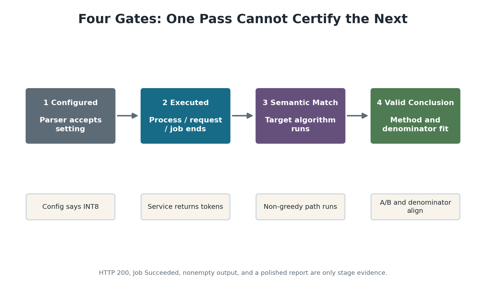

*Figure 1. Configuration, execution, semantic fidelity, and conclusion validity are separate gates. An HTTP 200, a succeeded job, or a nonempty output passes an execution check only; passing one gate is merely a prerequisite for the next.*

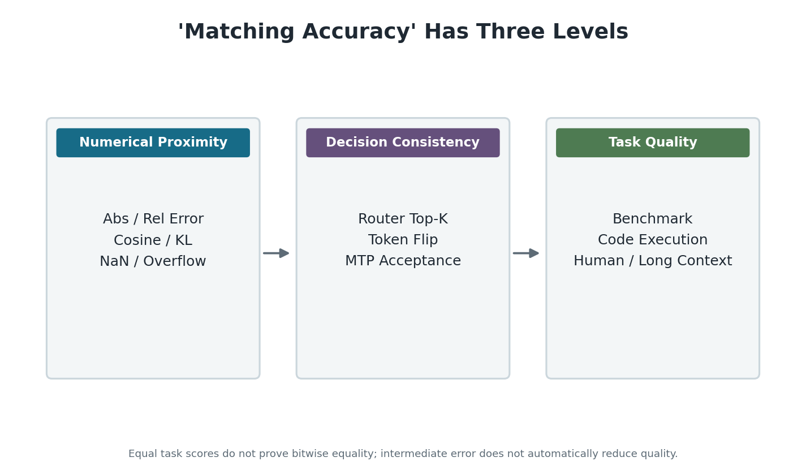

*Figure 2. Tensor error is continuous, routing and token selection are discrete, and task quality aggregates a finite sample. Each level needs its own acceptance criteria.*

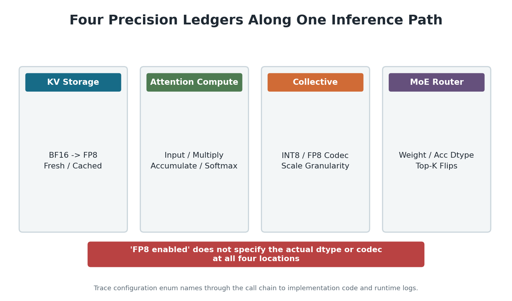

*Figure 3. Inputs, multiplication, accumulation, Softmax, communication, and output storage may use different data types. “FP8 Attention” is not an end-to-end arithmetic specification.*

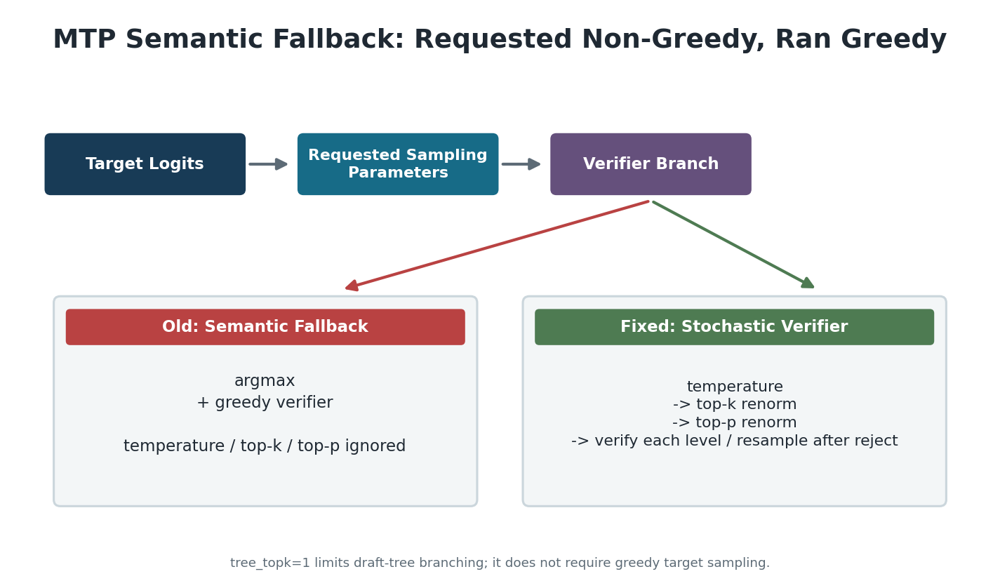

*Figure 4. The HIP defect changed the target distribution, not merely the random draw. Returning tokens proves liveness, not that the requested sampling semantics ran.*

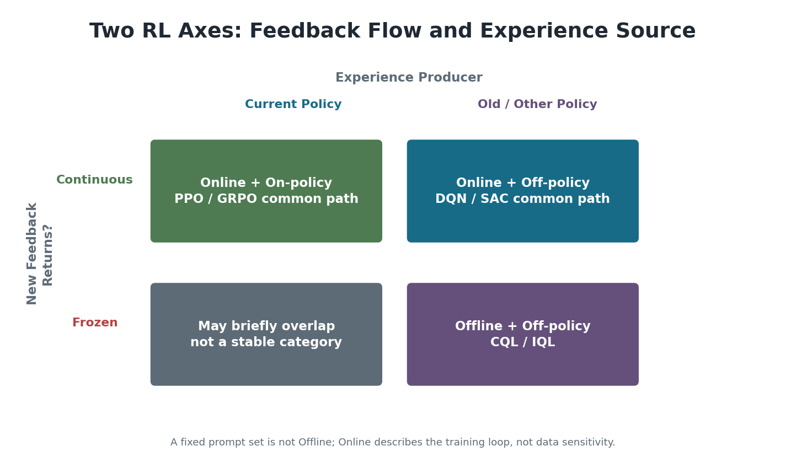

*Figure 5. A fixed prompt set does not make training Offline. A model that can produce an answer is not necessarily Online either; the deciding test is whether current-policy behavior obtains new target-environment feedback that returns to training.*

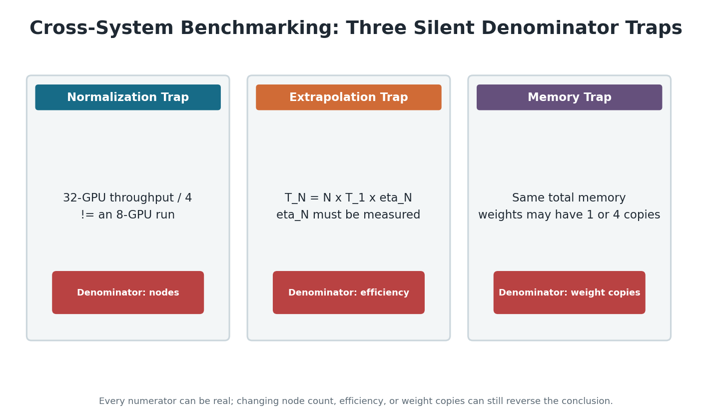

*Figure 6. The numerators can all be real measurements while the conclusion fails because node count, scaling efficiency, or the number of weight copies changed underneath the ratio.*

## Complete Source Chapters

The source-detail figures below are byte-preserved from the original articles and may retain Chinese labels. The adjacent English interpretation and caption state what each figure contributes; no source-detail image is used as the sole evidence for a claim.

<!-- SOURCE-BEGIN-EN id=03 source=03_accuracy_chain_article.md sha256=2b438f53e288f44b68762525dcf6f41f832fcf4589838fe68e42bfa555611de2 body_sha256=4309c579c94ab270782a93a097c085a2653e7bd9dd5e8e266bd7697e7489a157 -->
## Source #3: Where Does Model Accuracy Go? Four Precision Ledgers Across One Inference Path

KV cache, mixed-precision Attention, quantized All-Reduce, and Router GEMM alter values at different points: storage, computation, communication, and routing. Calling all four “FP8” erases the distinctions that determine both risk and verification.

The practical question is not whether two GPU platforms produce similar benchmark scores. It is whether that finite task result is being mistaken for bitwise numerical equivalence. A real inference configuration commonly exposes four independent controls:

```text
Whether the KV cache uses FP8
Which precisions Attention actually uses internally
Whether Quick Reduce communication uses quantization
Whether the MoE Router is cast from FP32 to FP16
```

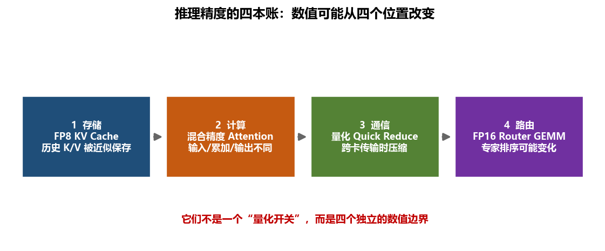

*Source #3, Figure 1. Precision is a data-flow property. Every store, conversion, reduction, compression step, or ranking operation can introduce a distinct difference.*

### Definitions Used in This Chapter

| Term | Precise meaning here |
|---|---|
| **FP32** | A 32-bit floating-point format with more representable precision, and generally more range, than the lower-bit formats discussed here |
| **BF16** | BFloat16, a 16-bit floating-point format with an FP32-like exponent range but fewer significant bits |
| **FP8 E4M3** | An 8-bit floating-point format with four exponent bits and three mantissa bits; compact, but with a much sparser set of representable values |
| **INT8** | An 8-bit integer format, usually paired with a scale that approximates floating-point data |
| **KV cache** | Key/Value cache, which stores earlier tokens' K/V vectors for reuse by later Attention operations |
| **Attention** | The operation that lets the current Query aggregate information from historical Keys and Values |
| **All-Reduce** | A collective that aggregates partial results across GPUs and returns the aggregate to every participant |
| **Quick Reduce** | A quantized All-Reduce implementation intended to reduce cross-GPU traffic |
| **Router** | The Mixture-of-Experts component that selects which experts process each token |
| **GEMM** | General Matrix Multiply |
| **MTP** | Multi-Token Prediction, where a draft path proposes several candidate tokens at once |
| **kernel** | The GPU program that actually executes an operation; one logical operation may have several kernel implementations |
| **KL divergence** | Kullback-Leibler divergence, a measure of the difference between probability distributions |

### “The Accuracy Is the Same” Can Mean Three Different Things

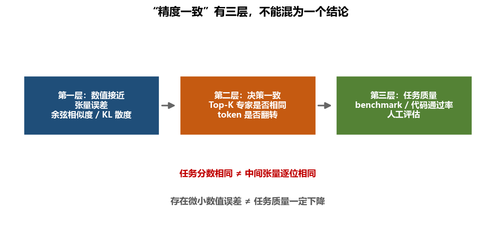

*Source #3, Figure 2. Similar tensors, identical discrete decisions, and similar task scores are three different claims with different evidence requirements.*

#### Level 1: numerical proximity

This level asks whether maximum absolute error, relative error, cosine similarity, or another tensor metric remains within a declared threshold.

```text
Reference value: 0.5002
Optimized value: 0.5000
```

The difference is only `0.0002`, which may be numerically small under an agreed tolerance.

#### Level 2: decision consistency

Models often rank, take Top-K, or sample from values rather than consume them directly.

```text
Expert A: 0.5002
Expert B: 0.5001
```

A tiny perturbation can reverse A and B. The tensor error remains small while the routing decision changes.

#### Level 3: task quality

This level asks whether benchmark score, multi-turn response quality, or code-execution success remains similar. An equal score says only that the selected sample did not amplify the difference. It does not prove that intermediate tensors are bitwise identical. Conversely, a small intermediate difference does not establish that task quality fell.

Three statements must therefore remain separate:

- **A numerical error entry point exists.** The data type or algorithm establishes that possibility.
- **No quality regression was observed in this test.** The claim is bounded by the tested model, sample, context, seed policy, and runtime.
- **There is no impact.** This is much stronger and normally cannot be supported by one benchmark run.

### Precision Ledger 1: How the KV Cache Is Stored

During generation, a Transformer repeatedly reads historical Keys and Values. Changing their persistent cache representation from BF16 to FP8 directly reduces capacity per element:

```text
BF16: 2 bytes per element
FP8: 1 byte per element
```

The same memory can then hold more tokens or support higher concurrency. The tradeoff is equally direct: several nearby BF16 values may quantize to the same representable FP8 value.

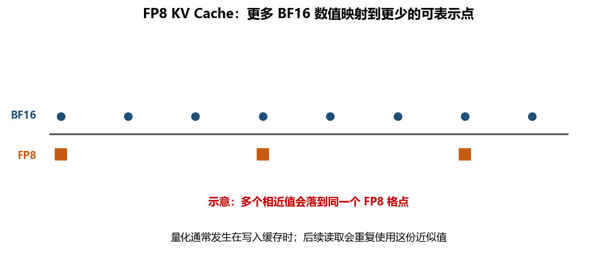

*Source #3, Figure 3. FP8 KV cache saves memory by storing a coarser approximation, not by preserving every BF16 value.*

Two boundaries matter. First, K/V is usually quantized once when written to cache, rather than quantized again on every read. Second, the error does not multiply automatically with the read count, but the approximated values do feed later Attention operations, new-token decisions, and subsequent layers.

The risk is therefore more likely to surface under long contexts, multi-turn conversations, reasoning that is sensitive to small probability changes, and MTP verification or Top-K boundaries that are nearly tied. A short benchmark with no score loss does not establish long-context equivalence.

### Precision Ledger 2: One Kernel Can Contain Four Data Types

A configuration may advertise “FP8 Attention” or “BF16 Attention,” yet a real mixed-precision kernel can follow this path:

```text
Q / K / V inputs:         FP8
Dot-product accumulation: FP32
Softmax:                  FP32
Final output:             BF16
```

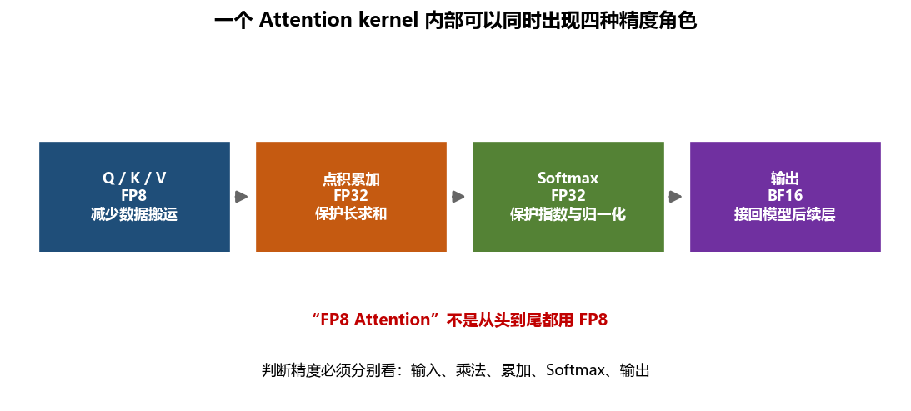

*Source #3, Figure 4. Input storage, multiply, accumulation, Softmax, and output representation must be inspected separately.*

Q/K/V dominate data movement, so FP8 can reduce bandwidth demand. Dot products aggregate many products, making FP32 accumulation useful for limiting summation error. Softmax includes exponentiation and normalization and is sensitive to numerical range, so it commonly stays at higher precision. A BF16 output then connects naturally to later model layers.

Neither of these inferences is valid:

```text
"The inputs are FP8, so every computation is FP8."
"The output is FP32, so every preceding computation must use FP32."
```

A kernel precision audit needs at least four fields: input type, multiplication type, accumulation type, and output type.

#### Fresh chunks and cached chunks can take different paths

With chunked prefill, the first new chunk may consume fresh BF16 K/V, while later chunks read FP8 K/V that has already entered the cache:

```text
First fresh chunk: BF16 K/V → Attention
Subsequent cached chunks: FP8 K/V → dequantization scale → Attention
```

One Prefill phase can therefore contain two numerical paths. Describing the whole phase as BF16 omits the cached-read path.

### Precision Ledger 3: Does an INT8 Configuration Produce INT8 Communication?

Tensor Parallelism divides a matrix operation across GPUs. Each GPU computes a partial result, then All-Reduce aggregates the partials. A standard path can communicate BF16 directly. Quick Reduce instead follows a low-bit communication path of this form:

```text
BF16 local result
   ↓ quantize
Low-bit codec + scale factor
   ↓ cross-GPU transfer and aggregation
Restore the floating-point representation required by subsequent computation
```

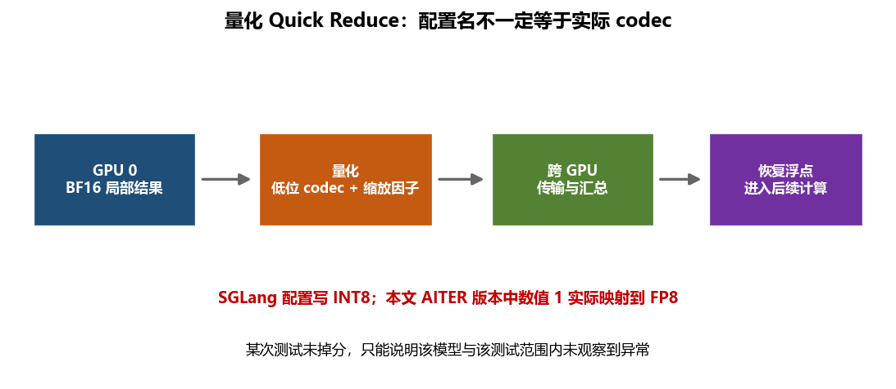

*Source #3, Figure 5. Quick Reduce compresses collective traffic; it does not rewrite model weights or permanently convert every later operation to a low-bit type.*

Communication-only compression is still not mathematically lossless. Mapping BF16 into a lower-bit format generally rounds or truncates values, with scale factors controlling rather than eliminating the error.

#### The configuration name and the implemented codec can disagree

The exact public snapshots expose a particularly important mapping:

```text
SGLang configuration layer: QuickReduceRegime.INT8 = 1
                            ↓ passes numeric value 1 to AITER
AITER 3f4ab482: QuickReduceQuantLevel.FP8 = 1
```

For this precise version pair, `ROCM_QUICK_REDUCE_QUANTIZATION=INT8` sends numeric value `1` into AITER, where value `1` selects the **FP8 codec**. The configuration layer says INT8; the implementation layer dispatches FP8. This is an enum-contract fact, not a wording preference.

The verification method follows from the mismatch: an environment-variable name is not implementation evidence. Trace its enum value through the receiving library to the kernel dispatch. Because another branch or version may change the mapping, the conclusion must remain commit-bound.

A defensible result is therefore limited: a test that showed no garbled output or task anomaly found no issue within that test. It does not guarantee every model, context, and low-bit codec. As bit width falls and representable values become sparser, end-to-end validation becomes more important.

### Precision Ledger 4: Small Router Errors Can Select a Different Expert

A Mixture-of-Experts model does not send every token through every expert. Its Router computes logits and selects Top-K experts. One optimized path casts Router weights from FP32 to FP16, uses FP16 multiplication, and retains FP32 accumulation and FP32 output logits:

```text
Input:          BF16
Router weights: FP16
Multiplication: FP16
Accumulation:   FP32
Output logits:  FP32
```

An FP32 output does not make this equivalent to FP32 weights multiplied by FP32 inputs. Approximation already occurred when the weights were cast to FP16.

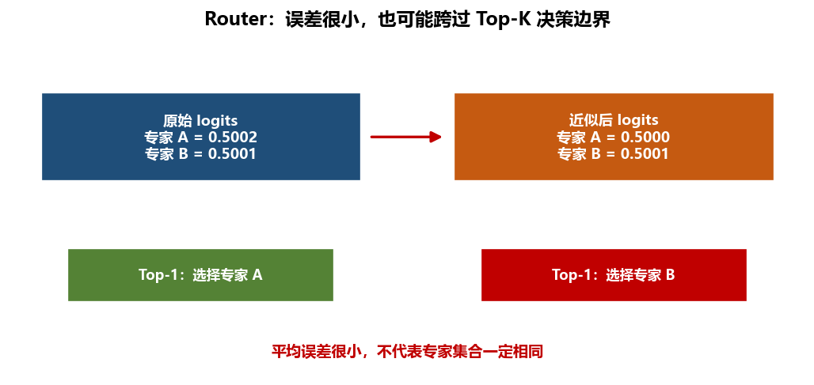

*Source #3, Figure 6. The relevant failure mode is a discrete expert-set change, not merely a small mean logit error.*

Consider the simplified boundary:

```text
Original logits:     Expert A = 0.5002, Expert B = 0.5001
After approximation: Expert A = 0.5000, Expert B = 0.5001
```

The numerical difference is a few ten-thousandths, but Top-1 moves from A to B. For Top-K routing, expert-set overlap is therefore more informative than average logit error alone.

Router precision can also affect MTP. A different expert path may slightly separate the Target and Draft distributions and alter candidate-token acceptance length.

### A Hidden Fifth Factor: Equal Dtypes Do Not Guarantee Bitwise Equality

Two paths can both report BF16 or FP32 and still disagree.

#### Reduction order

Floating-point addition is not strictly associative:

```text
(a + b) + c
and
a + (b + c)
```

The expressions are equal over real numbers but can round differently at intermediate steps in finite-precision arithmetic. Parallel GPU reductions can change the summation order.

#### Rounding mode

A high-precision value converted to a lower-precision format must land on one of the available representable values. Hardware instructions, compiler choices, and kernels may use different conversion paths.

#### Kernel fallback

If a shape does not match the expected kernel, the framework can fall back to a different implementation. Identical launch arguments do not prove that identical GPU programs ran. An operator-level comparison must follow this evidence chain:

```text
Identical input
→ kernel actually selected
→ input / accumulation / output type at each step
→ tensor error
→ whether the decision flips
```

### Engineering Decisions That Follow from the Four Ledgers

1. Establish a fair high-precision baseline first. Disable extra quantization and communication compression before comparing performance.
2. Record the expected cost of doing so. BF16 KV consumes more memory, BF16 communication moves more bytes, and an FP32 Router can be slower.
3. Keep “no observed quality issue” separate from “no theoretical error.” Bound every quality result by model, dataset, context, and runtime version.
4. Choose the final configuration from the business requirement. A performance-sensitive workload may accept a measured numerical difference; a high-consistency workload may disable more optimizations.

This is not a claim that correctness and performance are mutually exclusive. It is a requirement to start from an auditable baseline and enable only optimizations that have passed the relevant checks.

### A Reproducible Precision Evaluation

The most interpretable design changes one variable at a time.

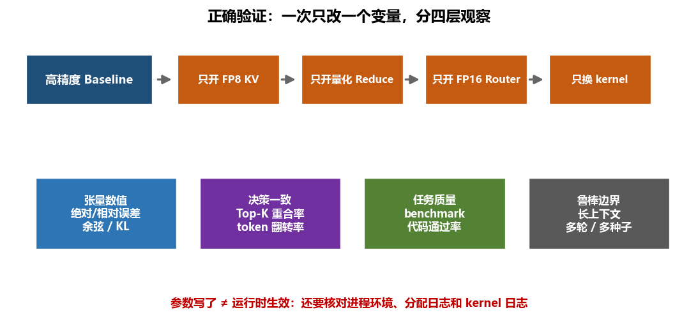

*Source #3, Figure 7. Hold the workload constant, enable one optimization per experiment, and inspect numerical, decision, task, and robustness layers.*

#### 1. Lock the baseline

Fix the same weights and tokenizer, prompts, decoding parameters, random seed, batch shape, context length, output length, software versions, and actual loaded module paths.

#### 2. Enable one optimization at a time

```text
Baseline: BF16 KV + unquantized All-Reduce + FP32 Router
Experiment A: enable only FP8 KV
Experiment B: enable only Quick Reduce quantization
Experiment C: enable only the FP16 Router
Experiment D: switch only the Prefill / Decode kernel
```

#### 3. Evaluate four layers

| Layer | Suggested measures |
|---|---|
| Tensor values | Maximum absolute error, relative error, cosine similarity, KL divergence |
| Decisions | Router Top-K overlap, token flip rate, MTP accepted length |
| Task quality | Benchmark score, code-execution pass rate, human quality review |
| Robustness boundary | Long contexts, multi-turn interactions, different batches, different random seeds |

Methods and denominators must be explicit. A token flip rate needs a token denominator; Top-K overlap needs a declared K and sample count; task pass rate needs the exact completed-item denominator rather than an intended workload size.

#### 4. Verify that the runtime actually enabled the path

Do not stop at a launcher script. Check the live process environment, allocation logs, kernel logs, and loaded module path. A parameter proves that a path was requested, not that the runtime dispatched it.

### Five Misconceptions

| Misconception | Correction |
|---|---|
| Equal benchmark scores prove equal numbers | A task score covers that dataset; it cannot establish bitwise tensor equality |
| No garbled output means no precision loss | Absence of a visible failure does not rule out rare decision changes |
| FP8 KV cache makes all Attention arithmetic FP8 | Storage, multiplication, accumulation, Softmax, and output may use different types |
| FP32 Router output means the Router computed entirely in FP32 | Inputs or weights may already have been cast to BF16 or FP16 |
| An INT8 configuration guarantees INT8 communication | Follow the enum into the codec dispatch; in the exact versions above, numeric value `1` selects FP8 |

### Three Points to Retain

**Location:** storage, computation, communication, and routing are independent numerical entry points.

**Boundary:** an error entry point does not establish an observed quality regression, while a stable score does not establish zero impact.

**Method:** lock a high-precision baseline, enable one optimization at a time, and check tensors, decisions, task quality, and long-context robustness separately.

### Public Sources

1. PyTorch, Numerical Accuracy: floating-point ordering and platform differences  
   https://docs.pytorch.org/docs/stable/notes/numerical_accuracy.html

2. NVIDIA Transformer Engine, FP8 Primer  
   https://docs.nvidia.com/deeplearning/transformer-engine/user-guide/examples/fp8_primer.html

3. Public SGLang fork snapshot: fresh BF16, cached FP8, and the FlyDSL Prefill path  
   https://github.com/sammysun0711/sglang/blob/b0f860b81104eb3e9aae40cce391e56443e2d688/python/sglang/srt/layers/attention/aiter_utils.py

4. Public SGLang fork snapshot: BF16 activation, FP16 Router weights, FP32 accumulation and output  
   https://github.com/sammysun0711/sglang/blob/b0f860b81104eb3e9aae40cce391e56443e2d688/python/sglang/srt/layers/moe/mixed_router_gemm.py

5. Public SGLang fork snapshot: the configuration layer assigns numeric value `1` to `INT8`  
   https://github.com/sammysun0711/sglang/blob/b0f860b81104eb3e9aae40cce391e56443e2d688/python/sglang/srt/distributed/device_communicators/quick_all_reduce.py

6. Exact AITER commit: the implementation layer maps numeric value `1` to the FP8 codec  
   https://github.com/ROCm/aiter/blob/3f4ab482a2986919c784e469e23cfac7f93bb153/csrc/include/quick_all_reduce.cuh
<!-- SOURCE-END-EN id=03 -->

---

<!-- SOURCE-BEGIN-EN id=06 source=06_mtp_nongreedy_fix_article.md sha256=34647915b90c67434549d968fc5a006c4c5238c67aea259950e12b16798ddde7 body_sha256=239fd92e8c84623b1c55ed4e8c48a5cf1ca63769d4a6ce12ba224837daea5355 -->
## Source #6: You Set `temperature=1`, but MTP Verification Still Runs Greedy

The server starts, MTP emits tokens, and the logs contain no error. Yet a non-greedy request on HIP can still be sent silently through a greedy verifier. Public commit `878fff156` is a useful case study in a defect that preserves liveness while changing algorithm semantics.

### The Defect in One Path

This was not a failure to run speculative decoding. It was a semantic fallback:

```text
The request specifies non-greedy sampling
          ↓
The HIP / ROCm path lacks a corresponding stochastic verifier
          ↓
The program does not fail; it continues through greedy verification
          ↓
The sampling semantics of temperature, top-k, and top-p are not carried correctly into verification
```

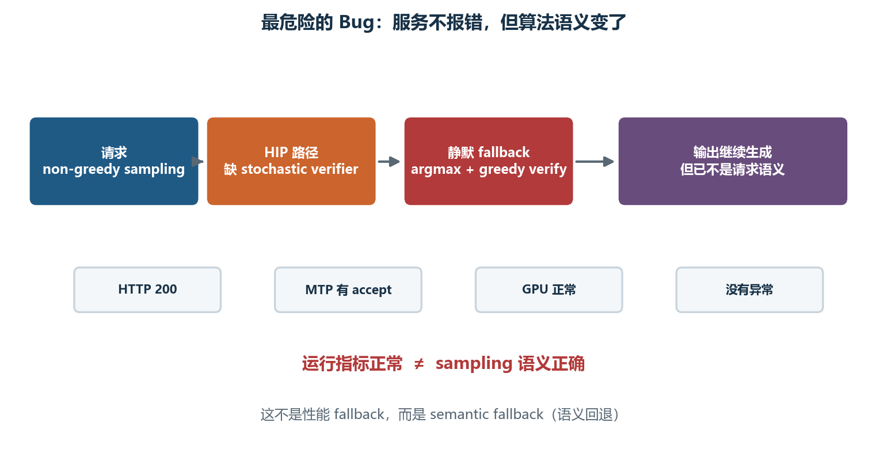

*Source #6, Figure 1. The service stays healthy while the requested sampling method is replaced by another method.*

The path is difficult to detect because HTTP responses, MTP acceptance metrics, GPU utilization, and even generation speed can all look normal. The control flow works; the algorithm executed is not the one requested. That is a **semantic fallback**, not merely a performance fallback.

### What MTP and EAGLE Do

Standard autoregressive generation normally asks the Target model to determine one new token per forward pass:

```text
Target forward → 1 new token → Target forward → 1 more new token
```

MTP and EAGLE let a cheaper Draft path propose several following tokens, then ask the Target to verify those candidates in one pass.

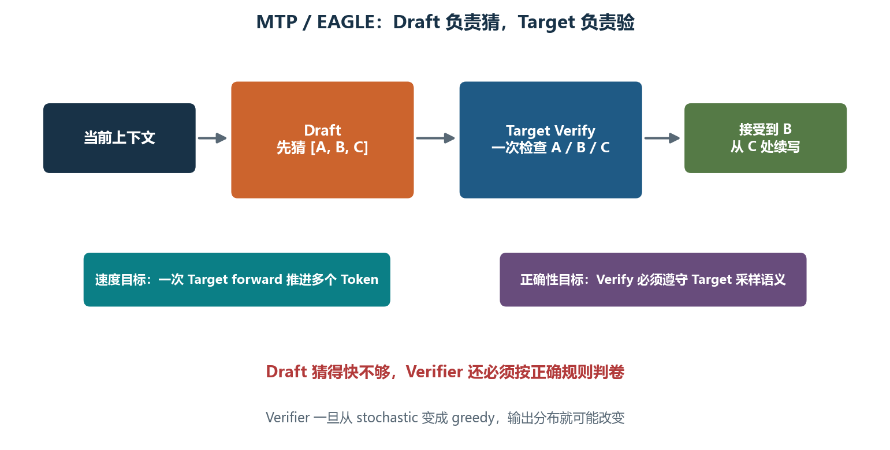

*Source #6, Figure 2. Speculation saves Target work only when verification still enforces the Target distribution.*

```text
Draft: I predict the next tokens are [A, B, C]
Target: I inspect them in one pass and determine how far A/B/C can be accepted
```

If all three pass, one Target forward advances several tokens. If verification rejects a candidate, generation resumes from that point under the Target's rules.

| Stage | Responsibility |
|---|---|
| Draft | Propose candidates quickly and make several useful guesses |
| Verify | Apply the Target's actual acceptance, rejection, and final-sampling rules |

A fast Draft is insufficient. Verify is the component that preserves the Target's sampling semantics.

### Greedy and Non-greedy Define Different Distributions

Assume the Target assigns these probabilities to the next token:

```text
A: 50%
B: 30%
C: 20%
```

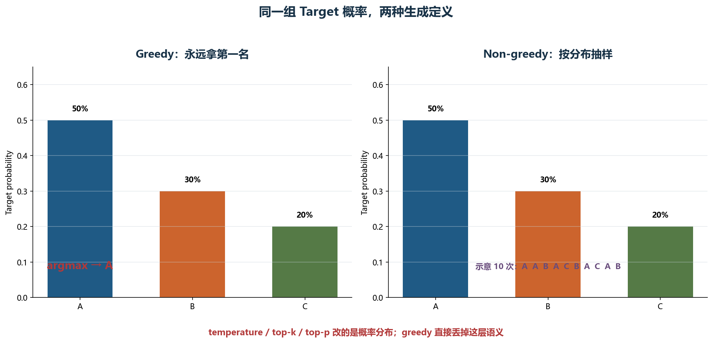

*Source #6, Figure 3. Greedy always selects the maximum; non-greedy samples from the effective probability distribution.*

#### Greedy

Greedy always takes A:

```text
argmax([0.5, 0.3, 0.2]) = A
```

The selection rule remains “take the highest-probability candidate” on every repeat.

#### Non-greedy

Stochastic sampling produces frequencies that approach the distribution over repeated draws:

```text
A appears about 50% of the time
B appears about 30% of the time
C appears about 20% of the time
```

`temperature` changes how peaked the distribution is. `top-k` and `top-p` remove candidates and then renormalize the survivors. In the measured configuration discussed here, `temperature=1.0` was a non-greedy request. More generally, the classification depends on the complete sampling configuration, not one number.

The distinction is not “more or less randomness.” Greedy and non-greedy define different output distributions.

### The Two Different Meanings of Top-K

The fix has a narrow scope:

```text
MTP topk=1 (tree_topk)
```

That does not make Target sampling greedy. Two different parameters happen to contain “top-k”:

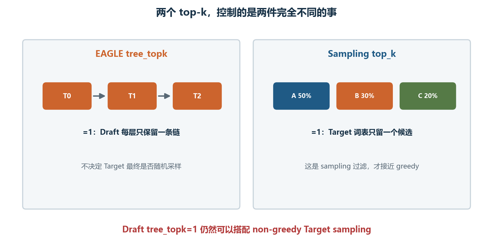

*Source #6, Figure 4. `tree_topk=1` narrows the Draft tree; sampling `top_k=1` narrows the Target vocabulary distribution.*

| Name | What it controls | Meaning of `=1` |
|---|---|---|
| `speculative_eagle_topk` / `tree_topk` | Number of Draft branches retained at each tree level | Follow one Draft chain per level |
| Sampling `top_k` | Number of vocabulary candidates retained for final Target sampling | Retaining only the top candidate approaches greedy behavior |

With `tree_topk=1`, the Draft candidates form one chain:

```text
Token1 → Token2 → Token3
```

The Target is still free to verify and emit under a non-greedy distribution. These settings are compatible:

```text
Draft tree_topk = 1
Target sampling = non-greedy
```

That combination is exactly the narrow case addressed by commit `878fff156`.

### The Faulty Branch

Before the fix, the EAGLE V2 sampling decision can be summarized as:

```python
if sampling_info.is_all_greedy or _is_npu or _is_hip:
    target_predict = torch.argmax(next_token_logits, dim=-1)
    verify_tree_greedy(...)
else:
    # stochastic verification
```


*Source #6, Figure 5. On this code path, HIP alone is sufficient to select `argmax` and `verify_tree_greedy`, regardless of the non-greedy request.*

The final `_is_hip` means:

```text
Whenever execution is on HIP
→ regardless of whether the request is non-greedy
→ enter argmax + the greedy verifier
```

The requested `temperature`, sampling `top_k`, and `top_p` do not receive their intended role in that verification branch.

#### Why the fallback existed

The commit notes indicate that the HIP path lacked the target-only stochastic verifier already available on CUDA. Faced with an unimplemented backend path, the code continued with an existing greedy verifier. That may preserve service availability, but it changes the request contract.

A safe unsupported path should do at least one of three things: implement a semantically equivalent fallback, fail explicitly with an unsupported-semantics error, or issue a prominent downgrade warning that requires a conscious decision. Silent substitution is the dangerous case.

### Why Accuracy and Comparability Can Change

The branch is correct when the request itself is greedy. For a non-greedy request, however, a greedy verifier can change the Draft acceptance and rejection path, the replacement token sampled by Target after rejection, all later context, and ultimately the tool calls and control flow of an Agent task.

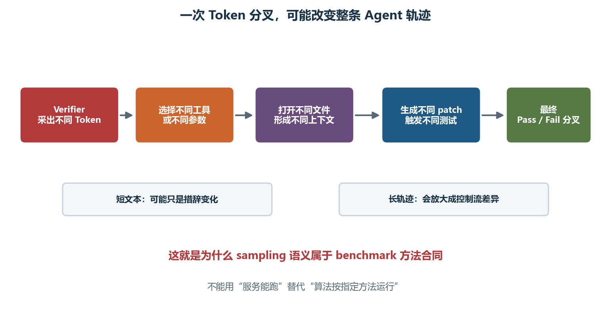

*Source #6, Figure 6. A small sampling-path difference can become a different tool choice, patch, test path, and terminal pass or fail result.*

```text
A different tool is selected
→ a different file is opened
→ a different patch is produced
→ different tests are triggered
→ the final Pass / Fail outcome changes
```

For short prose, a divergence may only change wording. In a long Coding Agent trajectory, it can alter the business result. The same model, prompt, and temperature therefore do not establish a comparable method across backends. Parameters in a request are not proof that every backend executed the same semantics.

### What Commit `878fff156` Changed

The public commit title is `bugfix(MTP): Fix HIP non-greedy EAGLE verification for MTP topk=1 (tree_topk) speculative decoding`.

It changes two files:

```text
python/sglang/srt/environ.py
python/sglang/srt/speculative/eagle_utils.py
```

The patch size is:

```text
215 insertions
1 deletion
```

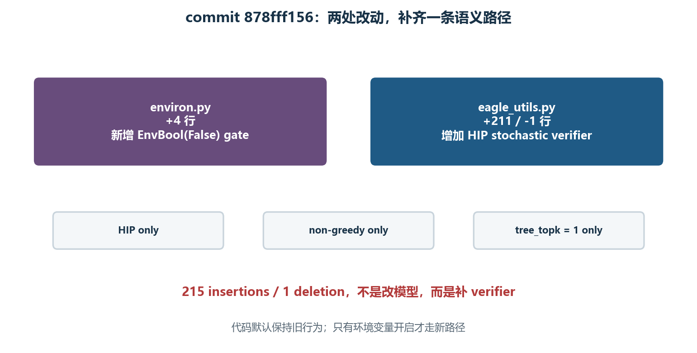

*Source #6, Figure 7. The commit introduces an environment gate and a HIP Torch/Python stochastic verifier rather than changing all speculative paths.*

#### Change one: an environment gate

```python
SGLANG_MIMO_EAGLE_HIP_NONGREEDY_VERIFY = EnvBool(False)
```

The global declaration defaults to `False`, preserving the former behavior unless the operator explicitly sets:

```bash
export SGLANG_MIMO_EAGLE_HIP_NONGREEDY_VERIFY=1
```

#### Change two: a Torch/Python stochastic verifier for HIP

The new path requires all four conditions:

```python
use_hip_py_stochastic_verify = (
    _is_hip
    and not sampling_info.is_all_greedy
    and envs.SGLANG_MIMO_EAGLE_HIP_NONGREEDY_VERIFY.get()
    and verify_input.tree_topk == 1
)
```

In plain terms: the backend is HIP, the request is non-greedy, the environment gate is enabled, and the Draft tree keeps exactly one branch per level. If any condition is false, this new verifier does not run. The evidence and claim scope must remain **HIP + non-greedy + `tree_topk=1` + gate enabled**, not “MTP was fixed everywhere.”

### How the New Verification Path Works

The change is not a simple replacement of `argmax` with `torch.multinomial`. It implements the target-verification sequence.

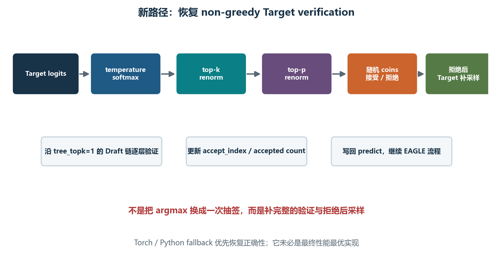

*Source #6, Figure 8. Temperature and truncation define the Target distribution, Draft tokens are checked in sequence, and rejection resumes from Target sampling.*

#### 1. Apply temperature

```python
target_probs = softmax(next_token_logits / temperature)
```

Temperature changes the shape of the probability distribution.

#### 2. Apply top-k and top-p in the declared order

The commit comments specify:

```text
Apply top-k renormalization first
Then apply top-p renormalization
```

The survivors are renormalized into the effective Target distribution.

#### 3. Verify the Draft chain one level at a time

Because `tree_topk=1`, the Draft structure is a single chain. The verifier uses pre-generated random values called `coins` in the code, together with Target probabilities and an acceptance threshold, to accept or reject each candidate.

#### 4. Resample from the Target distribution after a rejection

Once a Draft token is rejected, the verifier cannot continue down the old chain. It samples a replacement from the adjusted Target weights. That step restores non-greedy semantics.

#### 5. Write the established output contract

The helper updates:

```text
predict
accept_index
num_correct_drafts
```

The rest of the EAGLE flow can then consume the same output tensors.

### Why the Fallback Uses Torch and Python

CUDA already had a target-only stochastic verifier; this HIP stack did not have an equivalent kernel. The commit uses PyTorch tensor operations such as sorting, cumulative sums, `masked_fill`, scatter, and sampling from a CDF with random values.

The immediate benefit is correctness availability:

```text
No need to wait for a new HIP kernel
Restore non-greedy semantics first
```

The explicit limitation is performance:

```text
It is not necessarily the final performance-optimal implementation
```

That explains the opt-in default. The change supplies a correctness path first; it does not claim to be the final optimized HIP kernel.

### Correct Enablement and Runtime Verification

Set the environment variable before starting the SGLang service:

```bash
export SGLANG_MIMO_EAGLE_HIP_NONGREEDY_VERIFY=1

python3 -m sglang.launch_server \
  ... \
  --speculative-algorithm EAGLE \
  --speculative-eagle-topk 1 \
  --enable-multi-layer-eagle
```

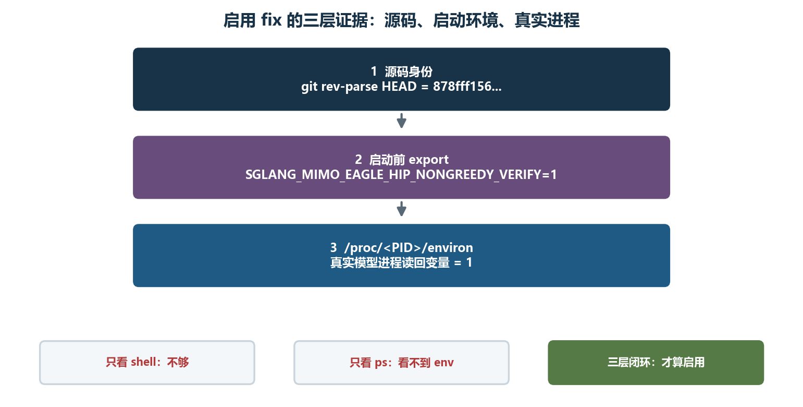

*Source #6, Figure 9. A reliable enablement check combines source identity with the live model process environment; the launcher alone is insufficient.*

#### 1. It is not a command-line argument

The environment gate does not appear in the `ps` process command line. This check is therefore insufficient:

```bash
ps -ef | grep sglang.launch_server
```

#### 2. Inspect the actual model process environment

Read the exact variable from the model PID:

```bash
tr '\0' '\n' < /proc/<MODEL_PID>/environ \
  | grep '^SGLANG_MIMO_EAGLE_HIP_NONGREEDY_VERIFY='
```

The expected value is:

```text
SGLANG_MIMO_EAGLE_HIP_NONGREEDY_VERIFY=1
```

This verifies that the live process inherited the gate. It still does not prove that a particular request met every branch condition, so request-level logs or instrumentation remain valuable.

#### 3. Lock the source identity as well

The same variable has no behavioral effect in older code that lacks the gate and verifier. Record the source revision:

```bash
git -C /path/to/sglang rev-parse HEAD
```

Then confirm that revision contains both the new gate and the stochastic verifier.

### Global Default Versus Launcher Default

At commit `878fff156`, the framework declaration remains `EnvBool(False)`. Later public commit `b0f860b8` changes the accuracy-evaluation launcher to:

```bash
export SGLANG_MIMO_EAGLE_HIP_NONGREEDY_VERIFY="${SGLANG_MIMO_EAGLE_HIP_NONGREEDY_VERIFY:-1}"
```

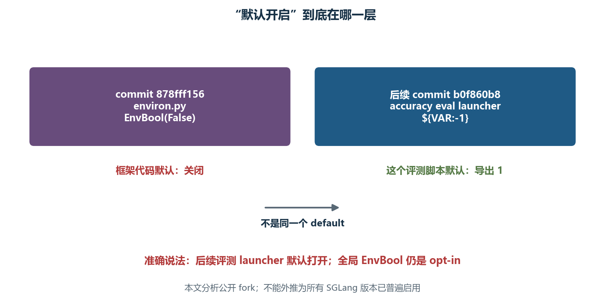

*Source #6, Figure 10. The two defaults live at different layers and must not be collapsed into “the feature is enabled by default.”*

| Layer | Default behavior |
|---|---|
| Global declaration in `environ.py` | `False` |
| Later accuracy-evaluation launcher | Exports `1` when the caller has not supplied an override |

The accurate statement is: the later evaluation launcher defaults this environment value to `1`; the framework-wide environment declaration remains opt-in. The analysis is bound to the public `sammysun0711/sglang` fork. At the time of the source audit, a search of the `sgl-project/sglang` default branch did not find the same gate, so this evidence does not establish general enablement in upstream SGLang.

### What One 499-Task Run Proves

One Coding Agent benchmark completed all 499 tasks with the fix-enabled path:

| Field | Result |
|---|---:|
| Scope | 499 tasks, one run |
| Pass | 366 |
| Fail | 133 |
| Score | 73.35% |
| Mean steps | 79.10 |
| MTP | EAGLE, 3 steps, multi-layer |
| Draft tree | `speculative_eagle_topk=1` |

The denominator and arithmetic are explicit: `366 + 133 = 499`, and `366 / 499` is reported as `73.35%`. Three independent data surfaces reconciled to the same denominator:

```text
trajectory: 499 tasks
reward: 499 tasks
results: 499 tasks
```

There were no empty statuses, and the independently recomputed counts matched the reported output.

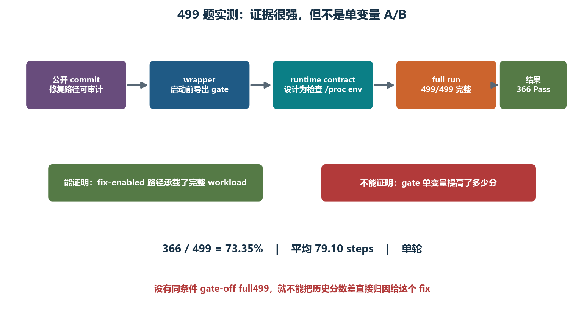

*Source #6, Figure 11. The run proves that the fix-enabled path carried a complete workload and produced an auditable one-run result.*

The run assets also include a wrapper that exports the gate before service startup, a runtime validator designed to read `/proc/<pid>/environ`, a delivery bundle that seals the corresponding SGLang commit, and a complete 499-task result audit.

#### What it does not prove

It does not support this causal claim:

```text
Enabling the fix improves the score by X percentage points
```

There is no full499 control run under identical conditions with only the gate changed from `0` to `1`. Historical runs also differed in MTP enablement, radix cache, runtime epoch, or other factors. Subtracting their scores would confound those differences with the commit.

The defensible conclusion is narrower: a fix-enabled path completed one 499-task workload and returned an auditable result. The evidence does not quantify a single-variable score benefit. `366/499 = 73.35%` is one observed run, not a causal A/B result and not a stability distribution.

### A Rigorous A/B Design

At least three groups are needed to answer what the fix changes:

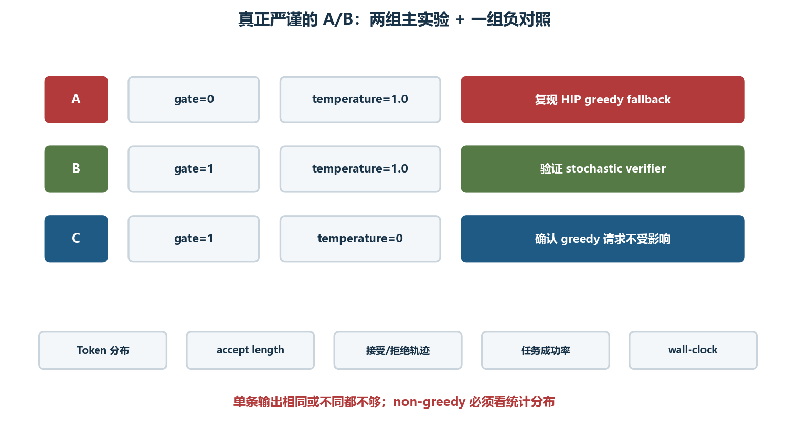

*Source #6, Figure 12. A and B isolate the non-greedy gate; C is the negative control that should preserve the greedy path.*

| Group | Gate | Temperature | Purpose |
|---|---:|---:|---|
| A | 0 | 1.0 | Reproduce the silent HIP greedy fallback |
| B | 1 | 1.0 | Exercise the stochastic verifier |
| C | 1 | 0 | Confirm that a greedy request remains unaffected |

Hold constant the commit, model and weights, prompt set, Draft configuration, sampling `top_k` and `top_p`, seed policy, backend and hardware, and service-start epoch.

#### One output is not a distribution test

Non-greedy generation is stochastic. A different result for one prompt does not prove correctness; an identical result for one prompt does not prove the gate was inactive. Inspect multiple surfaces:

```text
Output-token distribution
Accepted-length distribution
Draft accept / reject trajectory
Final task success rate
End-to-end wall-clock time
```

Each metric needs its own denominator: generated-token count, verification events, completed tasks, and elapsed wall-clock boundaries respectively.

#### The greedy control must remain stable

Group C is the negative control. When the request is already greedy, enabling the gate should not alter the selected path. A change in C would indicate that the implementation escaped its intended scope.

### Why Semantic Fallbacks Are Harder Than Crashes

A crash tells the operator that a path is unavailable. A semantic fallback encourages a false chain of equivalence:

```text
The service runs
≈ the configuration took effect
≈ the algorithmic semantics match
```

None of those equivalences is valid.

#### Configuration presence is not branch execution

`temperature=1.0` in the request proves what the caller asked for. It does not prove that the backend supports the semantics, that the stochastic verifier was selected, or that a fallback did not replace it with `argmax`.

#### Healthy metrics are not semantic evidence

Acceptance length, throughput, and GPU utilization are runtime metrics. They do not establish the sampling distribution.

#### Equal parameters across platforms do not establish equal methods

CUDA had a stochastic verifier while the old HIP path forced greedy. Even identical command lines could execute different algorithms. Benchmark comparability requires this full chain:

```text
Parameters match
→ code branches match
→ algorithmic semantics match
→ only then are the results comparable
```

### Five Misconceptions

| Misconception | Correction |
|---|---|
| MTP emits tokens, so MTP is correct | Liveness proves that control flow works, not that verification semantics are correct |
| `tree_topk=1` means greedy sampling | It limits Draft-tree width; it is not Target sampling `top_k` |
| A temperature in the request guarantees temperature sampling | The backend may lack support or silently fall back |
| Setting the environment variable proves enablement | Verify the live model process environment and source commit |
| `366/499` proves the fix improved accuracy | It proves a complete fix-enabled run, not a single-variable A/B effect |

### Four Points to Retain

1. Draft proposes candidates; Verify must preserve the Target's actual sampling semantics.
2. The old HIP branch silently sent non-greedy requests into `argmax` plus a greedy verifier. That is a semantic fallback.
3. Commit `878fff156` adds an opt-in Torch stochastic verifier only for HIP, non-greedy requests, and `tree_topk=1`.
4. Verification requires source identity, live process environment, branch conditions, and output distributions, not just a command line and service health.

The shortest useful rule is: the decisive evidence is the algorithm branch that ran, not the parameter that was written.

### Public Sources

1. HIP non-greedy EAGLE verification fix  
   https://github.com/sammysun0711/sglang/commit/878fff15647fe3dabb32aa3a335b0ad16e3ee878

2. Raw patch for the same commit  
   https://github.com/sammysun0711/sglang/commit/878fff15647fe3dabb32aa3a335b0ad16e3ee878.patch

3. Later commit that defaults the evaluation launcher's gate to enabled  
   https://github.com/sammysun0711/sglang/commit/b0f860b81104eb3e9aae40cce391e56443e2d688

4. Official SGLang repository  
   https://github.com/sgl-project/sglang

5. EAGLE: Speculative Sampling Requires Rethinking Feature Uncertainty  
   https://arxiv.org/abs/2401.15077

6. Fast Inference from Transformers via Speculative Decoding  
   https://arxiv.org/abs/2211.17192
<!-- SOURCE-END-EN id=06 -->

---

<!-- SOURCE-BEGIN-EN id=07 source=07_online_offline_rl_article.md sha256=1ba5832338f6694084680e18c25648e4ef4d6ed08015d84b75dc547fbb264c36 body_sha256=83471988d18ce5d974c0641081178c11ff99c1ea763e9793102b76a4908152f5 -->
## Source #7: Where Is “Online” in Online RL? Four Concepts Through One Test Car

Online versus Offline and On-policy versus Off-policy are different axes. The test-car example makes the distinction concrete: one axis asks whether the current policy can obtain new feedback from the target environment; the other asks which policy produced the training experience. The same definitions then set precise boundaries for Agent Lightning and Microsoft Foundry.

### The Two Axes

The similar-looking `on / off` pairs answer different questions:

```text
Online / Offline
Question: During training, can the current policy still obtain new interactions and rewards from the target environment?

On-policy / Off-policy
Question: Was the data used to train the current policy generated by the current policy itself?
```


*Source #7, Figure 1. Online or Offline asks whether new feedback can return; On-policy or Off-policy asks who generated the experience.*

The axes are independent. Online RL can be On-policy or Off-policy. Offline RL normally operates on Off-policy data. “Online customer data” is not the definition of Online RL, and a file stored offline is not sufficient to make an algorithm Offline RL.

### A Test-Car World and Its Terms

| RL term | Test-car interpretation |
|---|---|
| Policy / Actor | The current driving model |
| Environment | The test road, traffic rules, and other vehicles |
| Observation / State | Sensor data actually available to the car / the environment's complete true state |
| Action | Accelerate, brake, or steer |
| Reward | A combined score for safety, arrival, comfort, collision, and other declared objectives |
| Rollout | A trajectory produced by interaction between the current policy and environment; it may terminate naturally or be truncated |

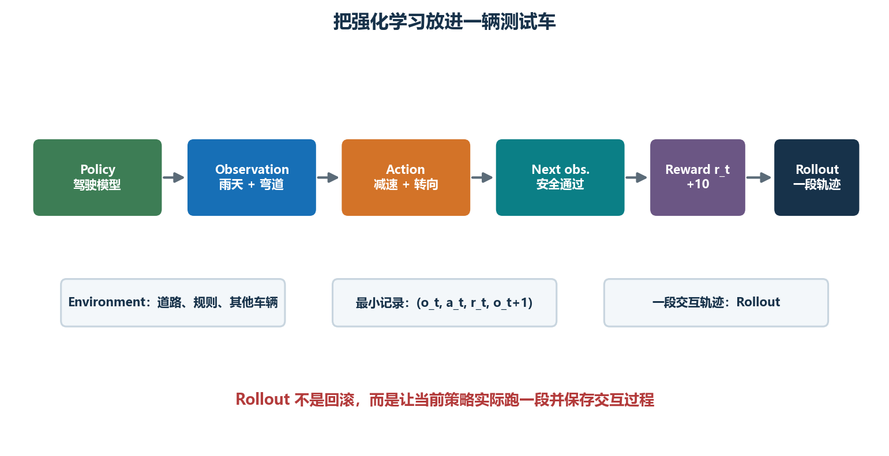

*Source #7, Figure 2. The car receives observations rather than necessarily observing the environment's full state.*

Real autonomous driving is better modeled as a **POMDP**, a partially observable Markov decision process. The road has a complete `State`, but the car usually receives only the `Observation` exposed by cameras, radar, and other sensors. To keep the notation readable, `o` below denotes the observation available to the car.

A minimal transition is:

```text
Observation o_t: Rain, a curve ahead, current speed 45 km/h
Action a_t: Slow to 30 km/h and turn right
New observation o_{t+1}: Safely navigated the curve
Reward r_t: +10 under the current Reward rules
```

A longer experience may be:

```text
Start
→ detect a red light
→ brake
→ wait for a green light
→ turn
→ avoid a pedestrian
→ reach the destination
→ the Return for the full trajectory is 86 points
```

Executing and recording one such interaction sequence is a **Rollout**. It need not reach a natural terminal state; a maximum-step limit, timeout, or safety-system interruption can produce a truncated Rollout.

`r_t` is the single-step Reward. The Return accumulates rewards over the trajectory, commonly as:

$$
G_t = \sum_{k=0}^{T-t} \gamma^k r_{t+k}
$$

### Online RL: the Current Car Can Collect New Feedback

Online RL does not mean that data came from online users or that weights update every second. Its defining loop is:

```text
The current driving model proposes a new action
        ↓
Execute it in the target environment or a high-fidelity controlled environment
        ↓
The environment returns a new observation; the frozen Reward rules compute a score
        ↓
This new experience is used for subsequent training
```

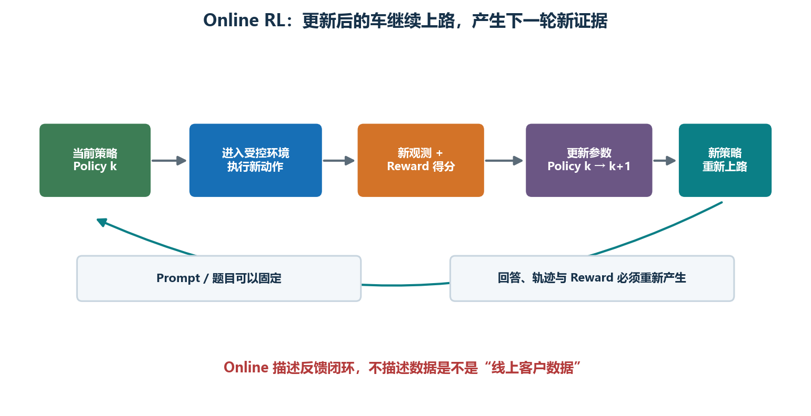

*Source #7, Figure 3. Updated behavior re-enters the target or high-fidelity controlled environment and produces new observations and rewards.*

Suppose driving model 1.0 becomes 2.0. Version 2.0 then tries a new deceleration policy on a wet curve in a high-fidelity simulator or closed test track, receives new skid feedback, and is scored by the frozen Reward rules. The updated policy has changed what the next training data looks like.

The car is a teaching abstraction for a control problem. Real autonomous-driving development normally validates in simulators, closed tracks, and controlled fleets before public-road use; it does not give production vehicles unconstrained exploration authority.

#### A fixed prompt set can still support Online RL

An LLM training run can reuse a fixed set of prompts while remaining Online if every round executes this loop:

```text
The same prompt set
→ the current model generates new responses or tool trajectories
→ tests / Grader / environment assign new scores
→ new responses and new Rewards flow back into training
```

The fixed questions do not determine the classification. The deciding fact is whether current-policy behavior obtains new environment feedback that returns to training.

### Offline RL: Learning Only from a Frozen Experience Set

Offline RL does not mean “no teacher” or “no reward.” A classical Offline RL dataset contains transitions such as:

```text
(state, action, reward, next_state)
```

Its constraint is that training no longer collects new interactions from the target environment.

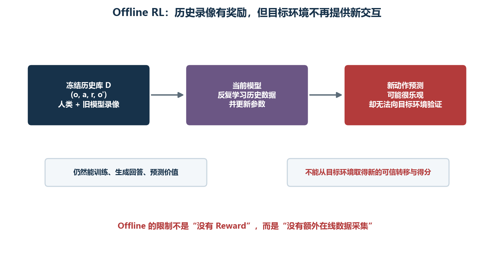

*Source #7, Figure 4. The policy may change, but the evidence set remains a frozen collection generated earlier.*

For the car, the available library might contain:

```text
Recordings from human drivers
Recordings from an earlier driving model
State, action, and reward at every step
Accident and takeover records
```

The current model can update its parameters, train repeatedly over those records, estimate the value of a new action, propose a driving plan, or even use a world model to synthesize trajectories. What it cannot do is send its newly proposed action back into the target environment, obtain a new trusted transition, score it under the frozen Reward rules, and add that result to the evidence set.

That is the central Offline RL difficulty: the model can become overconfident about actions outside the historical data distribution without timely correction through real interaction. Conservative Q-Learning and related methods are deliberately conservative to mitigate that distribution shift.

### On-policy: the Current Driver Learns Mainly from Its Own New Experience

Let the current driving policy be `πₖ`:

```text
πₖ itself takes to the road
→ generates a fresh batch of Rollouts
→ use this batch to update πₖ
→ obtain πₖ₊₁
→ πₖ₊₁ returns to the road
```

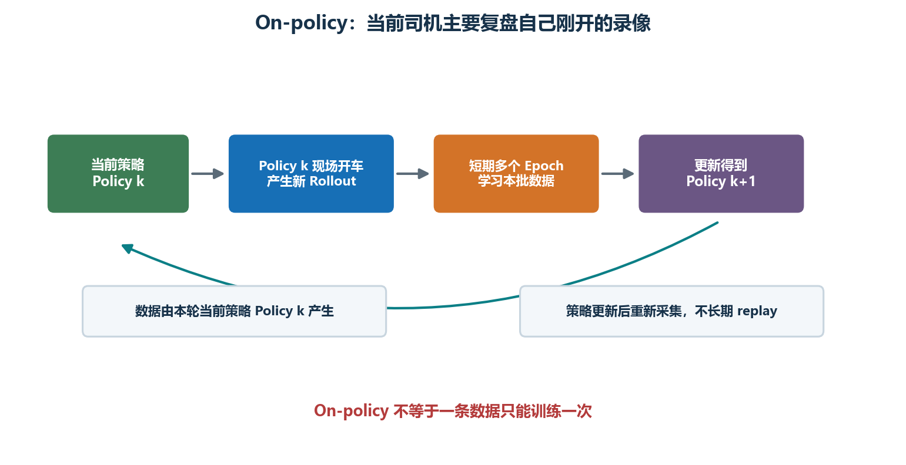

*Source #7, Figure 5. `πₖ` generates the fresh batch used to update it into `πₖ₊₁`.*

This is On-policy because the data comes from the current policy targeted by the update. There is no contradiction in this sequence:

```text
πₖ generates data
→ use the data for an update
→ obtain πₖ₊₁
```

`πₖ₊₁` does not exist before the update and therefore cannot have generated the batch. “On-policy” means that the current `πₖ` at the start of the update generated it.

#### On-policy does not require single-use samples

PPO commonly divides a fresh Rollout batch into mini-batches and trains for several epochs. It is still generally classified as On-policy because the batch serves the current update over a short window rather than entering a long-lived replay pool sampled by many later policy generations.

### Off-policy: the Current Driver Can Learn from Other or Older Drivers

If the current model is version 2.0 but training also consumes:

```text
Historical recordings from version 1.0
Demonstrations from experienced human drivers
Trajectories from other models
Fresh recordings just generated by version 2.0
```

then the behavior that generated the data is not restricted to the current target policy. That is Off-policy.

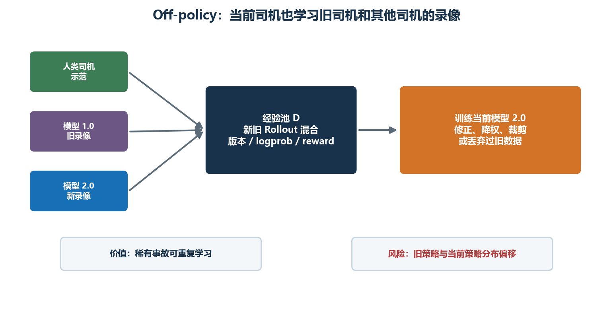

*Source #7, Figure 6. Off-policy permits experience not generated by the current policy; it does not mean that every sample must come from someone else.*

The old experience can come from another actor or from an earlier version of the same model.

#### Why version 2.0 may still learn from version 1.0

A parameter update is usually one step forward, not proof that all earlier experience has been absorbed. Old trajectories can retain stable environmental facts:

```text
Late braking at this wet intersection causes skidding
Pedestrians frequently emerge from this blind spot
This pattern of repeated lane changes triggers a takeover
```

Reusing Rollouts has three practical benefits: one training pass may not fully learn every case, rare events such as accidents deserve repeated attention, and recreating a collision or an expensive tool trajectory can be costly.

Reuse still needs boundaries. If environment rules change, data should be discarded or relabeled. If Reward rules change, data should be rescored or versioned into a new dataset lineage. If an old policy is too far from the current policy, its data may need correction, down-weighting, clipping, or removal. Excessive reuse can overfit. These are reasons Off-policy methods use tools such as Importance Sampling, conservative estimation, and Replay Buffer eviction policies.

### The Four Combinations

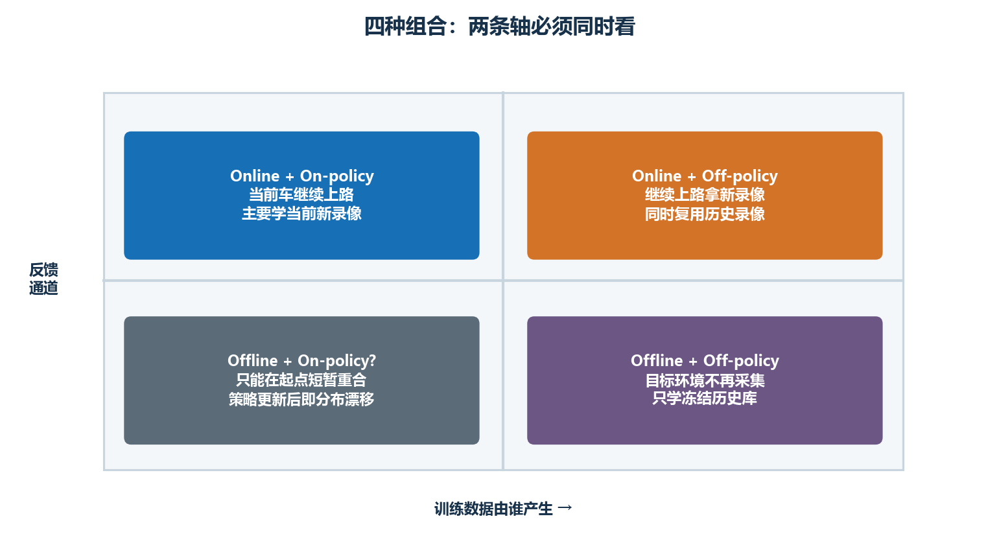

*Source #7, Figure 7. Online and Off-policy can coexist because an experience pool can keep receiving new current-policy evidence while retaining older evidence.*

| Combination | Test-car training behavior | Typical interpretation |
|---|---|---|
| Online + On-policy | The current car keeps driving and learns mainly from its fresh Rollouts | Common PPO and GRPO path |
| Online + Off-policy | The current car keeps driving while training also reuses new and old experience from a replay pool | Common DQN and SAC path |
| Offline + Off-policy | The test environment supplies no new interaction; training uses a frozen historical library | CQL, IQL, and related methods |
| Offline + On-policy | A narrow coincidence can exist at the initial policy, but after an update the fixed dataset no longer comes from the current policy | Not a common stable category |

After the policy changes, the decisive contrast is:

```text
Online Off-policy:
Continue learning from old recordings + keep sending the new model into the environment + keep adding new recordings to the experience pool

Offline RL:
Repeatedly learn from a fixed recording library + prevent the new model from obtaining new real trajectories from the target environment
```

Both may use old data. Only the Online Off-policy pool keeps receiving new target-environment evidence.

### Rollout, Epoch, and Rollback

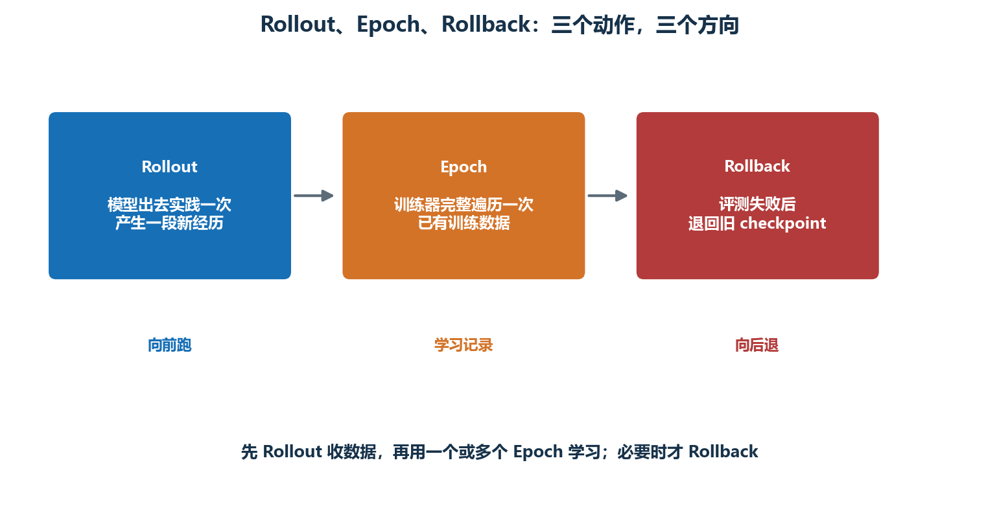

*Source #7, Figure 8. The three terms describe different directions and different objects.*

#### Rollout: execute one trajectory

```text
A car's trajectory from departure to task completion
or an Agent's trajectory from receiving a question through completing tool calls
```

A Rollout produces training experience.

#### Epoch: traverse the existing training set once

For 1,000 collected Rollouts:

```text
One complete pass through these 1,000 records = 1 Epoch
One more complete pass                       = Epoch 2
```

An Epoch consumes existing training data. In practice it is usually split into mini-batches and many gradient updates.

#### Rollback: restore an earlier version

If evaluation fails after an update and deployment returns to a prior checkpoint, that operation is a Rollback.

The distinction is compact: a Rollout moves forward through an experience, an Epoch learns through recorded experiences, and a Rollback moves the deployed model back to an earlier version.

### Reward Is Required; a Reward Model Is Optional

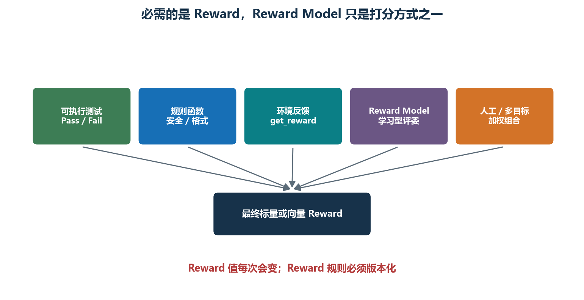

*Source #7, Figure 9. A learned Reward Model is one possible scorer, not a required role in every RL system.*

The car's Reward can combine collision, arrival, harsh braking, human intervention, comfort, time, and energy rules. An LLM Agent can receive Reward from unit tests, a mathematical answer checker, formatting rules, an environment's `get_reward()`, a learned Reward Model, or a weighted combination of reward functions.

The role boundary is:

```text
Reward: required learning signal
Reward Model: optional scorer
```

#### Reward values vary; Reward rules require versions

Different Rollouts naturally produce different Reward values. The grading rule, however, must not change silently within one formal training lineage.

```text
Reward v1 completes one training round
→ analyze the issues
→ release Reward v2
→ create a new training identity and evaluation baseline
```

Otherwise, an observed score change cannot be attributed to a better policy rather than a changed grader.

### Online RL Does Not Imply Training on Customer Secrets

Online RL can use public benchmarks, synthetic tasks, sandbox environments, author-created training scenarios, or authorized and de-identified data. “Online” describes the feedback loop, not the sensitivity classification.

When Rollouts come from a production customer Agent, they can contain:

```text
Prompts and context
Tool calls and return values
Internal code, orders, emails, or contracts
Model responses
Rewards and review results
```

Such data requires governance before training.

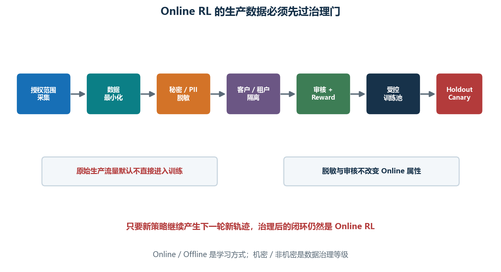

*Source #7, Figure 10. Authorization, minimization, de-identification, tenant isolation, controlled training, holdout evaluation, canary, and rollback are separate safeguards.*

A safe path is:

```text
Collect within authorized scope
→ minimize data
→ redact secrets / PII / business data
→ isolate customers and tenants
→ review and Reward
→ enter a controlled training pool
→ independent Holdout
→ Canary and rollback
```

Review and de-identification do not automatically turn Online RL into Offline RL. If an updated policy continues to create new trajectories and governed results continue to return to training, the loop remains Online.

### What Agent Lightning Implements at the Fixed Snapshot

The capability boundary is based on the Microsoft repository at this exact snapshot:

```text
microsoft/agent-lightning
commit d2c4d1f6307afd5948cd302a1928306d859daa06
```

The core VERL rhythm is:

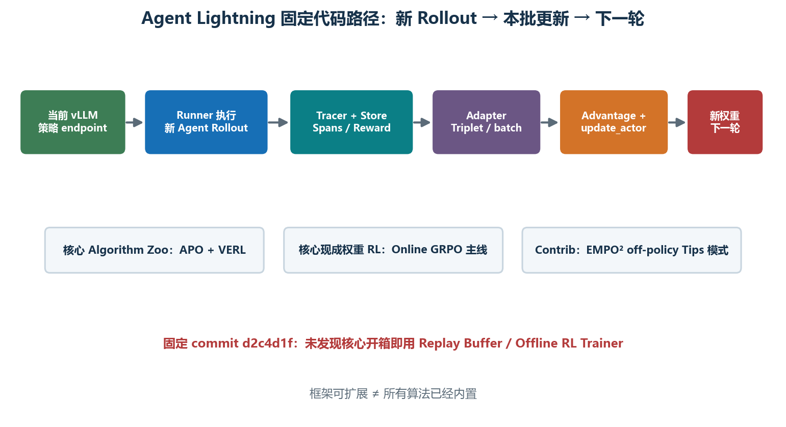

*Source #7, Figure 11. The current model generates new Agent trajectories and rewards before the actor is updated for the next round.*

```text
Current model / vLLM endpoint
→ Agent Runner executes a new Rollout
→ Tracer / Store collects spans and Reward
→ Adapter converts data into Triplet / train batch
→ clear_data_and_server clears daemon state for this batch
→ compute_advantage
→ update_actor
→ new weights enter the next round
```

The corresponding control path exposes these operations:

```text
run_until_all_finished()
get_train_data_batch(...)
clear_data_and_server()
compute_advantage(...)
update_actor(...)
```

This is an Online RL control flow: the current model executes Agent tasks, obtains new trajectories and Reward, and then updates weights.

#### Core ready-made path: Online GRPO and PPO-style training

At this snapshot, the core Algorithm Zoo lists APO for prompt optimization and VERL for weight RL. Official examples and configurations make extensive use of GRPO. The main path is On-policy or approximately On-policy Online RL: fresh Rollouts serve the current update rather than being sampled from a long-lived replay pool across many policy generations.

#### Contrib includes an Off-policy mode named EMPO²

The fixed snapshot's `contrib/env_verl` contains:

```text
empo2_train_mode = "off-policy"
```

This is a Contrib or experimental path organized around Tips and Online Self-Distillation. It is not evidence that the core Algorithm Zoo provides a general historical Replay Buffer implementation. In particular, the snapshot does not justify this claim:

```text
Agent Lightning already includes complete DQN / SAC / CQL / IQL capabilities
```

#### No ready-made Offline RL trainer in the fixed core snapshot

The Store can persist Rollouts and Spans, and the Algorithm interface permits customization. That architecture can host a user-implemented Off-policy or Offline algorithm. It does not mean the fixed core Algorithm Zoo contains an out-of-the-box Replay Buffer or Offline RL Trainer.

The bounded conclusion is: **Agent Lightning is an extensible training orchestration framework; its ready-made core weight-RL path at this snapshot is primarily Online GRPO, not a built-in catalog of every RL algorithm.**

### What Microsoft Foundry Custom Code Training Provides

Agent Lightning coordinates Agent execution, trajectories, algorithms, and resource updates. Microsoft Foundry Custom Code Training supplies a managed execution plane with a different responsibility boundary.

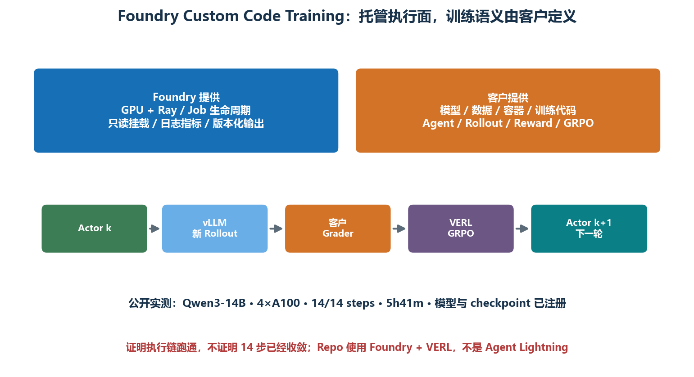

*Source #7, Figure 12. Foundry manages infrastructure and job lifecycle; customer code defines the model, environment, Rollout, Reward, and RL semantics.*

| Foundry provides | Customer provides |
|---|---|
| Managed GPUs and Ray | Model, data, and container |
| Job lifecycle and retries | Training code and parameters |
| Read-only input mounts | Agent and tool environment |
| Logs and metrics | Rollout and Reward or Grader |
| Checkpoint and model assets | GRPO, PPO, or other algorithm semantics |

A public measured repository completed one Foundry plus VERL path:

```text
Qwen3-14B
Single node with 4×A100 80GB PCIe
128 Prompts, 3 samples per Prompt (n=3 samples per prompt)
14 / 14 optimizer steps
4 validation runs
Foundry Job 5h41m
Model and checkpoint outputs are registered
```

The explicit workload denominators are 128 prompts, 3 samples per prompt, 14 completed optimizer steps out of 14 planned, and 4 validation measurements. The run proves that Custom Code Training executed and registered outputs for this customer-defined Online GRPO path on one node with four A100 80GB PCIe GPUs over 5 hours 41 minutes.

The four validation scores were:

```text
Before training: 0.05565
step 5: 0.05242
step 10: 0.05565
step 14: 0.05726
```

They fall, return to the starting value, and then rise slightly around a very low baseline. One 14-step run cannot separate that movement from run noise. It does not prove convergence, significant quality improvement, portability of the same configuration to another model or GPU, or use of Agent Lightning by that repository. The `4×A100`, `14/14`, and `5h41m` evidence proves execution-path completion only.

One final name boundary matters:

- **Foundry Managed Compute** is documented as managed inference deployment for open-source or community models.
- **Custom Code Training** runs customer-provided code for SFT or RL training.

The second is the managed training destination discussed here; the first is an inference-deployment capability.

### Ten Misconceptions

| Misconception | Correction |
|---|---|
| Online RL means training on live customer data | Online describes the interaction loop, not data source or sensitivity |
| Offline RL has no rewards | Frozen datasets commonly include Reward and can also use reward models |
| A model can generate a new answer, so training is Online | The answer must obtain new target-environment feedback that returns to training |
| Fixed prompts make RL Offline | Current-policy generations rescored each round can still be Online |
| Off-policy means only other people's data | It includes older versions of the same model and may mix current fresh data |
| Online Off-policy is the same as Offline RL | The former keeps adding new interactions; the latter freezes the dataset |
| Rollout means Epoch | A Rollout produces experience; an Epoch traverses existing data |
| Rollout means Rollback | One executes forward; the other restores an earlier version |
| A Reward Model is mandatory | Reward is mandatory; tests, rules, or environments can produce it |
| Agent Lightning has every RL algorithm built in | The fixed core path exposes APO and VERL; other capabilities must be stated against the actual snapshot |

### Five Points to Retain

1. Online or Offline asks whether the current policy can obtain new interaction and Reward from the target environment.
2. On-policy or Off-policy asks whether training data must have been generated by the current policy.
3. Online Off-policy mixes old experience with a stream of new experience; Offline RL learns only from a frozen dataset.
4. A Rollout executes one experience, an Epoch learns through recorded experience, and a Rollback restores an earlier model version.
5. Agent Lightning's ready-made core path at the fixed snapshot is primarily Online GRPO. Foundry Custom Code Training can host customer-defined Online RL, but customer code still owns the algorithm semantics.

The quickest classification test is to ask two questions in order: can new feedback return, and who produced the experience?

### Public Sources

1. Offline Reinforcement Learning: Tutorial, Review, and Perspectives on Open Problems  
   https://arxiv.org/abs/2005.01643

2. Conservative Q-Learning for Offline Reinforcement Learning  
   https://arxiv.org/abs/2006.04779

3. OpenAI Spinning Up: Proximal Policy Optimization  
   https://spinningup.openai.com/en/latest/algorithms/ppo.html

4. Hugging Face TRL: GRPO Trainer  
   https://huggingface.co/docs/trl/main/en/grpo_trainer

5. Microsoft Agent Lightning repository, audited snapshot `d2c4d1f`  
   https://github.com/microsoft/agent-lightning/tree/d2c4d1f6307afd5948cd302a1928306d859daa06

6. Agent Lightning: Bird's Eye View  
   https://github.com/microsoft/agent-lightning/blob/d2c4d1f6307afd5948cd302a1928306d859daa06/docs/deep-dive/birds-eye-view.md

7. Agent Lightning: Algorithm Zoo  
   https://github.com/microsoft/agent-lightning/blob/d2c4d1f6307afd5948cd302a1928306d859daa06/docs/algorithm-zoo/index.md

8. Measured Microsoft Foundry Custom Code Training repository at its public commit  
   https://github.com/david-xinyuwei/david-share/tree/2a73df5ea407a029eeb5f3cf62eb38e7564a3cc2/Deep-Learning/AI-Foundry-Custom-Code-Training

9. Microsoft Learn: Managed Compute overview  
   https://learn.microsoft.com/en-us/azure/foundry/concepts/managed-compute-overview

10. Microsoft Learn: Deploy open-source models with Managed Compute  
    https://learn.microsoft.com/en-us/azure/foundry/how-to/deploy-models-managed
<!-- SOURCE-END-EN id=07 -->

---

<!-- SOURCE-BEGIN-EN id=12 source=12_scaling_pitfalls_article.md sha256=3dfcf06afb8fde2f44477a8bdd008b19c4ede6ee2c0037f95450daef32367b65 body_sha256=09c34e91f64557201a2db576e5896f31122399d5a2b6f6b9fe2da2df10c3f722 -->
## Source #12: Three Denominator Traps in Cross-System Performance Comparisons

Both sides can report genuine numbers and use honest methods while arriving at conclusions that differ by multiples. The failure often sits in the denominator.

### A Comparison That Quietly Changes Meaning

Suppose one party reports `X` tok/s for a long-context workload. Another party measures `0.98X` on its own system and concludes that performance is effectively tied.

That conclusion fails if the first `X` is total throughput from 32 GPUs divided by 4 while `0.98X` is measured directly on 8 GPUs. The sentence “the two systems are tied” has silently become:

```text
8 GPUs ≈ 32 GPUs
```

No number was fabricated. The measurement procedure may be valid for its own purpose. The comparison changed the accounting basis. This pattern recurs in cross-platform, cross-team, and cross-vendor evaluations.

### Trap 1: Normalization

#### The pattern

A report labels a value “single-node throughput,” but the value is derived from a coordinated multi-node run:

```text
Equivalent throughput per node = measured total throughput of N nodes ÷ N
```

This can be a reasonable and necessary normalization. When model weights are sharded across nodes, one isolated node cannot load the model, so the full topology must run before total throughput can be divided by node count.

The problem is presentation: normalized per-node share and measured standalone-node throughput both appear as one tok/s number.

#### Why the two values are not equivalent

```text
True standalone-node measurement:
   One machine independently completes all work and is self-contained

N-node normalization:
   N machines collaborate, then the credit is divided evenly
```

The normalized share exists only while the other `N-1` nodes participate. It is not a topology that can run independently.

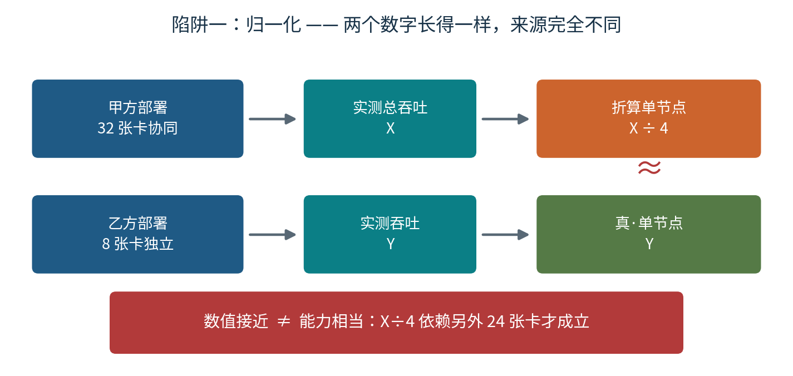

*Source #12, Figure 1. Normalization answers how a measured total is allocated; it does not recreate a standalone measurement.*

#### Three questions that identify the trap

| Question | Why it matters |
|---|---|
| Is the number measured or normalized? | A normalized value includes the benefit and cost of coordination |
| What denominator was used? | Division by 4 and division by 32 are different claims |
| What topology produced the total? | Different sharding and network topologies are not directly interchangeable |

The defensible wording is: **our measured single-node throughput is approximately equal to one `N`th of the other system's measured `N`-node total throughput.** This preserves both the arithmetic and the measured topology. It does not claim that the normalized share was measured on one node.

### Trap 2: Extrapolation

#### The pattern

Normalization invites a tempting reverse operation:

```text
Our single node runs at Y
Therefore, 4 nodes can run at 4Y
Therefore, we match the other system at 4 nodes
```

The multiplication has no supporting measurement.

#### Scaling efficiency

Define scaling efficiency as:

```text
η = measured N-node throughput / (N × measured single-node throughput)
```

Only `η = 100%` makes multiplication by `N` exact.

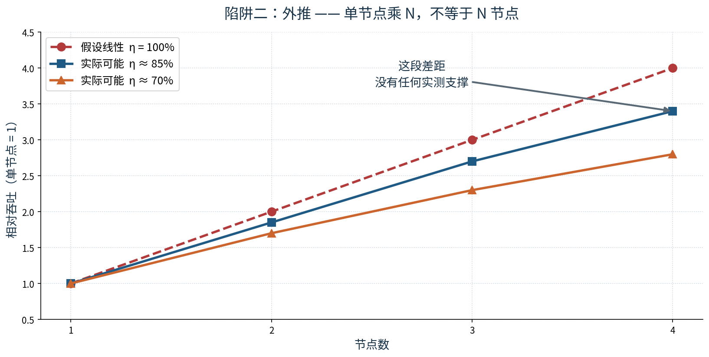

*Source #12, Figure 2. The valid scaling relation is measured single-node throughput multiplied by node count and measured `η`; assuming `η=1` is an unverified claim.*

In practice, `η` is often below 1 because multi-node execution adds costs absent from one node: collectives over a network whose bandwidth can be an order of magnitude below in-node interconnect, uneven MoE expert load, KV transfer, Router scheduling, connection setup, and batches too small to saturate the additional GPUs.

The direction is not guaranteed. A larger aggregate memory pool may permit a larger batch and improve per-GPU utilization, making `η` exceed 1 relative to the chosen single-node baseline. Even the sign of the effect cannot be established by intuition; the target topology must be measured.

#### Public supporting evidence

DeepSeek's public inference-system description notes substantial communication cost under large cross-node expert parallelism and uses dual-batch overlap to hide communication behind computation. If multi-node scaling were inherently linear, such a mechanism would be unnecessary.

The bounded conclusion is: **only single-node data has been measured; multi-node scaling efficiency has not been measured, so no linear extrapolation is made.** This is not excessive caution. It prevents an unsupported `N×` claim from becoming a deployment commitment.

### Trap 3: Memory and Weight Replication

This trap is counterintuitive: more total GPU memory can leave less usable KV memory.

#### The weight-replication tax

Thirty-two GPUs can be deployed in very different ways.

**Topology A: four independent replicas.** Each node loads one complete model and a front-end routes requests across the replicas.

```text
Each machine must hold a complete copy of the weights
→ the weights are stored 4 times
```

**Topology B: one model sharded across 32 GPUs.** Expert Parallelism distributes one copy of the weights across nodes.

```text
The weights are stored only once and spread across 32 GPUs
```

#### Explicit arithmetic and assumptions

Use the public DeepSeek-V3 total parameter count of `671B` as an arithmetic example. Assume FP8 weight storage is approximately one byte per parameter, so one weight copy is approximately `671 GB`. Assume 32 GPUs with `141 GB` each, use decimal GB consistently, treat listed capacity as the budget, and omit non-weight runtime allocations, fragmentation, reserved memory, and metadata. Those assumptions make this a topology illustration, not a measured deployment capacity claim.

Total memory is `32 × 141 = 4,512 GB`.

| Topology | Total memory | Weight storage | Arithmetic usable for KV | KV share |
|---|---:|---:|---:|---:|
| A: four independent replicas | 4,512 GB | **2,684 GB** (`4 × 671`) | **1,828 GB** (`4,512 - 2,684`) | 41% |
| B: one EP32 shard | 4,512 GB | **671 GB** (`1 × 671`) | **3,841 GB** (`4,512 - 671`) | 85% |

The hardware count is identical, but the single-copy topology provides approximately **2.1 times** as much arithmetic KV capacity.

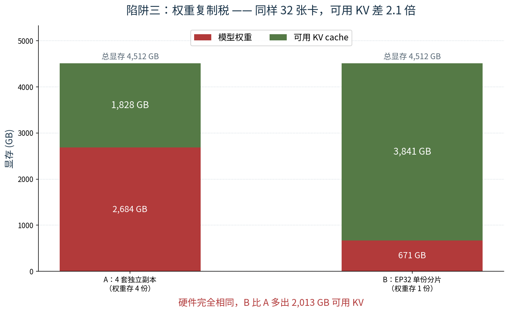

*Source #12, Figure 3. Of the 4,512 GB budget, topology A spends 2,013 GB more on repeated weights: `2,684 - 671 = 2,013 GB`.*

The missing `2,013 GB` is not a hardware defect. It is the cost of storing three additional model copies.

#### Why the difference dominates long-context capacity

KV-cache capacity directly constrains concurrency and maximum context:

```text
Maximum concurrency    = KV-pool capacity ÷ (context length × KV size per token)
Maximum context length = limited by whether one request fits in the KV pool
```

Under long contexts, KV can become the limiting resource. Three repeated weight copies consume memory that could otherwise hold request state.

#### The counterintuitive comparison

Now compare `192 GB` GPUs in the four-replica topology with `141 GB` GPUs in the one-copy EP32 topology, keeping the same arithmetic assumptions. By nominal specification, `192 GB` is about **36% more memory per GPU** than `141 GB`; topology can still reverse the usable-KV result.

| Deployment | Total memory | Weights | Arithmetic usable for KV |
|---|---:|---:|---:|
| 32 × 192 GB, four replicas | **6,144 GB** (`32 × 192`) | 2,684 GB | **3,460 GB** (`6,144 - 2,684`) |
| 32 × 141 GB, one EP32 shard | **4,512 GB** (`32 × 141`) | 671 GB | **3,841 GB** (`4,512 - 671`) |

The second system has **27% less total memory**, yet **11% more arithmetic KV capacity** under these assumptions.

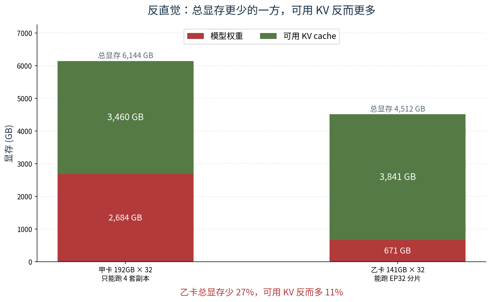

*Source #12, Figure 4. Weight topology can outweigh nominal memory per GPU; this arithmetic does not substitute for a measured runtime topology.*

For large MoE deployments, the ability to shard weights across nodes can matter more than per-GPU memory capacity. That is a software-stack and topology capability, not a conclusion available from hardware specifications alone.

### One Root Cause Across All Three Traps

The common pattern is:

```text
All numerators are real measurements
The denominator was silently changed
```

| Trap | Denominator that changed |
|---|---|
| Normalization | Node count: credit from 32 GPUs is accounted as an 8-GPU share |
| Extrapolation | Scaling efficiency: `η` is silently assumed to be 100% |
| Memory | Number of weight copies: one copy is assumed while the topology stores several |

Ask for the denominator before accepting any ratio. The rule applies beyond throughput to pass rates, availability, yield, and coverage.

### Pre-delivery Checklist

Run every external benchmark statement through this list:

```text
□ Every number is labeled as measured / normalized / extrapolated
□ Normalized numbers state the denominator and the deployment topology being normalized
□ No unmeasured "×N" extrapolation appears
□ Memory and concurrency comparisons state how many weight copies are stored
□ Both sides' GPU counts, topologies, and parallelism strategies appear in the same table
□ A single-run result is not presented as a stable conclusion
□ Anything that cannot be confirmed is explicitly marked "not verified" rather than omitted
```

The final item is essential. Omitting an uncertainty is not neutral; it silently selects the interpretation most favorable to the claim.

### Five Points to Retain

1. When a report says “single-node throughput,” ask whether it was measured on one node or normalized from a larger topology.
2. Single-node throughput multiplied by `N` is not an `N`-node result; scaling efficiency `η` requires measurement.
3. With the same GPU count, one weight copy versus several copies can change usable KV capacity by more than twofold.
4. The three traps can all begin with real numerators; the failure is in the denominator.
5. Mark an unknown as **not verified** rather than omitting it.

### Closing Boundary

These traps do not require bad faith. Normalization is often necessary, linear extrapolation feels natural, and replicated-weight memory is easy to miss. The risk arises when a qualified engineering value becomes an unqualified customer or business claim and fails only at deployment time.

Conclusions may be conservative; the measurement basis must be precise.

### Public Sources

- DeepSeek-V3/R1 inference-system overview for EP32/DP32 and EP144/DP144 topologies and dual-batch overlap
- Earlier article in this series, *How TP and EP Differ*, for communication primitives, Top-K, and the teaching model `EP/TP = k/2`

> Every number in this chapter is arithmetic based on public specifications and exists to demonstrate accounting differences. None is presented as measured performance for a specific product.
<!-- SOURCE-END-EN id=12 -->

---

## Reversible Source Ledger

| Source | Original SHA-256 | Normalized source-body SHA-256 | Source-detail images |
|---:|---|---|---:|
| #3 `03_accuracy_chain_article.md` | `2b438f53e288f44b68762525dcf6f41f832fcf4589838fe68e42bfa555611de2` | `4309c579c94ab270782a93a097c085a2653e7bd9dd5e8e266bd7697e7489a157` | 7 |
| #6 `06_mtp_nongreedy_fix_article.md` | `34647915b90c67434549d968fc5a006c4c5238c67aea259950e12b16798ddde7` | `239fd92e8c84623b1c55ed4e8c48a5cf1ca63769d4a6ce12ba224837daea5355` | 12 |
| #7 `07_online_offline_rl_article.md` | `1ba5832338f6694084680e18c25648e4ef4d6ed08015d84b75dc547fbb264c36` | `83471988d18ce5d974c0641081178c11ff99c1ea763e9793102b76a4908152f5` | 12 |
| #12 `12_scaling_pitfalls_article.md` | `3dfcf06afb8fde2f44477a8bdd008b19c4ede6ee2c0037f95450daef32367b65` | `09c34e91f64557201a2db576e5896f31122399d5a2b6f6b9fe2da2df10c3f722` | 4 |

The normalized hashes identify the byte-preserved Chinese source bodies recorded by [FULL_MERGE_LEDGER.md](FULL_MERGE_LEDGER.md); they are provenance identifiers, not hashes of this independently authored English prose. The ledger records the excluded publication scaffolding and the SHA-256 of every extracted image.