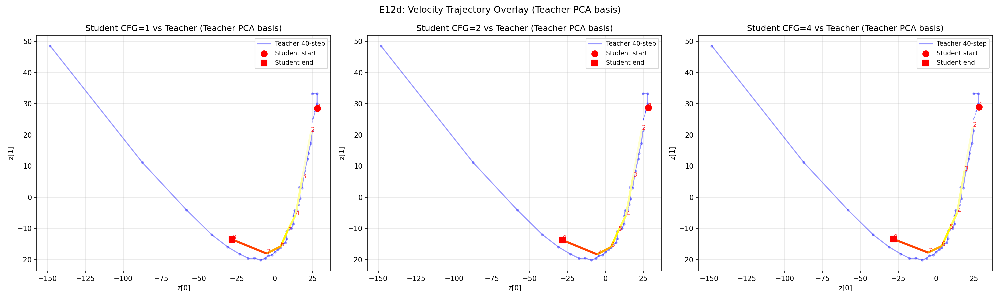
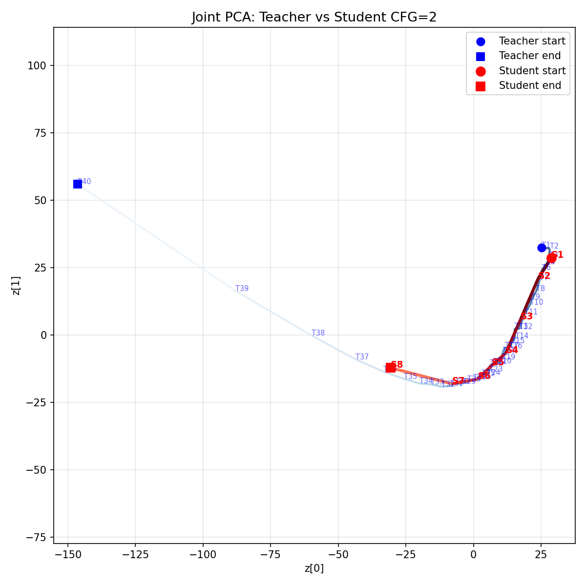

# 扩散模型蒸馏 — 从 40 步到 8 步

> **训练一个学生模型，复现教师模型 40 步能做的事——只用 8 步。**

## 什么是扩散模型蒸馏？

**扩散模型蒸馏（Diffusion Distillation）** 是一种将扩散模型的多步 Denoising（去噪）过程压缩到极少步数的技术，无需从头重新训练模型。大型预训练模型（教师）运行完整的去噪循环并生成监督信号；轻量级适配器（学生，通常是 LoRA）学习跳过大多数步骤，同时保持输出质量。

结果：相同的模型架构，大幅减少的推理步数，接近的视觉质量。

## 为什么需要它？

一个 200 亿参数的扩散模型在最高质量下需要 **40–50 步去噪**才能生成一张图片。在 H100 GPU 上，这大约需要 **30–45 秒/张图**。对于任何服务真实用户的生产服务，这是一个硬门槛。

简单的解决方案——减少步数但不做蒸馏——会导致严重的质量退化。输出图像会"融化"，因为 ODE 求解器被要求进行它从未被训练过的大步跳跃。

蒸馏从根本上解决了这个问题：通过让模型观察教师的完整轨迹，教会它**如何进行大步跳跃**，然后学会一次性跨越 5 个教师步骤。

**生产动机（虚拟试穿示例）**：

| 模式 | 步数 | 相对时间 | 质量 |
|:----:|:----:|:-------:|:----:|
| 教师（无蒸馏） | 40–50 | 1.0×（基准） | 基准 |
| 端到端蒸馏 | ~15 | ~0.4× | 良好 |
| **轨迹蒸馏** | **~8** | **~0.2×** | **更好** |

> 时间为全流程推理（TextEncoder + DiT + VAE），带 CFG，单卡 H100。详细测量见 [生产基准测试](#生产基准测试)。

---

## 在 Azure 上运行

本实验从头完成一个 200 亿参数扩散模型的蒸馏训练，全程运行在**单台 [Standard_NC40ads_H100_v5](https://learn.microsoft.com/zh-cn/azure/virtual-machines/ncads-h100-v5)** 虚拟机上。

| 资源 | 规格 | 在本实验中的作用 |
|------|------|----------------|
| GPU | 1 × NVIDIA H100 NVL，94 GB 显存 | 模型权重 + Activation（激活值）显存 |
| vCPU | 40 × AMD EPYC Genoa | 数据预处理、CPU offload 目标 |
| 系统内存 | 320 GiB | Text Encoder CPU offload 缓冲区 |
| 系统盘 | Azure Premium SSD | 训练脚本、checkpoint、日志 |

### 技术栈全景

下表汇总了在单张 H100 上完成 200 亿参数扩散模型蒸馏所用到的**全部关键技术**：

| 类别 | 技术 | 作用 | 使用位置 | 详细章节 |
|------|------|------|:--------:|:--------:|
| **算法** | Trajectory Distillation（轨迹蒸馏，2nd-gen） | 学生跳过 5× 教师步数，通过匹配中间 latent 学习 | 核心训练循环 | [深度解析](#深度解析轨迹蒸馏) |
| **算法** | Velocity Matching Loss | 在速度场（velocity）空间构建 loss，而非 latent（位置）空间 | 损失函数 | [损失函数](#损失函数latent-matching-vs-velocity-matching) |
| **参数效率** | LoRA（低秩适配器） | 仅少部分参数可训练 → 优化器状态极小 | 学生适配器 | [第二步](#第二步训练学生lora-作为适配器) |
| **精度** | BF16 (bfloat16) | 相比 FP32 节省一半显存；200 亿模型 = ~40 GB 而非 ~80 GB | 全部模型权重 | [实验配置](#实验配置) |
| **显存—教师** | `torch.no_grad()` | 避免存储 40 步教师前向的激活值 → 节省 ~50 GB | 教师前向传播 | [显存分析](#为什么学生有梯度显存也够) |
| **显存—学生** | Gradient Checkpointing（块级梯度检查点） | 仅保存 block 输入；反向时重算内部 → 显著节省显存 | 学生前向/反向 | [显存分析](#为什么学生有梯度显存也够) |
| **显存—学生** | Per-step Backward（逐步反向传播） | 每个学生步骤后立即 `.backward()` + `.detach()` → 节省 ~30 GB | 学生反向传播 | [逐步 backward](#2-逐步-backward-避免-oom) |
| **显存—卸载** | Text Encoder CPU Offload | 编码后将 ~14 GB 文本编码器移到 CPU → 释放 GPU 给 DiT | 文本条件 | [显存分析](#为什么学生有梯度显存也够) |
| **架构** | Serial Execution（教师→学生串行） | 教师和学生不同时占用显存——教师先跑完缓存 8 个 latent 后退出 | 训练流水线 | [串行执行](#教师与学生串行而非并发) |

### 显存分布（训练峰值）

训练峰值显存占用远低于单卡容量，详细的显存分析见下方 [为什么学生有梯度显存也够？](#为什么学生有梯度显存也够) 章节。

> 如果不组合使用以上技术，同样 200 亿模型的朴素训练需要远超单卡 GPU 显存容量。

**"单台 VM"在实践中意味着什么**：

- 无需 InfiniBand、无需多节点 NCCL 通信、无需 Kubernetes 编排
- 无需张量并行代码——同一份模型权重同时承担教师和学生两个角色
- 5 个 epoch 的 20B 模型完整训练耗时：**数小时**
- 成本模型：开一台 VM、跑一个任务、跑完关机——无需维护常驻集群

[为什么学生有梯度显存也够](#为什么学生有梯度显存也够) 章节介绍的三项工程手段，正是单实例训练可行的根本原因。缺少其中任何一项的组合，这个训练任务都需要多卡环境。

希望复现或改造本工作的读者，推荐从 Azure East US 区域的 `Standard_NC40ads_H100_v5` SKU 起步。[NCads H100 v5 系列文档](https://learn.microsoft.com/zh-cn/azure/virtual-machines/ncads-h100-v5) 涵盖驱动安装、Gen2 VM 要求和存储配置。

---

## 原理详解

### 核心术语：ODE、SDE、Velocity、Flow Matching

在深入蒸馏技术之前，先理解四个核心概念。

#### ODE vs SDE — 两种去噪建模方式

扩散模型的去噪过程本质上是从噪声到图像的一条路径。这条路径可以用两种微分方程来建模：

| | ODE（常微分方程） | SDE（随机微分方程） |
|---|---|---|
| **全称** | Ordinary Differential Equation | Stochastic Differential Equation |
| **大白话** | **确定性导航**——每一步走哪、走多远完全确定 | **导航 + 随机晃动**——每步有方向但还叠加随机噪声 |
| **比喻** | 坐高铁：轨道固定，同起点必到同终点 | 坐帆船：大方向对但风在吹，每次航线略不同 |
| **公式** | dz/dt = v(z, t) | dz = v(z,t)dt + g(t)dW |
| **同起点跑两次** | **完全相同** | **略有不同** |
| **代表** | DDIM、**Flow Matching** | DDPM |
| **蒸馏友好度** | **高** — 路线确定可精确模仿 | 低 — 每次路线不同 |

> 本文后续讨论的蒸馏均基于 **ODE**（Flow Matching）框架。

#### Velocity — 潜空间的"速度"

**Velocity（速度场）** 是 ODE 去噪的核心概念：

```
dz/dt = v_θ(z_t, t)
```

- z_t = latent 在时间 t 的状态（**位置**）
- v_θ = 模型预测的 velocity（**速度** = 位置对时间的导数）

velocity 是 latent 轨迹的**切线方向 + 速率**。latent 差分 z_{t-1} - z_t 混入了 scheduler 步长缩放，和 velocity 差一个数量级——**不能用 latent 差分代替 velocity**。

#### Flow Matching — 学习最短路径

**Flow Matching** 直接训练 velocity field：从噪声到数据学一条最短路径的速率场。相比 "预测噪声 → 减掉" 的传统方式，"预测速度 → 沿速度走" 更直接，也天然适合蒸馏。

| 方法 | 模型预测什么 | 蒸馏方式 |
|------|:---:|---------|
| **DDPM (SDE)** | 噪声 epsilon | 困难：每次路径不同 |
| **DDIM (ODE)** | 噪声 epsilon | 可以，但非直接 |
| **Flow Matching (ODE)** | **velocity v** | **天然友好：velocity MSE 直接做蒸馏 loss** |

> **这就是为什么蒸馏的 loss 在 velocity 空间构建，诊断也必须在 velocity 空间进行。**

---

### Denoising Trajectory（去噪轨迹）

扩散模型通过从纯高斯噪声张量（即 *latent*）中反复去噪来生成图像。每步 t 产生一个中间 latent z_t：

```
z_T（纯噪声）→ z_{T-1} → z_{T-2} → ... → z_0（干净图像）
```

这个 latent 状态序列就是**轨迹（Trajectory）**——在高维 latent 空间中的去噪路径。

关键洞察：轨迹不是直线。不同步骤承载不同信息：

| Denoising（去噪）阶段 | 步骤（40步示例） | 发生了什么 |
|:-------:|:------------:|----------|
| 噪声主导 | 1–5 | 随机高斯噪声 — 无任何结构 |
| 颜色浮现 | 5–12 | 全局色调形成，粗略轮廓出现 |
| 结构形成 | 12–25 | 人体形状、物体边界变得清晰 |
| 细节精炼 | 25–35 | 纹理、细边缘、图案变得锐利 |
| 微调 | 35–40 | 精微的光照/锐度修正 |

以下可视化展示了实际 40 步教师去噪过程，中间 latent 通过 VAE 解码器解码为真实图像：


上行：教师在步骤 0→10→20→30→40 的去噪过程——从纯噪声到干净图像。下行：蒸馏后的学生仅用 8 步（0→2→4→6→8）即达到视觉上几乎相同的结果。

---

### 蒸馏方法三代演进

该领域经历了三代演进，每代都在存储/复杂度和压缩率之间取得新的权衡：

| 代际 | 方法 | 监督信号 | 教师在 GPU 上 | 步数压缩 | 代表 |
|:---:|------|:-------:|:-----------:|:-------:|------|
| **1st-gen — Online Distillation（在线蒸馏）** | 教师和学生同时训练 | **仅最终输出**（干净 latent / 图像）| ✅ 全程 | 40→15（~2.7×） | Progressive Distillation |
| **2nd-gen — Offline Trajectory Distillation（离线轨迹蒸馏）** | 教师跑一次存轨迹后下线 | **K 个中间检查点**（逐步对齐）| 仅预计算阶段 | 40→8（5×） | TwinFlow |
| **3rd-gen — Teacher-free Distillation（无教师蒸馏）** | 不需要独立的教师模型 | 数学插值（无教师输出）| ❌ 完全不需要 | 可变 | IMM、Consistency Models |

> **第一代教师提供什么**：教师跑 N 步去噪 → 产出**最终干净 latent** → 学生被训练成用 N/2 步匹配该终点。没有存储或使用任何中间状态。

**为什么第二代能做到更激进的压缩**：通过在每个中间检查点提供监督（而不仅仅是最终输出），学生得到更密集的指导。

> **⚠️ 关键区分：第二代轨迹蒸馏有两种变体**
>
> | 变体 | 监督信号 | Loss Domain | 代表 |
> |------|---------|------------|------|
> | **Latent Matching** | 教师在 K 个 timestep 的 latent 状态 z_t | `MSE(z_student, z_teacher)` — 在 **latent（位置）空间** | TwinFlow |
> | **Velocity Matching** | 教师在每步的 velocity（模型预测的去噪方向）v_t | `MSE(v_student, v_teacher)` — 在 **velocity（速度场）空间** | DiffSynth Trajectory Imitation |
>
> 两者的关键差异：Latent Matching 要求学生"到达相同位置"，Velocity Matching 要求学生"预测相同方向"。**后者的 loss 构建在速度场上，诊断也必须在速度场上进行（见下方三层分析框架）。**

---

### 深度解析：轨迹蒸馏

这是第二代方法——在高质量生产扩散模型中使用最广泛的方案。

#### 第一步：收集教师轨迹（离线，只做一次）

基础模型对每个训练样本运行完整 N 步去噪循环，记录 K 个中间 latent 状态：

```python
# 教师收集 40 步轨迹，在 8 个检查点记录 latent
for sample in training_data:
    z = sample_noise()
    trajectory = {0: z.clone()}          # 记录起始噪声
    for t in range(N, 0, -1):            # 完整 N 步去噪
        v = teacher(z, t, condition)     # 预测去噪方向
        z = step(z, v, dt)              # 欧拉步
        if t in key_timesteps:           # 只存 K 个检查点
            trajectory[t] = z.clone()
    save(trajectory, sample_id)          # 存储 latent 张量（不是图像）
# 教师下线 — 训练期间不再需要
```

为什么存 latent 张量而不是解码后的图像？
- Latent 比像素空间小 6 倍（128×128×16 vs 1024×1024×3）
- 无有损 VAE 编解码往返 → 精确的监督信号
- 训练时可直接计算 Loss，无需重新编码

#### 第二步：训练学生（LoRA 作为适配器）

学生是同一个基础模型 + LoRA 适配器。LoRA 修改 attention 和调制层，让模型学会预测更大的去噪步骤：

```python
# 学生 = 基础模型 + 可训练 LoRA
# LoRA 加在关键的 attention 和调制层
lora_config = LoraConfig(
    r=<rank>,
    target_modules=[
        # attention Q/K/V projections
        # cross-attention projections
        # modulation layers
        # ... (模型特定的目标模块)
    ]
    # 其他所有参数冻结 — 基础参数不变
    # 只有 LoRA 参数被更新
)

for step in range(training_steps):
    traj = load_trajectory(sample_id)        # 读取教师的记录轨迹
    z = traj[T_max]                          # 从相同噪声出发

    for i, (t_now, t_teacher) in enumerate(student_8_steps):
        with lora_enabled():
            v = model(z, t_now, condition)   # 学生预测（LoRA 开）
        z_student = step(z, v, large_dt)     # 大步跳跃：5 个教师步
        z_teacher = traj[t_teacher]          # 教师的 ground truth

        loss += perception_loss(z_student, z_teacher)  # 方案 A: Latent Matching
        # 方案 B: Velocity Matching（实际生产中更常见）
        # v_teacher = teacher(z, t_now, condition)  # 教师的 velocity
        # v_student = model(z, t_now, condition)    # 学生的 velocity
        # loss += MSE(v_student, v_teacher) + LPIPS(decode(z_student), decode(z_teacher))
        z = z_student
        loss.backward()    # 立即 backward — 避免累积 8 步计算图导致 OOM
        loss = 0

    optimizer.step()                         # 只更新 LoRA 参数
```

为什么选 LoRA 而非 Full Fine-tuning（全量微调）？
- 去噪的*方向*已经正确 — LoRA 只需调整*幅度*
- Full Fine-tuning 有 Catastrophic Forgetting（灾难性遗忘）的风险
- 适度的 LoRA rank 即可：速度场的修正本质上是 low-rank 的

#### 概念可视化：Latent Norm 轨迹

下面两张示意图说明核心思想——仅用 8 步的学生模型如何紧密跟踪教师的 40 步去噪路径：


- **上图（教师，蓝色）**：40 步去噪 — Latent Norm 从 ~135（纯噪声）平滑衰减至 ~16（干净 latent），步幅小，路径平滑
- **下图（学生，橙色）**：8 步去噪 — 相同的起点和终点，但每步跨越 5 个教师步。LoRA 引导模型在大步幅下仍能准确降噪
- **灰色参考线**：学生图中叠加了教师轨迹作为参考 — 学生轨迹紧密跟随


- **上行（蓝色，教师）**：40 步去噪的完整序列，σ_max → Clean
- **下行（橙色，学生）**：8 步去噪，每步跨越 5 个教师步
- **紫色虚线箭头**：教师与学生步骤之间的对齐关系
- **蒸馏目标**：LoRA 的训练目标是让学生在每个对齐点的 latent 或 velocity 尽可能接近教师在对应位置的值

#### 损失函数：Latent Matching vs Velocity Matching

轨迹蒸馏的损失函数有两大流派：

**方案 A — Latent Matching（位置对齐）**：
```
L = MSE(z_student_t, z_teacher_t) + LPIPS(decode(z_student), decode(z_teacher))
```
匹配学生和教师在同一 timestep 的 **latent 状态**（位置）。变体包括 IMM（矩匹配，匹配 mu+sigma 分布而非点估计）。

**方案 B — Velocity Matching（速度场对齐）**：
```
L = MSE(v_student_t, v_teacher_t) + LPIPS(decode(z_student), decode(z_teacher))
```
匹配学生和教师在同一 timestep 的 **velocity**（模型预测的去噪方向）。

**关键区别**：
- Latent Matching 要求"到达相同位置" — 诊断时在 latent 空间有效
- Velocity Matching 要求"预测相同方向" — **诊断时必须在 velocity 空间进行**

> **实践中 Velocity Matching 更常见**：flow matching 类模型的 DiT 直接输出 velocity（即 noise_pred），velocity MSE 可以直接用模型输出计算，无需额外保存教师 latent 检查点。

这比纯 MSE 更鲁棒——MSE 可能导致 Mode Averaging（模式平均）伪影。实践中 LPIPS（Perceptual Loss，感知损失）也常被使用。

---

### 为什么轨迹蒸馏优于端到端蒸馏

| | End-to-end（端到端） | Trajectory Distillation（轨迹蒸馏） |
|---|---|---|
| **监督信号** | 仅最终输出 | 每个中间检查点 |
| **学生自由度** | 可以走任意路径到终点 | 必须跟随教师的路线 |
| **风险** | "捷径"路径，绕过关键中间表示 | 被迫学习语义上有意义的阶段 |
| **步数压缩** | 40→15（2.7×）典型 | 40→8（5×）已实现 |
| **存储开销** | ~50GB（最终图像） | ~320GB（轨迹张量） |
| **实现复杂度** | 低 | 高 |

latent 空间可视化揭示了为什么密集监督很重要：大多数语义结构（颜色 + 轮廓）在前 30% 步骤中浮现。只看最终输出的学生可以在终点"侥幸成功"，同时完全绕过这些关键的中间表示。轨迹匹配迫使它经历相同的语义里程碑。


---

## Real-World Experiment（真实实验）

### 实验配置

所有实验在**单张 [Azure Standard_NC40ads_H100_v5](https://learn.microsoft.com/en-us/azure/virtual-machines/ncads-h100-v5) 虚拟机**上完成 — 1 × H100 NVL GPU（94 GB 显存）、40 vCPU、320 GiB 内存 — 模型为 200 亿参数多模态扩散 Transformer（MMDiT）。

| 参数 | 值 |
|------|-----|
| 云虚拟机 | [Azure Standard_NC40ads_H100_v5](https://learn.microsoft.com/en-us/azure/virtual-machines/ncads-h100-v5) |
| GPU | 1 × NVIDIA H100 NVL（94 GB 显存） |
| 基础模型 | 200 亿参数 MMDiT（BF16） |
| LoRA rank / alpha | 低秩适配器 |
| 教师步数 | 完整去噪调度 |
| 学生步数 | 缩减调度 |
| 训练轮次 | 多个 epoch |
| 训练样本 | 少量图像对 |
| 优化器 | AdamW |
| Gradient Checkpointing（梯度检查点） | Block-level |
| GPU 显存占用 | 单卡容量内 |

四项显存优化技术（`torch.no_grad()`、Gradient Checkpointing、Per-step Backward、Text Encoder CPU offload）的详细原理与节省量，参见下方 [为什么学生有梯度显存也够？](#为什么学生有梯度显存也够) 章节。

综合效果：**单张** Azure NC40ads H100 v5 即可训练 200 亿参数模型，无 OOM。

> **关键结论**：无需多卡集群、无需张量并行、无需 NVLink 横向扩展 — 一台标准 Azure GPU 虚拟机即可完成大规模扩散蒸馏训练。

---

### 为什么学生有梯度显存也够？

一个自然的疑问：学生模型保留梯度、教师不保留，为什么学生反而比无保护的教师前向占用更少显存？三个原因叠加：

**原因一：步数少（8 步 vs 40 步）**

激活值显存与去噪步数成正比。不加任何优化时：

```
教师（no_grad 关闭）：40 步 × 每步激活值 → 非常大
学生（保留梯度）：    8 步 × 每步激活值 → 远小于教师
```

仅凭步数之差，学生的激活值起点就只有教师的 1/5。

**原因二：Block-level Gradient Checkpointing（梯度检查点）**

普通带梯度训练会把 60 个 Transformer Block 的每层输出全部存着：

```
layer1激活 + layer2激活 + ... + layer60激活（60 层同时存在显存）
```

**Block-level Gradient Checkpointing 的含义**：20B MMDiT 模型由 60 个 Transformer Block 组成。每个 Block 作为一个 checkpoint 单元——只保存每个 Block 的*输入*；Block *内部*计算的内容（Attention Score（注意力分数）、MLP 中间值）前向完成后立即丢弃，backward 需要时从该 Block 的输入重新计算。

```
Block 1           Block 2           Block 3     ...   Block 60
[输入保留] →    [输入保留] →    [输入保留] →  ... → [输入保留]
 内部中间值？     内部中间值？     内部中间值？        内部中间值？
 丢弃             丢弃             丢弃                丢弃

backward 需要 Block 2 的内部中间值？
  → 从已保存的 Block 2 输入重跑一次前向 → 用完再丢
```

**粒度权衡**：检查点粒度是显存与计算之间的调节旋钮——

| 粒度 | 保存的检查点数 | 额外计算量 | 节省显存 |
|:---:|:----------:|:--------:|:------:|
| 每层都存（最细） | 全部 60 层 | ~0% | ~0% |
| **Block 级（我们的选择）** | **60 个 Block 输入** | **~30%** | **~60–80%** |
| 每 N 个 Block 存一次（粗） | 少数几个 | ~60%+ | 最大 |
| 完全不用检查点 | 无 | 额外 ~100% | 无 |

Block 级是针对该架构验证过的最优平衡点：粗到足以节省大部分激活值显存，细到重算开销控制在 30% 以内。

代价：约多 30% 计算时间。收益：节省 60–80% 的激活值显存。

**原因三：Per-step Backward（逐步反向传播）**

不优化的写法等 8 步全跑完再调一次 `backward()`——8 步的计算图同时在显存里：

```python
# ❌ 8 步计算图全部同时驻留显存
total_loss = sum(step_losses)
total_loss.backward()
```

逐步 backward 每步跑完立即释放：

```python
# ✅ 同时最多只有 1 步的计算图
for i in range(8):
    step_loss.backward()
    z = z.detach()   # 切断跨步梯度流
```

**单次训练 step 的显存预算**：

| 组件 | 显存占用 |
|------|:------:|
| 20B 模型权重（BF16） | ~40 GB |
| 学生激活值（含 Gradient Checkpointing） | 适中 |
| 优化器状态（仅 LoRA 参数，非全量） | 极小 |
| 教师 latent 缓存 | 极小 |
| **合计** | **单卡容量内** |

优化器只追踪 LoRA 参数（占模型极小比例），因此优化器状态几乎可以忽略。

---

### 教师与学生：串行，而非并发

常见误解："教师模型和学生模型同时运行。"  
在轨迹蒸馏中，**每个训练 step 内两者严格串行执行**：

```
Step N：
  1. 教师前向推理  （torch.no_grad()，40 步去噪）
     → 记录 8 个关键 timestep 的中间 latent：z_t1, z_t2, ..., z_t8
     → 计算图立即释放（no_grad）

  2. 学生前向推理  （保留梯度，8 步去噪）
     → 每步输出与教师对应 latent 计算 MSE loss
     → 累积 8 步 loss

  3. Backward + optimizer step
     → 仅更新 LoRA 权重
```

这种串行设计并非偶然——它正是单卡训练可行的根本原因：

| | 第一代在线蒸馏 | 我们的轨迹蒸馏 |
|--|--|--|
| 教师/学生关系 | **并发前向**，有时共享计算图 | **串行**：教师先跑，学生后跑 |
| 教师梯度 | 有时保留 | 全程 `no_grad`，计算图立即释放 |
| 监督信号 | 仅最终输出（干净 latent） | 完整轨迹上的 8 个中间 latent |
| 显存峰值 | 较高（两个计算图同时存在） | 较低（学生开始前教师计算图已释放） |

**为什么教师一定要用 `no_grad`？** 教师和学生共享*同一份* 200 亿参数权重——显存里只有一份。问题不是"两个模型同时存在"，而是*同时存着多少步的激活值*：

```
教师前向，不加 no_grad（40 步）：
  PyTorch 以为后面要做 backward
  → 把 40 步所有的中间激活值全部保留 → 额外 ~50 GB
  → backward 永远不会来——白白占用显存

教师前向，加 no_grad（40 步）：
  PyTorch 知道不需要 backward
  → 每层算完立即释放激活值
  → 同时只有一层在显存里 → 几乎零额外开销
```

学生只跑 8 步（远少于教师的 40 步），再加梯度检查点——即便保留梯度，激活值总量也远小于一次无保护的 40 步教师前向。

---

### 训练 Loss 曲线

多个 epoch 持续收敛，无 Overfitting（过拟合）。Loss 单调递减，表明学习过程稳定。

**单 GPU 上数小时内完成训练。Loss 显著下降，单调递减，无过拟合。**

---

### 蒸馏质量分析：三层框架

> **核心方法论：评价蒸馏用像素空间，诊断蒸馏用 velocity 空间，三层幂等校验确保结论一致。**
>
> 诊断蒸馏质量的 domain 必须匹配 loss 函数的 domain。如果 loss 在 velocity 空间构建（方案 B），诊断也必须在 velocity 空间进行。在 latent 空间观察到的"对齐"可能产生误导——终点接近不等于路径正确。

```
┌──────────────────────────────────────────────────┐
│  Layer 3: 像素空间（评价层）                       │
│  SSIM / FID / LPIPS / 目视                        │
│  回答：蒸馏最终效果好不好？                         │
├──────────────────────────────────────────────────┤
│  Layer 2: Velocity 空间（诊断层）                  │
│  PCA 轨迹 / L2 norm 分布 / Teacher-Student overlay│
│  回答：velocity field 哪里没学好？                  │
│  ✅ 与 velocity loss domain 匹配                  │
├──────────────────────────────────────────────────┤
│  Layer 1: Latent 空间（参考层）                    │
│  Latent Norm / Cosine / 热力图                    │
│  回答：终态是否收敛？（必要条件，非充分条件）        │
│  ⚠️ 能看到"到没到"，看不到"怎么到的"              │
└──────────────────────────────────────────────────┘
```

**幂等校验**：三层结论必须一致。当 velocity 诊断发现问题（如 mid-timestep 被跳过），像素评价应该观察到对应劣化。如果某层指标"看起来好"但另一层指标差，说明该层指标不可靠。

#### Layer 1: Latent 空间分析（终态参考，非诊断充分条件）

> **⚠️ 定位说明**：以下 latent 指标反映**终态收敛**——"学生是否到达了和教师相近的位置"。这是蒸馏质量的**必要条件**，但**不是充分条件**。
>
> **类比**：两辆车都到了目的地（终态 Cosine > 0.98），但一辆走高速另一辆上了田埂——终点相同不等于路径正确。

下图展示 GPU 实测的 latent 空间指标——教师（40 步）vs 学生（8 步）：


四个子图：

1. **Latent Norm 衰减**：教师 40 步的平滑衰减曲线 vs 学生 8 步的跳跃式衰减。学生轨迹在 8 个对齐时间步上紧密跟踪教师轨迹。

2. **MSE（均方误差）**：教师与学生在每步的 latent 差异。越低 = 对齐越好。

3. **余弦相似度**：每步学生与教师 latent 的方向一致性。**最终余弦相似度 > 0.98** — 方向几乎完全一致。

4. **通道统计**：每通道均值和标准差的变化趋势 — 两个模型演变方式相似。

> 这些指标确认终态收敛良好，但不能用于诊断 velocity field 的学习质量。

#### Layer 2: Velocity 空间诊断（与 loss domain 匹配）

> **方法论**：当 loss 函数在 velocity 空间构建时（`MSE(v_student, v_teacher)`），诊断也必须在 velocity 空间进行。
>
> velocity 的获取方式：monkey-patch `scheduler.step`，拦截其第一个参数 `model_output`（即 CFG rescaling 后的 noise_pred = velocity）。这比 latent 差分（`z_{t-1} - z_t`）精确——latent 差分混入了 scheduler 的 sigma 缩放，与真实 velocity 差一个数量级。

**方法**：
1. Monkey-patch `scheduler.step` 拦截 `noise_pred`（= velocity），每步存一个向量
2. 对 Teacher velocity 向量做 PCA 降到 2D
3. 把 Student velocity 向量投影到 Teacher 的 PCA 基上
4. 绘制 overlay 对比图

**核心发现 — "Missing Turn" 现象**：

将 Student 投影到 Teacher 的 PCA 基后发现：
1. **Student 8 步紧贴 Teacher 右侧弧段** — velocity 方向一致，说明蒸馏 LoRA 学到了 velocity field 方向
2. **Teacher 独有的左侧大弧** — 对应 mid-timestep，Student 8 步完全跳过
3. **CFG 不影响轨迹形状** — CFG 主要改变 velocity 幅值（被 norm rescaling 抵消），不改变方向
4. **Teacher L2 norm 范围远大于 Student** — Student 缺少 mid-timestep 低 norm 阶段

**Velocity Overlay — Teacher（蓝）vs Student（红/黄），投影到 Teacher PCA 基：**



> Student 8 步紧贴 Teacher 右侧弧段（方向一致），但 Teacher 独有的左侧大弧（mid-timestep 转折区域）被完全跳过。

**Joint PCA：Teacher + Student CFG=2 在同一坐标系：**



**结论**：蒸馏 8 步学到了 velocity field 的方向，但 timestep 采样太稀疏——mid-timestep 的关键转折区域被完全跳过。这是 **latent 空间指标完全看不到的问题**。

**改进方向**（基于 velocity 诊断）：
- 多 NFE 蒸馏（4+8+16 步联合训练）→ 覆盖更多中间 timestep
- t 接近 0 时加密采样 → 末端 timestep 是图像细节的关键区域
- 自适应 timestep schedule → 在 velocity 变化剧烈的区域分配更多步数

#### Layer 3: 像素空间评价（蒸馏的终极标准）

像素空间评价是蒸馏效果的最终裁判——不管 loss 在什么域构建，最终目的都是生成高质量图像。

**幂等校验**：velocity 诊断发现 Student 跳过了 mid-timestep 转折区域 → 预测像素空间应有细节劣化 → SSIM < 1.0 确认了这一预测。高难度样本（复杂纹理/姿势）正好对应 mid-timestep 细节最敏感的区域。

---

### 视觉质量：教师 vs 学生

教师和学生的最终 latent 经过 VAE 解码器解码后的对比：


视觉差异对人眼几乎不可见。

---

### 10 组测试样本的质量指标

> **说明**：此早期评估使用轻量级验证流水线（DiffSynth 框架，cfg_scale=1）。最终权威结果见下方 [50 样本生产基准测试](#50-样本生产基准测试)（diffusers 框架，CFG=4）。

在 10 组多样化样本（不同服装风格、模特类型、分辨率）上的评估：

测试结果概要：
- **大多数样本评级 Excellent** （SSIM ≥ 0.95）或 **Good**（≥ 0.92）
- **所有样本 SSIM > 0.86** — 零灾难性失败
- 所有样本平均加速比：**~5×**（大图更耗时，但加速比稳定）

---

### 生产基准测试

上述轨迹分析使用了 debug 模式流水线。为验证**生产条件**下的性能，我们使用标准 diffusers 流水线和生产 Hyperparameter（超参）进行了更大规模的 Benchmark。

#### 测试设计

| 参数 | 教师 | 学生 |
|------|:--------:|:--------:|
| 框架 | diffusers | diffusers |
| 推理步数 | 完整调度 | 缩减调度 |
| CFG | 开启 | 开启 |
| Prompt | 真实文本 prompt | 相同 |
| LoRA | 无 | 蒸馏适配器，已融合 |
| Scheduler | FlowMatchEulerDiscrete | 相同 |
| 精度 | BF16 | BF16 |

**唯一变量**：步数和 LoRA 加载。其余所有参数保持一致以确保公平对比。

#### 性能结果

蒸馏后的学生模型实现了相比教师约 **5 倍加速**，GPU 显存占用几乎相同。延迟降低在所有样本上一致，方差极低。

> 端到端延迟包含 TextEncoder 编码 + DiT 去噪 + VAE 解码。开启 CFG 时 DiT 每步执行 **2 次前向传播**（条件 + 无条件）。


#### 质量评估：SSIM / PSNR

以教师完整步数输出为参考，计算学生的 SSIM 和 PSNR：

- **大多数样本达到良好或更高质量**（SSIM ≥ 0.85）
- **超过半数达到非常好或优秀**（SSIM ≥ 0.90）
- 少量高难度输入出现显著偏差

质量分布确认，轨迹蒸馏对大多数输入保持了视觉保真度，退化主要发生在分布外或高复杂度样本上。

#### Denoising Trajectory（去噪轨迹）对比（生产流水线）

通过 debug 插桩捕获生产流水线下的每步 latent 统计（均值 / 标准差）：

| 指标 | 教师 | 学生 |
|------|:------:|:------:|
| 最终 latent 均值偏差 | — | 很小 |
| 最终 latent 标准差偏差 | — | 非常小 |


> 蓝色 = 教师 40 步，橙色 = 学生 8 步。学生在 latent 空间中紧密跟踪教师的去噪轨迹，尽管仅使用 8 步。

#### 异常值分析

SSIM 最低的样本代表真正的高难度输入（复杂服装纹理、密集细节区域、复杂姿势）。它们在所有评估方法中始终得分最低，表明这是输入复杂度问题而非模型系统性失败。

### CFG 在低步数下 ROI 极差

> **测试框架：diffusers**（标准推理 Pipeline，生产配置）。详见下方测试环境。

蒸馏的核心是减少步数。一个自然的问题是：**学生模型（8步）开启 CFG 值得吗？** 我们在 H100 上对 LoRA 融合模型进行了完整的步数×CFG 交叉实验（以完整步数 + CFG 输出为参考基准）：

**测试环境**：

| 项目 | 详情 |
|------|------|
| 推理框架 | diffusers（标准 `DiffusionPipeline`） |
| 模型 | 20B 参数 DiT 扩散模型，LoRA 已融合（学生模型） |
| Attention Backend（注意力后端） | SDPA（PyTorch 默认） |
| 精度 | BF16 |
| 硬件 | 1× NVIDIA H100 NVL（94 GB VRAM） |
| CFG 实现 | True CFG — conditional + unconditional 双前向传播 |
| 计时方式 | 端到端 wall-clock（TextEncoder + DiT + VAE），单张图，无批处理 |

**步数×CFG 矩阵实验核心发现**：

- **CFG 恒定增加 ~2× 时间**（conditional + unconditional 双前向传播）
- **低步数时 CFG 增益可忽略**：缩减步数时 SSIM 提升极小
- **同等时间预算下，加步数远优于加 CFG**：步数增益比 CFG 增益高出一个数量级
- **物理原因**：低步数时每步幅度大，引导信号累积不足；CFG 效果在 ~20 步以上才显现


**对蒸馏的启示**：学生模型在缩减步数时开启 CFG 的 ROI 低。如果延迟是首要目标，**蒸馏后的学生不开 CFG 是合理选择**，可显著降低延迟，仅有极小质量损失。

#### diffusers Batch Throughput（吞吐量）完全扁平

diffusers 管线级 batch 为纯串行循环，batch=N 时间 = batch=1 × N。提升吞吐需引擎级优化（如 continuous batching）。

---

## 已知问题与故障排查

### 1. 训练-推理 conditioning 不一致

**这是最容易被忽视的问题** — 从代码复制时极易引入，从 loss 曲线几乎无法发现。

**场景**：你从一个*可视化脚本*（为简单起见用了 `prompt=""`）中复制了一个辅助函数到你的*训练脚本*。函数运行正常，loss 也正常收敛。但训练好的 LoRA 只学会了在空 prompt conditioning 下去噪。

推理时，用户提供真实的文本 prompt。模型从未为此训练过。在简单样本上效果可能还好，但在某些样本上会灾难性失败。

**数据说明一切**：

| 版本 | 训练 Prompt | 推理 Prompt | 质量影响 |
|------|:----------:|:-----------:|:---------:|
| 有 bug | `""`（空） | 真实文本 | 部分样本灾难性失败 |
| 修复后 | 真实文本 | 真实文本 | 所有样本质量一致 |

空 prompt 训练可能引入**灾难性失败样本**，修复后此类样本不再出现。**Loss 曲线全程没有任何警告。**

**铁律**：训练前，逐条核对每一个 conditioning 输入与推理脚本的一致性：

```
检查清单 — 训练 vs 推理必须一致：
☐ prompt 文本（不能是空字符串 vs 真实文本！）
☐ negative_prompt
☐ CFG scale
☐ 图像输入顺序（多图输入时）
☐ 图像预处理（resize/normalize）
☐ scheduler 参数（shift/beta）
```

---

### 2. 逐步 backward 避免 OOM

朴素实现：累积完整 8 步学生计算图，最后统一调用 `loss.backward()`。小模型可以，但 200 亿参数的 DiT 会 OOM。

**原因**：8 步顺序推理的计算图把所有中间激活值都保留在显存中。

**修复**：每步推理后立即调用 `backward()` 并 `detach()`，只保留 1 步计算图。代码示例见上方 [原因三：Per-step Backward](#为什么学生有梯度显存也够)。

---

### 3. 梯度检查点（GC）+ CPU offload 交互问题

Block 级梯度检查点在 backward 时重计算前向传播。如果你的 Text Encoder 在 backward 之前已经 offload 到 CPU，重计算会尝试使用已不在 GPU 上的张量。

**症状**：`RuntimeError: Expected all tensors to be on the same device`（backward 期间）

**修复**：用 `torch.no_grad()` 包裹 TE 编码调用，使这些张量完全排除在 autograd 图之外——GC 不会尝试通过它们重计算：

```python
with torch.no_grad():
    prompt_emb = text_encoder(tokens)   # 排除在 autograd 图之外
text_encoder.to("cpu")                  # 现在可以安全 offload
torch.cuda.empty_cache()
```

---

### 4. LoRA 开关正确性

收集教师轨迹时，LoRA 必须完全禁用。学生训练步骤时，必须启用。混淆状态会默默产生错误的训练目标。

```python
# 错误：LoRA 状态不明确
model.train()  # 不控制 LoRA 状态

# 正确：显式切换
def set_lora_enabled(model, enabled: bool):
    for module in model.modules():
        if isinstance(module, BaseTunerLayer):
            module.enable_adapters(enabled)

with set_lora_enabled(model, False):   # 教师轨迹收集
    trajectory = collect_teacher(...)

with set_lora_enabled(model, True):    # 学生训练步骤
    loss = train_student_step(...)
```

---

## 速查卡

### 应该用蒸馏吗？

| 需求 | 推荐 |
|------|------|
| 需要 < 10 步推理 | Trajectory Distillation（轨迹蒸馏，2nd-gen） |
| 需要 < 20 步的良好质量 | End-to-end Distillation（端到端蒸馏，1st-gen） |
| 没有训练预算 | Teacher-free / Consistency Model |
| 需要绝对最高质量，无延迟限制 | 不蒸馏，使用完整步数 |

### 三代蒸馏一览

| | 1st-gen (Online) | 2nd-gen (Trajectory) | 3rd-gen (Teacher-free) |
|---|:---:|:---:|:---:|
| 教师 GPU 时间 | 全程训练 | 仅预计算一次 | 无 |
| 步数压缩 | ~2.7× | **>6×** | 可变 |
| 质量 | 良好 | **更好** | 可接受 |
| 存储开销 | 低 | 高（轨迹张量） | 无 |
| 实现复杂度 | 低 | 高 | 中 |

### 关键实验数字（H100，200 亿参数 DiT）

| 指标 | 值 | 说明 |
|------|-----|------|
| 训练 Loss 下降 | 显著 | 多个 epoch，单调递减 |
| 训练时间 | 数小时 | 单卡 GPU |
| 教师推理 | 基准 | 完整去噪调度，带 CFG |
| 学生推理 | **~5× 加速** | 缩减调度，带 CFG |
| 最终余弦相似度（latent） | >0.98 | |
| 质量（SSIM vs 教师） | 高 | 大多数样本 Good 或更高 |
| 训练显存占用 | 单卡容量内 | |
| 推理显存占用 | 与教师相当 | |

### 延伸阅读

| 资源 | 内容 |
|------|------|
| [Progressive Distillation (Salimans, 2022)](https://arxiv.org/abs/2202.00512) | 第一代奠基论文 |
| [Consistency Models (Song, 2023)](https://arxiv.org/abs/2303.01469) | 无教师方法 |
| [TwinFlow](https://arxiv.org/abs/2503.00120) | 离线轨迹蒸馏（第二代） |
| [DiffSynth-Studio Distill-LoRA](https://huggingface.co/DiffSynth-Studio/Qwen-Image-Distill-LoRA) | 端到端社区实现 |

---

**作者**: 魏新宇 (Xinyu Wei) — Microsoft AI GBB 高级系统工程师
