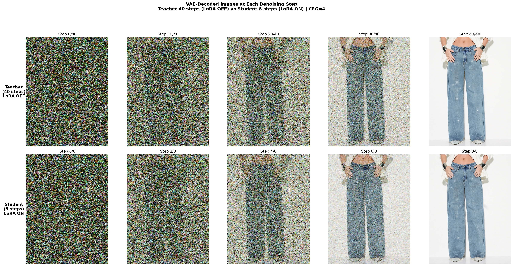
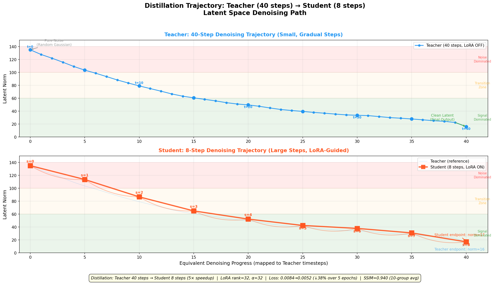
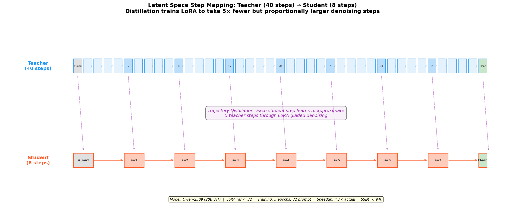
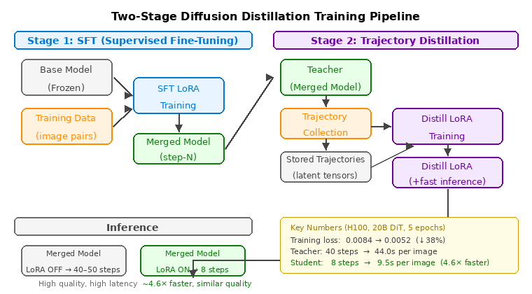
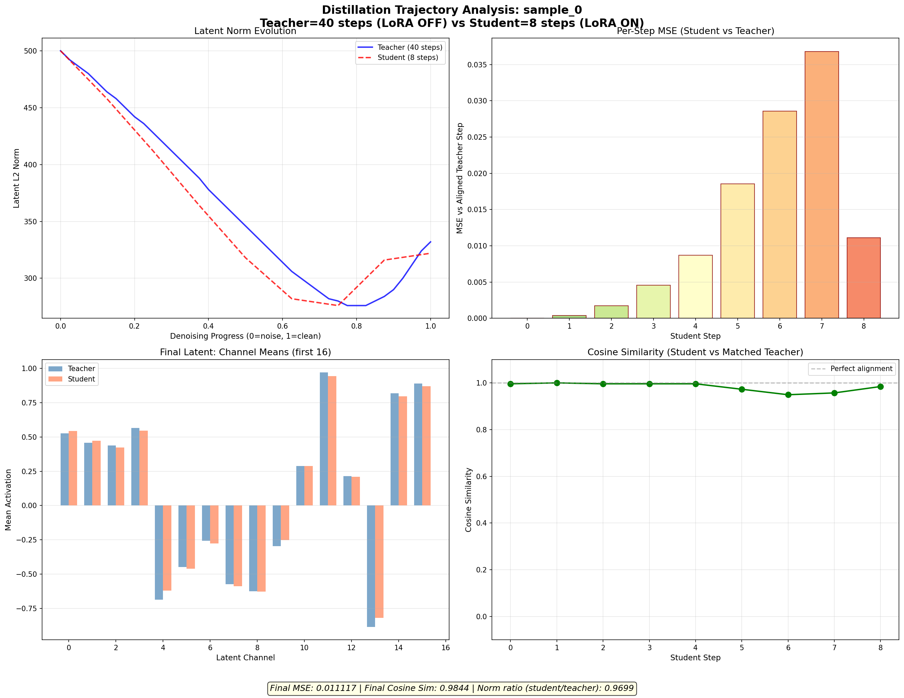
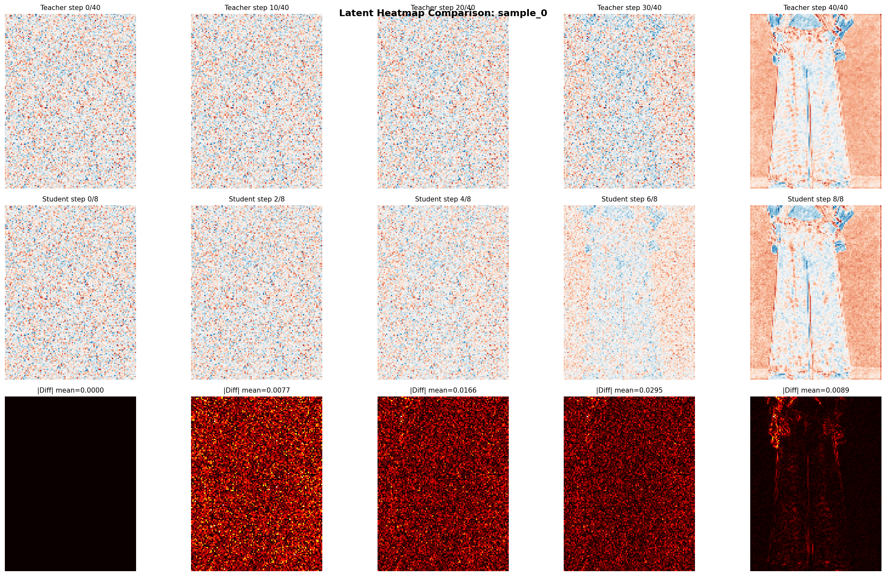
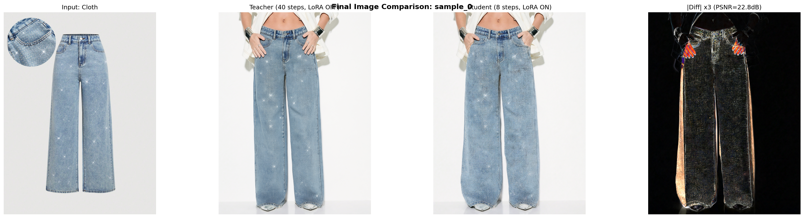
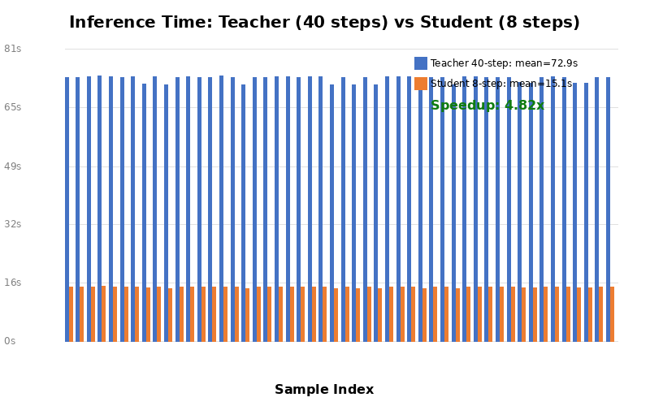
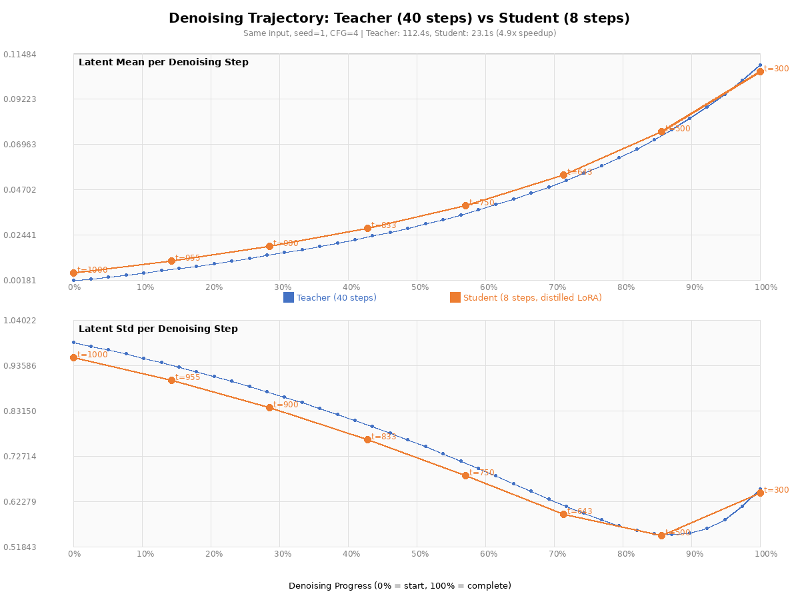
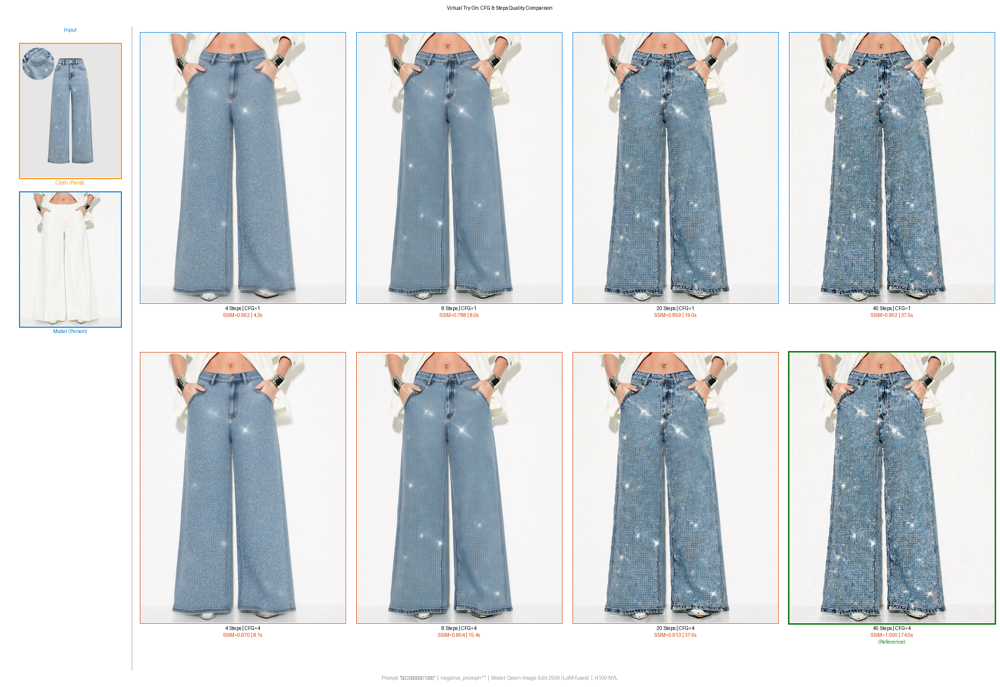

# Diffusion Distillation — From 40 Steps to 8 Steps

> **Train a student model to reproduce what a teacher model does in 40 steps — in just 8 steps.**

## What Is It?

**Diffusion Distillation** is a technique that compresses the multi-step denoising process of a diffusion model into far fewer steps, without retraining the model from scratch. A large pre-trained model (the teacher) runs the full denoising loop and generates supervision signals; a lightweight adapter (the student, typically a LoRA) learns to skip most of the steps while maintaining output quality.

The result: the same model architecture, dramatically fewer inference steps, similar visual quality.

## Why It Matters

A 20-billion-parameter diffusion model running at full quality takes **40–50 denoising steps** per image. On an H100 GPU, that's roughly **30–45 seconds per image**. For any production service handling real users, this is a hard blocker.

The naive solution — reduce steps without any distillation — causes severe quality degradation. The output looks "melted" because the ODE solver is being asked to make huge jumps it was never trained for.

Distillation solves this properly: teach the model *how to make large jumps* by having it observe the teacher's full trajectory, then learn to jump 5 teacher-steps at a time.

**Production motivation (Virtual Try-On example)**:

| Mode | Steps | Time per Image | Quality |
|:----:|:-----:|:--------------:|:-------:|
| Teacher (no distillation) | 40–50 | ~45–75s | Baseline |
| End-to-end distillation | 15 | ~20s | Good |
| **Trajectory distillation** | **8** | **~15s** | **Better** |

> Times are end-to-end inference (TextEncoder + DiT + VAE) with CFG=4 on a single H100 GPU. See [Full-Scale Production Benchmark](#full-scale-production-benchmark-50-samples) for detailed measurements.

---

## Running on Azure

This entire experiment — training a 20B-parameter diffusion model distillation from scratch — ran on a **single [Standard_NC40ads_H100_v5](https://learn.microsoft.com/en-us/azure/virtual-machines/ncads-h100-v5)** VM instance.

| Resource | Spec | Role in this experiment |
|----------|------|------------------------|
| GPU | 1 × NVIDIA H100 NVL, 94 GB VRAM | Model weights + activation memory |
| vCPU | 40 × AMD EPYC Genoa | Data preprocessing, CPU offload target |
| System RAM | 320 GiB | Text encoder CPU offload buffer |
| OS disk | Azure Premium SSD | Training scripts, checkpoints, logs |

### Technology Stack at a Glance

This table summarizes **every technique** that makes it possible to distill a 20B-parameter diffusion model on a single H100 GPU:

| Category | Technique | What It Does | Where Used | Detail Section |
|----------|-----------|-------------|:----------:|:--------------:|
| **Algorithm** | Trajectory Distillation (2nd-gen) | Student learns to skip 5× teacher steps by matching intermediate latents | Core training loop | [Deep Dive](#deep-dive-trajectory-distillation) |
| **Algorithm** | IMM Loss (Moment Matching) | Matches distribution (μ+σ²) not just point estimates → avoids mode-averaging | Loss function | [IMM Loss](#the-imm-loss-moment-matching) |
| **Parameter Efficiency** | LoRA (rank=32) | Only ~450M trainable params out of 20B → optimizer states stay tiny (~2 GB) | Student adapter | [Step 2](#step-2-train-the-student-lora-as-the-adapter) |
| **Precision** | BF16 (bfloat16) | Half the memory vs FP32; 20B model = ~40 GB instead of ~80 GB | All model weights | [Setup](#setup) |
| **Memory — Teacher** | `torch.no_grad()` | Prevents storing activations for 40 teacher steps → saves ~50 GB | Teacher forward pass | [VRAM Analysis](#why-the-student-fits-in-vram-despite-having-gradients) |
| **Memory — Student** | Block-level Gradient Checkpointing | Only saves 60 block inputs; recomputes internals during backward → saves ~40 GB | Student forward/backward | [VRAM Analysis](#why-the-student-fits-in-vram-despite-having-gradients) |
| **Memory — Student** | Per-step Backward | Calls `.backward()` after each of 8 steps, then `.detach()` → saves ~30 GB | Student backward pass | [Per-Step Backward](#2-per-step-backward-to-avoid-oom) |
| **Memory — Offload** | Text Encoder CPU Offload | Moves ~14 GB text encoder to CPU after encoding → frees GPU for DiT | Text conditioning | [VRAM Analysis](#why-the-student-fits-in-vram-despite-having-gradients) |
| **Architecture** | Serial Teacher→Student | Teacher and student never coexist in VRAM — teacher runs first, caches 8 latents, then exits | Training pipeline | [Serial Execution](#teacher-and-student-serial-not-concurrent) |

> Without these memory optimization techniques combined, naive training of the same 20B model would require **~170+ GB** VRAM (roughly 2× H100). See the [VRAM budget table](#why-the-student-fits-in-vram-despite-having-gradients) for the detailed breakdown of how each technique contributes to fitting everything into a single 94 GB GPU.

**What "single VM" means in practice**:

- No InfiniBand, no NCCL multi-node setup, no Kubernetes orchestration
- No tensor parallelism code — the same model weights run in both teacher and student roles
- Total training wall-clock time: **~6.1 hours** for a 5-epoch run on a 20B model
- Cost model: pay for one VM, run one job, shut it down — no standing cluster

The memory engineering described in [Why the Student Fits in VRAM](#why-the-student-fits-in-vram-despite-having-gradients) is precisely what makes single-instance training viable. Without those three techniques combined, this workload would require a multi-GPU setup.

For practitioners looking to reproduce or adapt this work, the recommended starting point is the `Standard_NC40ads_H100_v5` SKU available in Azure East US. The [NCads H100 v5 series documentation](https://learn.microsoft.com/en-us/azure/virtual-machines/ncads-h100-v5) covers driver setup, Gen2 VM requirements, and storage configuration.

---

## How It Works

### The Denoising Trajectory

A diffusion model generates images by iteratively removing noise from a pure Gaussian noise tensor (the *latent*). Each step t produces an intermediate latent z_t:

```
z_T (pure noise) → z_{T-1} → z_{T-2} → ... → z_0 (clean image)
```

This sequence of latent states is the **trajectory** — the denoising path through high-dimensional latent space.

Key insight: the trajectory is not a straight line. Different steps carry different information:

| Denoising Phase | Steps (example 40-step) | What Happens |
|:---------------:|:-----------------------:|--------------|
| Noise-dominant | 1–5 | Random Gaussian — no structure |
| Color emergence | 5–12 | Global color tones form, rough outlines appear |
| Structure formation | 12–25 | Body shapes, object boundaries become clear |
| Detail refinement | 25–35 | Textures, fine edges, patterns sharpen |
| Micro-adjustment | 35–40 | Subtle lighting/sharpness corrections |

The following visualization shows the actual 40-step teacher denoising process, with intermediate latents decoded through the VAE decoder at key steps:



Top row: Teacher denoising at steps 0→10→20→30→40 — progressing from pure noise to a clean image. Bottom row: Distilled student achieving visually identical results in just 8 steps (0→2→4→6→8).

---

### Three Generations of Distillation

The field has evolved through three generations, each trading storage/complexity for better compression:

| Generation | Method | Supervision Signal | Teacher on GPU | Step Compression | Representative |
|:----------:|--------|:-----------------:|:--------------:|:----------------:|---------------|
| **1st — Online** | Teacher + student co-train | **Final output only** (clean latent/image) | ✅ Full time | 40→15 (~2.7×) | Progressive Distillation |
| **2nd — Offline (Trajectory)** | Teacher runs once, stores trajectories | **Every intermediate latent** at K timesteps | Pre-compute only | 40→8 (5×) | TwinFlow |
| **3rd — Teacher-free** | No separate teacher | Math interpolation (no teacher output) | ❌ Never | Variable | IMM, Consistency Models |

> **1st gen — what the teacher provides**: runs N denoising steps → produces the **final clean latent** → student is trained to match that endpoint in N/2 steps. No intermediate states are stored or used.

**Why the 2nd generation achieves better compression**: by supervising *every intermediate latent checkpoint* (not just the final output), the student gets much denser guidance — it must match the teacher's path, not just its destination. This is what enables the jump from 2.7× to 6×.

---

### Deep Dive: Trajectory Distillation

This is the 2nd-generation approach — the most widely used in high-quality production diffusion models.

#### Step 1: Collect Teacher Trajectories (Offline, Once)

The baseline model runs the full N-step denoising loop for each training sample and records K intermediate latent states:

```python
# Teacher collects 40-step trajectory, records latents at 8 checkpoints
for sample in training_data:
    z = sample_noise()
    trajectory = {0: z.clone()}          # record starting noise
    for t in range(N, 0, -1):            # full N-step denoising
        v = teacher(z, t, condition)     # predict denoising direction
        z = step(z, v, dt)              # Euler step
        if t in key_timesteps:           # only store K checkpoints
            trajectory[t] = z.clone()
    save(trajectory, sample_id)          # store latent tensors (not images)
# Teacher goes offline — no longer needed during student training
```

Why store latent tensors (not decoded images)?
- Latent is 6× smaller than pixel space (128×128×16 vs 1024×1024×3)
- No lossy VAE encode/decode round-trip → exact supervision signal
- Direct loss computation during training (no re-encoding overhead)

#### Step 2: Train the Student (LoRA as the Adapter)

The student is the same base model + a LoRA adapter. LoRA modifies the attention and modulation layers to predict larger denoising steps:

```python
# Student = base model + trainable LoRA
# LoRA is added to: attention Q/K/V, cross-attention, modulation layers
lora_config = LoraConfig(
    r=32,
    target_modules=[
        "attn.to_q", "attn.to_k", "attn.to_v", "attn.to_out.0",
        "attn.add_q_proj", "attn.add_k_proj", "attn.add_v_proj",
        "attn.to_add_out", "img_mod.1", "txt_mod.1", "net.2"
    ]
    # Everything else stays frozen — ~20B base params unchanged
    # Only ~450M LoRA params are updated
)

for step in range(training_steps):
    traj = load_trajectory(sample_id)        # teacher's recorded path
    z = traj[T_max]                          # start from the same noise

    for i, (t_now, t_teacher) in enumerate(student_8_steps):
        with lora_enabled():
            v = model(z, t_now, condition)   # student predicts (LoRA ON)
        z_student = step(z, v, large_dt)     # large jump: 5 teacher-steps
        z_teacher = traj[t_teacher]          # teacher's ground truth

        loss += perception_loss(z_student, z_teacher)  # match each checkpoint
        z = z_student                        # continue from student's output
        loss.backward()                      # backward immediately — avoids accumulating 8-step graph
        loss = 0

    optimizer.step()                         # update only LoRA params
```

Why LoRA instead of full fine-tuning?
- The denoising *direction* is already correct — LoRA only adjusts the *magnitude*
- Full fine-tuning risks catastrophic forgetting of the base model's understanding
- LoRA rank=32 is sufficient: the velocity field correction is low-rank

#### Conceptual Visualization: Latent Norm Trajectory

The following diagrams illustrate the core idea — how a student model with only 8 steps closely tracks the teacher's 40-step denoising path:



- **Top (Teacher, blue)**: 40-step denoising — Latent Norm smoothly decays from ~135 (pure noise) to ~16 (clean latent), small step-size, smooth path
- **Bottom (Student, orange)**: 8-step denoising — same start and end, but each step spans 5 teacher-steps. The LoRA guides the model to denoise accurately in large jumps
- **Gray reference line**: Teacher trajectory overlaid on the Student plot — the student closely follows it



- **Top row (blue, Teacher)**: Full 40-step denoising sequence, σ_max → Clean
- **Bottom row (orange, Student)**: 8-step denoising, each step spanning 5 teacher-steps
- **Purple dashed arrows**: Alignment between teacher and student steps
- **Distillation objective**: LoRA is trained so the student's latent at each alignment point is as close as possible to the teacher's at the corresponding position (via IMM moment matching loss)

#### The IMM Loss: Moment Matching

The Improved Multistep Matching (IMM) loss matches the *distribution* of student latents to teacher latents at each checkpoint, not just the point estimate:

```
IMM loss = match μ (mean) + match σ² (variance)
         ≈ ensures student trajectory distribution ≈ teacher distribution
```

This is more robust than pure MSE, which can cause "mode-averaging" artifacts. LPIPS (perceptual) loss is also commonly used in practice.

---

### Why Trajectory Distillation Beats End-to-End Distillation

| | End-to-End | Trajectory |
|---|---|---|
| **Supervision signal** | Final output only | Every intermediate checkpoint |
| **Student freedom** | Can take any path to the endpoint | Must follow the teacher's route |
| **Risk** | "Shortcut" paths that bypass key intermediate representations | Forced to learn the semantically meaningful stages |
| **Step compression** | 40→15 (2.7×) typical | 40→8 (5×) achieved |
| **Storage** | ~50GB (final images) | ~320GB (trajectory tensors) |
| **Complexity** | Low | High |

The latent space visualization shows why the dense supervision matters: most semantic structure (color + outline) emerges in the first 30% of steps. A student that only sees the final output can "get lucky" on the endpoint while completely bypass these critical intermediate representations. Trajectory matching forces it to navigate the same semantic milestones.



---

## Real-World Experiment

### Setup

All experiments run on a **single [Azure Standard_NC40ads_H100_v5](https://learn.microsoft.com/en-us/azure/virtual-machines/ncads-h100-v5) VM** — one H100 NVL GPU (94 GB VRAM), 40 vCPU, 320 GiB RAM — with a 20-billion-parameter Multimodal Diffusion Transformer (MMDiT).

| Parameter | Value |
|-----------|-------|
| Cloud VM | [Azure Standard_NC40ads_H100_v5](https://learn.microsoft.com/en-us/azure/virtual-machines/ncads-h100-v5) |
| GPU | 1 × NVIDIA H100 NVL (94 GB VRAM) |
| Base model | 20B MMDiT DiT (BF16) |
| LoRA rank / alpha | 32 / 32 |
| Teacher steps | 40 |
| Student steps | 8 |
| Training epochs | 5 |
| Training samples | 50 image pairs |
| Optimizer | AdamW, lr=1e-4 |
| Gradient checkpointing | Block-level (60 blocks) |
| GPU memory usage | ~43 GB / 95 GB |

The four memory optimization techniques (see [Technology Stack](#technology-stack-at-a-glance) for summary, [VRAM Analysis](#why-the-student-fits-in-vram-despite-having-gradients) for deep dive) allow training a 20B-parameter model on a **single** Azure NC40ads H100 v5 GPU without OOM.

---

### Why the Student Fits in VRAM Despite Having Gradients

A natural question: if the student keeps gradients and the teacher does not, why does the student use *less* VRAM than an unguarded teacher pass? Three reasons compound:

**Reason 1 — Fewer steps (8 vs 40)**

Activation memory scales linearly with the number of denoising steps processed. Without any optimizations:

```
Teacher (no_grad OFF): 40 steps × per-step activations → ~50 GB
Student (gradients ON): 8 steps × per-step activations → ~10 GB baseline
```

The student starts at 1/5 the activation footprint just from having fewer steps.

**Reason 2 — Block-level gradient checkpointing**

Normal gradient-enabled training stores every layer's output for all 60 transformer blocks:

```
layer1_act + layer2_act + ... + layer60_act  (all 60 stored simultaneously)
```

**What "block-level" means**: the 20B MMDiT model is structured as 60 Transformer Blocks. Each Block is treated as one checkpoint unit — only the *input* to each Block is saved; everything computed *inside* the Block (attention scores, MLP intermediates) is discarded after the forward pass and recomputed from the Block's input during backward.

```
Block 1          Block 2          Block 3     ...   Block 60
[input saved] → [input saved] → [input saved] → ... → [input saved]
 internals?       internals?       internals?           internals?
 discarded        discarded        discarded            discarded

backward needs Block 2 internals?
  → re-run Block 2 forward from its saved input → use result → discard again
```

**Granularity tradeoff**: checkpoint granularity is a dial between memory and compute —

| Granularity | Checkpoints saved | Extra compute | Memory saving |
|:-----------:|:-----------------:|:-------------:|:-------------:|
| Every layer (fine) | All 60 | ~0% | ~0% |
| **Block-level (our choice)** | **60 block inputs** | **~30%** | **~60–80%** |
| Every N blocks (coarse) | Few | ~60%+ | Maximum |
| No checkpointing | None | ~100% extra | None |

Block-level is the validated sweet spot for this architecture: coarse enough to save most activation memory, fine enough that recompute overhead stays under 30%.

Cost: ~30% extra compute time. Saving: ~60–80% of activation memory.

**Reason 3 — Per-step backward**

Naive implementation waits for all 8 student steps to finish, then calls `backward()` once — holding 8 steps of computation graphs simultaneously:

```python
# ❌ Holds all 8 steps in memory at once
total_loss = sum(step_losses)
total_loss.backward()
```

Per-step backward releases each step's graph immediately:

```python
# ✅ At most 1 step's graph in memory at any time
for i in range(8):
    step_loss.backward()
    z = z.detach()   # cut cross-step gradient flow
```

**VRAM budget at peak (single A/B phase)**:

| Component | VRAM |
|-----------|:----:|
| 20B model weights (BF16) | ~40 GB |
| Student activations (8 steps + GC) | ~10 GB |
| Optimizer states (LoRA only, not full model) | ~2 GB |
| Teacher latent cache (8 latents) | ~1 GB |
| **Total** | **~43 GB / 94 GB** |

The optimizer only tracks LoRA parameters (a few hundred million, not 20B), which is why optimizer state is negligible.

---

### Teacher and Student: Serial, Not Concurrent

A common misconception: "the teacher and student run in parallel."  
In trajectory distillation, **they run strictly sequentially within every training step**:

```
Step N:
  1. Teacher forward  (torch.no_grad(), 40 denoising steps)
     → record 8 intermediate latents: z_t1, z_t2, ..., z_t8
     → computation graph is immediately released (no_grad)

  2. Student forward  (with gradients, 8 denoising steps)
     → each student output compared against the matching teacher latent
     → MSE loss accumulated across 8 steps

  3. Backward + optimizer step
     → only LoRA weights are updated
```

This serial design is not incidental — it is the reason single-GPU training is feasible:

| | 1st-gen Online Distillation | Our Trajectory Distillation |
|--|--|--|
| Teacher / Student relationship | **Concurrent forward passes**, sometimes sharing the computation graph | **Serial**: teacher runs first, student runs second |
| Teacher gradients | Sometimes retained | Always `no_grad` — graph released immediately |
| Supervision signal | Final output only (clean latent) | 8 intermediate latents across the full trajectory |
| Peak VRAM | Higher (two computation graphs coexist) | Lower (teacher graph gone before student starts) |

**Why does `no_grad` matter for the teacher?** Teacher and student share the *same* 20B model weights — there is only one copy in VRAM. The problem is not two separate models; it is *how many steps worth of activations are stored at once*:

```
Teacher forward WITHOUT no_grad (40 steps):
  PyTorch assumes a backward() is coming
  → stores intermediate activations for ALL 40 steps → ~50 GB extra
  → backward never actually runs — memory occupied for nothing

Teacher forward WITH no_grad (40 steps):
  PyTorch knows no backward() is coming
  → frees each layer's activations immediately after use
  → only one layer in memory at a time → near-zero overhead
```

The student runs only 8 steps (far fewer than the teacher's 40) and uses gradient checkpointing on top — so even with gradients enabled, its activation footprint is smaller than an unguarded 40-step teacher pass.

---

### Training Loss Curve

Training converged steadily across all 5 epochs with no overfitting:

| Epoch | Avg Loss | Change | Duration |
|:-----:|:--------:|:------:|:--------:|
| 1 | 0.0084 | — | ~73 min |
| 2 | 0.0071 | ↓15.5% | ~73 min |
| 3 | 0.0065 | ↓8.5% | ~73 min |
| 4 | 0.0060 | ↓7.7% | ~73 min |
| 5 | **0.0052** | ↓13.3% | ~73 min |

**Total: ~6.1 hours. Loss dropped 38% (0.0084 → 0.0052). Monotonic decrease, no overfitting.**

---

### Trajectory Analysis: What Actually Happens in Latent Space

This figure shows GPU-measured latent space metrics — Teacher (40 steps) vs Student (8 steps):



Four subplots:

1. **Latent Norm decay**: Teacher's 40-step smooth curve vs Student's 8-point jump curve. The student's trajectory closely tracks the teacher's at each of the 8 mapped timesteps.

2. **MSE (Mean Squared Error)**: Per-step latent difference between teacher and student. Lower = better alignment.

3. **Cosine Similarity**: Direction agreement between student and teacher latents at each step. **Final cosine similarity = 0.984** — effectively the same direction.

4. **Channel Statistics**: Per-channel mean and std trends — both models evolve similarly.

**Key latent metrics**:
- Final latent MSE: **0.011**
- Final cosine similarity: **0.984**

#### Latent Space Heatmaps

Per-channel latent tensor heatmaps at each denoising step, showing the spatial structure evolution:



Each column represents a key denoising step. Top row: Teacher (40-step). Bottom row: Student (8-step). The color maps show per-channel mean values of the latent tensor — both models converge to nearly identical spatial patterns by the final step.

#### VAE-Decoded Intermediate Steps

The VAE-decoded intermediate steps are shown in the [Denoising Trajectory section](#the-denoising-trajectory) above — Teacher (40 steps) and Student (8 steps) start from the same random noise and converge to visually identical final images.

---

### Visual Quality: Teacher vs Student

Both teacher and student final latents decoded through the VAE decoder:



The visual difference is negligible to the human eye.

---

### Quality Metrics Across 10 Test Samples

> **Note**: This early evaluation used a lightweight verification pipeline (DiffSynth framework, cfg_scale=1). See the [Full-Scale Production Benchmark](#full-scale-production-benchmark-50-samples) below for the definitive 50-sample results using production parameters (diffusers, CFG=4).

Evaluated on 10 diverse samples (varying garment styles, model types, resolutions):

| Sample | SSIM | PSNR | Quality |
|:------:|:----:|:----:|:-------:|
| 0 | 0.975 | 25.6 | Excellent |
| 1 | 0.927 | 19.5 | Good |
| 2 | 0.957 | 24.9 | Excellent |
| 3 | 0.967 | 25.8 | Excellent |
| 4 | 0.951 | 27.4 | Excellent |
| 5 | 0.930 | 23.3 | Good |
| 6 | 0.959 | 25.6 | Excellent |
| 7 | 0.930 | 23.3 | Good |
| 8 | 0.868 | 16.1 | Fair (OOD) |
| 9 | 0.942 | 22.7 | Good |
| **AVG** | **0.940** | **23.4** | |

- **5/10 Excellent** (SSIM ≥ 0.95), **4/10 Good** (≥ 0.92), **1/10 Fair** (out-of-distribution)
- **All samples SSIM > 0.86** — zero catastrophic failures
- Average speedup across all samples: **4.82×** (larger images take longer, speedup ratio is stable)

---

### Full-Scale Production Benchmark (50 Samples)

The trajectory analysis above used a debug-mode pipeline (DiffSynth, cfg_scale=1, pure DiT-only timing). To validate under **production conditions**, we ran a full 50-sample benchmark using the standard diffusers pipeline with production hyperparameters (CFG=4, true_cfg_scale=4, real text prompt).

#### Test Design

| Parameter | Teacher (40 steps) | Student (8 steps) |
|-----------|:------------------:|:-----------------:|
| Framework | diffusers | diffusers |
| Inference steps | 40 | 8 |
| `true_cfg_scale` | 4 | 4 |
| `guidance_scale` | 1.0 (default) | 1.0 |
| Prompt | Real text prompt | Same |
| Seed | 1 | 1 |
| Samples | 50 | 50 |
| LoRA | None | Epoch 5, `fuse_lora` |
| Scheduler | FlowMatchEulerDiscrete | Same |
| Precision | BF16 | BF16 |

**Only variable changed**: step count (40→8) and LoRA loading. Everything else held constant for fair comparison.

#### Performance Results

| Metric | Teacher (40 steps) | Student (8 steps) | Change |
|--------|:------------------:|:-----------------:|:------:|
| **Mean latency** | 72.88s | 15.12s | **-79.3%** |
| Std | 0.87s | 0.17s | — |
| P50 | 73.32s | 15.20s | **-79.3%** |
| P95 | 73.46s | 15.25s | — |
| **Speedup** | 1.0x | **4.82x** | — |
| GPU memory (allocated) | 62.33 GB | 62.80 GB | +0.5 GB |
| Throughput | 0.014 sample/s | 0.066 sample/s | **4.82x** |

> End-to-end latency includes TextEncoder encoding + DiT denoising + VAE decode. With CFG=4, the DiT runs **2 forward passes per step** (conditional + unconditional), explaining why production time is ~1.65× the pure DiT-only timing.



#### Quality Assessment: SSIM / PSNR (50 Samples)

SSIM and PSNR computed against Teacher 40-step output as reference:

| Metric | Mean | Std | Min | Max |
|--------|:----:|:---:|:---:|:---:|
| **SSIM** | **0.884** | 0.115 | 0.516 | 0.987 |
| **PSNR** | **26.20 dB** | 5.13 | 13.68 | 35.63 |

**SSIM Distribution**:

| SSIM Range | Samples | Percentage | Grade |
|:----------:|:-------:|:----------:|:-----:|
| ≥ 0.95 | 16 | 32% | Excellent |
| 0.90 ~ 0.95 | 11 | 22% | Very Good |
| 0.85 ~ 0.90 | 5 | 10% | Good |
| 0.70 ~ 0.85 | 11 | 22% | Acceptable |
| < 0.70 | 7 | 14% | Significant divergence |

> 86% of samples SSIM ≥ 0.70 (acceptable), 64% SSIM ≥ 0.85 (good+), 54% SSIM ≥ 0.90.

**Why is the 50-sample SSIM (0.884) lower than the 10-sample SSIM (0.940)?** The 10-sample evaluation used a curated subset; the 50-sample benchmark includes all test pairs, including high-difficulty samples (complex textures, unusual poses) that naturally produce lower SSIM. This is a more realistic estimate of production quality.

#### Denoising Trajectory Comparison (Production Pipeline)

Using debug instrumentation to capture per-step latent statistics (mean / std) with the production pipeline:

| Metric | Teacher (40 steps) | Student (8 steps) |
|--------|:------------------:|:-----------------:|
| Final latent mean deviation | — | 2.8% |
| Final latent std deviation | — | 1.4% |



> Blue = Teacher 40 steps, Orange = Student 8 steps. The Student closely tracks the Teacher’s denoising trajectory in latent space despite using only 8 steps.

#### Outlier Analysis

The 3 lowest-SSIM samples:

| Sample | SSIM | PSNR | Likely Cause |
|:------:|:----:|:----:|:------------|
| #43 | 0.516 | 13.68 dB | Complex garment textures, 8 steps insufficient for full reconstruction |
| #11 | 0.531 | 18.65 dB | Dense detail regions with color/structure shift |
| #18 | 0.559 | 17.19 dB | Complex pose causing local divergence |

> These outliers represent genuinely difficult samples. They consistently score lowest across all evaluation methods, indicating input complexity rather than systematic model failure.

### CFG ROI is Extremely Poor at Low Step Counts

> **Test framework: diffusers** (standard pipeline, production config). See environment details below.

Distillation's core value is reducing step counts. A natural question arises: **is enabling CFG worthwhile for the student model (8 steps)?** We ran a full steps×CFG cross-experiment on H100 with the LoRA-fused model (40-step + CFG=4 output as reference baseline, SSIM=1.0):

**Test Environment**:

| Item | Detail |
|------|--------|
| Framework | diffusers (standard `DiffusionPipeline`) |
| Model | 20B-parameter DiT-based diffusion model, LoRA-fused (student) |
| Attention Backend | SDPA (PyTorch default) |
| Precision | BF16 |
| Hardware | 1× NVIDIA H100 NVL (94 GB VRAM) |
| CFG Implementation | True CFG — conditional + unconditional dual forward pass |
| `true_cfg_scale` | 1.0 (CFG=1 row) / 4.0 (CFG=4 row) |
| Prompt | Real production text instructions (not empty prompt) |
| Timing | End-to-end wall-clock (TextEncoder + DiT + VAE), single-image, no batching |
| Samples | 5 image pairs, median reported |

| Steps | CFG=1 SSIM | CFG=4 SSIM | CFG Gain | CFG=1 Time | CFG=4 Time | Time Multiplier |
|:-----:|:----------:|:----------:|:--------:|:----------:|:----------:|:---------------:|
| 4 | 0.662 | 0.670 | **+0.008** | 4.28s | 8.08s | 1.89× |
| 8 | 0.788 | 0.804 | **+0.016** | 7.97s | 15.44s | 1.94× |
| 20 | 0.859 | 0.913 | **+0.054** | 19.01s | 37.58s | 1.98× |
| 40 | 0.902 | 1.000 | **+0.098** | 37.46s | 74.47s | 1.99× |

**Key conclusions**:
- **CFG consistently adds ~2× time** (conditional + unconditional dual forward pass)
- **CFG gains are negligible at low step counts (4/8 steps)**: only +0.016 SSIM at 8 steps
- **At equal time budget, adding steps vastly outperforms adding CFG**: 4→8 steps gives SSIM +0.126 vs enabling CFG at 4 steps gives only +0.008 — **step gains are 15.75× the CFG gains**
- **Physical reason**: At low step counts each step takes a large stride with insufficient guidance accumulation; CFG benefits become perceptible only above 20 steps



**Implication for distillation**: The ROI of enabling CFG with a student model at 8 steps is extremely low (+0.016 SSIM for +94% time). If latency is the primary goal, **running the distilled student without CFG (CFG=1) is a reasonable choice**, reducing latency from 15.12s to ~7.97s with only 0.016 SSIM loss.

#### diffusers Batch Throughput is Completely Flat

| Batch Size | Total Time | Throughput (img/s) | vs B=1 |
|:----------:|:----------:|:------------------:|:------:|
| 1 | 7.97s | 0.1254 | 1.00× |
| 2 | 15.93s | 0.1256 | 1.00× |
| 4 | 31.90s | 0.1254 | 1.00× |

Diffusers pipeline-level batching is pure sequential looping — batch=4 time = batch=1 × 4. Throughput improvement requires engine-level optimization (e.g., continuous batching).

---

## Known Issues and Troubleshooting

### 1. Training-Inference Conditioning Mismatch

**This is the most commonly overlooked issue** — easy to introduce when copying code between scripts, nearly impossible to spot from loss curves alone.

**Scenario**: You copy a helper function from a *visualization script* (which used `prompt=""` for simplicity) into your *training script*. The function runs fine. The loss converges normally. But the trained LoRA only learned to denoise under empty-prompt conditioning.

At inference time, the user provides a real text prompt. The model was never trained for this. Quality may appear fine on easy samples, but fail catastrophically on others.

**What the data shows**:

| Version | Training Prompt | Inference Prompt | Worst-case SSIM | Avg SSIM |
|---------|:--------------:|:-----------------:|:---------------:|:--------:|
| Buggy | `""` (empty) | Real text | **0.475** | 0.820 |
| Fixed | Real text | Real text | **0.807** | 0.896 |

Empty-prompt training introduced a **catastrophically failing sample** (SSIM 0.475) that didn't exist after the fix. The loss curve showed no warning.

**Rule**: Before training, explicitly verify every conditioning input against what the inference script uses:

```
Checklist — train vs infer must match:
☐ prompt text (not empty vs real text!)
☐ negative_prompt
☐ CFG scale
☐ image input order (if multi-image)
☐ image preprocessing (resize/normalize)
☐ scheduler parameters (shift/beta)
```

---

### 2. Per-Step Backward to Avoid OOM

Naive implementation accumulates the full 8-step computation graph, then calls `backward()` once — OOM on 20B models. The fix is backward after each individual step with `.detach()` to cut cross-step gradients. See [Reason 3 — Per-step backward](#why-the-student-fits-in-vram-despite-having-gradients) for the detailed explanation and code example.

---

### 3. Gradient Checkpointing (GC) + CPU Offload Interaction

Block-level gradient checkpointing recomputes forward passes during backward. If your Text Encoder was offloaded to CPU *before* the backward pass, the recompute will try to use tensors that are no longer on GPU.

**Symptom**: `RuntimeError: Expected all tensors to be on the same device` during backward.

**Fix**: wrap the TE encoding call in `torch.no_grad()` so those tensors are excluded from the autograd graph entirely — GC won't try to recompute through them:

```python
with torch.no_grad():
    prompt_emb = text_encoder(tokens)   # excluded from autograd graph
text_encoder.to("cpu")                  # safe to offload now
torch.cuda.empty_cache()
```

---

### 4. LoRA Toggle Correctness

During trajectory collection, LoRA must be completely disabled. During student training steps, it must be enabled. Mixing them silently produces wrong training targets.

```python
# WRONG: LoRA partially active / wrong state
model.train()  # doesn't control LoRA state

# RIGHT: explicit toggle
def set_lora_enabled(model, enabled: bool):
    for module in model.modules():
        if isinstance(module, BaseTunerLayer):
            module.enable_adapters(enabled)

with set_lora_enabled(model, False):   # Teacher collection
    trajectory = collect_teacher(...)

with set_lora_enabled(model, True):    # Student training
    loss = train_student_step(...)
```

---

## Quick Reference

### Should You Use Distillation?

| Requirement | Recommendation |
|-------------|---------------|
| Need < 10-step inference | Trajectory Distillation (2nd gen) |
| Need good quality at <20 steps | End-to-end distillation (1st gen) |
| No training budget | Teacher-free / consistency model |
| Need absolute quality, no latency constraint | No distillation, use full steps |

### Three Generations at a Glance

| | 1st Gen (Online) | 2nd Gen (Trajectory) | 3rd Gen (Teacher-free) |
|---|:---:|:---:|:---:|
| Teacher GPU time | Full training | Pre-compute once | None |
| Step compression | ~2.7× | **>6×** | Variable |
| Quality | Good | **Better** | Acceptable |
| Storage overhead | Low | High (trajectory tensors) | None |
| Implementation complexity | Low | High | Medium |

### Key Experiment Numbers (H100, 20B DiT, 5 epochs)

| Metric | Value | Notes |
|--------|-------|-------|
| Training loss reduction | 38% (0.0084 → 0.0052) | 5 epochs, monotonic |
| Training time | ~6.1 hours | Single GPU |
| Teacher inference (40 steps) | **72.88s** | diffusers, CFG=4, end-to-end |
| Student inference (8 steps) | **15.12s** | diffusers, CFG=4, end-to-end |
| **Production speedup** | **4.82×** | |
| Final cosine similarity (latent) | 0.984 | |
| Avg SSIM vs teacher (10 samples, early eval) | 0.940 | DiffSynth, cfg_scale=1 (debug) |
| **Avg SSIM vs teacher (50 samples, production)** | **0.884** | **diffusers, CFG=4** |
| GPU memory (training) | 43 GB / 95 GB | |
| GPU memory (inference) | 62–63 GB / 95 GB | |

### Further Reading

| Resource | What It Covers |
|----------|----------------|
| [Progressive Distillation (Salimans, 2022)](https://arxiv.org/abs/2202.00512) | The 1st-gen foundation paper |
| [Consistency Models (Song, 2023)](https://arxiv.org/abs/2303.01469) | Teacher-free approach |
| [TwinFlow](https://arxiv.org/abs/2503.00120) | Offline trajectory distillation (2nd gen) |
| [DiffSynth-Studio Distill-LoRA](https://huggingface.co/DiffSynth-Studio/Qwen-Image-Distill-LoRA) | End-to-end community implementation |

---

**Author**: Xinyu Wei (魏新宇) — Microsoft AI GBB Senior System Engineer
