# 一行 PyTorch 最后怎么跑到 GPU？算子、Kernel、数据摆放与完整工具链

[English Full Edition](M01_gpu_kernel_stack_full_article_EN.md) | 中文完整版

> 从运行时调用链进入 GPU 软件栈，再依次展开 Triton、FlyDSL、CuTe、CK、HIP/CUDA C++、Layout Algebra、机器码和数据搬运。

---

📌 **更多推理优化实践在 GitHub**

- **GitHub Repo**：<https://github.com/david-xinyuwei/david-share>
- **本系列**：`DL-Algorithm-Insights/`

---

*Author: 魏新宇 (Xinyu Wei) | Microsoft AI and Apps GBB Senior System Engineer*

---

## 怎么读这篇完整稿

这不是摘要版。下方每个“原稿章节”都保留对应旧稿的全部技术正文、表格、代码、公式、版本边界、误区、验证方法和参考来源。只删除重复的公众号引流、作者署名与横向分隔线；删除清单和逐图 SHA-256 记录在 `FULL_MERGE_LEDGER.md`。

本篇包含 6 张总览图和 43 张逐字节保留的原图。先用总览图建立位置感，再进入完整章节；总览图负责合并关系，细节图负责保留原始视觉信息，两者不互相替代。

## 六张总览图

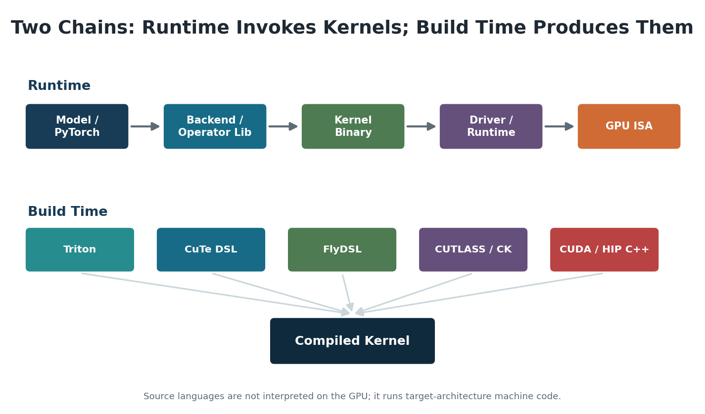

*图 1：运行时在“选并调用已有 Kernel”，构建时在“产生 Kernel”。Triton、CuTe DSL、FlyDSL 不会作为一层留在每次运行时调用链中。*

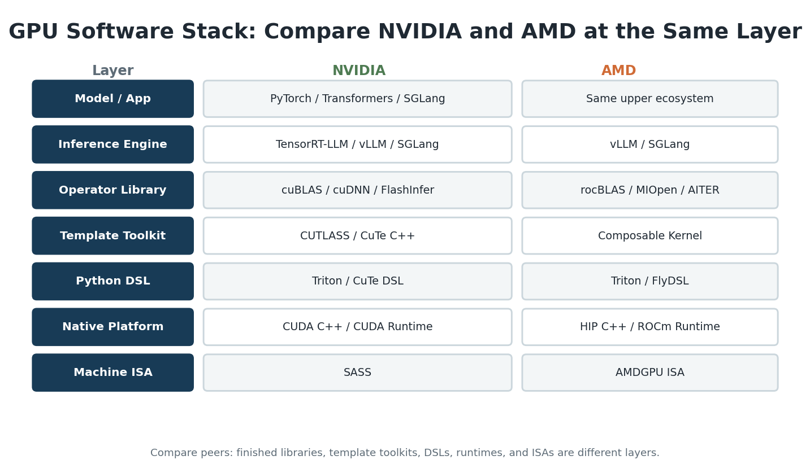

*图 2：同层才适合比较。cuBLAS 与 cuDNN 是同平台不同算子域；cuBLAS 与 CUTLASS 是成品库与 Kernel 构建组件的关系。*

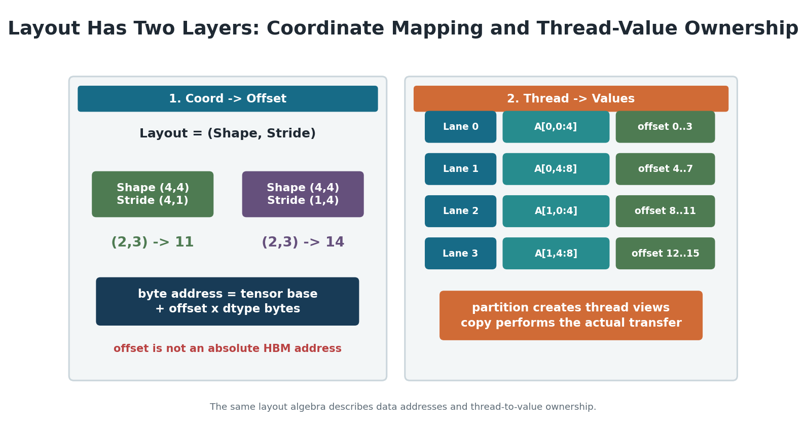

*图 3：数据摆放至少有两层：坐标到 offset 的映射，以及 block/thread/value 对元素的 ownership（所有权）映射。*

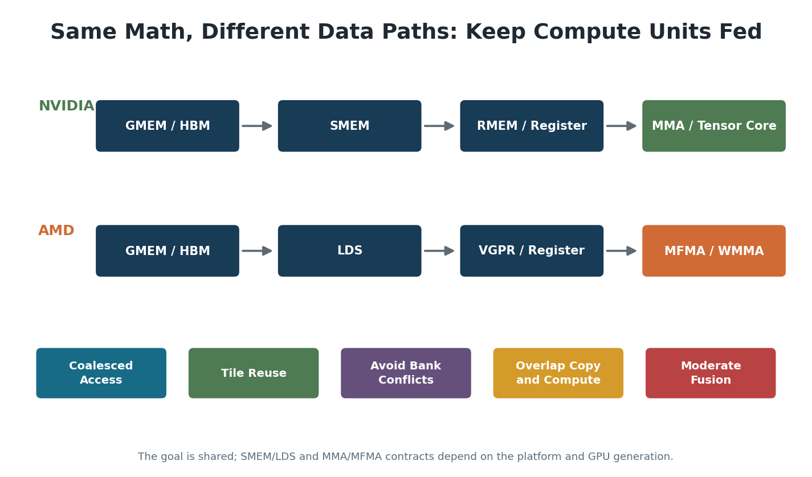

*图 4：相同的数学结果可以有完全不同的数据路径。Layout、Copy Atom、Tiled Copy、MMA fragment 和流水调度共同决定机器是否一直有活干。*

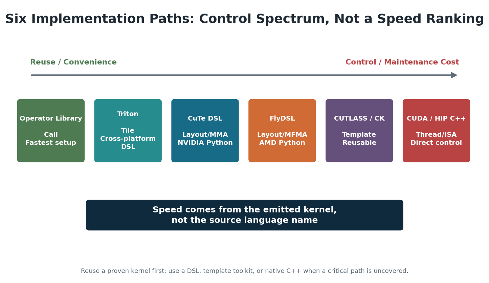

*图 5：这是控制接口与工程成本的光谱，不是性能排行榜。最终速度必须比较同 shape、同 dtype、同硬件上的具体实现。*

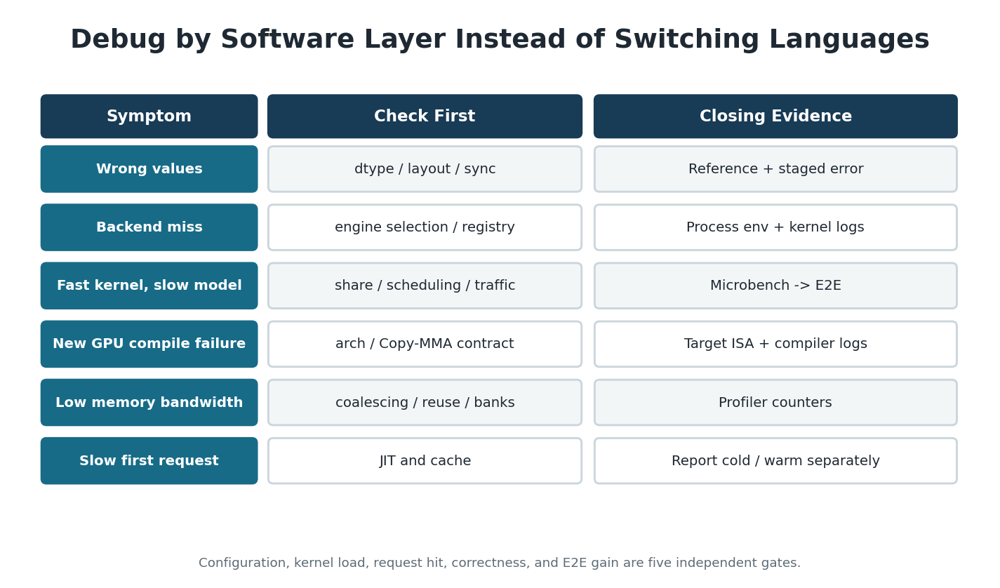

*图 6：配置文件存在、代码编译成功、Kernel 被加载、请求实际命中，是四个不同阶段。任何一层的“有”都不能替代下一层的证据。*

---

## 完整技术正文


<!-- SOURCE-BEGIN id=02 source=02_triton_article.md sha256=20555d5880250a7d973412cd26f62780fe7ac9835c532a8cfb6d3722b7fd7568 body_sha256=a2663407ef02f20fbd86d96e1829e84cb5ac2f2958382058f8ccbbbd1b327c2a -->
## 原稿 #2：已有 CUDA 和 ROCm，为什么还需要 Triton？

> CUDA（Compute Unified Device Architecture，NVIDIA GPU 软件平台）和 ROCm（Radeon Open Compute，AMD GPU 软件平台）已经能运行 GPU 程序，为什么还需要 Triton？


上一篇《5D KV Cache 到底是什么》讲的是数据怎么摆。这一篇顺着数据继续追：**到底用什么程序读取和计算这些数据？**

先说一句结论：

> **Triton 是一门用 Python 编写 GPU（Graphics Processing Unit，图形处理器）程序的语言，也是一套把这些程序编译成 GPU 机器码的编译器。**

它不是注意力机制，不是 KV（Key/Value，键/值向量）Cache 机制，也不是完整推理引擎；但开发者可以用它实现 Attention（注意力计算）、矩阵乘、Softmax（归一化函数）等 GPU 算子。


### Triton 从哪里来

Triton 的基础来自 Philippe Tillet、H. T. Kung 和 David Cox 在 2019 年发表的论文：*Triton: An Intermediate Language and Compiler for Tiled Neural Network Computations*。

原始创建者 Philippe Tillet 后来加入 OpenAI。2021 年 7 月，OpenAI 发布并开源 Triton 1.0，希望让没有多年 CUDA 经验的研究人员，也能写出接近专家手工优化水平的 GPU 程序。

项目最初位于 `openai/triton`，现在迁移到 `triton-lang/triton`，由社区继续维护。2021 年发布时主要面向 NVIDIA GPU；当前官方仓库已列出 NVIDIA GPU 和 AMD GPU 支持。

这里还要排除一个同名产品：**NVIDIA Triton Inference Server 是模型服务平台，与本文的 Triton 编程语言不是一个项目。**


### 先把几个词说清楚

| 词 | 说的是什么 |
|---|---|
| **kernel** | GPU 上真正执行的程序。一个算子可以有多个 kernel 实现 |
| **算子** | 一个计算步骤的名字，比如“做一次 Attention” |
| **Triton** | 用 Python 编写高性能 GPU 程序的语言和编译器 |
| **CUDA C++** | 面向 NVIDIA CUDA 平台的底层 GPU 编程方式 |
| **HIP C++** | HIP（Heterogeneous-Compute Interface for Portability）是 AMD ROCm 常用的 GPU C++ 编程接口 |
| **AITER** | AI（Artificial Intelligence，人工智能）Tensor Engine for ROCm，AMD 面向 ROCm 的高性能算子库 |
| **CK** | Composable Kernel，AMD 的 C++ 模板算子库，不是编程语言 |
| **FA3** | FlashAttention-3，面向 NVIDIA GPU 的 Attention 实现 |
| **Prefill** | 预填充阶段：把输入的一段 token 一次处理 |
| **Decode** | 解码阶段：每个请求通常一次生成一个 token；服务可以同时处理多个请求 |
| **PagedAttention** | 代码标识中常缩写为 PA；让 Attention 按页表读取非连续 KV Cache 的算法与执行接口，主要解决服务端 KV Cache 的内存管理问题 |
| **FlashAttention** | Input/Output-aware exact attention（面向输入输出数据搬运优化的精确注意力算法），通过分块减少 GPU 高带宽显存与片上存储之间的读写 |
| **layout** | 布局：数据在显存里按什么顺序摆 |
| **backend** | 后端：框架把某一步交给谁去算 |

后面看到的 `pa_decode`，意思就是“**解码阶段读取分页 KV Cache 的 Attention kernel**”。

#### 最容易混淆的一点

```text
PagedAttention：先根据页表找到历史 K/V 在哪里
FlashAttention：再用分块与 IO 优化高效完成 Attention 计算
```

两者优化对象不同，可以出现在同一条推理链中。PagedAttention 不是 FlashAttention 的子集，FlashAttention 也不负责 KV Cache 的分配、回收和页表映射。


### Triton 为什么会出现

神经网络框架已经有很多现成算子，CUDA 和 ROCm 也能编写 GPU 程序，为什么还需要 Triton？

因为高层框架与底层 GPU 编程之间有一道工程鸿沟：

```text
PyTorch：容易调用现成算子，但难以控制内部数据搬运和融合

CUDA C++ / HIP C++：控制力强，但线程、共享内存、同步和调优都很复杂

Triton：用接近 Python 的方式编写自定义 GPU 程序，由编译器处理更多底层细节
```

OpenAI 发布 Triton 时明确列出的目标，是用更少代码实现高性能自定义算子。它会自动处理部分显存合并访问、共享内存管理和线程块内部调度；开发者仍需决定数据如何切块，以及不同程序实例如何协作。

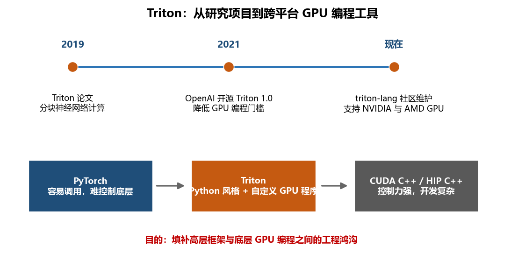

所以 Triton 节省的是**编写和维护 GPU 算子的工程成本**，不是绕过 CUDA 或 ROCm。


### Triton 能写什么

Attention 只是 Triton 的一个应用。官方教程还直接给出了这些实现：

| 官方教程 | 解决什么问题 |
|---|---|
| Vector Add | 向量逐元素加法，展示最基本的并行与越界保护 |
| Fused Softmax | 把读取、归一化和写回融合，减少中间张量与显存流量 |
| Matrix Multiplication | GEMM（General Matrix Multiply，通用矩阵乘），展示数据分块与 Tensor Core 使用 |
| Low-Memory Dropout | 用可重现随机数减少掩码存储 |
| Layer Normalization | 融合归一化计算 |
| Fused Attention | 用 Triton 实现 FlashAttention v2 算法 |
| Grouped / Persistent / Block-scaled GEMM | 覆盖分组、持久化和块缩放矩阵乘 |

推理框架还会用 Triton 编写 KV Cache 搬运、量化或反量化、激活函数融合等程序。具体实现是否存在，要看对应框架和版本，不能因为 Triton“能写”就认为当前运行时“一定用了”。


### Triton 不能替代什么

Triton 主要解决 GPU 计算程序，不负责完整推理服务：

```text
完整推理服务
├─ Web 服务、请求调度、批处理       → 推理引擎
├─ 分词器                           → 中央处理器侧文本处理
├─ 分页、缓存回收、进程管理          → 推理引擎
├─ 跨卡与跨机通信                   → 集合通信与远程内存访问库
└─ GPU 计算热点                     → Triton / CUDA C++ / HIP C++ / 模板库 / 汇编
```

它也不能绕开底层平台：在 NVIDIA GPU 上仍依赖 CUDA 驱动，在 AMD GPU 上仍依赖 ROCm 驱动。Triton 替代的是一部分**手写 CUDA C++ 或 HIP C++ 的工作量**。

### 一个最小 Triton 例子

假设要让 GPU 做最简单的逐元素加法：

```text
C[i] = A[i] + B[i]
```

下面不是完整代码，而是保留核心逻辑的简化版本：

```python
@triton.jit
def add_kernel(a, b, out, n, BLOCK: tl.constexpr):
   block_id = tl.program_id(0)
   offsets = block_id * BLOCK + tl.arange(0, BLOCK)
   mask = offsets < n
   x = tl.load(a + offsets, mask=mask)
   y = tl.load(b + offsets, mask=mask)
   tl.store(out + offsets, x + y, mask=mask)
```

逐行翻译：

1. `@triton.jit`：第一次运行时，由 Triton 即时编译这段程序。
2. `program_id`：当前处理第几个数据块。
3. `offsets`：这个数据块负责哪些元素。
4. `mask`：最后一个数据块可能不满，越界位置不要读写。
5. `load / store`：从显存读取，计算后写回。

这里没有手工指定“第几个线程处理第几个元素”。开发者描述的是**一块数据如何处理**，编译器负责继续映射到 GPU 执行资源。这就是 Triton 比底层 GPU 代码更容易写的关键。

但 Triton 也不是“写 Python 就自动最快”。数据块大小、读取顺序、并行数量和硬件特性仍会显著影响性能。


### 回到一次实际排障：到底换掉了什么

在一次 MI300X 推理验证中，AITER Attention 路径遇到 K/V layout 错误。为了先恢复服务，我们把 Attention 后端切到 Triton：

```text
--attention-backend aiter
→ AITER Attention 路径报错

--attention-backend triton
→ 改用 Triton 编写的 Attention 实现
```

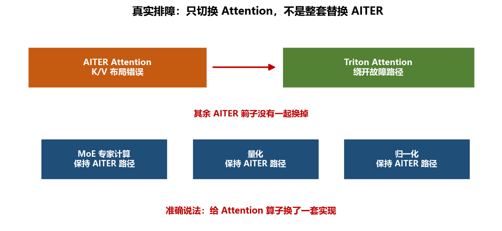

这不是“AITER 被 Triton 整套替换”，而是“一个算子换了实现路径”。

把整个推理服务想成一家餐厅：

| 计算步骤 | 当时使用的路径 | 切换 Triton 后 |
|---|---|---|
| Attention | AITER Attention | **改成 Triton Attention** |
| MoE 专家计算 | AITER 相关算子 | 保持不变 |
| 量化 | AITER 相关算子 | 保持不变 |
| 归一化 | AITER 相关算子 | 保持不变 |

不是“中央厨房关门，换了一家厨房”，而是“Attention 这道菜原来的灶坏了，先换另一个灶做”。

为什么不一直用 Triton？因为“能稳定运行”和“针对硬件做到最快”是两个目标：

- Triton 路径通常适合快速实现新算子、验证功能，也常被用作稳定回退路径。
- AITER 可以为 AMD GPU 提供更深的硬件定制和已调优程序，但特定模型形状、数据布局或运行模式尚未适配时，也可能失败。
- 修复完成后，可以再切回 AITER 路径做性能验证；不能因为一次失败，就断言所有 AITER 算子都有问题。

这也是本文最重要的工程经验：**后端切换必须精确到“哪个算子、哪个阶段、哪个模型形状、哪个版本”，不能只说“AITER 换成 Triton”。**


### 一个配置项，展开之后是四层

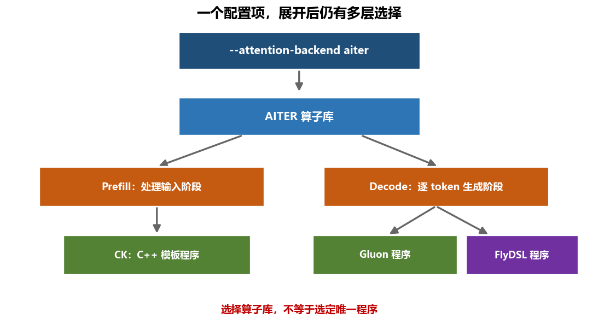

从上到下四层，每层都能独立变化：

1. 你在启动脚本里选了 `aiter`
2. AITER 是一个算子库，里面有很多算子
3. Prefill 和 Decode 用的是**不同的算子**
4. 同一个算子还有**多套实现**，用不同语言写成

大部分人的认知停在第 1 层，以为选完就定了。实际上后面三层还在继续分叉。


### 为什么 Prefill 和 Decode 要分开做

上面第 3 层说“两个阶段用不同的算子”，这一步值得单独说清楚，因为它是后面所有分叉的起点。

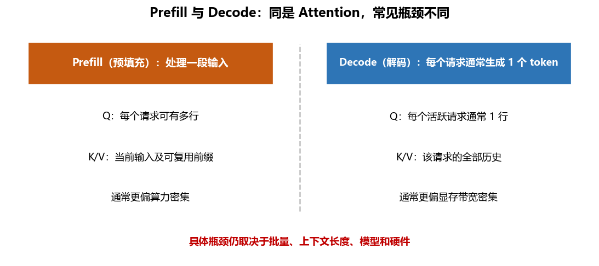

同样是算 Attention，两个阶段的形状完全不同：

| | Prefill（读题） | Decode（逐字答） |
|---|---|---|
| 一次处理多少 token | 每个请求处理一段输入 | 每个请求通常生成 1 个；批次内可有多个请求 |
| Q 的形状 | 每个请求可有多行 | 每个活跃请求通常 1 行 |
| 要读的 K/V | 当前输入及可复用前缀 | 每个请求自己的历史 K/V |
| 常见瓶颈 | 通常偏算力密集 | 通常偏显存带宽密集 |

打个比方：Prefill 像考试前把整张卷子读一遍，Decode 像一个字一个字往答题卡上写，而且每写一个字都要把前面读过的内容再翻一遍。

瓶颈不同，优化手段也不同：Prefill 通常更关注大块计算效率，Decode 通常更关注如何少搬数据、连续读数据。具体瓶颈仍取决于批量大小、上下文长度和硬件。

**所以它们不只是“两个 kernel”，甚至可能是“两种语言写的 kernel”**——这就是后面要说的事。


### 先把四类东西分开

这几个名字之所以容易混，是因为它们根本不是同一类东西：

| 名字 | 它是什么 | 类比 |
|---|---|---|
| FlashAttention / FA3 | **Attention 计算算法与实现**：规定如何分块计算、减少数据搬运 | 高效加工方法 |
| PagedAttention | **分页 KV Cache 访问机制**：通过页表定位并读取非连续 K/V | 仓库货架与取货清单 |
| AITER、FlashInfer | **算子库**：把做好的算子打包给你 | 中央厨房 |
| Triton、Gluon、FlyDSL | **领域专用语言**：用较高层表达 GPU 程序 | 厨具和手法 |
| CK、Opus | **C++ 模板库**：组合并生成 GPU 程序 | 模具和生产线 |
| 手写汇编 | **底层实现方式**：直接安排 GPU 指令 | 手工精加工 |
| `--attention-backend aiter` | **框架的开关**：这一步交给谁 | 点菜时选哪家厨房 |

一句话：**FlashAttention 主要优化 Attention 怎么算，PagedAttention 主要优化历史 K/V 怎么存取；实现工具决定怎么写成 GPU 程序，算子库负责打包交付，框架开关决定调用哪条路径。**

这些层可以组合。同一个算子可以有多条实现路径，同一个算子库也可以同时包含多种实现技术。


### AITER 是什么

AITER 全称 AI Tensor Engine for ROCm，是 AMD 的高性能算子库。它的官方说明里有一句话是理解这篇文章的关键：

> Multiple kernel backends — Triton, Composable Kernel (CK), and hand-tuned ASM

其中 ASM 是 Assembly（汇编）的缩写。也就是说，**AITER 本身不是一种写法**。它是一个把 Triton、CK（Composable Kernel，AMD 的 C++ 模板算子库）、手写汇编等多种写法打包在一起的集合，对外提供统一的 Python/C++ 接口。

所以“我用了 AITER”这句话，信息量约等于“我在这家中央厨房点了菜”——具体用了哪个算子、哪套实现、是否回退到其他路径，都还没说。


### 六种常见实现路径

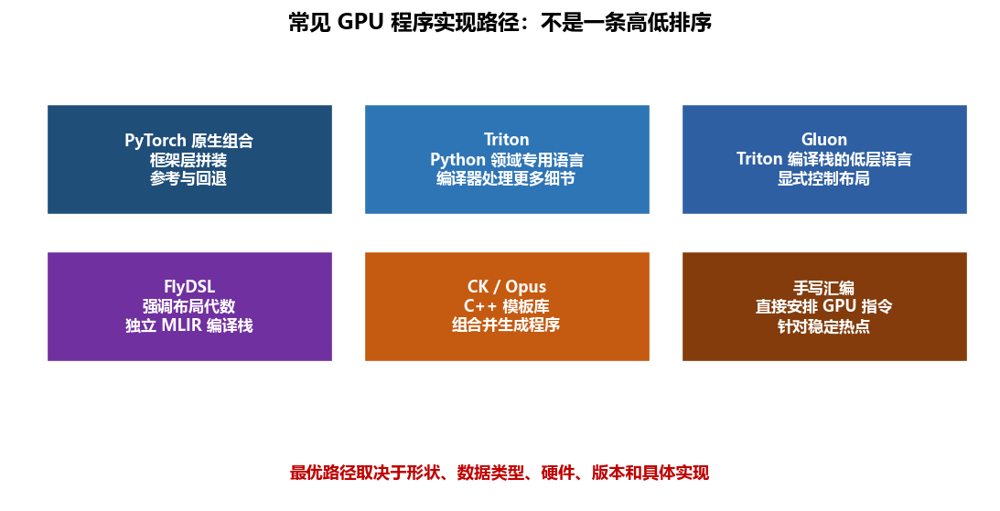

它们不是一条严格的高低排序，也不能只凭名字判断谁更快：

| 实现路径 | 它是什么 | 适合做什么 |
|---|---|---|
| PyTorch 原生组合 | 用现有算子拼出计算 | 参考实现、回退路径、快速验证 |
| Triton | Python 领域专用语言 | 让编译器处理较多布局和调度细节 |
| Gluon | Triton 编译栈上的低层语言 | 显式控制布局、内存和流水线 |
| FlyDSL | 基于 MLIR（Multi-Level Intermediate Representation，多层中间表示）、强调布局代数的 Python 语言 | 表达切块、分区、数据搬运和指令结构 |
| CK / Opus | C++ 模板库 | 组合并生成特定形状的高性能程序 |
| 手写汇编 | 直接编写 GPU 指令 | 针对稳定热点做极限优化 |

一个算子库同时保留多条路径，是因为不同形状、数据类型和硬件的最优实现可能不同。矩阵乘（GEMM，General Matrix Multiply）等规整计算常适合模板化生成；访存敏感的解码程序则更依赖具体的数据布局和流水线安排。


### Triton 和 Gluon：自动挡与手动挡

这两个最容易混，因为它们**共用同一套编译器**。

Triton 官方教程里对 Gluon 的定义很直接：

> Gluon is a GPU programming language based on the same compiler stack as Triton. But unlike Triton, Gluon is a lower-level language that gives the user more control and responsibility.

翻译成人话：

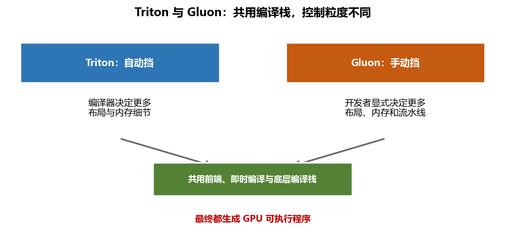

- **Triton 是自动挡**：你写“我要算这个矩阵乘”，数据块（tile）怎么切、共享内存怎么分配、指令怎么排，编译器替你决定。
- **Gluon 是手动挡**：同一辆车、同一个发动机，但换挡交给你。数据块怎么切、内存怎么分、流水线怎么排，全部手写。

两者共享编译器前端和即时编译（JIT，Just-In-Time，运行时才把代码编译成机器码）基础设施，最后编译出的都是同一块 GPU 上的机器码。区别只在于**谁做决定**。

所以在 AITER 里会看到 `aiter.ops.triton.gluon.pa_decode_gluon` 这样的路径。AITER 把这套 Gluon 实现组织在 `triton/gluon` 目录下；官方 Triton 文档同时确认，Gluon 与 Triton 共用编译栈、前端和即时编译基础设施。


### FlyDSL 是什么，为什么它和上一篇直接相关

FlyDSL 的全称是 **Flexible Layout Python DSL**。这里的 DSL 是 Domain-Specific Language（领域专用语言），意思是“专门干一件事的编程语言”。它由 AMD 开源，基于 MLIR（一套用来搭编译器的通用框架）自成一条编译链路。

注意它名字里的那个词：**layout**。

FlyDSL 的核心抽象只有三个：

```text
Shape   —— 每个维度多大
Stride  —— 相邻元素隔多远
Layout  —— (Shape, Stride) 组成的映射
```

映射规则就一行：

```text
Index = dot(Coord, Stride)
```

看到这里应该有种熟悉感——**上一篇讲的 5D KV Cache，本质就是一组 Shape 和 Stride**。第一篇里我们手工推的"地址顺序"，在 FlyDSL 里是一等公民，可以直接做代数运算（composition、product、divide、partition）。

换句话说：上一篇讲的是"数据怎么摆"，FlyDSL 是"用来描述怎么摆的语言"。

两个补充事实，避免误解：

- FlyDSL 是 AITER 的**必需依赖**，装 AITER 就会装上它。
- 它的官方仓库带了一句 Disclaimer：这是实验性工具，不属于官方 ROCm 发行版。


### FA3 和 AITER 是什么关系

很多人以为 FA3（FlashAttention-3）是"更新更强的算法"，所以哪里都该用。

看一眼 SGLang 里 attention backend 的可选值就清楚了，源码里是**按平台分组**写的：

```text
# Common
triton, torch_native, flex_attention, dsa, dsv4

# NVIDIA specific
cutlass_mla, fa3, fa4, flashinfer, flashmla,
trtllm_mla, cutedsl_mla, trtllm_mha, ...

# AMD specific
aiter, wave

# Other platforms
intel_amx, ascend, intel_xpu
```

`fa3` 在 **NVIDIA specific** 组里，`aiter` 在 **AMD specific** 组里。

在 SGLang 的命令行选择层，它们是并列选项；但底层类别仍不同：`fa3` 指向特定 Attention 实现，`aiter` 指向包含多类算子的库。源码把 `fa3` 放在 NVIDIA 专用组、把 `aiter` 放在 AMD 专用组，因此 MI300X 不能把 FA3 当作 AITER 的直接替代项。


### 下面的实现细节限定在哪个版本

后面两节只分析公开 SGLang fork 的提交 `878fff156`。其中 `vectorized_5d`、Gluon / FlyDSL 切换和 Draft worker 覆盖，是这个快照里的具体实现，不能直接外推到所有 SGLang、AITER 版本或所有模型。

前面提到的 AITER → Triton 排障发生在更早的软件栈，作用是说明“算子库与具体实现路径的区别”，不能与这个后续快照混成同一次运行。


### 实锤一：同一份 KV Cache，两种语言的 kernel 在读

上一篇分析的那个 `vectorized_5d`，源码注释写得很清楚（原文节选）：

> "vectorized_5d" allocates K as (num_blocks, H_kv, head_dim/x, page_size, x) and V as (num_blocks, H_kv, page_size/x, head_dim, x) (x = 16 / dtype_size), **matching the SHUFFLE layout that aiter's CK FmhaBatchPrefill kernel and `aiter.ops.triton.gluon.pa_decode_gluon` both consume natively.**

把这句拆开：

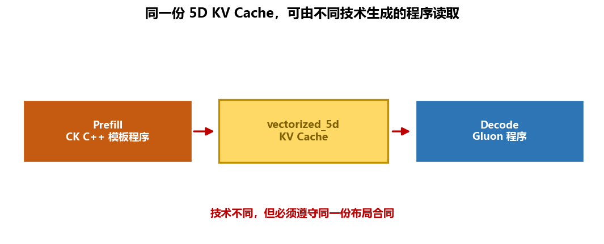

- Prefill 阶段读它的，是 **CK** 写的 `FmhaBatchPrefill`——C++ 模板。（名字里的 Fmha = Fused Multi-Head Attention，融合的多头注意力）
- Decode 阶段读它的，是 **Gluon** 写的 `pa_decode_gluon`——一种 Python 领域专用语言。

一份数据，两个用完全不同语言写出来的 kernel 在读，而且都要求“直接读、不在运行时做重排（permute）”。

这正是上一篇说的"layout 是数据合同"——合同的两端，可能是两个世界的代码。


### 实锤二：同一次推理，不同层用不同实现

AITER 的 paged decode 还有一个开关：

```text
SGLANG_AITER_PA_DECODE_IMPL   默认值 "gluon"，可选 "flydsl"
```

它的源码注释是这一篇最值得记住的一句（原文节选）：

> "gluon" preserves the existing AITER path. "flydsl" is an opt-in ... path for sink-free full-attention target verification; **SWA/sink layers remain on AITER Gluon.**

最后半句的意思是：

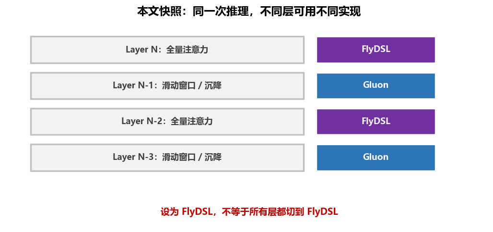

*（层的排布因模型而异，图中只是示意）*

这里出现了三个新词，先解释：

- **full attention（全量注意力）**：每个 token 都看得到前面所有 token。
- **SWA（Sliding Window Attention，滑动窗口注意力）**：每个 token 只看最近的一段窗口，超出窗口的就不看了，省显存也省算力。
- **attention sink（注意力沉降）**：把最开头的少数几个 token 始终保留为可见，这几个位置像锚点，去掉会明显掉精度。

现在再看那句注释的意思：即使你把开关设成 `flydsl`，也**只有全量注意力那部分层换了实现**，滑动窗口和注意力沉降相关的层仍然跑在 Gluon 上。

所以在这个快照和这条模型路径里，“我设了 flydsl”仍不够准确；应说“符合条件的全量注意力层切到了 FlyDSL，其他相关层仍使用 Gluon”。

到这里，第一篇结尾那个问题就有答案了：

```text
--attention-backend aiter   两边一样
KV layout                   两边一样
但 PA_DECODE_IMPL 不同      → decode kernel 完全不同
甚至同一个值                → 不同层还是不同实现
```

配置文本相同，跑的东西可以完全不同。


### 怎么确认运行时到底用了哪个

沿用上一篇的思路，仍然是不要只看启动脚本：

| 层级 | 要确认什么 |
|---|---|
| 框架开关 | `--attention-backend` 的实际值 |
| 实现开关 | `SGLANG_AITER_PA_DECODE_IMPL` 的实际值（注意默认值是 gluon，不是空） |
| 依赖版本 | `pip show aiter` / `pip show flydsl`，实现随版本变 |
| kernel 日志 | 实际加载的 Prefill/Decode kernel 名字 |
| 分层情况 | 全量注意力层和滑动窗口 / 注意力沉降层是否走了不同实现 |

一个通用的检查思路：

```bash
# 环境变量的实际值（注意读的是进程环境，不是你的 shell）
tr '\0' '\n' < /proc/<pid>/environ | grep -E 'ATTENTION|AITER|FLYDSL'

# 实际加载了哪些 kernel
grep -E 'mha_batch_prefill|pa_decode|gluon|flydsl' server.log
```

只看到环境变量，只能说明“请求了这个实现”。还应结合启动日志、加载路径或性能分析工具，确认实际执行程序；单看性能数字也不能反推出具体实现。


### 五个常见误区

| 误区 | 正确理解 |
|---|---|
| AITER 是一种 kernel | AITER 是算子库，里面可以包含领域专用语言、C++ 模板和汇编等多条实现路径 |
| Gluon 是 AITER 自己发明的 | Gluon 是 Triton 编译栈上的低级语言，AITER 只是用它 |
| Triton 和 Gluon 是竞品 | 同一套编译器，区别是谁管 layout 和调度 |
| FA3 比 AITER 新，应该换 | 在 SGLang 中两者面向不同硬件；而且一个是特定实现，一个是算子库入口 |
| 设了 flydsl 就全模型生效 | 在本文快照中，只有符合条件的全量注意力层切换，其他相关层仍在 Gluon |


### 三句话记住

**层次**：算法、算子库、写 kernel 的语言、具体实现，是四件事，不是一件。

**关系**：AITER 是算子库；Triton、Gluon、FlyDSL 是不同层次的领域专用语言；CK 是 C++ 模板库；FA3 是特定 Attention 实现。

**验证**：配置文本相同，跑的 kernel 可以完全不同——只有 kernel 日志能作数。


### 公开资料

1. OpenAI：2021 年发布 Triton 1.0 的背景、目标与编程模型
   https://openai.com/index/triton/

2. Triton 当前官方仓库：语言、编译器与硬件支持
   https://github.com/triton-lang/triton

3. Triton 官方教程：向量加法、Softmax、矩阵乘、LayerNorm、Attention 等
   https://triton-lang.org/main/getting-started/tutorials/

4. Triton 2019 论文：*An Intermediate Language and Compiler for Tiled Neural Network Computations*
   https://www.eecs.harvard.edu/~htk/publication/2019-mapl-tillet-kung-cox.pdf

5. AITER 官方仓库（AI Tensor Engine for ROCm，含 backend 说明）
   https://github.com/ROCm/aiter

6. FlyDSL 官方仓库（Flexible layout python DSL，含 layout 代数与编译流程）
   https://github.com/ROCm/FlyDSL

7. Triton 官方 Gluon 教程（Gluon 与 Triton 的定位差异）
   https://github.com/triton-lang/triton/blob/main/python/tutorials/gluon/01-intro.py

8. ROCm Composable Kernel（CK）
   https://github.com/ROCm/composable_kernel

9. 公开 SGLang fork 快照：attention backend 可选值按平台分组
   https://github.com/sammysun0711/sglang/blob/878fff15647fe3dabb32aa3a335b0ad16e3ee878/python/sglang/srt/server_args.py

10. 公开 SGLang fork 快照：KV layout 与 PA decode 实现开关及其注释
   https://github.com/sammysun0711/sglang/blob/878fff15647fe3dabb32aa3a335b0ad16e3ee878/python/sglang/srt/environ.py

11. FlashAttention 原始论文：面向 GPU 内存层级的数据搬运优化
   https://arxiv.org/abs/2205.14135

12. PagedAttention 原始论文：面向大模型服务的 KV Cache 分页管理
   https://arxiv.org/abs/2309.06180
<!-- SOURCE-END id=02 -->

---

<!-- SOURCE-BEGIN id=08 source=08_flydsl_article.md sha256=e2d0ddc01bd2399efe5fd8eabc0e27ed078276aa06cc46703afced60811c72cb body_sha256=657b933e2fd59a8bb6fc0ccce97a28df5bef917294c12859270230660eb72615 -->
## 原稿 #8：Triton、FlyDSL、CK、HIP C++ 到底差在哪？10 张图讲清显卡 Kernel 技术栈

> ROCm 不是一种 kernel 写法；RoPE 也并未缺席，它经常被融合进相邻算子。读完这篇，你会知道各层工具分别解决什么问题，以及 FlyDSL 为什么会出现在 ROCm 推理栈里。


前文梳理 AITER（AI Tensor Engine for ROCm，AMD 面向 ROCm 的高性能 AI 算子库）时，曾列出 Triton、FlyDSL、CK（Composable Kernel，基于 HIP C++ 的分块内核库）和手写汇编等几种 kernel 实现路径。

当时对 FlyDSL 只给了一行字。这一篇把它讲透。

先说结论：

> **Triton 让编译器推导大部分线程级布局；FlyDSL 把 layout 代数显式交给开发者。**
>
> 这是理解两者分工的主线，但不是两套工具链的全部差异。

而那个「数据怎么摆」，专业点叫 **layout**。它是这一篇真正的主角——FlyDSL 的全称就是 Flexible Layout Python DSL。

顺便把一个高频误会也解了：**ROCm 不是一种写 kernel 的方式**，它对标的是 CUDA；真正对标 CUDA C++ 的是 **HIP C++**。这两者经常被混在一起，第二节专门拆。


### 先把几个词说清楚

| 词 | 说的是什么 |
|---|---|
| **GPU** | Graphics Processing Unit，图形处理器，也就是这里所说的显卡计算芯片 |
| **kernel** | GPU 上真正跑起来的那段程序 |
| **layout** | 布局：数据在显存里按什么顺序摆 |
| **tile** | 瓦片：把一个大矩阵切成的小块 |
| **DSL** | Domain-Specific Language，领域特定语言，为一类问题专门设计的语言 |
| **MLIR** | Multi-Level Intermediate Representation，多层中间表示编译器基础设施 |
| **IR** | Intermediate Representation，中间表示，源代码和机器码之间的编译器数据结构 |
| **dialect** | MLIR 里的「方言」，一套自定义的指令和类型 |
| **LDS** | Local Data Share，AMD GPU 上的片上共享内存，比显存快但容量小 |
| **MFMA** | Matrix Fused Multiply-Add，AMD GPU 的矩阵融合乘加指令 |
| **JIT / AOT** | Just-In-Time（即时编译）/ Ahead-Of-Time（提前编译） |
| **wavefront** | AMD GPU 上一组一起执行的线程；NVIDIA 上对应的概念叫 warp |


### 一、layout 到底是什么

这是整篇的地基。如果这一节看懂了，后面都是水到渠成。

#### 一个矩阵在显存里其实是一条直线

显存是**一维**的，就是一长条地址。但我们脑子里的矩阵是**二维**的。

所以必须有一个规则，把「第 r 行第 c 列」翻译成「第几个地址」。**这个规则就是 layout。**

FlyDSL 官方文档把它写成一个公式：

```
Index = dot(Coord, Stride) = Σ cᵢ × sᵢ
```

翻译成人话：**把坐标和步长逐位相乘再相加，就得到地址。**

- **Shape（形状）**：矩阵多大，比如 `(2, 4)`
- **Stride（步长）**：每个维度走一格，地址要跳多远
- **Layout** = Shape 和 Stride 这一对

#### 举个具体例子

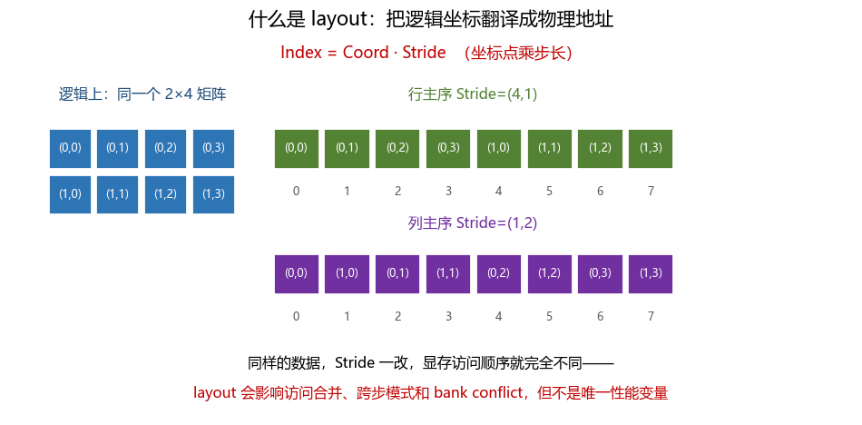

*图 1：同一个逻辑矩阵可以对应不同的物理地址顺序。根据 FlyDSL 官方 Layout Guide 整理。*

一个 2 行 4 列的矩阵，逻辑上就 8 个格子。但它在显存里可以有完全不同的摆法：

**行主序**，`Stride = (4, 1)`：
- 行走一格跳 4，列走一格跳 1
- 坐标 `(1, 2)` → `1×4 + 2×1 = 6`
- 显存顺序：`(0,0) (0,1) (0,2) (0,3) (1,0) (1,1) (1,2) (1,3)`

**列主序**，`Stride = (1, 2)`：
- 行走一格跳 1，列走一格跳 2
- 坐标 `(1, 2)` → `1×1 + 2×2 = 5`
- 显存顺序：`(0,0) (1,0) (0,1) (1,1) (0,2) (1,2) (0,3) (1,3)`

**同样的数据，同样的逻辑坐标，Stride 一改，物理访问顺序完全不同。**

#### 为什么这件事决定性能

GPU 读显存时，一组线程访问连续且对齐的地址，通常更容易合并成较少的内存事务；访问跨步且分散时，往往需要更多事务。

所以同一个算法，layout 不同可能产生明显的带宽利用率差异。再加上 LDS 的 bank conflict（存储体冲突）、寄存器分块是否对齐 MFMA 形状——**这些都和 layout 有关。**

> 一句话：**写高性能 kernel，大部分时间不是在想「算什么」，而是在想「数据怎么摆、谁读哪一块」。**

这就是 FlyDSL 要解决的问题。


### 二、先澄清一个高频误会：ROCm 不在这根轴上

讲 Triton 之前，得先把一个特别容易混的地方拆开。

很多人会问：「你说 Triton 决定 layout，那 **ROCm** 呢？**C++** 呢？」

问题出在——**这是两根不同的轴**。

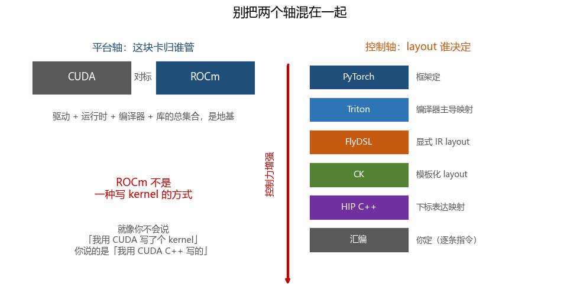

*图 2：ROCm/CUDA 是平台轴；Triton、FlyDSL、CK、HIP C++ 属于 kernel 实现与控制方式。作者根据官方文档整理。*

| 轴 | 问的问题 | 上面有谁 |
|---|---|---|
| **平台轴** | 这块卡归谁管 | CUDA（Compute Unified Device Architecture，NVIDIA GPU 平台）↔ **ROCm**（Radeon Open Compute，AMD GPU 开放软件平台） |
| **控制轴** | layout 谁决定 | PyTorch → Triton → FlyDSL → CK → HIP C++ → 汇编 |

**ROCm 对标的是 CUDA**，它们都包含驱动、运行时、编译器和基础库，是**地基**，不是一种 kernel 写法。

就像你不会说「我用 CUDA 写了个 kernel」——你说的是「我用 **CUDA C++** 写的」。同理，AMD 上你说的应该是「我用 **HIP C++** 写的」。

#### 那 C++ 在这里是什么？

AMD（Advanced Micro Devices，超威半导体）侧的 C++ 其实有**两个层次**，不是一个：

**1. HIP（Heterogeneous-compute Interface for Portability，可移植异构计算接口）C++ —— 原生内核语言**（对标 CUDA C++）

```cpp
__global__ void gemm(const float* A, const float* B, float* C,
                     int M, int N, int K) {
    int row = blockIdx.y * blockDim.y + threadIdx.y;
    int col = blockIdx.x * blockDim.x + threadIdx.x;
    float acc = 0.f;
    for (int k = 0; k < K; ++k)
        acc += A[row * K + k] * B[k * N + col];   // Layout is encoded in index arithmetic.
    C[row * N + col] = acc;
}
```

layout 由开发者通过 `row * K + k` 这类下标算术表达。LLVM 等编译器可以分析并优化其中一些访问模式，但源代码里没有一个可直接组合、切分的 layout 对象。

**2. CK（Composable Kernel）—— 建在 HIP C++ 之上的模板库**

CK 官方 README 的原话很关键：

> The CK library provides a **programming model** for writing performance-critical kernels... The CK library **uses general purpose kernel languages, such as HIP C++**.

也就是说，**CK 不是一种语言，它是 HIP C++ 之上的一套编程模型**。它靠两个概念做到性能可移植：

- tile-based programming model（分块编程模型）
- **Tensor Coordinate Transformation**（张量坐标变换）

第二个就是 CK 版本的 layout 代数——**和 FlyDSL 想解决的是同一个问题**，只是用 C++ 模板来表达。

#### 关键：layout 的「表达方式」差三个台阶

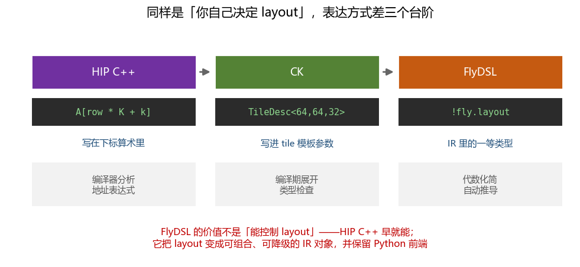

*图 3：三种低层写法都能控制地址映射，区别在于 layout 语义以什么形式进入编译器。作者根据 CK 与 FlyDSL 官方文档整理。*

这才是真正有价值的那条线。同样是「你自己决定 layout」，三种写法的差别在于**编译器能不能看懂**：

| 写法 | layout 长什么样 | 编译器能拿它做什么 |
|---|---|---|
| **HIP C++** | 一行下标算术 `A[row*K+k]` | 可以优化地址算术，但没有显式的 layout 代数对象 |
| **CK** | C++ 模板参数 | 编译期展开、类型检查 |
| **FlyDSL** | IR 里的一等类型 `!fly.layout` | **代数化简、自动推导** |

> **FlyDSL 的价值不是「能控制 layout」——HIP C++ 早就能。**
> **它的价值是把 layout 变成可组合、可降级的 IR 对象，同时保留 Python 前端。**

把这层想清楚，后面就好懂了。


### 三、那 Triton 是怎么处理 layout 的？

Triton 的设计哲学是：**开发者描述 block 级计算和访问模式，编译器负责大部分线程级映射与降级。**

你在 Triton 里写的是「这个 program instance 负责算这一片」。开发者仍能调整 block shape、访问顺序、`num_warps` 和 autotune（自动调优）候选；但通常不会像 FlyDSL 那样直接组合一个一等公民的 layout 表达式。

这带来两个后果：

**好处**：上手极快。会写 NumPy 就能写 Triton，几十行出一个能用的 kernel。

**代价**：当线程级映射不理想时，你能通过分块、访问模式和调优参数间接影响它，但可见性和控制粒度通常低于显式 layout DSL。

对大量自定义算子，这个抽象层次已经很实用。到了 GEMM（General Matrix Multiplication，通用矩阵乘）和 Attention（注意力）等热点算子，工程团队才更可能为更细的 layout 控制付出额外复杂度。


### 四、FlyDSL 是什么

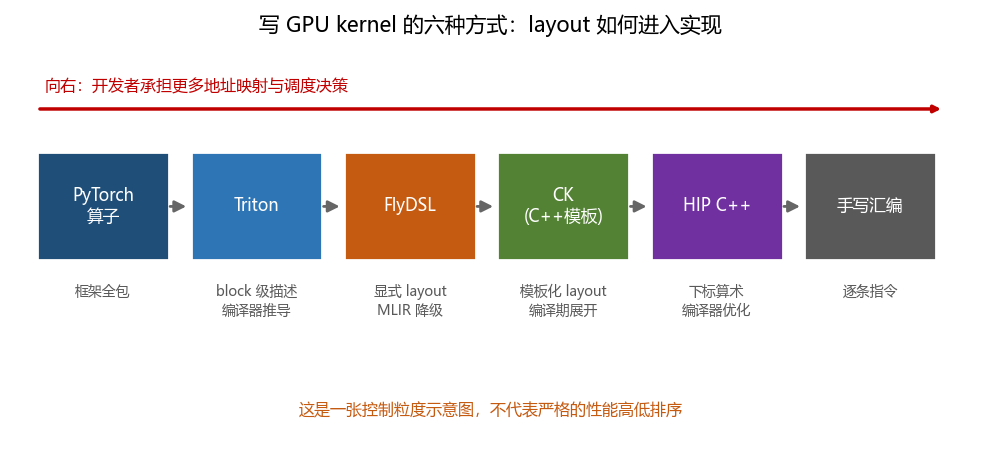

*图 4：从高层算子到汇编，开发者承担的调度与 layout 决策逐步增加；这是一张抽象示意图，不代表严格的性能排序。*

官方仓库（`github.com/ROCm/FlyDSL`，Apache-2.0，ROCm 官方组织）的自我介绍是：

> A Python DSL and a MLIR stack for authoring high-performance GPU kernels with **explicit layouts and tiling**.

关键词就是 **explicit**（显式）。

它由两部分组成：

| 部分 | 是什么 |
|---|---|
| **FlyDSL** | Python 前端，你用它写 kernel |
| **Fly dialect** | MLIR 里的一套自定义 IR，**把 layout 做成了一等公民的类型** |

第二点是它和 Triton 的本质区别。

在 Fly dialect 里，有这么几个**类型**：

```
!fly.int_tuple      整数元组
!fly.layout         布局本身就是一个类型
!fly.coord_tensor   带坐标的张量
!fly.memref         内存引用
```

**layout 不是注释，不是文档，它是编译器能看懂、能推导、能化简的 IR 类型。**

这意味着你写 `divide(A, B)` 把一个大矩阵切成小块，编译器**知道**你在切什么、切完每一块在哪、后面的访问该翻译成什么地址。它可以对这些 layout 表达式做代数化简，就像化简数学式子一样。

#### 代码长什么样

下面只展示 API 结构，省略了 load、compute 和 store；可运行版本请以 FlyDSL 官方 `examples/01-vectorAdd.py` 为准。

```python
import flydsl.compiler as flyc
import flydsl.expr as fx

@flyc.kernel
def my_kernel(A: fx.Tensor, B: fx.Tensor, block_dim: fx.Constexpr[int]):
    tid = fx.thread_idx.x
    bid = fx.block_idx.x
    # Partition with layout algebra.
    tA = fx.logical_divide(A, fx.make_layout(block_dim, 1))
    tA = fx.slice(tA, (None, bid))
    ...

@flyc.jit
def launch(A: fx.Tensor, B: fx.Tensor, n: fx.Int32):
    block_dim = 64
    grid_x = (n + block_dim - 1) // block_dim
    my_kernel(A, B, block_dim).launch(grid=(grid_x, 1, 1), block=(block_dim, 1, 1))
```

看着还是 Python。但注意 `logical_divide`、`make_layout` 这些——**你在显式地操作布局**，而不是让编译器猜。

#### 它怎么变成 GPU 二进制

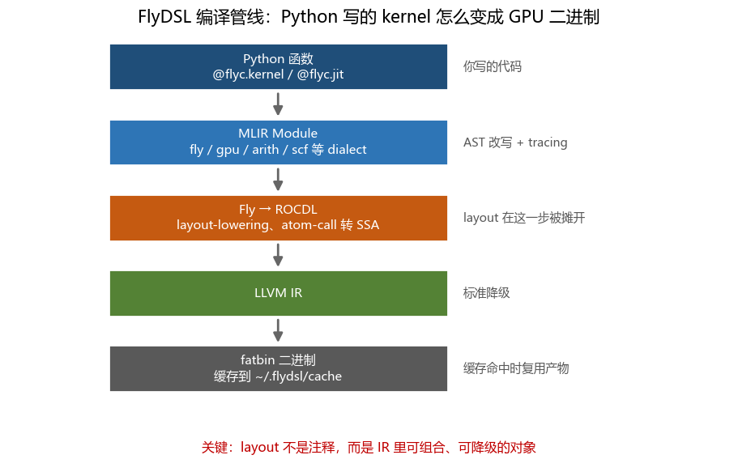

*图 5：FlyDSL 从 Python 前端经 MLIR/Fly dialect 降级到 ROCm Device Library（ROCDL）和 GPU 二进制。根据官方 Architecture Guide 整理。*

第一次调用某个尚未缓存的签名时，`@flyc.jit` 会把 Python 函数经抽象语法树（AST，Abstract Syntax Tree）改写和 tracing（追踪）转换为 MLIR 模块，然后逐层降级：

1. **Python 函数** → AST 改写 + tracing
2. **MLIR Module**（fly、gpu、arith、scf、memref、vector 等 dialect）
3. **Fly → ROCDL（ROCm Device Library，MLIR 中面向 AMD GPU 的底层方言）**：这一步执行 `fly-layout-lowering`、`fly-canonicalize` 等 pass，layout 在这里被降级为地址和 GPU 操作
4. **LLVM IR**
5. **fatbin 二进制**，缓存到 `~/.flydsl/cache/`

同样的类型签名，下次直接命中缓存，不重新编译。


### 五、layout 代数：三个操作拼出整套方案

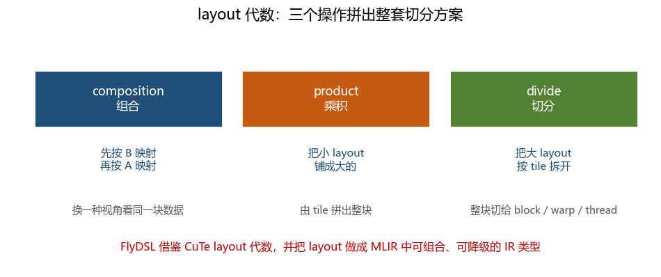

*图 6：composition、product、divide 是组织 layout 的三类核心操作。根据 FlyDSL 官方 Layout Guide 整理。*

FlyDSL 把 layout 做成类型之后，就能在上面定义**代数运算**。核心是三个：

| 操作 | 干什么 | 用在哪 |
|---|---|---|
| **composition**（组合） | 先按 B 映射，再按 A 映射 | 换一种视角看同一块数据，比如做 swizzle |
| **product**（乘积） | 把小 layout 铺成大的 | 由 tile 拼出整块 |
| **divide**（切分） | 把大 layout 按 tile 拆开 | 整块切给 block / warp / thread |

配套还有坐标映射：

- `crd2idx(coord, layout)`：坐标 → 地址
- `idx2crd(index, layout)`：地址 → 坐标

这套思想不是 AMD 原创。官方 Acknowledgements 里明确写了，它借鉴了 **NVIDIA CUTLASS 的 CuTe layout 代数**，以及论文《Categorical Foundations for CuTe Layouts》里的数学框架。

> 换句话说：**FlyDSL 可以粗略理解成「AMD 生态里的 CuTe」，但它是用 MLIR 实现的，前端是 Python 而不是 C++ 模板。**

仓库的 topic 标签里直接挂着 `cute`，没藏着。


### 六、四个层级，同一套代数

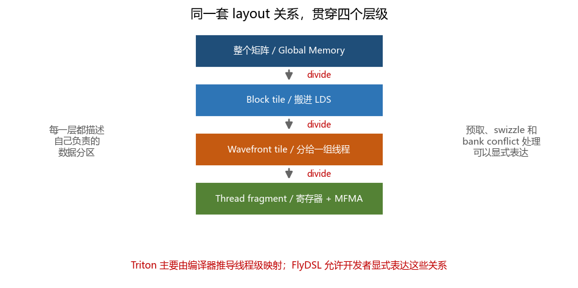

*图 7：同一套 layout 关系贯穿矩阵、block、wavefront 和 thread。根据 FlyDSL Kernel Guide 整理。*

高性能 GEMM/Attention 的标准套路，是把数据一层层往下切：

```
整个矩阵（Global Memory）
    ↓ divide
Block tile（搬进 LDS 共享内存）
    ↓ divide
Warp tile（分给一组 wavefront）
    ↓ divide
Thread fragment（落到寄存器，喂给 MFMA）
```

**每一层都是同一个 `divide` 操作，只是参数不同。**

因为每一层的 layout 都是显式的，你可以在任意一层插入优化：

- Global → LDS 时做 **vectorized copy**（一次搬 128 bit）
- LDS 里做 **swizzle** 打散地址，避免 bank conflict
- 寄存器分块对齐 **MFMA** 的形状，让矩阵指令满载
- 安排 **prefetch**，让搬运和计算重叠

在 Triton 里，这四层被编译器包办了；在 FlyDSL 里，它们摆在你面前，每一层都能动手。


### 七、和 Triton 摆在一起看

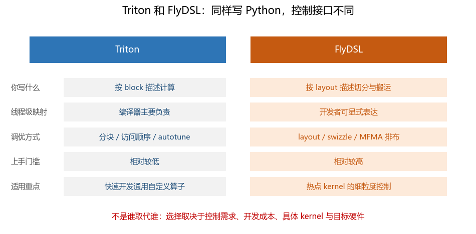

*图 8：Triton 与 FlyDSL 的主要差别在控制接口，不是简单的性能高低排序。作者根据两边官方编程模型整理。*

| | Triton | FlyDSL |
|---|---|---|
| **你写什么** | 按 block 描述计算 | 按 layout 描述切分与搬运 |
| **layout 谁定** | 编译器自动推导 | **你显式写出来** |
| **调优方式** | 调 `BLOCK_SIZE` / `num_warps` | 改 layout、swizzle、MFMA 排布 |
| **上手难度** | 低 | 高 |
| **控制粒度** | 以 block 级程序和编译器推导为主 | 显式 layout、tiling 和数据搬运 |
| **前端** | Python | Python |
| **编译栈** | 自有（基于 MLIR） | MLIR（Fly dialect） |

再把上一篇那张「五种写法」的表接上：

| 写法 | layout 谁定 | 语言 |
|---|---|---|
| PyTorch 算子 | 框架 | — |
| Triton | 编译器 | Python |
| **FlyDSL** | **你** | **Python** |
| CK（Composable Kernel） | 你 | C++ 模板（建在 HIP C++ 上） |
| HIP C++ | 你 | C++（手写下标算术） |
| 手写汇编 | 你 | 汇编 |

（再强调一遍：**ROCm 不在这张表里**。它是平台，上面每一行都跑在它上面。）

**FlyDSL 的位置很特别**：它用 Python 表达显式 layout，把一部分原本常见于 C++ 模板内核的控制面暴露出来。

这也解释了它为什么会出现：在高层 Python DSL 和 C++ 模板内核之间，工程团队需要一个既能表达 layout、又能进入 MLIR 编译管线的接口。实际性能仍取决于具体 kernel、shape、编译器版本和硬件。


### 八、在真实推理栈里，它长什么样

FlyDSL 不是个孤立的玩具，它已经被接进了 ROCm 的算子库。

在 AITER 里有一整个 `aiter.ops.flydsl` 模块：

目录 `aiter/ops/flydsl/` 下的部分文件：

| 文件 | 对应算子 |
|---|---|
| `fmha_kernels.py` | FMHA（Fused Multi-Head Attention，融合多头注意力） |
| `gemm_kernels.py` | GEMM |
| `moe_kernels.py` | MoE（Mixture of Experts，混合专家） |
| `moe_sorting.py` | MoE 排序 |
| `mla_reduce_kernels.py` | MLA（Multi-Head Latent Attention，多头潜在注意力）reduce |
| `linear_attention_kernels.py` | 线性注意力 |

用法上有个统一的模式——**它是可选依赖，用开关切换**：

```python
from aiter.ops.flydsl.utils import is_flydsl_available

if is_flydsl_available():
    # 走 FlyDSL 实现
else:
    # 回退到 CK / HIP 实现
```

比如 MLA reduce 那个文件的注释写得很直白：

> Drop-in alternative for the HIP `aiter.mla_reduce_v1`: same signature and in/out contract. Opt-in via `AITER_MLA_REDUCE_FLYDSL=1`; **production keeps the HIP kernel by default.**

**同一个算子，两套实现，环境变量决定用哪个，默认走保守的那条。** 这正是上一篇讲的「选了 aiter 不代表跑的是同一个 kernel」的具体形态。

在 SGLang 这类推理框架里，也能看到类似的开关，比如把 Paged Attention 的 decode 实现切到 FlyDSL、指定分区数之类的参数。

#### 三个工程上会踩的点

**1. JIT 编译是有代价的**

第一次跑某个 shape 会触发编译。服务刚起来的头几个请求会明显慢。

所以 AITER 里有一套 **AOT 预编译**（`aiter/aot/flydsl/`）：从调优后的 CSV（Comma-Separated Values，逗号分隔值）配置中收集 kernel 条目，提前写入缓存。延迟敏感服务可以按实际 kernel family 验证并采用这条路径，而不是假设所有算子都已预热。

**2. 缓存会骗你**

编译产物缓存在 `~/.flydsl/cache/`。改了 C++ pass 或者非闭包的辅助函数，缓存**不一定**自动失效。

官方给的办法是 `rm -rf ~/.flydsl/cache` 或者 `export FLYDSL_RUNTIME_ENABLE_CACHE=0`。

> 性能对比前要记录缓存策略；否则源码已改而二进制未更新时，测到的可能仍是旧实现。

**3. 版本漂移最要命**

FlyDSL 仍在快速演进，0.2.x 到 0.3.x 之间已经出现过**破坏性 API 变更**。

ROCm/mori 仓库里有个 `flydsl_compat.py`，注释写得明明白白：

> 0.3.0 dropped `flydsl.expr.vector` and `flydsl.expr.buffer_ops`, and turned `T.<dtype>` from a factory into a property.

翻译一下：ROCm/mori 为兼容 0.2.x/0.3.x，明确记录了两个模块被移除，以及 `T.<dtype>` 调用方式的变化。

这意味着：**两台机器上装的 FlyDSL 版本不一样，跑的可能就不是同一套 kernel。**

做性能对比时，如果只对齐了「都用 aiter」「都开了 FlyDSL」，却没对齐 FlyDSL 的版本号，那对比是不成立的。这是个非常容易漏掉的变量。

> **实战教训**：任何 ROCm 推理栈的性能对账，`flydsl.__version__` 都应该和 ROCm、SGLang、AITER 的 commit 一起写进环境清单。少一个，结论就少一条腿。


### 九、三个读者最常问的问题

#### Q1：它是专门写 KV Cache / Attention 的吗？

**不是。它是通用 GPU kernel DSL，覆盖面远不止 KV Cache 和 Attention。**

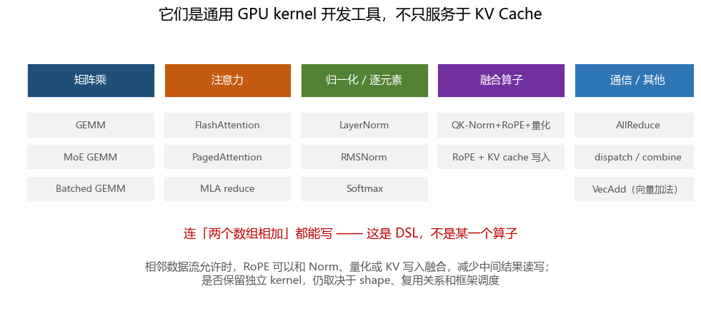

*图 9：公开仓库已经包含多类 FlyDSL kernel；列表表示当前公开覆盖面，不代表任意程序都能无条件移植。来源：ROCm/FlyDSL 与 ROCm/aiter。*

看 FlyDSL 官方测试覆盖的算子就明白了：

| 类别 | 算子 |
|---|---|
| 矩阵乘 | GEMM、MoE GEMM、Batched GEMM、Preshuffle GEMM |
| 注意力 | FlashAttention、PagedAttention、MLA reduce |
| 归一化 / 逐元素 | LayerNorm、RMSNorm、Softmax、Quantization |
| 融合算子 | Fused RoPE + KV cache |
| 通信 | AllReduce、dispatch / combine |
| 基础 | **VecAdd（两个数组相加）** |

最后一个最说明问题——**连"两个数组相加"这种最基础的都能写**。

> **它是面向 GPU kernel 的 DSL，不是某一个算子。** 就像 C 语言不是「操作系统算子」，只是操作系统经常用 C 编写。

Triton 和 CK 也一样，都是通用的。只不过在推理场景里，大家最需要优化的正好是 GEMM 和 Attention，所以你看到的例子集中在那儿。

#### Q2：那为什么好像没见到 RoPE？

**RoPE（Rotary Position Embedding，旋转位置编码）已经有 FlyDSL 融合实现。**

在 AITER 里能直接找到这些：

| 文件 | 内容 |
|---|---|
| `aiter/ops/flydsl/kernels/qk_norm_rope_quant.py` | **QK（Query/Key，查询/键）Norm + RoPE + 量化 三合一** |
| `qk_norm_rope_quant_gfx1250.py` | 针对特定架构的专用版本 |
| `fused_compress_attn.py` | RMSNorm + GPT-J RoPE + 写入 paged KV cache |
| FlyDSL 仓库 `test_fused_rope_cache.py` | Fused RoPE + KV cache |

导出的函数名就叫 `flydsl_qk_norm_rope_quant`。

**那为什么你常常看不到一个叫 RoPE 的独立 kernel？因为在相邻算子数据流允许时，融合可以减少一次或多次中间结果读写。**

RoPE 会对成对的通道施加位置相关旋转，通常计算强度低于 Attention 主体。若单独起一个 kernel，执行路径会包含一次独立的读取和写回：

```
读显存 → 算一下（很快） → 写显存
```

当中间张量只服务于下一步时，常见优化是**把它融合进邻居**：

```
读一次显存 → QK-Norm → RoPE → 量化 → 写入 KV cache → 写一次显存
```

数据只进出显存一次，中间全在寄存器里流转。

> 所以「没看到独立 RoPE kernel」不能推出「RoPE 没做」。公开代码证明融合路径存在；是否采用独立 kernel，仍取决于 shape、复用关系、框架调度和目标硬件。

顺便，这也解释了为什么需要 FlyDSL 这类工具：融合算子可能同时包含 norm 的规约布局、RoPE 的配对布局、量化的分块布局和 KV（Key-Value，键值）Cache 的分页布局；显式 layout 代数能让这些关系更容易组合和审查。

#### Q3：AMD 有 FlyDSL，NVIDIA 对应的是什么？

**最接近的对应物是 CuTe DSL。** 两者都提供 Python 前端和显式 layout 抽象，但不是 API 兼容实现，也不是官方的一一移植关系。

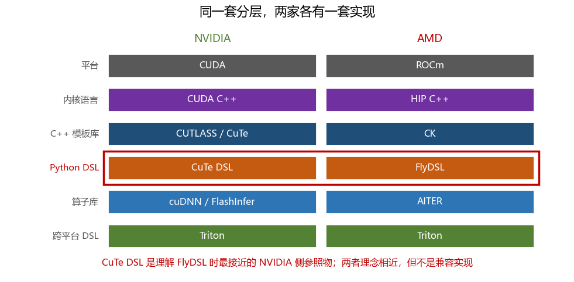

*图 10：CuTe DSL 是 NVIDIA 生态里最接近 FlyDSL 的技术位置；两者并非同一项目或兼容 API。来源：NVIDIA CUTLASS 与 ROCm/FlyDSL 官方文档。*

| 层 | NVIDIA | AMD |
|---|---|---|
| 平台 | CUDA | ROCm |
| 内核语言 | CUDA C++ | HIP C++ |
| C++ 模板库 | CUTLASS / CuTe | CK |
| **Python DSL** | **CuTe DSL** | **FlyDSL** |
| 算子库 | cuDNN / FlashInfer | AITER |
| 跨平台 DSL | Triton | Triton |

两者在几个核心机制上相似：

| | CuTe DSL | FlyDSL |
|---|---|---|
| 装饰器 | `@cute.kernel` / `@cute.jit` | `@flyc.kernel` / `@flyc.jit` |
| 编译路线 | AST 改写 + tracing → **MLIR** | AST 改写 + tracing → **MLIR** |
| JIT 缓存 | `CUTE_DSL_CACHE_DIR` | `~/.flydsl/cache` |
| 关闭缓存 | `CUTE_DSL_DISABLE_FILE_CACHING` | `FLYDSL_RUNTIME_ENABLE_CACHE=0` |

CUTLASS 官方文档对 CuTe DSL 的描述：

> CuTe DSL is the Python-native interface to CUTLASS 4.4+... It exposes the **same CuTe abstractions (layouts, tensors, thread-to-data mappings)** that power CUTLASS's C++ template library, but authored entirely in Python.

FlyDSL 官方 README 也明确致谢 CuTe layout algebra（布局代数）等思想来源。因此，更稳妥的说法是：**CuTe DSL 是理解 FlyDSL 时最有用的 NVIDIA 侧参照物。**

> **两家在同一个位置上，得出了同一个答案：layout 必须成为编译器能理解的一等公民，而入口应该是 Python。**


### 十、什么时候该用 FlyDSL

说句实在话：**大多数人不需要写 FlyDSL。**

| 你的情况 | 建议 |
|---|---|
| 调模型、做应用 | 用现成的库就行，连 Triton 都不用写 |
| 有个自定义算子要加速 | **Triton**，性价比最高 |
| 核心算子卡在性能天花板 | 可以考虑 FlyDSL |
| 热点 kernel 需要更细的 layout 控制，且团队有 kernel 工程能力 | FlyDSL 或 CK |
| 想理解为什么两台机器跑出不同性能 | **至少要知道它的存在**（就是这篇的目的） |

对绝大多数读者，FlyDSL 的价值不是「我要用它写 kernel」，而是：

> **知道推理栈底下还有这么一层，知道它会随版本变化，知道它是性能差异的一个来源。**


### 小结

1. **layout 是核心**：数据在显存里怎么摆，决定了带宽能不能跑满。`Index = Coord · Stride`。
2. **ROCm 不是写法**，它对标 CUDA，是平台；真正对标 CUDA C++ 的是 **HIP C++**。
3. **Triton 替你决定 layout，FlyDSL 让你自己写**——这是两者全部差异的根源。
4. **同样是你定 layout，表达方式差三个台阶**：HIP C++ 藏在下标算术里 → CK 写进模板参数 → FlyDSL 做成 IR 类型。
5. **FlyDSL = Python 前端 + MLIR 的 Fly dialect**，把 layout 做成了编译器能推导的一等公民类型。
6. **三个代数操作**（composition / product / divide）贯穿 block → warp → thread 四个层级。
7. **它们都是通用 kernel 开发工具**，不是写 KV Cache 的专用工具；公开代码中也有 RoPE 融合实现。
8. **NVIDIA 侧最接近的参照物是 CuTe DSL**；两者理念相近，但并非兼容实现。
9. **工程上三个坑**：JIT 首次编译慢（用 AOT）、缓存不一定失效（要手动清）、**版本跨 minor 有破坏性变更（必须锁版本）**。


### 自测五个问题

看完如果这五个能答上来，这篇就没白读：

1. 同样一个 2×4 矩阵，`Stride=(4,1)` 和 `Stride=(1,2)`，坐标 `(1,2)` 分别落在第几个地址？
2. Triton 能通过分块、访问顺序和 autotune 影响性能；它和直接操作一等公民的 layout 表达式差在哪？
3. HIP C++ 也能直接控制地址映射，那 FlyDSL 多出来的价值到底是什么？
4. 为什么「存在 RoPE 融合 kernel」不等于「所有场景都不该用独立 RoPE kernel」？
5. 两台机器都装了 AITER、都开了 FlyDSL，性能差异明显。除了硬件，你会先查哪个变量？


### 参考来源

全部为公开资料：

- FlyDSL 官方仓库：https://github.com/ROCm/FlyDSL （Apache-2.0）
- FlyDSL 官方文档：https://rocm.github.io/FlyDSL
- AITER 官方仓库：https://github.com/ROCm/aiter （MIT）
- Composable Kernel 官方仓库：https://github.com/ROCm/composable_kernel （MIT）
- NVIDIA CUTLASS / CuTe DSL：https://docs.nvidia.com/cutlass/latest/media/docs/pythonDSL/cute_dsl.html
- ROCm/mori FlyDSL 0.2.x/0.3.x 兼容记录：https://github.com/ROCm/mori/blob/main/python/mori/ops/dispatch_combine_v2/flydsl_compat.py
- RoFormer / RoPE 论文：https://arxiv.org/abs/2104.09864
- CuTe layout 代数：论文《Categorical Foundations for CuTe Layouts》
<!-- SOURCE-END id=08 -->

---

<!-- SOURCE-BEGIN id=09 source=09_operator_kernel_article.md sha256=13c3d46bd8683566a3798856eb7ef2c9585e01e6bf81426ad0edf92120b48ff4 body_sha256=5599e1a14116ca884f80f933b017b1cd0da3dc0f43a31e8994f5c214cc4cf7c9 -->
## 原稿 #9：算子、Kernel、函数到底谁是谁？从 Excel 的 SUM 一路讲到 GPU 汇编

> 这几个词天天见，但一追问就说不清：算子是不是函数？AITER 是不是注意力机制？有了 HIP C++ 为什么还要 FlyDSL？这篇用一个你天天用的东西当起点，把六层关系一次串通。


上一篇讲 Triton、FlyDSL、CK、HIP C++ 的分层，发出去之后收到最多的追问是这几个：

- 算子到底是什么？是不是就是编译好的函数？
- AITER 我一直以为是注意力机制，怎么变成算子库了？
- 既然有 HIP C++，AMD 为什么还要再造一个 FlyDSL？

这三个问题其实是同一个问题：**这堆词分别站在哪一层。**

这篇不堆名词，从一个你天天用的东西开始。


### 先把几个词说清楚

后面会反复出现这几个缩写，先一次性讲完，正文就不再打断：

| 缩写 | 英文全称 | 一句话解释 |
|---|---|---|
| **Kernel** | — | 在 GPU 上真正跑的那段已编译代码，中文叫【内核】，和操作系统内核不是一回事 |
| **GPU** | Graphics Processing Unit | 显卡，擅长同时干上万件小事 |
| **CUDA** | Compute Unified Device Architecture | NVIDIA 的 GPU 软件平台 |
| **ROCm** | Radeon Open Compute platform | AMD 的 GPU 软件平台，地位对应 CUDA |
| **HIP** | Heterogeneous-compute Interface for Portability | ROCm 上写 kernel 的原生 C++ 接口 |
| **AITER** | AI Tensor Engine for ROCm | AMD 的算子库，不是某一个算法 |
| **CK** | Composable Kernel | AMD 的 C++ 模板 kernel 库 |
| **DSL** | Domain-Specific Language | 领域专用语言，只为一类活儿设计的语言 |
| **GEMM** | General Matrix Multiply | 通用矩阵乘，深度学习里最吃算力的那一步 |
| **MoE** | Mixture of Experts | 混合专家，每个 token 只走其中几个子网络 |
| **cuBLAS** | CUDA Basic Linear Algebra Subprograms | NVIDIA 的线性代数算子库 |

若只记一条：**算子是「要算什么」，kernel 是「怎么算」。**


### 一、先从 Excel 的 SUM 开始

打开 Excel，敲一行：

```
=SUM(A1:A100)
```

回车，出数。这中间其实发生了六件事：

| 层 | 发生了什么 |
|---|---|
| ① 你写的 | `=SUM(A1:A100)` |
| ② 谁接住 | Excel 的公式引擎，认出「这是 SUM」 |
| ③ 去哪找实现 | Excel 内置的函数库 |
| ④ 挑哪一个 | 100 个数用简单循环；100 万个数可能走并行 |
| ⑤ 真正跑的 | 一段**早就编译好的机器码** |
| ⑥ 跑在哪 | CPU |

有两点值得停一下：

**第一，第 ⑤ 层那段代码，是微软工程师多年前写好编译进去的**，跟你按回车这一刻没关系。

**第二，同一个 `SUM`，底下可能不止一段代码。** 数据量不同，走的路径可能不同。

（Excel 内部实现微软没公开，这里只用它的结构讲道理。）


### 二、换成 GPU，结构一模一样

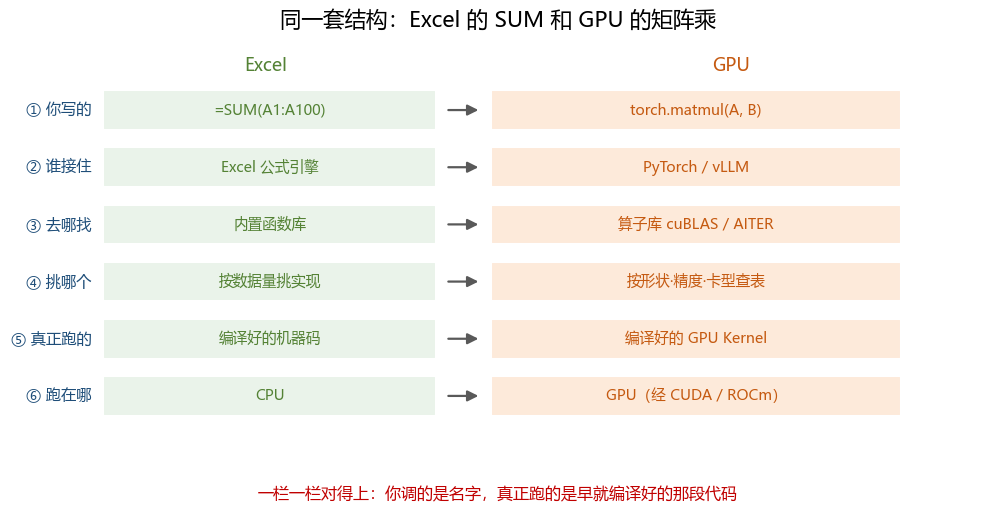

*图 1：Excel 的调用链和 GPU 的调用链逐层对应。*

你在 Python 里敲：

```python
C = torch.matmul(A, B)
```

对照着看：

| 层 | Excel | GPU |
|---|---|---|
| ① 你写的 | `=SUM(A1:A100)` | `torch.matmul(A, B)` |
| ② 谁接住 | 公式引擎 | **PyTorch**（或 vLLM / SGLang） |
| ③ 去哪找 | 内置函数库 | **算子库**：cuBLAS / AITER |
| ④ 挑哪个 | 按数据量 | 按**矩阵大小、精度、显卡型号**查表挑 |
| ⑤ 真正跑的 | 编译好的机器码 | 编译好的 **GPU Kernel** |
| ⑥ 跑在哪 | CPU | **GPU**（经 CUDA / ROCm 装载启动） |

**一栏一栏都对得上。**

第 ④ 层那张「查表」不是凭空来的——是厂商提前在真机上跑过上千组参数，把「什么情况用哪个版本」记下来的对照表。


### 三、算子、Kernel、算子库，到底谁是谁

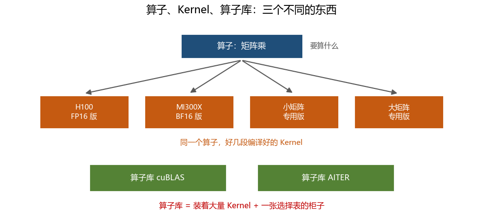

*图 2：一个算子对应多个 Kernel，算子库负责收纳和挑选。*

先给三个定义：

| 词 | 是什么 | 在 Excel 里对应 |
|---|---|---|
| **算子** | 要算什么，一个功能的名字和规格 | `SUM` |
| **Kernel** | 编译好的、真正执行的那段代码 | 实现 SUM 的那段机器码 |
| **算子库** | 装着一堆 Kernel + 一张选择表的柜子 | Excel 这个软件本身 |

#### 算子是不是编译好的函数

**不完全是。** 这个直觉抓住了一半。

你说的「编译好的函数」，业界叫 **Kernel**。而**算子是它上面一层**——这件事叫什么名字、输入输出是什么规格。

区别在哪？**一个算子往往对应好几个 Kernel。**

矩阵乘这一个算子，底下可能有：

- H100 上的 FP16 版本
- MI300X 上的 BF16 版本
- 小矩阵专用版本
- 大矩阵专用版本

**算子只有一个，Kernel 有一堆，跑的时候按情况挑。**

反过来也成立：**一个 Kernel 可以同时实现好几个算子**——这就是「融合」，后面会讲到。

#### 一个简单的判断方法

**能不能「调用它」。**

- 你能写 `=SUM(...)` → SUM 是算子
- 你没法写 `=Excel(...)` → Excel 不是算子，是装算子的地方

同理：

- 你能写 `torch.matmul(...)` → matmul 是算子
- 你没法「调用 AITER」→ AITER 是算子库，你只能从里面挑一个算子来调


### 四、那 AITER 是不是注意力机制

**不是。AITER 是算子库。**

这个误会很常见，因为旁边确实有一堆名字里带 Attention 的东西。

打开 AITER 看一眼，它的算子测试文件是这样的：

| 文件 | 对应算子 |
|---|---|
| `test_mha.py` | 注意力 |
| `test_mla.py` | 另一种注意力 |
| `test_moe.py` | 混合专家 |
| `test_gemm_a8w8.py` | 矩阵乘 |
| `test_rmsnorm2d.py` | 归一化 |

官方自己的描述是「attention、MoE、GEMM、归一化、量化、通信等算子」。**注意力只占其中一部分。**

用 Excel 打比方：

> **你不会说「WPS 就是 SUM」。**
>
> 同理，**AITER 不是 Attention**，它是装着 Attention 实现、也装着矩阵乘和 MoE 实现的库。


### 五、Attention 这个词，其实有六层意思

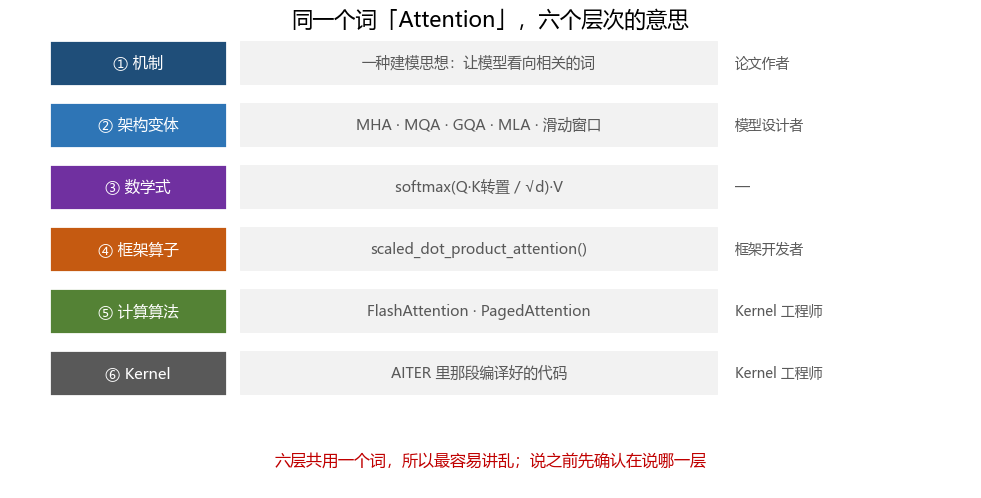

*图 3：同一个词在不同语境下指向不同层次。*

这才是真正容易乱的地方。

| 层 | 在这一层它是什么 | 具体指 |
|---|---|---|
| **① 机制** | 一种**建模思想** | 让模型处理每个词时，能看向序列里其他相关的词 |
| **② 架构变体** | 机制的不同实现方式 | 多头（MHA）、多查询（MQA）、分组查询（GQA）、潜在注意力（MLA）、滑动窗口 |
| **③ 数学式** | 一个公式 | softmax(Q·K转置 / √d)·V |
| **④ 框架算子** | 一个可调用单元 | `scaled_dot_product_attention()` |
| **⑤ 计算算法** | 怎么算得快、省显存 | FlashAttention、PagedAttention |
| **⑥ Kernel** | 编译好的那段代码 | AITER 里的 `fmha_kernels` |

**六层共用一个词。**

- 论文里说 Attention → 说的是 ①
- 模型配置里说 Attention → 说的是 ②（用 MHA 还是 GQA）
- 写代码时说 Attention → 说的是 ④
- 调性能时说 Attention → 说的是 ⑤ 和 ⑥

所以「AITER 是不是 Attention」这个问题本身不成立——**AITER 在第 ⑥ 层，Attention 机制在第 ① 层，差了五个层次。**

就像问「汽车工厂是不是四轮驱动」。

#### 顺带说清楚 Attention 不是 SUM

`SUM` 一步就完。**Attention 是五步**：

```
Q @ K转置  →  ÷√d  →  加 mask  →  softmax  →  @ V
```

放回 Excel，它不是一个 `SUM`，而是**一张有中间列的表**：

| A 列 | B 列 | C 列 | D 列 | E 列 |
|---|---|---|---|---|
| 原始数据 | A 两两相乘 | B 除以常数 | C 归一化 | D 乘权重 |

**E 才是答案，B/C/D 都是中间产物。**

**笨办法**：B、C、D 老老实实填出来。放到 GPU 上，B 那个中间矩阵在长序列时可能有几十 GB，要写进显存再读出来。

**FlashAttention 的办法**：把 B、C、D 全删掉，从 A 直接算出 E——五步焊成一个 Kernel，中间结果只在芯片内部的高速缓存里流转。

> 省的不是计算量，是**反复搬运数据的时间**。这是大模型推理最贵的一块。

这也回答了前面那个问题：**一个 Kernel 可以同时实现好几个算子。**


### 六、为什么 GPU 需要专门的语言

到这里会冒出一个很自然的疑问：

> **微软写 Excel 的 SUM，用普通 C++ 就够了。GPU 上算个矩阵乘，为什么要 Triton、FlyDSL、CK、HIP C++ 这么多花样？**

答案是：**GPU 和 CPU 干活的方式根本不同，普通高级语言表达不了 GPU 的干活方式。**

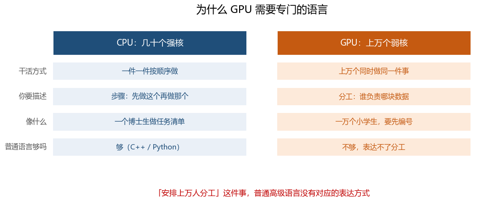

*图 4：CPU 描述步骤，GPU 必须描述分工。*

| | CPU | GPU |
|---|---|---|
| 有多少核 | 几个到几十个 | **上万个** |
| 每个核 | 很强，能干复杂活 | 很弱，只能干简单活 |
| 干活方式 | 一件一件按顺序做 | **上万个同时做同一件事** |
| 编程时你要说 | **步骤**：先做这个再做那个 | **分工**：谁负责哪块数据 |

打个比方：

> **CPU 像一个博士生**，给他一张任务清单，他从头做到尾。
>
> **GPU 像一万个小学生**，你不能给清单——得说「1 号加第 1 个数，2 号加第 2 个数……」，还得安排他们最后怎么汇总。

#### 一行代码看出差别

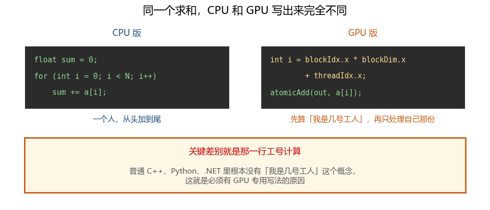

*图 5：GPU 代码必须先算出「我是几号工人」。*

**CPU 版求和：**

```cpp
float sum = 0;
for (int i = 0; i < N; i++)
    sum += a[i];
```

一个人，从头加到尾。

**GPU 版求和：**

```cpp
__global__ void sum_kernel(float* a, float* out) {
    int i = blockIdx.x * blockDim.x + threadIdx.x;
    atomicAdd(out, a[i]);
}
```

看第一行——**代码里必须先算出「我是第几号工人」。**

因为上万个工人跑的是同一段代码，每个必须知道自己该处理哪个数据。

**普通 C++、Python、.NET 里，压根没有「我是几号工人」这个概念。** 这就是必须有 GPU 专用写法的原因。


### 七、那 FlyDSL 是不是绕开了 ROCm

**没有。它最后还是走 ROCm。**

这是上一篇之后被问得最多的一个点，值得单独说清楚。

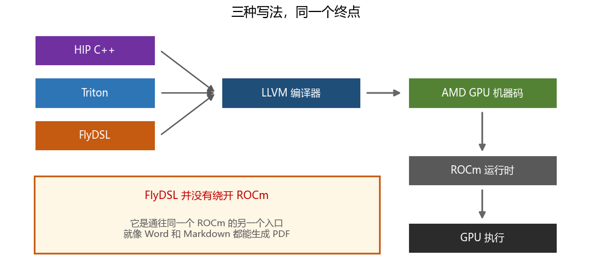

*图 6：三种写法编译到同一种机器码，由同一个运行时装载。*

HIP C++、Triton、FlyDSL 这三条路，**最后都变成同一种 AMD GPU 机器码，都由 ROCm 装进 GPU 跑**。

FlyDSL 不是 ROCm 的替代品，它是**通往 ROCm 的另一个入口**。

用你熟悉的东西打比方：

> **Word、Markdown、LaTeX 都能生成 PDF。**
>
> 你不会问「有了 Word 为什么还要 Markdown」——因为不同场景，写起来效率差很多。

#### 那为什么不都用 HIP C++

因为 **HIP C++ 什么都能写，但写高性能 Kernel 时太痛苦。**

这不是能力问题，是**表达效率**问题。

写一个高性能矩阵乘，用 HIP C++ 你得手写这些：

```cpp
// 1. 每个线程负责哪块数据 —— 手算
int row = (blockIdx.y * 128) + (threadIdx.x / 16) * 8;
int col = (blockIdx.x * 128) + (threadIdx.x % 16) * 8;

// 2. 从显存搬到共享内存 —— 手写地址
lds[threadIdx.x * 4 + 0] = A[row * K + k + 0];
// ... 还有几十行

// 3. 为了避开 bank conflict，地址还要错位 —— 手写位运算
int swizzled = (idx ^ ((idx >> 5) & 7)) * 4;

// 4. 双缓冲预取、同步、矩阵指令排布 —— 再几百行
```

一个高性能矩阵乘，HIP C++ 写下来常常上千行。这些地址算式极易出错，**改一个分块参数就得全部重算**。

同样的东西用 FlyDSL：

```python
tile = logical_divide(A, make_layout((128, 32)))   # 说清楚怎么切
frag = tiled_copy.partition_S(tile)                # 说清楚谁拿哪块
```

**你描述「怎么切」，编译器负责把那一堆地址算式生成出来。**

#### 三者真正的差别

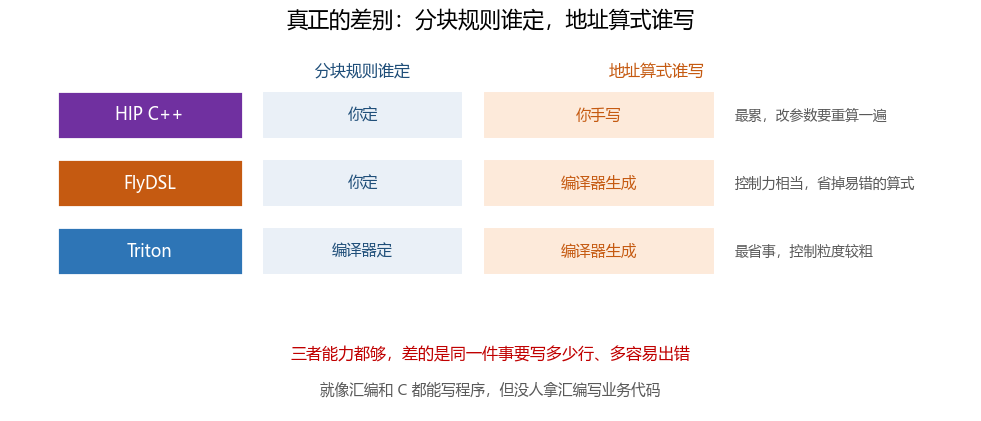

*图 7：三种写法在控制粒度上的分工。*

| | 分块规则谁定 | 地址算式谁写 |
|---|---|---|
| **HIP C++** | 你定 | **你手写** |
| **FlyDSL** | 你定 | 编译器生成 |
| **Triton** | **编译器定** | 编译器生成 |

**HIP C++ 和 FlyDSL 控制力相当，差别在于那堆地址算式谁来写。**

**Triton 走到了另一个极端**——连「怎么切」都替你决定了。对大部分算子这挺好，省事；但对矩阵乘、Attention 这几个最吃性能的，工程师想自己定分块，Triton 就给不了。

这就像：汇编和 C 都能写程序，能力一样。但没人拿汇编写业务代码，因为效率差太多。

#### 那 FlyDSL 是不是比 CK 快

不是。**上限一样。**

上一节说 FlyDSL 写得比 HIP C++ 简洁，很容易顺手推出「所以它更快」。这一步推错了。

因为最后跑在显卡上的东西是同一种：机器码。四条路殊途同归——

| 写法 | 语言 | 编译成 |
|---|---|---|
| HIP C++ | C++ | GPU 机器码 |
| CK | C++ 模板 | GPU 机器码 |
| Triton | Python | GPU 机器码 |
| FlyDSL | Python | GPU 机器码 |

**Python 那层在运行时早就不存在了。** 它只是你写的时候用的语法，编译完就没了——显卡上没有 Python 解释器，一行 Python 都不跑。

**语言不进机器码，怎么可能影响速度。**

那 AMD 图什么？图的是**试错速度**。

调 Kernel 本质上是搜索：块切多大、数据怎么摆、循环展开几层，组合成千上万种，没人能一次写对，只能一个个试。

- C++ 模板改一个参数，重新编译要等几分钟
- Python 改一行，马上能跑

同样一下午，一个试了 5 种，一个试了 50 种。后者当然更容易撞上那个最优解。

**不是语言快，是迭代快。**

所以看到一份性能对比说 FlyDSL 赢了 CK，该先问一句：

> **对面那份 CK 实现，调优了吗？**

常见的是这两种情况：

| 看到的结论 | 可能的实际原因 |
|---|---|
| FlyDSL 比 CK 快 | FlyDSL 那份是为这个矩阵形状精调过的，CK 那份是通用版本 |
| FlyDSL 比 CK 快 | 新硬件指令 FlyDSL 先接上了，CK 还没跟上 |

**快的是那份实现，不是那个语言。** 这两件事必须分开——不然换个矩阵形状，结论就翻过来了。

（至于「FlyDSL 比 ROCm 快」，那是把路和车上的方向盘放一起比了。ROCm 是底座，上一节开头已经说过。）


### 八、最后：两条链，别搞混

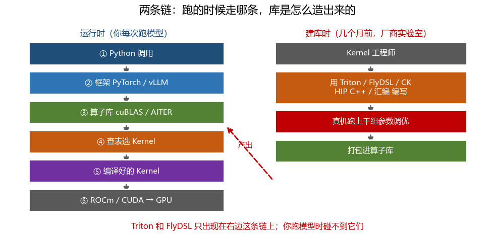

*图 8：运行时调用链与建库链是两回事。*

这是整篇最值得记住的一张图。

**运行时（你每次跑模型）：**

```
① Python 调用
② 框架 PyTorch / vLLM
③ 算子库 cuBLAS / AITER
④ 查表选 Kernel
⑤ 编译好的 Kernel
⑥ ROCm / CUDA → GPU
```

**建库时（几个月前，在厂商实验室）：**

```
Kernel 工程师
    ↓ 用 Triton / FlyDSL / CK / HIP C++ / 汇编 编写
    ↓ 真机跑上千组参数调优
    ↓ 打包进算子库
```

**Triton 和 FlyDSL 只出现在第二条链上。你跑模型的时候，根本碰不到它们。**

唯一的例外是 `torch.compile`——它会**当场生成 Triton 代码再编译**。那是「现炒」，不是「热预制菜」。


### 每个名词归位

| 名词 | 在哪一层 | 一句话 |
|---|---|---|
| **注意力机制** | 建模思想 | 不在调用链上，是架构层面的概念 |
| **Attention 算子** | ①② | 框架里可调用的那个单元 |
| **FlashAttention** | ⑤ 的算法 | 把五步焊成一步的**办法** |
| **算子** | ② | 「要算什么」的规格 |
| **Kernel** | ⑤ | 编译好的、真正执行的那段代码 |
| **算子库** | ③ | 装着一堆 Kernel + 一张选择表的柜子 |
| **cuBLAS / AITER** | ③ | 两个具体的柜子 |
| **Triton / FlyDSL / CK** | 建库链 | **造 Kernel 的工具**，运行时不出现 |
| **CUDA / ROCm** | ⑥ | 地基，把 Kernel 装进 GPU 跑起来 |
| **汇编** | ⑥ 附近 | 最底层的写法，Kernel 最终都变成机器指令 |


### 小结

1. **你写的 `torch.matmul` 只是个名字**，经过框架、算子库、查表，最后落到一段早就编译好的 GPU 代码上——**和 Excel 的 `SUM` 结构完全一样**。
2. **算子是「要算什么」，Kernel 是「编译好的那段代码」，算子库是「装着一堆 Kernel 的柜子」**。一个算子可以有多个 Kernel，一个 Kernel 也能实现多个算子。
3. **AITER 是算子库，不是注意力机制**。Attention 这个词本身有六层意思，说之前先确认在说哪一层。
4. **GPU 需要专用语言，是因为它要描述「上万人怎么分工」**，普通高级语言没有这个概念。
5. **FlyDSL 没有绕开 ROCm**，它和 HIP C++、Triton 一样，最后都编译成同一种机器码。
6. **三者差别在于：分块规则谁定、地址算式谁写**。能力都够，差的是写多少行、多容易出错。
7. **语言不决定性能上限，只决定你多快摸到那个上限**。看到「A 比 B 快」，先问 B 那份调优了没。
8. **运行时链和建库链是两条**。Triton、FlyDSL 只在建库那条上。


### 自测四个问题

1. 为什么说「算子不等于编译好的函数」？中间差了什么？
2. 一个 Kernel 能不能同时实现好几个算子？举个例子。
3. 为什么 Excel 的 SUM 用普通 C++ 就够，GPU 的矩阵乘却不行？
4. FlyDSL 和 HIP C++ 控制力相当，那 FlyDSL 的价值到底在哪？
5. 有人拿出一份数据说「FlyDSL 比 CK 快 30%」，你应该先问什么？


### 参考来源

全部为公开资料：

- AITER 官方仓库：https://github.com/ROCm/aiter （MIT）
- FlyDSL 官方仓库：https://github.com/ROCm/FlyDSL （Apache-2.0）
- Composable Kernel 官方仓库：https://github.com/ROCm/composable_kernel （MIT）
- Triton 官方仓库：https://github.com/triton-lang/triton
- PyTorch 官方仓库：https://github.com/pytorch/pytorch
- RoFormer / RoPE 论文：https://arxiv.org/abs/2104.09864
<!-- SOURCE-END id=09 -->

---

<!-- SOURCE-BEGIN id=10 source=10_data_movement_article.md sha256=a190d6e1b85ff5663800eca65bc503ccaa7e0e01a0f933263d1a5c72678819f2 body_sha256=219fe1abb6cb90a93de07c45bd779a2c0bb411bc26e1e4806340c644d45956ad -->
## 原稿 #10：同样的矩阵乘，数据摆错位置慢 32 倍

> 上一篇发出去，后台被追着问：Python 写的怎么可能比 C++ 快？那个「机器码」到底是啥？FlyDSL 说是控制数据，控制了又怎么就快了？这篇一次答完，顺带把 NVIDIA 那边对应的东西也摆上桌。


### 先把几个词说清楚

| 缩写 | 英文全称 | 一句话解释 |
|---|---|---|
| **Kernel** | — | 在显卡上真正跑的那段已编译代码，中文叫【内核】，和操作系统内核不是一回事 |
| **GPU** | Graphics Processing Unit | 显卡，擅长同时干上万件小事 |
| **ISA** | Instruction Set Architecture | 指令集架构，芯片能听懂的全部指令 |
| **gfx942** | — | MI300X 这颗芯片的指令集代号 |
| **HBM** | High Bandwidth Memory | 显存，容量大但离计算单元远 |
| **LDS** | Local Data Share | 片上共享内存，小但快，NVIDIA 叫 shared memory |
| **CK** | Composable Kernel | AMD 的 C++ 模板 kernel 库 |
| **DSL** | Domain-Specific Language | 领域专用语言，只为一类活儿设计 |
| **GEMM** | General Matrix Multiply | 通用矩阵乘，深度学习里最吃算力的一步 |
| **LLVM IR** | LLVM Intermediate Representation | 编译器的中间表示，各种语言的共同汇合点 |
| **MLIR** | Multi-Level Intermediate Representation | 多层中间表示，比 LLVM IR 更靠上的一层框架 |

若只记一条：**矩阵乘慢，通常不是算得慢，是数据没及时送到。**


### 一、先回答那个最扎心的：Python 凭什么不比 C++ 慢

上一篇讲完 FlyDSL 用 Python 写、比 HIP C++ 简洁，很多人顺手推出一句「那它岂不是更快」。

**这一步推错了。它不比 C++ 快，上限一模一样。**

原因很直接：最后跑在显卡上的东西是同一种——机器码。

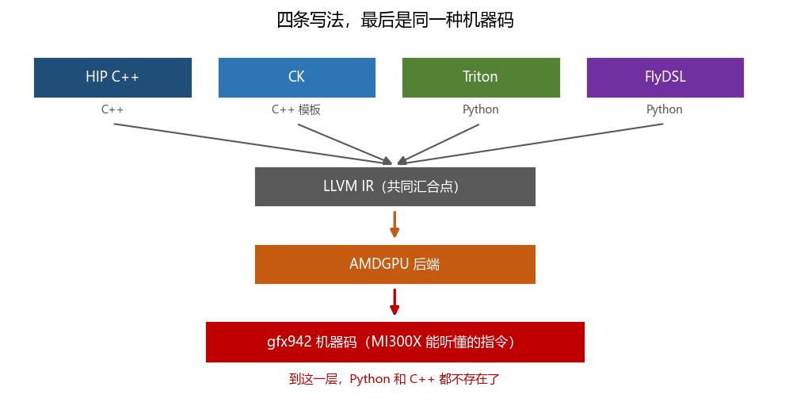

*图 1：四条写法，最终落到同一种机器码。*

四条路其实在更早就汇合了：都汇到 **LLVM IR**，再由同一个 AMDGPU 后端翻成 gfx942 指令。

**Python 那一层在运行时压根不存在。** 它只是你写代码时用的语法，编译完就没了——显卡上没有 Python 解释器，一行 Python 都不跑。

语言不进机器码，怎么可能影响速度。


### 二、那个「机器码」到底长什么样

既然反复说都变成同一种机器码，不如直接看看它长什么样。

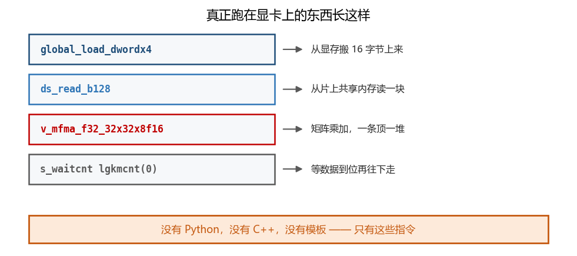

*图 2：MI300X 上真正执行的指令。*

写成文本大概是这样：

```
global_load_dwordx4    v[8:11], v[2:3], off      从显存搬 16 字节
ds_read_b128           v[12:15], v20             从片上共享内存读一块
v_mfma_f32_32x32x8f16  a[0:15], v[8:9], v[12:13] 矩阵乘加，一条顶一堆
s_waitcnt              lgkmcnt(0)                等数据到位再往下走
```

想亲眼验证的话，编译完用 `llvm-objdump --disassemble --mcpu=gfx942` 反汇编就能看到。

这里要顺手纠正一个常见误解：

> **gfx942 不属于 ROCm，它属于硬件。**

| | 是什么 | 谁定的 |
|---|---|---|
| gfx942 | 芯片能听懂的全部指令 | AMD 硬件，刻死在芯片里 |
| `v_mfma` | gfx942 里的一条指令 | 同上 |
| ROCm | 编译器 + 驱动 + 运行时 | AMD 软件 |

关系是：**ROCm 是翻译官，gfx942 是芯片的母语。**

把 ROCm 全删掉，芯片还是只认 gfx942。ROCm 的活儿是把你的代码翻成这门语言、再送上去执行,它不定义这门语言。


### 三、既然语言不影响速度，那差别到底在哪

先说矩阵乘的核心矛盾：

> **不缺算力，缺的是把数据及时送到算力跟前。**

MI300X 的计算单元强得很，但它经常在**空转等数据**。矩阵乘不做优化的话，瓶颈全在搬运上，算力根本喂不饱。

所以优化矩阵乘，翻来覆去只有两件事：**少搬几趟**、**搬来别排队**。

把显卡想成一个后厨，这事就清楚了。

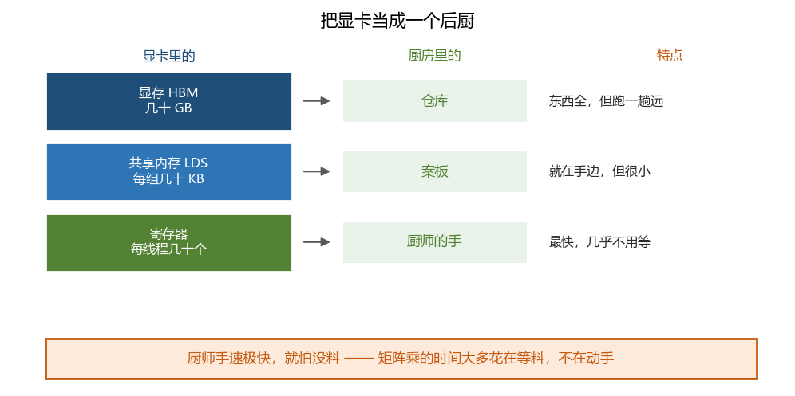

*图 3：三级存储对应厨房里的三个位置。*

厨师手速极快，就怕没料。**矩阵乘的时间大多花在等料，不在动手。**


### 四、第一件事：少搬几趟

笨办法是炒一个菜跑一趟仓库，取根葱回来切——厨师大部分时间在路上等。

聪明办法是**一次搬一筐上来，把这筐能用的全用完，再换下一筐**。

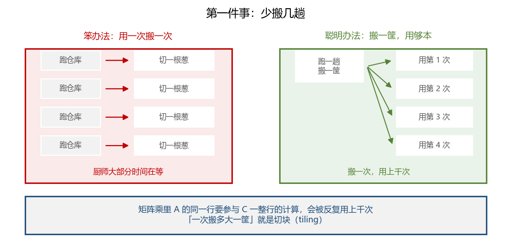

*图 4：搬一次用一次，和搬一次用够本。*

矩阵乘为什么必须这么干？因为 A 的同一行要参与 C 一整行的计算，**会被反复用上千次**。搬一次用一千次，和用一次搬一次，差着量级。

而案板放不下整个仓库,所以「一次搬多大一筐」是个要精心挑的数。

**这就是切块（tiling）。**


### 五、第二件事：搬来别排队

料搬上案板了，还有个讲究：**怎么摆。**

共享内存被分成 **32 个存储体（bank）**，每次只能同时服务 32 个不同存储体的请求。

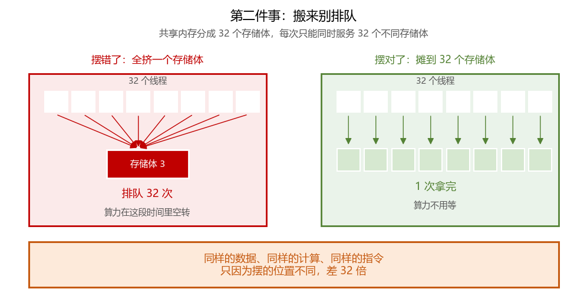

*图 5：同样的数据，摆法不同，差 32 倍。*

换成厨房：案板边围着 32 个厨师。如果所有人要的东西都堆在同一个角落，就得排队一个个伸手；摊开来摆，32 个人同时下手，互不碍事。

**同样的数据、同样的计算、同样的指令——只因为摆的位置不同，一个 1 次拿完，一个排 32 次。**

而且排队这段时间里，计算单元是空转的。

这就是**存储体冲突（bank conflict）**。

还有一层更实在的收益：`v_mfma` 有个硬性规定,参与计算的数据在寄存器里**必须按它要求的方式分布**，哪个线程拿哪几个元素，硬件定死了。如果从共享内存读出来的布局跟它要的对不上，就得**额外做一次重排**才能喂进去,这次重排纯属白干。

把布局从一开始就按 `v_mfma` 要的样子摆，那次重排直接省掉。


### 六、这两件事，谁说了算

到这儿就能回答「FlyDSL 到底控制什么」了：**它控制的不是矩阵操作本身，是数据怎么摆。**

矩阵乘那条 `v_mfma` 指令是硬件给的，谁都改不了。FlyDSL 管的是**把数据喂给这条指令之前的那一路**。

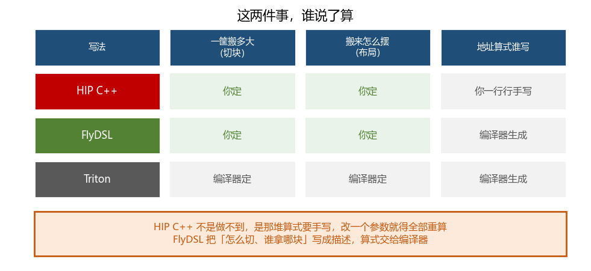

*图 6：三种写法在切块与布局上的分工。*

| | 一筐搬多大（切块） | 搬来怎么摆（布局） | 地址算式谁写 |
|---|---|---|---|
| **HIP C++** | 你定 | 你定 | **你一行行手写** |
| **FlyDSL** | 你定 | 你定 | 编译器生成 |
| **Triton** | 编译器定 | 编译器定 | 编译器生成 |

有个地方特别容易误会，得说清楚：

> **HIP C++ 不是做不到。**

它是最底层的，什么都能摆，能干的甚至比 FlyDSL 更多更自由。差别在于**那堆地址算式要一行行手写**——一个高性能矩阵乘常常上千行，光地址计算、错位摆放的位运算就一大片。

而且**改一个分块参数，那堆算式全得重算**。

这才是真正劝退的地方：不是写不出来，是不敢改。

FlyDSL 把「怎么切、谁拿哪块」写成两行描述，那堆算式交给编译器生成。

至于 Triton，它走到了另一个极端——连「怎么切、怎么摆」都替你决定了。对大部分算子这挺好，省事；但对矩阵乘、注意力这几个最吃性能的，工程师想自己定，Triton 没这个口子。


### 七、别只听一家的：NVIDIA 那边站着谁

上面全是 AMD 的叙事，容易让人以为这是 AMD 独有的痛点。

**不是。CUDA C++ 写高性能矩阵乘同样上千行，同样是改一个参数全得重算。**

两家走的是同一条路，只是名字不同。

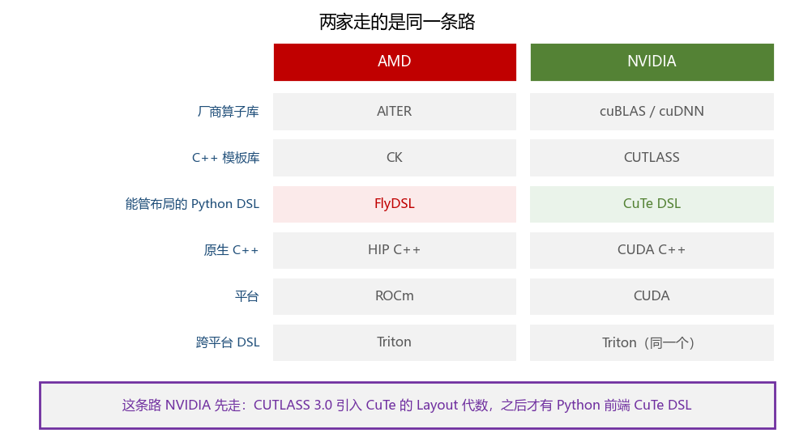

*图 7：逐层对应关系。*

| 层 | AMD | NVIDIA |
|---|---|---|
| 厂商算子库 | AITER | cuBLAS / cuDNN |
| C++ 模板库 | CK | CUTLASS |
| **能管布局的 Python DSL** | **FlyDSL** | **CuTe DSL** |
| 原生 C++ | HIP C++ | CUDA C++ |
| 平台 | ROCm | CUDA |
| 跨平台 DSL | Triton | Triton（同一个，两边都跑） |

**而且这条路是 NVIDIA 先走的。**

CUTLASS 3.0 引入的 CuTe，核心就是把「数据怎么摆」抽象成 `Layout = (Shape, Stride)` 这套代数；之后才补上 Python 前端 CuTe DSL，用 `@cute.kernel` 装饰器写。

FlyDSL 是 AMD 在同一思路上的方案——连 Layout 的表达形式都对得上。

所以准确的说法不是「AMD 造了个新东西」，而是：**两家都撞上同一个问题——C++ 模板改不动、Triton 又管不着布局——于是各自补了中间这一层。**

顺带说明，FlyDSL 目前是实验性的，不在官方 ROCm 发行版里，要自己从仓库装。


### 八、那看到「A 比 B 快」怎么办

既然语言不影响上限，性能对比数据该怎么读？

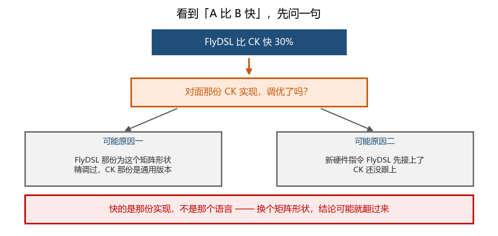

*图 8：读一份性能对比的正确姿势。*

看到「FlyDSL 比 CK 快 30%」，该先问一句：

> **对面那份 CK 实现，调优了吗？**

常见的是这两种情况：

| 看到的结论 | 可能的实际原因 |
|---|---|
| FlyDSL 比 CK 快 | FlyDSL 那份为这个矩阵形状精调过，CK 那份是通用版本 |
| FlyDSL 比 CK 快 | 新硬件指令 FlyDSL 先接上了，CK 还没跟上 |

**快的是那份实现，不是那个语言。** 这两件事必须分开,不然换个矩阵形状，结论就翻过来了。

那 FlyDSL 这类工具真正的价值在哪？

**在于试错速度。**

调 kernel 本质上是搜索：块切多大、数据怎么摆、循环展开几层，组合成千上万种，没人能一次写对，只能一个个试。

- C++ 模板改一个参数，重新编译要等几分钟
- Python 改一行，马上能跑

同样一下午，一个试了 5 种，一个试了 50 种。后者当然更容易撞上那个最优解。

**不是语言快，是迭代快。**


### 每个名词归位

| 名词 | 它是什么 | 它不是什么 |
|---|---|---|
| gfx942 | MI300X 的指令集，硬件定的 | 不是 ROCm 的一部分 |
| ROCm | 编译器 + 驱动 + 运行时 | 不是指令集，也不是语言 |
| `v_mfma` | 一条矩阵乘加硬件指令 | 不是某个库的函数 |
| LDS | 片上共享内存 | 不是显存，也不是缓存 |
| 切块 | 一次搬多大一块上来 | 不是把矩阵拆成小矩阵算 |
| 布局 | 数据在片上怎么排 | 不是矩阵的行列形状 |
| FlyDSL | 用 Python 描述切块和布局 | 不是更快的语言，也没绕开 ROCm |


### 小结

1. **四条写法最终都是同一种机器码**，Python 那层运行时不存在,语言不影响性能上限。
2. **gfx942 是硬件的指令集，ROCm 是翻译官**,两者不是一回事。
3. **矩阵乘不缺算力，缺的是及时送料**，时间大多花在等数据。
4. **优化只有两件事**：少搬几趟（切块）、搬来别排队（布局）。
5. **存储体冲突最坏差 32 倍**，同样的数据同样的指令，只差在摆的位置。
6. **HIP C++ 不是做不到，是那堆地址算式要手写**，改一个参数全得重算。
7. **NVIDIA 走的是同一条路，而且更早**：CUTLASS → CuTe → CuTe DSL。
8. **看到「A 比 B 快」，先问 B 那份调优了没**,快的是实现，不是语言。


### 自测四个问题

1. 为什么说「Python 写的 kernel 不比 C++ 慢」？关键在哪一层？
2. gfx942 和 ROCm 是什么关系？删掉 ROCm 芯片还认不认 gfx942？
3. 同样的数据、同样的指令，为什么摆的位置不同能差 32 倍？
4. FlyDSL 相比 HIP C++ 的真正价值是什么？为什么不是「更快」？


### 参考来源

全部为公开资料：

- AMD CDNA 架构与 ISA 文档：https://www.amd.com/en/technologies/cdna.html
- FlyDSL 官方仓库：https://github.com/ROCm/FlyDSL （Apache-2.0）
- Composable Kernel 官方仓库：https://github.com/ROCm/composable_kernel （MIT）
- AITER 官方仓库：https://github.com/ROCm/aiter （MIT）
- CUTLASS / CuTe 官方仓库：https://github.com/NVIDIA/cutlass
- Triton 官方仓库：https://github.com/triton-lang/triton
- LLVM AMDGPU 后端文档：https://llvm.org/docs/AMDGPUUsage.html
<!-- SOURCE-END id=10 -->

---

<!-- SOURCE-BEGIN id=11 source=11_gpu_stack_article.md sha256=1d55790dee1a68efdaacda7b97b91efa98e5d176a063553e1ab0a72e4152a501 body_sha256=e9288bedfd18ab3b68a6f4d90b9572591db3ba6aed2863b4708fa64f077ddd93 -->
## 原稿 #11：cuBLAS、cuDNN、CUTLASS 傻傻分不清？一篇讲透 GPU 软件栈的每一层

> 这些名字天天见，一被追问就卡壳：cuBLAS 和 cuDNN 到底谁管谁？CUTLASS 是不是 cuBLAS 的兄弟？AITER 又该对应 NVIDIA 哪个？这篇把整个栈拆成八层，逐层点名，AMD 和 NVIDIA 对着看。


### 先把几个词说清楚

| 缩写 | 英文全称 | 一句话解释 |
|---|---|---|
| **Kernel** | — | 在显卡上真正跑的那段已编译代码，中文叫【内核】，和操作系统内核不是一回事 |
| **BLAS** | Basic Linear Algebra Subprograms | 基础线性代数子程序，1979 年的数学库标准 |
| **DNN** | Deep Neural Network | 深度神经网络 |
| **DSL** | Domain-Specific Language | 领域专用语言，只为一类活儿设计 |
| **GEMM** | General Matrix Multiply | 通用矩阵乘 |
| **MoE** | Mixture of Experts | 混合专家，每个 token 只走其中几个子网络 |
| **ISA** | Instruction Set Architecture | 指令集架构，芯片能听懂的全部指令 |
| **SASS** | Streaming ASSembler | NVIDIA 显卡的机器码 |
| **gfx942** | — | AMD MI300X 这颗芯片的指令集代号 |
| **CK** | Composable Kernel | AMD 的 C++ 模板 kernel 库 |
| **AITER** | AI Tensor Engine for ROCm | AMD 面向大模型的算子库 |


### 一、为什么这些名字总是记不住

不是记性问题，是**它们常被并排提起，却根本不在同一层**。

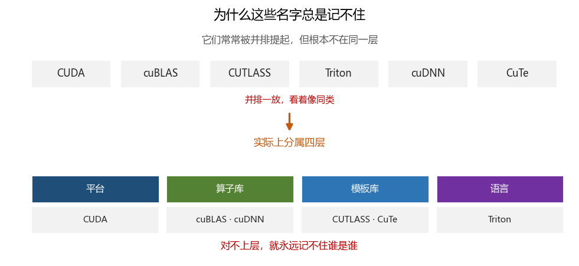

*图 1：并排一放看着像同类，实际分属四层。*

一句「我们用 CUDA、cuBLAS、CUTLASS 和 Triton」听着顺，其实横跨了平台、算子库、模板库、语言四个层次。就像说「我们公司有北京、财务部、张三和电脑」——四个词都对，但不是一个维度。

**对不上层，就永远记不住谁是谁。**

所以先看地图。


### 二、全景：八层，每层站着谁

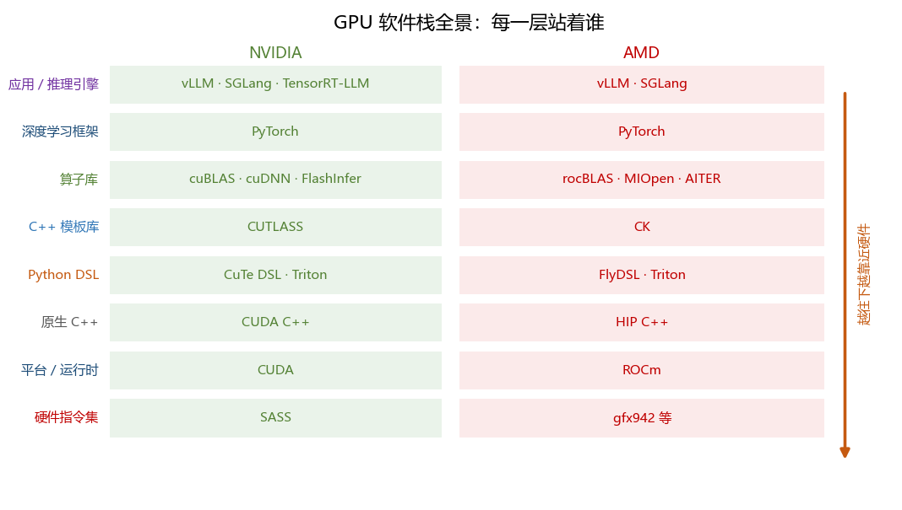

*图 2：GPU 软件栈的完整分层与双边对照。*

| 层 | NVIDIA | AMD |
|---|---|---|
| 应用 / 推理引擎 | vLLM · SGLang · TensorRT-LLM | vLLM · SGLang |
| 深度学习框架 | PyTorch | PyTorch |
| 算子库 | cuBLAS · cuDNN · FlashInfer | rocBLAS · MIOpen · AITER |
| C++ 模板库 | CUTLASS | CK |
| Python DSL | CuTe DSL · Triton | FlyDSL · Triton |
| 原生 C++ | CUDA C++ | HIP C++ |
| 平台 / 运行时 | CUDA | ROCm |
| 硬件指令集 | SASS | gfx942 等 |

越往下越靠近硬件。**每一层 AMD 都有对应物**，缺的不是层，是成熟度和生态惯性。

下面挑三组最容易混的说清楚。


### 三、第一组：cuBLAS 和 cuDNN

这两个是**同一层，但管的域不同**。

先看全称——名字里其实写得清清楚楚：

| | 全称里的关键词 | 管什么 |
|---|---|---|
| cuBLAS | **Linear Algebra**（线性代数） | 矩阵乘、矩阵向量乘 |
| cuDNN | **Deep Neural Network**（深度神经网络） | 卷积、归一化、激活、池化 |

**最硬的记忆钩子：BLAS 比神经网络老 40 年。**

BLAS 是 1979 年的 Fortran 标准，那时候根本没有深度学习。它眼里只有矩阵和向量，压根不知道「卷积层」是什么。cuDNN 是 2014 年才有的，专门为神经网络造。

一个是通用数学库，一个是 AI 专用库。

跑一个模型时的分工：

| 这一层 | 归谁 |
|---|---|
| 全连接 / 前馈网络（本质是矩阵乘） | cuBLAS |
| 注意力里的 QKV 投影（也是矩阵乘） | cuBLAS |
| 卷积、池化 | cuDNN |
| 批归一化、激活函数 | cuDNN |

有个细节值得知道：**cuDNN 内部某些路径也要做矩阵乘**——卷积可以转成矩阵乘来算。但它不一定去调 cuBLAS，多数情况自己有实现。所以是「域有交叠」，不是「上下级」。


### 四、第二组：cuBLAS 和 CUTLASS

名字像，是因为都带 LAS（Linear Algebra Subroutines）。但差别是根本性的。

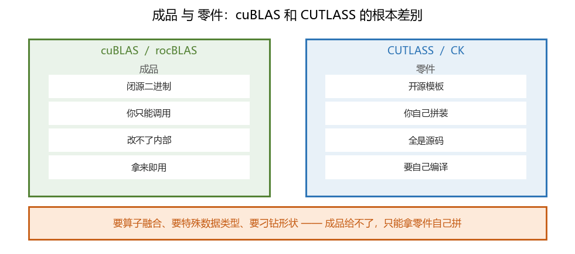

*图 3：成品与零件。*

| | cuBLAS / rocBLAS | CUTLASS / CK |
|---|---|---|
| 形态 | 闭源二进制库 | 开源 C++ 模板库 |
| 怎么用 | **调用** | **编译**，自己拼装 |
| 能改吗 | 不能，里面是黑盒 | 能，全是源码 |
| 比喻 | 做好的菜 | 食材 + 菜谱 |

**有了成品为什么还要零件？**

因为 cuBLAS 是闭源的，**只能用它提供的那些组合**。这几种情况它给不了：

- **算子融合**：矩阵乘完顺手做激活函数，省一次显存往返——cuBLAS 里没有这个组合
- **特殊数据类型**：新的量化格式它还没支持
- **刁钻形状**：你的矩阵形状特殊，通用实现不占优

这时候就得拿 CUTLASS 的零件自己拼一个。

**所以 CUTLASS 对应的是 CK，不是 cuBLAS。** 它们在表里是分开的两行。


### 五、算子库这一层，其实分三个域

上面那张全景表把算子库压成一行，是简化了。展开看是这样：

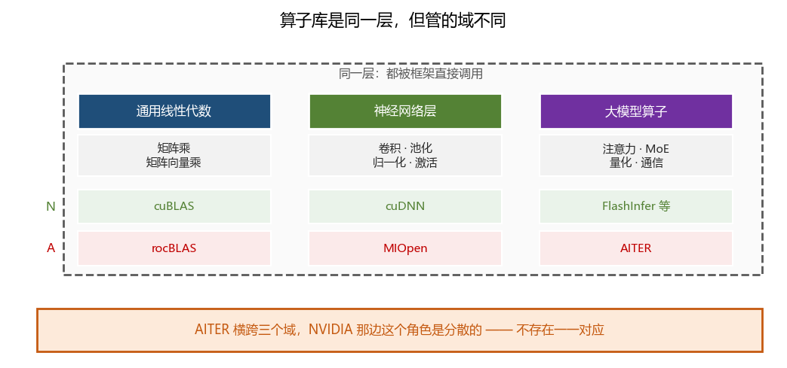

*图 4：算子库同层，但分三个域。*

| 域 | NVIDIA | AMD |
|---|---|---|
| 通用线性代数 | cuBLAS | rocBLAS / hipBLAS |
| 神经网络层 | cuDNN | MIOpen |
| **大模型算子** | **分散在多处** | **AITER** |

第三行要单独说。

**AITER 没有一一对应的东西。**

它覆盖的是注意力、MoE、矩阵乘、归一化、量化、通信——**横跨了传统 BLAS 库和 DNN 库的边界**，是为大模型时代设计的，不是老一代那种按数学门类划分的库。

NVIDIA 那边这个角色是**分散的**：

- FlashInfer（社区项目）
- cuDNN 里的融合注意力
- TensorRT-LLM 内置的 kernel

所以「AITER 对应 cuBLAS」是错的，「AITER 对应 cuDNN」也不准。硬凑对应关系，反而记不住。


### 六、第三组：三种写 Kernel 的方式

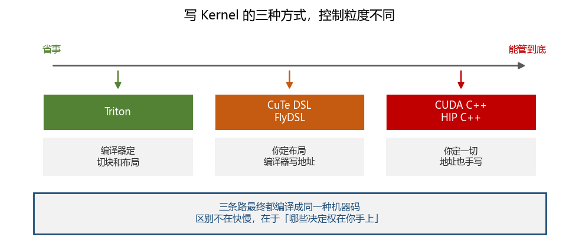

*图 5：控制粒度从省事到能管到底。*

| | 切块和布局谁定 | 地址算式谁写 |
|---|---|---|
| **Triton** | 编译器定 | 编译器 |
| **CuTe DSL / FlyDSL** | 你定 | 编译器 |
| **CUDA C++ / HIP C++** | 你定 | **你手写** |

三条路最终都编译成同一种机器码，**区别不在快慢，在于哪些决定权在你手上**。

原生 C++ 不是做不到，它什么都能管——差别在于那堆地址算式要一行行手写，而且改一个分块参数就得全部重算。


### 七、必须提醒的一个坑：两个 Triton

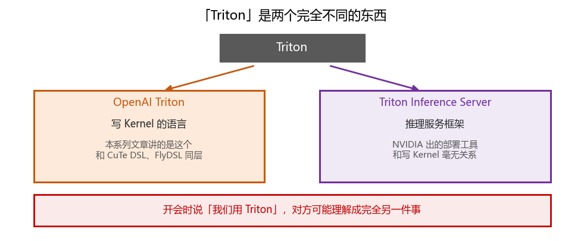

*图 6：同名，但毫无关系。*

| 名字 | 是什么 |
|---|---|
| **OpenAI Triton** | 写 Kernel 的语言，本系列讲的是这个 |
| **Triton Inference Server** | NVIDIA 的推理服务框架，和写 Kernel 毫无关系 |

开会时说「我们用 Triton」，一个人在讲 kernel 怎么写，另一个人在想部署架构——**两边都以为在聊同一件事**。

写文档、发消息时最好带上限定词。


### 八、一次调用到底穿过哪些层

概念摆完了，看一次真实调用怎么走。

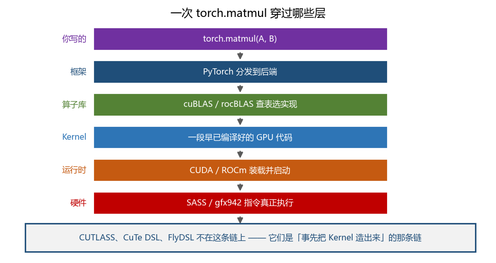

*图 7：一次矩阵乘的完整路径。*

| 步 | 发生了什么 |
|---|---|
| 你写的 | `torch.matmul(A, B)` |
| 框架 | PyTorch 分发到对应后端 |
| 算子库 | cuBLAS / rocBLAS 按形状精度查表选实现 |
| Kernel | 一段早已编译好的 GPU 代码 |
| 运行时 | CUDA / ROCm 装载并启动 |
| 硬件 | SASS / gfx942 指令真正执行 |

这里有个关键点，最容易搞混：

> **CUTLASS、CuTe DSL、FlyDSL 不在这条链上。**

它们属于**另一条链**——事先把 Kernel 造出来的那条。运行时链是「调用」，建库链是「生产」，两件事。

所以问「FlyDSL 在推理时起什么作用」这个问题本身就问偏了：它在推理**之前**已经干完活了。


### 九、生态里还有这些

上面讲的是主干。按用途还有一批：

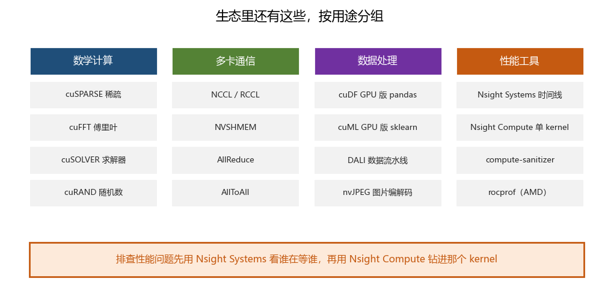

*图 8：按用途分组的其余库与工具。*

| 用途 | 代表 |
|---|---|
| 数学计算 | cuSPARSE（稀疏）· cuFFT（傅里叶）· cuSOLVER（求解器）· cuRAND（随机数） |
| 多卡通信 | NCCL / RCCL · NVSHMEM |
| 数据处理 | cuDF（GPU 版 pandas）· cuML · DALI · nvJPEG |
| 性能工具 | Nsight Systems · Nsight Compute · compute-sanitizer · rocprof |

其中通信层值得单独记：**NCCL 对应 AMD 的 RCCL**，多卡训练和推理的集合通信全靠它，单卡快多卡慢十有八九出在这一层。

性能工具的用法有个顺序：**先用 Nsight Systems 看整体时间线，找出谁在等谁；锁定了再用 Nsight Compute 钻进那个 kernel 看细节。** 一上来就看单个 kernel，容易在局部打转。


### 十、这张图真正的用处：定位问题

记住分层不是为了背名词，是为了出问题时知道**该去哪一层找**。

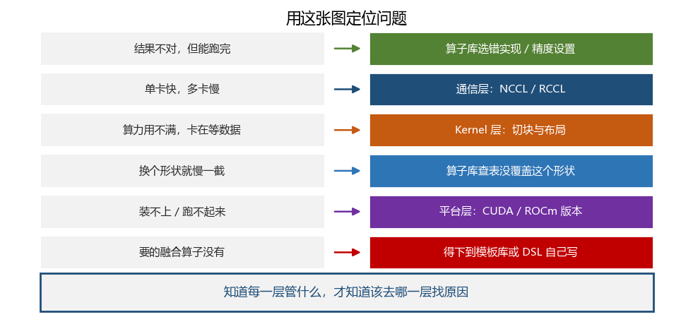

*图 9：症状到层次的对照。*

| 症状 | 大概率在哪一层 |
|---|---|
| 结果不对，但能跑完 | 算子库选错实现 / 精度设置 |
| 单卡快，多卡慢 | 通信层：NCCL / RCCL |
| 算力用不满，卡在等数据 | Kernel 层：切块与布局 |
| 换个矩阵形状就慢一截 | 算子库查表没覆盖这个形状 |
| 装不上、跑不起来 | 平台层：CUDA / ROCm 版本 |
| 要的融合算子没有 | 得下到模板库或 DSL 自己写 |

**知道每一层管什么，才知道该去哪一层找原因。**


### 每个名词归位

| 名词 | 它是什么 | 它不是什么 |
|---|---|---|
| CUDA / ROCm | 平台：编译器 + 驱动 + 运行时 | 不是语言，也不是指令集 |
| SASS / gfx942 | 硬件指令集 | 不属于 CUDA / ROCm |
| cuBLAS / rocBLAS | 通用线性代数成品库 | 不管卷积，也不是模板库 |
| cuDNN / MIOpen | 神经网络层成品库 | 不是通用数学库 |
| AITER | 面向大模型的算子库 | 不是注意力算法，也无一一对应物 |
| CUTLASS / CK | C++ 模板零件库 | 不是成品，要自己拼 |
| CuTe DSL / FlyDSL | 能管布局的 Python DSL | 不在运行时链上 |
| OpenAI Triton | 写 Kernel 的语言 | 不是 Triton Inference Server |
| NCCL / RCCL | 多卡集合通信 | 不管单卡内部的事 |


### 小结

1. **名字记不住，多半是层次没对上**——它们常被并排提，却分属不同层。
2. **整个栈八层**，从应用到指令集，每一层 AMD 都有对应物。
3. **cuBLAS 与 cuDNN 同层不同域**：一个通用数学，一个神经网络专用，BLAS 比神经网络老 40 年。
4. **cuBLAS 与 CUTLASS 是成品与零件**：一个调用，一个编译；CUTLASS 对应的是 CK。
5. **AITER 横跨三个域**，NVIDIA 那边这个角色分散在多处，不存在一一对应。
6. **两个 Triton 同名不同物**，一个是语言，一个是推理服务框架。
7. **运行时链和建库链是两条**，模板库和 DSL 只在建库那条上。
8. **分层的真正价值是定位问题**，知道每层管什么，才知道去哪找原因。


### 自测五个问题

1. cuBLAS 和 cuDNN 谁调用谁？还是根本不是这个关系？
2. 为什么有了 cuBLAS 还需要 CUTLASS？举一个 cuBLAS 给不了的场景。
3. AITER 应该对应 NVIDIA 的哪个库？这个问题本身有什么毛病？
4. 同事说「我们用 Triton 优化」，你该先追问什么？
5. 现象是「单卡跑得挺快，八卡加起来还不到六倍」，先怀疑哪一层？


### 参考来源

全部为公开资料：

- NVIDIA CUDA 库文档：https://docs.nvidia.com/cuda/
- cuDNN 官方文档：https://docs.nvidia.com/deeplearning/cudnn/
- CUTLASS / CuTe 官方仓库：https://github.com/NVIDIA/cutlass
- NCCL 官方仓库：https://github.com/NVIDIA/nccl
- ROCm 官方文档：https://rocm.docs.amd.com/
- AITER 官方仓库：https://github.com/ROCm/aiter （MIT）
- Composable Kernel 官方仓库：https://github.com/ROCm/composable_kernel （MIT）
- FlyDSL 官方仓库：https://github.com/ROCm/FlyDSL （Apache-2.0）
- MIOpen 官方仓库：https://github.com/ROCm/MIOpen （MIT）
- RCCL 官方仓库：https://github.com/ROCm/rccl
- Triton 官方仓库：https://github.com/triton-lang/triton
<!-- SOURCE-END id=11 -->

---

## 本篇可逆合并账本

| 原稿 | 原始 SHA-256 | 正文 SHA-256 | 原图 |
|---:|---|---|---:|
| #2 `02_triton_article.md` | `20555d5880250a7d973412cd26f62780fe7ac9835c532a8cfb6d3722b7fd7568` | `a2663407ef02f20fbd86d96e1829e84cb5ac2f2958382058f8ccbbbd1b327c2a` | 8 |
| #8 `08_flydsl_article.md` | `e2d0ddc01bd2399efe5fd8eabc0e27ed078276aa06cc46703afced60811c72cb` | `657b933e2fd59a8bb6fc0ccce97a28df5bef917294c12859270230660eb72615` | 10 |
| #9 `09_operator_kernel_article.md` | `13c3d46bd8683566a3798856eb7ef2c9585e01e6bf81426ad0edf92120b48ff4` | `5599e1a14116ca884f80f933b017b1cd0da3dc0f43a31e8994f5c214cc4cf7c9` | 8 |
| #10 `10_data_movement_article.md` | `a190d6e1b85ff5663800eca65bc503ccaa7e0e01a0f933263d1a5c72678819f2` | `219fe1abb6cb90a93de07c45bd779a2c0bb411bc26e1e4806340c644d45956ad` | 8 |
| #11 `11_gpu_stack_article.md` | `1d55790dee1a68efdaacda7b97b91efa98e5d176a063553e1ab0a72e4152a501` | `e9288bedfd18ab3b68a6f4d90b9572591db3ba6aed2863b4708fa64f077ddd93` | 9 |

> 账本中的正文 SHA 对应“移除重复发布脚手架、抽取原图并提升标题层级”后的确定性正文。生成器会从本篇反向提取每个来源区间并逐字节比较；任一缺行、错序或缺图都会失败。
