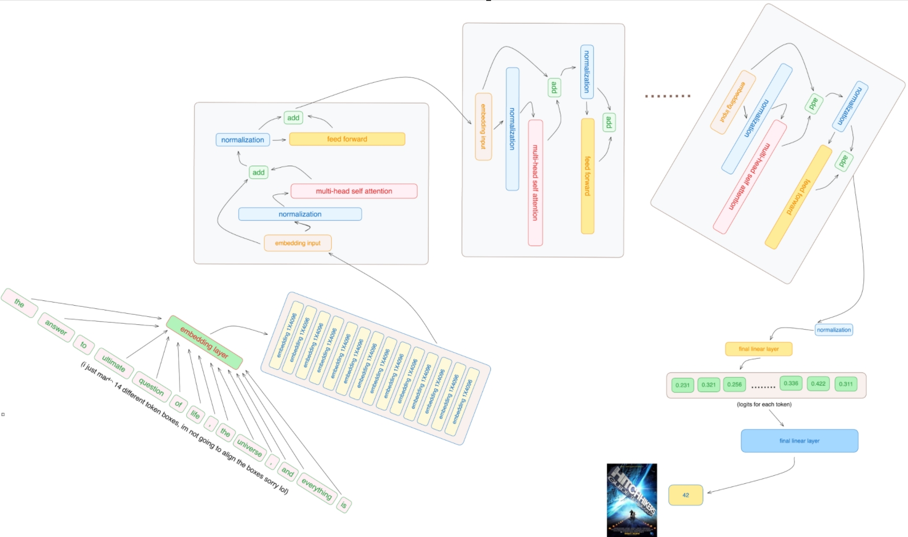
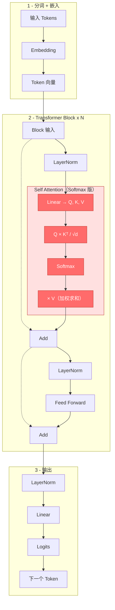
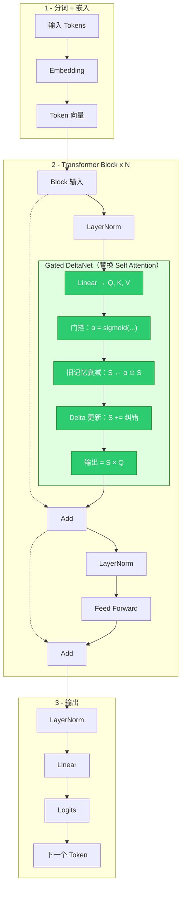
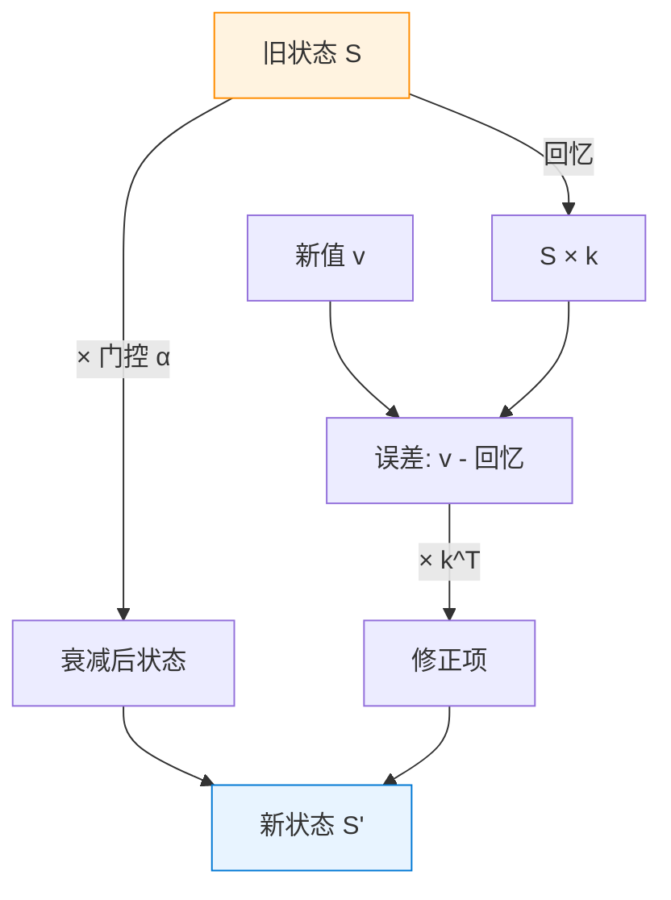
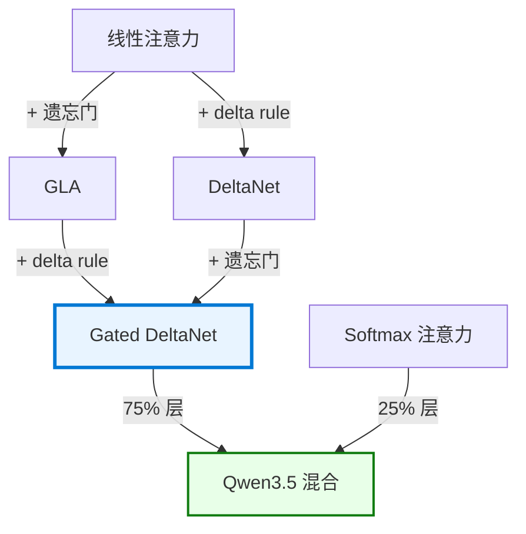
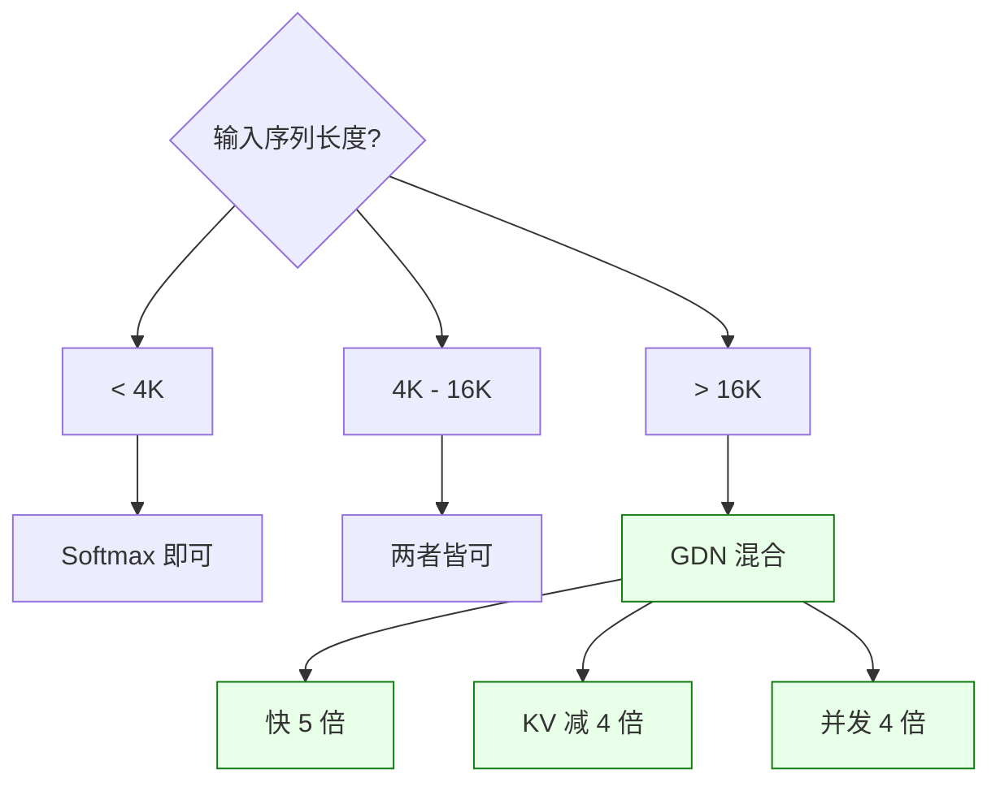

# Gated DeltaNet：从 Softmax 注意力到基于 Delta Rule 的 Linear Attention（线性注意力）

> **系列**: DL-Algorithm-Insights | **作者**: 魏新宇 (Xinyu Wei)

---

## 这是什么？

**一句话版本**：Gated DeltaNet 是让 AI 不需要"每次从第一页翻到最后一页"就能回答问题的新型注意力机制。

**类比——考试的两种做法**：

想象你在考场，面前有一本 1000 页的参考书：

| 做法 | 对应什么 | 体验 |
|---|---|---|
| 每道题都从第 1 页翻到第 1000 页找答案 | **标准 Softmax 注意力** | 答案准确，但书越厚翻得越久 |
| 提前做一个**固定大小的笔记本**，边学边记 | **Gated DeltaNet** | 只翻笔记本，不管书多厚，速度恒定 |

光有笔记本不够——**笔记质量**很关键。Gated DeltaNet 用两招保持笔记高质量：

1. **Delta Rule（先查再改）**——翻一下笔记本："现在写的啥？跟正确答案比一下——差多少补多少。"——不盲目追加；不管*为什么*不对（被别的笔记挤兑了？从没记过？压缩丢了？），只看差值大小。
2. **Forget Gate（遗忘门，定期大扫除）**——"上学期的笔记自动褪色，给这学期的重点腾地方。"

Qwen3.5 用了这个方法：**75% 的层**用笔记本（Gated DeltaNet），**25% 的层**保留翻书（Softmax 注意力）——因为有些题确实需要翻原文找精确答案。发表于 **ICLR 2025**（NVIDIA Research）。

---

## 为什么重要？

**一个具体场景**：你和 AI 助手聊天，已经发了 10 万条消息（约 128K tokens）。

**标准注意力（翻课本）的问题**：AI 每回复你一条消息前，要把前面 **10 万条消息全部从头读一遍**。而且所有消息的"索引卡片"（KV Cache）全存在显存里——聊得越多，占得越多：

| 聊了多少 | 索引卡片占显存（64 层模型） | 每次回复要重读 |
|---|---|---|
| 1000 条（日常闲聊） | 128 MB | 1,000 条 |
| 1 万条（一篇长文） | 1.3 GB | 10,000 条 |
| 10 万条（128K 上下文） | **10.4 GB** | 100,000 条 |
| 100 万条（1M 上下文） | **83 GB** ← 单块 H100 只有 80GB！ | 1,000,000 条 |

**Gated DeltaNet（翻笔记本）的方案**：不存索引卡片，改用一个**固定大小的笔记本**（比如 2MB）。不管聊了 1000 条还是 100 万条，笔记本大小不变，翻的速度也不变。

**代价**：笔记本容量有限，不能逐字记住每条消息。所以 Qwen3.5 用了**混合方案**——大部分层用笔记本（快），少数层保留翻课本（准）。

---

## 在 Azure 上运行

### 推荐 Azure VM

| 项目 | 详情 |
|---|---|
| **SKU** | [Standard_NC40ads_H100_v5](https://learn.microsoft.com/zh-cn/azure/virtual-machines/nc-h100-v5-series) |
| **GPU** | 1x NVIDIA H100 80GB NVLink |
| **vCPU** | 40 |
| **内存** | 320 GB |
| **推荐区域** | East US, West US 3, Sweden Central |

### 为什么选这个 SKU

- **Qwen3.5-27B（Dense）**：FP16 约 54 GB → 单块 H100 80 GB 轻松容纳
- **fla 库**：需要 Triton 内核，针对 NVIDIA Hopper 架构优化
- **单机即够**：无需多节点部署，推理和 benchmark 单 VM 即可完成

### 部署 Qwen3.5-27B

```bash
pip install vllm flash-linear-attention

python -m vllm.entrypoints.openai.api_server \
    --model Qwen/Qwen3.5-27B \
    --tensor-parallel-size 1 \
    --max-model-len 131072 \
    --port 8000
```

### "单机"对从业者意味着什么

- 无需集群编排（Ray、Kubernetes）
- 按需付费：NC40ads H100 v5 约 USD 3.37/小时（East US）
- 开机测试、关机走人——无闲置成本
- 估算：8 小时 benchmark ≈ USD 27

---

## 全局视角：Transformer 完整流水线

在深入具体机制之前，先看 Transformer 如何从原始文本一步步走到预测结果。经典例子：给定 "the answer to the ultimate question of life, the universe, and everything is ..."，模型预测出 **42**。

**三个阶段：**

1. **Tokenization + Embedding（分词 + 嵌入）** — 把文本切成 token（"the"、"answer"、"to"、...），每个转成一个稠密向量（如 4096 维）
2. **Transformer Block × N** — N 个结构相同的 Block 堆叠。每个 Block：LayerNorm → Self Attention → Add → LayerNorm → Feed Forward → Add
3. **输出头** — 最后一个 LayerNorm → Linear 层 → Logits（词表中每个词一个分数）→ 分数最高的词胜出

下图展示了这条完整流水线——从原始 token 一路到预测输出 "42"：



### 替换前：标准 Softmax Attention（被替换的部分）

把 Self Attention 方框打开——以下是**原版** Transformer 内部的计算流程：



**红色步骤**是 Softmax Attention 的内部——每个 token 要跟**所有**其他 token 算分数（O(n²)）：

| 步骤 | 操作 | 干什么 |
|:---:|---|---|
| 1 | Linear → Q, K, V | 从输入做三个线性投影 |
| 2 | Q × Kᵀ / √d | 算 n×n 分数矩阵（每个 token 跟每个 token 比） |
| 3 | Softmax | 把分数归一化成概率（每行和=1） |
| 4 | × V | 用概率对 Value 加权求和 |

### 替换后：Gated DeltaNet

同一条流水线，但注意力方框**换成了 GDN**（绿色）：



**绿色步骤**是 GDN 的内部——它维护一个固定大小的状态矩阵 S，而非计算 n×n 分数矩阵：

| 步骤 | 操作 | 干什么 |
|:---:|---|---|
| 1 | Linear → Q, K, V | 同样三个投影（外加门控投影） |
| 2 | 门控：α = sigmoid(...) | 算逐头 Forget Gate（0=忘掉，1=保留） |
| 3 | 衰减：S ← α ⊙ S | 旧记忆褪色——给新信息腾空间 |
| 4 | Delta：S += 纠错 | "差多少补多少"——Delta Rule |
| 5 | 输出 = S × Q | 从状态矩阵中查询答案 |

### 改了什么，没改什么

| 组件 | Softmax Attention | Gated DeltaNet | 改了？ |
|---|---|---|:---:|
| **Embedding** | token → 向量 | token → 向量 | 没改 |
| **LayerNorm** | 稳定数值 | 稳定数值 | 没改 |
| **🔴→🟢 注意力** | n×n 分数矩阵（O(n²)） | 固定大小状态矩阵（O(n)） | **改了** |
| **Add** | Residual Connection（残差连接） | Residual Connection（残差连接） | 没改 |
| **Feed Forward** | 逐 token MLP | 逐 token MLP | 没改 |
| **Linear → Logits** | 向量 → 词表分数 | 向量 → 词表分数 | 没改 |

**Qwen3.5 的混合策略** — 不是所有 N 个 Block 都换：

- **~75% 的 Block**：Self Attention → **Gated DeltaNet**（线性复杂度，擅长局部模式）
- **~25% 的 Block**：保留 **Softmax Attention**（二次方但精确，处理长距离依赖）

这就是为什么 GDN 是"即插即用的替换"——它只改变注意力层内部的搜索策略，不触碰流水线中的任何其他组件。

---

## 工作原理

本节从基础概念开始，逐层构建理解。

### 前置知识：四种函数各管各的，别搞混

Transformer 里有四种经常搞混的函数。**它们长得不一样，出现在不同位置，干不同的活**：

| 函数 | 像什么 | 用在哪里 | 干什么 |
|---|---|---|---|
| **Softmax** | 选举投票 | 注意力层 | 一组候选人打分 → 先用 e^x **放大差距** → 归一化成百分比（总和=1） |
| **Sigmoid** | 水龙头旋钮 | Gating Mechanism（门控） | 一个数字 → 压到 0~1 → 当"开多大"的控制信号（0=关死，1=全开） |
| **ReLU / SiLU** | 电路开关 | FFN 层 | 负数信号 → 关掉（不让通过）；正数信号 → 放行 |
| **LayerNorm** | 调音台 | 每层之间 | 一组数字 → 拉到均值=0、方差=1 → 防止数字越来越大爆掉 |

它们在架构中各管各的位置，互不干涉——就像工厂流水线上不同工位：

| 步骤 | 组件 | 类比 | 作用 |
|:---:|------|------|------|
| 1 | Token 输入 | 一句话进来 | 原始数据 |
| 2 | LayerNorm | 调音台 | 稳定数值，防爆 |
| 3 | **注意力层** | **选举投票 (Softmax)** | 从所有 token 中找最相关的 |
| 4 | LayerNorm | 调音台 | 再调一次 |
| 5 | **FFN 层** | **电路开关 (SiLU)** | 决定哪些神经元亮 |
| 6 | 输出 | — | 传给下一层 |

### 第一步：Softmax 注意力——精确但慢

**类比：每次答题都翻全书**

AI 回答你的问题，就像考试翻书——面前有 1000 页文本，每次都要翻完所有页，给每页打个"相关性分数"，然后重点看分数高的那几页。

标准注意力的计算方式：

```
Attention(Q, K, V) = Softmax(Q × K^T / sqrt(d)) × V
```

对于每个新 token，模型会计算它与**所有**历史 token 的 Attention Score（注意力分数），经过 Softmax 后，对 Value 做加权求和。

**举个例子**——你问 AI"法国的首都是什么？"，AI 面前有 5 页资料：

```
第1页: "天气预报..."       → 相关性分数很低
第2页: "股票行情..."       → 相关性分数很低
第3页: "日本的首都是东京"  → 沾点边，分数中等
第4页: "法国位于欧洲..."   → 相关！分数高
第5页: "巴黎是法国首都"    → 非常相关！分数最高
```

**Softmax 做了什么？** 把这些分数"选举投票"：

| 页面 | 原始分数 | 纯归一化（直接算百分比） | Softmax（先放大再算百分比） |
|---|---|---|---|
| 第1页 天气 | 60 | 15% | 2% |
| 第2页 股票 | 70 | 18% | 5% |
| 第3页 日本首都 | 80 | 20% | 13% |
| 第4页 法国在欧洲 | 90 | 23% | 33% |
| 第5页 巴黎=法国首都 | 95 | **24%** | **47%** |

纯归一化下，最差（15%）和最好（24%）差距很小——模型"看不清重点"。经过 Softmax 后，最好的拿走 **47%**，最差的只剩 **2%**——**重点一目了然**。

这是因为 e^x 将每 1 分的差距放大为约 2.7 倍的乘法差距：

```
e^1 = 2.7
e^2 = 7.4    （多了 2.7 倍）
e^3 = 20.1   （又多 2.7 倍）
e^4 = 54.6   （又多 2.7 倍）
```

这种"赢者通吃"特性让模型能**精准聚焦**到最相关的 token——AI 回答"巴黎"，因为第 5 页拿走了 47% 的权重。

**但问题是**：如果有 10 万页资料（128K 上下文），每次回答都要翻 10 万页——太慢了。

### 插曲：Linear Attention（线性注意力）到底"线性"在哪？

在继续之前，有一个关键问题需要先搞清楚——**QKV 投影本身永远是线性运算**：

```
Q = x · W_Q    ← 矩阵乘法，线性
K = x · W_K    ← 矩阵乘法，线性
V = x · W_V    ← 矩阵乘法，线性
```

无论是"标准注意力"还是"线性注意力"，QKV 的计算方式完全相同。**区别 100% 发生在 QKV 算出来之后**：

| | QKV 之后的操作 | 哪一步引入了非线性？ |
|---|---|---|
| **标准注意力** | `Softmax(Q×K^T/√d) × V` | **Softmax 里的 e^x 是非线性的** |
| **Linear Attention** | 用 K、V 更新状态矩阵 S，用 Q 查 S | **没有 Softmax**，全是矩阵乘法和加法 |

所以"线性注意力"这个名字的含义是：**去掉了 QKV 之后唯一的非线性操作（Softmax）**。

这不是一个无关紧要的术语问题——它决定了整个架构能不能用"笔记本"。因为：
- **有 Softmax** → 注意力分数依赖所有 token 的全局归一化（分母 `Σe^(q·k_i)` 要把每一页都看过一遍才能算出来）→ 必须存所有 KV Cache → O(n²)
- **去掉 Softmax** → 剩下的都是线性运算 → 可以合并、压缩成固定大小的状态矩阵 → O(n)

理解了这一点，下一步就自然了——

### 第二步：Linear Attention（线性注意力）——快但是糊

**类比：用一张小纸条代替 1000 页课本**

标准注意力每次都翻全部 1000 页。线性注意力说：咱别翻书了，**用一张小纸条记摘要**。

这张纸条叫**状态矩阵 S**，大小是固定的。每读一页新内容，就在纸条上追加一笔：

```
S_t = S_{t-1} + v_t × k_t^T

翻译成人话：
新纸条 = 旧纸条 + 这页的"标签"和"内容"之间的关联
```

**具体例子**——你依次读了 5 页资料：

```
读第1页: "法国→巴黎"         纸条: {法国:巴黎}
读第2页: "日本→东京"         纸条: {法国:巴黎, 日本:东京}
读第3页: "猫→毛茸茸"        纸条: {法国:巴黎, 日本:东京, 猫:毛茸茸}
...
读第10万页:                   纸条还是那么大！

你问: "法国的首都？"          → 查纸条就行，不用翻书
```

**优点**：不管读了多少页，纸条大小不变 → 显存 O(1)，速度恒定。

**致命缺点——"太平了，分不清重点"**：

没有 Softmax 的 e^x 放大效应，纸条上所有信息的权重差不多：

```
问: "法国的首都？"

Softmax 注意力:  法国相关→65%,  日本相关→2%,  猫相关→0.1%   ← 重点突出
线性注意力:      法国相关→35%,  日本相关→33%, 猫相关→32%    ← 什么都差不多！
```

结果可能回答"法国的首都是东京毛茸茸"——因为分不清哪个最相关。

**这就是早期线性注意力始终干不过 Softmax 注意力的原因。**

### 第三步：Delta Rule——"先查笔记，错了才改"

**类比：两种记笔记方式的对比**

基础线性注意力的问题是**盲目追加**——不管纸条上有没有，来什么加什么：

```
读到"猫→毛茸茸":       纸条加一笔 {猫:毛茸茸}
又读到"猫→毛茸茸":     再加一笔 {猫:毛茸茸, 猫:毛茸茸}   ← 重复了！
再读到"猫→可爱":       再加一笔 {猫:毛茸茸, 猫:毛茸茸, 猫:可爱} ← 乱了！
```

Delta Rule 的做法——**先看纸条上写了什么，只修正错误的部分**：

```
读到"猫→毛茸茸":
  查纸条: 纸条上没有"猫" → delta = 毛茸茸 - 0 = 全是新信息
  更新: {猫:毛茸茸} ✓

又读到"猫→毛茸茸":
  查纸条: 纸条说猫=毛茸茸 → delta = 毛茸茸 - 毛茸茸 = 0（已经对了！）
  不改！ ✓  ← 不会重复

再读到"猫→可爱":
  查纸条: 纸条说猫=毛茸茸 → delta = 可爱 - 毛茸茸 ≠ 0（需要修正！）
  修正: {猫:可爱} ✓  ← 精准替换
```

**公式**（看懂上面的例子就够了，公式可以跳过）：

```
基础线性注意力:  S_t = S_{t-1} + v_t × k_t^T                    ← 来什么加什么
Delta Rule:     S_t = S_{t-1} + (v_t - S_{t-1} × k_t) × k_t^T  ← 先查再改
                                 ↑          ↑
                              正确答案    纸条上的猜测
                                 └────┬────┘
                                  delta（误差）
```

- delta = 0 → 记录与目标一致，不动笔
- delta 很大 → 记录有偏差（可能被其他条目挤兑、从未记过、或压缩丢失——原因不重要），写入修正量

Delta Rule 由 Schlag 等人在 ICML 2021 首次提出。Yang 等人（NeurIPS 2024）解决了一个关键工程难题：如何让 delta rule 在 GPU 上**并行计算**（而不是一个 token 一个 token 串行处理），使大规模训练成为可能。

### 第四步：Gated DeltaNet——"定期大扫除 + 随时纠错"

Delta Rule 解决了"精准修正"，但还有一个问题：**过时的信息怎么办？**

**类比：管理你的手机通讯录**

你的通讯录（状态矩阵）存了 500 个联系人，有两个头疼的问题：

1. **过时信息太多**：张三两年前的旧号码还存着，但他早换了新号
2. **需要精确更新**：知道李四换了新号 → 只改李四的，别动其他人

Gated DeltaNet 用两个机制**同时**解决：

**Forget Gate α（遗忘门，大扫除）**——给所有旧记忆统一"打折"：

```
场景1: α = 0.95（和朋友正在聊同一个话题）
  → 所有旧记忆保留 95%
  → 常联系的人几乎不受影响

场景2: α = 0.3（话题完全换了）
  → 所有旧记忆只保留 30%
  → 大面积遗忘！相当于"换了个新城市，旧朋友基本不联系了"
```

**Delta Rule（精准修正）**——只改需要改的那一条：

```
来了新信息"张三→新号码 138xxxx":
  查通讯录: 张三现在是→旧号码 135xxxx
  delta ≠ 0 → 需要改！→ 只更新张三的记录

来了新信息"李四→13900001111":
  查通讯录: 李四现在是→13900001111
  delta = 0 → 已经是最新的 → 不动
```

**两者配合**——大扫除负责"整体遗忘"，Delta Rule 负责"定点修正"：

| | 只有门控（GLA） | 只有 Delta Rule（DeltaNet） | **都有（Gated DeltaNet）** |
|---|---|---|---|
| 能力 | 能大面积遗忘，但不能精确改 | 能精确改，但不能大面积遗忘 | **两样都行** |
| 类比 | 把通讯录所有人打折 | 只改个别人的号码 | 先打折，再改号码 |

**公式**（理解上面的类比就够了）：

```
S_t = α_t ⊙ S_{t-1} + β_t × (v_t - S_{t-1} × k_t) × k_t^T
      ↑                ↑            ↑
   大扫除            修正力度     先查纸条对不对
   (旧记忆×打折)
```

- **α_t**（打折系数）：0~1，由 Sigmoid 算出，模型自己学何时该多遗忘
- **β_t**（学习率）：多大力度信任新信息

**门控和 Delta Rule 在每一步如何配合：**



### 第五步：Qwen3.5 的混合架构——"快侦探 + 慢侦探"

**类比：64 人的侦探团队**

想象你组建了 64 人的侦探团破案（64 层模型）。你不会让所有人都用同一种方式工作：

- **48 个"快侦探"（Gated DeltaNet 层）**——快速浏览大量线索，用笔记本记要点。擅长"这案子大概讲的什么"、"关键人物有哪些"。
- **16 个"慢侦探"（标准注意力层）**——一页一页翻看所有卷宗。擅长"嫌疑人第 3 份口供第 2 段原文说的什么？"

**Qwen3.5 排班（重复 16 轮，共 64 层）：**

| 层 | 类型 | 角色 |
|:---:|------|------|
| 1 | GDN | 快侦探：快速浏览线索 |
| 2 | GDN | 快侦探：继续浏览 |
| 3 | GDN | 快侦探：继续浏览 |
| **4** | **标准注意力** | **慢侦探：仔细核实前 3 位的发现** |
| 5-64 | 重复 × 16 轮 | 共 48 个 GDN + 16 个注意力层 |

**为什么不全用快侦探？** 有些问题必须精确查原文：

| 角色 | 回答 |
|------|------|
| 你 | "你刚才第 3 句话说的是什么？" |
| 快侦探（GDN） | "大概是关于...某个技术话题..." ← 只记了大意 |
| 慢侦探（注意力） | "第 3 句原文是'今天天气不错'" ← 精确回忆 |

**为什么不全用慢侦探？** 太慢太费显存：

| 方案 | 128K 上下文表现 |
|------|----------------|
| 全用慢侦探 | 每层翻 10 万份卷宗 × 64 层 = 慢！显存爆！ |
| **混合方案** | 48 层看笔记本（快）+ 16 层翻卷宗（准）= **又快又准** |

**两种侦探的"装备配置"不同：**

| 配置 | 快侦探（GDN，48 层） | 慢侦探（标准注意力，16 层） |
|---|---|---|
| 工具 | 固定大小笔记本（状态矩阵） | 完整卷宗索引（KV Cache） |
| Q 头数 | 16 | 24 |
| KV 头数 | 16 | 4（GQA 6:1，6 个 Q 共用 1 个 KV） |
| V 头数 | 48（笔记本页数更多） | 4 |
| 头维度 | 128 | 256（检索颗粒度更细） |
| 显存 | **固定**，不随上下文增长 | 随上下文增长（但 GQA 减少 6 倍） |

**效果**：Qwen3.5 在 256K 上下文时比纯注意力模型快 **19 倍**。因为 75% 的层根本不需要存储和翻阅完整卷宗。

**注意**：MHA/MQA/GQA 分类（讨论的是 KV 头共享方式）**只适用于标准注意力层**。GDN 层没有 KV Cache，这套分类对它不适用。

### Gated DeltaNet 在架构族谱中的位置

**Gated DeltaNet 如何从基础线性注意力演进而来：**



**详细分类：**

| 流派 | 方法 | 关键特点 | 代表模型 |
|------|------|---------|----------|
| **翻课本派** | MHA（Multi-Head Attention） | 每个头各翻一遍 | GPT-3 |
| | MQA（多查询注意力） | 共用一本课本 | PaLM, Falcon |
| | GQA（分组查询注意力） | 几个头合看一本 | Qwen3, Llama3, GPT-4 |
| **滤波器派** | Mamba | 选择性状态空间 | Mamba-1 |
| | Mamba2 / SSD | 与线性注意力对偶 | Mamba-2 |
| **笔记本派** ★ | Linear Transformer | 纯加法笔记本（太平） | — |
| | GLA | +Forget Gate（遗忘门） | ICML 2024 |
| | DeltaNet | +先查再改 | NeurIPS 2024 |
| | **★ Gated DeltaNet** | **Forget Gate + Delta Rule** | **ICLR 2025** |
| **循环记忆派** | RWKV, Griffin | 循环更新隐状态 | — |

注：Mamba2 的 SSD（State Space Duality）数学形式与线性注意力存在对偶关系。Gated DeltaNet 处于**线性注意力与 SSM 的交汇点**，吸收了 Mamba2 的 Gating Mechanism（门控机制）和经典联想记忆理论的 Delta Rule。

---

## 论文谱系

| 代际 | 论文 | 会议 | arXiv | 核心贡献 |
|---|---|---|---|---|
| 第一代 | *Linear Transformers Are Secretly Fast Weight Programmers* | ICML 2021 | [2102.11174](https://arxiv.org/abs/2102.11174) | 首次将 Delta Rule 引入 Linear Attention |
| 第二代 | *Parallelizing Linear Transformers with the Delta Rule* | NeurIPS 2024 | [2406.06484](https://arxiv.org/abs/2406.06484) | 硬件友好的并行训练算法；1.3B 模型超越 Mamba 和 GLA |
| **第三代** | ***Gated Delta Networks: Improving Mamba2 with Delta Rule*** | **ICLR 2025** | [2412.06464](https://arxiv.org/abs/2412.06464) | 门控 + delta rule；在所有基准上超越 Mamba2 |

第二代和第三代的核心作者是 **Songlin Yang（杨松林）**（NVIDIA Research），他同时维护着 [flash-linear-attention (fla)](https://github.com/fla-org/flash-linear-attention) 库（4.4K+ stars）——被 Qwen3.5 直接集成的参考实现。

---

## 性能数据

### Gated DeltaNet 论文数据（ICLR 2025）

1.3B 参数，100B tokens 训练：

| 模型 | 类型 | 相对 Mamba 的零样本准确率 |
|---|---|---|
| Mamba | SSM | 基线 |
| GLA | Linear Attention + Gating | +1.2% |
| DeltaNet | Linear Attention + Delta Rule | +2.1% |
| **Gated DeltaNet** | Linear Attention + Gating + Delta | **+3.5%** |
| GDN + SWA 混合 | + 滑动窗口注意力 | **+5.8%** |

### Qwen3.5 官方博客数据

不同上下文长度下的推理吞吐量对比：

| 上下文长度 | 相对 Qwen3-Max（纯注意力） | 相对 Qwen3-235B-A22B |
|---|---|---|
| 32K | 快 8.6 倍 | 快 3.5 倍 |
| 256K | **快 19.0 倍** | 快 7.2 倍 |

KV Cache 减少量：**约 75%**（64 层中只有 16 层需要标准 KV Cache）。

在 RULER 长上下文基准测试中，混合模型在 256K 以内的表现超越纯注意力模型。

---

## 实践中的陷阱

### 1. 不能全用笔记本，必须混着来

**现象**：你问 AI"第 3 段第 2 句原文是什么？"，AI 答不出来。

**原因**：笔记本（状态矩阵）只记了大意，不记原文。就像你考试只带了笔记本没带课本，碰到"请引用原文"的题目就傻眼了。

**方案**：必须用**混合架构**（如 Qwen3.5 的 3:1 比例——75% 笔记本 + 25% 翻课本）。

### 2. 朴素实现反而更慢

**现象**：自己写的线性注意力代码比标准 FlashAttention 还慢。

**原因**：Delta rule 的状态更新需要专门的 GPU 优化（分块并行 + 内核融合）。

**方案**：用 [fla 库](https://github.com/fla-org/flash-linear-attention)——专门为 GPU 优化的 Triton 实现。

### 3. MHA/GQA 分类对 GDN 层不适用

**现象**：有人问"Gated DeltaNet 用的是 MHA 还是 GQA？"——这个问题本身就不对。

**原因**：MHA/MQA/GQA 是在讨论"多个侦探合看几本课本"（KV 头共享方式）。但快侦探（GDN 层）根本不用课本（没有 KV Cache），只用笔记本。所以这套分类对 GDN 层**不适用**。

### 4. Forget Gate（遗忘门）和 Delta Rule 不是一回事

**容易搞混**：都是"控制记忆的"，有啥区别？

**区别**：
- **Forget Gate（遗忘门）**：控制**保留多少**——"把整本通讯录所有人的重要性打折"（大面积操作）
- **Delta Rule**：控制**改什么**——"张三换号了，只改张三的记录"（定点操作）
- 缺了任何一个性能都会下降。不冗余，是互补。

### 5. FlashAttention 和 fla 不是一回事——名字相似但本质不同

**容易搞混的原因**：两个名字里都有 "flash"，但它们解决的是完全不同的问题。

| | FlashAttention (FA) | flash-linear-attention (fla) |
|---|---|---|
| **作者** | Tri Dao (Princeton) | Songlin Yang 等 |
| **优化对象** | 标准 **Softmax** 注意力（O(n²)） | **线性**注意力（含 GDN）（O(n)） |
| **核心思想** | IO-aware tiling，减少 GPU 显存读写次数 | 借鉴 FA 的 tiling 思路，给 Linear Attention 写高效 CUDA 内核 |
| **算法复杂度** | 仍然是 O(n²)，只是常数项大幅优化 | O(n)，算法本质不同 |
| **"flash" 含义** | 首创概念 | 致敬 FA 的 tiling 方法论 |

真正的性能对决是：**fla 内核 (O(n)) vs FlashAttention 内核 (O(n²))**。理论上序列够长 fla 一定赢，但 FlashAttention 的工程优化极致——**交叉点在哪**是关键未解决问题。

---

## 局限性与开放问题

GDN 是目前最有前景的 Linear Attention 变体，但需要诚实审视现有证据的边界：

| 关切 | 具体情况 | 客观评估 |
|------|---------|----------|
| **仅 1.3B 规模验证** | GDN 论文实验最大 1.3B 参数 | 7B/70B 规模是否等效？Qwen3.5 采用但未公开消融实验 |
| **自报 benchmark** | 性能数据来自作者团队 | 我们在 H100 上独立测试确认 GDN 内核在 16K+ 时更快（见下文） |
| **信息瓶颈** | 固定大小状态矩阵 = 有损压缩 | 超过矩阵容量时必然丢信息，靠混合方案补救 |
| **混合 = 承认不足** | Qwen3.5 保留 25% 标准注意力 | 纯 GDN 目前不能完全替代 Softmax |
| **Linear Attention 历史** | 2020 年至今多次宣称"媲美 Transformer"均未成功 | GDN 可能是首个生产级采纳，但需更多验证 |
| **生态成熟度** | fla 库活跃开发中 | Triton 内核在 seq_len >= 65K 且 head_dim=128 时崩溃（经测试确认） |

**乐观理由**：Qwen3.5 是首个生产级采用 GDN 的大模型；ICLR 2025 同行评审通过；fla 库 4.4K+ stars 被 Qwen 直接集成；Delta Rule 有 60+ 年理论传承。

**底线**：混合架构（75% GDN + 25% Attention）是当前务实的最佳方案，纯替代尚需时间验证。

---

## GPU 基准测试结果（我们的独立验证）

> 测试于 Azure NC40ads_H100_v5（NVIDIA H100 NVL 95GB），2026-03-01

**环境**：PyTorch 2.9.1+cu128, flash-attn 2.8.3, fla 0.4.1, triton 3.5.1

**配置**：batch=1, heads=16, head_dim=128, BF16, 5 次预热 + 20 次计时迭代

### 延迟对比（中位数，ms）

| 序列长度 | FlashAttention | GDN Chunk | GDN FusedRecurrent | GDN/FA 比值 | 优胜方 |
|---|---|---|---|---|---|
| 1,024 | 0.078 | 0.306 | 0.279 | 3.92x | **FA** |
| 4,096 | 0.388 | 0.515 | 0.976 | 1.33x | **FA** |
| 16,384 | 7.133 | 3.357 | 7.705 | 0.47x | **GDN**（快 2.1 倍） |
| 32,768 | 35.656 | 6.786 | 15.571 | 0.19x | **GDN**（快 5.3 倍） |
| 65,536 | 148.629 | Triton 报错 | Triton 报错 | — | 仅 FA |
| 131,072 | 623.789 | Triton 报错 | Triton 报错 | — | 仅 FA |

### 显存峰值对比（MB）

| 序列长度 | FlashAttention | GDN Chunk | GDN FusedRecurrent |
|---|---|---|---|
| 1,024 | 16.1 | 66.1 | 20.1 |
| 4,096 | 64.3 | 264.4 | 80.2 |
| 16,384 | 257.0 | 1,057.5 | 321.0 |
| 32,768 | 514.0 | 2,115.0 | 642.0 |

### 关键发现

1. **交叉点在 ~8K-16K tokens**：GDN Chunk 从约 8K-16K 开始快于 FlashAttention。低于此值时，FA 因 GDN 恒定的分块开销而胜出。
2. **32K 时快 5.3 倍**：O(n) vs O(n²) 的缩放优势非常明显。FA 每 2 倍序列长度增长约 4 倍（二次方）；GDN 增长约 2 倍（线性）。
3. **显存权衡**：GDN Chunk 显存峰值约为 FA 的 4 倍（128×128 状态矩阵开销）。FusedRecurrent 模式显存效率高但速度较慢。
4. **Triton 内核限制**：fla 0.4.1 内核在 seq_len >= 65K 且 head_dim=128 时失败。这是 Triton 启动参数限制，非算法本身的局限。
5. **验证了混合方案的合理性**：GDN 在长序列上快 5 倍以上，但短序列常数开销较高——这正是 Qwen3.5 采用 75% GDN + 25% 注意力的原因。

---

## 从算法到工程：完整因果链

上面的 benchmark 数字只是内核级测量。本节将算法原理与真实部署决策串联——**当你运行一个 LLM 服务时，这些数字为什么重要**。

### 图书馆 vs 人脑 类比

Softmax 注意力与 GDN 的根本区别，对应一个直观的权衡：

| | Softmax 注意力 = **图书馆** | GDN = **人脑** |
|---|---|---|
| **如何存储历史** | 保留每个 token 的原始 K 和 V（书架上的书） | 压缩进固定大小的 128×128 状态矩阵（记忆） |
| **存储大小** | O(n) — 每个新 token 都增长 | O(1) — 恒定，不管输入多长 |
| **检索精度** | 完美 — 可以查到任何 token 的精确信息 | 近似 — 较早的信息可能被新内容覆盖 |
| **代价** | KV Cache 吃显存；随上下文线性增长 | 微小的状态矩阵；每层每头恒定约 32KB |

**图书馆**把每本书都放在书架上。你问"2019年3月那本书第73页写了什么"，管理员找到原书一字不差读给你。但图书馆必须不断扩建——书越多，书架越多，空间越大（= GPU 显存越大）。

**人脑**读过所有书，但压缩成了固定大小的记忆。问同样的问题，答案是"大概讲经济政策的……具体数字记不清了"。这就是压缩导致的信息丢失。但它不需要图书馆大楼——恒定大小的"脑袋"就够了。

### 为什么 Softmax 需要 KV Cache 而 GDN 不需要

推理阶段（逐 token 生成）：

```
Softmax 生成第 32,769 个 token：
  Q = 当前 token 的查询向量
  必须跟前面全部 32,768 个 token 的 K 向量算相似度
  → 需要 K₁, K₂, ..., K₃₂₇₆₈ 存在显存里（= K Cache）
  然后加权求和所有 V 向量
  → 需要 V₁, V₂, ..., V₃₂₇₆₈ 存在显存里（= V Cache）
  不能复用上一个 token 的结果——每个 Q 都不一样！

GDN 生成第 32,769 个 token：
  Q = 当前 token 的查询向量
  状态矩阵 S 已经包含了前 32,768 个 token 的压缩信息
  → output = Q × S（一次矩阵乘法，搞定！）
  不需要访问任何历史 K 或 V
```

**这就是为什么"不需要 KV Cache"和"信息有损"是同一枚硬币的两面**：GDN 不需要 KV Cache *是因为*它把所有信息压缩进了状态矩阵；但它*无法*检索精确的历史细节，*也是因为*原始数据已经被丢弃了。

### 真实部署影响

**场景：50 个并发用户，每人 32K 上下文**

```
Softmax（如 Qwen3，全部 64 层存 KV Cache）：
  每用户 KV Cache = 64层 × 32K token × 128维 × 2(K+V) × 2字节 = 1 GB
  50 用户 = 50 GB 光给 KV Cache
  H100 80GB → 只剩 30 GB 给模型权重 → 大概率 OOM！

GDN 混合（如 Qwen3.5，仅 16 层注意力存 KV Cache）：
  每用户 KV Cache = 16层 × 32K × 128 × 2 × 2 = 256 MB
  每用户 GDN 状态 = 48层 × 128 × 128 × 2字节 = 1.5 MB（可忽略！）
  50 用户 = 13 GB → H100 上绰绰有余
```

**GDN 实际上更适合高并发**——通过消除 75% 层的 KV Cache，同一块 GPU 能服务约 4 倍的并发用户。

### Chunk 显存悖论详解

我们的 benchmark 显示 GDN Chunk 计算时显存是 FlashAttention 的 4 倍。这似乎矛盾——GDN 怎么既"省显存"又用 4 倍？

答案：两种不同的显存用途，发生在两个不同时刻。

| 显存类型 | 何时发生 | Softmax | GDN Chunk |
|---|---|---|---|
| **计算显存**（forward pass） | 处理输入时 | 低（FA 用重算代替存储） | **高 4 倍**（存 chunk 状态 + 块内注意力矩阵） |
| **KV Cache**（推理服务） | 每个生成 token | **随上下文增长** — O(n) | 恒定 — O(1) |

FlashAttention 巧妙地处理计算：将 n×n 注意力矩阵切成小块（tile），在 GPU 的 SRAM（片上高速缓存）中算完即丢——完整矩阵从未在 GPU HBM 中存在过。反向传播时直接重算而非读取存储。**以多算一次换不存中间结果。**

GDN Chunk 方向相反：为了并行化天然串行的状态递推，它存储中间状态快照和块内注意力矩阵。**以多用显存换 GPU 利用率。**

但在生产环境中，KV Cache 才是显存大头。256K 上下文的全 Softmax 注意力每用户可能需要 8+ GB 的 KV Cache——远超 FlashAttention tiling 节省的计算显存。

### 工程决策框架



**权衡**：GDN 用**检索精度**换取速度和并发——如果你的场景需要从长文档中精确提取（"第7.3条原文怎么说？"），混合架构中的注意力层负责处理这类需求，但纯 GDN 层可能丢失这些细粒度细节。

---

## 速查卡

| 维度 | Softmax 注意力 | Gated DeltaNet |
|---|---|---|
| **KV Cache** | O(n)/层，随上下文增长 | **O(1)，固定大小状态矩阵** |
| **注意力计算量** | O(n²d) | O(nd²) |
| **长上下文速度** | 随长度下降 | **恒定** |
| **精确检索** | 优秀 | 较弱（需混合架构） |
| **核心机制** | e^x 放大分数差距 | Delta Rule + Forget Gate（遗忘门） |
| **Qwen3.5 用法** | 25% 的层（GQA，16 层） | 75% 的层（48 层） |
| **256K 吞吐** | 基线 | **快 19 倍**（Qwen3.5 vs Qwen3-Max） |
| **硬件支持** | FlashAttention（成熟） | fla 库（Triton，活跃开发中） |

---

## 参考文献

1. Schlag, I., Irie, K., & Schmidhuber, J. (2021). *Linear Transformers Are Secretly Fast Weight Programmers*. ICML 2021. [arXiv:2102.11174](https://arxiv.org/abs/2102.11174)

2. Yang, S., Wang, B., Zhang, Y., Shen, Y., & Kim, Y. (2024). *Parallelizing Linear Transformers with the Delta Rule over Sequence Length*. NeurIPS 2024. [arXiv:2406.06484](https://arxiv.org/abs/2406.06484)

3. Yang, S., Kautz, J., & Hatamizadeh, A. (2025). *Gated Delta Networks: Improving Mamba2 with Delta Rule*. ICLR 2025. [arXiv:2412.06464](https://arxiv.org/abs/2412.06464)

4. [flash-linear-attention (fla)](https://github.com/fla-org/flash-linear-attention) — Gated DeltaNet 及其他 Linear Attention 变体的 Triton 实现。

5. [Qwen3.5 官方博客](https://qwenlm.github.io/blog/) — 模型架构细节和性能基准数据。
