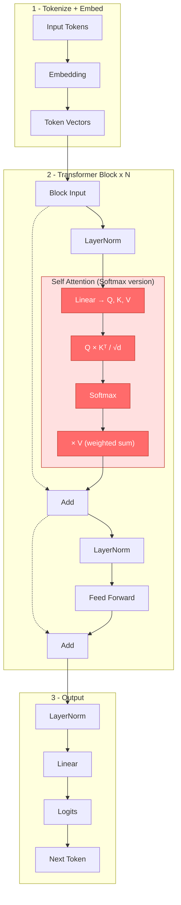
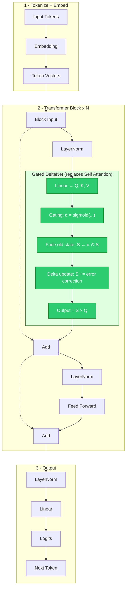
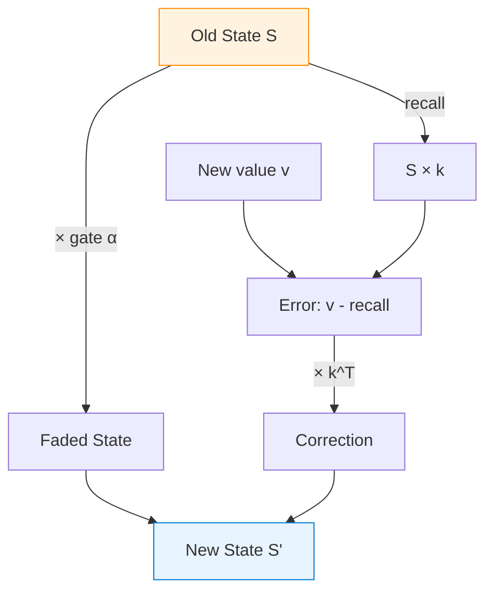
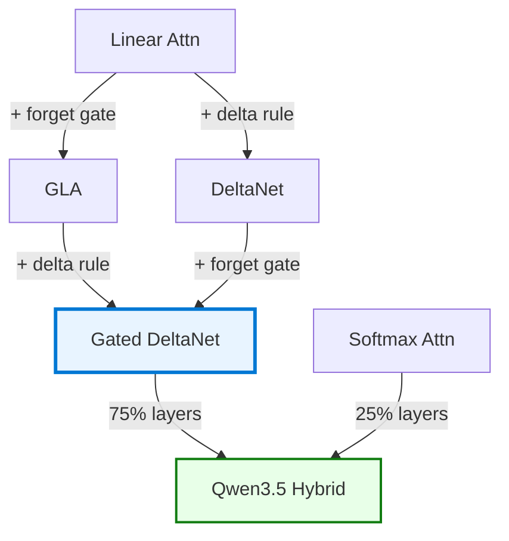
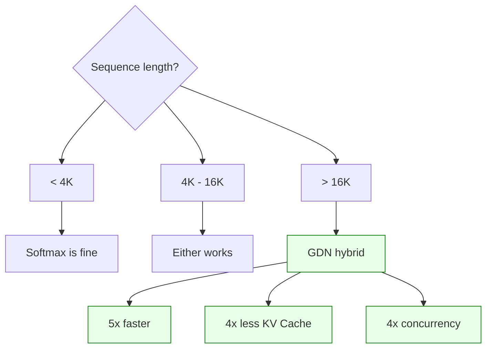

# Gated DeltaNet: From Softmax Attention to Linear Attention with Delta Rule

> **Series**: DL-Algorithm-Insights | **Author**: Xinyu Wei

---

## What Is It?

**In one sentence**: Gated DeltaNet is a new attention mechanism that lets AI answer questions without "flipping through every page of the book from start to finish" every time.

**Analogy — two ways to take an exam:**

Imagine you're in an exam hall with a 1,000-page reference book in front of you:

| Approach | Corresponds to | Experience |
|---|---|---|
| For every question, flip from page 1 to page 1,000 to find the answer | **Standard Softmax Attention** | Accurate, but the thicker the book, the longer you flip |
| Prepare a **fixed-size notebook** in advance, taking notes as you study | **Gated DeltaNet** | Just check your notebook — speed is constant no matter how thick the book |

But having a notebook isn't enough — **note quality** is critical. Gated DeltaNet uses two tricks to keep notes high-quality:

1. **Delta Rule (check before writing)** — Flip open the notebook: "What does it say now? Compare with the correct answer — the gap *is* the update." — never blindly append; doesn't care *why* it's off (interference from other notes? never recorded? compression loss?), only *how much*.
2. **Forgetting gate (periodic cleanup)** — "Last semester's notes automatically fade, making room for this semester's key points."

Qwen3.5 uses this approach: **75% of layers** use the notebook (Gated DeltaNet), **25% of layers** keep flipping the textbook (Softmax Attention) — because some questions genuinely require looking up the exact original text. Published at **ICLR 2025** (NVIDIA Research).

---

## Why It Matters

**A concrete scenario**: You're chatting with an AI assistant, and you've already sent 100,000 messages (~128K tokens).

**The problem with standard attention (flipping the textbook)**: Before each reply, the AI must re-read **all 100,000 previous messages from scratch**. Plus, the "index cards" for every message (KV Cache) are all stored in GPU memory — the more you chat, the more memory it consumes:

| Messages sent | Index cards in GPU memory (64-layer model) | Must re-read per reply |
|---|---|---|
| 1,000 (casual chat) | 128 MB | 1,000 messages |
| 10,000 (a long article) | 1.3 GB | 10,000 messages |
| 100,000 (128K context) | **10.4 GB** | 100,000 messages |
| 1,000,000 (1M context) | **83 GB** ← A single H100 only has 80 GB! | 1,000,000 messages |

**Gated DeltaNet's approach (checking the notebook)**: No index cards — instead, it uses a **fixed-size notebook** (e.g., ~2 MB). Whether you've chatted 1,000 or 1,000,000 messages, the notebook stays the same size, and the lookup speed stays constant.

**The tradeoff**: A notebook has limited capacity — it can't memorize every message word-for-word. That's why Qwen3.5 uses a **hybrid approach** — most layers use the notebook (fast), a few layers keep flipping the textbook (precise).

---

## Running on Azure

### Recommended Azure VM

| Item | Details |
|---|---|
| **SKU** | [Standard_NC40ads_H100_v5](https://learn.microsoft.com/en-us/azure/virtual-machines/nc-h100-v5-series) |
| **GPU** | 1x NVIDIA H100 80GB NVLink |
| **vCPU** | 40 |
| **Memory** | 320 GB |
| **Best Regions** | East US, West US 3, Sweden Central |

### Why This SKU

- **Qwen3.5-27B (Dense)**: ~54 GB in FP16 → fits comfortably on a single H100 80 GB
- **fla library**: Requires Triton kernels, optimized for NVIDIA Hopper architecture
- **Single VM sufficient**: No multi-node setup needed for inference and benchmarking

### Deploying Qwen3.5-27B

```bash
pip install vllm flash-linear-attention

python -m vllm.entrypoints.openai.api_server \
    --model Qwen/Qwen3.5-27B \
    --tensor-parallel-size 1 \
    --max-model-len 131072 \
    --port 8000
```

### What "Single VM" Means for Practitioners

- No cluster orchestration (Ray, Kubernetes) required
- Pay-as-you-go: ~USD 3.37/hour for NC40ads H100 v5 (East US)
- Spin up, benchmark, shut down — no idle costs
- Estimated: 8 hours of benchmarking ≈ USD 27

---

## The Big Picture: Full Transformer Pipeline

Before diving into specific mechanisms, here is how a Transformer goes from raw text to a prediction. The classic example: given "the answer to the ultimate question of life, the universe, and everything is ...", the model predicts **42**.

**Three stages:**

1. **Tokenize + Embed** — Split text into tokens ("the", "answer", "to", ...), convert each to a dense vector (e.g., 4096 dimensions)
2. **Transformer Block × N** — N identical blocks stacked. Each block: LayerNorm → Self Attention → Add → LayerNorm → Feed Forward → Add
3. **Output Head** — Final LayerNorm → Linear layer → Logits (one score per vocabulary word) → the highest score wins

### Before: Standard Softmax Attention (what gets replaced)

Zooming into the Self Attention box — here is what happens inside the **original** Transformer:



The **red steps** are the Softmax Attention internals — every token computes scores against **all** other tokens (O(n²)):

| Step | Operation | What It Does |
|:---:|---|---|
| 1 | Linear → Q, K, V | Three linear projections from input |
| 2 | Q × Kᵀ / √d | Compute n×n score matrix (every token vs every token) |
| 3 | Softmax | Normalize scores to probabilities (each row sums to 1) |
| 4 | × V | Weighted sum of Values using those probabilities |

### After: Gated DeltaNet Replacement

Now the same pipeline, but with the attention box **swapped to GDN** (green):



The **green steps** are the GDN internals — it maintains a fixed-size state matrix S instead of computing an n×n score matrix:

| Step | Operation | What It Does |
|:---:|---|---|
| 1 | Linear → Q, K, V | Same three projections (plus extra gate projection) |
| 2 | Gating: α = sigmoid(...) | Compute per-head forgetting gate (0 = forget, 1 = keep) |
| 3 | Fade: S ← α ⊙ S | Old memories decay — making room for new information |
| 4 | Delta: S += error correction | "How far off? Fix by that much." — the Delta Rule |
| 5 | Output = S × Q | Query the state matrix for the answer |

### What Changed, What Didn't

| Component | Softmax Attention | Gated DeltaNet | Changed? |
|---|---|---|:---:|
| **Embedding** | token → vector | token → vector | No |
| **LayerNorm** | stabilize numbers | stabilize numbers | No |
| **🔴→🟢 Attention** | n×n score matrix (O(n²)) | fixed-size state matrix (O(n)) | **Yes** |
| **Add** | residual connection | residual connection | No |
| **Feed Forward** | per-token MLP | per-token MLP | No |
| **Linear → Logits** | vector → vocabulary scores | vector → vocabulary scores | No |

**Qwen3.5's Hybrid Strategy** — not all N blocks get swapped:

- **~75% of blocks**: Self Attention → **Gated DeltaNet** (linear complexity, efficient for local patterns)
- **~25% of blocks**: Keep **Softmax Attention** (quadratic but precise, for long-range dependencies)

This is why GDN is a "drop-in replacement" — it only changes the search strategy inside the attention layer, without touching any other component in the pipeline.

---

## How It Works

This section builds understanding from the ground up, one layer at a time.

### Prerequisite: Four Functions, Each Doing Its Own Job — Don't Mix Them Up

Transformers use four types of functions that often get confused. **They look different, appear in different places, and do entirely different jobs**:

| Function | Think of it as... | Where Used | What It Does |
|---|---|---|---|
| **Softmax** | Election voting | Attention layer | A group of candidates get scores → exponentiate with e^x to **widen the gap** → normalize to percentages (sum=1) |
| **Sigmoid** | A faucet dial | Gating mechanisms | A single number → squash to 0~1 → a "how much to open" control signal (0=fully closed, 1=fully open) |
| **ReLU / SiLU** | A circuit breaker | FFN layers | Negative signal → block it; Positive signal → let it through |
| **LayerNorm** | A sound mixer | Between layers | A group of numbers → normalize to mean=0, variance=1 → prevent numbers from growing out of control |

They each work at their own station in the architecture, never interfering — like workers at different positions on a factory assembly line:

| Step | Component | Think of it as... | What it does |
|:---:|------|------|------|
| 1 | Token Input | A sentence comes in | Raw data |
| 2 | LayerNorm | Sound mixer | Stabilize numbers, prevent blow-up |
| 3 | **Attention Layer** | **Election voting (Softmax)** | Find the most relevant tokens |
| 4 | LayerNorm | Sound mixer | Stabilize again |
| 5 | **FFN Layer** | **Circuit breaker (SiLU)** | Decide which neurons fire |
| 6 | Output | — | Pass to next layer |

### Step 1: Softmax Attention — Precise but Slow

**Analogy: Flipping through the entire book for every question**

When the AI answers your question, it's like flipping through a reference book during an exam — there are 1,000 pages in front of it, and every time it must flip through all of them, score each page for relevance, and focus on the high-scoring ones.

Standard attention computes:

```
Attention(Q, K, V) = Softmax(Q × K^T / sqrt(d)) × V
```

For each new token, the model scores it against **all** previous tokens, applies Softmax, then takes a weighted sum of values.

**Concrete example** — you ask the AI "What is the capital of France?" The AI has 5 pages of material:

```
Page 1: "Weather forecast..."          → low relevance score
Page 2: "Stock market update..."       → low relevance score
Page 3: "The capital of Japan is Tokyo" → somewhat relevant, medium score
Page 4: "France is located in Europe..." → relevant! high score
Page 5: "Paris is the capital of France" → very relevant! highest score
```

**What does Softmax do?** It runs an "election vote" on these scores:

| Page | Raw Score | Plain Normalization | Softmax (amplify then normalize) |
|---|---|---|---|
| Page 1: Weather | 60 | 15% | 2% |
| Page 2: Stocks | 70 | 18% | 5% |
| Page 3: Japan's capital | 80 | 20% | 13% |
| Page 4: France in Europe | 90 | 23% | 33% |
| Page 5: Paris = France's capital | 95 | **24%** | **47%** |

With plain normalization, the gap between worst (15%) and best (24%) is tiny — the model "can't see the key point." After Softmax, the best takes **47%** while the worst gets only **2%** — **the focus becomes crystal clear**.

This is because e^x amplifies every 1-point difference into a ~2.7x multiplicative gap:

```
e^1 = 2.7
e^2 = 7.4    (2.7x more)
e^3 = 20.1   (2.7x more)
e^4 = 54.6   (2.7x more)
```

This "winner-takes-most" property lets the model **sharply focus** on the most relevant tokens — the AI answers "Paris" because page 5 took 47% of the weight.

**But here's the problem**: if there are 100,000 pages (128K context), flipping through all of them every time is just too slow.

### Interlude: What Exactly Is "Linear" About Linear Attention?

Before moving on, a key question needs answering — **QKV projections themselves are always linear operations**:

```
Q = x · W_Q    ← matrix multiplication, linear
K = x · W_K    ← matrix multiplication, linear
V = x · W_V    ← matrix multiplication, linear
```

Whether it's "standard attention" or "linear attention," Q, K, V are computed exactly the same way. **The difference is 100% about what happens AFTER Q, K, V are computed**:

| | Operation after QKV | Where is the non-linearity? |
|---|---|---|
| **Standard Attention** | `Softmax(Q×K^T/√d) × V` | **Softmax's e^x is non-linear** |
| **Linear Attention** | Use K, V to update state matrix S; use Q to query S | **No Softmax** — only matrix multiply and addition |

So "linear attention" means: **removing the only non-linear operation (Softmax) that comes after QKV**.

This isn't just a naming detail — it determines whether the "notebook" approach is even possible:
- **With Softmax** → attention scores depend on global normalization across all tokens (the denominator `Σe^(q·k_i)` requires looking at every single page) → must store all KV Cache → O(n²)
- **Without Softmax** → everything remaining is linear → can be merged and compressed into a fixed-size state matrix → O(n)

With this understood, the next step follows naturally —

### Step 2: Linear Attention — Fast but Blurry

**Analogy: Replacing 1,000 pages with a single note card**

Standard attention flips through all 1,000 pages every time. Linear attention says: let's stop flipping — **use a small note card for summaries instead**.

This note card is called the **state matrix S**, and its size is fixed. Every time you read a new page, you jot down a note:

```
S_t = S_{t-1} + v_t × k_t^T

In plain English:
New note card = Old note card + the association between this page's "label" and "content"
```

**Concrete example** — you read 5 pages one by one:

```
Read page 1: "France → Paris"        Note card: {France: Paris}
Read page 2: "Japan → Tokyo"         Note card: {France: Paris, Japan: Tokyo}
Read page 3: "cat → fluffy"          Note card: {France: Paris, Japan: Tokyo, cat: fluffy}
...
Read page 100,000:                    Note card is still the same size!

You ask: "Capital of France?"         → Just check the note card, no book-flipping needed
```

**Advantage**: No matter how many pages you've read, the note card stays the same size → O(1) memory, constant speed.

**Fatal weakness — "too flat, can't tell what matters"**:

Without Softmax's e^x amplification, everything on the note card carries roughly equal weight:

```
Question: "Capital of France?"

Softmax attention:  France-related → 65%,  Japan-related → 2%,  cat-related → 0.1%   ← Clear focus
Linear attention:   France-related → 35%,  Japan-related → 33%, cat-related → 32%    ← Everything looks the same!
```

The answer might come out as "The capital of France is Tokyo fluffy" — because it can't tell which note matters most.

**This is why early linear attention models consistently fell short of Softmax attention.**

### Step 3: Delta Rule — "Check Your Notes, Only Fix Mistakes"

**Analogy: Two ways of note-taking compared**

The problem with basic linear attention is **blind appending** — it adds whatever comes along, regardless of what's already on the note card:

```
Read "cat → fluffy":        Add to note card: {cat: fluffy}
Read "cat → fluffy" again:  Add again: {cat: fluffy, cat: fluffy}   ← Duplicate!
Read "cat → cute":          Add again: {cat: fluffy, cat: fluffy, cat: cute} ← A mess!
```

The delta rule's approach — **first check what's already on the note card, only fix the parts that are wrong**:

```
Read "cat → fluffy":
  Check note card: no entry for "cat" → delta = fluffy - 0 = all new info
  Update: {cat: fluffy} ✓

Read "cat → fluffy" again:
  Check note card: says cat = fluffy → delta = fluffy - fluffy = 0 (already correct!)
  No change! ✓  ← No duplicates

Read "cat → cute":
  Check note card: says cat = fluffy → delta = cute - fluffy ≠ 0 (needs fixing!)
  Fix: {cat: cute} ✓  ← Precise replacement
```

**Formula** (the examples above tell the full story — feel free to skip this):

```
Basic linear:   S_t = S_{t-1} + v_t × k_t^T                    ← Add whatever comes
Delta rule:     S_t = S_{t-1} + (v_t - S_{t-1} × k_t) × k_t^T  ← Check first, then fix
                                 ↑          ↑
                            correct answer  note card's current guess
                                 └────┬────┘
                                  delta (error)
```

- delta = 0 → note matches target, don't touch it
- delta is large → note is off (could be interference from other entries, never recorded, or compression loss — doesn't matter why), write the correction amount

The delta rule was first proposed by Schlag et al. at ICML 2021. Yang et al. (NeurIPS 2024) solved a critical engineering challenge: making delta rule updates **parallelizable on GPUs** (instead of processing tokens one by one sequentially), enabling training at scale.

### Step 4: Gated DeltaNet — "Periodic Cleanup + Precise Correction"

The delta rule solves "precise correction," but there's still a problem: **what about outdated information?**

**Analogy: Managing your phone contacts**

Your contacts list (state matrix) has 500 entries, and you have two headaches:

1. **Too much stale info**: Alice's old number from two years ago is still there, but she switched long ago
2. **Need precise updates**: You learn Bob has a new number → only update Bob's entry, don't touch anyone else's

Gated DeltaNet solves both problems **simultaneously** with two mechanisms:

**Forgetting gate α (bulk cleanup)** — apply a uniform "discount" to all old memories:

```
Scenario 1: α = 0.95 (still chatting about the same topic with friends)
  → All old memories retain 95%
  → Frequently-contacted people barely affected

Scenario 2: α = 0.3 (topic completely changed)
  → All old memories retain only 30%
  → Massive forgetting! Like "moved to a new city, barely keeping in touch with old friends"
```

**Delta rule (precise correction)** — only fix the entry that needs changing:

```
New info arrives: "Alice → new number 555-0199":
  Check contacts: Alice currently has → old number 555-0123
  delta ≠ 0 → needs fixing! → Only update Alice's record

New info arrives: "Bob → 555-0456":
  Check contacts: Bob currently has → 555-0456
  delta = 0 → already up to date → No change
```

**Together** — the gate handles "bulk forgetting," the delta rule handles "targeted correction":

| | Gate only (GLA) | Delta Rule only (DeltaNet) | **Both (Gated DeltaNet)** |
|---|---|---|---|
| Capability | Can forget en masse, but can't correct precisely | Can correct precisely, but can't forget en masse | **Can do both** |
| Analogy | Discount everyone in contacts | Only change one person's number | Discount first, then fix numbers |

**Formula** (understanding the analogy above is sufficient):

```
S_t = α_t ⊙ S_{t-1} + β_t × (v_t - S_{t-1} × k_t) × k_t^T
      ↑                ↑            ↑
   bulk cleanup     correction   check note card first
   (old memory      strength
    × discount)
```

- **α_t** (discount factor): 0~1, computed via Sigmoid, the model learns when to forget more
- **β_t** (learning rate): how much to trust new information

**How the gate and delta rule work together at each time step:**



### Step 5: Qwen3.5's Hybrid Architecture — "Fast Detectives + Slow Detectives"

**Analogy: A 64-person detective team**

Imagine you're assembling a 64-person detective squad to solve a case (64-layer model). You wouldn't have everyone work the same way:

- **48 "fast detectives" (Gated DeltaNet layers)** — quickly scan through vast amounts of clues, jotting key points in a notebook. Great at "what's this case roughly about" and "who are the key players."
- **16 "slow detectives" (Standard Attention layers)** — read through every page of every case file meticulously. Great at "what exactly did the suspect say in their 3rd statement, 2nd paragraph?"

**Qwen3.5 shift schedule (repeated 16 times, 64 layers total):**

| Layer | Type | Role |
|:---:|------|------|
| 1 | GDN | Fast detective: quickly scan clues |
| 2 | GDN | Fast detective: keep scanning |
| 3 | GDN | Fast detective: keep scanning |
| **4** | **Standard Attention** | **Slow detective: carefully verify the previous three’s findings** |
| 5-64 | Repeat × 16 rounds | Total: 48 GDN + 16 attention layers |

**Why not all fast detectives?** Some questions demand exact source lookup:

| Role | Response |
|------|------|
| You | "What exactly was your 3rd sentence?" |
| Fast detective (GDN) | "It was something about... some tech topic..." ← Only remembers the gist |
| Slow detective (Attention) | "The 3rd sentence was 'Nice weather today'" ← Exact recall |

**Why not all slow detectives?** Too slow, too much memory:

| Approach | Performance at 128K context |
|------|----------------|
| All slow detectives | Flip through 100,000 case files × 64 layers = Slow! Memory explosion! |
| **Hybrid approach** | 48 layers check notebooks (fast) + 16 layers flip case files (precise) = **Fast AND accurate** |

**The two types of detectives have different "equipment":**

| Configuration | Fast Detectives (GDN, 48 layers) | Slow Detectives (Standard Attention, 16 layers) |
|---|---|---|
| Tool | Fixed-size notebook (state matrix) | Complete case file index (KV Cache) |
| Q heads | 16 | 24 |
| KV heads | 16 | 4 (GQA 6:1, 6 Q's share 1 KV) |
| V heads | 48 (more notebook pages) | 4 |
| Head dimension | 128 | 256 (finer retrieval granularity) |
| Memory | **Fixed**, doesn't grow with context | Grows with context (but GQA reduces 6x) |

**Result**: Qwen3.5 runs **19x faster** at 256K context compared to pure attention models. Because 75% of layers don't need to store or flip through complete case files at all.

**Note**: The MHA/MQA/GQA classification (which discusses how KV heads are shared) **only applies to standard attention layers**. GDN layers have no KV Cache, so this taxonomy doesn't apply to them.

### Where Gated DeltaNet Fits

**How Gated DeltaNet evolved from basic Linear Attention:**



**Detailed taxonomy:**

```
Sequence Modeling Architectures
│
├── Softmax Attention Family (The "Textbook-Flipping" School)
│   ├── MHA (Multi-Head Attention) — each head flips its own copy    ← GPT-3
│   ├── MQA (Multi-Query Attention) — all heads share one copy       ← PaLM, Falcon
│   └── GQA (Grouped-Query Attention) — groups share one copy        ← Qwen3, Llama3, GPT-4
│
├── State Space Models / SSM (The "Signal Filter" School)
│   ├── Mamba                                                        ← Mamba-1
│   └── Mamba2 / SSD                                                 ← Mamba-2
│
├── Linear Attention Family (The "Notebook" School)                  ★ Gated DeltaNet is here
│   ├── Linear Transformer — additive-only notebook (too flat, weak)
│   ├── GLA — added forgetting gate (can forget old notes)           ← ICML 2024
│   ├── DeltaNet — added check-before-write (more accurate notes)    ← NeurIPS 2024
│   └── ★ Gated DeltaNet — forget + check-before-write              ← ICLR 2025 ★
│
└── RNN Variants (The "Recurrent Memory" School)
    ├── RWKV
    └── Griffin
```

Note: Mamba2's SSD (State Space Duality) formulation is mathematically dual to linear attention. Gated DeltaNet sits at the **intersection of linear attention and SSM**, absorbing the gating mechanism from Mamba2 and the delta rule from classical associative memory theory.

---

## The Paper Lineage

| Gen | Paper | Venue | arXiv | Key Contribution |
|---|---|---|---|---|
| 1st | *Linear Transformers Are Secretly Fast Weight Programmers* | ICML 2021 | [2102.11174](https://arxiv.org/abs/2102.11174) | First delta rule in linear attention |
| 2nd | *Parallelizing Linear Transformers with the Delta Rule* | NeurIPS 2024 | [2406.06484](https://arxiv.org/abs/2406.06484) | Hardware-efficient parallel training; 1.3B model outperforms Mamba and GLA |
| **3rd** | ***Gated Delta Networks: Improving Mamba2 with Delta Rule*** | **ICLR 2025** | [2412.06464](https://arxiv.org/abs/2412.06464) | Gate + delta rule; surpasses Mamba2 across all benchmarks |

The core author across generations 2 and 3 is **Songlin Yang** (NVIDIA Research), who also maintains the [flash-linear-attention (fla)](https://github.com/fla-org/flash-linear-attention) library (4.4K+ stars) — the reference implementation integrated into Qwen3.5.

---

## Performance Evidence

### From the Gated DeltaNet Paper (ICLR 2025)

At 1.3B parameters trained on 100B tokens:

| Model | Type | Avg. Zero-Shot Accuracy vs Mamba |
|---|---|---|
| Mamba | SSM | Baseline |
| GLA | Linear Attention + Gate | +1.2% |
| DeltaNet | Linear Attention + Delta Rule | +2.1% |
| **Gated DeltaNet** | Linear Attention + Gate + Delta | **+3.5%** |
| GDN + SWA Hybrid | + Sliding Window Attention | **+5.8%** |

### From Qwen3.5 Official Blog

Inference throughput comparison at different context lengths:

| Context Length | vs Qwen3-Max (pure attention) | vs Qwen3-235B-A22B |
|---|---|---|
| 32K | 8.6x faster | 3.5x faster |
| 256K | **19.0x faster** | 7.2x faster |

KV cache reduction: **~75%** (only 16 out of 64 layers need standard KV cache).

On the RULER long-context benchmark, the hybrid model outperforms pure attention models up to 256K context length.

---

## Pitfalls in Practice

### 1. You Can't Use Only the Notebook — Must Mix It Up

**Symptom**: You ask the AI "What was the exact original text in paragraph 3, sentence 2?" and it can't answer.

**Why**: The notebook (state matrix) only records the gist, not the full original text. It's like going into an exam with only your notebook and no textbook — when you hit a "please quote the original passage" question, you're stuck.

**Solution**: Always use a **hybrid architecture** (e.g., Qwen3.5's 3:1 ratio — 75% notebook + 25% textbook-flipping).

### 2. Naive Implementation Is Actually Slower

**Symptom**: Your hand-written linear attention code is slower than standard FlashAttention.

**Why**: The delta rule's state updates need specialized GPU optimization (chunked parallelism + kernel fusion).

**Solution**: Use the [fla library](https://github.com/fla-org/flash-linear-attention) — GPU-optimized Triton implementation purpose-built for this.

### 3. The MHA/GQA Taxonomy Doesn't Apply to GDN Layers

**Symptom**: Someone asks "Does Gated DeltaNet use MHA or GQA?" — the question itself is wrong.

**Why**: MHA/MQA/GQA discuss "how many detectives share the same case file" (KV head sharing). But fast detectives (GDN layers) don't use case files at all (no KV Cache) — they only use notebooks. So this classification system **doesn't apply** to GDN layers.

### 4. The Gate and Delta Rule Are Not the Same Thing

**Easy to confuse**: Both "control memory" — so what's the difference?

**The difference**:
- **Forgetting gate**: Controls **how much** to keep — "discount the importance of everyone in your contacts" (bulk operation)
- **Delta rule**: Controls **what** to update — "Alice changed her number, only update Alice's entry" (targeted operation)
- Remove either one and performance drops. They're complementary, not redundant.

### 5. FlashAttention and fla Are Not the Same Thing — Similar Names, Different Beasts

**Why it’s confusing**: Both have "flash" in the name, but they solve completely different problems.

| | FlashAttention (FA) | flash-linear-attention (fla) |
|---|---|---|
| **Author** | Tri Dao (Princeton) | Songlin Yang et al. |
| **Optimizes** | Standard **Softmax** attention (O(n²)) | **Linear** attention (incl. GDN) (O(n)) |
| **Core idea** | IO-aware tiling to reduce GPU memory read/write | Borrows FA’s tiling approach to write efficient CUDA kernels for linear attention |
| **Complexity** | Still O(n²), but with massively reduced constants | O(n), fundamentally different algorithm |
| **"flash" meaning** | Original concept | Tribute to FA’s tiling methodology |

The real performance showdown is: **fla kernel (O(n)) vs FlashAttention kernel (O(n²))**. In theory, fla wins at long enough sequences, but FlashAttention’s engineering optimizations are extreme — **where the crossover point lies** is the key open question.

---

## Limitations & Open Questions

GDN is the most promising linear attention variant to date, but the evidence boundaries deserve honest examination:

| Concern | Specifics | Objective Assessment |
|------|---------|----------|
| **Only validated at 1.3B** | GDN paper experiments max out at 1.3B params | Does it scale to 7B/70B? Qwen3.5 adopted it but published no ablation studies |
| **Self-reported benchmarks** | All performance data from the author team | Our independent H100 testing confirms GDN kernel is faster at 16K+ (see below) |
| **Information bottleneck** | Fixed-size state matrix = lossy compression | Information loss is inevitable when content exceeds matrix capacity — mitigated by hybrid approach |
| **Hybrid = admission of weakness** | Qwen3.5 retains 25% standard attention | Pure GDN cannot fully replace Softmax today |
| **Linear attention’s track record** | Multiple "matches Transformer" claims since 2020, none succeeded | GDN may be the first production-grade adoption, but needs more validation |
| **Ecosystem maturity** | fla library under active development | Triton kernels crash at seq_len >= 65K with head_dim=128 (confirmed in our testing) |

**Reasons for optimism**: Qwen3.5 is the first production-scale model to adopt GDN; ICLR 2025 peer-reviewed; fla library has 4.4K+ stars and is directly integrated by Qwen; Delta Rule has 60+ years of theoretical lineage.

**Bottom line**: Hybrid architecture (75% GDN + 25% Attention) is the pragmatic best solution today. Pure replacement still needs time and evidence.

---

## GPU Benchmark Results (Our Independent Testing)

> Tested on Azure NC40ads_H100_v5 (NVIDIA H100 NVL 95GB), 2026-03-01

**Environment**: PyTorch 2.9.1+cu128, flash-attn 2.8.3, fla 0.4.1, triton 3.5.1

**Config**: batch=1, heads=16, head_dim=128, BF16, 5 warmup + 20 timed iterations

### Latency Comparison (median, ms)

| Seq Len | FlashAttention | GDN Chunk | GDN FusedRecurrent | GDN/FA Ratio | Winner |
|---|---|---|---|---|---|
| 1,024 | 0.078 | 0.306 | 0.279 | 3.92x | **FA** |
| 4,096 | 0.388 | 0.515 | 0.976 | 1.33x | **FA** |
| 16,384 | 7.133 | 3.357 | 7.705 | 0.47x | **GDN** (2.1x faster) |
| 32,768 | 35.656 | 6.786 | 15.571 | 0.19x | **GDN** (5.3x faster) |
| 65,536 | 148.629 | Triton Error | Triton Error | — | FA only |
| 131,072 | 623.789 | Triton Error | Triton Error | — | FA only |

### Peak Memory Comparison (MB)

| Seq Len | FlashAttention | GDN Chunk | GDN FusedRecurrent |
|---|---|---|---|
| 1,024 | 16.1 | 66.1 | 20.1 |
| 4,096 | 64.3 | 264.4 | 80.2 |
| 16,384 | 257.0 | 1,057.5 | 321.0 |
| 32,768 | 514.0 | 2,115.0 | 642.0 |

### Key Findings

1. **Crossover at ~8K-16K tokens**: GDN Chunk becomes faster than FlashAttention. Below this, FA wins due to GDN's constant per-chunk overhead.
2. **5.3x faster at 32K**: The O(n) vs O(n²) scaling advantage is dramatic. FA grows ~4x per 2x seq_len (quadratic); GDN grows ~2x (linear).
3. **Memory tradeoff**: GDN Chunk uses ~4x more peak memory than FA (128x128 state matrix overhead). FusedRecurrent mode is memory-efficient but slower.
4. **Triton kernel limitation**: fla 0.4.1 kernels fail at seq_len >= 65K with head_dim=128. This is a Triton launch parameter limit, not an algorithmic limitation.
5. **Validates the hybrid approach**: GDN excels at long sequences (5x+ faster at 32K) but has higher constant overhead at short sequences — exactly why Qwen3.5 uses 75% GDN + 25% attention.

---

## From Algorithm to Engineering: The Complete Causal Chain

The benchmark numbers above are just kernel-level measurements. This section connects the algorithmic principles to real deployment decisions — **why these numbers matter when you run an LLM service**.

### The Library vs. Human Brain Analogy

The fundamental difference between Softmax attention and GDN maps to a familiar tradeoff:

| | Softmax Attention = **Library** | GDN = **Human Brain** |
|---|---|---|
| **How it stores history** | Keeps the original K and V of every token (bookshelves) | Compresses everything into a fixed 128x128 state matrix (memory) |
| **Storage size** | O(n) — grows with every new token | O(1) — constant, no matter how long the input |
| **Retrieval accuracy** | Perfect — can look up any token's exact info | Approximate — older info may be overwritten by newer |
| **Cost** | KV Cache eats GPU memory; grows linearly with context | Tiny state matrix; constant ~32KB per layer per head |

**The library** keeps every book on the shelf. When you ask "What was on page 73 of the book from March 2019?", the librarian finds the exact book and reads it word-for-word. But the library must keep growing — more books = more shelves = more space (= more GPU memory).

**The human brain** has read all the books but compressed them into fixed-size memory. Ask the same question and you get "It was about economic policy... can't recall the exact figures." That's information loss from compression. But the brain doesn't need a library building — it carries everything in a constant-size package.

### Why Softmax Needs KV Cache and GDN Doesn't

During inference (generating tokens one by one):

```
Softmax generating token 32,769:
  Q = current token's query vector
  Must compute similarity with ALL 32,768 previous tokens' K vectors
  → Need K₁, K₂, ..., K₃₂₇₆₈ stored in memory (= K Cache)
  Then weighted sum of ALL V vectors
  → Need V₁, V₂, ..., V₃₂₇₆₈ stored in memory (= V Cache)
  Can't reuse previous token's results — each Q is different!

GDN generating token 32,769:
  Q = current token's query vector
  State matrix S already contains compressed info from all 32,768 tokens
  → output = Q × S (one matrix multiply, done!)
  No need to access any historical K or V
```

**This is why "no KV Cache" and "lossy compression" are two sides of the same coin**: GDN doesn't need KV Cache *because* it compressed everything into the state matrix; but it *cannot* retrieve exact historical details *because* the originals were discarded.

### The Real Deployment Impact

**Scenario: 50 concurrent users, each with 32K context**

```
Softmax (e.g., Qwen3, all 64 layers store KV Cache):
  KV Cache per user = 64 layers × 32K tokens × 128 dim × 2(K+V) × 2 bytes = 1 GB
  50 users = 50 GB for KV Cache alone
  H100 80GB → only 30 GB left for model weights → likely OOM!

GDN hybrid (e.g., Qwen3.5, only 16 attention layers store KV Cache):
  KV Cache per user = 16 layers × 32K × 128 × 2 × 2 = 256 MB
  GDN state per user = 48 layers × 128 × 128 × 2 bytes = 1.5 MB (negligible!)
  50 users = 13 GB total → plenty of room on H100
```

**GDN is actually better for high concurrency** — the exact opposite of "suited for single concurrency". By eliminating KV Cache from 75% of layers, the same GPU can serve ~4x more concurrent users.

### The Chunk Memory Paradox Explained

Our benchmarks show GDN Chunk uses 4x more memory *during computation* than FlashAttention. This seems contradictory — how can GDN be "memory efficient" if it uses 4x more?

The answer: two different kinds of memory use at two different times.

| Memory Type | When | Softmax | GDN Chunk |
|---|---|---|---|
| **Computation memory** (forward pass) | Processing the input | Low (FA's tiling recomputes instead of storing) | **4x higher** (stores chunk states + intra-chunk attention) |
| **KV Cache** (inference serving) | Every generated token | **Grows with context** — O(n) | Constant — O(1) |

FlashAttention is clever about computation: it tiles the n×n attention matrix into small blocks, computes each in GPU SRAM (fast on-chip cache), and discards immediately — never storing the full matrix in GPU HBM. During backpropagation, it simply recomputes instead of storing. **Trade: more computation for less memory.**

GDN Chunk goes the opposite direction: to parallelize its inherently sequential state updates, it stores intermediate state snapshots and intra-chunk attention matrices. **Trade: more memory for better GPU utilization.**

But in production, KV Cache dominates total memory. A 256K context with full Softmax attention could require 8+ GB per user in KV Cache — dwarfing any computation memory savings from FlashAttention's tiling.

### Engineering Decision Framework



**The tradeoff**: GDN pays for speed and concurrency with **retrieval precision** — if your use case requires exact extraction from long documents ("What does clause 7.3 say word-for-word?"), the attention layers in the hybrid architecture handle this, but pure GDN layers may lose such fine-grained details.

---

## Quick Reference

| Aspect | Softmax Attention | Gated DeltaNet |
|---|---|---|
| **KV Cache** | O(n) per layer, grows with context | **O(1), fixed-size state matrix** |
| **Attention FLOPs** | O(n²d) | O(nd²) |
| **Long-context speed** | Degrades with length | **Constant** |
| **Precise retrieval** | Excellent | Weaker (needs hybrid) |
| **Key mechanism** | e^x amplifies score differences | Delta rule + forgetting gate |
| **Qwen3.5 usage** | 25% of layers (GQA, 16 layers) | 75% of layers (48 layers) |
| **256K throughput** | Baseline | **19x faster** (Qwen3.5 vs Qwen3-Max) |
| **Hardware support** | FlashAttention (mature) | fla library (Triton, active) |

---

## References

1. Schlag, I., Irie, K., & Schmidhuber, J. (2021). *Linear Transformers Are Secretly Fast Weight Programmers*. ICML 2021. [arXiv:2102.11174](https://arxiv.org/abs/2102.11174)

2. Yang, S., Wang, B., Zhang, Y., Shen, Y., & Kim, Y. (2024). *Parallelizing Linear Transformers with the Delta Rule over Sequence Length*. NeurIPS 2024. [arXiv:2406.06484](https://arxiv.org/abs/2406.06484)

3. Yang, S., Kautz, J., & Hatamizadeh, A. (2025). *Gated Delta Networks: Improving Mamba2 with Delta Rule*. ICLR 2025. [arXiv:2412.06464](https://arxiv.org/abs/2412.06464)

4. [flash-linear-attention (fla)](https://github.com/fla-org/flash-linear-attention) — Triton implementation of Gated DeltaNet and other linear attention variants.

5. [Qwen3.5 Official Blog](https://qwenlm.github.io/blog/) — Model architecture details and performance benchmarks.
