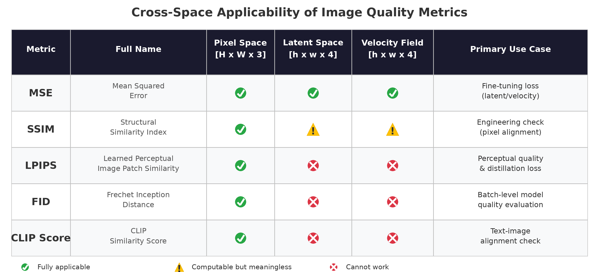
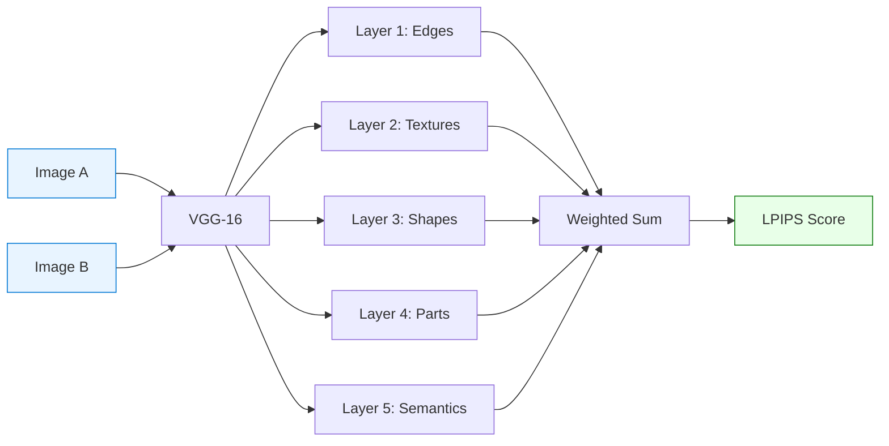
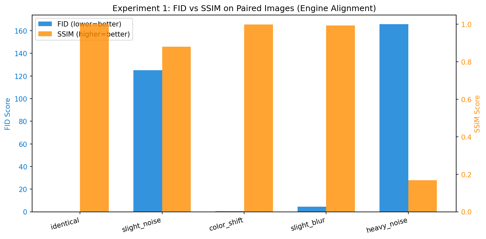
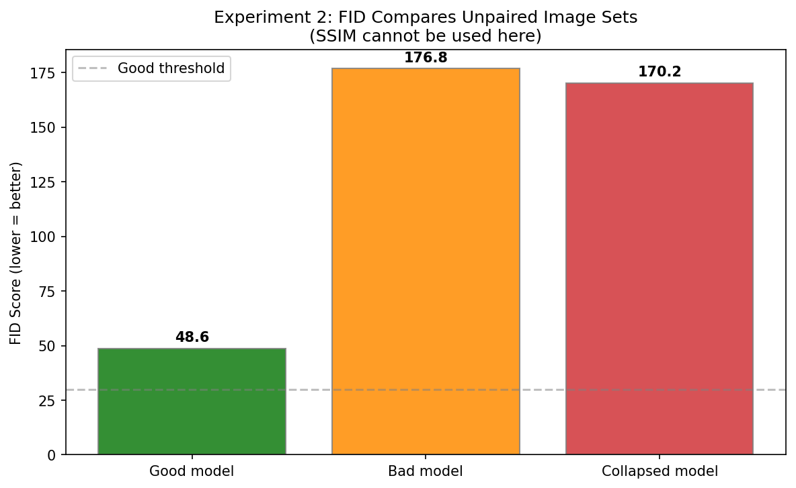
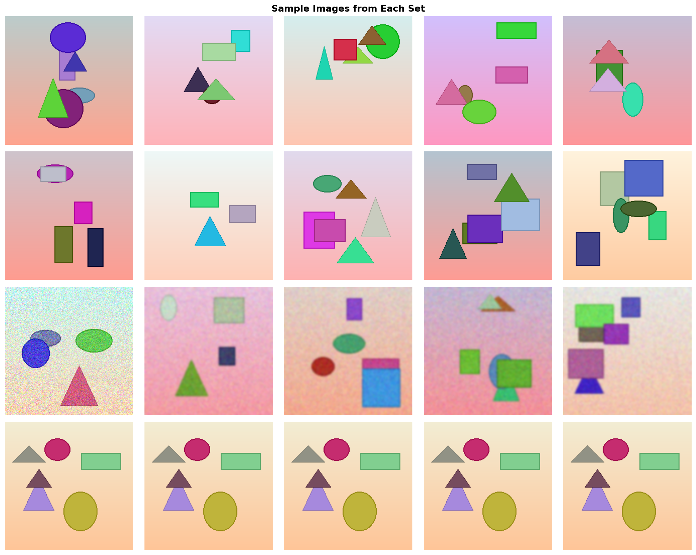
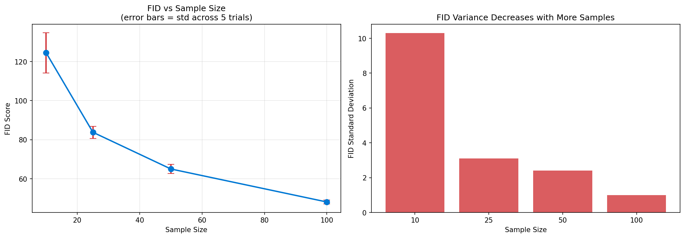
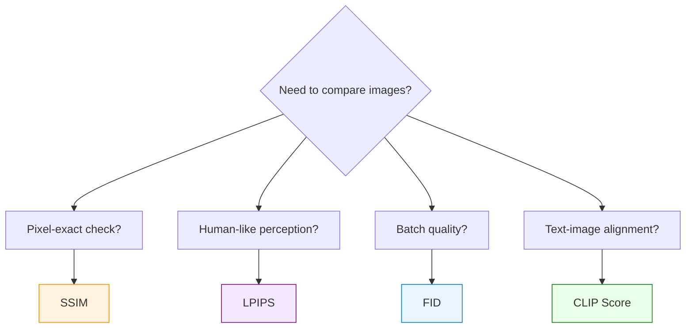

# 图像相似度指标 — MSE、SSIM、LPIPS、FID 与 CLIP Score

> **比较图"像不像"的五种方法 — 像素差、结构匹配、AI 感知、统计分布和语义对齐。**

## 是什么？

想象你在网上买了一件衣服，商家用 AI 生成了一张“你穿上这件衣服”的效果图。现在商家想升级 AI 引擎让出图更快，但担心新引擎生成的图“质量不如以前”。怎么判断？人工看千张图太慢，所以我们需要**自动化的图像质量评估指标**。

下面这五个指标就是做这件事的。它们各自独立地回答“两张图（或两批图）有多像”，但观测角度完全不同：

| | MSE | SSIM | LPIPS | FID | CLIP Score |
|---|---|---|---|---|---|
| **方法** | 逐元素平方差 | 滑动窗口统计（2004） | VGG 深度特征（2018） | Inception 特征分布（2017） | CLIP 编码余弦距离 |
| **比较内容** | 原始数值差异 | 亮度+对比度+结构 | 多层视觉特征 | 特征分布距离 | 文图语义对齐 |
| **粒度** | 逐像素/逐元素 | 逐图配对 | 逐图配对 | **批量级**（集合 vs 集合） | 逐图（文-图） |
| **得分方向** | **低=像** | **高=像**（1.0=完全一样） | **低=像**（0.0=完全一样） | **低=好** | **高=好** |
| **需要神经网络** | ❌ 纯数学 | ❌ 纯数学 | ✅ VGG-16 | ✅ InceptionV3 | ✅ CLIP |

### 指标之间的关系

这五个指标**实现上完全独立**（SSIM 的公式里没有 MSE，LPIPS 不调用 SSIM，FID 不调用 LPIPS），但在**抽象维度上有从具体到抽象的光谱**：

```
像素级(MSE) → 结构级(SSIM) → 感知级(LPIPS) → 分布级(FID) → 语义级(CLIP)
   具体                                                            抽象
```

它们不是层级包含关系（高层不依赖低层），而是同一问题的五个独立观测角度，但这些角度有从表层到深层的递进。类似体检的血常规、CT、核磁——各自独立检查，不互相依赖，但确实有从表层到深层的递进。

### 跨空间适用性（核心决策依据）

在看这张图之前，先理解一个关键背景：图片在计算机中有不同的“存在形式”。

- **像素空间 [H×W×3]**：就是你看到的 RGB 图片。每个像素 3 个数字（红/绿/蓝，各 0-255），256³ = 1678 万种颜色。
- **潜空间 (Latent) [h×w×4]**：图片经过 VAE 编码器压缩后的“摘要”。尺寸缩小 8 倍（1024×1024 → 128×128），通道数变成 4，人眼看不懂，但保留了图片的核心信息。Diffusion 模型的训练和推理都在这个空间进行。
- **速度场 (Velocity) [h×w×4]**：模型预测的“从噪声到图片的方向和速度”，形状与 latent 相同。微调时的 loss 就是比较模型预测的 velocity 和真实 velocity 的差异。

关键问题来了：LPIPS、FID、CLIP 的骨干网络（VGG/Inception/CLIP）**只认 3 通道 RGB 图片**。你把 4 通道的 latent 点进去，它的第一层卷积就报错——通道数不匹配。而 MSE 是纯数学运算，不关心输入有几个通道，所以哪里都能用。

下图一目了然：



**这张图决定了 Diffusion 模型各阶段只能用哪些指标** — 不是偏好问题，是物理空间的硬约束（详见下方「适用空间分析」章节）。

### 一个例子说清所有指标的区别

下图是对同一张真实图像生成图片施加四种修改，然后用 MSE、SSIM 和 LPIPS 三个指标分别评估。每个指标的反应完全不同——这就是为什么需要组合使用而不能只看一个：


| 修改 | 人眼感受 | MSE | SSIM | LPIPS | 谁被骗了？ |
|------|---------|:---:|:----:|:-----:|----------|
| 变亮 +30 | 看不出 | **0.0138**(⬆️) | 0.922 | 0.029 | MSE 过度反应 |
| 轻微模糊 | 明显变糊 | 0.0009 | 0.853 | **0.329**(⬆️) | MSE 漏了 |
| 1px 平移 | 看不出 | 0.0019 | **0.803**(⬇️) | 0.055 | SSIM 过度反应 |
| 色偏 R+20 | 看得到 | 0.0041 | **0.939**(⬆️) | 0.141 | SSIM 被骗 |

**结论**：每个指标都有盲区。只看 MSE 会被亮度骗，只看 SSIM 会被色偏骗。**组合使用才能避免被骗。**

## 为什么重要？

在扩散模型推理优化中，我们不断面临这个问题：**"我换了引擎/精度/编译器——输出质量有没有下降？"**

没有客观指标，就需要人工比较数千对图片。SSIM 和 LPIPS 把这件事自动化了：

- **SSIM** → 快速工程校验："我的代码变更有没有引入像素级差异？"
- **LPIPS** → 质量保障："输出对人眼来说还好看吗？"

**真实案例（扩散模型推理引擎 Benchmark）**：
- 对比了 4 种推理配置（diffusers eager/compile × vLLM eager/compile）
- 每种配置用相同输入生成 50 张图片
- 用 SSIM 测量：不同引擎的输出在像素层面是否一致？
- 结果：diffusers eager vs compile SSIM ≈ 0.93（优秀——compile 没有降低质量）
- 跨引擎 SSIM ≈ 0.91（修正分辨率不匹配后）

---

## 在 Azure 上运行

附带的 Demo 可以在**任何有 Python 的机器**上运行（纯 CPU，约 30 秒）。无需 GPU 或 Azure 订阅即可学习和实验。

在生产环境中，我们用这些指标在 Azure GPU VM 上评估扩散模型推理质量：

| 项目 | 详情 |
|---|---|
| **SKU** | [Standard_NC80adis_H100_v5](https://learn.microsoft.com/zh-cn/azure/virtual-machines/nc-h100-v5-series) |
| **GPU** | 1× NVIDIA H100 NVL 94 GB |
| **工作负载** | 扩散模型推理（50 个样本 × 4 种引擎配置） |
| **SSIM/LPIPS 的角色** | 自动化质量门控 — 无需人工审查即可跨引擎对比输出 |

### 为什么用 Azure GPU VM 做质量评估

- **扩散模型推理**生成图片；SSIM/LPIPS **衡量**质量
- 在云端 GPU（H100/A100）上运行推理，可以批量评估：每种配置 50–200 个样本
- 按需付费：开机跑推理 + 质量对比，跑完关机
- 指标计算本身很轻量 — SSIM 是纯数学，LPIPS 只需一个小型 VGG 模型

### 我们在 Azure 上验证了什么

| 对比组 | SSIM | 结论 |
|---|:---:|---|
| 同引擎，eager vs `torch.compile` | ~0.93 | compile 不降低质量 |
| 跨引擎，同分辨率 | ~0.91 | 微小数值差异，可接受 |
| 跨引擎，分辨率不匹配 | ~0.88 | resize 伪影拉低分数 — 应先对齐分辨率 |

这些数据让我们有信心向生产环境推荐 `torch.compile` 和替代引擎在 Azure 上部署。

---

## 原理

上面我们用一张图和一张表从宏观上看了五个指标的“谁能在哪用”和“各自的角色”。接下来我们一个一个拆开看，理解每个指标**内部怎么算的**。按“从简单到复杂”的顺序：

1. **MSE** — 最简单，纯数学，一行公式
2. **SSIM** — 比 MSE 进一步，用滑动窗口看局部结构
3. **LPIPS** — 让神经网络模拟人眼判断
4. **FID** — 不看单张图，看一批图的统计分布

### MSE — 全空间选手

MSE（Mean Squared Error，均方误差）是最基础的指标：

> **MSE = (1/n) × Σ(yᵢ - ŷᵢ)²**

对每个元素算差值的平方，再取平均。平方使得大误差受到更重的惩罚（差10的点贡献100，差1的点只贡献1）。

**MSE 在 Diffusion 模型中的核心角色**：

训练时模型的任务是预测噪声或 velocity，loss 计算公式为：

> **L = E[||ε_θ(xₜ, t) - ε||²]**

这不是"拍脑袋选的"，而是从**变分下界（ELBO）推导**出来的数学必然结果：最大化对数似然的变分下界 → 等价于最小化每一步的 KL 散度 → 在高斯噪声假设下 → 精确简化为 MSE。

**为什么不用 MAE (L1 Loss)？**

| | MSE (L2) | MAE (L1) |
|---|---------|---------|
| 梯度特性 | 误差大时梯度大，收敛快 | 梯度恒定，大误差处收敛慢 |
| 生成质量 | 更平滑、细节更好 | 可能产生模糊 |
| 理论支撑 | ELBO 直接推出 | 无变分推断理论支撑 |

**MSE 的独特优势——全空间适用**：MSE 是纯数学运算（逐元素平方差），不关心输入是什么格式。这使它成为唯一能在所有空间上工作的指标。
MSE 简单但有盲区——它只看数字差多少，但“数字差很大”不等于“看起来不像”。举个例子：把整张图均匀变亮 30，MSE 会很高（每个像素都差了 30），但人眼几乎看不出；反过来，轻微模糊图片，MSE 很低（像素值变化小），但人眼明显感觉变糊了。接下来的 SSIM 和 LPIPS 就是为了解决这个问题：一个用数学看结构，一个用神经网络模拟人眼。下图展示了它们的计算流程对比：


### SSIM — 数学尺子

SSIM 从三个维度计算相似度：

> **SSIM(x, y) = l(x,y)ᵅ · c(x,y)ᵝ · s(x,y)ᵞ**

其中：

| 分量 | 公式 | 含义 |
|:---:|------|------|
| **l** (亮度) | l(x,y) = (2μxμy + C₁) / (μx² + μy² + C₁) | 平均亮度是否接近？ |
| **c** (对比度) | c(x,y) = (2σxσy + C₂) / (σx² + σy² + C₂) | 对比度范围是否相似？ |
| **s** (结构) | s(x,y) = (σxy + C₃) / (σxσy + C₃) | 结构模式是否匹配？ |

常数 C₁, C₂, C₃ 防止除零。通常 α = β = γ = 1。

**关键特性**：SSIM 在滑动窗口（默认 7×7 或 11×11）上计算局部统计量再取平均。这使它比 MSE（纯像素级）更具感知性，但本质上仍然是**像素对齐**的——1 像素的平移就会显著拉低得分。

### LPIPS — AI 艺术鉴赏家

LPIPS 将两张图片送入预训练的 VGG-16 网络，比较它们的深度特征：



VGG 每层捕获不同层次的视觉信息：

| 层 | 捕获内容 | 例子 |
|:---:|---------|------|
| 1 | 边缘、线条 | "这里有条边" |
| 2 | 纹理、图案 | "这是格子纹理" |
| 3 | 局部形状 | "这是个袖子" |
| 4 | 物体部件 | "这是件 T 恤" |
| 5 | 整体语义 | "穿 T 恤的人" |

线性权重 w₁ … w₅（存储为 `lin0.weight` 到 `lin4.weight`）是通过在人类感知判断数据上**训练**得到的——这就是 LPIPS 比 SSIM 更贴合人眼的原因。

实际应用中，这些权重有时会出现在扩散模型 checkpoint 里——当训练代码用 LPIPS 作为损失函数，且保存 checkpoint 时没有过滤掉损失网络的权重时就会发生。它们是无害的，推理时自动忽略。

### VGG-16 — 特征提取器

VGG-16（Visual Geometry Group，牛津大学，2014 年）是一个经典的 16 层 CNN。虽然现在已经没人用它做图像分类了（被 ResNet、ViT 等取代），但它中间层的特征对视觉内容的表示非常优秀。所以 LPIPS 把它当作 Feature Extractor（特征提取器）使用——就像把退休侦探的调查直觉拿来复用。

### FID — 分布统计学家

FID（Fréchet Inception Distance）采用与 SSIM 和 LPIPS 根本不同的方法。它不是比较两张图，而是比较两**组**图片，通过测量它们在学习到的特征空间中统计分布的差异来评估质量。

**FID 的工作原理**：

1. 将两组图片分别送入 InceptionV3（预训练 CNN），提取 pool3 层的 2048 维特征
2. 分别计算每组特征的均值向量（μ）和协方差矩阵（Σ）
3. 计算两个多元高斯分布之间的 Fréchet Distance：

> **FID = ||μ₁ - μ₂||² + Tr(Σ₁ + Σ₂ - 2√(Σ₁Σ₂))**

第一项衡量两组图片的"平均外观"差多远。第二项衡量"多样性"差多大（协方差捕获多样性、风格一致性、颜色分布等）。

**FID 存在的意义（SSIM/LPIPS 做不到的事）**：

| 场景 | SSIM/LPIPS | FID |
|------|:----------:|:---:|
| "同一输入，两个引擎的输出一样吗？" | ✅ | 杀鸡用牛刀 |
| "模型 A 整体上和模型 B 一样好吗？" | ❌（没有配对图片） | ✅ |
| "我的模型是不是坍缩到只会生成一张图？" | ❌ | ✅ |
| "这个 GAN 训练收敛了吗？" | ❌ | ✅ |

SSIM 和 LPIPS 需要**配对**图片（图片 A₁ vs 图片 B₁）。FID 比较的是**非配对集合** — 只需要两批图片，不需要一一对应关系。

**FID 的局限性**：
- 需要**大样本量**才能稳定估计（官方推荐 ≥ 50,000 张；实践中 ≥ 100 是最低要求）
- 使用 InceptionV3（2015 年）作为特征提取器 — 可能无法很好地捕获现代视觉特征
- 一个 FID 数值无法告诉你**哪些**图片好或不好
- 对分辨率和预处理敏感（始终一致地 resize 到 299×299）

**FID 到底是什么 — 公式、模型还是库？**

FID 经常被误解为"一个模型"或"一个库"。它实际上是三个不同的层次：

| 层次 | 是什么 | 具体 |
|------|--------|------|
| **公式** | 一个数学距离度量 | Fréchet Distance，算两个多元高斯分布的距离 |
| **特征提取器** | 一个预训练 CNN 模型 | InceptionV3（Google 2015，在 ImageNet 上训练） |
| **实现** | 各种库/脚本 | pytorch-fid、clean-fid、torchmetrics、或手写 |

InceptionV3 只负责提取特征（"看图输出 2048 个数字"）。FID 分数本身是用一个简单的统计公式在这些特征上计算出来的 — 核心计算仅需 ~5 行代码：

```python
diff = mu1 - mu2
covmean = scipy.linalg.sqrtm(sigma1 @ sigma2)
fid = diff @ diff + np.trace(sigma1 + sigma2 - 2 * covmean)
```

常用 FID 库：

| 库 | 安装 | 说明 |
|---|---------|------|
| **pytorch-fid** | `pip install pytorch-fid` | 最流行，命令行工具 |
| **clean-fid** | `pip install clean-fid` | 修复了原版 resize 不一致问题 |
| **torchmetrics** | `pip install torchmetrics` | 统一指标库，包含 FID |
| **手写** | torch + scipy | 如我们的 `fid_demo.py` — 完全可控，核心代码 ~30 行 |

**FID 公平吗？— 公平性隐患**：

FID 衡量的是"跟参考集像不像"，但**"像参考集" ≠ "好"**。关键公平性陷阱：

| 隐患 | 解释 | 后果 |
|------|------|------|
| **Inception 偏见** | InceptionV3 在 ImageNet（自然照片）上训练 | 对时尚/医疗/艺术等非 ImageNet 领域，特征表示可能不准确 |
| **参考集 = 标准答案** | FID 只测与参考集的距离，不测内在质量 | 参考集有偏差，FID 继承偏差 |
| **奖励背诵** | 完美复制训练集 → FID ≈ 0 | 但那是过拟合，不是真正的好！ |
| **样本量不对等** | 模型 A 用 100 张算 FID，模型 B 用 10000 张 → 不可比 | 必须控制同样样本量 |
| **预处理差异** | 不同的 resize 方法到 299×299 影响分数 | 两篇论文的 FID 数字未必可比 |
| **对 Mode Dropping 不敏感** | 模型漏掉 10% 的类别但剩余 90% 很好 → FID 可能还不错 | 检测不到"部分缺失" |

**FID 公平性自检清单**：

- [ ] 参考集和生成集的**样本量一样**吗？（≥100，理想 ≥50K）
- [ ] 两边的**预处理完全一致**吗？（resize 方法、归一化）
- [ ] 参考集能**代表你的领域**吗？（ImageNet ≠ 生成图）
- [ ] 是否**交叉验证**了其他指标？（SSIM + LPIPS + 人工审查）

**结论**：FID 是很好的**粗筛工具**（"训练收敛了吗？"），但不是**裁判**（"哪个模型最好？"）。公平评估必须结合多指标 + 人工审查。

---

## 适用空间分析 — 核心决策依据

这是选择指标时最关键的约束，**不是偏好问题，是物理空间的硬约束**：

| 指标 | 像素空间 [H×W×3] | 潜空间 (Latent) [h×w×4] | 速度场 (Velocity) [h×w×4] | 原因 |
|------|:---:|:---:|:---:|------|
| **MSE** | ✅ | ✅ | ✅ | 纯数学运算，任何张量都能算 |
| **SSIM** | ✅ | ⚠️ 能算但无意义 | ⚠️ 能算但无意义 | "亮度/对比度/结构"三分量是为像素设计的，latent 的均值不代表"亮度" |
| **LPIPS** | ✅ | ❌ | ❌ | VGG-16 只接受 3 通道 RGB 输入，latent 是 4/16 通道且值域 [-3,3] |
| **FID** | ✅ | ❌ | ❌ | InceptionV3 只接受 3 通道 299×299 RGB 输入 |
| **CLIP Score** | ✅ | ❌ | ❌ | CLIP 视觉编码器只接受 3 通道 224×224 RGB 输入 |

**这张表直接决定了 Diffusion 模型各阶段的 loss/metric 选择**：

| 阶段 | 工作空间 | 可用的指标 |
|------|---------|-----------|
| 微调 (LoRA) | Latent/Velocity | 只有 MSE（唯一全空间选手） |
| 蒸馏 (Distillation) | 像素空间* | LPIPS（需 VAE decode 回像素空间） |
| 推理质量评估 | 像素空间 | SSIM + LPIPS + FID（组合互补） |
| 文图对齐评估 | 像素空间 | CLIP Score |

*蒸馏能用 LPIPS 是因为多了一步 VAE decode 把 latent 变回 RGB 图像，但代价是 decode 本身很重（显存 + 计算），是蒸馏比普通微调贵的原因之一。

**Velocity 场的补充评估指标**：

在 velocity 空间，除了 MSE 外还可以用 Cosine Similarity 互补：
- MSE 衡量 velocity 的**幅度差**
- Cosine Similarity 衡量 velocity 的**方向一致性**（不管大小，只看方向对不对）
- 极端情况：velocity 方向对了但幅度差 10 倍 → MSE 暴涨但 Cosine ≈ 1，两者互补

## 跨空间验证实验（H100 GPU，真实生成图片）

在 Azure H100 NVL (NC40ads_H100_v5) 上用真实生成图片验证了跨空间适用性表的每个结论。脚本：`cross_space_experiment.py` + `e5_blind_spots.py`。

### E1: LPIPS 喂 4 通道 latent — 崩溃

```
[PIXEL]  LPIPS score: 0.6928  ✅ 正常工作
[LATENT] Feeding [1, 4, 32, 32] to LPIPS...
[LATENT] CRASHED! ✅
Error: RuntimeError: size of tensor a (4) must match size of tensor b (3)
```

**定罪**：VGG-16 的 Conv1 只接受 3 通道输入，4 通道 latent 直接报错。这是硬约束，不是偏好。

### E2: SSIM 在 latent 上——能算但无意义

```
[PIXEL]  SSIM(cloth, model):          0.1608  （有意义的比较）
[LATENT] SSIM(lat_cloth, lat_model):  0.1221  （能算但无意义）
[LATENT] SSIM(lat_cloth, +noise):     0.1376
[PIXEL]  SSIM(cloth, +noise):         0.2962
```

**定罪**：SSIM 的“亮度/对比度/结构”三分量在 latent 空间无物理含义。加噪声后响应模式与像素空间完全不同。

### E3: MSE 全空间适用

```
[PIXEL]    MSE(cloth, model):  0.165405  ✅
[LATENT]   MSE(lat_c, lat_m):  0.065193  ✅
[VELOCITY] MSE(vel_a, vel_b):  0.010035  ✅
```

**定罪**：MSE 是纯数学运算，不关心通道数或语义，三个空间全部正常工作。

### E4: Cosine vs MSE 互补性

| 场景 | MSE | Cosine | 解读 |
|------|:---:|:------:|------|
| 相同 velocity | 0.000000 | 1.0000 | 基线 |
| **方向相同，幅度×10** | **82.19** | **1.0000** | MSE 爆炸 8190x，Cosine 完全不变！ |
| 方向相反 | 4.059 | -1.0000 | 两者都检测到 |
| 轻微扰动 | 0.010 | 0.9951 | 现实场景 |

**定罪**：MSE 抓幅度差异，Cosine 抓方向差异，互补才能完整评估 velocity 场质量。

### E5: 真实图片盲区对比（H100，真实生成图片 256×256）

| 失真 | MSE | SSIM | LPIPS | 盲区分析 |
|------|:---:|:----:|:-----:|------|
| D0: 同图 | 0.0000 | 1.0000 | 0.0000 | 基线 |
| **D1: 1px平移** | 0.0058 | **0.1622** | 0.0821 | ⚠️ SSIM 暴跌到 0.16！人眼看不出 |
| D2: 轻微模糊 | 0.0017 | 0.6614 | **0.3520** | LPIPS 抓住纹理损失 |
| D3: 严重模糊 | 0.0052 | 0.5059 | 0.5735 | 三者一致 |
| **D4: 亮度+30** | **0.0136** | **0.9345** | **0.0315** | MSE 最高，但 SSIM/LPIPS 说“人眼看不出” |
| D5: 噪声σ=15 | 0.0034 | 0.5356 | 0.2925 | 三者一致 |
| **D6: 色偏 R+20** | 0.0041 | **0.9581** | **0.1182** | ⚠️ SSIM 被骗（0.96），LPIPS 发现色彩变化 |
| D7: JPEG q=10 | 0.0022 | 0.5498 | 0.5535 | 两者一致 |

**实验结论**：每个指标都有盲区，组合使用才能避免被骗。SSIM 0.93 + LPIPS 0.01 = 放心；SSIM 0.96 + LPIPS 0.12 = SSIM 被色偏骗了。

### E6: 三指标差异热力图（Teacher vs Student，真实生成图 1024×1024）

三个指标在同一对图片上“看到”的东西完全不同：


- **MSE Map**（左）：只有衣服边缘和身体轮廓少量亮点 — MSE 看到的是“哪些像素数值差最大”
- **SSIM Map**（中）：整个身体和衣服区域都亮起来 — SSIM 对结构变化极度敏感
- **LPIPS Map**（右）：衣服褶皱、身体轮廓、背景纹理高亮 — 与人眼关注的区域最吻合

---

## 实测数据

### Demo 结果（CPU，256×256 合成图像）

运行附带的 `similarity_demo.py` 即可复现。

**原始测试图像**（256×256，合成几何图形 + 纹理）：


**施加 7 种失真，SSIM vs LPIPS 对比**：


详细分数：

```
失真类型               SSIM    LPIPS  解读
----------------------------------------------------------------------
1px平移              0.9556   0.0114  SSIM 敏感，LPIPS 不在意
轻微模糊             0.9390   0.1223  SSIM 还行，LPIPS 发现纹理损失
严重模糊             0.8720   0.2405  两者都检测到退化
亮度+30              0.9788   0.0504  SSIM 容忍，LPIPS 中等反应
噪声σ15              0.3042   0.4698  两者一致：严重退化
色彩偏移             0.9551   0.1619  SSIM 还行，LPIPS 发现颜色变化
JPEG质量10           0.8573   0.1915  两者都惩罚压缩伪影
局部色块             0.9739   0.0495  两者都检测，小范围局部变化
```

**关键观察**：

| 失真 | 更好的指标 | 原因 |
|------|-----------|------|
| **1px 平移** | LPIPS | SSIM 惩罚像素不对齐；LPIPS 认为"看起来一样" |
| **轻微模糊** | LPIPS | SSIM 几乎不察觉；LPIPS 通过 VGG 捕获纹理损失 |
| **亮度变化** | SSIM | SSIM 对均匀亮度变化鲁棒；LPIPS 中等惩罚 |
| **色彩偏移** | LPIPS | SSIM 按 R/G/B 通道独立处理；LPIPS 整合颜色感知 |
| **噪声σ=15** | SSIM | SSIM 降至 0.30（严厉）；LPIPS 0.47（同样严厉但更合理） |

### FID Demo 结果（CPU，每组 100 张合成图像）

运行附带的 `fid_demo.py` 即可复现。

**实验 1 — 引擎对齐：FID vs SSIM 横向对比**

这个实验问的是："FID 能替代 SSIM 做引擎对齐测试吗？" 答案：**不能 — 用对工具做对事**。

我们生成 100 张参考图片并施加 5 种扰动，对比 FID（批量级）vs SSIM（逐图平均）：

| 扰动类型 | FID | 平均 SSIM | 解读 |
|:--------:|:---:|:---------:|------|
| 完全相同 | ~0.0 | 1.000 | 两者都检测到完美匹配 |
| 轻微噪声（σ=10） | 125.3 | 0.881 | FID 对噪声过度反应；SSIM 给出分级响应 |
| 色彩偏移（色相+10°） | 0.6 | 0.999 | FID 几乎不在意；SSIM 同样忽略 |
| 轻微模糊（σ=1） | 4.6 | 0.994 | 两者：微小差异 |
| 严重噪声（σ=50） | 165.7 | 0.168 | 两者一致：严重不同 |



**结论**：FID 不是为配对图片比较设计的。仅加轻微噪声就从 0 跳到 125，因为它衡量的是分布级偏移，而非逐图相似度。对于"这两张输出一样吗？"这类问题，SSIM 和 LPIPS 才是正确的工具。

**实验 2 — 模型能力评估：FID 的真正用武之地**

这个实验展示 FID 的真正优势：比较**非配对**图像分布以评估模型质量。

我们模拟三个生成模型各生成 100 张图片：
- **优质模型**：多样性高、质量好的图片（丰富的颜色、形状、纹理）
- **劣质模型**：低质量图片（噪声多、颜色暗淡、形状简单）
- **坍缩模型**：同一张图片复制 100 份（Mode Collapse，模式坍缩）

全部与一组 100 张多样性"真实"参考图片对比：

| 模型 | FID 分数 | 解读 |
|:----:|:--------:|------|
| 优质模型 | **48.6** | 最接近真实分布 |
| 劣质模型 | 176.8 | 远离真实分布 — 检测到低质量 |
| 坍缩模型 | 170.2 | 远离真实分布 — 检测到无多样性 |



**结论**：FID 正确排名为 优质 < 劣质 ≈ 坍缩。SSIM 和 LPIPS 都做不到这一点，因为没有配对图片可以比较 — 只有两组图片集合。

*各模型集合的视觉样本（注意多样性差异）：*



**实验 3 — 样本量敏感性**

FID 需要估计 2048 维的协方差矩阵。样本数少于特征维度时，估计不可靠。我们通过在每个样本量下随机抽样 5 次来验证：

| 样本数 | FID 均值 | FID 标准差 | 稳定性 |
|:------:|:--------:|:----------:|:------:|
| 10 | 124.5 | ±10.3 | ❌ 不可靠 |
| 25 | 83.8 | ±3.1 | ⚠️ 仅作粗略参考 |
| 50 | 65.0 | ±2.4 | ⚠️ 谨慎使用 |
| 100 | 48.1 | ±1.0 | ✅ 基本稳定 |



**结论**：仅用 10 个样本，重复同一实验得到的 FID 值范围在 ~107 到 ~135 — 足以逆转两个模型的排名。用 ≥100 个样本做有意义的比较。

### 生产观测数据（GPU，扩散模型图像生成，50 样本）

在 H100 上进行扩散模型推理 Benchmark 的结论：

| 对比组 | 约 SSIM | 观察 |
|--------|:---------:|------|
| 同引擎，eager vs compile | ~0.93 | `torch.compile` 不降低质量 |
| 跨引擎，同分辨率 | ~0.91 | 不同实现带来的微小数值差异 |
| 跨引擎，混合分辨率 | ~0.88 | 分辨率不匹配人为拉低 SSIM |

**SSIM 判定阈值**（来自生产经验校准）：

| SSIM 范围 | 判定 | 行动 |
|:---------:|:----:|------|
| ≥ 0.95 | 优秀 | 可直接替换，无需视觉审查 |
| 0.85 ~ 0.95 | 可接受 | 轻微差异，建议抽样目视检查 |
| < 0.85 | 差 | 质量明显下降，需排查根因 |

**陷阱：分辨率不匹配会人为拉低 SSIM**

不同推理引擎可能参考不同的输入图片来确定输出尺寸，导致输出分辨率不一致。计算 SSIM 前需要 resize，而 resize 引入的插值伪影会人为拉低分数（最差情况可降低 0.4）。务必确保分辨率匹配，或标记哪些样本做过 resize 并单独统计。

### 跨引擎三指标验证（Seed Alignment，种子对齐发现）

在一次跨引擎扩散模型图像生成验证中（Diffusers vs 另一推理引擎对比），我们同时使用三个指标并发现 **随机种子是输出差异的主导因素**：

| 对比组 | LPIPS | SSIM | FID | 结论 |
|--------|:-----:|:----:|:---:|------|
| 同模型、不同引擎、**随机种子** | 0.072 | 0.906 | 11.04 | "引擎间存在中等差异" |
| 同模型、不同引擎、**固定种子** | **0.005** | **0.992** | **1.38** | "引擎几乎完全一致" |
| 种子对齐带来的改善 | **14×** | +0.086 | **8×** | 种子对齐消除了绝大多数差异 |

三个指标独立得出相同结论：种子对齐后，两个引擎的输出几乎完全一致。多指标交叉验证比任何单一指标都给出更强的置信度。

**经验教训**：当跨引擎 SSIM 低于预期（~0.90 而非 ~0.95）时，先检查种子对齐，再排查算法差异。

### LPIPS 在 Distillation（蒸馏）训练中的应用

扩散模型蒸馏（将推理步数从 40 步减到 8 步）中，实际使用的是 **MSE + LPIPS 混合损失函数**，而非纯 LPIPS。类似“美术老师 + 美术评委”的分工：

```python
# 蒸馏训练的实际 loss 结构（源码分析）：
loss_1 = align_trajectory()      # MSE（美术老师）
  # 在 latent 空间逜步比较学生和教师的 velocity
  # velocity = (教师下一步latent - 当前latent) / Δσ
  # 每一步都保留梯度 → 精确指导每一步怎么走

loss_2 = compute_regularization() # LPIPS（美术评委）
  # 学生跑完 8 步后，VAE decode 回像素空间
  # LPIPS(AlexNet) 比较学生图 vs 教师图
  # .detach() 切断中间步梯度 → 只看最终结果好不好，省显存

loss = loss_1 + loss_2  # 1:1 直接相加
```

**为什么是 MSE + LPIPS 而不是只用一个？**

| 场景 | 学练画类比 | 问题 |
|------|---------|------|
| 只有 MSE | 美术老师盯着每一笔，没人看最终效果 | 每笔都像达芬奇，但整幅画缺灵魂 |
| 只有 LPIPS | 评委等画完才看，不知道哪一笔错 | 知道不好但不知道怎么改，训练慢 |
| **MSE + LPIPS** | **老师管每笔 + 评委管最终效果** | **每笔像 + 整幅也好看** |

**LPIPS 为什么用 .detach()（不回传每步梯度）？**

如果 LPIPS 也回传每一步的梯度，显存翻倍（需保存整条链路），而且 MSE 已经在精确指导每一步了，不需要 LPIPS 重复做。用 .detach() 只看最终结果 = 最小代价换取质量保底。

**关键细节**：
- LPIPS 只对比**最终图片**，不是每步都对比。VAE decode 整个训练步只调用 2 次（学生一次 + 教师一次），LPIPS 只算 1 次。
- LPIPS 的参考图是教师模型生成的图片（`trajectory_teacher[-1]` 经 VAE decode）。
- 虽然 .detach() 切断了中间步梯度，但 LPIPS 的数值仍然参与 total loss。优化器通过多轮训练中 LPIPS 值的变化趋势，间接学到“朝哪个方向调参数能让最终图片更好看”。

## 工程实践中的坑

### 1. 得分方向搞反

| 指标 | "图片完全相同" | "图片完全不同" |
|------|:-------------:|:-------------:|
| SSIM | **1.0** | 0.0 |
| LPIPS | **0.0** | 1.0 |

这是最常见的 Bug 来源。务必反复确认：高分到底是好还是坏？

### 2. SSIM 是像素对齐的

一张完全相同的图片平移 1 像素，SSIM 就会 < 1.0。如果你的推理流水线引入了亚像素对齐差异（比如不同的插值模式），SSIM 会惩罚这一点，即使图片在视觉上完全一样。

**对策**：当像素对齐无法保证时，用 LPIPS。

### 3. LPIPS 需要神经网络

LPIPS 需要 VGG-16 模型（~528MB 首次下载）。这意味着：
- 首次调用较慢（模型加载）
- 需要安装 PyTorch
- 不适合无法运行神经网络的环境

**对策**：用 SSIM 做快速 CI/CD 检查；LPIPS 留给质量审计。

### 4. 两个指标都不捕获语义正确性

SSIM 和 LPIPS 都测量低级相似度。它们无法告诉你：
- "这个人穿的是对的衣服吗？"（用 CLIP Score）
- "生成的图片足够多样吗？"（用 FID/KID）
- "文字提示和输出匹配吗？"（用 CLIP Score）

### 5. 分辨率不匹配会搞死 SSIM

两张图片分辨率不同时，必须先 resize 再计算 SSIM。resize 步骤引入的插值伪影会拉低分数。

**对策**：始终确保分辨率匹配，或记录哪些样本被 resize 了并单独统计。

### 6. FID 在小样本下不稳定

FID 需要估计 2048 维协方差矩阵。样本数少于特征维度时，估计不可靠：

| 样本数 | FID 均值 | FID 标准差 | 可靠性 |
|:------:|:--------:|:----------:|:------:|
| 10 | 124.5 | **10.3** | ❌ 不可靠 — 方差过大 |
| 25 | 83.8 | 3.1 | ⚠️ 仅作粗略参考 |
| 50 | 65.0 | 2.4 | ⚠️ 谨慎使用 |
| 100 | 48.1 | **1.0** | ✅ 基本稳定 |

*（数据来自 fid_demo.py 实验 3：同质量分布，每个样本量随机抽样 5 次）*


仅 10 个样本时，重复同一实验得到的 FID 值在 107 到 135 之间波动 — 28 分的差距！100 个样本时，波动缩窄到 ~2 分。

**对策**：至少使用 100 个样本。如果只有 50 个，将 FID 视为粗略指标而非精确测量。发表结果的社区标准是 ≥ 50,000 张图片。

## 速查卡

### 图像相似度指标全家福

| 类别 | 指标 | 全称 | 得分方向 | 需要AI？ | 适用场景 |
|------|------|------|:--------:|:--------:|---------|
| **像素级** | MSE | Mean Squared Error | 低=像 | ❌ | 原始像素差异 |
| | PSNR | Peak Signal-to-Noise Ratio | 高=像 | ❌ | 图像压缩质量 |
| **结构级** | SSIM | Structural Similarity Index | 高=像 | ❌ | 工程验证 |
| | MS-SSIM | Multi-Scale SSIM | 高=像 | ❌ | 比SSIM更鲁棒 |
| **感知级** | LPIPS | Learned Perceptual Similarity | 低=像 | ✅ VGG | 感知质量匹配 |
| **分布级** | FID | Fréchet Inception Distance | 低=好 | ✅ Inception | 批量质量评估 |
| | KID | Kernel Inception Distance | 低=好 | ✅ Inception | 小样本批量质量 |
| **语义级** | CLIP Score | CLIP Similarity | 高=好 | ✅ CLIP | 文图对齐 |
| **人工** | MOS | Mean Opinion Score | 高=好 | ❌（需要人） | 真实质量标准 |

### 决策流程



## 运行 Demo

### SSIM vs LPIPS Demo

```bash
pip install torch torchvision lpips scikit-image matplotlib Pillow numpy
python similarity_demo.py --save-images
```

生成一张 256×256 的合成测试图像，应用 7 种失真，分别计算 SSIM 与 LPIPS 进行对比。在 CPU 上约 30 秒完成。

### FID Demo

```bash
pip install torch torchvision scipy scikit-image matplotlib Pillow numpy
python fid_demo.py --save-images
```

运行三个实验，展示 FID 的优势和局限性：

| 实验 | 展示内容 | 时间（CPU） |
|:----:|---------|:----------:|
| 1 | FID vs SSIM 配对对比（引擎对齐） | ~2 分钟 |
| 2 | FID 非配对集合对比（模型能力评估） | ~2 分钟 |
| 3 | FID 在不同样本量下的方差（10–100） | ~5 分钟 |

运行单个实验：`python fid_demo.py --experiment 2 --save-images`

---

**作者**：魏新宇 (Xinyu Wei)
