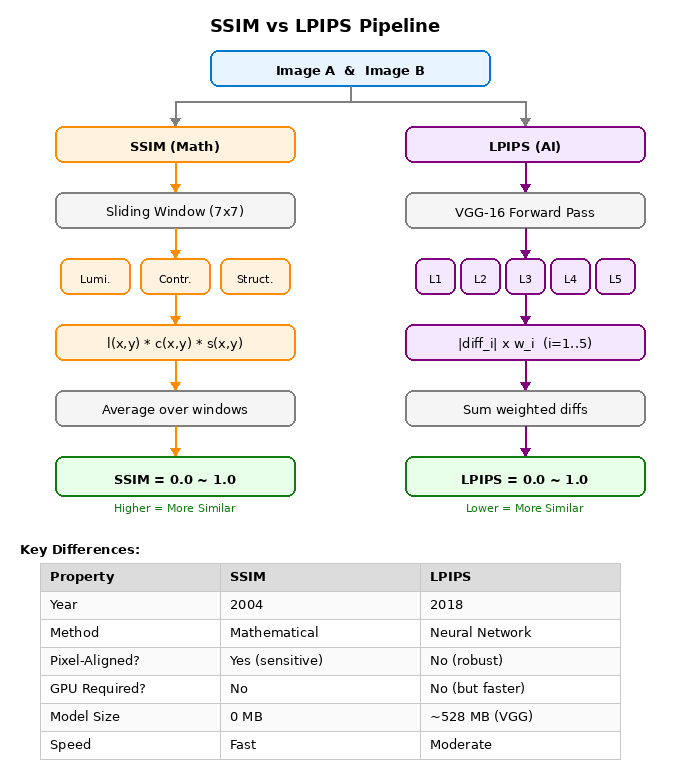
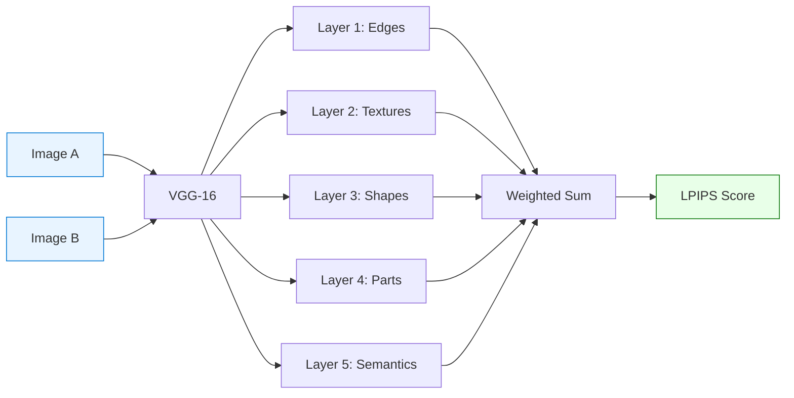
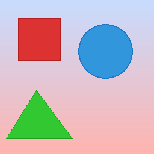
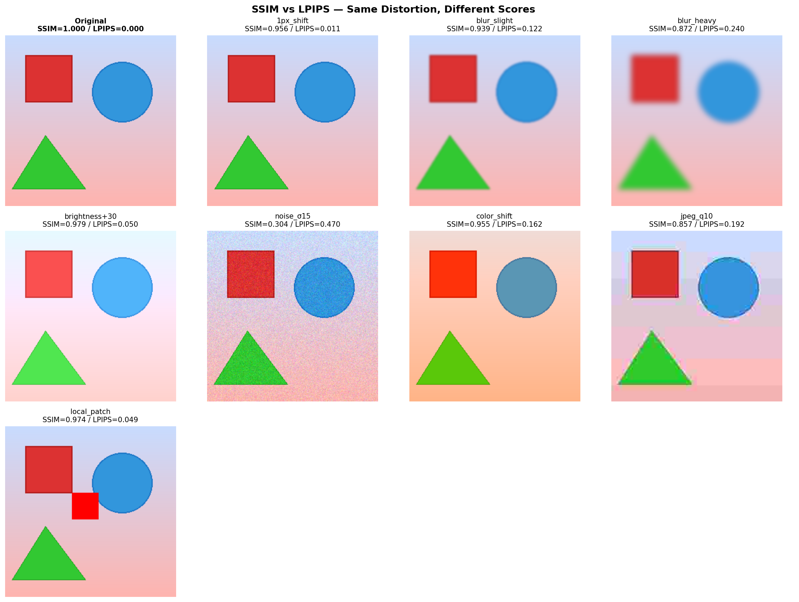
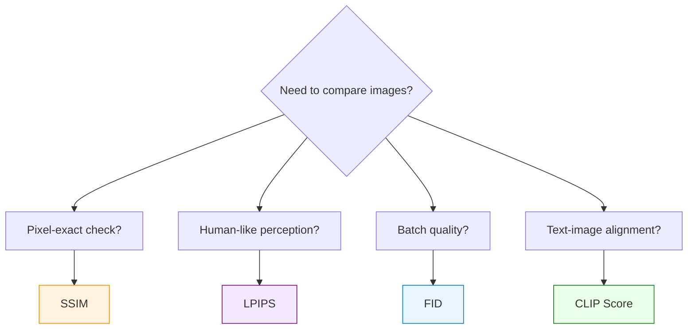

# 图像相似度指标 — SSIM vs LPIPS

> **比较两张图"像不像"的两种方法 — 一种用数学，一种用 AI。**

## 是什么？

**SSIM**（结构相似性指数）和 **LPIPS**（学习型感知图像块相似度）是两种比较图像相似度的指标。它们回答同一个问题——"有多像？"——但角度完全不同：

| | SSIM | LPIPS |
|---|---|---|
| **方法** | 数学公式（2004 年） | 神经网络（2018 年） |
| **比较内容** | 亮度 + 对比度 + 结构 | VGG 深度特征 |
| **得分方向** | **越高越像**（1.0 = 完全一样） | **越低越像**（0.0 = 完全一样） |
| **类比** | 拿尺子量的工程师 | 凭感觉看的艺术家 |

## 为什么重要？

在扩散模型推理优化中，我们不断面临这个问题：**"我换了引擎/精度/编译器——输出质量有没有下降？"**

没有客观指标，就需要人工比较数千对图片。SSIM 和 LPIPS 把这件事自动化了：

- **SSIM** → 快速工程校验："我的代码变更有没有引入像素级差异？"
- **LPIPS** → 质量保障："输出对人眼来说还好看吗？"

**真实案例（虚拟试衣 Benchmark）**：
- 对比了 4 种推理配置（diffusers eager/compile × vLLM eager/compile）
- 每种配置用相同输入生成 50 张试穿图片
- 用 SSIM 测量：不同引擎的输出在像素层面是否一致？
- 结果：diffusers eager vs compile SSIM ≈ 0.93（优秀——compile 没有降低质量）
- 跨引擎 SSIM ≈ 0.91（修正分辨率不匹配后）

---

## 在 Azure 上运行

附带的 Demo 可以在**任何有 Python 的机器**上运行（纯 CPU，约 30 秒）。无需 GPU 或 Azure 订阅即可学习和实验。

在生产环境中，我们用这些指标在 Azure GPU VM 上评估扩散模型推理质量：

| 项目 | 详情 |
|---|---|
| **SKU** | [Standard_NC80adis_H100_v5](https://learn.microsoft.com/zh-cn/azure/virtual-machines/nc-h100-v5-series) |
| **GPU** | 1× NVIDIA H100 NVL 94 GB |
| **工作负载** | 虚拟试衣推理（50 个样本 × 4 种引擎配置） |
| **SSIM/LPIPS 的角色** | 自动化质量门控 — 无需人工审查即可跨引擎对比输出 |

### 为什么用 Azure GPU VM 做质量评估

- **扩散模型推理**生成图片；SSIM/LPIPS **衡量**质量
- 在云端 GPU（H100/A100）上运行推理，可以批量评估：每种配置 50–200 个样本
- 按需付费：开机跑推理 + 质量对比，跑完关机
- 指标计算本身很轻量 — SSIM 是纯数学，LPIPS 只需一个小型 VGG 模型

### 我们在 Azure 上验证了什么

| 对比组 | SSIM | 结论 |
|---|:---:|---|
| 同引擎，eager vs `torch.compile` | ~0.93 | compile 不降低质量 |
| 跨引擎，同分辨率 | ~0.91 | 微小数值差异，可接受 |
| 跨引擎，分辨率不匹配 | ~0.88 | resize 伪影拉低分数 — 应先对齐分辨率 |

这些数据让我们有信心向生产环境推荐 `torch.compile` 和替代引擎在 Azure 上部署。

---

## 原理



### SSIM — 数学尺子

SSIM 从三个维度计算相似度：

> **SSIM(x, y) = l(x,y)ᵅ · c(x,y)ᵝ · s(x,y)ᵞ**

其中：

| 分量 | 公式 | 含义 |
|:---:|------|------|
| **l** (亮度) | l(x,y) = (2μxμy + C₁) / (μx² + μy² + C₁) | 平均亮度是否接近？ |
| **c** (对比度) | c(x,y) = (2σxσy + C₂) / (σx² + σy² + C₂) | 对比度范围是否相似？ |
| **s** (结构) | s(x,y) = (σxy + C₃) / (σxσy + C₃) | 结构模式是否匹配？ |

常数 C₁, C₂, C₃ 防止除零。通常 α = β = γ = 1。

**关键特性**：SSIM 在滑动窗口（默认 7×7 或 11×11）上计算局部统计量再取平均。这使它比 MSE（纯像素级）更具感知性，但本质上仍然是**像素对齐**的——1 像素的平移就会显著拉低得分。

### LPIPS — AI 艺术鉴赏家

LPIPS 将两张图片送入预训练的 VGG-16 网络，比较它们的深度特征：



VGG 每层捕获不同层次的视觉信息：

| 层 | 捕获内容 | 例子 |
|:---:|---------|------|
| 1 | 边缘、线条 | "这里有条边" |
| 2 | 纹理、图案 | "这是格子纹理" |
| 3 | 局部形状 | "这是个袖子" |
| 4 | 物体部件 | "这是件 T 恤" |
| 5 | 整体语义 | "穿 T 恤的人" |

线性权重 w₁ … w₅（存储为 `lin0.weight` 到 `lin4.weight`）是通过在人类感知判断数据上**训练**得到的——这就是 LPIPS 比 SSIM 更贴合人眼的原因。

实际应用中，这些权重有时会出现在扩散模型 checkpoint 里——当训练代码用 LPIPS 作为损失函数，且保存 checkpoint 时没有过滤掉损失网络的权重时就会发生。它们是无害的，推理时自动忽略。

### VGG-16 — 特征提取器

VGG-16（Visual Geometry Group，牛津大学，2014 年）是一个经典的 16 层 CNN。虽然现在已经没人用它做图像分类了（被 ResNet、ViT 等取代），但它中间层的特征对视觉内容的表示非常优秀。所以 LPIPS 把它当作 Feature Extractor（特征提取器）使用——就像把退休侦探的调查直觉拿来复用。

## 实测数据

### Demo 结果（CPU，256×256 合成图像）

运行附带的 `similarity_demo.py` 即可复现。

**原始测试图像**（256×256，合成几何图形 + 纹理）：



**施加 7 种失真，SSIM vs LPIPS 对比**：



详细分数：

```
失真类型               SSIM    LPIPS  解读
----------------------------------------------------------------------
1px平移              0.9556   0.0114  SSIM 敏感，LPIPS 不在意
轻微模糊             0.9390   0.1223  SSIM 还行，LPIPS 发现纹理损失
严重模糊             0.8720   0.2405  两者都检测到退化
亮度+30              0.9788   0.0504  SSIM 容忍，LPIPS 中等反应
噪声σ15              0.3042   0.4698  两者一致：严重退化
色彩偏移             0.9551   0.1619  SSIM 还行，LPIPS 发现颜色变化
JPEG质量10           0.8573   0.1915  两者都惩罚压缩伪影
局部色块             0.9739   0.0495  两者都检测，小范围局部变化
```

**关键观察**：

| 失真 | 更好的指标 | 原因 |
|------|-----------|------|
| **1px 平移** | LPIPS | SSIM 惩罚像素不对齐；LPIPS 认为"看起来一样" |
| **轻微模糊** | LPIPS | SSIM 几乎不察觉；LPIPS 通过 VGG 捕获纹理损失 |
| **亮度变化** | SSIM | SSIM 对均匀亮度变化鲁棒；LPIPS 中等惩罚 |
| **色彩偏移** | LPIPS | SSIM 按 R/G/B 通道独立处理；LPIPS 整合颜色感知 |
| **噪声σ=15** | SSIM | SSIM 降至 0.30（严厉）；LPIPS 0.47（同样严厉但更合理） |

### 生产观测数据（GPU，虚拟试衣，50 样本）

在 H100 上进行扩散模型推理 Benchmark 的结论：

| 对比组 | 约 SSIM | 观察 |
|--------|:---------:|------|
| 同引擎，eager vs compile | ~0.93 | `torch.compile` 不降低质量 |
| 跨引擎，同分辨率 | ~0.91 | 不同实现带来的微小数值差异 |
| 跨引擎，混合分辨率 | ~0.88 | 分辨率不匹配人为拉低 SSIM |

**SSIM 判定阈值**（来自生产经验校准）：

| SSIM 范围 | 判定 | 行动 |
|:---------:|:----:|------|
| ≥ 0.95 | 优秀 | 可直接替换，无需视觉审查 |
| 0.85 ~ 0.95 | 可接受 | 轻微差异，建议抽样目视检查 |
| < 0.85 | 差 | 质量明显下降，需排查根因 |

**陷阱：分辨率不匹配会人为拉低 SSIM**

不同推理引擎可能参考不同的输入图片来确定输出尺寸，导致输出分辨率不一致。计算 SSIM 前需要 resize，而 resize 引入的插值伪影会人为拉低分数（最差情况可降低 0.4）。务必确保分辨率匹配，或标记哪些样本做过 resize 并单独统计。

### LPIPS 在 Distillation（蒸馏）训练中的应用

扩散模型 Distillation（蒸馏，将推理步数从 50 步减到 8 步）中，LPIPS 作为 Training Loss Function（训练损失函数）：

```python
lpips_loss = LPIPS(net='vgg')

# 蒸馏（Distillation）训练过程中：
image_8step = student_model(noise, 8_steps)    # 学生：8 步
image_50step = teacher_model(noise, 50_steps)  # 教师：50 步

loss = lpips_loss(image_8step, image_50step)   # 最小化感知差异
loss.backward()  # 更新学生（LoRA）参数
```

为什么 Distillation 用 LPIPS 而不是 MSE？
- MSE 会强制像素级精确匹配 → 学生学会复制伪影
- LPIPS 允许学生生成"看起来一样"但像素可能不同的图片
- 这给了学生更多自由度去找到高效的 8 步去噪路径

## 工程实践中的坑

### 1. 得分方向搞反

| 指标 | "图片完全相同" | "图片完全不同" |
|------|:-------------:|:-------------:|
| SSIM | **1.0** | 0.0 |
| LPIPS | **0.0** | 1.0 |

这是最常见的 Bug 来源。务必反复确认：高分到底是好还是坏？

### 2. SSIM 是像素对齐的

一张完全相同的图片平移 1 像素，SSIM 就会 < 1.0。如果你的推理流水线引入了亚像素对齐差异（比如不同的插值模式），SSIM 会惩罚这一点，即使图片在视觉上完全一样。

**对策**：当像素对齐无法保证时，用 LPIPS。

### 3. LPIPS 需要神经网络

LPIPS 需要 VGG-16 模型（~528MB 首次下载）。这意味着：
- 首次调用较慢（模型加载）
- 需要安装 PyTorch
- 不适合无法运行神经网络的环境

**对策**：用 SSIM 做快速 CI/CD 检查；LPIPS 留给质量审计。

### 4. 两个指标都不捕获语义正确性

SSIM 和 LPIPS 都测量低级相似度。它们无法告诉你：
- "这个人穿的是对的衣服吗？"（用 CLIP Score）
- "生成的图片足够多样吗？"（用 FID/KID）
- "文字提示和输出匹配吗？"（用 CLIP Score）

### 5. 分辨率不匹配会搞死 SSIM

两张图片分辨率不同时，必须先 resize 再计算 SSIM。resize 步骤引入的插值伪影会拉低分数。

**对策**：始终确保分辨率匹配，或记录哪些样本被 resize 了并单独统计。

## 速查卡

### 图像相似度指标全家福

| 类别 | 指标 | 全称 | 得分方向 | 需要AI？ | 适用场景 |
|------|------|------|:--------:|:--------:|---------|
| **像素级** | MSE | Mean Squared Error | 低=像 | ❌ | 原始像素差异 |
| | PSNR | Peak Signal-to-Noise Ratio | 高=像 | ❌ | 图像压缩质量 |
| **结构级** | SSIM | Structural Similarity Index | 高=像 | ❌ | 工程验证 |
| | MS-SSIM | Multi-Scale SSIM | 高=像 | ❌ | 比SSIM更鲁棒 |
| **感知级** | LPIPS | Learned Perceptual Similarity | 低=像 | ✅ VGG | 感知质量匹配 |
| **分布级** | FID | Fréchet Inception Distance | 低=好 | ✅ Inception | 批量质量评估 |
| | KID | Kernel Inception Distance | 低=好 | ✅ Inception | 小样本批量质量 |
| **语义级** | CLIP Score | CLIP Similarity | 高=好 | ✅ CLIP | 文图对齐 |
| **人工** | MOS | Mean Opinion Score | 高=好 | ❌（需要人） | 真实质量标准 |

### 决策流程



## 运行 Demo

```bash
pip install torch torchvision lpips scikit-image matplotlib Pillow numpy
python similarity_demo.py --save-images
```

脚本生成一张 256×256 的合成测试图像，应用 7 种失真，分别计算 SSIM 与 LPIPS 进行对比。在 CPU 上约 30 秒完成。

---

**作者**：魏新宇 (Xinyu Wei)
