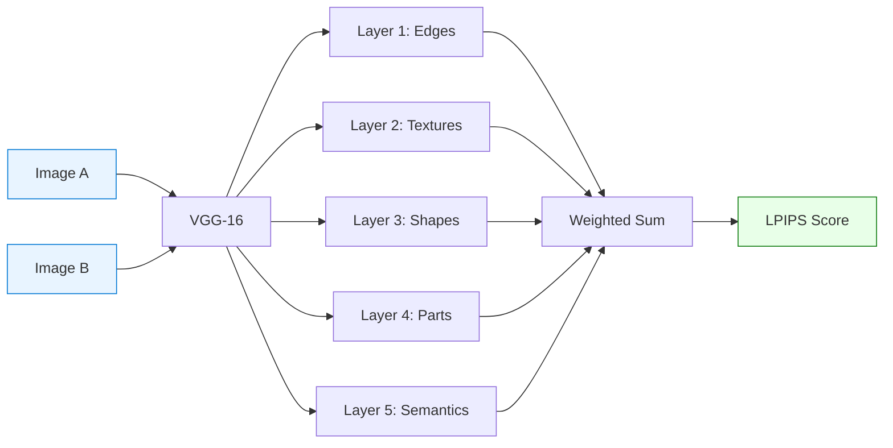
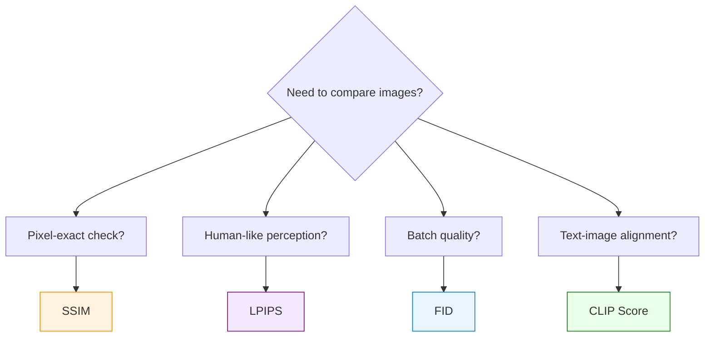

# Image Similarity Metrics — SSIM vs LPIPS

> **Two ways to answer "How similar are these two images?" — one uses math, the other uses AI.**

## What Is It?

**SSIM** (Structural Similarity Index Measure) and **LPIPS** (Learned Perceptual Image Patch Similarity) are metrics for comparing two images. They answer the same question — "how similar?" — but from fundamentally different angles:

| | SSIM | LPIPS |
|---|---|---|
| **Approach** | Mathematical formula (2004) | Neural network (2018) |
| **Compares** | Luminance + Contrast + Structure | Deep features from VGG |
| **Score direction** | **Higher = more similar** (1.0 = identical) | **Lower = more similar** (0.0 = identical) |
| **Analogy** | Engineer with a ruler | Art critic with trained eyes |

## Why It Matters

In diffusion model inference optimization, we constantly face this question: **"I changed the engine/precision/compiler — did the output quality degrade?"**

Without objective metrics, you'd need humans to compare thousands of image pairs. SSIM and LPIPS automate this:

- **SSIM** → Quick engineering check: "Did my code change introduce pixel-level differences?"
- **LPIPS** → Quality assurance: "Does the output still look good to human eyes?"

**Real-world example (Virtual Try-On Benchmark)**:
- Compared 4 inference configurations (diffusers eager/compile × vLLM eager/compile)
- Each produced 50 try-on images from identical inputs
- SSIM measured: are the outputs pixel-consistent across engines?
- Result: diffusers eager vs compile SSIM ≈ 0.93 (excellent — compile doesn't degrade quality)
- Cross-engine SSIM ≈ 0.91 (after correcting for resolution mismatch)

## How It Works


### SSIM — The Mathematical Ruler

SSIM computes similarity across three dimensions:

> **SSIM(x, y) = l(x,y)ᵅ · c(x,y)ᵝ · s(x,y)ᵞ**

Where:

| Component | Formula | Meaning |
|:---------:|---------|--------|
| **l** (Luminance) | l(x,y) = (2μxμy + C₁) / (μx² + μy² + C₁) | Are the average brightnesses similar? |
| **c** (Contrast) | c(x,y) = (2σxσy + C₂) / (σx² + σy² + C₂) | Are the contrast ranges similar? |
| **s** (Structure) | s(x,y) = (σxy + C₃) / (σxσy + C₃) | Are the structural patterns similar? |

Constants C₁, C₂, C₃ prevent division by zero. Typically α = β = γ = 1.

**Key property**: SSIM operates on sliding windows (default 7×7 or 11×11), computing local statistics then averaging. This makes it more perceptual than MSE (which is purely pixel-wise), but still fundamentally **pixel-aligned** — a 1-pixel shift can significantly drop the score.

### LPIPS — The AI Art Critic

LPIPS feeds both images through a pretrained VGG-16 network and compares their deep features:



Each VGG layer captures different levels of visual information:

| Layer | Captures | Example |
|:-----:|----------|---------|
| 1 | Edges, lines | "There's an edge here" |
| 2 | Textures, patterns | "This is a checkered pattern" |
| 3 | Local shapes | "This is a sleeve" |
| 4 | Object parts | "This is a T-shirt" |
| 5 | Semantic meaning | "A person wearing a T-shirt" |

The linear weights w₁ … w₅ (stored as `lin0.weight` through `lin4.weight`) are **learned** by training on human perceptual judgments — this is why LPIPS correlates better with human perception than SSIM.

In practice, these weights sometimes appear in diffusion model checkpoints when the training code uses LPIPS as a loss function and doesn't filter out the loss network weights during checkpoint saving. They are harmless — ignored during inference.

### VGG-16 — The Feature Extractor

VGG-16 (Visual Geometry Group, Oxford, 2014) is a classic CNN with 16 layers. Though no longer used for image classification (superseded by ResNet, ViT, etc.), its intermediate features are remarkably good at representing visual content. That's why LPIPS uses it as a "feature extractor" — like repurposing a retired detective's investigative instincts.

## Real-World Experiment

### Demo Results (CPU, 256×256 synthetic image)

Run the included `similarity_demo.py` to reproduce.

**Original test image** (256×256, synthetic geometric shapes + textures):


**7 distortions applied, SSIM vs LPIPS comparison**:


Detailed scores:

```
Distortion               SSIM    LPIPS  Interpretation
----------------------------------------------------------------------
1px_shift              0.9556   0.0114  SSIM sensitive, LPIPS immune
blur_slight            0.9390   0.1223  SSIM OK, LPIPS catches texture loss
blur_heavy             0.8720   0.2405  Both detect degradation
brightness+30          0.9788   0.0504  SSIM tolerant, LPIPS moderate
noise_σ15              0.3042   0.4698  Both agree: severely degraded
color_shift            0.9551   0.1619  SSIM OK, LPIPS catches color change
jpeg_q10               0.8573   0.1915  Both penalize compression artifacts
local_patch            0.9739   0.0495  Both detect, small local change
```

**Key observations**:

| Distortion | Winner | Why |
|------------|--------|-----|
| **1px shift** | LPIPS | SSIM penalizes pixel misalignment; LPIPS sees "same image" |
| **Slight blur** | LPIPS | SSIM barely notices; LPIPS catches texture destruction via VGG |
| **Brightness** | SSIM | SSIM is robust to uniform brightness change; LPIPS moderately penalizes |
| **Color shift** | LPIPS | SSIM treats R/G/B independently per channel; LPIPS integrates color perception |
| **Noise σ=15** | SSIM | SSIM drops to 0.30 (harsh); LPIPS at 0.47 (also harsh but proportional) |

### Production Observations (GPU, Virtual Try-On, 50 samples)

From our diffusion model inference benchmarks on H100:

| Comparison | Approx SSIM | Observation |
|------------|:-----------:|-------------|
| Same engine, eager vs compile | ~0.93 | `torch.compile` does not degrade quality |
| Cross-engine, same resolution | ~0.91 | Minor numerical differences from different implementations |
| Cross-engine, mixed resolution | ~0.88 | Resolution mismatch artificially lowers SSIM |

**SSIM judgment thresholds** (calibrated from production experience):

| SSIM Range | Judgment | Action |
|:----------:|:--------:|--------|
| ≥ 0.95 | EXCELLENT | Direct replacement, no visual review needed |
| 0.85 ~ 0.95 | ACCEPTABLE | Minor differences, visual spot-check recommended |
| < 0.85 | POOR | Significant quality drop, investigate root cause |

**Gotcha: Resolution mismatch artificially lowers SSIM**

When comparing outputs from different engines, output resolution may differ if the size calculation references different input images. Resize before computing SSIM introduces interpolation artifacts, lowering scores by up to 0.4 in worst cases. Always ensure matching resolution or log which samples were resized.

### LPIPS in Distillation Training

In diffusion model distillation (reducing inference steps from 50 to 8), LPIPS serves as the training loss function:

```python
lpips_loss = LPIPS(net='vgg')

# During distillation training:
image_8step = student_model(noise, 8_steps)    # Student: 8 steps
image_50step = teacher_model(noise, 50_steps)  # Teacher: 50 steps

loss = lpips_loss(image_8step, image_50step)   # Minimize perceptual difference
loss.backward()  # Update student (LoRA) parameters
```

Why LPIPS instead of MSE for distillation loss?
- MSE forces pixel-perfect matching → student learns to copy artifacts
- LPIPS allows the student to produce images that "look the same" even if pixels differ
- This gives the student more freedom to find efficient 8-step denoising paths

## Pitfalls in Practice

### 1. Score Direction Confusion

| Metric | "Images are identical" | "Images are completely different" |
|--------|:---------------------:|:--------------------------------:|
| SSIM | **1.0** | 0.0 |
| LPIPS | **0.0** | 1.0 |

This is the most common source of bugs. Always double-check: is a "high score" good or bad?

### 2. SSIM is Pixel-Aligned

A perfectly identical image shifted by 1 pixel will show SSIM < 1.0. If your inference pipeline introduces sub-pixel alignment differences (e.g., different interpolation modes), SSIM will penalize this even though the images are visually identical.

**Fix**: Use LPIPS when pixel alignment is not guaranteed.

### 3. LPIPS Requires a Neural Network

LPIPS needs the VGG-16 model (~528MB download, first-time only). This means:
- First call is slow (model loading)
- Needs PyTorch installed
- Not suitable for environments where you can't run neural networks

**Fix**: Use SSIM for quick CI/CD checks; reserve LPIPS for quality audits.

### 4. Neither Metric Captures Semantic Correctness

SSIM and LPIPS both measure low-level similarity. They cannot tell you:
- "Is the person wearing the right garment?" (use CLIP Score)
- "Are the generated images diverse enough?" (use FID/KID)
- "Does the text prompt match the output?" (use CLIP Score)

### 5. Resolution Mismatch Kills SSIM

If two images have different resolutions, you must resize before computing SSIM. This resize step introduces interpolation artifacts that lower the score.

**Fix**: Always ensure matching resolution, or log which samples were resized and compute separate statistics.

## Quick Reference

### All Image Similarity Metrics

| Category | Metric | Full Name | Score Direction | Needs AI? | Best For |
|----------|--------|-----------|:---------------:|:---------:|----------|
| **Pixel** | MSE | Mean Squared Error | Low=similar | ❌ | Raw pixel difference |
| | PSNR | Peak Signal-to-Noise Ratio | High=similar | ❌ | Image compression quality |
| **Structural** | SSIM | Structural Similarity Index | High=similar | ❌ | Engineering verification |
| | MS-SSIM | Multi-Scale SSIM | High=similar | ❌ | More robust than SSIM |
| **Perceptual** | LPIPS | Learned Perceptual Similarity | Low=similar | ✅ VGG | Perceived quality matching |
| **Distribution** | FID | Fréchet Inception Distance | Low=better | ✅ Inception | Batch-level quality |
| | KID | Kernel Inception Distance | Low=better | ✅ Inception | Small-sample batch quality |
| **Semantic** | CLIP Score | CLIP Similarity | High=better | ✅ CLIP | Text-image alignment |
| **Human** | MOS | Mean Opinion Score | High=better | ❌ (humans) | Ground truth quality |

### Decision Flowchart



## Run the Demo

```bash
pip install torch torchvision lpips scikit-image matplotlib Pillow numpy
python similarity_demo.py --save-images
```

The script generates a 256×256 synthetic test image, applies 7 types of distortion, and compares SSIM vs LPIPS for each. Runs on CPU in ~30 seconds.

---

**Author**: Xinyu Wei (魏新宇)
