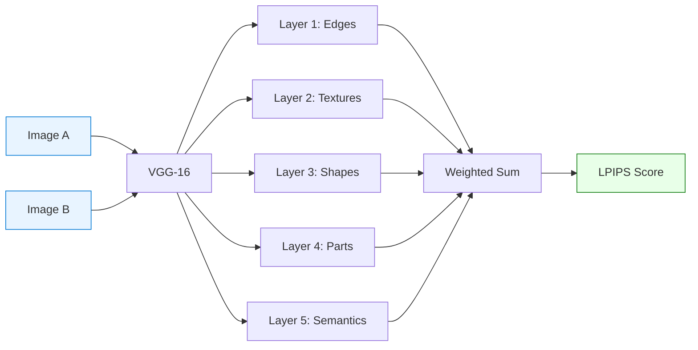
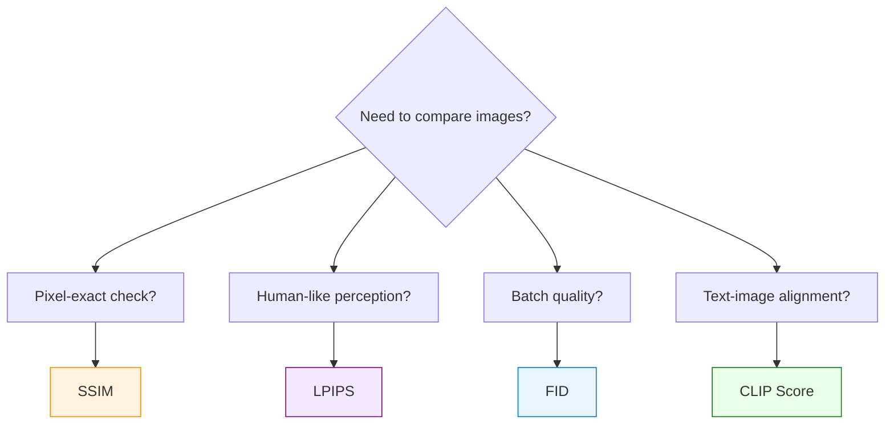

# Image Similarity Metrics — SSIM, LPIPS & FID

> **Three ways to answer "How similar are these images?" — math, AI perception, and statistical distribution.**

## What Is It?

**SSIM**, **LPIPS**, and **FID** are metrics for comparing images. They answer the same question — "how similar?" — but from fundamentally different angles:

| | SSIM | LPIPS | FID |
|---|---|---|---|
| **Approach** | Mathematical formula (2004) | Neural network (2018) | Statistical distance (2017) |
| **Compares** | Luminance + Contrast + Structure | Deep features from VGG | Feature distributions via Inception |
| **Granularity** | **Per-image pair** | **Per-image pair** | **Batch-level** (set vs set) |
| **Score direction** | **Higher = more similar** (1.0 = identical) | **Lower = more similar** (0.0 = identical) | **Lower = more similar** (0.0 = identical) |
| **Analogy** | Engineer with a ruler | Art critic with trained eyes | Statistician comparing populations |

## Why It Matters

In diffusion model inference optimization, we constantly face this question: **"I changed the engine/precision/compiler — did the output quality degrade?"**

Without objective metrics, you'd need humans to compare thousands of image pairs. SSIM and LPIPS automate this:

- **SSIM** → Quick engineering check: "Did my code change introduce pixel-level differences?"
- **LPIPS** → Quality assurance: "Does the output still look good to human eyes?"

**Real-world example (Virtual Try-On Benchmark)**:
- Compared 4 inference configurations (diffusers eager/compile × vLLM eager/compile)
- Each produced 50 try-on images from identical inputs
- SSIM measured: are the outputs pixel-consistent across engines?
- Result: diffusers eager vs compile SSIM ≈ 0.93 (excellent — compile doesn't degrade quality)
- Cross-engine SSIM ≈ 0.91 (after correcting for resolution mismatch)

---

## Running on Azure

The included demo runs on **any machine with Python** (CPU only, ~30 seconds). No GPU or Azure subscription required to learn and experiment.

In production, we used these metrics to evaluate diffusion model inference quality on Azure GPU VMs:

| Item | Details |
|---|---|
| **SKU** | [Standard_NC80adis_H100_v5](https://learn.microsoft.com/en-us/azure/virtual-machines/nc-h100-v5-series) |
| **GPU** | 1× NVIDIA H100 NVL 94 GB |
| **Workload** | Virtual Try-On inference (50 samples × 4 engine configs) |
| **Role of SSIM/LPIPS** | Automated quality gate — compare outputs across engines without human review |

### Why Azure GPU VMs for Quality Evaluation

- **Diffusion model inference** generates the images; SSIM/LPIPS **measure** the quality
- Running inference on cloud GPUs (H100/A100) lets you benchmark at scale: 50–200 samples per config
- Pay-as-you-go: spin up, run inference + quality comparison, shut down
- The metrics themselves are lightweight — SSIM is pure math, LPIPS needs only a small VGG model

### What We Validated on Azure

| Comparison | SSIM | Conclusion |
|---|:---:|---|
| Same engine, eager vs `torch.compile` | ~0.93 | Compile does not degrade quality |
| Cross-engine, same resolution | ~0.91 | Minor numerical differences, acceptable |
| Cross-engine, resolution mismatch | ~0.88 | Resize artifacts lower score — fix resolution first |

These numbers gave us confidence to recommend `torch.compile` and alternative engines for production deployment on Azure.

---

## How It Works


### SSIM — The Mathematical Ruler

SSIM computes similarity across three dimensions:

> **SSIM(x, y) = l(x,y)ᵅ · c(x,y)ᵝ · s(x,y)ᵞ**

Where:

| Component | Formula | Meaning |
|:---------:|---------|--------|
| **l** (Luminance) | l(x,y) = (2μxμy + C₁) / (μx² + μy² + C₁) | Are the average brightnesses similar? |
| **c** (Contrast) | c(x,y) = (2σxσy + C₂) / (σx² + σy² + C₂) | Are the contrast ranges similar? |
| **s** (Structure) | s(x,y) = (σxy + C₃) / (σxσy + C₃) | Are the structural patterns similar? |

Constants C₁, C₂, C₃ prevent division by zero. Typically α = β = γ = 1.

**Key property**: SSIM operates on sliding windows (default 7×7 or 11×11), computing local statistics then averaging. This makes it more perceptual than MSE (which is purely pixel-wise), but still fundamentally **pixel-aligned** — a 1-pixel shift can significantly drop the score.

### LPIPS — The AI Art Critic

LPIPS feeds both images through a pretrained VGG-16 network and compares their deep features:



Each VGG layer captures different levels of visual information:

| Layer | Captures | Example |
|:-----:|----------|---------|
| 1 | Edges, lines | "There's an edge here" |
| 2 | Textures, patterns | "This is a checkered pattern" |
| 3 | Local shapes | "This is a sleeve" |
| 4 | Object parts | "This is a T-shirt" |
| 5 | Semantic meaning | "A person wearing a T-shirt" |

The linear weights w₁ … w₅ (stored as `lin0.weight` through `lin4.weight`) are **learned** by training on human perceptual judgments — this is why LPIPS correlates better with human perception than SSIM.

In practice, these weights sometimes appear in diffusion model checkpoints when the training code uses LPIPS as a loss function and doesn't filter out the loss network weights during checkpoint saving. They are harmless — ignored during inference.

### VGG-16 — The Feature Extractor

VGG-16 (Visual Geometry Group, Oxford, 2014) is a classic CNN with 16 layers. Though no longer used for image classification (superseded by ResNet, ViT, etc.), its intermediate features are remarkably good at representing visual content. That's why LPIPS uses it as a "feature extractor" — like repurposing a retired detective's investigative instincts.

### FID — The Distribution Statistician

FID (Fréchet Inception Distance) takes a fundamentally different approach from SSIM and LPIPS. Instead of comparing two individual images, it compares two **sets** of images by measuring how similar their statistical distributions are in a learned feature space.

**How FID Works**:

1. Feed both image sets through InceptionV3 (a pretrained CNN), extracting 2048-dimensional features from the pool3 layer
2. Compute the mean vector (μ) and covariance matrix (Σ) of features for each set
3. Calculate the Fréchet distance between the two multivariate Gaussians:

> **FID = ||μ₁ - μ₂||² + Tr(Σ₁ + Σ₂ - 2√(Σ₁Σ₂))**

The first term measures how different the "average" images are. The second term measures how different the "variety" of images is (covariance captures diversity, style consistency, color distribution, etc.).

**Why FID exists (what SSIM/LPIPS cannot do)**:

| Scenario | SSIM/LPIPS | FID |
|----------|:----------:|:---:|
| "Are these two outputs from the same input identical?" | ✅ | Overkill |
| "Is Model A as good as Model B overall?" | ❌ (no paired images) | ✅ |
| "Did my model collapse to generating one image repeatedly?" | ❌ | ✅ |
| "Is this GAN training converging?" | ❌ | ✅ |

SSIM and LPIPS require **paired** images (image A₁ vs image B₁). FID compares **unpaired sets** — you just need two batches of images, no correspondence required.

**FID's limitations**:
- Requires **large sample sizes** for stable estimates (official recommendation: ≥ 50,000 images; in practice, ≥ 100 is a minimum)
- Uses InceptionV3 (2015) as the feature extractor — may not capture modern visual features well
- A single FID number doesn't tell you **which** images are good or bad
- Sensitive to image resolution and preprocessing (always resize to 299×299 consistently)

**What FID actually is — formula, model, or library?**

FID is often misunderstood as "a model" or "a library." It's actually three distinct layers:

| Layer | What It Is | Specifics |
|-------|-----------|----------|
| **Formula** | A mathematical distance metric | Fréchet Distance between two multivariate Gaussians |
| **Feature extractor** | A pretrained CNN model | InceptionV3 (Google 2015, trained on ImageNet) |
| **Implementation** | Various libraries/scripts | pytorch-fid, clean-fid, torchmetrics, or hand-written |

InceptionV3 only extracts features ("looks at images and outputs 2048 numbers"). The FID score itself is computed by a simple statistical formula on those features — the core calculation is ~5 lines of code:

```python
diff = mu1 - mu2
covmean = scipy.linalg.sqrtm(sigma1 @ sigma2)
fid = diff @ diff + np.trace(sigma1 + sigma2 - 2 * covmean)
```

Common FID libraries:

| Library | Install | Notes |
|---------|---------|-------|
| **pytorch-fid** | `pip install pytorch-fid` | Most popular, CLI tool |
| **clean-fid** | `pip install clean-fid` | Fixes resize inconsistencies in original implementation |
| **torchmetrics** | `pip install torchmetrics` | Unified metrics library, includes FID |
| **Hand-written** | torch + scipy | Like our `fid_demo.py` — full control, ~30 lines of core code |

**Is FID fair? — Fairness concerns**:

FID measures "how similar to the reference set," but **"similar to reference" ≠ "good."** Key fairness pitfalls:

| Concern | Explanation | Impact |
|---------|-------------|--------|
| **Inception bias** | InceptionV3 was trained on ImageNet (natural photos) | Features may be poor for fashion, medical, artistic images |
| **Reference set = ground truth** | FID only measures distance to reference, not intrinsic quality | If reference set is biased, FID inherits the bias |
| **Rewards memorization** | Perfectly copying the training set → FID ≈ 0 | That's overfitting, not quality! |
| **Sample size asymmetry** | Model A with 100 samples vs Model B with 10,000 → incomparable | Must use equal sample sizes |
| **Preprocessing differences** | Different resize methods to 299×299 affect scores | Two papers' FID numbers may not be comparable |
| **Insensitive to mode dropping** | Model drops 10% of categories but remaining 90% is great → FID may look fine | Cannot detect "partial omission" |

**FID fairness self-check**:

- [ ] Are reference and generated sets the **same sample size**? (≥100, ideally ≥50K)
- [ ] Is the **preprocessing identical** on both sides? (resize method, normalization)
- [ ] Does the reference set **represent your domain**? (ImageNet ≠ fashion try-on)
- [ ] Are you **cross-validating** with other metrics? (SSIM + LPIPS + human review)

**Bottom line**: FID is a good **screening tool** ("is training converging?"), not a **judge** ("which model is best"). For fair evaluation, always combine FID with per-image metrics and human review.

## Real-World Experiment

### Demo Results (CPU, 256×256 synthetic image)

Run the included `similarity_demo.py` to reproduce.

**Original test image** (256×256, synthetic geometric shapes + textures):


**7 distortions applied, SSIM vs LPIPS comparison**:


Detailed scores:

```
Distortion               SSIM    LPIPS  Interpretation
----------------------------------------------------------------------
1px_shift              0.9556   0.0114  SSIM sensitive, LPIPS immune
blur_slight            0.9390   0.1223  SSIM OK, LPIPS catches texture loss
blur_heavy             0.8720   0.2405  Both detect degradation
brightness+30          0.9788   0.0504  SSIM tolerant, LPIPS moderate
noise_σ15              0.3042   0.4698  Both agree: severely degraded
color_shift            0.9551   0.1619  SSIM OK, LPIPS catches color change
jpeg_q10               0.8573   0.1915  Both penalize compression artifacts
local_patch            0.9739   0.0495  Both detect, small local change
```

**Key observations**:

| Distortion | Winner | Why |
|------------|--------|-----|
| **1px shift** | LPIPS | SSIM penalizes pixel misalignment; LPIPS sees "same image" |
| **Slight blur** | LPIPS | SSIM barely notices; LPIPS catches texture destruction via VGG |
| **Brightness** | SSIM | SSIM is robust to uniform brightness change; LPIPS moderately penalizes |
| **Color shift** | LPIPS | SSIM treats R/G/B independently per channel; LPIPS integrates color perception |
| **Noise σ=15** | SSIM | SSIM drops to 0.30 (harsh); LPIPS at 0.47 (also harsh but proportional) |

### FID Demo Results (CPU, 100 synthetic images per set)

Run the included `fid_demo.py` to reproduce.

**Experiment 1 — Engine Alignment: FID vs SSIM Side-by-Side**

This experiment asks: "Can FID replace SSIM for engine alignment testing?" Answer: **No — use the right tool for the job**.

We generated 100 reference images and applied 5 perturbation types, then compared FID (batch-level) vs SSIM (per-image average):

| Perturbation | FID | Avg SSIM | Interpretation |
|:------------:|:---:|:--------:|----------------|
| Identical copy | ~0.0 | 1.000 | Both detect perfect match |
| Slight noise (σ=10) | 125.3 | 0.881 | FID overreacts to noise; SSIM gives graded response |
| Color shift (hue+10°) | 0.6 | 0.999 | FID barely notices; SSIM ignores it too |
| Slight blur (σ=1) | 4.6 | 0.994 | Both: minor difference |
| Heavy noise (σ=50) | 165.7 | 0.168 | Both agree: severely different |


**Takeaway**: FID is not designed for paired image comparison. It jumps from 0 to 125 with slight noise because it measures distributional shift, not per-image similarity. For "are these two outputs identical?" questions, SSIM and LPIPS are the right tools.

**Experiment 2 — Model Capability: Where FID Shines**

This experiment shows FID's real strength: comparing **unpaired** image distributions to evaluate model quality.

We simulated three generative models producing 100 images each:
- **Good model**: Diverse, high-quality images (varied colors, shapes, textures)
- **Bad model**: Low-quality images (noisy, dull colors, simple shapes)
- **Collapsed model**: 100 copies of the same image (mode collapse)

All compared against a "real" reference set of 100 diverse images:

| Model | FID Score | Interpretation |
|:-----:|:---------:|----------------|
| Good | **48.6** | Closest to real distribution |
| Bad | 176.8 | Far from real — low quality detected |
| Collapsed | 170.2 | Far from real — no diversity detected |


**Takeaway**: FID correctly ranks Good < Bad ≈ Collapsed. Neither SSIM nor LPIPS could make this assessment, because there are no paired images to compare — only two sets.

*Visual samples from each model set (notice the diversity difference):*


**Experiment 3 — Sample Size Sensitivity**

FID estimates a 2048-dimensional covariance matrix. Fewer samples than dimensions means unstable estimates. We verified this by subsampling 5 times at each size:

| Samples | FID Mean | FID Std | Stability |
|:-------:|:--------:|:-------:|:---------:|
| 10 | 124.5 | ±10.3 | ❌ Unreliable |
| 25 | 83.8 | ±3.1 | ⚠️ Rough indicator |
| 50 | 65.0 | ±2.4 | ⚠️ Usable with caution |
| 100 | 48.1 | ±1.0 | ✅ Reasonably stable |


**Takeaway**: With only 10 samples, repeating the exact same experiment yields FID values ranging from ~107 to ~135 — enough variance to reverse rankings between two models. Use ≥100 samples for meaningful comparisons.

### Production Observations (GPU, Virtual Try-On, 50 samples)

From our diffusion model inference benchmarks on H100:

| Comparison | Approx SSIM | Observation |
|------------|:-----------:|-------------|
| Same engine, eager vs compile | ~0.93 | `torch.compile` does not degrade quality |
| Cross-engine, same resolution | ~0.91 | Minor numerical differences from different implementations |
| Cross-engine, mixed resolution | ~0.88 | Resolution mismatch artificially lowers SSIM |

**SSIM judgment thresholds** (calibrated from production experience):

| SSIM Range | Judgment | Action |
|:----------:|:--------:|--------|
| ≥ 0.95 | EXCELLENT | Direct replacement, no visual review needed |
| 0.85 ~ 0.95 | ACCEPTABLE | Minor differences, visual spot-check recommended |
| < 0.85 | POOR | Significant quality drop, investigate root cause |

**Gotcha: Resolution mismatch artificially lowers SSIM**

When comparing outputs from different engines, output resolution may differ if the size calculation references different input images. Resize before computing SSIM introduces interpolation artifacts, lowering scores by up to 0.4 in worst cases. Always ensure matching resolution or log which samples were resized.

### Cross-Engine Validation with Three Metrics (Seed Alignment Discovery)

In a cross-engine virtual try-on validation (comparing Diffusers vs an alternative inference engine), we used all three metrics together and discovered that **random seed is the dominant factor** in output differences:

| Comparison | LPIPS | SSIM | FID | Conclusion |
|------------|:-----:|:----:|:---:|------------|
| Same model, different engines, **random seed** | 0.072 | 0.906 | 11.04 | "Engines differ moderately" |
| Same model, different engines, **fixed seed** | **0.005** | **0.992** | **1.38** | "Engines are nearly identical" |
| Improvement from seed alignment | **14×** | +0.086 | **8×** | Seed alignment eliminates most differences |

All three metrics independently confirmed the same conclusion: with seed alignment, the two engines produce virtually identical outputs. This multi-metric cross-validation gives much stronger confidence than any single metric.

**Lesson learned**: When cross-engine SSIM is lower than expected (~0.90 instead of ~0.95), check seed alignment before investigating algorithmic differences.

### LPIPS in Distillation Training

In diffusion model distillation (reducing inference steps from 50 to 8), LPIPS serves as the training loss function:

```python
lpips_loss = LPIPS(net='vgg')

# During distillation training:
image_8step = student_model(noise, 8_steps)    # Student: 8 steps
image_50step = teacher_model(noise, 50_steps)  # Teacher: 50 steps

loss = lpips_loss(image_8step, image_50step)   # Minimize perceptual difference
loss.backward()  # Update student (LoRA) parameters
```

Why LPIPS instead of MSE for distillation loss?
- MSE forces pixel-perfect matching → student learns to copy artifacts
- LPIPS allows the student to produce images that "look the same" even if pixels differ
- This gives the student more freedom to find efficient 8-step denoising paths

## Pitfalls in Practice

### 1. Score Direction Confusion

| Metric | "Images are identical" | "Images are completely different" |
|--------|:---------------------:|:--------------------------------:|
| SSIM | **1.0** | 0.0 |
| LPIPS | **0.0** | 1.0 |

This is the most common source of bugs. Always double-check: is a "high score" good or bad?

### 2. SSIM is Pixel-Aligned

A perfectly identical image shifted by 1 pixel will show SSIM < 1.0. If your inference pipeline introduces sub-pixel alignment differences (e.g., different interpolation modes), SSIM will penalize this even though the images are visually identical.

**Fix**: Use LPIPS when pixel alignment is not guaranteed.

### 3. LPIPS Requires a Neural Network

LPIPS needs the VGG-16 model (~528MB download, first-time only). This means:
- First call is slow (model loading)
- Needs PyTorch installed
- Not suitable for environments where you can't run neural networks

**Fix**: Use SSIM for quick CI/CD checks; reserve LPIPS for quality audits.

### 4. Neither Metric Captures Semantic Correctness

SSIM and LPIPS both measure low-level similarity. They cannot tell you:
- "Is the person wearing the right garment?" (use CLIP Score)
- "Are the generated images diverse enough?" (use FID/KID)
- "Does the text prompt match the output?" (use CLIP Score)

### 5. Resolution Mismatch Kills SSIM

If two images have different resolutions, you must resize before computing SSIM. This resize step introduces interpolation artifacts that lower the score.

**Fix**: Always ensure matching resolution, or log which samples were resized and compute separate statistics.

### 6. FID is Unstable with Small Samples

FID estimates a 2048-dimensional covariance matrix. With fewer samples than dimensions, the estimate is unreliable:

| Sample Size | FID Mean | FID Std Dev | Reliability |
|:-----------:|:--------:|:-----------:|:-----------:|
| 10 | 124.5 | **10.3** | ❌ Unreliable — variance too high |
| 25 | 83.8 | 3.1 | ⚠️ Rough indicator only |
| 50 | 65.0 | 2.4 | ⚠️ Usable with caution |
| 100 | 48.1 | **1.0** | ✅ Reasonably stable |

*(Data from fid_demo.py Experiment 3: same-quality distributions, 5 random subsampling trials per size)*


With 10 samples, repeating the exact same experiment gives FID values ranging from 107 to 135 — a 28-point spread! At 100 samples, the spread narrows to ~2 points.

**Fix**: Use at least 100 samples. If you only have 50, report FID as a rough indicator, not a precise measurement. For published results, the community standard is ≥ 50,000 images.

## Quick Reference

### All Image Similarity Metrics

| Category | Metric | Full Name | Score Direction | Needs AI? | Best For |
|----------|--------|-----------|:---------------:|:---------:|----------|
| **Pixel** | MSE | Mean Squared Error | Low=similar | ❌ | Raw pixel difference |
| | PSNR | Peak Signal-to-Noise Ratio | High=similar | ❌ | Image compression quality |
| **Structural** | SSIM | Structural Similarity Index | High=similar | ❌ | Engineering verification |
| | MS-SSIM | Multi-Scale SSIM | High=similar | ❌ | More robust than SSIM |
| **Perceptual** | LPIPS | Learned Perceptual Similarity | Low=similar | ✅ VGG | Perceived quality matching |
| **Distribution** | FID | Fréchet Inception Distance | Low=better | ✅ Inception | Batch-level quality |
| | KID | Kernel Inception Distance | Low=better | ✅ Inception | Small-sample batch quality |
| **Semantic** | CLIP Score | CLIP Similarity | High=better | ✅ CLIP | Text-image alignment |
| **Human** | MOS | Mean Opinion Score | High=better | ❌ (humans) | Ground truth quality |

### Decision Flowchart



## Run the Demos

### SSIM vs LPIPS Demo

```bash
pip install torch torchvision lpips scikit-image matplotlib Pillow numpy
python similarity_demo.py --save-images
```

Generates a 256×256 synthetic test image, applies 7 types of distortion, and compares SSIM vs LPIPS for each. Runs on CPU in ~30 seconds.

### FID Demo

```bash
pip install torch torchvision scipy scikit-image matplotlib Pillow numpy
python fid_demo.py --save-images
```

Runs three experiments demonstrating FID's strengths and limitations:

| Experiment | What It Shows | Time (CPU) |
|:----------:|---------------|:----------:|
| 1 | FID vs SSIM on paired images (engine alignment) | ~2 min |
| 2 | FID on unpaired sets (model capability comparison) | ~2 min |
| 3 | FID variance across sample sizes (10–100) | ~5 min |

Run a specific experiment: `python fid_demo.py --experiment 2 --save-images`

---

**Author**: Xinyu Wei (魏新宇)
