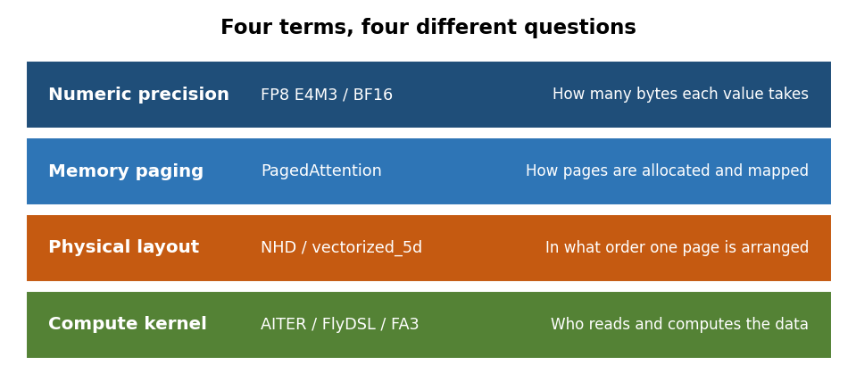
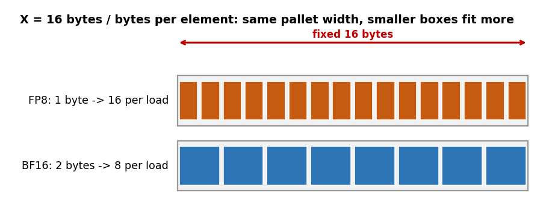
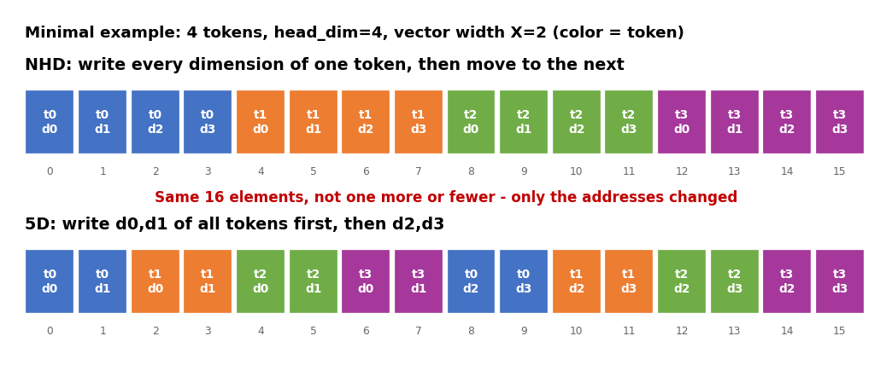
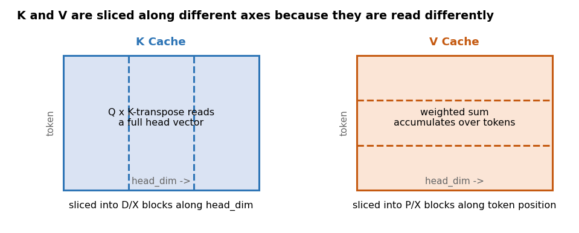
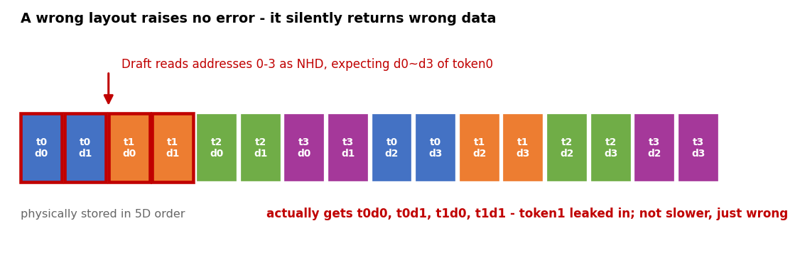

# 5D KV Cache: Precision, Paging, and Memory Layout Are Not the Same Thing

> **Series**: DL-Algorithm-Insights | **Author**: Xinyu Wei

**Language**: English | [中文](README-CN.md)

---

## What Is It?

**In one sentence**: 5D KV Cache is not a new numeric precision and it does not save memory by itself — it is a physical data arrangement designed for a specific family of Attention kernels.

When you inspect an LLM inference configuration, these four terms tend to show up together:

```text
FP8 E4M3
PagedAttention
vectorized_5d
AITER / FlyDSL
```

They are easily mistaken for one single optimization. In fact each term answers a different question:

| Concept | The question it answers |
|---|---|
| FP8, BF16 | How many bits store each value, and what is the numeric precision? |
| PagedAttention | How is KV Cache allocated, reclaimed and mapped? |
| 5D layout | In what order is one page of KV data arranged in memory? |
| AITER, FlyDSL, FA3 | Which kernel reads and computes this data? |



*Figure 1: The four terms belong to four different layers*

---

## Why It Matters

Collapse these four layers into one and the configuration may look correct while the runtime quietly takes a slow path. Worse, the server can start normally while the kernel reads the wrong physical layout.

Reading the wrong layout raises no exception, the shapes still line up, and the service keeps returning results — they are simply wrong. Nothing warns you in the startup log; it surfaces later as accuracy that degrades for no visible reason.

**Scope statement**: **"5D KV Cache" is not an industry-wide standard name.** Different frameworks may define their own 5D variants. This article analyzes the `SHUFFLE 5D` snapshot in the public SGLang ROCm implementation at commit `878fff156`, enabled by `SGLANG_AITER_KV_CACHE_LAYOUT=vectorized_5d`. Every conclusion below is scoped to that implementation path and is not extrapolated to other frameworks, GPUs or kernels.

---

## Terms Used Throughout

A few words appear on every page below, so here is what they mean:

| Term | What it refers to |
|---|---|
| **kernel** | The program that actually runs on the GPU. One Attention computation ends up as one or a few kernels |
| **KV** | Key and Value, the two sets of vectors the model computes per token and keeps for later lookup |
| **layout** | How data is ordered in memory (the subject of this article) |
| **page** | A fixed-size block of memory holding a fixed number of tokens |
| **Prefill** | The phase that processes your entire input prompt at once |
| **Decode** | The phase that emits one token at a time |
| **backend** | Which implementation the framework hands a given step to |

---

## What Problem Does KV Cache Solve First

Start with an analogy. You are in a long meeting, and before every remark you need to account for everything said so far. Replaying the entire meeting from memory each time gets slower and slower. The sensible approach is to take minutes as you go and look them up when needed.

KV Cache is exactly those minutes.

For every new token, a Transformer runs Attention between the current Query and the Key/Value of all preceding tokens. Recomputing the historical K/V at every step piles up redundant work. So KV Cache does the obvious thing: once each layer computes K and V for the past tokens, it keeps them in GPU memory and later decoding steps just read them back.

The cost is that these minutes keep growing, and they have to live in GPU memory. Every optimization that follows answers one of three questions: **how large the handwriting is, where to put it, and in what order to arrange it.**

KV Cache capacity can be roughly estimated as:

```text
KV bytes ≈ layers × tokens × 2 (K and V) × KV heads × head_dim × bytes per element
```

Here is a pure arithmetic example that does not correspond to any specific model:

```text
32 layers
128K tokens
8 KV heads
head_dim = 128
```

| Storage precision | Bytes per element | KV Cache size |
|---|---:|---:|
| BF16 | 2 | about 16 GiB |
| FP8 | 1 | about 8 GiB |

How much is 16 GiB? On an 80 GiB card, a single long request consumes a fifth of the device memory for KV alone, before counting model weights. That is why the precision and the arrangement of KV Cache get scrutinized so heavily.

Note that what halves the capacity here is **FP8**, not 5D.

---

## Where to Put It: PagedAttention Slices Memory into Standard Rooms

A real serving stack cannot reserve a full maximum-context block for every request. It is like running a hotel: you do not lock down an entire floor because a guest "might stay thirty days"; you allocate standard rooms and keep a registry of who occupies which ones.

PagedAttention is that room-management policy: split KV into fixed-size pages, then use a page table to map "logical page N of a given request" to a physical page in memory.

For intuition, the logical structure of Paged KV can be drawn as:

```text
[B, P, H, D]
```

- `B`: number of physical pages/blocks
- `P`: tokens per page
- `H`: number of KV heads
- `D`: head dimension

This is not a physical shape mandated by PagedAttention. A real implementation may use a flat buffer plus a page table, or a different dimension order.

At this point memory is carved into standard rooms and the registry records who lives where. One question remains unanswered: **inside a single room, in what order do you arrange things?**

---

## In What Order to Arrange It: Layout Within a Page

The most naive arrangement for freshly computed K/V is to store them the way they came out:

```text
[N, H, D]
```

- `N`: number of tokens (called `size` in the source — how many tokens this cache can hold)
- `H`: number of KV heads (`head_num`)
- `D`: dimension of each head (`head_dim`)

Those three letters spell **NHD**, which is also the name the source gives this layout. Its rule is a single sentence: **write every dimension of one token, then move to the next token.**

NHD is not the only option. The same data can be arranged in a different order — not one element is added or removed, only what comes first changes. The 5D layout examined here is one such alternative.

To restate the division of labor: **PagedAttention governs how pages come to exist; layout governs how things are arranged inside a page.** The two are independent and can be combined freely.

---

## Which Five Dimensions Exactly

This implementation uses different five-dimensional arrangements for K and V.

**K Cache**

```text
[B, H, D/X, P, X]
```

**V Cache**

```text
[B, H, P/X, Dv, X]
```

The dimensions mean:

| Symbol | Meaning |
|---|---|
| `B` | number of pages/blocks |
| `H` | number of KV heads |
| `P` | page size, i.e. tokens per page |
| `D` / `Dv` | head dimension of K or V |
| `X` | innermost vector width |

`X` is not a hand-tuned knob. The source derives it from a 16-byte vector:

```text
X = 16 / bytes per element
```

Think of it as a forklift pallet: the pallet is a fixed 16 bytes wide, so the smaller the boxes, the more of them fit in a single trip.

| KV storage type | Bytes per element | X |
|---|---:|---:|
| FP8 | 1 | 16 |
| BF16 / FP16 | 2 | 8 |



*Figure 2: X is determined by 16 bytes divided by the element size*

Suppose `page_size=64`, `head_dim=192` and FP8 KV. Then:

```text
K: [B, H, 12, 64, 16]
V: [B, H, 4, 192, 16]
```

You can verify it directly: `192÷16=12`, hence 12 in K's third dimension; `64÷16=4`, hence 4 in V's third dimension.

The total element count of K and V is unchanged:

```text
B × H × 192 × 64
```

What changes is the address order, not the amount of data.

A warehouse works the same way: ten thousand cartons shelved "by order number, then by category" versus "by category, then by order number" hold exactly the same cartons, yet the distance a picker walks can differ several fold.

---

## Shrink It Down and Read the Actual Addresses

Real parameters are too large to see the ordering. Shrink the problem until you can count it by eye:

```text
4 tokens (page_size=4)
head_dim=4
X=2 (vector width simplified to 2 so the pattern stays visible)
```

That is `4 × 4 = 16` elements in total. NHD's rule is "finish one token first":

```text
address: 0     1     2     3     4     5     6     7   ...
content: t0d0  t0d1  t0d2  t0d3  t1d0  t1d1  t1d2  t1d3  ...
         \_____ token0 _____/ \_____ token1 _____/
```

5D splits head_dim into `4 ÷ 2 = 2` blocks, writing the first two dimensions of every token before the last two:

```text
address: 0     1     2     3     4     5     6     7
content: t0d0  t0d1  t1d0  t1d1  t2d0  t2d1  t3d0  t3d1
         \________ d0, d1 of all tokens ________/

address: 8     9     10    11    12    13    14    15
content: t0d2  t0d3  t1d2  t1d3  t2d2  t2d3  t3d2  t3d3
         \________ d2, d3 of all tokens ________/
```



*Figure 3: The same 16 elements, color denotes the token, only the address order changed*

Both sides hold 16 elements, not one more or fewer. All that changed is which element claimed which address.

Real parameters merely scale this pattern up: `X` goes from 2 to 16, `head_dim` from 4 to 192, `page_size` from 4 to 64. The rule is identical.

---

## Why K and V Have Different 5D Shapes

Attention involves two main matrix operations:

```text
1. Q × Kᵀ → attention scores
2. Softmax(scores) × V → output
```

The two steps access K and V differently. Based on the shapes and index formulas in the public source, this implementation adopts the following design:

- The K layout splits `head_dim` into `D/X` and `X`, so the head vector required by the dot product is chunked at a fixed width.
- The V layout splits the in-page token position into `P/X` and `X`, so Value aggregation can read token blocks.



*Figure 4: K is sliced along head_dim, V along token position*

The 16 bytes here is this implementation's storage vector contract; it should not be generalized into a universal vector width across all GPUs and all kernels.

The writing kernel in the source scatters ordinary `[N,H,D]` K/V into these two physical layouts. If a downstream consumer only accepts a linear layout, the data has to be gathered back using the same index formula; a kernel that consumes 5D natively skips that restoration entirely.

Neither scatter nor gather is free. Switching layouts frequently eats the gains the layout was supposed to deliver.

This is precisely what "layout is a data contract" means: **identical shapes do not imply identical physical meaning, and `view()` cannot turn NHD into SHUFFLE 5D.**

Back to the warehouse: relabeling a rack from "Zone A" to "Zone B" leaves the goods physically where they were. A picker following the new label retrieves the wrong goods — and raises no complaint, he simply ships them.

`view()` is that relabeling. It changes interpretation only; it performs no real data movement.

---

## Why 5D Can Be Faster

The 5D layout does not reduce the arithmetic of Attention. What it optimizes is data movement:

1. The innermost dimension is a fixed 16-byte vector, which suits vectorized load/store.
2. K and V are each arranged along the direction they are consumed, reducing strided access.
3. In this SGLang implementation the 5D pool is consumed natively by AITER CK `mha_batch_prefill_func` and `pa_decode_gluon`.
4. Data is already stored in the shape the kernel wants, so no repeated permute or transpose at runtime.

The public SGLang source states this integration plainly: SHUFFLE 5D lets the corresponding AITER Prefill and Paged Decode consumers read the physical cache and avoid runtime permutes. That is a data contract on the SGLang side; it does not imply that every AITER version and every Attention variant offers the same support.

This aligns with the IO-aware principle emphasized by FlashAttention: the bottleneck of GPU Attention is not only arithmetic, but how much data moves between HBM and on-chip memory, and in what order.

Still, "can be faster" is not "faster on any model and any hardware". 5D is a backend-specific optimization whose payoff depends on GPU architecture, KV dtype, page size, head_dim, Attention backend, and whether a matching consumer kernel exists.

Without a matching kernel the outcome is implementation-defined: a non-AITER backend ignores the environment variable and keeps NHD; some incompatible combinations fail during startup validation. Whether any other fallback exists must be confirmed from runtime logs.

---

## Why 5D and FP8 Always Show Up Together

Many AMD inference configurations ship these settings as a set:

```text
--kv-cache-dtype fp8_e4m3
SGLANG_AITER_KV_CACHE_LAYOUT=vectorized_5d
--page-size 64
--attention-backend aiter
```

This does not mean "5D is FP8". The accurate relationship is:

```text
FP8 decides each element takes 1 byte
5D decides how those elements are ordered
page size decides how many tokens fit in a page
AITER/FlyDSL/Gluon decides who reads them
```

Looking at the memory pool implementation, 5D also permits BF16/FP16, in which case `X=8`. The real constraint comes from the kernel support matrix: whether a kernel exists that directly consumes this layout for a given GPU, dtype, head_dim and page size.

So when switching KV from FP8 back to BF16, "the server starts" is not enough. You also need to confirm:

- whether `X` correctly changed from 16 to 8
- whether page size and head_dim are still divisible by X
- which Prefill/Decode kernel is actually loaded
- whether a silent fallback occurred
- whether performance and numerical results were re-validated

---

## Why Target Uses 5D While Draft May Use NHD

Speculative decoding runs a Target model and a Draft model at the same time. They do not necessarily share the same Attention kernel.

In the public implementation analyzed here:

```text
Target worker: AITER SHUFFLE 5D
Speculative draft worker: NHD
```

The reason is not that the Draft "does not deserve optimization", but that the Multi-layer EAGLE Draft Extend path only understood plain NHD cache at that time.

Warehouse analogy again: Target and Draft are two pickers, and only Target was trained on the new shelving scheme. Forcing Draft to pick from the new racks does not make it slower — it counts slots by the old rule and carries back the wrong cartons.

If the Draft simply inherited the global 5D setting, it would interpret already-shuffled physical data as NHD. The result is not degraded speed but broken Attention semantics.

The minimal example above shows the damage. To fetch the full vector of token0, an NHD reader goes to addresses 0 through 3:

```text
what it thinks it gets: t0d0  t0d1  t0d2  t0d3
what it actually gets:  t0d0  t0d1  t1d0  t1d1
                                    ↑↑↑↑↑↑↑↑↑↑↑
                                    these two belong to token1
```



*Figure 5: A Draft reading 5D data as NHD pulls in token1's data*

Again, no exception is raised, the shapes match, and the service returns results — they are simply wrong.

The source therefore overrides the Draft to NHD while keeping the Target on 5D.

This yields the most practical rule for diagnosing layout problems: **do not stop at the global environment variable; check the effective layout of Target and Draft separately.**

---

## Five Common Misconceptions

| Misconception | Correct understanding |
|---|---|
| 5D is a quantization format | 5D is a physical layout; FP8/BF16 are the data types |
| 5D halves KV capacity | FP8 halves capacity; 5D mainly changes the ordering |
| PagedAttention is 5D | Paging manages logical and physical pages; 5D manages in-page layout |
| One environment variable completes the optimization | dtype, page, layout and kernel must form a closed contract |
| Target and Draft always share a layout | Not necessarily; they may be consumed by different kernels |

---

## How to Confirm 5D Is Actually Active at Runtime

Do not stop at the launch script. Check at least four layers of evidence:

| Layer | What to confirm |
|---|---|
| Launch arguments | KV dtype, page size, Attention backend |
| Process environment | the effective value of `SGLANG_AITER_KV_CACHE_LAYOUT` |
| Allocation log | the actual dtype and size of KV Cache |
| Kernel log | Target/Draft layout and the Prefill/Decode kernel actually loaded |

A generic way to inspect the logs:

```bash
grep -E \
  'server_args=|KV Cache is allocated|SHUFFLE 5D|Using NHD|mha_batch_prefill|pa_decode' \
  server.log
```

Seeing only the `vectorized_5d` environment variable without a matching kernel or layout log proves at most that 5D was *requested*, not that the 5D path is *in effect*. Two cases are common:

- the backend is not AITER, the setting is ignored, and the memory pool stays on NHD.
- dtype, page size or head_dim violates a constraint and the server fails during startup validation.

A server that starts is still not proof that the intended kernel was selected. Kernel load logs and performance data remain the deciding evidence.

---

## Three Sentences to Remember

**What**: 5D KV Cache is a physical storage layout that rearranges Paged KV along five axes including page, head and vector block.

**Why**: It lets specific Attention kernels read K/V contiguously at their native vector width, cutting runtime rearrangement and inefficient memory access.

**Boundary**: It is not FP8, it does not inherently save capacity, and it is not a portable standard across GPUs and backends.

---

## Reproducing the Figures

Every figure in this article is generated by a script, so you can change the parameters and redraw:

```bash
pip install -r requirements.txt
python scripts/make_figures.py
```

Figures are written to `images/`. The `T`, `D` and `X` constants at the top of the script control the size of the minimal example.

---

## Public References

Every technical claim here traces to the public sources below and can be checked line by line:

1. SGLang public source: the `vectorized_5d` environment variable and K/V shapes
   https://github.com/sammysun0711/sglang/blob/878fff15647fe3dabb32aa3a335b0ad16e3ee878/python/sglang/srt/environ.py

2. SGLang public source: 5D memory pool allocation and the vector width X
   https://github.com/sammysun0711/sglang/blob/878fff15647fe3dabb32aa3a335b0ad16e3ee878/python/sglang/srt/mem_cache/memory_pool.py

3. SGLang public source: write/restore indexing for NHD and SHUFFLE 5D
   https://github.com/sammysun0711/sglang/blob/878fff15647fe3dabb32aa3a335b0ad16e3ee878/python/sglang/srt/layers/attention/utils.py

4. SGLang public source: Target on 5D, Draft overridden to NHD
   https://github.com/sammysun0711/sglang/blob/878fff15647fe3dabb32aa3a335b0ad16e3ee878/python/sglang/srt/model_executor/model_runner_kv_cache_mixin.py

5. AITER: AMD's high-performance AI operator library for ROCm
   https://github.com/ROCm/aiter

6. PagedAttention paper: *Efficient Memory Management for Large Language Model Serving with PagedAttention*
   https://arxiv.org/abs/2309.06180

7. FlashAttention paper: *Fast and Memory-Efficient Exact Attention with IO-Awareness*
   https://arxiv.org/abs/2205.14135
