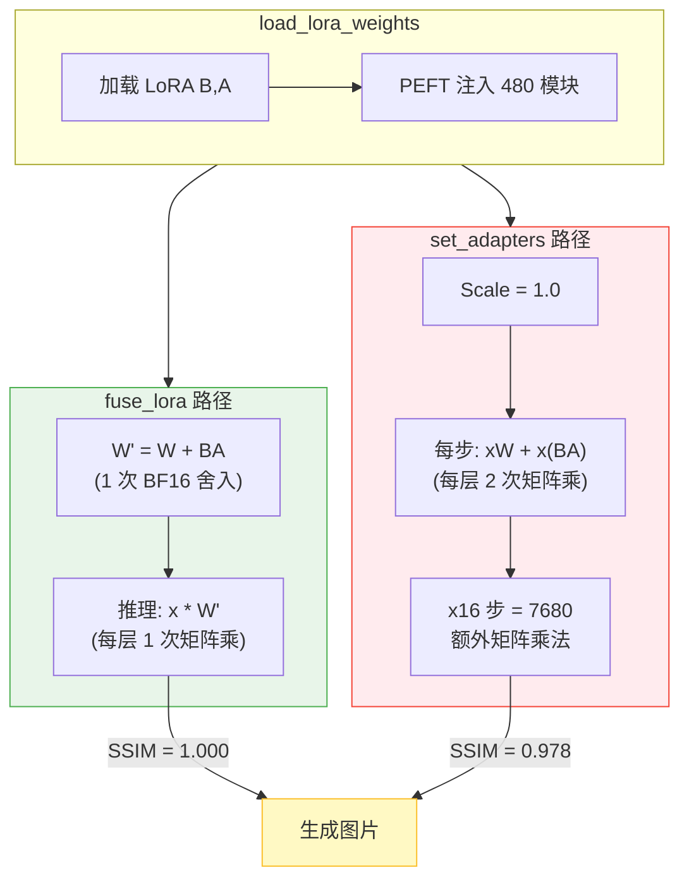
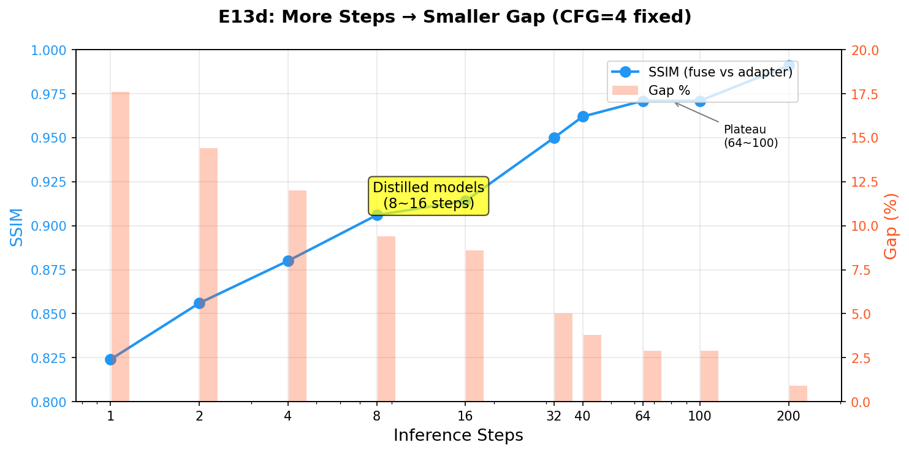
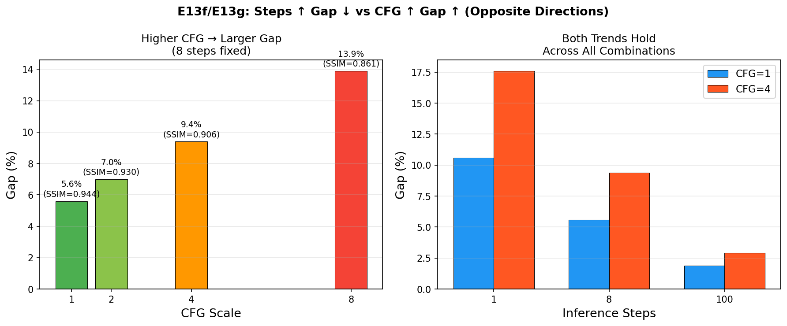
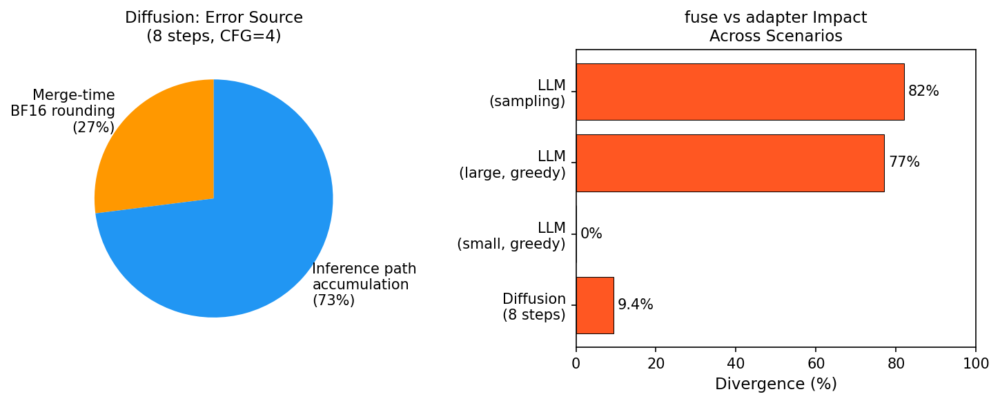
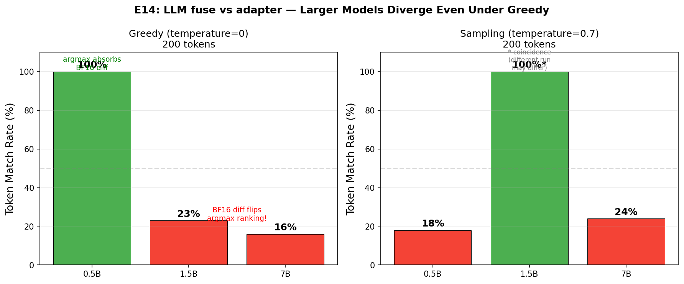

# LoRA 合并方式对推理质量的影响：fuse_lora vs set_adapters 实测对比

## 核心结论（一页纸版）

> **一句话**：Diffusion 模型必须用 `fuse_lora`（质量差 2~18%），LLM 聊天模型用哪个都行（无质量差异）。

### Diffusion 模型（图像生成/编辑）

| 指标 | fuse_lora | set_adapters |
|------|:---------:|:-----------:|
| **推理质量** | = 离线合并（SSIM=1.0） | **↓2~18%**（取决于步数和 CFG） |
| 蒸馏 8~16 步 + CFG=4 | **SSIM=1.0** | **SSIM=0.88~0.91** |
| 40 步 + CFG=4 | SSIM=1.0 | SSIM=0.96 |
| 融合时间 | ~11s | <0.01s |
| 热切换 LoRA | 需重载模型 | ✅ 秒级切换 |

**差距来源**：BF16 浮点精度下两条运算路径的舍入不同（见下方详细分析）。

**步数越少差距越大**——因为 Diffusion 推理本质上是求解 ODE（常微分方程），步数少时 ODE 离散化粗糙，对 BF16 微扰更敏感。蒸馏模型用 8~16 步，正好处于差距最显著的区间。

### LLM（聊天/文本生成模型）

| 指标 | fuse | adapter |
|------|:----:|:-------:|
| **推理质量** | 无差异 | 无差异 |
| BF16 logit 差异 | — | KL ~10-12（恒定底噪，不随模型大小变化） |
| Token 是否一致 | 不可预测（取决于具体 LoRA 和输入） | 同左 |
| 分叉是否影响质量 | — | **不影响**（分叉后两边都是合理回答） |

**为什么 LLM 无所谓**：LLM 输出是离散的（选 token），BF16 微小 logit 差异被 argmax 吸收或仅导致不同措辞的等价回答。不像 Diffusion 输出的连续像素值对任何舍入差异都有直接体现。

### 术语快速参考

| 术语 | 含义 |
|------|------|
| **LoRA** | Low-Rank Adaptation — 用两个小矩阵 B×A 近似权重更新，不改原模型 |
| **fuse_lora** | 把 LoRA 权重合进基模：W' = W + B×A，推理时直接用 W' |
| **set_adapters** | 不合并，推理时分开算：output = x×W + x×(B×A) |
| **BF16** | bfloat16 — 7 位有效精度的浮点格式，大模型标配 |
| **SSIM** | 结构相似度 — 衡量两张图有多像（1.0=完全一样，0=完全不同） |
| **ODE** | 常微分方程 — Diffusion 生图本质上是"沿 ODE 从噪声走到图片" |
| **CFG** | Classifier-Free Guidance — 通过对比"有提示"和"无提示"的预测来增强生成效果 |
| **argmax** | 取最大值 — LLM 每步选概率最高的 token |
| **KL divergence** | 量化两个概率分布的差异（越小越接近） |

**多阶导数（Derivatives of Successive Orders）**：

| Order | Name | Formula | Meaning | Application |
|:-----:|------|---------|---------|-------------|
| 0th | Position | x | Where you are | — |
| **1st** | **Velocity** | dx/dt | How fast position changes | **Diffusion model: velocity = denoising speed** |
| 2nd | Acceleration | d²x/dt² | How fast velocity changes | Newton's F=ma |
| 3rd | Jerk | d³x/dt³ | How fast acceleration changes | Elevator / roller coaster smoothness |
| 4th | Snap | d⁴x/dt⁴ | How fast jerk changes | Precision engineering |
| 5th | Crackle | d⁵x/dt⁵ | How fast snap changes | Rarely used |
| 6th | Pop | d⁶x/dt⁶ | How fast crackle changes | Theoretical only |

> Diffusion 模型只用到 **1st order（velocity）**。

## 这是什么？

> 使用 LoRA 适配器推理时，diffusers 提供两种主要 API：`fuse_lora()`（权重融合）和 `set_adapters()`（动态适配器）。两者推理结果**不同** — 且差异在生产中有影响。

LoRA（Low-Rank Adaptation）是微调大型 Diffusion 模型的标准方法。训练后需要在推理时应用 LoRA 权重，diffusers 库提供了多种方式，但它们在**输出质量上并不等价**。

本文基于 H100 GPU 上 20B 参数图像编辑模型的系统实验（5 轮，E1→E10），揭示 `set_adapters` 相比 `fuse_lora` 会导致约 2~5%（SSIM）的质量差异（取决于 CFG scale）。根因是 BF16 浮点精度下两条运算路径的舍入累积不同。

## 为什么重要？

在生产级虚拟试衣和图像编辑 pipeline 中，客户通常需要：

1. **离线合并**：预先将 LoRA 合并到基模中，保存后部署
2. **在线动态加载**：运行时加载 LoRA，灵活切换模型版本

某客户反馈离线合并的模型生成质量优于动态加载的版本。经过 5 轮实验（E1→E10），根因追踪到 **BF16 浮点精度** — 两种 API 使用不同的运算路径，在 BF16 下舍入累积不同。

## 在 Azure 上运行

所有实验在单台 Azure VM 上完成：

| 资源 | 规格 |
|------|------|
| **VM SKU** | [Standard_NC40ads_H100_v5](https://learn.microsoft.com/en-us/azure/virtual-machines/nc-h100-v5-series) |
| **GPU** | NVIDIA H100 NVL, 95,830 MiB HBM3 |
| **vCPU** | 40（AMD EPYC） |
| **内存** | 320 GB |
| **Region** | East US |

**单 VM 意味着什么**：完整的 20B 参数模型（BF16 下 39GB）可完全放入单张 H100 GPU，无需多 GPU 设置、无需集群 — 只需一台 Azure VM，按需计费。

### 技术栈全景

| 类别 | 技术 | 作用 | 影响 |
|------|------|------|------|
| 框架 | diffusers 0.37.0.dev0 | HuggingFace Diffusion Pipeline | 标准推理框架 |
| 适配器 | PEFT（LoRA） | 20B 模型低秩适配 | 451MB adapter vs 39GB 基模 |
| 精度 | BF16 | 模型原生 16 位精度（约 7 位尾数） | 有限精度 → 两条路径舍入累积不同 |
| 合并 | fuse_lora / set_adapters | 两种 LoRA 应用方式 | **5.8% 质量差异** |

### 资源分布

```
H100 NVL 95,830 MiB 总容量

不用 BF16: 仅模型就需 ~78,000 MiB → 需要 2 张 H100
```

**复现推荐**：`Standard_NC40ads_H100_v5`，East US 或 West US 3，单 VM，无需超出 H100 的特殊配额。

## 工作原理

### 两条路径，一个模型

diffusers 库提供两种本质不同的 LoRA 应用方式。

**符号说明** — 本文使用的变量：

| 符号 | 含义 | 典型规模 |
|:----:|------|----------|
| **W** | 预训练基模权重矩阵（Pre-trained Weight） | d × k（20B 模型共 39GB） |
| **B** | LoRA 上投影矩阵（Up-projection） | d × r（r = rank = 32） |
| **A** | LoRA 下投影矩阵（Down-projection） | r × k |
| **BA** | B × A = LoRA 权重增量 ΔW | d × k（低秩，仅 451MB） |
| **x** | 当前层的输入激活（Input Activation） | batch × seq × d |
| **W'** | 融合后权重 = W + BA | d × k（与 W 同形状） |

> **LoRA 核心思想**：不直接训练巨大的基模权重 W（39GB），而是训练两个小矩阵 B 和 A（共 451MB）。它们的乘积 BA ≈ ΔW 以极低的成本近似表达权重更新。

**路径 1：`fuse_lora`（权重融合）**

```
基模权重 W (39GB) + LoRA 权重 B,A (451MB)
     ↓
一次性计算：W' = W + B × A
     ↓
推理时直接使用 W'（LoRA "消失"在权重中）
     ↓
代码路径：diffusers 原生 → 所有层均正确合并
```

**路径 2：`set_adapters`（动态适配器）**

```
基模权重 W (39GB) + LoRA 权重 B,A (451MB)
     ↓
PEFT 框架向模型注入 adapter 模块
     ↓
每次前向传播：output = x×W + x×(B×A)（实时计算）
     ↓
代码路径：PEFT adapter 注入 → 依赖兼容性
```

### 代码路径图



### 关键差异

来自 [diffusers 官方文档](https://huggingface.co/docs/diffusers/main/en/using-diffusers/merge_loras)：

> **`set_adapters()`**："merges LoRA adapters by **concatenating their weighted matrices**"（通过拼接加权矩阵合并 LoRA）
>
> **`fuse_lora()`**："fuse the LoRA weights **directly with the original weights** of the underlying model"（将 LoRA 权重直接融合进原始权重）

### 三层分析

**第 1 层：数学等价性**

```
fuse_lora:      output = x(W + BA) = xW + xBA
set_adapters:   output = xW + x(BA)

分配律：x(W + BA) = xW + x(BA)  ← 数学上完全等价
```

在无限精度下，两条路径结果完全相同。

**第 2 层：BF16 精度 — 分配律为何在实际中失效**

BF16 有 ~7 位 Mantissa（尾数）。每次运算后都舍入。不同运算顺序 → 不同舍入 → 不同结果。

```
示例（4 位有效数字）：
  W=1.234, BA=0.005678, x=5.678

  路径 1：x×(W+BA) = 5.678×1.240 = 7.041
  路径 2：x×W + x×BA = 7.007 + 0.032 = 7.039

  7.041 ≠ 7.039
```

实测确认：480 层单层 BF16 算术差异最大 **0.3125**。

**步数和 CFG 对差距的影响（方向相反）**：

| 因素 | 增大时差距怎么变 | 原因 |
|------|:---:|------|
| **推理步数** ↑ | **差距减小** | ODE 求解更精确 → 两条路径各自趋向正确解 → 彼此更接近 |
| **CFG** ↑ | **差距增大** | CFG 倍数放大了 BF16 微小差异 |

步数影响（CFG=4 固定，单张图实测）：

| 步数 | fuse↔adapt SSIM | 差距 |
|:----:|:---------:|:-------:|
| 1 | 0.824 | 17.6% |
| 8 | 0.906 | 9.4% |
| 40 | 0.962 | 3.8% |
| 200 | 0.991 | 0.9% |

CFG 影响（8 步固定）：

| CFG | fuse↔adapt SSIM | 差距 |
|:---:|:---------:|:-------:|
| 1 | 0.944 | 5.6% |
| 4 | 0.906 | 9.4% |
| 8 | 0.861 | 13.9% |

> 蒸馏模型使用 8~16 步 + CFG=4 → 正好处于差距最显著（5~14%）的区间，这就是蒸馏场景下 fuse 尤为重要的原因。

**误差来源分解**（8 步 CFG=4）：合并时 BF16 舍入 ~27% + 推理路径累积 ~73%。

确认 BF16 精度为根因。

**步数 vs SSIM 可视化**：



**CFG 影响 + 交叉验证可视化**：



**误差来源分解 + 场景对比**：



**第 3 层：PEFT 注入 — 非根因**

最初怀疑 PEFT 注入 240 层失败（有 warning）。三角测试证伪：`set_adapters` 施加了 fuse_lora **103%** 的 LoRA 效果 — 所有层均正常工作。

240 个 warning 只是训练时没产出这些层的权重，两种加载方式面对同样的缺口。

### set_adapters 的优势

尽管有质量差异，`set_adapters` 有合理的使用场景：

| | fuse_lora | set_adapters |
|--|:-:|:-:|
| **融合时间** | ~11s | <0.01s |
| **多 LoRA 混合** | ❌ | ✅ 多个 LoRA + 不同权重 |
| **切换 LoRA** | 需重载基模 | ✅ 秒级切换 |
| **Scale 调节** | fuse 时固定 | ✅ 随时动态调整 |
| **质量** | = 离线合并 | ↓2~5% |

### 在线 vs 离线 — 有区别吗？

```
离线：load_lora → fuse_lora → save_pretrained → 重新加载 → 推理
在线：load_lora → fuse_lora → 直接推理（不保存）

结果：SSIM = 1.000000（像素级一致）
```

无论是保存到磁盘再重新加载，还是在内存中直接推理 — **结果完全一致**。真正有影响的是 `fuse_lora` vs `set_adapters`，不是在线 vs 离线。

## 实测数据

### 实验设计

**三路对比**（唯一变量 = LoRA 加载方式）：

| 路径 | 方法 | 说明 |
|------|------|------|
| A | `fuse_lora → unload → 推理` | 离线合并（基准） |
| B | `set_adapters → 推理` | 动态加载 |
| C | `fuse_lora → 推理`（不保存） | 在线合并 |

**控制变量**（七维对齐）：
- 相同基模（20B 参数，BF16）
- 相同 LoRA 权重（451MB，rank=32）
- 相同框架（diffusers）
- 相同 CFG scale、推理步数、seed、prompt
- **35 对测试图**（非单张测试）

### 结果

| 对比 | MSE (mean ± std) | SSIM (mean ± std) | 含义 |
|------|:-:|:-:|------|
| **A ↔ C**（离线 vs 在线 fuse） | **0.00 ± 0.00** | **1.000 ± 0.000** | 像素级一致 |
| **A ↔ B**（fuse vs set_adapters） | **103.7 ± 160.4** | **0.942 ± 0.059** | 下降 5.8% |

最差样本：MSE=723，SSIM=0.789（下降 21%）。

### MD5 验证

确认是独立推理而非文件复制：

| 样本 | Path A MD5 | Path C MD5 | Path B MD5 | A==C | A==B |
|------|:---:|:---:|:---:|:---:|:---:|
| #00 | `b52a7156...` | `b52a7156...` | `b92fdd03...` | ✅ | ❌ |
| #01 | `a3e4eca0...` | `a3e4eca0...` | `89840cbc...` | ✅ | ❌ |

35 对全部：A==C True，A==B False。文件大小也不同。

### 扩展方法测试

测试了所有可用的在线方法：

| 方法 | SSIM vs 基准 | 可用？ |
|------|:-:|:---:|
| `fuse_lora`（在线，不保存） | **1.000** | ✅ |
| `hotswap` | 0.949 | ❌ |
| `fuse → unfuse → fuse`（循环） | 0.944 | ❌ |
| `cross_attention_kwargs` | N/A | ❌（不支持） |
| `set_adapters`（FP32） | N/A | ❌（OOM） |

**只有 `fuse_lora` 能与离线合并完全一致。**

## 已知限制

### 1. PEFT Target Module 不匹配

通过 `set_adapters` 加载 LoRA 时，PEFT 可能报告警告：

> "PEFT config contained these additional target modules: transformer_blocks.0.attn.to_k, ..."

在我们的 20B 模型测试中：**240 个 Attention（注意力）目标报告为额外模块**。这只是说明 LoRA **训练时**没有产出这些层的权重（config 声明了但 state_dict 为空）。`fuse_lora` 和 `set_adapters` 面对同样的缺口 — 这是训练端问题，不是加载失败。

### 2. `set_adapters` 只缩放 Attention 权重

来自 diffusers 官方 [LoRA 加载文档](https://huggingface.co/docs/diffusers/main/en/using-diffusers/loading_adapters)：

> `set_adapters()` **only supports scaling attention weights**. If a LoRA has other parts (e.g., resnets or down-/upsamplers), they will keep a scale of 1.0.

然而，E8 三角测试表明 `set_adapters` 施加了 `fuse_lora` **103%** 的 LoRA 总效果 — 所有可访问的层都正确工作。质量差距来自 BF16 精度累积，而非层注入遗漏。

### 3. `unfuse_lora` 引入舍入误差

你可能想："先 `fuse → 推理 → unfuse → fuse` 另一个 LoRA。" 但在 BF16 下：

```
W' = W + B×A     （fuse）
W'' = W' - B×A   （unfuse）
W'' ≠ W           （BF16 舍入：W'' - W ≈ 1e-3）
```

我们的实验确认：`fuse → unfuse → fuse` 得到 SSIM=0.944（不是 1.0）。切换 LoRA 时应重新加载基模。

## 速查卡

### 决策矩阵

| 场景 | 推荐方式 | 质量 | 速度 |
|------|---------|:---:|:---:|
| 固定 LoRA 部署 | `fuse_lora` 离线（保存+重载） | SSIM=1.0 | 最快 |
| 动态 LoRA 加载 | `load_lora → fuse_lora`（不保存） | SSIM=1.0 | 快 |
| 切换多个 LoRA | 每次重载基模 + `fuse_lora` | SSIM=1.0 | 较慢 |
| ❌ 不推荐 | `set_adapters` | SSIM≈0.94 | 慢 |
| ❌ 不推荐 | `fuse → unfuse → fuse` 循环 | SSIM≈0.94 | 快 |

### 一行代码修复

```python
# 修改前（质量下降）：
pipe.set_adapters(["my_lora"], adapter_weights=[1.0])

# 修改后（与离线合并像素级一致）：
pipe.fuse_lora(lora_scale=1.0, adapter_names=["my_lora"])
```

### 关键数据

| 指标 | CFG=1.0（典型生产） | CFG=4.0 |
|------|:---:|:---:|
| 模型规模 | 20B 参数（39GB BF16） | 同左 |
| LoRA 大小 | 451MB（rank=32） | 同左 |
| 测试样本 | 10 对 | 35 对 |
| fuse_lora SSIM vs 离线合并 | **1.000000** | **1.000000** |
| set_adapters SSIM vs 离线合并 | **0.978**（↓2.2%） | **0.949**（↓5.1%） |
| fuse 融合时间 | 11.28s | ~11s |
| set_adapters 设置时间 | 0.01s | ~0.01s |
| fuse_lora 推理时间 | 15.10s | 30.3s |
| set_adapters 推理时间 | 15.68s | 30.9s |
| BF16 单层最大差异 | 0.3125 | 同左 |
| LoRA 层数（两种方式相同） | 480 | 480 |
| set_adapters LoRA Effectiveness（效果量） | fuse 的 103% | 同左 |

**根因**：BF16 运算路径差异。差距受步数和 CFG 两个因素影响：步数多→每步 ODE 更精确→差距小；CFG 大→放大 BF16 微扰→差距大。误差 ~27% 来自合并时 BF16 加法舍入，~73% 来自推理路径累积。

## 延伸：LLM 场景

> 以上所有实验基于 Diffusion 模型。LLM（聊天/文本生成模型）的情况有本质区别。

### Diffusion vs LLM 的核心区别

| | Diffusion | LLM |
|---|---|---|
| **输出类型** | 连续值（latent → 像素） | 离散值（logits → argmax 选 token） |
| **步数增加→精度提升？** | **是** — ODE 求解更精确 | **否** — 每个 token 是独立决策 |
| **BF16 差异的保护机制** | **无** — 微小差异直接体现在像素上 | **可能** — argmax 可能吸收微小 logit 差异 |

### 实测数据

**不同模型规模**（200 token，BF16，自建 LoRA rank=32）：

| 模型 | Greedy 一致率 | 分叉位置 | Sampling(t=0.7) 一致率 |
|:----:|:----------:|:-------:|:------------------:|
| **0.5B** | **100%** ✅ | 无 | 18%（token 36 分叉） |
| **1.5B** | **23%** ❌ | token 26 | 100%（碰巧） |
| **7B** | **16%** ❌ | token 33 | 24% |



### 分析

#### 为什么 Diffusion 步数多差距小，但 LLM token 多差距大？

**Diffusion**：步数多 = ODE 解更精确 → fuse 和 adapter 各自趋向正确解 → 差距缩小。adapter 每步累积 BF16 舍入，但 ODE 精度提升盖过了累积。

**LLM**：生成 200 token 不比 10 token "更准确"——不存在"正确解"让两条路径去逼近。BF16 差异没有收敛机制对冲，一旦分叉就完全发散。

#### 分叉机制详解

**Greedy 下的分叉条件**：BF16 两条路径各自经过全部层后的 logits 微小不同。只要 top-1 和 top-2 的差距小于 BF16 偏差 → argmax 排名翻转 → 选了不同 token。

```
分叉前 token 35：  fuse → "data"(8.52)  adapter → "data"(8.51)  → 同 ✅
分叉点 token 36：  fuse → "and"(7.203)  adapter → "to"(7.202→7.202)  → 不同！
```

**大模型更容易分叉**：层数多 + 隐藏维度大 → BF16 路径差异经过更多层传播 → logit 偏差更大 → 更多位置的 top-1/top-2 间距被覆盖。

**分叉后蝴蝶效应**：一旦某个 token 不同，后续上下文全变。差异不是 BF16 继续偏，而是上下文已经不同了——自回归生成的固有特性。

#### Sampling（temperature>0）的额外影响

Temperature 稀释了 top-1 的优势 → BF16 微扰更容易翻转采样结果 → 分叉点更早。

0.5B 实测：Greedy 全程 200 token 100% 一致，Sampling(t=0.7) 在 token 36 分叉，200 token 仅 18% 一致。

#### "分叉"是否等于"质量下降"？

**Diffusion：是。** 像素差异可用 SSIM 量化，adapter 版本客观上更差。

**LLM：不是。** 分叉后两段文本都是合理回答——语法正确、语义合理。"data and patterns" 和 "data to make predictions" 都对。不存在"fuse 更准确"的说法。

### 实用建议

| 场景 | temperature | 推荐 | 原因 |
|------|:-----------:|:----:|------|
| **代码生成**（需确定性） | 0 | **fuse** | 分叉概率不可预测 |
| **翻译/客服**（标准答案） | 0~0.3 | 都行 | 措辞微调不影响 |
| **闲聊/创意写作** | 0.7~1.0 | adapter 可接受 | 内容分叉但都合理 |
| **多 LoRA 热切换** | 任意 | **adapter** | 灵活性优先 |

**核心原则**：需要**可复现确定性输出**（CI 测试、合规审计）→ fuse。接受"每次不完全一样" → adapter 的灵活性更有价值。

## 作者

**魏新宇 (Xinyu Wei)**

- GitHub: [@xinyuwei-david](https://github.com/xinyuwei-david)
- 职位: Microsoft AI and Apps Global Black Belt (GBB) Senior System Engineer

## 许可证

MIT License
