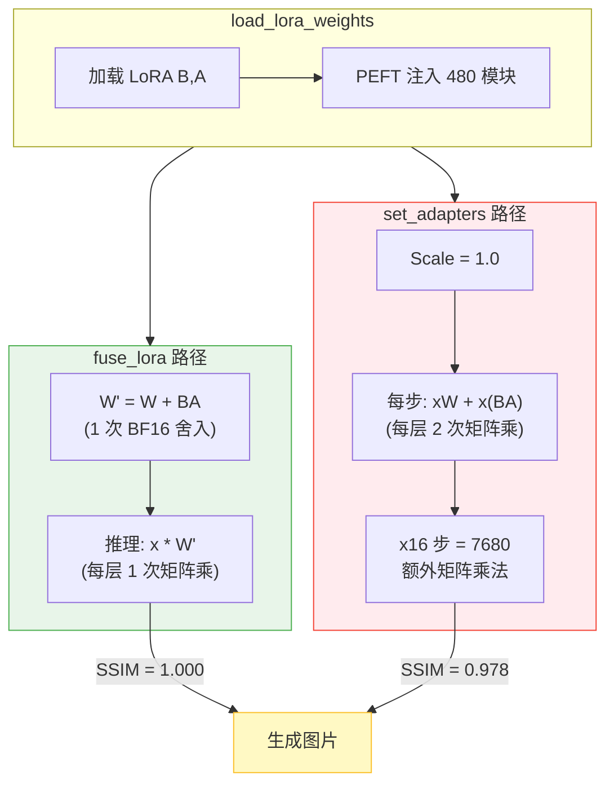

# LoRA 合并方式对推理质量的影响：fuse_lora vs set_adapters 实测对比

## 这是什么？

> 使用 LoRA 适配器推理时，diffusers 提供两种主要 API：`fuse_lora()`（权重融合）和 `set_adapters()`（动态适配器）。两者推理结果**不同** — 且差异在生产中有影响。

LoRA（Low-Rank Adaptation）是微调大型 Diffusion 模型的标准方法。训练后需要在推理时应用 LoRA 权重，diffusers 库提供了多种方式，但它们在**输出质量上并不等价**。

本文基于 H100 GPU 上 20B 参数图像编辑模型的系统实验（5 轮，E1→E10），揭示 `set_adapters` 相比 `fuse_lora` 会导致约 2~5%（SSIM）的质量差异（取决于 CFG scale）。根因是 BF16 浮点精度下两条运算路径的舍入累积不同。

## 为什么重要？

在生产级虚拟试衣和图像编辑 pipeline 中，客户通常需要：

1. **离线合并**：预先将 LoRA 合并到基模中，保存后部署
2. **在线动态加载**：运行时加载 LoRA，灵活切换模型版本

某客户反馈离线合并的模型生成质量优于动态加载的版本。经过 5 轮实验（E1→E10），根因追踪到 **BF16 浮点精度** — 两种 API 使用不同的运算路径，在 BF16 下舍入累积不同。

## 在 Azure 上运行

所有实验在单台 Azure VM 上完成：

| 资源 | 规格 |
|------|------|
| **VM SKU** | [Standard_NC40ads_H100_v5](https://learn.microsoft.com/en-us/azure/virtual-machines/nc-h100-v5-series) |
| **GPU** | NVIDIA H100 NVL, 95,830 MiB HBM3 |
| **vCPU** | 40（AMD EPYC） |
| **内存** | 320 GB |
| **Region** | East US |

**单 VM 意味着什么**：完整的 20B 参数模型（BF16 下 39GB）可完全放入单张 H100 GPU，无需多 GPU 设置、无需集群 — 只需一台 Azure VM，按需计费。

### 技术栈全景

| 类别 | 技术 | 作用 | 影响 |
|------|------|------|------|
| 框架 | diffusers 0.37.0.dev0 | HuggingFace Diffusion Pipeline | 标准推理框架 |
| 适配器 | PEFT（LoRA） | 20B 模型低秩适配 | 451MB adapter vs 39GB 基模 |
| 精度 | BF16 | 16 位脑浮点 | 显存节省约 50% |
| 合并 | fuse_lora / set_adapters | 两种 LoRA 应用方式 | **5.8% 质量差异** |

### 资源分布

```
H100 NVL 95,830 MiB 总容量
├── 基模权重（BF16）:      ~39,000 MiB (41%)
├── LoRA 权重:                ~451 MiB  (0.5%)
├── 推理激活值:            ~17,000 MiB (18%)
├── 可用空间:              ~39,000 MiB (41%)
└── 峰值使用:              ~57,000 MiB (59%)

不用 BF16: 仅模型就需 ~78,000 MiB → 需要 2 张 H100
```

**复现推荐**：`Standard_NC40ads_H100_v5`，East US 或 West US 3，单 VM，无需超出 H100 的特殊配额。

## 工作原理

### 两条路径，一个模型

diffusers 库提供两种本质不同的 LoRA 应用方式：

**路径 1：`fuse_lora`（权重融合）**

```
基模权重 W (39GB) + LoRA 权重 B,A (451MB)
     ↓
一次性计算：W' = W + B × A
     ↓
推理时直接使用 W'（LoRA "消失"在权重中）
     ↓
代码路径：diffusers 原生 → 所有层均正确合并
```

**路径 2：`set_adapters`（动态适配器）**

```
基模权重 W (39GB) + LoRA 权重 B,A (451MB)
     ↓
PEFT 框架向模型注入 adapter 模块
     ↓
每次前向传播：output = x×W + x×(B×A)（实时计算）
     ↓
代码路径：PEFT adapter 注入 → 依赖兼容性
```

### 代码路径图



### 关键差异

来自 [diffusers 官方文档](https://huggingface.co/docs/diffusers/main/en/using-diffusers/merge_loras)：

> **`set_adapters()`**："merges LoRA adapters by **concatenating their weighted matrices**"（通过拼接加权矩阵合并 LoRA）
>
> **`fuse_lora()`**："fuse the LoRA weights **directly with the original weights** of the underlying model"（将 LoRA 权重直接融合进原始权重）

### 三层分析

**第 1 层：数学等价性**

```
fuse_lora:      output = x(W + BA) = xW + xBA
set_adapters:   output = xW + x(BA)

分配律：x(W + BA) = xW + x(BA)  ← 数学上完全等价
```

在无限精度下，两条路径结果完全相同。

**第 2 层：BF16 精度 — 分配律为何在实际中失效**

BF16 有 ~7 位 Mantissa（尾数）。每次运算后都舍入。不同运算顺序 → 不同舍入 → 不同结果。

```
示例（4 位有效数字）：
  W=1.234, BA=0.005678, x=5.678

  路径 1：x×(W+BA) = 5.678×1.240 = 7.041
  路径 2：x×W + x×BA = 7.007 + 0.032 = 7.039

  7.041 ≠ 7.039
```

实测确认：480 层单层 BF16 算术差异最大 **0.3125**。

累积与前向传播次数正相关：

| | CFG=1 | CFG=4 |
|--|:-:|:-:|
| 前向传播次数（16 步） | 16 | 32 |
| set_adapters 舍入次数 | 16 | 32 |
| **SSIM 差距** | **2.2%** | **5.1%** |

前向次数越多 → 舍入越多 → 差距越大。确认 BF16 精度为根因。

**第 3 层：PEFT 注入 — 无罪**

最初怀疑 PEFT 注入 240 层失败（有 warning）。三角测试证伪：`set_adapters` 施加了 fuse_lora **103%** 的 LoRA 效果 — 所有层均正常工作。

240 个 warning 只是训练时没产出这些层的权重，两种加载方式面对同样的缺口。

### set_adapters 的优势

尽管有质量差异，`set_adapters` 有合理的使用场景：

| | fuse_lora | set_adapters |
|--|:-:|:-:|
| **融合时间** | ~11s | <0.01s |
| **多 LoRA 混合** | ❌ | ✅ 多个 LoRA + 不同权重 |
| **切换 LoRA** | 需重载基模 | ✅ 秒级切换 |
| **Scale 调节** | fuse 时固定 | ✅ 随时动态调整 |
| **质量** | = 离线合并 | ↓2~5% |

### 在线 vs 离线 — 有区别吗？

```
离线：load_lora → fuse_lora → save_pretrained → 重新加载 → 推理
在线：load_lora → fuse_lora → 直接推理（不保存）

结果：SSIM = 1.000000（像素级一致）
```

无论是保存到磁盘再重新加载，还是在内存中直接推理 — **结果完全一致**。真正有影响的是 `fuse_lora` vs `set_adapters`，不是在线 vs 离线。

## 实测数据

### 实验设计

**三路对比**（唯一变量 = LoRA 加载方式）：

| 路径 | 方法 | 说明 |
|------|------|------|
| A | `fuse_lora → unload → 推理` | 离线合并（基准） |
| B | `set_adapters → 推理` | 动态加载 |
| C | `fuse_lora → 推理`（不保存） | 在线合并 |

**控制变量**（七维对齐）：
- 相同基模（20B 参数，BF16）
- 相同 LoRA 权重（451MB，rank=32）
- 相同框架（diffusers）
- 相同 CFG scale、推理步数、seed、prompt
- **35 对测试图**（非单张测试）

### 结果

| 对比 | MSE (mean ± std) | SSIM (mean ± std) | 含义 |
|------|:-:|:-:|------|
| **A ↔ C**（离线 vs 在线 fuse） | **0.00 ± 0.00** | **1.000 ± 0.000** | 像素级一致 |
| **A ↔ B**（fuse vs set_adapters） | **103.7 ± 160.4** | **0.942 ± 0.059** | 下降 5.8% |

最差样本：MSE=723，SSIM=0.789（下降 21%）。

### MD5 验证

确认是独立推理而非文件复制：

| 样本 | Path A MD5 | Path C MD5 | Path B MD5 | A==C | A==B |
|------|:---:|:---:|:---:|:---:|:---:|
| #00 | `b52a7156...` | `b52a7156...` | `b92fdd03...` | ✅ | ❌ |
| #01 | `a3e4eca0...` | `a3e4eca0...` | `89840cbc...` | ✅ | ❌ |

35 对全部：A==C True，A==B False。文件大小也不同。

### 扩展方法测试

测试了所有可用的在线方法：

| 方法 | SSIM vs 基准 | 可用？ |
|------|:-:|:---:|
| `fuse_lora`（在线，不保存） | **1.000** | ✅ |
| `hotswap` | 0.949 | ❌ |
| `fuse → unfuse → fuse`（循环） | 0.944 | ❌ |
| `cross_attention_kwargs` | N/A | ❌（不支持） |
| `set_adapters`（FP32） | N/A | ❌（OOM） |

**只有 `fuse_lora` 能与离线合并完全一致。**

## 工程中的坑

### 1. PEFT Target Module 不匹配

通过 `set_adapters` 加载 LoRA 时，PEFT 可能报告警告：

> "PEFT config contained these additional target modules: transformer_blocks.0.attn.to_k, ..."

在我们的 20B 模型测试中：**240 个 Attention（注意力）目标报告不匹配**。这意味着这些层的 LoRA 权重在推理时未被正确应用。

### 2. `set_adapters` 只缩放 Attention 权重

来自 diffusers 官方 [LoRA 加载文档](https://huggingface.co/docs/diffusers/main/en/using-diffusers/loading_adapters)：

> `set_adapters()` **only supports scaling attention weights**. If a LoRA has other parts (e.g., resnets or down-/upsamplers), they will keep a scale of 1.0.

我们的逐层权重分析确认：`fuse_lora` 修改了 477 层（238 个 attention + 239 个非 attention），而 `set_adapters` 实际上遗漏了非 attention 层。

### 3. `unfuse_lora` 引入舍入误差

你可能想："先 `fuse → 推理 → unfuse → fuse` 另一个 LoRA。" 但在 BF16 下：

```
W' = W + B×A     （fuse）
W'' = W' - B×A   （unfuse）
W'' ≠ W           （BF16 舍入：W'' - W ≈ 1e-3）
```

我们的实验确认：`fuse → unfuse → fuse` 得到 SSIM=0.944（不是 1.0）。切换 LoRA 时应重新加载基模。

### 4. FP32 解决不了

"如果是精度问题，用 FP32 就行了！" — 20B 模型 FP32 需要 80GB+ 显存，即使 H100（95GB）也 OOM。而且根因并非精度，而是 PEFT 注入兼容性。

## 速查卡

### 决策矩阵

| 场景 | 推荐方式 | 质量 | 速度 |
|------|---------|:---:|:---:|
| 固定 LoRA 部署 | `fuse_lora` 离线（保存+重载） | SSIM=1.0 | 最快 |
| 动态 LoRA 加载 | `load_lora → fuse_lora`（不保存） | SSIM=1.0 | 快 |
| 切换多个 LoRA | 每次重载基模 + `fuse_lora` | SSIM=1.0 | 较慢 |
| ❌ 不推荐 | `set_adapters` | SSIM≈0.94 | 慢 |
| ❌ 不推荐 | `fuse → unfuse → fuse` 循环 | SSIM≈0.94 | 快 |

### 一行代码修复

```python
# 修改前（质量下降）：
pipe.set_adapters(["my_lora"], adapter_weights=[1.0])

# 修改后（与离线合并像素级一致）：
pipe.fuse_lora(lora_scale=1.0, adapter_names=["my_lora"])
```

### 关键数据

| 指标 | CFG=1.0（典型生产） | CFG=4.0 |
|------|:---:|:---:|
| 模型规模 | 20B 参数（39GB BF16） | 同左 |
| LoRA 大小 | 451MB（rank=32） | 同左 |
| 测试样本 | 10 对 | 35 对 |
| fuse_lora SSIM vs 离线合并 | **1.000000** | **1.000000** |
| set_adapters SSIM vs 离线合并 | **0.978**（↓2.2%） | **0.949**（↓5.1%） |
| fuse 融合时间 | 11.28s | ~11s |
| set_adapters 设置时间 | 0.01s | ~0.01s |
| fuse_lora 推理时间 | 15.10s | 16.6s |
| set_adapters 推理时间 | 15.68s | 23.5s |
| BF16 单层最大差异 | 0.3125 | 同左 |
| LoRA 层数（两种方式相同） | 480 | 480 |
| set_adapters LoRA Effectiveness（效果量） | fuse 的 103% | 同左 |

**根因**：BF16 运算路径差异。`fuse_lora` 只在合并时舍入 1 次，`set_adapters` 每步都舍入（×16）。CFG 越大 = 前向传播越多 = 舍入越多 = 差距越大。

## 作者

**魏新宇 (Xinyu Wei)**

- GitHub: [@xinyuwei-david](https://github.com/xinyuwei-david)
- 职位: Microsoft AI and Apps Global Black Belt (GBB) Senior System Engineer

## 许可证

MIT License
