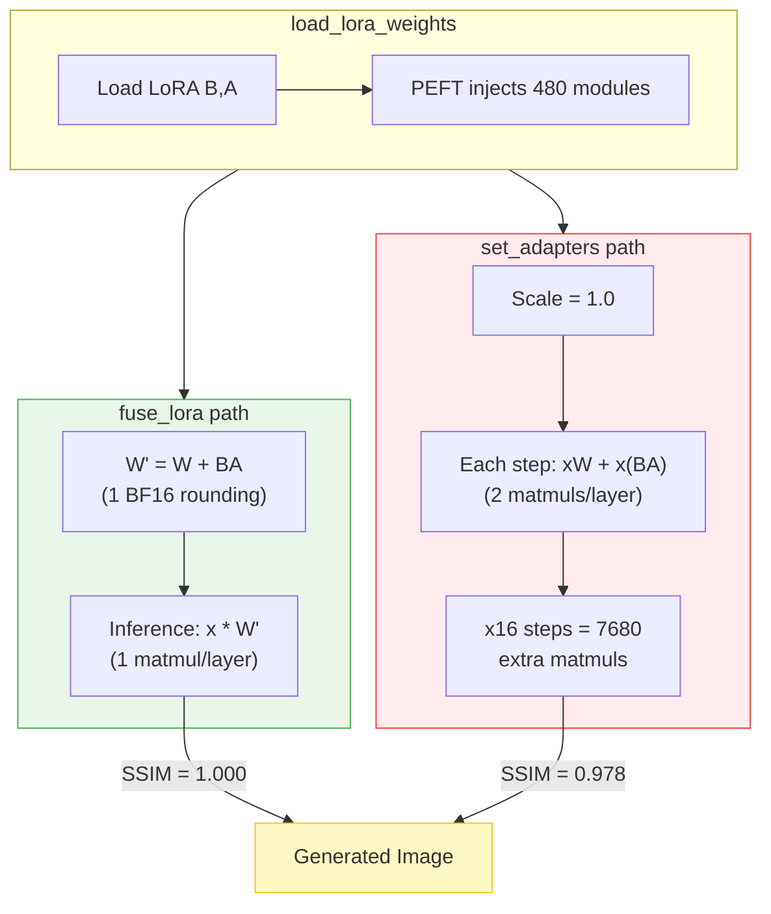

# LoRA Merge Methods: fuse_lora vs set_adapters — Quality Impact on Diffusion Models

## Key Conclusions (Executive Summary)

> **One-liner**: Diffusion models must use `fuse_lora` (quality gap 2~18%). LLM chat models can use either (no quality difference).

### Diffusion Models (Image Generation/Editing)

| Metric | fuse_lora | set_adapters |
|--------|:---------:|:-----------:|
| **Inference quality** | = offline merge (SSIM=1.0) | **↓2~18%** (depends on steps and CFG) |
| Distilled 8~16 steps + CFG=4 | **SSIM=1.0** | **SSIM=0.88~0.91** |
| 40 steps + CFG=4 | SSIM=1.0 | SSIM=0.96 |
| Fusion time | ~11s | <0.01s |
| Hot-swap LoRA | Requires model reload | ✅ Instant switch |

**Gap source**: Different BF16 rounding paths (see detailed analysis below).

**Fewer steps → larger gap** — Diffusion inference is essentially solving an ODE (Ordinary Differential Equation). Fewer steps = coarser ODE discretization = more sensitive to BF16 perturbation. Distilled models use 8~16 steps, sitting in the most significant gap zone.

### LLM (Chat/Text Generation Models)

| Metric | fuse | adapter |
|--------|:----:|:-------:|
| **Inference quality** | No difference | No difference |
| BF16 logit divergence | — | KL ~10-12 (constant noise floor, independent of model size) |
| Token match | Unpredictable (depends on specific LoRA and input) | Same |
| Does divergence affect quality? | — | **No** (both outputs are valid answers) |

**Why LLM doesn't matter**: LLM output is discrete (token selection). BF16 logit differences are either absorbed by argmax or only lead to equivalent answers with different wording. Unlike Diffusion's continuous pixel output where any rounding difference directly manifests.

### Quick Terminology Reference

| Term | Meaning |
|------|---------|
| **LoRA** | Low-Rank Adaptation — approximate weight updates with two small matrices B×A |
| **fuse_lora** | Merge LoRA into base model: W' = W + B×A, inference uses W' directly |
| **set_adapters** | Don't merge, compute separately: output = x×W + x×(B×A) |
| **BF16** | bfloat16 — 7-bit mantissa floating point format, standard for large models |
| **SSIM** | Structural Similarity — measures image similarity (1.0=identical, 0=different) |
| **ODE** | Ordinary Differential Equation — Diffusion generates images by "walking the ODE from noise to image" |
| **CFG** | Classifier-Free Guidance — enhances generation by contrasting prompted vs unprompted predictions |
| **argmax** | Pick the highest value — LLM selects highest-probability token each step |
| **KL divergence** | Quantifies difference between two probability distributions |

**Derivatives of Successive Orders**:

| Order | Name | Formula | Meaning | Application |
|:-----:|------|---------|---------|-------------|
| 0th | Position | x | Where you are | — |
| **1st** | **Velocity** | dx/dt | How fast position changes | **Diffusion model: velocity = denoising speed** |
| 2nd | Acceleration | d²x/dt² | How fast velocity changes | Newton's F=ma |
| 3rd | Jerk | d³x/dt³ | How fast acceleration changes | Elevator / roller coaster smoothness |
| 4th | Snap | d⁴x/dt⁴ | How fast jerk changes | Precision engineering |
| 5th | Crackle | d⁵x/dt⁵ | How fast snap changes | Rarely used |
| 6th | Pop | d⁶x/dt⁶ | How fast crackle changes | Theoretical only |

> Diffusion models only use **1st order (velocity)**.

## What Is It?

> When using LoRA adapters for inference, diffusers provides two main APIs: `fuse_lora()` (weight fusion) and `set_adapters()` (dynamic adapter). They produce **different inference results** — and the difference matters in production.

LoRA (Low-Rank Adaptation) is the standard method for fine-tuning large diffusion models efficiently. After training, you need to apply the LoRA weights during inference. The diffusers library offers multiple ways to do this, but they are **not equivalent in output quality**.

This article presents a systematic H100 GPU experiment comparing these methods on a 20B-parameter image editing model, revealing that `set_adapters` can produce ~2-5% SSIM degradation compared to `fuse_lora`, depending on CFG scale.

## Why It Matters

In production virtual try-on and image editing pipelines, customers often need to:

1. **Offline merge**: Pre-merge LoRA into the base model, save, then deploy
2. **Online dynamic loading**: Load LoRA at runtime for flexible model switching

A customer reported that offline-merged models produced better results than dynamically-loaded ones. Through 5 rounds of experiments (E1→E10), we traced the root cause to **BF16 floating-point precision** — the two APIs use different arithmetic paths that accumulate rounding errors differently.

## Running on Azure

All experiments were conducted on a single Azure VM:

| Resource | Specification |
|----------|--------------|
| **VM SKU** | [Standard_NC40ads_H100_v5](https://learn.microsoft.com/en-us/azure/virtual-machines/nc-h100-v5-series) |
| **GPU** | NVIDIA H100 NVL, 95,830 MiB HBM3 |
| **vCPU** | 40 (AMD EPYC) |
| **RAM** | 320 GB |
| **Region** | East US |

**Single VM significance**: The full 20B-parameter model (39GB in BF16) fits entirely on a single H100 GPU with room for inference. No multi-GPU setup, no cluster needed — just one Azure VM with standard pay-as-you-go billing.

### Technology Stack at a Glance

| Category | Technique | What It Does | Impact |
|----------|-----------|-------------|--------|
| Framework | diffusers 0.37.0.dev0 | HuggingFace diffusion pipeline | Standard inference framework |
| Adapter | PEFT (LoRA) | Low-rank adaptation for 20B model | 451MB adapter vs 39GB base model |
| Precision | BF16 | Model's native 16-bit precision (~7-bit mantissa) | Limited precision → rounding divergence between two paths |
| Merging | fuse_lora / set_adapters | Two LoRA application methods | **5.8% quality difference** |

### Resource Distribution

```
H100 NVL 95,830 MiB Total
├── Base Model (BF16):     ~39,000 MiB (41%)
├── LoRA Weights:             ~451 MiB  (0.5%)
├── Inference Activations:  ~17,000 MiB (18%)
├── Available:              ~39,000 MiB (41%)
└── Peak Usage:             ~57,000 MiB (59%)

Without BF16: ~78,000 MiB model alone → needs 2× H100
```

**Recommended Azure setup for reproduction**: `Standard_NC40ads_H100_v5` in East US or West US 3. Single VM, no special quota needed beyond H100.

## How It Works

### Two Paths, One Model

The diffusers library provides two fundamentally different approaches for applying LoRA.

**Notation** — symbols used throughout this article:

| Symbol | Meaning | Typical Size |
|:------:|---------|-------------|
| **W** | Pre-trained base model weight matrix | d × k (39GB total for 20B model) |
| **B** | LoRA up-projection matrix | d × r (r = rank = 32) |
| **A** | LoRA down-projection matrix | r × k |
| **BA** | B × A = LoRA weight delta (ΔW) | d × k (low-rank, only 451MB) |
| **x** | Input activation to the current layer | batch × seq × d |
| **W'** | Fused weight = W + BA | d × k (same shape as W) |

> **LoRA core idea**: Instead of training the full W (39GB), train two small matrices B and A (451MB total). Their product BA ≈ ΔW approximates the weight update at a fraction of the cost.

**Path 1: `fuse_lora` (Weight Fusion)**

```
Base weights W (39GB) + LoRA weights B,A (451MB)
     ↓
One-time computation: W' = W + B × A
     ↓
Inference uses W' directly (LoRA "disappears" into weights)
     ↓
Code path: diffusers native → all layers merged
```

**Path 2: `set_adapters` (Dynamic Adapter)**

```
Base weights W (39GB) + LoRA weights B,A (451MB)
     ↓
PEFT framework injects adapter modules into model
     ↓
Every forward pass: output = x×W + x×(B×A)  (computed on-the-fly)
     ↓
Code path: PEFT adapter injection → compatibility dependent
```

### Code Path Diagram



### The Critical Difference

From the [official diffusers documentation](https://huggingface.co/docs/diffusers/main/en/using-diffusers/merge_loras):

> **`set_adapters()`**: "merges LoRA adapters by **concatenating their weighted matrices**"
>
> **`fuse_lora()`**: "fuse the LoRA weights **directly with the original weights** of the underlying model"

### Three-Layer Analysis

**Layer 1: Mathematical Equivalence**

```
fuse_lora:      output = x(W + BA) = xW + xBA
set_adapters:   output = xW + x(BA)

Distributive law: x(W + BA) = xW + x(BA)  ← mathematically identical
```

In infinite precision, both paths produce the exact same result.

**Layer 2: BF16 Precision — Why the Distributive Law Fails in Practice**

BF16 has ~7 bits of mantissa. Every operation rounds to the nearest representable value. Different operation order → different rounding → different result.

```
Example (4 significant digits):
  W=1.234, BA=0.005678, x=5.678

  Path 1: x×(W+BA) = 5.678×1.240 = 7.041
  Path 2: x×W + x×BA = 7.007 + 0.032 = 7.039

  7.041 ≠ 7.039
```

Our per-layer measurement confirmed: single-layer BF16 arithmetic diff = max **0.3125** across 480 layers.

**Impact of inference steps and CFG (opposite directions)**:

| Factor | When increased | Reason |
|--------|:---:|--------|
| **Inference steps** ↑ | **Gap decreases** | ODE solver more precise → both paths converge toward correct solution |
| **CFG** ↑ | **Gap increases** | CFG multiplier amplifies BF16 differences |

Step count impact (CFG=4 fixed):

| Steps | fuse↔adapt SSIM | Gap |
|:-----:|:---------:|:-------:|
| 1 | 0.824 | 17.6% |
| 8 | 0.906 | 9.4% |
| 40 | 0.962 | 3.8% |
| 200 | 0.991 | 0.9% |

CFG impact (8 steps fixed):

| CFG | fuse↔adapt SSIM | Gap |
|:---:|:---------:|:-------:|
| 1 | 0.944 | 5.6% |
| 4 | 0.906 | 9.4% |
| 8 | 0.861 | 13.9% |

> Distilled models (8~16 steps + CFG=4) sit in the zone where the gap is most significant (5~14%).

Error composition (8 steps, CFG=4): merge-time BF16 rounding ~27% + inference path accumulation ~73%.

This confirms BF16 precision as the root cause.

**Steps vs SSIM visualization**:


**CFG impact + cross-validation visualization**:


**Error source decomposition + scenario comparison**:


**Layer 3: PEFT Injection — Not the Root Cause**

We initially suspected PEFT failed to inject some LoRA layers (240 warning messages). Our triangle test proved this wrong: `set_adapters` applies **103%** of fuse_lora's LoRA effect — all layers work correctly.

The 240 warnings simply mean the LoRA training didn't produce weights for those layers. Both loading methods face the same gap.

### set_adapters Advantages

Despite the quality difference, `set_adapters` has legitimate use cases:

| | fuse_lora | set_adapters |
|--|:-:|:-:|
| **Merge time** | ~11s | <0.01s |
| **Multi-LoRA blending** | ❌ | ✅ Multiple LoRAs with different weights |
| **Switch LoRA** | Reload base model | ✅ Instant |
| **Scale adjustment** | Fixed at fuse time | ✅ Dynamic |
| **Quality** | = offline merge | ↓2~5% |

### Online vs Offline — Does It Matter?

```
Offline: load_lora → fuse_lora → save_pretrained → reload → infer
Online:  load_lora → fuse_lora → infer (no save)

Result: SSIM = 1.000000 (pixel-identical)
```

Whether you save to disk and reload, or fuse in memory and infer directly — **the result is identical**. The distinction that matters is `fuse_lora` vs `set_adapters`, not online vs offline.

## Real-World Experiment

### Experimental Setup

**Three-way comparison** with only one variable — the LoRA loading method:

| Path | Method | Code |
|------|--------|------|
| A | `fuse_lora → unload → infer` | Offline merge (ground truth) |
| B | `set_adapters → infer` | Dynamic loading |
| C | `fuse_lora → infer` (no save) | Online merge |

**Controls** (seven-dimension alignment):
- Same base model (20B parameters, BF16)
- Same LoRA weights (451MB, rank=32)
- Same framework (diffusers)
- Same CFG scale, inference steps, seed, prompt
- **35 test image pairs** (not just 1)

### Results

| Comparison | MSE (mean ± std) | SSIM (mean ± std) | Interpretation |
|------------|:-:|:-:|------|
| **A ↔ C** (offline vs online fuse) | **0.00 ± 0.00** | **1.000 ± 0.000** | Pixel-identical |
| **A ↔ B** (fuse vs set_adapters) | **103.7 ± 160.4** | **0.942 ± 0.059** | 5.8% degradation |

Worst-case sample: MSE=723, SSIM=0.789 (21% degradation).

### MD5 Verification

To confirm these are independent inference runs (not file copies):

| Sample | Path A MD5 | Path C MD5 | Path B MD5 | A==C | A==B |
|--------|:---:|:---:|:---:|:---:|:---:|
| #00 | `b52a7156...` | `b52a7156...` | `b92fdd03...` | ✅ | ❌ |
| #01 | `a3e4eca0...` | `a3e4eca0...` | `89840cbc...` | ✅ | ❌ |

All 35 pairs: A==C True, A==B False. File sizes also differ.

### Extended Methods Test

We tested every available online method against the offline merge baseline:

| Method | SSIM vs Baseline | Works? |
|--------|:-:|:---:|
| `fuse_lora` (online, no save) | **1.000** | ✅ |
| `hotswap` | 0.949 | ❌ |
| `fuse → unfuse → fuse` (cycling) | 0.944 | ❌ |
| `cross_attention_kwargs` | N/A | ❌ (not supported) |
| `set_adapters` (FP32) | N/A | ❌ (OOM on H100) |

**Only `fuse_lora` matches offline merge exactly.**

## Known Limitations

### 1. PEFT Target Module Mismatch

When loading LoRA via `set_adapters`, PEFT may report warnings like:

> "PEFT config contained these additional target modules: transformer_blocks.0.attn.to_k, ..."

In our test with a 20B model: **240 attention targets reported as additional**. This simply means the LoRA **training** didn't produce weights for those layers (config declared them but state_dict was empty). Both `fuse_lora` and `set_adapters` face the same gap — it's a training-side issue, not a loading failure.

### 2. `set_adapters` Only Scales Attention

From the official [diffusers documentation on LoRA loading](https://huggingface.co/docs/diffusers/main/en/using-diffusers/loading_adapters):

> `set_adapters()` **only supports scaling attention weights**. If a LoRA has other parts (e.g., resnets or down-/upsamplers), they will keep a scale of 1.0.

However, our E8 triangle test showed that `set_adapters` applies **103%** of `fuse_lora`'s total LoRA effect — indicating all accessible layers work correctly. The quality gap comes from BF16 precision accumulation, not missing layer injection.

### 3. `unfuse_lora` Introduces Rounding Error

You might think: "I'll `fuse → infer → unfuse → fuse` another LoRA." But in BF16:

```
W' = W + B×A     (fuse)
W'' = W' - B×A   (unfuse)
W'' ≠ W           (BF16 rounding: W'' - W ≈ 1e-3)
```

Our experiment confirmed: `fuse → unfuse → fuse` gives SSIM=0.944 (not 1.0). For LoRA switching, reload the base model instead.

## Quick Reference

### Decision Matrix

| Scenario | Recommended Method | Quality | Speed |
|----------|-------------------|:---:|:---:|
| Fixed LoRA deployment | `fuse_lora` offline (save + reload) | SSIM=1.0 | Fastest |
| Dynamic LoRA loading | `load_lora → fuse_lora` (no save) | SSIM=1.0 | Fast |
| Switch between LoRAs | Reload base + `fuse_lora` each time | SSIM=1.0 | Slower |
| ❌ NOT recommended | `set_adapters` | SSIM≈0.94 | Slow |
| ❌ NOT recommended | `fuse → unfuse → fuse` cycling | SSIM≈0.94 | Fast |

### One-Line Fix

```python
# Before (quality degradation):
pipe.set_adapters(["my_lora"], adapter_weights=[1.0])

# After (pixel-identical to offline merge):
pipe.fuse_lora(lora_scale=1.0, adapter_names=["my_lora"])
```

### Key Numbers

| Metric | CFG=1.0 (typical production) | CFG=4.0 |
|--------|:---:|:---:|
| Model size | 20B parameters (39GB BF16) | same |
| LoRA size | 451MB (rank=32) | same |
| Test samples | 10 pairs | 35 pairs |
| fuse_lora SSIM vs offline | **1.000000** | **1.000000** |
| set_adapters SSIM vs offline | **0.978** (↓2.2%) | **0.949** (↓5.1%) |
| fuse merge time | 11.28s | ~11s |
| set_adapters set time | 0.01s | ~0.01s |
| fuse inference time | 15.10s | 30.3s |
| set_adapters inference time | 15.68s | 30.9s |
| BF16 single-layer max diff | 0.3125 | same |
| LoRA layers (both methods) | 480 | 480 |
| set_adapters LoRA effectiveness | 103% of fuse | same |

**Root cause**: BF16 arithmetic path difference. The gap is affected by two opposing factors: more steps → ODE more precise → gap decreases; higher CFG → amplifies BF16 differences → gap increases. Error composition: ~27% from merge-time BF16 rounding + ~73% from inference path accumulation.

## Extension: LLM Scenarios

> All experiments above are for Diffusion models. LLM (chat/text generation) behaves fundamentally differently.

### Diffusion vs LLM: Core Difference

| | Diffusion | LLM |
|---|---|---|
| **Output type** | Continuous (latent → pixels) | Discrete (logits → argmax token) |
| **More steps → better precision?** | **Yes** — ODE solver more precise | **No** — each token is independent |
| **BF16 difference protection** | **None** — any tiny diff shows in pixels | **Possible** — argmax may absorb small logit diffs |

### Experimental Data

**Model size impact** (200 tokens, BF16, self-built LoRA rank=32):

| Model | Greedy match | Diverge at | Sampling(t=0.7) match |
|:-----:|:-----------:|:----------:|:--------------------:|
| **0.5B** | **100%** ✅ | None | 18% (diverge at token 36) |
| **1.5B** | **23%** ❌ | token 26 | 100% (coincidence) |
| **7B** | **16%** ❌ | token 33 | 24% |


### Analysis

#### Why more Diffusion steps → smaller gap, but more LLM tokens → larger gap?

**Diffusion**: More steps = more precise ODE → both paths converge toward correct solution → gap shrinks. adapter accumulates BF16 rounding each step, but ODE precision improvement dominates.

**LLM**: 200 tokens is not "more accurate" than 10 — no "correct solution" for both paths to converge toward. BF16 differences have no convergence mechanism, so once diverged, outputs become completely different.

#### Divergence mechanism in detail

**Greedy divergence condition**: BF16 two-path logit difference only needs to be larger than the gap between top-1 and top-2 tokens → argmax ranking flips → different token selected.

```
Before divergence (token 35):  fuse → "data"(8.52)  adapter → "data"(8.51)  → same ✅
Divergence point (token 36):   fuse → "and"(7.203)  adapter → "to"(7.202)   → different!
```

**Larger models diverge more easily**: More layers + larger hidden dim → BF16 path difference propagates through more layers → logit offset covers more top-1/top-2 gaps.

**Butterfly effect after divergence**: Once one token differs, subsequent context is completely different. The divergence isn't from BF16 continuing to drift — it's because the context itself has changed.

#### Sampling (temperature>0) additional impact

Temperature dilutes top-1's advantage → BF16 perturbation more likely to flip sampling → earlier divergence. 0.5B measured: Greedy 200 tokens 100% identical, Sampling(t=0.7) diverges at token 36, only 18% match.

#### Does "divergence" equal "quality degradation"?

**Diffusion: Yes.** Pixel differences measurable via SSIM, adapter version objectively worse.

**LLM: No.** Both texts after divergence are valid answers. "data and patterns" and "data to make predictions" are both correct. No "fuse is more accurate" claim applies.

### Practical Recommendations

| Scenario | temperature | Recommendation | Reason |
|----------|:-----------:|:--------------:|--------|
| **Code generation** (determinism required) | 0 | **fuse** | Large model greedy also diverges, logic may differ |
| **Translation/QA** (standard answers) | 0~0.3 | Either | Minor wording variation |
| **Casual chat/creative writing** | 0.7~1.0 | adapter acceptable | Content diverges but both valid |
| **Multi-LoRA hot-switching** | Any | **adapter** | Flexibility priority |

**Core principle**: Need **reproducible deterministic output** (CI tests, compliance) → fuse. Accept "slightly different each time" → adapter's flexibility is more valuable.

## Author

**Xinyu Wei (魏新宇)**

- GitHub: [@xinyuwei-david](https://github.com/xinyuwei-david)
- Role: Microsoft AI and Apps Global Black Belt (GBB) Senior System Engineer

## License

MIT License
