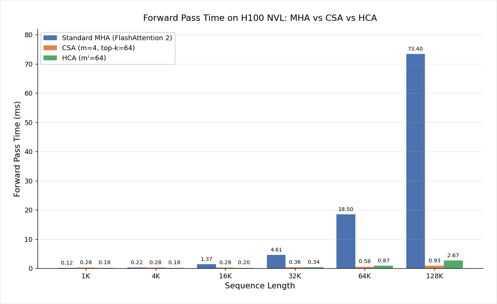

# 长上下文高效注意力：DeepSeek-V4 的 CSA + HCA

> **Author**: 魏新宇 (Xinyu Wei) — Microsoft AI GBB Senior System Engineer

[English](README.md) | 中文版

[](https://huggingface.co/deepseek-ai/DeepSeek-V4-Pro/blob/main/DeepSeek_V4.pdf)
[](https://learn.microsoft.com/en-us/azure/virtual-machines/nc-h100-v5-series)
[](https://pytorch.org/)
[](https://github.com/david-xinyuwei/david-share/tree/master/Deep-Learning/KV-Cache-Deep-Dive)

DeepSeek-V4 如何用 Compressed Sparse Attention (CSA) 和 Heavily Compressed Attention (HCA) 压缩百万 Token 上下文——KV Cache 优化的第三维度。

## Executive Summary

| 指标 | 标准 MHA | CSA (m=4, k=64) | HCA (m'=64) |
|------|:-------:|:---------------:|:----------:|
| 1M Token 时的 KV 条目数 | 1,000,000 | 250,000（少 4×） | 15,625（少 64×） |
| 每 Token Attention 开销 | O(N) | O(k) ≈ 常数 | O(N/m') — 线性但很小 |
| H100 实测加速 @128K | baseline | **78.9×** | **27.5×** |
| 论文：V4 vs V3.2 KV Cache | — | **节省 ~93%**（Flash，仅剩 ~7%） | **节省 ~90%**（Pro，仅剩 ~10%） |
| 论文：V4-Flash vs V3.2 FLOPs | — | V3.2 的 10% | （与 CSA 合计） |

> **符号说明**：m = 块大小（每 m 个 Token 压缩成 1 条记录），k = 每个 Query 选出的 Top-k 块数，m' = HCA 的块大小。下文 CSA 和 HCA 章节有详细解释。

> **论文数字说明**：上表里的 V4 vs V3.2 行来自 DeepSeek-V4 Technical Report Figure 1 的 whole-model deployment results，不是 attention-only CSA/HCA ablation。这些数字同时包含模型规模、MoE routing、压缩与索引、低精度实现、Kernel 和 Cache Layout 的综合影响。

> **Benchmark 参数 vs V4 实现参数**：本文表格和例子里的 `m=4`、`k=64`、`m'=64`、512 Token Window，是我们 standalone benchmark 的配置，用来隔离算法扩展趋势。DeepSeek-V4 公开推理代码的 `ModelArgs` 默认值是 `window_size=128`、`index_topk=512`、`compress_ratios=(0, 0, 4, 128, 4, 128, 4, 0)`；因此本文实测加速应理解为算法探针，不是官方 V4-Flash 延迟数字。来源：官方 [`inference/model.py`](https://huggingface.co/deepseek-ai/DeepSeek-V4-Pro/blob/main/inference/model.py)。

此前的工作从两个维度优化 KV Cache：层内压缩（MHA → GQA → MQA → MLA，详见 [KV-Cache-Deep-Dive](https://github.com/david-xinyuwei/david-share/tree/master/Deep-Learning/KV-Cache-Deep-Dive#24-mha-vs-mqa-vs-gqa)）和跨层替换（Hybrid Linear / Mamba，详见 [KV-Cache-Deep-Dive L3](https://github.com/david-xinyuwei/david-share/tree/master/Deep-Learning/KV-Cache-Deep-Dive#l3-four-kv-cache-reduction-architectures)）。但两者都无法减少每个 Attention 层中 KV 条目的数量——始终等于 N。DeepSeek-V4 开辟了**第三个正交维度**：通过学习式块压缩加稀疏 Top-k 选择来压缩序列长度。

> **前置知识**：需要了解 KV Cache 基础（MHA / GQA / MLA）。如果不熟悉，先读 [KV-Cache-Deep-Dive](https://github.com/david-xinyuwei/david-share/tree/master/Deep-Learning/KV-Cache-Deep-Dive)——本文从那篇结束的地方开始。

## 在 Azure 上运行

本工作在单台 Azure H100 NVL VM 上开发和验证。

| 组件 | 规格 |
|------|------|
| **VM SKU** | [Standard_NC40ads_H100_v5](https://learn.microsoft.com/en-us/azure/virtual-machines/nc-h100-v5-series) |
| **GPU** | 1× NVIDIA H100 NVL 95 GB |
| **用途** | Standalone CSA/HCA Module Benchmark（无需加载完整 DeepSeek-V4 模型） |

### 复现 Benchmark

在有 CUDA GPU 的机器上，从 repo 根目录执行：

```bash
python3 -m venv .venv
source .venv/bin/activate
pip install -r requirements.txt
python3 -u scripts/standalone_csa_benchmark.py --output data/csa_benchmark_results.json
python3 scripts/generate_csa_diagrams.py
```

Benchmark 脚本默认参数与下方表格一致：dim=512、heads=8、CSA `m=4`、HCA `m'=64`、top-k=64，序列长度从 1K 到 128K。

---

## 背景：长上下文的瓶颈

为什么行业里人人都在说“百万 Token 上下文”，但真正能高效服务的屈指可数？根源在于两个增长速度让人不舒服的数字。

| 资源 | 增长规律 | 1M Token（Qwen3-8B 等价） |
|------|:------:|:------------------------:|
| KV Cache 内存 | O(N) | ~144 GB（BF16） |
| Attention FLOPs | O(N)/Token，O(N²) 总计 | 约为 4K 的 250 倍 |

在 [KV-Cache-Deep-Dive](https://github.com/david-xinyuwei/david-share/tree/master/Deep-Learning/KV-Cache-Deep-Dive) 中，我们实测了 Qwen3-8B 在 32K Context 下的 KV Cache：**4.5 GiB**（BF16，batch=1）。按同一公式推算到 1M Token 约 144 GB——单张 GPU 放不下，即使 8× H100（640 GB）在 batch > 1 时也吃力。

已探索的两个优化维度：

**维度 1——层内压缩**：减少每个 Token 的 KV 大小。MHA → GQA → MQA → MLA 的演进（详见 [KV-Cache-Deep-Dive "MHA vs MQA vs GQA"](https://github.com/david-xinyuwei/david-share/tree/master/Deep-Learning/KV-Cache-Deep-Dive#24-mha-vs-mqa-vs-gqa)）把每条 KV 从 2 × n_heads × d_head 压缩到最低 576 维（MLA，DeepSeek-V2/V3）。但序列中每个 Token 仍然产生一条记录。

**维度 2——跨层替换**：减少需要 KV Cache 的层数。Hybrid Linear Attention（Qwen3.5）和 Hybrid Mamba（Nemotron-3-Nano）把大部分 Attention 层替换成了循环层或线性层（详见 [KV-Cache-Deep-Dive "Four KV Cache Reduction Architectures"](https://github.com/david-xinyuwei/david-share/tree/master/Deep-Learning/KV-Cache-Deep-Dive#l3-four-kv-cache-reduction-architectures)）。但保留下来的 Attention 层仍然是 O(N)。

KV-Cache-Deep-Dive 中的数据对比让这个缺口一目了然：

| 架构 | KV Cache @ 32K | 压缩率 | 遗留问题 |
|------|:---------:|:------:|---------|
| Qwen3-30B-A3B (GQA) | 3.00 GiB | baseline | 每个 Token 都存 |
| GLM-4.7-Flash (MLA) | 1.65 GiB | −45% | 条目数仍然 = N |
| Qwen3.5-35B-A3B (Hybrid) | 0.625 GiB | −79% | 保留的 Attention 层仍 O(N) |
| Nemotron-3-Nano (Hybrid Mamba) | 0.19 GiB | −94% | Attention 层虽少但仍 O(N) |

**缺口所在**：两个维度都没有沿**序列长度**本身进行压缩。1M Token 下，即使 MLA 的紧凑 576 维 × 47 层 × 1M ≈ 50 GB/请求——仍然不可行。CSA 和 HCA 正是填补这个缺口的。
论文自己的数据也印证了这个缺口的严重程度——以及 CSA/HCA 带来的改善：

<div align="center">
  
  <p><em>来源：Figure 1, DeepSeek-V4 Technical Report — CSA+HCA 将 FLOPs 降至 27%（Pro）/ 10%（Flash），KV Cache 降至 ~10% / ~7% vs V3.2 MLA Baseline。</em></p>
</div>

Figure 1 要谨慎读：这是 1M Context 下的 whole-model deployment comparison，不是 attention-only ablation。V4-Flash 相比 V3.2 还改变了 activated params 数量，所以 10% FLOPs / ~7% KV Cache 这组数字同时包含模型规模、MoE routing、压缩与索引、低精度实现、Kernel 和 Cache Layout 的综合影响。更稳妥的说法是：CSA/HCA 是 V4 能把 1M Context 做到可部署的重要结构性原因，但 Figure 1 不是单纯的 CSA-vs-MLA 微基准。

---

## Sparse Attention 家族

在深入 CSA 之前，有必要了解它在稀疏注意力谱系中的位置。CSA 全称 **Compressed Sparse Attention**——"Sparse" 占了名字的一半，有明确的学术传承。

### 从 Dense 到 Sparse 的演进

标准（Dense）Attention 计算 Query 和**每一个** Key 之间的分数。Sparse Attention 只计算**一部分** Key 的分数。这个"子集"可以用不同方式选取：

| 年代 | 方法 | 选择策略 | 局限 |
|:---:|------|---------|------|
| **2019** | Sparse Transformer (Child et al.) | 固定模式：局部窗口 + 跨步 | 模式人工设计，无法自适应 |
| **2020** | Longformer (Beltagy et al.) | 滑动窗口 + 全局 Token | 仍然固定，全局 Token 需要任务特定设计 |
| **2020** | BigBird (Zaheer et al.) | 随机 + 窗口 + 全局 | 随机选择无法利用数据结构 |
| **2025** | DeepSeek Sparse Attention / DSA | **动态 Top-k**（基于内容选择） | 数据驱动，但在原始（未压缩）KV 上操作 |
| **2026** | **CSA (DeepSeek-V4)** | **块压缩 + 动态 Top-k** | 先压缩再选择——候选更少、索引更快 |

核心趋势是从**固定模式**到**学习式、数据驱动的选择**。早期稀疏注意力用人工设计的模式（每隔 64 个 Token 看一个，或固定窗口）。DSA 让选择变得动态——每个 Query 根据内容挑选自己的 Top-k Key。CSA 再进一步：先把每 m 个 Token 压缩成 1 条记录（候选池从 N 缩小到 N/m），然后在压缩池上做动态 Top-k。

V4 论文明确交代了这个传承关系：

> *"CSA compresses the KV caches along the sequence dimension and then performs DeepSeek Sparse Attention (DSA)."*

### 先压缩再选择的好处

不压缩（DSA）：对 N 条记录评分 → 保留 Top-k → Attend k 条。索引开销 O(N)。

先压缩（CSA）：N → N/m 条记录 → 对 N/m 条评分 → 保留 Top-k → Attend k 条。索引开销降到 O(N/m)。

1M Token、m=4 时：DSA 要评分 100 万条；CSA 只评分 25 万条。FP4 Lightning Indexer 属于内存带宽瓶颈型操作，候选数少 4 倍带来的收益非常直接。

### DeepSeek-V4 中哪些是原创？

一个自然的问题：CSA 和 HCA 是全新发明，还是现有技术的重组？诚实的答案是两者都有——V4 论文本身对谱系交待得很明确：

| 组件 | 起源 | 来源 |
|------|------|------|
| 块级别 KV 压缩 | NSA / Native Sparse Attention | DeepSeek-AI, 2025（NSA） |
| 稀疏 Top-k 选择（Lightning Indexer + FP4） | DSA / DeepSeek Sparse Attention | DeepSeek-AI, 2025 — V3.2 引入 |
| **CSA = 块压缩 + DSA** | ✅ V4 — 新组合 + 新命名 | V4 论文 Section 2.3.1 |
| **HCA（Heavily Compressed Attention）** | ✅ V4 — 完全原创 | V4 论文 Section 2.3.2（未引用 prior work） |
| **CSA + HCA 层交替架构** | ✅ V4 — 完全原创 | V4 论文 Figure 2 |

V4 论文原文（Section 2.3.1）明说：

> *"CSA compresses the KV caches along the sequence dimension and then performs **DeepSeek Sparse Attention (DSA) (DeepSeek-AI, 2025)**."*

换言之：CSA 是 V4 把 DeepSeek 自己已有的两项技术（NSA 风格的块压缩 + V3.2 的 DSA）重新组合并起了新名字；HCA 则是 V4 全新引入、未引用任何 prior work。架构层面上真正的原创贡献是 **CSA + HCA 交替混合架构**——任一组件单独都不足以带来 V4 实际交付的长上下文效率。

---

## CSA 的工作原理

CSA 分 4 个阶段，每个阶段解决流水线中的一个具体问题。在看公式之前，先用一个具体数字的例子看看每个阶段到底做了什么。

### 具体例子：128K Token 通过 CSA

假设我们正在生成第 128,001 个 Token，KV Cache 已经存了 128K Token 的上下文。在一个 CSA 层中会发生什么：

```
输入：128,000 条 KV 记录（每个之前的 Token 一条）
  │
  │ Stage 1：块压缩（m=4）
  │   每 4 个连续 Token → 1 条压缩记录
  │   128,000 ÷ 4 = 32,000 条压缩记录
  │   每条记录是 4 个 Token 的加权组合，不是简单平均
  │
  │ Stage 2：Lightning Indexer（FP4，top-k=64）
  │   对 32,000 条记录打分，保留得分最高的 64 条
  │   同时保留最近 512 个 Token 不压缩（Sliding Window）
  │
  │ Stage 3：Sparse Attention
  │   只 Attend：64 条选中 + 512 Window = 共 576 条
  │   （原来 128,000 → 现在 576，减少了 222 倍）
  │
  │ Stage 4：输出投影
  ▼
输出：第 128,001 个位置的向量
```

核心思路：从 128,000 条记录筛到 576 条——这个缩减让长上下文 Attention 在单 GPU 上变得可行。代价是可能选错 64 个块。Sliding Window 保证了至少最近的上下文永远不会丢。

这个例子使用的是本文 standalone benchmark 参数。DeepSeek-V4 公开推理代码里，默认 `index_topk=512`、`window_size=128`，也就是说生产风格的 CSA 会选更多 compressed blocks，但未压缩窗口比上面的简化实验更小。

<div align="center">
  
</div>

论文的 CSA 架构图展示了同样的 4 阶段流水线，细节更丰富：

<div align="center">
  
  <p><em>来源：Figure 3, DeepSeek-V4 Technical Report</em></p>
</div>

论文中 CSA 各阶段的数学公式如下：

<div align="center">
  
  <p><em>来源：Section 2.3.1（公式 9-19）, DeepSeek-V4 Technical Report</em></p>
</div>

下面看每个阶段的细节。

### Stage 1：Block KV 压缩

**要解决的问题**：N 条 KV 太多，需要压缩。

每 m 个连续 Token 通过学习式 Gated Pooling 压缩成 1 条 KV 记录。这不是简单平均——模型学习了一个 **Gate**，给块内每个 Token 分配不同的重要性权重，让压缩后的记录尽可能保留最关键的信息。

这里有个很容易漏掉的实现细节：CSA（`compress_ratio=4`）不是硬切块后各自 Pooling，而是 **overlapped compression**。官方 `Compressor` 在 `compress_ratio == 4` 时打开 `self.overlap`，把投影通道扩成两路（`coff = 2`），再通过 `overlap_transform()` 让一条 compressed entry 同时吸收当前 block 内容和前一个 block 带来的边界信息。输出长度仍然约等于 N/m，但相邻 compressed entries 不是互相隔离的孤岛。

**数学公式**（论文公式 9-12）：

```
对每个 m Token 块 [h_1, ..., h_m]:
  KV Entries:   C  = W_kv  × H          # (B, N, c)
  Gate Scores:  Z  = W_gate × H + APE   # (B, N, c)，APE = 学习式位置偏置
  Reshape:      二者均到 (B, n_blocks, m, c)
  Pooling:      KV_compressed = Σ_i softmax(Z)_i · C_i    for i ∈ [1, m]
```

APE（Absolute Position Embedding）是可学习的块内位置偏置，让模型知道块内哪些位置对压缩表示贡献更大。

**代码**（来自官方 [`inference/model.py`](https://huggingface.co/deepseek-ai/DeepSeek-V4-Pro/blob/main/inference/model.py)，`Compressor.forward()`）：
```python
kv = self.wkv(x)              # KV 投影
score = self.wgate(x)         # Gate 评分
score += self.ape             # 加位置偏置
kv = (kv * score.softmax(dim=2)).sum(dim=2)  # 加权池化
```

### Stage 2：Lightning Indexer（稀疏选择）

**要解决的问题**：即使压缩后也有 N/m 条记录（1M Token 时 25 万条），需要进一步筛选。

Lightning Indexer 用 **FP4 精度**为每个压缩块打分，只保留 Top-k 个最相关的。这是一个刻意的工程权衡：索引阶段只需要对块做粗略排序，不需要精确的 Attention 权重。FP4 的排序精度完全够用，但吞吐是 FP8 的 2 倍。

**数学公式**（论文公式 13-17）：

```
Latent Q:    c_t^Q = W_DQ × h_t                    # MLA 风格低秩 Q
Index Q:     q_t^I = W_IUQ × c_t^Q                 # 上投影到 Indexer 空间
Score:       I(t,s) = Σ_h w_h · ReLU(q_h · K_s)    # 每个压缩块 s 的得分
Selection:   topk_idx = top-k(I(t, :))             # 只保留 Top-k 块
```

Latent Query `c_t^Q` **与主 Attention 路径共享**——这是 MLA 的遗产。同一个低秩 Q 投影同时服务于 Indexer（FP4 路径）和 Core Attention（BF16 路径）。

Lightning Indexer 是**选择路径**，不是最终 Attention 路径。官方代码里，`Indexer` 有自己的 `Compressor(..., rotate=True)`，用来生成 compressed indexer keys 做打分；它输出的只是 `topk_idxs`，也就是要去读哪些位置。Core Attention 真正读取的 compressed KV 来自主 Attention 的 compressor。把这两条路径分开，才能避免把“检索/索引成本”和“最终 Attention 聚合成本”混在一起。

### Stage 3：Sparse Core Attention

**要解决的问题**：只对选出的子集做 Attention 计算。

选出 Top-k 压缩块后，CSA 用 MQA（Multi-Query Attention）——所有 Query Heads 共享同一份压缩 KV。

```
Gather:    KV_selected = compressed_kv[topk_idx] ∪ window_kv
                         (k 个稀疏选中 + window_size 个近期 Token)
Attention: o = softmax(q × KV_selected^T / √d) × KV_selected + attn_sink
```

**Attention Sink**：可学习的 per-head logit，允许 Attention 总和小于 1。当上下文中没有真正相关的内容时，模型不会被迫 Attend 到无关内容。

**Sliding Window**：最近的 n 个 Token 始终以未压缩形式参与计算。它不只是 Quality 补丁，也是因果性补丁。一个 compressed block 可能包含当前 Query 之后的 Token，如果 Query 直接访问自己所在的 compressed block，就会破坏自回归因果性。未压缩窗口负责保留局部和块内上下文，因果 Mask 则确保未来 Token 不会被读到。

### Stage 4：Grouped Low-Rank 输出投影

**要解决的问题**：标准输出投影 W_o ∈ R^(D × D) 在大 D（如 V4-Pro 的 7168）下开销很大。

CSA 用分组低秩分解：

```
对每组 g:  o_g = head_outputs_g × W_oa[g]   # 分组低秩下投影
           final = concat(o_g) × W_ob        # 共享上投影
```

输出投影参数减少约 O(n_groups) 倍。

### 直觉理解

把 1M Token 的上下文想象成一本 100 万页的书，你要回答一个问题。

- **标准 Attention**：把 100 万页从头到尾全部读一遍。
- **CSA**：每 4 页做一条摘要笔记（共 25 万条）→ 用快速索引（Lightning Indexer，FP4）给每条笔记打分 → 只精读最相关的 64 条笔记。

代价：如果索引选错了 64 条，可能漏掉关键信息。缓解措施：**Sliding Window** 始终保留最近的 Token 不压缩，**训练后的 Indexer** 学会了哪些笔记通常重要，**Attention Sink** 允许模型在没有相关内容时放弃 Attend。

### `compress_ratio` 开关

在官方代码中，一个整数参数决定每层的机制：

```python
self.compress_ratio = args.compress_ratios[layer_id]
```

- `compress_ratio = 4`：CSA 层（块压缩 + Indexer + Sparse Attend）
- `compress_ratio > 4`（如 64）：HCA 层（重度压缩，无 Indexer，Dense Attend）
- `compress_ratio = 0`：纯 Sliding Window（不压缩）

这就引出下一个问题：为什么需要两种不同的机制？

换句话说，V4 把历史改造成了多分辨率序列：pure SWA 层保留最近的 token-level 细节，CSA 层从较细粒度的 compressed blocks 里检索少量重点，HCA 层则用更粗粒度覆盖全局背景。

---

## HCA 的工作原理

CSA 的 Top-k=64 选择擅长找到最相关的段落，但可能漏掉分散在整个序列中的全局上下文。HCA 通过在更粗的粒度上维护一份**全序列的全局摘要**来解决这个问题。

### 具体例子：128K Token 通过 HCA

同样的场景：生成第 128,001 个 Token，但这次是 HCA 层而不是 CSA 层。

```
输入：128,000 条 KV 记录
  │
  │ Stage 1：重度压缩（m'=64）
  │   每 64 个连续 Token → 1 条压缩记录
  │   128,000 ÷ 64 = 2,000 条压缩记录
  │
  │ Stage 2：无 Indexer（全部 Attend）
  │   2,000 条记录少到可以全部做 Dense Attend
  │   同时保留 Sliding Window（512 个近期 Token）
  │
  │ Stage 3：Dense Attention
  │   Attend：2,000 条压缩 + 512 Window = 共 2,512 条
  │
  │ Stage 4：输出投影
  ▼
输出：第 128,001 个位置的向量
```

这里同样是 benchmark 配置。按公开代码默认的 `compress_ratio=128`，1M Token 会得到约 7,812 条 HCA compressed entries，而不是 15,625 条。机制取舍不变，只是官方风格的配置压缩得更激进。

### CSA vs HCA 并排对比

把两者放在一起，核心差异就清楚了：

| 步骤 | CSA (m=4, k=64) | HCA (m'=64) |
|------|:---------------:|:-----------:|
| 压缩 | 128K → **32K** 条（4×） | 128K → **2K** 条（64×） |
| 选择 | 32K 中取 Top-64 | **无**——全部保留 |
| 实际 Attend 条数 | 64 + 512 Window = **576** | 2,000 + 512 Window = **2,512** |
| 擅长什么 | 找到回答问题的**那个具体段落** | 把握整篇文档的**大意** |
| 会漏什么 | 分散在全文的全局信息 | 64 个 Token 内的细节 |

CSA 像狙击枪——准但窄；HCA 像广角镜头——看得全但分辨率低。单独用都不够，配合起来才能覆盖彼此的盲区。

<div align="center">
  
</div>

论文的 HCA 架构图展示了简化后的流水线（没有 Indexer 阶段）：

<div align="center">
  
  <p><em>来源：Figure 4, DeepSeek-V4 Technical Report</em></p>
</div>

### 与 CSA 的关键差异

| 方面 | CSA | HCA |
|------|-----|-----|
| 块大小 | m = 4 | m' = 64（更大） |
| 1M Token 时的压缩条目数 | 250,000 | **15,625** |
| Top-k 选择 | 是（k=64） | **否**——全部 Dense Attend |
| Indexer | FP4 Lightning Indexer | 不需要 |
| 每 Token 开销 | O(N/m + k) ≈ O(k) | O(N/m') |
| 优势 | 精确检索特定段落 | 全局感知，不会漏掉任何信息 |
| 劣势 | 可能漏掉全局分布的信息 | 粒度粗，捕捉不到细节 |

**为什么 HCA 不需要 Indexer？** m'=64 时，1M Token 压缩成约 1.5 万条记录。对 1.5 万条全部做 Dense Attend 比跑 FP4 Indexer + Top-k Gather + Sparse Attention 处理 25 万条还便宜。在这个压缩级别，Dense Attention 的经济性更好。

### 数学公式（论文公式 20-23）

```
Compress:  与 CSA Stage 1 相同，但用 m' 而非 m
           HCA_KV ∈ R^(B × N/m' × c)
Attention: o = softmax(q × HCA_KV^T / √d) × HCA_KV + window 贡献
           （无 Top-k，对所有压缩条目 + Sliding Window 做 Dense Attention）
```

### 为什么 CSA 和 HCA 交替使用

DeepSeek-V4 不是单纯用 CSA 或 HCA，而是逐层交替配置。具体每层用哪种通过 `args.compress_ratios[layer_id]` 配置。典型的模式是这样的：

```
Layer 0:  CSA (ratio=4)   → 精确搜索：找出 64 个最相关的块
Layer 1:  HCA (ratio=64)  → 全局扫描：粗略看一遍全部
Layer 2:  CSA (ratio=4)   → 用不同的 Query 再精确搜索一次
Layer 3:  HCA (ratio=64)  → 再做一次全局扫描
...
Layer 60: Sliding Window (ratio=0) → 底层可能完全不压缩
```

**为什么这样有效**：假设用户在一段 50 万 Token 的对话历史中问“1 月 15 日的会议结论是什么？”

- **CSA 层** 可以精确定位到 1 月 15 日的会议记录（高精度、窄聚焦）
- 但模型还需要理解更广泛的上下文：这个项目是关于什么的？与会者有哪些？这些信息分布在很多次会议里，没有哪个 4-Token 块能单独捕捉到
- **HCA 层** 在下一遍读取整个 50 万 Token 历史的粗略摘要，拾起了 CSA 漏掉的项目上下文
- 下一个 **CSA 层** 就能综合两者：精确的会议记录 + 广泛的项目背景

这就是为什么交替比单纯用任一种都强。CSA 漏掉的信息，HCA 能在下一层补回来；反过来也一样。

V4 的整体架构图展示了 CSA 和 HCA 层如何在全模型中交替分布：

<div align="center">
  
  <p><em>来源：Figure 2, DeepSeek-V4 Technical Report</em></p>
</div>

---

## 三个压缩维度

理解了 CSA 和 HCA 之后，可以把它们放到更大的设计空间中定位。KV Cache 有三个正交的优化维度，可以自由组合：

<div align="center">
  
</div>

| 维度 | 压缩什么 | 代表方案 | 详见 |
|:---:|---------|---------|------|
| **D1: 层内** | 每条 KV 的大小 | MHA → GQA → MQA → MLA | [KV-Cache-Deep-Dive](https://github.com/david-xinyuwei/david-share/tree/master/Deep-Learning/KV-Cache-Deep-Dive#24-mha-vs-mqa-vs-gqa) |
| **D2: 跨层** | Attention 层的数量 | Hybrid Linear, Hybrid Mamba | [KV-Cache-Deep-Dive](https://github.com/david-xinyuwei/david-share/tree/master/Deep-Learning/KV-Cache-Deep-Dive#l3-four-kv-cache-reduction-architectures) |
| **D3: 序列长度** | 每层的 KV 条目数 | **CSA, HCA** | **本文** |

### 组合矩阵

| 架构 | D1 | D2 | D3 | KV @ 32K |
|------|:--:|:--:|:--:|:--------:|
| Llama 3 | GQA | 全 Attention | 无 | 4.5 GiB |
| Qwen3-30B-A3B | GQA | 全 Attention | 无 | 3.0 GiB |
| GLM-4.7-Flash | **MLA** | 全 Attention | 无 | 1.65 GiB |
| Qwen3.5-35B-A3B | GQA | **Hybrid Linear** | 无 | 0.625 GiB |
| Nemotron-3-Nano | GQA | **Hybrid Mamba** | 无 | 0.19 GiB |
| **DeepSeek-V4** | **MLA-style Latent Q** | 全 Attention | **CSA + HCA** | 见下方实验 |

（KV Cache 数据来自 [KV-Cache-Deep-Dive](https://github.com/david-xinyuwei/david-share/tree/master/Deep-Learning/KV-Cache-Deep-Dive#35-comparison-summary) 的计算，基于 HuggingFace config.json 参数。）

DeepSeek-V4 是**第一个使用 D3 维度的生产模型**。三个维度正交——未来的架构理论上可以同时使用 CSA/HCA + Hybrid Mamba，从三个维度同时压缩。

### 渐近复杂度

| 机制 | KV Cache 存储 | 每 Token Attention FLOPs |
|------|:-----------:|:-----------------------:|
| 标准 MHA | O(N) | O(N)/Token |
| MLA | O(N)，单条更小 | O(N) |
| **CSA (m, k)** | **O(N/m)** | **O(N/m + k) ≈ O(k)**，k 为常数时亚线性 |
| **HCA (m')** | **O(N/m')** | **O(N/m')** |

1M Token、m=4、k=64、m'=64 时：
- CSA：存 25 万条，但只 Attend 64 条 → 每 Token 开销接近常数
- HCA：存 1.56 万条并全部 Attend → 每 Token 1.56 万次运算（vs MHA 的 100 万）

### KV Cache 压缩倍数拆解

实验测得 CSA 的 KV Cache 总压缩 64 倍。但这有多个来源——**不能把功劳全归 CSA**：

| 因素 | 压缩倍数 | CSA 特有？ |
|------|:------:|:--------:|
| Block 压缩（m Token → 1 条记录） | 4× | **是——CSA 核心贡献** |
| MQA（n_heads → 1 共享 KV） | 8×（典型） | 否——MQA 通用技术 |
| K+V 合并存储 | 2× | 否——实现细节 |
| **合计** | **64×** | **仅 4× 是 CSA 独有的** |

与论文公平对比（论文以 MLA 为 Baseline，已有 KV 压缩）：CSA 在已有压缩基础上额外贡献 ~4×/层。

理论分析到此结束——CSA 和 HCA 在长上下文下应该有显著的速度优势，而短上下文下会有一些额外开销。下面在真实硬件上验证。

---

## 实验：H100 上的 Standalone Benchmark

我们用 PyTorch 从零实现了 CSA、HCA 和标准 MHA，在 Azure H100 NVL 上做了对比测试。这验证的是**算法层面的工程特性**（压缩率、速度扩展），不是端到端模型质量。

### 配置

| 参数 | 值 |
|------|-----|
| GPU | NVIDIA H100 NVL 95 GB（Azure NC40ads_H100_v5） |
| 框架 | PyTorch 2.7, BF16 |
| Hidden dim | 512 |
| Heads | 8 |
| CSA m | 4 |
| HCA m' | 64 |
| CSA top-k | 64 |
| 序列长度 | 1K, 4K, 16K, 32K, 64K, 128K |
| 计时 | Warmup 3 次 + 10 次取中位数 |
| 标准 MHA Baseline | 使用 `F.scaled_dot_product_attention`（H100 上自动调用 FlashAttention 2） |
| CSA/HCA 实现 | 原生 PyTorch（无自定义 CUDA Kernel） |

代码：[`scripts/standalone_csa_benchmark.py`](scripts/standalone_csa_benchmark.py)
数据：[`data/csa_benchmark_results.json`](data/csa_benchmark_results.json)

Benchmark 范围：这组实验只隔离测试 block compression 和 sparse selection，不包含生产实现中的 Sliding Window 分支、官方 overlapped CSA compressor，也不包含自定义 CUDA Kernel。

### 结果

| 序列长度 | MHA KV | CSA KV | HCA KV | MHA 耗时 | CSA 耗时 | HCA 耗时 | CSA 加速 | HCA 加速 |
|-------:|:------:|:------:|:------:|:-------:|:-------:|:-------:|:-------:|:-------:|
| 1K | 2.1 MB | 0.03 MB | 0.00 MB | 0.12 ms | 0.28 ms | 0.18 ms | 0.4× | 0.7× |
| 4K | 8.4 MB | 0.13 MB | 0.01 MB | 0.22 ms | 0.28 ms | 0.18 ms | 0.8× | 1.2× |
| 16K | 33.6 MB | 0.52 MB | 0.03 MB | 1.37 ms | 0.28 ms | 0.20 ms | **4.9×** | **6.9×** |
| 32K | 67.1 MB | 1.05 MB | 0.07 MB | 4.61 ms | 0.36 ms | 0.34 ms | **12.8×** | **13.6×** |
| 64K | 134 MB | 2.10 MB | 0.13 MB | 18.5 ms | 0.58 ms | 0.87 ms | **32.0×** | **21.3×** |
| 128K | 268 MB | 4.19 MB | 0.26 MB | 73.4 ms | 0.93 ms | 2.67 ms | **78.9×** | **27.5×** |

<div align="center">
  
  <p><em>H100 NVL 上不同序列长度的 Forward Pass 耗时。标准 MHA（蓝色）是 FlashAttention 2 baseline；CSA（橙色，m=4 + top-k=64）；HCA（绿色，m'=64）。</em></p>
</div>

### 分析

1. **亚线性扩展得到确认**：CSA Forward 耗时从 0.28ms（1K）到 0.93ms（128K）——序列增长 128 倍但耗时只增 3.3 倍，符合 O(N/m + k) 的理论预测（k=64 是主导项）。

2. **交叉点在 ~8K 附近**：8K 以下 CSA 比 MHA 慢（压缩和索引有额外开销），8K 以上 CSA 的优势越来越大。这与生产指导一致：CSA/HCA 面向长上下文场景，不适合短 Prompt。

3. **极长序列时 CSA 比 HCA 快**：128K 时 CSA（0.93ms）比 HCA（2.67ms）快 2.9 倍。因为 CSA 的 Top-k=64 让 Attention 开销恒定，而 HCA 的 O(N/m') 仍在线性增长（128K/64 = 2K 条全部 Attend）。

4. **中等长度时 HCA 更快**：16K-32K 时 HCA 与 CSA 持平甚至更快，因为此时 N/m' 足够小，跑 Lightning Indexer + Top-k Gather 的开销反而比 Dense Attend 全部 N/m' 条更大。

5. **KV Cache 压缩是精确的**：CSA 始终 64×，HCA 始终 1024×，与序列长度无关——这是算法的确定性属性，不依赖数据。

### 局限性

1. **未验证 Quality**：随机权重——Compressor 和 Indexer 没有通过训练学到保留关键信息的能力
2. **Baseline 用了 FlashAttention 2**：标准 MHA 在 H100 上自动调用 FlashAttention 2；CSA/HCA 是原生 PyTorch——加速来自计算量减少，不是 Kernel 更优
3. **维度偏小**：dim=512、8 heads，vs 生产级 dim=7168+、128+ heads，不能直接外推
4. **随机 Indexer**：用均值 Q 点积代替真实的 FP4 Lightning Indexer
5. **无 Sliding Window**：生产 CSA 包含 Sliding Window 分支，我们为了隔离实验省略了
6. **无 overlapped compression**：官方 CSA compressor 在 `compress_ratio=4` 时使用 overlapped compression；本 benchmark 使用非重叠的 gated pooling，只验证扩展趋势。

---

## 论文的 Quality 证据

速度和内存节省再好，如果模型输出质量崩了也没意义。我们无法用随机权重直接验证 Quality（随机初始化的压缩器根本不知道该保留什么），但 DeepSeek-V4 Technical Report 提供了有力的间接证据——**训练好的** CSA/HCA 在激进压缩下仍能保持甚至提升 Quality：

| Benchmark | V3.2-Base（MLA，37B 激活参数） | V4-Flash-Base（CSA+HCA，13B 激活参数） | V4-Pro-Base（CSA+HCA，49B 激活参数） |
|-----------|:-----:|:-----:|:-----:|
| MMLU | 87.8 | 88.7 | **90.1** |
| MMLU-Pro | 65.5 | 68.3 | **73.5** |
| GSM8K | 91.1 | 90.8 | **92.6** |
| HumanEval | 62.8 | 69.5 | **76.8** |

> *"DeepSeek-V4-Flash-Base already surpasses DeepSeek-V3.2-Base across a majority of benchmarks with its more parameter-efficient design."* — 论文 Section 1

V4-Flash 用 **13B 激活参数 + CSA/HCA** 就达到了 V3.2 的 **37B 激活 + MLA** 水平。说明训练好的块压缩加稀疏选择不仅能保持 Quality，甚至能进一步提升（很可能得益于 CSA/HCA 交替同时提供精准检索和全局感知）。

---

## 生产考量

### 何时使用 CSA/HCA

| 场景 | 建议 |
|------|------|
| Context < 8K，Quality 优先 | 标准 MHA / GQA / MLA——CSA 的额外开销不划算 |
| Context 8K-128K，性能与质量兼顾 | MLA + Hybrid Mamba（Nemotron 风格）——成熟且简单 |
| Context 128K-1M，生产规模 | **CSA + HCA + MLA**（DeepSeek-V4 风格） |
| 需要精确的 Token 级召回 | CSA/HCA 可能丢信息——需要通过下游评测验证 |

### DeepSeek-V4 的技术栈

| 组件 | 选择 | 原因 |
|------|------|------|
| Q 投影 | MLA-style 低秩 Latent | 沿用 V3，已充分验证 |
| KV 压缩 | CSA/HCA 块 + APE | V4 核心创新 |
| 层配置 | CSA/HCA 交替 | 精确检索 + 全局视野 |
| 局部上下文 | Sliding Window 分支 | 保留近期 Token 的细粒度依赖 |
| Indexer 精度 | FP4（MXFP4） | 2× 加速 + QAT 补偿精度损失 |
| 输出投影 | 分组低秩 | 减少大 Hidden Dim 下的参数量 |

### Serving 侧的 Cache Layout 变化

V4 风格的 Attention 还会改变 serving 接口。Serving 系统不能再把每层都当成单一的 token-level KV Cache 来处理，而是要同时管理几类状态：

| 状态 | 为什么需要 |
|------|------------|
| Sliding-window KV | 最近 Token 保持未压缩，用于局部依赖和因果性 |
| Compressor tail state | Decode 过程中可能还没凑满 m 或 m' 个 Token，不能提前压缩 |
| CSA/HCA compressed KV | 已完成的块按压缩后的序列粒度保存 |
| CSA top-k indices | Indexer 产出稀疏位置，供 Core Attention gather |

Decode 时的状态流转是：

1. 新 Token 同时进入 sliding-window KV 和 compressor tail。
2. tail 凑满 `m` 或 `m'` 个 Token 后，压缩成一条 CSA 或 HCA entry。
3. 完成的 entry 写入 compressed KV cache，tail 清空后继续接收下一个块。
4. Indexer 只在已完成的 compressed entries 上产生 top-k positions。
5. Core Attention gather：top-k compressed KV 加上近期 sliding-window KV。

这也是 Cache block 对齐很重要的原因。如果模型同时混用 CSA ratio 4 和 HCA ratio 128，那么实现上友好的原始块大小就是 128 Token：它会产生 32 条 CSA compressed entries 和 1 条 HCA compressed entry。这是 sequence-length compression 对 Cache Layout 的直接影响，也解释了为什么普通 token-level PagedAttention 抽象要加额外 metadata，才能高效服务 V4。

### CSA/HCA 不能替代什么

CSA/HCA 与其他维度的方案是**互补的**，不是替代关系：

- **Hybrid Mamba** 直接消除部分层的 KV Cache，解题思路不同。理论上可以组合：Mamba 层 + CSA Attention 层。
- **MLA** 提供了 CSA Lightning Indexer 依赖的 Latent Q。去掉 MLA 需要重新设计 Stage 2。
- **Sliding Window** 对短距离依赖至关重要。单用 CSA/HCA 会丢失 Token 级别的局部信息。

### 实现复杂度

| 组件 | 复杂度 | 生产就绪？ |
|------|:----:|:--------:|
| 标准 MHA + KV Cache | 低 | ✅ 通用 |
| GQA / MQA | 低 | ✅ Llama 3, Qwen3 |
| MLA | 中 | ✅ DeepSeek-V2/V3 |
| Hybrid Linear / Mamba | 高 | ✅ Qwen3.5, Nemotron-3 |
| **CSA + HCA + Lightning Indexer (FP4)** | **极高** | **目前仅 DeepSeek-V4** |

Lightning Indexer + FP4 QAT 是最难实现的部分——需要定制 Triton Kernel（DeepSeek 开源代码 `kernel.py` 达 22KB）。

---

## 代码参考

官方实现在 [`inference/model.py`](https://huggingface.co/deepseek-ai/DeepSeek-V4-Pro/blob/main/inference/model.py)（827 行，MIT License）。

| 类 | 行号 | 作用 |
|----|:----:|------|
| `Compressor` | 283-382 | Block KV 压缩（Gated Pooling） |
| `Indexer` | 384-434 | Lightning Indexer 稀疏 Top-k 选择 |
| `Attention` | 436-558 | 完整 Attention：MLA + CSA/HCA + Sliding Window |

一个值得注意的细节：`Attention` 类的 docstring 自称 "Multi-head Latent Attention (MLA)"——这印证了 CSA/HCA 是建立在 MLA **之上**的，不是替代 MLA。MLA 的标志性低秩 Q/KV 投影（`wq_a → q_norm → wq_b`）完整保留，CSA 在此基础上增加了块压缩和稀疏选择阶段。

---

## 交叉引用

本文是 Attention 机制与 KV Cache 优化系列的一部分，知识逐层递进：

| 主题 | 阅读位置 | 与本文的关系 |
|------|---------|-------------|
| KV Cache 基础（是什么/为什么/有多大） | [KV-Cache-Deep-Dive](https://github.com/david-xinyuwei/david-share/tree/master/Deep-Learning/KV-Cache-Deep-Dive) | **前置知识**——不熟悉的话先读这篇 |
| MHA → GQA → MQA → MLA 演进 | [KV-Cache-Deep-Dive "MHA vs MQA vs GQA"](https://github.com/david-xinyuwei/david-share/tree/master/Deep-Learning/KV-Cache-Deep-Dive#24-mha-vs-mqa-vs-gqa) | 维度 1 的上下文 |
| Hybrid Linear / Mamba 架构 | [KV-Cache-Deep-Dive "Four Reduction Architectures"](https://github.com/david-xinyuwei/david-share/tree/master/Deep-Learning/KV-Cache-Deep-Dive#l3-four-kv-cache-reduction-architectures) | 维度 2 的上下文 |
| FlashAttention vs PagedAttention | [KV-Cache-Deep-Dive Appendix A](https://github.com/david-xinyuwei/david-share/tree/master/Deep-Learning/KV-Cache-Deep-Dive#appendix-a-score-matrix--flashattention--pagedattention) | 计算优化（正交于压缩） |
| **序列长度压缩（CSA + HCA）** | **本文** | **维度 3** |

## 参考文献

- DeepSeek-AI. (2026). *DeepSeek-V4: Towards Highly Efficient Million-Token Context Intelligence*. Technical Report. [PDF](https://huggingface.co/deepseek-ai/DeepSeek-V4-Pro/blob/main/DeepSeek_V4.pdf)
- 官方推理代码：[DeepSeek-V4-Pro/inference/model.py](https://huggingface.co/deepseek-ai/DeepSeek-V4-Pro/tree/main/inference)（MIT License）
- Child, R. et al. (2019). *Generating Long Sequences with Sparse Transformers*. arXiv:1904.10509
- Beltagy, I. et al. (2020). *Longformer: The Long-Document Transformer*. arXiv:2004.05150
- Zaheer, M. et al. (2020). *Big Bird: Transformers for Longer Sequences*. arXiv:2007.14062
- DeepSeek-AI. (2024). *DeepSeek-V2*. arXiv:2405.04434（首次提出 MLA）
- DeepSeek-AI. (2025). *DeepSeek-V3 Technical Report*. arXiv:2412.19437
- Shazeer, N. (2019). *Fast Transformer Decoding: One Write-Head is All You Need*. arXiv:1911.02150（MQA）
- Ainslie, J. et al. (2023). *GQA*. arXiv:2305.13245
- 配套阅读：[KV-Cache-Deep-Dive](https://github.com/david-xinyuwei/david-share/tree/master/Deep-Learning/KV-Cache-Deep-Dive)（覆盖维度 1 和 2）
- 关联阅读：[Multi-Expert-OPD-Distillation](https://github.com/david-xinyuwei/david-share/tree/master/DL-Algorithm-Insights/Multi-Expert-OPD-Distillation)（V4 的 post-training：10+ 领域专家如何通过 On-Policy Distillation 融合）

---

## 项目信息

| 项目 | 值 |
|------|-----|
| Author | 魏新宇 (Xinyu Wei) |
| 日期 | 2026-05 |
| 验证环境 | Azure H100 NVL 95 GB（Korea Central） |
| 来源 | DeepSeek-V4 Technical Report + 开源推理代码 |
| 配套文章 | [KV-Cache-Deep-Dive](https://github.com/david-xinyuwei/david-share/tree/master/Deep-Learning/KV-Cache-Deep-Dive)（覆盖维度 1 和 2） |

*本文是 [DL-Algorithm-Insights](https://github.com/david-xinyuwei/david-share/tree/master/DL-Algorithm-Insights) 系列的一部分——用真实 GPU 实验解读深度学习算法。*
