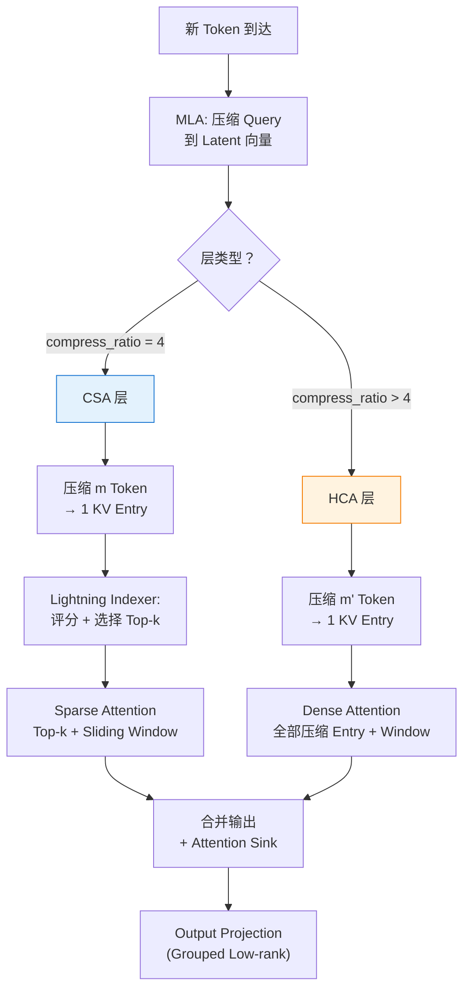

# 长上下文高效注意力：DeepSeek-V4 的 CSA + HCA 混合架构

*Author: 魏新宇 (Xinyu Wei)*

## 这是什么？

> **一句话**：DeepSeek-V4 引入了混合注意力架构，结合 Compressed Sparse Attention（CSA）和 Heavily Compressed Attention（HCA），在 1M Token Context 下将 KV Cache 降至约 2%、推理 FLOPs 降至约 27%——使百万 Token 推理在工程上成为可能。

标准 Transformer Attention 在长上下文下有两个众所周知的扩展问题：KV Cache 随序列长度线性增长（1M Token 时占数百 GB），每 Token 的 FLOPs 也线性增长。CSA+HCA 通过在序列维度上进行学习式 KV 压缩 + 稀疏 Top-k 选择，同时解决这两个问题。

## 为什么重要

百万 Token Context 的需求来自真实工作负载：完整代码库、长文档、多轮对话、以及随时间累积上下文的 Agent 工作流。但标准 Attention 下服务 1M Context 模型的成本是禁止性的：

| Context 长度 | KV Cache（27B, BF16） | 每 Token FLOPs |
|:------------:|:---------------------:|:---------------:|
| 4K | ~2 GB | 基线 |
| 128K | ~64 GB | 32× |
| 1M | ~500 GB | 250× |

即使是 DeepSeek-V3 的 MLA（Multi-head Latent Attention，压缩每个 Head 的 KV 维度），序列长度维度的扩展仍然是 O(n)。

**CSA+HCA 直接攻击序列维度**：不再每个 Token 存一个 KV Entry，而是将每 m 个 Token 压缩为 1 个 Entry，再通过 Top-k 选出最相关的压缩块。结果：**1M Token 下约 2% KV Cache + 约 27% FLOPs**（来源：Figure 1, DeepSeek-V4 Technical Report）。

## 在 Azure 上运行

CSA+HCA 架构可以在 Azure GPU VM 上进行学习和实验。完整运行 DeepSeek-V4 模型需要多节点配置，但 Attention 机制本身可以在单 GPU 上分析和验证。

### 推荐 SKU

| 组件 | 规格 |
|------|------|
| **VM SKU** | [Standard_NC40ads_H100_v5](https://learn.microsoft.com/en-us/azure/virtual-machines/nc-h100-v5-series) |
| **GPU** | 1× NVIDIA H100 80 GB SXM |
| **用途** | 代码分析、Standalone Attention Module 实验、KV Cache 大小验证 |

### Technology Stack at a Glance（技术栈全景）

| Category | Technique | What It Does | Impact | Detail Section |
|----------|-----------|-------------|--------|---------------|
| Attention（基础） | MLA-style Latent Q | Query 压缩为低秩 Latent 向量 | 降低每 Head 的 Q 计算量 | How It Works |
| Attention（CSA） | Block KV Compression + Sparse Top-k | m 个 Token → 1 个 KV Entry，选 Top-k | ~4× KV 缩减 + 稀疏 Attention | CSA 架构 |
| Attention（HCA） | Heavy Block Compression | m' 个 Token → 1 个 Entry（m' >> m），全 Attend | 极端 KV 缩减，提供全局视野 | HCA 架构 |
| 局部上下文 | Sliding Window | 保留最近 n 个 Token 不压缩 | 保持局部细粒度依赖 | Sliding Window |

## 工作原理

### 架构总览

> 下图展示了 DeepSeek-V4 整体架构。注意 CSA 和 HCA 层交替排列，每层都有 Sliding Window 分支。来源：Figure 2, DeepSeek-V4 Technical Report, MIT License.


核心洞察：**不同层服务不同目的**。

| 层类型 | 压缩程度 | 选择方式 | Attend 到 | 目的 |
|:------:|:-------:|:-------:|:---------:|------|
| **CSA** | m Token → 1 Entry | Top-k 稀疏 | 选中的 k 个 Entry + Window | **放大镜**——找到并聚焦最相关段落 |
| **HCA** | m' Token → 1 Entry（m' >> m） | 无（Dense） | 全部压缩 Entry + Window | **鸟瞰图**——粗略全局扫描 |

### CSA：Compressed Sparse Attention

> 来源：Figure 3, DeepSeek-V4 Technical Report, MIT License.


CSA 有四个阶段：

**阶段 1：Block KV Compression**

每 m 个连续 Token 通过学习式 Gated Pooling 压缩为 1 个 KV Entry：

```
对每个 m Token 块 [h₁, h₂, ..., hₘ]:
  KV Entries:   C = W_kv × [h₁, ..., hₘ]        → m 个 dim c 的 Entry
  Gate Scores:  Z = W_gate × [h₁, ..., hₘ] + APE  → m 个得分
  压缩结果:     KV_compressed = Σ (softmax(Z) × C)  → 1 个 dim c 的 Entry
```

官方代码（`Compressor.forward()`）实现：
```python
kv = self.wkv(x)           # 投影到 KV 空间
score = self.wgate(x)       # 计算 Gate 得分
score += self.ape           # 加位置偏置
kv = (kv * score.softmax(dim=2)).sum(dim=2)  # 加权求和 → 每块 1 个 Entry
```

**阶段 2：Lightning Indexer（稀疏选择）**

并非所有压缩块都相关。Lightning Indexer 用 FP4 精度对每个压缩块评分并选择 Top-k。

**阶段 3：Core Sparse Attention**

对选出的 Top-k 压缩块 + Sliding Window KV 做 MQA Attention。

**阶段 4：Attention Sink**

可学习的 Sink Logit，允许 Attention Score 总和不为 1——当上下文中没有真正相关内容时，模型不被迫 Attend 到无关内容。

> CSA 完整数学公式（公式 9-19）。来源：Section 2.3.1, DeepSeek-V4 Technical Report, MIT License.


### HCA：Heavily Compressed Attention

> 来源：Figure 4, DeepSeek-V4 Technical Report, MIT License.


HCA 与 CSA 有两个关键区别：
1. **更大的块**：m' >> m（如 m'=64 vs m=4），1M Token 压缩到仅约 15K Entry
2. **不做稀疏选择**：压缩后序列已经很短，直接 Dense Attend 全部

### 与 MLA 的关系

V4 论文全文**不含 "MLA" 术语**（pdftotext 全文搜索 = 0 结果）。但官方代码中：

```python
class Attention(nn.Module):
    """Multi-head Latent Attention (MLA) with sliding window + optional KV compression."""
```

代码自己称为 MLA。Query 路径使用与 MLA 相同的低秩 Latent 投影：`wq_a → q_norm → wq_b`。

**准确描述**：CSA/HCA 建立在 MLA 的 Latent Query 压缩**之上**，新增了序列维度 KV 压缩。论文避免使用 MLA 这个术语，因为整体机制已远超 V3 的 MLA 范畴。

### 效率提升

> 来源：Figure 1, DeepSeek-V4 Technical Report, MIT License.


| 指标 | V3.2（MLA） | V4-Pro（CSA+HCA） | V4-Flash（CSA+HCA） | 来源 |
|------|:-----------:|:-----------------:|:-------------------:|------|
| 单 Token FLOPs（1M ctx） | 100% | **27%** | **10%** | Figure 1 |
| KV Cache（1M ctx） | 100% | **~10%** | **~7%** | Figure 1 |

## 与其他 Attention 机制的对比

| 机制 | 压缩 KV 维度？ | 压缩序列长度？ | 稀疏选择？ | 长距离访问？ | 生产部署？ |
|------|:------------:|:------------:|:--------:|:----------:|:--------:|
| **MHA**（标准） | 否 | 否 | 否 | 完整 | 是 |
| **GQA**（Llama 3） | 部分 | 否 | 否 | 完整 | 是 |
| **MLA**（DeepSeek-V3） | 是 | 否 | 否 | 完整 | 是 |
| **Sliding Window**（Gemma） | 否 | 是（截断） | 否 | **否** | 是 |
| **CSA+HCA**（DeepSeek-V4） | 是 | **是** | **是** | **是** | **是** |

CSA+HCA 是第一个同时具备所有五项能力的机制。

### 核心代码结构

官方实现在 [`inference/model.py`](https://huggingface.co/deepseek-ai/DeepSeek-V4-Pro/blob/main/inference/model.py)（827 行，MIT License）。

| 类 | 行号 | 作用 |
|----|:----:|------|
| `Compressor` | 283-382 | 学习式 Gated Pooling，m Token → 1 KV Entry |
| `Indexer` | 384-434 | Lightning Indexer：评分 + 选择 Top-k |
| `Attention` | 436-558 | 完整 Attention：MLA 基础 + CSA/HCA + Sliding Window |

`compress_ratio` 控制层类型：4 = CSA，>4 = HCA，0 = 纯 Sliding Window。

## 我们的实验：H100 上的 Standalone CSA/HCA Benchmark

我们从零实现了 Standalone 的 CSA、HCA 和标准 MHA Module（无需加载任何模型权重），在 Azure H100 NVL 上验证压缩率和速度。

### 实验配置

| 参数 | 值 |
|------|-----|
| **GPU** | NVIDIA H100 NVL 95 GB（Azure，Korea Central） |
| **框架** | PyTorch 2.7，BF16 精度 |
| **Hidden dim** | 512 |
| **Attention Heads** | 8 |
| **CSA Compress Ratio (m)** | 4 |
| **HCA Compress Ratio (m')** | 64 |
| **CSA Top-k** | 64 |
| **序列长度** | 1K, 4K, 16K, 32K, 64K, 128K |

完整实验脚本在 [`scripts/standalone_csa_benchmark.py`](scripts/standalone_csa_benchmark.py)。原始结果在 [`data/csa_benchmark_results.json`](data/csa_benchmark_results.json)。

### 结果：KV Cache 压缩

| 序列长度 | 标准 MHA | CSA (m=4) | HCA (m=64) | CSA 压缩 | HCA 压缩 |
|-------:|:--------:|:---------:|:----------:|:-------:|:-------:|
| 1K | 2.10 MB | 0.03 MB | 0.00 MB | **64×** | **1024×** |
| 4K | 8.39 MB | 0.13 MB | 0.01 MB | **64×** | **1024×** |
| 16K | 33.6 MB | 0.52 MB | 0.03 MB | **64×** | **1024×** |
| 32K | 67.1 MB | 1.05 MB | 0.07 MB | **64×** | **1024×** |
| 64K | 134 MB | 2.10 MB | 0.13 MB | **64×** | **1024×** |
| 128K | 268 MB | 4.19 MB | 0.26 MB | **64×** | **1024×** |

### 结果：Forward Pass 速度

| 序列长度 | 标准 MHA | CSA (m=4) | HCA (m=64) | CSA 加速 | HCA 加速 |
|-------:|:--------:|:---------:|:----------:|:-------:|:-------:|
| 1K | 0.12 ms | 0.28 ms | 0.18 ms | 0.4× | 0.7× |
| 4K | 0.22 ms | 0.28 ms | 0.18 ms | 0.8× | 1.2× |
| 16K | 1.37 ms | 0.28 ms | 0.20 ms | **4.9×** | **6.9×** |
| 32K | 4.61 ms | 0.36 ms | 0.34 ms | **12.8×** | **13.6×** |
| 64K | 18.5 ms | 0.58 ms | 0.87 ms | **32.0×** | **21.3×** |
| 128K | 73.4 ms | 0.93 ms | 2.67 ms | **78.9×** | **27.5×** |

```mermaid
xychart-beta
    title "Forward Pass Time: Standard MHA vs CSA vs HCA (H100 NVL)"
    x-axis ["1K", "4K", "16K", "32K", "64K", "128K"]
    y-axis "Time (ms)" 0 --> 80
    bar "Standard MHA" [0.12, 0.22, 1.37, 4.61, 18.5, 73.4]
    bar "CSA (m=4)" [0.28, 0.28, 0.28, 0.36, 0.58, 0.93]
    bar "HCA (m=64)" [0.18, 0.18, 0.20, 0.34, 0.87, 2.67]
```



### 分析

**发现 1：CSA 速度优势随序列长度超线性增长**

标准 MHA 的 Attention 计算为 O(n²)。CSA 压缩到 n/m 块后选 Top-k，复杂度为 O(n/m + k)——有效亚线性。128K Token 时达到 **78.9 倍加速**。CSA 超过 MHA 的交叉点约在 8K Token。

**发现 2：中等长度 HCA 最快，超长序列 CSA 胜出**

HCA 对所有压缩块做 Dense Attention（无 Top-k），复杂度为 O(n/m')——线性但常数很小。但在 128K 时 HCA 的 2.67ms 慢于 CSA 的 0.93ms，因为 CSA 的稀疏 Top-k（固定 k=64）使 Attention 开销与序列长度无关。

**发现 3：短序列——压缩开销占主导**

1K Token 时 CSA 比标准 MHA **慢 2.3 倍**。压缩步骤（学习式 Gated Pooling）有固定开销，只有序列够长才能回本。这解释了为什么 DeepSeek-V4 保留 Sliding Window 分支——短距离依赖用标准 Attention，长距离用 CSA/HCA。

**发现 4：KV Cache 压缩率精确且与内容无关**

CSA 始终精确 64× 压缩，HCA 始终精确 1024×，跨所有序列长度不变。这是算法的数学属性（m Token 块 → 1 Entry），不依赖输入内容。

**发现 5：这是 Naive PyTorch 实现——生产环境会更快**

我们的实现使用 Vanilla PyTorch 操作。DeepSeek 的生产代码使用 Custom Triton Kernels（`kernel.py`，22KB）+ FP4 Indexer 量化 + 优化内存访问。实际部署中的加速比我们测到的更大。

## 决策流程图



## 参考文献

- DeepSeek-AI. (2026). *DeepSeek-V4: Towards Highly Efficient Million-Token Context Intelligence*. Technical Report. [HuggingFace](https://huggingface.co/deepseek-ai/DeepSeek-V4-Pro/blob/main/DeepSeek_V4.pdf)
- Official Inference Implementation: [inference/model.py](https://huggingface.co/deepseek-ai/DeepSeek-V4-Pro/tree/main/inference) (MIT License)
- DeepSeek-AI. (2024). *DeepSeek-V2*. arXiv:2405.04434.（引入 MLA）
- DeepSeek-AI. (2025). *DeepSeek-V3 Technical Report*. arXiv:2412.19437.
- Shazeer, N. (2019). *Fast Transformer Decoding: One Write-Head is All You Need*. arXiv:1911.02150.（MQA）
- Ainslie, J. et al. (2023). *GQA*. arXiv:2305.13245.

---

*本文是 [DL-Algorithm-Insights](https://github.com/david-share/DL-Algorithm-Insights) 系列的一部分——用真实 GPU 实验解释深度学习算法。*
