# 长上下文高效注意力：DeepSeek-V4 的 CSA + HCA

*Author: 魏新宇 (Xinyu Wei)*

> KV Cache 压缩第三维度的全面指南——通过学习式块压缩和稀疏选择实现序列长度维度的压缩。

[English](README.md) | [配套阅读：KV-Cache-Deep-Dive](https://github.com/david-xinyuwei/david-share/tree/master/Deep-Learning/KV-Cache-Deep-Dive)

## Executive Summary

标准 Transformer Attention 在长上下文下有两个扩展问题：KV Cache 增长 O(N)，Attention FLOPs 增长 O(N²)。先前工作从两个维度攻击这些问题——层内压缩（MHA → GQA → MQA → MLA）和跨层替换（Hybrid Linear / Mamba）。DeepSeek-V4 开辟了**第三个正交维度**：通过学习式块压缩 + 稀疏 Top-k 选择实现序列长度压缩。

本指南分 6 个层级：

| 层级 | 主题 | 目标 |
|:----:|------|------|
| **L0** | 为什么需要又一种 Attention？ | MLA + Hybrid Mamba 之后的剩余空白 |
| **L1** | 三个压缩维度 | 在设计空间中定位 CSA/HCA |
| **L2** | CSA 算法 | 从第一性原理理解 Compressed Sparse Attention |
| **L3** | HCA 算法 | Heavily Compressed Attention 及其与 CSA 的互补 |
| **L4** | 压缩数学 | 加速来源（渐近复杂度分析） |
| **L5** | 真实验证 | H100 Standalone Benchmark + 论文 Quality 证据 |
| **L6** | 生产考量 | 何时使用 CSA/HCA vs 替代方案 |

> **前置知识**：熟悉 KV Cache 基础（MHA / GQA / MLA）。如果不熟，先读 [KV-Cache-Deep-Dive](https://github.com/david-xinyuwei/david-share/tree/master/Deep-Learning/KV-Cache-Deep-Dive) 的 **L0-L3**。

**关键结果**：1M Token Context 下，CSA+HCA 将 FLOPs 降至 27%（Pro）/ 10%（Flash），KV Cache 降至约 10% / 7%（vs V3.2 MLA Baseline）。在 H100 Standalone Benchmark 中（vs Naive MHA），128K Token 下测得最高 78.9× 加速。

## 在 Azure 上运行

本工作在单台 Azure H100 NVL VM 上开发和验证。

### 推荐 SKU

| 组件 | 规格 |
|------|------|
| **VM SKU** | [Standard_NC40ads_H100_v5](https://learn.microsoft.com/en-us/azure/virtual-machines/nc-h100-v5-series) |
| **GPU** | 1× NVIDIA H100 NVL 95 GB |
| **用途** | Standalone CSA/HCA Module Benchmark（不需要加载完整 DeepSeek-V4 模型） |

### Technology Stack at a Glance（技术栈全景）

| Category | Technique | Impact |
|----------|-----------|--------|
| Attention 基础 | MLA-style Latent Q（低秩投影） | 继承自 DeepSeek-V3 |
| 序列压缩 | Block KV Pooling（CSA m=4，HCA m'=64） | KV Entries 从 N 降到 N/m |
| 稀疏选择 | Lightning Indexer + FP4 加速 | O(N/m) → O(k) per token |
| 局部 Attention | Sliding Window 分支 | 保持局部细粒度上下文 |

---

## L0: 为什么需要又一种 Attention 机制？

### 两个扩展问题

标准多头 Attention 在长上下文下有两个众所周知的扩展问题：

| 资源 | 增长 | 1M Token（Qwen3-8B 等价） |
|------|:----:|:------------------------:|
| KV Cache | O(N) | ~144 GB（BF16） |
| 每 Token Attention FLOPs | O(N) per token，O(N²) 总 | ~250× 4K 的成本 |

单 GPU 装不下 144 GB KV Cache。即使 8× H100（640 GB），Batch > 1 也吃力。这是 2022 年以来所有 Attention 优化的核心瓶颈。

### 先前工作解决了什么

已经探索了两个正交维度：

**维度 1——层内压缩**（详见 [KV-Cache-Deep-Dive L2.4](https://github.com/david-xinyuwei/david-share/tree/master/Deep-Learning/KV-Cache-Deep-Dive#l2-how-big-is-kv-cache)）：
```
MHA  →  GQA  →  MQA  →  MLA
                       (DeepSeek-V2/V3)
```
这些减少**每个 Token 的 KV 大小**，但存储的 Entries 数量仍然等于 N。

**维度 2——跨层替换**（详见 [KV-Cache-Deep-Dive L3](https://github.com/david-xinyuwei/david-share/tree/master/Deep-Learning/KV-Cache-Deep-Dive#l3-four-kv-cache-reduction-architectures)）：
```
全 Attention  →  Hybrid Linear  →  Hybrid Mamba
                 (Qwen3.5)         (Nemotron-3-Nano)
```
这些减少**需要 KV Cache 的层数**，但每个剩下的 Attention 层仍然 O(N)。

### 仍缺什么

两个维度都让**每层的 KV Entries 数 = N**。1M Token 下，即使 MLA（每个 Latent 576 维）× 47 层 × 1M = ~50 GB/请求——仍然不可行。

**空白**：没有任何生产架构沿**序列维度**进行压缩。这正是 CSA 和 HCA 做的事。

### CSA/HCA 增加了什么

```
维度 3（新）：序列长度压缩
├─ 每 m 个 Token 压缩成 1 个 KV Entry（块压缩）
└─ 稀疏选择 Top-k 压缩 Entries（Lightning Indexer）
```

结果：1M Token → ~250K Entries（CSA, m=4）→ 只 Attend Top-64 → 不论 N 多大 Attention 成本接近常数。

---

## L1: 三个正交压缩维度

三个维度**独立可组合**。DeepSeek-V4 用 D1（MLA-style Latent Q）+ D3（CSA/HCA）。标准 GQA 模型只用 D1。Hybrid Mamba 只用 D2。


### 组合矩阵

| 架构 | D1（层内） | D2（跨层） | D3（序列长度） | KV @ 32K |
|------|:--------:|:--------:|:------------:|:--------:|
| Llama 3 | GQA | 全 Attention | 无 | 4.5 GiB |
| Qwen3-30B-A3B | GQA | 全 Attention | 无 | 3.0 GiB |
| GLM-4.7-Flash | **MLA** | 全 Attention | 无 | 1.65 GiB |
| Qwen3.5-35B-A3B | GQA | **Hybrid Linear** | 无 | 0.625 GiB |
| Nemotron-3-Nano | GQA | **Hybrid Mamba** | 无 | 0.19 GiB |
| **DeepSeek-V4** | **MLA-style Latent Q** | 全 Attention | **CSA + HCA** | 见 L5 |

（参考数据来自 [KV-Cache-Deep-Dive L3.5](https://github.com/david-xinyuwei/david-share/tree/master/Deep-Learning/KV-Cache-Deep-Dive#35-comparison-summary)）

### 关键观察

DeepSeek-V4 是**第一个加入 D3 维度的生产模型**。其他架构理论上也可以采用 CSA/HCA——三个维度是正交的。

---

## L2: CSA — Compressed Sparse Attention

### 算法概览

CSA 分 4 个阶段：


### Stage 1: Block KV Compression

每 m 个连续 Token 通过学习式 Gated Pooling 压缩为 1 个 KV Entry。

**输入**：Hidden States H ∈ R^(B × N × D)
**输出**：Compressed KV ∈ R^(B × N/m × c)

**数学公式**（论文公式 9-12）：

```
对每个 m Token 块 [h_1, ..., h_m]:
  KV Entries:   C  = W_kv  × H          # (B, N, c)
  Gate Scores:  Z  = W_gate × H + APE   # (B, N, c)，APE = 学习式位置偏置
  Reshape:      二者均到 (B, n_blocks, m, c)
  Pooling:      KV_compressed = Σ_i softmax(Z)_i · C_i  for i ∈ [1, m]
```

APE（Absolute Position Embedding）是学习式的"块内位置偏置"，告诉模型哪些位置贡献更大。

**代码**（来自官方 [`inference/model.py`](https://huggingface.co/deepseek-ai/DeepSeek-V4-Pro/blob/main/inference/model.py) `Compressor.forward()`）：
```python
kv = self.wkv(x)              # KV 投影
score = self.wgate(x)         # Gate 评分
score += self.ape             # 加位置偏置
kv = (kv * score.softmax(dim=2)).sum(dim=2)  # 加权池化
```

### Stage 2: Lightning Indexer（稀疏选择）

压缩后有 N/m 个 Entries——1M Token 时 N/m=250K 仍然多。Lightning Indexer 评分每个压缩块并保留 Top-k。

**为什么叫 "Lightning"？** 用 **FP4 精度**做评分，比 FP8 快 2×，代价是 Top-k 选择是近似的（但训练后足够准）。

**数学公式**（论文公式 13-17）：

```
Latent Q:    c_t^Q = W_DQ × h_t                    # MLA-style 低秩 Q
Index Q:     q_t^I = W_IUQ × c_t^Q                 # 上投影到 Indexer 空间
Score:       I(t,s) = Σ_h w_h · ReLU(q_h · K_s)    # 每个压缩块 s 的得分
Selection:   topk_idx = top-k(I(t, :))             # 只保留 Top-k 块
```

Latent Query `c_t^Q` **与主 Attention 路径共享**——这是 MLA 的继承。同一个低秩 Q 投影同时服务 Indexer（FP4 路径）和 Core Attention（BF16 路径）。

### Stage 3: Sparse Core Attention

选出 Top-k 压缩块后，CSA 用 MQA（Multi-Query Attention）——所有 Query Heads 共享同一份压缩 KV。

**数学公式**（论文公式 18-19）：

```
Gather:    KV_selected = compressed_kv[topk_idx] ∪ window_kv
                         (k 个稀疏选中 + window_size 个局部)
Attention: o = softmax(q × KV_selected^T / √d) × KV_selected + attn_sink
```

**Attention Sink**：可学习的 per-head logit，允许 Attention 总和小于 1。当上下文中没有真正相关的内容时，模型不被迫 Attend 到无关内容。

### Stage 4: Grouped Low-Rank Output Projection

对大 D（如 V4-Pro 的 7168）做完整的 W_o ∈ R^(D × D) 太贵。CSA 用**分组低秩分解**：

```
对每组 g:    o_g × W_oa[g] (低秩) → o_g × W_ob (共享) → 输出
```

将输出投影参数减少约 O(n_groups) 倍。

### 直觉理解

把 1M Token 上下文想象成一本 100 万页的书，你有一个问题。

- **标准 Attention**：把所有 100 万页通读一遍。
- **CSA**：每 4 页做一个摘要笔记（25 万条笔记）→ 用 FP4 Lightning Indexer 快速对每个笔记打分 → 只精读 Top-64 个最相关的笔记。

代价：如果 Indexer 选错了 64 条，可能漏掉关键信息。缓解措施：
- **Sliding Window** 保留最近 N 个 Token 不压缩
- **训练后的 Indexer** 学会哪些块通常重要
- **Attention Sink** 允许"放弃"

---

## L3: HCA — Heavily Compressed Attention

### 为什么需要第二种机制？

CSA 的 Top-k=64 选择可能漏掉长距离全局上下文。HCA 通过维护一个**整个序列的全局摘要**来解决这个问题。

### 算法概览


### 与 CSA 的关键差异

| 方面 | CSA | HCA |
|------|-----|-----|
| 块大小 | m = 4 | m' = 64（更大） |
| 压缩 Entries | N/m | N/m'（更少） |
| Top-k 选择 | 是（k=64） | **否**——Dense Attend |
| Indexer | FP4 Lightning Indexer | 无 |
| 每 Token 成本 | O(N/m + k) | O(N/m') |

**为什么不需要 Indexer？** m'=64 时，1M Token 压缩到约 15K Entries。直接 Dense Attend 全部 15K 比跑 FP4 Indexer + Top-k Gather + Sparse Attention 更便宜。

### 数学公式（论文公式 20-23）

```
Compress:  与 CSA Stage 1 相同，但用 m' 而非 m
           HCA_KV ∈ R^(B × N/m' × c)
Attention: o = softmax(q × HCA_KV^T / √d) × HCA_KV + window 贡献
           （无 Top-k，对所有 HCA_KV + Sliding Window 做 Dense Attention）
```

### 为什么 CSA/HCA 交替？

DeepSeek-V4 用**分层交替**：

```
Layer 0:  CSA  → "放大镜"：找到并聚焦最相关段落
Layer 1:  HCA  → "鸟瞰图"：粗略全局扫描，永不漏掉
Layer 2:  CSA
Layer 3:  HCA
...
```

每对相邻层都有**精确检索**（CSA Top-k）+**全局感知**（HCA Dense）。CSA 在某层漏掉的信息能被 HCA 在下一层捕获。

---

## L4: 压缩数学——加速来自哪里？

### 渐近复杂度

序列长度 N 下生成每个 Token 的 Attention 计算：

| 机制 | KV Cache 存储 | 每 Token Attention FLOPs | 备注 |
|------|:-----------:|:-----------------------:|------|
| 标准 MHA | O(N) | **O(N)** per token, O(N²) 总 | 完整 Attention |
| MLA | O(N)（每条更小） | O(N) | 只压缩了每条大小 |
| **CSA (m, k)** | **O(N/m)** | **O(N/m + k) ≈ O(k)** | k 为常数时 N 上亚线性 |
| **HCA (m')** | **O(N/m')** | **O(N/m')** | 线性但常数极小 |

### 1M Context 下的具体数字

假设 m=4, k=64, m'=64（V4 典型配置）：

| 指标 | 标准 MHA | MLA | CSA | HCA |
|------|:-------:|:---:|:---:|:---:|
| KV Entries | 1,000,000 | 1,000,000 | **250,000**（4× 少） | **15,625**（64× 少） |
| 每 Token Attention | 1M ops | 1M ops | **~64 ops**（top-k） | **~15.6K ops** |
| vs MHA 加速 | baseline | ~1× | **~15,000×** | **~64×** |

### KV Cache 压缩倍数拆解

KV Cache 减少有多个来源，**别把所有功劳归给 CSA**：

| 因素 | 压缩倍数 | CSA 特有？ |
|------|:------:|:--------:|
| Block 压缩（m Token → 1 Entry） | 4× | **是——CSA 核心贡献** |
| MQA（n_heads → 1 共享） | 8×（典型） | 否——MQA 通用 |
| K+V 合并 | 2× | 否——实现细节 |
| **Naive 总计** | **64×** | **仅 4× 是 CSA 独有** |

公平对比（论文以 MLA 为 Baseline，已有 KV 压缩）：CSA 特有增益 = ~4×/层；与 MLA 组合 = ~10% KV Cache vs V3.2（论文 Figure 1）。

---

## L5: 真实验证

### H100 上的 Standalone Benchmark

我们从零实现了 CSA、HCA 和标准 MHA（无需 DeepSeek 模型权重），在 Azure H100 NVL 上测量。

#### 配置

| 参数 | 值 |
|------|-----|
| GPU | NVIDIA H100 NVL 95 GB |
| 框架 | PyTorch 2.7, BF16 |
| Hidden dim | 512 |
| Heads | 8 |
| CSA m | 4 |
| HCA m' | 64 |
| CSA top-k | 64 |
| 序列长度 | 1K, 4K, 16K, 32K, 64K, 128K |
| 计时 | Warmup 3 + 10 次中位数 |

代码：[`scripts/standalone_csa_benchmark.py`](scripts/standalone_csa_benchmark.py)
数据：[`data/csa_benchmark_results.json`](data/csa_benchmark_results.json)

#### 结果

| 序列长度 | MHA KV | CSA KV | HCA KV | MHA 时间 | CSA 时间 | HCA 时间 | CSA 加速 | HCA 加速 |
|-------:|:------:|:------:|:------:|:-------:|:-------:|:-------:|:-------:|:-------:|
| 1K | 2.1 MB | 0.03 MB | 0.00 MB | 0.12 ms | 0.28 ms | 0.18 ms | 0.4× | 0.7× |
| 4K | 8.4 MB | 0.13 MB | 0.01 MB | 0.22 ms | 0.28 ms | 0.18 ms | 0.8× | 1.2× |
| 16K | 33.6 MB | 0.52 MB | 0.03 MB | 1.37 ms | 0.28 ms | 0.20 ms | **4.9×** | **6.9×** |
| 32K | 67.1 MB | 1.05 MB | 0.07 MB | 4.61 ms | 0.36 ms | 0.34 ms | **12.8×** | **13.6×** |
| 64K | 134 MB | 2.10 MB | 0.13 MB | 18.5 ms | 0.58 ms | 0.87 ms | **32.0×** | **21.3×** |
| 128K | 268 MB | 4.19 MB | 0.26 MB | 73.4 ms | 0.93 ms | 2.67 ms | **78.9×** | **27.5×** |

```mermaid
xychart-beta
    title "Forward Pass Time on H100 NVL"
    x-axis ["1K", "4K", "16K", "32K", "64K", "128K"]
    y-axis "Time (ms)" 0 --> 80
    bar "Standard MHA" [0.12, 0.22, 1.37, 4.61, 18.5, 73.4]
    bar "CSA (m=4)" [0.28, 0.28, 0.28, 0.36, 0.58, 0.93]
    bar "HCA (m=64)" [0.18, 0.18, 0.20, 0.34, 0.87, 2.67]
```



#### 分析

1. **亚线性扩展确认**：CSA Forward 时间从 0.28ms（1K）到 0.93ms（128K）——序列增长 128× 但时间只增 3.3×，符合 O(N/m + k) 理论。
2. **交叉点 ~8K**：8K 以下 CSA 慢于 MHA（压缩 Overhead），8K 以上 CSA 优势越来越大。
3. **128K 时 CSA > HCA**：CSA（0.93ms）快于 HCA（2.67ms），因为 Top-k=64 让成本恒定，HCA 的 N/m' 仍线性增长。
4. **中等长度 HCA 更快**：16K-32K 时 HCA 因无 Top-k 开销略快于 CSA。

### 本实验的局限

1. **未验证 Quality**：随机权重——Compressor 和 Indexer 没学到保留信息的能力
2. **Baseline 用了 FlashAttention 2**：PyTorch `F.scaled_dot_product_attention` 在 H100 上自动用 FlashAttention 2，CSA 是 Naive PyTorch
3. **小维度**：dim=512 vs 生产 dim=7168+，不可直接外推
4. **随机 Indexer**：用均值 Q 点积，真实 Lightning Indexer 用学习式 FP4 权重
5. **无 Sliding Window**：生产 CSA 包含 Sliding Window，我们省略了

### 来自论文的 Quality 证据

虽然无法直接验证 Quality，论文提供了强有力的间接证据：

| Benchmark | V3.2-Base（MLA, 37B 激活） | V4-Flash-Base（CSA+HCA, 13B 激活） | V4-Pro-Base（CSA+HCA, 49B 激活） |
|-----------|:-----:|:-----:|:-----:|
| MMLU | 87.8 | 88.7 | **90.1** |
| MMLU-Pro | 65.5 | 68.3 | **73.5** |
| GSM8K | 91.1 | 90.8 | **92.6** |
| HumanEval | 62.8 | 69.5 | **76.8** |

> *"DeepSeek-V4-Flash-Base 在多数 Benchmark 上已经超过 DeepSeek-V3.2-Base。"* — 论文 Section 1

V4-Flash 用 **13B 激活 + CSA/HCA** 达到了 V3.2 **37B 激活 + MLA** 的水平。证明训练好的 CSA/HCA 在激进压缩下仍能保持 Quality。

### 论文原图（来源材料）

下列图来自原始论文（CC-BY 4.0）：


*来源：Figure 1, DeepSeek-V4 Technical Report*


*来源：Figure 2, DeepSeek-V4 Technical Report*


*来源：Figure 3, DeepSeek-V4 Technical Report*


*来源：Figure 4, DeepSeek-V4 Technical Report*


*来源：Section 2.3.1（公式 9-19）, DeepSeek-V4 Technical Report*

---

## L6: 生产考量

### 何时使用 CSA/HCA

| 场景 | 推荐 |
|------|------|
| Context < 8K，Quality 关键 | 标准 MHA / GQA / MLA——CSA 开销不值 |
| Context 8K-128K，平衡 | MLA + Hybrid Mamba（Nemotron 风格） |
| Context 128K-1M，生产规模 | **CSA + HCA + MLA**（DeepSeek-V4 风格） |
| 需要精确 Token 级召回 | CSA/HCA 可能丢信息——需下游评测验证 |

### DeepSeek-V4 的架构选择

| 组件 | 选择 | 原因 |
|------|------|------|
| Q 投影 | MLA-style 低秩 Latent | 继承 V3，已验证有效 |
| KV 压缩 | CSA/HCA 块 + APE | V4 新增，启用序列维度压缩 |
| 层模式 | CSA/HCA 交替 | 精确检索 + 全局视野 |
| 局部上下文 | Sliding Window 分支 | 保持局部细粒度依赖 |
| Indexer 精度 | FP4（MXFP4） | 2× 加速 + QAT 补偿精度 |
| 输出投影 | 分组低秩 | 降低大 Hidden Dim 下的输出参数 |

### 实现复杂度

| 组件 | 复杂度 | 生产就绪？ |
|------|:----:|:--------:|
| 标准 MHA + KV Cache | 低 | ✅ 通用 |
| GQA / MQA | 低 | ✅ Llama 3, Qwen3 |
| MLA | 中 | ✅ DeepSeek-V2/V3 |
| Hybrid Linear / Mamba | 高 | ✅ Qwen3.5, Nemotron-3 |
| **CSA + HCA + Lightning Indexer (FP4)** | **极高** | **目前仅 DeepSeek-V4** |

Lightning Indexer + FP4 QAT 是最难的部分——需要 Custom Triton Kernels（DeepSeek 开源代码 `kernel.py` 22KB）。

---

## 代码 Walkthrough 参考

官方实现在 [`inference/model.py`](https://huggingface.co/deepseek-ai/DeepSeek-V4-Pro/blob/main/inference/model.py)（827 行，MIT License）。

### 核心类

| 类 | 行号 | 作用 |
|----|:----:|------|
| `Compressor` | 283-382 | Block KV 压缩（Gated Pooling） |
| `Indexer` | 384-434 | Lightning Indexer 稀疏 Top-k 选择 |
| `Attention` | 436-558 | 完整 Attention：MLA + CSA/HCA + Sliding Window |

### `compress_ratio` 控制层类型

```python
self.compress_ratio = args.compress_ratios[layer_id]
```

- `compress_ratio = 4`：CSA 层
- `compress_ratio > 4`（如 64）：HCA 层
- `compress_ratio = 0`：纯 Sliding Window

---

## 交叉引用

| 主题 | 阅读位置 |
|------|---------|
| KV Cache 基础 | [KV-Cache-Deep-Dive L1](https://github.com/david-xinyuwei/david-share/tree/master/Deep-Learning/KV-Cache-Deep-Dive#l1-what-is-kv-cache) |
| KV Cache 大小公式 | [KV-Cache-Deep-Dive L2](https://github.com/david-xinyuwei/david-share/tree/master/Deep-Learning/KV-Cache-Deep-Dive#l2-how-big-is-kv-cache) |
| MHA / GQA / MQA / MLA 对比 | [KV-Cache-Deep-Dive L2.4](https://github.com/david-xinyuwei/david-share/tree/master/Deep-Learning/KV-Cache-Deep-Dive#24-mha-vs-mqa-vs-gqa) |
| Hybrid Linear / Mamba 架构 | [KV-Cache-Deep-Dive L3](https://github.com/david-xinyuwei/david-share/tree/master/Deep-Learning/KV-Cache-Deep-Dive#l3-four-kv-cache-reduction-architectures) |
| FlashAttention vs PagedAttention | [KV-Cache-Deep-Dive Appendix A](https://github.com/david-xinyuwei/david-share/tree/master/Deep-Learning/KV-Cache-Deep-Dive#appendix-a-score-matrix--flashattention--pagedattention) |
| CSA + HCA（本文） | 本 README |

## 参考文献

- DeepSeek-AI. (2026). *DeepSeek-V4: Towards Highly Efficient Million-Token Context Intelligence*. Technical Report. [HuggingFace PDF](https://huggingface.co/deepseek-ai/DeepSeek-V4-Pro/blob/main/DeepSeek_V4.pdf)
- 官方推理代码：[DeepSeek-V4-Pro/inference/model.py](https://huggingface.co/deepseek-ai/DeepSeek-V4-Pro/tree/main/inference)（MIT License）
- DeepSeek-AI. (2024). *DeepSeek-V2*. arXiv:2405.04434（引入 MLA）
- DeepSeek-AI. (2025). *DeepSeek-V3 Technical Report*. arXiv:2412.19437
- Shazeer, N. (2019). *Fast Transformer Decoding: One Write-Head is All You Need*. arXiv:1911.02150（MQA）
- Ainslie, J. et al. (2023). *GQA*. arXiv:2305.13245
- 配套深度阅读：[KV-Cache-Deep-Dive](https://github.com/david-xinyuwei/david-share/tree/master/Deep-Learning/KV-Cache-Deep-Dive)

---

## 项目信息

| 项目 | 值 |
|------|-----|
| Author | 魏新宇 (Xinyu Wei) |
| 日期 | 2026-05 |
| 验证环境 | Azure H100 NVL 95 GB（Korea Central） |
| 来源 | DeepSeek-V4 Technical Report + 开源推理代码 |
| 配套文章 | [KV-Cache-Deep-Dive](https://github.com/david-xinyuwei/david-share/tree/master/Deep-Learning/KV-Cache-Deep-Dive)（覆盖维度 1 和 2） |

*本文是 [DL-Algorithm-Insights](https://github.com/david-xinyuwei/david-share/tree/master/DL-Algorithm-Insights) 系列的一部分——用真实 GPU 实验解释深度学习算法。*
