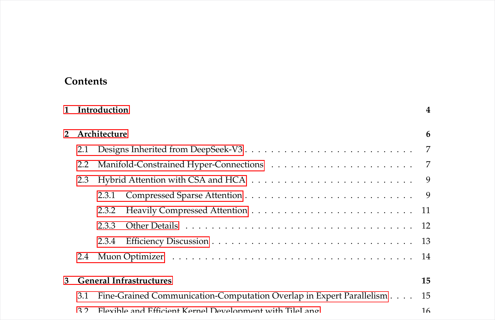
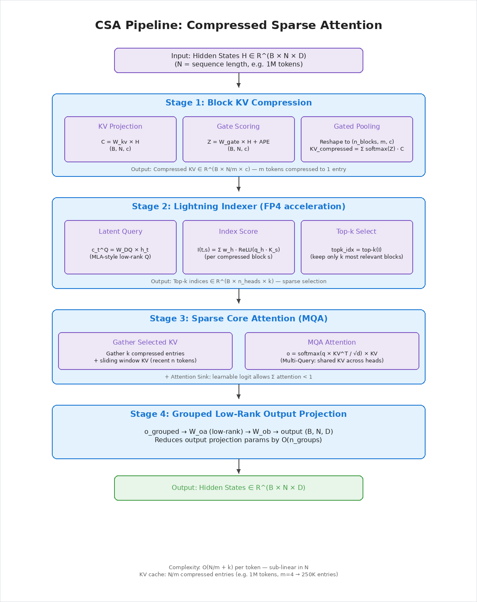
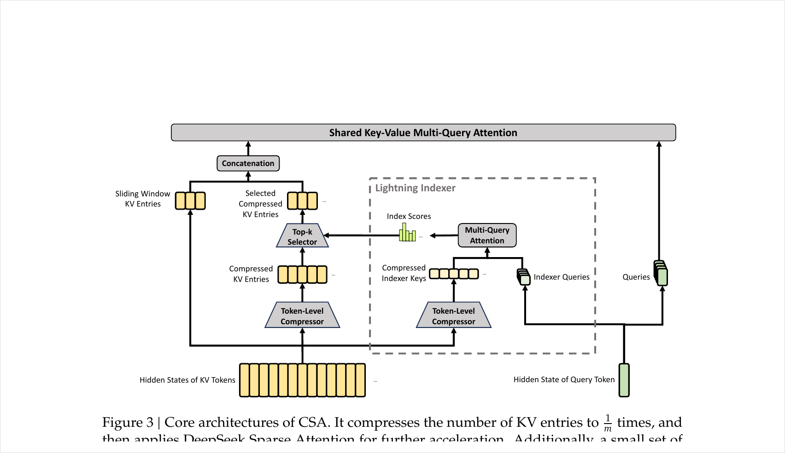
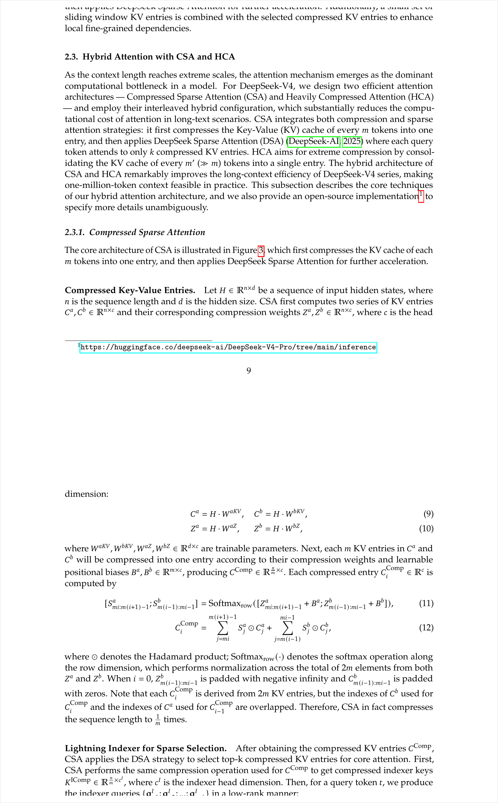
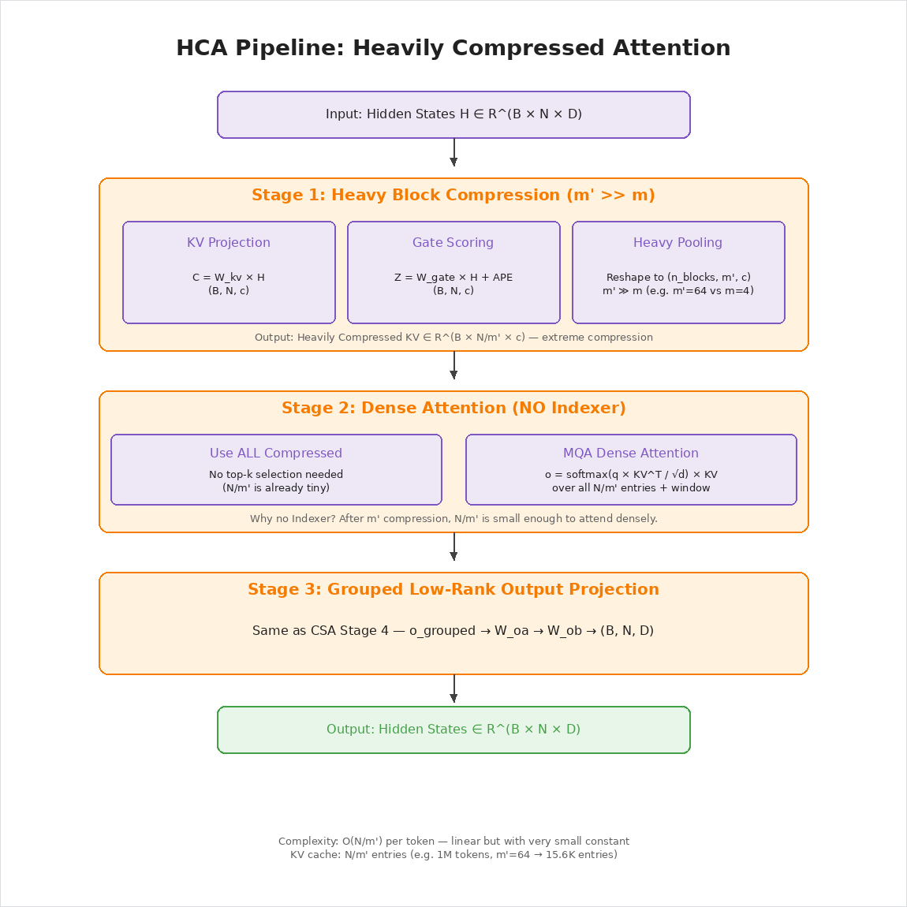
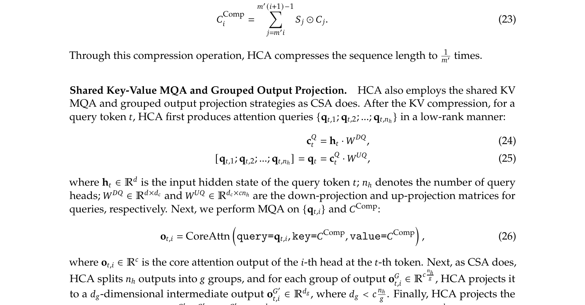
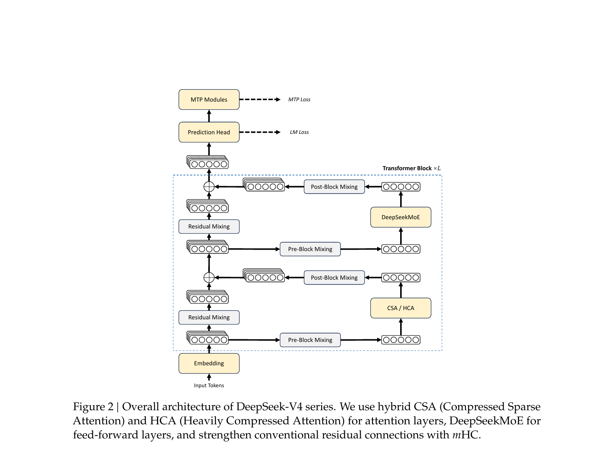
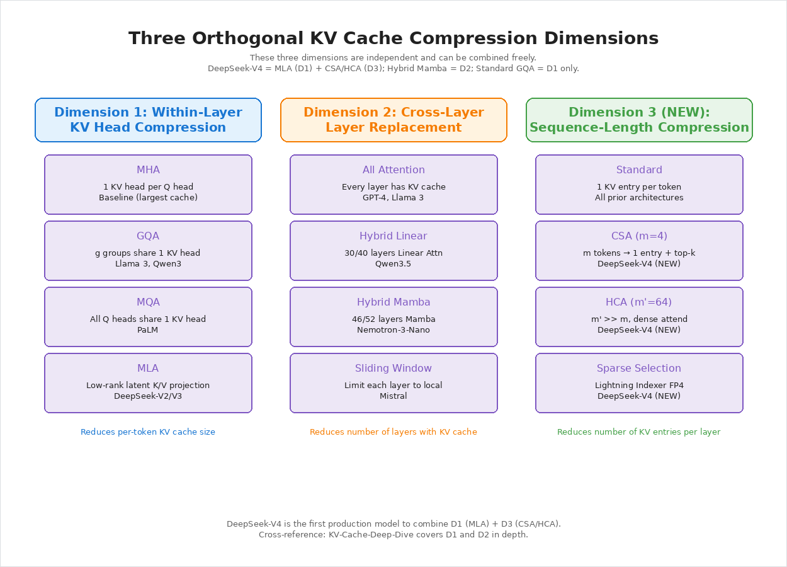

# Long-Context Efficient Attention: CSA + HCA from DeepSeek-V4

*Author: Xinyu Wei (魏新宇)*

> How DeepSeek-V4 compresses 1M-token context with Compressed Sparse Attention (CSA) and Heavily Compressed Attention (HCA) — opening the third dimension of KV cache optimization.

[中文版](README-CN.md) | [Companion: KV-Cache-Deep-Dive](https://github.com/david-xinyuwei/david-share/tree/master/Deep-Learning/KV-Cache-Deep-Dive)

## Executive Summary

| Metric | Standard MHA | CSA (m=4, k=64) | HCA (m'=64) |
|--------|:-----------:|:---------------:|:----------:|
| KV entries at 1M tokens | 1,000,000 | 250,000 (4× fewer) | 15,625 (64× fewer) |
| Per-token attention cost | O(N) | O(k) ≈ constant | O(N/m') — linear but small |
| H100 benchmark speedup @128K | baseline | **78.9×** | **27.5×** |
| Paper result: V4-Flash vs V3.2 FLOPs | — | 10% of V3.2 | (combined with CSA) |

> **Notation**: m = block size (tokens compressed into 1 entry), k = number of top blocks selected per query, m' = HCA block size. These are explained in detail in the CSA and HCA sections below.

Prior work tackled KV cache from two dimensions: within-layer compression (MHA → GQA → MQA → MLA, covered in [KV-Cache-Deep-Dive](https://github.com/david-xinyuwei/david-share/tree/master/Deep-Learning/KV-Cache-Deep-Dive#24-mha-vs-mqa-vs-gqa)) and cross-layer replacement (Hybrid Linear / Mamba, covered in [KV-Cache-Deep-Dive L3](https://github.com/david-xinyuwei/david-share/tree/master/Deep-Learning/KV-Cache-Deep-Dive#l3-four-kv-cache-reduction-architectures)). Both leave the number of KV entries per attention layer equal to N. DeepSeek-V4 opens a **third orthogonal dimension**: sequence-length compression via learned block compression and sparse top-k selection.

> **Prerequisite**: Familiarity with KV cache fundamentals (MHA / GQA / MLA). If new to these, read [KV-Cache-Deep-Dive](https://github.com/david-xinyuwei/david-share/tree/master/Deep-Learning/KV-Cache-Deep-Dive) first — this article picks up where that one ends.

## Running on Azure

This work was developed and validated on a single Azure H100 NVL VM.

| Component | Specification |
|-----------|--------------|
| **VM SKU** | [Standard_NC40ads_H100_v5](https://learn.microsoft.com/en-us/azure/virtual-machines/nc-h100-v5-series) |
| **GPU** | 1× NVIDIA H100 NVL 95 GB |
| **Purpose** | Standalone CSA/HCA module benchmarking (does not require loading the full DeepSeek-V4 model) |

---

## Background: The Long-Context Bottleneck

Why does everyone in the industry talk about "1M context" but few can actually serve it efficiently? The answer comes down to two numbers that grow uncomfortably fast.

| Resource | Growth | At 1M tokens (Qwen3-8B equivalent) |
|----------|:------:|:---------------------------------:|
| KV cache memory | O(N) | ~144 GB (BF16) |
| Attention FLOPs | O(N) per token, O(N²) total | ~250× the cost of 4K |

In [KV-Cache-Deep-Dive](https://github.com/david-xinyuwei/david-share/tree/master/Deep-Learning/KV-Cache-Deep-Dive), we measured Qwen3-8B's KV cache at 32K context: **4.5 GiB** (BF16, batch=1). Extrapolating to 1M tokens by the same formula gives ~144 GB — no single GPU can hold that. Even 8× H100 (640 GB) struggles when batch > 1.

Two dimensions of optimization were already explored:

**Dimension 1 — Within-layer compression** reduces per-token KV size. The evolution MHA → GQA → MQA → MLA (detailed in [KV-Cache-Deep-Dive, Section "MHA vs MQA vs GQA"](https://github.com/david-xinyuwei/david-share/tree/master/Deep-Learning/KV-Cache-Deep-Dive#24-mha-vs-mqa-vs-gqa)) compresses each KV entry from 2 × n_heads × d_head down to as low as 576 dimensions (MLA in DeepSeek-V2/V3). But every token in the sequence still produces one entry.

**Dimension 2 — Cross-layer replacement** reduces the number of layers that need KV cache at all. Hybrid Linear attention (Qwen3.5) and Hybrid Mamba (Nemotron-3-Nano) replace most attention layers with recurrent or linear layers (detailed in [KV-Cache-Deep-Dive, Section "Four KV Cache Reduction Architectures"](https://github.com/david-xinyuwei/david-share/tree/master/Deep-Learning/KV-Cache-Deep-Dive#l3-four-kv-cache-reduction-architectures)). But the remaining attention layers still scale as O(N).

The comparison from KV-Cache-Deep-Dive makes the gap visible:

| Architecture | KV Cache @ 32K | Reduction | Remaining Problem |
|--------------|:---------:|:---------:|-------------------|
| Qwen3-30B-A3B (GQA) | 3.00 GiB | baseline | Every token stored |
| GLM-4.7-Flash (MLA) | 1.65 GiB | −45% | Still N entries/layer |
| Qwen3.5-35B-A3B (Hybrid) | 0.625 GiB | −79% | Remaining layers still O(N) |
| Nemotron-3-Nano (Hybrid Mamba) | 0.19 GiB | −94% | Few attention layers left |

**The gap**: neither dimension compresses along the **sequence length itself**. At 1M tokens, even MLA's compact 576 dimensions × 47 layers × 1M ≈ 50 GB per request. This is exactly the gap CSA and HCA fill.

The paper's own data confirms the magnitude of this gap — and the improvement CSA/HCA brings:

<div align="center">
  
  <p><em>Source: Figure 1, DeepSeek-V4 Technical Report — CSA+HCA reduces FLOPs to 27% (Pro) / 10% (Flash) and KV cache to ~10% / ~7% vs V3.2's MLA baseline.</em></p>
</div>

---

## The Sparse Attention Family

CSA stands for **Compressed Sparse Attention** — the word "Sparse" is not decorative. It places CSA in a specific academic lineage that has been evolving since 2019, and understanding this lineage makes CSA's design choices much more intuitive.

### From Dense to Sparse

Standard (dense) attention computes scores between the query and **every** key. Sparse attention computes scores against only a **subset** of keys. The subset can be chosen in different ways:

| Generation | Method | Selection Strategy | Limitation |
|:---:|--------|-------------------|------------|
| **2019** | Sparse Transformer (Child et al.) | Fixed patterns: local window + strided | Patterns are hand-designed, not adaptive |
| **2020** | Longformer (Beltagy et al.) | Sliding window + global tokens | Still fixed; global tokens require task-specific design |
| **2020** | BigBird (Zaheer et al.) | Random + window + global | Random selection misses structure |
| **2025** | DeepSeek Sparse Attention / DSA | **Dynamic top-k** per query | Data-dependent, but operates on raw (uncompressed) KV |
| **2026** | **CSA (DeepSeek-V4)** | **Block compression + dynamic top-k** | Compression before selection — fewer candidates, faster indexing |

The key insight is the evolution from **fixed patterns** to **learned, data-dependent selection**. Early sparse attention used hand-designed patterns (every 64th token, or fixed windows). DSA made it dynamic — each query picks its own top-k keys based on content. CSA goes one step further: first compress every m tokens into one entry (reducing the candidate pool from N to N/m), then do dynamic top-k on the compressed pool.

The V4 paper explicitly states this lineage:

> *"CSA compresses the KV caches along the sequence dimension and then performs DeepSeek Sparse Attention (DSA)."*

### Why Compression Before Selection Matters

Without compression (DSA): score N entries → keep top-k → attend to k entries. Indexing cost is O(N).

With compression (CSA): compress N → N/m entries → score N/m entries → keep top-k → attend to k entries. Indexing cost drops to O(N/m).

At 1M tokens with m=4: DSA scores 1M entries; CSA scores 250K entries. The FP4 Lightning Indexer makes this 4× reduction even more impactful because FP4 scoring is memory-bound and benefits directly from fewer entries.

---

## How CSA Works

CSA operates in 4 stages. Each stage solves a specific problem in the pipeline from raw hidden states to final output. Before looking at the math, let's walk through a concrete example with real numbers to see what each stage actually does.

### Concrete Example: 128K Tokens Through CSA

Suppose we're generating the next token at position 128,001 in a conversation. The KV cache already holds 128K tokens of context. Here's what happens in a single CSA layer:

```
Input: 128,000 KV entries (one per previous token)
  │
  │ Stage 1: Block Compression (m=4)
  │   Every 4 consecutive tokens → 1 compressed entry
  │   128,000 ÷ 4 = 32,000 compressed entries
  │   Each entry: a weighted combination of 4 tokens, not a simple average
  │
  │ Stage 2: Lightning Indexer (FP4, top-k=64)
  │   Score all 32,000 entries against the current query
  │   Keep only the 64 highest-scoring entries
  │   Also keep the last 512 tokens uncompressed (sliding window)
  │
  │ Stage 3: Sparse Attention
  │   Attend to: 64 selected + 512 window = 576 entries total
  │   (instead of 128,000 — that's 222× fewer entries to attend to)
  │
  │ Stage 4: Output Projection
  ▼
Output: one vector for position 128,001
```

The key insight: from 128,000 entries, CSA narrows down to 576 — a reduction that makes long-context attention feasible on a single GPU. The cost of this narrowing is the risk of selecting the wrong 64 blocks. The sliding window ensures that at least the most recent context is never lost.

<div align="center">
  
</div>

The paper's CSA architecture diagram shows the same 4-stage pipeline in more detail:

<div align="center">
  
  <p><em>Source: Figure 3, DeepSeek-V4 Technical Report</em></p>
</div>

And here are the mathematical formulas for all CSA stages as presented in the paper:

<div align="center">
  
  <p><em>Source: Section 2.3.1 (Equations 9-19), DeepSeek-V4 Technical Report</em></p>
</div>

Now let's look at each stage in detail.

### Stage 1: Block KV Compression

**Problem**: N KV entries is too many. Compress them.

Every m consecutive tokens are compressed into a single KV entry via learned gated pooling. This is not a simple average — the model learns a **gate** that assigns different importance weights to different tokens within a block, so that the compressed entry preserves the most critical information.

**Mathematical formulation** (paper Equations 9-12):

```
For each block of m tokens [h_1, h_2, ..., h_m]:
  KV entries:    C  = W_kv  × H         # shape (B, N, c)
  Gate scores:   Z  = W_gate × H + APE  # (B, N, c), APE = learned position bias
  Reshape:       Both to (B, n_blocks, m, c)
  Pooling:       KV_compressed = Σ_i softmax(Z)_i · C_i   over i ∈ [1, m]
```

The Absolute Position Embedding (APE) is a learnable per-position-within-block bias that teaches the model which positions within a block contribute more to the compressed representation.

**Code** (official [`inference/model.py`](https://huggingface.co/deepseek-ai/DeepSeek-V4-Pro/blob/main/inference/model.py), `Compressor.forward()`):
```python
kv = self.wkv(x)              # KV projection
score = self.wgate(x)         # gate scoring
score += self.ape             # add position bias
# Reshape, then weighted pool over m tokens per block
kv = (kv * score.softmax(dim=2)).sum(dim=2)
```

### Stage 2: Lightning Indexer (Sparse Selection)

**Problem**: Even N/m entries may be too many (250K at 1M tokens). Select only the top-k most relevant.

The Lightning Indexer scores each compressed block against the current query and keeps only the top-k. It uses **FP4 precision** for scoring — this is a deliberate engineering trade-off: at the indexing stage, we only need to rank blocks roughly, not compute precise attention weights. FP4 provides sufficient ranking accuracy at 2× the throughput of FP8.

**Mathematical formulation** (paper Equations 13-17):

```
Latent Q:    c_t^Q = W_DQ × h_t                    # MLA-style low-rank Q
Index Q:     q_t^I = W_IUQ × c_t^Q                 # up-projection to indexer space
Score:       I(t,s) = Σ_h w_h · ReLU(q_h · K_s)    # per compressed block s
Selection:   topk_idx = top-k(I(t, :))             # keep only top-k blocks
```

The latent query `c_t^Q` is **shared with the main attention path** — this is the MLA inheritance. The same low-rank Q projection serves both the indexer (FP4 path) and the core attention (BF16 path).

### Stage 3: Sparse Core Attention

**Problem**: Now compute attention, but only over the selected subset.

After selecting top-k compressed blocks, CSA performs MQA (Multi-Query Attention) — all query heads share the same compressed KV.

```
Gather:    KV_selected = compressed_kv[topk_idx] ∪ window_kv
                         (k entries from sparse selection + window_size recent tokens)
Attention: o = softmax(q × KV_selected^T / √d) × KV_selected + attn_sink
```

**Attention Sink**: A learnable per-head logit that allows attention scores to sum to less than 1. This prevents the model from being forced to attend to irrelevant content when no compressed block is truly relevant.

**Sliding Window**: The recent n tokens are always included uncompressed, ensuring fine-grained local context is never lost regardless of compression quality.

### Stage 4: Grouped Low-Rank Output Projection

**Problem**: Output projection W_o ∈ R^(D × D) is expensive at large D (e.g., 7168 in V4-Pro).

CSA uses grouped low-rank decomposition:

```
Per group g:  o_g = head_outputs_g × W_oa[g]   # low-rank down-project per group
              final = concat(o_g) × W_ob        # shared up-project
```

This reduces output projection parameters by approximately O(n_groups).

### Intuition

Imagine the 1M-token context as a book with 1M pages and you have a question.

- **Standard attention**: read all 1M pages cover to cover.
- **CSA**: make a summary note every 4 pages (250K notes) → score each note against your question with a fast index (Lightning Indexer, FP4) → deep-read only the top 64 most relevant notes.

The trade-off: you might miss something if the indexer picks the wrong 64. Mitigations: the **sliding window** always keeps recent pages uncompressed, the **trained indexer** learns which notes tend to matter, and the **attention sink** lets the model abstain when nothing relevant is found.

### The `compress_ratio` Switch

In the official code, a single integer per layer determines the mechanism:

```python
self.compress_ratio = args.compress_ratios[layer_id]
```

- `compress_ratio = 4`: CSA layer (block compression + Indexer + sparse attend)
- `compress_ratio > 4` (e.g., 64): HCA layer (heavy compression, no Indexer, dense attend)
- `compress_ratio = 0`: Pure sliding window (no compression)

This leads directly to the question: why have two different mechanisms?

---

## How HCA Works

CSA's top-k=64 selection is excellent at finding the most relevant passages — but it can miss long-range global context that doesn't match any specific query. HCA solves this by maintaining a **global summary** of the entire sequence at much coarser granularity.

### Concrete Example: 128K Tokens Through HCA

Same scenario: generating token 128,001, but now in an HCA layer instead of CSA.

```
Input: 128,000 KV entries
  │
  │ Stage 1: Heavy Compression (m'=64)
  │   Every 64 consecutive tokens → 1 compressed entry
  │   128,000 ÷ 64 = 2,000 compressed entries
  │
  │ Stage 2: NO Indexer (attend to ALL)
  │   2,000 entries is small enough to attend to all of them densely
  │   Also keep sliding window (512 recent tokens)
  │
  │ Stage 3: Dense Attention
  │   Attend to: 2,000 compressed + 512 window = 2,512 entries total
  │
  │ Stage 4: Output Projection
  ▼
Output: one vector for position 128,001
```

### CSA vs HCA Side-by-Side

The fundamental trade-off becomes clear when we put them next to each other:

| Step | CSA (m=4, k=64) | HCA (m'=64) |
|------|:---------------:|:-----------:|
| Compression | 128K → **32K** entries (4×) | 128K → **2K** entries (64×) |
| Selection | Top-64 out of 32K | **None** — keep all 2K |
| Entries attended | 64 + 512 window = **576** | 2,000 + 512 window = **2,512** |
| What it's good at | Finding the **specific** paragraph that answers your question | Getting the **gist** of the entire document |
| What it misses | Globally distributed information that no single block captures | Fine-grained details within each 64-token block |

CSA is a sniper rifle — precise but narrow. HCA is a wide-angle lens — sees everything but at low resolution. Neither alone is sufficient. Together, they cover each other's blind spots.

<div align="center">
  
</div>

The paper's HCA diagram shows the simplified pipeline (no Indexer stage):

<div align="center">
  
  <p><em>Source: Figure 4, DeepSeek-V4 Technical Report</em></p>
</div>

### Key Differences from CSA

| Aspect | CSA | HCA |
|--------|-----|-----|
| Block size | m = 4 | m' = 64 (much larger) |
| Compressed entries at 1M | 250,000 | **15,625** |
| Top-k selection | Yes (k=64) | **No** — attend to all densely |
| Indexer | FP4 Lightning Indexer | None needed |
| Per-token cost | O(N/m + k) ≈ O(k) | O(N/m') |
| Strength | Precise retrieval of specific passages | Global awareness, never misses anything |
| Weakness | May miss globally distributed information | Coarse — cannot capture fine details |

**Why no Indexer for HCA?** With m'=64, 1M tokens compress to only ~15K entries. Attending to all 15K densely is cheaper than running the FP4 Indexer + top-k gather + sparse attention on 250K entries. The economics simply favor dense attention at this compression level.

### Mathematical Formulation (paper Equations 20-23)

```
Compress:  Same as CSA Stage 1, but with m' instead of m
           HCA_KV ∈ R^(B × N/m' × c)
Attention: o = softmax(q × HCA_KV^T / √d) × HCA_KV + window_kv contribution
           (no top-k, attend to ALL compressed entries + sliding window)
```

### Why CSA and HCA Alternate

DeepSeek-V4 does not use CSA or HCA exclusively — it interleaves them layer by layer. The exact pattern is configured per-layer via `args.compress_ratios[layer_id]`. A typical configuration alternates like this:

```
Layer 0:  CSA (ratio=4)   → precise search: find the 64 most relevant blocks
Layer 1:  HCA (ratio=64)  → global scan: coarse view of everything
Layer 2:  CSA (ratio=4)   → precise search with a different query
Layer 3:  HCA (ratio=64)  → another global scan
...
Layer 60: Sliding window (ratio=0) → bottom layers may skip compression entirely
```

**Why this works**: consider what happens when a user asks "What was the conclusion of the meeting on January 15th?" in a 500K-token conversation history.

- A **CSA layer** can pinpoint the January 15th meeting notes (high precision, narrow focus)
- But the model also needs to understand the broader context: what project is this about? Who are the participants? That context is spread across many meetings — no single 4-token block captures it
- An **HCA layer** in the next pass reads a coarse summary of the entire 500K history, picking up the project context that CSA missed
- The next **CSA layer** can then combine both signals: precise meeting notes + broad project context

This is why alternation outperforms either mechanism alone. Information that CSA misses at one layer can be recovered by HCA at the next, and vice versa.

The overall V4 architecture diagram shows how CSA and HCA layers interleave across the full model:

<div align="center">
  
  <p><em>Source: Figure 2, DeepSeek-V4 Technical Report</em></p>
</div>

---

## The Three Compression Dimensions

With CSA and HCA understood, we can now position them in the broader design space. There are three orthogonal dimensions for reducing KV cache, and they can be combined freely:

<div align="center">
  
</div>

| Dimension | What It Compresses | Examples | Covered In |
|:---------:|-------------------|----------|-----------|
| **D1: Within-layer** | Per-token KV size | MHA → GQA → MQA → MLA | [KV-Cache-Deep-Dive](https://github.com/david-xinyuwei/david-share/tree/master/Deep-Learning/KV-Cache-Deep-Dive#24-mha-vs-mqa-vs-gqa) |
| **D2: Cross-layer** | Number of attention layers | Hybrid Linear, Hybrid Mamba | [KV-Cache-Deep-Dive](https://github.com/david-xinyuwei/david-share/tree/master/Deep-Learning/KV-Cache-Deep-Dive#l3-four-kv-cache-reduction-architectures) |
| **D3: Sequence-length** | Number of KV entries per layer | **CSA, HCA** | **This article** |

### Combination Matrix

| Architecture | D1 | D2 | D3 | KV @ 32K |
|--------------|:--:|:--:|:--:|:--------:|
| Llama 3 | GQA | All-attention | None | 4.5 GiB |
| Qwen3-30B-A3B | GQA | All-attention | None | 3.0 GiB |
| GLM-4.7-Flash | **MLA** | All-attention | None | 1.65 GiB |
| Qwen3.5-35B-A3B | GQA | **Hybrid Linear** | None | 0.625 GiB |
| Nemotron-3-Nano | GQA | **Hybrid Mamba** | None | 0.19 GiB |
| **DeepSeek-V4** | **MLA-style latent Q** | All-attention | **CSA + HCA** | See experiment below |

(KV cache numbers from [KV-Cache-Deep-Dive](https://github.com/david-xinyuwei/david-share/tree/master/Deep-Learning/KV-Cache-Deep-Dive#35-comparison-summary) calculations using HuggingFace config.json parameters.)

DeepSeek-V4 is the **first production model to use Dimension 3**. The dimensions are orthogonal — future architectures could theoretically combine CSA/HCA with Hybrid Mamba, attacking all three dimensions simultaneously.

### Asymptotic Complexity

| Mechanism | KV Cache Storage | Attention FLOPs per Token |
|-----------|:----------------:|:-------------------------:|
| Standard MHA | O(N) | O(N) per token |
| MLA | O(N), smaller per-entry | O(N) |
| **CSA (m, k)** | **O(N/m)** | **O(N/m + k) ≈ O(k)** when k constant |
| **HCA (m')** | **O(N/m')** | **O(N/m')** |

At 1M tokens with m=4, k=64, m'=64:
- CSA: 250K entries stored, but only 64 attended → per-token cost ≈ constant
- HCA: 15.6K entries stored and all attended → per-token cost = 15.6K (vs 1M for MHA)

### KV Cache Compression Factor Breakdown

Our standalone benchmark measures 64× total KV compression for CSA. But this has multiple sources — be careful not to attribute all gains to CSA alone:

| Factor | Compression | CSA-Specific? |
|--------|:-----------:|:-------------:|
| Block compression (m tokens → 1 entry) | 4× | **Yes — core CSA contribution** |
| MQA (n_heads → 1 shared KV) | 8× (typical) | No — standard MQA technique |
| K+V merged storage | 2× | No — implementation detail |
| **Total** | **64×** | **Only 4× is unique to CSA** |

For fair comparison with the paper (which uses MLA as baseline): CSA adds ~4× per-layer on top of whatever D1 compression already exists.

The theory is clear — CSA and HCA should be dramatically faster at long context and essentially free at short context (with some overhead). Let's verify this on real hardware.

---

## Experiment: Standalone Benchmark on H100

We implemented CSA, HCA, and standard MHA from scratch in PyTorch and benchmarked on Azure H100 NVL. This validates **algorithm-level engineering properties** (compression ratio, speed scaling), not end-to-end model quality.

### Setup

| Parameter | Value |
|-----------|-------|
| GPU | NVIDIA H100 NVL 95 GB (Azure NC40ads_H100_v5) |
| Framework | PyTorch 2.7, BF16 |
| Hidden dim | 512 |
| Heads | 8 |
| CSA m | 4 |
| HCA m' | 64 |
| CSA top-k | 64 |
| Sequence lengths | 1K, 4K, 16K, 32K, 64K, 128K |
| Timing | Warmup 3 + median of 10 runs |
| Standard MHA baseline | Uses `F.scaled_dot_product_attention` (FlashAttention 2 on H100) |
| CSA/HCA implementation | Naive PyTorch (no custom CUDA kernels) |

Code: [`scripts/standalone_csa_benchmark.py`](scripts/standalone_csa_benchmark.py)
Data: [`data/csa_benchmark_results.json`](data/csa_benchmark_results.json)

### Results

| Seq Len | MHA KV | CSA KV | HCA KV | MHA Time | CSA Time | HCA Time | CSA Speedup | HCA Speedup |
|--------:|:------:|:------:|:------:|:--------:|:--------:|:--------:|:-----------:|:-----------:|
| 1K | 2.1 MB | 0.03 MB | 0.00 MB | 0.12 ms | 0.28 ms | 0.18 ms | 0.4× | 0.7× |
| 4K | 8.4 MB | 0.13 MB | 0.01 MB | 0.22 ms | 0.28 ms | 0.18 ms | 0.8× | 1.2× |
| 16K | 33.6 MB | 0.52 MB | 0.03 MB | 1.37 ms | 0.28 ms | 0.20 ms | **4.9×** | **6.9×** |
| 32K | 67.1 MB | 1.05 MB | 0.07 MB | 4.61 ms | 0.36 ms | 0.34 ms | **12.8×** | **13.6×** |
| 64K | 134 MB | 2.10 MB | 0.13 MB | 18.5 ms | 0.58 ms | 0.87 ms | **32.0×** | **21.3×** |
| 128K | 268 MB | 4.19 MB | 0.26 MB | 73.4 ms | 0.93 ms | 2.67 ms | **78.9×** | **27.5×** |

```mermaid
xychart-beta
    title "Forward Pass Time on H100 NVL"
    x-axis ["1K", "4K", "16K", "32K", "64K", "128K"]
    y-axis "Time (ms)" 0 --> 80
    bar "Standard MHA" [0.12, 0.22, 1.37, 4.61, 18.5, 73.4]
    bar "CSA (m=4)" [0.28, 0.28, 0.28, 0.36, 0.58, 0.93]
    bar "HCA (m=64)" [0.18, 0.18, 0.20, 0.34, 0.87, 2.67]
```



### Analysis

1. **Sub-linear scaling confirmed**: CSA forward time grows from 0.28ms (1K) to 0.93ms (128K) — only 3.3× increase for 128× longer sequence. This matches the O(N/m + k) prediction where k=64 dominates.

2. **Crossover point ~8K**: Below 8K tokens, CSA is slower than standard MHA due to compression and indexing overhead. Above 8K, CSA wins by an increasing margin. This aligns with the production guidance: CSA/HCA targets long-context workloads, not short prompts.

3. **CSA vs HCA at extreme lengths**: At 128K, CSA (0.93ms) is 2.9× faster than HCA (2.67ms). This is because CSA's top-k=64 keeps attention cost constant while HCA's O(N/m') still grows linearly (128K/64 = 2K entries all attended).

4. **HCA advantage at medium lengths**: At 16K-32K, HCA matches or beats CSA because the overhead of running the Lightning Indexer + top-k gather exceeds the savings from sparse selection when N/m' is already small.

5. **KV cache compression is exact**: CSA always achieves 64× and HCA always achieves 1024× compression, independent of sequence length — this is a deterministic property of the algorithm, not data-dependent.

### Limitations

1. **No quality verification**: Random weights — Compressor and Indexer have no learned ability to preserve relevant information. Quality preservation depends entirely on training.
2. **Baseline uses FlashAttention 2**: Standard MHA automatically uses FlashAttention 2 on H100. CSA/HCA use naive PyTorch — the speedup comes from less computation, not better kernels.
3. **Small dimensions**: dim=512, 8 heads vs production dim=7168+, 128+ heads. Results validate scaling trends but don't directly extrapolate to production numbers.
4. **Random Indexer**: Our Indexer uses mean-query dot product. The real Lightning Indexer uses learned per-head FP4 weights with QAT.
5. **No sliding window**: Production CSA includes a sliding window branch for recent tokens — we omitted this for isolation.

---

## Quality Evidence from the Paper

Speed and memory savings mean nothing if the model's output quality collapses. We cannot verify quality directly with random weights (a randomly initialized compressor has no idea what to preserve), but the DeepSeek-V4 Technical Report provides strong indirect evidence that **trained** CSA/HCA preserves quality despite aggressive compression:

| Benchmark | V3.2-Base (MLA, 37B activated) | V4-Flash-Base (CSA+HCA, 13B activated) | V4-Pro-Base (CSA+HCA, 49B activated) |
|-----------|:-----:|:-----:|:-----:|
| MMLU | 87.8 | 88.7 | **90.1** |
| MMLU-Pro | 65.5 | 68.3 | **73.5** |
| GSM8K | 91.1 | 90.8 | **92.6** |
| HumanEval | 62.8 | 69.5 | **76.8** |

> *"DeepSeek-V4-Flash-Base already surpasses DeepSeek-V3.2-Base across a majority of benchmarks with its more parameter-efficient design."* — Section 1, DeepSeek-V4 Technical Report

V4-Flash uses **13B activated parameters + CSA/HCA** to match or exceed V3.2's **37B activated + MLA**. This demonstrates that trained block compression + sparse selection can not only maintain quality but actually improve it (likely due to the complementary CSA/HCA alternation providing both precision and global awareness).

---

## Production Considerations

### When to Use CSA/HCA

| Scenario | Recommendation |
|----------|---------------|
| Context < 8K, quality-critical | Standard MHA / GQA / MLA — CSA overhead exceeds savings |
| Context 8K-128K, balanced | MLA + Hybrid Mamba (Nemotron-3-Nano style) — proven and simpler |
| Context 128K-1M, production scale | **CSA + HCA + MLA** (DeepSeek-V4 style) |
| Exact token-level recall required | CSA/HCA may lose information — verify with downstream evaluation |

### Technology Stack in DeepSeek-V4

| Component | Choice | Why |
|-----------|--------|-----|
| Q projection | MLA-style low-rank latent | Inherited from V3, proven |
| KV compression | CSA/HCA blocks + APE | V4's core innovation |
| Layer pattern | Alternating CSA/HCA | Focused retrieval + global view |
| Local context | Sliding window branch | Preserves fine-grained recent tokens |
| Indexer precision | FP4 (MXFP4) | 2× speedup + QAT for accuracy |
| Output projection | Grouped low-rank | Reduces params at large hidden dim |

### What CSA/HCA Cannot Replace

CSA/HCA is **complementary to**, not a replacement for, other dimensions:

- **Hybrid Mamba** eliminates KV cache entirely for some layers — a different solution path. They can theoretically combine: Mamba layers + CSA attention layers.
- **MLA** provides the latent Q that CSA's Lightning Indexer depends on. Removing MLA would require redesigning Stage 2.
- **Sliding window** is critical for short-range dependencies. CSA/HCA alone lose token-level locality.

### Implementation Complexity

| Component | Complexity | Production-Ready? |
|-----------|:----------:|:-----------------:|
| Standard MHA + KV cache | Low | ✅ Universal |
| GQA / MQA | Low | ✅ Llama 3, Qwen3 |
| MLA | Medium | ✅ DeepSeek-V2/V3 |
| Hybrid Linear / Mamba | High | ✅ Qwen3.5, Nemotron-3 |
| **CSA + HCA + Lightning Indexer (FP4)** | **Very High** | **Currently only DeepSeek-V4** |

The Lightning Indexer with FP4 QAT is the hardest piece — requiring custom Triton kernels (`kernel.py`, 22KB in DeepSeek's open-source code). This is why, as of mid-2026, only DeepSeek has shipped this in production.

For readers who want to trace the implementation details, here is a walkthrough of the official code.

---

## Code Reference

The official implementation is at [`inference/model.py`](https://huggingface.co/deepseek-ai/DeepSeek-V4-Pro/blob/main/inference/model.py) (827 lines, MIT License).

| Class | Lines | Role |
|-------|:-----:|------|
| `Compressor` | 283-382 | Block KV compression via gated pooling |
| `Indexer` | 384-434 | Lightning Indexer for sparse top-k selection |
| `Attention` | 436-558 | Full attention: MLA + CSA/HCA + sliding window |

An interesting detail: the `Attention` class docstring calls itself "Multi-head Latent Attention (MLA)" — confirming that CSA/HCA is built **on top of** MLA, not replacing it. The latent Q/KV projections (`wq_a → q_norm → wq_b`) are MLA's signature, and CSA adds the block compression and sparse selection stages around them.

---

## Cross-References

This article is part of a series on attention mechanisms and KV cache optimization. The knowledge builds progressively:

| Topic | Where to Read | Relationship |
|-------|--------------|-------------|
| KV cache fundamentals (What/Why/How big) | [KV-Cache-Deep-Dive](https://github.com/david-xinyuwei/david-share/tree/master/Deep-Learning/KV-Cache-Deep-Dive) | **Prerequisite** — start here if unfamiliar |
| MHA → GQA → MQA → MLA evolution | [KV-Cache-Deep-Dive, "MHA vs MQA vs GQA"](https://github.com/david-xinyuwei/david-share/tree/master/Deep-Learning/KV-Cache-Deep-Dive#24-mha-vs-mqa-vs-gqa) | Dimension 1 context |
| Hybrid Linear / Mamba architectures | [KV-Cache-Deep-Dive, "Four Reduction Architectures"](https://github.com/david-xinyuwei/david-share/tree/master/Deep-Learning/KV-Cache-Deep-Dive#l3-four-kv-cache-reduction-architectures) | Dimension 2 context |
| FlashAttention vs PagedAttention | [KV-Cache-Deep-Dive, Appendix A](https://github.com/david-xinyuwei/david-share/tree/master/Deep-Learning/KV-Cache-Deep-Dive#appendix-a-score-matrix--flashattention--pagedattention) | Compute optimization (orthogonal) |
| **Sequence-length compression (CSA + HCA)** | **This article** | **Dimension 3** |

## References

- DeepSeek-AI. (2026). *DeepSeek-V4: Towards Highly Efficient Million-Token Context Intelligence*. Technical Report. [PDF](https://huggingface.co/deepseek-ai/DeepSeek-V4-Pro/blob/main/DeepSeek_V4.pdf)
- Official inference code: [DeepSeek-V4-Pro/inference/model.py](https://huggingface.co/deepseek-ai/DeepSeek-V4-Pro/tree/main/inference) (MIT License)
- Child, R. et al. (2019). *Generating Long Sequences with Sparse Transformers*. arXiv:1904.10509
- Beltagy, I. et al. (2020). *Longformer: The Long-Document Transformer*. arXiv:2004.05150
- Zaheer, M. et al. (2020). *Big Bird: Transformers for Longer Sequences*. arXiv:2007.14062
- DeepSeek-AI. (2024). *DeepSeek-V2: A Strong, Economical, and Efficient Mixture-of-Experts Language Model*. arXiv:2405.04434 (introduced MLA)
- DeepSeek-AI. (2025). *DeepSeek-V3 Technical Report*. arXiv:2412.19437
- Shazeer, N. (2019). *Fast Transformer Decoding: One Write-Head is All You Need*. arXiv:1911.02150 (MQA)
- Ainslie, J. et al. (2023). *GQA: Training Generalized Multi-Query Transformer Models from Multi-Head Checkpoints*. arXiv:2305.13245
- Companion article: [KV-Cache-Deep-Dive](https://github.com/david-xinyuwei/david-share/tree/master/Deep-Learning/KV-Cache-Deep-Dive) (covers Dimensions 1 and 2)

---

## Project Information

| Item | Value |
|------|-------|
| Author | 魏新宇 (Xinyu Wei) |
| Date | 2026-05 |
| Verified On | Azure H100 NVL 95 GB (Korea Central) |
| Source | DeepSeek-V4 Technical Report + open-source inference code |
| Companion | [KV-Cache-Deep-Dive](https://github.com/david-xinyuwei/david-share/tree/master/Deep-Learning/KV-Cache-Deep-Dive) (Dimensions 1 and 2) |

*This article is part of the [DL-Algorithm-Insights](https://github.com/david-xinyuwei/david-share/tree/master/DL-Algorithm-Insights) series — real GPU experiments explaining deep learning algorithms.*
