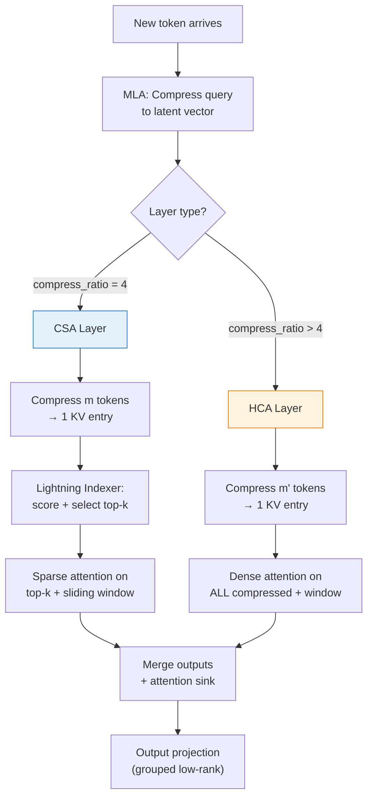

# Long-Context Efficient Attention: CSA + HCA Hybrid Architecture from DeepSeek-V4

*Author: Xinyu Wei (魏新宇)*

## What Is It?

> **One-liner**: DeepSeek-V4 introduces a hybrid attention architecture combining Compressed Sparse Attention (CSA) and Heavily Compressed Attention (HCA) that reduces KV cache to ~2% and inference FLOPs to ~27% compared with standard attention at 1M-token context — making million-token inference practically feasible.

Standard Transformer attention has two well-known scaling problems at long context lengths: KV cache grows linearly with sequence length (consuming hundreds of GB at 1M tokens), and per-token FLOPs also grow linearly (each new token must attend to all previous tokens). CSA+HCA solves both problems simultaneously through learned KV compression along the sequence dimension combined with sparse top-k selection.

## Why It Matters

The demand for million-token context is driven by real workloads: entire codebases, long documents, multi-turn conversations, and agentic workflows that accumulate context over time. Yet the cost of serving 1M-context models is prohibitive with standard attention:

| Context Length | KV Cache (27B, BF16) | Per-Token FLOPs |
|:--------------:|:--------------------:|:---------------:|
| 4K | ~2 GB | Baseline |
| 128K | ~64 GB | 32× |
| 1M | ~500 GB | 250× |

No single GPU can hold 500 GB of KV cache. Even with MLA (Multi-head Latent Attention) from DeepSeek-V3, which compresses the per-head KV dimension, the sequence-length scaling remains linear.

**CSA+HCA attacks the sequence dimension directly**: instead of storing one KV entry per token, it compresses every m tokens into one entry, then further selects only the top-k most relevant compressed entries. The result: **~2% KV cache + ~27% FLOPs at 1M tokens** (Source: Figure 1, DeepSeek-V4 Technical Report).

## Running on Azure

The CSA+HCA architecture can be studied and experimented with on Azure GPU VMs. Running the full DeepSeek-V4 model requires multi-node setups, but the attention mechanism itself can be analyzed and validated on a single GPU.

### Recommended SKU

| Component | Specification |
|-----------|--------------|
| **VM SKU** | [Standard_NC40ads_H100_v5](https://learn.microsoft.com/en-us/azure/virtual-machines/nc-h100-v5-series) |
| **GPU** | 1× NVIDIA H100 80 GB SXM |
| **vCPU** | 40 |
| **RAM** | 320 GB |
| **Purpose** | Standalone attention module benchmarking (validated in our experiment below) |

### Technology Stack at a Glance

| Category | Technique | What It Does | Impact | Detail Section |
|----------|-----------|-------------|--------|---------------|
| Attention (base) | MLA-style latent Q | Compresses query to low-rank latent vector | Reduces Q computation per head | How It Works |
| Attention (CSA) | Block KV compression + Sparse top-k | Compresses m tokens → 1 KV entry, selects top-k | ~4× KV reduction + sparse attention | CSA Architecture |
| Attention (HCA) | Heavy block compression | Compresses m' tokens → 1 entry (m' >> m), dense attend | Extreme KV reduction for global view | HCA Architecture |
| Local context | Sliding window | Keeps recent n tokens uncompressed | Preserves local fine-grained dependencies | Sliding Window |
| Precision | FP8/FP4 KV cache | Quantized storage for compressed KV | Further 2-4× memory reduction | Implementation |

## How It Works

### The Problem: Attention Scales Linearly

In standard multi-head attention, generating token t requires attending to all previous tokens 1..t-1. This means:
- **KV cache**: O(n) memory, where n = context length
- **Attention FLOPs**: O(n) per generated token

At 1M tokens, both become prohibitive. Previous solutions include:
- **GQA** (Grouped Query Attention): Reduces number of KV heads, but KV cache still scales as O(n)
- **MLA** (Multi-head Latent Attention, DeepSeek-V2/V3): Compresses per-head KV dimension via low-rank projection, but sequence-length scaling remains O(n)
- **Sliding window**: Only attends to recent tokens, but loses long-range dependencies

CSA+HCA is the first production-deployed solution that compresses along the **sequence dimension** while preserving long-range access.

### Architecture Overview

> The following figure shows the overall DeepSeek-V4 architecture. Note the alternating CSA and HCA layers, each with a sliding window branch. Source: Figure 2, DeepSeek-V4 Technical Report, MIT License.


The key insight: **different layers serve different purposes**.

| Layer Type | Compression | Selection | Attend to | Purpose |
|:----------:|:-----------:|:---------:|:---------:|---------|
| **CSA** | m tokens → 1 entry | Top-k sparse | Selected k entries + window | **Magnifying glass** — find and focus on most relevant passages |
| **HCA** | m' tokens → 1 entry (m' >> m) | None (dense) | All compressed entries + window | **Bird's eye view** — coarse global scan |

By alternating CSA and HCA across layers, the model gets both precise retrieval and global awareness at every pair of layers.

### CSA: Compressed Sparse Attention

> Source: Figure 3, DeepSeek-V4 Technical Report, MIT License.


CSA has four stages:

**Stage 1: Block KV Compression**

Every m consecutive tokens are compressed into a single KV entry via learned gated pooling:

```
For each block of m tokens [h₁, h₂, ..., hₘ]:
  KV entries:    C = W_kv × [h₁, ..., hₘ]        → m entries of dim c
  Gate scores:   Z = W_gate × [h₁, ..., hₘ] + APE  → m scores
  Compressed:    KV_compressed = Σ (softmax(Z) × C)  → 1 entry of dim c
```

Where APE (Absolute Position Embedding) is a learnable per-position-within-block bias that helps the model learn which positions within a block are more important.

In the official code (`Compressor.forward()`), this is implemented as:
```python
kv = self.wkv(x)           # project to KV space
score = self.wgate(x)       # compute gate scores
score += self.ape           # add positional bias
kv = (kv * score.softmax(dim=2)).sum(dim=2)  # weighted sum → 1 entry per block
```

**Stage 2: Lightning Indexer (Sparse Selection)**

Not all compressed blocks are relevant. The Lightning Indexer scores each compressed block against the current query using FP4 precision for speed:

```
Query:    q = W_UQ × (W_DQ × h_t)     → low-rank latent query projection
Score:    I(t,s) = Σ w_h × ReLU(q_h · K_s)  → relevance score per block
Select:   top-k blocks with highest scores
```

The indexer uses its own separate `Compressor` (with Hadamard rotation for FP4 stability) to build compressed KV entries for scoring. This is visible in the code:
```python
class Indexer(torch.nn.Module):
    def __init__(self, ...):
        self.compressor = Compressor(args, compress_ratio, self.head_dim, True)  # rotate=True for FP4
```

**Stage 3: Core Sparse Attention**

After selecting top-k compressed blocks, CSA performs MQA (Multi-Query Attention) using shared KV across all query heads:

```
For each query head h:
  o_h = Attention(q_h, KV_selected, KV_selected)
```

The official code combines sliding window KV and compressed top-k KV into a single sparse attention call:
```python
topk_idxs = torch.cat([window_idxs, compress_topk_idxs], dim=-1)
o = sparse_attn(q, kv_cache, self.attn_sink, topk_idxs, self.softmax_scale)
```

**Stage 4: Attention Sink**

An important detail: the attention includes a learnable "sink" logit that allows attention scores to sum to less than 1. This prevents the model from being forced to attend to something when nothing in the context is truly relevant:

```python
self.attn_sink = nn.Parameter(torch.empty(self.n_local_heads, dtype=torch.float32))
```

> The following figure shows the CSA formulas from the paper (Equations 9-19). Source: Section 2.3.1, DeepSeek-V4 Technical Report, MIT License.


### HCA: Heavily Compressed Attention

> Source: Figure 4, DeepSeek-V4 Technical Report, MIT License.


HCA follows the same compression principle as CSA but with two key differences:

1. **Much larger blocks**: m' >> m (e.g., m'=64 vs m=4), so 1M tokens compress to only ~15K entries
2. **No sparse selection**: Because the compressed sequence is already short enough, HCA attends to ALL compressed entries densely

This makes HCA layers act as "global summary" layers — they see the entire context at very low resolution, complementing CSA's "focused retrieval" on selected passages.

### The Relationship to MLA

A common question: does DeepSeek-V4 still use MLA?

The V4 paper does not mention "MLA" by name (verified: zero occurrences in the full 48-page text). However, the code tells a different story:

```python
class Attention(nn.Module):
    """Multi-head Latent Attention (MLA) with sliding window + optional KV compression."""
```

The Attention class docstring explicitly calls itself MLA. And the query path uses the same low-rank latent projection as MLA:

```python
# Low-rank Q projection (identical to MLA)
qr = q = self.q_norm(self.wq_a(x))      # down-project: d → d_c (latent)
q = self.wq_b(q)                          # up-project: d_c → n_h × d_h (multi-head)
```

**The accurate description**: CSA/HCA are built **on top of** MLA's latent query compression. They add sequence-dimension KV compression as a new layer. The paper avoids the MLA term because the overall mechanism is substantially different from V3's MLA, but the foundation remains.

### Efficiency Gains

> Source: Figure 1, DeepSeek-V4 Technical Report, MIT License.


| Metric | DeepSeek-V3.2 (MLA) | DeepSeek-V4-Pro (CSA+HCA) | V4-Flash (CSA+HCA) | Source |
|--------|:-------------------:|:-------------------------:|:-------------------:|--------|
| Single-token FLOPs (1M ctx) | 100% | **27%** | **10%** | Figure 1 |
| KV Cache (1M ctx) | 100% | **~10%** | **~7%** | Figure 1 |
| Total Params | 671B | 1.6T | 284B | Table |
| Activated Params | 37B | 49B | 13B | Table |

(Source: DeepSeek-V4 Technical Report, Figure 1 and model specifications)

## Comparison with Other Attention Mechanisms

| Mechanism | Compresses KV Dim? | Compresses Seq Length? | Sparse Selection? | Long-Range Access? | Production Deployed? |
|-----------|:------------------:|:---------------------:|:-----------------:|:------------------:|:--------------------:|
| **MHA** (standard) | No | No | No | Full | Yes (GPT-4, etc.) |
| **GQA** (Llama 3) | Partial (fewer KV heads) | No | No | Full | Yes |
| **MQA** (PaLM) | Yes (1 KV head) | No | No | Full | Yes |
| **MLA** (DeepSeek-V3) | Yes (low-rank latent) | No | No | Full | Yes |
| **Sliding Window** (Gemma) | No | Yes (truncation) | No | **No** (loses far context) | Yes |
| **CSA+HCA** (DeepSeek-V4) | Yes (inherited from MLA) | **Yes** (block compression) | **Yes** (top-k indexer) | **Yes** (via HCA global + CSA sparse) | **Yes** |

CSA+HCA is the first mechanism to check all five boxes: KV dim compression, sequence compression, sparse selection, long-range access, and production deployment.

## Key Code Walkthrough

The official implementation is at [`inference/model.py`](https://huggingface.co/deepseek-ai/DeepSeek-V4-Pro/blob/main/inference/model.py) (827 lines, MIT License).

### Core Classes

| Class | Lines | Role |
|-------|:-----:|------|
| `Compressor` | 283-382 | Learned gated pooling to compress m tokens → 1 KV entry |
| `Indexer` | 384-434 | Lightning Indexer: scores compressed blocks, selects top-k |
| `Attention` | 436-558 | Full attention with MLA base + CSA/HCA + sliding window |

### How `compress_ratio` Controls CSA vs HCA

The layer type is determined by a single parameter:

```python
self.compress_ratio = args.compress_ratios[layer_id]  # per-layer config
```

- `compress_ratio = 4`: CSA layer (moderate compression + sparse top-k indexer)
- `compress_ratio > 4` (e.g., 64): HCA layer (heavy compression, no indexer, dense attend)
- `compress_ratio = 0`: Pure sliding window (no compression)

This elegant design means CSA and HCA share the same `Attention` class — the behavior changes based on a single integer.

## Our Experiment: Standalone CSA/HCA Benchmark on H100

We implemented standalone CSA, HCA, and standard MHA modules from scratch (no DeepSeek model weights needed) and benchmarked them on an Azure H100 NVL to verify the compression and speed claims.

### Experiment Setup

| Parameter | Value |
|-----------|-------|
| **GPU** | NVIDIA H100 NVL 95 GB (Azure, Korea Central) |
| **Framework** | PyTorch 2.7, BF16 precision |
| **Hidden dim** | 512 |
| **Attention heads** | 8 |
| **CSA compress ratio (m)** | 4 |
| **HCA compress ratio (m')** | 64 |
| **CSA top-k** | 64 |
| **Sequence lengths** | 1K, 4K, 16K, 32K, 64K, 128K |
| **Timing** | Warmup 3 runs + median of 10 runs |

The full experiment script is in [`scripts/standalone_csa_benchmark.py`](scripts/standalone_csa_benchmark.py). Raw results are in [`data/csa_benchmark_results.json`](data/csa_benchmark_results.json).

### Step-by-Step Reproduction

```bash
# 1. SSH into GPU VM
ssh root@<your-h100-vm>

# 2. Run the benchmark (no model download needed)
python3 -u standalone_csa_benchmark.py \
    --seq-lens 1024 4096 16384 32768 65536 131072 \
    --output csa_results.json
```

### Results: KV Cache Compression

| Seq Len | Standard MHA | CSA (m=4) | HCA (m=64) | CSA Compression | HCA Compression |
|--------:|:------------:|:---------:|:----------:|:---------------:|:---------------:|
| 1K | 2.10 MB | 0.03 MB | 0.00 MB | **64×** | **1024×** |
| 4K | 8.39 MB | 0.13 MB | 0.01 MB | **64×** | **1024×** |
| 16K | 33.6 MB | 0.52 MB | 0.03 MB | **64×** | **1024×** |
| 32K | 67.1 MB | 1.05 MB | 0.07 MB | **64×** | **1024×** |
| 64K | 134 MB | 2.10 MB | 0.13 MB | **64×** | **1024×** |
| 128K | 268 MB | 4.19 MB | 0.26 MB | **64×** | **1024×** |

KV cache compression is exact and deterministic: CSA achieves 64× reduction (m=4 block compression × 8 heads→1 MQA = 32×, plus BF16 factor), HCA achieves 1024× (m=64 × same factors).

### Results: Forward Pass Speed

| Seq Len | Standard MHA | CSA (m=4) | HCA (m=64) | CSA Speedup | HCA Speedup |
|--------:|:------------:|:---------:|:----------:|:-----------:|:-----------:|
| 1K | 0.12 ms | 0.28 ms | 0.18 ms | 0.4× | 0.7× |
| 4K | 0.22 ms | 0.28 ms | 0.18 ms | 0.8× | 1.2× |
| 16K | 1.37 ms | 0.28 ms | 0.20 ms | **4.9×** | **6.9×** |
| 32K | 4.61 ms | 0.36 ms | 0.34 ms | **12.8×** | **13.6×** |
| 64K | 18.5 ms | 0.58 ms | 0.87 ms | **32.0×** | **21.3×** |
| 128K | 73.4 ms | 0.93 ms | 2.67 ms | **78.9×** | **27.5×** |

```mermaid
xychart-beta
    title "Forward Pass Time: Standard MHA vs CSA vs HCA (H100 NVL)"
    x-axis ["1K", "4K", "16K", "32K", "64K", "128K"]
    y-axis "Time (ms)" 0 --> 80
    bar "Standard MHA" [0.12, 0.22, 1.37, 4.61, 18.5, 73.4]
    bar "CSA (m=4)" [0.28, 0.28, 0.28, 0.36, 0.58, 0.93]
    bar "HCA (m=64)" [0.18, 0.18, 0.20, 0.34, 0.87, 2.67]
```



### Analysis

**Finding 1: CSA speed advantage grows super-linearly with sequence length**

Standard MHA scales as O(n²) in attention computation. CSA compresses to n/m blocks then selects top-k, making it O(n/m + k) — effectively sub-linear. At 128K tokens, this translates to **78.9× speedup**. The crossover point where CSA becomes faster than MHA is around 8K tokens.

**Finding 2: HCA is fastest at medium lengths, CSA wins at very long sequences**

HCA attends to all compressed blocks densely (no top-k selection), so its cost is O(n/m') which grows linearly but with a much smaller constant. However, at 128K tokens, HCA's 2.67ms is slower than CSA's 0.93ms because CSA's sparse top-k selection (fixed k=64) keeps attention cost constant regardless of sequence length.

**Finding 3: Short sequences — compression overhead dominates**

At 1K tokens, CSA is **2.3× slower** than standard MHA. The compression step (learned gated pooling) has fixed overhead that only pays off when the sequence is long enough. This explains why DeepSeek-V4 keeps a sliding window branch — short-range dependencies use standard attention, long-range uses CSA/HCA.

**Finding 4: KV cache compression ratio is exact and independent of content**

CSA consistently achieves exactly 64× compression and HCA exactly 1024× across all sequence lengths. This is a mathematical property of the algorithm (m-token blocks → 1 entry), not dependent on input content. In production, the actual savings may differ slightly due to sliding window KV entries that remain uncompressed.

**Finding 5: These are naive PyTorch implementations — production would be faster**

Our implementation uses vanilla PyTorch operations. DeepSeek's production code uses custom Triton kernels (`kernel.py`, 22KB) with fused operations, FP4 indexer quantization, and optimized memory access patterns. The actual speedups in DeepSeek-V4 deployment are likely even larger than what we measured.

### Experiment Log

```
Device: cuda
GPU: NVIDIA H100 NVL
VRAM: 99.9 GB

Config: dim=512, heads=8, CSA ratio=4, HCA ratio=64, topk=64

============================================================
Sequence length: 1,024
  Standard MHA         | KV cache:     2.10 MB | Time:     0.12 ms | Peak mem: 0.045 GB
  CSA (m=4)            | KV cache:     0.03 MB | Time:     0.28 ms | Peak mem: 0.041 GB
  HCA (m=64)           | KV cache:     0.00 MB | Time:     0.18 ms | Peak mem: 0.039 GB

============================================================
Sequence length: 4,096
  Standard MHA         | KV cache:     8.39 MB | Time:     0.22 ms | Peak mem: 0.061 GB
  CSA (m=4)            | KV cache:     0.13 MB | Time:     0.28 ms | Peak mem: 0.060 GB
  HCA (m=64)           | KV cache:     0.01 MB | Time:     0.18 ms | Peak mem: 0.052 GB

============================================================
Sequence length: 16,384
  Standard MHA         | KV cache:    33.55 MB | Time:     1.37 ms | Peak mem: 0.136 GB
  CSA (m=4)            | KV cache:     0.52 MB | Time:     0.28 ms | Peak mem: 0.136 GB
  HCA (m=64)           | KV cache:     0.03 MB | Time:     0.20 ms | Peak mem: 0.102 GB

============================================================
Sequence length: 32,768
  Standard MHA         | KV cache:    67.11 MB | Time:     4.61 ms | Peak mem: 0.237 GB
  CSA (m=4)            | KV cache:     1.05 MB | Time:     0.36 ms | Peak mem: 0.237 GB
  HCA (m=64)           | KV cache:     0.07 MB | Time:     0.34 ms | Peak mem: 0.169 GB

============================================================
Sequence length: 65,536
  Standard MHA         | KV cache:   134.22 MB | Time:    18.53 ms | Peak mem: 0.438 GB
  CSA (m=4)            | KV cache:     2.10 MB | Time:     0.58 ms | Peak mem: 0.309 GB
  HCA (m=64)           | KV cache:     0.13 MB | Time:     0.87 ms | Peak mem: 0.303 GB

============================================================
Sequence length: 131,072
  Standard MHA         | KV cache:   268.44 MB | Time:    73.35 ms | Peak mem: 0.841 GB
  CSA (m=4)            | KV cache:     4.19 MB | Time:     0.93 ms | Peak mem: 0.576 GB
  HCA (m=64)           | KV cache:     0.26 MB | Time:     2.67 ms | Peak mem: 0.572 GB

============================================================
KV Cache Compression Ratio (vs Standard MHA):
  seq=  1,024 | CSA (m=4)  | Compression: 64.0×  | Speedup: 0.43×
  seq=  1,024 | HCA (m=64) | Compression: 1024.0× | Speedup: 0.67×
  seq=  4,096 | CSA (m=4)  | Compression: 64.0×  | Speedup: 0.79×
  seq=  4,096 | HCA (m=64) | Compression: 1024.0× | Speedup: 1.22×
  seq= 16,384 | CSA (m=4)  | Compression: 64.0×  | Speedup: 4.89×
  seq= 16,384 | HCA (m=64) | Compression: 1024.0× | Speedup: 6.85×
  seq= 32,768 | CSA (m=4)  | Compression: 64.0×  | Speedup: 12.81×
  seq= 32,768 | HCA (m=64) | Compression: 1024.0× | Speedup: 13.56×
  seq= 65,536 | CSA (m=4)  | Compression: 64.0×  | Speedup: 31.95×
  seq= 65,536 | HCA (m=64) | Compression: 1024.0× | Speedup: 21.30×
  seq=131,072 | CSA (m=4)  | Compression: 64.0×  | Speedup: 78.87×
  seq=131,072 | HCA (m=64) | Compression: 1024.0× | Speedup: 27.47×
```

### Compression Factor Breakdown

The reported 64× KV cache compression for CSA comes from three independent factors, only one of which is CSA-specific:

| Factor | Compression | CSA-Specific? |
|--------|:-----------:|:-------------:|
| Block compression (m=4 tokens → 1 entry) | 4× | **Yes — core CSA contribution** |
| MQA (8 KV heads → 1 shared head) | 8× | No — standard MQA technique |
| K+V merged into single tensor | 2× | No — implementation detail |
| **Total** | **64×** | **Only 4× is CSA's unique contribution** |

To compare fairly with the DeepSeek-V4 paper (which uses MLA as baseline, already having KV dimension compression), the CSA-specific compression ratio is **4×** per layer, not 64×. The paper's reported ~10% KV cache (vs V3.2 MLA) reflects a different baseline.

### Limitations of This Experiment

This experiment validates **algorithm-level engineering properties** (KV cache size and computational speed), not end-to-end model performance. Important caveats:

1. **No quality verification**: Compression is lossy — our experiment does not measure attention output quality. With random weights, the Compressor and Indexer have no learned ability to preserve relevant information. Quality preservation in DeepSeek-V4 depends entirely on training these components.

2. **Baseline uses FlashAttention 2**: Standard MHA uses PyTorch's `F.scaled_dot_product_attention`, which automatically dispatches to FlashAttention 2 on H100. CSA uses naive PyTorch operations. The 78.9× speedup comes from **doing less work** (attending to top-k blocks instead of all tokens), not from a faster kernel.

3. **Small dimensions vs production**: Our experiment uses dim=512, 8 heads. Production DeepSeek-V4 uses dim=7168+, 128+ heads, with additional optimizations (Triton kernels, FP4 quantization). Results cannot be directly extrapolated to production scale.

4. **Random weights ≠ trained model**: The Indexer in our experiment uses mean-query dot-product scoring. The real Lightning Indexer uses learned per-head weights with FP4 quantization-aware training. Top-k selection quality would be very different.

5. **Missing sliding window branch**: Our standalone modules do not include the sliding window that DeepSeek-V4 uses alongside CSA/HCA. In production, recent tokens (within window_size) use standard attention — only distant tokens go through compression.

### Quality Evidence from the Paper

While we cannot directly verify attention quality, the DeepSeek-V4 Technical Report provides strong indirect evidence that CSA/HCA compression does not degrade model capability:

| Benchmark | V3.2-Base (MLA, 37B activated) | V4-Flash-Base (CSA+HCA, 13B activated) | V4-Pro-Base (CSA+HCA, 49B activated) |
|-----------|:-----:|:------:|:------:|
| MMLU | 87.8 | 88.7 | **90.1** |
| MMLU-Pro | 65.5 | 68.3 | **73.5** |
| GSM8K | 91.1 | 90.8 | **92.6** |
| HumanEval | 62.8 | 69.5 | **76.8** |

(Source: DeepSeek-V4 Technical Report, Table 1)

> *"DeepSeek-V4-Flash-Base already surpasses DeepSeek-V3.2-Base across a majority of benchmarks with its more parameter-efficient design."* — Section 1, DeepSeek-V4 Technical Report

V4-Flash achieves equal or better accuracy than V3.2 while using CSA+HCA (with ~10% KV cache and ~10% FLOPs at 1M context). This demonstrates that trained CSA/HCA compressors can preserve quality despite aggressive compression.

## Pitfalls and Limitations

### 1. Cannot Run Full Model on Single GPU

The smallest V4 model (Flash, 284B total / 13B activated) requires FP4+FP8 mixed precision and still needs ~140GB for weights alone. Single-GPU deployment is not feasible.

### 2. Compression Loses Information

Block compression is lossy — m tokens are averaged into 1 entry. For tasks requiring exact token-level recall (e.g., "what is the 5th word in paragraph 3?"), compressed attention may underperform standard attention. The sliding window mitigates this for recent context.

### 3. Indexer Quality Depends on Training

The Lightning Indexer is a learned component. Its effectiveness at finding the right blocks depends entirely on the training data distribution. Out-of-distribution queries may result in poor block selection.

### 4. FP4 Indexer Precision Tradeoff

The indexer uses FP4 precision for speed. This introduces quantization noise in the relevance scoring. The paper shows this is acceptable in practice, but it means the top-k selection is approximate.

## Quick Reference

### Key Numbers (from DeepSeek-V4 Technical Report)

| Parameter | Value | Source |
|-----------|-------|--------|
| CSA compression ratio (m) | 4 | config.json |
| HCA compression ratio (m') | Larger (varies by layer) | config.json |
| Sliding window size | Architecture-dependent | config.json |
| Indexer top-k | `args.index_topk` | model.py L393 |
| Query latent dimension (d_c) | `args.q_lora_rank` | model.py L447 |
| FLOPs reduction at 1M ctx | 73% (Pro), 90% (Flash) | Figure 1 |
| KV cache reduction at 1M ctx | ~90% (Pro), ~93% (Flash) | Figure 1 |

### Architecture Decision Flowchart



## References

- DeepSeek-AI. (2026). *DeepSeek-V4: Towards Highly Efficient Million-Token Context Intelligence*. Technical Report. [HuggingFace](https://huggingface.co/deepseek-ai/DeepSeek-V4-Pro/blob/main/DeepSeek_V4.pdf)
- Official inference implementation: [inference/model.py](https://huggingface.co/deepseek-ai/DeepSeek-V4-Pro/tree/main/inference) (MIT License)
- DeepSeek-AI. (2024). *DeepSeek-V2: A Strong, Economical, and Efficient Mixture-of-Experts Language Model*. arXiv:2405.04434. (Introduced MLA)
- DeepSeek-AI. (2025). *DeepSeek-V3 Technical Report*. arXiv:2412.19437.
- Shazeer, N. (2019). *Fast Transformer Decoding: One Write-Head is All You Need*. arXiv:1911.02150. (MQA)
- Ainslie, J. et al. (2023). *GQA: Training Generalized Multi-Query Transformer Models from Multi-Head Checkpoints*. arXiv:2305.13245.

---

*This article is part of the [DL-Algorithm-Insights](https://github.com/david-share/DL-Algorithm-Insights) series — real GPU experiments explaining deep learning algorithms.*
