# Long-Context Efficient Attention: CSA + HCA from DeepSeek-V4

*Author: Xinyu Wei (魏新宇)*

> A comprehensive guide to understanding the third dimension of KV cache compression — sequence-length reduction via block compression and sparse selection.

[中文版](README-CN.md) | [Cross-reference: KV-Cache-Deep-Dive](https://github.com/david-xinyuwei/david-share/tree/master/Deep-Learning/KV-Cache-Deep-Dive)

## Executive Summary

Standard Transformer attention has two scaling problems at long context: KV cache grows O(N) and attention FLOPs grow O(N²). Prior work attacked these from two dimensions — within-layer compression (MHA → GQA → MQA → MLA) and cross-layer replacement (Hybrid Linear / Mamba). DeepSeek-V4 opens a **third orthogonal dimension**: sequence-length compression via learned block compression and sparse top-k selection.

This guide progresses through 6 levels:

| Level | Topic | Goal |
|:-----:|-------|------|
| **L0** | Why Yet Another Attention? | The remaining gap after MLA + Hybrid Mamba |
| **L1** | Three Compression Dimensions | Position CSA/HCA in the design space |
| **L2** | CSA Algorithm | Compressed Sparse Attention from first principles |
| **L3** | HCA Algorithm | Heavily Compressed Attention and why it complements CSA |
| **L4** | Compression Math | Where the speedups come from (asymptotic analysis) |
| **L5** | Real-World Verification | H100 standalone benchmark + paper quality evidence |
| **L6** | Production Considerations | When to use CSA/HCA vs alternatives |

> **Prerequisite**: Familiarity with KV cache fundamentals (MHA / GQA / MLA). If new to these, read [KV-Cache-Deep-Dive](https://github.com/david-xinyuwei/david-share/tree/master/Deep-Learning/KV-Cache-Deep-Dive) **L0-L3** first.

**Key Result**: At 1M-token context, CSA+HCA reduces FLOPs to 27% (Pro) / 10% (Flash) and KV cache to ~10% / ~7% compared with V3.2 (MLA baseline). On standalone H100 benchmarks vs naive MHA, we measured up to 78.9× speedup at 128K tokens.

## Running on Azure

This work was developed and validated on a single Azure H100 NVL VM.

### Recommended SKU

| Component | Specification |
|-----------|--------------|
| **VM SKU** | [Standard_NC40ads_H100_v5](https://learn.microsoft.com/en-us/azure/virtual-machines/nc-h100-v5-series) |
| **GPU** | 1× NVIDIA H100 NVL 95 GB |
| **Purpose** | Standalone CSA/HCA module benchmarking (does not require loading the full DeepSeek-V4 model) |

### Technology Stack at a Glance

| Category | Technique | Impact |
|----------|-----------|--------|
| Attention base | MLA-style latent Q (low-rank projection) | Inherited from DeepSeek-V3 |
| Sequence compression | Block KV pooling (m=4 for CSA, m'=64 for HCA) | Reduces KV entries from N to N/m |
| Sparse selection | Lightning Indexer with FP4 acceleration | O(N/m) → O(k) per token |
| Local attention | Sliding window branch | Preserves fine-grained recent context |
| Output projection | Grouped low-rank | Reduces output projection params by O(n_groups) |

---

## L0: Why Yet Another Attention Mechanism?

### The Two Scaling Problems

Standard multi-head attention has two well-known scaling issues at long context:

| Resource | Growth | At 1M tokens (Qwen3-8B equivalent) |
|----------|:------:|:---------------------------------:|
| KV cache | O(N) | ~144 GB (BF16) |
| Per-token attention FLOPs | O(N) per token, O(N²) total | ~250× the cost of 4K |

A single GPU cannot hold 144 GB of KV cache. Even 8× H100 (640 GB) struggles when batch > 1. This is the bottleneck that has motivated every attention optimization since 2022.

### What Prior Work Solved

Two orthogonal dimensions were already explored:

**Dimension 1 — Within-layer compression** (covered in [KV-Cache-Deep-Dive L2.4](https://github.com/david-xinyuwei/david-share/tree/master/Deep-Learning/KV-Cache-Deep-Dive#l2-how-big-is-kv-cache)):
```
MHA  →  GQA  →  MQA  →  MLA
                       (DeepSeek-V2/V3)
```
These reduce **per-token KV size** but the number of stored entries still equals N.

**Dimension 2 — Cross-layer replacement** (covered in [KV-Cache-Deep-Dive L3](https://github.com/david-xinyuwei/david-share/tree/master/Deep-Learning/KV-Cache-Deep-Dive#l3-four-kv-cache-reduction-architectures)):
```
All-attention  →  Hybrid Linear  →  Hybrid Mamba
                  (Qwen3.5)         (Nemotron-3-Nano)
```
These reduce **the number of layers that need KV cache** but each remaining attention layer still scales as O(N).

### What's Still Missing

Both dimensions leave **the number of KV entries per layer = N**. At 1M tokens, even MLA (576 dimensions per latent) × 47 layers × 1M = ~50 GB per request — still prohibitive.

**The gap**: no production architecture has compressed along the **sequence dimension itself**. This is exactly what CSA and HCA do.

### What CSA/HCA Add

```
Dimension 3 (NEW): Sequence-length compression
├─ Compress every m tokens into 1 KV entry (block compression)
└─ Sparsely select top-k compressed entries (Lightning Indexer)
```

Result: 1M tokens → ~250K entries (CSA, m=4) → only top-64 attended → effectively constant attention cost regardless of N.

---

## L1: Three Orthogonal Compression Dimensions

The three dimensions are **independent and combinable**. DeepSeek-V4 uses Dimension 1 (MLA-style latent Q) + Dimension 3 (CSA/HCA). Standard GQA models use only Dimension 1. Hybrid Mamba uses only Dimension 2.


### Combination Matrix

| Architecture | D1 (Within-Layer) | D2 (Cross-Layer) | D3 (Sequence-Length) | KV @ 32K (Qwen3-8B equiv) |
|--------------|:-----------------:|:----------------:|:--------------------:|:-------------------------:|
| Llama 3 | GQA | All-attention | None | 4.5 GiB |
| Qwen3-30B-A3B | GQA | All-attention | None | 3.0 GiB |
| GLM-4.7-Flash | **MLA** | All-attention | None | 1.65 GiB |
| Qwen3.5-35B-A3B | GQA | **Hybrid Linear** | None | 0.625 GiB |
| Nemotron-3-Nano | GQA | **Hybrid Mamba** | None | 0.19 GiB |
| **DeepSeek-V4** | **MLA-style latent Q** | All-attention | **CSA + HCA** | See L5 |

(Reference data from [KV-Cache-Deep-Dive L3.5](https://github.com/david-xinyuwei/david-share/tree/master/Deep-Learning/KV-Cache-Deep-Dive#35-comparison-summary))

### Key Observation

DeepSeek-V4 is the **first production model to add Dimension 3**. The other architectures can theoretically also adopt CSA/HCA — the dimensions are orthogonal. This means CSA/HCA could be combined with Mamba layers in future architectures.

---

## L2: CSA — Compressed Sparse Attention

### Algorithm Overview

CSA operates in 4 stages, illustrated below:


### Stage 1: Block KV Compression

Every m consecutive tokens are compressed into a single KV entry via learned gated pooling.

**Inputs**: Hidden states H ∈ R^(B × N × D)
**Outputs**: Compressed KV ∈ R^(B × N/m × c)

**Mathematical formulation** (paper Equations 9-12):

```
For each block of m tokens [h_1, h_2, ..., h_m]:
  KV entries:    C  = W_kv  × H        # shape (B, N, c)
  Gate scores:   Z  = W_gate × H + APE  # shape (B, N, c), APE = learned position bias
  Reshape:       Both to (B, n_blocks, m, c)
  Pooling:       KV_compressed = Σ_i softmax(Z)_i · C_i over i ∈ [1, m]
```

The Absolute Position Embedding (APE) is a learnable per-position-within-block bias. It teaches the model which positions within a block contribute more to the compressed representation.

**Code** (from official [`inference/model.py`](https://huggingface.co/deepseek-ai/DeepSeek-V4-Pro/blob/main/inference/model.py), `Compressor.forward()`):
```python
kv = self.wkv(x)              # KV projection
score = self.wgate(x)         # gate scoring
score += self.ape             # add position bias
# Reshape, then weighted pool over m tokens per block
kv = (kv * score.softmax(dim=2)).sum(dim=2)
```

### Stage 2: Lightning Indexer (Sparse Selection)

After compression, we have N/m entries — still many at 1M tokens (N/m = 250K for m=4). The Lightning Indexer scores each compressed block against the current query and keeps only the top-k.

**Why "Lightning"?** It uses **FP4 precision** for both the index queries and the scoring, achieving 2× speedup over FP8 at the cost of approximate (but still accurate enough) top-k selection.

**Mathematical formulation** (paper Equations 13-17):

```
Latent Q:    c_t^Q = W_DQ × h_t                   # MLA-style low-rank Q (dim d_c)
Index Q:     q_t^I = W_IUQ × c_t^Q                # up-projection to indexer space
Score:       I(t,s) = Σ_h w_h · ReLU(q_h · K_s)    # per compressed block s
Selection:   topk_idx = top-k(I(t, :))             # keep only top-k blocks
```

The latent query `c_t^Q` is **shared with the main attention path** — this is the MLA inheritance. The same low-rank Q projection serves both the indexer (FP4 path) and the core attention (BF16 path).

### Stage 3: Sparse Core Attention

After selecting top-k compressed blocks, CSA performs MQA (Multi-Query Attention) — all query heads share the same compressed KV.

**Inputs**: Top-k indices + sliding window indices (recent n tokens, uncompressed)

**Mathematical formulation** (paper Equations 18-19):

```
Gather:    KV_selected = compressed_kv[topk_idx] ∪ window_kv
                         (k entries from sparse selection + window_size from local)
Attention: o = softmax(q × KV_selected^T / √d) × KV_selected + attn_sink
```

**Attention Sink**: A learnable per-head logit that allows the attention scores to sum to less than 1. This prevents the model from being forced to attend to something when no compressed block is truly relevant.

### Stage 4: Grouped Low-Rank Output Projection

Standard attention has an output projection W_o ∈ R^(D × D). For large D (e.g., 7168 in V4-Pro), this is expensive. CSA uses a **grouped low-rank decomposition**:

```
Per group g:  o_g = head_outputs_g            # split heads into n_groups groups
              o_g = o_g × W_oa[g] (low-rank)  # down-project per group
              o_g = o_g × W_ob   (shared)     # up-project + combine groups
```

This reduces the output projection parameters by approximately O(n_groups).

### Why CSA Works: Intuition

Imagine the 1M-token context as a 1M-page book and you have a question.

- **Standard attention**: Read all 1M pages.
- **CSA**: Make a summary every 4 pages (250K summaries) → quickly score each summary against your question (Lightning Indexer with FP4) → only deep-read the top 64 most relevant summaries.

The trade-off: you might miss something if the indexer picks the wrong 64. Mitigations:
- **Sliding window** keeps the recent N tokens uncompressed (so local context is never lost).
- **Trained Indexer** learns from data which blocks tend to matter.
- **Attention sink** allows the model to "give up" when nothing relevant is found.

---

## L3: HCA — Heavily Compressed Attention

### Why a Second Mechanism?

CSA's top-k=64 selection might miss long-range global context. HCA solves this by maintaining a **global summary** of the entire sequence at much coarser granularity.

### Algorithm Overview


### Key Differences vs CSA

| Aspect | CSA | HCA |
|--------|-----|-----|
| Block size | m = 4 | m' = 64 (much larger) |
| Compressed entries | N/m | N/m' (much fewer) |
| Top-k selection | Yes (k=64) | **No** — attend densely |
| Indexer | FP4 Lightning Indexer | None (not needed) |
| Cost per token | O(N/m + k) | O(N/m') |

**Why no Indexer?** With m'=64, 1M tokens compress to only ~15K entries. Attending to all 15K densely is cheaper than running the FP4 Indexer + top-k gather + sparse attention. The math just works out differently.

### Mathematical Formulation (paper Equations 20-23)

```
Compress:  Same as CSA Stage 1, but with m' instead of m
           HCA_KV ∈ R^(B × N/m' × c)
Attention: o = softmax(q × HCA_KV^T / √d) × HCA_KV + window_kv contribution
           (no top-k, attend to ALL HCA_KV + sliding window)
```

### Why Alternate CSA and HCA?

DeepSeek-V4 uses a **layered alternation**:

```
Layer 0:  CSA  → "magnifying glass": find and focus on most relevant passages
Layer 1:  HCA  → "bird's eye view": coarse global scan, never miss anything
Layer 2:  CSA
Layer 3:  HCA
...
```

This pattern gives every pair of layers both **precise retrieval** (via CSA's top-k) and **global awareness** (via HCA's dense scan). Information that CSA misses at one layer can be recovered by HCA at the next layer.

The exact assignment is per-layer (`args.compress_ratios[layer_id]` in code) — V4 likely tunes which layers use CSA vs HCA based on training-time empirical performance.

---

## L4: Compression Math — Where Do the Speedups Come From?

### Asymptotic Complexity

For attention computation per generated token at sequence length N:

| Mechanism | KV Cache Storage | Attention FLOPs per Token | Notes |
|-----------|:----------------:|:-------------------------:|-------|
| Standard MHA | O(N) | **O(N)** per token, O(N²) total | Full attention |
| MLA | O(N) (smaller per-entry) | O(N) | Only per-entry size compressed |
| **CSA (m, k)** | **O(N/m)** | **O(N/m + k) ≈ O(k)** | Sub-linear in N when k is constant |
| **HCA (m')** | **O(N/m')** | **O(N/m')** | Linear but with very small constant |

### Concrete Numbers at 1M Context

Assuming m=4, k=64, m'=64 (DeepSeek-V4 typical config):

| Metric | Standard MHA | MLA | CSA | HCA |
|--------|:------------:|:---:|:---:|:---:|
| KV entries | 1,000,000 | 1,000,000 | **250,000** (4× less) | **15,625** (64× less) |
| Per-token attention | 1M ops | 1M ops | **~64 ops** (top-k) | **~15.6K ops** |
| Speedup vs MHA | baseline | ~1× (same FLOPs) | **~15,000×** | **~64×** |

(Theoretical numbers; actual speedups depend on implementation, memory bandwidth, and compression overhead.)

### KV Cache Compression Factor Breakdown

The KV cache reduction has multiple sources. Be careful not to attribute all gains to CSA alone:

| Factor | Compression | CSA-Specific? |
|--------|:-----------:|:-------------:|
| Block compression (m tokens → 1 entry) | 4× | **Yes — core CSA contribution** |
| MQA (n_heads heads → 1 shared) | 8× (typical) | No — standard MQA |
| K+V merged storage | 2× | No — implementation |
| **Naive total** | **64×** | **Only 4× is unique to CSA** |

To compare fairly with the DeepSeek-V4 paper (which uses MLA as baseline, already with KV compression):
- **CSA-specific gain**: ~4× per layer
- **Combined with MLA**: ~10% KV cache vs V3.2 baseline (paper Figure 1)

---

## L5: Real-World Verification

### Our Standalone Benchmark on H100

We implemented CSA, HCA, and standard MHA from scratch in PyTorch (no DeepSeek model weights needed) and measured them on Azure H100 NVL.

#### Setup

| Parameter | Value |
|-----------|-------|
| GPU | NVIDIA H100 NVL 95 GB (Azure NC40ads_H100_v5) |
| Framework | PyTorch 2.7, BF16 |
| Hidden dim | 512 |
| Heads | 8 |
| CSA m | 4 |
| HCA m' | 64 |
| CSA top-k | 64 |
| Sequence lengths | 1K, 4K, 16K, 32K, 64K, 128K |
| Timing | Warmup 3 + median of 10 runs |

Code: [`scripts/standalone_csa_benchmark.py`](scripts/standalone_csa_benchmark.py)
Data: [`data/csa_benchmark_results.json`](data/csa_benchmark_results.json)

#### Results

| Seq Len | MHA KV | CSA KV | HCA KV | MHA Time | CSA Time | HCA Time | CSA Speedup | HCA Speedup |
|--------:|:------:|:------:|:------:|:--------:|:--------:|:--------:|:-----------:|:-----------:|
| 1K | 2.1 MB | 0.03 MB | 0.00 MB | 0.12 ms | 0.28 ms | 0.18 ms | 0.4× | 0.7× |
| 4K | 8.4 MB | 0.13 MB | 0.01 MB | 0.22 ms | 0.28 ms | 0.18 ms | 0.8× | 1.2× |
| 16K | 33.6 MB | 0.52 MB | 0.03 MB | 1.37 ms | 0.28 ms | 0.20 ms | **4.9×** | **6.9×** |
| 32K | 67.1 MB | 1.05 MB | 0.07 MB | 4.61 ms | 0.36 ms | 0.34 ms | **12.8×** | **13.6×** |
| 64K | 134 MB | 2.10 MB | 0.13 MB | 18.5 ms | 0.58 ms | 0.87 ms | **32.0×** | **21.3×** |
| 128K | 268 MB | 4.19 MB | 0.26 MB | 73.4 ms | 0.93 ms | 2.67 ms | **78.9×** | **27.5×** |

```mermaid
xychart-beta
    title "Forward Pass Time on H100 NVL"
    x-axis ["1K", "4K", "16K", "32K", "64K", "128K"]
    y-axis "Time (ms)" 0 --> 80
    bar "Standard MHA" [0.12, 0.22, 1.37, 4.61, 18.5, 73.4]
    bar "CSA (m=4)" [0.28, 0.28, 0.28, 0.36, 0.58, 0.93]
    bar "HCA (m=64)" [0.18, 0.18, 0.20, 0.34, 0.87, 2.67]
```



#### Analysis

1. **Sub-linear scaling confirmed**: CSA's forward time grows from 0.28ms (1K) to 0.93ms (128K) — only 3.3× for a 128× increase in sequence length. This matches the O(N/m + k) theoretical complexity.
2. **Crossover point ~8K**: Below 8K tokens, CSA is slower than standard MHA due to compression overhead. Above 8K, CSA wins by an increasing margin.
3. **CSA vs HCA at 128K**: CSA (0.93ms) beats HCA (2.67ms) at very long sequences because top-k=64 keeps cost constant while HCA's N/m' grows linearly.
4. **HCA wins at medium lengths**: At 16K-32K, HCA's lack of top-k overhead makes it slightly faster.

### Limitations of This Experiment

1. **No quality verification**: Random weights — Compressor and Indexer have no learned ability to preserve relevant information. Quality preservation depends entirely on training, which we cannot simulate.
2. **Baseline uses FlashAttention 2**: PyTorch's `F.scaled_dot_product_attention` automatically uses FlashAttention 2 on H100. CSA uses naive PyTorch — speedup comes from doing less work, not from a faster kernel.
3. **Small dimensions**: dim=512, 8 heads vs production dim=7168+, 128+ heads. Results don't directly extrapolate.
4. **Random Indexer**: Our Indexer uses mean-query dot product. Real Lightning Indexer uses learned per-head FP4 weights.
5. **No sliding window**: Production CSA includes sliding window for recent tokens — we omitted this.

### Quality Evidence from the Paper

Although we cannot verify quality directly, the DeepSeek-V4 Technical Report provides strong indirect evidence:

| Benchmark | V3.2-Base (MLA, 37B activated) | V4-Flash-Base (CSA+HCA, 13B activated) | V4-Pro-Base (CSA+HCA, 49B activated) |
|-----------|:-----:|:-----:|:-----:|
| MMLU | 87.8 | 88.7 | **90.1** |
| MMLU-Pro | 65.5 | 68.3 | **73.5** |
| GSM8K | 91.1 | 90.8 | **92.6** |
| HumanEval | 62.8 | 69.5 | **76.8** |

> *"DeepSeek-V4-Flash-Base already surpasses DeepSeek-V3.2-Base across a majority of benchmarks with its more parameter-efficient design."* — Section 1, DeepSeek-V4 Technical Report

V4-Flash uses **13B activated params + CSA/HCA** to match or exceed V3.2's **37B activated + MLA**. This proves trained CSA/HCA preserves quality despite aggressive compression.

### Paper Figures (Source Material)

The following figures from the original paper (CC-BY 4.0):


*Source: Figure 1, DeepSeek-V4 Technical Report*


*Source: Figure 2, DeepSeek-V4 Technical Report*


*Source: Figure 3, DeepSeek-V4 Technical Report*


*Source: Figure 4, DeepSeek-V4 Technical Report*


*Source: Section 2.3.1 (Equations 9-19), DeepSeek-V4 Technical Report*

---

## L6: Production Considerations

### When to Use CSA/HCA

| Scenario | Recommendation |
|----------|---------------|
| Context < 8K, quality-critical | Standard MHA / GQA / MLA — CSA overhead not worth it |
| Context 8K-128K, balanced | MLA + Hybrid Mamba (Nemotron-3-Nano style) — proven simpler |
| Context 128K-1M, production scale | **CSA + HCA + MLA** (DeepSeek-V4 style) |
| Need exact token-level recall | CSA/HCA may lose information — verify with downstream eval |

### Architectural Choices in DeepSeek-V4

| Component | Choice | Why |
|-----------|--------|-----|
| Q projection | MLA-style low-rank latent | Inherited from V3, proven effective |
| KV compression | CSA/HCA blocks + APE | New in V4, enables sequence-dim reduction |
| Layer pattern | Alternating CSA/HCA per layer | Combines focused retrieval + global view |
| Local context | Sliding window branch | Preserves fine-grained recent dependencies |
| Indexer precision | FP4 (MXFP4) | 2× speedup with QAT to compensate for accuracy loss |
| Output projection | Grouped low-rank | Reduces output params at large hidden dim |

### What CSA/HCA Cannot Replace

CSA/HCA is **complementary to**, not a replacement for, other dimensions:

- **Hybrid Mamba**: If your goal is to eliminate KV cache entirely (not just compress), Hybrid Mamba is a different solution path. They can theoretically combine: Mamba layers + CSA layers in alternation.
- **MLA**: CSA's latent Q comes from MLA. Removing MLA would require redesigning Stage 2 (Lightning Indexer).
- **Sliding window**: Critical for short-range dependencies. CSA/HCA alone lose token-level locality.

### Implementation Complexity

| Component | Complexity | Production-Ready? |
|-----------|:----------:|:-----------------:|
| Standard MHA + KV cache | Low | ✅ Everywhere |
| GQA / MQA | Low | ✅ Llama 3, Qwen3 |
| MLA | Medium | ✅ DeepSeek-V2/V3 |
| Hybrid Linear / Mamba | High | ✅ Qwen3.5, Nemotron-3 |
| **CSA + HCA + Lightning Indexer (FP4)** | **Very High** | **Currently only DeepSeek-V4** |

The Lightning Indexer with FP4 quantization-aware training is the hardest piece — requires custom Triton kernels (`kernel.py`, 22KB in DeepSeek's open-source implementation).

---

## Code Walkthrough Reference

The official implementation is at [`inference/model.py`](https://huggingface.co/deepseek-ai/DeepSeek-V4-Pro/blob/main/inference/model.py) (827 lines, MIT License).

### Key Classes

| Class | Lines | Role |
|-------|:-----:|------|
| `Compressor` | 283-382 | Block KV compression via gated pooling |
| `Indexer` | 384-434 | Lightning Indexer for sparse top-k selection |
| `Attention` | 436-558 | Full attention combining MLA + CSA/HCA + sliding window |

### `compress_ratio` Controls Layer Type

```python
self.compress_ratio = args.compress_ratios[layer_id]  # per-layer config
```

- `compress_ratio = 4`: CSA layer (block compression + Indexer + sparse attend)
- `compress_ratio > 4` (e.g., 64): HCA layer (heavy compression, no Indexer, dense attend)
- `compress_ratio = 0`: Pure sliding window (no compression)

This single integer determines whether a layer is CSA, HCA, or sliding-window.

---

## Cross-References

| Topic | Where to Read |
|-------|--------------|
| KV cache fundamentals | [KV-Cache-Deep-Dive L1](https://github.com/david-xinyuwei/david-share/tree/master/Deep-Learning/KV-Cache-Deep-Dive#l1-what-is-kv-cache) |
| KV cache size formula | [KV-Cache-Deep-Dive L2](https://github.com/david-xinyuwei/david-share/tree/master/Deep-Learning/KV-Cache-Deep-Dive#l2-how-big-is-kv-cache) |
| MHA / GQA / MQA / MLA comparison | [KV-Cache-Deep-Dive L2.4](https://github.com/david-xinyuwei/david-share/tree/master/Deep-Learning/KV-Cache-Deep-Dive#24-mha-vs-mqa-vs-gqa) |
| Hybrid Linear / Mamba architectures | [KV-Cache-Deep-Dive L3](https://github.com/david-xinyuwei/david-share/tree/master/Deep-Learning/KV-Cache-Deep-Dive#l3-four-kv-cache-reduction-architectures) |
| FlashAttention vs PagedAttention | [KV-Cache-Deep-Dive Appendix A](https://github.com/david-xinyuwei/david-share/tree/master/Deep-Learning/KV-Cache-Deep-Dive#appendix-a-score-matrix--flashattention--pagedattention) |
| CSA + HCA (this article) | This README |

## References

- DeepSeek-AI. (2026). *DeepSeek-V4: Towards Highly Efficient Million-Token Context Intelligence*. Technical Report. [HuggingFace PDF](https://huggingface.co/deepseek-ai/DeepSeek-V4-Pro/blob/main/DeepSeek_V4.pdf)
- Official inference code: [DeepSeek-V4-Pro/inference/model.py](https://huggingface.co/deepseek-ai/DeepSeek-V4-Pro/tree/main/inference) (MIT License)
- DeepSeek-AI. (2024). *DeepSeek-V2: A Strong, Economical, and Efficient Mixture-of-Experts Language Model*. arXiv:2405.04434 (introduced MLA)
- DeepSeek-AI. (2025). *DeepSeek-V3 Technical Report*. arXiv:2412.19437
- Shazeer, N. (2019). *Fast Transformer Decoding: One Write-Head is All You Need*. arXiv:1911.02150 (MQA)
- Ainslie, J. et al. (2023). *GQA*. arXiv:2305.13245
- Companion deep-dive: [KV-Cache-Deep-Dive](https://github.com/david-xinyuwei/david-share/tree/master/Deep-Learning/KV-Cache-Deep-Dive)

---

## Project Information

| Item | Value |
|------|-------|
| Author | 魏新宇 (Xinyu Wei) |
| Date | 2026-05 |
| Verified On | Azure H100 NVL 95 GB (Korea Central) |
| Source | DeepSeek-V4 Technical Report + open-source inference code |
| Companion Article | [KV-Cache-Deep-Dive](https://github.com/david-xinyuwei/david-share/tree/master/Deep-Learning/KV-Cache-Deep-Dive) (covers Dimensions 1 and 2) |

*This article is part of the [DL-Algorithm-Insights](https://github.com/david-xinyuwei/david-share/tree/master/DL-Algorithm-Insights) series — real GPU experiments explaining deep learning algorithms.*
