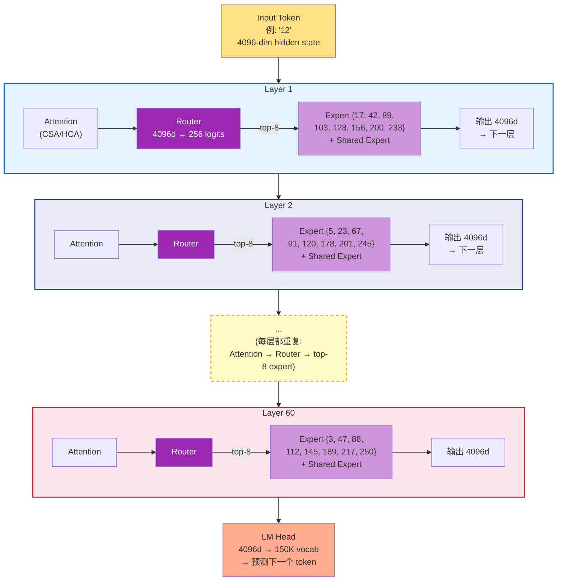
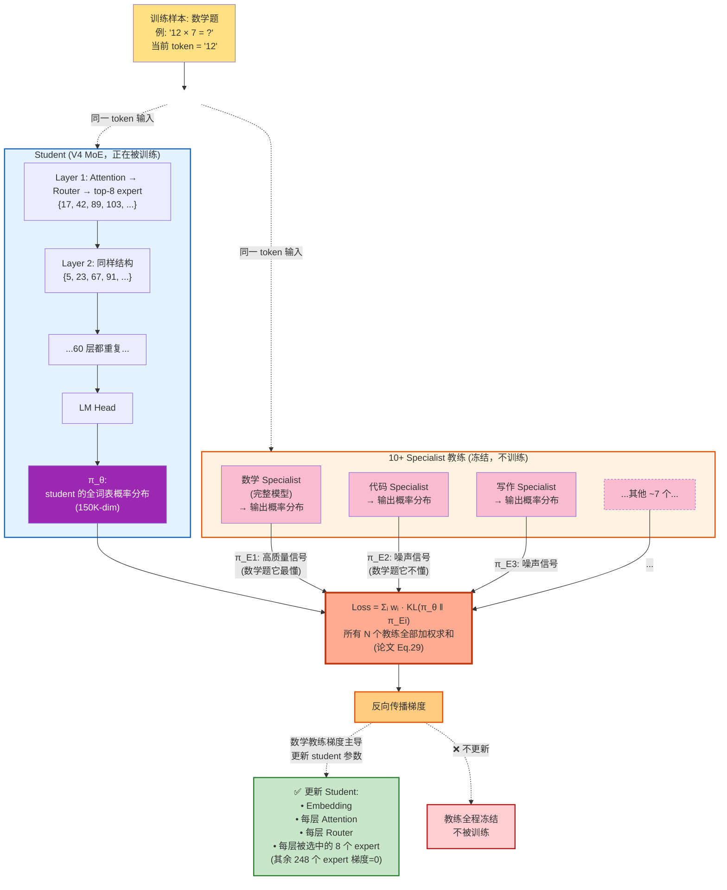

# 多专家在线策略蒸馏：DeepSeek-V4 如何把 10+ 个领域专家融合成一个模型

*Author: 魏新宇 (Xinyu Wei)*

> 深入剖析 On-Policy Distillation (OPD) — DeepSeek-V4 用来把 10+ 个领域专家模型整合成单一统一模型的 post-training 方法，完全替代了传统的 mixed RL 阶段。

[English](README.md) | [配套阅读：Long-Context-Efficient-Attention](https://github.com/david-xinyuwei/david-share/tree/master/DL-Algorithm-Insights/Long-Context-Efficient-Attention) | [关联：LoRA-Merge-Quality-Impact](https://github.com/david-xinyuwei/david-share/tree/master/DL-Algorithm-Insights/LoRA-Merge-Quality-Impact)

## Executive Summary

| 方法 | 专家如何融合 | 失败模式 | DeepSeek-V4 用了？ |
|------|-------------|---------|:----------------:|
| **Weight Averaging**（权重平均） | 权重算术平均 | 能力相互干扰 → 质量退化 | ❌ |
| **Task Arithmetic**（TIES、DARE 等） | 任务向量加减 | 比平均好，但仍是参数空间启发式 | ❌ |
| **Mixed RL**（多任务 PPO/GRPO） | 跨任务联合 reward | reward hacking、训练不稳定 | ❌（V3.2 用过，V4 替换） |
| **On-Policy Distillation (OPD)** | 在 student trajectory 上做 logit 层对齐 | 训练慢，但稳定 + 保真 | ✅ **V4 的选择** |

> *"the mixed Reinforcement Learning (RL) stage was entirely replaced by On-Policy Distillation (OPD)."*
> — DeepSeek-V4 Technical Report, Section 5.1

DeepSeek 通过从 base 模型分支并跑领域 RL，训出了 10+ 个领域专家（数学、代码、写作、Agent、推理等）。然后他们面临每个多专家系统都会遇到的问题：**怎么把这些专家融合成一个生产模型，又不丢失各自的特长？**

本文解释 V4 为什么选 OPD 而不是其他方案，用一个具体例子走完整个方法，并展示 V4 是怎么解决工程层面的难题（10+ teacher 的 logits、词表 > 100k）。

---

## 背景：多专家融合问题

现代 LLM 需要在多个领域都能干活——数学、代码、写作、Agent 工具调用、多语言翻译。标准做法是：

1. **Pre-train** 一个 base 模型用多样化数据
2. **Specialize** 复制出多份，各自用 SFT + RL 训成领域专家
3. **Merge** 把这些专家融合成一个生产部署的模型

第 3 步最难。一旦你有了，比如说 10 个各自在自己领域比 base 强的专家，简单的合并方式要么把特长平均掉，要么导致训练不稳定。

### 为什么不能各专家分开部署？

生产部署强烈倾向单一模型：

- **成本**：一个模型 = 一套 GPU。十个模型 = 十倍推理成本。
- **延迟**：把请求路由到对应专家会增加 round-trip 开销。
- **能力组合**：真实用户问题往往跨领域（如"写 Python 代码解决这道数学题"）。单个内化了所有专长的模型可以组合它们；路由的专家做不到。
#### 那 LoRA 热切换呢？

有个合理的工程反驳：“现代推理服务栈（vLLM、SGLang）都支持 LoRA 热切换——1 个 base + N 个小 adapter，按需切换。干么还要融合？”

LoRA 热切换**对很多场景就是正确答案**——但不适用于 V4 这种 frontier 模型。对比：

| 维度 | LoRA 热切换 | OPD 融合后单模型 |
|------|:-------------:|:--------------------:|
| 专家存储 | ~MB 级 adapter | 无（知识烘入 base） |
| 切换延迟 | 每请求 1-50ms | 0（无切换） |
| 跨领域 query（数学+代码） | ❌ 每请求只能挂 1 个 adapter | ✅ 所有能力同时在线 |
| 能力天花板 | 受 LoRA rank 限制（通常 r=16-64） | 全参数 fine-tune 上限 |
| 专家训练成本 | 便宜（LoRA 训练） | 贵（全 RL 训练） |
| 适用场景 | 多租户定制、单领域 query | Frontier 质量、跨领域复合 query |

V4 选融合是因为：(1) DeepSeek 的 specialist 是全参数 RL 产出，不是 LoRA adapter；(2) Frontier 质量的数学/代码/Agent 任务常常跨领域；(3) Router 服务化带来的运维复杂度 DeepSeek 不想要。

对大多数企业多租户场景，LoRA 热切换仍是更实用的答案。

### 为什么不直接把专家当作 MoE expert 塑进去？

另一个自然反应：“V4 本身就是 MoE 架构，有上百个 expert 槽位。为什么不把每个外部 specialist 插进其中一个槽位？”听起来优雅，但结构上不可行。5 条原因：

| # | 不匹配 | 详细 |
|:-:|--------|------|
| 1 | **粒度** | MoE expert 是**单个 Transformer block 内的一个 FFN 子网络**（~100MB）。外部 specialist 是**一个完整模型**（几百 GB），含 attention、embedding 和所有 FFN 层。你不能把一个完整模型塞进一个 FFN 槽位。 |
| 2 | **架构不兼容** | 外部 specialist 可能是从 V3.2 派生（V3.2 架构）；V4 student 用 CSA/HCA + mHC。层维度、attention 机制、残差结构都不同——FFN 权重不能直接移植。 |
| 3 | **Router 不认识** | MoE router 是 pre-training 阶段从零训出来路由到已有 expert 的。塑入陆生 expert，router 没信号说何时调用。重训 router ≈ 重训整个模型。 |
| 4 | **专长是全身性的** | 一个“数学专家”模型的数学能力编码在**每一层**上——attention 模式、embedding 表示、所有 FFN 协作。只移植一层 FFN 只拿到 < 1% 能力。 |
| 5 | **与 MoE 设计意图不同** | V4 用的是 *fine-grained* expert——每个专门 token 级别 pattern（某种语法结构、某类知识 token），不是一整个领域。一个“领域专家”对应几百个 fine-grained expert 的协作行为，不是 1：1 映射。 |

> **一句话**：OPD 用**行为复刻**（logit 分布匹配）融合；直接塑 MoE expert 需要**零件移植**（权重插入）——后者因为零件接口不兼容而失败。

排除了这两个自然替代方案后，业界最终聚焦在四种严肃的多专家融合方法上。
### 四种候选方案

| 方案 | 机制 | 为什么不够好 |
|------|------|-------------|
| **Weight Averaging** | `θ_merged = (θ_1 + θ_2 + ... + θ_N) / N` | 非线性函数的线性插值。数学专家的权重和代码专家的权重在 loss 地形里互相抵消，常常落到比任一专家都差的区域。 |
| **Task Arithmetic**（TIES、DARE） | `θ_merged = θ_base + Σ τ_i · (θ_i − θ_base)`，加上符号/稀疏化启发式 | 比朴素平均好，因为保留了 task vector。但仍在参数空间操作，忽略了网络输出的变化。 |
| **Mixed RL** | 单次 RL run + 多任务 reward 信号 | 不同领域的 reward 函数常常冲突（如数学要求长 step-by-step 推理，chat 要求简洁回答）。训练不稳定；一个任务的 reward 梯度可能破坏另一个任务。 |
| **On-Policy Distillation (OPD)** | 把多个 teacher 蒸馏到 student，student 自己采样 trajectory 并用反向 KL 匹配每个 teacher 的分布 | 单步慢（student 必须 rollout），但训练稳定，student 自然学到任务条件的行为 |

DeepSeek-V3.2 用的是 Mixed RL。**V4 完全放弃了它**，改用 OPD。

---

## OPD 是什么？

OPD 是标准知识蒸馏的改进版。理解什么让它"on-policy"，最好和离线版对比：

<div align="center">
  
  <p><em>Offline distillation：student 拟合 teacher 的 trajectory。OPD：student 拟合 teacher 对 student 自己 trajectory 的打分。</em></p>
</div>

### Offline Distillation（传统做法）

```
Step 1: Teacher 生成一个答案
Step 2: Student 训练去模仿这个答案
```

Student 看到的全是 teacher 会产生的数据。推理时，student 被要求从自己（不同的）分布生成——这种训练/推理 gap 会损害泛化，特别是长自回归生成中误差会累积。

### On-Policy Distillation

```
Step 1: Student 生成一个答案（rollout）
Step 2: Teacher 计算这个答案中每个 token 位置上的概率分布
Step 3: Student 更新自己，让分布在这些位置上更接近 teacher
```

Student 始终在**自己的行为**上学反馈。没有训练/推理分布不匹配的问题。这正是让 on-policy RL 比 off-policy 更 sample-efficient 的同一原理——只不过这里把 reward 信号换成了 teacher 的 logit 分布。

### 一个具体例子（一个训练 step）

假设 prompt 是 `"解：12 × 7 = "`，teacher 是数学专家。

**Step 1 — Student rollout**（student 采样自己的续写）：
```
Student 生成："让我想想。12 × 7 = 12 × 5 + 12 × 2 = 60 + 24 = 84"
```

**Step 2 — Teacher 打分**（数学专家看到同样的 prompt + student 的续写，在每个位置计算 logits）：
```
"84" 这个位置：
  Teacher logits → softmax → P(token | context)
  P("84") = 0.92（teacher 高度自信）
  P("82") = 0.03
  P("76") = 0.02
  ...

"60" 这个位置：  
  Teacher P("60") = 0.71（teacher 在这里也会选 60）
  Teacher P("70") = 0.05
  ...
```

**Step 3 — Student 更新**（计算 student 和 teacher 分布的反向 KL，更新 student 权重让分布往 teacher 靠）：
```
每个 token 位置：L = Σ_v π_θ(v) · [log π_θ(v) − log π_E(v)]
反向传播，更新 θ。
```

注意：student 是基于**自己的拆解策略**（"12 × 5 + 12 × 2"）被打分，不是 teacher 的。如果 teacher 会用别的方法，student 不需要照抄——只要在 student 走的每一步上，teacher 都认可就行。

---

## 数学：为什么用反向 KL？

V4 论文的 OPD 目标函数（公式 29）：

$$L_{OPD}(\theta) = \sum_{i=1}^{N} w_i \cdot D_{KL}(\pi_\theta \,\|\, \pi_{E_i})$$

有三个地方值得拆开看。

### 1. KL 是反向，不是正向

| 方向 | 公式 | 行为 |
|-----|------|-----|
| **Forward KL** `D_KL(π_E ‖ π_θ)` | `Σ π_E(v) · [log π_E(v) − log π_θ(v)]` | "Mode-covering" — student 试图在 teacher 有概率的所有地方都放上非零概率。Offline distillation 常用。 |
| **Reverse KL** `D_KL(π_θ ‖ π_E)` | `Σ π_θ(v) · [log π_θ(v) − log π_E(v)]` | "Mode-seeking" — student 集中在 teacher 的高概率 mode 上。 |

OPD 用**反向 KL**因为：
- Trajectory 来自 `π_θ`（student），用 `π_θ(v)` 加权很自然
- Mode-seeking 行为产生更尖锐、更果断的 student 输出（适合生成）
- 在 student-sampled trajectory 上算 forward KL 方差会很大，因为我们要在 student 很少选的 token 上评估 teacher 概率

### 2. 期望是在 student trajectory 上

KL 在 student-sampled trajectory 的每个 token 上计算。这就是"on-policy"的含义：

$$D_{KL}(\pi_\theta \,\|\, \pi_{E_i}) = \mathbb{E}_{y \sim \pi_\theta}\left[\sum_{t} \sum_v \pi_\theta(v|y_{<t}) \log \frac{\pi_\theta(v|y_{<t})}{\pi_{E_i}(v|y_{<t})}\right]$$

如果改从 teacher 采样，就退化成了 offline distillation。

### 3. 权重 `w_i` 隐式做领域路由

论文解释：
> *"the unified policy π_θ selectively learns from the specialized expert relevant to the current task context (e.g., aligning with the mathematics expert for math reasoning tasks and the coding expert for programming tasks)."*

这能 work 是因为每个 teacher 的分布在自己领域上很尖锐、在其他领域上很平。当 trajectory 是数学题时，只有数学专家产生 low-loss 梯度；其他 teacher 贡献的近似均匀分布噪声会相互抵消。

所以即使所有 teacher 都加在一起，每个任务自然会和对应专家对齐。这比显式做任务路由简单得多。

---

## 多专家 OPD 的工程化

<div align="center">
  
  <p><em>多专家 OPD：student 采样 → 所有 teacher 打分 → 加权 KL 梯度更新 student。</em></p>
</div>

DeepSeek-V4 同时从 **10+ 个 teacher** 蒸馏。朴素实现有两个致命问题：

### 问题 1 — Logit 存储爆炸

为每个训练样本、每个 teacher、每个 token 位置存全词表 logits：

- 词表 `|V| > 100,000`（Qwen3、DeepSeek-V3 系列）
- 序列长度 `L = 2048-32768`（长上下文训练）
- 每个位置每个 teacher 的 logits：`|V| × 4 bytes (FP32) = 400 KB`
- 10 个 teacher × 32K seq × 400 KB = **每个训练样本 128 GB**——内存装不下，存盘也存不下。

**V4 的解决方案**（论文 Section 5.2.2）：只缓存每个 teacher 的**最后一层 hidden states**，不缓存 logits。Hidden states 是 `d_model × 2 bytes` (BF16)，每个 token 通常 7-14 KB——小好几个数量级。训练时把缓存的 hidden states 过 teacher 的预测头，按需精确重建完整 logits。

代价：增加少量重计算（每个 token 一次矩阵乘法），换来巨大的内存节省。

### 问题 2 — 同时加载 10+ teacher 权重

每个 teacher 可能是几千亿参数的模型。同时把 10 个塞进 GPU 显存不可行。

**V4 的解决方案**：teacher 权重用 ZeRO 风格参数分片，按需从中心化存储加载。Teacher 分批调度；数据按 teacher 索引重排，最小化 prediction head 的上下文切换（论文 Section 5.2.2）。

### 为什么折腾这些？为什么不用全 logits + 少 teacher？

V4 论文明确反对一种常见的省事做法——把全词表 KL 简化成单个 per-token KL 估计：

> *"prior works usually simplify the full-vocabulary KL loss into a token-level KL estimate at each token position [...] Although this approach is resource-efficient, it leads to **high variance in gradient estimation and often causes training instability**. Therefore, we adopt full-vocabulary logit distillation in our OPD."*

Token-level KL 只看 teacher 给 student 选中的那个 token 分配的概率，忽略了分布的其他部分。这丢失了"teacher 对所选 token 相比其他选项有多自信"的信息——而这恰恰是蒸馏最重要的信号。全词表 KL 更贵但梯度方差更低、训练更稳定。

---

## OPD 与其他多专家方法对比

### vs Weight Averaging

| 方面 | Weight Averaging | OPD |
|-----|:----------------:|:---:|
| 融合发生在哪 | 参数空间 | Logit 空间（输出行为） |
| 捕捉非线性交互？ | ❌ 不能 | ✅ 能（训练完成的） |
| 速度 | 即时（无训练） | 慢（student rollout + 多 teacher forward） |
| 质量保留 | 通常较差（最佳专家的 70-90%） | 强（往往达到或超过该领域最佳专家） |
| 超参数 | 只有融合权重 | 权重 `w_i`、学习率、训练步数、采样温度 |

权重平均本质上是在问："如果我在非凸 loss 地形上的两个好点之间走中点，我还在好的区域吗？" 答案常常是否定的——神经网络 loss 地形充满了山谷，中点远高于两个端点。

### vs Task Arithmetic（TIES、DARE 等）

Task arithmetic 是 weight merging 的精致版：

```
对每个专家 i：task_vector_i = θ_i − θ_base
融合：       θ_merged = θ_base + Σ_i τ_i · task_vector_i（加上符号 + 稀疏化启发式）
```

比朴素平均好，因为它把"fine-tuning 改了什么"从 base 模型里剥离。但仍受同一个根本问题影响：参数空间组合不一定产生连贯的输出行为。TIES 和 DARE 加了启发式（符号选举、幅度剪枝）来缓解干扰，但底层假设——"好的行为在权重空间线性可组合"——经验上站不住脚。

OPD 直接绕过这个问题，在输出空间工作。不管参数最终是什么，student 因产生匹配 teacher 的分布而被奖励。

> 🔗 我们另有一个 Repo [LoRA-Merge-Quality-Impact](https://github.com/david-xinyuwei/david-share/tree/master/DL-Algorithm-Insights/LoRA-Merge-Quality-Impact)，量化了参数空间合并如何降低质量。OPD 是绕开这个问题的另一条路。

### vs Mixed RL（V3.2 用过、V4 抛弃的方案）

Mixed RL 用多领域的 reward 信号同时训练一个模型：

```
每个 batch：从领域 mix 中采样任务 → 用组合 reward 跑 RL update
```

问题：
- Reward 函数不可组合。数学 reward 可能偏好 500-token 解答；chat reward 可能偏好 80-token 回答。同时优化两者会产生不连贯的长度策略。
- 模型不知道自己在服务哪个领域，所以它学到的是平均行为，而不是领域条件行为。
- Reward hacking 被放大——一个领域可被利用的 reward 会污染所有领域的梯度。

OPD 没有这些问题：
- 每个 teacher 的分布隐式做了领域专业化（teacher 自己就是按领域训出来的）
- KL 信号是稠密的（每个 token、每个 vocab 位置）vs 稀疏的 RL reward（每个 trajectory 一个标量）
- 不需要设计 reward 函数——teacher 分布就是隐式 reward

### vs SFT（Supervised Fine-Tuning）—— Exposure Bias 问题

一个常见的疑问：**为什么不直接用 SFT 在每个 specialist 的输出上训练 student？** 看起来更简单——收集 specialist 对 prompt 的回答，然后把 (prompt, response) 对喂给 student fine-tune。

这种方法在一定程度上有效，但有一个根本问题，叫 **Exposure Bias**：

```
SFT 训练：
  Prompt:   "Solve: 13 × 7 = ?"
  Teacher 答案："13 × 7 = 91"
  
  Student 在每一步学：
    Step 1: 前缀 "13 ×" → 预测下一个 token
            （这个前缀是 teacher 写的——干净、正确）
    Step 2: 前缀 "13 × 7" → 预测下一个 token
            （还是 teacher 的前缀）
    Step 3: 前缀 "13 × 7 =" → 预测下一个 token（= "91"）
  
  整个训练过程，student 只见过 teacher 生成的前缀。
```

但推理时**没有 teacher**——student 自己生成前缀：

```
推理时：
  Step 1: 前缀 "" → student 生成 "13"
  Step 2: 前缀 "13" → student 生成 "×"
  Step 3: 前缀 "13 ×" → student 生成 "7"
  Step 4: 前缀 "13 × 7" → student 不小心生成 "+"（错了！）
  Step 5: 前缀 "13 × 7 +"  ← ⚠️ 训练时从未见过这个前缀！
          Student 不知道怎么从自己的错误中恢复。
          → 输出可能崩坏："13 × 7 + 91 = 104"（胡说）
```

**这就是 exposure bias**：student 训练时从未"暴露"在自己生成的前缀（可能含错）下。推理时一旦自己出错，没有学过"刚才写错了，下一步怎么办"的行为。

OPD 通过**on-policy 采样**解决：

```
OPD 训练：
  Step 1: Student 用自己当前能力生成完整 trajectory：
          "Let me think... 13 × 7 = 81... 等等，重算一下：13 × 7 = 91"
          （包含 student 自己的错误和自我纠正）
  Step 2: Specialist 在每个 token 位置打分
  Step 3: Student 在【自己的错误】上学习
  
  → Student 学过"刚写错时怎么继续"
  → 推理时能自我纠错（这就是推理模型的"等等，让我重新想"）
```

这就是为什么 frontier 推理模型（DeepSeek-R1、OpenAI o1 等）都用 on-policy 训练（RL 或 OPD）——纯 SFT 教不会自我纠正。

| 维度 | SFT | OPD |
|------|:---:|:---:|
| 训练数据前缀来自 | Teacher | **Student 自己** |
| 每 token 信号 | 1 个标签（teacher 选的 token） | **完整分布（~150K 个概率）** |
| 训练/推理分布一致 | ❌ 不一致 | ✅ 一致 |
| 自我纠错能力 | ❌ 教不会 | ✅ 能教会 |
| 多教师支持 | ❌ 必须挑一个或顺序训（catastrophic forgetting） | ✅ 天然 Σᵢ 支持 |

### vs RL / RLAIF —— 只是更密的 reward 信号

自然的下一个问题：**RL 也能解决 exposure bias（student 自己采样）——为什么不直接用 RL？**

你说得对——V3.2 用的就是 RL。V4 *试过* RL 然后用 OPD 替换。关键洞察：

**OPD = 把 teacher logit 分布当 reward 信号的 RL。**

两者都是 on-policy 训练（student 采样）。唯一区别是 student 每个 trajectory 收到的反馈类型：

| 方法 | 每条 trajectory 的反馈 | 每 token 信号密度 |
|------|---|:---:|
| **RL with rule reward**（如数学正确性） | 1 个标量（如 +1 / -1） | ~0.001（1 / 1000 tokens） |
| **RLHF**（人工反馈） | 1 个标量 | ~0.001 |
| **RLAIF**（LLM 当裁判，如 GPT-5 打分） | 1 个标量 | ~0.001 |
| **OPD** | 每 token 完整词表分布（~150K） | **150,000** |

OPD 的反馈密度大约是 scalar RL reward 的 **1.5 × 10⁸ 倍**。这意味着：
- 梯度更稳定（方差更低）
- 收敛更快
- 不需要设计 reward 函数（teacher 分布就是 reward）
- 不会 reward hacking（你没法通过钻一个维度的漏洞来骗过 150K 维分布）

**那为什么大家不都用 OPD？** 因为它需要 **teacher 的全词表 logits**——这就是实际的硬墙。

#### 隐藏的限制：API 是否给 logits

商业 LLM API（OpenAI、Anthropic 等）**不暴露全词表 logits**：

| API | top_logprobs 上限 | 能做完整 OPD？ |
|-----|:--:|:--:|
| Azure OpenAI Chat Completions | 20 | ❌（只占 0.013% 词表） |
| Azure OpenAI Completions | 5 | ❌（只占 0.003%） |
| Anthropic Claude API | 不暴露 | ❌ |
| **自部署开源模型**（Llama / Qwen / DeepSeek） | 全部 | ✅ 完整词表 |

> 来源：[Azure OpenAI REST API Reference](https://learn.microsoft.com/en-us/azure/foundry/openai/reference) — `top_logprobs` 是 "An integer between 0 and 20 specifying the number of most likely tokens to return at each token position"。

这就是为什么 V4 必须自家来做：specialist 是自部署的，能拿到全词表 logits。用 GPT-5 当 teacher 的初创公司只能做"top-20 KL 的 RLAIF"，比完整 OPD 弱很多（V4 论文 Section 5.1.2 明确反对这种近似）。

> 🔗 小团队想做类似 OPD：自部署一个开源 teacher（如 Llama-3-70B、Qwen2.5-72B、DeepSeek-V3），就能拿到全词表 logits。这正是 DeepSeek-R1 蒸馏 Qwen 系列的做法。

### vs Step Distillation（Diffusion 模型）—— 不同领域、不同机制

熟悉图像生成的工程师可能听过 diffusion 模型语境下的"蒸馏"——比如把 50 步 Stable Diffusion teacher 蒸馏成 8 步 student（LCM、Lightning、Hyper-SD 等）。**这是完全不同的一种蒸馏，不是 OPD。**

| 维度 | Step Distillation（Diffusion） | OPD（LLM） |
|------|:----:|:---:|
| 领域 | Diffusion 图像生成 | 自回归 LLM |
| 目标 | 减少推理步数（50 → 8） | 融合多个领域专家 |
| Teacher 在训练时的行为 | 离线**一次性**生成 trajectory；之后退场 | 每个训练 step **在线**计算 logits |
| On-policy 还是 offline？ | **Offline**（teacher 的 trajectory 保存为固定数据集） | **On-policy**（student 的 trajectory 实时打分） |
| 训练信号 | Teacher 的中间去噪状态 | Teacher 的完整词表分布 |

Step Distillation 中，teacher 的角色是**预先生成训练数据集**。数据集生成后，teacher 退场，student 用普通监督方式训练。

OPD 中，teacher **始终在训练循环中**——每一步都给 student 的实时采样打分。

这是两种完全不同的方法，碰巧都叫"distillation"。当有人说"我们用了蒸馏"，一定要问：**on-policy 还是 offline？单 teacher 还是多 teacher？teacher 给什么信号？** 答案决定了讨论的是哪种方法。

---

## DeepSeek-V4 中哪些是原创？

OPD 在学术界已经研究了几年。V4 贡献的诚实拆解：

| 组件 | 起源 | 来源 |
|------|------|------|
| 知识蒸馏（通用） | Hinton et al., 2015 | "Distilling the Knowledge in a Neural Network" |
| 反向 KL 蒸馏 | 生成模型文献 | Various 2018-2023 |
| On-policy distillation 概念 | Agarwal et al., 2023 (GKD) | "Generalized Knowledge Distillation" |
| 多教师蒸馏 | 2020-2024 多篇学术工作 | Various |
| **完全用 OPD 替代 mixed RL** | ✅ V4 — 第一个这么做的主流大模型 | V4 论文 Section 5.1 |
| **全词表 OPD（拒绝 token-level KL 近似）** | ✅ V4 — 明确反对常见的省事做法 | V4 论文 Section 5.1.2 |
| **10+ teacher 万亿参数级别的蒸馏** | ✅ V4 — 工程规模史无前例 | V4 论文 Section 5.2.2 |
| **Hidden-state 缓存重建 logits** | ✅ V4 — 原创工程技巧 | V4 论文 Section 5.2.2 |

简单说：**OPD 方法本身不是新的**。V4 的贡献在于：(1) 战略性地把 OPD 作为多专家融合的*唯一*机制，(2) 不计代价坚持全词表 KL，(3) 让这套方法在 10+ 万亿参数 teacher 规模下跑得动的工程基础设施。

---

## OPD 实现：骨架代码

PyTorch 单 GPU 上的最小 OPD 训练循环（演示，非生产）：

```python
import torch
import torch.nn.functional as F

def opd_loss(student_logits, teacher_logits_list, weights):
    """
    全词表反向 KL OPD loss。
    来源：DeepSeek-V4 论文 Section 5.1.2 公式 (29)

    参数:
        student_logits:        (B, L, |V|) — student forward 输出
        teacher_logits_list:   list of N tensors，每个 (B, L, |V|)
        weights:               list of N 浮点数，加和为 1.0

    返回:
        scalar loss tensor
    """
    student_logp = F.log_softmax(student_logits, dim=-1)
    student_p = student_logp.exp()

    total_loss = 0.0
    for w, t_logits in zip(weights, teacher_logits_list):
        teacher_logp = F.log_softmax(t_logits, dim=-1)
        # 反向 KL: D_KL(π_θ || π_E) = Σ π_θ * (log π_θ - log π_E)
        kl_per_token = (student_p * (student_logp - teacher_logp)).sum(dim=-1)  # (B, L)
        total_loss += w * kl_per_token.mean()
    return total_loss


def opd_train_step(student, teachers, prompts, weights, optimizer, max_new_tokens=256):
    """
    一个 on-policy distillation 训练 step。
    """
    # 1. Student 采样 rollout（no_grad 避免显存爆炸）
    with torch.no_grad():
        rollout_ids = student.generate(prompts, max_new_tokens=max_new_tokens,
                                        do_sample=True, temperature=1.0)

    # 2. Forward pass：student 带梯度计算 logits
    student_logits = student(rollout_ids).logits  # (B, L, |V|)

    # 3. 每个 teacher 给同样的 rollout 打分（不需要梯度）
    with torch.no_grad():
        teacher_logits_list = [t(rollout_ids).logits for t in teachers]

    # 4. 计算 OPD loss 并反向传播
    loss = opd_loss(student_logits, teacher_logits_list, weights)
    optimizer.zero_grad()
    loss.backward()
    torch.nn.utils.clip_grad_norm_(student.parameters(), max_norm=1.0)
    optimizer.step()
    return loss.item()
```

几个实践注意事项：

- **Tokenizer 对齐是必须的**。所有 teacher 和 student 必须用同一个 tokenizer（这样 logits 才能逐 token 比较）。实践中这意味着选同一族的模型（Qwen 2.5/3 系列、Llama 3 系列等）。
- **反向 KL 容易 NaN**。学习率从小开始（5e-7 到 1e-6），用 BF16 mixed precision，gradient clipping 保持在 1.0。
- **Trajectory 长度有讲究**。太短 = 每步蒸馏信号不够。太长 = 显存和时间爆炸。256-512 token 是小规模实验的合理起点。
- **Teacher 的显存**。即使 `no_grad`，多个 teacher 同时放 GPU 也会累积。Ablation 研究可以考虑 CPU offload（`device_map="auto"` + `offload_folder`）。

---

## OPD vs MoE：两种不同的“Expert”

V4 **既是 MoE 架构、又是 OPD 后训练的成果**。这是两个完全独立的概念，恰好用了同一个词“expert”——这是常见混淆的源头。澄清：

| 概念 | 是什么 | 存在期 | V4-Pro 数量 |
|------|------|--------|:----------:|
| **MoE expert**（架构层） | 一个 Transformer block 内的单个 FFN 子网络，router 按 token 选 | **永久**——是模型架构的一部分 | ~256 fine-grained expert × ~60 层 = ~15K 个 expert |
| **OPD 领域专家**（仅训练期） | 一个完整独立模型，按某领域（数学/代码/写作）全参数 RL 训出 | **仅训练期**——OPD 蒸馏后消失 | 训练时 10+，训练后 0 |

要可视化 V4 Transformer 内部的架构层 MoE——看清 fine-grained FFN expert 相对于 Attention、KV Cache 和其他组件的位置——请看 [KV-Cache-Deep-Dive 中的完整 MoE Transformer 流水线图](https://github.com/david-xinyuwei/david-share/tree/master/Deep-Learning/KV-Cache-Deep-Dive#moe-variant-when-step-5-becomes-a-mixture-of-experts)。核心要点：每个 MoE "expert" 是一个小 FFN（如 4096→1408→4096），由 router 逐 token 选择。OPD specialist 是整个几千亿参数的模型。它们是完全不同的东西。

### MoE expert 的"技能"从哪来？

一个常见的追问：既然没人给 MoE expert 贴"数学 expert" / "写作 expert" 的标签，它们是怎么变得专业化的？

答案：**专业化是 pre-training 中由 Router-Expert 的反馈循环自动形成的。**

```
Pre-training 初始化：
  Expert 1, 2, ..., 256：随机 FFN 权重，没有任何技能
  Router：随机权重，瞎选

Pre-training 进行中（万亿 token 训练）：
  随机扰动让某些 expert 在某类 token pattern 上略好一点
  → Router 学会在遇到这类 pattern 时更倾向选它们
  → 这些 expert 在这类 pattern 上收到更多梯度
  → 它们变得更擅长
  → 正反馈循环把分工固化下来

Pre-training 结束：
  Expert 17：主要被英文语法 token 激活
  Expert 42：主要被数学符号激活
  Expert 103：主要被中文叙述 token 激活
  Expert 200：主要被代码缩进 token 激活
  ...
  （但没有人给它们贴标签。是 Router 学会的，是 expert 自己适应的。）
```

**重要细节**：expert 的"技能"不是一个领域，而是一类 **token-level pattern**。严格说没有"数学 expert"；只有"被数学运算符 token 激活的那个 expert"——它在统计上看起来像数学专家。一道数学题的不同 token（数字、运算符、标点等）会激活很多不同 expert，每个都贡献最终输出的一部分。

### OPD 梯度流：哪些 Expert 真正被更新？

现在可以回答最微妙的问题：**当 OPD 一步训练发生时，10+ 个教练全部打分，student 中哪些 MoE expert 被更新？**

从 OPD loss 严格逻辑推导：

$$L = \sum_{i=1}^{N} w_i \cdot D_{KL}(\pi_\theta \,\|\, \pi_{E_i})$$

对任意参数 `θ_p`（如某个 expert 的 FFN 权重），梯度为：

$$\frac{\partial L}{\partial \theta_p} = \sum_{i=1}^{N} w_i \cdot \frac{\partial D_{KL}(\pi_\theta \,\|\, \pi_{E_i})}{\partial \theta_p}$$

教练分布 `π_E_i` 是**冻结的**（不依赖 `θ_p`），所以梯度非零的唯一路径是通过 `π_θ`——student 输出分布。链式法则：

$$\frac{\partial D_{KL}}{\partial \theta_p} = \frac{\partial D_{KL}}{\partial \pi_\theta} \cdot \frac{\partial \pi_\theta}{\partial \theta_p}$$

如果 `θ_p` 没参与产生 `π_θ` 的 forward 计算，那么 `∂π_θ / ∂θ_p = 0` **严格为零**（它根本不在计算图里）。

**对一个训练样本（如一道数学题）**：

| 组件 | 参与 forward？ | 收到梯度？ |
|------|:--------------:|:---------:|
| Embedding、Attention、LM Head | ✅ 总是 | ✅ 总是 |
| Router | ✅ 总是 | ✅ 总是 |
| **被 Router 选中的** MoE expert（top-8） | ✅ 是 | ✅ 是（梯度流过） |
| **未被选中的** MoE expert（其他 248 个） | ❌ 否 | ❌ 严格为零 |

**关键**："10 个教练都给每个样本打分" 这个事实只改变了流到**被选中** expert 的梯度的**组成**——它无法让梯度流到**未被选中**的 expert。未被选中的 expert FFN 权重在数学上与这个样本的 loss 完全断开。

所以一道数学题进来时：

1. Router 选出 top-8 个处理数学 pattern token 的 expert，记为集合 M
2. Forward pass 只用 M（其他 248 个 expert 被绕开）
3. 10+ 个教练都对 student 输出打分：
   - 数学教练：高质量 KL 信号（它懂数学）
   - 其他 9 个教练：低幅噪声（它们不懂数学，给出近均匀分布）
4. 梯度反向传播，按 `w_i` 加权求和：
   - 数学教练的梯度占主导（KL 大 → 梯度大）
   - 其他教练的梯度互相抵消接近零（随机噪声）
5. 主导梯度只更新 **M 中的 expert**（以及 Router/Attention 等）
6. 其他 248 个 expert：梯度 = 0，权重不变

**最终结果**：数学 expert 接受数学训练，写作 expert 接受写作训练，代码 expert 接受代码训练——尽管所有教练在每一步都在场。**Router（架构层）和梯度稀疏性（数学层）共同实现了清晰的分工。**

### 可视化：推理路径 vs OPD 训练路径

两张图把上面的机制画清楚。

**图 A — 推理时（一个 token 走过 60 层）**：



图 A 的关键观察：
- **60 层，每层有自己独立的 256 个 expert 池**（Layer 1 和 Layer 2 的 expert 池**完全独立**，互不共享）
- **每层 Router 独立选 top-8**（同一个 token 在不同层选的 expert 编号不同）
- **每个 token 总激活量** = 60 × (8 routed + 1 shared) = **540 个 expert 实例**（共 ~15,000 个里）
- 对应约 49B 激活参数（≈ V4-Pro 总参数 1.6T 的 3%）

**图 B — OPD 一步训练**：



图 B 的关键观察：
- **所有 N 个教练每一步都跑 forward**（Eq.29 求和所有 KL 项——没有"挑教练"的步骤）
- **只有对口教练给出有用梯度**（数学题上数学教练分布尖锐 → KL 大 → 信号强；其他教练分布近均匀 → 噪声）
- **教练全程冻结**——只有 student 的参数被更新
- **Student 内部，只有 Router 选中的 expert 收到梯度**——每层未被选中的 expert 梯度严格为 0

"所有教练都打分"（Eq.29）+ "只有被选中的 expert 参与计算"（MoE forward）这两个机制叠加，产生了一个优雅的性质：**数学上 10+ 个教练全程参与，但实际效果是每道题只训了 router-pattern 与之对齐的 expert，主要由真正懂这个领域的教练指导**。

### OPD 蒸馏的能力最终去了哪里？

当 OPD 蒸馏后的 student 推理时接到一道数学题：

1. **Embedding** 层激活数学相关的 token embedding
2. **Attention** 层（CSA/HCA）关注数学相关上下文
3. Step 5 的 **Router** 把 token 调度给那些在 OPD 训练中成为数学 token pattern 专家的 MoE expert（这是自动的——梯度下降决定哪个 expert 处理哪个 pattern）
4. **多个 MoE expert** 给出加权输出（没有任何单一 expert “是”那个数学专家）
5. **LM Head** 映射到数学相关词表

OPD 训练时教出这些行为的“数学专家模型”早就被删了。它的能力现在**分布在整个 student 模型上**，不集中在任何一个组件里。

这与架构层 MoE 本质不同——MoE 每个 expert FFN 是有独立参数的离散单元。OPD 融合产生的**能力是梯度下降分布出来的**，不是架构设计出来的。

---

## OPD 在 V4 系列中的位置

DeepSeek-V4 是一组协调的创新。OPD 扮演特定角色：

| 创新 | 用途 | 详见 |
|------|------|------|
| 长上下文高效 attention（CSA + HCA） | 让 1M-token context 在计算上可行 | [Long-Context-Efficient-Attention](https://github.com/david-xinyuwei/david-share/tree/master/DL-Algorithm-Insights/Long-Context-Efficient-Attention) |
| Manifold-Constrained Hyper-Connections (mHC) | 加强深层模型的 residual connections | V4 论文 Section 2.2 |
| Muon Optimizer | 更快收敛 + 训练稳定性 | V4 论文 Section 2.4 |
| FP4 量化感知训练 | 减少训练和推理的内存带宽压力 | V4 论文 Section 3.4 |
| **On-Policy Distillation（本文）** | **把 10+ 个专家融合成单一生产模型** | V4 论文 Section 5.1 |
| Quick Instruction（KV cache 复用做辅助任务） | 减少 chatbot 场景的 TTFT | V4 论文 Section 5.1.1 |

OPD 是**post-training 的收官之作**——把所有用新架构训出的领域专家整合成最终上线模型的方法。

---

## OPD 的诚实局限

OPD 不是万能药。三个值得理解的现实约束：

### 1. 覆盖度依赖数据，不是架构保证

OPD 只更新 router 在每个训练样本中选中的 MoE expert。OPD 训练数据分布之外的 token-level pattern 对应的 expert，在整个 OPD 中**永远不会被选中**——它们保留 pre-training 权重不变。

```
如果 OPD 训练数据只覆盖 数学 + 代码 + 写作：
  → 数学/代码/写作 pattern 对应的 expert 收到 OPD 更新（实际中是大多数 expert）
  → 处理罕见 pattern 的 expert（如冷门语言、niche 符号）
    收不到 OPD 信号 → 只保留 pre-training 能力

→ OPD 覆盖度 = OPD 训练数据覆盖度 ≠ "256 个 expert 全都被均等训练"
```

V4 用多样化训练数据 + "general chat" specialist（激活面广）来缓解这点，但**没有**理论上保证每个 expert 都被改进——这是数据工程选择，不是数学保证。

### 2. 梯度归因不精确

Teacher 在**输出层**给反馈（next-token 分布），但 student 的错误可能发生在**任何中间层**（错的 attention 模式、错的 router 选择、错的 FFN 计算）。反向传播的梯度只能"猜"是哪个内部组件的责任。

实际效果：
- 训练比理想情况慢（部分梯度落在无辜组件上）
- 没出错的 expert 也会收到一点小梯度更新
- 用小学习率 + 多步训练 + 多教师噪声相消来压制

V4 没有声称解决这个问题——他们只是经验性地调参绕开。

### 3. 规模决定可行性

完整的 V4 OPD pipeline（10+ teacher × 万亿参数 × 全词表 KL）只对以下组织可行：
- 自部署 teacher 模型（商业 API top_logprobs 上限 20）
- 中心化权重存储 + ZeRO 风格 sharding
- 自定义 hidden state 缓存（防止 logit 存储爆炸到 TB 量级）

对小团队：OPD 类训练的简化版本（单个开源 teacher + 标准 PyTorch）仍然非常有效。但 V4 的 *完整* 配置是 frontier 公司的专属能力。

---

## 这个 Repo 还没有的内容

这是一篇基于 DeepSeek-V4 Technical Report 的**理论深度解读**。我们还没有：

- 在真实硬件上复现 OPD 实验
- 用受控 benchmark 对比 OPD vs Weight Merging vs Task Arithmetic
- 在小规模上验证论文宣称的质量保留

这些计划在后续阶段做。等实验数据到位，本 README 会更新：

- H100 benchmark 配置（Qwen 2.5 系列 teacher + Qwen3 student，单卡）
- GSM8K / HumanEval / MMLU 评测，对比 OPD vs baseline
- 训练稳定性曲线和超参数 ablation

---

## 参考文献

- DeepSeek-AI. (2026). *DeepSeek-V4: Towards Highly Efficient Million-Token Context Intelligence*. Technical Report. [PDF](https://huggingface.co/deepseek-ai/DeepSeek-V4-Pro/blob/main/DeepSeek_V4.pdf) — Section 5.1（Post-Training Pipeline）和 Section 5.2（RL and OPD Infrastructures）
- Hinton, G., Vinyals, O., & Dean, J. (2015). *Distilling the Knowledge in a Neural Network*. arXiv:1503.02531
- Agarwal, R. et al. (2023). *GKD: Generalized Knowledge Distillation for Auto-regressive Sequence Models*. arXiv:2306.13649（首次为 LLM 形式化 on-policy distillation）
- Yadav, P. et al. (2023). *TIES-Merging: Resolving Interference When Merging Models*. arXiv:2306.01708（带符号选举的 task arithmetic）
- Yu, L. et al. (2024). *Language Models are Super Mario: Absorbing Abilities from Homologous Models via DARE*. arXiv:2311.03099
- 配套阅读：[Long-Context-Efficient-Attention](https://github.com/david-xinyuwei/david-share/tree/master/DL-Algorithm-Insights/Long-Context-Efficient-Attention)（V4 的 CSA+HCA attention 机制）
- 前置知识：[KV-Cache-Deep-Dive](https://github.com/david-xinyuwei/david-share/tree/master/Deep-Learning/KV-Cache-Deep-Dive)（Transformer 基础、KV Cache、MoE 架构图）
- 关联阅读：[LoRA-Merge-Quality-Impact](https://github.com/david-xinyuwei/david-share/tree/master/DL-Algorithm-Insights/LoRA-Merge-Quality-Impact)（量化参数空间合并的退化）

---

## 项目信息

| 项 | 值 |
|----|----|
| Author | 魏新宇 (Xinyu Wei) |
| 日期 | 2026-05 |
| 状态 | **理论深度解读** — 实验是后续阶段 |
| 来源 | DeepSeek-V4 Technical Report（Section 5.1、5.2） |
| 配套 | [Long-Context-Efficient-Attention](https://github.com/david-xinyuwei/david-share/tree/master/DL-Algorithm-Insights/Long-Context-Efficient-Attention)（V4 系列） |

*本文是 [DL-Algorithm-Insights](https://github.com/david-xinyuwei/david-share/tree/master/DL-Algorithm-Insights) 系列的一部分——用论文为基础的分析（在适用时）配合真实 GPU 实验来解释深度学习算法。*
