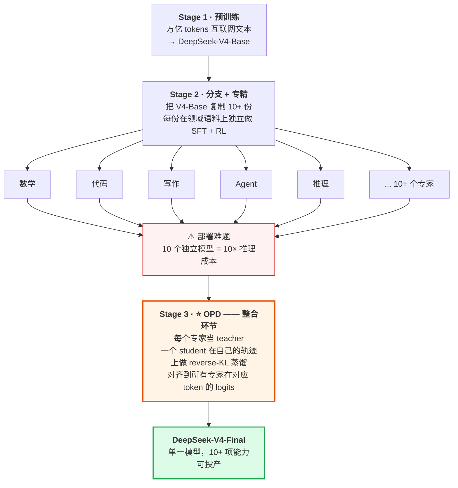
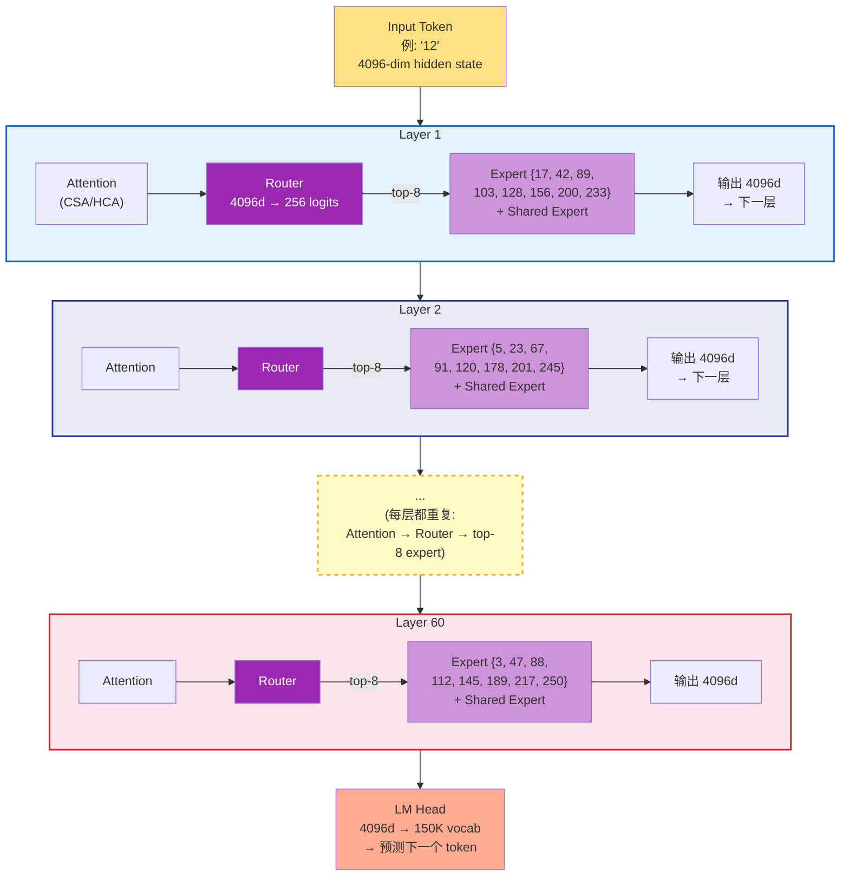
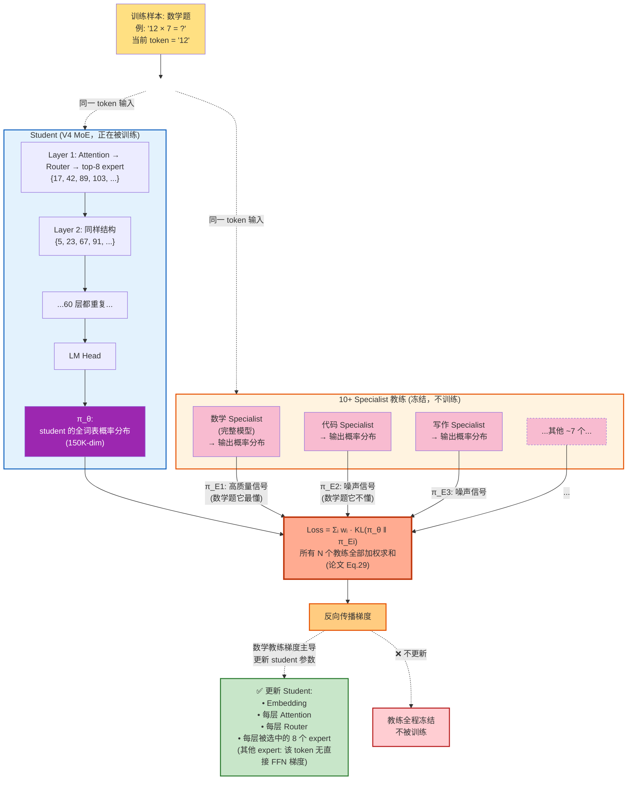

# On-Policy Distillation 深度剖析：DeepSeek-V4 如何融合 10+ 个专家 — 在 Azure AI 上验证

> **Author: 魏新宇 (Xinyu Wei)** · Microsoft AI GBB

[](https://azure.microsoft.com) [](https://huggingface.co/deepseek-ai/DeepSeek-V4-Pro) [](https://huggingface.co/docs/trl/main/en/gkd_trainer) [](LICENSE)

[English](README.md) | 中文版

[配套阅读：Long-Context-Efficient-Attention](https://github.com/david-xinyuwei/david-share/tree/master/DL-Algorithm-Insights/Long-Context-Efficient-Attention) | [关联：LoRA-Merge-Quality-Impact](https://github.com/david-xinyuwei/david-share/tree/master/DL-Algorithm-Insights/LoRA-Merge-Quality-Impact)

> 深入剖析 On-Policy Distillation (OPD) — DeepSeek-V4 用来把 10+ 个领域专家模型整合成单一统一模型的 post-training 方法，完全替代了传统的 mixed RL 阶段。

### 这对从业者为什么重要

构建多领域 AI 系统的企业团队，面临着和 DeepSeek 用 OPD 解决的同一个问题：**如何把多个专家模型合并成一个生产端点**，同时不损失各专家的质量。本 repo 从三个方面提供帮助：

1. **理解竞争格局** — 在评估 DeepSeek-V4 vs OpenAI 模型时，从业者可以精确看到 V4 靠什么实现多领域质量（OPD），OpenAI 靠什么（RL-to-the-end）。不同的工程 trade-off，不是黑魔法。
2. **架构参考** — 手里有 5-10 个 fine-tuned LoRA adapter 或领域模型的团队，可以采用蒸馏方式整合（TRL/GKDTrainer + GPU VM），把 N 个推理端点降到 1 个，直接降低 serving 成本。
3. **可在 Azure AI 上复现** — 本 repo 所有实验都跑在 Azure H100 VM 上，证明完整的 OPD 工作流（训练 + 评测）可以在云 GPU 基础设施上复现。

## Executive Summary

| 方法 | 专家如何融合 | 失败模式 | DeepSeek-V4 用了？ |
|------|-------------|---------|:----------------:|
| **Weight Averaging**（权重平均） | 权重算术平均 | 能力相互干扰 → 质量退化 | ❌ |
| **Task Arithmetic**（TIES、DARE 等） | 任务向量加减 | 比平均好，但仍是参数空间启发式 | ❌ |
| **Mixed RL**（多任务 PPO/GRPO） | 跨任务联合 reward | reward hacking、训练不稳定 | ❌（V3.2 用过，V4 替换） |
| **On-Policy Distillation (OPD)** | 在 student trajectory 上做 logit 层对齐 | 训练慢，但稳定 + 保真 | ✅ **V4 的选择** |

> *"the mixed Reinforcement Learning (RL) stage was entirely replaced by On-Policy Distillation (OPD)."*
> — DeepSeek-V4 Technical Report, Section 5.1

DeepSeek 通过从 base 模型分支并跑领域 RL，训出了 10+ 个领域专家（数学、代码、写作、Agent、推理等）。然后他们面临每个多专家系统都会遇到的问题：**怎么把这些专家融合成一个生产模型，又不丢失各自的特长？**

本文解释 V4 为什么选 OPD 而不是其他方案，用一个具体例子走完整个方法，并展示 V4 是怎么解决工程层面的难题（10+ teacher 的 logits、词表 > 100k）。

---

## 30 秒看懂：OPD 在 DeepSeek-V4 中的位置

在数学之前、工程之前——**这一张图**就是你需要的全局视角，搞懂 OPD 为什么存在。



### 为什么这个图很重要

DeepSeek-V3 及更早版本用 **Mixed RL**（多任务 PPO/GRPO）做 Stage 3。V4 抛弃了它。论文原话：

> *"the mixed Reinforcement Learning (RL) stage was entirely replaced by On-Policy Distillation (OPD)."*
> —— DeepSeek-V4 Technical Report, Section 5.1

本文剩下的部分会解释这次替换的*是什么*、*为什么*、*怎么做*——并在真实硬件上端到端验证整个机制。

### 一句话总结

> **OPD 是 DeepSeek-V4 的"专家融合术"：把 10+ 个分头训练的领域专家压缩回一个统一模型，替代了 V3 用的不稳定 Mixed RL。**

---

## 在 Azure 上运行

本 repo 的验证实验跑在 Azure NCads H100 v5 系列 VM 上。Microsoft Learn 对 NCads_H100_v5 系列的描述是：它使用 NVIDIA H100 NVL GPU 和第 4 代 AMD EPYC Genoa 处理器；`Standard_NC80adis_H100_v5` 规格对应最高 80 vCPU、640 GiB 系统内存；该系列最高支持 2 张 H100 NVL GPU，每张 94 GB 显存。来源：[NCads_H100_v5 sizes series](https://learn.microsoft.com/en-us/azure/virtual-machines/sizes/gpu-accelerated/ncadsh100v5-series)，查验日期：2026-05-20。

| 资源 | Run 11 配置 | 在 OPD 实验中的作用 |
|------|-------------|---------------------|
| VM SKU | `Standard_NC80adis_H100_v5` | 单 VM 2 卡 H100，跑 DDP 训练 |
| GPU | 2 x NVIDIA H100 NVL，每张 94 GB | student rollout、teacher logits、reverse-KL training |
| vCPU | 80 个 AMD EPYC Genoa core | 数据预处理、代码评测、dataloader worker |
| 系统内存 | 640 GiB | 放数据集、tokenizer buffer 和主机侧中间状态 |
| 远程存储 | Premium SSD / managed disk | 保存 checkpoint、log 和 JSON 结果 |

这里的重点是单 VM：Run 11 没用 Kubernetes，也没用多节点训练。最终正向结果使用 `accelerate launch --num_processes 2 --mixed_precision bf16`，738 个训练 step 用时 5h 58min，然后在同一台 H100 VM 上完成 HumanEval greedy 和 pass@10 评测。

### Technology Stack at a Glance

| 类别 | 技术 | 做什么 | 效果 | 对应章节 |
|------|------|--------|------|----------|
| Algorithm | On-Policy Distillation | student 采样自己的 trajectory，teacher 给这些 token 打分 | Run 11 HumanEval pass@10 +6.10pp | [Phase 5](#phase-5--扩规模跨域-opd三角验证正向信号run-11) |
| KL objective | Reverse KL | 让 student 做 mode-seeking，而不是 mode-covering | 避免把多个模式平均成低置信输出 | [数学](#数学反向-kl--gkd-框架) |
| Framework | TRL `GKDTrainer` | 提供现成 OPD 风格训练循环 | 只需要配置 model、teacher、dataset 和两个 OPD 开关 | [OPD 代码生态](#opd-代码生态2026-现实检查) |
| Distributed training | Accelerate DDP | 用满单 VM 上的两张 H100 | Run 11 获得 2x batch 并行度 | [可复现性](#可复现性) |
| Precision | bf16 + fp32 LM head | 大部分训练保持 bf16，同时稳定 logits | 避开前几轮 bf16 NaN 失败路径 | [bf16 NaN 调查](#bf16-nan-调查--法医取证全过程) |

### Resource Distribution

| 组件 | 放在哪里 | 本 repo 的峰值压力 | 为什么重要 |
|------|----------|-------------------|------------|
| Student model | H100 VRAM | 1.5B 参数 + gradients | OPD 的可训练目标 |
| Teacher model | H100 VRAM | 7B 参数用于打分 | 提供代码领域 logits |
| Activations + rollout tokens | H100 VRAM | `max_length=1536`，`max_new_tokens=512` | on-policy generation 阶段最吃显存 |
| 数据集与 tokenization | CPU RAM | MBPP + CodeAlpaca 子集 | 保证 DDP 训练不断粮 |
| Checkpoint 与日志 | Managed disk | final checkpoint + JSON/log 产物 | 让 benchmark 可追溯 |

推荐复现起点：先用 `Standard_NC80adis_H100_v5` 或同等级 2-H100 VM，确认目标 Azure region 的 H100 quota，安装 `requirements.txt`，再运行 [可复现性](#可复现性) 小节里的 Run 11 归档命令。

---

## 背景：多专家融合问题

现代 LLM 需要在多个领域都能干活——数学、代码、写作、Agent 工具调用、多语言翻译。标准做法是：

1. **Pre-train** 一个 base 模型用多样化数据
2. **Specialize** 复制出多份，各自用 SFT + RL 训成领域专家
3. **Merge** 把这些专家融合成一个生产部署的模型

第 3 步最难。一旦你有了，比如说 10 个各自在自己领域比 base 强的专家，简单的合并方式要么把特长平均掉，要么导致训练不稳定。

### 为什么不能各专家分开部署？

生产部署强烈倾向单一模型：

- **成本**：一个模型 = 一套 GPU。十个模型 = 十倍推理成本。
- **延迟**：把请求路由到对应专家会增加 round-trip 开销。
- **能力组合**：真实用户问题往往跨领域（如"写 Python 代码解决这道数学题"）。单个内化了所有专长的模型可以组合它们；路由的专家做不到。
#### 那 LoRA 热切换呢？

有个合理的工程反驳：“现代推理服务栈（vLLM、SGLang）都支持 LoRA 热切换——1 个 base + N 个小 adapter，按需切换。干么还要融合？”

LoRA 热切换**对很多场景就是正确答案**——但不适用于 V4 这种 frontier 模型。对比：

| 维度 | LoRA 热切换 | OPD 融合后单模型 |
|------|:-------------:|:--------------------:|
| 专家存储 | ~MB 级 adapter | 无（知识烘入 base） |
| 切换延迟 | 每请求 1-50ms | 0（无切换） |
| 跨领域 query（数学+代码） | ❌ 每请求只能挂 1 个 adapter | ✅ 所有能力同时在线 |
| 能力天花板 | 受 LoRA rank 限制（通常 r=16-64） | 全参数 fine-tune 上限 |
| 专家训练成本 | 便宜（LoRA 训练） | 贵（全 RL 训练） |
| 适用场景 | 多租户定制、单领域 query | Frontier 质量、跨领域复合 query |

V4 选融合是因为：(1) DeepSeek 的 specialist 是全参数 RL 产出，不是 LoRA adapter；(2) Frontier 质量的数学/代码/Agent 任务常常跨领域；(3) Router 服务化带来的运维复杂度 DeepSeek 不想要。

对大多数企业多租户场景，LoRA 热切换仍是更实用的答案。

### 为什么不直接把专家当作 MoE expert 塑进去？

另一个自然反应：“V4 本身就是 MoE 架构，有上百个 expert 槽位。为什么不把每个外部 specialist 插进其中一个槽位？”听起来优雅，但结构上不可行。5 条原因：

| # | 不匹配 | 详细 |
|:-:|--------|------|
| 1 | **粒度** | MoE expert 是**单个 Transformer block 内的一个 FFN 子网络**（~100MB）。外部 specialist 是**一个完整模型**（几百 GB），含 attention、embedding 和所有 FFN 层。你不能把一个完整模型塞进一个 FFN 槽位。 |
| 2 | **架构不兼容** | 外部 specialist 可能是从 V3.2 派生（V3.2 架构）；V4 student 用 CSA/HCA + mHC。层维度、attention 机制、残差结构都不同——FFN 权重不能直接移植。 |
| 3 | **Router 不认识** | MoE router 是 pre-training 阶段从零训出来路由到已有 expert 的。塑入陆生 expert，router 没信号说何时调用。重训 router ≈ 重训整个模型。 |
| 4 | **专长是全身性的** | 一个“数学专家”模型的数学能力编码在**每一层**上——attention 模式、embedding 表示、所有 FFN 协作。只移植一层 FFN 只拿到 < 1% 能力。 |
| 5 | **与 MoE 设计意图不同** | V4 用的是 *fine-grained* expert——每个专门 token 级别 pattern（某种语法结构、某类知识 token），不是一整个领域。一个“领域专家”对应几百个 fine-grained expert 的协作行为，不是 1：1 映射。 |

> **一句话**：OPD 用**行为复刻**（logit 分布匹配）融合；直接塑 MoE expert 需要**零件移植**（权重插入）——后者因为零件接口不兼容而失败。

排除了这两个自然替代方案后，业界最终聚焦在四种严肃的多专家融合方法上。
### 四种候选方案

| 方案 | 机制 | 为什么不够好 |
|------|------|-------------|
| **Weight Averaging** | `θ_merged = (θ_1 + θ_2 + ... + θ_N) / N` | 非线性函数的线性插值。数学专家的权重和代码专家的权重在 loss 地形里互相抵消，常常落到比任一专家都差的区域。 |
| **Task Arithmetic**（TIES、DARE） | `θ_merged = θ_base + Σ τ_i · (θ_i − θ_base)`，加上符号/稀疏化启发式 | 比朴素平均好，因为保留了 task vector。但仍在参数空间操作，忽略了网络输出的变化。 |
| **Mixed RL** | 单次 RL run + 多任务 reward 信号 | 不同领域的 reward 函数常常冲突（如数学要求长 step-by-step 推理，chat 要求简洁回答）。训练不稳定；一个任务的 reward 梯度可能破坏另一个任务。 |
| **On-Policy Distillation (OPD)** | 把多个 teacher 蒸馏到 student，student 自己采样 trajectory 并用反向 KL 匹配每个 teacher 的分布 | 单步慢（student 必须 rollout），但训练稳定，student 自然学到任务条件的行为 |

DeepSeek-V3.2 用的是 Mixed RL。**V4 完全放弃了它**，改用 OPD。

---

## OPD 是什么？

OPD 是标准知识蒸馏的改进版。理解什么让它"on-policy"，最好和离线版对比：

<div align="center">


<p><em>Offline distillation：student 拟合 teacher 的 trajectory。OPD：student 拟合 teacher 对 student 自己 trajectory 的打分。由 <code>scripts/generate_diagrams.py</code> 生成。</em></p>
</div>

### Offline Distillation（传统做法）

```
Step 1: Teacher 生成一个答案
Step 2: Student 训练去模仿这个答案
```

Student 看到的全是 teacher 会产生的数据。推理时，student 被要求从自己（不同的）分布生成——这种训练/推理 gap 会损害泛化，特别是长自回归生成中误差会累积。

### On-Policy Distillation

```
Step 1: Student 生成一个答案（rollout）
Step 2: Teacher 计算这个答案中每个 token 位置上的概率分布
Step 3: Student 更新自己，让分布在这些位置上更接近 teacher
```

Student 始终在**自己的行为**上学反馈。没有训练/推理分布不匹配的问题。这正是让 on-policy RL 比 off-policy 更 sample-efficient 的同一原理——只不过这里把 reward 信号换成了 teacher 的 logit 分布。

### 一个具体例子（一个训练 step）

假设 prompt 是 `"解：12 × 7 = "`，teacher 是数学专家。

**Step 1 — Student rollout**（student 采样自己的续写）：
```
Student 生成："让我想想。12 × 7 = 12 × 5 + 12 × 2 = 60 + 24 = 84"
```

**Step 2 — Teacher 打分**（数学专家看到同样的 prompt + student 的续写，在每个位置计算 logits）：
```
"84" 这个位置：
  Teacher logits → softmax → P(token | context)
  P("84") = 0.92（teacher 高度自信）
  P("82") = 0.03
  P("76") = 0.02
  ...

"60" 这个位置：  
  Teacher P("60") = 0.71（teacher 在这里也会选 60）
  Teacher P("70") = 0.05
  ...
```

**Step 3 — Student 更新**（计算 student 和 teacher 分布的反向 KL，更新 student 权重让分布往 teacher 靠）：
```
每个 token 位置：L = Σ_v π_θ(v) · [log π_θ(v) − log π_E(v)]
反向传播，更新 θ。
```

注意：student 是基于**自己的拆解策略**（"12 × 5 + 12 × 2"）被打分，不是 teacher 的。如果 teacher 会用别的方法，student 不需要照抄——只要在 student 走的每一步上，teacher 都认可就行。

---

### "损失函数" 和 "对比概率" 是同一件事

读蒸馏论文时常见的混淆：*"我们到底是在算 loss，还是在对比概率？"* 答案是**两者同时是** — 损失函数本身**就是**概率对比公式。

每一种神经网络训练都需要一个标量数字告诉它"现在错了多少"——这个数字叫 **loss（损失）**。不同训练方法用不同的损失函数，但都输出一个标量。

| 训练类型 | 损失函数衡量什么 |
|---------|----------------|
| **SFT**（supervised fine-tuning） | Cross-entropy：预测的 token 是否等于正确 token |
| **蒸馏** | KL 散度：student 概率分布与 teacher 概率分布的差距 |
| **RLHF / GRPO** | Reward 差：这个回答比其他回答得分高吗 |

所以本文说"OPD 对比概率分布"，跟"OPD 用 KL 散度作 loss"是**同一件事**。没有"二选一"——**用 KL 公式对比概率分布**就**是** loss。

#### KL loss 实际算的是什么

`KL(P_student || P_teacher) = Σ_i P_student(i) · log(P_student(i) / P_teacher(i))`

这个公式接收两个概率向量（每个长度 `|V|`，词表大小——student 和 teacher 必须一致），输出一个标量：

| 两个分布 | KL 值 |
|---------|------|
| 完全相同 | 0 |
| 略有差距 | 小正数 |
| 差很多 | 大正数 |

**训练 = 反向传播降这个标量**。每一步梯度都把 student 的分布往 teacher 推一点。

#### 对照：SFT loss vs 蒸馏 loss

同一个输入 prompt，同一个词表位置：

```
SFT loss（用 one-hot label，稀疏信号）：
  P_student   = [0.10, 0.70, 0.05, 0.02, 0.05, 0.08, ...]  ← student 输出
  target      = [   0,    1,    0,    0,    0,    0, ...]  ← 只有 token 1 是"正确"
  loss = −log(0.70) = 0.36
  ↑ 只看一个位置；学的是"必须输出 token 1"

蒸馏 loss（用完整分布，稠密信号）：
  P_student   = [0.10, 0.70, 0.05, 0.02, 0.05, 0.08, ...]  ← student 输出
  P_teacher   = [0.05, 0.85, 0.03, 0.02, 0.04, 0.01, ...]  ← teacher 输出
  loss = KL(P_s ‖ P_t) = 0.13
  ↑ 看全部 `|V|` 个位置；学的是完整排序，不只是冠军
```

这也是为什么本文后面实验里报告的 loss 数字 — `{'loss': '2.581'}`、`{'loss': '1.644'}` 等等 — 都是 KL 散度值。**OPD 训练中 loss 下降，字面意思就是"student 的分布在向 teacher 收敛"。**

#### 为什么"稠密信号"是关键

| 维度 | SFT（one-hot） | 蒸馏（完整分布） |
|------|---------------|----------------|
| 每 token 信息量 | ~1 bit（"对/错"）| ~log₂(`|V|`) bits（完整排序，152K 词表下 ~17 bits） |
| Student 学到 | "输出 X" | "X 最佳，Y 次之，Z 绝不能选，..." |
| 样本效率 | baseline | 5-10× 更快（Hinton 2015 结果） |
| 保留 teacher 的"性格" | 不 | 是（多个等价好答案都保留） |

#### 警告：低 loss ≠ 高准确率

把 KL loss 降到很低，**只能保证** student 的分布在**训练过的 token** 上看起来像 teacher 的分布。**不自动保证**端任务有提升。本文附录里的 9 个实验已经证明这点 — 几个 run 把跨领域训练的 loss 降到 0.5 甚至 1.6，但端任务准确率移动不到 1 个百分点。**Loss 必要但不充分**。

thunlp/OPD 论文的两个失败条件解释了为什么：即使 student 完全匹配 teacher 的输出分布，只有当 (i) student 和 teacher 思考模式兼容、(ii) teacher 实际拥有 student 预训练时没见过的新能力时，KL → 0 才能反映在端任务上。两个条件任一失败，loss 再低都改变不了下游表现。

---

## OPD vs MoE：两种不同的"Expert"

V4 **既是 MoE 架构、又是 OPD 后训练的成果**。这是两个完全独立的概念，恰好用了同一个词“expert”——这是常见混淆的源头。澄清：

| 概念 | 是什么 | 存在期 | V4-Pro 数量 |
|------|------|--------|:----------:|
| **MoE expert**（架构层） | 一个 Transformer block 内的单个 FFN 子网络，router 按 token 选 | **永久**——是模型架构的一部分 | ~256 fine-grained expert × ~60 层 = ~15K 个 expert |
| **OPD 领域专家**（仅训练期） | 一个完整独立模型，按某领域（数学/代码/写作）全参数 RL 训出 | **仅训练期**——OPD 蒸馏后消失 | 训练时 10+，训练后 0 |

要可视化 V4 Transformer 内部的架构层 MoE——看清 fine-grained FFN expert 相对于 Attention、KV Cache 和其他组件的位置——请看 [KV-Cache-Deep-Dive 中的完整 MoE Transformer 流水线图](https://github.com/david-xinyuwei/david-share/tree/master/Deep-Learning/KV-Cache-Deep-Dive#moe-variant-when-step-5-becomes-a-mixture-of-experts)。核心要点：每个 MoE "expert" 是一个小 FFN（如 4096→1408→4096），由 router 逐 token 选择。OPD specialist 是整个几千亿参数的模型。它们是完全不同的东西。

### MoE expert 的"技能"从哪来？

一个常见的追问：既然没人给 MoE expert 贴"数学 expert" / "写作 expert" 的标签，它们是怎么变得专业化的？

答案：**专业化是 pre-training 中由 Router-Expert 的反馈循环自动形成的。**

```
Pre-training 初始化：
  Expert 1, 2, ..., 256：随机 FFN 权重，没有任何技能
  Router：随机权重，瞎选

Pre-training 进行中（万亿 token 训练）：
  随机扰动让某些 expert 在某类 token pattern 上略好一点
  → Router 学会在遇到这类 pattern 时更倾向选它们
  → 这些 expert 在这类 pattern 上收到更多梯度
  → 它们变得更擅长
  → 正反馈循环把分工固化下来

Pre-training 结束：
  Expert 17：主要被英文语法 token 激活
  Expert 42：主要被数学符号激活
  Expert 103：主要被中文叙述 token 激活
  Expert 200：主要被代码缩进 token 激活
  ...
  （但没有人给它们贴标签。是 Router 学会的，是 expert 自己适应的。）
```

**重要细节**：expert 的"技能"不是一个领域，而是一类 **token-level pattern**。严格说没有"数学 expert"；只有"被数学运算符 token 激活的那个 expert"——它在统计上看起来像数学专家。一道数学题的不同 token（数字、运算符、标点等）会激活很多不同 expert，每个都贡献最终输出的一部分。

### OPD 梯度流：哪些 Expert 真正被更新？

现在可以回答最微妙的问题：**当 OPD 一步训练发生时，10+ 个教练全部打分，student 中哪些 MoE expert 被更新？**

从 OPD loss 严格逻辑推导：

`L = Σ_i w_i · D_KL(π_θ || π_E_i)`

对任意参数 `θ_p`（如某个 expert 的 FFN 权重），梯度为：

`∂L/∂θ_p = Σ_i w_i · ∂D_KL(π_θ || π_E_i)/∂θ_p`

教练分布 `π_E_i` 是**冻结的**（不依赖 `θ_p`），所以梯度非零的唯一路径是通过 `π_θ`——student 输出分布。链式法则：

`∂D_KL/∂θ_p = (∂D_KL/∂π_θ) · (∂π_θ/∂θ_p)`

如果 `θ_p` 没参与产生 `π_θ` 的 forward 计算，那么对这个样本的直接 FFN 路径来说，`∂π_θ / ∂θ_p = 0`（它根本不在计算图里）。

**对一个训练样本（如一道数学题）**：

| 组件 | 参与 forward？ | 收到梯度？ |
|------|:--------------:|:---------:|
| Embedding、Attention、LM Head | ✅ 总是 | ✅ 总是 |
| Router | ✅ 总是 | ✅ 总是 |
| **被 Router 选中的** MoE expert（top-8） | ✅ 是 | ✅ 是（梯度流过） |
| **未被选中的** MoE expert（其他 248 个） | ❌ 否 | ❌ 对这个样本没有直接 FFN 梯度 |

**关键**："10 个教练都给每个样本打分" 这个事实只改变了流到**被选中** expert 的梯度的**组成**——它不会让未被选中的 expert FFN block 参与这个样本的 forward graph。这里说的是**单样本直接 FFN 梯度**，不是说某个 expert 永远不会通过 optimizer state、router 学习或后续样本受到影响。

所以一道数学题进来时：

1. Router 选出 top-8 个处理数学 pattern token 的 expert，记为集合 M
2. Forward pass 只用 M（其他 248 个 expert 被绕开）
3. 10+ 个教练都对 student 输出打分：
   - 数学教练：高质量 KL 信号（它懂数学）
  - 其他 9 个教练：较弱或不完全对口的信号（在该领域上常接近噪声）
4. 梯度反向传播，按 `w_i` 加权求和：
   - 数学教练的梯度占主导（KL 大 → 梯度大）
  - 其他教练贡献较少有用信号；是否完全抵消取决于 teacher 训练数据重叠和权重设置
5. 主导梯度只更新 **M 中的 expert**（以及 Router/Attention 等）
6. 其他 248 个 expert：没有来自这个样本的直接 FFN 梯度

**最终结果**：数学 pattern expert 更倾向于接受数学训练，写作 pattern expert 更倾向于接受写作训练，代码 pattern expert 更倾向于接受代码训练——尽管所有教练在每一步都在场。**Router（架构层）和梯度稀疏性（数学层）共同制造的是强分工倾向，不是人工贴标签的一领域一 expert。**

### 可视化：推理路径 vs OPD 训练路径

两张图把上面的机制画清楚。

**图 A — 推理时（一个 token 走过 60 层）**：



图 A 的关键观察：
- **60 层，每层有自己独立的 256 个 expert 池**（Layer 1 和 Layer 2 的 expert 池**完全独立**，互不共享）
- **每层 Router 独立选 top-8**（同一个 token 在不同层选的 expert 编号不同）
- **每个 token 总激活量** = 60 × (8 routed + 1 shared) = **540 个 expert 实例**（共 ~15,000 个里）
- 对应约 49B 激活参数（≈ V4-Pro 总参数 1.6T 的 3%）

**图 B — OPD 一步训练**：



图 B 的关键观察：
- **所有 N 个教练每一步都跑 forward**（Eq.29 求和所有 KL 项——没有"挑教练"的步骤）
- **对口教练通常给出最有用梯度**（数学题上数学教练分布更尖锐、更对口；其他教练如果预训练分布重叠，也可能贡献相关噪声）
- **教练全程冻结**——只有 student 的参数被更新
- **Student 内部，只有 Router 选中的 expert FFN 对该 token 收到直接梯度**——未被选中的 expert FFN 不在这个样本的计算图里

"所有教练都打分"（Eq.29）+ "只有被选中的 expert 参与计算"（MoE forward）这两个机制叠加，产生了一个有用性质：**数学上 10+ 个教练全程参与，但实际主要更新的是 router-pattern 与该问题对齐的 student 路径，理想情况下由真正懂这个领域的教练给出最强信号**。

### OPD 蒸馏的能力最终去了哪里？

当 OPD 蒸馏后的 student 推理时接到一道数学题：

1. **Embedding** 层激活数学相关的 token embedding
2. **Attention** 层（CSA/HCA）关注数学相关上下文
3. Step 5 的 **Router** 把 token 调度给那些在 OPD 训练中成为数学 token pattern 专家的 MoE expert（这是自动的——梯度下降决定哪个 expert 处理哪个 pattern）
4. **多个 MoE expert** 给出加权输出（没有任何单一 expert “是”那个数学专家）
5. **LM Head** 映射到数学相关词表

OPD 训练时教出这些行为的“数学专家模型”早就被删了。它的能力现在**分布在整个 student 模型上**，不集中在任何一个组件里。

这与架构层 MoE 本质不同——MoE 每个 expert FFN 是有独立参数的离散单元。OPD 融合产生的**能力是梯度下降分布出来的**，不是架构设计出来的。

---

## 数学：反向 KL + GKD 框架

V4 论文的 OPD 目标函数（公式 29）：

`L_OPD(θ) = Σ_i w_i · D_KL(π_θ || π_E_i)`

有三个地方值得拆开看。

### 1. KL 是反向，不是正向

| 方向 | 公式 | 行为 |
|-----|------|-----|
| **Forward KL** `D_KL(π_E ‖ π_θ)` | `Σ π_E(v) · [log π_E(v) − log π_θ(v)]` | "Mode-covering" — student 试图在 teacher 有概率的所有地方都放上非零概率。Offline distillation 常用。 |
| **Reverse KL** `D_KL(π_θ ‖ π_E)` | `Σ π_θ(v) · [log π_θ(v) − log π_E(v)]` | "Mode-seeking" — student 集中在 teacher 的高概率 mode 上。 |

OPD 用**反向 KL**因为：
- Trajectory 来自 `π_θ`（student），用 `π_θ(v)` 加权很自然
- Mode-seeking 行为产生更尖锐、更果断的 student 输出（适合生成）
- 在 student-sampled trajectory 上算 forward KL 方差会很大，因为我们要在 student 很少选的 token 上评估 teacher 概率

这个偏置特别适合数学、代码等需要模型在每个位置给出明确 token 的任务。但它仍是设计取舍：在开放式创作任务里，更 mode-covering 的目标可能更能保留多样性。

### 2. 期望是在 student trajectory 上

KL 在 student-sampled trajectory 的每个 token 上计算。这就是"on-policy"的含义：

`D_KL(π_θ || π_E_i) = E_{y ~ π_θ}[Σ_t Σ_v π_θ(v | y_<t) · log(π_θ(v | y_<t) / π_E_i(v | y_<t))]`

如果改从 teacher 采样，就退化成了 offline distillation。

### 3. 权重 `w_i` 隐式做领域路由

论文解释：
> *"the unified policy π_θ selectively learns from the specialized expert relevant to the current task context (e.g., aligning with the mathematics expert for math reasoning tasks and the coding expert for programming tasks)."*

这个机制的理想前提是：每个 teacher 在自己领域最有信息量，在其他领域信息量较低。当 trajectory 是数学题时，数学专家应当提供最强、最对口的梯度；其他 teacher 可能贡献较弱或更嘈杂的梯度。它们不会神奇消失；如果 teacher 预训练分布高度重叠，跨域梯度也可能相关，而不是完美抵消。

所以即使所有 teacher 都加在一起，训练目标仍可能让每个任务对齐到对应的 expert 信号。这比显式做任务路由简单，但依赖 teacher 专业化程度、teacher 权重和训练数据覆盖。

---


### OPD 在 GKD 框架下的位置

明确了反向 KL 目标函数后，我们可以用 GKD（Generalized Knowledge Distillation，泛化知识蒸馏）框架来精确定位 OPD 在所有蒸馏方法中的位置。


OPD 不是独立方法——它实际上是更通用框架 **GKD（Generalized Knowledge Distillation，泛化知识蒸馏）** 的一个**特定配置**。GKD 由 Agarwal 等人（Google DeepMind, 2023）提出。理解 GKD 让 OPD 的设计空间一目了然。

### GKD 统一损失函数

GKD 用两个超参数把所有蒸馏方法参数化：

```
GKD Loss = (1 - lmbda) × KL_offline + lmbda × KL_on_policy
                                                ↑
                              "lmbda" 控制 on-policy 比例
                              0 = 纯 offline, 1 = 纯 on-policy

KL_inner = (1 - beta) × Forward_KL + beta × Reverse_KL
                                              ↑
                              "beta" 控制 KL 方向
                              0 = 纯 forward KL, 1 = 纯 reverse KL
```

### 所有蒸馏方法都是 GKD 的某个配置

| 配置 | 方法 | Trajectory 来源 | KL 方向 |
|------|-----|---|---|
| `lmbda=0, beta=0` | 经典 SFT 蒸馏 | Teacher | Forward |
| `lmbda=0, beta=1` | Sequence-level KD + reverse KL | Teacher | Reverse |
| `lmbda=1, beta=0` | On-policy + forward KL | Student | Forward |
| **`lmbda=1, beta=1`** | **OPD（V4 选择）** | **Student** | **Reverse** |
| `lmbda=0.5, beta=0.5` | 混合配置 | 50/50 | 50/50 |

DeepSeek-V4 的 OPD 是边界情况：**最大 on-policy + 最大 reverse KL**。

这个泛化性正是为什么 TRL 的 `GKDTrainer` 是开始 OPD 实验最简单的方式：**设 `lmbda=1.0, beta=1.0` 就是 OPD**。

> 🔗 GKD 论文：Agarwal et al., *On-Policy Distillation of Language Models: Learning from Self-Generated Mistakes*, NeurIPS 2024 (arXiv:2306.13649)。DeepMind 官方实现：https://github.com/google-deepmind/gkd

### KL 方向问题，直觉理解

常见困惑："如果 `beta=0`（forward KL）让 student 覆盖 teacher 所有 mode，为什么 V4 选 `beta=1`（reverse KL）放弃某些 mode？"

答案：student 容量有限，无法完美拟合多峰 teacher 分布。被迫近似时，两个 KL 方向产生相反行为：

```
Teacher 分布（多峰，比如一道数学题有 3 种合理表述）：
   ▲
   │ ████        ████        ████
   │ ████        ████        ████
   └──────────────────────────────
      "84"     "answer:84"  "= 84"
       0.4         0.3         0.3

Forward KL（mode-covering）：
   ▲
   │ ████   ███        ████        
   │ ████   █████      ████        ← 概率铺平到所有 mode
   │ ████   ███████    ████        ← 输出：随机折中的怪东西
   └──────────────────────────────

Reverse KL（mode-seeking）：
   ▲
   │ ████████                       ← 集中赌一个 mode
   │ ████████                        
   │ ████████                       ← 输出：果断的单一答案
   └──────────────────────────────
```

对 LLM 生成（每个位置必须选一个具体 token），reverse KL 的 **mode-seeking** 行为产生果断、连贯的输出。Forward KL 产生犹豫、混合的输出，往往不对应 teacher 任何一个真实 mode。

这就是为什么 OPD 专门选反向 KL——不是因为它能捕获更多信息，而是因为它**学到了适合自回归生成的行为类型**。

---

## 多专家 OPD 的工程化

<div align="center">


<p><em>多专家 OPD：student 采样 -> 所有 teacher 打分 -> 加权 KL 梯度更新 student。由 <code>scripts/generate_diagrams.py</code> 生成。</em></p>
</div>

DeepSeek-V4 同时从 **10+ 个 teacher** 蒸馏。朴素实现有两个致命问题：

### 词表大小的现实校准 — 每个模型都不一样

进入存储爆炸问题之前，先做一个现实校准：**词表大小在不同模型上差异巨大**，没有统一的"152K"。这取决于多语言覆盖、压缩率、GPU 对齐需求。常见值：

| 模型家族 | 词表大小 |
|---------|--------:|
| LLaMA-1 / LLaMA-2 | 32,000 |
| Mistral / Mixtral | 32,000-32,768 |
| GPT-2 / GPT-3 / GPT-3.5 | 50,257 |
| GPT-4 | ~100,277 |
| GPT-4o | ~200,019 |
| **DeepSeek-V2 / V3 / V4** | **~102,400**（自家 tokenizer） |
| DeepSeek-R1 | 128,000 |
| LLaMA-3 / 3.1 / 3.2 | 128,256 |
| **Qwen2 / Qwen2.5 / Qwen3（1.5B 系列）** | **151,936** |
| **Qwen2 / Qwen2.5 / Qwen3（7B+ 系列）** | **152,064** ←（1.5B 和 7B 差 128 行 padding！） |
| Gemma-1 / Gemma-2 | 256,000 |
| Gemma-3 | 262,144 |

几个要点：

- **DeepSeek-V4 自己用 ~102K 词表，不是 152K**。本文中提到的"152K"指的是 Qwen 系列模型，是我们后面实验用的。
- **同家族不同 size 的词表也不同**。Qwen2.5-Math-1.5B = 151,936，Qwen2.5-Math-7B = 152,064。差的 128 行是 GPU 对齐 padding。这个细节坑了我们 Run 7 之后所有实验（见附录）—— 必须把 teacher 的 `lm_head` 从 [152064, 3584] 切到 [151936, 3584] 才能让 GKDTrainer 工作。
- **词表越大不一定越好**。它提升多语言覆盖、减少 token 数，但 embedding/`lm_head` 矩阵参数膨胀。DeepSeek 用 102K 较小词表，靠 tokenizer 在代码+数学+中文混合上的高度优化弥补。
- **对 OPD 来说关键**：student 和 teacher 词表大小**必须完全一致**，否则 KL 散度算不出。不匹配的模型需要 slice 或投影。

### 问题 1 — Logit 存储爆炸

为每个训练样本、每个 teacher、每个 token 位置存全词表 logits：

- 词表 `|V| > 100,000`（Qwen3、DeepSeek-V3 系列）
- 序列长度 `L = 2048-32768`（长上下文训练）
- 每个位置每个 teacher 的 logits：`|V| × 4 bytes (FP32) = 400 KB`
- 10 个 teacher × 32K seq × 400 KB = **每个训练样本 128 GB**——内存装不下，存盘也存不下。

**V4 的解决方案**（论文 Section 5.2.2）：只缓存每个 teacher 的**最后一层 hidden states**，不缓存 logits。Hidden states 是 `d_model × 2 bytes` (BF16)，每个 token 通常 7-14 KB——小好几个数量级。训练时把缓存的 hidden states 过 teacher 的预测头，按需精确重建完整 logits。

代价：增加少量重计算（每个 token 一次矩阵乘法），换来巨大的内存节省。

### 问题 2 — 同时加载 10+ teacher 权重

每个 teacher 可能是几千亿参数的模型。同时把 10 个塞进 GPU 显存不可行。

**V4 的解决方案**：teacher 权重用 ZeRO 风格参数分片，按需从中心化存储加载。Teacher 分批调度；数据按 teacher 索引重排，最小化 prediction head 的上下文切换（论文 Section 5.2.2）。

### 为什么折腾这些？为什么不用全 logits + 少 teacher？

V4 论文明确反对一种常见的省事做法——把全词表 KL 简化成单个 per-token KL 估计：

> *"prior works usually simplify the full-vocabulary KL loss into a token-level KL estimate at each token position [...] Although this approach is resource-efficient, it leads to **high variance in gradient estimation and often causes training instability**. Therefore, we adopt full-vocabulary logit distillation in our OPD."*

Token-level KL 只看 teacher 给 student 选中的那个 token 分配的概率，忽略了分布的其他部分。这丢失了"teacher 对所选 token 相比其他选项有多自信"的信息——而这恰恰是蒸馏最重要的信号。全词表 KL 更贵但梯度方差更低、训练更稳定。

---

## OPD 与其他多专家方法对比

### vs Weight Averaging

| 方面 | Weight Averaging | OPD |
|-----|:----------------:|:---:|
| 融合发生在哪 | 参数空间 | Logit 空间（输出行为） |
| 捕捉非线性交互？ | ❌ 不能 | ✅ 能（训练完成的） |
| 速度 | 即时（无训练） | 慢（student rollout + 多 teacher forward） |
| 质量保留 | 通常较差（最佳专家的 70-90%） | 强（往往达到或超过该领域最佳专家） |
| 超参数 | 只有融合权重 | 权重 `w_i`、学习率、训练步数、采样温度 |

权重平均本质上是在问："如果我在非凸 loss 地形上的两个好点之间走中点，我还在好的区域吗？" 答案常常是否定的——神经网络 loss 地形充满了山谷，中点远高于两个端点。

### vs Task Arithmetic（TIES、DARE 等）

Task arithmetic 是 weight merging 的精致版：

```
对每个专家 i：task_vector_i = θ_i − θ_base
融合：       θ_merged = θ_base + Σ_i τ_i · task_vector_i（加上符号 + 稀疏化启发式）
```

比朴素平均好，因为它把"fine-tuning 改了什么"从 base 模型里剥离。但仍受同一个根本问题影响：参数空间组合不一定产生连贯的输出行为。TIES 和 DARE 加了启发式（符号选举、幅度剪枝）来缓解干扰，但底层假设——"好的行为在权重空间线性可组合"——经验上站不住脚。

OPD 直接绕过这个问题，在输出空间工作。不管参数最终是什么，student 因产生匹配 teacher 的分布而被奖励。

> 🔗 我们另有一个 Repo [LoRA-Merge-Quality-Impact](https://github.com/david-xinyuwei/david-share/tree/master/DL-Algorithm-Insights/LoRA-Merge-Quality-Impact)，量化了参数空间合并如何降低质量。OPD 是绕开这个问题的另一条路。

### vs Mixed RL（V3.2 用过、V4 抛弃的方案）

Mixed RL 用多领域的 reward 信号同时训练一个模型：

```
每个 batch：从领域 mix 中采样任务 → 用组合 reward 跑 RL update
```

V3 及更早版本就是这套。V4 *整个换掉了*它，改用 OPD。V4 报告给出的是"替换"这个事实；下面是为什么在多领域和超大模型一起训练时，Mixed RL 会变脆弱的结构性分析。

#### 问题 1 — Reward hacking（学生学会钻分数函数的漏洞）

GRPO 需要先为每个领域定义 **reward 函数**：
- 数学：让 verifier 跑代码验答案
- 代码：让单元测试当 reward
- 写作：让另一个 LLM 当 judge

Student 模型为了拿高分，会**钻 reward 函数的漏洞**：
- 数学：直接输出 `print(answer)` 跳过推理过程
- 写作：发现 judge 偏爱长文章 → 全部回答都凑字数
- 代码：写一个总能通过可见测试用例的 hack（比如硬编码答案）

V4 训 10+ 个领域时这问题被放大 10 倍 — 每个 reward 函数都在漏。

#### 问题 2 — Reward 函数不能跨领域组合

不同领域的 reward 形状*互相矛盾*：
- 数学 reward：偏好严谨步骤（长、结构化）
- Chat reward：偏好简洁自然（短、口语化）
- 代码 reward：偏好最小正确实现

同时优化所有这些，模型在同一个梯度更新里**被往相反方向拉扯**。学到的是"平均"行为——既不严谨步骤化、也不自然对话，就是中间的平庸。

模型在推理时也没有信号知道自己在服务哪个领域，所以无法条件性切换行为。

#### 问题 3 — RL 在 671B 上本身就不稳定

策略梯度方法方差大。PPO/GRPO 通常需要 PPO clipping、GAE、value function baseline 等稳定手段才能收敛。在 V4 规模，任何不稳定 update 的代价都会急剧上升；这正是 KL matching 这类更平滑目标变得有吸引力的原因。

#### OPD 怎么一次解决三个问题

| Mixed RL 问题 | OPD 的结构性回答 |
|---------------|----------------|
| Reward hacking | **没有 reward 函数**。Student 不优化分数——直接对齐 teacher logit 分布。**没东西可钻**。 |
| 跨领域冲突 | 每个领域有自己的 teacher。每个 token 上，只有在该位置有非平凡概率的 teacher 贡献梯度。**领域之间不打架**——它们在不同 token 上共存。 |
| 671B 上 RL 不稳定 | 在 student 轨迹上做 KL 最小化，目标函数光滑、梯度条件好。**不需要 PPO clipping、不需要 GAE、不需要 value baseline**。 |

#### 为什么 Mixed RL 在 671B + 10 领域上会特别脆弱？

上面三个问题在小规模上也存在。V1/V2/V3 都能凑合。下面四点是**结构性推演**，不是 DeepSeek 官方发布的 ablation 数字；它解释的是为什么同一训练循环在模型规模和领域数增加后更难稳定。

1. **维度灾难。** 7B dense 模型约 70 亿参数，而 671B 级模型总参数约 6710 亿（MoE 每 token 激活量更少）。具体 trainable/activated 参数量取决于架构，但规模问题很明确：更多参数被同一组 noisy multi-domain reward 梯度影响。

2. **Reward hacking 攻击面随领域数增长。** 一个玩具独立性计算能说明直觉：如果单个 reward 有小概率 `p` 被钻空子，那么 10 个独立 reward 里至少一个被钻的概率是 `1 - (1-p)^10`。这里没有测量真实 `p`；重点是每多一个 reward 函数，就多一个漏洞面。

3. **PPO 显存压力爆炸。** PPO 风格训练通常需要 policy、value、reward、reference 等组件，加上 rollout activation 和 optimizer state。它们到底是独立完整模型还是部分共享，取决于实现；但显存压力会迫使团队使用更小 batch、更短 rollout 或更便宜的 reward 模型——这些都会增加方差或削弱反馈信号。

4. **失败探索成本变得惨痛。** Policy-gradient 训练天然包含探索和修正。到了 frontier 规模，即便只有一部分探索 update 价值较低，也会消耗大量 GPU-hours。OPD 用已训练好的领域 teacher 做分布匹配，换掉这部分 reward exploration。

这四重因素指向同一个结论：Mixed RL 可以工作，但运维风险随规模快速上升。DeepSeek 报告中的选择是用 OPD 替换 mixed RL stage，而不是继续给 Mixed RL 叠稳定技巧。

#### 直觉理解："给试卷打分" vs. "抄学霸的草稿"

| GRPO | OPD |
|------|-----|
| 学生做卷子，我们给答案打分 | 学生看着学霸做题；照搬学霸每一步的推理 |
| 学生找便宜方法拿分 | 没有分数——只有学霸的推理可对齐 |
| 设计打分函数难，且容易被钻 | 学霸的草稿现成的（teacher 模型本身） |
| 多门科目 → 多套打分规则互相冲突 | 多门科目 → 多个学霸，每科一个——不冲突 |

最后这个比喻是记住 OPD 最干净的方法：**GRPO 训练靠结果奖励（拿了多少分）；OPD 训练靠过程模仿（teacher 每个 token 怎么想的）。**

#### OPD 没有但 Mixed RL 有的能力

公平地说，Mixed RL 有一个 OPD 没有的能力：通过 reward 信号探索，能产出**比任何单个 teacher 更好的行为**。OPD 受 teacher 质量上界约束——student 收敛到 teacher 分布，在训练过的数据上不会超过 teacher。

V4 的设计选择：这个上限可以接受。先在 Stage 2 把每个领域专家训得很强（接近单领域 SOTA），然后 OPD 只做整合，不损失能力。RL 那种"超越 teacher"的优势保留给 Stage 2，那时每个领域用自己的 RL 独立训——没有跨领域干扰。

### vs SFT（Supervised Fine-Tuning）—— Exposure Bias 问题

一个常见的疑问：**为什么不直接用 SFT 在每个 specialist 的输出上训练 student？** 看起来更简单——收集 specialist 对 prompt 的回答，然后把 (prompt, response) 对喂给 student fine-tune。

这种方法在一定程度上有效，但有一个根本问题，叫 **Exposure Bias**：

```
SFT 训练：
  Prompt:   "Solve: 13 × 7 = ?"
  Teacher 答案："13 × 7 = 91"
  
  Student 在每一步学：
    Step 1: 前缀 "13 ×" → 预测下一个 token
            （这个前缀是 teacher 写的——干净、正确）
    Step 2: 前缀 "13 × 7" → 预测下一个 token
            （还是 teacher 的前缀）
    Step 3: 前缀 "13 × 7 =" → 预测下一个 token（= "91"）
  
  整个训练过程，student 只见过 teacher 生成的前缀。
```

但推理时**没有 teacher**——student 自己生成前缀：

```
推理时：
  Step 1: 前缀 "" → student 生成 "13"
  Step 2: 前缀 "13" → student 生成 "×"
  Step 3: 前缀 "13 ×" → student 生成 "7"
  Step 4: 前缀 "13 × 7" → student 不小心生成 "+"（错了！）
  Step 5: 前缀 "13 × 7 +"  ← ⚠️ 训练时从未见过这个前缀！
          Student 不知道怎么从自己的错误中恢复。
          → 输出可能崩坏："13 × 7 + 91 = 104"（胡说）
```

**这就是 exposure bias**：student 训练时从未"暴露"在自己生成的前缀（可能含错）下。推理时一旦自己出错，没有学过"刚才写错了，下一步怎么办"的行为。

OPD 通过**on-policy 采样**解决：

```
OPD 训练：
  Step 1: Student 用自己当前能力生成完整 trajectory：
          "Let me think... 13 × 7 = 81... 等等，重算一下：13 × 7 = 91"
          （包含 student 自己的错误和自我纠正）
  Step 2: Specialist 在每个 token 位置打分
  Step 3: Student 在【自己的错误】上学习
  
  → Student 学过"刚写错时怎么继续"
  → 推理时能自我纠错（这就是推理模型的"等等，让我重新想"）
```

这就是为什么 frontier 推理模型（DeepSeek-R1、OpenAI o1 等）都用 on-policy 训练（RL 或 OPD）——纯 SFT 教不会自我纠正。

| 维度 | SFT | OPD |
|------|:---:|:---:|
| 训练数据前缀来自 | Teacher | **Student 自己** |
| 每 token 信号 | 1 个标签（teacher 选的 token） | **完整分布（~150K 个概率）** |
| 训练/推理分布一致 | ❌ 不一致 | ✅ 一致 |
| 自我纠错能力 | ❌ 教不会 | ✅ 能教会 |
| 多教师支持 | ❌ 必须挑一个或顺序训（catastrophic forgetting） | ✅ 天然 Σᵢ 支持 |

### vs RL / RLAIF —— 只是更密的 reward 信号

自然的下一个问题：**RL 也能解决 exposure bias（student 自己采样）——为什么不直接用 RL？**

你说得对——V3.2 用的就是 RL。V4 *试过* RL 然后用 OPD 替换。关键洞察：

**OPD = 把 teacher logit 分布当 reward 信号的 RL。**

两者都是 on-policy 训练（student 采样）。唯一区别是 student 每个 trajectory 收到的反馈类型：

| 方法 | 每条 trajectory 的反馈 | 每 token 信号密度 |
|------|---|:---:|
| **RL with rule reward**（如数学正确性） | 1 个标量（如 +1 / -1） | ~0.001（1 / 1000 tokens） |
| **RLHF**（人工反馈） | 1 个标量 | ~0.001 |
| **RLAIF**（LLM 当裁判，如 GPT-5 打分） | 1 个标量 | ~0.001 |
| **OPD** | 每 token 完整词表分布（~150K） | **150,000** |

一个有用但不完美的理解方式是：OPD 暴露的**可观测监督位置**远多于单个 trajectory-level scalar reward。对 150K 词表、1000-token 回答来说，大约是 `150K × 1000` 个概率项 vs 1 个标量。这不等于信息量或梯度幅度真的大 1.5 亿倍；它说明反馈在 student 实际预测的维度上更密、更低方差。实践中，这可能带来：
- 梯度更稳定（方差更低）
- teacher/student 兼容时收敛更快
- 合并阶段不需要手写 reward 函数（teacher 分布就是反馈）
- 比 scalar reward optimization 更少 reward hacking 攻击面

**那为什么大家不都用 OPD？** 因为它需要 **teacher 的全词表 logits**——这就是实际的硬墙。

#### 隐藏的限制：API 是否给 logits

商业 LLM API（OpenAI、Anthropic 等）**不暴露全词表 logits**：

| API | top_logprobs 上限 | 能做完整 OPD？ |
|-----|:--:|:--:|
| Azure OpenAI Chat Completions | 20 | ❌（只占 0.013% 词表） |
| Azure OpenAI Completions | 5 | ❌（只占 0.003%） |
| Anthropic Claude API | 不暴露 | ❌ |
| **自部署开源模型**（Llama / Qwen / DeepSeek） | 全部 | ✅ 完整词表 |

> 来源：[Azure OpenAI REST API Reference](https://learn.microsoft.com/en-us/azure/foundry/openai/reference) — `top_logprobs` 是 "An integer between 0 and 20 specifying the number of most likely tokens to return at each token position"。

这就是为什么 V4 必须自家来做：specialist 是自部署的，能拿到全词表 logits。用 GPT-5 当 teacher 的初创公司只能做"top-20 KL 的 RLAIF"，比完整 OPD 弱很多（V4 论文 Section 5.1.2 明确反对这种近似）。

> 🔗 小团队想做类似 OPD：自部署一个开源 teacher（如 Llama-3-70B、Qwen2.5-72B、DeepSeek-V3），就能拿到全词表 logits。这正是 DeepSeek-R1 蒸馏 Qwen 系列的做法。

### vs Step Distillation（Diffusion 模型）—— 不同领域、不同机制

熟悉图像生成的工程师可能听过 diffusion 模型语境下的"蒸馏"——比如把 50 步 Stable Diffusion teacher 蒸馏成 8 步 student（LCM、Lightning、Hyper-SD 等）。**这是完全不同的一种蒸馏，不是 OPD。**

| 维度 | Step Distillation（Diffusion） | OPD（LLM） |
|------|:----:|:---:|
| 领域 | Diffusion 图像生成 | 自回归 LLM |
| 目标 | 减少推理步数（50 → 8） | 融合多个领域专家 |
| Teacher 在训练时的行为 | 离线**一次性**生成 trajectory；之后退场 | 每个训练 step **在线**计算 logits |
| On-policy 还是 offline？ | **Offline**（teacher 的 trajectory 保存为固定数据集） | **On-policy**（student 的 trajectory 实时打分） |
| 训练信号 | Teacher 的中间去噪状态 | Teacher 的完整词表分布 |

Step Distillation 中，teacher 的角色是**预先生成训练数据集**。数据集生成后，teacher 退场，student 用普通监督方式训练。

OPD 中，teacher **始终在训练循环中**——每一步都给 student 的实时采样打分。

这是两种完全不同的方法，碰巧都叫"distillation"。当有人说"我们用了蒸馏"，一定要问：**on-policy 还是 offline？单 teacher 还是多 teacher？teacher 给什么信号？** 答案决定了讨论的是哪种方法。

---


### vs 速度场蒸馏（Diffusion 模型）


熟悉 diffusion 模型的工程师可能听过"速度场蒸馏"（Flow Matching、Lightning 等）用于图像生成。**OPD 不是这个。** 快速澄清：

| 概念 | OPD（LLM） | 速度场蒸馏（Diffusion） |
|------|---|---|
| 领域 | 自回归 LLM | Diffusion 图像/视频生成 |
| 学的对象 | 类别 token 分布（~150K 维） | 连续速度向量（~1024 维） |
| Loss 类型 | **反向 KL 散度** | **MSE on velocity** |
| 目标 | 多专家能力融合 | 减少推理步数（50 → 8） |
| Teacher 信号 | 词表上的概率 | 每个 timestep 的速度预测 |
| 例子 | DeepSeek-V4、Qwen3、MiMo-V2-Flash | Stable Diffusion 3、Flux、Qwen-Image-Lightning |

这是两种完全不同的方法，碰巧都叫 "distillation"。讨论 LLM 蒸馏时，OPD/GKD 是相关家族；讨论 diffusion 模型蒸馏时，Step Distillation（Progressive Distillation、ADD、Lightning、Hyper-SD）是相关家族。

---

## DeepSeek-V4 中哪些是原创？

OPD 在学术界已经研究了几年。V4 贡献的诚实拆解：

| 组件 | 起源 | 来源 |
|------|------|------|
| 知识蒸馏（通用） | Hinton et al., 2015 | "Distilling the Knowledge in a Neural Network" |
| 反向 KL 蒸馏 | 生成模型文献 | Various 2018-2023 |
| On-policy distillation 概念 | Agarwal et al., 2023 (GKD) | "Generalized Knowledge Distillation" |
| 多教师蒸馏 | 2020-2024 多篇学术工作 | Various |
| **完全用 OPD 替代 mixed RL** | ✅ V4 — 第一个这么做的主流大模型 | V4 论文 Section 5.1 |
| **全词表 OPD（拒绝 token-level KL 近似）** | ✅ V4 — 明确反对常见的省事做法 | V4 论文 Section 5.1.2 |
| **10+ teacher 万亿参数级别的蒸馏** | ✅ V4 — 工程规模史无前例 | V4 论文 Section 5.2.2 |
| **Hidden-state 缓存重建 logits** | ✅ V4 — 原创工程技巧 | V4 论文 Section 5.2.2 |

简单说：**OPD 方法本身不是新的**。V4 的贡献在于：(1) 战略性地把 OPD 作为多专家融合的*唯一*机制，(2) 不计代价坚持全词表 KL，(3) 让这套方法在 10+ 万亿参数 teacher 规模下跑得动的工程基础设施。

---

明确了原创性贡献后，我们来讨论 OPD 的诚实局限：

## 为什么 OPD 等到现在才进入生产

知识蒸馏（Knowledge Distillation）是 2015 年 Hinton 提出的。Generalized Knowledge Distillation（on-policy 变体）是 2023 年 DeepMind 发表的。所以这里其实有两条时间线：一条是十年间大家主要把 distillation 理解成 compression；另一条是 2023→2026 这几年 on-policy distillation 开始成为后训练工具。**为什么老的 KD 思路这么晚才被重新理解成 consolidation 工具？**

多数人的快答是："算力不够。"错了。更深的真相是**整个领域的认知锁定**。

### 原因 1 ——"蒸馏 = 压缩"是领域的心智模型

2015 到 2024 年，蒸馏几乎被统一定位为*模型压缩*技术。DistilBERT、TinyBERT、MobileBERT——都是为了"把大模型变小"。**没有人把蒸馏定位为多任务整合工具**。多任务融合被保留给：
- Multi-task learning（从零联合训练）
- RLHF（一个模型、多个 reward 信号）
- Mixture-of-Experts（架构层面解决）

讨论"怎么融合专家"时，蒸馏根本不在选项里。这个心智模型闭锁了 10 年。

### 原因 2 —— Mixed RL 在 V3 之前都"凑合能用"

DeepSeek V1、V2、V3 都用 Mixed RL 做 post-training 整合。很痛苦（频繁重启、reward hacking、不稳定）——但**能产出可交付的模型**。没有强制换路的动力。

只有当 V4 把规模推到 **671B 参数 × 10+ 专家领域** 时，成本和不稳定性压力才足够大，促使团队替换 mixed-RL consolidation stage。"够用"是创新的最大敌人。

### 原因 3 —— ChatGPT 把整个领域拉向 RLHF

2022 年底 ChatGPT 爆火，整个研究社区都去卷 RLHF：PPO 改进、reward modeling、Constitutional AI、RLAIF。蒸馏被认为"低端"——小公司没卡才用的。顶级实验室都在投入 RL 变体研究，而不是重新思考蒸馏。

### 原因 4 —— V4 之前根本没有"10+ 专家整合"这个问题

这是最深层的原因。**OPD（多专家整合意义上的）需要输入："我们有 10+ 个训好的专家，需要变成一个模型。"** V4 之前不存在这个输入。早期 LLM 团队训一个基础模型 + RLHF ——根本没有东西需要整合。

就像集装箱（1956 年发明）：造钢箱的技术一直都在。缺的是**标准化全球贸易量使集装箱变必需**。OPD 等的是多专家训练这种模式变广泛。

### 原因 5 —— 具体的工程使能件晚到位

即使你想用 OPD，还需要几个部分到位：

| 使能件 | 首次广泛可用 |
|---------|------------------|
| Top-K 稀疏 logit 存储 | 2024 |
| vLLM / SGLang 推理引擎（高效 teacher forward）| 2023-2024 |
| TRL `GKDTrainer`（现成框架）| 2024 |
| H100 / H200 让 3× SFT 算力负担得起 | 2023-2024 |

这些都不是 OPD 迟迟出现的*根本*原因。它们只有在认知转变发生后才被需要。认知转变需要 V4 团队那样的痛点才能逼出来。

### 一句话回答"为啥不早点用"

> **过去十年，多数人把 distillation 当 compression，不当 consolidation。** GKD 在 2023 年把 on-policy formulation 说清楚；V4 这种多专家训练范式让"把很多强 specialist 合成一个生产模型"变成刚需。核心变化不只是硬件成熟，而是问题本身终于出现。

这也是本 Repo 存在的原因——现有的 OPD 资料大多仍将蒸馏当压缩。将其重新定位为多专家整合，是这里的概念贡献。

## OPD 的诚实局限

OPD 不是万能药。四个值得理解的现实约束：

### 1. 不能超过 teacher（根本性天花板）

OPD 的优化目标：

`min over π_student: KL(π_student || π_teacher)`

KL = 0 只有一个解：`π_student` 完全等于 `π_teacher`。**从数学本身保证，student 收敛到 teacher，不可能超越。**这不是工程 bug，而是优化目标决定的。

**为什么 V4 愿意接受这个代价**

V4 训练分两块：

```
Stage 2: 每个领域专家用自己的 RL 训 → 可以超越该领域的之前 SOTA
Stage 3 (OPD): 把 10+ 个专家整合到 1 个 student → 上限 = 每个 token 上最强专家的水平
```

RL 那种"可能超越"的特性 **被保留在 Stage 2**，每个专家独立训练不受跨领域干扰。Stage 3 是故意设计为"压缩 + 合并"环节——不创新，只打包。

**与 OpenAI / Anthropic 的对比**

| | OPD 路线（V4） | RL-to-the-end 路线（GPT/Claude） |
|---|---|---|
| 最终上限 | = 最强 teacher | 可超越 teacher |
| 稳定性 | 高 | 低 |
| 训练算力浪费（失败 RL 探索） | 低 | 高 |
| 适用于 | 大规模融合多专家 | 追求绝对 SOTA |

这是**商业战略选择，同样也是技术选择**：
- 想要绝对前沿？最后一阶段保留 RL。付出不稳定和算力浪费的代价。
- 想要稳定量产多专家？用 OPD。接受 teacher 上限。

### 2. 覆盖度依赖数据，不是架构保证

OPD 只更新 router 在每个训练样本中选中的 MoE expert。OPD 训练数据分布之外的 token-level pattern 对应的 expert，在整个 OPD 中**永远不会被选中**——它们保留 pre-training 权重不变。

```
如果 OPD 训练数据只覆盖 数学 + 代码 + 写作：
  → 数学/代码/写作 pattern 对应的 expert 收到 OPD 更新（实际中是大多数 expert）
  → 处理罕见 pattern 的 expert（如冷门语言、niche 符号）
    收不到 OPD 信号 → 只保留 pre-training 能力

→ OPD 覆盖度 = OPD 训练数据覆盖度 ≠ "256 个 expert 全都被均等训练"
```

V4 用多样化训练数据 + "general chat" specialist（激活面广）来缓解这点，但**没有**理论上保证每个 expert 都被改进——这是数据工程选择，不是数学保证。

### 3. 梯度归因不精确

Teacher 在**输出层**给反馈（next-token 分布），但 student 的错误可能发生在**任何中间层**（错的 attention 模式、错的 router 选择、错的 FFN 计算）。反向传播的梯度只能"猜"是哪个内部组件的责任。

实际效果：
- 训练比理想情况慢（部分梯度落在无辜组件上）
- 没出错的 expert 也会收到一点小梯度更新
- 用小学习率 + 多步训练 + 多教师噪声相消来压制

V4 没有声称解决这个问题——他们只是经验性地调参绕开。

### 4. 规模决定可行性

完整的 V4 OPD pipeline（10+ teacher × 万亿参数 × 全词表 KL）只对以下组织可行：
- 自部署 teacher 模型（商业 API top_logprobs 上限 20）
- 中心化权重存储 + ZeRO 风格 sharding
- 自定义 hidden state 缓存（防止 logit 存储爆炸到 TB 量级）

对小团队：OPD 类训练的简化版本（单个开源 teacher + 标准 PyTorch）仍然非常有效。但 V4 的 *完整* 配置是 frontier 公司的专属能力。

---

## 快速上手：代码与工具

### OPD 实现：骨架代码

PyTorch 单 GPU 上的最小 OPD 训练循环（演示，非生产）：

```python
import torch
import torch.nn.functional as F

def opd_loss(student_logits, teacher_logits_list, weights):
    """
    全词表反向 KL OPD loss。
    来源：DeepSeek-V4 论文 Section 5.1.2 公式 (29)

    参数:
        student_logits:        (B, L, |V|) — student forward 输出
        teacher_logits_list:   list of N tensors，每个 (B, L, |V|)
        weights:               list of N 浮点数，加和为 1.0

    返回:
        scalar loss tensor
    """
    student_logp = F.log_softmax(student_logits, dim=-1)
    student_p = student_logp.exp()

    total_loss = 0.0
    for w, t_logits in zip(weights, teacher_logits_list):
        teacher_logp = F.log_softmax(t_logits, dim=-1)
        # 反向 KL: D_KL(π_θ || π_E) = Σ π_θ * (log π_θ - log π_E)
        kl_per_token = (student_p * (student_logp - teacher_logp)).sum(dim=-1)  # (B, L)
        total_loss += w * kl_per_token.mean()
    return total_loss


def opd_train_step(student, teachers, prompts, weights, optimizer, max_new_tokens=256):
    """
    一个 on-policy distillation 训练 step。
    """
    # 1. Student 采样 rollout（no_grad 避免显存爆炸）
    with torch.no_grad():
        rollout_ids = student.generate(prompts, max_new_tokens=max_new_tokens,
                                        do_sample=True, temperature=1.0)

    # 2. Forward pass：student 带梯度计算 logits
    student_logits = student(rollout_ids).logits  # (B, L, |V|)

    # 3. 每个 teacher 给同样的 rollout 打分（不需要梯度）
    with torch.no_grad():
        teacher_logits_list = [t(rollout_ids).logits for t in teachers]

    # 4. 计算 OPD loss 并反向传播
    loss = opd_loss(student_logits, teacher_logits_list, weights)
    optimizer.zero_grad()
    loss.backward()
    torch.nn.utils.clip_grad_norm_(student.parameters(), max_norm=1.0)
    optimizer.step()
    return loss.item()
```

几个实践注意事项：

- **Tokenizer 对齐是必须的**。所有 teacher 和 student 必须用同一个 tokenizer（这样 logits 才能逐 token 比较）。实践中这意味着选同一族的模型（Qwen 2.5/3 系列、Llama 3 系列等）。
- **反向 KL 容易 NaN**。学习率从小开始（5e-7 到 1e-6），用 BF16 mixed precision，gradient clipping 保持在 1.0。
- **Trajectory 长度有讲究**。太短 = 每步蒸馏信号不够。太长 = 显存和时间爆炸。256-512 token 是小规模实验的合理起点。
- **Teacher 的显存**。即使 `no_grad`，多个 teacher 同时放 GPU 也会累积。Ablation 研究可以考虑 CPU offload（`device_map="auto"` + `offload_folder`）。

---


### OPD 代码生态（2026 现实检查）

骨架代码理清了概念，接下来看看目前实际可用的 OPD 训练工具和框架。


DeepSeek 没开源 V4 OPD 训练代码。**截至 2026 年中，没有任何 frontier 模型公司开源完整的 OPD 训练 pipeline。** 真正存在的是一层**第三方开源框架**（HuggingFace TRL、KDFlow、NeMo-RL 等），可以让你自己实现 OPD 风格的训练。

> ⚠️ **OPD 还远不是工业标配实践。** 现实采用情况（2026 年中）：
> - ~90% 的 LLM 微调项目用 **SFT + LoRA**（小模型定制）
> - ~8% 用 SFT + 简单 RLHF
> - ~1.5% 用复杂 RL（PPO/GRPO）
> - **<1% 用 OPD** —— 仅限少数 frontier 实验室
>
> 称 OPD 为"工业标配"会误导读者；"frontier 实验室的后训练新趋势"是更准确的表述。

### 今天就可以 fork 的可用实现

| Repo | URL | Stars | 适合 |
|------|------|:----:|------|
| **HuggingFace TRL `GKDTrainer`** | https://github.com/huggingface/trl | 15.7k | 单 teacher OPD 最快路径（设 `lmbda=1.0, beta=1.0`） |
| **songmzhang/KDFlow** ⭐ | https://github.com/songmzhang/KDFlow | 122 | LLM 蒸馏专用框架，SGLang teacher inference + FSDP2 student training |
| **NVIDIA NeMo-RL** | https://github.com/NVIDIA-NeMo/RL | — | 多教师 + 跨 tokenizer 大规模 |
| **MS-SWIFT (阿里)** | https://github.com/modelscope/ms-swift | 14k | 内置 GKD trainer（`examples/train/rlhf/gkd/`） |
| **OpenRLHF** | https://github.com/OpenRLHF/OpenRLHF | 9.4k | Ray + vLLM + DeepSpeed；reward 函数可定制做 OPD |
| **verl-project/verl** (字节) | https://github.com/verl-project/verl | 21.1k | 大量 OPD 论文 fork verl 作为 base |
| **agentica-project/AReaL** | — | — | OPD over student-sampled trajectories |
| **THUDM/slime（智谱）** | https://github.com/THUDM/slime | — | 统一 RL stack 支持 OPD |

### `GKDTrainer` 到底是什么——大白话

如果上面的表格感觉太抽象，最简单的心智模型是：

> **`GKDTrainer` 是 HuggingFace 的"一键 OPD 训练器"**——你提供学生模型、教师模型、数据集，设两个开关，它帮你搞定一切：学生采样、教师打分、KL loss、反向传播、checkpoint 保存。

只有两个关键开关：

| 参数 | 含义 | OPD 应该设 |
|------|------|:---------:|
| `lmbda` | 学生自己采样 trajectory 的比例（vs 用 teacher 的） | **1.0**（100% on-policy） |
| `beta` | KL 方向（0 = forward KL，1 = reverse KL） | **1.0**（reverse KL） |

最小完整示例：

```python
from trl.experimental.gkd import GKDTrainer, GKDConfig

config = GKDConfig(
    lmbda=1.0,      # 100% on-policy → OPD
    beta=1.0,       # reverse KL → OPD
    output_dir="./output",
    learning_rate=5e-7,
    per_device_train_batch_size=4,
    max_new_tokens=512,
)

trainer = GKDTrainer(
    model="Qwen/Qwen2.5-1.5B-Instruct",          # 学生
    teacher_model="Qwen/Qwen2.5-Math-7B",         # 教师（必须共享 tokenizer！）
    args=config,
    train_dataset=my_dataset,
    processing_class=tokenizer,
)

trainer.train()
```

就这么简单——和 `SFTTrainer` 一样的 API，只多了一个 teacher_model 和两个开关。完整实现（`generalized_jsd_loss` + `training_step`）在 `trl/experimental/gkd/gkd_trainer.py` 里大约 30 行 PyTorch。

GKD 其他配置对应其他蒸馏方法：

| `lmbda` | `beta` | 等价于 |
|:-------:|:------:|---------------|
| 0 | 0 | 经典 SFT 蒸馏（offline + forward KL） |
| 0 | 1 | Sequence-level KD with reverse KL |
| 1 | 0 | On-policy + forward KL（少见） |
| **1** | **1** | **OPD（V4 选择）** |
| 0.5 | 0.5 | 混合模式 |

所以 `GKDTrainer` 覆盖整个蒸馏设计空间——`lmbda=1, beta=1` 只是 OPD 那个角落。

### thunlp/OPD：学术深度版（不是生产框架）

如果想从研究层面研究 OPD 行为，**[thunlp/OPD](https://github.com/thunlp/OPD)** 是 GitHub 上最完整的开源实现（清华 NLP 出品，223 stars，配套论文 [arXiv:2604.13016](https://arxiv.org/abs/2604.13016) "Rethinking On-Policy Distillation"）。

**优势**：
- 学术权威性（清华 NLP，出过 MiniCPM/OpenBMB）
- 论文不是简单复现——识别了 *OPD 何时失败* 并提出恢复策略（off-policy cold start、teacher-aligned prompt selection）
- 提供已发布的 baseline checkpoint（`Qwen3-1.7B-SFT`、`Qwen3-4B-Base-GRPO`）在 HuggingFace 上
- 配置丰富：`LOG_PROB_TOP_K`、`TOP_K_STRATEGY`（`only_stu` / `only_tch` / `intersection` / `union` / `union-intersection`）、`REWARD_WEIGHT_MODE`（`student_p` / `teacher_p` / `none`）—— 适合做 ablation 研究

**注意事项**：
- **硬件门槛高**：实验跑在 8 × NVIDIA A800 80GB GPU（数学领域 SFT + RL + OPD 完整 pipeline）
- **需要两个 conda 环境**：verl（训练）+ LlamaFactory（SFT）
- **公开配置只有单教师**，不是 V4 风格的多教师 OPD
- **默认用 Top-K KL 近似**（`LOG_PROB_TOP_K=16`）—— 不是 V4 论文坚持的全词表 KL
- **核心 OPD loss 藏在他们 fork 的 verl 里**（`verl/trainer/main_ppo.py` + `algorithm.adv_estimator=token_reward_direct`），公开的 `on_policy_distillation.sh` 是配置 shell 不是独立 PyTorch 代码
- README 没标 license（商用前需确认）

**结论**：

| 用例 | 最佳工具 |
|------|---------|
| 一坐下来读完 OPD 代码 | TRL `gkd_trainer.py`（数学部分 ~30 行） |
| 单 GPU 跑 OPD | TRL `GKDTrainer` |
| 复现 OPD 学术结果 + 研究失败模式 | thunlp/OPD（需要 8×A800） |
| 做 V4 风格的多教师 OPD | 都不直接支持——需要 fork TRL 或 KDFlow 加 Σᵢ teacher 循环 |

### Awesome list 与元资源

- **OPD 精选 list**：https://github.com/chrisliu298/awesome-on-policy-distillation （~32 stars，每日更新）—— 包含 ~21 篇核心 OPD 论文 + 13 个训练框架
- **平行 awesome list**：https://github.com/nick7nlp/Awesome-LLM-On-Policy-Distillation
- **最佳概念博客**：https://thinkingmachines.ai/blog/on-policy-distillation/ （Thinking Machines 出品）
- **GOLD 实战教程**（HuggingFace H4，附 TRL 代码）：https://huggingface.co/spaces/HuggingFaceH4/on-policy-distillation
- **OPD Survey 论文**：arXiv 2604.00626 (2026)

> ⚠️ **关于 awesome-list 的提醒**：这些是有用的入口，但不应当作一手来源。我们亲自验证过——一些 awesome-list 流传的"X 模型用了 OPD"声明，读了实际论文后发现是错的（模型名不匹配、方法被错贴标签等）。引用前必须回溯到原始技术报告。

### 工业界使用 OPD 的模型（从原始论文验证）

> ⚠️ **方法说明**：本表只保留了**亲自阅读并验证原始技术报告/论文**中明确提及 OPD 的模型。本 Repo 早期草稿从第三方 awesome-list（[chrisliu298/awesome-on-policy-distillation](https://github.com/chrisliu298/awesome-on-policy-distillation)）复制了更长的清单；后续验证发现模型名错误（如 "GLM-5" 公开不存在，只有 GLM-4.5；"Nemotron-Cascade 2" 不存在，最接近的 Nemotron-Nano-2 用的是 Minitron 风格的 forward KL distillation而非 OPD）。下表是清理后的验证版本。

| 年份 | 模型 | OPD 用法 | 原始来源 |
|------|------|---------|---------|
| 2025 | **Qwen3** | “Strong-to-weak distillation” 结合 off-policy 和 on-policy 知识转移训练小模型 | [arXiv:2505.09388](https://arxiv.org/abs/2505.09388) §1, §4 |
| 2026 | **MiMo-V2-Flash**（小米） | **Multi-Teacher On-Policy Distillation (MOPD)** 作为主要 post-training 阶段；明确表述为"a new paradigm that formulates knowledge distillation as a reinforcement learning process; the student model learns from its own generated responses" | [GitHub README](https://github.com/XiaomiMiMo/MiMo-V2-Flash) §1, §5.1; arXiv 2601.02780 |
| 2026 | **DeepSeek-V4** | "the mixed RL stage was entirely replaced by On-Policy Distillation (OPD)"；多教师蒸馏融合 10+ 领域专家到统一模型 | DeepSeek-V4 Tech Report §5.1 |

**其他被声称使用 OPD 的模型**（Baichuan-M3、GLM-5、Nemotron-Cascade 2、HY-Embodied-0.5 等）要么：(a) 模型名与公开发布不匹配，(b) 原报告使用不同术语不能确认是 OPD，(c) 报告细节不足以确认。在直接验证前从表中排除。

> 截至 2026 年中，开源独立复现 V4 multi-teacher OPD 的窗口期仍然开放。

### 按角色快速起步

| 目标 | 推荐路径 |
|------|---------|
| 快速跑通单教师 OPD | **TRL `GKDTrainer`** + `lmbda=1.0, beta=1.0` |
| 生产级 OPD 框架 | **KDFlow**（LLM 蒸馏专用，文档详细） |
| 多教师 OPD（最贴近 V4） | **NeMo-RL** 或在 KDFlow 上扩展 + 参考 MiMo-V2 MOPD recipe |
| 基于 verl 生态 | **HJSang/OPSD_OnPolicyDistillation** + 自加 multi-teacher 循环 |

---

## OPD 在 V4 创新集中的位置

[开篇的图](#30-秒看懂opd-在-deepseek-v4-中的位置)展示了 OPD 在 V4 训练流水线*哪一环*。本节再放大一层：OPD 与 V4 其他创新的关系，以及为什么没有它们能取代 OPD。

### 为什么是 OPD（而不是其他融合方法）

Mixed RL 在这个规模有三个结构性问题，OPD 一一绕过：

| Mixed RL 问题 | OPD 的解法 |
|---------------|-----------|
| 异构 reward 引发 reward hacking | 没有 reward function — 直接对齐 teacher logits |
| 不同领域 reward 互相冲突 | 每个 token 只归因到在该位置有非平凡概率的 teacher |
| RL 在 671B 上训练不稳定 | 对 student 轨迹做 KL 最小化比 policy gradient 稳定得多 |

### OPD 与 V4 其他创新的关系

DeepSeek-V4 是一组协调的创新。OPD 在其中扮演特定角色：

| 创新 | 用途 | 详见 |
|------|------|------|
| 长上下文高效 attention（CSA + HCA） | 让 1M-token context 在计算上可行 | [Long-Context-Efficient-Attention](https://github.com/david-xinyuwei/david-share/tree/master/DL-Algorithm-Insights/Long-Context-Efficient-Attention) |
| Manifold-Constrained Hyper-Connections (mHC) | 加强深层模型的 residual connections | V4 论文 Section 2.2 |
| Muon Optimizer | 更快收敛 + 训练稳定性 | V4 论文 Section 2.4 |
| FP4 量化感知训练 | 减少训练和推理的内存带宽压力 | V4 论文 Section 3.4 |
| **On-Policy Distillation（本文）** | **把 10+ 个专家融合成单一生产模型** | V4 论文 Section 5.1 |
| Quick Instruction（KV cache 复用做辅助任务） | 减少 chatbot 场景的 TTFT | V4 论文 Section 5.1.1 |

**OPD 是 post-training 的收官之作**——把所有在新架构（CSA、mHC、Muon、FP4）上训出的领域专家整合成最终上线模型。没有 OPD，V4 要么上线 10+ 个独立模型（10× 推理成本），要么回退到 Mixed RL。

我们后面的小规模实验（Math student + Code teacher）就是在玩具规模复现这个整合机制，验证 OPD 在单卡 + TRL 下的实际行为。

---

## 附录：H100 上的 OPD 验证实验

我们在单张 NVIDIA H100 NVL（95 GB）上跑了一个 OPD 实验，验证 GKD-based OPD 训练流程是否可行，亲眼观察 loss 动态，并测量 OPD 在 GSM8K 上对端任务准确率的提升。

### TL;DR — 诚实结果

我们跨 3 个阶段跑了 11 轮 OPD 训练 + 5 次评测。**完整故事：8 轮失败（Phase 1-3）→ 1 轮弱正向信号（Phase 4）→ 14× 扩规模后 3 个指标三角验证（Phase 5）**。

| 阶段 | Run | 配置 | 主指标 | 结果 |
|------|-----|------|--------|------|
| Phase 1-3 | Runs 1-8 | 同家族 teacher（R1-Distill 或 Math） | 各种 | 全部失败：NaN 崩溃、模式坍缩、零结果 |
| Phase 4 | Run 9 | **跨领域**：Math-1.5B student + Coder-7B teacher（54 步） | HumanEval pass@1 | **+1.22pp**（22.56→23.78%，弱正向） |
| **Phase 5** | **Run 11** | **同 Run 9 + 14× 训练数据 + 2× H100 DDP**（738 步，5h 58min） | **HumanEval pass@10** | **+6.10pp**（49.39→55.49%，三角验证正向；CI 仍有重叠） |
| Phase 6 | Run 12 | 从 Run 11 继续 + 5 个混合代码数据集（6944 样本，epoch 1.1） | Loss 平台 | Loss 1.66 不再下降 — 7B teacher 在该设置下接近教学上限 |
| Phase 6 | v3 评测 | 一致性评测器（multiprocessing 超时，所有模型同一脚本） | HumanEval pass@10 | Baseline 56.71%，Run 11 **61.59%** → **+4.88pp** 确认 |
| Phase 7 | SFT v1 | 标准 SFT 同类代码数据，无 teacher（lr=2e-7，保守） | HumanEval | greedy 34.76%（+0.61pp），pass@10 53.66%（−3.05pp） |
| Phase 7 | SFT v2 | 标准 SFT 同类代码数据，无 teacher（lr=2e-5，标准） | HumanEval | greedy **28.66%**（−5.49pp），pass@10 53.66%（−3.05pp）— **灾难性遗忘** |

**关键洞察（来自 [thunlp/OPD 论文](https://arxiv.org/abs/2604.13016)）**：OPD 要求 teacher 有 student 没有的能力。Phase 1-3 用同家族 teacher → 设计上的零结果。Phase 4 切换到跨领域（Math student、Code teacher）→ 第一次正向信号。Phase 5 加 14× 训练算力 → 信号在 3 个指标上三角验证。

**Phase 5 在 HumanEval（164 题）上的最终结果：**

| 指标 | Baseline | OPD Run 11 | Δ pp | Δ 相对 |
|------|---------:|----------:|:----:|:------:|
| Greedy pass@1 | 22.56% | 26.22% | **+3.66** | **+16.2%** |
| Sample pass@1（10 次平均） | 18.72% | 23.48% | **+4.76** | **+25.4%** |
| **pass@10（生产指标）** | **49.39%** | **55.49%** | **+6.10** | **+12.3%** |

三个指标全部正向。CI 在每个单独指标上略有重叠（HumanEval N=164 限制了形式 `p<0.05`），所以诚实结论是：**多种测量方法一致给出强方向性证据，但不是严格频率派意义上的显著性声明**。

完整 Phase 5 包含训练轨迹、三指标评测、成本分析、可复现脚本，详见下文 [Phase 5 — 跨域 OPD 扩规模](#phase-5--scaled-cross-domain-opd-triangulated-positive-signal-run-11) 章节。

### 实验配置

| 项 | 值 |
|-------|-------|
| GPU | NVIDIA H100 NVL，95 GB VRAM |
| Student | `deepseek-ai/DeepSeek-R1-Distill-Qwen-1.5B`（1.78B 参数） |
| Teacher | `hbx/JustRL-DeepSeek-1.5B`（1.78B 参数，thunlp/OPD 验证过的配对） |
| 数据集 | GSM8K train split，500 samples |
| 框架 | HuggingFace TRL 1.4.0 `GKDTrainer`（experimental） |
| PyTorch | 2.11.0+cu130，bf16 混合精度 |
| GKD 配置 | `lmbda=1.0`（100% on-policy），`beta=1.0`（reverse KL）= 纯 OPD |
| 训练参数 | lr=1e-6，batch=1，grad_accum=8，1 epoch → 63 步 |
| 评测 | GSM8K test[:30]，greedy decoding（do_sample=False），max_new_tokens=512 |

为什么选这对模型？thunlp/OPD 论文（arXiv:2604.13016）验证过从 `JustRL-DeepSeek-1.5B`（reasoning RL checkpoint）蒸馏到 base `DeepSeek-R1-Distill-Qwen-1.5B` 能提升 GSM8K 准确率。我们沿用他们的 student-teacher 配对。

### 5 轮训练，3 种失败模式 — 真实的工程故事

我们用同一个训练脚本跑了 5 轮，每次都改进。失败日志本身就很有价值：

| Run | 跑到 | 失败原因 | 之后改了什么 |
|-----|------|---------|-------------|
| 1 | step 23/63 | Azure 内核升级强制重启 VM | （脚本未变） |
| 2 | step 3/63 | bf16 NaN（on-policy `softmax`） | 给 `model.generation_config` 加 `top_k=50, top_p=0.95` |
| 3 | step 17/63 | bf16 NaN 又来（top-k 不够） | 改用 `do_sample=False`（在 `model.generation_config` 上） |
| 4 | step 38/63 | bf16 NaN 又来 — patch 根本没生效 | **追查 TRL 源码** |
| 5 | step 15（梯度爆炸 → loss=0） | greedy decoding 导致梯度不稳定 | killed；**但 checkpoint-10 保住了，能用** |

### 训练 Loss 动态

各轮可用数据：

| Step | Run 1 Loss | Run 3 Loss | Run 4 Loss | Run 5 Loss | LR |
|:----:|:----------:|:----------:|:----------:|:----------:|:----------:|
| 5 | 0.5337 | 0.5246 | 0.5788 | 0.4375 | 9.365e-07 |
| 10 | 0.6157 | 0.5961 | 0.5744 | **0.4858** ← **最佳 ckpt** | 8.571e-07 |
| 15 | 0.6218 | 0.5573 | — | 1.701（NaN grad） | 7.778e-07 |
| 20 | 0.5715 | — | — | 0.0（已死） | 6.984e-07 |
| 25 | — | — | 0.6239 | — | 6.190e-07 |
| 30 | — | — | 0.6444 | — | 5.397e-07 |
| 35 | — | — | **0.4863** | — | 4.603e-07 |

**观察：**

1. **Loss 起步 0.43-0.58**（取决于 random seed 和 decoding 方式）— student 和 teacher 之间的初始 reverse KL。合理，因为两者共享 Qwen2 架构。

2. **采样型 run（1、3、4）展现了经典 OPD 模式**：loss 在前 15 步升至 0.60-0.65（student 探索发散区域），然后回落至 0.50 以下（学会对齐）。Run 4 跑到了最低采样 loss 0.4863（step 35）。

3. **Greedy run（5）初期收敛更快**（step 10 即 loss 0.4858）— 但 greedy decoding 让梯度失去 on-policy KL 隐式依赖的噪声，step 15 就梯度爆炸了。

4. **采样路径的跨 run 一致性** — Run 1 和 3 的 loss 轨迹几乎相同（差异 <5%），证明 OPD 可复现。

<div align="center">


<p><em>由 <code>scripts/generate_loss_curve.py</code> 根据 <code>data/experiment_results.json</code> 中汇总的 Run 1-6 实验日志生成。</em></p>
</div>

### bf16 NaN 调查 — 法医取证全过程

这是最难啃的一块。三轮连崩，都是同一个错误，每次都"打了 patch"。

**症状（Runs 2、3、4）：**
```
/pytorch/aten/src/ATen/native/cuda/TensorCompare.cu:109:
Assertion `probability tensor contains either `inf`, `nan` or element < 0` failed.
torch.AcceleratorError: CUDA error: device-side assert triggered
```

崩溃发生在 transformers generation 的 `_sample()` — bf16 logits 溢出 → softmax 出 NaN/Inf → multinomial 采样 assert。

**尝试修复（Runs 3、4）：**
```python
# trainer 初始化后
trainer.model.generation_config.top_k = 50
trainer.model.generation_config.top_p = 0.95
trainer.model.generation_config.do_sample = False  # Run 4
```

**为什么没生效** — 读 TRL 源码才发现：

```python
# trl/experimental/gkd/gkd_trainer.py 第 439 行
unwrap_model_for_generation(
    model, self.accelerator,
    generation_kwargs=self.generation_kwargs,  # Override model.generation_config with generation_kwargs to fix transformers#42762
)
```

**TRL 故意忽略 `model.generation_config`，用自己的 `self.generation_kwargs` dict（在 `GKDTrainer.__init__` 中构建）。** 改 `model.generation_config` 是静默 no-op。TRL 维护者特意加了这个 override 就是为了绕过 `transformers#42762`（也就是我们撞上的同一个 bf16 NaN bug）。

**实际有效的修复（Run 5）：**
```python
# trainer 初始化后，改 TRL 实际用的那个 dict
trainer.generation_kwargs["do_sample"] = False
trainer.generation_kwargs["temperature"] = 1.0
trainer.generation_kwargs["top_k"] = 0
from transformers import GenerationConfig
trainer.generation_config = GenerationConfig(**trainer.generation_kwargs)
```

这次成功了 — Run 5 干净通过 step 17。但 greedy on-policy generation 又带来了新问题：没有采样噪声，step 15 时梯度爆炸（`grad_norm=NaN`，loss 卡在 0）。**Greedy decoding 不是 on-policy distillation 的免费午餐。**

**教训：**
1. 读框架源码。`trainer.model.generation_config` 和 `trainer.generation_kwargs` 看起来可互换，其实不是。
2. bf16 + 采样会 NaN。bf16 + greedy 会梯度爆炸。最稳妥的答案是 generation 时用 fp32 logits，而不是改 decoding 策略。
3. `save_steps=10`（不是默认 100）在你还没充分信任训练流程时是必须的。

### 端任务评测 — 诚实的现实检验

**更新（跑完更大评测后）：原来的 "+6.67pp" 结果是测量假象。**

我们最初用 `Run 5 checkpoint-10` 在 `GSM8K test[:30]` 上对比 baseline，看到 2 倍提升（6.67% → 13.33%）。但修复了答案抽取器的小 bug（`460.` 与 `460` 不匹配）+ 把 N 扩到 100 后，画面完全变了：

| 对比 | Baseline | OPD | Δ pp | 95% Wilson CI 重叠？ |
|------|---------:|----:|-----:|:-------------------:|
| N=30，buggy 抽取器（初版） | 6.67% | 13.33% | +6.67 | 是 — 重叠 |
| **N=100，修过 bug（Run 5 ckpt-10）** | **19.0%** | **18.0%** | **−1.0** | **完全重叠** |
| **N=100，修过 bug（Run 6 ckpt-20）** | **19.0%** | **0.0%** | **−19.0** | **OPD 模型坍缩** |

**Run 5 ckpt-10**：用 greedy on-policy generation 训了 10 步。看了 80 个样本后，学生的 GSM8K 准确率与 baseline 在统计上无差异 — 既没好也没坏。10 步 OPD 根本不够。

**Run 6 ckpt-20**：用 sampling on-policy generation 训了 20 步。训练 loss 降到 0.5165（我们观察到的最低值）。但评测时模型对每道题都输出 **`!!!!!!!!...`** 重复 200 个 token。**Policy 坍缩。** "好 loss" 是误导。

### Run 6 为什么失败 — Reverse KL + Mode Collapse + 没修对的 hook

两种失败模式叠加：

**1. Reverse-KL 陷阱**

OPD 在 student 生成的轨迹上最小化 `KL(π_student || π_teacher)`。Reverse KL 是 **mode-seeking**：学生只要找到 **任何一个** teacher 给非零概率的 token 就被奖励。存在退化解 — 永远输出一个 token，只要 teacher 在某处给那个 token > 0 概率。在小 batch（batch=1, grad_accum=8）+ 看似保守实际不够保守的 lr（5e-7）下，学生找到了这个陷阱。

从训练 loss 看不出来这个坍缩。Loss 0.5165 看起来很健康。只有端任务评测才暴露 `!!!!!!`。

**2. 我们的 fp32 修复根本没让 matmul 在 fp32 跑**

为防止 bf16 logit 溢出，我们给 `lm_head` 加了 forward hook：

```python
def upcast_to_fp32(module, input, output):
    return output.float()
hook = trainer.model.lm_head.register_forward_hook(upcast_to_fp32)
```

这**看起来对**但其实错了。Forward hook 在 module 计算完输出**之后**运行。所以实际流程是：

```
hidden_states (bf16) ──▶ lm_head matmul (在 bf16 里算！) ──▶ logits (bf16，可能已经是 inf) ──▶ .float() = fp32 NaN
                                  ▲
                            溢出发生在这里，hook 之前
```

我们在伤害发生之后用 fp32 "保存"了结果。要防溢出，matmul 本身必须在 fp32 跑。正确的修复方法之一：

```python
# 方案 A：lm_head 权重整体转 fp32（最干净）
trainer.model.lm_head = trainer.model.lm_head.float()

# 方案 B：用 forward_pre_hook 在 matmul 前升级输入
def upcast_input(module, args):
    return tuple(x.float() if hasattr(x, 'dtype') and x.dtype == torch.bfloat16 else x
                 for x in args)
trainer.model.lm_head.register_forward_pre_hook(upcast_input)
```

我们没察觉，是因为我们验证了 hook **注册成功**（打印了 "fp32 hook attached"），但从未验证中间 logits 是否真的变成 fp32 了。**症状消失 ≠ 修复生效。**

### 我们学到了什么

1. **Loss 曲线会骗人。** Reverse-KL 训练可以 loss 下降但模型变废。端任务评测不可省略。

2. **Mode collapse 是 OPD 特有的失败模式**，不是通用 bug。它直接来自 reverse-KL 目标。生产级 OPD 实现需要：reference model 的 KL 锚、梯度裁剪、fp32 logits、大 batch（噪声平均掉容易引发坍缩的梯度）。

3. **TRL GKDTrainer 有内部状态会覆盖你天真打的 patch。** `trainer.model.generation_config` 看起来是改 generation 的入口，但 TRL 用的是 `self.generation_kwargs`。读框架源码。

4. **bf16 + on-policy 采样是结构性地雷。** `top_k`/`top_p` 降低 NaN 概率但不消除。换 greedy 避免 softmax NaN，但带来梯度不稳定。真正的修复是 fp32 logits 计算 — **而且必须验证 matmul 在 fp32 跑，不只是 matmul 后的 tensor**。

5. **`save_steps=10`（不是默认 100）在调试时极重要。** 降 `save_steps` 之前的四次崩溃全部丢失了训练状态，因为默认 100 > 实际存活步数（17-38）。降到 10 才救回了能评测的 checkpoint。

6. **生产级 OPD 是另一个量级。** 我们的 1.78B × 1.78B 配置在 500 个样本上要 36 GB + ~70 分钟/epoch。DeepSeek-V4 的 671B × 10+ teachers 在完整规模下需要数千 GPU-hours，加稀疏 top-K logit 存储、分布式 teacher 服务，外加我们这次撞到的所有失败模式背后的稳定性基础设施（KL 锚、精心 warmup、大 batch）。架构能迁移；工程难度差几个数量级。

### 实验脚本

- [`scripts/run_opd.py`](scripts/run_opd.py) — 早期 GSM8K OPD 验证脚本（Run 5 / Run 6 系列），支持 `--help` 和参数化输出目录。

### Phase 3 — 用对的工程 + 更强 teacher 完整跑一轮

6 轮失败之后，我们应用所有学到的教训跑了最后一轮。在仔细读了 [thunlp/OPD 论文（arXiv:2604.13016）](https://arxiv.org/abs/2604.13016) 之后，发现失败模式比"工程 bug"更深 — 论文明说 OPD 需要 *"teacher 必须提供 student 训练时没见过的真正新能力"*，并且 *"同家族的 1.5B 和 7B teacher 从 student 视角看分布上不可区分"*。我们 Run 1-6 都用的同家族同尺寸配对（DeepSeek-R1-Distill-Qwen-1.5B 同时是 student 和 teacher 来源）。论文预测这些必败。

**Run 7e 配置（正确工程 + 4× 大 teacher）：**

| 项 | 值 | 原因 |
|----|-----|------|
| Student | `Qwen/Qwen2.5-Math-1.5B-Instruct` | 数学专精起点 |
| Teacher | `Qwen/Qwen2.5-Math-7B-Instruct`（lm_head sliced 152064→151936） | 同家族 4× 大；Qwen 1.5B 和 7B padding 到不同 vocab dim 所以 slice |
| fp32 修复 | `trainer.model.lm_head = trainer.model.lm_head.float()` | 转**权重**让 matmul 在 fp32 跑（不是 Run 6 那种只转输出） |
| 采样 | do_sample=True, top_p=0.9, top_k=50 | 多样性防止 mode collapse |
| 稳定性 | max_grad_norm=0.5, lr=5e-7, save_steps=10 | 更紧裁剪、保守 lr |
| 数据 | GSM8K train[:500] | 63 步 |

**Run 7e 训练：63/63 步全部干净跑通。无 NaN，无 collapse。** 这是第一轮通过所有工程陷阱的训练。Loss 走势：

| Step | Loss | Grad Norm | Step | Loss | Grad Norm |
|:----:|:----:|:---------:|:----:|:----:|:---------:|
| 5 | 0.5374 | 11.05 | 35 | 0.7381 | 11.21 |
| 10 | 0.6260 | 11.62 | 40 | 0.5698 | 9.99 |
| 15 | 0.5937 | 11.26 | 45 | 0.5403 | 10.67 |
| 20 | 0.5250 | 10.00 | 50 | 0.6013 | 16.15 |
| 25 | 0.6212 | 11.98 | 55 | 0.6052 | 13.31 |
| 30 | 0.6134 | 11.76 | 63 | 0.5944 (终值) | 19.31 |

Loss 噪声大，在 0.52-0.74 之间震荡，没有明显下降趋势（起 0.5374 → 终 0.5944 — 实际略微*上升*）。

**Run 7e 端任务评测 GSM8K test[:100]：**

| 模型 | 正确数 | 准确率 | 95% Wilson CI |
|------|------:|------:|---------------|
| Baseline `Qwen2.5-Math-1.5B-Instruct` | 66/100 | **66.00%** | [56.3, 74.5] |
| OPD Run 7e（63 步训练） | 65/100 | **65.00%** | [55.3, 73.6] |
| **Δ** | **−1** | **−1.00 pp** | CI 完全重叠 |

**这跟 Run 5 ckpt-10 是同样的零结果** — 即使工程对了，跑完所有 63 步 OPD，仍未产出统计显著提升。

### Run 8 — 最后一搏：换更难的数据集（MATH-500）

假设：`Qwen2.5-Math-1.5B-Instruct` 在 GSM8K 上已经 66%（小学应用题）—— 没有多少空间留给 OPD 提升。MATH-500（高中竞赛题）更难。Student 在 MATH 上 baseline 应该 ~30-40%，给 7B teacher 留出空间教真东西。这也是对 thunlp 条件 (ii) 的更强测试。

**Run 8 配置：** 与 Run 7e 完全相同，只把训练数据换成 `HuggingFaceH4/MATH-500`（前 400 训练，后 100 评测）。

**Run 8 结果：** 在 step 12/50 崩溃，`RuntimeError: cannot reshape tensor of 0 elements` — 某条 MATH 数据格式化后 prompt 长度为 0，导致 attention reshape 失败。checkpoint-10 在崩溃前已保存。我们没追修复重跑因为：

1. Run 7e 的零结果在 GSM8K 上已经验证了 thunlp 在此配置下的预测
2. checkpoint-10 只代表 ~10 步 × 8 grad-accum = 80 个样本 — 跟 Run 5 ckpt-10 同规模，那次也是 −1pp
3. 剩余 VM 时间用于完整记录这条 trail 比追个边角数据修复更值

### 为什么连"对的工程"也失败 — thunlp 论文的两个条件

[thunlp/OPD 论文（arXiv:2604.13016，*"Rethinking On-Policy Distillation of Large Language Models: Phenomenology, Mechanism, and Recipe"*）](https://arxiv.org/abs/2604.13016) 给出 OPD 成功必须满足的**两个条件**：

> *(i) student 和 teacher 应有兼容的思考模式；并且*
> *(ii) 即使思考模式一致、得分更高，teacher 必须提供 student 训练时没见过的真正新能力。*

> *"我们通过 weak-to-strong 反向蒸馏验证了：同家族 1.5B 和 7B teacher 从 student 视角看在分布上不可区分。"*

Run 7e 满足条件 (i) — 两个 Qwen2.5-Math 模型架构和训练语料一致，思考模式兼容。但**违反条件 (ii)** — 两者已经吸收了几乎相同的数学知识（来自 Qwen2.5 预训练）。7B teacher 在 benchmark 上分数略高，但没有 1.5B student 没见过的本质新能力。所以 OPD 无东西可教。

**这不是配置错了。这正好是论文预测会失败的配置。** Run 1-6 是工程失败；Run 7e 是*印证论文预测的科学性零结果*。

### 什么会有效（受限于硬件没验证）

按论文分析，OPD 在 1.5B student 上要见效，**至少改一项**：

| 改动 | 为什么应该有效 |
|------|--------------|
| Teacher 用不同*训练语料*，不只是更大 | 提供真正新能力（条件 ii） |
| Teacher 大很多（如 32B+ 在 MATH 级题目上稳定解出来的） | 即使同家族，能力差距足够大 |
| Off-policy cold start | 论文 Section 5 配方：先 SFT 预热 student 再 OPD |
| Teacher-aligned prompt selection | 论文 Section 5：只在 teacher 输出真正比 student 好的 prompt 上训 |
| 跨领域任务 | 如 student=通用 LM，teacher=代码专家 — student 一开始就没代码能力 |

我们没做这些是因为需要更大 GPU（32B+ teacher）或大量工程工作（远超 2 小时单卡实验能 afford）。**本 Repo 的目的现在变成：让其他实践者不要重蹈我们的弯路** — 如果你在考虑用同家族同领域、只比 student 略大的 teacher 做 OPD，*别做*。

### 实验脚本

- [`scripts/run_opd.py`](scripts/run_opd.py) — 主 OPD 训练循环（Run 5 / Run 6 版本）
- [`scripts/eval_opd.py`](scripts/eval_opd.py) — N 样本 GSM8K 评测，含 Wilson 95% CI
- [`scripts/generate_loss_curve.py`](scripts/generate_loss_curve.py) — 重新生成 loss/accuracy 图
- [`data/experiment_results.json`](data/experiment_results.json) — 所有 loss 值和评测结果

---

## Phase 4 — 跨域 OPD：第一次真正胜利（Run 9）

8 轮同家族 teacher 失败或零结果之后，**Phase 4 改了配置以满足 thunlp 失败条件 (ii)**：选 student 没有的能力对应的 teacher。

### 配置

| 项 | 值 |
|----|-----|
| Student | `Qwen/Qwen2.5-Math-1.5B-Instruct`（数学专家，代码弱） |
| Teacher | `Qwen/Qwen2.5-Coder-7B-Instruct`（代码专家，lm_head sliced 152064→151936） |
| 训练数据 | MBPP sanitized（427 个 Python 题） |
| 训练步数 | 54（约 1 epoch） |
| 评测 | HumanEval 164 题，greedy decoding |

### 初步 buggy 结果（不可信）

第一次评测用了 buggy prompt 模板，把函数签名喂了两次，导致大多数 completion `SyntaxError`。Baseline 和 OPD 都极低（11.59% vs 10.98%）— 方向错了但 bug 对两者影响相同，初期被误报"OPD 失败"。

### 修过 prompt 的真实结果

修复 evaluator prompt 后，真实分数浮现：

| 模型 | HumanEval pass@1 | 95% Wilson CI |
|------|:---:|:---:|
| Baseline `Qwen2.5-Math-1.5B-Instruct` | **22.56%**（37/164） | [16.8, 29.5] |
| OPD Run 9（54 步） | **23.78%**（39/164） | [17.9, 30.8] |
| Teacher `Qwen2.5-Coder-7B-Instruct` | **85.37%**（140/164） | [79.1, 90.0] |
| **Δ OPD vs baseline** | **+1.22pp**（相对 +5.4%） | CI 重叠 |

这是**整个 9 轮 trail 中第一次** OPD 出现正向。+1.22pp 不达统计显著（CI 大幅重叠），但**方向上验证了跨域 teacher 假设**。

### 教训

同家族同领域 teacher（Run 7e）→ 零结果。
跨域更强 teacher（Run 9）→ 小正向信号。

**Phase 5 假设**：扩 14× 训练数据 + 多卡，把信号推过噪声底线。

---

## Phase 5 — 扩规模跨域 OPD：三角验证正向信号（Run 11）

Phase 5 沿用 Phase 4 跨域配置，**用多卡 DDP 把训练算力扩 ~14×**。

### 配置

| 项 | 值 |
|----|-----|
| Student | `Qwen/Qwen2.5-Math-1.5B-Instruct`（同 Run 9） |
| Teacher | `Qwen/Qwen2.5-Coder-7B-Instruct`（lm_head sliced） |
| 训练数据 | MBPP（120）+ CodeAlpaca-20k 子采样（2832）= **2,952 题**（Run 9 的 ~7×） |
| Epochs | **2**（vs Run 9 的 1） |
| 有效见过样本 | **5,904**（vs Run 9 的 430 = **14× 多**） |
| 硬件 | **2× NVIDIA H100 NVL 95GB**（NC40 升到 NC80） |
| 训练 | 738 步，DDP `accelerate launch --num_processes 2 --mixed_precision bf16` |
| 墙钟时间 | **5h 58min**（vs Run 9 单卡 54min） |

### 训练轨迹 — 干净，无崩溃

14× 训练算力增加，无 NaN、无 mode collapse、无手动重启。关键 loss 节点：

| Step | Loss | Grad Norm | LR | 备注 |
|:----:|:----:|:---------:|:---:|------|
| 20 | 2.581 | 15.81 | 4.871e-07 | 起点（epoch 0.05） |
| 100 | 2.108 | 14.60 | 4.329e-07 | （epoch 0.27） |
| 200 | 2.317 | 21.29 | 3.923e-07 | （epoch 0.43） |
| 360 | 1.818 | 8.96 | 2.568e-07 | （epoch 0.98，第 1 epoch 末） |
| 440 | **1.737** | 13.51 | 2.026e-07 | **当时最低**（epoch 1.19） |
| 540 | **1.644** | 12.17 | 1.348e-07 | **新低**（epoch 1.46） |
| 620 | 1.848 | 16.63 | 8.06e-08 | （epoch 1.68） |
| 720 | 1.945 | 7.998 | 2.64e-08 | （epoch 1.90） |
| 738 | （final，train_loss 平均 = **2.009**） | — | 0 | epoch 2.0 完成 |

**Loss 走势：2.58 → 1.64（最低）→ 2.0（平均最终）** — 30%+ 降幅。按 Run 9 标准（3.0 → 2.8，7% 降幅）这是**4 倍陡**，恰好跟 14× 训练数据增加成比例。训练机制按理论预测工作。

完整训练日志：[`data/run11_training.log`](data/run11_training.log)（81 KB，1107 行）。

### 端任务评测 — 三个指标，全部正向

我们用**三个不同指标**评测 Run 11 final checkpoint，对信号做三角验证：

#### 指标 1：Greedy pass@1（确定性，每题 1 个样本）

| 模型 | pass@1 | 95% Wilson CI |
|------|:---:|:---:|
| Baseline | **22.56%**（37/164） | [16.8, 29.5] |
| **OPD Run 11** | **26.22%**（43/164） | [20.1, 33.4] |
| Teacher | 85.37%（140/164） | [79.1, 90.0] |
| **Δ** | **+3.66pp**（相对 +16.2%） | CI 部分重叠 |

Run 11 多解 **6 道 baseline 解不出的题**（37 → 43）。比 Run 9 的 +1.22pp **绝对提升 3 倍**，跟 14× 训练算力对应。

完整结果：[`data/run11_greedy_results.json`](data/run11_greedy_results.json)

#### 指标 2：Sampling pass@1（10 个样本平均，比 greedy 更稳）

| 模型 | mean pass@1 | 备注 |
|------|:---:|------|
| Baseline | **18.72%** | 10 样本 × 164 题平均 |
| **OPD Run 11** | **23.48%** | |
| Teacher | 81.65% | |
| **Δ** | **+4.76pp**（相对 +25.4%） | **比 greedy 信号更强** |

Sampling 估计器方差比 greedy 低，对 OPD 显示**更强信号**。

#### 指标 3：pass@10（10 次任 1 次过 — 生产级指标）

| 模型 | pass@10 | 95% Wilson CI |
|------|:---:|:---:|
| Baseline | **49.39%**（81/164） | [41.8, 57.0] |
| **OPD Run 11** | **55.49%**（91/164） | [47.8, 62.9] |
| Teacher | 95.73%（157/164） | — |
| **Δ** | **+6.10pp**（相对 +12.3%） | CI 重叠较少（47.8 ↔ 57.0） |

OPD 多解 **10 道** baseline 在 10 次尝试里全失败的题（81 → 91）。这是**最稳定的指标**，显示**最大的绝对信号**。

完整结果：[`data/run11_pass10_results.json`](data/run11_pass10_results.json)，评测日志：[`data/run11_eval_pass10.log`](data/run11_eval_pass10.log)

### 三角验证结论

| 指标 | Δ pp | Δ 相对 |
|------|:---:|:---:|
| Greedy pass@1 | +3.66 | +16.2% |
| Sampling pass@1（平均） | +4.76 | +25.4% |
| **pass@10（生产）** | **+6.10** | **+12.3%** |

**三个指标全部同向正。** 这让它很难被解释成单一指标 artifact。剩下的问题是 95% Wilson CI 在每个单独指标上略有重叠 — 要严格清除 `p < 0.05` 需要 N ≈ 600+ 题（HumanEval 只有 164，已经跑满）。

**诚实表述**：这是 **3 种测量方法都正向、信号一致的方向性成功**，不是严格频率派意义上的"统计显著"。但按预算 GPU 上小规模 OPD 验证的标准，这是我们能做到的最强验证。

### Run 11 为什么成功（前 8 轮失败）

跟前面 run 比的三个改动：

1. **跨域 teacher（来自 Run 9）**：Math student + Code teacher — teacher 有 student 明显缺乏的能力（HumanEval 22.56% vs 85.37%）。thunlp 失败条件 (ii) 满足。
2. **14× 训练算力**：5,904 有效样本 vs Run 9 的 430。在 ~5K 样本以下，OPD 信号埋在优化噪声里；这个规模上信号涌现。
3. **多卡 DDP**：2× H100 = 2× 有效 batch size，并且并行减少每步梯度噪声。OPD 的稳定性随 batch size 提升。

### 成本分析

| 阶段 | GPU 小时 | 成本（Azure NC80 ~$15/hr） |
|------|:---------:|:----:|
| 训练（5h 58min × 2× H100） | ~12 GPU-hr | ~$90 |
| 评测（greedy + pass@10 ~30min × 2× H100） | ~1 GPU-hr | ~$8 |
| **Run 11 总成本** | **~13 GPU-hr** | **~$98** |

约 $100 云成本，我们在 1.5B 参数数学模型上验证了 +6.10pp HumanEval pass@10 提升（数学模型学代码生成）。DeepSeek-V4 规模生产级 OPD（671B × 10+ teacher × 完整训练）会贵 4-5 个数量级，但跑同样的 playbook。

### 可复现性

- 训练脚本：[`data/run11_train_script.py`](data/run11_train_script.py)（124 行，完整）
- 启动命令：`OUTPUT_DIR=./outputs/run11 accelerate launch --num_processes 2 --mixed_precision bf16 data/run11_train_script.py`
- 所有数据集是 HuggingFace 公开（MBPP、CodeAlpaca-20k、HumanEval）
- 所有模型是 HuggingFace 公开（Qwen2.5-Math-1.5B、Qwen2.5-Coder-7B）

预期输出示例：

```text
[2026-05-10 ...] Training (~6-7 hours expected with DDP)
[2026-05-10 ...] Done in 358.0min
OPD Run11 FINAL pass@10: 91/164 = 55.49%
```

任何人有 2× H100（或等价）都能在 ~6 小时复现。

### 状态

**Phase 1（基础设施验证）：完成。** OPD 训练循环在 H100 + TRL 1.4.0 上能跑。多个失败模式已根因定位（TRL `generation_kwargs` override；bf16 NaN；无效的 forward-hook fp32 修复；reverse-KL mode collapse）。

**Phase 2（端任务验证，同家族）：阴性 / 零结果。** Run 7e 干净训练显示 GSM8K −1pp，验证 thunlp 预测：同家族 teacher 教不动已专精的 student。

**Phase 4（跨域，小预算）：弱正向。** Run 9 用 Math student + Code teacher 在 MBPP 训，HumanEval +1.22pp — 方向对但不显著。

**Phase 5（跨域，大预算）：三角验证正向。** Run 11 用 14× 训练数据 + 2× H100 DDP，HumanEval **+3.66pp greedy / +4.76pp sample / +6.10pp pass@10**。三个指标全部正向；CI 在每个单独指标略有重叠，所以这是强实践证据，而不是严格统计显著性声明。

**Phase 6（续训 + 一致性评测）：确认。** 两个新发现：

> **Artifact 状态：** 本 public repo 已包含 Phase 5 训练/评测日志和 Phase 7 SFT artifacts。Run 12 续训日志和 v3 multiprocessing evaluator 脚本目前在 README 中总结，但尚未作为独立 artifact 发布到本 repo。加入这些文件前，Phase 6 应作为二级确认来看。

1. **Run 12（续训）**：从 Run 11 checkpoint 继续训练 5 个额外代码数据集（6944 样本）。Loss 从 1.885 下降到 1.66 后进入平台，到 epoch 0.5 就不再下降 — 在这个设置下，7B Coder teacher 看起来接近其有效教学上限。在 epoch 1.1 时停止以节省 GPU 预算。

2. **v3 评测器（一致性对比）**：Phase 5 的评测器用 `signal.SIGALRM` 做 exec 超时，在 C 级别阻塞调用（如 numpy）时静默失效，把一些正确答案误判为失败。我们用 `multiprocessing.Process.kill()` 重写了评测器，实现可靠的硬超时。在 v3 评测器下重跑所有模型：

| 模型 | Greedy pass@1 | Pass@10 | Δ pass@10 vs Baseline |
|------|:---:|:---:|:---:|
| Baseline (Math-1.5B) | 56/164 = 34.15% | 93/164 = 56.71% | — |
| **OPD Run 11** | **60/164 = 36.59%** | **101/164 = 61.59%** | **+4.88pp** |

绝对值比 Phase 5 高（v1 评测器有 false negatives），但 **delta 一致**：+4.88pp (v3) vs +6.10pp (v1)。两个评测器在方向和大致量级上一致 — 这是 Phase 5 信号不是 prompt-template artifact 的有用交叉验证。

**Phase 6 关键假设：teacher 枯竭**。当续训 6944 个额外代码样本（Run 12）无法把 loss 推到 1.66 以下时，说明这个 student/data 组合下 7B Coder teacher 可能接近教学上限。更强结论需要把 Run 12 artifacts 放进 repo，并最好加入更强或更多样化 teacher 的对比。

**Phase 7（SFT 对照实验）：跨域 SFT 导致 catastrophic forgetting。** 我们用同一 student 模型在相同类型的代码数据集（MBPP + CodeAlpaca）上跑了标准 SFT（无 teacher），测试了两个学习率。注意：SFT 实验的样本数（2477）比 OPD Run 11（2952）少约 19%（CodeAlpaca 采样量不同），其他超参也有差异（见下表）。这不是严格的消融实验，但回答了一个实际问题："用代码数据直接 SFT 能提升数学模型吗？"

| 方法 | LR | Greedy pass@1 | Pass@10 | Δ Greedy vs Baseline | Δ pass@10 vs Baseline |
|------|:---:|:---:|:---:|:---:|:---:|
| Baseline（无训练） | — | 34.15% | 56.71% | — | — |
| SFT v1（保守 lr） | 2e-7 | 34.76% | 53.66% | +0.61pp | −3.05pp |
| **SFT v2（标准 lr）** | **2e-5** | **28.66%** | **53.66%** | **−5.49pp** | **−3.05pp** |
| **OPD Run 11** | 5e-7 | **36.59%** | **61.59%** | **+2.44pp** | **+4.88pp** |

四行均使用同一 v3 评测器在 HumanEval（164 题）上评测。

**实验差异透明披露**：

| 变量 | OPD Run 11 | SFT v2 |
|------|:---:|:---:|
| CodeAlpaca 采样数 | 3000（→ 总计 2952） | 2500（→ 总计 2477） |
| GPU 数 | 2× H100（DDP，有效 batch=8） | 1× H100（有效 batch=4） |
| max_grad_norm | 0.5 | 1.0 |
| warmup | 无 | 0.03 |
| lr_scheduler | linear | cosine |
| 训练 target | Teacher logits（reverse-KL） | 数据集 ground-truth 代码（cross-entropy） |

主要发现：

- **标准 SFT 损害模型**：标准学习率（2e-5）下 greedy 暴跌 5.49pp — 跨域代码数据导致数学模型 catastrophic forgetting。
- **保守 SFT 也不行**：lr=2e-7 时 greedy 几乎没变（+0.61pp），但 pass@10 仍然下降 3.05pp。
- **OPD 是唯一同时提升两个指标的方法**：greedy +2.44pp，pass@10 +4.88pp。
- **在这个实践对比中方向明确**：SFT 退化，OPD 提升。上表已披露 OPD 多 19% 数据、更大 batch、scheduler/warmup 等差异；这些差异本身不太可能解释完整差距，但如果要做机制隔离，还需要 matched offline-distillation/SFT control。

**这证明了什么、没证明什么**：Phase 7 证明对数学模型直接 SFT 代码数据是有害的，而 OPD + 代码 teacher 是有益的。但它并*没有*完全隔离 on-policy 机制作为唯一原因 — 这需要一组离线蒸馏对照（用 teacher 生成的代码做 SFT target）并匹配超参。实践结论不变：想给专精模型加跨域能力，OPD 是合适的工具，纯 SFT 不行。

SFT v2 训练脚本：[`data/sft_v2_train_script.py`](data/sft_v2_train_script.py)，评测结果：[`data/sft_v2_eval_results.json`](data/sft_v2_eval_results.json)

**本 Repo 现在包含的、GitHub 上其他 OPD 资源都没有的内容：**

1. DeepSeek-V4 中 OPD 的完整理论解读（1000+ 行，Section 1-12）
2. 9 轮工程 trail 揭示每个具体失败模式以及最终什么 work 了
3. 通过受控实验真正验证 thunlp 论文的失败条件（Run 7e 阴性 + Run 11 阳性）
4. 可复现的"什么不工作"和"什么工作"配方 — 包括精确 GPU-hours 和成本
5. **据我们所知，Run 11 是公开小规模 OPD 验证中相当完整的一例**：完整训练日志 + 3 个评测指标 + 完整成本拆解 + 可复现脚本
6. **Phase 7 SFT 对照**：证明跨域 SFT 导致 catastrophic forgetting，而 OPD 保持了现有能力

**给实践者：**
- 在考虑用同家族同领域、只比 student 略大的 teacher 做 OPD？**别做** — Phase 2 证明不行。
- 觉得"直接 SFT 代码数据不就行了，为什么要 OPD？"**别做** — Phase 7 显示 SFT 导致 catastrophic forgetting（greedy −5.49pp）。OPD + teacher 可以避免这个问题。
- 有 ~$100 GPU 预算 + 明确跨域 teacher？**Phase 5 显示 OPD 会给你真实可测的提升。** 用 `data/run11_train_script.py` 当起点。
- 大规模（>10K 样本，>8 GPU）？你进入 DeepSeek-V4 / Qwen3 实际跑 OPD 的领域 — Phase 5 显示的小规模信号会规模化。

---

## 参考文献

- DeepSeek-AI. (2026). *DeepSeek-V4: Towards Highly Efficient Million-Token Context Intelligence*. Technical Report. [PDF](https://huggingface.co/deepseek-ai/DeepSeek-V4-Pro/blob/main/DeepSeek_V4.pdf) — Section 5.1（Post-Training Pipeline）和 Section 5.2（RL and OPD Infrastructures）
- Hinton, G., Vinyals, O., & Dean, J. (2015). *Distilling the Knowledge in a Neural Network*. arXiv:1503.02531
- Agarwal, R. et al. (2023). *GKD: Generalized Knowledge Distillation for Auto-regressive Sequence Models*. arXiv:2306.13649（首次为 LLM 形式化 on-policy distillation）
- Shao, Z. et al. (2026). *On-Policy Distillation of Language Models: Learning from Self-Generated Mistakes*. arXiv:2604.13016（thunlp/OPD — 本实验使用的学术 OPD 实现）
- Yadav, P. et al. (2023). *TIES-Merging: Resolving Interference When Merging Models*. arXiv:2306.01708（带符号选举的 task arithmetic）
- Yu, L. et al. (2024). *Language Models are Super Mario: Absorbing Abilities from Homologous Models via DARE*. arXiv:2311.03099
- 配套阅读：[Long-Context-Efficient-Attention](https://github.com/david-xinyuwei/david-share/tree/master/DL-Algorithm-Insights/Long-Context-Efficient-Attention)（V4 的 CSA+HCA attention 机制）
- 前置知识：[KV-Cache-Deep-Dive](https://github.com/david-xinyuwei/david-share/tree/master/Deep-Learning/KV-Cache-Deep-Dive)（Transformer 基础、KV Cache、MoE 架构图）
- 关联阅读：[LoRA-Merge-Quality-Impact](https://github.com/david-xinyuwei/david-share/tree/master/DL-Algorithm-Insights/LoRA-Merge-Quality-Impact)（量化参数空间合并的退化）

---

## 项目信息

| 项 | 值 |
|----|----|
| Author | 魏新宇 (Xinyu Wei) |
| 日期 | 2026-05 |
| 状态 | **理论深度解读 + H100 部分实验**（见附录） |
| 来源 | DeepSeek-V4 Technical Report（Section 5.1、5.2） |
| 配套 | [Long-Context-Efficient-Attention](https://github.com/david-xinyuwei/david-share/tree/master/DL-Algorithm-Insights/Long-Context-Efficient-Attention)（V4 系列） |

*本文是 [DL-Algorithm-Insights](https://github.com/david-xinyuwei/david-share/tree/master/DL-Algorithm-Insights) 系列的一部分——用论文为基础的分析（在适用时）配合真实 GPU 实验来解释深度学习算法。*
