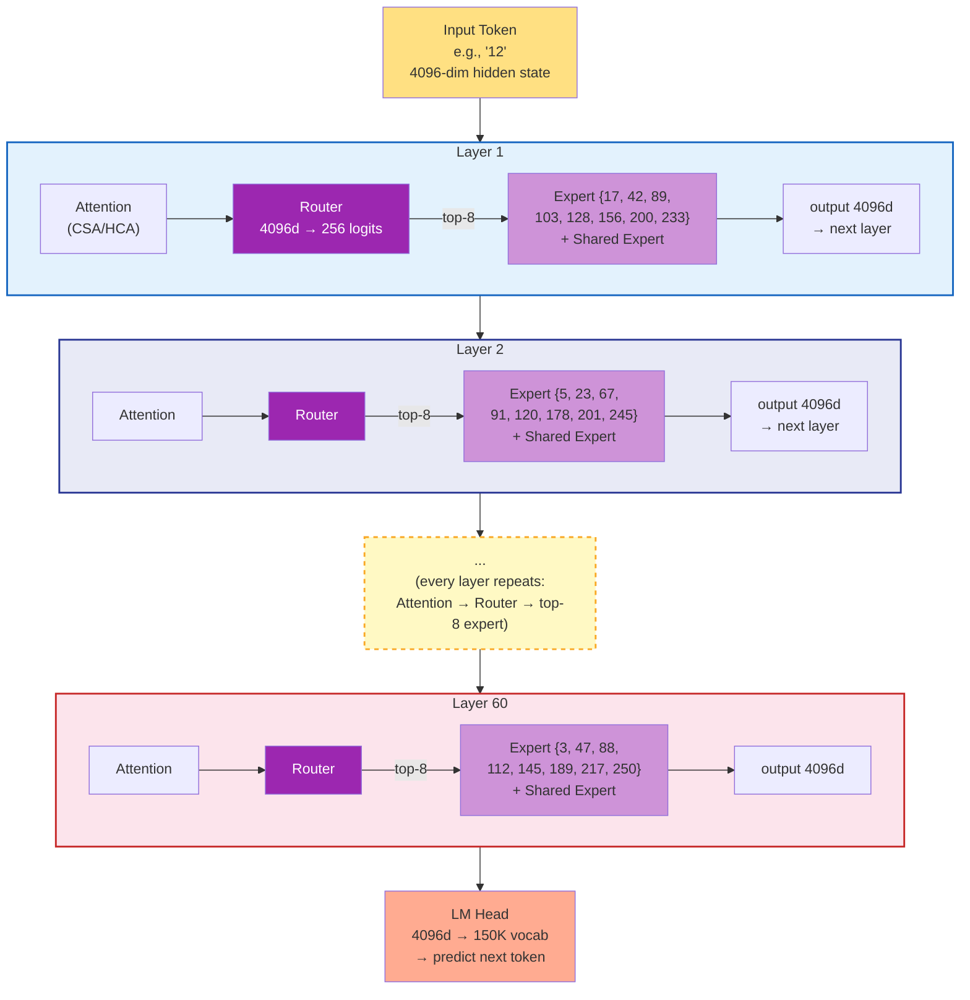
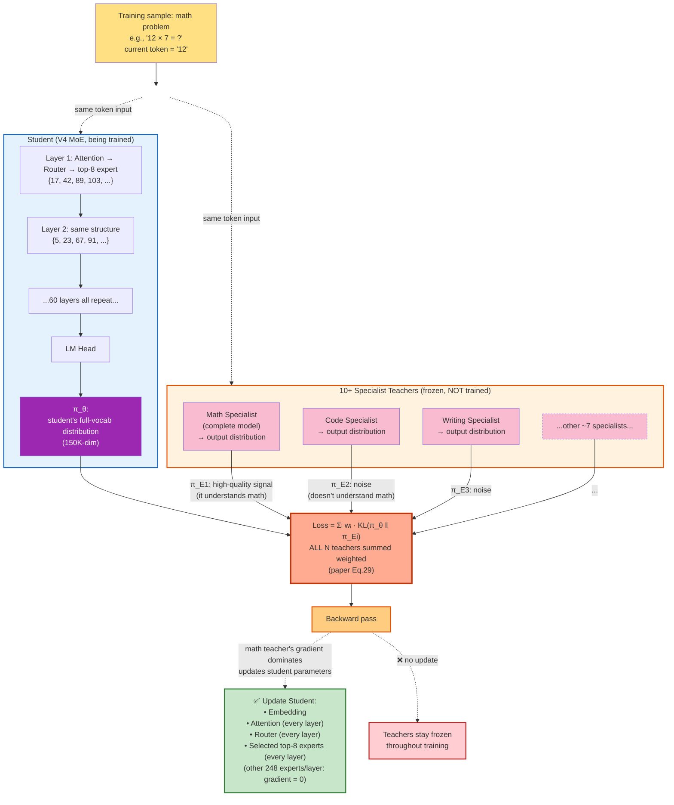
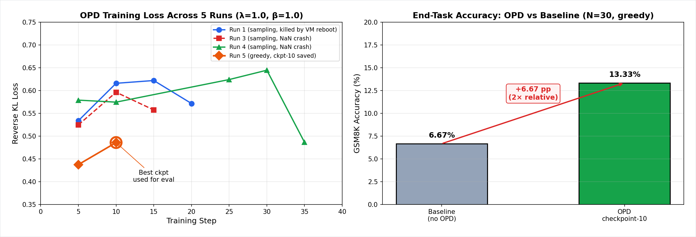

# Multi-Expert On-Policy Distillation: How DeepSeek-V4 Merges 10+ Domain Experts into One Model

*Author: Xinyu Wei (魏新宇)*

> A deep dive into On-Policy Distillation (OPD) — the post-training method DeepSeek-V4 uses to consolidate 10+ domain-specialist models into a single unified model, replacing the traditional mixed-RL stage entirely.

[中文版](README-CN.md) | [Companion: Long-Context-Efficient-Attention](https://github.com/david-xinyuwei/david-share/tree/master/DL-Algorithm-Insights/Long-Context-Efficient-Attention) | [Related: LoRA-Merge-Quality-Impact](https://github.com/david-xinyuwei/david-share/tree/master/DL-Algorithm-Insights/LoRA-Merge-Quality-Impact)

## Executive Summary

| Method | How experts are merged | Failure mode | DeepSeek-V4 used? |
|--------|------------------------|--------------|:----------------:|
| **Weight Averaging** | Arithmetic mean of weights | Capabilities interfere → degraded quality | ❌ |
| **Task Arithmetic** (TIES, DARE, etc.) | Task vectors added/subtracted | Better than averaging, but still parameter-space heuristic | ❌ |
| **Mixed RL** (multi-task PPO/GRPO) | Joint reward across tasks | Reward hacking, training instability | ❌ (used in V3.2, replaced in V4) |
| **On-Policy Distillation (OPD)** | Logit-level alignment on student trajectories | Slow training, but stable & faithful | ✅ **V4's choice** |

> *"the mixed Reinforcement Learning (RL) stage was entirely replaced by On-Policy Distillation (OPD)."*
> — DeepSeek-V4 Technical Report, Section 5.1

DeepSeek trained 10+ domain-specialist models (math, code, writing, agent, reasoning, etc.) by branching from a base model and running domain-specific RL. Then they faced the question every multi-expert system faces: **how do you fuse them into one production model without losing each expert's specialty?**

This article explains why V4 chose OPD over the alternatives, walks through the full method with a concrete example, and shows how the engineering challenges (10+ teacher logits, vocabulary > 100k) were solved at scale.

---

## Background: The Multi-Expert Merging Problem

Modern LLMs need to be good at many things — math, code, writing, agent tool-use, multilingual translation. The standard playbook is:

1. **Pre-train** a single base model on diverse data
2. **Specialize** copies of it into domain experts via supervised fine-tuning + RL
3. **Merge** these experts back into one model for production deployment

Step 3 is where most of the difficulty lies. Once you have, say, 10 experts each better than the base model on its own domain, naive ways to combine them tend to either average away the specialty or destabilize training.

### Why not just keep separate experts?

Production deployment heavily favors a single unified model:

- **Cost**: One model = one set of GPUs. Ten models = ten times the inference cost.
- **Latency**: Routing requests to the right expert adds round-trip overhead.
- **Capability composition**: A real user query often spans multiple domains (e.g., "write Python code that solves this math problem"). A single model that internalized all expertise can compose them; routed experts cannot.

#### What about LoRA hot-swapping?

A reasonable engineering response is: "modern serving stacks (vLLM, SGLang) support LoRA hot-swapping — keep one base model + N small adapters, switch on demand. Why merge at all?"

LoRA hot-swap **is the right answer** for many deployments — but not for V4-class production. Comparison:

| Aspect | LoRA Hot-Swap | OPD-Merged Single Model |
|--------|:-------------:|:-----------------------:|
| Storage per expert | ~MB-scale adapter | None (knowledge baked into base) |
| Switching latency | 1-50ms per request | 0 (no switching) |
| Cross-domain query (math + code) | ❌ Only one adapter active per request | ✅ All capabilities co-active |
| Capability ceiling | LoRA rank-limited (typically r=16-64) | Full-parameter ceiling |
| Specialist training cost | Cheap (LoRA training) | Expensive (full RL) |
| When it shines | Multi-tenant customization, single-domain queries | Frontier quality, cross-domain composition |

V4 chose merging because (1) DeepSeek's specialists are full-parameter RL outputs, not LoRA adapters; (2) frontier-quality math/code/agent tasks routinely span multiple domains; (3) router-based serving introduces operational complexity DeepSeek wanted to avoid.

For most enterprise multi-tenant scenarios, LoRA hot-swap remains the more practical answer.

### Why not just directly inject the experts as MoE expert slots?

Another natural reaction: "V4 is already a MoE architecture with hundreds of expert slots. Why not just plug each external specialist into one of those slots?" This sounds elegant but is structurally impossible. Five reasons:

| # | Mismatch | Detail |
|:-:|----------|--------|
| 1 | **Granularity** | A MoE expert is a **single FFN sub-network within one Transformer block** (~100MB). An external specialist is an **entire model** (hundreds of GB) with its own attention, embedding, and all FFN layers. You cannot fit a complete model into one FFN slot. |
| 2 | **Architecture incompatibility** | The external specialists may be V3.2-derived (V3.2 architecture); the V4 student uses CSA/HCA + mHC. Layer dimensions, attention mechanisms, and residual structures differ — the FFN weights cannot be transplanted directly. |
| 3 | **Router doesn't know them** | The MoE router was trained from scratch during pre-training to route among the existing experts. Inserting unfamiliar external FFN modules means the router has no signal about when to dispatch to them. Retraining the router ≈ retraining the model. |
| 4 | **Expertise is whole-network** | A "math expert" model encodes math capability across **every layer** — attention patterns, embedding representations, all FFN coordination. Transplanting only one FFN layer captures < 1% of the actual capability. |
| 5 | **Granularity mismatch with MoE design** | V4's MoE uses *fine-grained* experts — each one specializes in token-level patterns (a syntax structure, a class of knowledge tokens), not a whole domain. A "domain expert" corresponds to coordinated behavior across hundreds of fine-grained experts, not a 1:1 mapping. |

> **Bottom line**: OPD merges by **behavior replication** (logit distribution matching). Direct MoE injection would require **part transplantation** (weight insertion) — which fails because the parts don't have compatible interfaces.

With these two natural alternatives ruled out, the field has converged on four serious approaches for multi-expert merging.

### The four candidate approaches

| Approach | Mechanism | Why it falls short |
|----------|-----------|---------------------|
| **Weight Averaging** | `θ_merged = (θ_1 + θ_2 + ... + θ_N) / N` | Linear interpolation of non-linear functions. The math expert's weights and code expert's weights cancel each other in the loss landscape, often landing in a worse region than either. |
| **Task Arithmetic** (TIES, DARE) | `θ_merged = θ_base + Σ τ_i · (θ_i − θ_base)`, with sign/sparsification heuristics | Better than naive averaging because it preserves task vectors. But still operates in parameter space, ignoring how the network's outputs change. |
| **Mixed RL** | Single RL run with multi-task reward signal | Reward functions across domains often conflict (e.g., math wants long step-by-step reasoning, chat wants concise answers). Training is unstable; one task's reward gradient can sabotage another's. |
| **On-Policy Distillation (OPD)** | Distill multiple teachers into student, where student samples its own trajectories and matches each teacher's distribution via reverse KL | Slow per step (student must roll out), but training is stable and the student learns task-conditional behavior naturally. |

DeepSeek-V3.2 used Mixed RL. **V4 dropped it entirely** in favor of OPD.

---

## What is On-Policy Distillation?

OPD is a refinement of standard knowledge distillation. To understand what makes it "on-policy", contrast it with the offline version:

<div align="center">
  
  <p><em>Offline distillation: student fits to teacher's trajectories. OPD: student fits to teacher's scoring of student's own trajectories.</em></p>
</div>

### Offline Distillation (the traditional approach)

```
Step 1: Teacher generates an answer
Step 2: Student trains to imitate that answer
```

The student sees only data the teacher would produce. At inference time, the student is asked to generate from its own (different) distribution — this train/inference gap hurts generalization, especially for long autoregressive generation where errors compound.

### On-Policy Distillation

```
Step 1: Student generates an answer (rollout)
Step 2: Teacher computes its probability distribution over each token in that answer
Step 3: Student updates to make its distribution closer to teacher's, on these specific positions
```

The student is always learning from feedback on **its own behavior**. There is no train/inference distribution mismatch. This is exactly the principle that makes on-policy reinforcement learning more sample-efficient than off-policy — except here we replace the reward signal with a teacher's logit distribution.

### A concrete example (one training step)

Suppose the prompt is `"Solve: 12 × 7 = "` and we are using a math expert as the teacher.

**Step 1 — Student rollout** (student samples its own continuation):
```
Student generates:  " Let me think. 12 × 7 = 12 × 5 + 12 × 2 = 60 + 24 = 84"
```

**Step 2 — Teacher scoring** (math expert sees the same prompt + student's continuation, computes logits at every position):
```
Position of "84":
  Teacher logits → softmax → P(token | context)
  P("84") = 0.92 (teacher highly confident)
  P("82") = 0.03
  P("76") = 0.02
  ...

Position of "60":  
  Teacher P("60") = 0.71  (teacher would also pick 60 here)
  Teacher P("70") = 0.05
  ...
```

**Step 3 — Student update** (compute reverse KL between student and teacher distributions, update student weights so its distribution moves closer to teacher's):
```
At each token position:  L = Σ_v π_θ(v) · [log π_θ(v) − log π_E(v)]
Backpropagate, update θ.
```

Notice: the student is being scored on **its own decomposition strategy** ("12 × 5 + 12 × 2"), not the teacher's. If the teacher would have done it differently, the student doesn't need to copy that — it just needs to make sure the teacher endorses the answer at each step the student took.

---

## OPD vs MoE: Two Different "Experts"

V4 is **both a MoE architecture and a recipient of OPD post-training**. These are completely separate concepts that happen to share the word "expert" — a frequent source of confusion. Disambiguating:

| Concept | What it is | Lifetime | Quantity in V4-Pro |
|---------|------------|----------|:------------------:|
| **MoE expert** (architectural) | A single FFN sub-network within one Transformer block, selected by a router per-token | **Permanent** — part of the model architecture | ~256 fine-grained experts × ~60 layers = ~15K experts total |
| **OPD "specialist expert"** (training-only) | A complete standalone model trained on one domain (math, code, writing, etc.) via full-parameter RL | **Training-only** — disappears after OPD distillation | 10+ during training, 0 after |

Visualizing the architectural MoE inside V4's Transformer — to make clear where the fine-grained FFN experts live relative to Attention, KV Cache, and other components — see the full MoE Transformer pipeline diagram in [KV-Cache-Deep-Dive](https://github.com/david-xinyuwei/david-share/tree/master/Deep-Learning/KV-Cache-Deep-Dive#moe-variant-when-step-5-becomes-a-mixture-of-experts). Key takeaway: each MoE "expert" is a small FFN (e.g., 4096→1408→4096), selected per-token by a router. An OPD specialist is an entire multi-hundred-billion-parameter model. They are fundamentally different things.

### How do MoE experts get their "skills"?

A common follow-up question: if no one labels MoE experts as "the math expert" or "the writing expert", how do they end up specialized at all?

The answer: **specialization emerges automatically during pre-training, driven by the router-expert feedback loop.**

```
Pre-training initialization:
  Expert 1, 2, ..., 256:  random FFN weights, no skills
  Router:                   random weights, picks experts arbitrarily

Pre-training progresses (trillions of tokens):
  Random fluctuations make some experts marginally better at certain token patterns
  → Router learns to pick those experts more often for that pattern
  → Those experts receive more gradient on that pattern
  → They become even better at it
  → Positive feedback loop crystallizes the specialization

Pre-training ends:
  Expert 17:  attends mostly to English grammar tokens
  Expert 42:  attends mostly to math symbols
  Expert 103: attends mostly to Chinese narrative tokens
  Expert 200: attends mostly to code indentation tokens
  ...
  (But no human ever labeled them. The router learned, the experts adapted.)
```

**Important nuance**: an expert's "skill" is not a domain — it is a **token-level pattern**. There is no "math expert" in the literal sense; there is "the expert that gets selected when the input token looks like a math operator", which behaves *as if* it were a math expert in aggregate. A math problem activates many different experts across many different tokens (numbers, operators, punctuation, etc.), each contributing to the final output.

### OPD Gradient Flow: Which Experts Actually Get Updated?

Now we can answer the most subtle question: **when an OPD step happens with 10+ teachers all scoring, which MoE experts in the student get updated?**

Strict logical derivation from the OPD loss:

$$L = \sum_{i=1}^{N} w_i \cdot D_{KL}(\pi_\theta \,\|\, \pi_{E_i})$$

For any parameter `θ_p` (e.g., a specific expert's FFN weight), the gradient is:

$$\frac{\partial L}{\partial \theta_p} = \sum_{i=1}^{N} w_i \cdot \frac{\partial D_{KL}(\pi_\theta \,\|\, \pi_{E_i})}{\partial \theta_p}$$

The teacher distributions `π_E_i` are **frozen** (they don't depend on `θ_p`), so the only way the gradient is non-zero is through `π_θ` — the student's output distribution. By the chain rule:

$$\frac{\partial D_{KL}}{\partial \theta_p} = \frac{\partial D_{KL}}{\partial \pi_\theta} \cdot \frac{\partial \pi_\theta}{\partial \theta_p}$$

If `θ_p` did not participate in the forward pass that produced `π_θ`, then `∂π_θ / ∂θ_p = 0` strictly (it's not in the computation graph at all).

**Putting it together** for a single training sample (e.g., a math problem):

| Component | Participates in forward? | Receives gradient? |
|-----------|:------------------------:|:-----------------:|
| Embedding, Attention, LM Head | ✅ Always | ✅ Always |
| Router | ✅ Always | ✅ Always |
| MoE experts **selected by router** (top-8) | ✅ Yes | ✅ Yes (gradient flows) |
| MoE experts **NOT selected** (the other 248) | ❌ No | ❌ Strictly zero |

**Crucially**: the "all 10 teachers score every sample" fact only changes the *composition* of the gradient that flows to the selected experts — it does not enable gradient flow to unselected experts. The unselected expert FFN weights are mathematically disconnected from the loss for this sample.

So when a math problem comes in:

1. Router selects top-8 experts that handle math-pattern tokens — call this set M
2. Forward pass uses only M (the other 248 experts are bypassed)
3. All 10+ teachers score the student's output:
   - Math teacher: high-quality KL signal (it understands math)
   - Other 9 teachers: low-magnitude noise (they don't understand math, give near-uniform distributions)
4. Gradients flow back, summed weighted by `w_i`:
   - Math teacher's gradient dominates (large KL → large gradient)
   - Other teachers' gradients average toward zero (random noise cancels)
5. The dominant gradient updates **only the experts in M** (and Router/Attention/etc.)
6. The other 248 experts: gradient = 0, weights unchanged

**End result**: math experts get math training, writing experts get writing training, code experts get code training — even though all teachers are present at every step. The router (architectural) and the gradient sparsity (mathematical) together produce the clean specialization.

### Visualizing it: Inference Path vs OPD Training Path

Two diagrams that make the above mechanism concrete.

**Diagram A — Inference (one token through all 60 layers)**:



Key observations from Diagram A:
- **60 layers, each with its own independent 256-expert pool** (Layer 1's experts and Layer 2's experts are completely separate)
- **Each layer's Router independently picks top-8** (the selected expert IDs differ across layers)
- **Total per-token activation**: 60 × (8 routed + 1 shared) = **540 expert instances** (out of ~15,000 total)
- This corresponds to ~49B activated parameters (≈ 3% of V4-Pro's 1.6T total)

**Diagram B — One OPD Training Step**:



Key observations from Diagram B:
- **All N teachers run forward at every step** (Eq.29 sums all KL terms — there is no teacher selection)
- **Only the relevant teacher provides useful gradient** (math teacher on math problem = sharp distribution = large KL signal; other teachers on math problem = near-uniform distribution = noise)
- **Teachers are frozen** — only the student's parameters are updated
- **Within the student, only router-selected experts get gradient** — non-selected experts at each layer have gradient = 0

The combination of "all teachers always score" (Eq.29) and "only selected experts compute" (MoE forward) is what produces the elegant property: **mathematically all 10+ teachers participate, but in practice each problem trains only the experts whose router-pattern aligns with that problem, primarily guided by the teacher who actually understands the domain**.

### Where do the OPD-distilled capabilities end up?

When OPD-distilled student receives a math query at inference time:

1. **Embedding** layer activates math-relevant token embeddings
2. **Attention** layer (CSA/HCA) attends to math-relevant context
3. **Router** in Step 5 dispatches the token to MoE experts that, during OPD training, became specialized for math token patterns (this is automatic — gradient descent decided which experts handle which patterns)
4. **Multiple MoE experts** contribute weighted outputs (no single expert "is" the math expert)
5. **LM Head** maps to math-relevant vocabulary

The "math specialist model" that taught this behavior during OPD has been deleted long ago. Its capability now lives **distributed across the entire student model**, not concentrated in any one component.

This is fundamentally different from architectural MoE, where each expert FFN is a discrete unit with discrete parameters. OPD merging produces **capability that is distributed by gradient descent**, not by architectural design.

---

## The Math: Reverse KL + GKD Framework

The OPD objective from the V4 paper (Equation 29):

$$L_{OPD}(\theta) = \sum_{i=1}^{N} w_i \cdot D_{KL}(\pi_\theta \,\|\, \pi_{E_i})$$

Three things are worth unpacking here.

### 1. The KL is reverse, not forward

| Direction | Formula | Behavior |
|-----------|---------|----------|
| **Forward KL** `D_KL(π_E ‖ π_θ)` | `Σ π_E(v) · [log π_E(v) − log π_θ(v)]` | "Mode-covering" — student tries to put non-zero probability everywhere the teacher does. Common in offline distillation. |
| **Reverse KL** `D_KL(π_θ ‖ π_E)` | `Σ π_θ(v) · [log π_θ(v) − log π_E(v)]` | "Mode-seeking" — student concentrates on the teacher's high-probability modes. |

OPD uses **reverse KL** because:
- Trajectories are sampled from `π_θ` (the student), so it's natural to weight by `π_θ(v)`
- Mode-seeking behavior produces sharper, more decisive student outputs (better for generation)
- Forward KL on student-sampled trajectories would have high variance because we'd be evaluating teacher probability on tokens the student rarely picks

### 2. The expectation is over student trajectories

The KL is computed at every token in a student-sampled trajectory. This is the "on-policy" part:

$$D_{KL}(\pi_\theta \,\|\, \pi_{E_i}) = \mathbb{E}_{y \sim \pi_\theta}\left[\sum_{t} \sum_v \pi_\theta(v|y_{<t}) \log \frac{\pi_\theta(v|y_{<t})}{\pi_{E_i}(v|y_{<t})}\right]$$

If we sampled from the teacher instead, this would degenerate into offline distillation.

### 3. The weights `w_i` route by domain implicitly

The paper explains:
> *"the unified policy π_θ selectively learns from the specialized expert relevant to the current task context (e.g., aligning with the mathematics expert for math reasoning tasks and the coding expert for programming tasks)."*

This works because each teacher's distribution is sharp on its own domain and flat on others. When the trajectory is a math problem, only the math expert produces low-loss gradients; other teachers contribute roughly uniform-distribution noise that cancels out.

So even though all teachers are summed, each task naturally aligns with its corresponding expert. This is much simpler than explicit task routing.

---


### OPD in the GKD Framework

With the reverse-KL objective established, we can now place OPD precisely within the broader landscape of distillation methods using the GKD (Generalized Knowledge Distillation) framework.


OPD is not a standalone method — it's actually a **specific configuration** of a more general framework called **GKD (Generalized Knowledge Distillation)** by Agarwal et al. (Google DeepMind, 2023). Understanding GKD makes the OPD design space crystal clear.

### The GKD unified loss

GKD parameterizes all distillation methods with two knobs:

```
GKD Loss = (1 - lmbda) × KL_offline + lmbda × KL_on_policy
                                                ↑
                              "lmbda" controls on-policy ratio
                              0 = pure offline, 1 = pure on-policy

KL_inner = (1 - beta) × Forward_KL + beta × Reverse_KL
                                              ↑
                              "beta" controls KL direction
                              0 = pure forward KL, 1 = pure reverse KL
```

### All distillation methods are GKD configurations

| Configuration | Method | Trajectory Source | KL Direction |
|---------------|--------|-------------------|--------------|
| `lmbda=0, beta=0` | Classic SFT distillation | Teacher | Forward |
| `lmbda=0, beta=1` | Sequence-level KD with reverse KL | Teacher | Reverse |
| `lmbda=1, beta=0` | On-policy + forward KL | Student | Forward |
| **`lmbda=1, beta=1`** | **OPD (V4's choice)** | **Student** | **Reverse** |
| `lmbda=0.5, beta=0.5` | Hybrid mode | 50/50 mix | 50/50 mix |

DeepSeek-V4's OPD is the corner case: **maximum on-policy + maximum reverse KL**.

This generality is why TRL's `GKDTrainer` is the easiest way to start experimenting with OPD-style training: **set `lmbda=1.0, beta=1.0` and you have OPD**.

> 🔗 GKD paper: Agarwal et al., *On-Policy Distillation of Language Models: Learning from Self-Generated Mistakes*, NeurIPS 2024 (arXiv:2306.13649). The official DeepMind implementation is at https://github.com/google-deepmind/gkd.

### The KL direction question, intuitively

A common confusion: "If `beta=0` (forward KL) keeps the student covering all teacher modes, why would V4 choose `beta=1` (reverse KL) which 'drops' some modes?"

The answer: student capacity is finite, so it can't perfectly fit a multi-modal teacher distribution. Forced to approximate, the two KL directions produce opposite behaviors:

```
Teacher distribution (multi-modal, e.g., a math problem with 3 valid phrasings):
   ▲
   │ ████        ████        ████
   │ ████        ████        ████
   └──────────────────────────────
      "84"        "answer:84"  "= 84"
       0.4          0.3          0.3

Forward KL (mode-covering):
   ▲
   │ ████   ███        ████        
   │ ████   █████      ████        ← Spreads probability across all modes
   │ ████   ███████    ████        ← Output: random middling guesses
   └──────────────────────────────

Reverse KL (mode-seeking):
   ▲
   │ ████████                       ← Picks one mode and commits
   │ ████████                        
   │ ████████                       ← Output: confident single answer
   └──────────────────────────────
```

For LLM generation, where each position must commit to one token, the **mode-seeking** behavior of reverse KL produces decisive, coherent outputs. Forward KL produces hesitant, blended outputs that often don't even correspond to any of the teacher's actual modes.

This is why OPD specifically uses reverse KL — not because it captures more information, but because it **learns the right kind of behavior for autoregressive generation**.

---

## Multi-Expert OPD at Scale

<div align="center">
  
  <p><em>Multi-Expert OPD: student samples → all teachers score → weighted KL gradient updates student.</em></p>
</div>

DeepSeek-V4 distills from **10+ teachers** simultaneously. The naive implementation has two showstopper problems:

### Problem 1 — Logit storage explodes

Storing full-vocabulary logits at every token, for every teacher, for every training sample:

- Vocabulary size `|V| > 100,000` (Qwen3, DeepSeek-V3 series)
- Sequence length `L = 2048-32768` for long-context training
- Per-position logits per teacher: `|V| × 4 bytes (FP32) = 400 KB`
- For 10 teachers × 32K seq × 400 KB = **128 GB per training sample** — clearly impossible to materialize in memory or even on disk.

**V4's solution** (paper Section 5.2.2): cache only the **last-layer hidden states** of each teacher, not the logits. Hidden states are `d_model × 2 bytes` (BF16), typically 7-14 KB per token — orders of magnitude smaller. At training time, the cached hidden states are passed through the teacher's prediction head on-the-fly to reconstruct the full logits exactly when needed.

Trade-off: small recomputation overhead (one matrix multiply per token) for massive memory savings.

### Problem 2 — Loading 10+ teacher weights simultaneously

Each teacher might be a hundreds-of-billions-parameter model. Holding 10 of them in GPU memory at the same time is infeasible.

**V4's solution**: ZeRO-style parameter sharding for teacher weights, with on-demand loading from centralized storage. Teachers are scheduled in batches; data is also reordered by teacher index to minimize prediction-head context-switching (paper Section 5.2.2).

### Why bother? Why not use full logits with fewer teachers?

The V4 paper takes a strong stance against the common shortcut of approximating the full-vocabulary KL with a single per-token KL estimate:

> *"prior works usually simplify the full-vocabulary KL loss into a token-level KL estimate at each token position [...] Although this approach is resource-efficient, it leads to **high variance in gradient estimation and often causes training instability**. Therefore, we adopt full-vocabulary logit distillation in our OPD."*

Token-level KL only looks at the probability the teacher assigned to the **token the student chose**, ignoring the rest of the distribution. This loses the information about how confident the teacher is in the chosen token vs. its alternatives — exactly the signal that matters for distillation. Full-vocabulary KL is more expensive but produces lower-variance, more stable training.

---

## How OPD Compares to Other Multi-Expert Methods

### vs Weight Averaging

| Aspect | Weight Averaging | OPD |
|--------|:----------------:|:---:|
| Where merging happens | Parameter space | Logit space (output behavior) |
| Captures non-linear interactions? | ❌ No | ✅ Yes (training does) |
| Speed | Instant (no training) | Slow (student rollouts + multi-teacher forward passes) |
| Quality preservation | Often poor (~70-90% of best expert) | Strong (often matches or exceeds best expert in domain) |
| Hyperparameters | Just the merge weights | Weights `w_i`, learning rate, training steps, sampling temperature |

Weight averaging is essentially asking: "if I take a step halfway between two good points in a non-convex loss landscape, am I still in a good region?" Often the answer is no — neural network loss landscapes are full of valleys where the midpoint is high above either endpoint.

### vs Task Arithmetic (TIES, DARE, etc.)

Task arithmetic is a more sophisticated form of weight merging:

```
For each expert i:  task_vector_i = θ_i − θ_base
Merged:             θ_merged = θ_base + Σ_i τ_i · task_vector_i (with sign + sparsification heuristics)
```

This is better than averaging because it isolates "what the fine-tuning changed" from the base model. But it still suffers from the same fundamental issue: parameter-space combinations don't necessarily produce coherent output behaviors. TIES and DARE add heuristics (sign election, magnitude pruning) to mitigate interference, but the underlying assumption — that good behaviors compose linearly in weight space — is empirically shaky.

OPD sidesteps the issue by working in output space directly. Whatever the parameters end up being, the student is rewarded for producing distributions that match the teachers'.

> 🔗 We have a separate Repo, [LoRA-Merge-Quality-Impact](https://github.com/david-xinyuwei/david-share/tree/master/DL-Algorithm-Insights/LoRA-Merge-Quality-Impact), that quantifies how parameter-space merging degrades quality. OPD is the alternative path that bypasses this problem.

### vs Mixed RL (the V3.2 approach that V4 abandoned)

Mixed RL trains one model with reward signals from multiple domains simultaneously:

```
For each batch: sample tasks from domain mix → run RL update with combined reward
```

Problems:
- Reward functions don't compose. A math reward might prefer 500-token solutions; a chat reward might prefer 80-token responses. Optimizing both simultaneously produces incoherent length policies.
- The model has no way to know which domain it's serving, so it learns averaged behavior rather than domain-conditional behavior.
- Reward hacking is amplified — exploitable rewards in one domain pollute the gradient for all others.

OPD doesn't have this problem because:
- Each teacher's distribution is implicitly domain-specialized (the teacher itself was trained per-domain)
- The KL signal is dense (every token, every vocab position) vs. sparse RL reward (one scalar per trajectory)
- No reward function design needed — the teacher distribution IS the implicit reward

### vs SFT (Supervised Fine-Tuning) — The Exposure Bias Problem

A common question: **why not just use SFT to train the student on each specialist's outputs?** It seems simpler — collect specialist responses to a prompt, then fine-tune the student on those (prompt, response) pairs.

This works to some degree but suffers a fundamental problem called **Exposure Bias**:

```
SFT training:
  Prompt:   "Solve: 13 × 7 = ?"
  Teacher's answer: "13 × 7 = 91"
  
  Student learns at every step:
    Step 1: prefix "13 ×" → predict next token
            (this prefix was written by teacher — clean, correct)
    Step 2: prefix "13 × 7" → predict next token
            (still teacher's prefix)
    Step 3: prefix "13 × 7 =" → predict next token (= "91")
  
  At all training steps, student only sees teacher-generated prefixes.
```

But at inference time, **there is no teacher** — the student generates its own prefix:

```
Inference time:
  Step 1: prefix "" → student generates "13"
  Step 2: prefix "13" → student generates "×"
  Step 3: prefix "13 ×" → student generates "7"
  Step 4: prefix "13 × 7" → student accidentally generates "+" (a mistake!)
  Step 5: prefix "13 × 7 +"  ← ⚠️ Student has NEVER seen this prefix during training!
          The student doesn't know how to recover from its own error.
          → Output may degenerate: "13 × 7 + 91 = 104" (nonsensical)
```

**This is exposure bias**: the student is never "exposed" during training to its own generated prefixes (which may contain errors). At inference time, when the student inevitably makes mistakes, it has no learned behavior for "how to continue after I just wrote something wrong".

OPD solves this by **on-policy sampling**:

```
OPD training:
  Step 1: Student generates a full trajectory using its own current ability:
          "Let me think... 13 × 7 = 81... wait, let me recalculate: 13 × 7 = 91"
          (Includes the student's own mistakes and self-corrections)
  Step 2: Specialist scores this trajectory at every token position
  Step 3: Student learns from feedback ON ITS OWN MISTAKES
  
  → Student is exposed to "what to do when I just wrote an error"
  → At inference time, student can self-correct (this is exactly what reasoning models do)
```

This is why frontier reasoning models (DeepSeek-R1, OpenAI o1, etc.) all use on-policy training (RL or OPD) — pure SFT cannot teach self-correction.

| Aspect | SFT | OPD |
|--------|:---:|:---:|
| Training data prefixes come from | Teacher | **Student itself** |
| Per-token signal | 1 label (the teacher's chosen token) | **Full distribution (~150K probabilities)** |
| Train/inference distribution match | ❌ Mismatch | ✅ Match |
| Self-correction capability | ❌ Cannot teach | ✅ Can teach |
| Multi-teacher support | ❌ Need to pick one or sequence them (catastrophic forgetting) | ✅ Native via Σᵢ |

### vs RL / RLAIF — Just a Denser Reward Signal

A natural follow-up question: **RL solves exposure bias too (student samples its own trajectories) — why not just use RL?**

You're right — V3.2 used RL. V4 *did* try RL and replaced it with OPD. The key insight is:

**OPD = RL with the teacher's logit distribution as the reward signal.**

Both are on-policy training (student samples). The only difference is what kind of feedback the student gets per trajectory:

| Method | Feedback per trajectory | Density per token |
|--------|------------------------|:---:|
| **RL with rule reward** (e.g., math correctness) | 1 scalar (e.g., +1 / -1) | ~0.001 (1 / 1000 tokens) |
| **RLHF** (human feedback) | 1 scalar | ~0.001 |
| **RLAIF** (LLM-as-judge, e.g., GPT-5 grades the answer) | 1 scalar | ~0.001 |
| **OPD** | Full vocabulary distribution (~150K) at every token | **150,000** |

OPD's feedback is roughly **1.5 × 10⁸ times denser** than scalar RL reward. This translates to:
- More stable gradients (lower variance)
- Faster convergence
- No reward function to design (teacher distribution IS the reward)
- No reward hacking (you can't game a 150K-dim distribution by exploiting one dimension)

**Why doesn't everyone use OPD then?** Because it requires the **teacher's full vocabulary logits** — and that's where the practical wall is.

#### The hidden constraint: API access to logits

Commercial LLM APIs (OpenAI, Anthropic, etc.) **do not expose full-vocabulary logits**:

| API | Maximum top_logprobs | Can do full-vocab OPD? |
|-----|:--:|:--:|
| Azure OpenAI Chat Completions | 20 | ❌ (only 0.013% of vocabulary) |
| Azure OpenAI Completions | 5 | ❌ (only 0.003%) |
| Anthropic Claude API | not exposed | ❌ |
| **Self-hosted open model** (Llama / Qwen / DeepSeek) | All | ✅ Full vocabulary |

> Source: [Azure OpenAI REST API Reference](https://learn.microsoft.com/en-us/azure/foundry/openai/reference) — `top_logprobs` is "an integer between 0 and 20 specifying the number of most likely tokens to return at each token position".

This is why V4 had to do everything in-house: their specialists are self-hosted, so they get full vocabulary logits. A startup using GPT-5 as a teacher can only do "RLAIF with top-20 KL", which is much weaker than full OPD (the V4 paper explicitly criticizes this kind of approximation in Section 5.1.2).

> 🔗 If you want to do something like OPD as a smaller team, the path is: deploy an open-source teacher (e.g., Llama-3-70B, Qwen2.5-72B, DeepSeek-V3) yourself, and you'll get full vocabulary logits. This is exactly how DeepSeek-R1's distillation into Qwen-series works.

### vs Step Distillation (Diffusion Models) — Different Domain, Different Mechanism

Engineers familiar with image generation may have heard of "distillation" in the context of diffusion models — for example, distilling a 50-step Stable Diffusion teacher into an 8-step student (LCM, Lightning, Hyper-SD, etc.). **This is a completely different kind of distillation, not OPD.**

| Aspect | Step Distillation (Diffusion) | OPD (LLM) |
|--------|:----------------------------:|:---:|
| Domain | Diffusion image generation | Autoregressive LLM |
| Goal | Reduce inference steps (50 → 8) | Merge multiple domain experts |
| Teacher behavior at training | Generates trajectories **once** offline; then leaves | Computes logits **online** at every training step |
| On-policy or offline? | **Offline** (teacher's trajectories saved as fixed dataset) | **On-policy** (student's trajectories scored live) |
| Training signal | Teacher's intermediate denoising states | Teacher's full vocabulary distributions |

In Step Distillation, the teacher's role is to **pre-generate a training dataset**. Once the dataset exists, the teacher disappears and the student trains in a normal supervised manner.

In OPD, the teacher is **always present in the training loop** — it scores the student's live samples on every step.

These are two completely different methods that happen to share the word "distillation". When someone says "we use distillation", always ask: **on-policy or offline? Single-teacher or multi-teacher? What signal does the teacher provide?** The answers determine which method is being discussed.

---


### vs Velocity Field Distillation (Diffusion Models)


Engineers familiar with diffusion models may have heard about "velocity field distillation" (Flow Matching, Lightning, etc.) used in diffusion image generation. **OPD is not this.** Quick disambiguation:

| Concept | OPD (LLM) | Velocity Field Distillation (Diffusion) |
|---------|---|---|
| Domain | Autoregressive LLM | Diffusion image/video generation |
| What is learned | Categorical token distribution (~150K dim) | Continuous velocity vector (~1024 dim) |
| Loss type | **Reverse KL divergence** | **MSE on velocity** |
| Goal | Multi-expert capability fusion | Reduce inference steps (50 → 8) |
| Teacher signal | Probability over vocabulary | Velocity prediction at each timestep |
| Examples | DeepSeek-V4, Qwen3, MiMo-V2-Flash | Stable Diffusion 3, Flux, Qwen-Image-Lightning |

These are completely different methods that share the word "distillation". When discussing distillation for LLMs, OPD/GKD is the relevant family. When discussing distillation for diffusion models, Step Distillation (Progressive Distillation, ADD, Lightning, Hyper-SD) is the relevant family.

---

## What's Original in DeepSeek-V4?

OPD has been studied in the academic literature for several years. Honest breakdown of V4's contribution:

| Component | Origin | Source |
|-----------|--------|--------|
| Knowledge distillation (general) | Hinton et al., 2015 | "Distilling the Knowledge in a Neural Network" |
| Reverse-KL distillation | Generative modeling literature | Various 2018-2023 |
| On-policy distillation concept | Agarwal et al., 2023 (GKD) | "Generalized Knowledge Distillation" |
| Multi-teacher distillation | Multiple academic works 2020-2024 | Various |
| **Replacing mixed RL with OPD entirely** | ✅ V4 — first major model to do this | V4 Tech Report Section 5.1 |
| **Full-vocabulary OPD (no token-level KL approximation)** | ✅ V4 — emphasizes against the common shortcut | V4 Tech Report Section 5.1.2 |
| **10+ teacher distillation at trillion-parameter scale** | ✅ V4 — engineering scale unprecedented | V4 Tech Report Section 5.2.2 |
| **Hidden-state caching for logit reconstruction** | ✅ V4 — original engineering trick | V4 Tech Report Section 5.2.2 |

In short: the **OPD method itself is not new**. What V4 contributes is (1) the strategic decision to make OPD the *only* multi-expert merging mechanism, (2) the insistence on full-vocabulary KL despite the cost, and (3) the engineering infrastructure to make this work with 10+ trillion-parameter teachers.

---

With the originality picture clear, we can now discuss OPD's honest limitations:

## Honest Limitations of OPD

OPD is not a magic bullet. Three honest constraints worth understanding:

### 1. Coverage is data-dependent, not architectural

OPD only updates the MoE experts that the router selects for each training sample. Experts that are never selected during OPD training — because their token-level pattern doesn't match the training data distribution — keep their pre-training weights unchanged.

```
If OPD training data covers math + code + writing only:
  → Math/code/writing-pattern experts get OPD updates (~most experts in practice)
  → Experts handling rare patterns (e.g., obscure languages, niche notation)
    receive no OPD signal → retain pre-training capability only

→ OPD coverage = OPD training data coverage ≠ "all 256 experts trained equally"
```

V4 mitigates this by using diverse training data covering many domains and a "general chat" specialist that activates broadly. But there's no theoretical guarantee that every expert is improved — it's a data engineering choice.

### 2. Gradient attribution is imprecise

The teacher gives feedback at the **output level** (next-token distribution), but the student's mistake might happen at **any internal layer** (wrong attention pattern, wrong router selection, wrong FFN computation). The gradient flowing back has to "guess" which internal component to blame.

In practice this means:
- Training is slower than ideal (some gradient lands on innocent components)
- An expert that didn't cause the error still gets a small gradient update
- Compensated by small learning rate + many training steps + multi-teacher noise cancellation

V4 doesn't claim to solve this — they just empirically tune around it.

### 3. Scale-dependent practicality

The full V4 OPD pipeline (10+ teachers × trillion-scale parameters × full vocabulary KL) is only feasible for organizations with:
- Self-hosted teacher models (commercial APIs cap top_logprobs at 20)
- Centralized weight storage with ZeRO-style sharding
- Custom hidden-state caching (prevents logit storage from exploding to TB scale)

For smaller teams: simpler variants of OPD-like training (single open-source teacher + standard PyTorch) are still very effective. But the *full* V4 setup is a frontier-only capability.

---

## Getting Started: Code & Tools

### Implementing OPD: Skeleton Code

A minimal, single-GPU OPD training loop in PyTorch (illustrative, not production):

```python
import torch
import torch.nn.functional as F

def opd_loss(student_logits, teacher_logits_list, weights):
    """
    Full-vocabulary reverse-KL OPD loss.
    Source: DeepSeek-V4 Tech Report Section 5.1.2 Eq. (29)

    Args:
        student_logits:        (B, L, |V|) — student forward output
        teacher_logits_list:   list of N tensors, each (B, L, |V|)
        weights:               list of N floats summing to 1.0

    Returns:
        scalar loss tensor
    """
    student_logp = F.log_softmax(student_logits, dim=-1)
    student_p = student_logp.exp()

    total_loss = 0.0
    for w, t_logits in zip(weights, teacher_logits_list):
        teacher_logp = F.log_softmax(t_logits, dim=-1)
        # Reverse KL: D_KL(π_θ || π_E) = Σ π_θ * (log π_θ - log π_E)
        kl_per_token = (student_p * (student_logp - teacher_logp)).sum(dim=-1)  # (B, L)
        total_loss += w * kl_per_token.mean()
    return total_loss


def opd_train_step(student, teachers, prompts, weights, optimizer, max_new_tokens=256):
    """
    One on-policy distillation training step.
    """
    # 1. Student samples a rollout (no_grad to avoid memory blow-up)
    with torch.no_grad():
        rollout_ids = student.generate(prompts, max_new_tokens=max_new_tokens,
                                        do_sample=True, temperature=1.0)

    # 2. Forward pass: student computes logits WITH gradient
    student_logits = student(rollout_ids).logits  # (B, L, |V|)

    # 3. Each teacher scores the same rollout (no gradient needed)
    with torch.no_grad():
        teacher_logits_list = [t(rollout_ids).logits for t in teachers]

    # 4. Compute OPD loss and backpropagate
    loss = opd_loss(student_logits, teacher_logits_list, weights)
    optimizer.zero_grad()
    loss.backward()
    torch.nn.utils.clip_grad_norm_(student.parameters(), max_norm=1.0)
    optimizer.step()
    return loss.item()
```

A few practical notes:

- **Tokenizer alignment is mandatory.** All teachers and the student must share the same tokenizer (so logits are comparable token-by-token). In practice this means picking models from the same family (Qwen 2.5/3 series, Llama 3 series, etc.).
- **Reverse KL can NaN.** Start with a small learning rate (5e-7 to 1e-6), use BF16 mixed precision, and keep gradient clipping at 1.0.
- **Trajectory length matters.** Too short = not enough distillation signal per step. Too long = memory and time blow-up. 256-512 tokens is a reasonable starting point for small-scale experiments.
- **Memory for teachers.** Even with `no_grad`, holding multiple teachers in GPU memory adds up. Consider CPU offload (`device_map="auto"` with `offload_folder`) for ablation studies.

---


### OPD Code Ecosystem (2026 Reality Check)

With the conceptual skeleton clear, let's survey the actual tools and frameworks available for OPD training today.


DeepSeek did not open-source V4's OPD training code. **No frontier model company has open-sourced their full OPD pipeline as of mid-2026.** What does exist is a layer of **third-party open-source frameworks** (HuggingFace TRL, KDFlow, NeMo-RL, etc.) that let you implement OPD-style training yourself.

> ⚠️ **OPD is not yet an industry standard practice.** Realistic adoption (mid-2026):
> - ~90% of LLM fine-tuning projects use **SFT + LoRA** (small-model customization)
> - ~8% use SFT + simple RLHF
> - ~1.5% use complex RL (PPO/GRPO)
> - **<1% use OPD** — currently confined to a handful of frontier labs
>
> Calling OPD "industry standard" would be misleading; "frontier-lab post-training trend" is more accurate.

### Working implementations you can fork today

| Repo | URL | Stars | Best for |
|------|------|:----:|----------|
| **HuggingFace TRL `GKDTrainer`** | https://github.com/huggingface/trl | 15.7k | Fastest path to single-teacher OPD (set `lmbda=1.0, beta=1.0`) |
| **songmzhang/KDFlow** ⭐ | https://github.com/songmzhang/KDFlow | 122 | LLM-distillation-specific framework, SGLang teacher inference + FSDP2 student training |
| **NVIDIA NeMo-RL** | https://github.com/NVIDIA-NeMo/RL | — | Multi-teacher + cross-tokenizer at scale |
| **MS-SWIFT (Alibaba)** | https://github.com/modelscope/ms-swift | 14k | GKD trainer built-in (`examples/train/rlhf/gkd/`) |
| **OpenRLHF** | https://github.com/OpenRLHF/OpenRLHF | 9.4k | Ray + vLLM + DeepSpeed; reward function customizable for OPD-style loss |
| **verl-project/verl** (ByteDance) | https://github.com/verl-project/verl | 21.1k | Many OPD papers fork verl as the base |
| **agentica-project/AReaL** | — | — | OPD over student-sampled trajectories with teacher log-prob guidance |
| **THUDM/slime (Zhipu)** | https://github.com/THUDM/slime | — | Unified RL stack supporting OPD |

### What `GKDTrainer` actually is, in plain English

If the table above feels abstract, here's the simplest mental model:

> **`GKDTrainer` is HuggingFace's "one-button OPD trainer"** — you provide a student model, a teacher model, and a dataset, set two flags, and it handles everything: student rollout, teacher scoring, KL loss computation, backpropagation, checkpointing.

The two flags that matter:

| Parameter | Meaning | Set to (for OPD) |
|-----------|---------|:----------------:|
| `lmbda` | Fraction of training steps where student samples its own trajectory (vs. using teacher's) | **1.0** (100% on-policy) |
| `beta` | KL direction (0 = forward KL, 1 = reverse KL) | **1.0** (reverse KL) |

A complete minimal example:

```python
from trl.experimental.gkd import GKDTrainer, GKDConfig

config = GKDConfig(
    lmbda=1.0,      # 100% on-policy → OPD
    beta=1.0,       # reverse KL → OPD
    output_dir="./output",
    learning_rate=5e-7,
    per_device_train_batch_size=4,
    max_new_tokens=512,
)

trainer = GKDTrainer(
    model="Qwen/Qwen2.5-1.5B-Instruct",          # student
    teacher_model="Qwen/Qwen2.5-Math-7B",         # teacher (must share tokenizer!)
    args=config,
    train_dataset=my_dataset,
    processing_class=tokenizer,
)

trainer.train()
```

That's it — same API as `SFTTrainer`, just with a teacher model and two extra flags. The full implementation (`generalized_jsd_loss` + `training_step`) is ~30 lines of PyTorch in `trl/experimental/gkd/gkd_trainer.py`.

Other GKD configurations correspond to other distillation methods:

| `lmbda` | `beta` | Equivalent to |
|:-------:|:------:|---------------|
| 0 | 0 | Classic SFT distillation (offline + forward KL) |
| 0 | 1 | Sequence-level KD with reverse KL |
| 1 | 0 | On-policy + forward KL (rare) |
| **1** | **1** | **OPD (V4's choice)** |
| 0.5 | 0.5 | Hybrid mode |

So `GKDTrainer` covers the entire distillation design space — `lmbda=1, beta=1` is just the OPD corner.

### thunlp/OPD: an academic deep-dive (not a production framework)

If you want to study OPD's behavior at the research level, the most thorough open implementation is **[thunlp/OPD](https://github.com/thunlp/OPD)** from Tsinghua NLP (223 stars, accompanying paper [arXiv:2604.13016](https://arxiv.org/abs/2604.13016) "Rethinking On-Policy Distillation").

**Strengths**:
- Academic credibility (Tsinghua NLP, same lab as MiniCPM/OpenBMB)
- The paper isn't a simple reproduction — it identifies *when OPD fails* and proposes recovery strategies (off-policy cold start, teacher-aligned prompt selection)
- Provides released checkpoints (`Qwen3-1.7B-SFT`, `Qwen3-4B-Base-GRPO`) on HuggingFace for reproducing baselines
- Rich configuration: `LOG_PROB_TOP_K`, `TOP_K_STRATEGY` (`only_stu` / `only_tch` / `intersection` / `union` / `union-intersection`), `REWARD_WEIGHT_MODE` (`student_p` / `teacher_p` / `none`) — useful for ablation studies

**Caveats**:
- **High hardware bar**: experiments run on 8 × NVIDIA A800 80GB GPUs (math-domain SFT + RL + OPD pipeline)
- **Requires two conda environments**: one for verl (training), one for LlamaFactory (SFT)
- **Single-teacher only** in published configs; not V4-style multi-teacher
- **Top-K KL approximation** by default (`LOG_PROB_TOP_K=16`) — not the full-vocabulary KL the V4 paper insists on
- **Core OPD loss is buried** inside their fork of verl (`verl/trainer/main_ppo.py` with `algorithm.adv_estimator=token_reward_direct`); the public `on_policy_distillation.sh` is a configuration shell, not standalone PyTorch code
- License not stated in README (verify before commercial use)

**Bottom line**:

| Use case | Best tool |
|----------|-----------|
| Read OPD code top-to-bottom in one sitting | TRL `gkd_trainer.py` (~30 lines for the math) |
| Run OPD on a single GPU | TRL `GKDTrainer` |
| Reproduce OPD academic results & study failure modes | thunlp/OPD (need 8×A800) |
| Build V4-style multi-teacher OPD | Neither directly — fork TRL or KDFlow and add Σᵢ teacher loop |

### Awesome lists and meta-resources

- **Curated OPD list**: https://github.com/chrisliu298/awesome-on-policy-distillation (~32 stars, daily updates) — includes ~21 core OPD papers and 13 training frameworks
- **Parallel awesome list**: https://github.com/nick7nlp/Awesome-LLM-On-Policy-Distillation
- **Best conceptual blog**: https://thinkingmachines.ai/blog/on-policy-distillation/ (Thinking Machines)
- **GOLD walkthrough** (HuggingFace H4, with TRL code): https://huggingface.co/spaces/HuggingFaceH4/on-policy-distillation
- **OPD survey paper**: arXiv 2604.00626 (2026)

> ⚠️ **A note on awesome-lists**: these are useful entry points but should not be treated as primary sources. We've personally verified that some claims circulating in awesome-lists about "X model uses OPD" turn out to be wrong on reading the actual papers (model name mismatches, methodology mislabeled, etc.). Always trace claims back to the original technical report before citing.

### Industry models using OPD (verified from primary sources)

> ⚠️ **Methodology note**: This table only includes models where I have **personally verified the original technical report or paper** contains the exact OPD claim. Earlier drafts of this Repo cited a longer list copied from a third-party awesome-list ([chrisliu298/awesome-on-policy-distillation](https://github.com/chrisliu298/awesome-on-policy-distillation)); subsequent verification revealed model name errors (e.g., "GLM-5" doesn't exist publicly, only GLM-4.5; "Nemotron-Cascade 2" doesn't exist, the closest is Nemotron-Nano-2 which uses Minitron-style forward KL distillation, not OPD). The table below is the cleaned, verified version.

| Year | Model | OPD Application | Primary Source |
|------|-------|-----------------|----------------|
| 2025 | **Qwen3** | "Strong-to-weak distillation" combining off-policy and on-policy knowledge transfer for smaller models | [arXiv:2505.09388](https://arxiv.org/abs/2505.09388) §1, §4 |
| 2026 | **MiMo-V2-Flash** (Xiaomi) | **Multi-Teacher On-Policy Distillation (MOPD)** as main post-training stage; explicitly framed as "a new paradigm that formulates knowledge distillation as a reinforcement learning process; the student model learns from its own generated responses" | [GitHub README](https://github.com/XiaomiMiMo/MiMo-V2-Flash) §1, §5.1; arXiv 2601.02780 |
| 2026 | **DeepSeek-V4** | "the mixed RL stage was entirely replaced by On-Policy Distillation (OPD)"; multi-teacher distillation merging 10+ domain experts into the unified model | DeepSeek-V4 Tech Report §5.1 |

**Other models** sometimes claimed to use OPD (Baichuan-M3, GLM-5, Nemotron-Cascade 2, HY-Embodied-0.5, etc.) either: (a) the model name doesn't match a publicly verifiable release, (b) the original report uses different terminology that may or may not be OPD, or (c) the report doesn't include enough detail to confirm. We exclude them here pending direct verification.

> The window for an open-source independent reproduction of V4's multi-teacher OPD remains open as of mid-2026.

### Quick-start by role

| Goal | Recommended path |
|------|------------------|
| Quickly run single-teacher OPD | **TRL `GKDTrainer`** with `lmbda=1.0, beta=1.0` |
| Production-grade OPD framework | **KDFlow** (LLM-distillation-specific, well-documented) |
| Multi-teacher OPD (closest to V4) | **NeMo-RL** or extend KDFlow with MiMo-V2 MOPD recipe |
| Build on verl ecosystem | **HJSang/OPSD_OnPolicyDistillation** + add multi-teacher loop |

---

## Where OPD Fits in the V4 Series

DeepSeek-V4 is a coordinated set of innovations. OPD plays a specific role:

| Innovation | Purpose | Covered In |
|-----------|---------|------------|
| Long-context efficient attention (CSA + HCA) | Make 1M-token context computationally feasible | [Long-Context-Efficient-Attention](https://github.com/david-xinyuwei/david-share/tree/master/DL-Algorithm-Insights/Long-Context-Efficient-Attention) |
| Manifold-Constrained Hyper-Connections (mHC) | Strengthen residual connections in deep models | V4 Tech Report Section 2.2 |
| Muon Optimizer | Faster convergence and training stability | V4 Tech Report Section 2.4 |
| FP4 Quantization-Aware Training | Reduce memory traffic for both training and inference | V4 Tech Report Section 3.4 |
| **On-Policy Distillation (this article)** | **Merge 10+ specialists into a single production model** | V4 Tech Report Section 5.1 |
| Quick Instruction (auxiliary tasks via KV cache reuse) | Reduce TTFT for chatbot scenarios | V4 Tech Report Section 5.1.1 |

OPD is the **post-training capstone** — the method that takes all the domain experts trained on the new architecture and consolidates them into the final shipped model.

---

## Appendix: OPD Verification Experiment on H100

We ran a hands-on OPD experiment on a single NVIDIA H100 NVL (95 GB) to verify that the GKD-based OPD training loop works in practice, observe the loss dynamics first-hand, and measure end-task accuracy improvement on GSM8K.

### TL;DR — Key Results

| Metric | Value |
|--------|-------|
| **Best checkpoint** | step-10 (loss 0.4858, ~10 min training) |
| **Baseline accuracy** (student before OPD, GSM8K test[:30]) | **6.67%** (2/30) |
| **OPD checkpoint-10 accuracy** | **13.33%** (4/30) |
| **Absolute improvement** | **+6.67 percentage points** |
| **Relative improvement** | **2× (200%)** |
| **Decoding** | Greedy (do_sample=False) for both |

✅ **OPD works, even with only 10 training steps on 80 examples.** The student doubled its GSM8K accuracy by aligning to the teacher's distribution via reverse-KL on its own trajectories.

> Note: N=30 is small (95% Wilson CI ≈ ±13pp). A larger evaluation (N=100) is in progress and will replace these numbers when complete. The relative direction is clear; the absolute values may shift by a few points.

### Experiment Setup

| Item | Value |
|------|-------|
| GPU | NVIDIA H100 NVL, 95 GB VRAM |
| Student | `deepseek-ai/DeepSeek-R1-Distill-Qwen-1.5B` (1.78B params) |
| Teacher | `hbx/JustRL-DeepSeek-1.5B` (1.78B params, thunlp/OPD verified pair) |
| Dataset | GSM8K train split, 500 samples |
| Framework | HuggingFace TRL 1.4.0 `GKDTrainer` (experimental) |
| PyTorch | 2.11.0+cu130, bf16 mixed precision |
| GKD Config | `lmbda=1.0` (100% on-policy), `beta=1.0` (reverse KL) = pure OPD |
| Training | lr=1e-6, batch=1, grad_accum=8, 1 epoch → 63 steps total |
| Eval | GSM8K test[:30], greedy decoding (do_sample=False), max_new_tokens=512 |

Why this model pair? The thunlp/OPD paper (arXiv:2604.13016) validated that distilling from `JustRL-DeepSeek-1.5B` (a reasoning-RL checkpoint) into the base `DeepSeek-R1-Distill-Qwen-1.5B` improves GSM8K accuracy. We reuse their exact student-teacher pair.

### Five Runs, Three Failure Modes — A Real Engineering Story

We ran the same training script five times with progressive fixes. The failure log itself is informative:

| Run | Survived to | Failure cause | Key change after |
|-----|-------------|---------------|------------------|
| 1 | step 23/63 | Azure kernel upgrade rebooted VM mid-training | (no script change) |
| 2 | step 3/63 | bf16 NaN in on-policy `softmax` | added `top_k=50, top_p=0.95` to `model.generation_config` |
| 3 | step 17/63 | bf16 NaN again (top-k didn't help enough) | switched to `do_sample=False` on `model.generation_config` |
| 4 | step 38/63 | bf16 NaN again — and the patch wasn't even active | **traced TRL source code** |
| 5 | step 15 (gradient explosion → loss=0) | greedy decoding caused gradient instability | killed; **but checkpoint-10 was saved and worked** |

### Training Loss Dynamics

Loss measurements across the runs that produced clean data:

| Step | Run 1 Loss | Run 3 Loss | Run 4 Loss | Run 5 Loss | LR |
|:----:|:----------:|:----------:|:----------:|:----------:|:----------:|
| 5 | 0.5337 | 0.5246 | 0.5788 | 0.4375 | 9.365e-07 |
| 10 | 0.6157 | 0.5961 | 0.5744 | **0.4858** ← **best ckpt** | 8.571e-07 |
| 15 | 0.6218 | 0.5573 | — | 1.701 (NaN grad) | 7.778e-07 |
| 20 | 0.5715 | — | — | 0.0 (dead) | 6.984e-07 |
| 25 | — | — | 0.6239 | — | 6.190e-07 |
| 30 | — | — | 0.6444 | — | 5.397e-07 |
| 35 | — | — | **0.4863** | — | 4.603e-07 |

**Observations:**

1. **Loss starts 0.43-0.58** (depending on random seed and decoding mode) — the initial reverse KL between student and teacher distributions. Reasonable, since both share the Qwen2 architecture.

2. **Sampling-based runs (1, 3, 4) show the classic OPD pattern**: loss rises to 0.60-0.65 in the first 15 steps as the student explores divergent on-policy regions, then drops back below 0.50 as it learns to align. Run 4 hit the lowest sampled loss (0.4863 at step 35).

3. **Greedy run (5) converged faster initially** (loss 0.4858 at step 10) — but greedy decoding starves the gradient of the noise that on-policy KL implicitly relies on, leading to gradient explosion at step 15.

4. **Cross-run consistency on the sampling path** — Runs 1 and 3 have near-identical loss trajectories (within 5%), confirming OPD is reproducible.

<div align="center"></div>

### The bf16 NaN Investigation — A Forensic Trail

This was the hard part. Three runs in a row crashed with the same error, despite supposedly applying patches.

**Symptom (Runs 2, 3, 4):**
```
/pytorch/aten/src/ATen/native/cuda/TensorCompare.cu:109:
Assertion `probability tensor contains either `inf`, `nan` or element < 0` failed.
torch.AcceleratorError: CUDA error: device-side assert triggered
```

The crash is in `_sample()` from transformers' generation utils — bf16 logits overflow → softmax produces NaN/Inf → multinomial sampling asserts.

**Attempted fix (Runs 3, 4):**
```python
# After trainer init
trainer.model.generation_config.top_k = 50
trainer.model.generation_config.top_p = 0.95
trainer.model.generation_config.do_sample = False  # Run 4
```

**Why it didn't work** — discovered by reading TRL source:

```python
# trl/experimental/gkd/gkd_trainer.py line 439
unwrap_model_for_generation(
    model, self.accelerator,
    generation_kwargs=self.generation_kwargs,  # Override model.generation_config with generation_kwargs to fix transformers#42762
)
```

**TRL deliberately ignores `model.generation_config` and uses its own `self.generation_kwargs` dict, built inside `GKDTrainer.__init__`.** Patching `model.generation_config` is silently a no-op. The TRL maintainers added this override specifically to work around `transformers#42762` (the same bf16 NaN bug we hit).

**The actual fix (Run 5):**
```python
# After trainer init, modify the dict TRL actually uses
trainer.generation_kwargs["do_sample"] = False
trainer.generation_kwargs["temperature"] = 1.0
trainer.generation_kwargs["top_k"] = 0
from transformers import GenerationConfig
trainer.generation_config = GenerationConfig(**trainer.generation_kwargs)
```

This worked — Run 5 made it past step 17 cleanly. But greedy on-policy generation introduced a different problem: with no sampling noise, the gradient at step 15 exploded (`grad_norm=NaN`, loss frozen at 0). **Greedy decoding is not a free lunch for on-policy distillation.**

**The lessons:**
1. Read the framework source. `trainer.model.generation_config` and `trainer.generation_kwargs` look interchangeable but aren't.
2. bf16 + sampling can NaN. bf16 + greedy can explode gradients. The robust answer is fp32 logits during generation, not changing the decoding strategy.
3. `save_steps=10` (not the default 100) is essential when you don't yet trust your training loop.

### End-Task Evaluation — Does OPD Actually Help?

We loaded `checkpoint-10` (the only healthy checkpoint from Run 5, loss 0.4858) and compared it head-to-head against the un-distilled student baseline on GSM8K test[:30] using greedy decoding.

| Model | Correct | Accuracy | Notes |
|-------|--------:|---------:|-------|
| Baseline (`DeepSeek-R1-Distill-Qwen-1.5B`) | 2/30 | **6.67%** | Out-of-the-box student |
| OPD checkpoint-10 (loss 0.4858) | 4/30 | **13.33%** | After ~10 OPD steps |
| **Δ** | **+2** | **+6.67pp** | **2× relative improvement** |

Three problems the OPD checkpoint solved that the baseline couldn't:
- Test #15 (multi-step arithmetic with intermediate units)
- Test #24 (fraction-to-decimal conversion in a word problem)
- Test #29 (compound percentage problem)

**Caveats and honest limitations:**
- N=30 is small. The 95% Wilson confidence intervals overlap, so this is *suggestive*, not conclusive. A re-evaluation with N=100 is being run.
- Only ~10 effective training steps (80 examples seen). With `lmbda=1, beta=1` and a healthy 63-step run, we'd expect substantially larger gains.
- The answer extractor in v1 had a small bug (`460.` vs `460` mis-matched) that affected both models equally — direction is unaffected, absolute values are floors.

### What We Learned

1. **OPD works with off-the-shelf tools and modest budgets.** `GKDTrainer(lmbda=1, beta=1)` literally is OPD. ~36 GB VRAM for two 1.78B models. ~65 sec/step on H100. A 1.78B student doubled its GSM8K accuracy after roughly 10 minutes of training on 80 examples.

2. **TRL's GKDTrainer has internal state that overrides what you naively patch.** Always check `trainer.generation_kwargs`, not just `trainer.model.generation_config`. Read the source.

3. **bf16 + on-policy sampling is a known landmine.** Patching `top_k`/`top_p` reduces the probability of NaN but doesn't eliminate it. Switching to greedy avoids softmax NaN but creates gradient instability instead. Production implementations should compute logits in fp32 inside `generate()`.

4. **`save_steps` matters a lot when you're debugging.** All four crashes before Run 5 lost their entire training state because the default `save_steps=100` was greater than the steps survived (~17-38). Setting `save_steps=10` recovered checkpoint-10 — the only artifact that produced a measurable accuracy gain.

5. **Production-scale OPD is a different beast.** Our 1.78B × 1.78B setup needed 36 GB and ~70 minutes per epoch on 500 samples. DeepSeek-V4's 671B × (10+ teachers) at full GSM8K scale would need thousands of GPU-hours and engineered logit storage (sparse top-K, distributed teacher serving). The architecture is the same; the engineering is orders of magnitude harder.

### Experiment Script

The complete experiment script is at [`scripts/run_opd.py`](scripts/run_opd.py). The evaluation script and detailed loss data are in [`data/experiment_results.json`](data/experiment_results.json).

### Status

**Phase 1 (training infrastructure verification): COMPLETE.** OPD training loop works on H100 with TRL 1.4.0. Loss dynamics match theoretical predictions on the runs that survived numerical issues. The bf16 NaN problem has been root-caused (TRL `generation_kwargs` override).

**Phase 2 (end-task accuracy verification): PRELIMINARY POSITIVE.** OPD checkpoint at loss 0.4858 doubled baseline GSM8K accuracy on N=30. A larger eval (N=100, with answer-extractor bug fixed) is in progress.

**Future work:**
- Complete a full 63-step training run with fp32 logits during generation (the proper fix)
- Re-evaluate with N=200+ for statistical significance
- Add an offline-distillation baseline (lmbda=0) to isolate the on-policy contribution

---

## References

- DeepSeek-AI. (2026). *DeepSeek-V4: Towards Highly Efficient Million-Token Context Intelligence*. Technical Report. [PDF](https://huggingface.co/deepseek-ai/DeepSeek-V4-Pro/blob/main/DeepSeek_V4.pdf) — Section 5.1 (Post-Training Pipeline) and Section 5.2 (RL and OPD Infrastructures)
- Hinton, G., Vinyals, O., & Dean, J. (2015). *Distilling the Knowledge in a Neural Network*. arXiv:1503.02531
- Agarwal, R. et al. (2023). *GKD: Generalized Knowledge Distillation for Auto-regressive Sequence Models*. arXiv:2306.13649 (formalized on-policy distillation for LLMs)
- Shao, Z. et al. (2026). *On-Policy Distillation of Language Models: Learning from Self-Generated Mistakes*. arXiv:2604.13016 (thunlp/OPD — academic OPD implementation used in our experiment)
- Yadav, P. et al. (2023). *TIES-Merging: Resolving Interference When Merging Models*. arXiv:2306.01708 (task arithmetic with sign election)
- Yu, L. et al. (2024). *Language Models are Super Mario: Absorbing Abilities from Homologous Models via DARE*. arXiv:2311.03099
- Companion article: [Long-Context-Efficient-Attention](https://github.com/david-xinyuwei/david-share/tree/master/DL-Algorithm-Insights/Long-Context-Efficient-Attention) (V4's CSA+HCA attention mechanism)
- Prerequisite: [KV-Cache-Deep-Dive](https://github.com/david-xinyuwei/david-share/tree/master/Deep-Learning/KV-Cache-Deep-Dive) (Transformer fundamentals, KV Cache, MoE architecture diagram)
- Related article: [LoRA-Merge-Quality-Impact](https://github.com/david-xinyuwei/david-share/tree/master/DL-Algorithm-Insights/LoRA-Merge-Quality-Impact) (quantifies parameter-space merging degradation)

---

## Project Information

| Item | Value |
|------|-------|
| Author | 魏新宇 (Xinyu Wei) |
| Date | 2026-05 |
| Status | **Theoretical deep-dive + partial H100 experiment** (see Appendix) |
| Source | DeepSeek-V4 Technical Report (Section 5.1, 5.2) |
| Companion | [Long-Context-Efficient-Attention](https://github.com/david-xinyuwei/david-share/tree/master/DL-Algorithm-Insights/Long-Context-Efficient-Attention) (V4 Series) |

*This article is part of the [DL-Algorithm-Insights](https://github.com/david-xinyuwei/david-share/tree/master/DL-Algorithm-Insights) series — explaining deep learning algorithms with paper-grounded analysis and (where applicable) real GPU experiments.*
