# Python 写的 GPU Kernel，怎么一路变成机器码？Tile、Layout、MLIR、NVVM 与 ROCDL 一次讲透

> 高性能 GPU Kernel 的关键，不只是“用 Python 写”，而是能否准确表达数据如何分块、如何映射给线程、如何在存储层级之间搬运，以及这些语义如何逐层降级为目标 GPU 指令。

---

📌 **更多推理优化实践在 GitHub**

- **GitHub Repo**：<https://github.com/david-xinyuwei/david-share>
- **本系列**：`DL-Algorithm-Insights/`

---

*Author: 魏新宇 (Xinyu Wei) | Microsoft AI and Apps GBB Senior System Engineer*

---

FlyDSL、CuTe DSL、Triton、MLIR、LLVM、NVVM、ROCDL 经常出现在同一张技术图里。只看缩写，很容易把三件不同的事混成一件：

1. **Kernel 要怎样切分和搬运数据？**
2. **这些设计怎样表示在编译器里？**
3. **编译器怎样把它变成某一代 GPU 能执行的指令？**

本文只解决这三件事。它不比较某个 Kernel 的实测性能，也不宣称某种 DSL 天然更快。文中的尺寸用于解释机制，不代表任何硬件或算子的通用最优配置。编译链以 2026 年 8 月 28 日可见的 MLIR、NVIDIA CuTe DSL/NVVM 与 AMD FlyDSL 0.3.2 官方文档为准；具体 Pass 和内部 IR 会随版本变化。

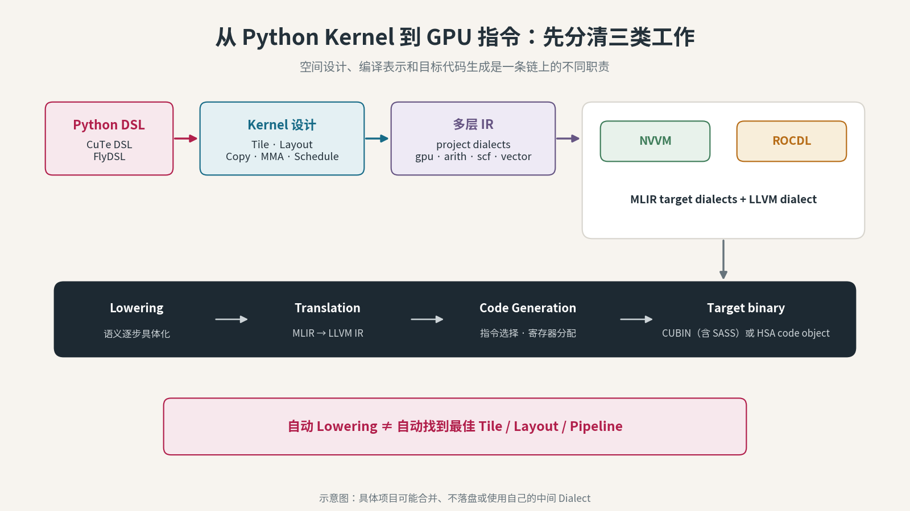

*图 1：Tile、Layout 描述 Kernel 的空间组织；MLIR dialect 保存不同抽象层的语义；lowering 逐层把这些语义变成目标相关操作，最后交给 LLVM 后端生成 GPU 代码。*

## 先把那串缩写拆对

这一组名字连续出现时，听起来很容易被拆错：

| 容易听成 | 正确名称 | 它到底是什么 |
|---|---|---|
| MML、ML + IR | **MLIR** | `Multi-Level Intermediate Representation`，一套可容纳多层 IR 与 Dialect 的编译器基础设施 |
| IR | **IR** | `Intermediate Representation`，源代码与目标代码之间的结构化程序表示 |
| NV + VM | **NVVM** | NVIDIA 官方规范中的 `NVVM IR` 专名；MLIR 里另有对应的 `nvvm` target dialect |
| ROC + DL | **ROCDL** | MLIR 中面向 AMD ROCm/AMDGPU intrinsic 的 target dialect 名称 |

最先要记住：**不是 MML，而是 MLIR；不是 NV + VM，而是 NVVM；不是 ROC + DL，而是 ROCDL。**

本文引用的 NVIDIA 规范把 `NVVM IR` 作为专名使用，导言没有给出可安全引用的词源展开，因此不从字面擅自补全。这里讨论的对象是**基于 LLVM IR 的编译器 IR 与编译链**，不是一台运行时 Virtual Machine。`ROCDL` 同样应作为完整 Dialect 名称使用，其中的 `DL` 不是 Deep Learning。

## 先纠正一个听起来很像的词：是 Tile，不是 Tier

`Tile` 和 `Tier` 读起来接近，但意思完全不同。

| 词 | 含义 | 在 GPU Kernel 里回答什么 |
|---|---|---|
| **Tile** | 瓦片、数据块 | 一个执行单元这次处理哪一块数据？ |
| **Tiling** | 分块策略 | 大矩阵按哪些层级、哪些尺寸切开？ |
| **Tier** | 层级、档位 | 通常用于服务等级、存储层级等，不是这里的矩阵分块概念 |

假设要计算：

$$
C_{M\times N}=A_{M\times K}B_{K\times N}
$$

如果直接把整个矩阵当成一个工作单元，数据装不进片上存储，也无法让大量线程高效协作。Kernel 通常会把问题分层切开。下面只是一组说明结构的示意尺寸：

```text
整个输出矩阵 C
  └─ CTA / Workgroup tile: 128 × 128
       └─ Warp / Wave tile: 64 × 64
            └─ Thread fragment: 每个线程持有若干元素

K 维每轮推进 32 个元素
```

这里的 `128 × 128 × 32` 不是编译器必然选出的答案，更不是所有 GPU 的最优答案。它只说明：**Tiling 把同一个数学问题分配给不同层级的执行单元。**

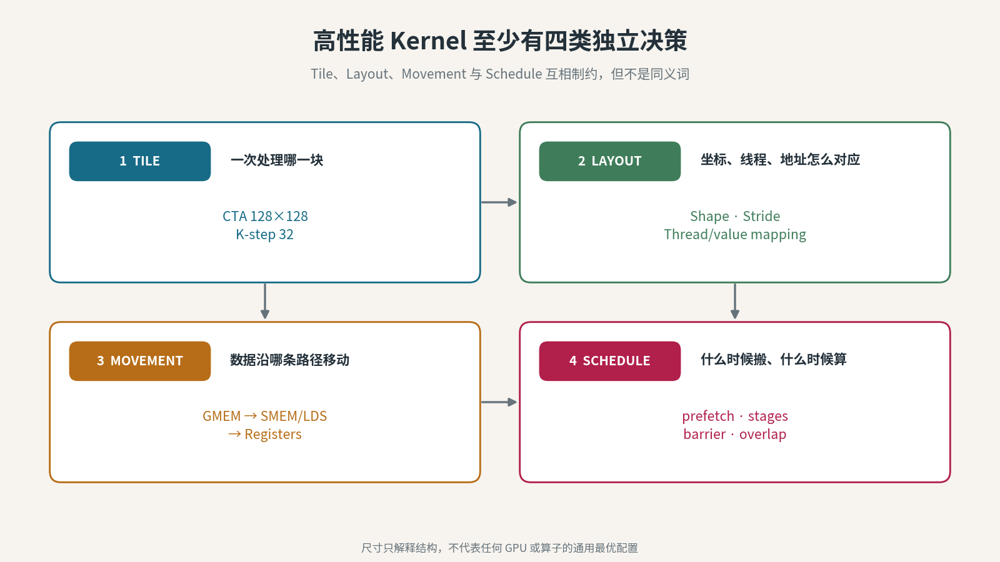

*图 2：Tiling 选择各层 Tile，Layout 决定映射关系，Movement 决定数据路径，Schedule 决定执行先后与重叠方式。四者相互影响，但不是同一个概念。*

## Tile 只回答“哪一块”，Layout 才回答“怎么对应”

Tile 选出一块数据之后，仍有很多问题没有答案：

- 这块数据在显存中的地址如何计算？
- 哪个 Block、Warp/Wave、Thread 负责哪个元素？
- 数据怎样从 Global Memory 搬到 Shared Memory/LDS？
- Shared Memory/LDS 中是否需要 swizzle（按规则打散地址）来避开 bank conflict？
- 哪些元素最终进入哪些寄存器，才能满足 MMA/MFMA 指令的 fragment 约束？

这些映射关系才是 `Layout` 的核心。

### 第一类 Layout：逻辑坐标到线性地址

对一个常规 strided layout，可以写成：

$$
\text{offset}=\text{base}+\sum_i \text{coord}_i\times\text{stride}_i
$$

一个 `2 × 4` 的矩阵，如果 `Stride=(4,1)`，坐标 `(1,2)` 对应：

$$
1\times4+2\times1=6
$$

如果改成 `Stride=(1,2)`，同一个逻辑坐标对应：

$$
1\times1+2\times2=5
$$

数学上的元素没变，物理访问顺序变了。

### 第二类 Layout：线程到数据的所有权

高性能 Kernel 还要回答：

```text
(thread_id, value_id) → logical_coordinate
```

这不是“数据存在哪个地址”的同义反复。前者是**线程和值的所有权映射**，后者是**逻辑坐标到存储地址的映射**。两种映射组合以后，编译器才能知道某个线程最终应该读取哪个地址、把结果保存在什么寄存器位置。

### 第三类 Layout：存储层级之间的搬运关系

一条典型数据路径是：

```text
Global Memory
    ↓ tiled / vectorized copy
Shared Memory（NVIDIA）或 LDS（AMD）
    ↓ fragment load
Registers
    ↓ MMA / WGMMA（NVIDIA）或 MFMA（AMD）
Matrix execution units
```

这里的 `fragment`，是一个线程或一组线程按矩阵指令约定持有在寄存器中的那部分矩阵。MMA/MFMA 对操作数的 Shape、dtype、线程分工和寄存器排列都有约束；通用的 Shared Memory/LDS 排列需要经过 fragment load 或等价的数据重排，才能变成矩阵指令接受的输入。Layout 不匹配时，轻则增加额外 permute/transpose，重则无法生成合法指令。

每次箭头都可能改变数据的视图、排列和所有权。一个 Layout DSL 的价值，不是替代乘法，而是让这些关系成为编译器可以检查、组合和变换的对象。

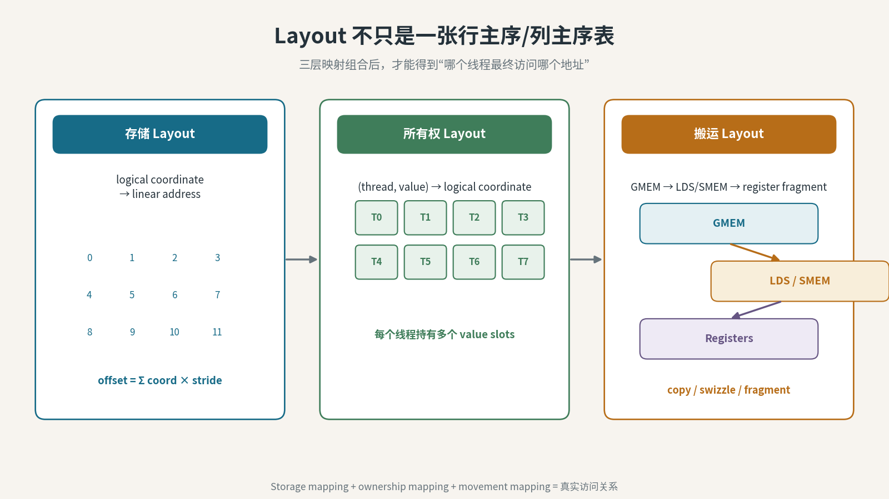

*图 3：存储 Layout、线程所有权 Layout 和数据搬运 Layout 共同决定某个线程最终访问哪个地址，以及数据怎样进入矩阵指令 fragment。*

## Schedule 是第四件事：什么时候搬、什么时候算

即使 Tile 与 Layout 已经确定，Kernel 仍然可能很慢，因为搬运和计算可能串行等待。

Schedule 负责的是：

- 先搬哪一个 Tile；
- 是否 double buffering；
- 预取下一块与计算当前块是否重叠；
- barrier 放在哪里；
- pipeline 有几个 stage；
- 多个 Warp/Wave 如何分工。

因此，高性能 Kernel 至少有四类独立决策：

| 决策 | 核心问题 | 常见参数或对象 |
|---|---|---|
| Tile | 一次处理多大范围 | `BLOCK_M`、`BLOCK_N`、`BLOCK_K` |
| Layout | 坐标、线程、地址如何映射 | Shape、Stride、swizzle、thread/value mapping |
| Movement | 数据沿哪条存储路径移动 | GMEM→SMEM/LDS→Register、vector width |
| Schedule | 搬运和计算如何排序、重叠 | stages、prefetch、barrier、warp specialization |

**自动 lowering 不等于自动找到这四类决策的最优组合。** 编译器可以验证、化简和执行很多机械变换；开发者、库作者或 autotuner 仍要提供搜索空间、约束和候选配置。

## Tile 下面还有两套硬件层级：执行层级与存储层级

Tile 最终要分给真实执行单元，数据也要落到真实存储资源。两套层级必须同时看。

### 执行层级

| 抽象职责 | NVIDIA 常用名称 | AMD 常用名称 | MLIR `gpu` 常用抽象 |
|---|---|---|---|
| 一次 Kernel 启动覆盖的全部工作 | Grid | Grid | Grid |
| 一组可共享片上内存并同步的线程 | Thread Block / CTA | Workgroup | Workgroup / Block |
| 锁步或近似锁步执行的线程子组 | Warp | Wavefront | Subgroup |
| 最小线程上下文 | Thread / Lane | Work-item / Lane | Thread / Work-item |

这些名字表达相似职责，不代表固定宽度或完全相同的执行规则。不能把“Warp 永远是 32、Wavefront 永远是 64”写成跨架构定律；宽度和能力应由目标架构与实际编译配置确认。

部分目标还支持位于 Grid 与 Block 之间的 Cluster。无论层级有几层，GPU Lowering 通常要求输入已经带有显式并行结构；它可以把 `gpu.thread_id`、`gpu.launch` 等语义转成目标操作，但不会把任意串行循环自动发明成最佳 Grid/Block/Thread 分解。

### 存储层级与 Address Space

| 语义范围 | NVIDIA 常见叫法 | AMD 常见叫法 | MLIR `gpu.address_space` |
|---|---|---|---|
| 设备全局可见 | Global Memory | Global Memory | `global` |
| 同一 Block/Workgroup 共享 | Shared Memory | LDS | `workgroup` |
| 单线程私有 | Thread-private Register；spill 后进入 Local Memory | Thread-private VGPR/SGPR；spill 后进入 Scratch Memory | `private` |
| 只读设备数据 | Constant Memory | Constant/只读路径 | `constant` |

Address Space 是 IR 中的**语义标签**，告诉编译器一块内存的可见范围和目标类别；它不等于已经完成了物理寄存器分配。尤其是 `private`，编译器希望把短生命周期值留在寄存器，但寄存器压力过高时仍可能 spill 到更慢的线程私有内存。

Barrier 与 Stream 也不在同一层：Barrier 协调某个设备执行范围内的线程，并按语义建立相应内存可见性；Stream 是 Host 向设备提交异步工作的队列与顺序关系。两者都影响 Schedule，但不能互相替代。

### 为什么 Tile 会反过来改变 Occupancy

增大 Tile 可能提高数据复用，也可能同时增加：

- 每个线程所需寄存器；
- 每个 Workgroup 所需 Shared Memory/LDS；
- 每个 Block 的线程数；
- barrier 和流水线状态。

这些资源会限制一个 SM/CU 能同时驻留多少 Block/Workgroup，也就是 Occupancy（占用率）的资源基础。**Occupancy 更高不等于一定更快，Tile 更大也不等于一定更快。** 二者都必须和访存、指令吞吐、延迟隐藏及实际 Shape 一起测量。

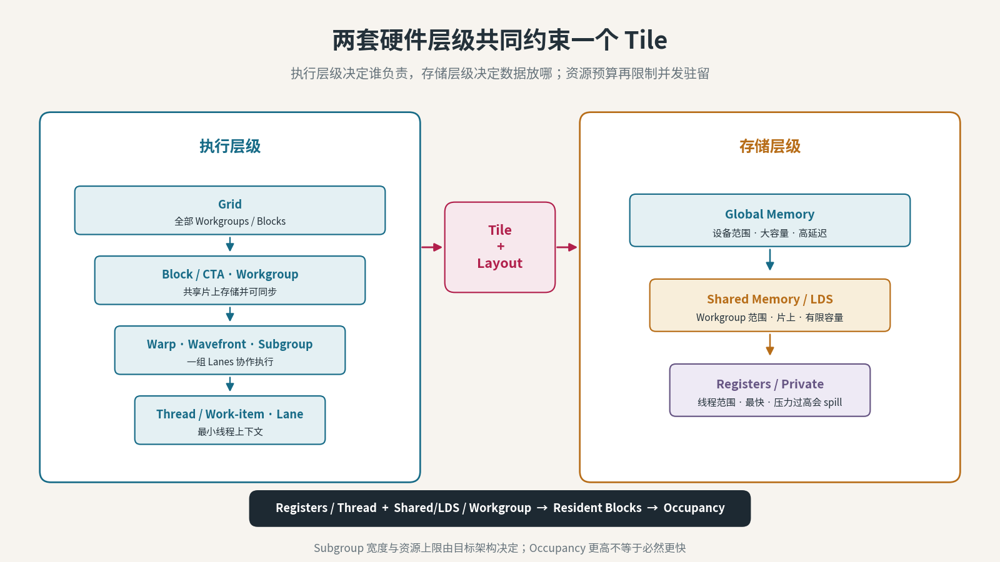

*图 4：Grid→Block/Workgroup→Warp/Wave→Thread 是执行层级；Global→Shared/LDS→Register 是存储层级。Tile、Layout 和资源预算把两套层级连接起来。*

## IR 到底是什么

IR 是 **Intermediate Representation（中间表示）**。它不是又一种给人写业务逻辑的语言，而是编译器在不同阶段保存程序语义的数据结构。

源代码里的一行：

```python
tile_a = logical_divide(A, tile_shape)
```

进入编译器以后，不能只剩字符串。编译器需要知道：

- `A` 是什么类型；
- `tile_shape` 是编译期常量还是运行时值；
- `logical_divide` 改变的是视图、所有权还是实际存储；
- 结果 Layout 的 Shape 和 Stride 是什么；
- 后续 load 需要进入哪个 address space；
- 这个操作能否与其他操作合并或重排。

IR 保存这些结构化信息，Pass 才能对它进行分析和变换。

## MLIR 不是“一层 IR”，而是一套容纳多层 IR 的框架

MLIR 的全称是 **Multi-Level Intermediate Representation**。这里最容易产生的误解，是把 MLIR 画成 Python 与 LLVM IR 之间唯一的一格。

更准确的理解是：

> **MLIR 提供统一的 Operation、Value、Type、Attribute、Region、Block 和 Pass 基础设施；不同抽象层通过不同 Dialect 共存于同一个编译器框架中。**

一个 MLIR Module 在某个中间时刻，完全可能同时包含：

```text
项目自己的高层 dialect
+ gpu dialect
+ arith dialect
+ scf dialect
+ memref dialect
+ vector dialect
+ 少量已经降到 llvm / nvvm / rocdl 的操作
```

所以“已经进入 MLIR”并不能说明程序已经接近机器码。必须继续问：**现在主要是什么 Dialect？哪些高层语义还没有被消解？**

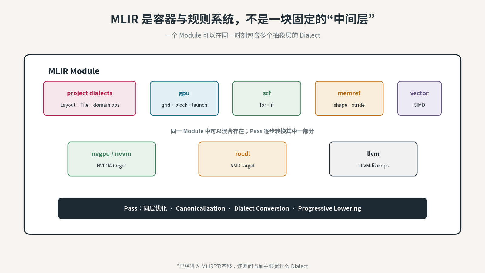

*图 5：MLIR 是框架；Dialect 是带命名空间的操作、类型和属性集合；Pass 在同一 Dialect 内优化，或把一种 Dialect 的语义转换到更低层 Dialect。*

## Dialect 是什么

Dialect 可以理解成编译器里的“专业词汇表”，但它不是只有语法名称。一个 Dialect 可以定义：

- Operations：允许做什么操作；
- Types：值和对象具有什么结构；
- Attributes：编译期常量和操作属性；
- Verification：什么组合才是合法的；
- Rewrite/Conversion：怎样优化或转换到其他 Dialect。

例如：

| Dialect | 主要保留什么语义 |
|---|---|
| `arith` | 与目标无关的算术操作 |
| `scf` | 结构化控制流 |
| `memref` | 带 Shape、Stride、Memory Space 的内存引用 |
| `vector` | 向量级操作 |
| `gpu` | 通用 GPU grid/block/thread 与 kernel launch 语义 |
| `nvgpu` | 更靠近 NVIDIA GPU 的高层目标特性 |
| `nvvm` | NVIDIA NVVM intrinsic 与低层目标操作 |
| `rocdl` | AMD ROCm device-library/AMDGPU intrinsic 与低层目标操作 |
| `llvm` | MLIR 中贴近 LLVM IR 的操作与类型 |

FlyDSL 还定义了自己的 Fly dialect，把 `!fly.layout` 等对象作为一等公民。这里的 `!` 是 MLIR 自定义类型语法的一部分；`!fly.layout` 是 FlyDSL 项目定义在 MLIR 框架内的 Dialect Type，不是 MLIR 之前的另一套独立 IR，也不是一个不透明的 Python 字符串。正因为 Shape、Stride 等语义进入了结构化类型，Verifier 和 Pass 才能检查、推导和改写它。其他 DSL 也可以定义自己的项目 Dialect；是否使用相同名字、相同 Pass 和相同中间层，取决于具体编译器实现。

## MLIR 的 IR 里面究竟装着什么

下面一行足以拆出最常用的 IR 基本件：

```mlir
%sum = arith.addf %a, %b : f32
```

| 基本件 | 在例子里是什么 | 作用 |
|---|---|---|
| **Operation** | `arith.addf` | 一次带语义的操作 |
| **Operand** | `%a`、`%b` | Operation 消费的输入 Value |
| **Result Value** | `%sum` | Operation 产生的结果 |
| **Type** | `f32` | 约束输入和输出的表示与合法操作 |
| **Attribute** | 此例没有；常见如 target、shape、layout mode | 永不由运行时变量提供的编译期属性 |
| **Block** | 一串有顺序的 Operations | 基本控制流与参数容器 |
| **Region** | 一个或多个 Blocks | Function、Loop、If、Kernel Body 等嵌套结构 |

MLIR 常使用 SSA（Static Single Assignment，静态单赋值）形式：一个 Value 只有一个定义点，可以有多个使用点。Pass 因而能沿 Use-Def Chain（使用—定义链）追踪“这个值从哪来、被谁使用”。

### Verifier、Analysis、Pattern、Pass、Pipeline 各管什么

| 机制 | 核心职责 | 不能替代什么 |
|---|---|---|
| **Verifier** | 检查 Operation、Type、Attribute 和结构约束是否合法 | 不证明性能，也不自动选择最优配置 |
| **Analysis** | 计算别名、支配关系、Use-Def 等信息，不修改 IR | 不执行转换 |
| **Rewrite Pattern** | 匹配一种 IR 形状并替换为另一种形状 | 单个 Pattern 不等于完整编译流程 |
| **Pass** | 在某个 Operation/Region 范围运行 Analysis 或 Rewrite | 一个 Pass 不保证完成全量 Lowering |
| **Pass Pipeline** | 按嵌套结构和顺序组织多个 Pass | Pipeline 名相同也要核对选项和版本 |
| **Conversion Target** | 声明哪些 Dialect/Operation 合法、动态合法或非法 | 不提供实际 Rewrite Pattern |
| **Type Converter** | 定义源 Type 怎样变成目标 Type | 不决定业务算法 |

Dialect Conversion 可以是 Partial 或 Full：Partial Conversion 允许未被判定为非法的旧 Operation 暂时留下；Full Conversion 则要求所有目标外的非法 Operation 都被合法化。因此，“某个 Pass 跑完了”不等于“所有高层 IR 都消失了”。

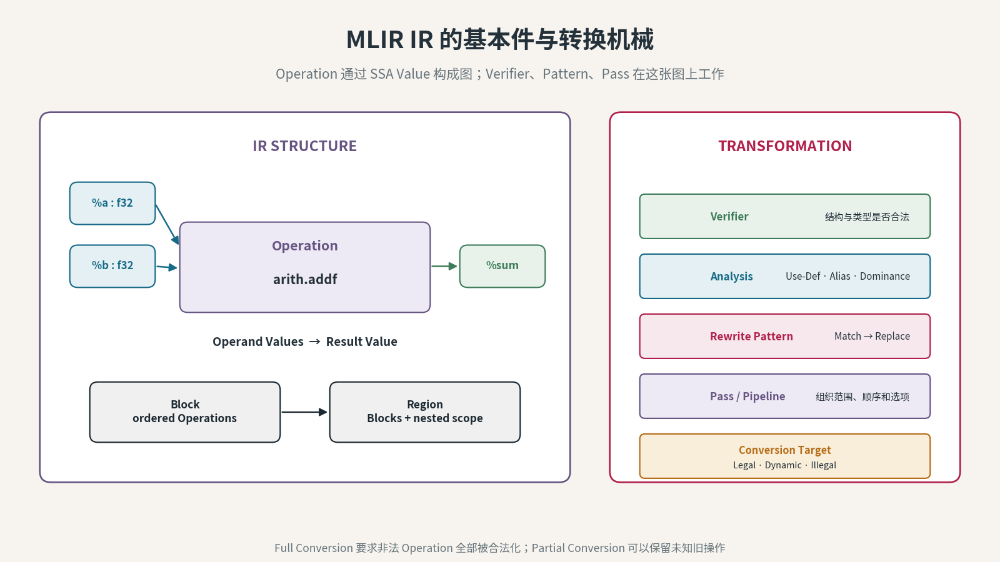

*图 6：Operation 通过 SSA Value 构成图，Type 和 Attribute 约束语义，Block/Region 提供层级；Verifier、Pattern、Pass 与 Conversion Target 在这个结构上工作。*

## Tensor、MemRef、Bufferization 与 Address Space

`Tensor` 和 `MemRef` 都能描述多维数据，但关注点不同。

| 对象 | 核心语义 | 是否直接暴露可写存储 |
|---|---|---|
| **Tensor** | 值语义；Operation 产生一个新 SSA Value | 通常不直接表达可变 Buffer |
| **MemRef** | 对一块内存的结构化引用，包含 Shape、Stride、Offset、Element Type、Memory Space | 是 |
| **Pointer** | 一个地址；信息量通常少于 MemRef | 是，但 Shape/Stride 需从别处获得 |

Bufferization 是把 Tensor 语义改写为 MemRef/Buffer 语义的过程。它要决定结果复用已有 Buffer，还是分配新 Buffer；主要目标是少分配、少复制，同时不能覆盖后续仍需读取的数据。

```text
tensor operations
    ↓ alias / use-def / read-after-write analysis
in-place reuse or new buffer + copy
    ↓
memref operations with shape / stride / address space
```

Bufferization 是 Lowering 家族中的一个具体阶段，但不等于全部 Lowering，也不等于“给每个 Tensor 直接 malloc 一块内存”。遇到 Read-after-Write 冲突、不可写 Buffer 或无法证明别名安全时，编译器可能插入复制。

并非每个 Python Kernel DSL 都先构造纯 Tensor IR 再运行 MLIR One-Shot Bufferize。例如 FlyDSL 的 `fx.Tensor` 在 Host Boundary 通过 DLPack 映射到 MemRef Descriptor，内部还可直接构造带 Layout 的 MemRef/View。判断实际路径必须看该 DSL 的当前 IR Dump 和 Pass Pipeline。

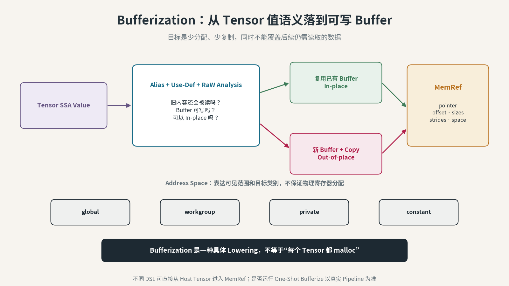

*图 7：Bufferization 把值语义连接到可写 Buffer，并处理复用、复制和别名安全；Address Space 再表达 Global、Workgroup、Private 等可见范围。*

## Lowering 到底做了什么

Lowering 常被翻译为“降级”或“下沉”。它的核心不是把代码写得更低级，而是：

> **在保持所需程序语义的前提下，把高层、复合、目标无关的操作，逐步改写为更具体、更接近目标硬件的操作。**

例如一个高层 Layout 切分操作，可能逐步变成：

```text
高层：把矩阵按 Tile 分给不同线程组
  ↓
坐标层：计算每个 Block/Wave/Thread 的逻辑坐标
  ↓
内存层：把坐标线性化为 offset，确定 address space
  ↓
搬运层：生成 vector load/store、shared/LDS copy、barrier
  ↓
计算层：生成目标相关 MMA/MFMA intrinsic
  ↓
后端：寄存器分配、指令选择、调度、机器码编码
```

Lowering 可以是**渐进的、局部的**。一次 Pass 可能只处理一种 Dialect，Module 中其他操作暂时保留。它也不一定把每一层都输出成独立文件；很多中间表示只存在于内存中。

### Pass、Conversion、Translation 不是一个词

| 过程 | 常见含义 |
|---|---|
| **Optimization / Canonicalization** | 在同一抽象层化简、折叠或重排操作 |
| **Dialect Conversion / Lowering** | 把一种操作语义改写为另一组更低层操作 |
| **Translation** | 在两个 IR 系统之间做接近机械的表示转换，例如 MLIR LLVM dialect → LLVM IR |
| **Code Generation** | 由后端完成指令选择、寄存器分配和目标二进制生成 |

这几个阶段可以由同一个工具进程串起来，但职责不同。

## 最容易混淆的一组词：LLVM dialect 不等于 LLVM IR

这两个名字非常接近，但不是同一个对象。

### LLVM dialect

它仍然属于 MLIR：

```mlir
%ptr = llvm.getelementptr %base[%offset] : (!llvm.ptr, i64) -> !llvm.ptr
%v = llvm.load %ptr : !llvm.ptr -> f32
```

它使用 MLIR 的 Operation、Type、Attribute 和 Pass 基础设施，只是语义已经贴近 LLVM IR。

到 Translation 阶段，这个 load 的表示变化已经接近机械映射：

```text
MLIR LLVM dialect:  %v = llvm.load %ptr : !llvm.ptr -> f32
LLVM IR:            %v = load f32, ptr %ptr
```

`!llvm.ptr` 变成 LLVM IR 的 `ptr`，MLIR Operation 变成 LLVM instruction；主要语义变换应当已经在此前的 MLIR Lowering 中完成。

### LLVM IR

这是 LLVM 自己的核心中间表示。MLIR 官方文档把生产 LLVM IR 分成两步：

1. 先把其他 MLIR Dialect 转成可翻译到 LLVM IR 的 Dialect，例如 `llvm`、`nvvm`、`rocdl`；
2. 再把这些 MLIR Operation 翻译为 LLVM IR instruction 和 intrinsic。

所以更准确的箭头是：

```text
MLIR high-level dialects
    ↓ conversion / lowering
MLIR LLVM + target dialects
    ↓ translation
LLVM IR + target intrinsics
    ↓ LLVM target backend
machine code
```

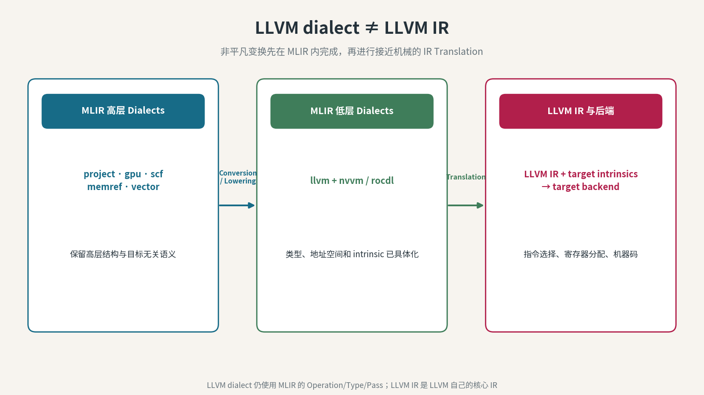

*图 8：MLIR 内部先完成非平凡变换，再把已经贴近 LLVM 的 Dialect 翻译为 LLVM IR。LLVM dialect 是 MLIR 的一部分，不应与 LLVM IR 画成同一个框。*

## NVIDIA 路线：NVVM 是哪一块

这里还要区分两个相关但不同的名字。

### MLIR 的 `nvvm` dialect

这是 MLIR 中的 NVIDIA 目标 Dialect。它位于 `gpu` / `nvgpu` 等更高层 Dialect 之下，表达：

- thread/block builtins；
- barrier、atomic、warp collective；
- `mma.sync`、WGMMA 等矩阵操作；
- `cp.async`、TMA 等数据搬运；
- NVIDIA address space 和目标属性。

它的设计目标是贴近 NVVM/LLVM intrinsic，而不是继续承载方便使用的高层复合操作。

### NVIDIA 的 NVVM IR

NVIDIA 文档中的 NVVM IR 是建立在 LLVM IR 之上的编译器 IR 规范。MLIR `nvvm` dialect 翻译以后，会在 LLVM IR 中体现为相应的 NVVM intrinsic 和目标信息，再进入 NVPTX 工具链。

### PTX 与机器码

PTX 是 NVIDIA 的虚拟指令集，不是最终芯片机器码。典型概念链可以画成：

```text
upstream MLIR 的 NVIDIA 参考路径
gpu / nvgpu 等高层或项目 IR
    ↓ lowering
MLIR nvvm + llvm dialects
    ↓ translation
LLVM IR with NVVM intrinsics
    ↓ NVPTX / CUDA toolchain
PTX
    ↓ assembler / driver JIT
CUBIN（其中承载 SASS 机器指令）
```

CuTe DSL 官方 Code Generation 文档公开的是另一种粒度：Python 经 AST rewrite 与 tracing 形成内部 IR，再经过 lowering 和优化生成 PTX/SASS 与 device binary。本文不把其未在该文档中承诺的每一个内部 Dialect 名称补写进去。具体项目可能合并、绕过或不落盘展示某些中间阶段。

## AMD 路线：ROCDL 是哪一块

MLIR 的 `rocdl` dialect 是 AMD 目标侧的低层 Dialect，用来表示 ROCm device-library 与 AMDGPU 相关 intrinsic 和操作。它与 `nvvm` dialect 处在相似的**编译职责位置**，但不是兼容 API，也不是逐操作一一对应。

FlyDSL 官方将自身定义为：Python 前端 + MLIR compiler stack + 显式 Layout Algebra，目标是 AMD ROCm/HIP GPU。它的概念链可以画成：

```text
FlyDSL Python
    ↓ AST rewrite / tracing
Fly dialect + gpu / arith / scf / memref / vector
    ↓ layout canonicalization + lowering
MLIR rocdl + llvm dialects
    ↓ translation
LLVM IR with AMDGPU / ROCm intrinsics
    ↓ LLVM AMDGPU backend + ROCm toolchain
AMDGPU code object（常见为 HSACO）
    ↓ runtime load
gfx machine instructions
```

ROCDL 不是一种 Python DSL，也不是 ROCm 的别名。它是 lowering 链中靠近 AMD 目标操作的一层。

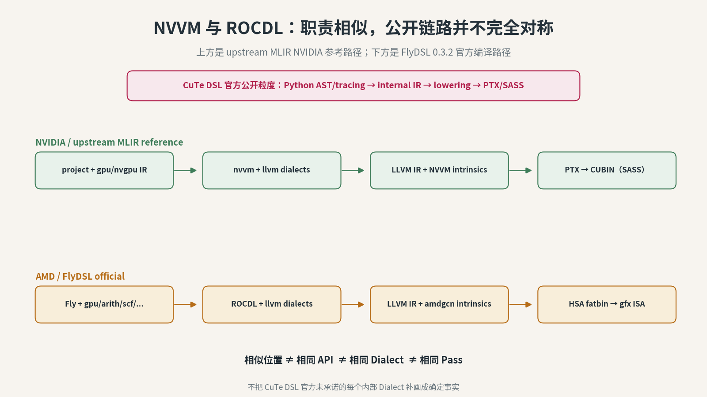

*图 9：两条路线共享“高层语义逐步消解、目标相关操作逐步显式化”的编译原则；NVVM 与 ROCDL 位于相似职责层，但目标、操作集合和后端不同。*

## CuTe DSL 与 FlyDSL：相似到底相似在哪里

两者可以放在一起比较，因为它们都试图解决同一类工程问题：

- 使用 Python 编写高性能 GPU Kernel；
- 显式表达 Layout 与 Tiling；
- 表达 Tensor、线程到数据的映射和存储层级搬运；
- 通过编译器把高层对象转换为目标 GPU 代码。

但“同类”不能简化成“相同实现”。

| 维度 | CuTe DSL | FlyDSL |
|---|---|---|
| 主要生态 | NVIDIA CUDA / CUTLASS | AMD ROCm / HIP |
| Python 入口 | `@cute.jit`、`@cute.kernel` | `@flyc.jit`、`@flyc.kernel` |
| 核心抽象 | CuTe Layout、Tensor、thread-to-data mapping | Fly Layout IR、coordinate tensor、memref |
| 目标相关低层 | 官方公开到内部 IR → PTX/SASS；upstream MLIR 提供 NVVM/NVPTX 参考路径 | FlyDSL 官方公开 Fly → ROCDL → LLVM → HSA fatbin 路线 |
| API 兼容 | 不兼容 | 不兼容 |

最稳妥的结论是：

> **CuTe DSL 与 FlyDSL 处在相似的技术位置，都让 Layout 与 Tiling 成为 Python Kernel 编程中的显式对象；它们共享问题类型与部分设计思想，但属于不同项目、不同目标平台和不同编译实现。**

## Python 前端为什么同时需要 AST Rewrite 与 Tracing

Python 很适合元编程，但 GPU Kernel 运行时需要结构简单、可编译的程序。CuTe DSL 与 FlyDSL 当前文档都展示了混合前端思路：先处理 Python 控制流，再在代理值上执行函数并记录 IR。

| 机制 | 它捕获什么 | 单独使用的主要风险 |
|---|---|---|
| **AST Rewrite** | `for`、`while`、`if`、函数边界等程序结构 | 很难完整复刻所有 Python 表达式语义 |
| **Tracing** | 代理参数实际执行时发生的 Tensor、算术和 DSL Operation | 未执行分支可能消失，循环可能按观察次数展开 |
| **Hybrid Frontend** | AST 保留结构，Tracing 填充结构内部的计算 | 仍只支持该 DSL 明确定义的 Python 子集 |

### Meta-stage 与 Object-stage

同一段 Python DSL 代码涉及两个时间世界：

1. **Meta-stage（编译时）**：Python 在 Host CPU 上执行，创建 IR、折叠 Constexpr、选择静态 Layout/Tile；此时代理值还不是实际 GPU 数据。
2. **Object-stage（运行时）**：编译后的 Kernel 在 GPU 上执行，读取真实 Tensor、运行 load/MMA/store。

普通 Python `print()` 观察的是 Meta-stage；设备侧 `printf` 类 Operation 观察的才是 GPU 运行时值。把两者混用，会把“编译器看到了什么”误写成“GPU 实际算出了什么”。

### `@jit` 与 `@kernel` 不是两个同义装饰器

两种 DSL 都区分 Host 侧 JIT Function 与 Device Kernel：

| 角色 | 负责什么 |
|---|---|
| `@jit` Function | 参数适配、编译/缓存、Grid/Block/Shared Memory/Stream 配置、Kernel Launch |
| `@kernel` Function | 每个 GPU Thread/Work-item 实际执行的 Device Code |

`Constexpr` 参数在编译时进入 IR，值变化通常会产生不同的特化版本；普通运行时参数则由同一已编译版本在调用时接收。特化能消除动态分支、展开循环和固定 Shape，但版本过多也会放大编译和缓存成本。

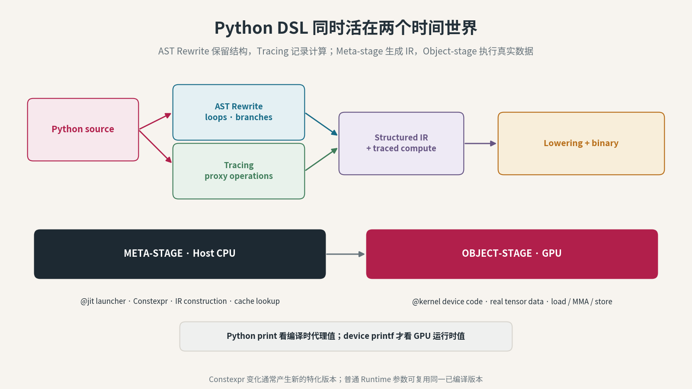

*图 10：AST Rewrite 保留结构，Tracing 记录计算；Meta-stage 在 Host 上生成 IR，Object-stage 才在 GPU 上处理真实数据。`@jit` 负责 Host Launcher，`@kernel` 定义 Device Code。*

## Atom、TiledCopy 与 TiledMMA 是哪一层

`Atom` 是 CuTe/FlyDSL 这类显式 Layout 体系中的常见抽象，不是所有 GPU DSL 的通用语法。

### Copy Atom

Copy Atom 把“一次底层 Copy 能搬什么”与相应的线程—值映射绑在一起，通常包含：

- Copy 指令或操作类别；
- Element Type 和一次搬运宽度；
- Source Thread/Value Layout；
- Destination Thread/Value Layout。

Source 与 Destination Layout 不一定相同；某些矩阵 load 或专用搬运指令本身就要求重排。

### MMA Atom

MMA Atom 描述一次最小矩阵乘加能力及其契约：

- 指令 Shape（M×N×K）；
- A/B/Accumulator dtype；
- 哪些线程共同执行；
- A、B、C/D Fragment 在各线程寄存器中的分布。

### 从 Atom 铺成更大的 Tile

| 对象 | 它做什么 |
|---|---|
| **Copy Atom** | 定义一次 Copy 的最小操作和映射契约 |
| **TiledCopy** | 按 Thread Layout 和 Value Layout，把 Copy Atom 铺满更大的 Tile |
| **MMA Atom** | 定义一次矩阵指令的 Shape、dtype 和 Fragment 契约 |
| **TiledMMA** | 把 MMA Atom 按更大的 Atom Layout 组合成 Workgroup/Warp/Wave 级计算 |

所以 Atom 不是 Tile：Atom 是可重复的最小操作契约，Tile 是某一层处理的数据范围；TiledCopy/TiledMMA 才把二者连接起来。

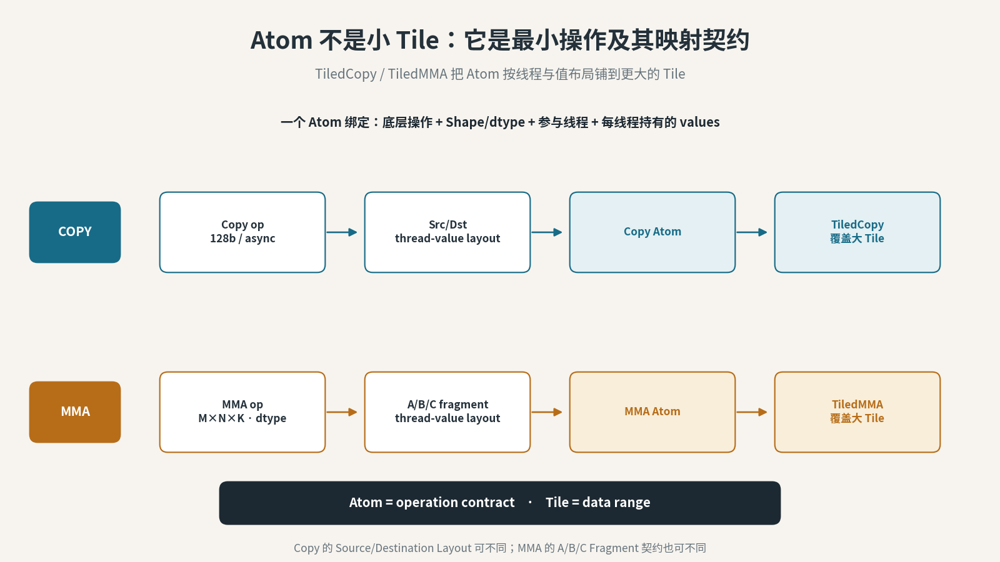

*图 11：Copy/MMA Atom 绑定底层操作与线程—值映射；TiledCopy/TiledMMA 再把 Atom 复制、排列并投影到更大的数据 Tile。*

## JIT、AOT、Specialization、Cache 与 Runtime Dispatch

编译完成并不等于每次调用都重新走完整编译链。还需要区分五个生命周期概念。

| 概念 | 发生什么 | 常见误解 |
|---|---|---|
| **JIT** | 第一次遇到某种签名/配置时动态编译 | JIT 不等于每次调用都编译 |
| **AOT** | 部署或运行前提前生成目标二进制 | AOT 不保证覆盖所有动态 Shape |
| **Specialization** | 按 dtype、Shape、Constexpr、目标架构等生成特化版本 | 特化越多不一定越好 |
| **Cache** | 用 Key 复用已有 IR、Executor 或 Binary | Cache Hit 不证明结果正确或配置最优 |
| **Runtime Dispatch** | 根据当前输入与条件选择某个已编译 Kernel | Dispatch 不是 Lowering，也不是 Autotune |

CuTe DSL 与 FlyDSL 的 Cache Key 和持久化策略不同，但共同原则是：Key 必须覆盖所有可能改变生成代码的输入。源代码、依赖、闭包值、Constexpr、DSL/LLVM 版本或环境变量漏进 Key，都可能造成陈旧复用；反过来，Key 过细又会制造过多编译版本。

### 从 Python Call 到 GPU 执行

```text
Python arguments
    ↓ DLPack / Tensor adaptor / C ABI or MemRef descriptor
Host JIT function / launcher
    ↓ cache lookup or compile
module load + kernel function lookup
    ↓ runtime dispatch + launch configuration
enqueue on CUDA/HIP stream
    ↓
GPU executes device kernel
```

Stream 表达异步执行队列与依赖顺序；它不是一条独立编译链。Module Load 证明二进制可被 Runtime 接受，Function Lookup 证明符号存在，Launch 证明调用已入队，完成事件或同步才证明该次设备工作结束。

Autotune 又是另一条控制路径：它以一组候选 Tile/Layout/Stage 配置为搜索空间，先过正确性门，再在目标设备与真实 Shape 上计时并选 Winner。Winner 必须绑定 Shape、dtype、Layout、设备和相关版本；换编译器、Kernel 或搜索空间后，旧 Winner 不能自动当作新环境最优。

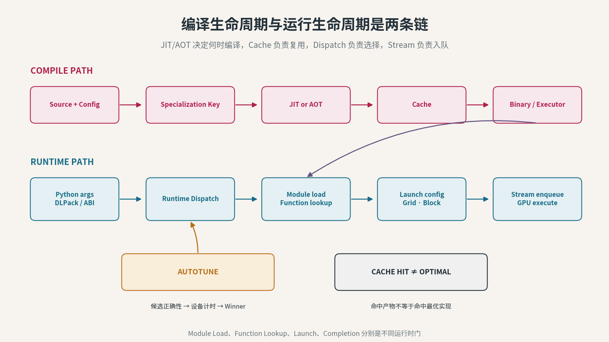

*图 12：编译路径产生并缓存特化二进制；运行路径适配参数、选择版本、加载模块并入队执行。Autotune 搜索候选，Runtime Dispatch 只选择和调用。*

## 到底哪些事情自动，哪些事情不自动

“Python DSL 会自动 lowering”是对的，但这句话经常被错误地扩大为“写完 Python，编译器会自动得到最佳 Kernel”。两者差得很远。

| 事项 | 通常由谁负责 | 是否天然自动最优 |
|---|---|---|
| 把 Python 前端转换成 IR | DSL 前端 | 自动转换，不代表最优 |
| 验证类型、Shape、Layout 合法性 | DSL / MLIR verifier | 可以自动检查部分约束 |
| Layout 代数化简 | DSL / compiler pass | 可以自动化，但依赖表达能力 |
| 高层操作 lower 到地址计算与目标 intrinsic | compiler pass | 自动执行既定规则 |
| LLVM 指令选择和寄存器分配 | LLVM target backend | 自动执行启发式算法 |
| CTA/Workgroup Tile 尺寸 | 开发者、库配置或 autotuner | 必须设计或搜索 |
| Warp/Wave Tile 与线程映射 | DSL 编程模型、开发者、模板或搜索 | 不保证自动最优 |
| Shared Memory/LDS swizzle | 开发者/DSL/模板 | 不保证自动发现最佳方案 |
| Pipeline stages 与 prefetch 距离 | 开发者、编译器或 autotuner | 需要约束和验证 |
| 运行时是否命中这份 Kernel | Runtime dispatcher | 必须用运行时证据确认 |

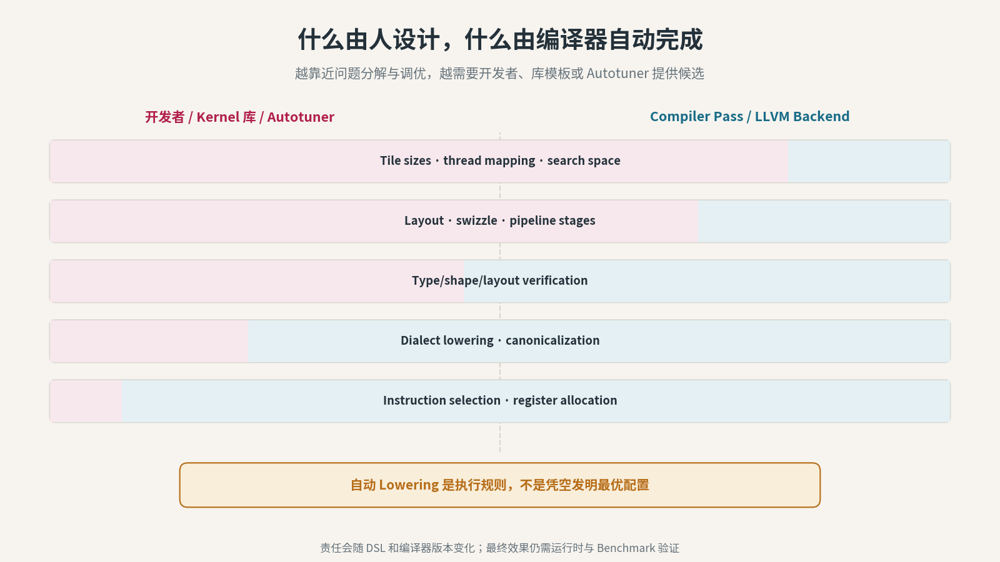

*图 13：越靠近问题分解与硬件调优，越需要开发者、库模板或 autotuner 提供选择；越靠近表示转换与指令编码，越适合由编译器机械完成。*

## 用一个 Tile 走完整条链

现在把前面的名词放回同一个例子。

### 第一步：选定工作范围

```text
一个 Workgroup 负责 C 的 128 × 128 Tile
K 维每轮推进 32
```

这是 Tiling 决策。

### 第二步：定义映射

```text
Workgroup → output tile
Wave → subtile
Thread/value → logical coordinates
Logical coordinates → GMEM/LDS/register offsets
```

这是 Layout 与 ownership 决策。

### 第三步：定义搬运和流水

```text
预取 A/B 的下一块
当前块执行 MMA/MFMA
barrier 保护复用的 shared/LDS buffer
多 stage 重叠 copy 与 compute
```

这是 Movement 与 Schedule 决策。

### 第四步：前端生成高层 IR

Python 中的 Layout、Tile、Copy、MMA 对象进入项目 Dialect，以及 `arith`、`scf`、`memref`、`vector`、`gpu` 等通用 Dialect。

### 第五步：逐层 Lowering

高层 Layout 被消解为坐标和地址运算；抽象 Copy 被改写为具体 address space 的 load/store 或异步搬运；抽象 MMA 被改写为目标相关操作。

### 第六步：进入目标 Dialect

- NVIDIA 路线进入 `nvvm` / `llvm`；
- AMD 路线进入 `rocdl` / `llvm`。

### 第七步：翻译到 LLVM IR 并生成目标代码

LLVM 后端完成剩余的目标相关代码生成，产出可加载的 GPU 二进制。运行时再根据硬件、Shape、dtype 和调度条件选择并启动它。

这七步里，数学公式没有改变；改变的是**执行责任、数据映射和表示层级**。

## 一张图出现问题，应该从哪一层查

不同证据只能证明不同阶段：

| 看到的证据 | 能证明什么 | 不能证明什么 |
|---|---|---|
| Python 源码有某个 Layout | 作者表达了该设计 | Pass 没有改写或丢失它 |
| MLIR 中有目标 Dialect | lowering 到达该阶段 | 最终二进制一定包含目标指令 |
| LLVM IR 有 intrinsic | 翻译产生了目标调用 | 后端最终选择了哪条机器指令 |
| 反汇编有 MMA/MFMA | 二进制包含该指令 | 运行时请求一定命中这份二进制 |
| Runtime log 命中 Kernel | 请求调用了这份 Kernel | 它就是当前 Shape 的最优实现 |
| Benchmark 更快 | 这组环境与输入下效果更好 | DSL 或编译链普遍更快 |

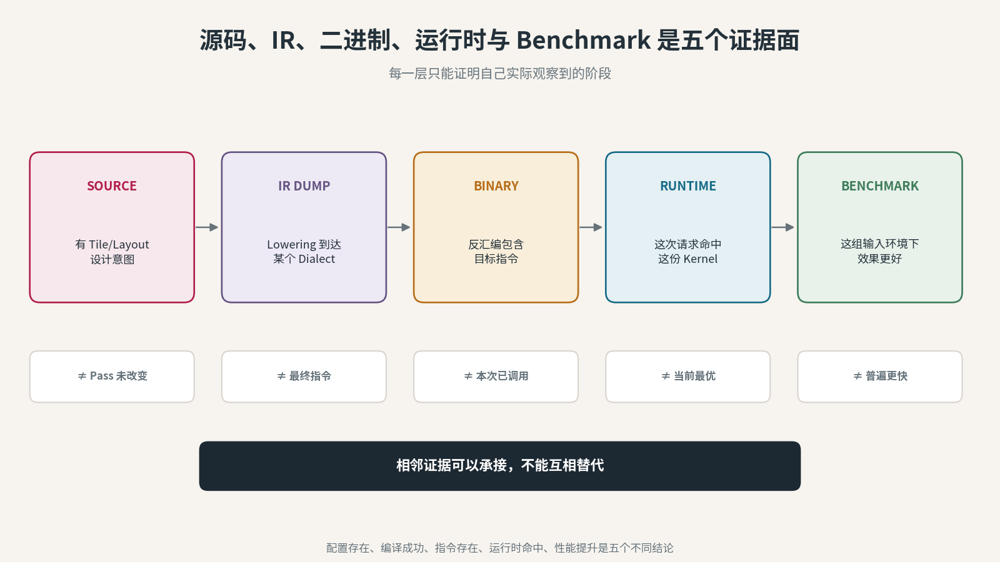

*图 14：源码、IR、二进制、运行时和 Benchmark 是五个不同证据面。相邻阶段可以承接，不能互相代替。*

## 十三个最容易说错的地方

### 1. “Tile 就是 Layout”

不对。Tile 是选中哪块；Layout 是坐标、线程、地址和值如何对应。

### 2. “Layout 就是显存中的行主序、列主序”

不完整。高性能 Kernel 还包括线程所有权、Shared Memory/LDS 排列和 Register Fragment 映射。

### 3. “MLIR 是 LLVM IR 上面固定的一层”

不准确。MLIR 是多层 IR 框架，一个 Module 可以同时包含多个抽象层的 Dialect。

### 4. “NVVM 和 ROCDL 是两个 Python DSL”

不对。它们是 lowering 链中靠近目标 intrinsic 的 MLIR Dialect。CuTe DSL 和 FlyDSL 才是这里讨论的 Python Kernel DSL。

### 5. “进入 LLVM 就已经是机器码”

不对。LLVM dialect、LLVM IR、PTX/AMDGPU code object、最终机器指令仍是不同阶段。

### 6. “自动 Lowering 等于自动调优”

不对。Lowering 执行表示转换；autotuning 在候选 Tile、Layout、stages 等配置之间搜索。两者可以集成，但不是同一过程。

### 7. “CuTe DSL 和 FlyDSL 差不多，所以 API 可以互换”

不对。它们处在相似技术位置，但目标平台、API、Dialect、Pass 和低层操作不同。

### 8. “Warp 永远是 32，Wavefront 永远是 64”

不对。它们是相似职责的 Subgroup 概念，具体宽度与能力由目标架构和编译配置决定。

### 9. “`@jit` 就是 GPU Kernel”

不对。这里的 `@jit` 通常定义 Host 侧编译与 Launch Function；`@kernel` 才定义 Device Code。

### 10. “Tensor 和 MemRef 只是两种拼法”

不对。Tensor 偏值语义，MemRef 暴露 Buffer、Shape、Stride、Offset 与 Memory Space。

### 11. “Bufferization 就是给每个 Tensor 分配内存”

不对。它会分析别名与 Use-Def，优先安全复用 Buffer；只有不能原地写时才需要新分配或复制。

### 12. “Atom 就是一块更小的 Tile”

不对。Atom 是一次底层 Copy/MMA 及其线程—值映射契约；TiledCopy/TiledMMA 才把 Atom 铺到 Tile 上。

### 13. “Cache Hit 说明这次一定用了最优 Kernel”

不对。Cache Hit 只说明某个 Key 命中了已有编译产物；Runtime Dispatch、实际 Kernel 命中与 Benchmark 仍需单独验证。

## 最后用八句话收住

**第一句**：Tile 是“哪一块”，Tiling 是“怎么分层切块”，Layout 是“坐标、线程、地址和值怎么对应”。

**第二句**：MLIR 是容纳多层 IR 的编译器框架，Dialect 才是每一层具体的操作、类型和规则。

**第三句**：Lowering 是语义逐步具体化；它把 Layout、Copy、MMA 等高层对象变成坐标、地址、目标 intrinsic 和后端代码。

**第四句**：NVIDIA 的低层桥接是 NVVM 路线，AMD 的低层桥接是 ROCDL/AMDGPU 路线；它们职责相似，但不是兼容实现。

**第五句**：编译器可以自动 lowering，但不会凭空保证最佳 Tile、最佳 Layout、最佳流水线，也不能替代运行时命中与 Benchmark 证据。

**第六句**：AST Rewrite、Tracing、Meta-stage 与 Object-stage 决定 Python 代码哪部分在编译时运行，哪部分进入 GPU。

**第七句**：Tensor→MemRef 的 Bufferization、Address Space 与 Atom→TiledCopy/TiledMMA，分别解决存储落地和底层操作组合。

**第八句**：JIT/AOT 负责何时编译，Cache 负责复用，Autotune 负责搜索，Runtime Dispatch 负责选择和调用；四者不能混写。

## 公开资料

本文只使用公开官方资料：

1. MLIR Language Reference：Operation、Value、Type、Dialect 与多层表示
   https://mlir.llvm.org/docs/LangRef/
2. MLIR LLVM IR Target：先转换到可翻译 Dialect，再翻译为 LLVM IR
   https://mlir.llvm.org/docs/TargetLLVMIR/
3. MLIR NVVM Dialect：NVIDIA 目标操作、内存空间与 lowering 位置
   https://mlir.llvm.org/docs/Dialects/NVVMDialect/
4. MLIR ROCDL Dialect：AMD ROCm/AMDGPU 目标 intrinsic
   https://mlir.llvm.org/docs/Dialects/ROCDLDialect/
5. NVIDIA NVVM IR Specification
   https://docs.nvidia.com/cuda/nvvm-ir-spec/
6. NVIDIA CUTLASS CuTe DSL Programming Model
   https://docs.nvidia.com/cutlass/latest/media/docs/pythonDSL/cute_dsl.html
7. AMD FlyDSL Documentation：Architecture、Layout Algebra、Kernel Tuning
   https://rocm.github.io/FlyDSL/
8. MLIR GPU Dialect：执行层级、Address Space、GPU Module、Binary 与 Launch
   https://mlir.llvm.org/docs/Dialects/GPU/
9. MLIR Bufferization：Tensor→MemRef、In-place Analysis 与 Buffer Copy
   https://mlir.llvm.org/docs/Bufferization/
10. MLIR Dialect Conversion：Conversion Target、Rewrite Pattern 与 Type Converter
    https://mlir.llvm.org/docs/DialectConversion/
11. MLIR Pass Infrastructure：Pass、Analysis、Pipeline 与 IR Instrumentation
    https://mlir.llvm.org/docs/PassManagement/
12. NVIDIA CuTe DSL Code Generation：AST Rewrite、Tracing、Meta/Object Stage
    https://docs.nvidia.com/cutlass/latest/media/docs/pythonDSL/cute_dsl_general/dsl_code_generation.html
13. NVIDIA CuTe DSL JIT Caching：JIT Executor、Cache Key 与持久化
    https://docs.nvidia.com/cutlass/latest/media/docs/pythonDSL/cute_dsl_general/dsl_jit_caching.html
14. NVIDIA CuTe GEMM Tutorial：Thread Layout、TiledCopy 与 TiledMMA
    https://docs.nvidia.com/cutlass/latest/media/docs/cpp/cute/0x_gemm_tutorial.html
15. AMD FlyDSL Kernel Authoring：Host JIT、Device Kernel、Launch 与 Cache
    https://rocm.github.io/FlyDSL/kernel_authoring_guide.html
16. AMD FlyDSL Autotune：候选正确性、设备计时与 Winner Artifact
    https://rocm.github.io/FlyDSL/autotune_guide.html
