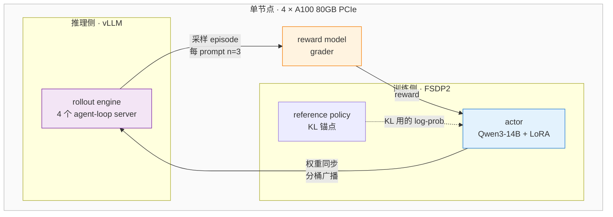

# 单节点四卡上的 GRPO 强化学习后训练

[](https://github.com/volcengine/verl)
[](https://github.com/vllm-project/vllm)
[](https://pytorch.org/docs/stable/fsdp.html)
[](https://learn.microsoft.com/azure/virtual-machines/nca100v4-series)
[](LICENSE)

14B 模型的强化学习后训练——actor、rollout engine、reward model、reference policy 全部跑在**同一台四卡机**上，以及决定它能不能装得下的显存预算和互连事实。

> Author: 魏新宇 (Xinyu Wei)

[English](README.md) | [中文](README-CN.md)

---

## 这个 repo 展示什么

RL 后训练通常被描述成需要集群的事情。其实不必。`Qwen/Qwen3-14B` 的 GRPO 训练可以在一台 4×A100 80GB 的机器上完整跑起来，包括一个常驻的 vLLM rollout engine——前提是两件事算对：**80 GB 怎么在训练 actor 和推理引擎之间切分**，以及**卡与卡之间实际可用的 NCCL transport 是哪一条**。

下面两项都给实测数字。

| | |
|---|---|
| **模型** | `Qwen/Qwen3-14B` —— vocab 151936，hidden 5120，intermediate 17408 |
| **算法** | GRPO，LoRA rank 64 覆盖全部 linear 层，`kl_loss_coef=0.01`（low-variance KL） |
| **Rollout** | vLLM，每个 prompt 采样 `n=3`，4 个 agent-loop server，tensor parallel = 1 |
| **切分** | FSDP2，开启 gradient checkpointing |
| **硬件** | 4×A100 80GB **PCIe**，无 NVLink，driver `570.195.03`，CUDA 12.8 |
| **序列** | prompt 2048 + response 2048，每个 episode 最多 8 轮 assistant |

---

## 架构

四个角色共享同样的四张卡。actor 负责训练，vLLM 负责生成，grader 负责打分，reference policy 负责锚定 KL 项。每个优化器 step 结束后，更新过的 actor 权重被推送进正在运行的 vLLM engine。



图上最耗工程量的是两条边：**权重同步**（actor → vLLM，要搬一个 3.11 GB 的 embedding 张量）和 **KL log-prob 通道**（会物化出 `[tokens, 151936]` 的 logits 张量）。两者的处理都在下面的配置里。

---

## 显存预算

这是决定可行性的数字。在 80 GB 卡上、tensor parallel = 1 时，vLLM 会在**每张卡**加载一份完整的 14B 模型：

| 占用方 | 大小 | 说明 |
|---|---|---|
| vLLM 预留（`gpu_memory_utilization=0.6`） | ~47.5 GB | 其中约 28 GB 是模型权重 |
| └ KV cache 余量 | ~19 GB | 真正用于生成的部分 |
| FSDP actor 进程 | ~26 GB | 分片权重、梯度、优化器状态 |
| 空闲余量 | ~4 GB | 吸收瞬时的 logits 张量 |

两条在规划运行前值得记住的结论：

**这个比例不是自由旋钮。**调低会饿死 KV cache——在 `0.4` 时引擎报告需要 6.25 GiB 而只剩 1.96 GiB。调高会饿死 actor，它的 log-prob 通道在这个词表规模下需要 4.37 GiB 的瞬时空间。这里能工作的值是 `0.6`，窗口很窄。

**宽词表的代价不体现在参数量里。**vocab 151936 时，仅 embedding 张量在 fp32 下就是 `151936 × 5120 × 4 B ≈ 3.11 GB`，超过默认 2048 MB 的权重传输 bucket；同一个词表规模也是那 4.37 GiB 瞬时空间的来源。这两项都不随模型名字里的 "14B" 缩放。

---

## 互连：实际可用的是哪条

在 hypervisor 下的 PCIe A100 上，`cudaDeviceEnablePeerAccess` 会返回 CUDA error 217。NCCL 两条快速的节点内 transport 都会调它——peer-to-peer 路径，以及不那么显眼的 `shm.cc` 共享内存路径。于是 collective 落到 socket transport。

```bash
export NCCL_P2P_DISABLE=1
export NCCL_SHM_DISABLE=1
export NCCL_DEBUG=INFO      # 打印实际选中的 transport
```

这是一条容量规划事实，不是 workaround：在这类节点上，collective 带宽受 TCP 限制。这也正是单节点 GRPO 在此可行的部分原因——主导流量是周期性的权重同步，不是多 rank 之间逐步的梯度 all-reduce。

---

## 一次运行会做什么

实测阶段，按发生顺序：

| 阶段 | 观测 |
|---|---|
| 模型加载与 FSDP2 包装 | 完整 state dict 在 4 个 rank 之间广播 |
| vLLM engine 启动 | CUDA graph 捕获 `70/70` |
| Agent-loop server | 4 个 rollout server 注册完成 |
| 验证通道 | grader 完成评估集打分 —— `acc/mean@1 = 0.0556`，每个 episode 最少 2 轮 |
| Rollout 生成 | 首个训练批次 12m10s（128 prompt × 3 采样） |
| 权重同步 | 分桶广播，actor → vLLM |
| 优化器 step | 对 LoRA adapter 做 GRPO 更新 |

那个验证分数是**未训练策略在 grader 上的基线**，在任何优化器 step 之前采集。它是参照点，不是成果。

### 稳态训练

循环跑起来之后，单步开销很稳定：

| Step | 墙钟时间 | `global_seqlen/mean` | rank 间不均衡 | `actor/entropy` |
|---|---|---|---|---|
| 1 | 1381.65 s | 147 627 | 1 885 | 5.6864 |
| 2 | 1387.50 s | 147 906 | 2 845 | 5.7761 |
| 3 | 1398.62 s | 148 133 | 837 | 5.7379 |

每步约 **23 分钟**，方差低于 1.3%，每步处理约 14.8 万 token，rank 之间的序列长度不均衡低于 2%——负载均衡器工作正常。完整 14 步在这台机器上预计约 5.5 小时。

熵在 5.7 附近震荡而非单调下降，是 GRPO 早期的正常形态：策略仍在探索。这个阶段如果熵单调坍缩，通常意味着 KL 约束太松或学习率过高。

---

## 快速上手

```bash
git clone https://github.com/david-xinyuwei/david-share.git
cd david-share/Deep-Learning/AI-Foundry-Custom-Code-Training
```

在这套硬件上能工作的配置。这些 key 本来就存在，所以是普通覆盖，不加 Hydra 的 `+`：

```
actor_rollout_ref.rollout.gpu_memory_utilization=0.6
actor_rollout_ref.rollout.checkpoint_engine.update_weights_bucket_megabytes=4096
actor_rollout_ref.actor.entropy_from_logits_with_chunking=True
```

三者里 `entropy_from_logits_with_chunking` 最不显眼，但在宽词表模型上最要紧：不开它，熵项会在一次分配里物化出完整的 `[tokens, 151936]` 张量。

在当前版本的 `transformers` 和 PCIe 硬件上，还需要两个源码级修复。两个都是幂等的，代码形态不符合预期时会拒绝执行：

```bash
python patches/01-fsdp2-set-guard/verify.py        # 先只看，不写盘
python patches/01-fsdp2-set-guard/apply.py
python patches/02-dp-actor-out-of-place/apply.py
```

### 测试

转换逻辑放在 [`patches/transforms.py`](patches/transforms.py) 里，是不依赖外部状态的纯函数，因此不需要 GPU、CUDA 或安装 verl 就能跑：

```bash
pip install pytest
pytest tests/ -q
```

15 个用例覆盖缩进保持、幂等性、输出仍然是合法 Python，以及每一条拒绝路径是否真的拒绝——包括 `x = logits.div_(temperature)` 这类写法。朴素的正则会把它们改坏且不报错。

---

## 排障

从干净环境走到运行中的训练循环，需要越过七个各自独立的失败点，其中几个的报错指向的位置并不是真正的原因。每一个的现象、根因和证据：[`docs/troubleshooting.md`](docs/troubleshooting.md)。

每次尝试的运行时长与变更内容：[`evidence/run-timeline.md`](evidence/run-timeline.md)。

## 工具

| 工具 | 用途 |
|---|---|
| [`tools/inspect_config_path.ps1`](tools/inspect_config_path.ps1) | 从 runtime config dump 还原 key 的真实点分路径 |
| [`tools/scan_job_log.ps1`](tools/scan_job_log.ps1) | 过滤几 MB 的作业日志，折叠重复刷屏，让第一个异常浮出来 |

两个工具都按 UTF-16LE 读取。原因是 PowerShell 5.1 的 `*>` 重定向写出的是 UTF-16，常规 grep 工具在这类文件上会静默地一个匹配都找不到——看起来像是「日志是空的」。

## 证据

上面每一个实测数字都能追到 [`evidence/`](evidence/) 下的具体运行。环境标识已移除；凡是支撑技术结论的内容原样保留。
