# Microsoft Foundry Custom Code Training —— 把自己的 GRPO 代码跑在托管的 4×A100 节点上

[](https://github.com/microsoft-foundry/custom-code-training)
[](https://github.com/david-xinyuwei/david-share/actions/workflows/ai-foundry-custom-code-training-ci.yml)
[](https://github.com/volcengine/verl)
[](https://learn.microsoft.com/azure/virtual-machines/nca100v4-series)
[](LICENSE)

Custom Code Training 是 Foundry 上给「装不进托管 fine-tuning 表单」的训练准备的入口：训练脚本、数据集和容器镜像由你提供，GPU 集群、作业契约和可观测性由平台提供。这个 repo 先说清这个入口到底给了什么，再用产品自带的 verl template 把 `Qwen/Qwen3-14B` 的 GRPO 训练跑到**完成**——单个 4×A100 节点上 14 个优化器 step、5 小时 41 分钟——包括路上的七个失败点，和跑通之后每一步的实测开销。

> Author: 魏新宇 (Xinyu Wei)

[English](README.md) | [中文](README-CN.md)

---

## 平台给什么，你带什么

| 平台提供 | 你提供 |
|---|---|
| 托管 GPU 集群，作为 Foundry 资源创建和释放 | 容器镜像，含你的框架和 CUDA build |
| 作业提交、排队、重试、状态 | 入口脚本及其命令行 |
| **Ray** 分布式，节点内不需要自己搭 | 训练代码、数据集、reward function |
| 输入只读挂载，输出自动收集并版本化 | 模型权重，注册成 Foundry dataset |
| 每个作业的代码、日志、指标、模型都能在 portal 里翻 | 镜像里没有、而你的框架需要的一切 |

这笔交换是明确的：训练循环完全归你控制，镜像里的每一个依赖也完全归你负责。这个 repo 的大部分篇幅花在后半句上。

## 哪些是真实执行、哪些做过适配、哪些不能宣称

| 对象 | 证据状态 | 边界 |
|---|---|---|
| Foundry portal、托管 Compute、挂载资产、Ray、作业历史 | **EXECUTED** | 截图来自实际项目；容器 registry 坐标已遮蔽。 |
| 零售工具、reward、训练/验证 JSONL、GRPO launcher | **REUSED INPUT** | 生产方 sample commit `018d095f508280efce9e79c4b19fc941d7361b30`；hash 冻结在 [`method-and-lineage.md`](docs/method-and-lineage.md)。 |
| NC96ads A100 镜像和 runtime 配置 | **ADAPTED + EXECUTED** | 保留官方作业路径，但为这套拓扑改变了镜像字节和 6 个环境配置。 |
| 每步性能、显存、reward、KL、gradient 指标 | **MEASURED** | 一次完整运行的全部 14 个优化器 step，每步约 80 个指标。 |
| 质量提升、收敛、其他 SKU、生产就绪 | **NOT CLAIMED** | 运行确实跑完了，但单次 14 步运行的四次验证不足以建立方向性。 |
| 合并后的 [`docker/Dockerfile`](docker/Dockerfile) | **RECONSTRUCTED RECIPE** | 四个组成 layer 分别 build 并过 gate；合并后的单文件尚未作为一个 ACR task 重建。 |

完整 authority matrix，以及相对生产方 sample 的每一处有意差异，见 [`docs/method-and-lineage.md`](docs/method-and-lineage.md)。

### 两个入口

<div align="center">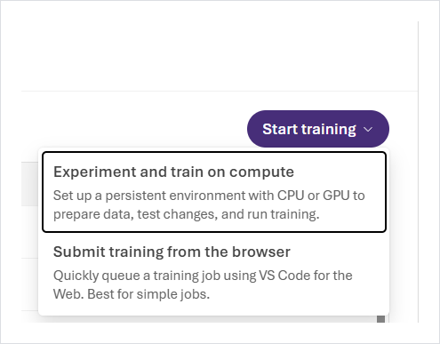</div>

**Experiment and train on compute** 会创建一个常驻 workbench 供你连上去——适合反复改代码。**Submit training from the browser** 直接用 VS Code for the Web 对着作业定义改，适合简单任务。下面全部走第一条。

### Template，以及本文用的那一个

<div align="center">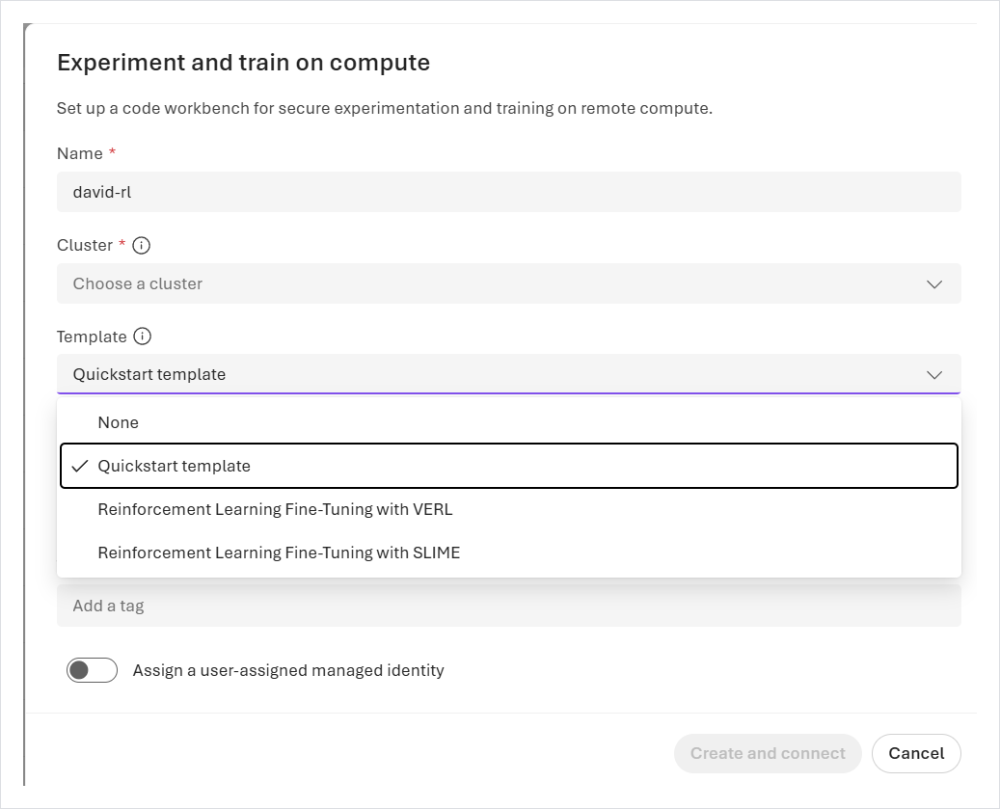</div>

下拉里除 Quickstart 外给了两个强化学习选项：**VERL** 和 **SLIME**。同样三个在 Code workbench 里以卡片形式出现：

<div align="center">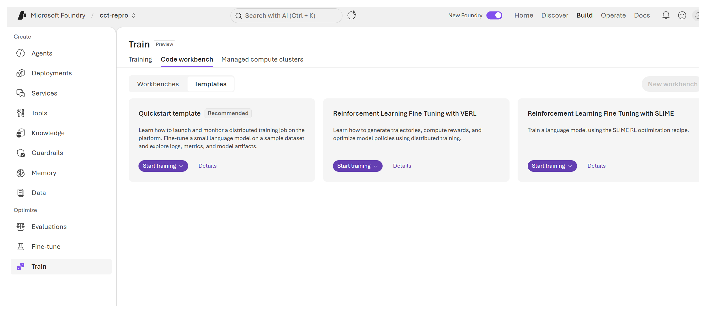</div>

本文走 **VERL**。SLIME 要求 4 节点 × 8 GPU，那是另一个容量话题。

### Idle shutdown 是产品自带的

<div align="center">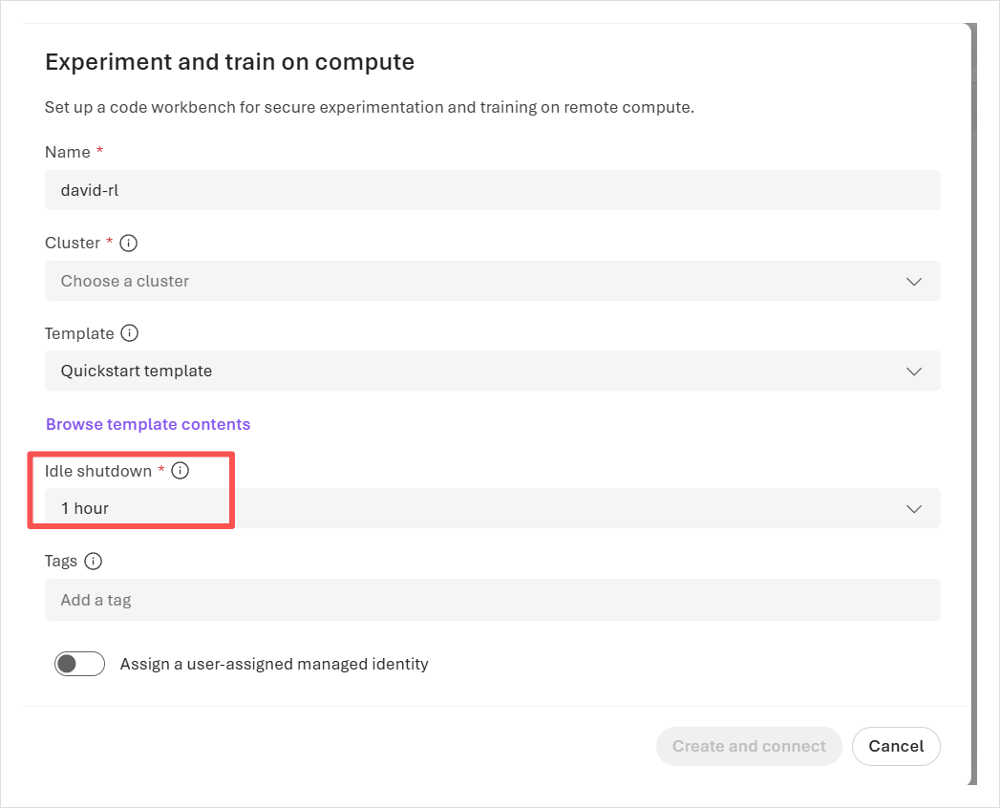</div>

GPU workbench 开着就在计费，跟你有没有在敲键盘无关，所以创建对话框里带了 idle shutdown 计时器，默认一小时。这个值应该主动设，而不是默认接受。

### 托管计算集群

<div align="center">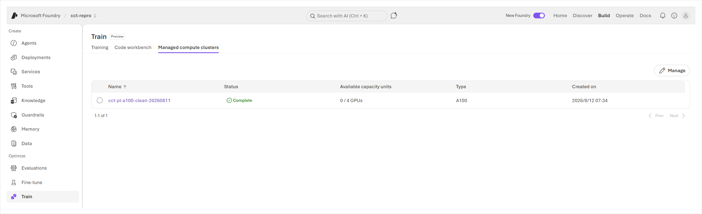</div>

一个 A100 集群，状态 `Complete`，可用 GPU 显示 **0/4**——因为下面那个作业把四张卡全占了。集群状态和作业状态是两回事：集群健康不代表作业在跑。

### 作业契约

<div align="center">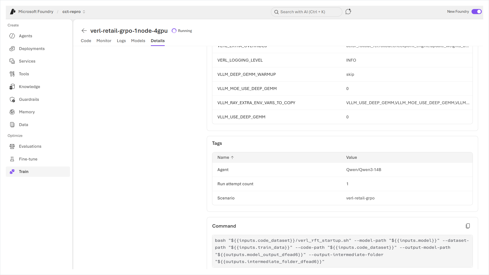</div>

这一屏值得细看。command 就是一条普通 shell 命令，平台负责把你注册的资产绑进去：

```bash
bash "${{inputs.code_dataset}}/verl_rft_startup.sh" \
  --model-path            "${{inputs.model}}" \
  --dataset-path          "${{inputs.train_data}}" \
  --code-path             "${{inputs.code_dataset}}" \
  --output-model-path     "${{outputs.model_output}}" \
  --output-intermediate-folder "${{outputs.intermediate_folder}}"
```

`${{inputs.*}}` 和 `${{outputs.*}}` 在运行时解析成挂载路径。你的脚本里不需要写死任何 storage account——它拿到的是目录。环境变量和 tag 在同一屏设置，`VERL_EXTRA_OVERRIDES` 这类框架级配置就是从这里注入的。

<div align="center">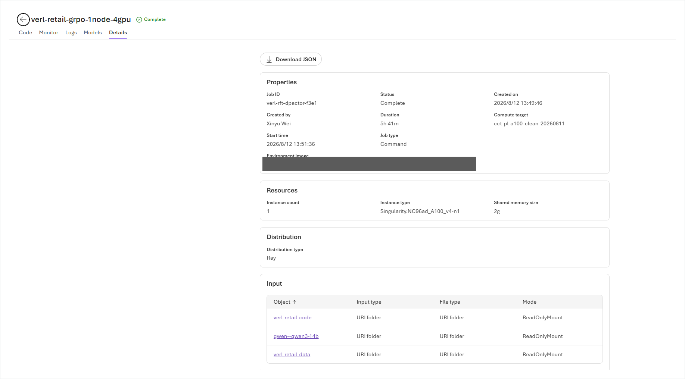</div>

Details 页是这次运行的可复现记录：job ID、状态与墙钟耗时、compute target、容器镜像（此处已遮蔽）、instance type `Singularity.NC96ad_A100_v4-n1`、shared memory size，以及 **Distribution type: Ray**——Ray 集群由平台拉起，你的代码直接用。输入以 `URI folder / ReadOnlyMount` 形式出现。这就是跑完的那次：`Complete`，**5 小时 41 分**。

### 输出，以及让它能跑起来的那几个设置

<div align="center">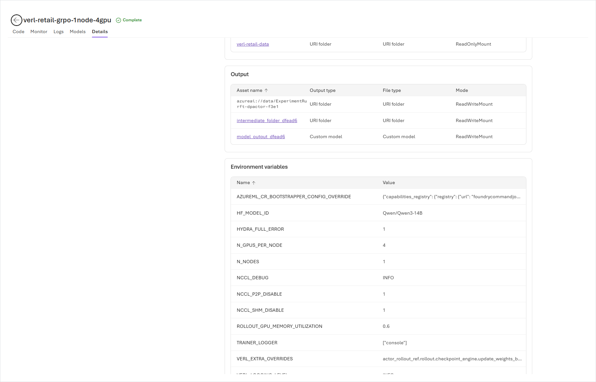</div>

输入表下面，同一页列出作业产出了什么，以及它带着哪些环境变量跑。[`configs/verified-overrides.json`](configs/verified-overrides.json) 里的六个值就在这里，是平台实际记录下来的样子——`NCCL_P2P_DISABLE=1`、`NCCL_SHM_DISABLE=1`、`ROLLOUT_GPU_MEMORY_UTILIZATION=0.6`、`N_GPUS_PER_NODE=4`、`N_NODES=1` 和 `VERL_EXTRA_OVERRIDES`。每一个分别防的是哪种失败，下文逐条展开。

### 你的代码，挂载后可直接翻

<div align="center">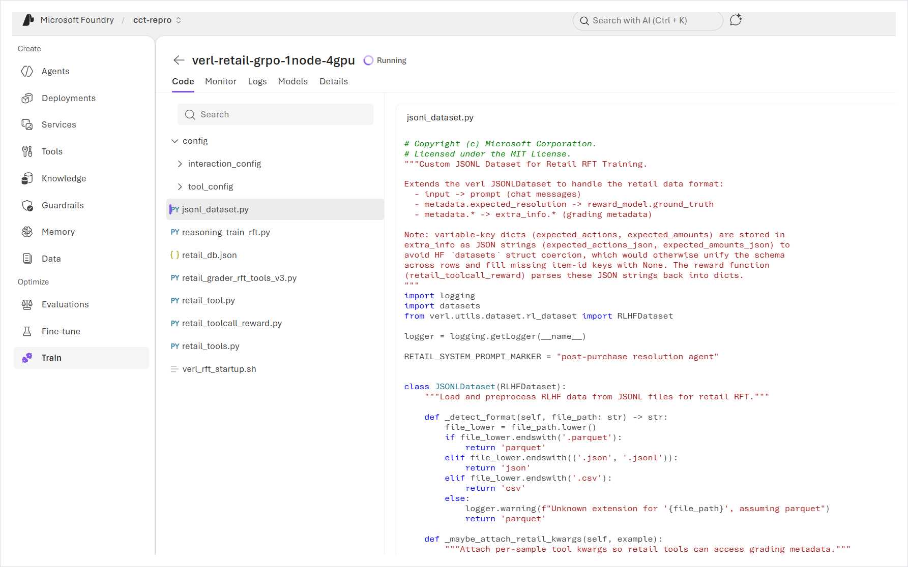</div>

Code 页逐个文件地显示这次作业实际跑的是什么——启动脚本、trainer、数据集适配、reward function、tool 定义。当一次运行在三小时后失败时，能读到作业真正看到的代码，而不是你以为自己上传的代码，是「定位」和「猜测」的分界线。

### 作业历史

<div align="center">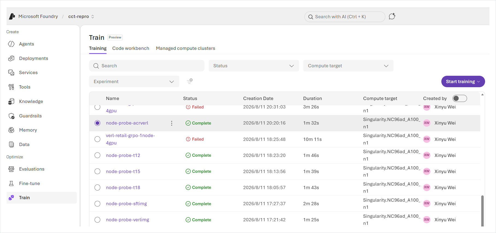</div>

每次尝试的状态、时长和 compute target。那些很短的 `Complete` 行是用来确认可用镜像的节点探针；`Failed` 行的故事在 [`docs/troubleshooting.md`](docs/troubleshooting.md)。

### 这次运行留下了什么

<div align="center">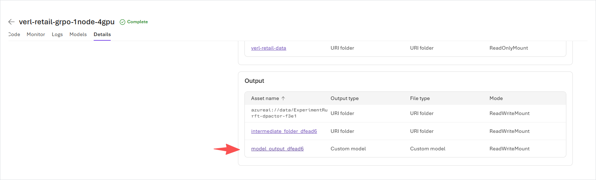</div>

命令里声明的输出会以带版本的 asset 形式回来，而不是让你去 storage account 里找文件。`model_output_dfead6` 的类型是 `Custom model`；`intermediate_folder_dfead6` 装的是 checkpoint。

<div align="center">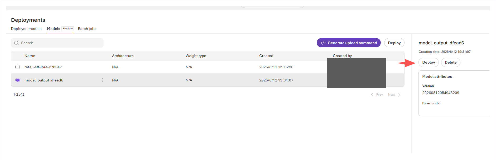</div>

它们随后出现在 **Deployments → Models** 下，和之前 SFT 跑出的 LoRA adapter 并列，旁边就是 **Deploy** 按钮。这正是这个入口的意义：你自己写的训练循环产出的东西，和任何其他 Foundry 模型落在同一个地方。删掉 compute 集群不会碰到它们——它们存在项目的 storage 里，这也是跑完就能放心释放 GPU 的原因。

### 这不是只有文章的 repo

| 路径 | 契约 |
|---|---|
| [`configs/`](configs/) | JSON Schema、fail-closed 示例配置、6 个实测 runtime override |
| [`scripts/preflight.py`](scripts/preflight.py) | 离线检查输入/schema/hash；不 import Azure，也无副作用 |
| [`scripts/submit_job.py`](scripts/submit_job.py) | 分离 `plan`、上传 dataset + SDK `validate`、计费 `submit` 三个动作 |
| [`scripts/job_status.py`](scripts/job_status.py) | 一次只读 job 查询，不打开会阻塞的 log stream |
| [`docker/Dockerfile`](docker/Dockerfile) | 合并后的 CUDA 兼容镜像配方，内含 build-time compatibility gate |
| [`patches/`](patches/) | 两个幂等、fail-closed 的源码转换和读回验证 |
| [`evidence/`](evidence/) | 原始结构化指标、验证结果、输入/日志 hash、镜像 build differential |
| [`tests/`](tests/) | patch、契约、JSONL、placeholder、SKU、image tag、Hydra 拒绝路径 |

CI 在 Python 3.11/3.12 上运行这个 public repo 的测试矩阵，核对 SDK pin、编译全部 Python 源码、执行确定性 repository gate，并在不提交作业的前提下检查合并后的 Dockerfile。生产方 sample 有访问控制，因此 270/62 数据契约和冻结 hash 只在完成授权 checkout 后做本地验证，不由 public workflow 拉取。

---

## 我们在上面跑了什么

RL 后训练通常被描述成需要集群的事情。其实不必。`Qwen/Qwen3-14B` 的 GRPO 训练可以在一台 4×A100 80GB 的机器上完整跑起来，包括一个常驻的 vLLM rollout engine——前提是两件事算对：**80 GB 怎么在训练 actor 和推理引擎之间切分**，以及**卡与卡之间实际可用的 NCCL transport 是哪一条**。

下面两项都给实测数字。

| | |
|---|---|
| **任务** | 零售客服 agent，工具调用，由自定义 reward function 打分 |
| **模型** | `Qwen/Qwen3-14B` —— vocab 151936，hidden 5120，intermediate 17408 |
| **算法** | GRPO，LoRA rank 64 覆盖全部 linear 层，`kl_loss_coef=0.01`（low-variance KL） |
| **Rollout** | vLLM，每个 prompt 采样 `n=3`，4 个 agent-loop server，tensor parallel = 1 |
| **切分** | FSDP2，开启 gradient checkpointing |
| **硬件** | 4×A100 80GB **PCIe**，无 NVLink，driver `570.195.03`，CUDA 12.8 |
| **序列** | prompt 2048 + response 2048，每个 episode 最多 8 轮 assistant |

---

## 架构

四个角色共享同样的四张卡。actor 负责训练，vLLM 负责生成，grader 负责打分，reference policy 负责锚定 KL 项。每个优化器 step 结束后，更新过的 actor 权重被推送进正在运行的 vLLM engine。

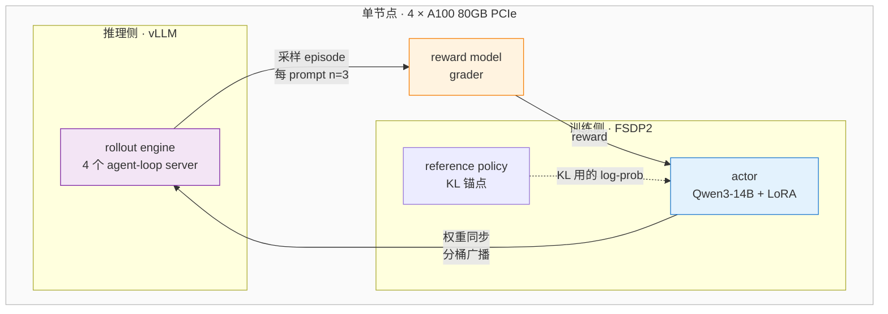

图上最耗工程量的是两条边：**权重同步**（actor → vLLM，要搬一个 3.11 GB 的 embedding 张量）和 **KL log-prob 通道**（会物化出 `[tokens, 151936]` 的 logits 张量）。两者的处理都在下面的配置里。

---

## 显存预算

这是决定可行性的数字。在 80 GB 卡上、tensor parallel = 1 时，vLLM 会在**每张卡**加载一份完整的 14B 模型：

| 占用方 | 大小 | 来源 |
|---|---|---|
| vLLM 预留（`gpu_memory_utilization=0.6`） | ~47.5 GB | 推算：比例 × 可用显存 |
| └ KV cache 余量 | ~19 GB | 推算：预留量减去一份完整 14B 权重 |
| FSDP actor 进程 | **26.7–27.8 GB** | **实测** —— `perf/max_memory_reserved_gb`，8 步 |
| 空闲余量 | ~4 GB | 余数；吸收瞬时的 logits 张量 |

只有 actor 那一行有仪表数据。vLLM 和 KV cache 两行由配置比例和模型大小推算而来，列出是为了让切分可读，不是声称有分组件遥测。

两条在规划运行前值得记住的结论：

**这个比例不是自由旋钮。**调低会饿死 KV cache——在 `0.4` 时引擎报告需要 6.25 GiB 而只剩 1.96 GiB。调高会饿死 actor，它的 log-prob 通道在这个词表规模下需要 4.37 GiB 的瞬时空间。这里能工作的值是 `0.6`，窗口很窄。

**宽词表的代价不体现在参数量里。**vocab 151936 时，仅 embedding 张量在 fp32 下就是 `151936 × 5120 × 4 B ≈ 3.11 GB`，超过默认 2048 MB 的权重传输 bucket；同一个词表规模也是那 4.37 GiB 瞬时空间的来源。这两项都不随模型名字里的 "14B" 缩放。

---

## 互连：实际可用的是哪条

在 hypervisor 下的 PCIe A100 上，`cudaDeviceEnablePeerAccess` 会返回 CUDA error 217。NCCL 两条快速的节点内 transport 都会调它——peer-to-peer 路径，以及不那么显眼的 `shm.cc` 共享内存路径。于是 collective 落到 socket transport。

```bash
export NCCL_P2P_DISABLE=1
export NCCL_SHM_DISABLE=1
export NCCL_DEBUG=INFO      # 打印实际选中的 transport
```

这是一条容量规划事实，不是 workaround：在这类节点上，collective 带宽受 TCP 限制。这也正是单节点 GRPO 在此可行的部分原因——主导流量是周期性的权重同步，不是多 rank 之间逐步的梯度 all-reduce。

---

## 一次运行会做什么

实测阶段，按发生顺序：

| 阶段 | 观测 |
|---|---|
| 模型加载与 FSDP2 包装 | 完整 state dict 在 4 个 rank 之间广播 |
| vLLM engine 启动 | CUDA graph 捕获 `70/70` |
| Agent-loop server | 4 个 rollout server 注册完成 |
| 验证通道 | grader 完成评估集打分 —— `acc/mean@1 = 0.05565`，每个 episode 最少 2 轮 |
| Rollout 生成 | 首个训练批次 12m10s（128 prompt × 3 采样） |
| 权重同步 | 分桶广播，actor → vLLM |
| 优化器 step | 对 LoRA adapter 做 GRPO 更新 |

第一次验证是**未训练策略在 grader 上的基线**，在任何优化器 step 之前采集。评估集此后每 5 步跑一次，结束时再跑一次：

| 验证通道 | `val-core/retail_grader/acc/mean@1` |
|---|---|
| 训练前 | 0.05565 |
| step 5 之后 | 0.05242 |
| step 10 之后 | 0.05565 |
| step 14 之后（最终） | 0.05726 |

**这既不能说明学到了东西，也不能说明训坏了。**这条曲线先降、回到基线、再升；整个区间只跨越 0.005，而基线本身已经贴近下限，step 10 更是精确落回基线值。一次 14 步的运行无法把它和噪声区分开。四次验证都在 [`evidence/validation-baseline.json`](evidence/validation-baseline.json) 里；想从中读出方向，需要重复运行和远多于此的步数。

### 稳态训练

计划 14 步，全部跑完。下表由 [`tools/make_steps_table.py`](tools/make_steps_table.py) 从 [`evidence/training-metrics.jsonl`](evidence/training-metrics.jsonl) **生成**，不是手抄的，因此不会和源数据脱节。`s/step` 取的是 verl 自己的 `perf/time_per_step`：

| Step | s/step | `global_seqlen/mean` | rank 间不均衡 | `actor/entropy` | `critic/score/mean` | `actor/kl_loss` | `actor/grad_norm` |
|---|---|---|---|---|---|---|---|
| 1 | 1381.62 | 147 628 | 1 885 | 5.6864 | 0.0577 | 0.0326 | 0.0313 |
| 2 | 1391.57 | 147 906 | 2 845 | 5.7761 | 0.0551 | 0.0669 | 0.0688 |
| 3 | 1411.82 | 148 133 | 837 | 5.7379 | 0.0566 | 0.0596 | 0.0412 |
| 4 | 1413.00 | 148 756 | 3 099 | 5.7788 | 0.0563 | 0.0534 | 0.0111 |
| 5 | 1403.31 | 149 836 | 3 397 | 6.1491 | 0.0552 | 0.0501 | 0.0261 |
| 6 | 1378.17 | 148 397 | 1 985 | 5.8183 | 0.0573 | 0.0748 | 0.0526 |
| 7 | 1380.81 | 148 623 | 600 | 5.7896 | 0.0557 | 0.0789 | 0.0291 |
| 8 | 1379.47 | 148 284 | 2 521 | 5.9270 | 0.0573 | 0.0888 | 0.0252 |
| 9 | 1424.94 | 148 536 | 1 582 | 5.9374 | 0.0564 | 0.1043 | 0.0371 |
| 10 | 1409.09 | 147 899 | 839 | 5.8163 | 0.0568 | 0.1378 | 0.0349 |
| 11 | 1400.95 | 149 339 | 2 547 | 6.1412 | 0.0573 | 0.1193 | 0.0228 |
| 12 | 1420.04 | 148 335 | 2 395 | 5.8874 | 0.0551 | 0.1616 | 0.0518 |
| 13 | 1399.12 | 147 989 | 2 168 | 5.9197 | 0.0557 | 0.1804 | 0.0239 |
| 14 | 1575.99 | 149 131 | 3 130 | 6.1207 | 0.0569 | 0.2023 | 0.0554 |

**开销稳定且可预测。**第 1–13 步均值 1399.53 s，约 23 分钟一步；最快和最慢相差 3.34%；每步约 14.8 万 token；rank 之间的序列长度不均衡峰值 2.27%。负载均衡器工作正常。第 14 步 1575.99 s，因为它还要跑最终验证通道——整个运行里唯一的离群点就是它。端到端训练循环耗时 **5 小时 29 分 38 秒**，作业总墙钟 **5 小时 41 分**，差额是镜像拉取、Ray 启动、模型加载和产物上传。

**利用率很低，而这正是设计使然。**`perf/mfu/actor` 在 6.08% 到 6.37% 之间。每一步的大部分时间花在 rollout 生成而不是优化器通道上：vLLM 采样 128 prompt × 3 的时候，actor 在等。把 6% MFU 读成「效率低」，是误解了 RL 的一步到底包含什么。

**什么都没收敛，而 14 步本来也远不该收敛。**`critic/score/mean` 在全部 14 步里始终位于 0.0551–0.0577 之间，看不出趋势。`actor/kl_loss` 从 0.033 单调升到 0.202，说明策略在持续离开 reference——符合预期，相对 `kl_coef=0.01` 也仍然很小。熵在 5.69 到 6.15 之间震荡而非下降：策略仍在探索。这个阶段如果熵单调坍缩，通常意味着 KL 约束太松或学习率过高——这次运行显示的不是那种形态。

---

## 快速上手

```bash
git clone https://github.com/david-xinyuwei/david-share.git
cd david-share/Deep-Learning/AI-Foundry-Custom-Code-Training
python -m venv .venv
source .venv/bin/activate            # Windows PowerShell: .venv\Scripts\Activate.ps1
python -m pip install -r requirements-dev.txt
```

先按冻结 commit 获取生产方 sample，再建立本地配置：

```bash
git init upstream-custom-code-training
git -C upstream-custom-code-training remote add origin https://github.com/microsoft-foundry/custom-code-training.git
git -C upstream-custom-code-training fetch --depth 1 origin 018d095f508280efce9e79c4b19fc941d7361b30
git -C upstream-custom-code-training checkout --detach FETCH_HEAD
cp configs/foundry-job.example.json configs/foundry-job.local.json
```

替换本地配置里的每一个 `<...>`。认证和云端调用之前，先跑离线 gate：

```bash
python scripts/preflight.py \
    --config configs/foundry-job.local.json \
    --overrides configs/verified-overrides.json \
    --sample-dir upstream-custom-code-training/code-samples/sdk/training/rft-with-verl \
    --write-plan run-output/preflight.json

python scripts/submit_job.py --action plan \
    --config configs/foundry-job.local.json \
    --overrides configs/verified-overrides.json \
    --sample-dir upstream-custom-code-training/code-samples/sdk/training/rft-with-verl
```

Done-when 是 `PREFLIGHT_PASS`、270 条训练数据、62 条验证数据、6 个输入 hash，以及完整 Ray `CommandJob`。上面两条命令的 `sideEffects: []`。接下来的 gate 刻意分开：

```bash
# 上传 versioned code/data asset，调用 validate().try_raise()，不创建 job。
python scripts/submit_job.py --action validate <同一组 --config/--overrides/--sample-dir 参数>

# 申请 GPU 执行。先检查 quota、capacity 和 idle-shutdown policy 再运行。
python scripts/submit_job.py --action submit <同一组 --config/--overrides/--sample-dir 参数>
```

[`docs/reproduction.md`](docs/reproduction.md) 给出了完整命令、镜像 build、identity/RBAC 要求、监控和 evidence 提取。

在这套硬件上复现，是两件互相独立的事：把作业在 Foundry 上立起来，以及让容器活到第一个优化器 step。

**在 Foundry 上**——注册三份资产，让 VERL template 指向它们：

| 资产 | 是什么 | 在 command 里的形态 |
|---|---|---|
| Model | Qwen3-14B 权重，注册成 Foundry dataset | `${{inputs.model}}` |
| Code | 上面 Code 页里那个目录，含 `verl_rft_startup.sh` | `${{inputs.code_dataset}}` |
| Data | 训练集和验证集 JSONL | `${{inputs.train_data}}` |

然后把容器镜像换成 CUDA build 与节点驱动匹配的那个。这台机器的驱动上限是 CUDA 12.8，而满足它的 tag **不是** template 默认那个——实测的 tag 矩阵在 [`docs/troubleshooting.md`](docs/troubleshooting.md)。

**在容器里**——这套硬件上能工作的配置。这些 key 本来就存在，所以是普通覆盖，不加 Hydra 的 `+`：

```
actor_rollout_ref.rollout.gpu_memory_utilization=0.6
actor_rollout_ref.rollout.checkpoint_engine.update_weights_bucket_megabytes=4096
actor_rollout_ref.actor.entropy_from_logits_with_chunking=True
```

三者里 `entropy_from_logits_with_chunking` 最不显眼，但在宽词表模型上最要紧：不开它，熵项会在一次分配里物化出完整的 `[tokens, 151936]` 张量。

在当前版本的 `transformers` 和 PCIe 硬件上，还需要两个源码级修复。两个都是幂等的，代码形态不符合预期时会拒绝执行：

```bash
python patches/01-fsdp2-set-guard/verify.py        # 先只看，不写盘
python patches/01-fsdp2-set-guard/apply.py
python patches/02-dp-actor-out-of-place/apply.py
```

### 测试

patch 和 job contract 测试不需要 GPU、CUDA 或 Azure credential：

```bash
python -m pip install -r requirements-dev.txt
python -m pytest tests/ -q
python scripts/validate_repo.py
```

测试覆盖缩进保持、幂等性、合法 Python、dataset schema、挂载/输出形状、资源映射，以及每一条拒绝路径：placeholder、未知配置、`:latest`、不支持的 SKU、缺失 payload、没有禁用 NCCL SHM，以及会创建合法但无人读取 key 的 Hydra `+` 前缀。

---

## 排障

从干净环境走到运行中的训练循环，要做一个镜像选择加七个修复，其中几个的报错指向的位置并不是真正的原因。每一个的现象、根因和证据：[`docs/troubleshooting.md`](docs/troubleshooting.md)。

每次尝试的运行时长与变更内容：[`evidence/run-timeline.md`](evidence/run-timeline.md)。

## 工具

| 工具 | 用途 |
|---|---|
| [`tools/extract_training_evidence.py`](tools/extract_training_evidence.py) | 把捕获的作业日志解析成 `evidence/` 下的 JSON，脱敏环境标识，不改动任何数值 |
| [`tools/make_steps_table.py`](tools/make_steps_table.py) | 从 `evidence/training-metrics.jsonl` 重新生成上面那张稳态表 |
| [`tools/inspect_config_path.ps1`](tools/inspect_config_path.ps1) | 从 runtime config dump 还原 key 的真实点分路径 |
| [`tools/scan_job_log.ps1`](tools/scan_job_log.ps1) | 过滤几 MB 的作业日志，折叠重复刷屏，让第一个异常浮出来 |

两个 PowerShell 工具都按 UTF-16LE 读取。原因是 PowerShell 5.1 的 `*>` 重定向写出的是 UTF-16，常规 grep 工具在这类文件上会静默地一个匹配都找不到——看起来像是「日志是空的」。

## 证据

| 文件 | 内容 |
|---|---|
| [`evidence/training-metrics.jsonl`](evidence/training-metrics.jsonl) | 每步约 80 个指标，原样保留 |
| [`evidence/validation-baseline.json`](evidence/validation-baseline.json) | 每次验证通道的 grader 分数 |
| [`evidence/run-manifest.json`](evidence/run-manifest.json) | 源日志的 SHA-256、记录数、捕获了哪些 step |
| [`evidence/image-build.json`](evidence/image-build.json) | 基础镜像/包版本、compatibility probe 前后对比、四个 layer digest |
| [`evidence/run-timeline.md`](evidence/run-timeline.md) | 每次尝试：改了什么，死在哪里 |

稳态表和两个验证数字都由上述文件生成。[`docs/troubleshooting.md`](docs/troubleshooting.md) 里的失败签名来自那些在训练循环之前就死掉的运行——它们没有产生任何指标，所以这里没有对应行。显存表中 vLLM 和 KV cache 两行是推算值，已在表内标出。

环境标识已脱敏；没有任何数值被改动。
