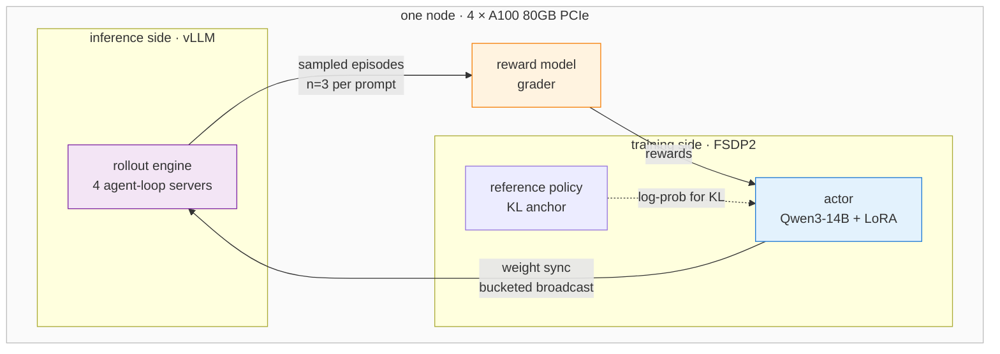

# GRPO reinforcement learning post-training on a single 4-GPU node

[](https://github.com/volcengine/verl)
[](https://github.com/vllm-project/vllm)
[](https://pytorch.org/docs/stable/fsdp.html)
[](https://learn.microsoft.com/azure/virtual-machines/nca100v4-series)
[](LICENSE)

Reinforcement learning post-training of a 14B model — actor, rollout engine, reward model
and reference policy — running together on **four GPUs in one box**, with the memory
budget and interconnect facts that decide whether it fits.

> Author: 魏新宇 (Xinyu Wei)

[English](README.md) | [中文](README-CN.md)

---

## What this shows

RL post-training is usually described as if it needs a cluster. It does not. GRPO on
`Qwen/Qwen3-14B` fits on a single node with 4× A100 80GB, including a live vLLM rollout
engine, provided two things are sized correctly: **how 80 GB is divided between the
training actor and the inference engine**, and **which NCCL transport is actually available
between the cards**.

Both are covered below with measured numbers.

| | |
|---|---|
| **Model** | `Qwen/Qwen3-14B` — vocab 151936, hidden 5120, intermediate 17408 |
| **Algorithm** | GRPO, LoRA rank 64 on all linear layers, `kl_loss_coef=0.01` (low-variance KL) |
| **Rollout** | vLLM, `n=3` samples per prompt, 4 agent-loop servers, tensor parallel = 1 |
| **Sharding** | FSDP2, gradient checkpointing enabled |
| **Hardware** | 4× A100 80GB **PCIe**, no NVLink, driver `570.195.03`, CUDA 12.8 |
| **Sequence** | 2048 prompt + 2048 response, up to 8 assistant turns per episode |

---

## Architecture

Four roles share the same four GPUs. The actor trains, vLLM generates, the grader scores,
and the reference policy anchors the KL term. After each optimizer step the updated actor
weights are pushed into the running vLLM engine.



The two arrows that dominate engineering effort are the **weight sync** — actor to vLLM,
which moves a 3.11 GB embedding tensor — and the **KL log-prob pass**, which materialises
a `[tokens, 151936]` logits tensor. Both are addressed in the configuration below.

---

## The memory budget

This is the number that decides feasibility. On an 80 GB card with tensor parallel = 1,
vLLM loads a **full copy** of the 14B model on every GPU:

| Consumer | Size | Note |
|---|---|---|
| vLLM reservation at `gpu_memory_utilization=0.6` | ~47.5 GB | of which ~28 GB is model weights |
| → KV cache remainder | ~19 GB | what actually serves generation |
| FSDP actor process | ~26 GB | sharded weights, gradients, optimizer state |
| Free headroom | ~4 GB | absorbs the transient logits tensor |

Two consequences worth internalising before sizing a run:

**The fraction is not a free knob.** Lowering it starves the KV cache — at `0.4` the engine
reports needing 6.25 GiB and finding 1.96 GiB. Raising it starves the actor, whose log-prob
pass needs a 4.37 GiB transient at this vocabulary size. The working value here is `0.6`,
and the window is narrow.

**Wide vocabularies cost more than parameter count suggests.** At vocab 151936 the
embedding tensor alone is `151936 × 5120 × 4 B ≈ 3.11 GB` in fp32, which exceeds the default
2048 MB weight-transfer bucket; the entropy term over the same vocabulary is what consumes
the 4.37 GiB transient. Neither scales with the "14B" in the model name.

---

## Interconnect: what is actually available

On PCIe A100s under a hypervisor, `cudaDeviceEnablePeerAccess` fails with CUDA error 217.
Both of NCCL's fast intra-node transports call it — the peer-to-peer path and, less
obviously, the shared-memory path in `shm.cc`. Collectives fall back to the socket
transport.

```bash
export NCCL_P2P_DISABLE=1
export NCCL_SHM_DISABLE=1
export NCCL_DEBUG=INFO      # prints the transport actually selected
```

This is a capacity-planning fact rather than a workaround: on this class of node,
collective bandwidth is TCP-bound. It is also part of why single-node GRPO is viable here —
the dominant traffic is a periodic weight sync, not a per-step gradient all-reduce across
many ranks.

---

## What a run does

Measured stages from a live run, in order:

| Stage | Observed |
|---|---|
| Model load and FSDP2 wrap | full state dict broadcast across 4 ranks |
| vLLM engine start | CUDA graphs captured, `70/70` |
| Agent-loop servers | 4 rollout servers registered |
| Validation pass | grader scored the eval set — `acc/mean@1 = 0.0556`, minimum 2 turns per episode |
| Rollout generation | 12m10s for the first training batch (128 prompts × 3 samples) |
| Weight sync | bucketed broadcast, actor to vLLM |
| Optimizer step | GRPO update against the LoRA adapters |

The validation number is the **untrained policy's baseline** on the grader, captured before
any optimizer step. It is a reference point, not a result.

### Steady-state training

Once the loop is running, per-step cost is stable:

| Step | Wall time | `global_seqlen/mean` | rank imbalance | `actor/entropy` |
|---|---|---|---|---|
| 1 | 1381.65 s | 147 627 | 1 885 | 5.6864 |
| 2 | 1387.50 s | 147 906 | 2 845 | 5.7761 |
| 3 | 1398.62 s | 148 133 | 837 | 5.7379 |

Roughly **23 minutes per step** with under 1.3% variance, ~148 K tokens processed per step,
and rank-to-rank sequence-length imbalance under 2% — the balancer is doing its job. A full
14-step run projects to about 5.5 hours on this node.

Entropy oscillating around 5.7 rather than falling monotonically is the expected early-GRPO
shape: the policy is still exploring. A monotonic collapse this early usually means the KL
constraint is too loose or the learning rate too high.

---

## Quick start

```bash
git clone https://github.com/david-xinyuwei/david-share.git
cd david-share/Deep-Learning/AI-Foundry-Custom-Code-Training
```

Configuration that works on this hardware. These keys already exist, so they are plain
overrides with no Hydra `+` prefix:

```
actor_rollout_ref.rollout.gpu_memory_utilization=0.6
actor_rollout_ref.rollout.checkpoint_engine.update_weights_bucket_megabytes=4096
actor_rollout_ref.actor.entropy_from_logits_with_chunking=True
```

`entropy_from_logits_with_chunking` is the least obvious of the three and the most
important on a wide-vocabulary model: without it the entropy term is materialised as one
`[tokens, 151936]` allocation.

On current `transformers` and on PCIe hardware, two source-level fixes are also needed.
Both are idempotent and refuse to run if the code does not look as expected:

```bash
python patches/01-fsdp2-set-guard/verify.py        # inspect first; writes nothing
python patches/01-fsdp2-set-guard/apply.py
python patches/02-dp-actor-out-of-place/apply.py
```

### Tests

The transformation logic lives in [`patches/transforms.py`](patches/transforms.py) as pure
functions, so it runs without a GPU, a CUDA build, or verl installed:

```bash
pip install pytest
pytest tests/ -q
```

15 tests cover indentation preservation, idempotency, that the output still compiles, and
that every refusal path actually refuses — including `x = logits.div_(temperature)` and
other forms a naive regex would silently corrupt.

---

## Troubleshooting

Getting from a clean environment to a running training loop took seven distinct fixes, and
several of them report an error that points somewhere other than the cause. Symptom, root
cause and evidence for each: [`docs/troubleshooting.md`](docs/troubleshooting.md).

Per-attempt runtimes and what changed between them:
[`evidence/run-timeline.md`](evidence/run-timeline.md).

## Tools

| Tool | What it does |
|---|---|
| [`tools/inspect_config_path.ps1`](tools/inspect_config_path.ps1) | Reconstructs a key's real dotted path from a runtime config dump |
| [`tools/scan_job_log.ps1`](tools/scan_job_log.ps1) | Filters multi-MB job logs; collapses repeated spam so the first exception is visible |

Both read UTF-16LE, because PowerShell 5.1's `*>` redirection writes UTF-16 and ordinary
grep tooling silently reports zero matches on those files.

## Evidence

Every measured number above traces to a run under [`evidence/`](evidence/). Environment
identifiers are removed; anything supporting a technical claim is kept verbatim.
