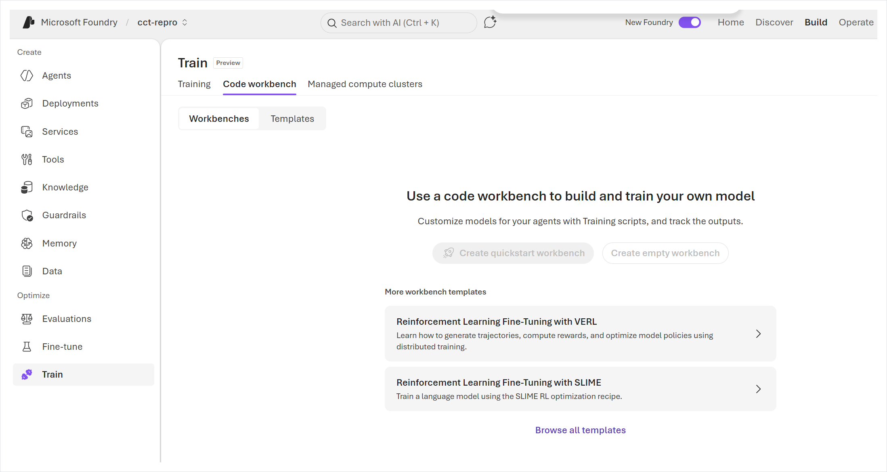
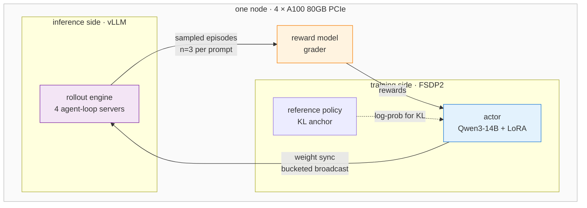

# Microsoft Foundry Custom Code Training: Hello World, SFT, and GRPO

[](https://learn.microsoft.com/azure/ai-foundry/what-is-azure-ai-foundry)
[](https://github.com/david-xinyuwei/david-share/actions/workflows/ai-foundry-custom-code-training-ci.yml)
[](https://github.com/volcengine/verl)
[](https://learn.microsoft.com/azure/virtual-machines/nca100v4-series)
[](LICENSE)

Custom Code Training is the Foundry path for code-driven training beyond managed
fine-tuning defaults: you bring the training script, dataset and container image, while the
platform provides managed GPU compute, job orchestration, observability and versioned model
outputs. This repo validates that product path in three stages: Hello World, LoRA SFT on
`Qwen/Qwen3-14B`, and a completed VERL GRPO run — 14 optimizer steps in 5 h 41 m on one
4×A100 node — then documents the compute plan, compatibility choices and measured runtime.

> Author: 魏新宇 (Xinyu Wei)

[English](README.md) | [中文](README-CN.md)

[Completed SDK paths](#three-sdk-demos-completed-end-to-end) · [GPU / VM / quota](#gpu-vm-and-quota-planning) · [Quick start](#quick-start) · [Evidence](#evidence) · [Product source (access required)](https://github.com/microsoft-foundry/custom-code-training)

---

## What the platform gives you, and what you bring

| Platform provides | You bring |
|---|---|
| Managed GPU cluster, provisioned and released as a Foundry resource | Container image with your framework and CUDA build |
| Job submission, queueing, retry and status | Entry-point script and its command line |
| **Ray** distribution across the node, no cluster wiring | Training code, dataset, reward function |
| Inputs mounted read-only, outputs collected and versioned | Model weights, registered as a Foundry dataset |
| Code, logs, metrics and models browsable per job in the portal | Anything your framework needs that the image does not ship |

The trade is explicit: you keep full control of the training loop, and you own every
dependency inside the image. Most of the work in this repo is on the second half.

## What this repo validates

| Product capability | What was validated | Evidence |
|---|---|---|
| Managed compute and job lifecycle | Compute provisioning, queueing, node registration, execution, completion and cleanup | [Portal screenshots](images/portal-training-job-list.png) and three completed SDK demos below |
| Versioned data and model assets | Read-only input mounts plus versioned SFT adapter, GRPO model and checkpoint outputs | [Job outputs](images/portal-job-model-output.png) and [Models](images/portal-models-deploy.png) |
| Custom distributed runtime | Ray, FSDP2, vLLM rollout and GRPO updates on one managed 4×A100 node | [Completed job details](images/portal-job-details.png) and [runtime settings](images/portal-job-outputs-and-env.png) |
| Measured observability | Four validation passes and roughly 80 metrics for each of 14 optimizer steps | [`evidence/`](evidence/) and the generated tables below |
| Reproducible engineering controls | Pinned SDKs, schema validation, fail-closed config, patch tests and CI on Python 3.11/3.12 | [`scripts/`](scripts/), [`tests/`](tests/) and the CI badge above |

The measured configuration is one validated deployment, not a cross-SKU performance study.
Metric trends are reported without treating a single short run as a quality or convergence
claim. File hashes, runtime differences and evidence lineage remain available in
[`docs/method-and-lineage.md`](docs/method-and-lineage.md) for readers who need audit detail.

### Code workbench at a glance

<div align="center"></div>

The **Train → Code workbench** surface brings persistent workbenches, reusable templates
and managed compute clusters into one place. The Workbenches tab is the starting point for
developing and running custom training code.

<div align="center"></div>

The Templates tab exposes three first-class paths: **Quickstart**, **VERL** and **SLIME**.
They establish the product context before the entry modes and job details shown below.

### Two ways in

<div align="center"></div>

**Experiment and train on compute** creates a persistent workbench you attach to — the path
for iterating on code. **Submit training from the browser** opens VS Code for the Web
against a job definition, for simple runs. Everything below uses the first.

### Templates, including the one this repo follows

<div align="center"></div>

The workbench creation dialog exposes the same Quickstart, VERL and SLIME paths. This repo
takes the **VERL** template. The SLIME notebook targets a multi-node topology and is outside
this single-node validation scope.

### Idle shutdown is part of the product

<div align="center"></div>

A GPU workbench that stays up costs the same whether or not you are typing, so the create
dialog carries an idle-shutdown timer, defaulted to one hour. Worth setting deliberately
rather than accepting.

### The managed compute cluster

<div align="center"></div>

One A100 cluster, `Complete`, showing **0/4 GPUs available** because the job below is
holding all four. Cluster state and job state are separate: a healthy cluster does not mean
a running job.

### The job contract

<div align="center"></div>

This is the part worth reading closely. The command is an ordinary shell line, and the
platform binds your registered assets into it:

```bash
bash "${{inputs.code_dataset}}/verl_rft_startup.sh" \
  --model-path            "${{inputs.model}}" \
  --dataset-path          "${{inputs.train_data}}" \
  --code-path             "${{inputs.code_dataset}}" \
  --output-model-path     "${{outputs.model_output}}" \
  --output-intermediate-folder "${{outputs.intermediate_folder}}"
```

`${{inputs.*}}` and `${{outputs.*}}` resolve to mount paths at run time. Your script never
hard-codes a storage account — it receives directories. Environment variables and tags are
set alongside, which is where framework-level configuration such as
`VERL_EXTRA_OVERRIDES` is injected.

<div align="center"></div>

The Details tab is the reproducibility record: job ID, status and wall-clock duration,
compute target, container image (redacted here), instance type
`Singularity.NC96ad_A100_v4-n1`, shared memory size, and **Distribution type: Ray** — the
platform starts the Ray cluster, your code just uses it. Inputs appear as
`URI folder / ReadOnlyMount`. This is the completed run: `Complete`, **5h 41m**.

### Outputs and the settings that made it run

<div align="center"></div>

Below the inputs, the same tab lists what the job produced and every environment variable it
ran with. The six values in [`configs/verified-overrides.json`](configs/verified-overrides.json)
are visible here as the platform recorded them — `NCCL_P2P_DISABLE=1`, `NCCL_SHM_DISABLE=1`,
`ROLLOUT_GPU_MEMORY_UTILIZATION=0.6`, `N_GPUS_PER_NODE=4`, `N_NODES=1` and
`VERL_EXTRA_OVERRIDES`. Each of them is explained, with the failure it prevents, further down.

### Your code, mounted and browsable

<div align="center"></div>

The Code tab shows exactly what the job ran, file by file — the startup script, the trainer,
the dataset adapter, the reward function and the tool definitions. For a long-running job,
this makes the runtime payload directly inspectable during validation and troubleshooting.

### Job history

<div align="center"></div>

Status, duration and compute target per attempt. The short `Complete` rows are compatibility
probes used before the full run; their image, memory and interconnect learnings are collected
in [`docs/troubleshooting.md`](docs/troubleshooting.md).

### What the run leaves behind

<div align="center"></div>

The outputs your command declared come back as versioned assets, not as files you have to
go find in a storage account. `model_output_dfead6` is typed `Custom model`;
`intermediate_folder_dfead6` holds the checkpoints.

<div align="center"></div>

They then appear under **Deployments → Models**, alongside the LoRA adapter from the earlier
SFT run. In the screenshot, the **Deploy** action belongs to the selected full model output
`model_output_dfead6`; the SFT adapter is shown as a registered training artifact, not as a
validated deployment target. The custom training output therefore lands in the same model
inventory used by the rest of Foundry. Deleting the compute cluster does not touch these —
they live in the project's storage, which is what made it safe to release the GPU as soon
as the run finished.

### The repository is executable, not just a write-up

| Path | Contract |
|---|---|
| [`configs/`](configs/) | JSON Schema, fail-closed example config and the six measured runtime overrides |
| [`scripts/preflight.py`](scripts/preflight.py) | Offline schema/hash gate plus a complete `code/` and `data/` upload-tree inventory; no Azure import or side effects |
| [`scripts/submit_job.py`](scripts/submit_job.py) | Runs cloud actions from an isolated run snapshot and records every dataset transition before SDK `validate` or billable `submit` |
| [`scripts/job_status.py`](scripts/job_status.py) | One read-only job query; never opens a blocking log stream |
| [`docker/Dockerfile`](docker/Dockerfile) | Consolidated CUDA-compatible image recipe with build-time compatibility gates |
| [`patches/`](patches/) | Two idempotent, fail-closed source transforms plus read-back verification |
| [`evidence/`](evidence/) | Raw structured metrics, validation passes, input/log hashes and image-build differential |
| [`tests/`](tests/) | Patch, contract, JSONL, snapshot isolation, partial-upload recovery, credential, SKU, image-tag and Hydra refusal tests |

CI runs the public repository's test matrix on Python 3.11 and 3.12, verifies the SDK pins,
compiles every Python source, runs the deterministic repository gate, and checks the
consolidated Dockerfile without submitting a job. The producer sample is access-controlled,
so its 270/62 dataset contract and frozen hashes are verified locally after an authorized
checkout rather than fetched by this public workflow.

---

## Three SDK demos, completed end to end

The same Foundry project and managed A100 compute were used to validate three progressively
deeper product paths. Each row reached the terminal `Complete` state; these are three
different workflows, not three repetitions of one benchmark.

| SDK demo | Product path validated | Actual run | Output / evidence |
|---|---|---|---|
| `hello-world` | Compute provisioning, queueing, node registration and command execution | `sdk-hello-world-a5b1` — **Complete**, 7m 38s | No dataset required; [structured run evidence](evidence/sdk-demo-runs.jsonl) |
| `quickstart-sft` | Dataset upload and mount, LoRA SFT on `Qwen/Qwen3-14B`, versioned output collection | `sft-lora-862f` — **Complete**, 2h 09m 52s | `retail-sft-lora-c78047` adapter; [model list](images/portal-models-deploy.png) and [run evidence](evidence/sdk-demo-runs.jsonl) |
| `rft-with-verl` | Custom image, Ray, FSDP2, vLLM rollout, GRPO updates and four validation passes | `verl-rft-dpactor-f3e1` — **Complete**, 5h 41m, 14/14 steps | `model_output_dfead6`, checkpoints, [run evidence](evidence/sdk-demo-runs.jsonl) and [per-step metrics](evidence/training-metrics.jsonl) |

### GPU, VM and quota planning

Custom Code Training jobs run on **Foundry Compute**, a managed child resource under the
Foundry account. You create a GPU pool by choosing an Azure VM SKU; the job then references
that compute and uses the matching Singularity `instance_type`. It is not a bring-your-own
IaaS VM, and the training samples accept **full-node SKUs**, not sub-node sizes such as
`D4_v3` or `NC24ad_A100`.

| Workload | Documented compute requirement | Validated in this repo |
|---|---|---|
| Hello World | A project-attached GPU compute cluster; model fit is not exercised | 1 × `Standard_NC96ads_A100_v4` |
| Quickstart SFT | Single-node GPU compute; model and image determine the VRAM floor | Qwen3-14B LoRA SFT on 4 × A100 80GB |
| VERL GRPO | Single-node **A100/H100 or larger** | Qwen3-14B on 4 × A100 80GB; 14/14 steps |
| SLIME GRPO | Multi-node **A100 or larger**; the notebook defaults to 4 nodes × 8 GPUs | Outside the single-node validation scope |

The checked-in job mappings cover full-node A100, H100 and H200 families. A mapping means
that Foundry can bind the compute SKU to a job `instance_type`; it does **not** prove that a
particular model, image and sequence length fit on that SKU.

| GPU family | Compute cluster SKU examples | Job `instance_type` examples | Evidence status |
|---|---|---|---|
| A100 | `STANDARD_NC96ADS_A100_V4`, `STANDARD_ND96AMS_A100_V4`, `STANDARD_ND96AMSR_A100_V4` | `Singularity.NC96ad_A100_v4-n1`, `Singularity.ND96am_A100_v4-n1` | NC96ads tested; ND variants mapped but not benchmarked here |
| H100 | `STANDARD_ND96IS_H100_V5`, `STANDARD_ND96ISR_H100_V5`, `STANDARD_ND96ISRF_H100_V5` | `Singularity.ND96_H100_v5`, `Singularity.ND96r_H100_v5` | Mapped by the samples; not tested here |
| H200 | `STANDARD_ND96IS_H200_V5`, `STANDARD_ND96ISR_H200_V5`, `STANDARD_ND96ISRF_H200_V5` | `Singularity.ND96_H200_v5`, `Singularity.ND96r_H200_v5` | Mapped by the samples; not tested here |

Quota comes from **Azure Machine Learning VM-family quota**, not model/token quota and not
the ordinary Microsoft.Compute core quota. It is scoped per subscription and region under
`Microsoft.MachineLearningServices/locations/<region>`. Two limits must both have room:

1. the target VM-family dedicated-vCPU quota, for example `standardNCADSA100v4Family`;
2. `TotalDedicatedCores`, the total dedicated-vCPU quota for the region.

For `node_count` nodes, both limits need at least
`node_count × vCPUs_per_full_node` available.
The completed run used one NC96ads node, so it required 96 vCPUs. The live preflight read
`100 limit / 96 used` for the family and `200 / 96` regionally; the family quota therefore
limited the project to one node. The sanitized observation is in
[`evidence/compute-quota.jsonl`](evidence/compute-quota.jsonl).

```bash
az extension add --name quota --yes
SUBSCRIPTION_ID="<subscription-id>"
REGION="<region>"
SCOPE="/subscriptions/${SUBSCRIPTION_ID}/providers/Microsoft.MachineLearningServices/locations/${REGION}"

az quota show --scope "$SCOPE" --resource-name standardNCADSA100v4Family
az quota usage show --scope "$SCOPE" --resource-name standardNCADSA100v4Family
az quota show --scope "$SCOPE" --resource-name TotalDedicatedCores
az quota usage show --scope "$SCOPE" --resource-name TotalDedicatedCores
```

Request an increase from **Azure portal → Usage + quotas**, filtering to the target region
and VM family. If automatic approval is unavailable, open **Service and subscription limits
(quotas) → Machine Learning Service: Virtual Machine Quota**. Quota itself does not incur
GPU charges and is not a capacity guarantee; backend capacity is checked when compute is
created. See [Microsoft Learn: manage Azure Machine Learning quotas](https://learn.microsoft.com/azure/machine-learning/how-to-manage-quotas).

---

## Deep dive: the VERL run

RL post-training is usually described as if it needs a cluster. It does not. GRPO on
`Qwen/Qwen3-14B` fits on a single node with 4× A100 80GB, including a live vLLM rollout
engine, provided two things are sized correctly: **how 80 GB is divided between the
training actor and the inference engine**, and **which NCCL transport is actually available
between the cards**.

Both are covered below with measured numbers.

| | |
|---|---|
| **Task** | Retail customer-service agent, tool-calling, graded by a custom reward function |
| **Model** | `Qwen/Qwen3-14B` — vocab 151936, hidden 5120, intermediate 17408 |
| **Algorithm** | GRPO, LoRA rank 64 on all linear layers, `kl_loss_coef=0.01` (low-variance KL) |
| **Rollout** | vLLM, `n=3` samples per prompt, 4 agent-loop servers, tensor parallel = 1 |
| **Sharding** | FSDP2, gradient checkpointing enabled |
| **Hardware** | 4× A100 80GB **PCIe**, no NVLink, driver `570.195.03`, CUDA 12.8 |
| **Sequence** | 2048 prompt + 2048 response, up to 8 assistant turns per episode |

---

## Architecture

Four roles share the same four GPUs. The actor trains, vLLM generates, the grader scores,
and the reference policy anchors the KL term. After each optimizer step the updated actor
weights are pushed into the running vLLM engine.



The two arrows that dominate engineering effort are the **weight sync** — actor to vLLM,
which moves a 3.11 GB embedding tensor — and the **KL log-prob pass**, which materialises
a `[tokens, 151936]` logits tensor. Both are addressed in the configuration below.

---

## The memory budget

This is the number that decides feasibility. On an 80 GB card with tensor parallel = 1,
vLLM loads a **full copy** of the 14B model on every GPU:

| Consumer | Size | Source |
|---|---|---|
| vLLM reservation at `gpu_memory_utilization=0.6` | ~47.5 GB | derived: fraction × usable VRAM |
| → KV cache remainder | ~19 GB | derived: reservation minus a full 14B weight copy |
| FSDP actor process | **26.7–27.8 GB** | **measured** — `perf/max_memory_reserved_gb`, 14 steps |
| Free headroom | ~4 GB | remainder; absorbs the transient logits tensor |

Only the actor row is instrumented. The vLLM and KV-cache rows follow from the configured
fraction and the model size, and are shown to make the split legible rather than to claim
per-component telemetry.

Two consequences worth internalising before sizing a run:

**The fraction is not a free knob.** Lowering it starves the KV cache — at `0.4` the engine
reports needing 6.25 GiB and finding 1.96 GiB. Raising it starves the actor, whose log-prob
pass needs a 4.37 GiB transient at this vocabulary size. The working value here is `0.6`,
and the window is narrow.

**Wide vocabularies cost more than parameter count suggests.** At vocab 151936 the
embedding tensor alone is `151936 × 5120 × 4 B ≈ 3.11 GB` in fp32, which exceeds the default
2048 MB weight-transfer bucket; the entropy term over the same vocabulary is what consumes
the 4.37 GiB transient. Neither scales with the "14B" in the model name.

---

## Interconnect: what is actually available

On PCIe A100s under a hypervisor, `cudaDeviceEnablePeerAccess` fails with CUDA error 217.
Both of NCCL's fast intra-node transports call it — the peer-to-peer path and, less
obviously, the shared-memory path in `shm.cc`. Collectives fall back to the socket
transport.

```bash
export NCCL_P2P_DISABLE=1
export NCCL_SHM_DISABLE=1
export NCCL_DEBUG=INFO      # prints the transport actually selected
```

This is a capacity-planning fact rather than a workaround: on this class of node,
collective bandwidth is TCP-bound. It is also part of why single-node GRPO is viable here —
the dominant traffic is a periodic weight sync, not a per-step gradient all-reduce across
many ranks.

---

## What a run does

Measured stages from a live run, in order:

| Stage | Observed |
|---|---|
| Model load and FSDP2 wrap | full state dict broadcast across 4 ranks |
| vLLM engine start | CUDA graphs captured, `70/70` |
| Agent-loop servers | 4 rollout servers registered |
| Validation pass | grader scored the eval set — `acc/mean@1 = 0.05565`, minimum 2 turns per episode |
| Rollout generation | 12m10s for the first training batch (128 prompts × 3 samples) |
| Weight sync | bucketed broadcast, actor to vLLM |
| Optimizer step | GRPO update against the LoRA adapters |

That first validation is the **untrained policy's baseline** on the grader, captured before
any optimizer step. The eval set runs again every 5 steps, and once more at the end:

| Validation pass | `val-core/retail_grader/acc/mean@1` |
|---|---|
| before training | 0.05565 |
| after step 5 | 0.05242 |
| after step 10 | 0.05565 |
| after step 14 (final) | 0.05726 |

**This is not evidence of learning, and not evidence of harm.** The series goes down, back
to baseline, then up; the whole range spans 0.005 on a grader whose baseline is already near
the floor, and step 10 lands on the baseline value exactly. One run of 14 steps cannot
separate that from noise. All four passes are in
[`evidence/validation-baseline.json`](evidence/validation-baseline.json); drawing a direction
from them would need repeat runs and many more steps than this.

### Steady-state training

The run completed all 14 planned steps. The table is generated from
[`evidence/training-metrics.jsonl`](evidence/training-metrics.jsonl) by
[`tools/make_steps_table.py`](tools/make_steps_table.py) — it is not transcribed, so it
cannot drift from the source. `s/step` is verl's own `perf/time_per_step`:

| Step | s/step | `global_seqlen/mean` | rank imbalance | `actor/entropy` | `critic/score/mean` | `actor/kl_loss` | `actor/grad_norm` |
|---|---|---|---|---|---|---|---|
| 1 | 1381.62 | 147 628 | 1 885 | 5.6864 | 0.0577 | 0.0326 | 0.0313 |
| 2 | 1391.57 | 147 906 | 2 845 | 5.7761 | 0.0551 | 0.0669 | 0.0688 |
| 3 | 1411.82 | 148 133 | 837 | 5.7379 | 0.0566 | 0.0596 | 0.0412 |
| 4 | 1413.00 | 148 756 | 3 099 | 5.7788 | 0.0563 | 0.0534 | 0.0111 |
| 5 | 1403.31 | 149 836 | 3 397 | 6.1491 | 0.0552 | 0.0501 | 0.0261 |
| 6 | 1378.17 | 148 397 | 1 985 | 5.8183 | 0.0573 | 0.0748 | 0.0526 |
| 7 | 1380.81 | 148 623 | 600 | 5.7896 | 0.0557 | 0.0789 | 0.0291 |
| 8 | 1379.47 | 148 284 | 2 521 | 5.9270 | 0.0573 | 0.0888 | 0.0252 |
| 9 | 1424.94 | 148 536 | 1 582 | 5.9374 | 0.0564 | 0.1043 | 0.0371 |
| 10 | 1409.09 | 147 899 | 839 | 5.8163 | 0.0568 | 0.1378 | 0.0349 |
| 11 | 1400.95 | 149 339 | 2 547 | 6.1412 | 0.0573 | 0.1193 | 0.0228 |
| 12 | 1420.04 | 148 335 | 2 395 | 5.8874 | 0.0551 | 0.1616 | 0.0518 |
| 13 | 1399.12 | 147 989 | 2 168 | 5.9197 | 0.0557 | 0.1804 | 0.0239 |
| 14 | 1575.99 | 149 131 | 3 130 | 6.1207 | 0.0569 | 0.2023 | 0.0554 |

**Cost is stable and predictable.** Steps 1–13 average 1399.53 s — about 23 minutes per step
— with a 3.34% spread between fastest and slowest, ~148 K tokens per step, and rank-to-rank
sequence-length imbalance peaking at 2.27%. The balancer is doing its job. Step 14 costs
1575.99 s because it also runs the final validation pass; that single step is the only
outlier in the run. End to end the training loop took **5 h 29 m 38 s**, inside a job whose
total wall time was **5 h 41 m** — the difference is image pull, Ray startup, model load and
artifact upload.

**Utilisation is low, and that is the design.** `perf/mfu/actor` sits between 6.08% and
6.37%. Most of each step is rollout generation, not the optimizer pass: the actor waits
while vLLM samples 128 prompts × 3. Reading 6% MFU as inefficiency misreads what an RL
step is.

**Nothing converged, and 14 steps is far too few to expect it to.** `critic/score/mean`
stays inside 0.0551–0.0577 across all 14 steps with no trend. `actor/kl_loss` climbs
monotonically from 0.033 to 0.202 — the policy moving steadily away from the reference,
expected, and still small against `kl_coef=0.01`. Entropy oscillates between 5.69 and 6.15
rather than falling: the policy is still exploring. A monotonic entropy collapse this early
usually means the KL constraint is too loose or the learning rate too high; that is not what
this run shows.

---

## Quick start

```bash
git lfs version
git clone --filter=blob:none --sparse https://github.com/david-xinyuwei/david-share.git
git -C david-share sparse-checkout set Deep-Learning/AI-Foundry-Custom-Code-Training .github/workflows
git -C david-share lfs pull --include="Deep-Learning/AI-Foundry-Custom-Code-Training/**"
cd david-share/Deep-Learning/AI-Foundry-Custom-Code-Training
python -m venv .venv
source .venv/bin/activate            # Windows PowerShell: .venv\Scripts\Activate.ps1
python -m pip install --no-input -r requirements-dev.txt
```

The training adapter consumes source and datasets from the product preview repository; they
are not redistributed here. **An authorized GitHub identity with access to
`microsoft-foundry/custom-code-training` is therefore a prerequisite** for the commands
below. A `404` while cloning or fetching means that source access has not been granted; do
not replace the measured payload with an unrelated public implementation.

After access is confirmed, get the sample used by the measured run and make a local config:

```bash
git init upstream-custom-code-training
git -C upstream-custom-code-training remote add origin https://github.com/microsoft-foundry/custom-code-training.git
git -C upstream-custom-code-training fetch --depth 1 origin 018d095f508280efce9e79c4b19fc941d7361b30
git -C upstream-custom-code-training checkout --detach FETCH_HEAD
cp configs/foundry-job.example.json configs/foundry-job.local.json
```

The measured lineage is fixed to commit `018d095f508280efce9e79c4b19fc941d7361b30`.
If the preview repository has advanced or no longer exposes that object, use an authorized
checkout and compare the 12 file hashes in
[`docs/method-and-lineage.md`](docs/method-and-lineage.md) before treating a new run as the
same lineage. Without source access, the public tests and published evidence remain usable,
but `plan`, `validate` and `submit` cannot reconstruct the training payload.

Replace every `<...>` in the local config. Before authentication or any cloud call, run the
offline gate:

```bash
python scripts/preflight.py \
    --config configs/foundry-job.local.json \
    --overrides configs/verified-overrides.json \
    --sample-dir upstream-custom-code-training/code-samples/sdk/training/rft-with-verl \
    --write-plan run-output/preflight.json

python scripts/submit_job.py --action plan \
    --config configs/foundry-job.local.json \
    --overrides configs/verified-overrides.json \
    --sample-dir upstream-custom-code-training/code-samples/sdk/training/rft-with-verl
```

Done-when is `PREFLIGHT_PASS`, 270 train and 62 validation records, 12 input hashes and a
rendered Ray `CommandJob`. The two commands above have `sideEffects: []`. The next gates are
deliberately separate:

```bash
# Uploads versioned code/data assets, calls validate().try_raise(), does not create a job.
python scripts/submit_job.py --action validate <the same --config/--overrides/--sample-dir args>

# Requests GPU execution. Run only after checking quota, capacity and idle-shutdown policy.
python scripts/submit_job.py --action submit <the same --config/--overrides/--sample-dir args>
```

For either cloud action, the adapter first copies the config, overrides, expected manifest
and complete `code/` / `data/` trees into one isolated run snapshot. The second preflight
and both uploads read only that snapshot. The evidence file is written before the first
cloud call and after every dataset transition (`PENDING` → `UPLOADING` → `UPLOADED`). If an
upload, SDK validation or submission fails, it lists every potentially created dataset
name/version for operator inspection; an uncertain submit also records the job name before
the RPC, so the operator can query it before retrying. Dataset versions are retained by
default because automatic deletion could remove an asset already referenced by another job.
`--tenant-id` is accepted only with `--credential azure-cli`; `DefaultAzureCredential`
remains available for managed identity, workload identity and service-principal environments.

[`docs/reproduction.md`](docs/reproduction.md) contains the complete commands, image build,
identity/RBAC requirements, monitor step and evidence extraction.

Reproducing the run itself is two separate problems: standing the job up on Foundry, and
getting the container to survive to the first optimizer step.

**On Foundry** — register three assets and point the VERL template at them:

| Asset | What it is | Appears in the command as |
|---|---|---|
| Model | Qwen3-14B weights, registered as a Foundry dataset | `${{inputs.model}}` |
| Code | The folder shown in the Code tab above, containing `verl_rft_startup.sh` | `${{inputs.code_dataset}}` |
| Data | Training and validation JSONL | `${{inputs.train_data}}` |

Then set the container image to one whose CUDA build matches the node driver. On this node
the driver caps at CUDA 12.8, and the tag that satisfies it is **not** the template default
— the measured tag matrix is in [`docs/troubleshooting.md`](docs/troubleshooting.md).

**In the container** — configuration that works on this hardware. These keys already exist,
so they are plain overrides with no Hydra `+` prefix:

```
actor_rollout_ref.rollout.gpu_memory_utilization=0.6
actor_rollout_ref.rollout.checkpoint_engine.update_weights_bucket_megabytes=4096
actor_rollout_ref.actor.entropy_from_logits_with_chunking=True
```

`entropy_from_logits_with_chunking` is the least obvious of the three and the most
important on a wide-vocabulary model: without it the entropy term is materialised as one
`[tokens, 151936]` allocation.

On current `transformers` and on PCIe hardware, two source-level fixes are also needed.
Both are idempotent and refuse to run if the code does not look as expected:

```bash
python patches/01-fsdp2-set-guard/verify.py        # inspect first; writes nothing
python patches/01-fsdp2-set-guard/apply.py
python patches/02-dp-actor-out-of-place/apply.py
```

### Tests

The patch and job-contract tests run without a GPU, CUDA or Azure credential:

```bash
python -m pip install --no-input -r requirements-dev.txt
python -m pytest tests/ -q
python scripts/validate_repo.py
```

The suite covers indentation preservation, idempotency, valid Python output, dataset schema,
snapshot isolation, partial-upload evidence, credential constraints, mount/output shape,
resource mapping and every refusal path: placeholders, unknown config keys, `:latest`,
unsupported SKUs, missing payload files, absent NCCL SHM disablement and a Hydra `+` prefix
that would otherwise create a legal but unused key.

---

## Compatibility notes

Compatibility notes for the tested image, dependency stack, memory budget and PCIe
interconnect are collected in [`docs/troubleshooting.md`](docs/troubleshooting.md).

Per-attempt runtimes and what changed between them:
[`evidence/run-timeline.md`](evidence/run-timeline.md).

## Tools

| Tool | What it does |
|---|---|
| [`tools/extract_training_evidence.py`](tools/extract_training_evidence.py) | Parses a captured job log into the JSON under `evidence/`, redacting environment identifiers without touching any numeric value |
| [`tools/make_steps_table.py`](tools/make_steps_table.py) | Regenerates the steady-state table above from `evidence/training-metrics.jsonl` |
| [`tools/inspect_config_path.ps1`](tools/inspect_config_path.ps1) | Reconstructs a key's real dotted path from a runtime config dump |
| [`tools/scan_job_log.ps1`](tools/scan_job_log.ps1) | Filters multi-MB job logs; collapses repeated spam so the first exception is visible |

The two PowerShell tools read UTF-16LE, because PowerShell 5.1's `*>` redirection writes
UTF-16 and ordinary grep tooling silently reports zero matches on those files.

## Evidence

| File | Contents |
|---|---|
| [`evidence/training-metrics.jsonl`](evidence/training-metrics.jsonl) | ~80 metrics per step, verbatim |
| [`evidence/validation-baseline.json`](evidence/validation-baseline.json) | Grader score from each validation pass |
| [`evidence/run-manifest.json`](evidence/run-manifest.json) | Source-log SHA-256, record count, which steps were captured |
| [`evidence/image-build.json`](evidence/image-build.json) | Base/package versions, compatibility probe before/after, four layer digests |
| [`evidence/sdk-demo-runs.jsonl`](evidence/sdk-demo-runs.jsonl) | Terminal state, duration, topology and outputs for Hello World, SFT and VERL GRPO |
| [`evidence/input-manifest.jsonl`](evidence/input-manifest.jsonl) | Bytes and SHA-256 for all 12 files in the uploaded sample tree; 270/62 dataset counts |
| [`evidence/compute-quota.jsonl`](evidence/compute-quota.jsonl) | Sanitized family/regional quota observation and node-capacity arithmetic |
| [`evidence/run-timeline.md`](evidence/run-timeline.md) | Per compatibility attempt: what changed and which runtime stage was reached |

The steady-state table and four validation numbers are generated from those files. Earlier
compatibility attempts that ended before the optimizer loop emitted no metric rows; their
diagnostic signatures are retained in [`docs/troubleshooting.md`](docs/troubleshooting.md).
The vLLM and KV-cache figures in the memory table are derived, as marked.

Environment identifiers are redacted; no numeric value is altered.
