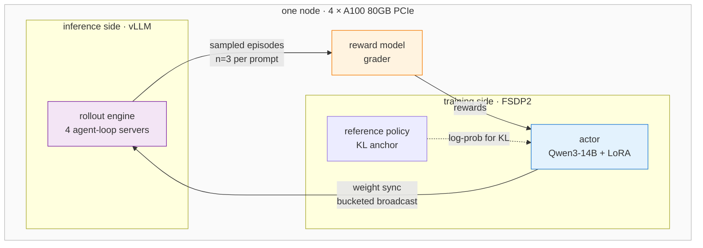

# Custom Code Training on Microsoft Foundry — running your own GRPO code on a managed 4×A100 node

[](https://github.com/microsoft-foundry/custom-code-training)
[](https://github.com/microsoft-foundry/custom-code-training)
[](https://github.com/volcengine/verl)
[](https://learn.microsoft.com/azure/virtual-machines/nca100v4-series)
[](LICENSE)

Custom Code Training is the Foundry surface for training that does **not** fit a managed
fine-tuning form: you supply the training script, the dataset and the container image, and
the platform supplies the GPU cluster, the job contract and the observability. This repo
documents what that surface actually gives you, then takes the product's own verl template
all the way to a running GRPO job on `Qwen/Qwen3-14B` — including the seven failures on the
way and the measured cost per step at the other end.

> Author: 魏新宇 (Xinyu Wei)

[English](README.md) | [中文](README-CN.md)

---

## What the platform gives you, and what you bring

| Platform provides | You bring |
|---|---|
| Managed GPU cluster, provisioned and released as a Foundry resource | Container image with your framework and CUDA build |
| Job submission, queueing, retry and status | Entry-point script and its command line |
| **Ray** distribution across the node, no cluster wiring | Training code, dataset, reward function |
| Inputs mounted read-only, outputs collected and versioned | Model weights, registered as a Foundry dataset |
| Code, logs, metrics and models browsable per job in the portal | Anything your framework needs that the image does not ship |

The trade is explicit: you keep full control of the training loop, and you own every
dependency inside the image. Most of the work in this repo is on the second half.

### Two ways in

<div align="center"></div>

**Experiment and train on compute** creates a persistent workbench you attach to — the path
for iterating on code. **Submit training from the browser** opens VS Code for the Web
against a job definition, for simple runs. Everything below uses the first.

### Templates, including the one this repo follows

<div align="center"></div>

The template dropdown offers a Quickstart plus two reinforcement-learning options,
**VERL** and **SLIME**. The same three appear as cards in the Code workbench:

<div align="center"></div>

This repo takes the **VERL** template. SLIME asks for 4 nodes × 8 GPU, which is a different
capacity conversation.

### Idle shutdown is part of the product

<div align="center"></div>

A GPU workbench that stays up costs the same whether or not you are typing, so the create
dialog carries an idle-shutdown timer, defaulted to one hour. Worth setting deliberately
rather than accepting.

### The managed compute cluster

<div align="center"></div>

One A100 cluster, `Complete`, showing **0/4 GPUs available** because the job below is
holding all four. Cluster state and job state are separate: a healthy cluster does not mean
a running job.

### The job contract

<div align="center"></div>

This is the part worth reading closely. The command is an ordinary shell line, and the
platform binds your registered assets into it:

```bash
bash "${{inputs.code_dataset}}/verl_rft_startup.sh" \
  --model-path            "${{inputs.model}}" \
  --dataset-path          "${{inputs.train_data}}" \
  --code-path             "${{inputs.code_dataset}}" \
  --output-model-path     "${{outputs.model_output}}" \
  --output-intermediate-folder "${{outputs.intermediate_folder}}"
```

`${{inputs.*}}` and `${{outputs.*}}` resolve to mount paths at run time. Your script never
hard-codes a storage account — it receives directories. Environment variables and tags are
set alongside, which is where framework-level configuration such as
`VERL_EXTRA_OVERRIDES` is injected.

<div align="center"></div>

The Details tab is the reproducibility record: job ID, compute target, container image
(redacted here), instance type `Singularity.NC96ad_A100_v4-n1`, shared memory size, and
**Distribution type: Ray** — the platform starts the Ray cluster, your code just uses it.
Inputs appear as `URI folder / ReadOnlyMount`.

### Your code, mounted and browsable

<div align="center"></div>

The Code tab shows exactly what the job ran, file by file — the startup script, the trainer,
the dataset adapter, the reward function and the tool definitions. When a run fails three
hours in, being able to read the code the job actually saw, rather than the code you think
you uploaded, is the difference between a diagnosis and a guess.

### Job history

<div align="center"></div>

Status, duration and compute target per attempt. The short `Complete` rows are node probes
used to identify a working image; the story of the `Failed` rows is in
[`docs/troubleshooting.md`](docs/troubleshooting.md).

---

## What we ran on it

RL post-training is usually described as if it needs a cluster. It does not. GRPO on
`Qwen/Qwen3-14B` fits on a single node with 4× A100 80GB, including a live vLLM rollout
engine, provided two things are sized correctly: **how 80 GB is divided between the
training actor and the inference engine**, and **which NCCL transport is actually available
between the cards**.

Both are covered below with measured numbers.

| | |
|---|---|
| **Task** | Retail customer-service agent, tool-calling, graded by a custom reward function |
| **Model** | `Qwen/Qwen3-14B` — vocab 151936, hidden 5120, intermediate 17408 |
| **Algorithm** | GRPO, LoRA rank 64 on all linear layers, `kl_loss_coef=0.01` (low-variance KL) |
| **Rollout** | vLLM, `n=3` samples per prompt, 4 agent-loop servers, tensor parallel = 1 |
| **Sharding** | FSDP2, gradient checkpointing enabled |
| **Hardware** | 4× A100 80GB **PCIe**, no NVLink, driver `570.195.03`, CUDA 12.8 |
| **Sequence** | 2048 prompt + 2048 response, up to 8 assistant turns per episode |

---

## Architecture

Four roles share the same four GPUs. The actor trains, vLLM generates, the grader scores,
and the reference policy anchors the KL term. After each optimizer step the updated actor
weights are pushed into the running vLLM engine.



The two arrows that dominate engineering effort are the **weight sync** — actor to vLLM,
which moves a 3.11 GB embedding tensor — and the **KL log-prob pass**, which materialises
a `[tokens, 151936]` logits tensor. Both are addressed in the configuration below.

---

## The memory budget

This is the number that decides feasibility. On an 80 GB card with tensor parallel = 1,
vLLM loads a **full copy** of the 14B model on every GPU:

| Consumer | Size | Source |
|---|---|---|
| vLLM reservation at `gpu_memory_utilization=0.6` | ~47.5 GB | derived: fraction × usable VRAM |
| → KV cache remainder | ~19 GB | derived: reservation minus a full 14B weight copy |
| FSDP actor process | **26.7–27.8 GB** | **measured** — `perf/max_memory_reserved_gb`, 8 steps |
| Free headroom | ~4 GB | remainder; absorbs the transient logits tensor |

Only the actor row is instrumented. The vLLM and KV-cache rows follow from the configured
fraction and the model size, and are shown to make the split legible rather than to claim
per-component telemetry.

Two consequences worth internalising before sizing a run:

**The fraction is not a free knob.** Lowering it starves the KV cache — at `0.4` the engine
reports needing 6.25 GiB and finding 1.96 GiB. Raising it starves the actor, whose log-prob
pass needs a 4.37 GiB transient at this vocabulary size. The working value here is `0.6`,
and the window is narrow.

**Wide vocabularies cost more than parameter count suggests.** At vocab 151936 the
embedding tensor alone is `151936 × 5120 × 4 B ≈ 3.11 GB` in fp32, which exceeds the default
2048 MB weight-transfer bucket; the entropy term over the same vocabulary is what consumes
the 4.37 GiB transient. Neither scales with the "14B" in the model name.

---

## Interconnect: what is actually available

On PCIe A100s under a hypervisor, `cudaDeviceEnablePeerAccess` fails with CUDA error 217.
Both of NCCL's fast intra-node transports call it — the peer-to-peer path and, less
obviously, the shared-memory path in `shm.cc`. Collectives fall back to the socket
transport.

```bash
export NCCL_P2P_DISABLE=1
export NCCL_SHM_DISABLE=1
export NCCL_DEBUG=INFO      # prints the transport actually selected
```

This is a capacity-planning fact rather than a workaround: on this class of node,
collective bandwidth is TCP-bound. It is also part of why single-node GRPO is viable here —
the dominant traffic is a periodic weight sync, not a per-step gradient all-reduce across
many ranks.

---

## What a run does

Measured stages from a live run, in order:

| Stage | Observed |
|---|---|
| Model load and FSDP2 wrap | full state dict broadcast across 4 ranks |
| vLLM engine start | CUDA graphs captured, `70/70` |
| Agent-loop servers | 4 rollout servers registered |
| Validation pass | grader scored the eval set — `acc/mean@1 = 0.05565`, minimum 2 turns per episode |
| Rollout generation | 12m10s for the first training batch (128 prompts × 3 samples) |
| Weight sync | bucketed broadcast, actor to vLLM |
| Optimizer step | GRPO update against the LoRA adapters |

That first validation is the **untrained policy's baseline** on the grader, captured before
any optimizer step. The eval set runs again every 5 steps:

| Validation pass | `val-core/retail_grader/acc/mean@1` |
|---|---|
| before training | 0.05565 |
| after step 5 | 0.05242 |

**This is not evidence of learning, and not evidence of harm.** It is one run, 5 optimizer
steps, and an absolute difference of 0.003 on a grader whose baseline is already near the
floor. Both numbers are in [`evidence/validation-baseline.json`](evidence/validation-baseline.json);
drawing a direction from them would need repeat runs and many more steps than this.

### Steady-state training

Eight steps of a planned fourteen were captured. The table is generated from
[`evidence/training-metrics.jsonl`](evidence/training-metrics.jsonl) by
[`tools/make_steps_table.py`](tools/make_steps_table.py) — it is not transcribed, so it
cannot drift from the source:

| Step | s/step | `global_seqlen/mean` | rank imbalance | `actor/entropy` | `critic/score/mean` | `actor/kl_loss` | `actor/grad_norm` |
|---|---|---|---|---|---|---|---|
| 1 | 1381.65 | 147 628 | 1 885 | 5.6864 | 0.0577 | 0.0326 | 0.0313 |
| 2 | 1387.50 | 147 906 | 2 845 | 5.7761 | 0.0551 | 0.0669 | 0.0688 |
| 3 | 1398.62 | 148 133 | 837 | 5.7379 | 0.0566 | 0.0596 | 0.0412 |
| 4 | 1404.31 | 148 756 | 3 099 | 5.7788 | 0.0563 | 0.0534 | 0.0111 |
| 5 | 1404.85 | 149 836 | 3 397 | 6.1491 | 0.0552 | 0.0501 | 0.0261 |
| 6 | 1395.79 | 148 397 | 1 985 | 5.8183 | 0.0573 | 0.0748 | 0.0526 |
| 7 | 1390.90 | 148 623 | 600 | 5.7896 | 0.0557 | 0.0789 | 0.0291 |
| 8 | 1387.27 | 148 284 | 2 521 | 5.9270 | 0.0573 | 0.0888 | 0.0252 |

**Cost is stable.** Mean 1393.86 s — about 23 minutes per step — with a 1.66% spread
between the fastest and slowest step, ~148 K tokens per step, and rank-to-rank
sequence-length imbalance peaking at 2.27%. The balancer is doing its job. Fourteen steps
at the measured mean projects to about 5.4 hours on this node.

**Utilisation is low, and that is the design.** `perf/mfu/actor` sits between 6.15% and
6.37%. Most of each step is rollout generation, not the optimizer pass: the actor waits
while vLLM samples 128 prompts × 3. Reading 6% MFU as inefficiency misreads what an RL
step is.

**Nothing has converged, and eight steps is far too few to expect it to.** `critic/score/mean`
stays inside 0.0551–0.0577 with no trend. `actor/kl_loss` climbs from 0.033 to 0.089, which
is the policy moving away from the reference — expected, and still small against
`kl_coef=0.01`. Entropy oscillates between 5.69 and 6.15 rather than falling: the policy is
still exploring. A monotonic entropy collapse this early usually means the KL constraint is
too loose or the learning rate too high; that is not what these eight steps show.

---

## Quick start

```bash
git clone https://github.com/david-xinyuwei/david-share.git
cd david-share/Deep-Learning/AI-Foundry-Custom-Code-Training
```

Reproducing the run itself is two separate problems: standing the job up on Foundry, and
getting the container to survive to the first optimizer step.

**On Foundry** — register three assets and point the VERL template at them:

| Asset | What it is | Appears in the command as |
|---|---|---|
| Model | Qwen3-14B weights, registered as a Foundry dataset | `${{inputs.model}}` |
| Code | The folder shown in the Code tab above, containing `verl_rft_startup.sh` | `${{inputs.code_dataset}}` |
| Data | Training and validation JSONL | `${{inputs.train_data}}` |

Then set the container image to one whose CUDA build matches the node driver. On this node
the driver caps at CUDA 12.8, and the tag that satisfies it is **not** the template default
— the measured tag matrix is in [`docs/troubleshooting.md`](docs/troubleshooting.md).

**In the container** — configuration that works on this hardware. These keys already exist,
so they are plain overrides with no Hydra `+` prefix:

```
actor_rollout_ref.rollout.gpu_memory_utilization=0.6
actor_rollout_ref.rollout.checkpoint_engine.update_weights_bucket_megabytes=4096
actor_rollout_ref.actor.entropy_from_logits_with_chunking=True
```

`entropy_from_logits_with_chunking` is the least obvious of the three and the most
important on a wide-vocabulary model: without it the entropy term is materialised as one
`[tokens, 151936]` allocation.

On current `transformers` and on PCIe hardware, two source-level fixes are also needed.
Both are idempotent and refuse to run if the code does not look as expected:

```bash
python patches/01-fsdp2-set-guard/verify.py        # inspect first; writes nothing
python patches/01-fsdp2-set-guard/apply.py
python patches/02-dp-actor-out-of-place/apply.py
```

### Tests

The transformation logic lives in [`patches/transforms.py`](patches/transforms.py) as pure
functions, so it runs without a GPU, a CUDA build, or verl installed:

```bash
pip install pytest
pytest tests/ -q
```

15 tests cover indentation preservation, idempotency, that the output still compiles, and
that every refusal path actually refuses — including `x = logits.div_(temperature)` and
other forms a naive regex would silently corrupt.

---

## Troubleshooting

Getting from a clean environment to a running training loop took one image decision and
seven further fixes, and several of them report an error that points somewhere other than
the cause. Symptom, root cause and evidence for each:
[`docs/troubleshooting.md`](docs/troubleshooting.md).

Per-attempt runtimes and what changed between them:
[`evidence/run-timeline.md`](evidence/run-timeline.md).

## Tools

| Tool | What it does |
|---|---|
| [`tools/extract_training_evidence.py`](tools/extract_training_evidence.py) | Parses a captured job log into the JSON under `evidence/`, redacting environment identifiers without touching any numeric value |
| [`tools/make_steps_table.py`](tools/make_steps_table.py) | Regenerates the steady-state table above from `evidence/training-metrics.jsonl` |
| [`tools/inspect_config_path.ps1`](tools/inspect_config_path.ps1) | Reconstructs a key's real dotted path from a runtime config dump |
| [`tools/scan_job_log.ps1`](tools/scan_job_log.ps1) | Filters multi-MB job logs; collapses repeated spam so the first exception is visible |

The two PowerShell tools read UTF-16LE, because PowerShell 5.1's `*>` redirection writes
UTF-16 and ordinary grep tooling silently reports zero matches on those files.

## Evidence

| File | Contents |
|---|---|
| [`evidence/training-metrics.jsonl`](evidence/training-metrics.jsonl) | ~80 metrics per step, verbatim |
| [`evidence/validation-baseline.json`](evidence/validation-baseline.json) | Grader score from each validation pass |
| [`evidence/run-manifest.json`](evidence/run-manifest.json) | Source-log SHA-256, record count, which steps were captured |
| [`evidence/run-timeline.md`](evidence/run-timeline.md) | Per attempt: what changed, where it died |

The steady-state table and both validation numbers are generated from those files. The
failure signatures in [`docs/troubleshooting.md`](docs/troubleshooting.md) are quoted from
the job logs of runs that died before emitting any metric, so they have no rows here. The
vLLM and KV-cache figures in the memory table are derived, as marked.

Environment identifiers are redacted; no numeric value is altered.
