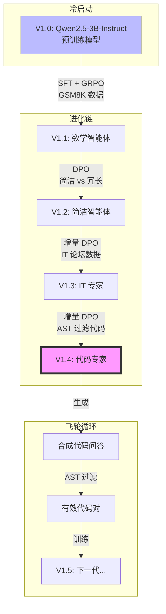

# Agent Lightning Flywheel: AIPC 与云端混合架构下的 AI 进化实战

**作者**: 魏新宇 (Microsoft AI and Apps GBB Architect)  
**日期**: 2026-01-01  
**状态**: 已完成 (V1.4)

---

## 1. 项目概览

本项目验证 **"AI Agent Flywheel"（AI 智能体飞轮）** 概念：通过增量式强化学习 (RL) 和直接偏好优化 (DPO)，让模型在保留原有能力的基础上持续进化，避免灾难性遗忘。

我们成功将模型从 **V1.0（预训练）** 进化到 **V1.4（代码专家）**，使用 AIPC 本地 GPU 与云端混合架构。

### 核心成果

| 演进路径 | 技术 | 成果 |
|----------|------|------|
| V1.0 → V1.1 | SFT + GRPO | 掌握数学推理，具备深度思考能力 |
| V1.1 → V1.2 | DPO | 学会简洁表达风格 |
| V1.2 → V1.3 | 增量 DPO | 进化为 IT 运维专家 |
| V1.3 → V1.4 | 增量 DPO | **代码专家** - 生产级健壮代码 |

---

## 2. 进化路线图

| 版本 | 基础 | 技术 | 目标 | 关键参数 | 数据来源 | 训练时间 |
| :--- | :--- | :--- | :--- | :--- | :--- | :--- |
| **V1.0** | - | 预训练 | 通用能力 | - | HuggingFace (Qwen2.5-3B-Instruct) | - |
| **V1.1** | V1.0 | SFT + GRPO | 数学推理 | LR=1e-6, Steps=500 | GSM8K + Azure OpenAI | ~30 分钟 |
| **V1.2** | V1.1 | DPO | 简洁风格 | Beta=0.1 | 合成数据对 | ~5 分钟 |
| **V1.3** | V1.2 | 增量 DPO | IT 专家 | LR=1e-6, Beta=0.1 | IT 论坛数据 | ~10 分钟 |
| **V1.4** | V1.3 | 增量 DPO | 代码生成 | **LR=5e-7**, Beta=0.1 | AST 过滤数据 | **37 秒** |

> **关键参数**: V1.4 使用 **LR=5e-7**（比 V1.3 低 10 倍）以防止灾难性遗忘。

---

## 3. 系统架构



---

## 4. 环境配置

### 4.1 硬件要求

| 组件 | 训练 | 推理 |
|------|------|------|
| **GPU** | NVIDIA A100 80GB | RTX 4090 / 任意 CUDA GPU |
| **显存** | ≥40GB (DPO 需要 2 倍模型) | ≥8GB |
| **内存** | ≥64GB | ≥16GB |

### 4.2 软件依赖

```
torch==2.9.0
transformers==4.57.3
trl==0.26.1
datasets==4.1.1
accelerate==1.6.0
peft==0.18.0
vllm==0.11.2  # 用于推理
```

安装：
```bash
pip install torch transformers trl datasets accelerate peft vllm
```

---

## 5. 快速开始

### 5.1 阶段一：数据生成

使用 V1.3 生成合成代码问答对，通过 Python AST 过滤：

```bash
export MODEL_PATH="./checkpoints/aipc_dpo_v1.3"
export OUTPUT_FILE="./data/aipc_code_feedback_v1.4.jsonl"
python simulate_code_feedback.py
```

**核心逻辑** - 基于 AST 的质量评分：
```python
def score_response(response_text):
    try:
        code = extract_code(response_text)
        if not code: return 0.1  # 纯文字 → 低分
        ast.parse(code)          # 语法检查
        return 1.0               # 语法正确 → 高分
    except SyntaxError:
        return 0.0               # 语法错误 → 零分
```

### 5.2 阶段二：增量 DPO 训练

```bash
export MODEL_PATH="./checkpoints/aipc_dpo_v1.3"
export OUTPUT_PATH="./checkpoints/aipc_dpo_v1.4"
export DATASET_PATH="./data/aipc_code_feedback_v1.4.jsonl"
python train_dpo_v1.4.py
```

**训练配置**：
| 参数 | 值 | 原因 |
|------|----|----|
| `learning_rate` | **5e-7** | 防止遗忘（比 SFT 低 10 倍）|
| `beta` | 0.1 | 标准 DPO 温度 |
| `num_epochs` | 5 | 10 条样本足够 |
| `batch_size` | 1 | 小数据集稳定性 |
| `gradient_accumulation` | 4 | 有效批次 = 4 |

### 5.3 阶段三：验证

```bash
python inference_compare.py
```

---

## 6. 训练日志

### 6.1 V1.4 DPO 训练日志 (A100 80GB)

```
Loading dataset from ./data/aipc_code_feedback_v1.4.jsonl...
Dataset size: 10
Loading model: ./checkpoints/aipc_dpo_v1.3...
Loading checkpoint shards: 100%|██████████| 2/2 [00:01<00:00, 1.98it/s]

Starting V1.4 Training...
100%|██████████| 15/15 [00:37<00:00, 2.48s/it]
```

**各轮次训练指标**：

| Epoch | Loss | Accuracy | Margin | 解读 |
|-------|------|----------|--------|------|
| 1.0 | 0.6681 | 50% | 0.056 | 开始学习 |
| 2.0 | 0.6227 | **100%** | 0.146 | 模型区分 chosen/rejected |
| 3.0 | 0.7132 | 0% | -0.040 | 临时回退（正常）|
| 4.0 | 0.6409 | **100%** | 0.111 | 恢复 |
| **5.0** | **0.6020** | **100%** | **0.200** | **收敛** |

**最终统计**：
```
{'train_runtime': 37.14s, 'train_samples_per_second': 1.346, 'train_loss': 0.677}
Saving model to ./checkpoints/aipc_dpo_v1.4...
Done.
```

**关键观察**：
- ✅ **最终 Loss**: 0.602（良好收敛）
- ✅ **最终准确率**: 100%（完美偏好学习）
- ✅ **最终 Margin**: 0.200（chosen/rejected 差距健康）
- ✅ **训练时间**: 37 秒（10 样本，5 轮，A100）

---

## 7. 实验结果：V1.3 vs V1.4 对比

### 7.1 质量指标

| 维度 | V1.3 (IT 专家) | V1.4 (代码专家) | 胜者 |
|------|----------------|-----------------|------|
| 代码完整性 | 基本功能 | 完整 + 异常处理 | **V1.4** |
| 边界检查 | ❌ 无 | ✅ Assert, 判空 | **V1.4** |
| 生产可用 | 需要修补 | 可直接使用 | **V1.4** |
| 注释质量 | 简单 | 详细 + 公式说明 | **V1.4** |

### 7.2 案例分析：余弦相似度函数

**任务**: "编写一个函数计算两个向量的余弦相似度。"

**V1.3 输出** (IT 专家):
```python
def cosine_similarity(vec1, vec2):
    vec1_normalized = vec1 / np.linalg.norm(vec1)
    vec2_normalized = vec2 / np.linalg.norm(vec2)
    cos_sim = np.dot(vec1_normalized, vec2_normalized)
    return cos_sim
```
⚠️ **问题**: 无维度检查，无零向量处理，可能崩溃或返回 NaN。

**V1.4 输出** (代码专家):
```python
def cosine_similarity(vec1, vec2):
    # 维度验证
    assert vec1.shape[0] == vec2.shape[0], "向量长度不匹配"
    
    dot_product = np.dot(vec1, vec2)
    norm_vec1 = np.linalg.norm(vec1)
    norm_vec2 = np.linalg.norm(vec2)
    
    # 零向量保护
    if norm_vec1 == 0 or norm_vec2 == 0:
        return 0.0
    
    cos_sim = dot_product / (norm_vec1 * norm_vec2)
    
    # 数值稳定性
    cos_sim = np.clip(cos_sim, -1.0, 1.0)
    
    return cos_sim
```
✅ **改进**: Assert 检查、零向量处理、np.clip 数值稳定。

### 7.3 案例分析：ONNX Runtime 脚本

**任务**: "写一个 Python 脚本用 ONNX Runtime 加载 ResNet50。"

V1.3 和 V1.4 都生成了可用代码，但 V1.4 额外增加了：
- ✅ Execution provider 选择
- ✅ 输入形状检查
- ✅ 更详细的注释

---

## 8. 已知问题与解决方案

### 问题 1: DPO Loss 不下降

**现象**: Loss 停在 ~0.693（随机猜测水平）

**根因**: 学习率过高，模型震荡

**解决方案**: 
```python
learning_rate = 5e-7  # 不要用 1e-6 或更高
```

### 问题 2: 灾难性遗忘

**现象**: V1.4 丢失 V1.3 的 IT 知识

**根因**: 学习率过高或训练轮次过多

**解决方案**:
- 使用极低 LR (5e-7)
- 限制轮次（小数据集 5 轮足够）
- 使用增量方式（基于 V1.3 训练，而非 V1.0）

### 问题 3: AST 过滤过严

**现象**: 所有生成样本得分都是 0

**根因**: 代码提取正则遗漏了代码块

**解决方案**: 检查 `extract_code()` 能处理各种 markdown 格式：
```python
# 处理 ```python, ```, 和缩进代码块
```

---

## 9. 部署建议

| 使用场景 | 推荐版本 | 原因 |
|----------|----------|------|
| 代码生成 | **V1.4** | 生产级防御性代码 |
| IT 故障排查 | V1.3 | 丰富的硬件/系统知识 |
| 数学问题 | V1.1 | 深度思考，逐步推导 |
| 通用对话 | V1.0 | 最快，最通用 |

**推理示例** (vLLM):
```bash
vllm serve ./checkpoints/aipc_dpo_v1.4 \
    --host 0.0.0.0 --port 8000 \
    --max-model-len 2048
```

---


---

## 10. Agent Lightning 组件使用清单

本项目在整个模型进化流程中使用了 **Microsoft Agent Lightning** 框架。以下是各阶段使用的 Agent Lightning API 详细映射：

| 阶段 | 脚本 | Agent Lightning 组件 | 用途 |
|------|------|---------------------|------|
| **V1.0→V1.1 训练** | `train_v1.1_sft_grpo.py` | `@agl.rollout`, `agl.LLM`, `agl.emit_reward()`, `agl.VERL`, `agl.Trainer` | GRPO 训练 + 奖励发射 |
| **数据生成** | `generate_training_data_gpt5_agl.py` | `@agl.rollout`, `agl.emit_reward()`, `agl.InMemoryLightningStore`, `agl.OtelTracer`, `agl.LitAgentRunner`, `agl.logging` | Azure OpenAI SDK 调用 + 追踪包装 |
| **LLM 评估** | `judge_with_llm_agl.py` | `@agl.rollout`, `agl.LLM`, `agl.emit_reward()`, `agl.InMemoryLightningStore`, `agl.OtelTracer`, `agl.LitAgentRunner`, `agl.logging` | LLM-as-Judge + 可观测性 |

### 组件参考表

| 组件 | 导入方式 | 说明 |
|------|---------|------|
| `@agl.rollout` | `import agentlightning as agl` | 异步 Agent 函数装饰器，自动追踪 |
| `agl.LLM` | `agl.LLM(endpoint, model, api_key)` | LLM 资源配置，用于依赖注入 |
| `agl.emit_reward(float)` | 直接调用 | 发射奖励信号用于 RL 训练或指标收集 |
| `agl.VERL` | `agl.VERL(config)` | VERL 算法封装 (GRPO/PPO) |
| `agl.Trainer` | `agl.Trainer(algorithm, n_runners)` | 分布式训练编排器 |
| `agl.InMemoryLightningStore` | `agl.InMemoryLightningStore()` | 内存存储，保存 traces 和 rollouts |
| `agl.OtelTracer` | `agl.OtelTracer()` | OpenTelemetry 追踪器 |
| `agl.LitAgentRunner` | `agl.LitAgentRunner(tracer)` | Agent 执行器，带追踪功能 |
| `agl.logging.setup()` | `agl.logging.setup(files, level)` | 框架日志配置 |

### 代码示例

**1. GRPO 训练** (`train_v1.1_sft_grpo.py`):
```python
import agentlightning as agl

@agl.rollout
async def math_agent(task, llm: agl.LLM):
    response = await llm.chat(messages=[...])
    reward = calculate_reward(response, task['answer'])
    agl.emit_reward(reward)  # 发送奖励到 VERL
    return response

# 初始化 VERL 训练
algorithm = agl.VERL(config)
trainer = agl.Trainer(algorithm=algorithm, n_runners=2)
trainer.fit(math_agent, train_dataset)
```

**2. 带追踪的数据生成** (`generate_training_data_gpt5_agl.py`):
```python
import agentlightning as agl

@agl.rollout
async def gpt5_data_generator(task: GenerationTask, llm: agl.LLM) -> float:
    # ... 生成数据 ...
    agl.emit_reward(success_rate)
    return success_rate

# 设置追踪基础设施
store = agl.InMemoryLightningStore()
tracer = agl.OtelTracer()
runner = agl.LitAgentRunner(tracer=tracer)

with runner.run_context(agent=gpt5_data_generator, store=store):
    await runner.step(input=task, resources={"llm": llm_resource})
```

**3. LLM-as-Judge 评估** (`judge_with_llm_agl.py`):
```python
import agentlightning as agl

@agl.rollout
async def judge_answer_agl(task: JudgeTask, llm: agl.LLM) -> float:
    # ... 调用 LLM 判断 ...
    reward = 1.0 if correct else 0.0
    agl.emit_reward(reward)
    return reward
```

## 11. 文件结构

```
AIPC-Agent-Training/
├── README.md                          # 英文文档
├── README-CN.md                       # 本文件（中文）
├── train_v1.1_sft_grpo.py            # V1.0→V1.1 冷启动训练
├── generate_training_data_gpt5_agl.py # Azure OpenAI 数据生成
├── simulate_code_feedback.py          # V1.4 AST 过滤数据生成
├── train_dpo_v1.4.py                  # V1.4 增量 DPO 训练
├── inference_compare.py               # 版本对比
├── judge_with_llm_agl.py             # LLM 评估
└── convert_checkpoint.py              # Checkpoint 格式转换
```

---

## 12. 许可证

MIT License

---

*测试环境: NVIDIA A100 80GB, Ubuntu 22.04, Python 3.10, PyTorch 2.9.0*
