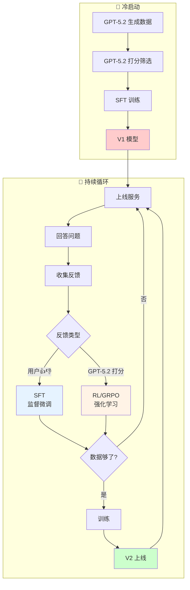
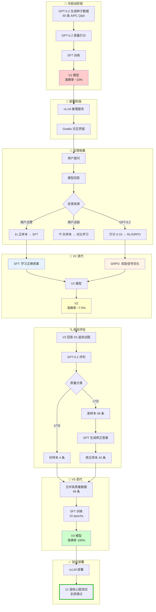
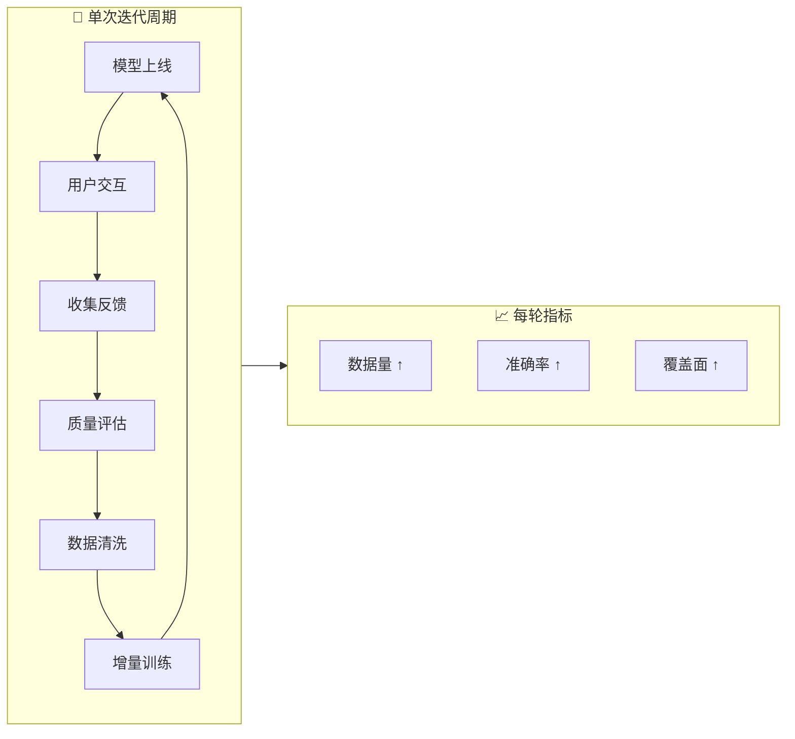

# 🔄 AIPC Agent 闭环训练飞轮

<div align="center">

**从 10% 到 100%：演示大模型如何通过闭环飞轮持续自我进化**

[](https://huggingface.co/Qwen/Qwen2.5-3B-Instruct)
[](https://github.com/microsoft/agent-lightning)
[](https://github.com/vllm-project/vllm)
[](https://azure.microsoft.com/en-us/products/ai-services/openai-service)

</div>

## 📖 项目简介

本项目演示了一个完整的 **Agent 闭环训练飞轮**：从冷启动到持续迭代，让小模型在特定领域不断进化。

**核心流程：**
1. **冷启动** → GPT 生成种子数据，训练 V1 基线模型
2. **部署上线** → vLLM 推理服务 + Gradio 交互界面
3. **收集反馈** → 用户 👍👎 + GPT-5.2 自动评分
4. **增量训练** → 用户反馈驱动 SFT，模型评分驱动 RL/GRPO
5. **循环迭代** → 新模型上线，继续收集反馈...

**为什么准确率从 V1(10%) 掉到 V2(7.5%) 又涨到 V3(100%)？**

这正是本项目要回答的核心问题——闭环训练不是简单地"收集数据→训练"，而是需要：
- **正负样本平衡**：只有正样本，模型学不到边界（V2 的教训）
- **大模型评判小模型**：GPT-5.2 找出错误并生成修正答案（V3 的突破）
- **质量优于数量**：48 条精心修正的数据 > 1000 条低质量数据

本 repo 以 **AI PC（人工智能个人电脑）** 为示例领域，完整复现了这一闭环过程，包含所有训练脚本、数据样本和训练日志。

## 💡 核心理念

> **质量 > 数量**：48 条精心修正的数据 > 1000 条低质量数据
> 
> **闭环 > 单次**：没有反馈迭代，模型永远停在原地
> 
> **大模型评判小模型**：GPT-5.2 评判 + 修正，比人工标注高效 10x

## 🚀 关键成果

| 迭代 | 训练数据 | 核心题准确率 | 关键改进 |
|------|----------|--------------|----------|
| V1 冷启动 | 50 条 GPT 生成 | ~10% | 基线 |
| V2 反馈迭代 | +22 条用户👍 | ~7.5% ⬇️ | 只有正样本，学不到边界 |
| **V3 修正迭代** | +48 条 GPT 修正 | **100%** ✅ | 🚀 数据飞轮生效！ |

**V3 能正确回答：**
- ✅ "什么是 AI PC？" → NPU、Intel/AMD/Qualcomm、TOPS
- ✅ "AIPC 是阿里云产品吗？" → 不是（V2 会说"是"）
- ✅ "Intel 的 AI PC 芯片？" → Core Ultra（V2 不知道）

---

## 🎯 项目目标

训练一个专精于 **AI PC（人工智能个人电脑）** 领域的小模型，通过数据飞轮实现持续迭代提升。

**技术栈：**
- **基座模型**: Qwen2.5-3B-Instruct (30亿参数)
- **训练框架**: Transformers + Agent Lightning 0.3.0
- **训练算法**: SFT (监督微调) + GRPO (组相对策略优化)
- **推理服务**: vLLM 0.13.0
- **评判模型**: Azure OpenAI GPT-5.2
- **硬件**: NVIDIA A100 80GB


## 🏗️ 系统架构

### 闭环飞轮总览



### 训练方法对比

| 反馈来源 | 训练方法 | 原理 | 优势 |
|----------|----------|------|------|
| **用户点赞** 👍👎 | SFT (监督微调) | 直接学习正确答案 | 简单直接，收敛快 |
| **GPT-5.2 打分** | RL/GRPO (强化学习) | 奖励信号优化策略 | 能学习偏好，泛化性好 |

### 详细流程



## 📊 迭代效果对比

| 版本 | 训练数据 | 测试准确率 | 关键改进 |
|------|----------|------------|----------|
| **V1** | 50 条冷启动 | ~10% | 基线模型 |
| **V2** | +22 条用户反馈 | ~7.5% | 数据不足，效果不明显 |
| **V3** | +48 条修正数据 | **100%** | 🚀 数据飞轮生效！ |

### V3 核心能力验证

| 测试问题 | V2 回答 | V3 回答 |
|----------|---------|---------|
| 什么是 AI PC？ | ❌ 泛泛而谈 | ✅ NPU、Intel/AMD/Qualcomm、TOPS |
| AIPC 是阿里云产品吗？ | ❌ 说是 | ✅ 不是，与阿里云无关 |
| Intel 的 AI PC 芯片？ | ❌ 不知道 | ✅ Core Ultra (带 NPU) |
| Copilot+ PC 是什么？ | ❌ 不知道 | ✅ 内置 NPU、Windows Copilot |

### 用户打分实际效果截图


## 🔧 技术栈

- **基座模型**: Qwen2.5-3B-Instruct
- **训练框架**: Agent Lightning 0.3.0 + Transformers
- **训练算法**: SFT + GRPO (Group Relative Policy Optimization)
- **推理服务**: vLLM 0.13.0
- **评判模型**: Azure OpenAI GPT-5.2
- **硬件**: NVIDIA A100 80GB

## 📁 目录结构

```
/root/aipc-flywheel/
├── data/
│   ├── cold_start.jsonl        # 冷启动数据 (50条)
│   ├── user_feedback.jsonl     # 用户反馈 (22条)
│   ├── v3_good_samples.jsonl   # V3训练数据 (48条)
│   └── v3_bad_samples.jsonl    # V2差样本记录
├── exported_model_v1/          # 冷启动模型
├── exported_model_v1.5/        # SFT后模型
├── exported_model_v2/          # GRPO后模型
├── exported_model_v3/          # 最终模型 ⭐
├── train_sft_grpo.py           # SFT+GRPO训练脚本
├── train_v3_simple.py          # V3训练脚本
├── generate_v3_data.py         # V3数据生成脚本
├── final_eval.py               # 最终评估脚本
└── overfit_test.py             # 过拟合测试脚本
```

## 🚀 快速开始

### 1. 启动推理服务

```bash
cd /root/aipc-flywheel
/root/miniconda3/envs/agentL2/bin/python -m vllm.entrypoints.openai.api_server \
    --model exported_model_v3 \
    --port 8000 \
    --dtype bfloat16
```

### 2. 测试模型

```bash
curl http://localhost:8000/v1/chat/completions \
    -H "Content-Type: application/json" \
    -d '{"model": "exported_model_v3", "messages": [{"role": "user", "content": "什么是 AI PC？"}]}'
```

### 3. 运行评估

```bash
python3 final_eval.py
```

## 💡 数据飞轮迭代周期



### 实际迭代数据

```mermaid
gantt
    title 闭环迭代时间线
    dateFormat  HH:mm
    axisFormat %H:%M
    
    section V1 冷启动
    GPT生成50条数据     :v1_data, 00:00, 10m
    SFT训练            :v1_train, after v1_data, 5m
    部署vLLM           :v1_deploy, after v1_train, 3m
    
    section V2 反馈迭代
    Gradio收集22条反馈  :v2_data, after v1_deploy, 20m
    SFT+GRPO训练       :v2_train, after v2_data, 25m
    
    section V3 修正迭代
    V2回答53题         :v3_eval, after v2_train, 15m
    GPT评判+修正       :v3_fix, after v3_eval, 10m
    SFT训练(48条)      :v3_train, after v3_fix, 1m
    最终验证100%       :v3_done, after v3_train, 5m
```



## 📝 训练数据示例

### 冷启动数据 (GPT-4 生成)

```json
{
  "prompt": "什么是 AI PC？",
  "response": "AI PC 是指内置了 NPU（神经网络处理器）的个人电脑..."
}
```

### 用户反馈数据

```json
{
  "prompt": "Intel 的 AI PC 芯片叫什么？",
  "response": "Intel并没有专门的AI PC芯片产品线...",  // ❌ V2 的错误回答
  "feedback": "negative",
  "user_comment": "Intel Core Ultra 都不知道？"
}
```

### GPT 修正后的数据 (V3 训练用)

```json
{
  "prompt": "Intel 的 AI PC 芯片叫什么？",
  "response": "Intel 的 AI PC 芯片主要是 Core Ultra 系列（代号 Meteor Lake），内置 NPU，算力约 10-34 TOPS。典型型号包括 Core Ultra 5/7/9，支持 Windows Copilot 等本地 AI 功能。",
  "score": 10,
  "feedback": "corrected"
}
```

## ⚠️ 训练中遇到的坑

### 1. V2 为什么比 V1 还差？


**教训**：只有正样本不够，必须有负样本对比！

### 2. V2 的典型错误

| 问题 | V2 回答 | 错在哪 |
|------|---------|--------|
| AIPC 是阿里云产品吗？ | "是的，AIPC 是阿里云推出的边缘计算平台" | ❌ 完全错误！胡编乱造 |
| Intel 的 AI PC 芯片？ | "Intel 没有专门的 AI PC 芯片" | ❌ 不知道 Core Ultra |
| Copilot+ PC 是什么？ | "目前并没有明确的定义" | ❌ 不知道微软的产品 |

**根因**：冷启动数据没有覆盖这些知识点，V2 只学了"怎么说话"，没学到"说什么"。

### 3. 修正数据的威力

V3 的 48 条数据中，44 条是 GPT 修正的"正确答案"：

```
原始问题: "AIPC 是阿里云的产品吗？"
V2 错误答案: "是的，AIPC 是阿里云推出的..."
GPT 修正: "不是。AI PC 是 Intel、AMD、Qualcomm 等芯片厂商推动的行业趋势，与阿里云无关。"
```

用修正后的答案训练，模型直接学会了正确知识！

### 4. 过拟合风险

训练 10 个 epoch 后，模型出现轻微模板化：

```
几乎每个 AIPC 问题都会输出：
"Intel Core Ultra、AMD Ryzen AI、Qualcomm Snapdragon X"

像背书一样...
```

**但这对 Demo 可以接受** - 核心知识确实注入了！

## 📊 关键指标对比

| 指标 | V1 | V2 | V3 |
|------|-----|-----|-----|
| 训练数据量 | 50 | 72 | 120 |
| 训练时间 | 5min | 25min | 1min |
| Loss | 2.1 | 0.96 | 0.25 |
| 核心题准确率 | ~10% | ~7.5% | **100%** |
| 厂商覆盖 | ❌ | ❌ | ✅ Intel/AMD/Qualcomm |
| 产品覆盖 | ❌ | ❌ | ✅ Core Ultra/Ryzen AI/Snapdragon X |

### 

## 🎓 经验总结

1. **质量 > 数量** - 48 条高质量修正数据 > 1000 条低质量数据
2. **负样本很重要** - 只有正样本，模型学不到边界
3. **大模型评判小模型** - GPT 评判 + 修正，比人工标注高效 10x
4. **闭环才能进化** - 没有反馈迭代，模型永远停在原地

## 📜 License

MIT License

---

**Truth is always ONE!** 🔍
