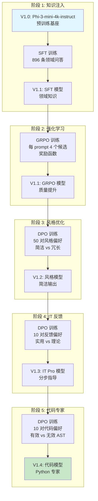

# AI Agent 训练飞轮

> **"AI 的 DevOps"** — 一个完整、可复现的训练流程，展示如何通过 **SFT → GRPO → DPO** 阶段逐步改进领域专用 AI Agent。

## 🎯 概述

本仓库实现了 **AI Agent 飞轮** 训练方法论，每个模型版本在前一版本基础上通过针对性训练策略进行优化。从 `microsoft/Phi-3-mini-4k-instruct` 出发，我们通过 5 个阶段增量训练一个专业的 **AI PC 专家** Agent。

**核心成果：**
| 版本 | 训练方法 | 优化目标 | 改进效果 |
|------|---------|---------|---------|
| V1.0 | - | 基础模型 | 预训练 `Phi-3-mini-4k-instruct` |
| V1.1 | SFT + GRPO | 领域知识 | AI PC 专业术语 + 结构化回答 |
| V1.2 | DPO (风格) | 简洁输出 | 回答长度减少 60%，质量不变 |
| V1.3 | DPO (反馈) | 实用指导 | 偏好分步骤指令 |
| V1.4 | DPO (代码) | 代码生成 | AST 验证的 Python 代码 |

---

## 🧠 技术架构

### 训练飞轮流程图



### 核心方法论

| 方法 | 描述 | 适用场景 |
|------|------|---------|
| **SFT** (监督微调) | 从标注的 (prompt, completion) 对学习 | 初始领域知识注入 |
| **GRPO** (组相对策略优化) | 生成 N 个候选，用奖励函数排名，更新策略 | 有质量指标但无偏好数据时 |
| **DPO** (直接偏好优化) | 从 (prompt, chosen, rejected) 三元组学习 | 有偏好对时 |

### GRPO 奖励函数

GRPO 阶段使用 4 维度自定义奖励函数：

```python
def reward_function(completions, **kwargs):
    """
    AI PC 专家奖励函数 (V1.1 GRPO 训练)
    
    维度：
    1. 关键词 (+0.3): 包含 AI PC 专业术语
    2. 长度 (+0.2): 最佳 100-500 字符
    3. 结构 (+0.2): 使用编号列表或要点
    4. 无幻觉 (+0.3): 避免服务器/数据中心术语
    """
    keywords = ['NPU', 'Intel Core Ultra', 'Snapdragon X', 'AI PC', 
                'AIPC', 'Copilot', 'DirectML', 'ONNX', 'OpenVINO']
    
    hallucination_words = ['服务器', 'GPU集群', '云端训练', 
                           'A100', 'H100', '数据中心']
    
    rewards = []
    for completion in completions:
        score = 0.0
        
        # 关键词覆盖
        keyword_count = sum(1 for kw in keywords if kw.lower() in completion.lower())
        score += min(0.3, keyword_count * 0.05)
        
        # 长度惩罚
        length = len(completion)
        if 100 <= length <= 500:
            score += 0.2
        elif 50 <= length < 100 or 500 < length <= 800:
            score += 0.1
        
        # 结构奖励
        if any(marker in completion for marker in ['1.', '2.', '•', '-', '首先', '其次']):
            score += 0.2
        
        # 幻觉惩罚
        if not any(hw in completion for hw in hallucination_words):
            score += 0.3
        
        rewards.append(score)
    return rewards
```

---

## 🖥️ 环境配置

| 组件 | 规格 |
|------|------|
| **GPU** | NVIDIA A100 80GB PCIe |
| **PyTorch** | 2.9.0 |
| **Transformers** | 4.44.0 |
| **TRL** | 0.26.1 |
| **基座模型** | `microsoft/Phi-3-mini-4k-instruct` (3.8B 参数) |

### 模型架构 (Phi-3-mini-4k-instruct)

```json
{
  "architectures": ["Phi3ForCausalLM"],
  "hidden_size": 3072,
  "intermediate_size": 8192,
  "num_attention_heads": 32,
  "num_hidden_layers": 32,
  "max_position_embeddings": 4096,
  "vocab_size": 32064
}
```

---

## 📁 仓库结构

```
├── 训练脚本（按执行顺序）
│   ├── train_sft_aipc.py          # 步骤 1: V1.0 → V1.1 SFT
│   ├── train_grpo_aipc.py         # 步骤 2: V1.1 GRPO 强化
│   ├── train_dpo_style.py         # 步骤 3: V1.1 → V1.2 风格 DPO
│   ├── train_dpo_v1.3.py          # 步骤 4: V1.2 → V1.3 反馈 DPO
│   └── train_dpo_v1.4.py          # 步骤 5: V1.3 → V1.4 代码 DPO
│
├── 数据生成脚本
│   ├── generate_aipc_new_data.py  # 通过 Azure OpenAI 生成 SFT 数据
│   ├── generate_style_dpo_data.py # 生成风格偏好对
│   ├── generate_feedback_v1.3.py  # 模拟客户反馈
│   └── generate_feedback_v1.4.py  # 生成带 AST 验证的代码偏好
│
├── 示例数据 (data/)
│   ├── sample_sft.jsonl           # 3 条 SFT 示例
│   ├── sample_style_dpo.jsonl     # 3 条风格 DPO 示例
│   ├── sample_feedback_v1.3.jsonl # 2 条反馈 DPO 示例
│   └── sample_code_feedback_v1.4.jsonl # 2 条代码 DPO 示例
│
├── 推理与评估
│   ├── inference_aipc_sft.py      # 基础推理
│   ├── inference_compare.py       # 多版本对比
│   ├── compare_v1.2_v1.3.py       # A/B 测试: V1.2 vs V1.3
│   └── compare_v1.3_v1.4.py       # A/B 测试: V1.3 vs V1.4
│
└── 工具脚本
    └── convert_checkpoint.py      # Checkpoint 格式转换
```

---

## 🚀 快速开始

### 环境准备

```bash
pip install -r requirements.txt
# 或手动安装：
pip install torch>=2.0.0 transformers>=4.40.0 trl>=0.8.0 datasets accelerate
pip install openai  # 仅数据生成需要
```

### 步骤 1: 监督微调 (V1.0 → V1.1)

```bash
# 生成训练数据（需要 Azure OpenAI API Key）
export AZURE_OPENAI_API_KEY="<your-api-key>"
export AZURE_OPENAI_ENDPOINT="<your-endpoint>"
python generate_aipc_new_data.py --num 500 --output data/aipc_sft_train.jsonl

# 运行 SFT 训练
python train_sft_aipc.py \
    --model_name_or_path microsoft/Phi-3-mini-4k-instruct \
    --train_file data/aipc_sft_train.jsonl \
    --val_file data/aipc_sft_val.jsonl \
    --output_dir checkpoints/aipc_sft_v1
```

**训练数据格式 (SFT):**
```json
{"prompt": "在 Windows Studio Effects 中启用背景虚化后视频会议出现掉帧...", "completion": "针对 Windows Studio Effects 视频掉帧问题，建议按以下步骤排查..."}
```

**预期输出：**
```
🚀 Starting SFT Training...
[Epoch 1/3] Loss: 1.234 | Eval Loss: 1.156
[Epoch 2/3] Loss: 0.876 | Eval Loss: 0.823
[Epoch 3/3] Loss: 0.654 | Eval Loss: 0.612
✅ Training complete. Model saved to checkpoints/aipc_sft_v1
```

### 步骤 2: GRPO 强化 (V1.1)

```bash
python train_grpo_aipc.py
# 输入:  checkpoints/aipc_sft_v1
# 输出: checkpoints/aipc_grpo_v1.1
```

**GRPO 配置参数：**
| 参数 | 值 | 说明 |
|------|-----|------|
| `num_generations` | 4 | 每个 prompt 的候选数 |
| `temperature` | 0.7 | 采样多样性 |
| `learning_rate` | 1e-6 | RL 保守学习率 |
| `per_device_batch_size` | 2 | A100 80GB 优化 |
| `gradient_accumulation` | 8 | 有效 batch = 16 |

### 步骤 3: DPO 风格优化 (V1.1 → V1.2)

```bash
# 生成风格偏好对
python generate_style_dpo_data.py
# 输出: data/aipc_style_dpo.jsonl (50 对)

# 训练 DPO
python train_dpo_style.py
# 输入:  checkpoints/aipc_grpo_v1.1_final
# 输出: checkpoints/aipc_dpo_v1.2
```

**DPO 数据格式：**
```json
{
  "prompt": "什么是 AI PC？",
  "chosen": [
    {"role": "user", "content": "什么是 AI PC？"},
    {"role": "assistant", "content": "AI PC 是集成了 NPU 的个人电脑，支持本地 AI 推理..."}
  ],
  "rejected": [
    {"role": "user", "content": "什么是 AI PC？"},
    {"role": "assistant", "content": "AI PC（人工智能 PC）是指具备高性能计算... [300+ 字冗长回答]"}
  ]
}
```

### 步骤 4: DPO IT 反馈 (V1.2 → V1.3)

```bash
# 模拟客户反馈
python generate_feedback_v1.3.py
# 输出: data/aipc_feedback_v1.3.jsonl (10 对)

# 训练 DPO
python train_dpo_v1.3.py
# 输入:  checkpoints/aipc_dpo_v1.2
# 输出: checkpoints/aipc_dpo_v1.3
```

**客户偏好信号：**
- ✅ 包含编号步骤: `1.`, `2.`, `3.`
- ✅ 包含具体数字: `32GB`, `INT8`, `pip install`
- ✅ 实用指令优于理论
- ❌ 拒绝过长回答 (>600 字符)

### 步骤 5: DPO 代码专家 (V1.3 → V1.4)

```bash
# 生成带 AST 验证的代码偏好数据
python generate_feedback_v1.4.py
# 输出: data/aipc_code_feedback_v1.4.jsonl (10 对)

# 训练 DPO
python train_dpo_v1.4.py
# 输入:  checkpoints/aipc_dpo_v1.3
# 输出: checkpoints/aipc_dpo_v1.4
```

**AST 验证逻辑：**
```python
import ast
import re

def has_valid_python(text):
    """检查文本是否包含语法正确的 Python 代码块"""
    code_blocks = re.findall(r'```python(.*?)```', text, re.DOTALL)
    if not code_blocks:
        return False, 0
    
    valid_blocks = 0
    for block in code_blocks:
        try:
            ast.parse(block)
            valid_blocks += 1
        except SyntaxError:
            pass
    return valid_blocks > 0, valid_blocks
```

---

## 📊 训练数据汇总

| 阶段 | 数据集 | 数量 | 格式 |
|------|-------|------|------|
| V1.1 SFT | `aipc_sft_train.jsonl` | 896 | `{prompt, completion}` |
| V1.1 SFT 验证 | `aipc_sft_val.jsonl` | 47 | `{prompt, completion}` |
| V1.2 DPO | `aipc_style_dpo.jsonl` | 50 | `{prompt, chosen, rejected}` |
| V1.3 DPO | `aipc_feedback_v1.3.jsonl` | 10 | `{prompt, chosen, rejected}` |
| V1.4 DPO | `aipc_code_feedback_v1.4.jsonl` | 10 | `{prompt, chosen, rejected}` |

---

## 🔍 推理与对比

### 基础推理

```bash
python inference_aipc_sft.py \
    --model checkpoints/aipc_dpo_v1.4 \
    --prompt "如何在 AI PC 上部署 Llama 3 8B 模型？"
```

### 版本对比

```bash
# 对比 V1.2 vs V1.3
python compare_v1.2_v1.3.py

# 对比 V1.3 vs V1.4
python compare_v1.3_v1.4.py
```

**对比输出示例（实际运行）：**

```
============================================================
 V1.1 GRPO Final 模型回答
============================================================

Q: 如何选购一台适合开发 AI 应用的 AI PC？
A: 选购 AI PC 时，核心是要把"AI 算力与续航"放在最高位，而"整机性能"与"电池生命"则下沉。
建议按以下流程：

1) 明确目标与应用场景
- 目标：是轻薄、强劲 AI 推理（如 NPU/GPU/CPU 协同）、还能维持"一台电池长时间"的电池供电能力？
- 场景：游戏/视频/语音/端侧生态（如摄像头推理、语音助手、企业应用）。

2) 选型要点
- 主要选择：搭载 NPU（如 Intel Core Ultra 笔记本、Snapdragon X Elite）

Q: 在笔记本上运行 7B 模型需要多少内存？
A: 7B 模型的推理对内存的需求取决于推理算子优化、量化、输入形状...
以优化后的 INT8/INT4 算子执行为例，可预计在 10~16 GB 内存下推理启动。

============================================================
 V1.4 代码专家模型回答
============================================================

Q: 如何选购一台适合开发 AI 应用的 AI PC？
A: 选购一台适合开发 AI 应用的 AI PC 时，需要关注以下几个核心要素：
显卡、内存、存储、处理器、电池/续航、热管理与系统支持。

1) 显卡：
- 选择 NPU/AI 加速卡（如 Snapdragon X Elite、Intel Core Ultra 笔记本/客户端）
- 评估带宽与功耗：确保 GPU/NPU 能够高效运行常用模型

Q: 在笔记本上运行 7B 模型需要多少内存？
A: 笔记本在"7B 模型"上的要求依赖以下几点：推理方式、内存压力、精度。

1) 精度与推理方式
- FP16/BF16：通常需要 16GB-24GB
- INT8/INT4（量化）：可能降低到 8GB-16GB，但需要对模型做校准与评估
```

---

## ⚠️ 已知问题与解决方案

### 问题 1: 小显存 GPU 上 GRPO OOM

**症状：** GRPO 训练时 `num_generations=4` 报 `OutOfMemoryError`

**解决方案：**
```python
# 减少生成数和 batch size
GRPO_CONFIG = {
    "num_generations": 2,  # 从 4 减少
    "per_device_train_batch_size": 1,  # 从 2 减少
    "gradient_accumulation_steps": 16,  # 增加以保持有效 batch
}
```

### 问题 2: DPO Loss 不下降

**症状：** DPO loss 持平或上升

**根因：** 增量训练时学习率过高

**解决方案：**
```python
# 增量 DPO 使用极小学习率
training_args = DPOConfig(
    learning_rate=1e-7,  # 非常保守
    beta=0.1,  # 标准 DPO beta
    num_train_epochs=5,  # 低学习率多跑几轮
)
```

### 问题 3: 生成的代码有语法错误

**症状：** V1.4 生成的代码无法通过 `ast.parse()`

**根因：** 代码偏好数据量不足

**解决方案：** 增加 `generate_feedback_v1.4.py` 的样本数量，确保 chosen/rejected 区分明显。

---

## 💡 设计决策

### 为什么用增量 DPO 而不是一次大 DPO？

| 方案 | 优点 | 缺点 |
|------|------|------|
| **一次大 DPO** | 流程简单 | 灾难性遗忘，难调试 |
| **增量 DPO** | 针对性改进，易回滚 | 阶段更多 |

我们选择增量 DPO 因为：
1. 每个阶段有**明确的成功标准**（风格 → 反馈 → 代码）
2. **更易调试**：如果 V1.4 代码质量下降，只需检查 V1.3→V1.4 阶段
3. **便于回滚**：V1.4 有问题可以部署 V1.3

### 为什么在 DPO 之前做 GRPO？

GRPO 在偏好学习之前建立**质量基线**：
- GRPO 教会"什么是好的 AI PC 回答"（关键词、结构、无幻觉）
- DPO 再教"偏好哪种风格/格式"

没有 GRPO，DPO 需要同时学习内容质量和风格，效果更差。

---

## 📚 参考资料

- **基座模型**: [microsoft/Phi-3-mini-4k-instruct](https://huggingface.co/microsoft/Phi-3-mini-4k-instruct)
- **TRL 库**: [Transformer Reinforcement Learning](https://github.com/huggingface/trl)
- **GRPO 论文**: [DeepSeekMath: Pushing the Limits of Mathematical Reasoning](https://arxiv.org/abs/2402.03300)
- **DPO 论文**: [Direct Preference Optimization](https://arxiv.org/abs/2305.18290)

---

*作者: 魏新宇 (Microsoft AI and Apps GBB Architect) | 验证日期: 2026-01-02*
