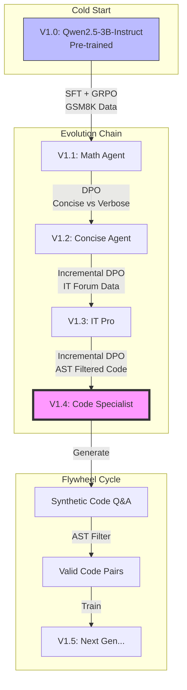

# Agent Lightning Flywheel: Evolutionary AI on AIPC

**Author**: Xinyu Wei (Microsoft AI and Apps GBB Architect)  
**Date**: 2026-01-01  
**Status**: Completed (V1.4)

---

## 1. Project Overview

This project demonstrates the **"AI Agent Flywheel"** concept: continuously evolving an AI model's capabilities through incremental Reinforcement Learning (RL) and Direct Preference Optimization (DPO), without catastrophic forgetting.

We successfully evolved a model from **V1.0 (Pre-trained)** to **V1.4 (Code Specialist)** using a hybrid AIPC (Local GPU) and Cloud architecture.

### Key Achievements

| Transition | Technique | Result |
|------------|-----------|--------|
| V1.0 → V1.1 | SFT + GRPO | Mastered math reasoning with deep thinking |
| V1.1 → V1.2 | DPO | Learned concise expression style |
| V1.2 → V1.3 | Incremental DPO | Evolved into IT Operations Expert |
| V1.3 → V1.4 | Incremental DPO | **Code Specialist** - production-grade code |

---

## 2. Evolution Matrix

| Version | Base | Technique | Objective | Key Params | Data Source | Training Time |
| :--- | :--- | :--- | :--- | :--- | :--- | :--- |
| **V1.0** | - | Pre-trained | General | - | HuggingFace (Qwen2.5-3B-Instruct) | - |
| **V1.1** | V1.0 | SFT + GRPO | Math Reasoning | LR=1e-6, Steps=500 | GSM8K + Azure OpenAI | ~30 min |
| **V1.2** | V1.1 | DPO | Concise Style | Beta=0.1 | Synthetic Pairs | ~5 min |
| **V1.3** | V1.2 | Incremental DPO | IT Pro | LR=1e-6, Beta=0.1 | IT Forum Data | ~10 min |
| **V1.4** | V1.3 | Incremental DPO | Code Gen | **LR=5e-7**, Beta=0.1 | AST Filtered | **37 sec** |

> **Critical Parameter**: V1.4 uses **LR=5e-7** (10x lower than V1.3) to prevent catastrophic forgetting while learning new code patterns.

---

## 3. System Architecture



---

## 4. Environment Setup

### 4.1 Hardware Requirements

| Component | Training | Inference |
|-----------|----------|-----------|
| **GPU** | NVIDIA A100 80GB | RTX 4090 / Any CUDA GPU |
| **VRAM** | ≥40GB (DPO needs 2x model) | ≥8GB |
| **RAM** | ≥64GB | ≥16GB |

### 4.2 Software Dependencies

```
torch==2.9.0
transformers==4.57.3
trl==0.26.1
datasets==4.1.1
accelerate==1.6.0
peft==0.18.0
vllm==0.11.2  # For inference
```

Install:
```bash
pip install torch transformers trl datasets accelerate peft vllm
```

---

## 5. Quick Start

### 5.1 Phase 1: Data Generation

Generate synthetic code Q&A pairs using V1.3, filtered by Python AST:

```bash
export MODEL_PATH="./checkpoints/aipc_dpo_v1.3"
export OUTPUT_FILE="./data/aipc_code_feedback_v1.4.jsonl"
python simulate_code_feedback.py
```

**Key Logic** - AST-based quality scoring:
```python
def score_response(response_text):
    try:
        code = extract_code(response_text)
        if not code: return 0.1  # Text only → low score
        ast.parse(code)          # Syntax check
        return 1.0               # Valid code → high score
    except SyntaxError:
        return 0.0               # Syntax error → zero
```

### 5.2 Phase 2: Incremental DPO Training

```bash
export MODEL_PATH="./checkpoints/aipc_dpo_v1.3"
export OUTPUT_PATH="./checkpoints/aipc_dpo_v1.4"
export DATASET_PATH="./data/aipc_code_feedback_v1.4.jsonl"
python train_dpo_v1.4.py
```

**Training Configuration**:
| Parameter | Value | Reason |
|-----------|-------|--------|
| `learning_rate` | **5e-7** | Prevent forgetting (10x lower than SFT) |
| `beta` | 0.1 | Standard DPO temperature |
| `num_epochs` | 5 | Sufficient for 10 samples |
| `batch_size` | 1 | Stability on small dataset |
| `gradient_accumulation` | 4 | Effective batch = 4 |

### 5.3 Phase 3: Validation

```bash
python inference_compare.py
```

---

## 6. Training Logs

### 6.1 V1.4 DPO Training (A100 80GB)

```
Loading dataset from ./data/aipc_code_feedback_v1.4.jsonl...
Dataset size: 10
Loading model: ./checkpoints/aipc_dpo_v1.3...
Loading checkpoint shards: 100%|██████████| 2/2 [00:01<00:00, 1.98it/s]

Starting V1.4 Training...
100%|██████████| 15/15 [00:37<00:00, 2.48s/it]
```

**Training Metrics by Epoch**:

| Epoch | Loss | Accuracy | Margin | Interpretation |
|-------|------|----------|--------|----------------|
| 1.0 | 0.6681 | 50% | 0.056 | Learning starts |
| 2.0 | 0.6227 | **100%** | 0.146 | Model distinguishes chosen/rejected |
| 3.0 | 0.7132 | 0% | -0.040 | Temporary regression (normal) |
| 4.0 | 0.6409 | **100%** | 0.111 | Recovery |
| **5.0** | **0.6020** | **100%** | **0.200** | **Converged** |

**Final Summary**:
```
{'train_runtime': 37.14s, 'train_samples_per_second': 1.346, 'train_loss': 0.677}
Saving model to ./checkpoints/aipc_dpo_v1.4...
Done.
```

**Key Observations**:
- ✅ **Final Loss**: 0.602 (well converged)
- ✅ **Final Accuracy**: 100% (perfect preference learning)
- ✅ **Final Margin**: 0.200 (healthy gap between chosen/rejected)
- ✅ **Training Time**: 37 seconds (10 samples, 5 epochs, A100)

---

## 7. Results: V1.3 vs V1.4 Comparison

### 7.1 Quality Metrics

| Dimension | V1.3 (IT Pro) | V1.4 (Code Specialist) | Winner |
|-----------|---------------|------------------------|--------|
| Code Completeness | Basic | Full + Exception handling | **V1.4** |
| Boundary Checks | ❌ None | ✅ Assert, null checks | **V1.4** |
| Production Ready | Needs fixes | Direct use | **V1.4** |
| Comments | Simple | Detailed + formulas | **V1.4** |

### 7.2 Case Study: Cosine Similarity Function

**Task**: "Write a function to calculate cosine similarity between two vectors."

**V1.3 Output** (IT Pro):
```python
def cosine_similarity(vec1, vec2):
    vec1_normalized = vec1 / np.linalg.norm(vec1)
    vec2_normalized = vec2 / np.linalg.norm(vec2)
    cos_sim = np.dot(vec1_normalized, vec2_normalized)
    return cos_sim
```
⚠️ **Issues**: No dimension check, no zero vector handling, may crash or return NaN.

**V1.4 Output** (Code Specialist):
```python
def cosine_similarity(vec1, vec2):
    # Dimension validation
    assert vec1.shape[0] == vec2.shape[0], "Vector length mismatch"
    
    dot_product = np.dot(vec1, vec2)
    norm_vec1 = np.linalg.norm(vec1)
    norm_vec2 = np.linalg.norm(vec2)
    
    # Zero vector protection
    if norm_vec1 == 0 or norm_vec2 == 0:
        return 0.0
    
    cos_sim = dot_product / (norm_vec1 * norm_vec2)
    
    # Numerical stability
    cos_sim = np.clip(cos_sim, -1.0, 1.0)
    
    return cos_sim
```
✅ **Improvements**: Assert check, zero vector handling, np.clip for numerical stability.

### 7.3 Case Study: ONNX Runtime Script

**Task**: "Write a Python script to load ResNet50 with ONNX Runtime."

Both V1.3 and V1.4 produced functional code, but V1.4 added:
- ✅ Execution provider selection
- ✅ Input shape inspection
- ✅ More detailed comments

---

## 8. Known Issues & Solutions

### Issue 1: DPO Loss Not Decreasing

**Symptom**: Loss stays at ~0.693 (random guess level)

**Root Cause**: Learning rate too high, model oscillates

**Solution**: 
```python
learning_rate = 5e-7  # Not 1e-6 or higher
```

### Issue 2: Catastrophic Forgetting

**Symptom**: V1.4 loses V1.3's IT knowledge

**Root Cause**: Learning rate too high or too many epochs

**Solution**:
- Use very low LR (5e-7)
- Limit epochs (5 is enough for small dataset)
- Use incremental approach (train on V1.3, not V1.0)

### Issue 3: AST Filter Too Strict

**Symptom**: All generated samples get score 0

**Root Cause**: Code extraction regex misses code blocks

**Solution**: Check `extract_code()` handles various markdown formats:
```python
# Handle ```python, ```, and indented blocks
```

---

## 9. Deployment Recommendations

| Use Case | Recommended Version | Reason |
|----------|---------------------|--------|
| Code Generation | **V1.4** | Production-grade defensive code |
| IT Troubleshooting | V1.3 | Rich hardware/system knowledge |
| Math Problems | V1.1 | Deep thinking, step-by-step |
| General Chat | V1.0 | Fastest, most general |

**Inference Example** (vLLM):
```bash
vllm serve ./checkpoints/aipc_dpo_v1.4 \
    --host 0.0.0.0 --port 8000 \
    --max-model-len 2048
```

---


---

## 10. Agent Lightning Components Used

This project leverages **Microsoft Agent Lightning** framework throughout the evolution pipeline. Below is a detailed mapping of which Agent Lightning APIs are used in each phase:

| Phase | Script | Agent Lightning Components | Purpose |
|-------|--------|---------------------------|---------|
| **V1.0→V1.1 Training** | `train_v1.1_sft_grpo.py` | `@agl.rollout`, `agl.LLM`, `agl.emit_reward()`, `agl.VERL`, `agl.Trainer` | GRPO training with reward emission |
| **Data Generation** | `generate_training_data_gpt5_agl.py` | `@agl.rollout`, `agl.emit_reward()`, `agl.InMemoryLightningStore`, `agl.OtelTracer`, `agl.LitAgentRunner`, `agl.logging` | Tracing wrapper for Azure OpenAI SDK calls |
| **LLM Evaluation** | `judge_with_llm_agl.py` | `@agl.rollout`, `agl.LLM`, `agl.emit_reward()`, `agl.InMemoryLightningStore`, `agl.OtelTracer`, `agl.LitAgentRunner`, `agl.logging` | LLM-as-Judge with full observability |

### Component Reference

| Component | Import | Description |
|-----------|--------|-------------|
| `@agl.rollout` | `import agentlightning as agl` | Decorator for async agent functions with automatic tracing |
| `agl.LLM` | `agl.LLM(endpoint, model, api_key)` | LLM resource configuration for injection |
| `agl.emit_reward(float)` | Direct call | Emit reward signal for RL training or metrics |
| `agl.VERL` | `agl.VERL(config)` | VERL algorithm wrapper (GRPO/PPO) |
| `agl.Trainer` | `agl.Trainer(algorithm, n_runners)` | Distributed training orchestrator |
| `agl.InMemoryLightningStore` | `agl.InMemoryLightningStore()` | In-memory storage for traces and rollouts |
| `agl.OtelTracer` | `agl.OtelTracer()` | OpenTelemetry-based tracing |
| `agl.LitAgentRunner` | `agl.LitAgentRunner(tracer)` | Agent execution runner with tracing |
| `agl.logging.setup()` | `agl.logging.setup(files, level)` | Framework logging configuration |

### Code Examples

**1. Training with GRPO** (`train_v1.1_sft_grpo.py`):
```python
import agentlightning as agl

@agl.rollout
async def math_agent(task, llm: agl.LLM):
    response = await llm.chat(messages=[...])
    reward = calculate_reward(response, task['answer'])
    agl.emit_reward(reward)  # Send reward to VERL
    return response

# Initialize VERL training
algorithm = agl.VERL(config)
trainer = agl.Trainer(algorithm=algorithm, n_runners=2)
trainer.fit(math_agent, train_dataset)
```

**2. Traced Data Generation** (`generate_training_data_gpt5_agl.py`):
```python
import agentlightning as agl

@agl.rollout
async def gpt5_data_generator(task: GenerationTask, llm: agl.LLM) -> float:
    # ... generate data ...
    agl.emit_reward(success_rate)
    return success_rate

# Setup tracing infrastructure
store = agl.InMemoryLightningStore()
tracer = agl.OtelTracer()
runner = agl.LitAgentRunner(tracer=tracer)

with runner.run_context(agent=gpt5_data_generator, store=store):
    await runner.step(input=task, resources={"llm": llm_resource})
```

**3. LLM-as-Judge Evaluation** (`judge_with_llm_agl.py`):
```python
import agentlightning as agl

@agl.rollout
async def judge_answer_agl(task: JudgeTask, llm: agl.LLM) -> float:
    # ... call LLM to judge ...
    reward = 1.0 if correct else 0.0
    agl.emit_reward(reward)
    return reward
```

## 11. File Structure

```
AIPC-Agent-Training/
├── README.md                          # This file (English)
├── README-CN.md                       # Chinese version
├── train_v1.1_sft_grpo.py            # V1.0→V1.1 cold start training
├── generate_training_data_gpt5_agl.py # Azure OpenAI data generation
├── simulate_code_feedback.py          # V1.4 AST-filtered data gen
├── train_dpo_v1.4.py                  # V1.4 incremental DPO training
├── inference_compare.py               # Version comparison
├── judge_with_llm_agl.py             # LLM-based evaluation
└── convert_checkpoint.py              # Checkpoint format conversion
```

---

## 12. License

MIT License

---

*Tested on: NVIDIA A100 80GB, Ubuntu 22.04, Python 3.10, PyTorch 2.9.0*
