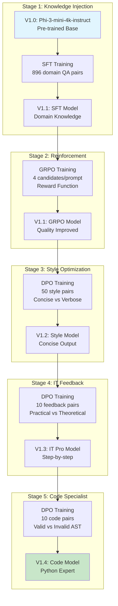

# AI Agent Training Flywheel

> **"DevOps for AI"** — A complete, reproducible training pipeline demonstrating how to incrementally improve domain-specific AI agents through **SFT → GRPO → DPO** stages.


## Running on Azure

All experiments in this project were conducted on an **Azure GPU VM**.

| Item | Details |
|---|---|
| **Azure VM** | [NC40ads_H100_v5](https://learn.microsoft.com/en-us/azure/virtual-machines/nc-h100-v5-series) |
| **GPU** | NVIDIA H100 80GB |
| **Frameworks** | ONNX Runtime |


## 🎯 Overview

This repository implements an **AI Agent Flywheel** training methodology, where each model version builds upon the previous one through targeted training strategies. Starting from `microsoft/Phi-3-mini-4k-instruct`, we incrementally train a specialized **AI PC Expert** agent through 5 stages.

**Key Results:**
| Version | Training Method | Focus | Improvement |
|---------|-----------------|-------|-------------|
| V1.0 | - | Base Model | Pre-trained `Phi-3-mini-4k-instruct` |
| V1.1 | SFT + GRPO | Domain Knowledge | AI PC terminology + structured answers |
| V1.2 | DPO (Style) | Concise Output | 60% shorter responses, same quality |
| V1.3 | DPO (Feedback) | Practical Guidance | Step-by-step instructions preferred |
| V1.4 | DPO (Code) | Code Generation | AST-validated Python code |

---

## 🧠 Technical Architecture

### Training Flywheel Diagram



### Core Methodology

| Method | Description | When to Use |
|--------|-------------|-------------|
| **SFT** (Supervised Fine-Tuning) | Learn from labeled (prompt, completion) pairs | Initial domain knowledge injection |
| **GRPO** (Group Relative Policy Optimization) | Generate N candidates, rank by reward function, update policy | When you have quality metrics but no preference data |
| **DPO** (Direct Preference Optimization) | Learn from (prompt, chosen, rejected) triples | When you have preference pairs |

### GRPO Reward Function

The GRPO stage uses a custom reward function with 4 dimensions:

```python
def reward_function(completions, **kwargs):
    """
    AI PC Expert Reward Function (V1.1 GRPO Training)
    
    Dimensions:
    1. Keywords (+0.3): Contains AI PC terminology
    2. Length (+0.2): Optimal 100-500 characters
    3. Structure (+0.2): Uses numbered lists or bullet points
    4. No Hallucination (+0.3): Avoids server/datacenter terms
    """
    keywords = ['NPU', 'Intel Core Ultra', 'Snapdragon X', 'AI PC', 
                'AIPC', 'Copilot', 'DirectML', 'ONNX', 'OpenVINO']
    
    hallucination_words = ['服务器', 'GPU集群', '云端训练', 
                           'A100', 'H100', '数据中心']
    
    rewards = []
    for completion in completions:
        score = 0.0
        
        # Keyword coverage
        keyword_count = sum(1 for kw in keywords if kw.lower() in completion.lower())
        score += min(0.3, keyword_count * 0.05)
        
        # Length penalty
        length = len(completion)
        if 100 <= length <= 500:
            score += 0.2
        elif 50 <= length < 100 or 500 < length <= 800:
            score += 0.1
        
        # Structure bonus
        if any(marker in completion for marker in ['1.', '2.', '•', '-', '首先', '其次']):
            score += 0.2
        
        # Hallucination penalty
        if not any(hw in completion for hw in hallucination_words):
            score += 0.3
        
        rewards.append(score)
    return rewards
```

---

## 🖥️ Environment

| Component | Specification |
|-----------|---------------|
| **GPU** | NVIDIA A100 80GB PCIe |
| **PyTorch** | 2.9.0 |
| **Transformers** | 4.44.0 |
| **TRL** | 0.26.1 |
| **Base Model** | `microsoft/Phi-3-mini-4k-instruct` (3.8B params) |

### Model Architecture (Phi-3-mini-4k-instruct)

```json
{
  "architectures": ["Phi3ForCausalLM"],
  "hidden_size": 3072,
  "intermediate_size": 8192,
  "num_attention_heads": 32,
  "num_hidden_layers": 32,
  "max_position_embeddings": 4096,
  "vocab_size": 32064
}
```

---

## 📁 Repository Structure

```
├── Training Scripts (执行顺序)
│   ├── train_sft_aipc.py          # Step 1: V1.0 → V1.1 SFT
│   ├── train_grpo_aipc.py         # Step 2: V1.1 GRPO reinforcement
│   ├── train_dpo_style.py         # Step 3: V1.1 → V1.2 Style DPO
│   ├── train_dpo_v1.3.py          # Step 4: V1.2 → V1.3 Feedback DPO
│   └── train_dpo_v1.4.py          # Step 5: V1.3 → V1.4 Code DPO
│
├── Data Generation Scripts
│   ├── generate_aipc_new_data.py  # Generate SFT data via Azure OpenAI
│   ├── generate_style_dpo_data.py # Generate style preference pairs
│   ├── generate_feedback_v1.3.py  # Simulate customer feedback
│   └── generate_feedback_v1.4.py  # Generate code preference with AST validation
│
├── Sample Data (data/)
│   ├── sample_sft.jsonl           # 3 SFT examples
│   ├── sample_style_dpo.jsonl     # 3 Style DPO examples
│   ├── sample_feedback_v1.3.jsonl # 2 Feedback DPO examples
│   └── sample_code_feedback_v1.4.jsonl # 2 Code DPO examples
│
├── Inference & Evaluation
│   ├── inference_aipc_sft.py      # Basic inference
│   ├── inference_compare.py       # Multi-version comparison
│   ├── compare_v1.2_v1.3.py       # A/B test: V1.2 vs V1.3
│   └── compare_v1.3_v1.4.py       # A/B test: V1.3 vs V1.4
│
└── Utilities
    └── convert_checkpoint.py      # Checkpoint format conversion
```

---

## 🚀 Quick Start

### Prerequisites

```bash
pip install -r requirements.txt
# Or manually:
pip install torch>=2.0.0 transformers>=4.40.0 trl>=0.8.0 datasets accelerate
pip install openai  # For data generation only
```

### Step 1: Supervised Fine-Tuning (V1.0 → V1.1)

```bash
# Generate training data (requires Azure OpenAI API key)
export AZURE_OPENAI_API_KEY="<your-api-key>"
export AZURE_OPENAI_ENDPOINT="<your-endpoint>"
python generate_aipc_new_data.py --num 500 --output data/aipc_sft_train.jsonl

# Run SFT training
python train_sft_aipc.py \
    --model_name_or_path microsoft/Phi-3-mini-4k-instruct \
    --train_file data/aipc_sft_train.jsonl \
    --val_file data/aipc_sft_val.jsonl \
    --output_dir checkpoints/aipc_sft_v1
```

**Training Data Format (SFT):**
```json
{"prompt": "在 Windows Studio Effects 中启用背景虚化后视频会议出现掉帧...", "completion": "针对 Windows Studio Effects 视频掉帧问题，建议按以下步骤排查..."}
```

**Expected Output:**
```
🚀 Starting SFT Training...
[Epoch 1/3] Loss: 1.234 | Eval Loss: 1.156
[Epoch 2/3] Loss: 0.876 | Eval Loss: 0.823
[Epoch 3/3] Loss: 0.654 | Eval Loss: 0.612
✅ Training complete. Model saved to checkpoints/aipc_sft_v1
```

### Step 2: GRPO Reinforcement (V1.1)

```bash
python train_grpo_aipc.py
# Input:  checkpoints/aipc_sft_v1
# Output: checkpoints/aipc_grpo_v1.1
```

**GRPO Configuration:**
| Parameter | Value | Explanation |
|-----------|-------|-------------|
| `num_generations` | 4 | Candidates per prompt |
| `temperature` | 0.7 | Sampling diversity |
| `learning_rate` | 1e-6 | Conservative for RL |
| `per_device_batch_size` | 2 | A100 80GB optimized |
| `gradient_accumulation` | 8 | Effective batch = 16 |

### Step 3: DPO Style Optimization (V1.1 → V1.2)

```bash
# Generate style preference pairs
python generate_style_dpo_data.py
# Creates: data/aipc_style_dpo.jsonl (50 pairs)

# Train DPO
python train_dpo_style.py
# Input:  checkpoints/aipc_grpo_v1.1_final
# Output: checkpoints/aipc_dpo_v1.2
```

**DPO Data Format:**
```json
{
  "prompt": "什么是 AI PC？",
  "chosen": [
    {"role": "user", "content": "什么是 AI PC？"},
    {"role": "assistant", "content": "AI PC 是集成了 NPU 的个人电脑，支持本地 AI 推理..."}
  ],
  "rejected": [
    {"role": "user", "content": "什么是 AI PC？"},
    {"role": "assistant", "content": "AI PC（人工智能 PC）是指具备高性能计算... [300+ 字冗长回答]"}
  ]
}
```

### Step 4: DPO IT Feedback (V1.2 → V1.3)

```bash
# Simulate customer feedback
python generate_feedback_v1.3.py
# Creates: data/aipc_feedback_v1.3.jsonl (10 pairs)

# Train DPO
python train_dpo_v1.3.py
# Input:  checkpoints/aipc_dpo_v1.2
# Output: checkpoints/aipc_dpo_v1.3
```

**Customer Preference Signals:**
- ✅ Contains numbered steps: `1.`, `2.`, `3.`
- ✅ Includes specific numbers: `32GB`, `INT8`, `pip install`
- ✅ Practical instructions over theory
- ❌ Rejects overly long responses (>600 chars)

### Step 5: DPO Code Specialist (V1.3 → V1.4)

```bash
# Generate code preference data with AST validation
python generate_feedback_v1.4.py
# Creates: data/aipc_code_feedback_v1.4.jsonl (10 pairs)

# Train DPO
python train_dpo_v1.4.py
# Input:  checkpoints/aipc_dpo_v1.3
# Output: checkpoints/aipc_dpo_v1.4
```

**AST Validation Logic:**
```python
import ast
import re

def has_valid_python(text):
    """Check if text contains syntactically valid Python code blocks"""
    code_blocks = re.findall(r'```python(.*?)```', text, re.DOTALL)
    if not code_blocks:
        return False, 0
    
    valid_blocks = 0
    for block in code_blocks:
        try:
            ast.parse(block)
            valid_blocks += 1
        except SyntaxError:
            pass
    return valid_blocks > 0, valid_blocks
```

---

## 📊 Training Data Summary

| Stage | Dataset | Size | Format |
|-------|---------|------|--------|
| V1.1 SFT | `aipc_sft_train.jsonl` | 896 | `{prompt, completion}` |
| V1.1 SFT Val | `aipc_sft_val.jsonl` | 47 | `{prompt, completion}` |
| V1.2 DPO | `aipc_style_dpo.jsonl` | 50 | `{prompt, chosen, rejected}` |
| V1.3 DPO | `aipc_feedback_v1.3.jsonl` | 10 | `{prompt, chosen, rejected}` |
| V1.4 DPO | `aipc_code_feedback_v1.4.jsonl` | 10 | `{prompt, chosen, rejected}` |

---

## 🔍 Inference & Comparison

### Basic Inference

```bash
python inference_aipc_sft.py \
    --model checkpoints/aipc_dpo_v1.4 \
    --prompt "如何在 AI PC 上部署 Llama 3 8B 模型？"
```

### Version Comparison

```bash
# Compare V1.2 vs V1.3
python compare_v1.2_v1.3.py

# Compare V1.3 vs V1.4
python compare_v1.3_v1.4.py
```

**Sample Comparison Output (Actual):**

```
============================================================
 V1.1 GRPO Final Responses
============================================================

Q: 如何选购一台适合开发 AI 应用的 AI PC？
A: 选购 AI PC 时，核心是要把"AI 算力与续航"放在最高位，而"整机性能"与"电池生命"则下沉。
建议按以下流程：

1) 明确目标与应用场景
- 目标：是轻薄、强劲 AI 推理（如 NPU/GPU/CPU 协同）、还能维持"一台电池长时间"的电池供电能力？
- 场景：游戏/视频/语音/端侧生态（如摄像头推理、语音助手、企业应用）。

2) 选型要点
- 主要选择：搭载 NPU（如 Intel Core Ultra 笔记本、Snapdragon X Elite）

Q: 在笔记本上运行 7B 模型需要多少内存？
A: 7B 模型的推理对内存的需求取决于推理算子优化、量化、输入形状...
以优化后的 INT8/INT4 算子执行为例，可预计在 10~16 GB 内存下推理启动。

============================================================
 V1.4 Code Specialist Responses
============================================================

Q: 如何选购一台适合开发 AI 应用的 AI PC？
A: 选购一台适合开发 AI 应用的 AI PC 时，需要关注以下几个核心要素：
显卡、内存、存储、处理器、电池/续航、热管理与系统支持。

1) 显卡：
- 选择 NPU/AI 加速卡（如 Snapdragon X Elite、Intel Core Ultra 笔记本/客户端）
- 评估带宽与功耗：确保 GPU/NPU 能够高效运行常用模型

Q: 在笔记本上运行 7B 模型需要多少内存？
A: 笔记本在"7B 模型"上的要求依赖以下几点：推理方式、内存压力、精度。

1) 精度与推理方式
- FP16/BF16：通常需要 16GB-24GB
- INT8/INT4（量化）：可能降低到 8GB-16GB，但需要对模型做校准与评估
```
具体配置：pip install onnxruntime-directml 测试 NPU 是否可用。
```

---

## ⚠️ Known Issues & Solutions

### Issue 1: GRPO OOM on Small GPUs

**Symptom:** `OutOfMemoryError` during GRPO training with `num_generations=4`

**Solution:**
```python
# Reduce generations and batch size
GRPO_CONFIG = {
    "num_generations": 2,  # Reduced from 4
    "per_device_train_batch_size": 1,  # Reduced from 2
    "gradient_accumulation_steps": 16,  # Increased to maintain effective batch
}
```

### Issue 2: DPO Loss Not Decreasing

**Symptom:** DPO loss stays flat or increases

**Root Cause:** Learning rate too high for incremental training

**Solution:**
```python
# Use very small LR for incremental DPO
training_args = DPOConfig(
    learning_rate=1e-7,  # Very conservative
    beta=0.1,  # Standard DPO beta
    num_train_epochs=5,  # More epochs at lower LR
)
```

### Issue 3: Generated Code Has Syntax Errors

**Symptom:** V1.4 generates code that fails `ast.parse()`

**Root Cause:** Insufficient code preference data

**Solution:** Increase `generate_feedback_v1.4.py` sample size and ensure clear chosen/rejected distinction.

---

## 💡 Design Decisions

### Why Incremental DPO Instead of One Big DPO?

| Approach | Pros | Cons |
|----------|------|------|
| **One Big DPO** | Simpler pipeline | Catastrophic forgetting, hard to debug |
| **Incremental DPO** | Targeted improvements, easier rollback | More stages to manage |

We chose incremental DPO because:
1. Each stage has **clear success criteria** (style → feedback → code)
2. **Easier debugging**: if V1.4 code quality drops, check V1.3→V1.4 stage only
3. **Rollback friendly**: can deploy V1.3 if V1.4 has issues

### Why GRPO Before DPO?

GRPO establishes a **quality baseline** before preference learning:
- GRPO teaches "what makes a good AI PC answer" (keywords, structure, no hallucination)
- DPO then teaches "which style/format is preferred"

Without GRPO, DPO would try to learn content quality AND style simultaneously.

---

## 📚 References

- **Base Model**: [microsoft/Phi-3-mini-4k-instruct](https://huggingface.co/microsoft/Phi-3-mini-4k-instruct)
- **TRL Library**: [Transformer Reinforcement Learning](https://github.com/huggingface/trl)
- **GRPO Paper**: [DeepSeekMath: Pushing the Limits of Mathematical Reasoning](https://arxiv.org/abs/2402.03300)
- **DPO Paper**: [Direct Preference Optimization](https://arxiv.org/abs/2305.18290)

---

*Author: Xinyu Wei (Microsoft AI and Apps GBB Architect) | Verified: 2026-01-02*
