# Agent Lightning?????:????????

???? | [English](README.md)

##  ????

??????? **Azure H100 (80GB)** ???,?? **Agent Lightning + GRPO ??**??????Agent????????????????????????,???????????????????

**????**:
-  ?? Azure OpenAI GPT-5.1 ?? 5000+ ?????????
-  GRPO???? Qwen2.5-3B ??,??50%??
-  **MATH???(?????): 69.0%  73.0% (+4.0%)**
-  GSM8K???(?????): 81.0%  84.0% (+3.0%)
-  ????OpenAI o1???????(Deep Thinking)

---

##  ???????

```mermaid
graph TB
    subgraph stage1[" ??1: ???? (Azure OpenAI)"]
        env[????<br/>AZURE_OPENAI_ENDPOINT<br/>AZURE_OPENAI_API_KEY<br/>AZURE_OPENAI_DEPLOYMENT]
        gpt[GPT-5.1 Chat]
        script1[generate_training_data_gpt5_agl.py<br/> ??5000+?????<br/> ???????????<br/> ???Parquet??]
        data1[ ????<br/>train_gpt5_large.parquet 5000+<br/>test_gpt5_large.parquet 500]
        
        env -->|Azure OpenAI API| gpt
        gpt --> script1
        script1 --> data1
    end

    subgraph stage2[" ??2: ?????? (GRPO + vLLM)"]
        script2[train_math_agent_vllm.py]
        vllm[1 ??vLLM???<br/> Qwen2.5-3B-Instruct<br/> OpenAI??API :8000]
        grpo[2 GRPO????]
        actor[Actor ????<br/> ???? 4??/?<br/> ??think????]
        reward[Reward Function<br/> ???? +0.5<br/> ????? +2.0<br/> ???? +0.5<br/> ???? 0~1.0]
        ref[Reference Model<br/> ??????<br/> KL????]
        metrics[ ????<br/>reward: 2.88/4.0<br/>length: 395 tokens<br/>max_score: 4.0]
        ckpt[ Checkpoint<br/>checkpoints/math_agent/<br/>global_step_100/<br/>??LoRA??]
        
        script2 --> vllm
        vllm --> grpo
        grpo --> actor
        actor --> reward
        reward --> ref
        ref --> metrics
        metrics --> ckpt
    end

    subgraph stage3[" ??3: ??????"]
        script3[convert_checkpoint.py<br/> LoRA???Base Model<br/> ??HuggingFace??<br/>• ????????]
        merged[?? ????<br/>merged_model/<br/>pytorch_model.bin<br/>config.json<br/>tokenizer files]
        
        script3 --> merged
    end

    subgraph stage4[" ??4: ??????"]
        script4[run_full_evaluation_v5.sh]
        datasets[?????]
        gsm8k[?? GSM8K ??-??<br/>1319????]
        math[ MATH ????<br/>5000???]
        
        eval_base[Base Model??]
        eval_trained[Trained Model??]
        judge[judge_with_llm_agl.py<br/>GPT-5.1??]
        
        results[ ????]
        result_gsm8k[GSM8K<br/>81.0%  84.0%<br/>?? +3.0%]
        result_math[ MATH<br/>69.0% ? 73.0%<br/>?? +4.0%]
        
        script4 --> datasets
        datasets --> gsm8k
        datasets --> math
        gsm8k --> eval_base
        math --> eval_base
        eval_base --> eval_trained
        eval_trained --> judge
        judge --> results
        results --> result_gsm8k
        results --> result_math
    end

    data1 ==>|????| script2
    ckpt ==>|LoRA??| script3
    merged ==>|????| script4

    classDef stageClass fill:#e1f5ff,stroke:#0288d1,stroke-width:3px,color:#01579b
    classDef scriptClass fill:#fff3e0,stroke:#f57c00,stroke-width:2px
    classDef dataClass fill:#f3e5f5,stroke:#7b1fa2,stroke-width:2px
    classDef modelClass fill:#e8f5e9,stroke:#388e3c,stroke-width:2px
    classDef resultClass fill:#fff9c4,stroke:#f9a825,stroke-width:3px,font-weight:bold
    classDef highlightClass fill:#ffebee,stroke:#c62828,stroke-width:4px,font-weight:bold

    class stage1,stage2,stage3,stage4 stageClass
    class script1,script2,script3,script4 scriptClass
    class data1,ckpt,merged,datasets dataClass
    class actor,reward,ref,vllm,grpo modelClass
    class result_gsm8k,result_math resultClass
    class result_math highlightClass
```



> ** ????**: MATH???(???????)?????**4????**(69%73%),??Deep Thinking??????????????!

---

##  ????(4?????)

### ??1: ??????
```bash
python generate_training_data_gpt5_agl.py
# ??: data/train_gpt5_large.parquet (5000+?)
#      data/test_gpt5_large.parquet (500?)
```

### ??2: ????
```bash
python train_math_agent_vllm.py
# ????: H100?2??, A100?3??
# ??: checkpoints/math_agent/global_step_100/
```

### ??3: ????
```bash
python convert_checkpoint.py \
    --checkpoint_dir checkpoints/math_agent/global_step_100 \
    --base_model Qwen/Qwen2.5-3B-Instruct \
    --output_dir merged_model
```

### ??4: ????
```bash
# ?????
python prepare_gsm8k.py
python prepare_math.py

# ????
bash run_full_evaluation_v5.sh
# ??: validation_report.txt
```

---

##  ??????

### ????????

| ??? | ???? | ???? | Base Model | Trained Model | **????** |
|--------|---------|---------|-----------|---------------|------------|
| GSM8K | ??-????? | 1,319? | 81.0% | 84.0% | **+3.0%**  |
| **MATH** | **??????** | **5,000?** | **69.0%** | **73.0%** | **+4.0%**  |

> **????**: MATH????????(+4.0%)??GSM8K(+3.0%),??**Deep Thinking????????????????**??????????????,??????????????

### ????: MATH??? - ???????

**??**: *Find the smallest perfect cube that is a multiple of 9.*  
**??**: ???? | **??**: ??+??

| Base Model  | Trained Model  |
|--------------|-----------------|
| **??**: 19683<br/>**??**: ????,???????? | **????**:<br/>1 9??????: 3<br/>2 ??????????3???<br/>3 ????3??????<br/>**??**: 27  |

**????**: Trained Model?????<think>????**?????**,???????????????

---

##  ????????

### GRPO?????? (Step 22??)

| ?? | ?? | ?? | ????? |
|-----|------|------|----------|
| 	raining/reward | **2.88** | ???? | 72% (??4.0)  |
| critic/score/max | **4.0** | ???? | 100% ??????  |
| 
esponse_length/mean | **395.9** | ?????? | Base???8? (50396) |
| kl_penalty | **0.108** | KL???? | ??,????  |

**??**: 
1. ?????**?????**(<think>+<answer>)
2. ????2.88??**???????**
3. ????395???????**????**???????
4. KL??????????**???????**

---

##  ??????

### 1. GRPO?? - ??50%??

**??PPO???**:
- ??Critic??(????)??????
- Critic???Actor??????
- ?????: Actor + Reference + Critic  **3?????**

**GRPO???**:
```python
# ????
"algorithm": {
    "adv_estimator": "grpo",  # Group Relative Policy Optimization
    "use_kl_in_reward": True,
},
"actor_rollout_ref": {
    "rollout": {"n": 4},  # ????4???,????
}
```

**??**: ???????4???,??**??????**:
- ???(??): Advantage > 0  ????
- ???(??): Advantage < 0  ????
- ??Critic??,??**~50% GPU??**

### 2. Deep Thinking????

**???????**:

| ?? | ??? | ???? | ???? |
|-----|--------|---------|---------|
|  **???** | **+2.0** | ????????? | ???? |
|  ????? | +0.5 | ??<think>?<answer>?? | ???? |
|  ???? | +0.5 | ??????????? | ???? |
|  ???? | 0~1.0 | ??<think>???????? | ???? |
|  ???? | -0.5 | ?????? | ???? |

**?????**: 2.0 + 0.5 + 0.5 + 1.0 = **4.0?**

**????**: Step 22?????4.0,???2.88,????????**?????**?

---

##  ????????

###  A10 (24GB) ????

**????**:
- GPU: NVIDIA A10 (24GB)
- ??: Qwen2.5-0.5B (??)
- ??:  OOM in 
ef_init_model

**??????**:
```
Actor Model:     ~6GB  (0.5B + LoRA)
Reference Model: ~6GB  (0.5B frozen)
vLLM KV Cache:   ~8GB  (???)
Ray Framework:   ~2GB  (?????)
PyTorch Context: ~2GB

???:          ~24GB+  ????
```

###  H100 (80GB) ????

**????**:
- GPU: NVIDIA H100 (80GB)
- ??: Qwen2.5-3B (??)
- ??:  ????2??

**????**:
```
Actor Model:     ~18GB  (3B + LoRA)
Reference Model: ~18GB  (3B frozen)
vLLM KV Cache:   ~25GB  (?batch)
Ray Framework:   ~3GB
PyTorch Context: ~5GB

???:          ~69GB  ????
???????:    7B??
```

**??**:
- **????**: 40GB (A100/A6000)
- **????**: 80GB (H100/A100-80G)
- **????**: ???? (4A100)

---

##  ??????

```
Agent-Lighting/
 README.md                          # ????
 README-CN.md                       # ???(??)
 train_math_agent_vllm.py           #  ??????(GRPO+DeepThinking)
 generate_training_data_gpt5_agl.py     # ????(Azure OpenAI)
 judge_with_llm_agl.py                  # LLM???(GPT-5.1)
 convert_checkpoint.py              # Checkpoint????
 prepare_gsm8k.py                   # GSM8K?????
 prepare_math.py                    # MATH?????
 run_full_evaluation_v5.sh          #  ??????(????)
 agentL_h100.yml                    # H100????(???)
```

---

##  ??????

### ????
| ?? | GPU | ?? | ???? | ?? |
|-----|-----|------|---------|-----|
| ?? | A10 | 24GB | 0.5B  | OOM??? |
| ?? | A100 | 40GB | 3B  | ?batch?? |
| **??** | **H100** | **80GB** | **7B ** | **???** |
| ?? | 4A100 | 160GB | 13B+ | ??? |

### ????
```bash
# ??????????
conda env create -f agentL_h100.yml
conda activate agentL
```

### ????(????)
```bash
# 1. ??Python 3.11??
conda create -n agentL python=3.11 -y
conda activate agentL

# 2. ??PyTorch 2.5.1 (CUDA 12.1)
pip install torch==2.5.1 torchvision torchaudio \
    --index-url https://download.pytorch.org/whl/cu121

# 3. ????RL??
pip install verl==0.5.0      # RL????
pip install vllm==0.7.0      # ???????
pip install ray==2.10.0      # ?????

# 4. ??Agent Lightning
git clone https://github.com/microsoft/agent-lightning.git
cd agent-lightning
pip install -e .

# 5. ?????
pip install openai pandas pyarrow huggingface_hub hydra-core \
    datasets transformers accelerate
```

### ??????
```bash
# Azure OpenAI (?????????)
export AZURE_OPENAI_ENDPOINT="https://your-resource.openai.azure.com/"
export AZURE_OPENAI_API_KEY="your-key-here"
export AZURE_OPENAI_DEPLOYMENT="gpt-5.1-chat"
export AZURE_OPENAI_API_VERSION="2025-01-01-preview"

# HuggingFace??(??)
export HF_ENDPOINT=https://hf-mirror.com
```

---

##  ??????

1. **GRPO vs PPO**: 
   - GRPO??Critic,??**????**??
   - ??50%??,?????????
   - ??????????????(??/??)

2. **???????**: 
   - ?????(??+??+???)??????
   - ??"??"??????????
   - MATH???+4.0%??????

3. **????????**: 
   - RL???????????
   - 24GB???????????
   - ????40GB,??80GB

4. **????>??**: 
   - GPT-5.1???5000??????
   - ??????????
   - ???????????

5. **???????**: 
   - MATH???(???)??????
   - ????(??)??????
   - ?????????????

---

##  ????

- **Agent Lightning**: https://github.com/microsoft/agent-lightning
- **VERL??**: https://github.com/volcengine/verl
- **vLLM**: https://github.com/vllm-project/vllm
- **GSM8K???**: https://github.com/openai/grade-school-math
- **MATH???**: https://github.com/hendrycks/math
- **Qwen2.5??**: https://huggingface.co/Qwen

---

##  ????

**Q: ???MATH?????(+4.0%)?GSM8K(+3.0%)??**  
A: MATH????????,??????????Deep Thinking??????????????????Base Model??????,???????

**Q: ???A10 24GB?????**  
A: ??????0.5B????OOM???????,????: ??Reference??vLLM ??batch_size?1 ??gradient checkpoint,????????

**Q: ?????????**  
A: H100: ~2?? | A100: ~3?? | ??????,???50 steps???????

**Q: ?????????**  
A: ??	rain_math_agent_vllm.py?math_reward_function_v4(),????????????????: ???????(2.0),????????(0.5~1.0)?

**Q: ?????GPT-5.1????????????????**  
A: ????,?????????? ????????,??Deep Thinking?? ?????,5000????????????

---

**????**: David Wei  
**????**: 2025?11?24?  
**????**: Azure H100 (80GB), Ubuntu 22.04, Python 3.11  
**????**: ~2??  \.90/h = \.80 (H100 spot instance)
