# Agent Lightning端到端实践:深度推理训练验证

中文文档 | [English](README.md)

## 🎯 项目概述

本项目展示了在 **Azure H100 (80GB)** 环境下,使用 **Agent Lightning + GRPO 算法**训练数学推理Agent的完整端到端流程。从数据生成、模型训练到性能评估,所有步骤均已在生产环境硬件上验证成功。

**核心成果**:
- ✅ 使用 Azure OpenAI GPT-5.1 生成 5000+ 高质量数学训练数据
- ✅ GRPO算法训练 Qwen2.5-3B 模型,节省50%显存
- ✅ **MATH数据集(高中竞赛题): 69.0% → 73.0% (+4.0%)**
- ✅ GSM8K数据集(小学应用题): 81.0% → 84.0% (+3.0%)
- ✅ 实现类似OpenAI o1的深度推理能力(Deep Thinking)

---

## 🏗️ Agent Lightning 框架架构

Agent Lightning 是微软开源的 AI Agent 训练框架。本项目使用 **agl.VERL** 作为核心算法，它封装了火山引擎的 VERL 框架。

### 完整架构图

```
┌─────────────────────────────────────────────────────────────────────────────────────────┐
│                              Agent Lightning Framework                                   │
│                                 (微软开源)                                               │
├─────────────────────────────────────────────────────────────────────────────────────────┤
│                                                                                         │
│  ┌─────────────────────────────────────────────────────────────────────────────────┐   │
│  │                           用户层 (User Layer)                                    │   │
│  │                                                                                 │   │
│  │   @agl.rollout              agl.emit_reward()           agl.LLM                │   │
│  │   (定义 Agent)              (发送奖励信号)               (LLM 资源)              │   │
│  └─────────────────────────────────────────────────────────────────────────────────┘   │
│                                         │                                               │
│                                         ▼                                               │
│  ┌─────────────────────────────────────────────────────────────────────────────────┐   │
│  │                         训练器层 (Trainer Layer)                                 │   │
│  │                            agl.Trainer                                          │   │
│  │                        (编排训练循环)                                            │   │
│  └─────────────────────────────────────────────────────────────────────────────────┘   │
│                                         │                                               │
│                                         ▼                                               │
│  ┌─────────────────────────────────────────────────────────────────────────────────┐   │
│  │                        算法层 (Algorithm Layer)                                  │   │
│  │                                                                                 │   │
│  │                              Algorithm (基类)                                    │   │
│  │                                     │                                           │   │
│  │           ┌─────────────────────────┼─────────────────────────┐                │   │
│  │           │                         │                         │                │   │
│  │           ▼                         ▼                         ▼                │   │
│  │   ┌─────────────┐          ┌─────────────┐          ┌─────────────────┐       │   │
│  │   │  agl.VERL   │          │  agl.APO    │          │ agl.Baseline    │       │   │
│  │   │ (强化学习)   │          │(Prompt优化) │          │ (调试/测试)      │       │   │
│  │   │             │          │             │          │                 │       │   │
│  │   │ 封装 VERL   │          │ 使用 OpenAI │          │ 简单日志        │       │   │
│  │   │ Framework   │          │ 兼容 API    │          │ 和验证          │       │   │
│  │   │             │          │             │          │                 │       │   │
│  │   │ 配置项:     │          │ 配置项:     │          │ 配置项:         │       │   │
│  │   │ • grpo      │          │ • beam_width│          │ • n_epochs      │       │   │
│  │   │ • ppo       │          │ • beam_     │          │ • train_split   │       │   │
│  │   │ • dapo      │          │   rounds    │          │                 │       │   │
│  │   │ • reinforce │          │             │          │                 │       │   │
│  │   │   ++        │          │             │          │                 │       │   │
│  │   └──────┬──────┘          └─────────────┘          └─────────────────┘       │   │
│  │          │                                                                    │   │
│  └──────────┼────────────────────────────────────────────────────────────────────┘   │
│             │                                                                         │
│             ▼                                                                         │
│  ┌─────────────────────────────────────────────────────────────────────────────────┐ │
│  │                     VERL Framework (火山引擎开源)                                 │ │
│  │                                                                                 │ │
│  │   ┌─────────────────┐  ┌─────────────────┐  ┌─────────────────┐                │ │
│  │   │   RL 算法       │  │   分布式后端     │  │    推理引擎      │                │ │
│  │   │                 │  │                 │  │                 │                │ │
│  │   │  • GRPO         │  │  • FSDP/FSDP2   │  │  • vLLM         │                │ │
│  │   │  • PPO          │  │  • Megatron-LM  │  │  • SGLang       │                │ │
│  │   │  • DAPO         │  │  • Ray          │  │                 │                │ │
│  │   │  • ReMax        │  │                 │  │                 │                │ │
│  │   │  • REINFORCE++  │  │                 │  │                 │                │ │
│  │   └─────────────────┘  └─────────────────┘  └─────────────────┘                │ │
│  └─────────────────────────────────────────────────────────────────────────────────┘ │
│                                                                                         │
│  ┌─────────────────────────────────────────────────────────────────────────────────┐   │
│  │                        运行时组件 (Runtime Components)                           │   │
│  │                                                                                 │   │
│  │   agl.LitAgentRunner      agl.InMemoryLightningStore      agl.OtelTracer       │   │
│  │   (Agent 执行器)           (数据存储)                      (追踪)               │   │
│  └─────────────────────────────────────────────────────────────────────────────────┘   │
│                                                                                         │
└─────────────────────────────────────────────────────────────────────────────────────────┘
```

### 简化调用链

```
                    ┌──────────────────────────────────────┐
                    │           你的代码                    │
                    │  @agl.rollout + agl.emit_reward()    │
                    └──────────────────┬───────────────────┘
                                       │
                                       ▼
                    ┌──────────────────────────────────────┐
                    │            agl.Trainer               │
                    └──────────────────┬───────────────────┘
                                       │
                    ┌──────────────────┴───────────────────┐
                    │                                      │
                    ▼                                      ▼
        ┌───────────────────┐                  ┌───────────────────┐
        │     agl.VERL      │                  │     agl.APO       │
        │    (强化学习)      │                  │   (Prompt优化)    │
        └─────────┬─────────┘                  └─────────┬─────────┘
                  │                                      │
                  ▼                                      ▼
        ┌───────────────────┐                  ┌───────────────────┐
        │  VERL Framework   │                  │  OpenAI 兼容 API   │
        │    (火山引擎)      │                  │                   │
        └─────────┬─────────┘                  └───────────────────┘
                  │
     ┌────────────┼────────────┐
     │            │            │
     ▼            ▼            ▼
┌─────────┐ ┌──────────┐ ┌──────────┐
│  RL算法  │ │ 分布式后端│ │  推理引擎 │
├─────────┤ ├──────────┤ ├──────────┤
│ • GRPO  │ │ • FSDP   │ │ • vLLM   │
│ • PPO   │ │ • FSDP2  │ │ • SGLang │
│ • DAPO  │ │ • Megatron│ │          │
│ • ReMax │ │ • Ray    │ │          │
└─────────┘ └──────────┘ └──────────┘
```

### 算法对比

| 算法 | 用途 | 修改模型权重 | 底层依赖 |
|------|------|------------|---------|
| **agl.VERL** | 强化学习训练 | ✅ 是 | VERL Framework (火山引擎) |
| **agl.APO** | 自动 Prompt 优化 | ❌ 否 (仅优化Prompt) | OpenAI 兼容 API |
| **agl.Baseline** | 调试和测试 | ❌ 否 | 纯 Python |

### 本项目使用的组件

| 脚本 | 使用的 AGL 组件 |
|------|----------------|
| `generate_training_data_gpt5_agl.py` | `@agl.rollout`, `agl.LLM`, `agl.emit_reward()`, `agl.LitAgentRunner`, `agl.InMemoryLightningStore`, `agl.OtelTracer` |
| `train_math_agent_vllm.py` | `@agl.rollout`, `agl.LLM`, `agl.emit_reward()`, `agl.VERL`, `agl.Trainer` |
| `judge_with_llm_agl.py` | `@agl.rollout`, `agl.LLM`, `agl.emit_reward()`, `agl.LitAgentRunner`, `agl.InMemoryLightningStore`, `agl.OtelTracer` |

---

##  端到端 Training Pipeline

```mermaid
graph TB
    subgraph stage1[" Stage 1: Data Generation (Azure OpenAI)"]
        env[Environment Variables<br/>AZURE_OPENAI_ENDPOINT<br/>AZURE_OPENAI_API_KEY<br/>AZURE_OPENAI_DEPLOYMENT]
        gpt[GPT-5.1 Chat]
        script1[generate_training_data_gpt5_agl.py<br/> Generate 5000+ math problems<br/> Include answers and reasoning steps<br/> Save as Parquet format]
        data1[ Training Data<br/>train_gpt5_large.parquet 5000+<br/>test_gpt5_large.parquet 500]
        
        env -->|Azure OpenAI API| gpt
        gpt --> script1
        script1 --> data1
    end

    subgraph stage2["  Stage 2: RL Training (GRPO + vLLM)"]
        script2[train_math_agent_vllm.py]
        vllm[1   Launch vLLM Server<br/>• Qwen2.5-3B-Instruct<br/> OpenAI-compatible API :8000]
        grpo[2 GRPO Training Loop]
        actor[Actor Policy Model<br/> Generate 4 samples/question<br/> Include think reasoning]
        reward[Reward Function<br/> Structure reward +0.5<br/> Correctness reward +2.0<br/>  Depth reward +0.5<br/>  Length reward 0~1.0]
        ref[Reference Model<br/>• Frozen initial model<br/>• KL divergence constraint]
        metrics[ Training Metrics<br/>reward: 2.88/4.0<br/>length: 395 tokens<br/>max_score: 4.0]
        ckpt[ Checkpoint<br/>checkpoints/math_agent/<br/>global_step_100/<br/>Contains LoRA weights]
        
        script2 --> vllm
        vllm --> grpo
        grpo --> actor
        actor --> reward
        reward --> ref
        ref --> metrics
        metrics --> ckpt
    end

    subgraph stage3[" Stage 3: Model Conversion"]
        script3[convert_checkpoint.py<br/> Merge LoRA into Base Model<br/> Generate HuggingFace format<br/> Ready for inference/deployment]
        merged[ Full Model<br/>merged_model/<br/>pytorch_model.bin<br/>config.json<br/>tokenizer files]
        
        script3 --> merged
    end

    subgraph stage4[" Stage 4: Dual Dataset Evaluation"]
        script4[run_full_evaluation_v5.sh]
        datasets[Prepare Datasets]
        gsm8k[ GSM8K Grade School<br/>1,319 word problems]
        math[ MATH Competition<br/>5,000 hard problems]
        
        eval_base[Base Model Inference]
        eval_trained[Trained Model Inference]
        judge[judge_with_llm_agl.py<br/>GPT-5.1 Judge]
        
        results[ Results]
        result_gsm8k[GSM8K<br/>81.0%  84.0%<br/>+3.0% improvement]
        result_math[ MATH<br/>69.0%  73.0%<br/>+4.0% improvement]
        
        script4 --> datasets
        datasets --> gsm8k
        datasets --> math
        gsm8k --> eval_base
        math --> eval_base
        eval_base --> eval_trained
        eval_trained --> judge
        judge --> results
        results --> result_gsm8k
        results --> result_math
    end

    data1 ==>|Training Data| script2
    ckpt ==>|LoRA Weights| script3
    merged ==>|Full Model| script4

    classDef stageClass fill:#e1f5ff,stroke:#0288d1,stroke-width:3px,color:#01579b
    classDef scriptClass fill:#fff3e0,stroke:#f57c00,stroke-width:2px
    classDef dataClass fill:#f3e5f5,stroke:#7b1fa2,stroke-width:2px
    classDef modelClass fill:#e8f5e9,stroke:#388e3c,stroke-width:2px
    classDef resultClass fill:#fff9c4,stroke:#f9a825,stroke-width:3px,font-weight:bold
    classDef highlightClass fill:#ffebee,stroke:#c62828,stroke-width:4px,font-weight:bold

    class stage1,stage2,stage3,stage4 stageClass
    class script1,script2,script3,script4 scriptClass
    class data1,ckpt,merged,datasets dataClass
    class actor,reward,ref,vllm,grpo modelClass
    class result_gsm8k,result_math resultClass
    class result_math highlightClass
```



> ** Key Insight**: MATH dataset (high school competition problems) shows **4 percentage point improvement** (69%73%), proving Deep Thinking strategy excels at complex reasoning tasks!

---

## 🚀 快速开始(4步完整流程)

### 步骤1: 使用Agent Lightning Tracing生成训练数据

```bash
python generate_training_data_gpt5_agl.py
# 输出: data/train_gpt5_large.parquet (5000+条)
#      data/test_gpt5_large.parquet (500条)
```

**执行日志示例 (展示Trace能力)**:
```text
🔍 Spans captured in this Rollout (3):
   👉 Span: gpt-5.1-chat-completion
      Attributes: {'llm.model': 'gpt-5.1-preview', 'batch.id': 1, 'llm.usage.total_tokens': 356}
   👉 Span: gpt5_data_generator
      Attributes: {'traced': True}
   👉 Span: AgentRollout
      Attributes: {'agent_name': 'gpt5_data_generator'}
✅ Batch 1: Generated 20/20 valid samples (Success Rate: 100.0%)
```

### 步骤2: 训练模型

```bash
python train_math_agent_vllm.py
# 训练时长: H100约2小时, A100约3小时
# 输出: checkpoints/math_agent/global_step_100/
```

### 步骤3: 转换模型

```bash
python convert_checkpoint.py \
    --checkpoint_dir checkpoints/math_agent/global_step_100 \
    --base_model Qwen/Qwen2.5-3B-Instruct \
    --output_dir merged_model
```

### 步骤4: 完整评估 (含AGL评判)

```bash
# 准备数据集
python prepare_gsm8k.py
python prepare_math.py

# 一键评估 (自动调用 judge_with_llm_agl.py)
bash run_full_evaluation_v5.sh
# 输出: validation_report.txt, validation_llm_judged.parquet
```

**执行日志示例 (展示AGL评判能力)**:
```text
============================================================
Agent Lightning Full Evaluation Pipeline
============================================================

Starting base model (Port 8000)...
Starting trained model (Port 8001)...
Both models started!

Running comparative evaluation...
Running LLM judge...

============================================================
⚖️ Agent Lightning Enhanced LLM Judge
============================================================

✨ Agent Lightning Features:
  1. Auto-trace all LLM judge calls
  2. Record judgment decisions as rewards
  3. OpenTelemetry integration for observability

[11/25/25 01:21:01] INFO  [Worker 0] Setting up OpenTelemetry tracer...
⚖️ Judging with AGL: 100%|██████████| 5/5 [00:11<00:00,  2.36s/it]

============================================================
✅ Evaluation Complete!
============================================================

📊 Results:
   Total samples: 5
   Correct: 4
   Incorrect: 1
   Accuracy: 80.0%

View results:
   - Evaluation report: validation_report.txt
   - Detailed data: validation_llm_judged.parquet
```

---

## 📊 实验结果详解

### 双数据集对比评估

| 数据集 | 难度等级 | 题目数量 | Base Model | Trained Model | **提升幅度** |
|--------|---------|---------|-----------|---------------|------------|
| GSM8K | 小学-初中应用题 | 1,319题 | 81.0% | 84.0% | **+3.0%** ✅ |
| **MATH** | **高中竞赛难题** | **5,000题** | **69.0%** | **73.0%** | **+4.0%** ✅ |

> **关键发现**: MATH数据集的提升幅度(+4.0%)大于GSM8K(+3.0%),说明**Deep Thinking策略在复杂推理任务上的优势更明显**。高难度题目需要更长的推理链,正是模型训练的重点提升方向。

### 典型案例: MATH数据集 - 最小完美立方数

**题目**: *Find the smallest perfect cube that is a multiple of 9.*  
**难度**: 高中数论 | **类型**: 数论+几何

| Base Model ❌ | Trained Model ✅ |
|--------------|-----------------|
| **答案**: 19683<br/>**问题**: 直接幻觉,未分析质因数分解 | **思考过程**:<br/>1️⃣ 9的质因数分解: 3²<br/>2️⃣ 完美立方数要求指数是3的倍数<br/>3️⃣ 需要至少3³才能满足条件<br/>**答案**: 27 ✅ |

**提升原因**: Trained Model学会了使用`<think>`标签进行**结构化推理**,将复杂问题拆解为多个逻辑步骤。

---

## 📈 训练过程关键指标

### GRPO训练日志分析 (Step 22为例)

| 指标 | 数值 | 含义 | 目标达成度 |
|-----|------|------|----------|
| `training/reward` | **2.88** | 平均奖励 | 72% (满分4.0) ✅ |
| `critic/score/max` | **4.0** | 最高得分 | 100% 达到理论上限 ✅ |
| `response_length/mean` | **395.9** | 平均生成长度 | Base模型的8倍 (50→396) ✅ |
| `kl_penalty` | **0.108** | KL散度惩罚 | 适中,训练稳定 ✅ |

**结论**: 
1. ✅ 模型已掌握**结构化格式**(`<think>`+`<answer>`)
2. ✅ 平均奖励2.88说明**大部分题目答对**
3. ✅ 生成长度395证明模型在进行**深度思考**而非直接猜答案
4. ✅ KL惩罚适中表明训练过程**稳定且未过拟合**

---

## 🔬 核心技术详解

### 1. GRPO算法 - 节省50%显存

**传统PPO的问题**:
- 需要Critic模型(价值函数)估计状态价值
- Critic模型与Actor模型大小相当
- 总显存需求: Actor + Reference + Critic ≈ **3倍模型显存**

**GRPO的创新**:
```python
# 关键配置
"algorithm": {
    "adv_estimator": "grpo",  # Group Relative Policy Optimization
    "use_kl_in_reward": True,
},
"actor_rollout_ref": {
    "rollout": {"n": 4},  # 每题生成4个答案,组内对比
}
```

**原理**: 对同一题目采样4个答案,计算**组内相对优势**:
- 好答案(正确): Advantage > 0 → 增强概率
- 差答案(错误): Advantage < 0 → 降低概率
- 无需Critic模型,节省**~50% GPU显存**

### 2. Deep Thinking奖励函数

**多维度奖励设计**:

| 维度 | 奖励值 | 触发条件 | 设计意图 |
|-----|--------|---------|---------|
| 🎯 **正确性** | **+2.0** | 答案与标准答案一致 | 核心目标 |
| 📐 结构完整性 | +0.5 | 包含`<think>`和`<answer>`标签 | 规范格式 |
| 💡 深度思考 | +0.5 | 思考过程存在且答案正确 | 激励推理 |
| 📏 推理长度 | 0~1.0 | 根据`<think>`内容长度动态计算 | 防止过短 |
| ⚠️ 格式惩罚 | -0.5 | 缺失必需标签 | 强制规范 |

**理论最高分**: 2.0 + 0.5 + 0.5 + 1.0 = **4.0分**

**实际表现**: Step 22达到最高分4.0,平均分2.88,说明奖励函数设计**有效且合理**。

---

## 🖥️ 硬件适配实战经验

### ❌ A10 (24GB) 失败案例

**测试配置**:
- GPU: NVIDIA A10 (24GB)
- 模型: Qwen2.5-0.5B (最小)
- 结果: ❌ OOM in `ref_init_model`

**失败原因分析**:
```
Actor Model:     ~6GB  (0.5B + LoRA)
Reference Model: ~6GB  (0.5B frozen)
vLLM KV Cache:   ~8GB  (预分配)
Ray Framework:   ~2GB  (分布式开销)
PyTorch Context: ~2GB

总需求:          ~24GB+ → 超出上限
```

### ✅ H100 (80GB) 成功验证

**测试配置**:
- GPU: NVIDIA H100 (80GB)
- 模型: Qwen2.5-3B (标准)
- 结果: ✅ 稳定训练2小时

**显存分配**:
```
Actor Model:     ~18GB  (3B + LoRA)
Reference Model: ~18GB  (3B frozen)
vLLM KV Cache:   ~25GB  (大batch)
Ray Framework:   ~3GB
PyTorch Context: ~5GB

总使用:          ~69GB → 充裕余量
可支持更大模型:    7B可行
```

**建议**:
- **最低配置**: 40GB (A100/A6000)
- **推荐配置**: 80GB (H100/A100-80G)
- **生产部署**: 多卡并行 (4×A100)

---

## 📁 核心文件说明

```
Agent-Lighting/
├── README.md                          # 英文文档
├── README-CN.md                       # 本文档(中文)
├── train_math_agent_vllm.py           # 🔥 核心训练脚本(GRPO+DeepThinking)
├── generate_training_data_gpt5_agl.py # 数据生成(Azure OpenAI + AGL追踪)
├── judge_with_llm_agl.py              # 🔥 LLM评判器(GPT-5.1 + AGL追踪)
├── convert_checkpoint.py              # Checkpoint转换工具
├── prepare_gsm8k.py                   # GSM8K数据集下载
├── prepare_math.py                    # MATH数据集下载
├── run_full_evaluation_v5.sh          # 🚀 一键评估脚本(双数据集)
└── agentL_h100.yml                    # H100环境配置(已验证)
```

---

## ⚙️ 完整环境搭建

### 硬件要求
| 配置 | GPU | 显存 | 模型支持 | 状态 |
|-----|-----|------|---------|-----|
| 最低 | A10 | 24GB | 0.5B ❌ | OOM风险高 |
| 入门 | A100 | 40GB | 3B ⚠️ | 小batch可行 |
| **推荐** | **H100** | **80GB** | **7B ✅** | **已验证** |
| 生产 | 4×A100 | 160GB | 13B+ | 分布式 |

### 快速安装
```bash
# 使用验证过的环境配置
conda env create -f agentL_h100.yml
conda activate agentL
```

### 手动安装(详细步骤)
```bash
# 1. 创建Python 3.11环境
conda create -n agentL python=3.11 -y
conda activate agentL

# 2. 安装PyTorch 2.5.1 (CUDA 12.1)
pip install torch==2.5.1 torchvision torchaudio \
    --index-url https://download.pytorch.org/whl/cu121

# 3. 安装核心RL框架
pip install verl==0.5.0      # RL训练框架
pip install vllm==0.7.0      # 高性能推理引擎
pip install ray==2.10.0      # 分布式计算

# 4. 安装Agent Lightning
git clone https://github.com/microsoft/agent-lightning.git
cd agent-lightning
pip install -e .

# 5. 安装辅助库
pip install openai pandas pyarrow huggingface_hub hydra-core \
    datasets transformers accelerate
```

### 环境变量配置
```bash
# Azure OpenAI (用于数据生成和评判)
export AZURE_OPENAI_ENDPOINT="https://your-resource.openai.azure.com/"
export AZURE_OPENAI_API_KEY="your-key-here"
export AZURE_OPENAI_DEPLOYMENT="gpt-5.1-chat"
export AZURE_OPENAI_API_VERSION="2025-01-01-preview"

# HuggingFace加速(可选)
export HF_ENDPOINT=https://hf-mirror.com
```

---

## 💡 关键学习要点

1. **GRPO vs PPO**: 
   - GRPO移除Critic,通过**组内对比**学习
   - 节省50%显存,单卡可训练更大模型
   - 特别适合有明确评判标准的任务(数学/代码)

2. **奖励函数是灵魂**: 
   - 多维度奖励(结构+深度+正确性)引导深度思考
   - 单一"对错"奖励无法激发推理能力
   - MATH数据集+4.0%证明设计有效

3. **硬件瓶颈不可忽视**: 
   - RL训练需同时加载多个模型
   - 24GB显存不足以支撑完整流程
   - 建议至少40GB,推荐80GB

4. **数据质量>数量**: 
   - GPT-5.1生成的5000条高质量数据
   - 效果优于大量低质数据
   - 包含详细推理过程是关键

5. **评估指标的选择**: 
   - MATH数据集(高难度)更能体现提升
   - 简单任务(算术)提升空间有限
   - 选对评估集才能证明真实能力

---

## 📚 参考资源

- **Agent Lightning**: https://github.com/microsoft/agent-lightning
- **VERL框架**: https://github.com/volcengine/verl
- **vLLM**: https://github.com/vllm-project/vllm
- **GSM8K数据集**: https://github.com/openai/grade-school-math
- **MATH数据集**: https://github.com/hendrycks/math
- **Qwen2.5模型**: https://huggingface.co/Qwen

---

## ❓ 常见问题

**Q: 为什么MATH数据集提升(+4.0%)比GSM8K(+3.0%)大 **  
A: MATH是高中竞赛级难题,需要更复杂的推理链。Deep Thinking策略在复杂任务上优势更明显。简单题目Base Model已经做得不错,提升空间有限。

**Q: 可以在A10 24GB上训练吗 **  
A: 不建议。即使0.5B模型也会OOM。如果必须使用,可以尝试: ⚠️ 只用Reference不用vLLM ⚠️ 减小batch_size到1 ⚠️ 使用gradient checkpoint,但训练会非常慢。

**Q: 训练需要多长时间 **  
A: H100: ~2小时 | A100: ~3小时 | 如果提前终止,至少跑50 steps才能看到效果。

**Q: 如何调整奖励函数 **  
A: 编辑`train_math_agent_vllm.py`的`math_reward_function_v4()`,根据任务特点调整各维度权重。原则: 正确性权重最高(2.0),辅助奖励引导行为(0.5~1.0)。

**Q: 为什么要用GPT-5.1生成数据而不是直接用开源数据集 **  
A: ✅ 可控性强,能指定题目类型和难度 ✅ 包含详细解题步骤,适合Deep Thinking训练 ✅ 数据质量高,5000条效果优于大量低质数据。

---

**项目维护**: David Wei  
**最后更新**: 2025年11月24日  
**验证环境**: Azure H100 (80GB), Ubuntu 22.04, Python 3.11  
**训练成本**: ~2小时 × $4.90/h = $9.80 (H100 spot instance)
