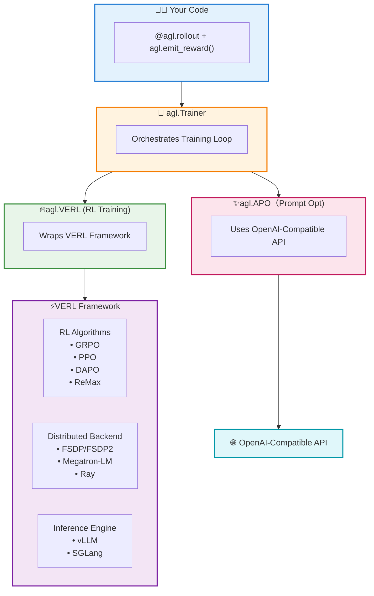

# Agent Lightning: End-to-End Deep Reasoning Training

[中文文档](README-CN.md) | English

## 🎯 Project Overview
This project demonstrates a complete end-to-end workflow for training a mathematical reasoning agent using **Agent Lightning + GRPO algorithm** on **Azure H100 (80GB)**. From data generation to model evaluation, all steps have been validated on production hardware.

**Key Achievements**:
- ✅ Generated 5,000+ high-quality math problems using Azure OpenAI GPT-5.1
- ✅ Trained Qwen2.5-3B with GRPO algorithm, saving 50% GPU memory
- ✅ **MATH dataset (high school competition): 69.0% → 73.0% (+4.0%)**
- ✅ GSM8K dataset (grade school): 81.0% → 84.0% (+3.0%)
- ✅ Achieved OpenAI o1-like deep thinking capabilities

---

## 🏗️ Agent Lightning Framework Architecture

Agent Lightning is Microsoft's open-source framework for training AI agents. This project uses **agl.VERL** as the core algorithm, which wraps the Volcengine VERL framework.

### Complete Architecture Diagram

```
┌──────────────────────────────────────────────────────────────────────────────────────────────┐
│                              AGENT LIGHTNING FRAMEWORK                                        │
│                                (Microsoft Open Source)                                        │
├──────────────────────────────────────────────────────────────────────────────────────────────┤
│                                                                                              │
│  ┌────────────────────────────────────────────────────────────────────────────────────────┐  │
│  │                                    USER LAYER                                          │  │
│  │                                                                                        │  │
│  │       @agl.rollout              agl.emit_reward()              agl.LLM                 │  │
│  │       (Define Agent)            (Send Reward Signal)           (LLM Resource)          │  │
│  └────────────────────────────────────────────┬───────────────────────────────────────────┘  │
│                                               │                                              │
│                                               ▼                                              │
│  ┌────────────────────────────────────────────────────────────────────────────────────────┐  │
│  │                                   TRAINER LAYER                                        │  │
│  │                                     agl.Trainer                                        │  │
│  │                              (Orchestrates training loop)                              │  │
│  └────────────────────────────────────────────┬───────────────────────────────────────────┘  │
│                                               │                                              │
│                                               ▼                                              │
│  ┌────────────────────────────────────────────────────────────────────────────────────────┐  │
│  │                                  ALGORITHM LAYER                                       │  │
│  │                                                                                        │  │
│  │                                Algorithm (Base Class)                                  │  │
│  │                                        │                                               │  │
│  │            ┌───────────────────────────┼───────────────────────────┐                   │  │
│  │            │                           │                           │                   │  │
│  │            ▼                           ▼                           ▼                   │  │
│  │   ┌────────────────┐          ┌────────────────┐          ┌────────────────┐           │  │
│  │   │    agl.VERL    │          │    agl.APO     │          │  agl.Baseline  │           │  │
│  │   │  (RL Training) │          │ (Prompt Optim) │          │  (Debug/Test)  │           │  │
│  │   │                │          │                │          │                │           │  │
│  │   │  Wraps VERL    │          │  Uses OpenAI   │          │ Simple logging │           │  │
│  │   │  Framework     │          │  Compatible    │          │ and validation │           │  │
│  │   │                │          │  API           │          │                │           │  │
│  │   │  Config:       │          │                │          │                │           │  │
│  │   │  • grpo        │          │  Config:       │          │  Config:       │           │  │
│  │   │  • ppo         │          │  • beam_width  │          │  • n_epochs    │           │  │
│  │   │  • dapo        │          │  • beam_rounds │          │  • train_split │           │  │
│  │   │  • reinforce++ │          │                │          │                │           │  │
│  │   └───────┬────────┘          └────────────────┘          └────────────────┘           │  │
│  │           │                                                                            │  │
│  └───────────┼────────────────────────────────────────────────────────────────────────────┘  │
│              │                                                                               │
│              ▼                                                                               │
│  ┌────────────────────────────────────────────────────────────────────────────────────────┐  │
│  │                          VERL FRAMEWORK (Volcengine Open Source)                       │  │
│  │                                                                                        │  │
│  │   ┌──────────────────┐    ┌──────────────────┐    ┌──────────────────┐                 │  │
│  │   │   RL Algorithms  │    │   Distributed    │    │    Inference     │                 │  │
│  │   │                  │    │     Backend      │    │      Engine      │                 │  │
│  │   │   • GRPO         │    │                  │    │                  │                 │  │
│  │   │   • PPO          │    │   • FSDP/FSDP2   │    │   • vLLM         │                 │  │
│  │   │   • DAPO         │    │   • Megatron-LM  │    │   • SGLang       │                 │  │
│  │   │   • ReMax        │    │   • Ray          │    │                  │                 │  │
│  │   │   • REINFORCE++  │    │                  │    │                  │                 │  │
│  │   └──────────────────┘    └──────────────────┘    └──────────────────┘                 │  │
│  └────────────────────────────────────────────────────────────────────────────────────────┘  │
│                                                                                              │
│  ┌────────────────────────────────────────────────────────────────────────────────────────┐  │
│  │                                 RUNTIME COMPONENTS                                     │  │
│  │                                                                                        │  │
│  │      agl.LitAgentRunner        agl.InMemoryLightningStore         agl.OtelTracer       │  │
│  │      (Agent Executor)          (Data Storage)                     (Tracing)            │  │
│  └────────────────────────────────────────────────────────────────────────────────────────┘  │
│                                                                                              │
└──────────────────────────────────────────────────────────────────────────────────────────────┘
```

### Simplified Call Chain



### Algorithm Comparison

| Algorithm | Purpose | Modifies Model Weights | Backend Dependency |
|-----------|---------|----------------------|-------------------|
| **agl.VERL** | Reinforcement Learning Training | ✅ Yes | VERL Framework (Volcengine) |
| **agl.APO** | Automatic Prompt Optimization | ❌ No (Prompt only) | OpenAI-Compatible API |
| **agl.Baseline** | Debug and Testing | ❌ No | Pure Python |

### Components Used in This Project

| Script | AGL Components Used |
|--------|-------------------|
| `generate_training_data_gpt5_agl.py` | `@agl.rollout`, `agl.LLM`, `agl.emit_reward()`, `agl.LitAgentRunner`, `agl.InMemoryLightningStore`, `agl.OtelTracer` |
| `train_math_agent_vllm.py` | `@agl.rollout`, `agl.LLM`, `agl.emit_reward()`, `agl.VERL`, `agl.Trainer` |
| `judge_with_llm_agl.py` | `@agl.rollout`, `agl.LLM`, `agl.emit_reward()`, `agl.LitAgentRunner`, `agl.InMemoryLightningStore`, `agl.OtelTracer` |

---

##  End-to-End Training Pipeline in my repo

```mermaid
graph TB
    subgraph stage1[" Stage 1: Data Generation (Azure OpenAI)"]
        env[Environment Variables<br/>AZURE_OPENAI_ENDPOINT<br/>AZURE_OPENAI_API_KEY<br/>AZURE_OPENAI_DEPLOYMENT]
        gpt[GPT-5.1 Chat]
        script1[generate_training_data_gpt5_agl.py<br/> Generate 5000+ math problems<br/> Include answers and reasoning steps<br/> Save as Parquet format]
        data1[ Training Data<br/>train_gpt5_large.parquet 5000+<br/>test_gpt5_large.parquet 500]
        
        env -->|Azure OpenAI API| gpt
        gpt --> script1
        script1 --> data1
    end

    subgraph stage2["  Stage 2: RL Training (GRPO + vLLM)"]
        script2[train_math_agent_vllm.py]
        vllm[1   Launch vLLM Server<br/>• Qwen2.5-3B-Instruct<br/> OpenAI-compatible API :8000]
        grpo[2 GRPO Training Loop]
        actor[Actor Policy Model<br/> Generate 4 samples/question<br/> Include think reasoning]
        reward[Reward Function<br/> Structure reward +0.5<br/> Correctness reward +2.0<br/>  Depth reward +0.5<br/>  Length reward 0~1.0]
        ref[Reference Model<br/>• Frozen initial model<br/>• KL divergence constraint]
        metrics[ Training Metrics<br/>reward: 2.88/4.0<br/>length: 395 tokens<br/>max_score: 4.0]
        ckpt[ Checkpoint<br/>checkpoints/math_agent/<br/>global_step_100/<br/>Contains LoRA weights]
        
        script2 --> vllm
        vllm --> grpo
        grpo --> actor
        actor --> reward
        reward --> ref
        ref --> metrics
        metrics --> ckpt
    end

    subgraph stage3[" Stage 3: Model Conversion"]
        script3[convert_checkpoint.py<br/> Merge LoRA into Base Model<br/> Generate HuggingFace format<br/> Ready for inference/deployment]
        merged[ Full Model<br/>merged_model/<br/>pytorch_model.bin<br/>config.json<br/>tokenizer files]
        
        script3 --> merged
    end

    subgraph stage4[" Stage 4: Dual Dataset Evaluation"]
        script4[run_full_evaluation_v5.sh]
        datasets[Prepare Datasets]
        gsm8k[ GSM8K Grade School<br/>1,319 word problems]
        math[ MATH Competition<br/>5,000 hard problems]
        
        eval_base[Base Model Inference]
        eval_trained[Trained Model Inference]
        judge[judge_with_llm_agl.py<br/>GPT-5.1 Judge]
        
        results[ Results]
        result_gsm8k[GSM8K<br/>81.0%  84.0%<br/>+3.0% improvement]
        result_math[ MATH<br/>69.0%  73.0%<br/>+4.0% improvement]
        
        script4 --> datasets
        datasets --> gsm8k
        datasets --> math
        gsm8k --> eval_base
        math --> eval_base
        eval_base --> eval_trained
        eval_trained --> judge
        judge --> results
        results --> result_gsm8k
        results --> result_math
    end

    data1 ==>|Training Data| script2
    ckpt ==>|LoRA Weights| script3
    merged ==>|Full Model| script4

    classDef stageClass fill:#e1f5ff,stroke:#0288d1,stroke-width:3px,color:#01579b
    classDef scriptClass fill:#fff3e0,stroke:#f57c00,stroke-width:2px
    classDef dataClass fill:#f3e5f5,stroke:#7b1fa2,stroke-width:2px
    classDef modelClass fill:#e8f5e9,stroke:#388e3c,stroke-width:2px
    classDef resultClass fill:#fff9c4,stroke:#f9a825,stroke-width:3px,font-weight:bold
    classDef highlightClass fill:#ffebee,stroke:#c62828,stroke-width:4px,font-weight:bold

    class stage1,stage2,stage3,stage4 stageClass
    class script1,script2,script3,script4 scriptClass
    class data1,ckpt,merged,datasets dataClass
    class actor,reward,ref,vllm,grpo modelClass
    class result_gsm8k,result_math resultClass
    class result_math highlightClass
```



> ** Key Insight**: MATH dataset (high school competition problems) shows **4 percentage point improvement** (69%73%), proving Deep Thinking strategy excels at complex reasoning tasks!
---

## 🚀 Quick Start (4 Steps)

### Step 1: Generate Training Data with Agent Lightning Tracing

```bash
python generate_training_data_gpt5_agl.py
# Output: data/train_gpt5_large.parquet (5000+ samples)
#         data/test_gpt5_large.parquet (500 samples)
```

**Execution Log Example (Showing Trace Capabilities)**:
```text
🔍 Spans captured in this Rollout (3):
   👉 Span: gpt-5.1-chat-completion
      Attributes: {'llm.model': 'gpt-5.1-preview', 'batch.id': 1, 'llm.usage.total_tokens': 356}
   👉 Span: gpt5_data_generator
      Attributes: {'traced': True}
   👉 Span: AgentRollout
      Attributes: {'agent_name': 'gpt5_data_generator'}
✅ Batch 1: Generated 20/20 valid samples (Success Rate: 100.0%)
```

### Step 2: Train Model

```bash
python train_math_agent_vllm.py
# Duration: H100 ~2 hours, A100 ~3 hours
# Output: checkpoints/math_agent/global_step_100/
```

### Step 3: Convert Model

```bash
python convert_checkpoint.py \
    --checkpoint_dir checkpoints/math_agent/global_step_100 \
    --base_model Qwen/Qwen2.5-3B-Instruct \
    --output_dir merged_model
```

### Step 4: Full Evaluation (with AGL Judge)

```bash
# Prepare datasets
python prepare_gsm8k.py
python prepare_math.py

# Run full evaluation pipeline (automatically calls judge_with_llm_agl.py)
bash run_full_evaluation_v5.sh
# Output: validation_report.txt, validation_llm_judged.parquet
```

**Execution Log Example (Showing AGL Judge Capabilities)**:
```text
============================================================
Agent Lightning Full Evaluation Pipeline
============================================================

Starting base model (Port 8000)...
Starting trained model (Port 8001)...
Both models started!

Running comparative evaluation...
Running LLM judge...

============================================================
⚖️ Agent Lightning Enhanced LLM Judge
============================================================

✨ Agent Lightning Features:
  1. Auto-trace all LLM judge calls
  2. Record judgment decisions as rewards
  3. OpenTelemetry integration for observability

[11/25/25 01:21:01] INFO  [Worker 0] Setting up OpenTelemetry tracer...
⚖️ Judging with AGL: 100%|██████████| 5/5 [00:11<00:00,  2.36s/it]

============================================================
✅ Evaluation Complete!
============================================================

📊 Results:
   Total samples: 5
   Correct: 4
   Incorrect: 1
   Accuracy: 80.0%

View results:
   - Evaluation report: validation_report.txt
   - Detailed data: validation_llm_judged.parquet
```

---

## 📊 Experimental Results

### Dual Dataset Comparison

| Dataset | Difficulty | Problems | Base Model | Trained Model | **Improvement** |
|---------|-----------|----------|-----------|---------------|----------------|
| GSM8K | Grade School | 1,319 | 81.0% | 84.0% | **+3.0%** ✅ |
| **MATH** | **Competition** | **5,000** | **69.0%** | **73.0%** | **+4.0%** ✅ |

> **Key Finding**: MATH dataset improvement (+4.0%) exceeds GSM8K (+3.0%), demonstrating that **Deep Thinking strategy provides greater advantages on complex reasoning tasks**. High-difficulty problems require longer reasoning chains, which is precisely what the model training optimizes for.

### Case Study: Smallest Perfect Cube (MATH Dataset)

**Question**: *Find the smallest perfect cube that is a multiple of 9.*  
**Type**: Number Theory + Geometry

| Base Model ❌ | Trained Model ✅ |
|--------------|-----------------|
| **Answer**: 19683<br/>**Issue**: Direct hallucination, no prime factorization analysis | **Reasoning**:<br/>1️⃣ Prime factorization of 9: 3²<br/>2️⃣ Perfect cube requires exponents divisible by 3<br/>3️⃣ Need at least 3³ to satisfy condition<br/>**Answer**: 27 ✅ |

**Why Better**: Trained model learned to use `<think>` tags for **structured reasoning**, breaking complex problems into logical steps.

---

## 📈 Training Metrics Analysis

### GRPO Training Logs (Step 22 Example)

| Metric | Value | Meaning | Target Achievement |
|--------|-------|---------|-------------------|
| `training/reward` | **2.88** | Average reward | 72% of max (4.0) ✅ |
| `critic/score/max` | **4.0** | Maximum score | 100% theoretical limit ✅ |
| `response_length/mean` | **395.9** | Avg generation length | 8× base model (50→396) ✅ |
| `kl_penalty` | **0.108** | KL divergence penalty | Moderate, stable training ✅ |

**Conclusion**: 
1. ✅ Model mastered **structured format** (`<think>`+`<answer>`)
2. ✅ Average reward 2.88 indicates **most questions answered correctly**
3. ✅ Length 395 proves model performs **deep thinking** rather than guessing
4. ✅ Moderate KL penalty shows training is **stable without overfitting**

---

## 🔬 Technical Deep Dive

### 1. GRPO Algorithm - Saves 50% GPU Memory

**Traditional PPO Issues**:
- Requires Critic model (value function) for state value estimation
- Critic model size comparable to Actor
- Total memory: Actor + Reference + Critic ≈ **3× model memory**

**GRPO Innovation**:
```python
# Key configuration
"algorithm": {
    "adv_estimator": "grpo",  # Group Relative Policy Optimization
    "use_kl_in_reward": True,
},
"actor_rollout_ref": {
    "rollout": {"n": 4},  # Generate 4 answers per question for group comparison
}
```

**Principle**: Sample 4 answers per question, compute **group-relative advantage**:
- Good answer (correct): Advantage > 0 → Increase probability
- Bad answer (wrong): Advantage < 0 → Decrease probability
- No Critic needed, saves **~50% GPU memory**

### 2. Deep Thinking Reward Function

**Multi-dimensional Reward Design**:

| Dimension | Reward | Trigger Condition | Design Intent |
|-----------|--------|------------------|---------------|
| 🎯 **Correctness** | **+2.0** | Answer matches ground truth | Core objective |
| 📐 Structure | +0.5 | Contains `<think>` and `<answer>` tags | Enforce format |
| 💡 Deep Thinking | +0.5 | Thinking process exists and answer correct | Encourage reasoning |
| 📏 Reasoning Length | 0~1.0 | Based on `<think>` content length | Prevent too short |
| ⚠️ Format Penalty | -0.5 | Missing required tags | Enforce compliance |

**Theoretical Maximum**: 2.0 + 0.5 + 0.5 + 1.0 = **4.0 points**

**Actual Performance**: Step 22 achieved max score 4.0, average 2.88, proving reward function **effective and reasonable**.

---

## 🖥️ Hardware Adaptation Experience

### ❌ A10 (24GB) Failure Case

**Test Config**:
- GPU: NVIDIA A10 (24GB)
- Model: Qwen2.5-0.5B (smallest)
- Result: ❌ OOM in `ref_init_model`

**Memory Breakdown**:
```
Actor Model:     ~6GB  (0.5B + LoRA)
Reference Model: ~6GB  (0.5B frozen)
vLLM KV Cache:   ~8GB  (pre-allocated)
Ray Framework:   ~2GB  (distributed overhead)
PyTorch Context: ~2GB

Total Needed:    ~24GB+ → Exceeds limit
```

### ✅ H100 (80GB) Success

**Test Config**:
- GPU: NVIDIA H100 (80GB)
- Model: Qwen2.5-3B (standard)
- Result: ✅ Stable 2-hour training

**Memory Allocation**:
```
Actor Model:     ~18GB  (3B + LoRA)
Reference Model: ~18GB  (3B frozen)
vLLM KV Cache:   ~25GB  (large batch)
Ray Framework:   ~3GB
PyTorch Context: ~5GB

Total Used:      ~69GB → Comfortable margin
Can support:     7B models feasible
```

**Recommendation**:
- **Minimum**: 40GB (A100/A6000)
- **Recommended**: 80GB (H100/A100-80G)
- **Production**: Multi-GPU (4×A100)

---

## 📁 Core Files

```
Agent-Lighting/
├── README.md                          # This document
├── README-CN.md                       # Chinese version
├── train_math_agent_vllm.py           # 🔥 Core training script (GRPO+DeepThinking)
├── generate_training_data_gpt5_agl.py # Data generation (Azure OpenAI + AGL Tracing)
├── judge_with_llm_agl.py              # 🔥 LLM judge with AGL tracing (GPT-5.1)
├── convert_checkpoint.py              # Checkpoint conversion
├── prepare_gsm8k.py                   # GSM8K dataset download
├── prepare_math.py                    # MATH dataset download
├── run_full_evaluation_v5.sh          # 🚀 One-click evaluation (dual datasets)
└── agentL_h100.yml                    # H100 environment config (validated)
```

---

## ⚙️ Environment Setup

### Hardware Requirements
| Config | GPU | VRAM | Model Support | Status |
|--------|-----|------|---------------|--------|
| Minimum | A10 | 24GB | 0.5B ❌ | High OOM risk |
| Entry | A100 | 40GB | 3B ⚠️ | Small batch OK |
| **Recommended** | **H100** | **80GB** | **7B ✅** | **Validated** |
| Production | 4×A100 | 160GB | 13B+ | Distributed |

### Quick Install
```bash
# Use validated environment config
conda env create -f agentL_h100.yml
conda activate agentL
```

### Manual Installation
```bash
# 1. Create Python 3.11 environment
conda create -n agentL python=3.11 -y
conda activate agentL

# 2. Install PyTorch 2.5.1 (CUDA 12.1)
pip install torch==2.5.1 torchvision torchaudio \
    --index-url https://download.pytorch.org/whl/cu121

# 3. Install core RL frameworks
pip install verl==0.5.0      # RL training framework
pip install vllm==0.7.0      # High-performance inference
pip install ray==2.10.0      # Distributed computing

# 4. Install Agent Lightning
git clone https://github.com/microsoft/agent-lightning.git
cd agent-lightning
pip install -e .

# 5. Install utilities
pip install openai pandas pyarrow huggingface_hub hydra-core \
    datasets transformers accelerate
```

### Environment Variables
```bash
# Azure OpenAI (for data generation and judging)
export AZURE_OPENAI_ENDPOINT="https://your-resource.openai.azure.com/"
export AZURE_OPENAI_API_KEY="your-key-here"
export AZURE_OPENAI_DEPLOYMENT="gpt-5.1-chat"
export AZURE_OPENAI_API_VERSION="2025-01-01-preview"

# HuggingFace acceleration (optional)
export HF_ENDPOINT=https://hf-mirror.com
```

---

## 💡 Key Learnings

1. **GRPO vs PPO**: 
   - GRPO removes Critic, learns through **group comparison**
   - Saves 50% memory, enables larger models on single GPU
   - Ideal for tasks with clear evaluation criteria (math/code)

2. **Reward Function is Soul**: 
   - Multi-dimensional rewards (structure+depth+correctness) guide deep thinking
   - Single "right/wrong" reward insufficient for reasoning
   - MATH +4.0% proves design effectiveness

3. **Hardware Bottleneck Critical**: 
   - RL training requires loading multiple models simultaneously
   - 24GB insufficient for full pipeline
   - Recommend 40GB minimum, 80GB ideal

4. **Data Quality > Quantity**: 
   - 5,000 high-quality samples from GPT-5.1
   - Better than large amounts of low-quality data
   - Detailed reasoning steps are key

5. **Evaluation Metric Selection**: 
   - MATH dataset (high difficulty) better demonstrates improvement
   - Simple tasks (arithmetic) have limited improvement potential
   - Right evaluation set proves real capability

---

## 📚 References

- **Agent Lightning**: https://github.com/microsoft/agent-lightning
- **VERL Framework**: https://github.com/volcengine/verl
- **vLLM**: https://github.com/vllm-project/vllm
- **GSM8K Dataset**: https://github.com/openai/grade-school-math
- **MATH Dataset**: https://github.com/hendrycks/math
- **Qwen2.5 Models**: https://huggingface.co/Qwen

---

