# AI Super Agent: H100 训练验证项目

##  项目概述

本项目验证了在 **Azure H100 (80GB)** 环境下,使用 **Agent Lightning + GRPO 算法**训练数学推理Agent的完整流程。

**核心成果**:
-  使用 Azure OpenAI GPT-5.1 生成 5000+ 高质量数学训练数据
-  GRPO算法训练 Qwen2.5-3B 模型,节省50%显存
-  GSM8K准确率从81.0%提升至84.0% (+3.0%)
-  MATH数据集准确率从69.0%提升至73.0% (+4.0%)
-  实现类似OpenAI o1的深度推理能力(Deep Thinking)

---

##  端到端训练流程

```mermaid
graph TB
    subgraph stage1[" 阶段1: 数据生成 (Azure OpenAI) "]
        env[环境变量<br/>AZURE_OPENAI_ENDPOINT<br/>AZURE_OPENAI_API_KEY<br/>AZURE_OPENAI_DEPLOYMENT]
        gpt[GPT-5.1 Chat]
        script1[generate_training_data_gpt5.py<br/> 生成5000+数学应用题<br/> 包含答案和详细解题步骤<br/> 保存为Parquet格式]
        data1[data/train_gpt5_large.parquet<br/>data/test_gpt5_large.parquet]
        
        env -->|Azure OpenAI API| gpt
        gpt --> script1
        script1 --> data1
    end

    subgraph stage2[" 阶段2: 强化学习训练 (GRPO + vLLM) "]
        script2[train_math_agent_vllm.py]
        vllm[1. 启动vLLM服务器<br/> 加载Qwen2.5-3B-Instruct<br/> OpenAI兼容API :8000]
        actor[Actor 策略模型<br/> 生成回答 4采样/题<br/> 包含think推理过程]
        reward[Reward Function<br/> 结构奖励 格式正确<br/> 深度奖励 思考长度<br/> 正确性奖励 答案准确]
        ref[Reference Model<br/> 冻结的初始模型<br/> 计算KL散度防止过拟合]
        ckpt[checkpoints/math_agent/<br/>global_step_100/<br/>包含LoRA权重]
        
        script2 --> vllm
        vllm --> actor
        actor --> reward
        reward --> ref
        ref --> ckpt
    end

    subgraph stage3[" 阶段3: 模型格式转换 "]
        script3[convert_checkpoint.py<br/>• 将LoRA合并到Base Model<br/>• 生成HuggingFace格式模型<br/>• 可直接用于推理或部署]
        merged[merged_model/<br/>• pytorch_model.bin<br/>• config.json<br/>• tokenizer files]
        
        script3 --> merged
    end

    subgraph stage4[" 阶段4: 模型评估 (Benchmarks) "]
        script4[run_full_evaluation_v5.sh]
        eval1[1. 启动vLLM Base Model]
        eval2[2. inference_gsm8k.py]
        eval3[3. 启动vLLM Trained Model]
        eval4[4. inference_gsm8k.py 对比]
        eval5[5. judge_with_llm.py 评判]
        report[评估报告<br/>Base: 81.0%<br/>Trained: 84.0% +3.0%]
        
        script4 --> eval1 --> eval2 --> eval3 --> eval4 --> eval5 --> report
    end

    data1 ==> script2
    ckpt ==> script3
    merged ==> script4

    classDef stageClass fill:#e1f5ff,stroke:#0288d1,stroke-width:2px
    classDef scriptClass fill:#fff3e0,stroke:#f57c00,stroke-width:2px
    classDef dataClass fill:#f3e5f5,stroke:#7b1fa2,stroke-width:2px
    classDef modelClass fill:#e8f5e9,stroke:#388e3c,stroke-width:2px

    class stage1,stage2,stage3,stage4 stageClass
    class script1,script2,script3,script4 scriptClass
    class data1,ckpt,merged dataClass
    class actor,reward,ref,vllm modelClass
```



---

##  快速开始(4步完整流程)

### 步骤1: 生成训练数据
```bash
python generate_training_data_gpt5.py
# 输出: data/train_gpt5_large.parquet (5000+条)
#      data/test_gpt5_large.parquet (500条)
```

### 步骤2: 训练模型
```bash
python train_math_agent_vllm.py
# 训练时长: H100约2小时, A100约3小时
# 输出: checkpoints/math_agent/global_step_100/
```

### 步骤3: 转换模型
```bash
python convert_checkpoint.py \
    --checkpoint_dir checkpoints/math_agent/global_step_100 \
    --base_model Qwen/Qwen2.5-3B-Instruct \
    --output_dir merged_model
```

### 步骤4: 评估性能
```bash
# 准备数据集
python prepare_gsm8k.py
python prepare_math.py

# 一键评估
bash run_full_evaluation_v5.sh
# 输出: validation_report.txt
```

---

##  核心技术亮点

### 1. GRPO算法 - 节省50%显存
不需要Critic模型,通过对同一问题采样一组输出(n=4)计算组内相对优势来优化策略。

**配置关键**:
```python
"algorithm": {
    "adv_estimator": "grpo",  # 指定GRPO
    "use_kl_in_reward": True,
    "kl_ctrl": {"type": "fixed", "kl_coef": 0.001},
},
"actor_rollout_ref": {
    "rollout": {"n": 4},  # 每题4个采样
}
```

### 2. Deep Thinking奖励函数
多维度激励模型进行长链推理:

| 奖励类型 | 分数 | 触发条件 |
|---------|-----|---------|
| 结构奖励 | +0.5 | 包含<think>和<answer>标签 |
| 正确性奖励 | +2.0 | 答案与标准答案一致 |
| 深度奖励 | +0.5 | 思考过程存在且答案正确 |
| 长度奖励 | 0~1.0 | 根据<think>内容长度动态计算 |

### 3. 实验结果

**训练日志关键指标** (Step 22):
- `training/reward: 2.88` (接近满分4.0)
- `response_length/mean: 395.9` (相比Base<50 token)
- `critic/score/max: 4.0` (达到理论满分)

**数据集评估**:

| 数据集 | Base Model | Trained Model | 提升 |
|--------|-----------|---------------|------|
| GSM8K (1319题) | 81.0% | **84.0%** | **+3.0%** |
| MATH (5000题) | 69.0% | **73.0%** | **+4.0%** |

**典型案例: 最小完美立方数**

题目: *Find the smallest perfect cube that is a multiple of 9.*

| Base Model  | Trained Model  |
|--------------|-----------------|
| 19683 | <think><br/>Prime factorization: 9 = 3<br/>For perfect cube: exponent must be multiple of 3<br/>Need 3 = 27<br/></think><br/><answer>27</answer> |

---

##  硬件适配实战经验

###  A10 (24GB) 失败案例
**现象**: 即使0.5B模型也会OOM,在`ref_init_model`阶段崩溃。

**原因**:
- 需同时加载Actor和Reference两个模型
- vLLM引擎KV Cache预占显存
- Ray分布式框架开销

###  H100 (80GB) 成功验证
- 3B模型训练稳定
- 支持更大batch size和context length
- 完整功能测试通过(含calc_x等复杂示例)

**建议**: 生产环境至少使用**40GB+显存**(A100/H100/A6000)。

---

##  核心文件说明

```
Agent-Lighting/
 README.md                          # 本文档
 train_math_agent_vllm.py           # 核心训练脚本(GRPO+DeepThinking)
 generate_training_data_gpt5.py     # Azure OpenAI数据生成
 judge_with_llm.py                  # LLM评判器
 convert_checkpoint.py              # Checkpoint转换工具
 prepare_gsm8k.py                   # GSM8K数据集准备
 prepare_math.py                    # MATH数据集准备
 run_full_evaluation_v5.sh          # 一键评估脚本
 agentL_h100.yml                    # H100环境配置文件
```

---

##  完整环境搭建

### 硬件要求
- **推荐**: NVIDIA H100 (80GB) 或 A100 (80GB)
- **最低**: A10 (24GB)  需调小batch size,0.5B模型仍可能OOM
- **CUDA**: 12.1+

### 方法1: 使用提供的yml文件
```bash
conda env create -f agentL_h100.yml
conda activate agentL
```

### 方法2: 手动安装
```bash
# 创建环境
conda create -n agentL python=3.11 -y
conda activate agentL

# 安装PyTorch
pip install torch==2.5.1 --index-url https://download.pytorch.org/whl/cu121

# 安装核心框架
pip install verl==0.5.0 vllm==0.7.0 ray==2.10.0

# 安装Agent Lightning (需先clone仓库)
cd agent-lightning
pip install -e .

# 安装其他依赖
pip install openai pandas pyarrow huggingface_hub hydra-core datasets transformers accelerate
```

### 环境变量配置
```bash
# Azure OpenAI (数据生成用)
export AZURE_OPENAI_ENDPOINT="https://xxx.openai.azure.com/"
export AZURE_OPENAI_API_KEY="your-key"
export AZURE_OPENAI_DEPLOYMENT="gpt-5.1-chat"
export AZURE_OPENAI_API_VERSION="2025-01-01-preview"

# HuggingFace (可选,加速下载)
export HF_ENDPOINT=https://hf-mirror.com
```

---

##  关键学习要点

1. **GRPO vs PPO**: GRPO通过移除Critic模型节省50%显存,特别适合推理类任务。

2. **奖励工程的重要性**: 多维度奖励函数是激发模型潜力的关键。单纯的"对错"奖励无法引导深度思考。

3. **硬件选择**: RL训练对显存要求极高,不要低估双模型(Actor+Reference)加载的开销。

4. **数据质量 > 数量**: 使用GPT-5.1生成的高质量数据(5000条)比大量低质数据更有效。

5. **训练稳定性监控**: 关注`reward`, `kl_penalty`, `response_length`三大指标,判断训练健康度。

---

##  参考资源

- **Agent Lightning**: https://github.com/microsoft/agent-lightning
- **VERL框架**: https://github.com/volcengine/verl
- **vLLM**: https://github.com/vllm-project/vllm
- **GSM8K数据集**: https://github.com/openai/grade-school-math
- **MATH数据集**: https://github.com/hendrycks/math

---

##  常见问题

**Q: 为什么A10 24GB会OOM?**  
A: Agent Lightning需同时加载Actor和Reference两个模型,加上vLLM的KV Cache和Ray开销,24GB不足。

**Q: 可以用更小的模型吗?**  
A: 可以,但即使0.5B在A10上也会OOM。建议至少40GB显存。

**Q: 训练需要多长时间?**  
A: H100约2小时(100 steps, 500 samples),A100约3小时。

**Q: 如何调整奖励函数?**  
A: 修改`train_math_agent_vllm.py`中的`math_reward_function_v4`,根据任务特性设计奖励维度。

---

**项目维护**: David Wei  
**最后更新**: 2025-11-24  
**环境**: Azure H100 (80GB), Ubuntu, Python 3.11
