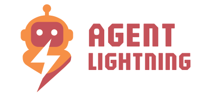
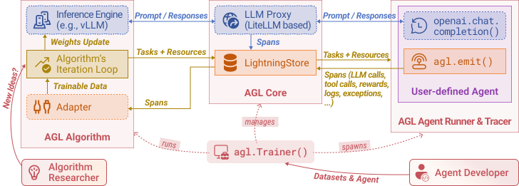

<p align="center">
  
</p>

# Agent Lightning⚡

[](https://github.com/microsoft/agent-lightning/actions/workflows/badge-unit.yml)
[](https://microsoft.github.io/agent-lightning/)
[](https://badge.fury.io/py/agentlightning)
[](LICENSE)
[](https://deepwiki.com/microsoft/agent-lightning)
[](https://discord.gg/RYk7CdvDR7)

**The absolute trainer to light up AI agents.**

Join our [Discord community](https://discord.gg/RYk7CdvDR7) to connect with other users and contributors.

## ⚡ Core Features

- Turn your agent into an optimizable beast with **ZERO CODE CHANGE** (almost)! 💤
- Build with **ANY** agent framework (LangChain, OpenAI Agent SDK, AutoGen, CrewAI, Microsoft Agent Framework...); or even WITHOUT agent framework (Python OpenAI). You name it! 🤖
- **Selectively** optimize one or more agents in a multi-agent system. 🎯
- Embraces **Algorithms** like Reinforcement Learning, Automatic Prompt Optimization, Supervised Fine-tuning and more. 🤗

Read more on our [documentation website](https://microsoft.github.io/agent-lightning/).

<p align="center">
  
</p>

## ⚡ Installation

### Basic Installation

```bash
pip install agentlightning
```

For the latest nightly build (cutting-edge features), you can install from Test PyPI:

```bash
pip install --upgrade --index-url https://test.pypi.org/simple/ --extra-index-url https://pypi.org/simple/ agentlightning
```

### GPU Requirements for VERL Algorithm

If you plan to use the **VERL** (Reinforcement Learning) algorithm for training, you need to install additional GPU dependencies. The VERL algorithm requires **flash-attention** which must match your PyTorch and CUDA versions.

#### Compatible Version Installation (Recommended)

For most setups with CUDA 12.x and PyTorch 2.5+:

```bash
# Step 1: Install PyTorch 2.5.1 (vLLM 0.7.0 requires Torch 2.5.1)
pip install torch==2.5.1 torchvision==0.20.1 --index-url https://download.pytorch.org/whl/cu124

# Step 2: Install flash-attn matching PyTorch 2.5 (use precompiled wheel)
pip install https://github.com/Dao-AILab/flash-attention/releases/download/v2.7.2.post1/flash_attn-2.7.2.post1+cu12torch2.5cxx11abiFALSE-cp311-cp311-linux_x86_64.whl

# Step 3: Install vLLM and VERL (VERL 0.5.0 requires vLLM >= 0.7.0)
pip install vllm==0.7.0
pip install verl==0.5.0

# Step 4: Install Agent Lightning
pip install agentlightning
```

**Note**: The flash-attn precompiled wheel URL above is for Python 3.11. For other Python versions, check the [flash-attention releases page](https://github.com/Dao-AILab/flash-attention/releases) and select the appropriate wheel file.

#### Common Issues and Solutions

**Issue 1: Symbol conflicts** (`undefined symbol: _ZN3c105ErrorC2E` or similar)
- **Cause**: flash-attn version doesn't match your PyTorch version
- **Solution**: Use the version compatibility table below to find the correct flash-attn version

**Issue 2: Build failures** (`CUDA_HOME environment variable is not set`)
- **Cause**: Trying to build flash-attn from source without CUDA toolkit
- **Solution**: Use precompiled wheels from the [flash-attn releases page](https://github.com/Dao-AILab/flash-attention/releases)

**Issue 3: ImportError in VERL workers**
- **Cause**: flash-attn not installed or incompatible version
- **Solution**: Verify installation with `python -c "import flash_attn; print(flash_attn.__version__)"`

**Issue 4: Out of Memory (OOM) on 24GB GPUs (e.g., A10, 3090, 4090)**
- **Cause**: The default architecture spawns multiple concurrent components (Actor, Critic, Reference Model, and vLLM Rollout Engine). Even with 0.5B models, the overhead of maintaining these separate CUDA contexts and model copies often exceeds 24GB VRAM.
- **Symptoms**: `RuntimeError: CUDA error: out of memory` occurring during `ref_init_model` or `_build_model_optimizer`.
- **Recommendation**: We strongly recommend using GPUs with at least 40GB VRAM (e.g., A100 40GB/80GB, H100) for single-GPU training. For 24GB cards, you may need to use multi-GPU setups (Ray cluster) to distribute the Actor/Critic and Rollout workers across different devices.

#### Version Compatibility Matrix

| PyTorch Version | CUDA Version | flash-attn Version | vLLM Version | VERL Version | Installation Command |
|----------------|--------------|-------------------|--------------|--------------|---------------------|
| 2.5.1 | 12.4 | 2.7.2.post1 | 0.7.0 | 0.5.0 | `pip install torch==2.5.1 --index-url https://download.pytorch.org/whl/cu124` <br> `pip install https://github.com/Dao-AILab/flash-attention/releases/download/v2.7.2.post1/flash_attn-2.7.2.post1+cu12torch2.5cxx11abiFALSE-cp311-cp311-linux_x86_64.whl` <br> `pip install vllm==0.7.0 verl==0.5.0` |
| 2.4.0 | 12.1 | 2.8.3 | 0.7.0+ | 0.5.0 | `pip install torch==2.4.0 --index-url https://download.pytorch.org/whl/cu121` <br> `pip install https://github.com/Dao-AILab/flash-attention/releases/download/v2.8.3/flash_attn-2.8.3+cu12torch2.4cxx11abiFALSE-cp311-cp311-linux_x86_64.whl` <br> `pip install vllm==0.7.0 verl==0.5.0` |
| 2.3.0 | 12.1 | 2.5.7 | 0.6.0 | 0.4.x | `pip install torch==2.3.0 --index-url https://download.pytorch.org/whl/cu121` <br> `pip install flash-attn==2.5.7 --no-build-isolation` <br> `pip install vllm==0.6.0 verl==0.4.0` |

**Important**: VERL 0.5.0 has updated its vLLM dependency requirement to >=0.7.0. If you're using an older tutorial or example that specifies vLLM 0.6.x, you must upgrade to vLLM 0.7.0 or later.

#### Testing Your Installation

Verify your installation is working correctly:

```python
import torch
import flash_attn
import vllm
import verl

print(f"PyTorch version: {torch.__version__}")
print(f"CUDA available: {torch.cuda.is_available()}")
print(f"flash-attn version: {flash_attn.__version__}")
print(f"vLLM version: {vllm.__version__}")
print(f"VERL version: {verl.__version__}")
```

Please refer to our [installation guide](https://microsoft.github.io/agent-lightning/stable/tutorials/installation/) for more details.

To start using Agent-lightning, check out our [documentation](https://microsoft.github.io/agent-lightning/) and [examples](./examples).

## ⚡ Articles

- 11/4/2025 [Tuning ANY AI agent with Tinker ✕ Agent-lightning](https://medium.com/@yugez/tuning-any-ai-agent-with-tinker-agent-lightning-part-1-1d8c9a397f0e) Medium. See also [Part 2](https://medium.com/@yugez/tuning-any-ai-agent-with-tinker-agent-lightning-part-2-332c5437f0dc).
- 10/22/2025 [No More Retokenization Drift: Returning Token IDs via the OpenAI Compatible API Matters in Agent RL](https://blog.vllm.ai/2025/10/22/agent-lightning.html) vLLM blog. See also [Zhihu writeup](https://zhuanlan.zhihu.com/p/1965067274642785725).
- 8/11/2025 [Training AI Agents to Write and Self-correct SQL with Reinforcement Learning](https://medium.com/@yugez/training-ai-agents-to-write-and-self-correct-sql-with-reinforcement-learning-571ed31281ad) Medium.
- 8/5/2025 [Agent Lightning: Train ANY AI Agents with Reinforcement Learning](https://arxiv.org/abs/2508.03680) arXiv paper.
- 7/26/2025 [We discovered an approach to train any AI agent with RL, with (almost) zero code changes.](https://www.reddit.com/r/LocalLLaMA/comments/1m9m670/we_discovered_an_approach_to_train_any_ai_agent/) Reddit.
- 6/6/2025 [Agent Lightning - Microsoft Research](https://www.microsoft.com/en-us/research/project/agent-lightning/) Project page.

## ⚡ Community Projects

- [DeepWerewolf](https://github.com/af-74413592/DeepWerewolf) — A case study of agent RL training for the Chinese Werewolf game built with AgentScope and Agent Lightning.
- [AgentFlow](https://agentflow.stanford.edu/) — A modular multi-agent framework that combines planner, executor, verifier, and generator agents with the Flow-GRPO algorithm to tackle long-horizon, sparse-reward tasks.

## ⚡ Architecture

Agent Lightning keeps the moving parts to a minimum so you can focus on your idea, not the plumbing. Your agent continues to run as usual; you can still use any agent framework you like; you drop in the lightweight `agl.emit_xxx()` helper, or let the tracer collect every prompt, tool call, and reward. Those events become structured spans that flow into the LightningStore, a central hub that keeps tasks, resources, and traces in sync.

On the other side of the store sits the algorithm you choose, or write yourself. The algorithm reads spans, learns from them, and posts updated resources such as refined prompt templates or new policy weights. The Trainer ties it all together: it streams datasets to runners, ferries resources between the store and the algorithm, and updates the inference engine when improvements land. You can either stop there, or simply let the same loop keep turning.

No rewrites, no lock-in, just a clear path from first rollout to steady improvement.

<p align="center">
  
</p>

## ⚡ CI Status

| Workflow | Status |
|----------|--------|
| CPU Tests | [](https://github.com/microsoft/agent-lightning/actions/workflows/tests.yml) |
| Full Tests | [](https://github.com/microsoft/agent-lightning/actions/workflows/badge-unit.yml) |
| UI Tests | [](https://github.com/microsoft/agent-lightning/actions/workflows/dashboard.yml) |
| Examples Integration | [](https://github.com/microsoft/agent-lightning/actions/workflows/badge-examples.yml) |
| Latest Dependency Compatibility | [](https://github.com/microsoft/agent-lightning/actions/workflows/badge-latest.yml) |
| Legacy Examples Compatibility | [](https://github.com/microsoft/agent-lightning/actions/workflows/badge-compat.yml) |

## ⚡ Citation

If you find Agent Lightning useful in your research or projects, please cite our paper:

```bibtex
@misc{luo2025agentlightningtrainai,
      title={Agent Lightning: Train ANY AI Agents with Reinforcement Learning},
      author={Xufang Luo and Yuge Zhang and Zhiyuan He and Zilong Wang and Siyun Zhao and Dongsheng Li and Luna K. Qiu and Yuqing Yang},
      year={2025},
      eprint={2508.03680},
      archivePrefix={arXiv},
      primaryClass={cs.AI},
      url={https://arxiv.org/abs/2508.03680},
}
```

## ⚡ Contributing

This project welcomes contributions and suggestions. Start by reading the [Contributing Guide](docs/community/contributing.md) for environment setup, branching conventions, and pull request expectations. Most contributions require you to agree to a Contributor License Agreement (CLA) declaring that you have the right to, and actually do, grant us the rights to use your contribution. For details, visit https://cla.opensource.microsoft.com.

When you submit a pull request, a CLA bot will automatically determine whether you need to provide a CLA and decorate the PR appropriately (e.g., status check, comment). Simply follow the instructions provided by the bot. You will only need to do this once across all repos using our CLA.

This project has adopted the [Microsoft Open Source Code of Conduct](https://opensource.microsoft.com/codeofconduct/). For more information see the [Code of Conduct FAQ](https://opensource.microsoft.com/codeofconduct/faq/) or contact [opencode@microsoft.com](mailto:opencode@microsoft.com) with any additional questions or comments.

## ⚡ Trademarks

This project may contain trademarks or logos for projects, products, or services. Authorized use of Microsoft trademarks or logos is subject to and must follow [Microsoft's Trademark & Brand Guidelines](https://www.microsoft.com/en-us/legal/intellectualproperty/trademarks/usage/general). Use of Microsoft trademarks or logos in modified versions of this project must not cause confusion or imply Microsoft sponsorship. Any use of third-party trademarks or logos are subject to those third-party's policies.

## ⚡ Responsible AI

This project has been evaluated and certified to comply with the Microsoft Responsible AI Standard. The team will continue to monitor and maintain the repository, addressing any severe issues, including potential harms, if they arise.

## ⚡ License

This project is licensed under the MIT License. See the [LICENSE](LICENSE) file for details.

## ⚡ Case Study: Training a Math Reasoning Agent

We trained a math agent using `agent-lightning` to demonstrate how Reinforcement Learning can improve reasoning capabilities beyond simple accuracy metrics.

### 1. The Challenge
We started with **Qwen2.5-3B-Instruct**, a strong base model. We wanted to improve its ability to solve complex, multi-step math problems found in the **MATH dataset** (high school competition level), which is significantly harder than GSM8K.

### 2. Training Process
We used the `FastGGUFRLAlgorithm` with the GRPO (Group Relative Policy Optimization) method.
- **Training Steps**: 100 steps.
- **Dataset**: A subset of math problems.
- **Reward Function**: Correctness of the final numeric answer.

### 3. Model Conversion (Crucial Step)
After training, the model is saved in a raw checkpoint format. To use it for inference or evaluation with standard tools (like vLLM), you must convert it to the HuggingFace format.

```bash
# Example conversion command
python convert_checkpoint.py \
    --checkpoint_path "checkpoints/math_agent/global_step_100" \
    --output_path "checkpoints/math_agent_hf" \
    --base_model "Qwen/Qwen2.5-3B-Instruct"
```

### 4. Evaluation on MATH Dataset
We evaluated both the Base Model and the RL-Trained Model on a challenging subset of the MATH dataset.

| Model | Accuracy (MATH Subset) |
| :--- | :--- |
| **Base Model (Qwen2.5-3B)** | **69.00%** |
| **RL-Trained Model** | **73.00%** |
| **Improvement** | **+4.00%** |

### 5. Qualitative Analysis: Logic Repair
The numbers don't tell the whole story. The RL training fixed specific logical flaws in the model's reasoning process.

**Case Study: The Smallest Perfect Cube**
*Question*: "What is the smallest positive perfect cube that can be written as the sum of three consecutive integers?"

*   **❌ Base Model's Failure**:
    It correctly derived that the sum is $27m^3$. However, it made a **logical leap**, assuming the result must be a multiple of 27 *and* a perfect cube of 27 itself, incorrectly concluding $27^3 = 19683$.

*   **✅ RL-Trained Model's Success**:
    The trained model maintained a steady logical chain:
    > "To find the smallest positive perfect cube, we choose the smallest positive integer for $m$, which is $m = 1$."
    
    It correctly calculated $27 \times 1^3 = 27$.

**Conclusion**: Reinforcement Learning didn't just teach the model "answers"; it taught the model to **reason more rigorously** and avoid hallucinated constraints.
