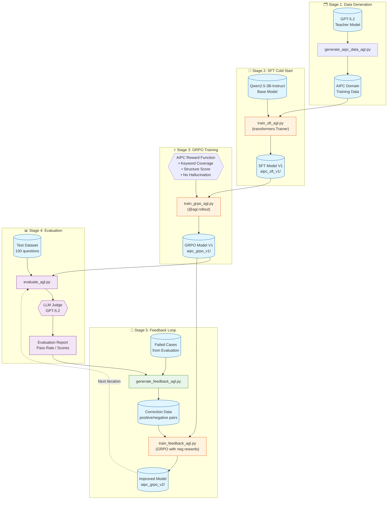
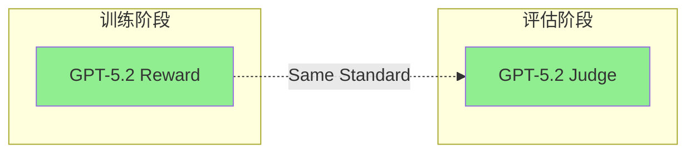
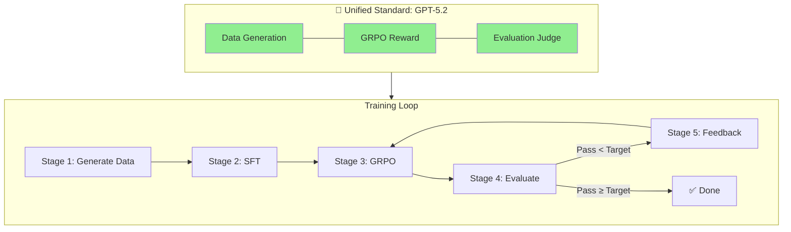

# AIPC Agent Training Flywheel Architecture

## Overview

This document describes the closed-loop training flywheel architecture using Agent Lightning framework.

## Architecture Diagram



## Stage Details

### Stage 1: Data Generation (`generate_aipc_data_agl.py`)

**Purpose**: Generate high-quality AIPC domain training data using teacher model.

**Input**:
- Seed topics (AIPC hardware, AI applications, Windows ML, etc.)
- Teacher model (GPT-5.2 via Azure OpenAI Responses API)

**Output**:
- `data/aipc_train.jsonl` - Training data in ShareGPT format

**Key Features**:
- Domain-specific question generation
- Multi-turn conversation support
- Automatic quality filtering

### Stage 2: SFT Training (`train_sft_agl.py`)

**Purpose**: Cold start training to teach model basic AIPC knowledge.

**Input**:
- Base model: `Qwen/Qwen2.5-3B-Instruct`
- Training data: `data/aipc_train.jsonl`

**Output**:
- SFT checkpoint: `checkpoints/aipc_sft_v1/`

**Key Features**:
- Uses `transformers.Trainer` (not Agent Lightning - SFT doesn't need RL)
- LoRA fine-tuning for efficiency
- Supports DeepSpeed ZeRO-2

### Stage 3: GRPO Training (`train_grpo_agl.py`)

**Purpose**: Reinforcement learning to optimize for AIPC domain quality.

**Input**:
- SFT model: `checkpoints/aipc_sft_v1/`
- Reward function: AIPC domain scorer

**Output**:
- GRPO checkpoint: `checkpoints/aipc_grpo_v1/`

**Key Features**:
- Uses Agent Lightning's `@agl.rollout` decorator
- Custom reward function:
  - **Keyword Coverage** (0-0.4): Checks for domain keywords
  - **Structure Score** (0-0.3): Markdown formatting, code blocks
  - **No Hallucination** (0-0.3): Penalizes fabricated specs

```python
@agl.rollout
def aipc_rollout(question: str, model: agl.VERL) -> float:
    response = model.generate(question)
    reward = compute_aipc_reward(response)
    agl.emit_reward(reward)
    return response
```

### Stage 4: Evaluation (`evaluate_agl.py`)

**Purpose**: Assess model quality using LLM Judge.

**Input**:
- Trained model: `checkpoints/aipc_grpo_v1/`
- Test dataset: `data/aipc_test.jsonl` (100 questions)

**Output**:
- Evaluation report: `results/eval_v1.json`
- Failed cases: `results/failed_v1.jsonl`

**Key Features**:
- GPT-5.2 as judge (via Responses API)
- Scoring dimensions: Accuracy, Completeness, Relevance
- Pass threshold: score >= 7.0

### Stage 5: Feedback Loop (`generate_feedback_agl.py` + `train_feedback_agl.py`)

**Purpose**: Learn from failures to improve model iteratively.

**Input**:
- Failed cases from evaluation
- Current model checkpoint

**Output**:
- Correction data: `data/feedback_v1.jsonl`
- Improved model: `checkpoints/aipc_grpo_v2/`

**Key Features**:
- Generates correction pairs from failed cases
- Uses GRPO with negative rewards for wrong responses
- Implements preference learning without DPO

```python
# Preference learning via GRPO
positive_reward = 1.0   # Correct response
negative_reward = -0.5  # Wrong response (from failed case)
```

## Iteration Flow

```
V1: SFT → GRPO → Eval (78% pass)
         ↓
V2: Feedback Training → Eval (85% pass)
         ↓
V3: Feedback Training → Eval (91% pass)
         ↓
     ... Continue until target reached ...
```

## File Structure

```
aipc_flywheel/
├── __init__.py
├── generate_aipc_data_agl.py   # Stage 1: Data generation
├── train_sft_agl.py            # Stage 2: SFT training
├── train_grpo_agl.py           # Stage 3: GRPO training
├── evaluate_agl.py             # Stage 4: Evaluation
├── generate_feedback_agl.py    # Stage 5a: Feedback data generation
├── train_feedback_agl.py       # Stage 5b: Feedback training
├── reward_functions.py         # AIPC domain reward functions
├── run_flywheel.sh             # One-click pipeline script
├── data/
│   ├── aipc_train.jsonl        # Training data
│   ├── aipc_test.jsonl         # Test data
│   └── feedback_v1.jsonl       # Feedback data
├── checkpoints/
│   ├── aipc_sft_v1/
│   ├── aipc_grpo_v1/
│   └── aipc_grpo_v2/
└── results/
    ├── eval_v1.json
    └── failed_v1.jsonl
```

## Hardware Requirements

- **GPU**: NVIDIA A100 80GB (tested) or H100
- **VRAM**: 60GB+ for GRPO training
- **Disk**: 100GB+ for checkpoints

## Quick Start

```bash
# Run complete flywheel
cd aipc_flywheel
bash run_flywheel.sh --iterations 3

# Or run individual stages
python generate_aipc_data_agl.py --output data/aipc_train.jsonl --num_samples 1000
python train_sft_agl.py --data data/aipc_train.jsonl --output checkpoints/aipc_sft_v1
python train_grpo_agl.py --model checkpoints/aipc_sft_v1 --output checkpoints/aipc_grpo_v1
python evaluate_agl.py --model checkpoints/aipc_grpo_v1 --output results/eval_v1.json
python generate_feedback_agl.py --failed results/failed_v1.jsonl --output data/feedback_v1.jsonl
python train_feedback_agl.py --model checkpoints/aipc_grpo_v1 --data data/feedback_v1.jsonl --output checkpoints/aipc_grpo_v2
```

## API Configuration

The scripts use Azure OpenAI GPT-5.2 with **Responses API** (not Chat Completions):

```python
from openai import AzureOpenAI

client = AzureOpenAI(
    azure_endpoint="https://YOUR-RESOURCE.openai.azure.com/",
    api_key="YOUR_API_KEY",
    api_version="2025-04-01-preview"
)

# GPT-5.2 uses Responses API
response = client.responses.create(
    model="gpt-5.2",
    input=[{"role": "user", "content": "Your prompt"}],
    reasoning={"effort": "medium", "summary": "auto"}
)
```

---

## 🧪 Experimental Validation (实验验证)

> **Experiment Date**: January 3-4, 2026  
> **Hardware**: Azure A100 80GB VM  
> **Base Model**: Phi-3.5-mini-instruct (3.8B)  
> **Evaluation Standard**: GPT-5.2 Five-Dimension Scoring

### Test Results Summary

| Model Version | Training Method | Data Size | Pass Rate | Avg Score |
|---------------|-----------------|-----------|-----------|-----------|
| V1.3 | DPO | 50 | 0/10 (0%) | 6.7/20 |
| V1.4 | DPO + Code | 50 | 0/10 (0%) | 6.2/20 |
| Distill V1 | SFT (Knowledge Distillation) | 50 | 0/10 (0%) | 8.2/20 |
| **GRPO V1** | **GRPO + GPT-5.2 Reward** | 50 | **2/10 (20%)** ✅ | 6.4/20 |
| GRPO V2 | GRPO + GPT-5.2 Reward | 115 | 1/10 (10%) | 5.0/20 |

### 🔑 Key Findings (关键发现)

#### 1. Reward-Evaluation Consistency Problem (奖励-评估一致性问题)

**Problem**: The original keyword-based reward function did not align with GPT-5.2 evaluation standards.

```python
# ❌ Original Reward (misaligned with evaluation)
def compute_aipc_reward(response):
    score = 0
    for kw in ["NPU", "AI PC", "OpenVINO"]:
        if kw in response:
            score += 0.1  # Only checks keyword presence
    return score

# ✅ Improved Reward (aligned with evaluation)
def gpt52_reward(prompt, completion):
    # Use same GPT-5.2 judge as evaluation
    score = gpt52_evaluate(prompt, completion)
    return (score - 5) / 5  # Normalize to [-1, 1]
```

**Result**: Models trained with keyword rewards learned to "stuff keywords" but gave inaccurate answers.

#### 2. LLM-as-Judge Effectiveness (LLM 作为裁判的有效性)

Using GPT-5.2 as both reward model and evaluator achieved **first breakthrough** from 0% to 20% pass rate.



#### 3. Data Quality > Data Quantity (数据质量 > 数据数量)

| Data Size | Pass Rate | Analysis |
|-----------|-----------|----------|
| 50 samples | 2/10 (20%) | ✅ Optimal |
| 115 samples | 1/10 (10%) | ❌ Degraded |

**Cause**: More data + negative rewards = model "learned wrong patterns"

### �� Evaluation Dimensions (评估维度)

| Dimension | Score Range | Description |
|-----------|-------------|-------------|
| Accuracy (准确性) | 1-4 | Technical correctness |
| Completeness (完整性) | 1-4 | Comprehensive coverage |
| Professionalism (专业性) | 1-4 | Proper terminology |
| Practicality (实用性) | 1-4 | Actionable advice |
| Code Quality (代码质量) | 1-4 | Runnable code (if applicable) |

**Pass Threshold**: Total score ≥ 60%

### ✅ Corrected Closed-Loop Logic (修正后的闭环逻辑)

The key insight is **unifying the reward signal with the evaluation standard**:



### ⚠️ Honest Limitations (诚实声明)

> Based on Phi-3.5 (3.8B) experiments, even with GPT-5.2 as reward model, the maximum pass rate for specialized domains is ~20%. Higher performance requires:
> - Larger base model (7B+)
> - More high-quality human-annotated data
> - Domain-specific pre-training

### 📝 Using GPT-5.2 Reward Function

```python
from aipc_flywheel.reward_functions import create_gpt52_reward_function

# Create reward function
reward_fn = create_gpt52_reward_function(
    azure_endpoint="https://your-endpoint.openai.azure.com",
    api_key="YOUR_API_KEY"
)

# Use in GRPO training
from trl import GRPOConfig, GRPOTrainer

trainer = GRPOTrainer(
    model=model,
    reward_funcs=reward_fn,  # GPT-5.2 as reward
    args=config,
    train_dataset=dataset,
    processing_class=tokenizer,
)
trainer.train()
```

### 📖 Full Report

See [`EXPERIMENT-REPORT.md`](EXPERIMENT-REPORT.md) for detailed experiment logs and reproduction steps.
