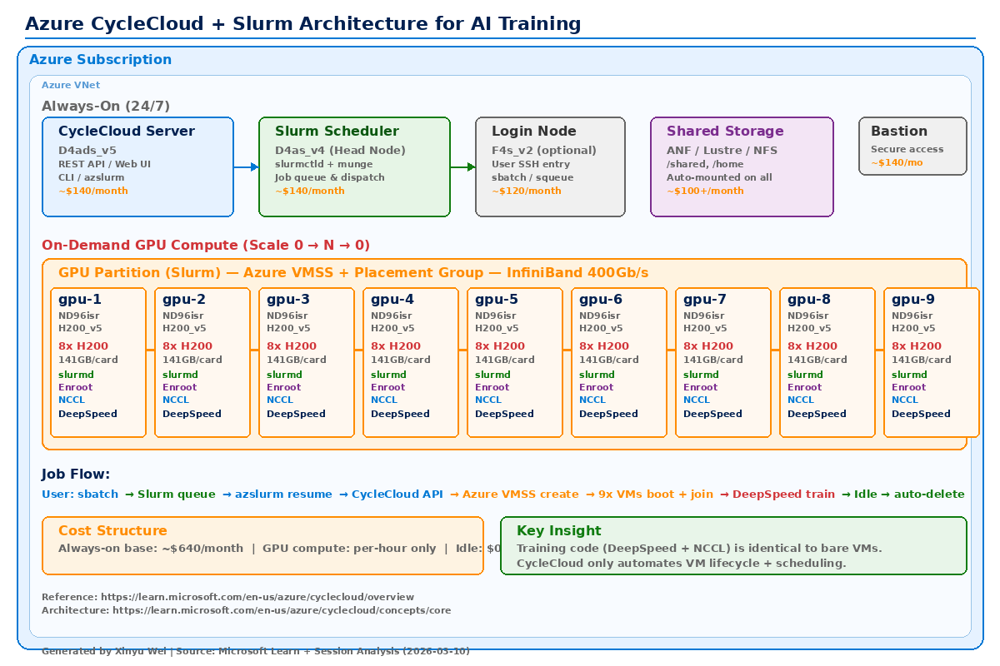
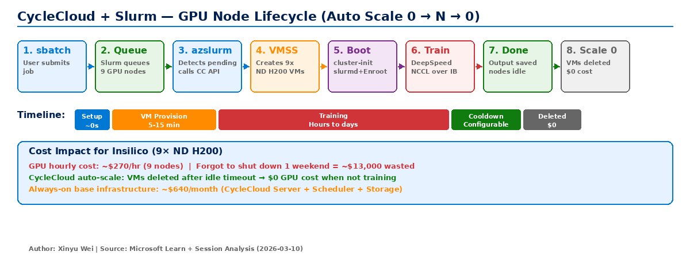
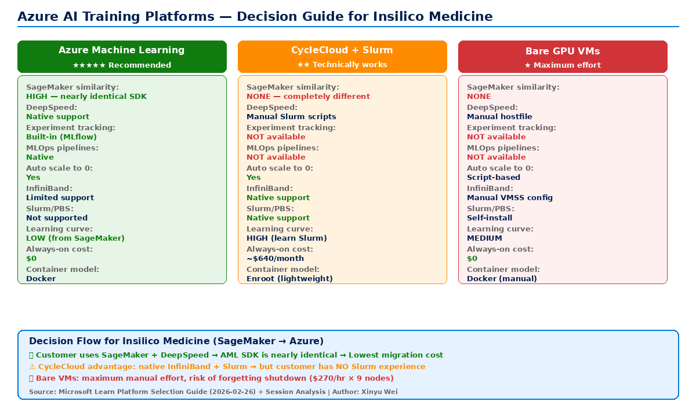

# Azure CycleCloud Deep Dive — Architecture, Slurm Integration, and AI Training Suitability Analysis

> **Customer**: Insilico Medicine (AI Drug Discovery)
> **Scenario**: 9× ND H200 v5 (72 GPUs), DeepSpeed distributed training
> **Last Updated**: 2026-03-11
> **Author**: Xinyu Wei (Senior System Engineer, Microsoft)

---

## Table of Contents

1. [What is Azure CycleCloud](#1-what-is-azure-cyclecloud)
2. [CycleCloud Architecture](#2-cyclecloud-architecture)
3. [Slurm Integration Deep Dive](#3-slurm-integration-deep-dive)
4. [CycleCloud Workspace for Slurm (CCWS)](#4-cyclecloud-workspace-for-slurm-ccws)
5. [Slurm vs Kubernetes — Not the Same Layer](#5-slurm-vs-kubernetes--not-the-same-layer)
6. [Job Execution Model — Process vs Container](#6-job-execution-model--process-vs-container)
7. [GPU Partition and Supported VM SKUs](#7-gpu-partition-and-supported-vm-skus)
8. [CycleCloud for AI Training — Can It Work?](#8-cyclecloud-for-ai-training--can-it-work)
9. [CycleCloud vs Bare GPU VMs vs AML — Comparison](#9-cyclecloud-vs-bare-gpu-vms-vs-aml--comparison)
10. [Container Image Compatibility](#10-container-image-compatibility)
11. [CycleCloud + DeepSpeed GitHub Ecosystem](#11-cyclecloud--deepspeed-github-ecosystem)
12. [Information Sources](#12-information-sources)

---

## 1. What is Azure CycleCloud

Azure CycleCloud is an **HPC cluster orchestration and management application** on Azure. It is **not a PaaS service** — it is installed on a Linux VM in your subscription and manages compute clusters through Azure APIs.

| Capability | Description |
|------------|-------------|
| Cluster lifecycle management | One-click create, scale, monitor, terminate HPC clusters |
| Scheduler support | Slurm, PBS Pro, Grid Engine, HTCondor, LSF |
| Autoscaling | Scale compute nodes from 0 to N based on job queue, back to 0 when idle |
| InfiniBand/RDMA | Native support for IB-enabled VM placement groups |
| Container support | Pre-installed PMIx v4 + Pyxis + Enroot (in CCWS) |
| Hybrid cloud bursting | Extend on-prem Slurm clusters to Azure |
| IaC templates | Declarative cluster definitions for repeatable deployments |
| Web UI + CLI + REST API | Full management interface |

**Key point**: CycleCloud is a **VM orchestrator with scheduler integration** — it creates/destroys Azure VMs. The actual compute happens on standard Azure VMs (ND/NC/HB series etc.).

### What CycleCloud Actually Does for AI Training — Only 3 Things

Strip away the HPC/Slurm complexity, and for a pure AI training customer, CycleCloud's value boils down to:

| # | What it does | What it replaces |
|:-:|-------------|------------------|
| 1 | **Create/destroy GPU VMs on demand** | You manually `az vmss create` / `deallocate` |
| 2 | **Slurm job queue** | You manually write hostfile and `ssh` into nodes |
| 3 | **InfiniBand placement** | You manually configure VMSS Placement Group |

Everything else (DeepSpeed, NCCL, training code, model checkpoints) — **identical to bare VMs**.

**One-liner**: CycleCloud = a fancy VM on/off switch + Slurm scheduler. It does NOT make training faster or better.

---

## 2. CycleCloud Architecture

### 2.1 Component Overview



> Official Microsoft architecture diagram: [CycleCloud Deployment](https://learn.microsoft.com/en-us/azure/cyclecloud/images/architecture-deployment.png) | [Core Concepts](https://learn.microsoft.com/en-us/azure/cyclecloud/images/concept-architecture-diagram.png)

```
CycleCloud Server (1 CPU VM, always-on)
├── REST API / Web UI / CLI
├── Calls Azure RM API to create/destroy VMs via VMSS
│
├── Slurm Scheduler (1 CPU VM, always-on)
│   ├── slurmctld (scheduler daemon)
│   ├── azslurm CLI (Azure-Slurm bridge)
│   └── munge (authentication)
│
├── Login Node (optional, 1 CPU VM, always-on)
│
├── Compute Nodes (on-demand, auto-scaled)
│   ├── ND H200 × 9 (72 GPUs) — example
│   ├── slurmd + Pyxis + Enroot
│   ├── NCCL + InfiniBand 400Gb/s
│   └── Shared storage auto-mounted
│
└── Shared Storage (ANF / Managed Lustre / NFS)
```

### 2.2 Always-On vs On-Demand Components

| Component | VM Type | Always-On |
|-----------|---------|:---------:|
| CycleCloud Server | D4ads_v5 (4 vCPU, 16GB) | Yes |
| Slurm Scheduler | D4as_v4 (4 vCPU, 16GB) | Yes |
| Login Node (optional) | F4s_v2 (4 vCPU, 8GB) | Yes |
| Bastion | Standard | Yes |
| Shared Storage (NFS/ANF) | — | Yes |
| **GPU Compute Nodes** | **ND H200** | **No — on-demand** |

### 2.3 Marketplace Products — Two Options

| | Azure CycleCloud | CycleCloud Workspace for Slurm |
|---|---|---|
| Type | Virtual Machine | Azure Application |
| Deploys | Only 1 CycleCloud Server VM | Complete environment (Server + Scheduler + Login + VNet + Storage + Bastion) |
| Then | Manually create cluster, configure Slurm, networking, storage | Ready to use — submit jobs immediately |
| Effort | Days to fully configure | Minutes (under 3 min deployment) |
| Scheduler flexibility | Slurm/PBS/LSF/GridEngine | Slurm only |
| Container support | Manual setup | Pre-installed PMIx + Pyxis + Enroot |

**Analogy**: Azure CycleCloud = **bare-bones apartment** (you furnish everything). CycleCloud Workspace for Slurm = **fully furnished** (move in and start working).

---

## 3. Slurm Integration Deep Dive

### 3.1 Slurm Scheduler Node (Head Node) — The Cluster Brain

The head node does NOT run training — it only schedules and dispatches.

| Responsibility | What it does |
|----------------|-------------|
| Receive jobs | Users `sbatch train.sh` submit here |
| Queue scheduling | Priority, fair-share across users |
| Resource allocation | Decide which job gets which GPU nodes |
| Node management | Track every compute node state (idle/busy/down) |
| Accounting | Record GPU-hours per user/project |

Key processes: `slurmctld` (scheduler) + `slurmdbd` (accounting, optional) + `munge` (auth)

### 3.2 Slurm Head Node vs K8s Master

| | Slurm Head Node | K8s Master Node |
|---|---|---|
| Core process | slurmctld | kube-apiserver + kube-scheduler + etcd |
| Schedules | Jobs (compute tasks) | Pods (containers) |
| CLI | `sbatch` / `squeue` / `scancel` | `kubectl apply` / `kubectl get` |
| Manages networking | No (IB is infra-level) | Yes (CNI, Service, Ingress) |
| Manages storage | No (NFS/Lustre pre-configured) | Yes (PV/PVC/StorageClass) |

Slurm head node ≈ K8s Master's **job scheduling subset**. K8s manages much more.

### 3.3 The azslurm Bridge — How CycleCloud Talks to Azure

```
User: sbatch train.sh
  → slurmctld: "Need 9 GPU nodes, 0 available" → triggers ResumeProgram
    → azslurm resume: reads Slurm queue, calculates needed VMs
      → CycleCloud Server: calls Azure RM API
        → Azure VMSS: creates 9× ND H200 in same Placement Group
          → 9 VMs boot → cluster-init → slurmd registers → join cluster
```

Slurm does NOT know about Azure. `azslurm` is the **translator**.

### 3.4 One Partition = One NodeArray = One VMSS

All nodes in a partition are in the same VMSS + Placement Group → InfiniBand interconnect guaranteed.

### 3.5 Node Lifecycle (8 Steps)



1. User `sbatch` submits job requesting 9 GPU nodes
2. Slurm queues job — not enough nodes available
3. azslurm detects pending → calls CycleCloud API → creates 9 VMSS instances
4. VMs boot → cluster-init installs slurmd + Pyxis/Enroot + mounts storage + configures IB
5. Nodes register: `down` → `idle` → `alloc`
6. `srun` executes training (optionally in Enroot container) — NCCL over IB
7. Training completes → output to shared storage → nodes go `idle`
8. azslurm detects idle timeout → CycleCloud deletes VMs → **zero cost when idle**

### 3.6 Slurm Auto-Injects DeepSpeed Environment Variables

| Variable | Bare VM (manual) | CycleCloud + Slurm |
|----------|------------------|---------------------|
| MASTER_ADDR | Set manually | Auto from `SLURM_NODELIST` |
| WORLD_SIZE | Calculate: 9×8=72 | `SLURM_NTASKS` = 72 |
| RANK | DeepSpeed launcher | `SLURM_PROCID` auto |
| LOCAL_RANK | DeepSpeed launcher | `SLURM_LOCALID` auto |
| NODE_RANK | Set manually | `SLURM_NODEID` auto |
| hostfile | Write manually | Not needed — `srun` handles it |

---

## 4. CycleCloud Workspace for Slurm (CCWS)

### 4.1 Configuration Tabs (Marketplace GUI)

| Tab | Configures |
|-----|-----------|
| Basics | Subscription, Region, RG, CycleCloud VM size, Admin user |
| File-system | NFS/ANF/Lustre shared storage |
| Networking | VNet, Subnet, Bastion |
| Slurm Settings | Slurm version, job accounting |
| Scheduler | Head node VM size (CPU) |
| Login Node | Login node VM size/count |
| **Partitions** | HTC / HPC / GPU partition definitions |
| Other Settings | Branch name, SSH port |

### 4.2 Default Three Partitions

| Partition | VM Type | Purpose | Needed for AI Training? |
|-----------|---------|---------|:-----------------------:|
| HTC | F2s_v2 (2 vCPU, no GPU) | High-throughput small tasks | **No — set Max=0** |
| HPC | HB120rs_v3 (120 vCPU, no GPU) | CPU-intensive MPI/CFD | **No — set Max=0** |
| **GPU** | ND96asr_v4 (8×A100) | GPU distributed training | **Yes — only this** |

For pure AI training: keep only GPU partition.

**Why three partitions by default?** Because CCWS is a **generic HPC template** — it assumes you might run three types of workloads simultaneously:

```
Traditional HPC user's cluster:
├── HTC → run 10,000 independent GROMACS small tasks
├── HPC → run 128-node OpenFOAM MPI simulation
└── GPU → run AI model training

Pure AI training cluster (Insilico):
├── HTC → delete or Max=0
├── HPC → delete or Max=0
└── GPU → this is all you need (change to ND H200, Max=9)
```

This is another sign of **over-engineering for pure AI users** — AML doesn't have this HPC baggage.

### 4.3 Auto-Deployed Resources (under 3 minutes)

VNet, Bastion, Storage Account, NFS, Key Vault, Monitoring, CycleCloud Server + Slurm cluster — all automated.

---

## 5. Slurm vs Kubernetes — Not the Same Layer

| Dimension | Slurm | Kubernetes |
|-----------|-------|-----------|
| Design purpose | HPC job scheduler | Container orchestration platform |
| Core abstraction | Job — "run a compute task" | Pod — "run a service/process" |
| Scheduling granularity | Node-level | Container-level |
| Communication model | Tightly coupled — MPI/NCCL native | Loosely coupled — API/network |
| Networking | InfiniBand/RDMA native | TCP/IP primary, IB needs extra config |
| User persona | HPC researchers (`sbatch`) | Cloud-native engineers (`kubectl`) |

Overlap: Both can schedule GPU jobs. But Slurm is **native to IB/RDMA** — advantage at 1000+ GPU scale.

---

## 6. Job Execution Model — Process vs Container

### 6.1 CycleCloud Default = Bare Process (not container)

**Two execution modes in one picture:**

```
CycleCloud + Slurm Job Execution
│
├── Default: Bare Process (runs directly on host OS)
│     sbatch → srun python train.py
│                    ↓
│           Host OS (Ubuntu)
│              ├── python (PID 12345)  ← directly on host
│              ├── GPU: /dev/nvidia* direct access
│              └── Network: InfiniBand host passthrough
│     Pros: zero overhead
│     Cons: CUDA/PyTorch must be pre-installed on every VM
│
└── Optional: Enroot Container (lightweight, NOT Docker)
      sbatch → srun --container-image=nvcr.io#nvidia/pytorch:24.01
                    ↓
           Host OS (Ubuntu)
              └── Enroot container (no daemon, user-space)
                    ├── python + CUDA + PyTorch inside container
                    ├── GPU: passthrough (same as bare process)
                    └── Network: passthrough (same as bare process)
      Pros: environment consistency (NGC image has everything)
      Cons: near-zero overhead (NOT the Docker overhead you'd expect)
```

**Key distinction from K8s/Docker**: Enroot is NOT Docker. No daemon, no network virtualization, no cgroup overhead. GPU and InfiniBand are always host-passthrough.

| | Bare Process (default) | Enroot Container (optional) |
|---|---|---|
| How | `srun python train.py` | `srun --container-image=nvcr.io#nvidia/pytorch:24.01 ...` |
| Isolation | None — runs on host OS | Filesystem isolation only |
| GPU access | Direct `/dev/nvidia*` | Direct (passthrough) |
| Network | Host IB direct | Host IB direct |
| Performance | Zero overhead | Near-zero overhead |

### 6.2 vs K8s/AML/SageMaker

| Platform | Runtime | Network |
|----------|---------|---------|
| CycleCloud default | Bare process | Host IB direct |
| CycleCloud + Pyxis | Enroot (no daemon) | Host IB direct |
| AML / SageMaker | Docker | Virtual network (some overhead) |
| AKS | containerd | CNI virtual network |

CycleCloud advantage: GPU and IB are **always host-passthrough** — no virtualization.

---

## 7. GPU Partition and Supported VM SKUs

CycleCloud does **not restrict** VM SKUs. Any Azure GPU VM can be used. But multi-node training **requires ND-series** (InfiniBand).

### ND-Series (Multi-Node, InfiniBand)

| VM SKU | GPU | VRAM/card | GPUs/VM | IB |
|--------|-----|-----------|:-------:|:--:|
| ND96isr_H200_v5 | H200 | 141GB HBM3e | 8 | 400Gb/s |
| ND96isr_H100_v5 | H100 | 80GB HBM3 | 8 | 400Gb/s |
| ND96amsr_A100_v4 | A100 | 80GB HBM2e | 8 | 200Gb/s |
| ND96asr_v4 | A100 | 40GB HBM2e | 8 | 200Gb/s |
| ND96isr_MI300X_v5 | MI300X | 192GB HBM3 | 8 | 400Gb/s |

### NC-Series (Single-Node, No InfiniBand)

| VM SKU | GPU | GPUs/VM | IB |
|--------|-----|:-------:|:--:|
| NC40ads_H100_v5 | H100 NVL | 1-2 | No |
| NC96ads_A100_v4 | A100 | 1-4 | No |
| NCasT4_v3 | T4 | 1-4 | No |

Multi-node training: Each ND GPU has a dedicated 400 Gb/s InfiniBand connection (3.2 Tb/s aggregate per VM), enabling efficient NCCL all-reduce at scale. NC without IB → 25Gbps Ethernet only — unusable for multi-node training.

---

## 8. CycleCloud for AI Training — Can It Work?

### 8.1 Yes — Industry Fact

Almost all large-scale LLM pre-training runs on Slurm (Meta LLaMA 3: 16K H100, DeepSeek V3: 2K H800). Azure CycleCloud + Slurm is technically viable.

### 8.2 CycleCloud + Slurm + DeepSpeed Job Script

```bash
#!/bin/bash
#SBATCH --partition=gpu
#SBATCH --nodes=9
#SBATCH --ntasks-per-node=8
#SBATCH --gpus-per-node=8
#SBATCH --exclusive

CONTAINER="myacr.azurecr.io#ai/training:latest"

srun --mpi=pmix \
     --container-image=${CONTAINER} \
     --container-mounts=/shared:/shared \
     deepspeed --num_gpus=8 \
         train.py --deepspeed ds_config.json
```

Training code (DeepSpeed + NCCL) is **identical** whether using CycleCloud, bare VMs, or AML.

### 8.3 Starting a 9-Node Training — Step-by-Step Comparison

**Bare VM approach (7 steps):**

```bash
# Step 1: Manually create 9 VMs
az vmss create --name gpu-cluster --instance-count 9 --vm-sku Standard_ND96isr_H200_v5 ...
# Step 2: Wait for all VMs to start (5-10 minutes)
# Step 3: Get each VM's IP
az vmss list-instances ...
# Step 4: Manually write hostfile
echo "10.0.0.4 slots=8" > hostfile && echo "10.0.0.5 slots=8" >> hostfile ...
# Step 5: Verify NFS mounts and IB on each node
ssh gpu-1 "ls /shared/data && ibstatus"
# Step 6: Launch training from first node
ssh gpu-1 "deepspeed --hostfile hostfile --num_gpus=8 --num_nodes=9 train.py"
# Step 7: REMEMBER to shut down after training
az vmss deallocate --name gpu-cluster ...
```

**CycleCloud approach (1 step):**

```bash
sbatch train.sh
# That's it. VMs created, hostfile generated, training runs, VMs auto-deleted.
```

### 8.4 CycleCloud Adds vs Bare VMs

| Dimension | Bare GPU VMs | CycleCloud + Slurm |
|-----------|-------------|---------------------|
| Spin up 9 H200 VMs | Manual | `sbatch` → auto-created |
| Shut down after training | Manual (risk if forgotten) | Auto-scale to 0 |
| IB Placement Group | Manual VMSS config | Automatic |
| MASTER_ADDR / hostfile | Manual | Slurm auto-injects |
| Shared storage mount | Mount each VM manually | Template auto-mount |
| Node health check | None | Built-in GPU/IB checks |
| Multi-user queue | None | Slurm fair-share |
| Learning curve | Zero | Must learn Slurm |

### 8.5 What CycleCloud Does NOT Provide

| Missing | AML Has It? |
|---------|:-----------:|
| Experiment tracking | Yes (MLflow) |
| MLOps pipelines | Yes |
| Model version management | Yes (Registry) |
| AML compute target | Cannot attach CycleCloud to AML |

---

## 9. CycleCloud vs Bare GPU VMs vs AML — Comparison



| Dimension | Bare GPU VMs | CycleCloud + Slurm | Azure Machine Learning |
|-----------|-------------|---------------------|----------------------|
| **Setup complexity** | Low (just VMs) | Medium (Slurm + CycleCloud) | Low (managed service) |
| **Autoscaling** | Manual VMSS | Automatic (Slurm queue-based) | Automatic (job-based) |
| **GPU idle cost risk** | High (manual shutdown) | Low (auto-scale to 0) | Low (managed compute) |
| **InfiniBand / RDMA** | Manual Placement Group | Native (partition = VMSS + PG) | Native |
| **Container support** | Docker / Podman | Enroot + Pyxis (zero overhead) | Docker |
| **Job scheduler** | None (manual hostfile) | Slurm (fair-share, priority, multi-user) | AML job queue |
| **Experiment tracking** | None | None (add MLflow separately) | MLflow built-in |
| **MLOps pipelines** | None | None | Yes (AML Pipelines) |
| **Multi-user isolation** | None | Slurm accounts + partitions | Workspace RBAC |
| **Learning curve** | Zero | Must learn Slurm | Must learn AML SDK |
| **Team familiarity** | Any Linux admin | HPC / Slurm users | Data Scientists / ML Engineers |
| **Best for** | Quick PoC, 1-2 nodes | Multi-user, large-scale, HPC teams | MLOps-centric teams |

**When to choose what:**

- **Bare VMs**: Quick experiments, single-user, 1-2 nodes, no scheduler needed
- **CycleCloud + Slurm**: Multi-user teams, 4+ nodes, HPC background, need Slurm ecosystem compatibility
- **AML**: ML teams wanting managed MLOps, experiment tracking, model registry, SageMaker-like experience

---

## 10. Container Image Compatibility

### 10.1 CycleCloud Fully Supports Container Images

A common question: *"We already have Docker images — can CycleCloud use them?"*

**Yes.** CycleCloud uses **Enroot** (via the Pyxis Slurm plugin) as its container runtime. Enroot is **fully compatible with Docker/OCI image format** — your existing Docker images work without any modification.

### 10.2 Supported Image Sources

| Image Source | Syntax | Example |
|-------------|--------|---------|
| Docker Hub | `docker.io#org/image:tag` | `docker.io#pytorch/pytorch:2.1.0` |
| NVIDIA NGC | `nvcr.io#nvidia/pytorch:tag` | `nvcr.io#nvidia/pytorch:24.01-py3` |
| Azure Container Registry | `myacr.azurecr.io#repo/image:tag` | `myacr.azurecr.io#ai/training:latest` |
| Local squashfs image | `/path/to/image.sqsh` | `/shared/images/train.sqsh` |

### 10.3 Why Enroot Instead of Docker?

| | Docker | Enroot |
|---|---|---|
| Daemon required | Yes (dockerd) | **No** — daemonless, user-space |
| Root required | Yes (or rootless mode) | **No** — runs as regular user |
| Network virtualization | Yes (bridge/overlay) | **No** — host network direct |
| GPU access | Via `--gpus` flag | **Direct** — host `/dev/nvidia*` passthrough |
| InfiniBand access | Requires `--privileged` or device mounts | **Direct** — host IB passthrough |
| MPI / NCCL performance | Slight overhead from network stack | **Zero overhead** — identical to bare process |
| Image compatibility | Docker/OCI native | **Docker/OCI compatible** (converts to squashfs) |

**Key insight**: Enroot is purpose-built for HPC/AI — it strips away everything Docker adds for microservices (daemon, network virtualization, cgroup isolation) and keeps only filesystem isolation. The result: container convenience with bare-metal performance.

### 10.4 Using Container Images in CycleCloud Slurm Jobs

```bash
#!/bin/bash
#SBATCH --partition=gpu
#SBATCH --nodes=9
#SBATCH --gpus-per-node=8

# Pull from ACR (or any Docker-compatible registry)
srun --container-image=myacr.azurecr.io#ai/training:latest \
     --container-mounts=/shared/data:/data,/shared/checkpoints:/checkpoints \
     python train.py --deepspeed ds_config.json
```

**Migration from Docker-based platforms (SageMaker, AML, etc.)**: Same image, same Dockerfile — just change the `srun --container-image=` reference. No re-packaging needed.

---

## 11. CycleCloud + DeepSpeed GitHub Ecosystem

Microsoft provides official GitHub repositories for running large-scale AI training on CycleCloud:

| Repository | Stars | Description |
|-----------|:-----:|------------|
| [Azure/cyclecloud-slurm](https://github.com/Azure/cyclecloud-slurm) | ~80 | Core CycleCloud + Slurm integration (templates, azslurm CLI, autoscaler) |
| [Azure/cyclecloud-pyxis](https://github.com/Azure/cyclecloud-pyxis) | — | Install Pyxis + Enroot on CycleCloud clusters (container support) |
| [Azure/ai-infrastructure-on-azure](https://github.com/Azure/ai-infrastructure-on-azure) | ~25 | Large-scale AI training examples (GPT-3-175B, MegatronLM, LLM Foundry) |
| [Azure/cyclecloud-llm](https://github.com/Azure/cyclecloud-llm) | — | CycleCloud + Slurm LLM training configuration (OPT-175B etc.) |

### Key Software Versions (as of 2026-03)

| Component | Version |
|-----------|---------|
| cyclecloud-slurm | 4.0.6 |
| Slurm | 25.05.5 |
| PMIx | 4.2.9 |
| CycleCloud | 8.8+ |

### Supported Frameworks

| Framework | Support | Notes |
|-----------|:-------:|-------|
| PyTorch DDP | ✅ | Native multi-GPU distributed training |
| DeepSpeed | ✅ | ZeRO, gradient accumulation, pipeline parallelism |
| Megatron-LM | ✅ | Tensor parallelism, pipeline parallelism |
| Horovod | ✅ | NCCL all-reduce based |

---

## 12. Information Sources

| Source | URL |
|--------|-----|
| Azure CycleCloud Documentation | https://learn.microsoft.com/en-us/azure/cyclecloud/ |
| CycleCloud Workspace for Slurm | Azure Marketplace — search "CycleCloud Workspace for Slurm" |
| ND H200 v5 VM Specs | https://learn.microsoft.com/en-us/azure/virtual-machines/sizes/gpu-accelerated/nd-h200-v5-series |
| ND H100 v5 VM Specs | https://learn.microsoft.com/en-us/azure/virtual-machines/nd-h100-v5-series |
| cyclecloud-slurm GitHub | https://github.com/Azure/cyclecloud-slurm |
| cyclecloud-pyxis GitHub | https://github.com/Azure/cyclecloud-pyxis |
| ai-infrastructure-on-azure GitHub | https://github.com/Azure/ai-infrastructure-on-azure |
| Slurm Documentation | https://slurm.schedmd.com/ |
| NVIDIA Enroot | https://github.com/NVIDIA/enroot |
| NVIDIA Pyxis | https://github.com/NVIDIA/pyxis |
