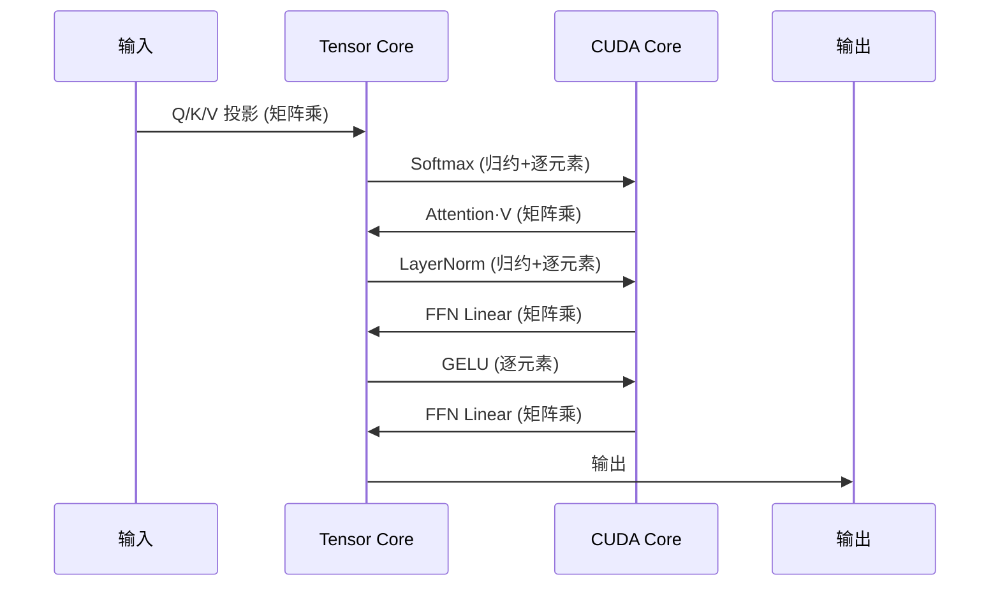

# Azure NC RTX Pro 6000 V6 BSE 完整性能测试报告

> NC RTX 6000 Pro Blackwell / NC H100 NVL / NC A100 PCIe / NV A10 全面对比

> 为保证公平性，每项测试均使用相同数据类型在所有四款 GPU 上进行。

---

## 目录

1. [测试环境](#测试环境)
2. [科学计算与数值精度](#科学计算与数值精度)
3. [网络配置测试](#1-网络配置测试)
4. [GPU P2P 互联测试](#2-gpu-p2p-互联测试)
5. [FP32 计算测试](#3-fp32-计算测试)
6. [LLM 推理测试](#4-llm-推理测试)
7. [SFT 全量微调测试](#5-sft-全量微调测试)
8. [FLUX 图像生成测试](#6-flux-图像生成测试)
9. [Blender 渲染测试](#7-blender-渲染测试)
10. [NVENC 视频编码测试](#8-nvenc-视频编码测试)
11. [部署指南](#9-部署指南)
12. [四款 GPU 综合对比](#四款-gpu-综合对比)
13. [仓库结构与快速开始](#-仓库结构)

---

## 测试环境

### 硬件配置

| 配置 | RTX 6000 Pro Blackwell | H100 NVL | A100 PCIe | A10 |
|--------|------------------------|----------|-----------|-----|
| **GPU 型号** | RTX Pro 6000 Blackwell DC-4-96Q | NVIDIA H100 NVL | NVIDIA A100 80GB PCIe | NVIDIA A10-24Q (vGPU) |
| **架构** | Blackwell (GB202) | Hopper (GH100) | Ampere (GA100) | Ampere (GA102) |
| **显存** | 96 GB GDDR7 | 94 GB HBM3 | 80 GB HBM2e | 24 GB GDDR6 |

### GPU 硬件单元说明

| 硬件单元 | 功能 | 典型应用 |
|----------|------|----------|
| **NVDEC** | 视频解码 (H.264/H.265/AV1 → 原始帧) | 视频播放、AI 视频分析预处理 |
| **NVENC** | 视频编码 (原始帧 → MP4) | 直播推流、视频导出、云游戏 |
| **NVJPG** | JPEG 硬件加速编解码 | 批量图片处理、训练数据预处理 |
| **Tensor Core** | AI 矩阵乘法加速 | LLM、Stable Diffusion、视频生成 |
| **RT Core** | 光线追踪计算 | 游戏光追、3D 渲染、CAD 预览 |
| **CUDA Core** | 通用并行计算 | GPU 计算的基础 |

### 硬件单元配置矩阵

| 硬件单元 | RTX 6000 Pro Blackwell | H100 NVL | A100 PCIe | A10 |
|----------|-----------------------|----------|-----------|-----|
| **NVDEC** (解码器) | ✅ 4 个 (Gen6) | ✅ 7 个 | ✅ 5 个 | ✅ 2 个 |
| **NVENC** (编码器) | ✅ **4 个 (Gen9, AV1)** | ❌ **无** | ❌ **无** | ✅ 1 个 (Gen7) |
| **NVJPG** | ✅ 有 | ✅ 7 个 | ✅ 5 个 | ❌ 无 |
| **Tensor Core** | ✅ Gen5 | ✅ Gen4 | ✅ Gen3 | ✅ Gen3 |
| **RT Core** | ✅ **188 个 (Gen4)** | ❌ **无** | ❌ **无** | ✅ 72 个 (Gen2) |
| **NVLink** | ❌ 无 | ✅ 有 | ✅ 有 | ❌ 无 |

---

## 科学计算与数值精度

> **新增**：本节解释精度层级和执行单元 - 理解 Benchmark 结果的基础知识。

### 精度快速参考 (FP64/FP32/TF32/BF16/FP16/FP8/FP4)

#### CUDA Core vs Tensor Core 精度对比

| 精度 | 执行单元 | 主要用途 | RTX 6000 性能 |
|---|---|---|---|
| **FP64** | CUDA Core (FP64 ALU) | HPC 科学计算 (双精度) | ~2 TFLOPS |
| **FP32** | CUDA Core (FP32 ALU) | 传统渲染、标量运算、游戏 | **125 TFLOPS** |
| **TF32** | Tensor Core | AI 训练 (透明 FP32 API 优化) | ~500 TFLOPS |
| **BF16/FP16** | Tensor Core | AI 训练/推理混合精度 | ~1000 TFLOPS |
| **FP8** | Tensor Core | AI 推理优化 | ~2000 TFLOPS |
| **NVFP4** | Tensor Core (Gen5) | AI 推理极致优化 | **4000 TOPS** |

> **关键理解**：
> - FP64 和 FP32 是**物理上分离的 ALU 单元** (数据中心: FP64:FP32 = 1:2，RTX: 1:64)
> - TF32/BF16/FP16/FP8/NVFP4 **共享同一 Tensor Core 硬件**，只是精度配置不同

### TF32 透明优化

> **一句话总结**：TF32 不是一种数据类型，而是 Tensor Core 的"隐身加速模式" — 你写 FP32，硬件悄悄用 TF32 计算，快 8-10 倍，精度损失 <0.1%。

**工作原理**：
```
torch.float32 → Ampere+ 自动截断为 TF32 (19-bit) 进行乘法 → 结果返回 FP32
```

| 格式 | 位数 | 说明 |
|--------|------|-------|
| FP32 | 1+8+23=32 | 用户 API、存储、累加精度 |
| TF32 | 1+8+10=19 | Tensor Core 乘法瞬时 (与 FP32 相同指数，截断尾数) |

**PyTorch 默认启用** (Ampere+)：
```python
torch.backends.cuda.matmul.allow_tf32  # 默认 True
torch.backends.cudnn.allow_tf32        # 默认 True
```

### CUDA Core vs Tensor Core：谁计算什么



**简单规则**：
- **矩阵乘法 → Tensor Core** (Linear, Conv, Attention QK 和 V 乘法)
- **其他运算 → CUDA Core** (激活函数、归一化、Softmax)

| 运算类型 | 执行单元 | 示例 |
|----------------|----------------|----------|
| **矩阵乘法** | Tensor Core | `torch.mm`、`torch.bmm`、`nn.Linear`、`nn.Conv2d` |
| **逐元素运算** | CUDA Core | `torch.add`、`torch.mul`、`torch.exp`、激活函数 |
| **归约运算** | CUDA Core | `torch.sum`、`torch.mean`、`softmax` |
| **内存操作** | CUDA Core | `torch.cat`、`torch.reshape`、索引 |

> **常见误解**："BF16 训练全程使用 Tensor Core"
> 
> **事实**：即使在 BF16 训练中，只有约 40-60% 的计算时间是 Tensor Core（矩阵乘法），其余是 CUDA Core（逐元素、归约）。


### GPU 性能速查表

| 场景 | 关键指标 | RTX 6000 | H100 NVL | 胜者 |
|------|----------|----------|----------|------|
| **AI 推理/训练** | Tensor Core (BF16) | ~504 TFLOPS | **~836 TFLOPS** | H100 |
| **AI 推理 (FP8)** | Tensor Core (FP8) | ~1,010 TFLOPS | **~1,671 TFLOPS** | H100 |
| **AI 推理 (FP4)** | Tensor Core (NVFP4) | **~2,000 TFLOPS** | ❌ 不支持 | RTX 6000 |
| **HPC 科学计算** | CUDA Core (FP64) | ~2 TFLOPS | **30 TFLOPS** | H100 |
| **3D 渲染** | FP32 + RT Core | **125T + 380T RT** | 60T + ❌ | RTX 6000 |

> **选型速查**：
> - AI 性能 → 看 **Tensor Core** (BF16/FP8/FP4)
> - HPC 性能 → 只看 **FP64** - H100 碾压 (30 vs 2 TFLOPS)
> - 渲染性能 → 看 **FP32 + RT Core** - RTX 6000 独占优势 (H100 没有 RT Core)

---

## 场景支持矩阵

### AI 场景

| 场景 | 所需硬件 | RTX 6000 | H100 | A100 | A10 |
|------|----------|----------|------|------|-----|
| LLM 训练 (>70B) | Tensor Core + NVLink + 大显存 | ❌ | ✅ | ✅ | ❌ |
| LLM 微调 (7B-70B) | Tensor Core + 大显存 | ✅ | ✅ | ✅ | ⚠️ |
| LLM 推理 | Tensor Core | ✅ | ✅ | ✅ | ⚠️ |
| AI 图像生成 (SD/FLUX) | Tensor Core | ✅ | ✅ | ✅ | ✅ |
| **AI 视频生成 (含 MP4 输出)** | Tensor Core + **NVENC** | ✅ | ❌ | ❌ | ✅ |

### 视频/媒体场景

| 场景 | 所需硬件 | RTX 6000 | H100 | A100 | A10 |
|------|----------|----------|------|------|-----|
| **视频转码** | NVDEC + **NVENC** | ✅ | ❌ | ❌ | ✅ |
| 仅视频解码 | NVDEC | ✅ | ✅ | ✅ | ✅ |
| **直播推流** | **NVENC** | ✅ | ❌ | ❌ | ✅ |
| 视频 AI 分析 | NVDEC + Tensor Core | ✅ | ✅ | ✅ | ✅ |

### 游戏/渲染场景

| 场景 | 所需硬件 | RTX 6000 | H100 | A100 | A10 |
|------|----------|----------|------|------|-----|
| **云游戏** | RT Core + NVENC | ✅ | ❌ | ❌ | ✅ |
| **3D 渲染 (光线追踪)** | **RT Core** | ✅ | ❌ | ❌ | ✅ |
| Blender 渲染 | RT Core | ✅ | ❌ | ❌ | ✅ |
| CAD 实时预览 | RT Core + CUDA | ✅ | ❌ | ❌ | ✅ |
| VDI (虚拟桌面) | NVENC + 图形 | ✅ | ❌ | ❌ | ✅ |

### 🎯 三大选型原则

1. **需要视频编码输出？** → 必须有 NVENC → **排除 H100 / A100**
2. **需要光线追踪？** → 必须有 RT Core → **排除 H100 / A100**
3. **纯 AI 计算？** → 检查 Tensor Core + 显存 + NVLink

---

## 1. 网络配置测试

### 测试结果

| 项目 | Standard_NC256ds_xl_RTXPRO6000BSE_v6 |
|------|------------------|
| **网卡型号** | Microsoft Azure Network Adapter (MANA) |
| **Azure 带宽限制** | **100 Gbps** |
| **实测带宽 (单流)** | 30 Gbps |
| **实测带宽 (16 流)** | **50 Gbps** |
| **RDMA/RoCE** | ❌ 无 |
| **InfiniBand** | ❌ 无 |

### 结论

- RTX 6000 VM 使用 Azure MANA 以太网，最高 100 Gbps
- 不支持 RDMA/InfiniBand，不适合多节点 GPU 通信密集型训练

---

## 2. GPU P2P 互联测试

### 测试结果

| 项目 | Standard_NC256ds_xl_RTXPRO6000BSE_v6 |
|------|---------------|
| `nvidia-smi topo -p2p` | OK (硬件层面支持) |
| **PyTorch can_device_access_peer()** | **False** (仍可达到 ~43 GB/s) |
| **GPU0 → GPU1 带宽** | **41.26 GB/s** |
| **GPU1 → GPU0 带宽** | **44.46 GB/s** |
| **NCCL AllReduce** | **~43.5 GB/s** |

### P2P 对比

| GPU 配置 | P2P 带宽 | 说明 |
|----------|----------|------|
| **RTX 6000** | ~43 GB/s | PCIe Gen5 |
| **H100 NVL** | ~450 GB/s | NVLink 4.0 直连 |
| **A100 PCIe** | ~25 GB/s | PCIe Gen4 |

---

## 3. FP32 计算测试

### 测试结果

| 指标 | RTX 6000 Pro Blackwell |
|------|-------------------------|
| **理论 FP32** | 116.95 TFLOPS |
| **实测峰值** | **109.20 TFLOPS** |
| **效率** | **93.4%** |
| **SM 数量** | 188 |
| **CUDA Cores** | 24,064 |

---

## 4. LLM 推理测试

### 测试配置

| 参数 | 值 |
|------|-----|
| **模型** | microsoft/Phi-3.5-mini-instruct (3.8B) |
| **推理引擎** | vLLM |
| **测试工具** | guidellm |

### 测试结果

| GPU | 输出 Tokens/s | 相对性能 |
|-----|-----------------|---------------------|
| **H100 NVL** | **3083.6** | **100%** |
| **RTX 6000** | **2835.4** | **92%** |
| **A100 PCIe** | **2119.6** | **69%** |
| **A10** | **563.1** | **18%** |

### 4.1 NVFP4 量化 - Blackwell 专属

> **Blackwell 专属特性**：NVFP4 (4 位浮点) 需要 SM100/SM120 原生 FP4 Tensor Core
> - **显存节省**：模型大小比 FP8 小约 35% (14B 模型 9.9GB vs 15.3GB)

#### 测试配置

| 参数 | 值 |
|-----------|-------|
| **模型** | Qwen3-14B-NVFP4 vs Qwen3-14B-FP8 (本地预量化) |
| **量化** | NVFP4 W4A4 (compressed-tensors) |
| **框架** | vLLM 0.12.0 (原生 CUTLASS NVFP4 kernel) |
| **负载** | 200 prompts, 512 输入 tokens, 128 输出 tokens |

#### 测试结果

| 精度 | 模型 | 输入 Tokens | 输出 Tokens | 时间 | 输出 TPS |
|-----------|-------|-------------:|-------------:|-----:|----------:|
| **NVFP4 (W4A4)** | Qwen3-14B-NVFP4 | 102,400 | 25,600 | 9.22s | **2,777 tok/s** |
| **FP8 (W8A8)** | Qwen3-14B-FP8 | 102,400 | 25,600 | 12.75s | **2,009 tok/s** |

```
NVFP4 vs FP8 输出吞吐量 (Qwen3-14B, RTX PRO 6000 Blackwell)
══════════════════════════════════════════════════════════════════
NVFP4 (W4A4)    ██████████████████████████████████████████  2,777 tok/s (+38%)
FP8 (W8A8)      ██████████████████████████████              2,009 tok/s (基线)
══════════════════════════════════════════════════════════════════
```

#### 关键指标对比

| 指标 | NVFP4 (W4A4) | FP8 (W8A8) | 差异 |
|--------|--------------|------------|------------|
| **输出 TPS** | **2,777** | 2,009 | **+38%** |
| **模型大小** | **9.9 GB** | 15.3 GB | **-35%** |
| **可用 KV Cache** | 65.5 GiB | 60.1 GiB | +9% |
| **推理时间** | **9.22s** | 12.75s | **-28%** |

#### NVFP4 已知问题 ⚠️

| 问题 | 原因 | 解决方案 |
|-------|-------|----------|
| NVFP4 模型加载为 BF16 | SGLang 0.5.x 不识别 NVFP4 格式 | 使用 vLLM |
| vLLM 0.13.0 显示 "platform does not support cutlass NVFP4" | vLLM 0.13.0 移除了 SM120 NVFP4 支持 | **降级到 vLLM 0.12.0** |
| FlashInfer 0.5.3 没有 fp4 模块 | 版本太旧 | 编译 FlashInfer 0.6.0rc2 |

#### NVFP4 环境要求

```bash
# 必须使用 vLLM 0.12.0 (0.13.0 不支持 SM120 NVFP4)
pip install vllm==0.12.0

# 验证 NVFP4 支持
python -c "from vllm._custom_ops import cutlass_scaled_mm_supports_fp4; print(f'NVFP4 support: {cutlass_scaled_mm_supports_fp4(120)}')"
# 预期输出: NVFP4 support: True
```

> 💡 **建议**：在 RTX PRO 6000 Blackwell 上，优先使用 NVFP4 量化模型，比 FP8 **快 38%**。

### 4.2 张量并行 (TP=1 vs TP=2) Benchmark

> ⚠️ **RTX PRO 6000 双卡**：测试 TP=2 何时优于 TP=1

#### 小模型结果 (Qwen3-14B-FP8)

| 配置 | 输出吞吐量 | TTFT | TPOT |
|---------------|------------------:|-----:|-----:|
| **TP=1** | **276.02 tok/s** | 1036 ms | 49.40 ms |
| **TP=2** | 266.19 tok/s | 1252 ms | 52.16 ms |
| **差异** | **-3.6%** | 慢 21% | 慢 5.6% |

> ⚠️ **14B 模型太小，TP=2 无收益** - GPU 间通信开销超过了并行收益。

#### 大模型结果 (Qwen2.5-VL-72B-FP8)

| 配置 | 输出吞吐量 | TTFT | TPOT |
|---------------|------------------:|-----:|-----:|
| **TP=1** | 232.02 tok/s | 1695 ms | 62.57 ms |
| **TP=2** | **294.77 tok/s** | 1801 ms | 47.42 ms |
| **差异** | **+27.0%** | 慢 6.3% | **快 24.2%** |

```
TP=1 vs TP=2 输出吞吐量对比
══════════════════════════════════════════════════════════════════
Qwen3-14B (小模型 - TP 开销占主导)
  TP=1    ███████████████████████████████████████████  276.02 tok/s (基线)
  TP=2    █████████████████████████████████████████▌   266.19 tok/s (-3.6%)

Qwen2.5-VL-72B (大模型 - TP 收益显现)
  TP=1    ███████████████████████████████████████      232.02 tok/s (基线)
  TP=2    ███████████████████████████████████████████████████  294.77 tok/s (+27%)
══════════════════════════════════════════════════════════════════
```

#### TP 配置建议

| 模型大小 | 推荐配置 | 原因 |
|------------|-------------------|--------|
| **<30B 参数** | **TP=1** | 通信开销 > 并行收益 |
| **30B-70B 参数** | 两者都测试 | 取决于具体模型架构 |
| **>70B 参数** | **TP=2** | 25-35% 吞吐量提升 |

> 💡 **经验法则**：只有当单卡装不下模型，或模型足够大 (>70B) 能从并行计算中获益时，才使用 TP=2。

### 4.3 SGLang BF16/FP8 三卡对比 (200 并发)

> 测试日期: 2025-12 | 框架: SGLang 0.5.6.post2 + FlashInfer 0.5.3

#### 测试结果

| GPU | BF16 (tok/s) | FP8 (tok/s) | FP8 vs BF16 | FP8 实现 |
|-----|-------------:|------------:|:-----------:|:------------------:|
| **H100 NVL 96GB** | 2,197 | 2,681 | **+22%** | 原生 FP8 Tensor Core |
| **RTX PRO 6000 96GB** | 1,579 | 2,353 | **+49%** | 原生 FP8 Tensor Core |
| **A100 80GB PCIe** | 1,196 | - | - | Marlin 回退 |

> ⚠️ **A100 说明**：A100 没有原生 FP8 Tensor Core，需要 Marlin kernel 回退。

#### SGLang 已知问题 ⚠️

| 问题 | 原因 | 解决方案 |
|-------|-------|----------|
| **3 倍吞吐差异** | `--random-range-ratio` 默认 1.0 (随机长度) | 基准测试使用 **0.0** (固定长度) |
| **运行时量化 OOM** | `--quantization fp8` 启动时 OOM | 必须使用**预量化 FP8 模型** |
| **FlashInfer 版本** | v0.2.0 比 FA2 慢 1.5 倍 | 使用 **v0.5.3+** |

---

## 5. SFT 全量微调测试

### 测试配置

| 参数 | 值 |
|------|-----|
| **模型** | Qwen/Qwen3-8B-Base (8.19B 参数) |
| **训练类型** | 全量微调 |
| **精度** | BF16 |

### 测试结果

| GPU | 训练时间 | 速度 (s/step) | vs H100 |
|-----|---------|--------------|-----------|
| **H100 NVL** | **19.74 min** | **11.84** | **100%** |
| **RTX 6000** | 25.14 min | 15.09 | 78.5% |
| **A100 PCIe** | 36.98 min | 22.19 | 53.4% |

```
训练速度 (s/step, 越低越快)
════════════════════════════════════════════════════════════════
H100 NVL          ████████████ 11.84s (100%)
RTX 6000          ███████████████ 15.09s (78.5%)
A100 80GB         ███████████████████████ 22.19s (53.4%)
════════════════════════════════════════════════════════════════
```

---

## 6. FLUX 图像生成测试

### 测试配置

| 参数 | 值 |
|------|-----|
| **模型** | FLUX.1 schnell (12B 参数) |
| **分辨率** | 1024×1024 |
| **推理步数** | 4 步 |

### 测试结果

| GPU | 平均耗时 | 图片/分钟 | 相对性能 |
|-----|---------|------------|----------|
| **H100 NVL** | **1.25s** | **47.8** | **100%** |
| **RTX 6000** | **1.42s** | **42.3** | **88%** |
| **A100 PCIe** | **2.16s** | **27.8** | **58%** |
| **A10 24GB** | ❌ **OOM** | - | - |

> ⚠️ A10 无法运行 FLUX.1 - 需要约 34GB 显存，A10 只有 24GB

---

## 7. Blender 渲染测试

### 测试结果

| GPU | **纯渲染时间** | 相对性能 |
|-----|---------------|--------|
| **RTX 6000** | **~2.15s** | **3.76x** ✅ |
| **A10** | **~8.08s** | 1.00x (基线) |

> **注意**：H100/A100 没有 RT Core，不适合光线追踪渲染

---

## 8. NVENC 视频编码测试

### 单流测试结果 (H.264)

| 预设 | RTX 6000 | A10 | 胜者 |
|--------|----------|-----|-----|
| **P1 (最快)** | 167 fps | 197 fps | A10 +18% |
| **P4 (平衡)** | **129 fps** | 97 fps | **RTX 6000 +33%** ✅ |
| **P7 (高质量)** | **87 fps** | 60 fps | **RTX 6000 +45%** ✅ |

### 多流并行测试

| 并行流数 | RTX 6000 | A10 | 比例 |
|---------|----------|-----|------|
| 1 流 | 98 fps | 87 fps | 1.13x |
| 4 流 | **313 fps** | 87 fps* | **3.6x** |
| 12 流 | **348 fps** | 87 fps* | **4.0x** |

> *A10 vGPU 模式只支持单流并行
> **注意**：H100/A100 没有 NVENC，无法进行此测试

---

## 9. 部署指南

### Azure vGPU 驱动安装

**关键**：必须使用 Azure 专用 vGPU 驱动

| 驱动版本 | 类型 | 结果 | 原因 |
|----------------|------|--------|--------|
| CUDA 12.6 (560.35.05) | 标准 CUDA | ❌ 失败 | PCI ID 不在支持列表 |
| Tesla 580.105.08 standard | 数据中心驱动 | ❌ 失败 | "vGPU not supported by open nvidia.ko" |
| Azure GRID 550.144.06 | 旧 vGPU | ❌ 失败 | Blackwell 太新 |
| **580.105.08-grid-azure** | **Azure vGPU** | ✅ **成功** | Azure 定制驱动 |

**安装**：
```bash
# 下载
wget https://download.microsoft.com/download/85beffdc-8361-4df4-a823-dcb1b230a7aa/NVIDIA-Linux-x86_64-580.105.08-grid-azure.run

# 安装
sudo sh NVIDIA-Linux-x86_64-580.105.08-grid-azure.run --silent --dkms

# 验证
nvidia-smi
```

### vGPU 监控方案

**问题**：标准 `nvidia-smi` 在 vGPU 环境下 GPU 利用率显示 N/A

| 指标 | 标准 nvidia-smi | 原因 |
|--------|---------------------|--------|
| GPU 利用率 | ❌ **N/A** | vGPU 隔离，无法访问物理 SM |
| 显存使用 | ✅ 正常 | 虚拟化透传 |
| 温度/功耗 | ❌ **N/A** | 物理指标被屏蔽 |

**解决方案**：使用 GPM (GPU Performance Metrics)

```bash
# 获取 SM 利用率和占用率
nvidia-smi dmon --gpm-metrics 2,3 --gpm-options m -c 4
```

| 指标 ID | 名称 | 描述 |
|-----------|------|-------------|
| 2 | SM Activity (smutil) | **SM 利用率** ✅ |
| 3 | SM Occupancy (smocc) | **SM 占用率** ✅ |

### 操作系统兼容性状态

| 操作系统 | NCv6 状态 | 说明 |
|----|-------------|-------|
| **Ubuntu 24.04** | ✅ 已验证可用 | 推荐 |
| **Rocky Linux 9.6** | ⚠️ 需要验证 | 检查 NVIDIA 驱动支持 |
| **Debian 12** | ⚠️ 未验证 | NV 驱动声称支持，未在 Azure 上测试 |

---

## 四款 GPU 综合对比

### 🏆 场景推荐

| 用例 | 推荐 GPU | 原因 |
|----------|----------|------|
| **3D 渲染/动画** | 🥇 **RTX 6000** | RT Core 碾压优势，H100/A100 不支持 |
| **AI 图像生成 (性能)** | 🥇 H100 > 🥈 RTX 6000 > 🥉 A100 | H100 最快，RTX 6000 比 A100 快 52% |
| **视频转码 (多流)** | 🥇 **RTX 6000** > 🥈 A10 | 4 倍吞吐优势，H100/A100 不支持 |
| **AI 视频生成 (含 MP4 输出)** | 🥇 **RTX 6000** > 🥈 A10 | H100/A100 没有 NVENC，无法输出视频 |
| **LLM 推理 (性能优先)** | 🥇 H100 > 🥈 RTX 6000 > 🥉 A100 | H100 最快，RTX 6000 达到 92% |
| **LLM 训练 (>70B)** | 🥇 H100 > 🥈 A100 | 需要 NVLink 多卡，RTX 6000 不支持 |
| **SFT 微调 (性能)** | 🥇 H100 > 🥈 RTX 6000 > 🥉 A100 | H100 最快，RTX 6000 比 A100 快 1.47 倍 |
| **云游戏/VDI** | 🥇 **RTX 6000** > 🥈 A10 | RT Core + NVENC，H100/A100 不支持 |
| **直播推流** | 🥇 **RTX 6000** > 🥈 A10 | NVENC Gen9 vs Gen7，H100/A100 无 NVENC |

### 定位总结

| GPU | 定位 | 优势 | 局限 |
|-----|------|------|------|
| **RTX 6000** | 全能专业 | 硬件单元完整、全流程覆盖、96GB GDDR7 | 无 NVLink |
| **H100** | 纯 AI 计算 | 最强 Tensor Core、94GB HBM3、NVLink | **无 NVENC、无 RT Core** |
| **A100** | AI 训练/推理 | 成熟生态、80GB HBM2e、NVLink | **无 NVENC、无 RT Core** |
| **A10** | 推理/图形/VDI | 有 NVENC + RT Core、支持 GPU 分区 | 显存小 (24GB) |

---

## 📦 仓库结构

```
NC-RTX-Pro-6000V6-BSE-Benchmark/
├── README.md                      # 英文文档
├── README-CN.md                   # 中文文档 (本文件)
├── benchmark_tp_comparison.py     # TP=1 vs TP=2 基准测试脚本
├── gpu_p2p_bandwidth_test.py      # GPU P2P 带宽测试
└── requirements.txt               # Python 依赖
```

---

## 🚀 快速开始

### 前置条件

```bash
# 创建 conda 环境 (推荐)
conda create -n vllm012 python=3.11
conda activate vllm012

# 安装依赖
pip install -r requirements.txt
```

### 运行 TP Benchmark

对比张量并行性能 (TP=1 vs TP=2)：

```bash
# TP=1 测试 (单卡)
python benchmark_tp_comparison.py \
    --model Qwen/Qwen2.5-VL-72B-Instruct-FP8 \
    --tp 1 \
    --port 8000

# TP=2 测试 (双卡)
python benchmark_tp_comparison.py \
    --model Qwen/Qwen2.5-VL-72B-Instruct-FP8 \
    --tp 2 \
    --port 8001
```

### 测试 GPU P2P 带宽

测量 GPU 间通信带宽：

```bash
python gpu_p2p_bandwidth_test.py
```

RTX PRO 6000 预期输出 (PCIe Gen5, 无 NVLink)：
- GPU0 → GPU1: ~41-44 GB/s
- GPU1 → GPU0: ~41-44 GB/s

---

## 📊 脚本说明

| 脚本 | 用途 | 关键指标 |
|--------|---------|-------------|
| `benchmark_tp_comparison.py` | 对比 TP=1 vs TP=2 推理性能 | 输出吞吐量 (tok/s)、TTFT、TPOT |
| `gpu_p2p_bandwidth_test.py` | 测量 GPU P2P 带宽 | 带宽 (GB/s)、NVLink/PCIe 检测 |

---

## 文档历史

| 日期 | 版本 | 变更 |
|------|---------|---------|
| 2026-01-24 | 2.0 | 新增：精度原理、torch.compile 优化、vGPU 监控、部署指南 |
| 2025-12-28 | 1.0 | 初始发布，包含 Benchmark 结果 |

---

*报告作者: 魏新宇 (Xinyu Wei)*
