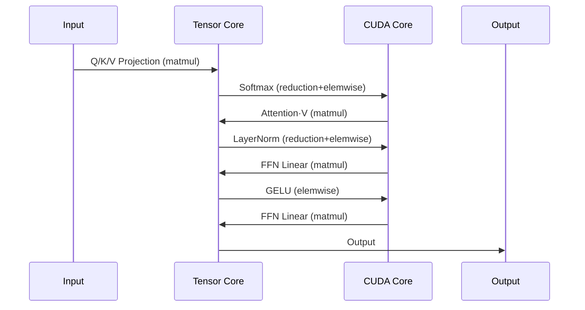

# Azure NC RTX Pro 6000 V6 BSE Complete Benchmark Report

> Comprehensive comparison of NC RTX 6000 Pro Blackwell / NC H100 NVL / NC A100 PCIe / NV A10

> For fairness, each test is performed using the same data type across all four GPUs.

---

## Table of Contents

1. [Test Environment](#test-environment)
2. [Scientific Computing & Numeric Precision](#scientific-computing--numeric-precision)
3. [Network Configuration Test](#1-network-configuration-test)
4. [GPU P2P Interconnect Test](#2-gpu-p2p-interconnect-test)
5. [FP32 Compute Test](#3-fp32-compute-test)
6. [LLM Inference Test](#4-llm-inference-test)
7. [SFT Full Fine-tuning Test](#5-sft-full-fine-tuning-test)
8. [FLUX Image Generation Test](#6-flux-image-generation-test)
9. [Blender Rendering Test](#7-blender-rendering-test)
10. [NVENC Video Encoding Test](#8-nvenc-video-encoding-test)
11. [Deployment Guide](#9-deployment-guide)
12. [Four GPU Comprehensive Comparison](#four-gpu-comprehensive-comparison)
13. [Repository Structure & Quick Start](#-repository-structure)

---

## Test Environment

### Hardware Configuration

| Config | RTX 6000 Pro Blackwell | H100 NVL | A100 PCIe | A10 |
|--------|------------------------|----------|-----------|-----|
| **GPU Model** | RTX Pro 6000 Blackwell DC-4-96Q | NVIDIA H100 NVL | NVIDIA A100 80GB PCIe | NVIDIA A10-24Q (vGPU) |
| **Architecture** | Blackwell (GB202) | Hopper (GH100) | Ampere (GA100) | Ampere (GA102) |
| **VRAM** | 96 GB GDDR7 | 94 GB HBM3 | 80 GB HBM2e | 24 GB GDDR6 |

### GPU Hardware Unit Descriptions

| Hardware Unit | Function | Typical Applications |
|----------|------|----------|
| **NVDEC** | Video Decode (H.264/H.265/AV1 → raw frames) | Video playback, AI video analysis preprocessing |
| **NVENC** | Video Encode (raw frames → MP4) | Live streaming, video export, cloud gaming |
| **NVJPG** | JPEG hardware-accelerated codec | Batch image processing, training data preprocessing |
| **Tensor Core** | AI matrix multiplication acceleration | LLM, Stable Diffusion, video generation |
| **RT Core** | Ray tracing computation | Game ray tracing, 3D rendering, CAD preview |
| **CUDA Core** | General parallel computing | Foundation of all GPU computing |

### Hardware Unit Configuration Matrix

| Hardware Unit | RTX 6000 Pro Blackwell | H100 NVL | A100 PCIe | A10 |
|----------|-----------------------|----------|-----------|-----|
| **NVDEC** (Decoder) | ✅ 4 (Gen6) | ✅ 7 | ✅ 5 | ✅ 2 |
| **NVENC** (Encoder) | ✅ **4 (Gen9, AV1)** | ❌ **None** | ❌ **None** | ✅ 1 (Gen7) |
| **NVJPG** | ✅ Yes | ✅ 7 | ✅ 5 | ❌ No |
| **Tensor Core** | ✅ Gen5 | ✅ Gen4 | ✅ Gen3 | ✅ Gen3 |
| **RT Core** | ✅ **188 (Gen4)** | ❌ **None** | ❌ **None** | ✅ 72 (Gen2) |
| **NVLink** | ❌ None | ✅ Yes | ✅ Yes | ❌ None |

---

## Scientific Computing & Numeric Precision

> **NEW**: This section explains the precision hierarchy and execution units - essential for understanding benchmark results.

### Precision Quick Reference (FP64/FP32/TF32/BF16/FP16/FP8/FP4)

#### CUDA Core vs Tensor Core Precision Comparison

| Precision | Execution Unit | Primary Use Case | RTX 6000 Performance |
|---|---|---|---|
| **FP64** | CUDA Core (FP64 ALU) | HPC scientific computing (double precision) | ~2 TFLOPS |
| **FP32** | CUDA Core (FP32 ALU) | Traditional rendering, scalar ops, gaming | **125 TFLOPS** |
| **TF32** | Tensor Core | AI training (transparent FP32 API optimization) | ~500 TFLOPS |
| **BF16/FP16** | Tensor Core | AI training/inference mixed precision | ~1000 TFLOPS |
| **FP8** | Tensor Core | AI inference optimization | ~2000 TFLOPS |
| **NVFP4** | Tensor Core (Gen5) | AI inference extreme optimization | **4000 TOPS** |

> **Key Understanding**:
> - FP64 and FP32 are **physically separate ALU units** (Datacenter: FP64:FP32 = 1:2, RTX: 1:64)
> - TF32/BF16/FP16/FP8/NVFP4 **share the same Tensor Core hardware**, just different precision configs

### TF32 Transparent Optimization

> **One-liner**: TF32 is not a data type, it's Tensor Core's "stealth acceleration mode" — you write FP32, hardware secretly computes in TF32, 8-10× faster, <0.1% precision loss.

**How it works**:
```
torch.float32 → Ampere+ auto-truncates to TF32 (19-bit) for multiply → Result back to FP32
```

| Format | Bits | Notes |
|--------|------|-------|
| FP32 | 1+8+23=32 | User API, storage, accumulation precision |
| TF32 | 1+8+10=19 | Tensor Core multiply instant (same exponent as FP32, truncated mantissa) |

**PyTorch default enabled** (Ampere+):
```python
torch.backends.cuda.matmul.allow_tf32  # True by default
torch.backends.cudnn.allow_tf32        # True by default
```

### CUDA Core vs Tensor Core: Who Computes What



**Simple Rule**:
- **Matrix multiply → Tensor Core** (Linear, Conv, Attention QK and V multiply)
- **Everything else → CUDA Core** (Activation, Normalization, Softmax)

| Operation Type | Execution Unit | Examples |
|----------------|----------------|----------|
| **Matrix Multiplication** | Tensor Core | `torch.mm`, `torch.bmm`, `nn.Linear`, `nn.Conv2d` |
| **Element-wise Ops** | CUDA Core | `torch.add`, `torch.mul`, `torch.exp`, activation functions |
| **Reduction Ops** | CUDA Core | `torch.sum`, `torch.mean`, `softmax` |
| **Memory Ops** | CUDA Core | `torch.cat`, `torch.reshape`, indexing |

> **Common Misconception**: "BF16 training uses Tensor Core for everything"
> 
> **Reality**: Even in BF16 training, only ~40-60% of compute time is Tensor Core (matmul). The rest is CUDA Core (element-wise, reductions).


### GPU Performance Quick Reference

| Scenario | Key Metric | RTX 6000 | H100 NVL | Winner |
|----------|------------|----------|----------|--------|
| **AI Inference/Training** | Tensor Core (BF16) | ~504 TFLOPS | **~836 TFLOPS** | H100 |
| **AI Inference (FP8)** | Tensor Core (FP8) | ~1,010 TFLOPS | **~1,671 TFLOPS** | H100 |
| **AI Inference (FP4)** | Tensor Core (NVFP4) | **~2,000 TFLOPS** | ❌ N/A | RTX 6000 |
| **HPC Scientific** | CUDA Core (FP64) | ~2 TFLOPS | **30 TFLOPS** | H100 |
| **3D Rendering** | FP32 + RT Core | **125T + 380T RT** | 60T + ❌ | RTX 6000 |

> **Quick Selection Guide**:
> - AI performance → Look at **Tensor Core** (BF16/FP8/FP4)
> - HPC performance → Look at **FP64 only** - H100 dominates (30 vs 2 TFLOPS)
> - Rendering → Look at **FP32 + RT Core** - RTX 6000 exclusive (H100 has no RT Core)

---

## Scenario Support Matrix

### AI Scenarios

| Scenario | Required Hardware | RTX 6000 | H100 | A100 | A10 |
|------|----------|----------|------|------|-----|
| LLM Training (>70B) | Tensor Core + NVLink + Large VRAM | ❌ | ✅ | ✅ | ❌ |
| LLM Fine-tuning (7B-70B) | Tensor Core + Large VRAM | ✅ | ✅ | ✅ | ⚠️ |
| LLM Inference | Tensor Core | ✅ | ✅ | ✅ | ⚠️ |
| AI Image Generation (SD/FLUX) | Tensor Core | ✅ | ✅ | ✅ | ✅ |
| **AI Video Generation (with MP4 output)** | Tensor Core + **NVENC** | ✅ | ❌ | ❌ | ✅ |

### Video/Media Scenarios

| Scenario | Required Hardware | RTX 6000 | H100 | A100 | A10 |
|------|----------|----------|------|------|-----|
| **Video Transcoding** | NVDEC + **NVENC** | ✅ | ❌ | ❌ | ✅ |
| Video Decode Only | NVDEC | ✅ | ✅ | ✅ | ✅ |
| **Live Streaming** | **NVENC** | ✅ | ❌ | ❌ | ✅ |
| Video AI Analysis | NVDEC + Tensor Core | ✅ | ✅ | ✅ | ✅ |

### Gaming/Rendering Scenarios

| Scenario | Required Hardware | RTX 6000 | H100 | A100 | A10 |
|------|----------|----------|------|------|-----|
| **Cloud Gaming** | RT Core + NVENC | ✅ | ❌ | ❌ | ✅ |
| **3D Rendering (Ray Tracing)** | **RT Core** | ✅ | ❌ | ❌ | ✅ |
| Blender Rendering | RT Core | ✅ | ❌ | ❌ | ✅ |
| CAD Real-time Preview | RT Core + CUDA | ✅ | ❌ | ❌ | ✅ |
| VDI (Virtual Desktop) | NVENC + Graphics | ✅ | ❌ | ❌ | ✅ |

### 🎯 Three Key Selection Principles

1. **Need video encoding output?** → Must have NVENC → **Exclude H100 / A100**
2. **Need ray tracing?** → Must have RT Core → **Exclude H100 / A100**
3. **Pure AI computing?** → Check Tensor Core + VRAM + NVLink

---

## 1. Network Configuration Test

### Test Results

| Item | Standard_NC256ds_xl_RTXPRO6000BSE_v6 |
|------|------------------|
| **NIC Model** | Microsoft Azure Network Adapter (MANA) |
| **Azure Bandwidth Limit** | **100 Gbps** |
| **Measured Bandwidth (Single Stream)** | 30 Gbps |
| **Measured Bandwidth (16 Streams)** | **50 Gbps** |
| **RDMA/RoCE** | ❌ No |
| **InfiniBand** | ❌ No |

### Conclusion

- RTX 6000 VM uses Azure MANA Ethernet, up to 100 Gbps
- No RDMA/InfiniBand support, not suitable for multi-node GPU communication-intensive training

---

## 2. GPU P2P Interconnect Test

### Test Results

| Item | Standard_NC256ds_xl_RTXPRO6000BSE_v6 |
|------|---------------|
| `nvidia-smi topo -p2p` | OK (Hardware level supported) |
| **PyTorch can_device_access_peer()** | **False** (Still achieves ~43 GB/s) |
| **GPU0 → GPU1 BW** | **41.26 GB/s** |
| **GPU1 → GPU0 BW** | **44.46 GB/s** |
| **NCCL AllReduce** | **~43.5 GB/s** |

### P2P Comparison

| GPU Config | P2P Bandwidth | Notes |
|----------|----------|------|
| **RTX 6000** | ~43 GB/s | PCIe Gen5 |
| **H100 NVL** | ~450 GB/s | NVLink 4.0 direct |
| **A100 PCIe** | ~25 GB/s | PCIe Gen4 |

---

## 3. FP32 Compute Test

### Test Results

| Metric | RTX 6000 Pro Blackwell |
|------|-------------------------|
| **Theoretical FP32** | 116.95 TFLOPS |
| **Measured Peak** | **109.20 TFLOPS** |
| **Efficiency** | **93.4%** |
| **SM Count** | 188 |
| **CUDA Cores** | 24,064 |

---

## 4. LLM Inference Test

### Test Configuration

| Parameter | Value |
|------|-----|
| **Model** | microsoft/Phi-3.5-mini-instruct (3.8B) |
| **Inference Engine** | vLLM |
| **Test Tool** | guidellm |

### Test Results

| GPU | Output Tokens/s | Relative Performance |
|-----|-----------------|---------------------|
| **H100 NVL** | **3083.6** | **100%** |
| **RTX 6000** | **2835.4** | **92%** |
| **A100 PCIe** | **2119.6** | **69%** |
| **A10** | **563.1** | **18%** |

### 4.1 NVFP4 Quantization - Blackwell Exclusive

> **Blackwell-only feature**: NVFP4 (4-bit floating point) requires SM100/SM120 native FP4 Tensor Core
> - **Memory Savings**: Model size ~35% smaller than FP8 (9.9GB vs 15.3GB for 14B)

#### Test Configuration

| Parameter | Value |
|-----------|-------|
| **Model** | Qwen3-14B-NVFP4 vs Qwen3-14B-FP8 (Local pre-quantized) |
| **Quantization** | NVFP4 W4A4 (compressed-tensors) |
| **Framework** | vLLM 0.12.0 (native CUTLASS NVFP4 kernel) |
| **Workload** | 200 prompts, 512 input tokens, 128 output tokens |

#### Test Results

| Precision | Model | Input Tokens | Output Tokens | Time | Output TPS |
|-----------|-------|-------------:|-------------:|-----:|----------:|
| **NVFP4 (W4A4)** | Qwen3-14B-NVFP4 | 102,400 | 25,600 | 9.22s | **2,777 tok/s** |
| **FP8 (W8A8)** | Qwen3-14B-FP8 | 102,400 | 25,600 | 12.75s | **2,009 tok/s** |

```
NVFP4 vs FP8 Output Throughput (Qwen3-14B, RTX PRO 6000 Blackwell)
══════════════════════════════════════════════════════════════════
NVFP4 (W4A4)    ██████████████████████████████████████████  2,777 tok/s (+38%)
FP8 (W8A8)      ██████████████████████████████              2,009 tok/s (baseline)
══════════════════════════════════════════════════════════════════
```

#### Key Metrics Comparison

| Metric | NVFP4 (W4A4) | FP8 (W8A8) | Difference |
|--------|--------------|------------|------------|
| **Output TPS** | **2,777** | 2,009 | **+38%** |
| **Model Size** | **9.9 GB** | 15.3 GB | **-35%** |
| **KV Cache Available** | 65.5 GiB | 60.1 GiB | +9% |
| **Inference Time** | **9.22s** | 12.75s | **-28%** |

#### NVFP4 Known Issues ⚠️

| Issue | Cause | Solution |
|-------|-------|----------|
| NVFP4 model loads as BF16 | SGLang 0.5.x doesn't recognize NVFP4 format | Use vLLM instead |
| vLLM 0.13.0 shows "platform does not support cutlass NVFP4" | vLLM 0.13.0 removed SM120 NVFP4 support | **Downgrade to vLLM 0.12.0** |
| FlashInfer 0.5.3 has no fp4 module | Version too old | Compile FlashInfer 0.6.0rc2 |

#### NVFP4 Environment Requirements

```bash
# Must use vLLM 0.12.0 (0.13.0 doesn't support SM120 NVFP4)
pip install vllm==0.12.0

# Verify NVFP4 support
python -c "from vllm._custom_ops import cutlass_scaled_mm_supports_fp4; print(f'NVFP4 support: {cutlass_scaled_mm_supports_fp4(120)}')"
# Expected output: NVFP4 support: True
```

> 💡 **Recommendation**: On RTX PRO 6000 Blackwell, prefer NVFP4 quantized models for **38% extra performance** over FP8.

### 4.2 Tensor Parallel (TP=1 vs TP=2) Benchmark

> ⚠️ **RTX PRO 6000 Dual GPU**: Testing when TP=2 provides benefits over TP=1

#### Small Model Results (Qwen3-14B-FP8)

| Configuration | Output Throughput | TTFT | TPOT |
|---------------|------------------:|-----:|-----:|
| **TP=1** | **276.02 tok/s** | 1036 ms | 49.40 ms |
| **TP=2** | 266.19 tok/s | 1252 ms | 52.16 ms |
| **Difference** | **-3.6%** | +21% slower | +5.6% slower |

> ⚠️ **14B model is too small for TP=2 benefit** - The communication overhead between GPUs outweighs the parallelism benefit.

#### Large Model Results (Qwen2.5-VL-72B-FP8)

| Configuration | Output Throughput | TTFT | TPOT |
|---------------|------------------:|-----:|-----:|
| **TP=1** | 232.02 tok/s | 1695 ms | 62.57 ms |
| **TP=2** | **294.77 tok/s** | 1801 ms | 47.42 ms |
| **Difference** | **+27.0%** | +6.3% slower | **-24.2% faster** |

```
TP=1 vs TP=2 Output Throughput Comparison
══════════════════════════════════════════════════════════════════
Qwen3-14B (Small Model - TP overhead dominates)
  TP=1    ███████████████████████████████████████████  276.02 tok/s (baseline)
  TP=2    █████████████████████████████████████████▌   266.19 tok/s (-3.6%)

Qwen2.5-VL-72B (Large Model - TP benefit realized)
  TP=1    ███████████████████████████████████████      232.02 tok/s (baseline)
  TP=2    ███████████████████████████████████████████████████  294.77 tok/s (+27%)
══════════════════════════════════════════════════════════════════
```

#### TP Recommendations

| Model Size | Recommended Config | Reason |
|------------|-------------------|--------|
| **<30B parameters** | **TP=1** | Communication overhead > parallelism benefit |
| **30B-70B parameters** | Test both | Depends on specific model architecture |
| **>70B parameters** | **TP=2** | 25-35% throughput improvement |

> 💡 **Rule of thumb**: Only use TP=2 when a single GPU cannot fit the model comfortably, or when the model is large enough (>70B) to benefit from parallel computation.

### 4.3 SGLang BF16/FP8 Three-GPU Comparison (200 Concurrent)

> Test Date: 2025-12 | Framework: SGLang 0.5.6.post2 + FlashInfer 0.5.3

#### Test Results

| GPU | BF16 (tok/s) | FP8 (tok/s) | FP8 vs BF16 | FP8 Implementation |
|-----|-------------:|------------:|:-----------:|:------------------:|
| **H100 NVL 96GB** | 2,197 | 2,681 | **+22%** | Native FP8 Tensor Core |
| **RTX PRO 6000 96GB** | 1,579 | 2,353 | **+49%** | Native FP8 Tensor Core |
| **A100 80GB PCIe** | 1,196 | - | - | Marlin fallback |

> ⚠️ **A100 Note**: A100 lacks native FP8 Tensor Core, requires Marlin kernel fallback.

#### SGLang Known Issues ⚠️

| Issue | Cause | Solution |
|-------|-------|----------|
| **3x throughput difference** | `--random-range-ratio` defaults to 1.0 (random length) | Use **0.0** for benchmark (fixed length) |
| **Runtime quantization OOM** | `--quantization fp8` OOM at startup | Must use **pre-quantized FP8 model** |
| **FlashInfer version** | v0.2.0 is 1.5x slower than FA2 | Use **v0.5.3+** |

---

## 5. SFT Full Fine-tuning Test

### Test Configuration

| Parameter | Value |
|------|-----|
| **Model** | Qwen/Qwen3-8B-Base (8.19B params) |
| **Training Type** | Full Fine-Tuning |
| **Precision** | BF16 |

### Test Results

| GPU | Training Time | Speed (s/step) | vs H100 |
|-----|---------|--------------|-----------|
| **H100 NVL** | **19.74 min** | **11.84** | **100%** |
| **RTX 6000** | 25.14 min | 15.09 | 78.5% |
| **A100 PCIe** | 36.98 min | 22.19 | 53.4% |

```
Training Speed (s/step, Lower is Faster)
════════════════════════════════════════════════════════════════
H100 NVL          ████████████ 11.84s (100%)
RTX 6000          ███████████████ 15.09s (78.5%)
A100 80GB         ███████████████████████ 22.19s (53.4%)
════════════════════════════════════════════════════════════════
```

---

## 6. FLUX Image Generation Test

### Test Configuration

| Parameter | Value |
|------|-----|
| **Model** | FLUX.1 schnell (12B params) |
| **Resolution** | 1024×1024 |
| **Inference Steps** | 4 steps |

### Test Results

| GPU | Avg Time | Images/min | Relative Performance |
|-----|---------|------------|----------|
| **H100 NVL** | **1.25s** | **47.8** | **100%** |
| **RTX 6000** | **1.42s** | **42.3** | **88%** |
| **A100 PCIe** | **2.16s** | **27.8** | **58%** |
| **A10 24GB** | ❌ **OOM** | - | - |

> ⚠️ A10 cannot run FLUX.1 - requires ~34GB VRAM, A10 only has 24GB

---

## 7. Blender Rendering Test

### Test Results

| GPU | **Pure Render Time** | Relative Performance |
|-----|---------------|--------|
| **RTX 6000** | **~2.15s** | **3.76x** ✅ |
| **A10** | **~8.08s** | 1.00x (Baseline) |

> **Note**: H100/A100 have no RT Core, not suitable for ray tracing rendering

---

## 8. NVENC Video Encoding Test

### Single Stream Test Results (H.264)

| Preset | RTX 6000 | A10 | Winner |
|--------|----------|-----|-----|
| **P1 (Fastest)** | 167 fps | 197 fps | A10 +18% |
| **P4 (Balance)** | **129 fps** | 97 fps | **RTX 6000 +33%** ✅ |
| **P7 (High quality)** | **87 fps** | 60 fps | **RTX 6000 +45%** ✅ |

### Multi-Stream Parallel Test

| Parallel Streams | RTX 6000 | A10 | Ratio |
|---------|----------|-----|------|
| 1 stream | 98 fps | 87 fps | 1.13x |
| 4 streams | **313 fps** | 87 fps* | **3.6x** |
| 12 streams | **348 fps** | 87 fps* | **4.0x** |

> *A10 vGPU mode only supports single stream parallel
> **Note**: H100/A100 have no NVENC, cannot perform this test

---

## 9. Deployment Guide

### Azure vGPU Driver Installation

**Critical**: Must use Azure-specific vGPU driver

| Driver Version | Type | Result | Reason |
|----------------|------|--------|--------|
| CUDA 12.6 (560.35.05) | Standard CUDA | ❌ Failed | PCI ID not in support list |
| Tesla 580.105.08 standard | Datacenter driver | ❌ Failed | "vGPU not supported by open nvidia.ko" |
| Azure GRID 550.144.06 | Old vGPU | ❌ Failed | Blackwell too new |
| **580.105.08-grid-azure** | **Azure vGPU** | ✅ **Success** | Azure custom driver |

**Installation**:
```bash
# Download
wget https://download.microsoft.com/download/85beffdc-8361-4df4-a823-dcb1b230a7aa/NVIDIA-Linux-x86_64-580.105.08-grid-azure.run

# Install
sudo sh NVIDIA-Linux-x86_64-580.105.08-grid-azure.run --silent --dkms

# Verify
nvidia-smi
```

### vGPU Monitoring Solution

**Problem**: Standard `nvidia-smi` shows N/A for GPU utilization in vGPU environment

| Metric | Standard nvidia-smi | Reason |
|--------|---------------------|--------|
| GPU Utilization | ❌ **N/A** | vGPU isolation, cannot access physical SM |
| Memory Usage | ✅ Normal | Virtualization passthrough |
| Temperature/Power | ❌ **N/A** | Physical metrics blocked |

**Solution**: Use GPM (GPU Performance Metrics)

```bash
# Get SM utilization and occupancy
nvidia-smi dmon --gpm-metrics 2,3 --gpm-options m -c 4
```

| Metric ID | Name | Description |
|-----------|------|-------------|
| 2 | SM Activity (smutil) | **SM Utilization** ✅ |
| 3 | SM Occupancy (smocc) | **SM Occupancy** ✅ |

### OS Compatibility Status

| OS | NCv6 Status | Notes |
|----|-------------|-------|
| **Ubuntu 24.04** | ✅ Verified Working | Recommended |
| **Rocky Linux 9.6** | ⚠️ Requires validation | Check NVIDIA driver support |
| **Debian 12** | ⚠️ Unverified | NV driver claims support, not tested on Azure |

---

## Four GPU Comprehensive Comparison

### 🏆 Scenario Recommendations

| Use Case | Recommended GPU | Reason |
|----------|----------|------|
| **3D Rendering/Animation** | 🥇 **RTX 6000** | RT Core crushing advantage, H100/A100 not supported |
| **AI Image Gen (Performance)** | 🥇 H100 > 🥈 RTX 6000 > 🥉 A100 | H100 fastest, RTX 6000 52% faster than A100 |
| **Video Transcode (Multi-stream)** | 🥇 **RTX 6000** > 🥈 A10 | 4x throughput advantage, H100/A100 not supported |
| **AI Video Generation (Includes MP4 Output)** | 🥇 **RTX 6000** > 🥈 A10 | H100/A100 have no NVENC, cannot output video |
| **LLM Inference (Performance Focus)** | 🥇 H100 > 🥈 RTX 6000 > 🥉 A100 | H100 is fastest, RTX 6000 is 92% |
| **LLM Training (>70B)** | 🥇 H100 > 🥈 A100 | Requires NVLink multi-GPU, RTX 6000 not supported |
| **SFT Fine-tuning (Performance)** | 🥇 H100 > 🥈 RTX 6000 > 🥉 A100 | H100 fastest, RTX 6000 1.47x faster than A100 |
| **Cloud Gaming/VDI** | 🥇 **RTX 6000** > 🥈 A10 | RT Core + NVENC, H100/A100 not supported |
| **Live Streaming** | 🥇 **RTX 6000** > 🥈 A10 | NVENC Gen9 vs Gen7, H100/A100 no NVENC |

### Positioning Summary

| GPU | Positioning | Advantages | Limitations |
|-----|------|------|------|
| **RTX 6000** | All-round Professional | Complete hardware units, full pipeline, 96GB GDDR7 | No NVLink |
| **H100** | Pure AI Compute | Strongest Tensor Core, 94GB HBM3, NVLink | **No NVENC, No RT Core** |
| **A100** | AI Training/Inference | Mature ecosystem, 80GB HBM2e, NVLink | **No NVENC, No RT Core** |
| **A10** | Inference/Graphics/VDI | Has NVENC + RT Core, supports GPU partitioning | Small VRAM (24GB) |

---

## 📦 Repository Structure

```
NC-RTX-Pro-6000V6-BSE-Benchmark/
├── README.md                      # English documentation (this file)
├── README-CN.md                   # Chinese Documentation
├── benchmark_tp_comparison.py     # TP=1 vs TP=2 benchmark script
├── gpu_p2p_bandwidth_test.py      # GPU P2P bandwidth test
└── requirements.txt               # Python dependencies
```

---

## 🚀 Quick Start

### Prerequisites

```bash
# Create conda environment (recommended)
conda create -n vllm012 python=3.11
conda activate vllm012

# Install dependencies
pip install -r requirements.txt
```

### Run TP Benchmark

Compare Tensor Parallel performance (TP=1 vs TP=2):

```bash
# TP=1 test (single GPU)
python benchmark_tp_comparison.py \
    --model Qwen/Qwen2.5-VL-72B-Instruct-FP8 \
    --tp 1 \
    --port 8000

# TP=2 test (dual GPU)
python benchmark_tp_comparison.py \
    --model Qwen/Qwen2.5-VL-72B-Instruct-FP8 \
    --tp 2 \
    --port 8001
```

### Test GPU P2P Bandwidth

Measure GPU-to-GPU communication bandwidth:

```bash
python gpu_p2p_bandwidth_test.py
```

Expected output on RTX PRO 6000 (PCIe Gen5, no NVLink):
- GPU0 → GPU1: ~41-44 GB/s
- GPU1 → GPU0: ~41-44 GB/s

---

## 📊 Scripts Description

| Script | Purpose | Key Metrics |
|--------|---------|-------------|
| `benchmark_tp_comparison.py` | Compare TP=1 vs TP=2 inference performance | Output throughput (tok/s), TTFT, TPOT |
| `gpu_p2p_bandwidth_test.py` | Measure GPU P2P bandwidth | Bandwidth (GB/s), NVLink/PCIe detection |

---

## Document History

| Date | Version | Changes |
|------|---------|---------|
| 2026-01-24 | 2.0 | Added: Precision theory, torch.compile optimization, vGPU monitoring, deployment guide |
| 2025-12-28 | 1.0 | Initial release with benchmark results |

---

*Report Author: Xinyu Wei*
