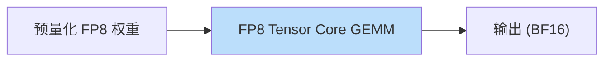
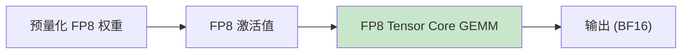
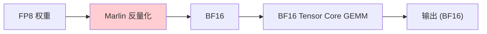
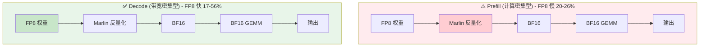
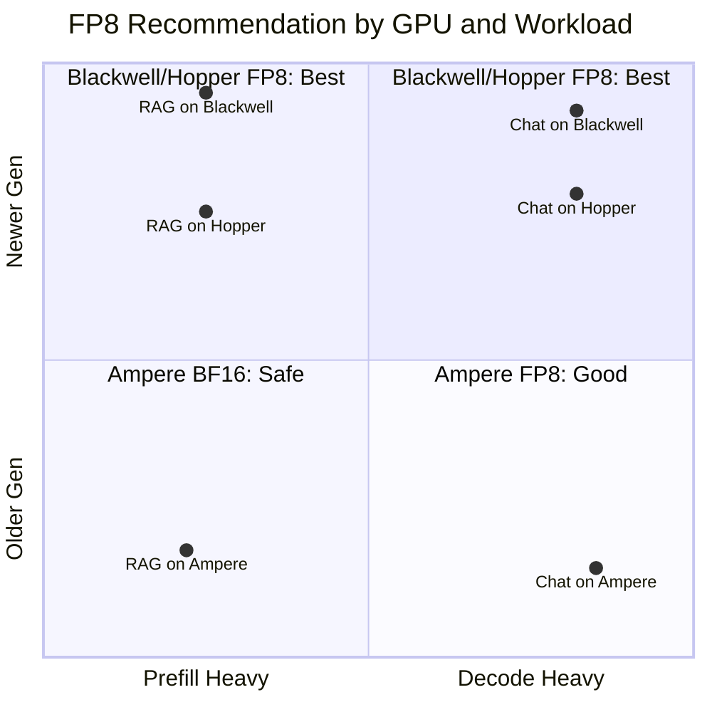

# 跨 GPU 架构的 FP8 性能验证

> 跨 GPU 架构的 FP8 推理性能综合验证：H100 (Hopper)、A100 (Ampere) 和 RTX PRO 6000 (Blackwell)

## 🎯 概述

本基准测试提供了**三代 GPU 上 FP8 与 BF16 推理性能**的量化分析，这三代 GPU 具有根本不同的 FP8 实现策略。

### 技术架构

#### RTX 6000 (Blackwell SM120) - 原生 FP8


✅ **原生 FP8 + 新一代架构** - 最高性能

#### H100 (Hopper SM90) - 原生 FP8


✅ **原生 FP8 Tensor Core** - 1979 TFLOPS

#### A100 (Ampere SM80) - 需要反量化


⚠️ **无原生 FP8 支持** - 需要 FP8→BF16 反量化，Prefill 有开销

### 🔥 关键发现摘要

| GPU | 架构 | FP8 Prefill vs BF16 | FP8 Decode vs BF16 | 建议 |
|-----|------|---------------------|--------------------|--------------------|
| **RTX 6000** | Blackwell SM120 | **+59~65%** ✅ | **+11~26%** ✅ | **所有场景使用 FP8** |
| **H100** | Hopper SM90 | **+29~38%** ✅ | **+36~43%** ✅ | **所有场景使用 FP8** |
| **A100** | Ampere SM80 | **-20~26%** ⚠️ | **+17~56%** ✅ | 仅解码密集型负载使用 FP8 |

> ⚠️ **重大发现**：
> - **RTX 6000 Blackwell** 展示了最高的 FP8 prefill 提升 (+65%)，体现新一代架构优势
> - **H100 Hopper** 凭借原生 FP8 Tensor Core 在所有场景提供稳定的 30-40% 加速
> - **A100 Ampere** 缺少原生 FP8 支持，prefill 因 Marlin 反量化开销减速 20-26%

## 📊 测试结果

### RTX 6000 Blackwell 双向对比 (2026-01-04)

> **测试配置**：NVIDIA RTX PRO 6000 Blackwell (96GB vGPU)，vLLM 0.13.0rc2+cu130，CUDA 13.0
> 
> ⚠️ **注意**：运行时 FP8（`--quantization fp8`）在 vLLM 0.13.0rc2 中尚不支持 Blackwell SM120 架构，仅预量化 FP8 模型可用。

| 场景 | BF16 | FP8 预量化 | FP8 vs BF16 |
|------|------|------------|-------------|
| **Prefill 单请求** | 9,860 tok/s | 16,309 tok/s | **+65.4%** ✅ |
| **Prefill 50并发** | 12,250 tok/s | 19,461 tok/s | **+58.9%** ✅ |
| **Decode 单请求** | 44 tok/s | 48 tok/s | **+10.6%** ✅ |
| **Decode 50并发** | 1,777 tok/s | 2,235 tok/s | **+25.8%** ✅ |

**显存使用 (RTX 6000)**：
| 配置 | 模型显存 | 备注 |
|------|----------|------|
| BF16 | 27.57 GiB | 全精度权重 |
| FP8 预量化 | 15.39 GiB | **节省 44%** |

### H100 三向对比 (2026-01-04)

> **测试配置**：NVIDIA H100 NVL 96GB，vLLM 0.13.0，PyTorch 2.9.0+cu128

| 场景 | BF16 | FP8 运行时 | FP8 预量化 | FP8 vs BF16 |
|------|------|------------|------------|-------------|
| **Prefill 单请求** | 14,298 tok/s | 19,703 tok/s | 19,655 tok/s | **+37.8%** ✅ |
| **Prefill 50并发** | 14,415 tok/s | 18,647 tok/s | 18,720 tok/s | **+29.4%** ✅ |
| **Decode 单请求** | 89 tok/s | 127 tok/s | 126 tok/s | **+42.7%** ✅ |
| **Decode 50并发** | 3,044 tok/s | 4,140 tok/s | 4,110 tok/s | **+36.0%** ✅ |

**显存使用 (H100)**：
| 配置 | 模型显存 | 可用 KV Cache |
|------|----------|---------------|
| BF16 | 27.57 GiB | 50.44 GiB |
| FP8 运行时 | 15.36 GiB | 62.64 GiB |
| FP8 预量化 | 15.39 GiB | 62.62 GiB |

### A100 三向对比 (2026-01-03)

> **测试配置**：NVIDIA A100 80GB PCIe，vLLM 0.11.2

| 场景 | BF16 | FP8 运行时 | FP8 预量化 | FP8 vs BF16 |
|------|------|------------|------------|-------------|
| **Prefill 单请求** | 6,555 tok/s | 5,251 tok/s | 5,277 tok/s | **-19.8%** ⚠️ |
| **Prefill 50并发** | 7,221 tok/s | 5,335 tok/s | 5,352 tok/s | **-26.1%** ⚠️ |
| **Decode 单请求** | 47 tok/s | 73 tok/s | 73 tok/s | **+55.3%** ✅ |
| **Decode 50并发** | 1,702 tok/s | 1,999 tok/s | 2,031 tok/s | **+17.4%** ✅ |

### 跨 GPU 性能对比

| 场景 | A100 BF16 | H100 BF16 | RTX 6000 BF16 | H100 vs A100 | RTX 6000 vs A100 |
|------|-----------|-----------|---------------|--------------|------------------|
| Prefill 单请求 | 6,555 tok/s | 14,298 tok/s | 9,860 tok/s | **2.18x** | **1.50x** |
| Prefill 50并发 | 7,221 tok/s | 14,415 tok/s | 12,250 tok/s | **2.00x** | **1.70x** |
| Decode 单请求 | 47 tok/s | 89 tok/s | 44 tok/s | **1.89x** | 0.94x |
| Decode 50并发 | 1,702 tok/s | 3,044 tok/s | 1,777 tok/s | **1.79x** | **1.04x** |

> 📝 **注意**：RTX 6000 结果来自 vGPU 环境（96GB 分区），性能特性可能与裸金属不同。

## 🔬 技术分析

### 为什么不同 GPU 显示不同的 FP8 行为？

#### 三代 GPU FP8 执行路径对比

**RTX 6000 (Blackwell SM120)**:
```
FP8 权重 → FP8 Tensor Core → 原生 FP8 GEMM → 输出
         ✅ 直接执行，无转换开销
```

**H100 (Hopper SM90)**:
```
FP8 权重 → FP8 Tensor Core → 直接 FP8 GEMM → 输出
         ✅ 原生支持，1979 TFLOPS
```

**A100 (Ampere SM80)**:
```
FP8 权重 → Marlin 内核 → [FP8→BF16 反量化] → BF16 GEMM → 输出
                        ⚠️ 额外开销        312 TFLOPS
```

| 因素 | RTX 6000 (Blackwell) | H100 (Hopper) | A100 (Ampere) |
|------|----------------------|---------------|---------------|
| 架构 | SM120 | SM90 | SM80 |
| FP8 Tensor Core | ✅ 原生 (第5代) | ✅ 原生 (第4代) | ❌ 不可用 |
| CUDA 计算 | 13.0 | 12.8 | 12.6 |
| FP8 执行 | 直接 FP8 GEMM | 直接 FP8 GEMM | FP8→BF16 反量化 + BF16 GEMM |
| Prefill (计算密集) | **FP8 快 65%** | FP8 快 38% | FP8 慢 20-26% |
| Decode (带宽密集) | FP8 快 26% | FP8 快 36% | FP8 快 17-56% |
| 运行时 FP8 支持 | ❌ vLLM 暂不支持 | ✅ 支持 | ✅ 支持 |

### Marlin 内核：为什么反量化开销如此重要

> 📚 **参考文献**: Benjamin Marie, *"The Kaitchup: LLMs on a Budget"* (第 3.4.3 章)

我们的 A100 测试结果与 LLM 量化社区的理论分析一致：

**Benjamin Marie 的关键洞察:**
> "即使在 batch size = 1 时，Marlin 也比所有现有框架/格式更快，包括已使用自定义内核进行快速推理的标准 GPTQ 和 AWQ。**更值得注意的是，从 batch size = 8 开始，这些框架比 FP16 推理还要慢**，而 Marlin 仍能保持近 4 倍的速度优势。如果你使用 vLLM 进行推理，GPTQ 和 AWQ 模型会自动转换为 Marlin 格式以加速推理。"

**这如何解释我们的 FP8 测试结果：**

| 观察点 | Benjamin (INT4 量化) | 我们的测试 (FP8 量化) | 一致性 |
|--------|----------------------|----------------------|--------|
| 反量化开销存在 | ✅ batch≥8: INT4 比 FP16 慢 | ✅ A100 Prefill: FP8 比 BF16 慢 26% | ✅ |
| 带宽密集型受益 | ✅ Marlin 仍快 4x | ✅ A100 Decode: FP8 快 17-56% | ✅ |
| vLLM 自动优化 | ✅ 自动转换为 Marlin | ✅ 使用 Marlin 进行 FP8→BF16 | ✅ |

**为什么 A100 在 Prefill 和 Decode 时表现不同：**



> **关键差异**: Prefill 是计算密集型，反量化开销超过带宽节省；Decode 是带宽密集型，50% 内存减少带来的带宽节省超过反量化开销。

这验证了 Benjamin 的理论：**反量化开销是真实存在的**，但它是带来负面还是正面影响，取决于工作负载是计算密集型（prefill）还是带宽密集型（decode）。

<details>
<summary>📋 <b>A100 测试日志证据</b> (点击展开)</summary>

**测试环境**: NVIDIA A100 80GB PCIe, Driver 590.44.01, CUDA 12.6, vLLM 0.11.2

```json
// 来自 results/a100_comparison_summary.json
{
  "results": {
    "prefill_single": {
      "bf16": 6555.03,        // BF16 基线
      "fp8_runtime": 5250.79, // FP8 慢 19.9%
      "fp8_prequant": 5277.27 // FP8 慢 19.5%
    },
    "prefill_concurrent": {
      "bf16": 7220.65,        // BF16 基线  
      "fp8_runtime": 5334.67, // FP8 慢 26.1% ⚠️
      "fp8_prequant": 5352.13 // FP8 慢 25.9% ⚠️
    },
    "decode_single": {
      "bf16": 47.06,          // BF16 基线
      "fp8_runtime": 73.21,   // FP8 快 55.6% ✅
      "fp8_prequant": 73.24   // FP8 快 55.6% ✅
    },
    "decode_concurrent": {
      "bf16": 1701.91,        // BF16 基线
      "fp8_runtime": 1999.06, // FP8 快 17.5% ✅
      "fp8_prequant": 2030.53 // FP8 快 19.3% ✅
    }
  },
  "key_finding": "Runtime FP8 and Pre-quantized FP8 show nearly identical 
    inference performance on A100. The main overhead comes from Marlin 
    kernel FP8→BF16 dequantization, which is the same for both methods."
}
```

**数据解读**:
- ⚠️ **Prefill (计算密集)**: FP8 比 BF16 慢 20-26%，验证了 Marlin 反量化开销
- ✅ **Decode (带宽密集)**: FP8 比 BF16 快 17-56%，带宽节省大于反量化开销
- 🔄 **运行时 vs 预量化**: 性能几乎相同，说明开销来自推理阶段的反量化，而非加载

</details>

<details>
<summary>📋 <b>A100 测试日志证据</b> (点击展开)</summary>

**测试环境**: NVIDIA A100 80GB PCIe, Driver 590.44.01, CUDA 12.6, vLLM 0.11.2

```json
// 来自 results/a100_comparison_summary.json
{
  "results": {
    "prefill_single": {
      "bf16": 6555.03,        // BF16 基线
      "fp8_runtime": 5250.79, // FP8 慢 19.9%
      "fp8_prequant": 5277.27 // FP8 慢 19.5%
    },
    "prefill_concurrent": {
      "bf16": 7220.65,        // BF16 基线  
      "fp8_runtime": 5334.67, // FP8 慢 26.1% ⚠️
      "fp8_prequant": 5352.13 // FP8 慢 25.9% ⚠️
    },
    "decode_single": {
      "bf16": 47.06,          // BF16 基线
      "fp8_runtime": 73.21,   // FP8 快 55.6% ✅
      "fp8_prequant": 73.24   // FP8 快 55.6% ✅
    },
    "decode_concurrent": {
      "bf16": 1701.91,        // BF16 基线
      "fp8_runtime": 1999.06, // FP8 快 17.5% ✅
      "fp8_prequant": 2030.53 // FP8 快 19.3% ✅
    }
  },
  "key_finding": "Runtime FP8 and Pre-quantized FP8 show nearly identical 
    inference performance on A100. The main overhead comes from Marlin 
    kernel FP8→BF16 dequantization, which is the same for both methods."
}
```

**数据解读**:
- ⚠️ **Prefill (计算密集)**: FP8 比 BF16 慢 20-26%，验证了 Marlin 反量化开销
- ✅ **Decode (带宽密集)**: FP8 比 BF16 快 17-56%，带宽节省大于反量化开销
- 🔄 **运行时 vs 预量化**: 性能几乎相同，说明开销来自推理阶段的反量化，而非加载

</details>

### 为什么运行时和预量化 FP8 速度相同？

```
运行时 FP8:
  BF16 权重 → [运行时 BF16→FP8 量化] → FP8 → [推理内核] → 输出
              ↑ 在模型加载时执行

预量化 FP8:
  FP8 权重 → FP8 → [推理内核] → 输出
            ↑ 磁盘上已经是量化后的
               
                    ║
                    ↓
         相同的推理路径! ✅
```

**关键洞察**：无论权重如何量化，推理内核执行都是相同的。预量化仅节省模型加载时间和磁盘空间。

**预量化优势**（非推理速度）：
- 🚀 更快的模型加载（文件小 50%）
- 💾 更低的磁盘存储需求
- 🧠 推理时相同的显存使用

## 💡 建议

### GPU 选型指南



### 决策矩阵

| 负载类型 | RTX 6000 (Blackwell) | H100 (Hopper) | A100 (Ampere) |
|----------|----------------------|---------------|---------------|
| **RAG / 长上下文** | ✅ FP8 (+59-65%) | ✅ FP8 (+30%) | ⚠️ BF16 (FP8 慢 26%) |
| **聊天机器人 / 流式** | ✅ FP8 (+26%) | ✅ FP8 (+36%) | ✅ FP8 (+17~56%) |
| **批处理** | ✅ FP8 (+59%) | ✅ FP8 (+29%) | ⚠️ BF16 (FP8 慢 26%) |
| **显存受限** | ✅ FP8 (节省 44%) | ✅ FP8 (节省 44%) | ✅ FP8 (节省 50%) |

### 按用例的性能总结

| 用例 | GPU | 量化 | 预期收益 |
|------|-----|------|----------|
| 长提示词/RAG | **RTX 6000** | FP8 | **+59-65%** (Prefill) |
| 长提示词/RAG | **H100** | FP8 | **+30%** (Prefill) |
| 长提示词/RAG | A100 | **BF16** | 避免 20-26% 减速 |
| 聊天/流式 | RTX 6000 | FP8 | **+26%** (Decode) |
| 聊天/流式 | H100 | FP8 | **+36%** (Decode) |
| 聊天/流式 | A100 | FP8 | **+17~56%** (Decode) |
| 显存受限 | 所有 | FP8 | **节省 44-50% 显存** |


## 🚀 可复现基准测试

### 环境设置

```bash
# 安装依赖
pip install -r requirements.txt

# 验证环境
python -c "import vllm; print(f'vLLM: {vllm.__version__}')"
nvidia-smi --query-gpu=name,driver_version --format=csv
```

### 公平测试流程

```bash
# 克隆仓库
git clone https://github.com/davidsajare/H100-A100-RTX6000-FP8-Benchmark.git
cd H100-A100-RTX6000-FP8-Benchmark

# 阶段 1: BF16 基线
vllm serve Qwen/Qwen2.5-14B-Instruct \
    --port 8080 --max-model-len 4096

python benchmark_fair.py --output results/bf16_results.json

# 阶段 2: FP8 运行时量化 (仅 H100/A100)
pkill -f vllm && sleep 5
vllm serve Qwen/Qwen2.5-14B-Instruct \
    --port 8080 --max-model-len 4096 \
    --quantization fp8

python benchmark_fair.py --output results/fp8_runtime_results.json

# 阶段 3: FP8 预量化模型
pkill -f vllm && sleep 5
vllm serve neuralmagic/Qwen2.5-14B-Instruct-FP8-dynamic \
    --port 8080 --max-model-len 4096

python benchmark_fair.py --model "neuralmagic/Qwen2.5-14B-Instruct-FP8-dynamic" \
    --output results/fp8_prequant_results.json
```

## 📁 测试环境

### RTX 6000 Blackwell 测试环境 (2026-01-04)

| 组件 | 规格 |
|------|------|
| GPU | NVIDIA RTX PRO 6000 Blackwell DC-4-96Q (vGPU) |
| 架构 | Blackwell SM120 |
| 显存 | 96 GB (vGPU 分区) |
| 驱动 | 580.105.08 |
| CUDA | 13.0 |
| vLLM | 0.13.0rc2.dev259+cu130 |
| PyTorch | 2.9.0.dev20250526+cu130 |
| 模型 (BF16) | Qwen/Qwen2.5-14B-Instruct |
| 模型 (FP8 预量化) | /root/models/Qwen2.5-14B-Instruct-FP8 |

### H100 测试环境 (2026-01-04)

| 组件 | 规格 |
|------|------|
| GPU | NVIDIA H100 NVL 96GB |
| 架构 | Hopper SM90 |
| 驱动 | 570.195.03 |
| CUDA | 12.8 |
| vLLM | 0.13.0 |
| PyTorch | 2.9.0+cu128 |
| 模型 (BF16) | Qwen/Qwen2.5-14B-Instruct |
| 模型 (FP8 预量化) | RedHatAI/Qwen2.5-14B-Instruct-FP8-dynamic |

### A100 测试环境 (2026-01-03)

| 组件 | 规格 |
|------|------|
| GPU | NVIDIA A100 80GB PCIe |
| 架构 | Ampere SM80 |
| 驱动 | 590.44.01 |
| CUDA | 12.6 |
| vLLM | 0.11.2 |
| 模型 (BF16) | Qwen/Qwen2.5-14B-Instruct |
| 模型 (FP8 预量化) | neuralmagic/Qwen2.5-14B-Instruct-FP8-dynamic |

## 📋 原始测试日志

所有原始基准测试数据均在 `results/` 目录中：

| 文件 | 描述 |
|------|------|
| [`rtx6000_bf16.json`](results/rtx6000_bf16.json) | RTX 6000 Blackwell BF16 基线原始数据 |
| [`rtx6000_fp8_prequant.json`](results/rtx6000_fp8_prequant.json) | RTX 6000 Blackwell FP8 预量化原始数据 |
| [`h100_bf16.json`](results/h100_bf16.json) | H100 BF16 基线原始数据 |
| [`h100_fp8_runtime.json`](results/h100_fp8_runtime.json) | H100 FP8 运行时原始数据 |
| [`h100_fp8_prequant.json`](results/h100_fp8_prequant.json) | H100 FP8 预量化原始数据 |
| [`h100_comparison_summary.json`](results/h100_comparison_summary.json) | H100 三向对比 |
| [`a100_fair_test_results.json`](results/a100_fair_test_results.json) | A100 BF16 基线原始数据 |
| [`a100_fp8_prequant.json`](results/a100_fp8_prequant.json) | A100 FP8 预量化原始数据 |
| [`a100_comparison_summary.json`](results/a100_comparison_summary.json) | A100 三向对比 |

## 📝 更新日志

| 日期 | 更新内容 |
|------|----------|
| 2026-01-04 | **新增 Marlin 内核分析**：Benjamin Marie 的理论验证了我们在 A100 上观察到的反量化开销 |
| 2026-01-04 | **新增 RTX 6000 Blackwell 基准测试**：FP8 展示 **+65% prefill, +26% decode** 提升 |
| 2026-01-04 | 关键发现：Blackwell SM120 在所有测试 GPU 中 FP8 prefill 增益最高 |
| 2026-01-04 | 注意：vLLM 0.13.0rc2 暂不支持 Blackwell 运行时 FP8 |
| 2026-01-04 | **新增 H100 基准测试**：FP8 在所有场景展示 +30-40% 提升 |
| 2026-01-04 | 关键发现：H100 原生 FP8 Tensor Core 消除反量化开销 |
| 2026-01-04 | 更新建议：H100 应始终使用 FP8 |
| 2026-01-03 | A100 三向对比：BF16 vs FP8 运行时 vs FP8 预量化 |
| 2026-01-03 | 关键发现：A100 上 Marlin 反量化开销占主导 |
| 2026-01-03 | 新增可折叠原始测试日志 |

---

**作者**：魏新宇 (Microsoft AI and Apps GBB Architect)  
**最后更新**：2026-01-04
