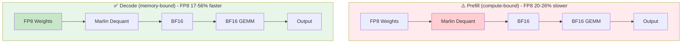
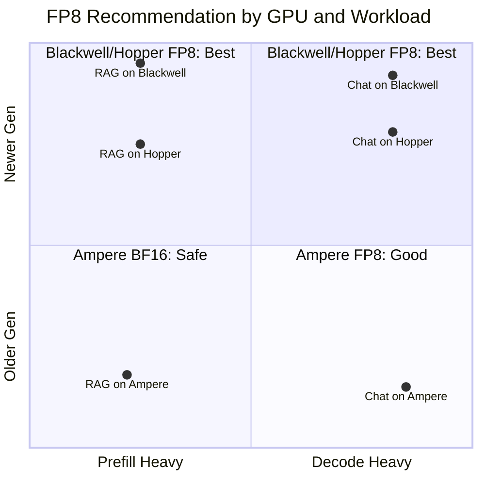

# FP8 Performance Validation Across GPU Architectures

> Comprehensive FP8 inference performance validation across GPU architectures: H100 (Hopper), A100 (Ampere), and RTX PRO 6000 (Blackwell)

## 🎯 Overview

This benchmark provides quantitative analysis of **FP8 vs BF16 inference performance** across three GPU generations with fundamentally different FP8 implementation strategies.

### Technical Architecture

| GPU | Architecture | FP8 Execution Path | Key Feature |
|-----|--------------|-------------------|-------------|
| **A100** | Ampere SM80 | FP8 weights → **Marlin Dequant** → BF16 → BF16 GEMM | ⚠️ Dequantization overhead |
| **H100** | Hopper SM90 | FP8 weights → FP8 activations → **Native FP8 GEMM** | ✅ 2x FLOPS (1979 TFLOPS) |
| **RTX 6000** | Blackwell SM120 | FP8 weights → **Native FP8 GEMM** | ✅ Next-gen + Native FP8 |

**Execution Flow Comparison:**

```
┌─────────────────────────────────────────────────────────────────────────────┐
│ A100 (Ampere SM80) - No Native FP8                                          │
│ FP8 Weights ──→ [Marlin Dequant] ──→ BF16 ──→ [BF16 Tensor Core] ──→ Output │
│                 ⚠️ Extra step                                                │
├─────────────────────────────────────────────────────────────────────────────┤
│ H100 (Hopper SM90) - Native FP8                                             │
│ FP8 Weights ──→ FP8 Activations ──→ [FP8 Tensor Core] ──→ Output            │
│                                     ✅ Direct execution                      │
├─────────────────────────────────────────────────────────────────────────────┤
│ RTX 6000 (Blackwell SM120) - Native FP8                                     │
│ FP8 Weights ──→ [FP8 Tensor Core] ──→ Output                                │
│                 ✅ Direct execution, next-gen architecture                   │
└─────────────────────────────────────────────────────────────────────────────┘
```

### 🔥 Key Findings Summary

| GPU | Architecture | FP8 Prefill vs BF16 | FP8 Decode vs BF16 | Recommendation |
|-----|--------------|---------------------|--------------------|--------------------|
| **RTX 6000** | Blackwell SM120 | **+59~65%** ✅ | **+11~26%** ✅ | **FP8 for ALL scenarios** |
| **H100** | Hopper SM90 | **+29~38%** ✅ | **+36~43%** ✅ | **FP8 for ALL scenarios** |
| **A100** | Ampere SM80 | **-20~26%** ⚠️ | **+17~56%** ✅ | FP8 only for decode-heavy workloads |

> ⚠️ **Major Discovery**: 
> - **RTX 6000 Blackwell** shows the highest FP8 prefill improvement (+65%), demonstrating next-gen architecture benefits
> - **H100 Hopper** delivers consistent 30-40% speedup across all scenarios with native FP8 Tensor Core
> - **A100 Ampere** without native FP8 shows 20-26% slowdown on prefill due to Marlin dequantization overhead

## 📊 Test Results

### RTX 6000 Blackwell Two-Way Comparison (2026-01-04)

> **Test Configuration**: NVIDIA RTX PRO 6000 Blackwell (96GB vGPU), vLLM 0.13.0rc2+cu130, CUDA 13.0
> 
> ⚠️ **Note**: Runtime FP8 (`--quantization fp8`) is not yet supported on Blackwell SM120 architecture in vLLM 0.13.0rc2. Only pre-quantized FP8 models work.

| Scenario | BF16 | FP8 Pre-quant | FP8 vs BF16 |
|----------|------|---------------|-------------|
| **Prefill Single** | 9,860 tok/s | 16,309 tok/s | **+65.4%** ✅ |
| **Prefill 50 Concurrent** | 12,250 tok/s | 19,461 tok/s | **+58.9%** ✅ |
| **Decode Single** | 44 tok/s | 48 tok/s | **+10.6%** ✅ |
| **Decode 50 Concurrent** | 1,777 tok/s | 2,235 tok/s | **+25.8%** ✅ |

**Memory Usage (RTX 6000)**:
| Configuration | Model Memory | Notes |
|---------------|--------------|-------|
| BF16 | 27.57 GiB | Full precision weights |
| FP8 Pre-quant | 15.39 GiB | **44% reduction** |

### H100 Three-Way Comparison (2026-01-04)

> **Test Configuration**: NVIDIA H100 NVL 96GB, vLLM 0.13.0, PyTorch 2.9.0+cu128

| Scenario | BF16 | FP8 Runtime | FP8 Pre-quant | FP8 vs BF16 |
|----------|------|-------------|---------------|-------------|
| **Prefill Single** | 14,298 tok/s | 19,703 tok/s | 19,655 tok/s | **+37.8%** ✅ |
| **Prefill 50 Concurrent** | 14,415 tok/s | 18,647 tok/s | 18,720 tok/s | **+29.4%** ✅ |
| **Decode Single** | 89 tok/s | 127 tok/s | 126 tok/s | **+42.7%** ✅ |
| **Decode 50 Concurrent** | 3,044 tok/s | 4,140 tok/s | 4,110 tok/s | **+36.0%** ✅ |

**Memory Usage (H100)**:
| Configuration | Model Memory | Available KV Cache |
|---------------|--------------|-------------------|
| BF16 | 27.57 GiB | 50.44 GiB |
| FP8 Runtime | 15.36 GiB | 62.64 GiB |
| FP8 Pre-quant | 15.39 GiB | 62.62 GiB |

### A100 Three-Way Comparison (2026-01-03)

> **Test Configuration**: NVIDIA A100 80GB PCIe, vLLM 0.11.2

| Scenario | BF16 | FP8 Runtime | FP8 Pre-quant | FP8 vs BF16 |
|----------|------|-------------|---------------|-------------|
| **Prefill Single** | 6,555 tok/s | 5,251 tok/s | 5,277 tok/s | **-19.8%** ⚠️ |
| **Prefill 50 Concurrent** | 7,221 tok/s | 5,335 tok/s | 5,352 tok/s | **-26.1%** ⚠️ |
| **Decode Single** | 47 tok/s | 73 tok/s | 73 tok/s | **+55.3%** ✅ |
| **Decode 50 Concurrent** | 1,702 tok/s | 1,999 tok/s | 2,031 tok/s | **+17.4%** ✅ |

### Cross-GPU Performance Comparison

| Scenario | A100 BF16 | H100 BF16 | RTX 6000 BF16 | H100 vs A100 | RTX 6000 vs A100 |
|----------|-----------|-----------|---------------|--------------|------------------|
| Prefill Single | 6,555 tok/s | 14,298 tok/s | 9,860 tok/s | **2.18x** | **1.50x** |
| Prefill 50 Conc | 7,221 tok/s | 14,415 tok/s | 12,250 tok/s | **2.00x** | **1.70x** |
| Decode Single | 47 tok/s | 89 tok/s | 44 tok/s | **1.89x** | 0.94x |
| Decode 50 Conc | 1,702 tok/s | 3,044 tok/s | 1,777 tok/s | **1.79x** | **1.04x** |

> 📝 **Note**: RTX 6000 results are from a vGPU environment (96GB partition), which may have different performance characteristics than bare-metal.

## 🔬 Technical Analysis

### Why Different GPUs Show Different FP8 Behavior?

**FP8 Execution Path by GPU Generation:**

```
RTX 6000 (Blackwell SM120):
  FP8 Weights → [FP8 Tensor Core] → Native FP8 GEMM → Output
               ✅ Direct execution, next-gen architecture

H100 (Hopper SM90):  
  FP8 Weights → [FP8 Tensor Core] → Direct FP8 GEMM → Output
               ✅ Native support, 1979 TFLOPS

A100 (Ampere SM80):
  FP8 Weights → [Marlin Kernel] → FP8→BF16 Dequant → BF16 GEMM → Output
               ⚠️ Extra dequantization step, 312 TFLOPS
```

| Factor | RTX 6000 (Blackwell) | H100 (Hopper) | A100 (Ampere) |
|--------|----------------------|---------------|---------------|
| Architecture | SM120 | SM90 | SM80 |
| FP8 Tensor Core | ✅ Native (5th Gen) | ✅ Native (4th Gen) | ❌ Not available |
| CUDA Compute | 13.0 | 12.8 | 12.6 |
| FP8 Execution | Direct FP8 GEMM | Direct FP8 GEMM | FP8→BF16 dequant + BF16 GEMM |
| Prefill (compute-bound) | **FP8 +65% faster** | FP8 +38% faster | FP8 20-26% slower |
| Decode (memory-bound) | FP8 +26% faster | FP8 +36% faster | FP8 +17-56% faster |
| Runtime FP8 Support | ❌ Not yet in vLLM | ✅ Supported | ✅ Supported |

### Marlin Kernel: Why Dequantization Overhead Matters

> 📚 **Reference**: Benjamin Marie, *"The Kaitchup: LLMs on a Budget"* (Chapter 3.4.3)

Our A100 test results align with theoretical analysis from the LLM quantization community:

**Key insight from Benjamin Marie:**
> "Even for a batch size of 1, Marlin is faster than all existing frameworks/formats, including standard GPTQ and AWQ which both already use custom kernels for fast inference. **Even more remarkable, from a batch size of 8, these frameworks are slower than FP16 inference** while Marlin remains almost 4x faster. If you use vLLM for inference, the GPTQ and AWQ are automatically converted to the Marlin format for faster inference."

**How this applies to our FP8 findings:**

| Observation | Benjamin (INT4 Quantization) | Our Test (FP8 Quantization) | Consistency |
|-------------|------------------------------|-----------------------------|----|
| Dequant overhead exists | ✅ batch≥8: INT4 slower than FP16 | ✅ A100 Prefill: FP8 -26% vs BF16 | ✅ |
| Memory-bound benefits | ✅ Marlin still 4x faster | ✅ A100 Decode: FP8 +17-56% | ✅ |
| vLLM auto-optimization | ✅ Auto-converts to Marlin | ✅ Uses Marlin for FP8→BF16 | ✅ |

**Why A100 shows different behavior for Prefill vs Decode:**



> **Key Difference**: Prefill is compute-bound where dequant overhead exceeds bandwidth savings; Decode is memory-bound where 50% memory reduction provides bandwidth savings that exceed dequant cost.

This validates Benjamin's theory: **dequantization overhead is real**, but whether it hurts or helps depends on whether the workload is compute-bound (prefill) or memory-bound (decode).

<details>
<summary>📋 <b>A100 Test Log Evidence</b> (click to expand)</summary>

**Test Environment**: NVIDIA A100 80GB PCIe, Driver 590.44.01, CUDA 12.6, vLLM 0.11.2

```json
// From results/a100_comparison_summary.json
{
  "results": {
    "prefill_single": {
      "bf16": 6555.03,        // BF16 baseline
      "fp8_runtime": 5250.79, // FP8 19.9% slower
      "fp8_prequant": 5277.27 // FP8 19.5% slower
    },
    "prefill_concurrent": {
      "bf16": 7220.65,        // BF16 baseline  
      "fp8_runtime": 5334.67, // FP8 26.1% slower ⚠️
      "fp8_prequant": 5352.13 // FP8 25.9% slower ⚠️
    },
    "decode_single": {
      "bf16": 47.06,          // BF16 baseline
      "fp8_runtime": 73.21,   // FP8 55.6% faster ✅
      "fp8_prequant": 73.24   // FP8 55.6% faster ✅
    },
    "decode_concurrent": {
      "bf16": 1701.91,        // BF16 baseline
      "fp8_runtime": 1999.06, // FP8 17.5% faster ✅
      "fp8_prequant": 2030.53 // FP8 19.3% faster ✅
    }
  },
  "key_finding": "Runtime FP8 and Pre-quantized FP8 show nearly identical 
    inference performance on A100. The main overhead comes from Marlin 
    kernel FP8→BF16 dequantization, which is the same for both methods."
}
```

**Data Interpretation**:
- ⚠️ **Prefill (compute-bound)**: FP8 20-26% slower than BF16, validates Marlin dequant overhead
- ✅ **Decode (memory-bound)**: FP8 17-56% faster than BF16, bandwidth savings > dequant cost
- 🔄 **Runtime vs Pre-quant**: Nearly identical performance, proving overhead is from inference-time dequant, not loading

</details>

<details>
<summary>📋 <b>A100 Test Log Evidence</b> (click to expand)</summary>

**Test Environment**: NVIDIA A100 80GB PCIe, Driver 590.44.01, CUDA 12.6, vLLM 0.11.2

```json
// From results/a100_comparison_summary.json
{
  "results": {
    "prefill_single": {
      "bf16": 6555.03,        // BF16 baseline
      "fp8_runtime": 5250.79, // FP8 19.9% slower
      "fp8_prequant": 5277.27 // FP8 19.5% slower
    },
    "prefill_concurrent": {
      "bf16": 7220.65,        // BF16 baseline  
      "fp8_runtime": 5334.67, // FP8 26.1% slower ⚠️
      "fp8_prequant": 5352.13 // FP8 25.9% slower ⚠️
    },
    "decode_single": {
      "bf16": 47.06,          // BF16 baseline
      "fp8_runtime": 73.21,   // FP8 55.6% faster ✅
      "fp8_prequant": 73.24   // FP8 55.6% faster ✅
    },
    "decode_concurrent": {
      "bf16": 1701.91,        // BF16 baseline
      "fp8_runtime": 1999.06, // FP8 17.5% faster ✅
      "fp8_prequant": 2030.53 // FP8 19.3% faster ✅
    }
  },
  "key_finding": "Runtime FP8 and Pre-quantized FP8 show nearly identical 
    inference performance on A100. The main overhead comes from Marlin 
    kernel FP8→BF16 dequantization, which is the same for both methods."
}
```

**Data Interpretation**:
- ⚠️ **Prefill (compute-bound)**: FP8 20-26% slower than BF16, validates Marlin dequant overhead
- ✅ **Decode (memory-bound)**: FP8 17-56% faster than BF16, bandwidth savings > dequant cost
- 🔄 **Runtime vs Pre-quant**: Nearly identical performance, proving overhead is from inference-time dequant, not loading

</details>

### Why Runtime and Pre-quantized FP8 Have Same Speed?

```
Runtime FP8:
  BF16 Weights → [Runtime BF16→FP8 Quantization] → FP8 → [Inference Kernel] → Output
                 ↑ Happens at model loading time

Pre-quantized FP8:
  FP8 Weights → FP8 → [Inference Kernel] → Output
               ↑ Already quantized on disk
               
                    ║
                    ↓
         Same Inference Path! ✅
```

**Key insight**: The inference kernel execution is identical regardless of how weights were quantized. Pre-quantization only saves model loading time and disk space.

**Pre-quantized advantages** (not inference speed):
- 🚀 Faster model loading (50% smaller files)
- 💾 Lower disk storage requirements
- 🧠 Same VRAM usage during inference

## 💡 Recommendations

### GPU Selection Guide



### Decision Matrix

| Workload Type | RTX 6000 (Blackwell) | H100 (Hopper) | A100 (Ampere) |
|---------------|----------------------|---------------|---------------|
| **RAG / Long Context** | ✅ FP8 (+59-65%) | ✅ FP8 (+30%) | ⚠️ BF16 (FP8 is -26% slower) |
| **Chatbot / Streaming** | ✅ FP8 (+26%) | ✅ FP8 (+36%) | ✅ FP8 (+17~56%) |
| **Batch Processing** | ✅ FP8 (+59%) | ✅ FP8 (+29%) | ⚠️ BF16 (FP8 is -26% slower) |
| **Memory Constrained** | ✅ FP8 (44% less VRAM) | ✅ FP8 (44% less VRAM) | ✅ FP8 (50% less VRAM) |

### Performance Summary by Use Case

| Use Case | GPU | Quantization | Expected Gain |
|----------|-----|--------------|---------------|
| Long Prompt/RAG | **RTX 6000** | FP8 | **+59-65%** (Prefill) |
| Long Prompt/RAG | **H100** | FP8 | **+30%** (Prefill) |
| Long Prompt/RAG | A100 | **BF16** | Avoid 20-26% slowdown |
| Chat/Streaming | RTX 6000 | FP8 | **+26%** (Decode) |
| Chat/Streaming | H100 | FP8 | **+36%** (Decode) |
| Chat/Streaming | A100 | FP8 | **+17~56%** (Decode) |
| Memory-constrained | All | FP8 | **44-50% VRAM reduction** |

## 🚀 Reproducible Benchmarking

### Environment Setup

```bash
# Install dependencies
pip install -r requirements.txt

# Verify environment
python -c "import vllm; print(f'vLLM: {vllm.__version__}')"
nvidia-smi --query-gpu=name,driver_version --format=csv
```

### Fair Testing Protocol

```bash
# Clone repository
git clone https://github.com/davidsajare/H100-A100-RTX6000-FP8-Benchmark.git
cd H100-A100-RTX6000-FP8-Benchmark

# Phase 1: BF16 Baseline
vllm serve Qwen/Qwen2.5-14B-Instruct \
    --port 8080 --max-model-len 4096

python benchmark_fair.py --output results/bf16_results.json

# Phase 2: FP8 Runtime Quantization (H100/A100 only)
pkill -f vllm && sleep 5
vllm serve Qwen/Qwen2.5-14B-Instruct \
    --port 8080 --max-model-len 4096 \
    --quantization fp8

python benchmark_fair.py --output results/fp8_runtime_results.json

# Phase 3: FP8 Pre-quantized Model
pkill -f vllm && sleep 5
vllm serve neuralmagic/Qwen2.5-14B-Instruct-FP8-dynamic \
    --port 8080 --max-model-len 4096

python benchmark_fair.py --model "neuralmagic/Qwen2.5-14B-Instruct-FP8-dynamic" \
    --output results/fp8_prequant_results.json
```

## 📁 Test Environments

### RTX 6000 Blackwell Test Environment (2026-01-04)

| Component | Specification |
|-----------|---------------|
| GPU | NVIDIA RTX PRO 6000 Blackwell DC-4-96Q (vGPU) |
| Architecture | Blackwell SM120 |
| VRAM | 96 GB (vGPU partition) |
| Driver | 580.105.08 |
| CUDA | 13.0 |
| vLLM | 0.13.0rc2.dev259+cu130 |
| PyTorch | 2.9.0.dev20250526+cu130 |
| Model (BF16) | Qwen/Qwen2.5-14B-Instruct |
| Model (FP8 Pre-quant) | /root/models/Qwen2.5-14B-Instruct-FP8 |

### H100 Test Environment (2026-01-04)

| Component | Specification |
|-----------|---------------|
| GPU | NVIDIA H100 NVL 96GB |
| Architecture | Hopper SM90 |
| Driver | 570.195.03 |
| CUDA | 12.8 |
| vLLM | 0.13.0 |
| PyTorch | 2.9.0+cu128 |
| Model (BF16) | Qwen/Qwen2.5-14B-Instruct |
| Model (FP8 Pre-quant) | RedHatAI/Qwen2.5-14B-Instruct-FP8-dynamic |

### A100 Test Environment (2026-01-03)

| Component | Specification |
|-----------|---------------|
| GPU | NVIDIA A100 80GB PCIe |
| Architecture | Ampere SM80 |
| Driver | 590.44.01 |
| CUDA | 12.6 |
| vLLM | 0.11.2 |
| Model (BF16) | Qwen/Qwen2.5-14B-Instruct |
| Model (FP8 Pre-quant) | neuralmagic/Qwen2.5-14B-Instruct-FP8-dynamic |

## 📋 Raw Test Logs

All raw benchmark data is available in `results/` directory:

| File | Description |
|------|-------------|
| [`rtx6000_bf16.json`](results/rtx6000_bf16.json) | RTX 6000 Blackwell BF16 baseline raw data |
| [`rtx6000_fp8_prequant.json`](results/rtx6000_fp8_prequant.json) | RTX 6000 Blackwell FP8 Pre-quant raw data |
| [`h100_bf16.json`](results/h100_bf16.json) | H100 BF16 baseline raw data |
| [`h100_fp8_runtime.json`](results/h100_fp8_runtime.json) | H100 FP8 Runtime raw data |
| [`h100_fp8_prequant.json`](results/h100_fp8_prequant.json) | H100 FP8 Pre-quant raw data |
| [`h100_comparison_summary.json`](results/h100_comparison_summary.json) | H100 three-way comparison |
| [`a100_fair_test_results.json`](results/a100_fair_test_results.json) | A100 BF16 baseline raw data |
| [`a100_fp8_prequant.json`](results/a100_fp8_prequant.json) | A100 FP8 Pre-quant raw data |
| [`a100_comparison_summary.json`](results/a100_comparison_summary.json) | A100 three-way comparison |

<details>
<summary>📋 Click to view RTX 6000 Blackwell BF16 raw test output</summary>

```json
{
  "model": "Qwen/Qwen2.5-14B-Instruct",
  "gpu": "RTX PRO 6000 Blackwell (96GB vGPU)",
  "prefill_single": {
    "runs": [6248.92, 11655.36, 11676.90],
    "average": 9860.39,
    "unit": "tok/s"
  },
  "prefill_concurrent": {
    "runs": [12277.02, 12248.91, 12225.47],
    "average": 12250.47,
    "unit": "tok/s"
  },
  "decode_single": {
    "runs": [43.75, 43.85, 43.43],
    "average": 43.68,
    "unit": "tok/s"
  },
  "decode_concurrent": {
    "runs": [1775.79, 1779.16, 1775.45],
    "average": 1776.80,
    "unit": "tok/s"
  }
}
```

</details>

<details>
<summary>📋 Click to view RTX 6000 Blackwell FP8 Pre-quantized raw test output</summary>

```json
{
  "model": "/root/models/Qwen2.5-14B-Instruct-FP8",
  "gpu": "RTX PRO 6000 Blackwell (96GB vGPU)",
  "prefill_single": {
    "runs": [12802.21, 17975.23, 18149.01],
    "average": 16308.82,
    "unit": "tok/s"
  },
  "prefill_concurrent": {
    "runs": [19463.53, 19488.59, 19429.57],
    "average": 19460.56,
    "unit": "tok/s"
  },
  "decode_single": {
    "runs": [48.47, 48.13, 48.30],
    "average": 48.30,
    "unit": "tok/s"
  },
  "decode_concurrent": {
    "runs": [2247.93, 2216.13, 2241.57],
    "average": 2235.21,
    "unit": "tok/s"
  }
}
```

</details>

<details>
<summary>📋 Click to view H100 BF16 raw test output</summary>

```json
{
  "prefill_single": {
    "runs": [11871.30, 15581.87, 15439.46],
    "average": 14297.55,
    "unit": "tok/s"
  },
  "prefill_concurrent": {
    "runs": [14431.96, 14404.43, 14408.21],
    "average": 14414.87,
    "unit": "tok/s"
  },
  "decode_single": {
    "runs": [88.92, 89.52, 89.55],
    "average": 89.33,
    "unit": "tok/s"
  },
  "decode_concurrent": {
    "runs": [3033.34, 3046.80, 3052.26],
    "average": 3044.13,
    "unit": "tok/s"
  }
}
```

</details>

<details>
<summary>📋 Click to view H100 FP8 Runtime raw test output</summary>

```json
{
  "prefill_single": {
    "runs": [18808.08, 20098.74, 20203.42],
    "average": 19703.41,
    "unit": "tok/s"
  },
  "prefill_concurrent": {
    "runs": [18661.07, 18651.44, 18627.58],
    "average": 18646.70,
    "unit": "tok/s"
  },
  "decode_single": {
    "runs": [125.58, 127.46, 127.48],
    "average": 126.84,
    "unit": "tok/s"
  },
  "decode_concurrent": {
    "runs": [4142.20, 4109.55, 4167.08],
    "average": 4139.61,
    "unit": "tok/s"
  }
}
```

</details>

<details>
<summary>📋 Click to view H100 FP8 Pre-quantized raw test output</summary>

```json
{
  "model": "RedHatAI/Qwen2.5-14B-Instruct-FP8-dynamic",
  "prefill_single": {
    "runs": [18878.68, 20060.40, 20026.24],
    "average": 19655.11,
    "unit": "tok/s"
  },
  "prefill_concurrent": {
    "runs": [18792.58, 18781.51, 18587.15],
    "average": 18720.41,
    "unit": "tok/s"
  },
  "decode_single": {
    "runs": [124.89, 126.62, 126.67],
    "average": 126.06,
    "unit": "tok/s"
  },
  "decode_concurrent": {
    "runs": [4094.85, 4129.49, 4107.12],
    "average": 4110.49,
    "unit": "tok/s"
  }
}
```

</details>

<details>
<summary>📋 Click to view A100 BF16 raw test output</summary>

```json
{
  "prefill_single": {
    "runs": [5354.49, 7137.71, 7172.88],
    "average": 6555.03,
    "unit": "tok/s"
  },
  "prefill_concurrent": {
    "runs": [7300.52, 7215.19, 7146.24],
    "average": 7220.65,
    "unit": "tok/s"
  },
  "decode_single": {
    "runs": [46.94, 47.10, 47.13],
    "average": 47.06,
    "unit": "tok/s"
  },
  "decode_concurrent": {
    "runs": [1703.24, 1704.96, 1697.53],
    "average": 1701.91,
    "unit": "tok/s"
  }
}
```

</details>

<details>
<summary>📋 Click to view A100 FP8 Pre-quantized raw test output</summary>

```json
{
  "model": "neuralmagic/Qwen2.5-14B-Instruct-FP8-dynamic",
  "prefill_single": {
    "runs": [5177.91, 5321.54, 5332.36],
    "average": 5277.27,
    "unit": "tok/s"
  },
  "prefill_concurrent": {
    "runs": [5426.41, 5344.06, 5285.93],
    "average": 5352.13,
    "unit": "tok/s"
  },
  "decode_single": {
    "runs": [73.06, 73.26, 73.39],
    "average": 73.24,
    "unit": "tok/s"
  },
  "decode_concurrent": {
    "runs": [2018.94, 2031.90, 2040.74],
    "average": 2030.53,
    "unit": "tok/s"
  }
}
```

</details>

## 📝 Changelog

| Date | Update |
|------|--------|
| 2026-01-04 | **Added Marlin kernel analysis**: Benjamin Marie's theory validates our A100 dequantization overhead findings |
| 2026-01-04 | **RTX 6000 Blackwell benchmark added**: FP8 shows **+65% prefill, +26% decode** improvement |
| 2026-01-04 | Key finding: Blackwell SM120 has highest FP8 prefill gain across all tested GPUs |
| 2026-01-04 | Note: Runtime FP8 not yet supported on Blackwell in vLLM 0.13.0rc2 |
| 2026-01-04 | **H100 benchmark added**: FP8 shows +30-40% improvement across ALL scenarios |
| 2026-01-04 | Key finding: H100 native FP8 Tensor Core eliminates dequantization overhead |
| 2026-01-04 | Updated recommendations: H100 should always use FP8 |
| 2026-01-03 | A100 three-way comparison: BF16 vs FP8 Runtime vs FP8 Pre-quantized |
| 2026-01-03 | Key finding: Marlin dequant overhead dominates on A100 |
| 2026-01-03 | Added raw test logs in collapsible sections |

---

**Author**: Xinyu Wei (Microsoft AI and Apps GBB Architect)  
**Last Updated**: 2026-01-04
