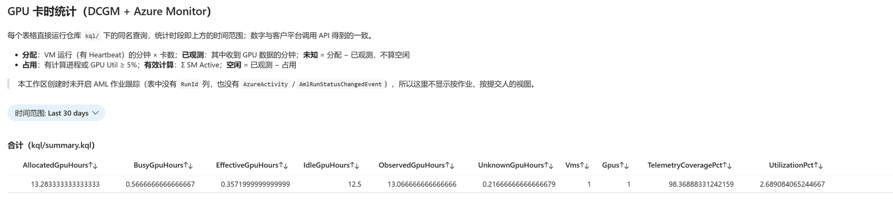
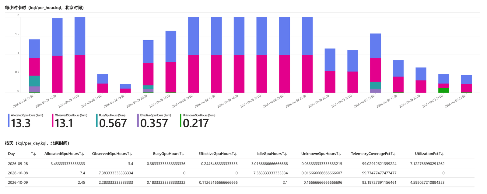
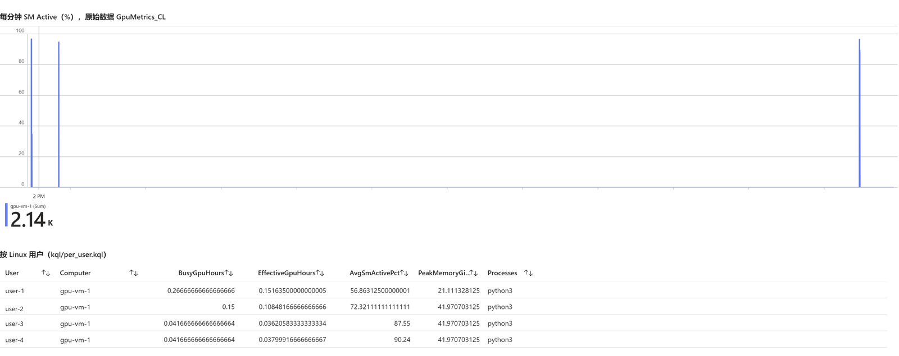

# Measure Azure GPU Hours with DCGM and Azure Monitor

[](#purpose)
[](#results)
[](https://github.com/david-xinyuwei/david-share/actions/workflows/azure-gpu-hours-monitoring-ci.yml)

Author: Xinyu Wei · [中文](README_CN.md)

## Purpose

Of the GPU hours you pay for on Azure GPU VMs, how many ran real work, and whose work was it? This repository collects NVIDIA DCGM metrics on each GPU VM and leaves everything else to Azure Monitor. You can then:
- see GPU hours per VM, hour, day, Linux user, AML job and submitter;
- view them in a workbook in the Azure portal;
- read them from your platform through the Log Analytics query API.

No custom storage, service or user interface is needed.


Metrics:

| Metric | Definition |
|---|---|
| Allocated GPU-hours | VM running minutes × GPUs ÷ 60, from the Azure Monitor Agent `Heartbeat` |
| Observed / unknown GPU-hours | GPU-minutes with / without GPU rows; unknown is not counted as idle |
| Busy GPU-hours | GPU-minutes with a compute process or GPU Util ≥ 5 % |
| Effective GPU-hours | Sum of SM Active, how much the GPU actually computed |

## Steps

**Deployment order.** Azure Monitor first, then each GPU VM; the one command in step 4 does the first four items in this order:

| Order | Where | What | Script |
|---|---|---|---|
| 1 | Azure subscription | Deploy Azure Monitor: Log Analytics workspace, `GpuMetrics_CL` table, data collection endpoint and rule | [`scripts/setup-workspace.sh`](scripts/setup-workspace.sh) |
| 2 | Each GPU VM, Azure side | Managed identity, Azure Monitor Agent, association with the rule and endpoint | [`scripts/onboard-vm.sh`](scripts/onboard-vm.sh) |
| 3 | Each GPU VM, inside through Run Command | Start DCGM (`systemctl enable --now nvidia-dcgm`), install and start the `gpumon` collector | [`vm/gpu_collector.py`](vm/gpu_collector.py) |
| 4 | Log Analytics | Wait for every VM's rows | [`scripts/configure.sh`](scripts/configure.sh) |

**Prerequisites.**
- Work in Azure Cloud Shell (Bash); no SSH to any VM;
- Contributor on the VM resource group; AML job attribution also needs subscription diagnostic settings; granting your platform access needs Owner or User Access Administrator;
- GPU VMs with the NVIDIA driver and DCGM ([Azure HPC images](https://learn.microsoft.com/azure/virtual-machines/azure-hpc-vm-images) include both); standalone VMs or a Flexible scale set;
- Outbound HTTPS from the VMs to Azure Monitor.

**1. Download the scripts.**

```bash
git clone --filter=blob:none --sparse https://github.com/david-xinyuwei/david-share.git
cd david-share && git sparse-checkout set Deep-Learning/Azure-GPU-Hours-Monitoring
cd Deep-Learning/Azure-GPU-Hours-Monitoring && chmod +x scripts/*.sh
```

**2. Fill in the settings file.** The subscription, resource groups and IDs are typed once, here; later commands read variables from this file and from the `gpu-hours.outputs.env` it produces:

```bash
cp scripts/gpu-hours.env.example gpu-hours.env
```

| Setting | Value |
|---|---|
| `SUBSCRIPTION_ID` | Subscription of the GPU VMs; empty uses the current one |
| `WORKSPACE_RG`, `LOCATION`, `WORKSPACE_NAME` | New monitoring resource group, region (same as the VMs), workspace name; defaults `rg-gpu-hours`, `law-gpu-hours` |
| `RETENTION_DAYS` | Days to keep the data, default 90 |
| `VM_RG`, `VMSS_NAME`, `VM_NAMES` | Resource group of the VMs; a Flexible scale set (all instances are listed) or space-separated VM names |
| `AML_WORKSPACE_ID` | AML workspace resource ID; turns on the per-job and per-submitter views |
| `READER_OBJECT_ID`, `READER_PRINCIPAL_TYPE` | Object ID and type of your platform's query identity; may stay empty until step 7 |
| `SKIP_NOT_READY_VMS`, `PARALLEL`, `WAIT_MINUTES` | Skip VMs that are not ready (0/1); VMs onboarded at a time; minutes to wait for rows |

**3. Preflight (read-only, changes nothing).**

```bash
./scripts/configure.sh -c gpu-hours.env -p
```

Each VM prints `OK gpus: <n> dcgm: <version>`. A `NOT_READY` line names what is missing: the VM is stopped, or `dcgmi`, `nvidia-smi` or `python3` is absent.

**4. Configure with one command.**

```bash
./scripts/configure.sh -c gpu-hours.env
```

It does items 1–4 of the deployment order, does not reboot VMs or touch running training, and is safe to rerun. At the end it writes `WORKSPACE_GUID`, `WORKSPACE_RESOURCE_ID`, `DCR_ID` and `DCE_ID` to `gpu-hours.outputs.env`.

| Exit | Meaning | What to do |
|---|---|---|
| 0 | Every VM is sending rows | Go to step 5 |
| 1 | A command failed | Read the last printed step and the logs under `gpu-hours-logs/`, fix, rerun |
| 2 | Some VMs failed to onboard | Read `gpu-hours-logs/<time>/onboard.<vm>.log`, fix, rerun |
| 3 | Timed out, some VMs have no rows yet | `./scripts/configure.sh -c gpu-hours.env -v` waits again |

**5. AML jobs: pass the job ID to the GPU processes (only for per-job views).** Nothing changes when the GPU processes run inside the AML job container. When your launcher starts them on the hosts, pass `AZUREML_RUN_ID` on:

```bash
ssh "$HOST" "env AZUREML_RUN_ID=$AZUREML_RUN_ID torchrun ..."   # over SSH
mpirun -x AZUREML_RUN_ID ...                                      # across hosts
docker run -e AZUREML_RUN_ID ...                                  # a container on the host
```

**6. Deploy the workbook.**

```bash
source gpu-hours.outputs.env
./scripts/deploy-workbook.sh -g "$WORKSPACE_RG" -w "$WORKSPACE_NAME"   # prints the portal link
```

**7. Create a read-only sign-in identity for your platform.** When the platform runs on Azure, use its managed identity: put its principal ID in `READER_OBJECT_ID` and rerun step 4. Outside Azure, use an app registration:

```bash
./scripts/create-query-identity.sh -g "$WORKSPACE_RG" -w "$WORKSPACE_NAME"
./scripts/query-gpu-hours.sh -c gpu-hours.query.env -q kql/summary.kql -t P1D   # check sign-in and query
```

`create-query-identity.sh` grants only Log Analytics Reader on the workspace and writes the tenant ID, client ID, secret and workspace GUID to `gpu-hours.query.env`. The file is mode 600 and git-ignored, and the secret is never printed. `query-gpu-hours.sh` needs only `curl` and `jq`; exit 4 means the sign-in was refused, 5 that the identity cannot query.

**8. Call the query API from your platform.** Exchange the client credentials for a token, then query with it; the query is the full text of one file in [`kql/`](kql/):

```http
POST https://login.microsoftonline.com/<AZURE_TENANT_ID>/oauth2/v2.0/token
grant_type=client_credentials&client_id=<AZURE_CLIENT_ID>&client_secret=<AZURE_CLIENT_SECRET>&scope=https://api.loganalytics.io/.default

POST https://api.loganalytics.azure.com/v1/workspaces/<WORKSPACE_GUID>/query
Authorization: Bearer <access_token>
{"query": "<full text of kql/per_job.kql>", "timespan": "<start>/<end>"}
```

From Python, use the reference client: `python examples/gpu_hours_client.py --credentials gpu-hours.query.env --view per_job --start <start> --end <end>`.

| View | One row per |
|---|---|
| [`summary`](kql/summary.kql), [`per_vm`](kql/per_vm.kql) | all VMs together; VM |
| [`per_hour`](kql/per_hour.kql), [`per_day`](kql/per_day.kql) | hour; day (Beijing time by default) |
| [`per_user`](kql/per_user.kql) | Linux user |
| [`per_job`](kql/per_job.kql), [`per_submitter`](kql/per_submitter.kql) | AML job, with submitter and status; submitter |
| [`live`](kql/live.kql) | latest row for each job on each GPU |

**Offboard and remove.** Offboard one VM (the Azure Monitor Agent and DCGM stay), or remove the monitoring resources (dry run by default; `-y` removes; the resource group is never deleted):

```bash
source gpu-hours.outputs.env
./scripts/offboard-vm.sh -g "$VM_RG" -n "$VM_NAME" -d "$DCR_ID" -e "$DCE_ID"
./scripts/remove-workspace.sh -g "$WORKSPACE_RG" -w "$WORKSPACE_NAME" -a "$AML_WORKSPACE_ID"
```

## Results

**The workbook in the portal.** Screenshots from the test subscription; VM and Linux user names replaced with `gpu-vm-1` and `user-N`:







Time range, VMs and busy threshold are selectable at the top. Besides these panels the workbook shows sampling status, memory, power, the last 15 minutes of samples and GPUs without load for an hour. The per-job and per-submitter views appear only when job tracking is on.

**What each AML job used and who submitted it.** Three AML jobs ran as one Linux user; `per_job` returned (job and account names replaced):

<!-- BEGIN GENERATED: jobs-table -->
| Job | Submitter | Busy GPU-h | Effective GPU-h |
|---|---|---:|---:|
| `job-1` | `submitter-1` | 0.067 | 0.047 |
| `job-2` | `submitter-1` | 0.042 | 0.032 |
| `job-3` | `submitter-1` | 0.042 | 0.029 |

The three jobs add up to 0.150 busy GPU-hours, the Linux user's total; the 3 minutes two jobs shared count half for each.
<!-- END GENERATED: jobs-table -->

**Measured runs.** On one `Standard_NC40ads_H100_v5` (one H100 NVL, DCGM 3.3.9); raw and redacted output is in [`evidence/`](evidence/):

<!-- BEGIN GENERATED: results -->
| Run | Scenario | Result |
|---|---|---|
| `validation-1` | known load, 1 owner | 8 full, 3 held, 5 partial minutes, as scheduled; KQL equals an independent recomputation on 13 values |
| `replay-1` | 2 Linux users share 1 GPU | 0.042 busy GPU-hours each; the 3 shared minutes count half for each |
| `configure-2` | one-command setup | 588 s, exit 0; rerun 441 s; coverage 91.7 %; test resource group deleted |
| `jobs-1` | 3 AML jobs, 1 Linux user | split by job into 0.067, 0.042, 0.042 GPU-hours with the submitter; 11 values equal the recomputation |
| `auth-1` | platform signs in as an app registration | 8 views HTTP 200; wrong secret HTTP 401; no role HTTP 403 |
<!-- END GENERATED: results -->

**Limits.**
- Only a one-GPU VM was measured; your 8-GPU VMs and a 20-VM rollout were not. Scale-set listing and parallel onboarding ran only against a stand-in `az`. Run the step 3 preflight first.
- Process owners and job IDs are read once per minute: a job that exits mid-minute leaves that minute busy but possibly unattributed.
- The AML submitter comes from the Azure Activity log and arrives 6–9 minutes after the GPU rows.
- Allocated hours come from the agent heartbeat, not your bill; reconcile with Cost Management.
- Data volume: about 4.7 MB per day for one 8-GPU VM, billed at your region's Log Analytics price.

**Repository.** [`scripts/`](scripts/) setup scripts · [`vm/`](vm/) collector · [`azure/`](azure/) data collection rule and workbook template · [`kql/`](kql/) eight views · [`examples/`](examples/) reference client · [`evidence/`](evidence/) measured data · [`images/`](images/) figures · [`tests/`](tests/) and [`tools/`](tools/) offline checks (`python -m unittest discover -s tests`, run by CI on every commit).
