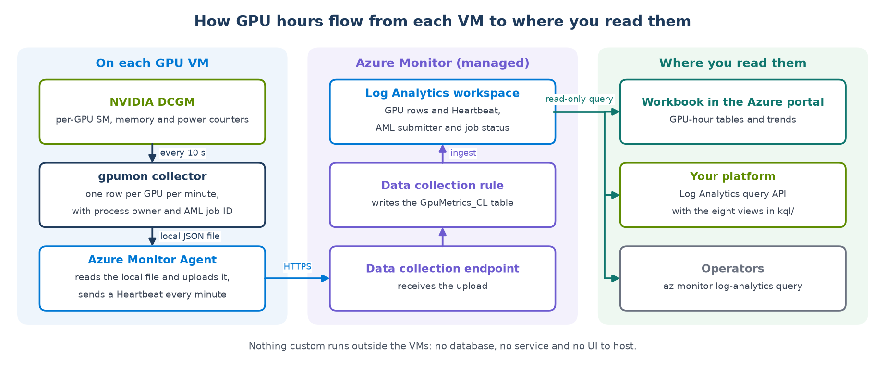
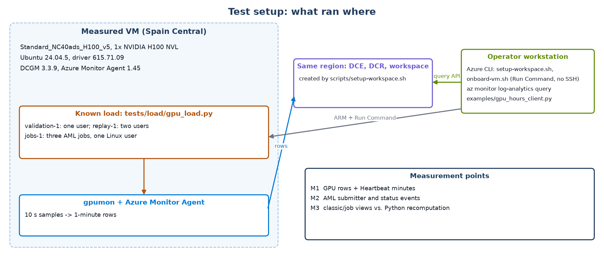
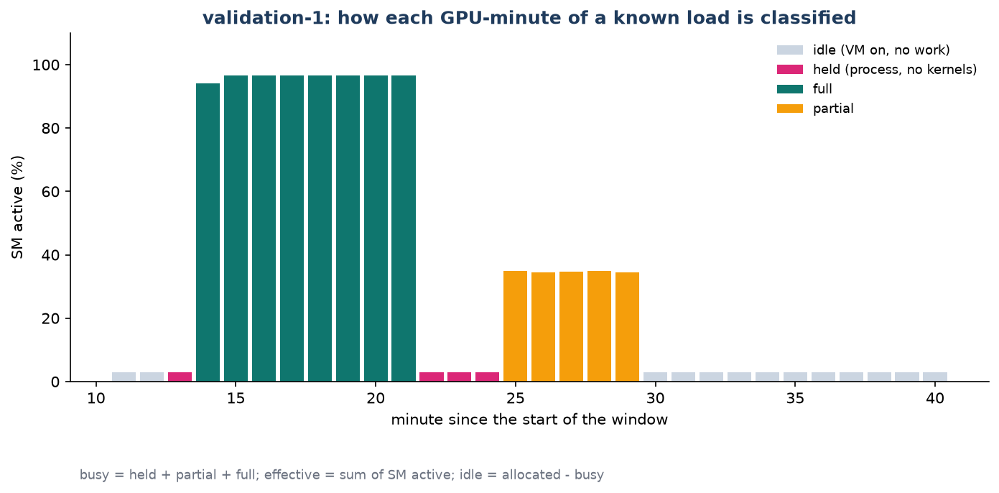
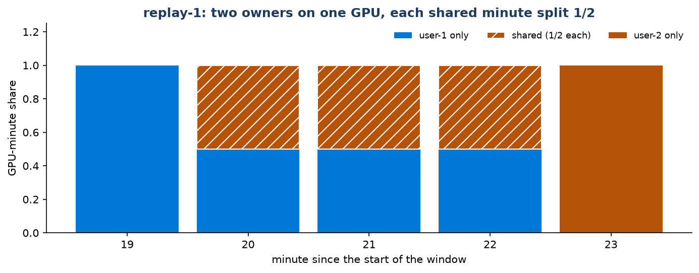

# Azure GPU-Hours Monitoring with DCGM and Azure Monitor

[](#architecture-and-metrics)
[](#architecture-and-metrics)
[](#validation-on-one-h100-vm)
[](https://github.com/david-xinyuwei/david-share/actions/workflows/azure-gpu-hours-monitoring-ci.yml)

**Of the GPU hours you pay for on Azure GPU VMs, how many ran real work, and whose work was it?** This repository measures that with NVIDIA DCGM inside each VM and Azure Monitor services outside it: the Azure Monitor Agent, a data collection rule and a Log Analytics workspace. It gives you the one collector that runs on the VM, every Azure configuration step as an `az` command, and eight KQL views that a platform API calls through the Log Analytics Query API. There is no custom storage and no user interface to run.



<!-- BEGIN GENERATED: glance -->
- On one H100 VM running a load with a known schedule, the pipeline recorded 8 full, 3 held and 5 partial GPU-minutes, the same split the load script scheduled; `summary`, `per_vm` and `per_user`, compared with an independent Python recomputation of the raw rows, agree on all 28 compared values.
- Three AML jobs ran there as one Linux user: `per_user` shows a single owner with 0.150 busy GPU-hours, while `per_job` splits them by job name (0.067, 0.042, 0.042), counts the 3 minutes two jobs shared as half each and names the Entra account that submitted them; KQL and Python agree on 11 values and 28 fields.
- `scripts/configure.sh` took one settings file to GPU rows in a new workspace in 588 s with exit 0; an idempotent rerun took 441 s and reused the same resources; the scripts it calls had earlier run verbatim against another new resource group: workspace setup 181 s, VM onboarding 102 s, removal 98 s.
- Log Analytics bills 343 bytes per GPU-minute row, about 4.74 MB per day for an 8-GPU VM including its Heartbeat.
- Main limit: process owners are sampled once per minute, so a job that exits mid-minute leaves that minute busy but unattributed (1 of 17 busy minutes in the first run, 1 of 6 in the second).
<!-- END GENERATED: glance -->

Author: Xinyu Wei · [中文](README_CN.md) · [Architecture](#architecture-and-metrics) · [Configure](#configure-on-azure) · [Query](#query-from-your-platform) · [Validation](#validation-on-one-h100-vm)

## Start Here

| Goal | Entry |
|---|---|
| Understand what is measured and how | [Architecture and Metrics](#architecture-and-metrics) |
| Set up a workspace and onboard GPU VMs | [Configure on Azure](#configure-on-azure): one settings file and `scripts/configure.sh` |
| Read the numbers from your platform API | [Query from Your Platform](#query-from-your-platform) |
| See the evidence that the numbers are right | [Validation on One H100 VM](#validation-on-one-h100-vm) |
| Run the checks without Azure | [Tests and Offline Checks](#tests-and-offline-checks) |

## What This Repository Delivers

- **GPU telemetry**: NVIDIA DCGM, installed with the driver stack. The repository reads it; it does not replace it.
- **Collection, storage and query**: Azure Monitor Agent, data collection endpoint and rule, Log Analytics and its Query API, all Azure-managed.
- **This repository adds**:
  - the collector that runs on each VM ([`vm/`](vm/));
  - the data collection rule ([`azure/`](azure/));
  - the configuration as one command, [`scripts/configure.sh`](scripts/configure.sh), driven by a settings file, and the step scripts of `az` commands it calls ([`scripts/`](scripts/));
  - eight views ([`kql/`](kql/)), including AML job and Entra submitter attribution;
  - a reference client for your API ([`examples/`](examples/));
  - the evidence and tests that check them ([`evidence/`](evidence/), [`tests/`](tests/), [`tools/`](tools/)).

You supply: GPU VMs with the NVIDIA driver and the DCGM package; Azure CLI with Contributor on the resource group; for the platform, an identity with the Log Analytics Reader role on the workspace.

Optional: an Azure Monitor workbook (configuration step 8). Not provided: a custom UI, alerting, reconciliation with your invoice, automatic attribution for jobs that do not propagate a run ID, and MIG instances.

**Cost sizing.** Use the [current Azure Monitor Logs pricing for your region](https://azure.microsoft.com/pricing/details/monitor/):

<!-- BEGIN GENERATED: cost-example -->
- Measured telemetry volume, not an invoice: one 8-GPU VM is about 4.74 MB/day; 20 such VMs for 30 days are about 2.84 GB/month for `GpuMetrics_CL` plus `Heartbeat`.
- Budget = that volume × the current regional Analytics Logs ingestion price, plus retention beyond the included interactive period. AML activity and status logs are additional and were not volume-measured here; the existing GPU VMs, network and customer platform are also outside this estimate.
<!-- END GENERATED: cost-example -->

## Architecture and Metrics

The GPU VM does two things. First, the NVIDIA DCGM host engine exposes each GPU's counters. Second, the collector samples them and appends one JSON line per GPU per minute to a local file. From there everything is Azure Monitor:

1. The Azure Monitor Agent reads the file and ingests the lines into the `GpuMetrics_CL` table through the data collection endpoint and rule.
2. The same agent writes one `Heartbeat` row per minute while the VM runs.
3. KQL joins the two tables into GPU hours.

**On the VM.** [`vm/gpu_collector.py`](vm/gpu_collector.py) is a systemd service (`gpumon`) installed by [`vm/install_collector.sh`](vm/install_collector.sh). It needs only Python's standard library. It runs:

<!-- BEGIN GENERATED: dcgm-command -->
```bash
dcgmi dmon -e 203,1001,1002,1004,1005,252,250,155,150 -d 10000
```
<!-- END GENERATED: dcgm-command -->

That is nine DCGM fields sampled every 10 s. Every minute, the collector averages each field per GPU and adds:
- the VM name, size, resource ID and tags from the instance metadata service;
- the Linux owner and name of every process on the GPU (`nvidia-smi --query-compute-apps` and `/proc/<pid>`);
- the `AZUREML_RUN_ID` value from each GPU process, when its launcher propagated that one variable.

It then appends one line per GPU to `/var/log/gpumon/gpu_metrics_<day>.json` and deletes files older than three days.

<!-- BEGIN GENERATED: dcgm-fields -->
- `203` `DCGM_FI_DEV_GPU_UTIL` → `GpuUtil`: busy threshold
- `1001` `DCGM_FI_PROF_GR_ENGINE_ACTIVE` → `GrActive`: reference
- `1002` `DCGM_FI_PROF_SM_ACTIVE` → `SmActive`: effective GPU-hours
- `1004` `DCGM_FI_PROF_PIPE_TENSOR_ACTIVE` → `TensorActive`: reference
- `1005` `DCGM_FI_PROF_DRAM_ACTIVE` → `DramActive`: reference
- `252` `DCGM_FI_DEV_FB_USED` → `FbUsedMiB`: memory in use
- `250` `DCGM_FI_DEV_FB_TOTAL` → `FbTotalMiB`: memory size
- `155` `DCGM_FI_DEV_POWER_USAGE` → `PowerW`: reference
- `150` `DCGM_FI_DEV_GPU_TEMP` → `TempC`: reference
<!-- END GENERATED: dcgm-fields -->

One line of that file, from the measured VM (names replaced):

<!-- BEGIN GENERATED: json-line -->
```json
{"TimeGenerated": "<minute start, UTC>", "VmName": "<vm-name>", "VmSize": "Standard_NC40ads_H100_v5", "VmResourceId": "<vm resource id>", "Tags": "", "GpuId": 0, "GpuUuid": "<GPU UUID>", "GpuName": "NVIDIA H100 NVL", "Samples": 6, "GpuUtil": 100, "GrActive": 0.9818, "SmActive": 0.9413, "TensorActive": 0.916, "DramActive": 0.1307, "FbUsedMiB": 21618, "FbTotalMiB": 95830, "PowerW": 397.6368, "TempC": 64.1667, "ProcCount": 1, "Users": "<linux user>", "Processes": "python3", "RunId": "<AML run ID>"}
```
<!-- END GENERATED: json-line -->

**In Azure Monitor.** The data collection rule [`azure/dcr-rule.json`](azure/dcr-rule.json) declares a `Custom-Json-GpuMetrics` stream with the same columns as the JSON line. It reads `/var/log/gpumon/*.json` and sends the rows to `GpuMetrics_CL`. The agent authenticates with the VM's managed identity and sends through the data collection endpoint. `Heartbeat` needs no configuration: every agent sends it.

**The metrics.** Every allocated GPU-minute is either observed or unknown; every observed minute is busy or idle. Effective work is a weighted amount inside the observed minutes.

| Metric | Definition | Source |
|---|---|---|
| Allocated GPU-hours | VM running minutes × GPUs ÷ 60 | `Heartbeat` minutes |
| Observed GPU-hours | distinct GPU-minutes received ÷ 60 | `GpuMetrics_CL` rows |
| Busy GPU-hours | GPU-minutes with a compute process or GPU util ≥ 5 % ÷ 60 | `ProcCount`, `GpuUtil` |
| Effective GPU-hours | Σ SM active ÷ 60 | `SmActive` |
| Idle GPU-hours | observed − busy | derived |
| Unknown GPU-hours | allocated − observed | derived; missing telemetry, never called idle |
| Telemetry coverage | observed ÷ allocated | derived |
| Utilization | effective ÷ allocated | derived |

Effective hours use SM active, not GPU util. `DCGM_FI_DEV_GPU_UTIL` reports the share of time any kernel ran, so a GPU running small kernels shows 100 %. `DCGM_FI_PROF_SM_ACTIVE` is the share of time the streaming multiprocessors had work. The two can differ: in the partial phase below, GPU util averaged 51 % while SM active averaged 35 %.

A process that keeps GPU memory without running kernels makes the GPU busy but not effective. That is the pattern to look for when reclaiming GPUs. Do not reclaim from idle hours alone unless telemetry coverage is acceptable for your policy; unknown hours mean the collector data was missing.

## Configure on Azure

This section takes GPU VMs that have the NVIDIA driver and DCGM to GPU rows in your own Log Analytics workspace. You fill in one settings file and run [`scripts/configure.sh`](scripts/configure.sh). It calls the step scripts listed under "What the command runs", needs no SSH to the VMs (everything on a VM goes through Run Command) and can be run again at any time: existing resources are updated in place.

**1. Check the prerequisites.**

| Item | Requirement |
|---|---|
| Shell | Bash with the Azure CLI, logged in with `az login`: Azure Cloud Shell, Linux, macOS, or Git Bash on Windows (the scripts set `MSYS_NO_PATHCONV=1` so resource IDs are not rewritten as paths) |
| Your role | Contributor on the VM resource group and on an existing workspace resource group. If `WORKSPACE_RG` does not exist, you also need permission at subscription scope to create resource groups, or an administrator must create it first |
| AML job attribution (optional) | Permission to create diagnostic settings on the subscription and on the AML workspace, for example Contributor or Monitoring Contributor |
| Query access for your platform (optional) | Owner or User Access Administrator inherited from a parent scope or assigned on the workspace, to grant Log Analytics Reader |
| GPU VMs | Running, with the NVIDIA driver, DCGM, `/usr/bin/python3` and systemd; step 4 checks each VM |
| VM forms | Standalone VMs, or a scale set with Flexible orchestration, whose instances are ordinary VMs; a Uniform scale set is rejected |
| Network | Outbound HTTPS from the VMs to Azure Monitor; if an NSG restricts outbound traffic, allow the `AzureMonitor` service tag |

The [Azure HPC VM images](https://learn.microsoft.com/azure/virtual-machines/azure-hpc-vm-images) include the driver and DCGM. On other images, install NVIDIA's `datacenter-gpu-manager` package, with the DCGM major version that matches your CUDA driver. The measured VM used an Ubuntu 24.04 image with that package.

**2. Download.**

```bash
git clone --filter=blob:none --sparse https://github.com/david-xinyuwei/david-share.git
cd david-share
git sparse-checkout set Deep-Learning/Azure-GPU-Hours-Monitoring
cd Deep-Learning/Azure-GPU-Hours-Monitoring
chmod +x scripts/*.sh
```

**3. Fill in the settings file.** Copy [`scripts/gpu-hours.env.example`](scripts/gpu-hours.env.example) to `gpu-hours.env` and edit it. The file uses Bash syntax; Windows line endings are tolerated. `gpu-hours.env`, `gpu-hours.outputs.env` and `gpu-hours-logs/` are git-ignored.

```bash
cp scripts/gpu-hours.env.example gpu-hours.env
```

| Setting | Meaning | Default |
|---|---|---|
| `SUBSCRIPTION_ID` | Subscription that holds the GPU VMs | the current `az account show` subscription |
| `WORKSPACE_RG`, `LOCATION` | Resource group and region of the workspace, created if missing. Use the VMs' region; if the group exists, `LOCATION` must be its region | `rg-gpu-hours`, none |
| `WORKSPACE_NAME` | Name of the Log Analytics workspace | `law-gpu-hours` |
| `VM_RG`, `VMSS_NAME`, `VM_NAMES` | The GPU VMs in `VM_RG`: every instance of a Flexible scale set, a space-separated list of VM names, or both | none |
| `AML_WORKSPACE_ID` | AML workspace resource ID; turns on the per-job and per-submitter views | empty |
| `READER_OBJECT_ID`, `READER_PRINCIPAL_TYPE` | Object ID of your platform's query identity; for a managed identity or an app registration, its service principal object ID | empty, `ServicePrincipal` |
| `RETENTION_DAYS` | Days Log Analytics keeps the rows; retention beyond the included period is billed per GB-month | 90 |
| `SKIP_NOT_READY_VMS` | `1` onboards the VMs that pass the preflight and lists the others; `0` stops before any change | 0 |
| `PARALLEL`, `WAIT_MINUTES` | VMs onboarded at a time; minutes to wait for the first rows | 5, 20 |

Look up the IDs:

```bash
az resource show -g <group> -n <aml-workspace> --resource-type Microsoft.MachineLearningServices/workspaces --query id -o tsv
az identity show -g <group> -n <managed-identity> --query principalId -o tsv   # user-assigned managed identity
az ad sp show --id <app-client-id> --query id -o tsv                           # app registration
```

**4. Run the preflight.** It changes nothing. For every VM it reads the power state, then runs a short read-only script through Run Command that looks for `nvidia-smi`, `dcgmi`, `/usr/bin/python3` and systemd.

```bash
./scripts/configure.sh -c gpu-hours.env -p
```

Each VM prints `OK gpus: <n> dcgm: <version>`, and the run ends with `preflight passed; nothing was changed`. A `NOT_READY` line names what is missing:

| Message | Fix |
|---|---|
| `NOT_READY VM deallocated` or `VM stopped` | Start the VM, or set `SKIP_NOT_READY_VMS=1` |
| `missing: dcgmi` | Install `datacenter-gpu-manager` |
| `missing: nvidia-smi` | Repair the NVIDIA driver |
| `missing: /usr/bin/python3` | Install python3 |
| `NOT_READY` with no missing item | Run Command did not finish; read `gpu-hours-logs/<UTC time>/preflight.<vm>.log` and try again, usually after another Run Command on that VM has finished |

The full command in step 5 repeats the preflight, so `-p` is a dry run, not a required step. To check one VM by hand:

```bash
az vm run-command invoke -g <vm-rg> -n <vm-name> --command-id RunShellScript \
  --scripts "dcgmi --version | head -2; systemctl is-enabled nvidia-dcgm" --query "value[0].message" -o tsv
```

**5. Configure.**

```bash
./scripts/configure.sh -c gpu-hours.env
```

The command runs seven steps:
1. it confirms the account and subscription;
2. it lists the VMs;
3. it runs the preflight;
4. `setup-workspace.sh` creates the workspace, the `GpuMetrics_CL` table and the data collection endpoint and rule. With `AML_WORKSPACE_ID` it adds two diagnostic settings: the subscription activity log to `AzureActivity`, which records who submitted each job, and AML job status to `AmlRunStatusChangedEvent`;
5. `onboard-vm.sh` runs on every VM, `PARALLEL` at a time: managed identity, Azure Monitor Agent, rule and endpoint associations, DCGM and the `gpumon` service. It does not reboot the VM or stop GPU processes;
6. it checks whether `READER_OBJECT_ID` already has Log Analytics Reader and creates the assignment only when missing; it writes `gpu-hours.outputs.env`: `WORKSPACE_GUID`, `WORKSPACE_RESOURCE_ID`, `DCR_ID`, `DCE_ID` and the onboarded VMs;
7. it waits until every VM's rows can be read through the Log Analytics query API, the same API your platform calls.

Each run keeps its logs in `gpu-hours-logs/<UTC time>/`. The current-code run [configure-2](#configure-2-one-settings-file-one-command-and-an-idempotent-rerun) below shows the output, timings, rerun and safe offboard.

| Exit code | Meaning | What to do |
|---|---|---|
| 0 | Every VM is sending rows | Step 6 if you attribute AML jobs, then step 7 |
| 1 | A required command failed | If it failed during settings validation or the preflight, nothing was changed. If it failed later, earlier steps can be complete: read the last printed step and its log, fix the cause and run the same command again |
| 2 | Some VMs failed to onboard; the others are done | Read `gpu-hours-logs/<UTC time>/onboard.<vm>.log`, fix it, run the same command again |
| 3 | No rows yet from some VMs within `WAIT_MINUTES` | Run `./scripts/configure.sh -c gpu-hours.env -v` to wait again without changing anything |

**6. AML jobs: pass the job ID to every GPU process.** This is needed only for `per_job`, `per_submitter` and the job columns of `live`. AML sets `AZUREML_RUN_ID` in the job container. When the GPU processes run in that container, nothing changes. When your launcher starts them on the hosts, pass the variable on:

```bash
ssh "$HOST" "env AZUREML_RUN_ID=$AZUREML_RUN_ID torchrun --nproc_per_node 8 train.py"   # over SSH
mpirun -x AZUREML_RUN_ID -np 16 --hostfile hosts ./train.sh                              # across hosts
docker run -e AZUREML_RUN_ID --gpus all <image> torchrun ...                             # a container on the host
```

The collector reads only that variable from `/proc/<pid>/environ`; it does not ingest the rest of the process environment. If several run IDs share one GPU-minute, the job views split that minute evenly. To see which running GPU processes carry it on one VM:

```bash
cat > check-runid.sh <<'EOF'
for p in $(nvidia-smi --query-compute-apps=pid --format=csv,noheader); do
  echo "pid $p: $(tr '\0' '\n' < /proc/$p/environ | grep '^AZUREML_RUN_ID=' || echo 'no AZUREML_RUN_ID')"
done
EOF
az vm run-command invoke -g <vm-rg> -n <vm-name> --command-id RunShellScript --scripts @check-runid.sh \
  --query "value[0].message" -o tsv
```

**7. Check the data.** This calls the Log Analytics query API through `az rest`, with no CLI extension:

```bash
source gpu-hours.outputs.env
cat > q.json <<'EOF'
{"query": "GpuMetrics_CL | summarize Rows = count(), Gpus = dcount(GpuId), Last = max(TimeGenerated) by VmName", "timespan": "PT1H"}
EOF
az rest --method post --url "https://api.loganalytics.azure.com/v1/workspaces/$WORKSPACE_GUID/query" \
  --resource https://api.loganalytics.io --body @q.json --query "tables[0].rows" -o table
```

Expected: one row per VM, `Gpus` equal to the GPUs in that VM, and `Last` within the last few minutes. The GPU-hour views are in [Query from Your Platform](#query-from-your-platform).

**8. Deploy the Azure Monitor workbook (optional).** One workbook puts the GPU-hour tables and the operational panels on one page in the portal:

```bash
source gpu-hours.outputs.env
./scripts/deploy-workbook.sh -g "$WORKSPACE_RG" -w "$WORKSPACE_NAME"      # prints the portal link; safe to rerun
./scripts/deploy-workbook.sh -g "$WORKSPACE_RG" -w "$WORKSPACE_NAME" -d   # remove it
```

- Summary, per VM, per hour, per day and per Linux user embed the views in [`kql/`](kql/), so they match what your platform reads through the API;
- sampling status, SM Active / GPU Util / Tensor trends, memory, power, the last 15 minutes and GPUs without load for an hour come from [`azure/workbook/`](azure/workbook/);
- per AML job and per submitter appear only when the workspace has job tracking data;
- time range, VMs and busy threshold are selectable at the top. [`tools/build_workbook.py`](tools/build_workbook.py) builds the template [`azure/workbook.json`](azure/workbook.json); viewers need Log Analytics Reader on the workspace.

**9. Operate.**
- **More VMs**: scale out the scale set or add names to `VM_NAMES`, then run step 5 again. VMs already onboarded are refreshed in place.
- **Newer collector**: update this repository and run step 5 again. The installer replaces `/opt/gpumon/gpu_collector.py` and restarts `gpumon`.
- **Remove one VM**: load the deployment IDs and remove only its collector and associations. The shared Azure Monitor Agent, NVIDIA driver, DCGM and managed identity stay:

  ```bash
  source gpu-hours.outputs.env
  ./scripts/offboard-vm.sh -g <vm-rg> -n <vm-name> -d "$DCR_ID" -e "$DCE_ID"
  ```
- **Remove the monitoring workspace**: offboard each VM, then run the safe removal in dry-run mode. It lists only this solution's workspace, DCR, DCE and optional diagnostic settings; it never deletes the resource group:

```bash
./scripts/remove-workspace.sh -g "$WORKSPACE_RG" -w "$WORKSPACE_NAME" -a "$AML_WORKSPACE_ID"      # dry run
./scripts/remove-workspace.sh -g "$WORKSPACE_RG" -w "$WORKSPACE_NAME" -a "$AML_WORKSPACE_ID" -y   # remove
```

Delete the resource group only when you have independently confirmed that it is dedicated to this solution and contains nothing else.

### What the command runs

Each step script also runs on its own, for example from Azure Policy or your own automation.

**`scripts/setup-workspace.sh`** (once per workspace):

```bash
./scripts/setup-workspace.sh -g rg-gpu-hours -l <region> [-r <days>] [-a <aml-workspace-resource-id>]
```

It prints `WORKSPACE_GUID`, `DCR_ID` and `DCE_ID`, and runs these commands:

<!-- BEGIN GENERATED: setup-commands -->
```bash
az extension add --upgrade --yes --name monitor-control-service -o none
az group create -n "$RG" -l "$LOC" -o none
az monitor log-analytics workspace create -g "$RG" -n "$LAW" -l "$LOC" --retention-time "$RETENTION" -o none
az monitor log-analytics workspace table show -g "$RG" --workspace-name "$LAW" -n GpuMetrics_CL -o none 2>/dev/null
az monitor log-analytics workspace table update -g "$RG" --workspace-name "$LAW" -n GpuMetrics_CL \
  --retention-time "$RETENTION" --columns "${COLUMNS[@]}" -o none
az monitor log-analytics workspace table create -g "$RG" --workspace-name "$LAW" -n GpuMetrics_CL \
  --retention-time "$RETENTION" --columns "${COLUMNS[@]}" -o none
LAW_ID=$(az monitor log-analytics workspace show -g "$RG" -n "$LAW" --query id -o tsv)
az monitor data-collection endpoint create -g "$RG" -n "$DCE" -l "$LOC" --public-network-access Enabled -o none
DCE_ID=$(az monitor data-collection endpoint show -g "$RG" -n "$DCE" --query id -o tsv)
az monitor data-collection rule create -g "$RG" -n "$DCR" -l "$LOC" --kind Linux \
  --endpoint-id "$DCE_ID" --rule-file "$RULE_FILE" -o none
DCR_ID=$(az monitor data-collection rule show -g "$RG" -n "$DCR" --query id -o tsv)
WORKSPACE_GUID=$(az monitor log-analytics workspace show -g "$RG" -n "$LAW" --query customerId -o tsv)
az monitor diagnostic-settings subscription create -n "$SUB_DIAG" -l "$LOC" \
  --workspace "$LAW_ID" --logs '[{"category":"Administrative","enabled":true}]' -o none
az monitor diagnostic-settings create -n "$AML_DIAG" --resource "$AML_ID" --workspace "$LAW_ID" \
  --export-to-resource-specific true --logs '[{"category":"AmlRunStatusChangedEvent","enabled":true}]' -o none
```
<!-- END GENERATED: setup-commands -->

The table is created on the first run and updated on later runs. `-a` needs permission to create diagnostic settings at subscription scope and on the AML workspace. Check the result:

```bash
az monitor log-analytics workspace table show -g rg-gpu-hours --workspace-name law-gpu-hours -n GpuMetrics_CL \
  --query "{plan: plan, retention: retentionInDays, columns: length(schema.columns)}" -o json
DCR_NAME=${DCR_ID##*/}
az monitor data-collection rule show -g "$WORKSPACE_RG" -n "$DCR_NAME" \
  --query "{kind: kind, files: dataSources.logFiles[0].filePatterns, stream: dataFlows[0].outputStream}" -o json
```

Expected: 24 columns and the retention you chose; the rule has kind `Linux`, reads `/var/log/gpumon/*.json` and outputs `Custom-GpuMetrics_CL`.

**`scripts/onboard-vm.sh`** (per VM):

```bash
./scripts/onboard-vm.sh -g <vm-rg> -n <vm-name> -d "$DCR_ID" -e "$DCE_ID"
```

It enables the VM's system-assigned managed identity, installs the Azure Monitor Agent and associates the rule with the VM. If the VM has no DCE association, it associates this deployment's endpoint; if another DCE already owns `configurationAccessEndpoint`, it stops rather than redirecting that other monitoring configuration. Through Run Command it then runs [`vm/install_collector.sh`](vm/install_collector.sh), which enables `nvidia-dcgm` and installs `gpumon` as a systemd service:

<!-- BEGIN GENERATED: onboard-commands -->
```bash
az extension add --upgrade --yes --name monitor-control-service -o none
VM_ID=$(az vm show -g "$RG" -n "$VM" --query id -o tsv)
az vm identity assign -g "$RG" -n "$VM" -o none
az vm extension set -g "$RG" --vm-name "$VM" -n AzureMonitorLinuxAgent --publisher Microsoft.Azure.Monitor \
  --enable-auto-upgrade true -o none
az monitor data-collection rule association create --name "$DCR_ASSOC" --resource "$VM_ID" --rule-id "$DCR_ID" -o none
EXISTING_DCE=$(az monitor data-collection rule association show --name configurationAccessEndpoint --resource "$VM_ID" \
  --query dataCollectionEndpointId -o tsv 2>/dev/null || true)
az monitor data-collection rule association create --name configurationAccessEndpoint --resource "$VM_ID" \
  --endpoint-id "$DCE_ID" -o none
RUN_OUTPUT=$(az vm run-command invoke -g "$RG" -n "$VM" --command-id RunShellScript --scripts "@$SCRIPT" \
  --query "value[0].message" -o tsv)
```
<!-- END GENERATED: onboard-commands -->

The Run Command output ends with `systemctl status gpumon`: it must show `active (running)` and the `dcgmi dmon` command above. Instead of a script per VM, two Azure Policy built-ins can install the agent and associate the rule: *Configure Linux virtual machines to run Azure Monitor Agent with system-assigned managed identity-based authentication* and *Configure Linux Machines to be associated with a Data Collection Rule or a Data Collection Endpoint*. Then add `vm/install_collector.sh` to your VM image build.

**Query from the CLI.** The `log-analytics` CLI extension exists only as a preview:

```bash
az extension add --upgrade --yes --name log-analytics
az monitor log-analytics query -w "$WORKSPACE_GUID" -t PT30M -o table --analytics-query \
  "union (Heartbeat | summarize Rows = count(), Last = max(TimeGenerated) by Table = 'Heartbeat', Computer), (GpuMetrics_CL | summarize Rows = count(), Last = max(TimeGenerated) by Table = 'GpuMetrics_CL', Computer)"
```

**`scripts/offboard-vm.sh`** (per VM):

<!-- BEGIN GENERATED: offboard-commands -->
```bash
az extension add --upgrade --yes --name monitor-control-service -o none
VM_ID=$(az vm show -g "$RG" -n "$VM" --query id -o tsv)
RUN_OUTPUT=$(az vm run-command invoke -g "$RG" -n "$VM" --command-id RunShellScript --query "value[0].message" -o tsv --scripts \
  "set -eu; systemctl disable --now gpumon 2>/dev/null || [ ! -e /etc/systemd/system/gpumon.service ]; rm -rf /opt/gpumon /var/log/gpumon /etc/systemd/system/gpumon.service; systemctl daemon-reload; [ ! -e /etc/systemd/system/gpumon.service ]; echo gpumon removed")
ASSOCIATION_NAMES=$(az monitor data-collection rule association list --resource "$VM_ID" --query "[].name" -o tsv)
az monitor data-collection rule association delete --name "$DCR_ASSOC" --resource "$VM_ID" --yes -o none
EXISTING_DCE=$(az monitor data-collection rule association list --resource "$VM_ID" \
  --query "[?name=='configurationAccessEndpoint'].dataCollectionEndpointId | [0]" -o tsv)
OTHER_DCRS=$(az monitor data-collection rule association list --resource "$VM_ID" \
  --query "[?dataCollectionRuleId != null && name != '$DCR_ASSOC'].name" -o tsv)
az monitor data-collection rule association delete --name configurationAccessEndpoint --resource "$VM_ID" --yes -o none
```
<!-- END GENERATED: offboard-commands -->

## Query from Your Platform

Each view in [`kql/`](kql/) is a complete query. The time window is the query's timespan, not something edited into the KQL. The `let` lines at the top hold the defaults you can change:
- `IdlePct`: busy threshold, default 5;
- `TzOffset`: UTC offset for hours and days, default `8h`;
- `Computers`: VM names to include, empty means all.

The three AML views need the job ID on every GPU process, set up in [step 6 of the configuration](#configure-on-azure). The timespan for `per_job`, `per_submitter` and `live` must include the job submission event as well as the GPU rows. `live` keeps the latest row for each job (`RunId`) seen on each GPU in that window; a GPU can therefore have several rows when it carried several jobs. Use a short window for freshness or a wider one when submitter enrichment is required.

<!-- BEGIN GENERATED: views -->
- [`kql/summary.kql`](kql/summary.kql), all selected VMs together: `AllocatedGpuHours`, `ObservedGpuHours`, `BusyGpuHours`, `EffectiveGpuHours`, `IdleGpuHours`, `UnknownGpuHours`, `Vms`, `Gpus`, `TelemetryCoveragePct`, `UtilizationPct`
- [`kql/per_vm.kql`](kql/per_vm.kql), one row per VM: `Computer`, `VmSize`, `GpuName`, `Gpus`, `RunningHours`, `AllocatedGpuHours`, `ObservedGpuHours`, `BusyGpuHours`, `EffectiveGpuHours`, `IdleGpuHours`, `UnknownGpuHours`, `TelemetryCoveragePct`, `UtilizationPct`
- [`kql/per_hour.kql`](kql/per_hour.kql), one row per local hour: `Hour`, `AllocatedGpuHours`, `ObservedGpuHours`, `BusyGpuHours`, `EffectiveGpuHours`, `IdleGpuHours`, `UnknownGpuHours`, `TelemetryCoveragePct`, `UtilizationPct`
- [`kql/per_day.kql`](kql/per_day.kql), one row per local day: `Day`, `AllocatedGpuHours`, `ObservedGpuHours`, `BusyGpuHours`, `EffectiveGpuHours`, `IdleGpuHours`, `UnknownGpuHours`, `TelemetryCoveragePct`, `UtilizationPct`
- [`kql/per_user.kql`](kql/per_user.kql), one row per process owner and VM: `User`, `Computer`, `BusyGpuHours`, `EffectiveGpuHours`, `AvgSmActivePct`, `PeakMemoryGiB`, `Processes`
- [`kql/per_job.kql`](kql/per_job.kql), one row per AML job: `RunId`, `Submitter`, `SubmitterObjectId`, `Status`, `Vms`, `Gpus`, `StartTime`, `EndTime`, `BusyGpuHours`, `EffectiveGpuHours`, `PeakMemoryGiB`
- [`kql/per_submitter.kql`](kql/per_submitter.kql), one row per Entra submitter: `Submitter`, `SubmitterObjectId`, `Jobs`, `BusyGpuHours`, `EffectiveGpuHours`
- [`kql/live.kql`](kql/live.kql), latest row for each job seen on each GPU in the query window: `Computer`, `GpuId`, `RunId`, `Submitter`, `SubmitterObjectId`, `Status`, `LastSeen`, `AgeSeconds`, `GpuUtil`, `SmActive`, `FbUsedMiB`, `ProcCount`, `Processes`
<!-- END GENERATED: views -->

**From a shell.** The `@` prefix makes the Azure CLI read the query from the file. `-t` takes an ISO 8601 duration such as `P1D`, or an interval `<start>/<end>`. The CLI returns every value as a string and adds a `TableName` column.

```bash
az monitor log-analytics query -w "$WORKSPACE_GUID" --analytics-query @kql/per_vm.kql -t P1D -o table
```

**How your platform signs in.** The platform signs in to Entra ID as an identity that holds only `Log Analytics Reader` on the workspace (read-only), nothing on the VMs or AML. Pick one:

| Your platform runs | Identity | How |
|---|---|---|
| On Azure (VM, AKS, App Service, Functions, Container Apps) | Managed identity, no secret | Put its principal ID in `READER_OBJECT_ID` and run the configure command; in code use `DefaultAzureCredential` or `ManagedIdentityCredential` |
| Outside Azure, or needs a fixed client ID and secret | App registration with a client secret | An administrator runs [`scripts/create-query-identity.sh`](scripts/create-query-identity.sh) once and hands `gpu-hours.query.env` to the platform |

For an app registration, an administrator runs this once (it needs permission to create app registrations and Owner or User Access Administrator on the workspace):

```bash
./scripts/create-query-identity.sh -g "$WORKSPACE_RG" -w "$WORKSPACE_NAME"
```

- It creates or reuses the app registration `gpu-hours-query` and its service principal, and grants only `Log Analytics Reader` on the workspace.
- It creates a client secret (1 year by default, `-y` to change) and writes `gpu-hours.query.env`: `AZURE_TENANT_ID`, `AZURE_CLIENT_ID`, `AZURE_CLIENT_SECRET`, `WORKSPACE_GUID`. The file is mode 600 and git-ignored; the secret is not printed.
- A rerun reuses the app, the role and the secret already in the file. `-r` adds a new secret for rotation; the old one keeps working until you delete it in Entra ID.

How the platform signs in (OAuth 2.0 client credentials, two HTTPS requests):

```http
POST https://login.microsoftonline.com/<AZURE_TENANT_ID>/oauth2/v2.0/token
Content-Type: application/x-www-form-urlencoded

grant_type=client_credentials&client_id=<AZURE_CLIENT_ID>&client_secret=<AZURE_CLIENT_SECRET>&scope=https://api.loganalytics.io/.default
```

Put the returned `access_token` in the `Authorization: Bearer` header of the query request below. It lasts about an hour; request a new one when it expires. An acceptance check that needs only `curl` and `jq`, no Azure CLI:

```bash
./scripts/query-gpu-hours.sh -c gpu-hours.query.env -q kql/summary.kql -t P1D
```

| Exit | Meaning | What to do |
|---|---|---|
| 0 | Signed in, the query returned HTTP 200, rows printed as JSON objects | — |
| 4 | Entra ID refused the sign-in: wrong tenant ID, client ID or secret, or an expired secret | Check `gpu-hours.query.env`; create a new secret with `-r` when it expired |
| 5 | Signed in, but the query was refused: no `Log Analytics Reader` yet, wrong workspace GUID, or a KQL error | A new role takes up to 5 minutes to apply; check `WORKSPACE_GUID` |

Measured in [auth-1](#auth-1-your-platform-signs-in-as-an-app-registration-and-queries).

**From your API: REST.** Send the file content as `query` and the window as `timespan` to the current `api.loganalytics.azure.com` host, with a bearer access token whose resource is `https://api.loganalytics.io`. The response is typed JSON: `tables[0].columns` and `tables[0].rows`.

```http
POST https://api.loganalytics.azure.com/v1/workspaces/<workspace-guid>/query
Authorization: Bearer <access-token>
Content-Type: application/json

{"query": "<content of kql/per_vm.kql>", "timespan": "<start>/<end>"}
```

**From your API: Python SDK.** [`examples/gpu_hours_client.py`](examples/gpu_hours_client.py) wraps `azure-monitor-query`. With `--credentials gpu-hours.query.env` it signs in as that app registration through `ClientSecretCredential` and reads the workspace GUID from the file. Without it, it uses `DefaultAzureCredential`: the `AZURE_TENANT_ID` / `AZURE_CLIENT_ID` / `AZURE_CLIENT_SECRET` environment variables, a managed identity, or the Azure CLI login. It overrides the `let` defaults and fails if a view does not have exactly one such line.

```bash
pip install -r examples/requirements.txt
END=$(date -u +%FT%TZ); START=$(date -u -d '-1 day' +%FT%TZ)
python examples/gpu_hours_client.py --credentials gpu-hours.query.env --view per_user --start "$START" --end "$END"
python examples/gpu_hours_client.py --workspace "$WORKSPACE_GUID" --view per_job --start "$START" --end "$END"
```

The same call returned this during the replay below:

<!-- BEGIN GENERATED: per-user-json -->
```json
[
 {
  "User": "user-1",
  "Computer": "gpu-vm-1",
  "BusyGpuHours": 0.0417,
  "EffectiveGpuHours": 0.0362,
  "AvgSmActivePct": 87.55,
  "PeakMemoryGiB": 41.9707,
  "Processes": "python3"
 },
 {
  "User": "user-2",
  "Computer": "gpu-vm-1",
  "BusyGpuHours": 0.0417,
  "EffectiveGpuHours": 0.038,
  "AvgSmActivePct": 90.24,
  "PeakMemoryGiB": 41.9707,
  "Processes": "python3"
 }
]
```
<!-- END GENERATED: per-user-json -->

**Which interface your platform calls.** Nothing custom sits between your platform and the data:
- API: the Log Analytics Query API above, one `POST` per view, the KQL file content in `query`, the window in `timespan`;
- library: `azure-identity` and `azure-monitor-query` ([`examples/requirements.txt`](examples/requirements.txt)) for Python; the Azure Monitor Query client library also exists for .NET, Java, JavaScript and Go;
- permission: `Log Analytics Reader` on the workspace, nothing on the VMs or the AML workspace.

The same job query without the reference client:

```python
from datetime import datetime, timedelta, timezone
from pathlib import Path

from azure.identity import ClientSecretCredential, DefaultAzureCredential
from azure.monitor.query import LogsQueryClient

# app registration: values from gpu-hours.query.env; managed identity or environment variables: DefaultAzureCredential()
credential = ClientSecretCredential("<AZURE_TENANT_ID>", "<AZURE_CLIENT_ID>", "<AZURE_CLIENT_SECRET>")
client = LogsQueryClient(credential)
end = datetime.now(timezone.utc)
result = client.query_workspace("<workspace-guid>", Path("kql/per_job.kql").read_text(encoding="utf-8"),
                                timespan=(end - timedelta(days=1), end))
jobs = [dict(zip(result.tables[0].columns, row)) for row in result.tables[0].rows]
```

Give an existing identity, such as a managed identity, read access to the workspace by hand:

```bash
az role assignment create --assignee <principal-id> --role "Log Analytics Reader" \
  --scope "$(az monitor log-analytics workspace show -g rg-gpu-hours -n law-gpu-hours --query id -o tsv)"
```

For whole local days in `per_day`, start and end the timespan at local midnight, written in UTC. Allocated hours come from the agent's `Heartbeat`, not from your bill. Reconcile invoices with Cost Management.

## Validation on One H100 VM

Four runs checked the pipeline on one GPU. In `validation-1`, a load with a known schedule showed whether each minute is classified correctly. In `replay-1`, the step scripts of the configuration ran one by one against a new resource group, with two owners sharing the GPU. In `configure-2`, one settings file and the current `configure.sh` configured another new resource group, then reran against the same resources. In `jobs-1`, three AML jobs ran as one Linux user and were attributed by job name and submitter.



The VM was a `Standard_NC40ads_H100_v5` with one NVIDIA H100 NVL: Ubuntu 24.04.5, driver 615.71.09, DCGM 3.3.9 and Azure Monitor Agent 1.45. The workspace was in the same region. The operator workstation ran the scripts with Azure CLI 2.88.0 and called the Query API.

### validation-1: a known load with one owner

**Question.** Does every GPU-minute of a load with a known schedule land in the class the schedule predicts, and do `summary`, `per_vm` and `per_user` return the same numbers as the raw rows?

**Input.** This script ran as the VM's administrator account (`user-1` below): 480 s of back-to-back bf16 matrix multiplication, 180 s holding 20 GiB of GPU memory with no kernels, and 300 s at a 50 % duty cycle. [`tests/load/gpu_load.py`](tests/load/gpu_load.py) runs the same schedule by default.

<!-- BEGIN GENERATED: load-input -->
```python
# Demo load: 8 min heavy bf16 matmul, 3 min idle (process holds memory), 5 min ~50% duty cycle
import time, torch
a = torch.randn(8192, 8192, device="cuda", dtype=torch.bfloat16)
b = torch.randn(8192, 8192, device="cuda", dtype=torch.bfloat16)
buf = torch.empty(20 * 1024**3 // 2, device="cuda", dtype=torch.bfloat16)  # hold ~20GB
def run(sec, duty=1.0):
    end = time.time() + sec
    while time.time() < end:
        t0 = time.time()
        while time.time() - t0 < duty:
            for _ in range(20): c = a @ b
            torch.cuda.synchronize()
        if duty < 1.0: time.sleep(1.0 - duty)
run(480); time.sleep(180); run(300, 0.5)
print("done")
```
<!-- END GENERATED: load-input -->

**Varied and fixed.** Only the load phase changed. The VM, the GPU, the single process and the 5 % busy threshold stayed the same.

**Result.**



<!-- BEGIN GENERATED: phases -->
| Phase (first minute) | Minutes | SM active | Power |
|---|---:|---:|---:|
| held (13) | 1 | 0.0 % | 65 W |
| full (14) | 8 | 96.3 % | 398 W |
| held (22) | 3 | 0.2 % | 107 W |
| partial (25) | 5 | 34.7 % | 280 W |
<!-- END GENERATED: phases -->

<!-- BEGIN GENERATED: summary-v1 -->
- Allocated 2.717, observed 2.700, busy 0.283, effective 0.157, idle 2.417 and unknown 0.017 GPU-hours; telemetry coverage 99.39 %.
- Allocated time is 163 Heartbeat minutes. Idle counts only observed rows without work; unknown is the allocated time without a GPU row.
- 16 of the 17 busy minutes carry the owner `user-1`.
<!-- END GENERATED: summary-v1 -->

**Boundary.**
- One GPU and one synthetic load; no production workload was measured.
- The single held minute at the start is the process loading and allocating before it ran kernels.
- The busy minute without an owner is the last partial minute. The job exited during it, before the end-of-minute process sample.

### replay-1: the published steps on a new resource group, two owners

**Question.** Do the step scripts and the removal work exactly as written, from a clean copy, against a resource group that did not exist? Does a GPU-minute shared by two owners count half for each?

**Input.** The step scripts under "What the command runs" in [Configure on Azure](#configure-on-azure), run one by one from a clean export of the committed files against `rg-gpu-hours-replay`. Then this load, as two new OS users, the second starting 120 s after the first:

```bash
./tests/load/run-load.sh -g <vm-rg> -n <vm-name> -u <user-1>,<user-2> -p "--phase full:240" -D 120
```

**Varied and fixed.** The resource group was new, and the GPU had two owners. The VM, collector, rule and queries stayed the same.

**Result.**

<!-- BEGIN GENERATED: replay-steps -->
- **1 workspace, table, DCE, DCR**: exit 0, 181 s. Table 23 columns, 90-day retention; rule reads /var/log/gpumon/*.json.
- **2 VM onboarding**: exit 0, 102 s. gpumon.service active, running dcgmi dmon.
- **3 first rows**: exit 0. Heartbeat about 8 min, GpuMetrics_CL about 11 min after onboarding.
- **4 two-user load**: exit 0, 213 s. 2 processes of 21 GiB each on the GPU.
- **5 queries: CLI and client**: exit 0. CLI and client return the same per-owner values.
- **6 removal**: exit 0, 98 s. No agent, association or collector left; resource group deleted.
<!-- END GENERATED: replay-steps -->



<!-- BEGIN GENERATED: owners -->
| Owner | Busy GPU-h | Effective GPU-h |
|---|---:|---:|
| `user-1` | 0.042 | 0.036 |
| `user-2` | 0.042 | 0.038 |

- 6 busy minutes: 5 with an owner, of which 3 shared by both, and 1 without an owner.
<!-- END GENERATED: owners -->

**Boundary.**
- Each user ran for 240 s, but only 2.5 minutes each were attributed. Owners are read at the end of each minute, so the minute in which a job starts or ends counts only if the job is still on the GPU at that moment.
- `PeakMemoryGiB` in `per_user` is the memory in use on the GPU, not per process: 42 GiB while both ran.
- After the VM was deallocated and started again, it ran on a different host, so the GPU UUID changed. The views group by VM name and GPU index, so this does not change the numbers.

### configure-2: one settings file, one command and an idempotent rerun

**Question.** Does `scripts/configure.sh` take an operator from one settings file to GPU rows in a new workspace with one command, with nothing left to finish by hand?

**Input.** The same VM, with no load on the GPU. The settings file, as run (names and IDs replaced by placeholders):

<!-- BEGIN GENERATED: configure-settings -->
```bash
SUBSCRIPTION_ID="<subscription-id>"
WORKSPACE_RG="rg-gpu-hours"
LOCATION="spaincentral"
WORKSPACE_NAME="law-gpu-hours"
RETENTION_DAYS=30
VM_RG="<vm-resource-group>"
VMSS_NAME=""
VM_NAMES="gpu-vm-1"
AML_WORKSPACE_ID=""
READER_OBJECT_ID="<object-id>"
READER_PRINCIPAL_TYPE="User"
SKIP_NOT_READY_VMS=0
PARALLEL=5
WAIT_MINUTES=25
```
<!-- END GENERATED: configure-settings -->

Then `./scripts/configure.sh -c gpu-hours.env` ran twice from Git Bash on Windows with Azure CLI 2.88.0, followed by the safe offboard. The complete projected outputs are in [`evidence/runs/configure-2/`](evidence/runs/configure-2/).

**Variable and fixed parts.** What changed is the entry point: one settings file and one command instead of the individual scripts. The VM, collector, rule and queries stayed the same. Step durations come from the modification times of the files the command writes in its log directory.

**Result.**

<!-- BEGIN GENERATED: configure-steps -->
- **login, VM list and read-only preflight**: exit 0, 52 s. The VM passed: `gpus: 1 dcgm: 3.3.9`.
- **workspace, table, endpoint and rule**: exit 0, 132 s. `setup-workspace.sh` printed workspace-hashed DCR and DCE IDs; job tracking off because `AML_WORKSPACE_ID` was empty.
- **VM onboarding**: exit 0, 88 s. `gpumon.service` active (running); another DCE would have stopped onboarding instead of being overwritten.
- **query access**: exit 0, 23 s. Log Analytics Reader granted; `gpu-hours.outputs.env` written.
- **wait for GPU rows**: exit 0, 293 s. The query API returned 2 rows for the VM at check 5, the last for minute +7:50 after the start; VM resource ID matched.
- **idempotent rerun**: exit 0. Same workspace, DCR and DCE; existing Reader assignment reused; fresh row verified in 441 s.
- **safe offboard and cleanup**: exit 0. gpumon and the new DCR association removed; previous DCE and Azure Monitor Agent preserved; test resources removed.

- The whole command: 588 s, exit 0. A later live query of the current coverage-aware views reported 0.183 observed and 0.017 unknown GPU-hours (91.7 % coverage); unknown time was not counted as idle.
<!-- END GENERATED: configure-steps -->

**Boundary.**
- One VM, named in `VM_NAMES`. Reading a Flexible scale set's instances, onboarding several VMs in parallel and the exit codes 1, 2 and 3 were exercised only against a stand-in `az` in [`tests/test_configure.py`](tests/test_configure.py).
- The wait in step 7 includes the agent's start-up: the collector writes rows from onboarding on, but rows reach the workspace only after the agent begins reading its files, as in `validation-1`.
- `AML_WORKSPACE_ID` was empty, so this run did not repeat the two diagnostic settings; `jobs-1` exercised them through `setup-workspace.sh -a`.

### jobs-1: AML jobs and their submitter, one Linux user

**Question.** When every GPU process runs as the same Linux user, as it does when an AML job starts torchrun or mpirun on its hosts over SSH, can a platform still read GPU-hours per job and per submitting Entra account, including the minutes two jobs share one GPU?

**Input.** The VM above, onboarded with `scripts/onboard-vm.sh` to a workspace set up with `scripts/setup-workspace.sh -a`, and attached to an AML workspace in the same subscription as a `virtualmachine` compute. One Entra account (`submitter-1` below) submitted three AML command jobs. In its AML container, each job ran the launcher below, which starts [`tests/load/gpu_load.py`](tests/load/gpu_load.py) with `--phase full:150 --phase partial:90:0.5` on the host over SSH, as one Linux account (`user-1` below), and passes `AZUREML_RUN_ID` on. `job-3` was submitted about a minute after `job-2`, so the two shared the GPU.

<!-- BEGIN GENERATED: jobs-launcher -->
```bash
#!/bin/bash
# Runs in the AML job container on the attached VM. Starts the GPU load on the VM host over SSH and passes the
# AML job name on in AZUREML_RUN_ID, the way a multi-node launcher starts torchrun or mpirun on its hosts.
set -euo pipefail
HOST=${GPU_HOST:?}; PORT=${GPU_HOST_PORT:-22}; USER_ON_HOST=${GPU_HOST_USER:-amljob}
KEY=/tmp/aml_host_key; cp ./aml_host_key "$KEY"; chmod 600 "$KEY"
OPTS=(-i "$KEY" -o IdentitiesOnly=yes -o StrictHostKeyChecking=no -o UserKnownHostsFile=/dev/null -o ConnectTimeout=20 -o LogLevel=ERROR)
REMOTE=/tmp/gpu_load_${AZUREML_RUN_ID}.py
echo "[launcher] job=${AZUREML_RUN_ID} container=$(hostname) host=${HOST}:${PORT} start=$(date -u +%FT%TZ)"
scp -q -P "$PORT" "${OPTS[@]}" ./gpu_load.py "${USER_ON_HOST}@${HOST}:${REMOTE}"
set +e
ssh -p "$PORT" "${OPTS[@]}" "${USER_ON_HOST}@${HOST}" "env AZUREML_RUN_ID=${AZUREML_RUN_ID} /usr/bin/python3 ${REMOTE} $*; rc=\$?; rm -f ${REMOTE}; exit \$rc"
rc=$?
echo "[launcher] job=${AZUREML_RUN_ID} rc=${rc} end=$(date -u +%FT%TZ)"
exit $rc
```
<!-- END GENERATED: jobs-launcher -->

**Varied and fixed.** The job name changed, and two of the jobs overlapped. The VM, the GPU, the Linux account, the submitter and the queries stayed the same.

**Result.**

<!-- BEGIN GENERATED: jobs-steps -->
- **1 workspace with job tracking**: exit 0, 209 s. Table 24 columns including RunId; Administrative activity and AmlRunStatusChangedEvent go to the workspace.
- **2 VM onboarding**: exit 0, 160 s. gpumon.service active with the RunId collector.
- **3 VM attached to AML**: exit 0, 6 s. Compute provisioning state Succeeded.
- **4 three AML jobs**: exit 0. All Completed; job-2 and job-3 shared the GPU as one Linux user, each process with its own AZUREML_RUN_ID.
- **5 read back: the eight views through the client**: exit 0, 44 s. Raw rows and all views exported.
- **6 cleanup**: exit 0. Compute detached, test account removed, diagnostic settings and resource group deleted, VM deallocated.
<!-- END GENERATED: jobs-steps -->

<!-- BEGIN GENERATED: jobs-result -->
| Job | Submitter | Busy GPU-h | Effective GPU-h |
|---|---|---:|---:|
| `job-1` | `submitter-1` | 0.067 | 0.047 |
| `job-2` | `submitter-1` | 0.042 | 0.032 |
| `job-3` | `submitter-1` | 0.042 | 0.029 |

- `per_user` over the same window: one owner, `user-1`, with 0.150 busy GPU-hours, the three jobs added together.
- 11 busy minutes: 9 with a job name, of which 3 carried two names and counted half for each, and 2 without a name.
- Status events of every job: Running → Finalizing → Completed.
- Ingestion delay: GPU rows median 83 s; status events median 38 s, at most 55 s; submissions median 363 s, at most 538 s.
<!-- END GENERATED: jobs-result -->

**Boundary.**
- One submitter: the test account could not grant a second identity access to the AML workspace, so `per_submitter` has one row. Each job's submitter comes from the `Caller` of that job's own `jobs/write` event, so a second account would be a second row.
- The submitter arrives with the Azure Activity export, minutes after the GPU rows. Until then `per_job` lists the job with an empty submitter. Status events arrive faster than the GPU rows.
- Job names, like owners, are read once at the end of each minute. A minute in which a job ends counts for the jobs still on the GPU at that moment, or for none.
- Running AML jobs on an attached Ubuntu 24.04 VM needed three AML prerequisites, recorded in [`evidence/runs.json`](evidence/runs.json): `ssh-rsa` accepted for the attach account, `python` on the host, and workspace storage that AML can reach for logs. They belong to AML, not to the steps in this repository.

### auth-1: your platform signs in as an app registration and queries

**Question.** Can a platform with no Azure CLI sign in to Entra ID as an app registration and read the views, and are a wrong secret and a workspace without the role refused?

**Input.**
- A second Entra ID test tenant in Sweden Central. A new workspace from `scripts/setup-workspace.sh`, and a second workspace with no role assignment as the control.
- No GPU VM was attached, so every view returned zero GPU-hours. This run tests sign-in and access only; the runs above test the numbers.
- Commands: `create-query-identity.sh` twice; `query-gpu-hours.sh` with the right secret, a wrong secret, the workspace without the role, and once for each of the eight views; `gpu_hours_client.py --credentials`. Then the app registration and the test resource group were deleted. Redacted output: [`evidence/runs/auth-1/`](evidence/runs/auth-1/).

**Result.**

| Step | Exit | Observed |
|---|---|---|
| Create the identity | 0 | 126 s; new app registration and service principal, Log Analytics Reader on the workspace only; secret written to a mode-600 file and not printed |
| Rerun | 0 | 40 s; app, service principal, role and the secret in the file reused; file unchanged |
| `summary` with the right secret | 0 | token from `login.microsoftonline.com`, then HTTP 200 from `api.loganalytics.azure.com`, about 7 s |
| Wrong secret | 4 | Entra ID answered HTTP 401 `AADSTS7000215`; no query was sent |
| Workspace without the role | 5 | sign-in succeeded; the query API answered HTTP 403 `InsufficientAccessError` |
| Eight views | 0 | all HTTP 200 |
| Python `ClientSecretCredential` | 0 | the same `summary` row as the curl call |
| Cleanup | 0 | 0 app registrations left; test resource group deleted |

**Boundary.**
- Only the client secret was tested. A managed identity uses the same query API and role, and `configure-2` granted the role through `READER_OBJECT_ID`, but no query was sent from a managed identity inside Azure in this run.
- Creating an app registration needs a tenant that lets users register applications, or a directory role such as Application Developer; your Entra ID administrator may have to allow it or run the script.
- Certificate credentials and federated credentials (GitHub Actions, AKS workload identity) were not tested.

### Numbers you can recompute

<!-- BEGIN GENERATED: checks -->
- KQL against Python: 13 values in the first run and 15 in the second, largest difference 0.0.
- `jobs-1`: 13 values of the classic views, and 11 values and 28 fields of the job views, largest difference 0.0.
- Ingestion delay of GpuMetrics_CL rows: median 76 s, p95 125 s.
- Billed size: 343 bytes per GPU row, 547 bytes per Heartbeat row.
<!-- END GENERATED: checks -->

## Tests and Offline Checks

The offline checks need Python 3.10 or newer and no Azure access:

```bash
pip install -r examples/requirements.txt
python -m unittest discover -s tests -v
python tools/build_evidence.py --check
python tools/build_rule_results.py --check
python tools/build_readme.py --check
python tools/build_workbook.py --check
python tools/draw_diagrams.py --check
python tools/check_repo.py
```

Done when all tests pass and each check prints `PASS`.

- **`python -m unittest discover -s tests -v`** tests:
  - collector: `dcgmi dmon` line parsing on real output, averaging, and a JSON line whose keys equal the rule's stream and the table columns;
  - views: shared `let` lines are identical, `summary` is `per_vm` summed, and AML views join by `RunId`;
  - reference client: `let` overrides and the timespan sent;
  - evidence: recomputation, including the 1/N owner and job splits, the first submitter and the last status;
  - `scripts/configure.sh` ([`tests/test_configure.py`](tests/test_configure.py)), run by bash against a stand-in `az` that records every call: the preflight changes nothing; a full run onboards every instance of a Flexible scale set, installs the CLI extension once before the parallel onboarding and grants the reader role; a VM that fails the preflight stops the run before any change, unless `SKIP_NOT_READY_VMS=1`; a Uniform scale set is rejected; missing rows end with exit 3; a settings file with Windows line endings works;
  - public content: every rule of `tools/check_repo.py`, with deliberate breaks that must fail.
- **`tools/build_evidence.py --check`** rebuilds [`evidence/measurements.json`](evidence/measurements.json) from the committed rows and fails if a KQL result differs from the Python recomputation, or if the `configure-2` console, receipt timings, rerun or offboard disagree with the run contract.
- **`tools/build_rule_results.py --check`** evaluates the applicable SOP-68 run rules, checks that every evidence path stays inside the repository and exists, and byte-compares the result with [`evidence/rule-results.json`](evidence/rule-results.json). Mutation tests reject a missing, duplicate or unknown rule, a forged PASS, an unjustified N/A and an absolute, parent or missing evidence path.
- **`tools/build_readme.py --check`** fails if a number, table or command in either README differs from a fresh render of the evidence and the scripts.
- **`tools/draw_diagrams.py --check`** compares every image with its SHA-256 in [`images/SOURCES.json`](images/SOURCES.json).
- **`tools/check_repo.py`** checks links, heading order, table width, English/Chinese number parity and private-content guards.

CI runs the same commands on Ubuntu and Windows with Python 3.10 and 3.12 ([workflow](../../.github/workflows/azure-gpu-hours-monitoring-ci.yml)).

The live checks need Azure:
- `./scripts/configure.sh -c gpu-hours.env -v`, which waits for rows from every VM in the settings file without changing anything, and the step 7 query in [Configure on Azure](#configure-on-azure);
- the reference client;
- the load test, which needs a GPU VM and PyTorch: `./tests/load/run-load.sh -g <vm-rg> -n <vm-name> -u <user>`. Remove the test users afterwards with `-x`.

Not tested here: VMs with more than one GPU, MIG, DCGM 4.x, Azure Private Link, sovereign clouds, more than one submitter account, and `configure.sh` on Azure against a scale set or several VMs.

## Limits, Assets and Sources

**Limits.**

- `LOCAL_MEASUREMENT`: owners are sampled once, at the end of each minute. A job that exits mid-minute leaves that minute busy but unattributed, and a job that starts mid-minute is counted from the end of its first minute.
- `LOCAL_MEASUREMENT`: allocated time starts at the agent's first `Heartbeat`. Lines the collector wrote before the agent began collecting were not ingested (minutes 5–10 of `validation-1`).
- `LOCAL_MEASUREMENT`: missing GPU rows are `UnknownGpuHours`, not idle; `configure-2` includes a live check of this distinction. Set your own minimum coverage policy before using idle time to reclaim VMs.
- `LOCAL_MEASUREMENT`: `PeakMemoryGiB` is the GPU's memory in use, not a per-process figure.
- `LOCAL_MEASUREMENT`: a job's submitter arrives with the Azure Activity export, several minutes after its GPU rows (`jobs-1`).
- `LOCAL_MEASUREMENT`: a run ID is sampled at the end of each minute. If several run IDs share a GPU-minute, each receives an equal fraction because DCGM does not expose per-process SM activity.
- `NOT_MEASURED`: 8-GPU VMs. The collector reads every GPU that `nvidia-smi` lists and the views count GPUs per VM, but only one GPU was measured.
- `NOT_MEASURED`: MIG instances, DCGM 4.x, and jobs that do not propagate an identifier. AML uses `AZUREML_RUN_ID`; other schedulers need an equivalent collector and query convention.
- `NOT_MEASURED`: the delay from VM start to first `Heartbeat` for a VM that already has the agent.
- `NOT_MEASURED`: `configure.sh` on Azure with a scale set or with several VMs at once; `configure-2` onboarded one listed VM, and the scale-set and parallel paths ran only against a stand-in `az`. Before a fleet rollout, run the preflight (`-p`) on the whole fleet, then the full command; a VM that fails ends with exit 2 and a log of its own, and the command can be run again.
- `NOT_MEASURED`: Azure Cloud Shell as the operator shell. The measured runs used Git Bash on Windows.
- `SOURCE_FACT`: the `log-analytics` Azure CLI extension has no stable version (1.0.0b2 in this run). A platform should call the Query API through REST or the SDK.
- Allocated hours follow VM running time as the agent reports it. They are not billing records: reconcile invoices with Cost Management.

**Assets.**

- [`vm/`](vm/): `gpu_collector.py` (DCGM to JSON lines) and `install_collector.sh` (systemd unit, enables `nvidia-dcgm`).
- [`azure/`](azure/): `dcr-rule.json`, the data collection rule for `az monitor data-collection rule create --rule-file`.
- [`scripts/`](scripts/): `configure.sh` (every step in one command, driven by `gpu-hours.env.example`), `setup-workspace.sh`, `onboard-vm.sh`, `offboard-vm.sh`, and the dry-run-by-default `remove-workspace.sh`.
- [`kql/`](kql/): the eight views.
- [`examples/`](examples/): `gpu_hours_client.py`, the reference Query API client, and its `requirements.txt`.
- [`evidence/`](evidence/): run contracts (`runs.json`); the projected rows and view results of `validation-1`, `replay-1` and `jobs-1`, and the projected console, settings, receipt, rerun and offboard of `configure-2` (`runs/`), each with SHA-256 of its private sources; `measurements.json`; and the generated SOP-68 `rule-results.json`.
- [`tests/`](tests/): offline tests, and `tests/load/` with the load generator and its Run Command wrapper.
- [`tools/`](tools/): evidence, rule-result, README and diagram builders, and the public-content audit.
- [`images/`](images/): English and Chinese figures and their ledger `SOURCES.json`.

**Sources.**

- [Collect JSON logs with Azure Monitor Agent](https://learn.microsoft.com/azure/azure-monitor/vm/data-collection-log-json) and [data collection rule structure](https://learn.microsoft.com/azure/azure-monitor/data-collection/data-collection-rule-structure)
- [Azure HPC VM images](https://learn.microsoft.com/azure/virtual-machines/azure-hpc-vm-images), which include DCGM
- [`az monitor data-collection rule`](https://learn.microsoft.com/cli/azure/monitor/data-collection/rule) and [`az monitor log-analytics query`](https://learn.microsoft.com/cli/azure/monitor/log-analytics#az-monitor-log-analytics-query)
- [Log Analytics Query API](https://learn.microsoft.com/azure/azure-monitor/logs/api/overview), [Azure Monitor Query client library for Python](https://learn.microsoft.com/python/api/overview/azure/monitor-query-readme), [`Heartbeat`](https://learn.microsoft.com/azure/azure-monitor/reference/tables/heartbeat), [`AzureActivity`](https://learn.microsoft.com/azure/azure-monitor/reference/tables/azureactivity) and [`AmlRunStatusChangedEvent`](https://learn.microsoft.com/azure/azure-monitor/reference/tables/amlrunstatuschangedevent)
- [DCGM field identifiers](https://docs.nvidia.com/datacenter/dcgm/latest/dcgm-api/dcgm-api-field-ids.html) and [DCGM profiling metrics](https://docs.nvidia.com/datacenter/dcgm/latest/user-guide/feature-overview.html#profiling-metrics)
- For GPU node pools on AKS, use Azure Monitor managed Prometheus with the [DCGM exporter integration](https://learn.microsoft.com/azure/azure-monitor/containers/prometheus-dcgm-integration) instead of this collector.
