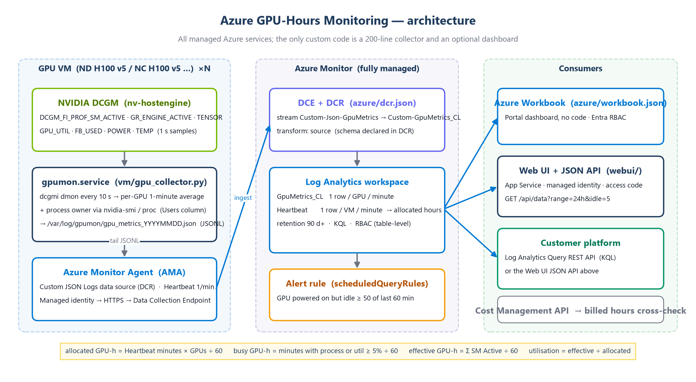
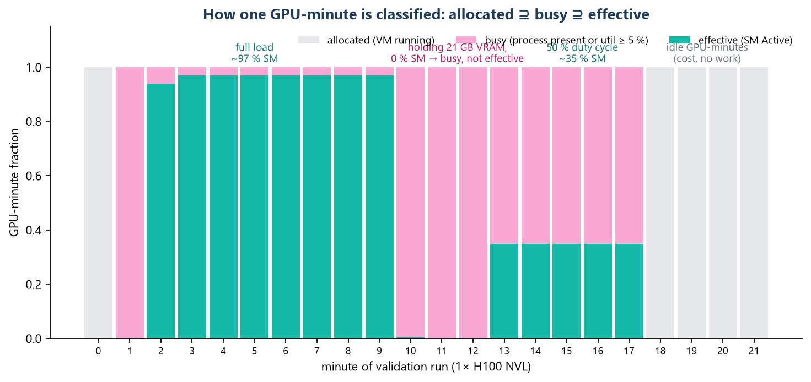
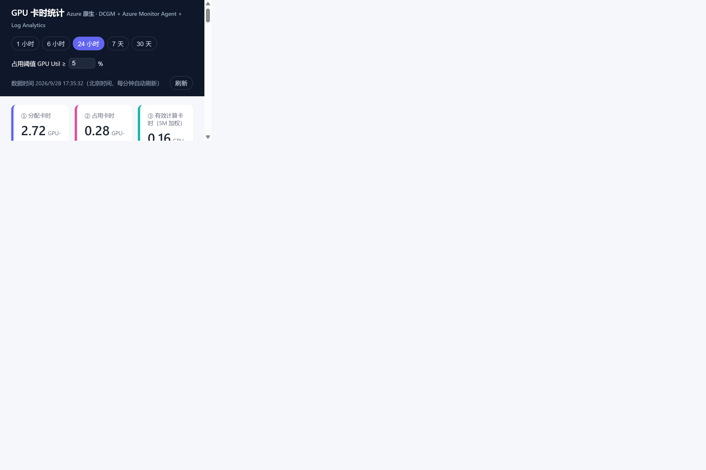

# Azure GPU-Hours Monitoring — allocated vs. actually-used GPU time, all Azure-native

> **Author**: Xinyu Wei (魏新宇) — Microsoft AI GBB Senior System Engineer

English | [中文版](README-CN.md)

[](https://learn.microsoft.com/azure/azure-monitor/)
[](https://developer.nvidia.com/dcgm)
[](https://learn.microsoft.com/azure/virtual-machines/sizes/gpu-accelerated/)
[](#5-dashboards)

Answer the question every AI-infra owner gets asked: **"We pay for N GPU-hours a month — how many of them actually did work, and who used them?"**

This repo is a deliverable-quality reference that measures, per VM / per GPU / per user / per hour / per day:

| Metric | Definition | Source |
|---|---|---|
| **Allocated GPU-hours** | VM running minutes × GPU count ÷ 60 (what you are billed for) | AMA `Heartbeat` table (1 row/min/VM) |
| **Busy GPU-hours** | GPU-minutes with a compute process present *or* GPU-util ≥ threshold ÷ 60 | `GpuMetrics_CL.ProcCount`, `GpuUtil` |
| **Effective GPU-hours** | Σ SM Active ÷ 60 — SM-weighted, so a GPU that is "occupied" but computing at 10 % counts as 0.1 | `GpuMetrics_CL.SmActive` (DCGM `PROF_SM_ACTIVE`) |
| **Idle GPU-hours** | Allocated − Busy — VM powered on, nobody using the GPU (pure waste) | derived |
| **Utilisation %** | Effective ÷ Allocated | derived |
| **Per-user attribution** | Linux owner of the GPU compute process | `nvidia-smi --query-compute-apps` + `/proc/<pid>` |

It was validated end-to-end on an Azure `NC40ads_H100_v5` (1× H100 NVL) with a three-phase synthetic load (full load → hold-VRAM-idle → 50 % duty). The `metrics.png` below is drawn from that real run.

<div align="center"></div>

---

## Table of Contents

1. [Why not just Azure Monitor metrics / managed Prometheus?](#1-why-not-just-azure-monitor-metrics--managed-prometheus)
2. [Architecture](#2-architecture)
3. [Metric definitions — how one GPU-minute is classified](#3-metric-definitions--how-one-gpu-minute-is-classified)
4. [Deploy in 3 steps](#4-deploy-in-3-steps)
5. [Dashboards](#5-dashboards)
6. [Platform integration (API contract)](#6-platform-integration-api-contract)
7. [Validation evidence](#7-validation-evidence)
8. [Production checklist](#8-production-checklist)
9. [Repository layout](#9-repository-layout)
10. [Clean-up](#10-clean-up)
11. [FAQ](#11-faq)

---

## 1. Why not just Azure Monitor metrics / managed Prometheus?

| Option | Verdict | Why |
|---|---|---|
| **Azure platform metrics** for the VM | ✗ | Azure does not see inside the guest. There is no GPU utilisation platform metric for VMs. |
| **Azure Monitor managed Prometheus + dcgm-exporter** | ✓ for AKS, ✗ for plain VMs | Managed Prometheus scrapes AKS / Arc-enabled Kubernetes only ([docs](https://learn.microsoft.com/azure/azure-monitor/metrics/prometheus-metrics-overview)). On plain ND/NC VMs you would have to run your own Prometheus agent with `remote_write` — one more thing to operate. If your GPUs are in AKS node pools, use the [official DCGM integration](https://learn.microsoft.com/azure/azure-monitor/containers/prometheus-dcgm-integration) instead of this repo. |
| **Cost Management API alone** | ✗ | Gives allocated hours and cost, but nothing about whether the GPU was actually computing. |
| **This repo: DCGM → JSONL → Azure Monitor Agent → Log Analytics** | ✓ | Every component except a 200-line collector is a managed Azure service. `Heartbeat` gives allocated time for free; DCGM gives ground-truth utilisation; KQL joins them. Workbook / Web UI / REST API are all read from the same table. |

The design rule: **one custom component (the collector), zero custom storage, zero custom UI required.**

---

## 2. Architecture

```
GPU VM (×N)                          Azure Monitor (managed)                 Consumers
┌──────────────────────────┐         ┌──────────────────────────┐          ┌────────────────────────┐
│ nvidia-dcgm (hostengine) │         │ DCE + DCR                │          │ Azure Workbook         │
│        │ dcgmi dmon 10 s │         │  Custom JSON Logs        │ ───────► │  (Portal, no code)     │
│        ▼                 │  HTTPS  │  → Custom-GpuMetrics_CL  │          ├────────────────────────┤
│ gpumon.service (python)  │ ──────► ├──────────────────────────┤ ───────► │ Web UI + JSON API      │
│  1-min avg per GPU       │  MSI    │ Log Analytics workspace  │          │  (App Service, MSI)    │
│  + process owner         │         │  GpuMetrics_CL  Heartbeat│          ├────────────────────────┤
│  → /var/log/gpumon/*.json│         ├──────────────────────────┤ ───────► │ Customer platform      │
│        ▲ tail            │         │ Alert: idle ≥ 50/60 min  │          │  Log Analytics REST API│
│ Azure Monitor Agent      │         └──────────────────────────┘          └────────────────────────┘
└──────────────────────────┘
```

**Data path, step by step**

1. **`nvidia-dcgm`** (host engine) exposes profiling counters. We read `DCGM_FI_PROF_SM_ACTIVE` (1002), `GR_ENGINE_ACTIVE` (1001), `PIPE_TENSOR_ACTIVE` (1004), `DRAM_ACTIVE` (1005), plus `GPU_UTIL`, `FB_USED/TOTAL`, `POWER_USAGE`, `GPU_TEMP`.
2. **[`vm/gpu_collector.py`](vm/gpu_collector.py)** runs `dcgmi dmon` at a 10 s cadence, averages per GPU per minute, adds VM metadata from IMDS (name, size, resource ID, tags) and the **owner + name of every process on the GPU**, and appends one JSON line per GPU per minute to `/var/log/gpumon/gpu_metrics_YYYYMMDD.json`. Files older than 3 days are deleted.
3. **Azure Monitor Agent** with a **Custom JSON Logs** DCR ([`azure/dcr.json`](azure/dcr.json)) tails the file and ingests into the `GpuMetrics_CL` custom table. AMA also emits `Heartbeat` every minute — that is the allocated-time signal.
4. **KQL** joins the two tables. The same queries power the Workbook, the Web UI and the REST API — there is exactly one definition of each metric ([`azure/queries.kql`](azure/queries.kql)).
5. **Alert rule** fires when a GPU has been powered on with no work for ≥ 50 of the last 60 minutes.

**Data volume**: 1 row / GPU / minute ≈ 600 bytes → an 8-GPU ND H100 v5 produces ~7 MB/day. Log Analytics cost is negligible next to the GPU bill.

---

## 3. Metric definitions — how one GPU-minute is classified

<div align="center"></div>

Every GPU-minute falls into nested buckets: **allocated ⊇ busy ⊇ effective**.

```kusto
// allocated: VM was running (Heartbeat), scaled by GPU count observed on that VM
let alloc = Heartbeat
| where Computer in ((GpuMetrics_CL | distinct Computer))
| summarize RunMinutes = dcount(bin(TimeGenerated, 1m)) by Computer
| join kind=inner (GpuMetrics_CL | summarize Gpus = dcount(GpuId) by Computer) on Computer
| extend AllocGpuHours = RunMinutes * Gpus / 60.0;

// busy / effective: from DCGM samples
let used = GpuMetrics_CL
| summarize BusyGpuHours = countif(ProcCount > 0 or GpuUtil >= 5) / 60.0,
            EffGpuHours  = sum(SmActive) / 60.0 by Computer;

alloc | join kind=leftouter used on Computer
| extend IdleGpuHours = AllocGpuHours - BusyGpuHours,
         UtilPct = 100.0 * EffGpuHours / AllocGpuHours
```

Why **SM Active** rather than `GPU_UTIL`: `GPU_UTIL` is 100 % as soon as *any* kernel is resident in the sampling window; a badly-batched training job can show 100 % util at 20 % SM active. `PROF_SM_ACTIVE` is the fraction of time SMs actually had work. On H100 this is the honest number. Both are stored so you can compare.

**Why the "hold VRAM but idle" phase matters** (minutes 10–12 in the figure): a process that keeps 21 GB of VRAM but does no compute is *busy* (nobody else can use the GPU) but has zero *effective* hours. That gap is exactly what a platform team needs to see to reclaim GPUs.

---

## 4. Deploy in 3 steps

Prerequisites: Azure CLI logged in with Contributor on the target subscription; `python3` on the machine running the scripts; GPU VMs with the NVIDIA driver and `datacenter-gpu-manager` installed (Azure HPC images and the `NvidiaGpuDriverLinux` extension satisfy this; DCGM 3.x and 4.x both work).

### Step 1 — Azure side (once per workspace)

```bash
cd scripts
./deploy-azure.sh -g rg-gpu-monitoring -l southeastasia -r 90
```

Creates: resource group → Log Analytics workspace (90-day retention) → `GpuMetrics_CL` table → DCE + DCR → Workbook + idle alert. Prints `WORKSPACE_ID`, `DCR_ID`, `DCE_ID` for the next steps.

### Step 2 — Onboard each GPU VM (repeatable; no SSH needed)

```bash
./onboard-vm.sh -g rg-gpu-vms -n nd-h100-node01 -d "$DCR_ID" -e "$DCE_ID"
```

Per VM: enables system-assigned managed identity → installs `AzureMonitorLinuxAgent` → associates DCR + DCE → via **Run Command** enables `nvidia-dcgm` and installs `gpumon.service`. First rows land in `GpuMetrics_CL` within 3–5 minutes.

For fleets, wrap this in a loop over `az vm list`, or use Azure Policy built-ins *"Configure Linux virtual machines to run Azure Monitor Agent"* + *"Configure Linux Machines to be associated with a Data Collection Rule"* and ship the collector in your VM image (`vm/install_collector.sh` is image-friendly).

### Step 3 — (optional) Standalone Web UI + JSON API

```bash
./deploy-webui.sh -g rg-gpu-monitoring -n gpuhours-<yourorg> -w "$WORKSPACE_ID" -l southeastasia
```

App Service (B1 Linux) with a system-assigned managed identity holding **only** `Log Analytics Reader` on the workspace; HTTPS-only, TLS 1.2+, access code via `ACCESS_CODE`. Skip this step if the Azure Workbook is enough.

---

## 5. Dashboards

### 5.1 Azure Workbook (no code, Entra RBAC)

Deployed by Step 1 as *"GPU 卡时统计 (DCGM + AMA)"* under the workspace. Parameters: time range, VM multi-select, busy threshold. Panels: 5 KPI tiles → per-VM table → hourly grouped bars (allocated / busy / effective) → SM/util/tensor, VRAM, power time-charts at adaptive grain → per-user table → per-day table → current state → idle-GPU list.

Grant a colleague read access with two role assignments on the resource group: `Reader` (open the Workbook) + `Log Analytics Reader` (run the queries).

### 5.2 Web UI (for people without an Azure account)

<div align="center"></div>

Same metrics, same KQL, served by [`webui/app.py`](webui/app.py) (Flask, ~250 lines) behind an access code. Hourly/daily buckets are in **local time** (`TZ_HOURS`, default UTC+8). Responses are cached 60 s; the page auto-refreshes every minute.

Labels are in Chinese because the first customer is Chinese; every label lives in `webui/static/index.html` and `azure/build_workbook.py`, nowhere else.

---

## 6. Platform integration (API contract)

Two equivalent ways for a customer platform to consume the data — pick one.

### Option A — Log Analytics Query REST API (no extra service)

```bash
./scripts/query.sh -w "$WORKSPACE_ID" -f ../azure/queries.kql      # summary block
./scripts/query.sh -w "$WORKSPACE_ID" -q 'GpuMetrics_CL | where TimeGenerated > ago(1h) | summarize avg(SmActive) by Computer, GpuId'
```

`POST https://api.loganalytics.io/v1/workspaces/{WORKSPACE_ID}/query` with `{"query": "...", "timespan": "P1D"}`, bearer token for `https://api.loganalytics.io`. Use a service principal or managed identity with `Log Analytics Reader`. All queries in [`azure/queries.kql`](azure/queries.kql).

### Option B — Web UI JSON API (already shaped for a dashboard)

```
GET /api/data?range={1h|6h|24h|7d|30d}&idle={0..100}
Authorization: Basic base64(anything:ACCESS_CODE)
```

```jsonc
{
  "summary": { "Alloc": 2.717, "Busy": 0.283, "Eff": 0.157, "Idle": 2.434, "UtilPct": 5.8, "Vms": 1, "Gpus": 1 },
  "perVm":   [ { "Computer": "...", "VmSize": "Standard_NC40ads_H100_v5", "GpuName": "NVIDIA H100 NVL", "Gpus": 1,
                 "RunHours": 2.72, "Alloc": 2.72, "Busy": 0.28, "Eff": 0.16, "Idle": 2.43, "UtilPct": 5.8 } ],
  "hourly":  [ { "B": "09-28 11:00", "Alloc": 0.48, "Busy": 0.28, "Eff": 0.16, "Idle": 0.2, "UtilPct": 32.6 }, ... ],
  "daily":   [ { "B": "2026-09-28", "Alloc": 2.72, ... } ],
  "series":  [ { "T": "2026-09-28T03:34:00Z", "Gpu": "node0/GPU0", "SM": 94.1, "Util": 100, "Tensor": 91.6, "MemGB": 21.1, "PowerW": 398 }, ... ],
  "users":   [ { "User": "azureuser", "Computer": "...", "Busy": 0.27, "Eff": 0.15, "AvgSm": 56.9, "PeakMemGB": 21.1, "Processes": "python3" } ],
  "latest":  [ ... last sample per GPU, 15-min window ... ],
  "idleNow": [ ... GPUs idle for ≥ 30 of the last 60 min ... ],
  "meta":    { "range": "24h", "idle": 5, "grainMin": 2, "generatedAt": "2026-09-28T06:15:54Z" }
}
```

Units: all `*Hours`/`Alloc`/`Busy`/`Eff`/`Idle` are **GPU-hours**; `SM`/`Util`/`Tensor`/`AvgSm`/`UtilPct` are percent; `B` is a local-time bucket label.

---

## 7. Validation evidence

Run on 2026-09-28 against `Standard_NC40ads_H100_v5` (Ubuntu 24.04, driver 615.71, DCGM 3.3.9). Synthetic load = PyTorch bf16 8192² matmul as a non-root user (`azureuser`), three phases:

| Phase | Duration | Expected | Observed in `GpuMetrics_CL` |
|---|---|---|---|
| Full load | 8 min | SM ≈ 100 % | `SmActive` 0.94–0.97, `GpuUtil` 100, `PowerW` 398, `FbUsedMiB` 21 610, `Users` = azureuser |
| Hold VRAM, no kernels | 3 min | busy but not effective | `ProcCount` 1, `FbUsedMiB` 21 610, `SmActive` 0.00, `PowerW` 101–115 |
| 50 % duty cycle | 5 min | SM ≈ 35–50 % | `SmActive` 0.35, `GpuUtil` 31–63 (sampling artefact — see §3) |
| Idle | rest of window | nothing | `SmActive` 0, `ProcCount` 0, alert `alert-gpu-idle-60min` fired after 60 min |

Aggregates over the 24 h window at time of screenshot: allocated 2.72, busy 0.28, effective 0.16, idle 2.43 GPU-h → **5.8 % utilisation**. Per-user table attributed 0.27 busy / 0.15 effective GPU-h to `azureuser / python3`. All 10 Workbook queries and the 7 API queries were executed against the live workspace via the REST API before publishing.

Things that bit us, so you don't have to:

* **DCGM host engine was installed but not enabled** on the image — `systemctl enable --now nvidia-dcgm` is in `install_collector.sh`.
* **`dcgmproftester` refused to run** ("Expected Cuda version is 12, installed is 13") — DCGM 3.3.9's bundled tester lags the driver. Doesn't affect collection; we used PyTorch for load.
* **Workbook time-charts at 24 h default to ~30 min grain**, which turned a 16-min job into a single diagonal line. The generator forces `max(1m, range/1440)`.
* **Workbook legend "big numbers" default to Sum** (e.g. "SM Active % 945") — meaningless for percentages; disabled via `chartSettings.showMetrics=false`.
* **AzureCliCredential 10 s default timeout** is too short when 7 queries fire in parallel on a laptop — token is cached in-process and the CLI timeout raised to 60 s.

---

## 8. Production checklist

Delivered as a working PoC. Before you bill or evaluate people on these numbers:

| # | Item | Status in this repo | Notes |
|---|---|---|---|
| 1 | Day boundaries in **local time** | ✅ Web UI (`TZ_HOURS`) | Workbook "per-day" table is UTC; add `+ 8h` to `startofday()` if needed |
| 2 | **Cross-check allocated hours** with billing | ⚠️ manual | `Heartbeat` under-counts if AMA is down. Reconcile monthly with Cost Management usage export or Activity Log VM start/deallocate events |
| 3 | **Retention ≥ 90 days**; long-term daily rollup | ✅ 90 d default | Add a [summary rule](https://learn.microsoft.com/azure/azure-monitor/logs/summary-rules) writing daily per-VM GPU-hours to a small table with 2-year retention |
| 4 | **Multi-GPU (8× ND H100 v5)** | ✅ code-ready, not run | Collector enumerates all GPUs; no change needed. MIG instances are *not* handled |
| 5 | **Attribution beyond Linux uid** | ⚠️ | Containers show the container's uid (often root). For Slurm/K8s, join on the scheduler's job table (`sacct` / pod labels) using `Computer` + time |
| 6 | **Department / project dimension** | ✅ plumbed | `Tags` column carries the VM's Azure tags from IMDS — tag your VMs `costcenter=…`, `project=…` and extend the KQL `by` clause |
| 7 | **Fleet onboarding** | ✅ script; policy suggested | See Step 2 |
| 8 | **Alert notifications** | ⚠️ | Alert rule exists without an Action Group. Add `--action-groups` with Teams/email/webhook |
| 9 | **Read-only access for consumers** | ✅ documented | Reader + Log Analytics Reader on the RG; or Web UI access code |
| 10 | **Collector ownership** | — | `gpu_collector.py` is your code, not a Microsoft product. Pin DCGM version to driver in your image pipeline |

---

## 9. Repository layout

```
Azure-GPU-Hours-Monitoring/
├── README.md / README-CN.md
├── vm/
│   ├── gpu_collector.py        DCGM → JSONL collector (stdlib only, Python ≥ 3.8)
│   └── install_collector.sh    systemd unit + enable nvidia-dcgm
├── azure/
│   ├── dcr.json                ARM: Data Collection Endpoint + Rule (Custom JSON Logs → GpuMetrics_CL)
│   ├── build_workbook.py       generates the three files below (single source of truth for KQL + labels)
│   ├── workbook.json           ARM: Workbook + scheduledQueryRules (idle alert)
│   ├── workbook.parameters.json
│   ├── workbook.gallery.json   raw Workbook JSON (Portal → Advanced Editor → paste)
│   └── queries.kql             the same KQL for REST API consumers
├── webui/
│   ├── app.py                  Flask: /api/data JSON + static dashboard, managed-identity auth to LAW
│   ├── static/index.html       single-page dashboard (Chart.js)
│   └── requirements.txt
├── scripts/
│   ├── deploy-azure.sh         Step 1
│   ├── onboard-vm.sh           Step 2 (per VM)   ·   offboard-vm.sh reverses it
│   ├── deploy-webui.sh         Step 3
│   └── query.sh                Log Analytics REST API example
└── images/                     architecture.png, metrics.png, dashboard-*.png, make_diagrams.py
```

---

## 10. Clean-up

```bash
./scripts/offboard-vm.sh -g rg-gpu-vms -n nd-h100-node01     # per VM: collector, AMA, associations
az group delete -n rg-gpu-monitoring --yes                    # workspace, DCR, Workbook, alert, App Service
```

The VM keeps its NVIDIA driver, DCGM package and managed identity.

---

## 11. FAQ

**Can I use this on AKS GPU node pools?**  You can, but don't — Azure Monitor managed Prometheus has a [first-party DCGM integration](https://learn.microsoft.com/azure/azure-monitor/containers/prometheus-dcgm-integration) for AKS. This repo targets plain ND/NC VMs, CycleCloud/Slurm clusters and VM Scale Sets.

**Why JSON files + AMA instead of the Logs Ingestion API from the collector?**  AMA handles buffering, retry, identity and proxy for free, and adds `Heartbeat`. The collector stays stdlib-only with no credentials.

**Why 10 s DCGM sampling averaged to 1 min?**  1-min rows keep the table at ~7 MB/day per 8-GPU VM and match `Heartbeat` granularity for the join. `PROF_*` counters are already time-averaged by DCGM over the sample interval, so no bursts are lost.

**How do I change the "busy" threshold?**  It is a Workbook parameter / API query-string (`idle=`). Default 5 % GPU-util.

**Does it work with DCGM 4.x?**  Yes — field IDs are unchanged; `dcgmi dmon -e` output format is identical.

**GPU_UTIL shows 60 % but SM Active shows 35 % — which is right?**  Both. `GPU_UTIL` = fraction of the window with *any* kernel resident; `SM_ACTIVE` = fraction of time SMs had work. For "was the GPU earning its keep", trust SM Active.
