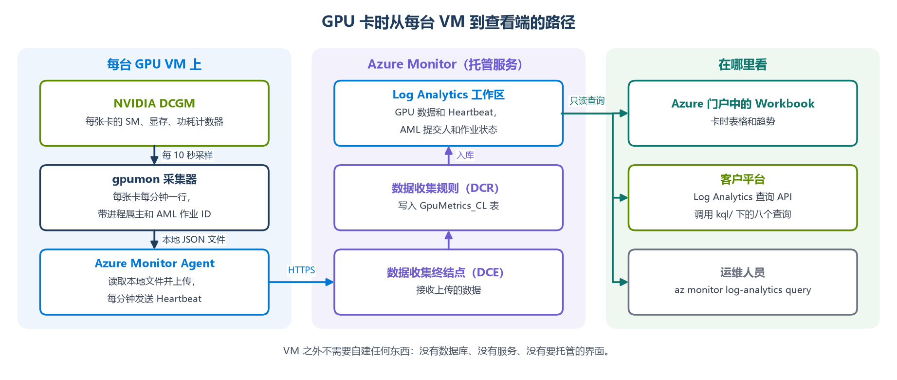
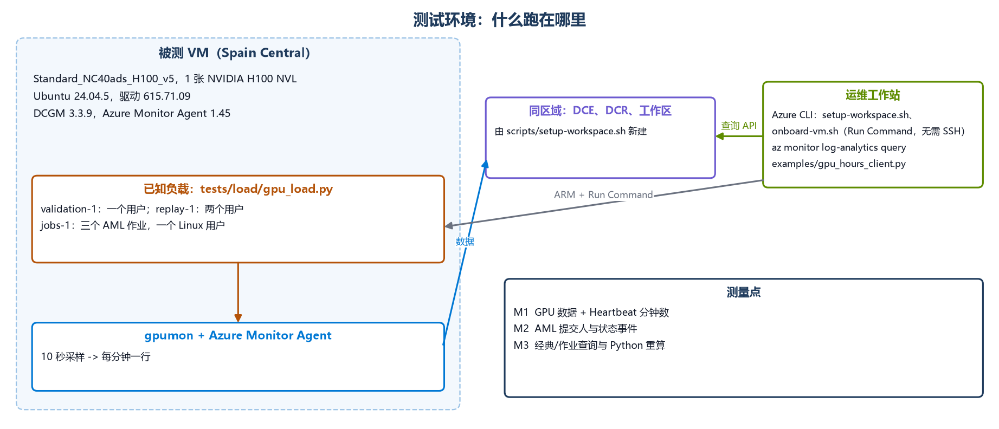
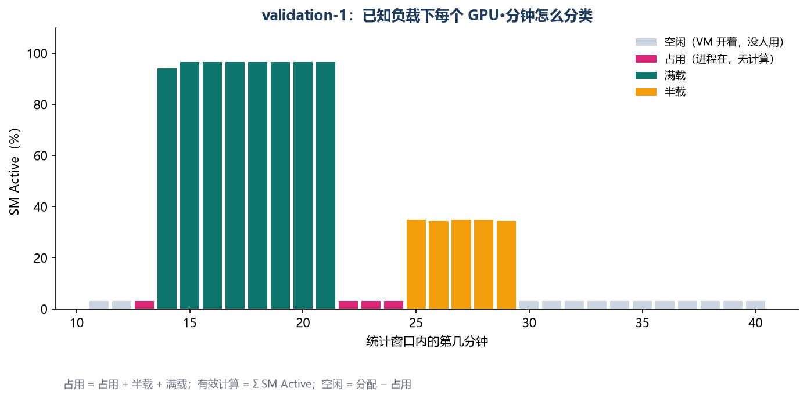
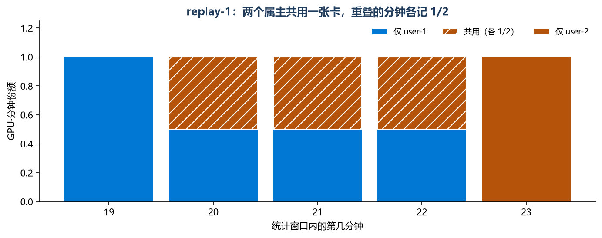

# 用 DCGM 和 Azure Monitor 统计 Azure GPU 卡时

[](#架构与指标口径)
[](#架构与指标口径)
[](#单台-h100-vm-上的实测验证)
[](https://github.com/david-xinyuwei/david-share/actions/workflows/azure-gpu-hours-monitoring-ci.yml)

**Azure GPU VM 上付了钱的卡时，有多少真正在算？算的是谁的任务？** 本仓库在 VM 内用 NVIDIA DCGM 采集 GPU 指标，在 VM 外全部用 Azure Monitor 托管服务：Azure Monitor Agent、数据收集规则（DCR）和 Log Analytics 工作区。仓库提供四样东西：
- VM 上唯一需要运行的采集器；
- 每个 Azure 配置步骤对应的 `az` 命令；
- 八个 KQL 查询；
- 一个参考客户端，演示客户平台的 API 怎样通过 Log Analytics 查询 API 调用这些查询。

不需要自建存储，也不需要部署任何界面。



<!-- BEGIN GENERATED: glance -->
- 在一台 H100 VM 上跑一段时间表已知的负载，采集链路记录下满载 8 分钟、占用 3 分钟、半载 5 分钟，与负载脚本的安排一致；五个查询的结果和对原始数据的独立 Python 重算逐值比对，28 个值全部相同。
- 三个 AML 作业以同一个 Linux 用户在这台 VM 上运行：`per_user` 只看到一个属主，合计 0.150 占用卡时；`per_job` 按作业名拆成 0.067、0.042、0.042，两个作业共用的 3 分钟各记一半，并给出提交作业的 Entra 账号；KQL 与 Python 比对 11 个数值、28 个字段全部一致。
- 下面的配置步骤在一个新资源组里原样实跑：建工作区 181 秒，接入 VM 102 秒，下线 98 秒。
- Log Analytics 按每行 343 字节计费（每 GPU·分钟一行），每天约 4.74 MB（8 卡 VM，含 Heartbeat）。
- 主要限制：进程属主每分钟只采一次，任务在一分钟中途退出时，这一分钟算占用但没有属主（第一次实测 1 / 17 个占用分钟，第二次 1 / 6 个）。
<!-- END GENERATED: glance -->

作者：魏新宇 · [English](README.md) · [架构](#架构与指标口径) · [配置](#在-azure-上配置) · [查询](#从客户平台查询) · [实测](#单台-h100-vm-上的实测验证)

## 从这里开始

| 目的 | 入口 |
|---|---|
| 了解测什么、怎么测 | [架构与指标口径](#架构与指标口径) |
| 建工作区、接入 GPU VM | [在 Azure 上配置](#在-azure-上配置) |
| 从客户平台的 API 读取卡时 | [从客户平台查询](#从客户平台查询) |
| 看数字算得对不对的证据 | [单台 H100 VM 上的实测验证](#单台-h100-vm-上的实测验证) |
| 不连 Azure 跑一遍校验 | [测试与离线校验](#测试与离线校验) |

## 本仓库做了什么、提供什么

- **GPU 遥测**：NVIDIA DCGM，随驱动栈安装。本仓库只读取它，不替代它。
- **采集、存储与查询**：Azure Monitor Agent、数据收集终结点和规则、Log Analytics 及其查询 API，全部由 Azure 托管。
- **本仓库补充的部分**：
  - 每台 VM 上运行的采集器（[`vm/`](vm/)）；
  - 数据收集规则（[`azure/`](azure/)）；
  - 用 `az` 命令写成的配置脚本（[`scripts/`](scripts/)）；
  - 八个查询（[`kql/`](kql/)），包括按 AML 作业和 Entra 提交人的归属；
  - 给客户 API 参考的客户端（[`examples/`](examples/)）；
  - 用来核对上述内容的证据和测试（[`evidence/`](evidence/)、[`tests/`](tests/)、[`tools/`](tools/)）。

客户需要准备：
- 装好 NVIDIA 驱动和 DCGM 的 GPU VM；
- 对资源组有 Contributor 权限的 Azure CLI；
- 客户平台用于查询的身份，并在工作区上授予 Log Analytics Reader 角色。

不提供：看板或界面、告警、与账单对账、没有传递作业 ID 的任务自动归属，以及 MIG 实例。

## 架构与指标口径

GPU VM 上只做两件事：
1. NVIDIA DCGM host engine 提供每张卡的计数器；
2. 采集器定时读取这些计数器，每张卡每分钟写一行 JSON 到本地文件。

之后的环节全部由 Azure Monitor 完成：
1. Azure Monitor Agent 读取这个文件，经数据收集终结点和规则写入 `GpuMetrics_CL` 表；
2. 同一个代理在 VM 运行期间每分钟写一行 `Heartbeat`；
3. KQL 把这两张表关联起来，算出卡时。

**VM 上。** [`vm/gpu_collector.py`](vm/gpu_collector.py) 由 [`vm/install_collector.sh`](vm/install_collector.sh) 安装成 systemd 服务 `gpumon`，只依赖 Python 标准库。它执行的命令是：

<!-- BEGIN GENERATED: dcgm-command -->
```bash
dcgmi dmon -e 203,1001,1002,1004,1005,252,250,155,150 -d 10000
```
<!-- END GENERATED: dcgm-command -->

即每 10 秒采一次 9 个 DCGM 字段。采集器每分钟做以下几件事：
1. 把每张卡在这一分钟内的各个字段求平均；
2. 从实例元数据服务读取 VM 名称、规格、资源 ID 和标签；
3. 用 `nvidia-smi --query-compute-apps` 和 `/proc/<pid>` 记录 GPU 上每个进程的 Linux 属主和进程名；
4. 如果启动器传递了 `AZUREML_RUN_ID`，只从进程环境中读取这一项；
5. 每张卡一行，追加到 `/var/log/gpumon/gpu_metrics_<day>.json`，并删除三天前的文件。

<!-- BEGIN GENERATED: dcgm-fields -->
- `203` `DCGM_FI_DEV_GPU_UTIL` → `GpuUtil`：占用判定阈值
- `1001` `DCGM_FI_PROF_GR_ENGINE_ACTIVE` → `GrActive`：参考
- `1002` `DCGM_FI_PROF_SM_ACTIVE` → `SmActive`：有效计算卡时
- `1004` `DCGM_FI_PROF_PIPE_TENSOR_ACTIVE` → `TensorActive`：参考
- `1005` `DCGM_FI_PROF_DRAM_ACTIVE` → `DramActive`：参考
- `252` `DCGM_FI_DEV_FB_USED` → `FbUsedMiB`：显存占用
- `250` `DCGM_FI_DEV_FB_TOTAL` → `FbTotalMiB`：显存容量
- `155` `DCGM_FI_DEV_POWER_USAGE` → `PowerW`：参考
- `150` `DCGM_FI_DEV_GPU_TEMP` → `TempC`：参考
<!-- END GENERATED: dcgm-fields -->

被测 VM 上这个文件里的一行（名称已替换）：

<!-- BEGIN GENERATED: json-line -->
```json
{"TimeGenerated": "<minute start, UTC>", "VmName": "<vm-name>", "VmSize": "Standard_NC40ads_H100_v5", "VmResourceId": "<vm resource id>", "Tags": "", "GpuId": 0, "GpuUuid": "<GPU UUID>", "GpuName": "NVIDIA H100 NVL", "Samples": 6, "GpuUtil": 100, "GrActive": 0.9818, "SmActive": 0.9413, "TensorActive": 0.916, "DramActive": 0.1307, "FbUsedMiB": 21618, "FbTotalMiB": 95830, "PowerW": 397.6368, "TempC": 64.1667, "ProcCount": 1, "Users": "<linux user>", "Processes": "python3", "RunId": "<AML run ID>"}
```
<!-- END GENERATED: json-line -->

**Azure Monitor 里。** 数据收集规则 [`azure/dcr-rule.json`](azure/dcr-rule.json) 声明了一个 `Custom-Json-GpuMetrics` 数据流，列与 JSON 行一一对应。它读取 `/var/log/gpumon/*.json`，写入 `GpuMetrics_CL`。代理用 VM 的托管身份认证，经数据收集终结点上传。`Heartbeat` 不需要配置，每个代理都会发送。

**指标口径。** 每个 GPU·分钟落在一组逐层包含的类别里：分配 ⊇ 占用 ⊇ 有效计算。

| 指标 | 定义 | 来源 |
|---|---|---|
| 分配卡时 | VM 运行分钟数 × GPU 数 ÷ 60 | `Heartbeat` 分钟数 |
| 占用卡时 | 有计算进程或 GPU Util ≥ 5 % 的 GPU·分钟 ÷ 60 | `ProcCount`、`GpuUtil` |
| 有效计算卡时 | Σ SM Active ÷ 60 | `SmActive` |
| 空闲卡时 | 分配 − 占用 | 计算得出 |
| 有效利用率 | 有效计算 ÷ 分配 | 计算得出 |

有效计算卡时用 SM Active，不用 GPU Util：
- `DCGM_FI_DEV_GPU_UTIL` 统计的是“有任意 kernel 在跑”的时间占比，一张卡只跑小 kernel 也会显示 100 %；
- `DCGM_FI_PROF_SM_ACTIVE` 统计的是流式多处理器（SM）真正有活干的时间占比。

两者可能差很多：下面实测的半载阶段，GPU Util 平均 51 %，SM Active 平均只有 35 %。

一个进程占着显存却不跑 kernel，这张卡就算“占用”，但不算“有效计算”。回收 GPU 时，要找的正是这种情况。

## 在 Azure 上配置

在 Bash 里执行下面的步骤，事先用 `az login` 登录 Azure CLI。Azure Cloud Shell、Linux、macOS 都可以。Windows 上用 Git Bash 也行：脚本会设置 `MSYS_NO_PATHCONV=1`，避免资源 ID 被当成路径改写。

```bash
git clone --filter=blob:none --sparse https://github.com/david-xinyuwei/david-share.git
cd david-share
git sparse-checkout set Deep-Learning/Azure-GPU-Hours-Monitoring
cd Deep-Learning/Azure-GPU-Hours-Monitoring
```

**开始前：确认每台 GPU VM 上有 DCGM。** 采集器需要 `dcgmi` 命令和 DCGM host engine。[Azure HPC VM 镜像](https://learn.microsoft.com/azure/virtual-machines/azure-hpc-vm-images)自带 DCGM。其他镜像请安装 NVIDIA 的 `datacenter-gpu-manager` 软件包，DCGM 大版本要和 CUDA 驱动匹配；被测 VM 用的就是 Ubuntu 24.04 镜像加这个软件包。不用 SSH 就能检查一台 VM：

```bash
az vm run-command invoke -g <vm-rg> -n <vm-name> --command-id RunShellScript \
  --scripts "dcgmi --version | head -2; systemctl is-enabled nvidia-dcgm" --query "value[0].message" -o tsv
```

**第 1 步：建工作区、表、数据收集终结点和规则**（每个工作区做一次）。

```bash
./scripts/setup-workspace.sh -g rg-gpu-hours -l <region>
# 同时启用 AML 作业提交人和状态跟踪：
./scripts/setup-workspace.sh -g rg-gpu-hours -l <region> -a <aml-workspace-resource-id>
```

脚本最后会打印 `WORKSPACE_GUID`、`DCR_ID` 和 `DCE_ID`，后面几步要用。它依次执行这些命令：

<!-- BEGIN GENERATED: setup-commands -->
```bash
az extension add --upgrade --yes --name monitor-control-service -o none
az group create -n "$RG" -l "$LOC" -o none
az monitor log-analytics workspace create -g "$RG" -n "$LAW" -l "$LOC" --retention-time "$RETENTION" -o none
az monitor log-analytics workspace table show -g "$RG" --workspace-name "$LAW" -n GpuMetrics_CL -o none 2>/dev/null
az monitor log-analytics workspace table update -g "$RG" --workspace-name "$LAW" -n GpuMetrics_CL \
  --retention-time "$RETENTION" --columns "${COLUMNS[@]}" -o none
az monitor log-analytics workspace table create -g "$RG" --workspace-name "$LAW" -n GpuMetrics_CL \
  --retention-time "$RETENTION" --columns "${COLUMNS[@]}" -o none
az monitor data-collection endpoint create -g "$RG" -n "$DCE" -l "$LOC" --public-network-access Enabled -o none
LAW_ID=$(az monitor log-analytics workspace show -g "$RG" -n "$LAW" --query id -o tsv)
DCE_ID=$(az monitor data-collection endpoint show -g "$RG" -n "$DCE" --query id -o tsv)
az monitor data-collection rule create -g "$RG" -n "$DCR" -l "$LOC" --kind Linux \
  --endpoint-id "$DCE_ID" --rule-file "$RULE_FILE" -o none
DCR_ID=$(az monitor data-collection rule show -g "$RG" -n "$DCR" --query id -o tsv)
WORKSPACE_GUID=$(az monitor log-analytics workspace show -g "$RG" -n "$LAW" --query customerId -o tsv)
az monitor diagnostic-settings subscription create -n gpu-hours-job-submitters -l "$LOC" \
  --workspace "$LAW_ID" --logs '[{"category":"Administrative","enabled":true}]' -o none
az monitor diagnostic-settings create -n gpu-hours-job-status --resource "$AML_ID" --workspace "$LAW_ID" \
  --export-to-resource-specific true --logs '[{"category":"AmlRunStatusChangedEvent","enabled":true}]' -o none
```
<!-- END GENERATED: setup-commands -->

工作区和 VM 放在同一区域。默认保留 90 天，用 `-r <天数>` 修改。第一次运行时建表，之后再运行会更新这张表。指定 `-a` 后，脚本还会把订阅的 `Administrative` 事件送入 `AzureActivity`，把 AML 作业状态送入资源专用的 `AmlRunStatusChangedEvent` 表。该选项需要在订阅范围和 AML 工作区上创建诊断设置的权限。

检查结果：

```bash
az monitor log-analytics workspace table show -g rg-gpu-hours --workspace-name law-gpu-hours -n GpuMetrics_CL \
  --query "{plan: plan, retention: retentionInDays, columns: length(schema.columns)}" -o json
az monitor data-collection rule show -g rg-gpu-hours -n dcr-gpu-hours \
  --query "{kind: kind, files: dataSources.logFiles[0].filePatterns, stream: dataFlows[0].outputStream}" -o json
```

应当看到：表有 24 列，保留天数与设置一致；规则的 kind 为 `Linux`，读取 `/var/log/gpumon/*.json`，输出到 `Custom-GpuMetrics_CL`。

**第 2 步：接入每台 GPU VM。**

```bash
./scripts/onboard-vm.sh -g <vm-rg> -n <vm-name> -d "$DCR_ID" -e "$DCE_ID"
```

脚本依次完成：
1. 开启 VM 的系统分配托管身份；
2. 安装 Azure Monitor Agent；
3. 把规则和终结点关联到这台 VM；
4. 通过 Run Command（不需要 SSH）在 VM 上运行 [`vm/install_collector.sh`](vm/install_collector.sh)：它启用 `nvidia-dcgm`，并把 `gpumon` 装成 systemd 服务。

<!-- BEGIN GENERATED: onboard-commands -->
```bash
az extension add --upgrade --yes --name monitor-control-service -o none
VM_ID=$(az vm show -g "$RG" -n "$VM" --query id -o tsv)
az vm identity assign -g "$RG" -n "$VM" -o none
az vm extension set -g "$RG" --vm-name "$VM" -n AzureMonitorLinuxAgent --publisher Microsoft.Azure.Monitor \
  --enable-auto-upgrade true -o none
az monitor data-collection rule association create --name dcra-gpu-hours --resource "$VM_ID" --rule-id "$DCR_ID" -o none
az monitor data-collection rule association create --name configurationAccessEndpoint --resource "$VM_ID" \
  --endpoint-id "$DCE_ID" -o none
az vm run-command invoke -g "$RG" -n "$VM" --command-id RunShellScript --scripts "@$SCRIPT" --query "value[0].message" -o tsv
```
<!-- END GENERATED: onboard-commands -->

Run Command 的输出最后是 `systemctl status gpumon`：必须看到 `active (running)`，以及上面那条 `dcgmi dmon` 命令。

VM 很多时，可以对 `az vm list` 循环执行这一步。也可以组合使用两条 Azure Policy 内置策略：*Configure Linux virtual machines to run Azure Monitor Agent with system-assigned managed identity-based authentication* 和 *Configure Linux Machines to be associated with a Data Collection Rule or a Data Collection Endpoint*，再把采集器打进 VM 镜像。`vm/install_collector.sh` 可以直接作为镜像构建的一步。

**第 3 步：确认数据已经入库。** 接入后约 8 分钟出现第一条 `Heartbeat`，再过几分钟出现第一批 `GpuMetrics_CL` 数据。在命令行里查询需要 `log-analytics` 扩展，它只有预览版。

```bash
az extension add --upgrade --yes --name log-analytics
az monitor log-analytics query -w "$WORKSPACE_GUID" -t PT30M -o table --analytics-query \
  "union (Heartbeat | summarize Rows = count(), Last = max(TimeGenerated) by Table = 'Heartbeat', Computer), (GpuMetrics_CL | summarize Rows = count(), Last = max(TimeGenerated) by Table = 'GpuMetrics_CL', Computer)"
```

每台接入的 VM 都应在两张表下各出现一行，`Last` 是最近几分钟内的时间。

**下线一台 VM，或全部删除。**

```bash
./scripts/offboard-vm.sh -g <vm-rg> -n <vm-name>
az group delete -n rg-gpu-hours --yes
```

`offboard-vm.sh` 会停止并删除 `gpumon`，删除两个关联，卸载代理。NVIDIA 驱动、DCGM 和托管身份保持不变。

<!-- BEGIN GENERATED: offboard-commands -->
```bash
az extension add --upgrade --yes --name monitor-control-service -o none
VM_ID=$(az vm show -g "$RG" -n "$VM" --query id -o tsv)
az vm run-command invoke -g "$RG" -n "$VM" --command-id RunShellScript --query "value[0].message" -o tsv --scripts \
  "systemctl disable --now gpumon 2>/dev/null; rm -rf /opt/gpumon /var/log/gpumon /etc/systemd/system/gpumon.service; systemctl daemon-reload; echo gpumon removed"
az monitor data-collection rule association delete --name dcra-gpu-hours --resource "$VM_ID" --yes -o none || true
az monitor data-collection rule association delete --name configurationAccessEndpoint --resource "$VM_ID" --yes -o none || true
az vm extension delete -g "$RG" --vm-name "$VM" -n AzureMonitorLinuxAgent -o none
```
<!-- END GENERATED: offboard-commands -->

## 从客户平台查询

[`kql/`](kql/) 下每个文件都是一条完整的查询。统计时段由查询的 timespan 指定，不写进 KQL。文件开头的 `let` 行是可以修改的默认值：
- `IdlePct`：占用判定阈值，默认 5；
- `TzOffset`：按小时、按天统计用的 UTC 偏移，默认 `8h`；
- `Computers`：只统计这些 VM，留空表示全部。

三个 AML 查询要求每个 GPU 进程都带有 AML 作业名，即 `AZUREML_RUN_ID`。启动脚本跨边界时都要保留它：远程命令用 `env` 传递，Docker 加 `-e AZUREML_RUN_ID`，`mpirun` 加 `-x AZUREML_RUN_ID`。采集器只从 `/proc/<pid>/environ` 读取这一项，不采集进程环境里的其他变量。同一个 GPU·分钟有多个作业 ID 时，作业查询会在这些作业之间均分。

`per_job`、`per_submitter` 和 `live` 的 timespan 必须同时覆盖作业提交事件和 GPU 数据。`live` 返回该时段内每张卡最后看到的进程；要看新鲜度就用短时段，要补全提交人则使用能覆盖提交时刻的较宽时段。

<!-- BEGIN GENERATED: views -->
- [`kql/summary.kql`](kql/summary.kql)，所选 VM 合计：`AllocatedGpuHours`、`BusyGpuHours`、`EffectiveGpuHours`、`IdleGpuHours`、`Vms`、`Gpus`、`UtilizationPct`
- [`kql/per_vm.kql`](kql/per_vm.kql)，每台 VM 一行：`Computer`、`VmSize`、`GpuName`、`Gpus`、`RunningHours`、`AllocatedGpuHours`、`BusyGpuHours`、`EffectiveGpuHours`、`IdleGpuHours`、`UtilizationPct`
- [`kql/per_hour.kql`](kql/per_hour.kql)，每个本地小时一行：`Hour`、`AllocatedGpuHours`、`BusyGpuHours`、`EffectiveGpuHours`、`IdleGpuHours`、`UtilizationPct`
- [`kql/per_day.kql`](kql/per_day.kql)，每个本地日一行：`Day`、`AllocatedGpuHours`、`BusyGpuHours`、`EffectiveGpuHours`、`IdleGpuHours`、`UtilizationPct`
- [`kql/per_user.kql`](kql/per_user.kql)，每个进程属主、每台 VM 一行：`User`、`Computer`、`BusyGpuHours`、`EffectiveGpuHours`、`AvgSmActivePct`、`PeakMemoryGiB`、`Processes`
- [`kql/per_job.kql`](kql/per_job.kql)，每个 AML 作业一行：`RunId`、`Submitter`、`SubmitterObjectId`、`Status`、`Vms`、`Gpus`、`StartTime`、`EndTime`、`BusyGpuHours`、`EffectiveGpuHours`、`PeakMemoryGiB`
- [`kql/per_submitter.kql`](kql/per_submitter.kql)，每个 Entra 提交人一行：`Submitter`、`SubmitterObjectId`、`Jobs`、`BusyGpuHours`、`EffectiveGpuHours`
- [`kql/live.kql`](kql/live.kql)，查询时段内每张卡最后看到的 GPU 进程：`Computer`、`GpuId`、`RunId`、`Submitter`、`SubmitterObjectId`、`Status`、`LastSeen`、`AgeSeconds`、`GpuUtil`、`SmActive`、`FbUsedMiB`、`ProcCount`、`Processes`
<!-- END GENERATED: views -->

**命令行。** `@` 前缀让 Azure CLI 从文件读取查询。`-t` 接受 ISO 8601 时长（如 `P1D`）或时间区间 `<开始>/<结束>`。它会把所有值都返回成字符串，并多出一列 `TableName`。

```bash
az monitor log-analytics query -w "$WORKSPACE_GUID" --analytics-query @kql/per_vm.kql -t P1D -o table
```

**客户 API：REST。** 把文件内容作为 `query`，统计时段作为 `timespan`，带上资源为 `https://api.loganalytics.io` 的 Bearer token。返回的是带类型的 JSON：`tables[0].columns` 和 `tables[0].rows`。

```http
POST https://api.loganalytics.io/v1/workspaces/<workspace-guid>/query
Authorization: Bearer <token>
Content-Type: application/json

{"query": "<content of kql/per_vm.kql>", "timespan": "<start>/<end>"}
```

**客户 API：Python SDK。** [`examples/gpu_hours_client.py`](examples/gpu_hours_client.py) 封装了 `azure-monitor-query`：
- 凭据来自 `DefaultAzureCredential`：API 所在环境用托管身份，工作站上用 Azure CLI 登录；
- 它会改写 `let` 默认值；某个查询里对应的 `let` 行不是恰好一行时直接报错。

```bash
pip install -r examples/requirements.txt
END=$(date -u +%FT%TZ); START=$(date -u -d '-1 day' +%FT%TZ)
python examples/gpu_hours_client.py --workspace "$WORKSPACE_GUID" --view per_user --start "$START" --end "$END"
python examples/gpu_hours_client.py --workspace "$WORKSPACE_GUID" --view per_job --start "$START" --end "$END"
```

下面实测中的同一次调用返回：

<!-- BEGIN GENERATED: per-user-json -->
```json
[
 {
  "User": "user-1",
  "Computer": "gpu-vm-1",
  "BusyGpuHours": 0.0417,
  "EffectiveGpuHours": 0.0362,
  "AvgSmActivePct": 87.55,
  "PeakMemoryGiB": 41.9707,
  "Processes": "python3"
 },
 {
  "User": "user-2",
  "Computer": "gpu-vm-1",
  "BusyGpuHours": 0.0417,
  "EffectiveGpuHours": 0.038,
  "AvgSmActivePct": 90.24,
  "PeakMemoryGiB": 41.9707,
  "Processes": "python3"
 }
]
```
<!-- END GENERATED: per-user-json -->

**客户平台调用的接口。** 客户平台和数据之间没有任何自建服务：
- API：上面的 Log Analytics 查询 API，每个查询发一次 `POST`，`query` 填 KQL 文件内容，`timespan` 填统计时段；
- 库：Python 用 `azure-identity` 和 `azure-monitor-query`（[`examples/requirements.txt`](examples/requirements.txt)）；Azure Monitor Query 客户端库也有 .NET、Java、JavaScript 和 Go 版本；
- 权限：只需要工作区上的 `Log Analytics Reader`，不需要 VM 或 AML 工作区的权限。

不用参考客户端、直接调用 SDK 查询作业的写法：

```python
from datetime import datetime, timedelta, timezone
from pathlib import Path

from azure.identity import DefaultAzureCredential
from azure.monitor.query import LogsQueryClient

client = LogsQueryClient(DefaultAzureCredential())
end = datetime.now(timezone.utc)
result = client.query_workspace("<workspace-guid>", Path("kql/per_job.kql").read_text(encoding="utf-8"),
                                timespan=(end - timedelta(days=1), end))
jobs = [dict(zip(result.tables[0].columns, row)) for row in result.tables[0].rows]
```

给客户 API 的身份授予工作区读权限：

```bash
az role assignment create --assignee <principal-id> --role "Log Analytics Reader" \
  --scope "$(az monitor log-analytics workspace show -g rg-gpu-hours -n law-gpu-hours --query id -o tsv)"
```

用 `per_day` 统计完整的本地自然日时，timespan 的起止要设在本地零点，并换算成 UTC。分配卡时来自代理上报的 `Heartbeat`，不是账单；对账请用 Cost Management。

## 单台 H100 VM 上的实测验证

在一张 GPU 上做了三次实测：
- `validation-1`：用时间表已知的负载，检查每一分钟有没有被归到正确的类别；
- `replay-1`：在一个新资源组里原样执行上面的配置步骤，并让两个属主共用这张卡；
- `jobs-1`：三个 AML 作业以同一个 Linux 用户运行，按作业名和提交人归属卡时。



被测环境：
- VM：`Standard_NC40ads_H100_v5`，1 张 NVIDIA H100 NVL；
- 软件：Ubuntu 24.04.5、驱动 615.71.09、DCGM 3.3.9、Azure Monitor Agent 1.45；
- 工作区：与 VM 同一区域；
- 运维工作站：用 Azure CLI 2.88.0 执行脚本，并调用查询 API。

### validation-1：已知负载，一个属主

**问题。** 时间表已知的负载，每一分钟是否都落在时间表预期的类别里？查询结果与原始数据算出来的是否一致？

**输入。** 下面这个脚本以 VM 的管理员账户（下文记作 `user-1`）运行，分三段：
1. bf16 矩阵乘法连续跑 480 秒；
2. 占着 20 GiB 显存、不跑 kernel，持续 180 秒；
3. 按 50 % 占空比再跑 300 秒。

[`tests/load/gpu_load.py`](tests/load/gpu_load.py) 默认就按这个时间表运行。

<!-- BEGIN GENERATED: load-input -->
```python
# Demo load: 8 min heavy bf16 matmul, 3 min idle (process holds memory), 5 min ~50% duty cycle
import time, torch
a = torch.randn(8192, 8192, device="cuda", dtype=torch.bfloat16)
b = torch.randn(8192, 8192, device="cuda", dtype=torch.bfloat16)
buf = torch.empty(20 * 1024**3 // 2, device="cuda", dtype=torch.bfloat16)  # hold ~20GB
def run(sec, duty=1.0):
    end = time.time() + sec
    while time.time() < end:
        t0 = time.time()
        while time.time() - t0 < duty:
            for _ in range(20): c = a @ b
            torch.cuda.synchronize()
        if duty < 1.0: time.sleep(1.0 - duty)
run(480); time.sleep(180); run(300, 0.5)
print("done")
```
<!-- END GENERATED: load-input -->

**变量与固定项。** 只变负载阶段。VM、GPU、单进程和 5 % 的占用阈值保持不变。

**结果。**



<!-- BEGIN GENERATED: phases -->
| 阶段（起始分钟） | 分钟数 | SM Active | 功耗 |
|---|---:|---:|---:|
| 占用 (13) | 1 | 0.0 % | 65 W |
| 满载 (14) | 8 | 96.3 % | 398 W |
| 占用 (22) | 3 | 0.2 % | 107 W |
| 半载 (25) | 5 | 34.7 % | 280 W |
<!-- END GENERATED: phases -->

<!-- BEGIN GENERATED: summary-v1 -->
- 分配 2.717、占用 0.283、有效计算 0.157、空闲 2.433 GPU·小时；有效利用率 5.80 %。
- 分配时长就是 163 个 Heartbeat 分钟：负载结束后 VM 一直开着，空闲卡时反映的正是这段时间。
- 占用分钟中有 16 / 17 个记到了属主 `user-1`。
<!-- END GENERATED: summary-v1 -->

**边界。**
- 只有一张卡、一段合成负载，没有测量生产负载。
- 开头那 1 分钟“占用”是进程加载、分配显存、还没开始跑 kernel。
- 那一个没有属主的占用分钟，是最后一个半载分钟：任务在这一分钟里退出了，早于分钟末的进程采样。

### replay-1：在新资源组里原样执行配置步骤，两个属主

**问题。** 第 1–3 步和下线步骤，从一份干净的代码副本出发、对着一个原本不存在的资源组，能不能照原样跑通？两个属主共用的 GPU·分钟，是否各记一半？

**输入。** 上面 [在 Azure 上配置](#在-azure-上配置) 里的命令，从已提交文件的干净导出执行，目标资源组为 `rg-gpu-hours-replay`。然后用两个新建的系统用户跑下面的负载，第二个用户比第一个晚 120 秒启动：

```bash
./tests/load/run-load.sh -g <vm-rg> -n <vm-name> -u <user-1>,<user-2> -p "--phase full:240" -D 120
```

**变量与固定项。** 资源组是新的，GPU 上有两个属主。VM、采集器、规则和查询保持不变。

**结果。**

<!-- BEGIN GENERATED: replay-steps -->
- **1 工作区、表、DCE、DCR**：退出码 0，181 秒。表 23 列，保留 90 天；规则读取 /var/log/gpumon/*.json。
- **2 接入 VM**：退出码 0，102 秒。gpumon.service 运行中，执行 dcgmi dmon。
- **3 首批数据**：退出码 0。接入后约 8 分钟出现 Heartbeat，约 11 分钟出现 GpuMetrics_CL。
- **4 两个用户的负载**：退出码 0，213 秒。GPU 上 2 个进程，各 21 GiB。
- **5 查询：CLI 与客户端**：退出码 0。CLI 与客户端返回的属主数值相同。
- **6 下线**：退出码 0，98 秒。代理、关联、采集器全部移除；资源组已删除。
<!-- END GENERATED: replay-steps -->



<!-- BEGIN GENERATED: owners -->
| 属主 | 占用卡时 | 有效计算卡时 |
|---|---:|---:|
| `user-1` | 0.042 | 0.036 |
| `user-2` | 0.042 | 0.038 |

- 共 6 个占用分钟：5 个有属主，其中 3 个由两人共用；1 个没有属主。
<!-- END GENERATED: owners -->

**边界。**
- 每个用户各跑了 240 秒，却只各记了 2.5 分钟。原因是属主在每分钟末读取一次：任务开始或结束的那一分钟，只有在那一刻任务还在 GPU 上才会被记入。
- `per_user` 里的 `PeakMemoryGiB` 是这张卡上的显存占用，不是单个进程的：两人同时运行时是 42 GiB。
- VM 释放后再启动时换到了另一台宿主机，所以 GPU UUID 变了。查询按 VM 名称加 GPU 序号分组，这不影响统计结果。

### jobs-1：AML 作业与提交人，同一个 Linux 用户

**问题。** 所有 GPU 进程都以同一个 Linux 用户运行时（AML 作业通过 SSH 在宿主机上启动 torchrun 或 mpirun 就是这样），客户平台还能不能按作业、按提交作业的 Entra 账号读出卡时？两个作业共用一张卡的那几分钟怎么算？

**输入。** 上面那台 VM：用 `scripts/setup-workspace.sh -a` 建工作区，用 `scripts/onboard-vm.sh` 接入，并以 `virtualmachine` 计算目标附加到同一订阅里的一个 AML 工作区。一个 Entra 账号（下文记作 `submitter-1`）提交了三个 AML 命令作业。每个作业在自己的 AML 容器里运行下面这个启动脚本：它通过 SSH 在宿主机上，以同一个 Linux 账户（下文记作 `user-1`）启动 [`tests/load/gpu_load.py`](tests/load/gpu_load.py)，参数为 `--phase full:150 --phase partial:90:0.5`，并把 `AZUREML_RUN_ID` 传下去。`job-3` 比 `job-2` 晚约一分钟提交，因此两者共用了这张卡。

<!-- BEGIN GENERATED: jobs-launcher -->
```bash
#!/bin/bash
# Runs in the AML job container on the attached VM. Starts the GPU load on the VM host over SSH and passes the
# AML job name on in AZUREML_RUN_ID, the way a multi-node launcher starts torchrun or mpirun on its hosts.
set -euo pipefail
HOST=${GPU_HOST:?}; PORT=${GPU_HOST_PORT:-22}; USER_ON_HOST=${GPU_HOST_USER:-amljob}
KEY=/tmp/aml_host_key; cp ./aml_host_key "$KEY"; chmod 600 "$KEY"
OPTS=(-i "$KEY" -o IdentitiesOnly=yes -o StrictHostKeyChecking=no -o UserKnownHostsFile=/dev/null -o ConnectTimeout=20 -o LogLevel=ERROR)
REMOTE=/tmp/gpu_load_${AZUREML_RUN_ID}.py
echo "[launcher] job=${AZUREML_RUN_ID} container=$(hostname) host=${HOST}:${PORT} start=$(date -u +%FT%TZ)"
scp -q -P "$PORT" "${OPTS[@]}" ./gpu_load.py "${USER_ON_HOST}@${HOST}:${REMOTE}"
set +e
ssh -p "$PORT" "${OPTS[@]}" "${USER_ON_HOST}@${HOST}" "env AZUREML_RUN_ID=${AZUREML_RUN_ID} /usr/bin/python3 ${REMOTE} $*; rc=\$?; rm -f ${REMOTE}; exit \$rc"
rc=$?
echo "[launcher] job=${AZUREML_RUN_ID} rc=${rc} end=$(date -u +%FT%TZ)"
exit $rc
```
<!-- END GENERATED: jobs-launcher -->

**变量与固定项。** 变的是作业名，以及其中两个作业的重叠。VM、GPU、Linux 账户、提交人和查询保持不变。

**结果。**

<!-- BEGIN GENERATED: jobs-steps -->
- **1 工作区与作业跟踪**：退出码 0，209 秒。表 24 列，含 RunId；Administrative 活动日志和 AmlRunStatusChangedEvent 写入工作区。
- **2 接入 VM**：退出码 0，160 秒。gpumon.service 运行中，采集器带 RunId。
- **3 VM 附加到 AML**：退出码 0，6 秒。计算目标状态 Succeeded。
- **4 三个 AML 作业**：退出码 0。全部 Completed；job-2 与 job-3 以同一个 Linux 用户共用 GPU，每个进程带各自的 AZUREML_RUN_ID。
- **5 回读：参考客户端执行八个查询**：退出码 0，44 秒。原始数据和全部查询结果导出完成。
- **6 清理**：退出码 0。计算目标已分离，测试账户已删除，诊断设置和资源组已删除，VM 已释放。
<!-- END GENERATED: jobs-steps -->

<!-- BEGIN GENERATED: jobs-result -->
| 作业 | 提交人 | 占用卡时 | 有效计算卡时 |
|---|---|---:|---:|
| `job-1` | `submitter-1` | 0.067 | 0.047 |
| `job-2` | `submitter-1` | 0.042 | 0.032 |
| `job-3` | `submitter-1` | 0.042 | 0.029 |

- 同一时段的 `per_user`：只有一个属主 `user-1`，占用 0.150 卡时，即三个作业之和。
- 共 11 个占用分钟：9 个带作业名，其中 3 个带两个作业名、各记一半；2 个没有作业名。
- 每个作业的状态事件：Running → Finalizing → Completed。
- 入库延迟：GPU 数据中位数 83 秒；状态事件中位数 38 秒，最长 55 秒；提交事件中位数 363 秒，最长 538 秒。
<!-- END GENERATED: jobs-result -->

**边界。**
- 只有一个提交人：测试账号无权给第二个身份授予 AML 工作区的访问权限，所以 `per_submitter` 只有一行。每个作业的提交人取自该作业自己那条 `jobs/write` 事件的 `Caller`，第二个账号会成为第二行。
- 提交人随 Azure 活动日志导出入库，比 GPU 数据晚几分钟；在此之前 `per_job` 里这个作业的提交人为空。状态事件比 GPU 数据到得更快。
- 作业名和属主一样，在每分钟末读取一次：作业结束的那一分钟，记给那一刻仍在 GPU 上的作业，或者不记给任何作业。
- 在附加的 Ubuntu 24.04 VM 上运行 AML 作业，遇到了三个 AML 自身的前提条件，记录在 [`evidence/runs.json`](evidence/runs.json)：附加用的账户要接受 `ssh-rsa`，宿主机上要有 `python` 命令，工作区存储要能被 AML 访问以上传日志。它们属于 AML，不属于本仓库的配置步骤。

### 可以自己重算的数字

<!-- BEGIN GENERATED: checks -->
- KQL 与 Python 比对：第一次实测 13 个值，第二次 15 个，最大差值 0.0。
- `jobs-1`：原有查询 13 个值，作业查询 11 个数值、28 个字段，最大差值 0.0。
- GpuMetrics_CL 入库延迟：中位数 76 秒，p95 125 秒。
- 计费大小：每行 GPU 数据 343 字节，每行 Heartbeat 547 字节。
<!-- END GENERATED: checks -->

## 测试与离线校验

离线校验只需要 Python 3.10 或更新版本，不需要连接 Azure：

```bash
pip install -r examples/requirements.txt
python -m unittest discover -s tests -v
python tools/build_evidence.py --check
python tools/build_readme.py --check
python tools/draw_diagrams.py --check
python tools/check_repo.py
```

全部测试通过、每个检查都打印 `PASS`，即为完成。

- **`python -m unittest discover -s tests -v`** 测试以下内容：
  - 采集器：解析真实的 `dcgmi dmon` 输出、按分钟求平均，以及 JSON 行的字段与规则数据流、表的列完全一致；
  - 查询：共用的 `let` 行完全相同，`summary` 是 `per_vm` 的合计，AML 查询按 `RunId` 关联；
  - 参考客户端：`let` 改写，以及发出的 timespan；
  - 证据：重算逻辑，包括属主和作业的 1/N 分摊、首个提交人和最后状态；
  - 公开内容：`tools/check_repo.py` 的每一条规则，并故意制造违规，确认它会报错。
- **`tools/build_evidence.py --check`** 用已提交的原始数据重新生成 [`evidence/measurements.json`](evidence/measurements.json)，KQL 结果与 Python 重算不一致时报错。
- **`tools/build_readme.py --check`** 两份 README 里任何数字、表格或命令，与从证据和脚本重新生成的结果不一致时报错。
- **`tools/draw_diagrams.py --check`** 把每张图与 [`images/SOURCES.json`](images/SOURCES.json) 里记录的 SHA-256 比对。
- **`tools/check_repo.py`** 检查链接、标题顺序、表格宽度、中英文数字是否一致，以及私有内容防护。

CI 在 Ubuntu 和 Windows 上、分别用 Python 3.10 和 3.12 执行同样的命令（[workflow](../../.github/workflows/azure-gpu-hours-monitoring-ci.yml)）。

需要连接 Azure 的实时检查有三项：
- 第 3 步的查询；
- 参考客户端；
- 负载测试（需要 GPU VM 和 PyTorch）：`./tests/load/run-load.sh -g <vm-rg> -n <vm-name> -u <user>`，测完用 `-x` 删除测试用户。

本仓库没有测试：多卡 VM、MIG、DCGM 4.x、Azure Private Link、主权云，以及多个提交账号。

## 边界、目录与资料

**边界。**

- `LOCAL_MEASUREMENT`：属主在每分钟末采一次。任务在一分钟中途退出，这一分钟算占用但没有属主；任务在一分钟中途启动，从它的第一个分钟末开始计入。
- `LOCAL_MEASUREMENT`：分配时长从代理的第一条 `Heartbeat` 算起。代理开始采集之前采集器写下的行没有入库（`validation-1` 的第 5–10 分钟）。
- `LOCAL_MEASUREMENT`：`PeakMemoryGiB` 是整张卡的显存占用，不是按进程统计的。
- `LOCAL_MEASUREMENT`：作业的提交人随 Azure 活动日志导出入库，比它的 GPU 数据晚几分钟（`jobs-1`）。
- `LOCAL_MEASUREMENT`：作业 ID 在每分钟末采一次。同一个 GPU·分钟有多个作业 ID 时，由于 DCGM 不提供每进程 SM 活跃度，每个作业得到相同份额。
- `NOT_MEASURED`：8 卡 VM。采集器读取 `nvidia-smi` 列出的每一张卡，查询也按 VM 统计卡数，但实测只有一张卡。
- `NOT_MEASURED`：MIG 实例、DCGM 4.x，以及没有传递标识符的任务。AML 使用 `AZUREML_RUN_ID`；其他调度器需要定义等价的采集和查询约定。
- `NOT_MEASURED`：已装好代理的 VM，从开机到第一条 `Heartbeat` 的延迟。
- `SOURCE_FACT`：Azure CLI 的 `log-analytics` 扩展没有正式版（本次为 1.0.0b2）。客户平台应通过 REST 或 SDK 调用查询 API。
- 分配卡时反映的是代理上报的 VM 运行时间，不是账单记录；对账请用 Cost Management。

**目录。**

- [`vm/`](vm/)：`gpu_collector.py`（把 DCGM 数据写成 JSON 行），`install_collector.sh`（systemd 服务，启用 `nvidia-dcgm`）。
- [`azure/`](azure/)：`dcr-rule.json`，供 `az monitor data-collection rule create --rule-file` 使用的数据收集规则。
- [`scripts/`](scripts/)：`setup-workspace.sh`、`onboard-vm.sh`、`offboard-vm.sh`。
- [`kql/`](kql/)：八个查询。
- [`examples/`](examples/)：`gpu_hours_client.py`，调用查询 API 的参考客户端，以及它的 `requirements.txt`。
- [`evidence/`](evidence/)：运行说明（`runs.json`）、三次实测经过脱敏投影的原始数据和查询结果（`runs/`），附私有原件的 SHA-256，以及 `measurements.json`。
- [`tests/`](tests/)：离线测试；`tests/load/` 下是负载生成器和它的 Run Command 包装脚本。
- [`tools/`](tools/)：证据、README 和图的生成工具，以及公开内容审计。
- [`images/`](images/)：中英文配图及其台账 `SOURCES.json`。

**资料。**

- [用 Azure Monitor Agent 采集 JSON 日志](https://learn.microsoft.com/azure/azure-monitor/vm/data-collection-log-json)、[数据收集规则的结构](https://learn.microsoft.com/azure/azure-monitor/data-collection/data-collection-rule-structure)
- [Azure HPC VM 镜像](https://learn.microsoft.com/azure/virtual-machines/azure-hpc-vm-images)（自带 DCGM）
- [`az monitor data-collection rule`](https://learn.microsoft.com/cli/azure/monitor/data-collection/rule)、[`az monitor log-analytics query`](https://learn.microsoft.com/cli/azure/monitor/log-analytics#az-monitor-log-analytics-query)
- [Log Analytics 查询 API](https://learn.microsoft.com/azure/azure-monitor/logs/api/overview)、[Azure Monitor Query 的 Python 客户端库](https://learn.microsoft.com/python/api/overview/azure/monitor-query-readme)、[`Heartbeat`](https://learn.microsoft.com/azure/azure-monitor/reference/tables/heartbeat)、[`AzureActivity`](https://learn.microsoft.com/azure/azure-monitor/reference/tables/azureactivity) 和 [`AmlRunStatusChangedEvent`](https://learn.microsoft.com/azure/azure-monitor/reference/tables/amlrunstatuschangedevent)
- [DCGM 字段 ID](https://docs.nvidia.com/datacenter/dcgm/latest/dcgm-api/dcgm-api-field-ids.html)、[DCGM profiling 指标](https://docs.nvidia.com/datacenter/dcgm/latest/user-guide/feature-overview.html#profiling-metrics)
- AKS 上的 GPU 节点池，请改用 Azure Monitor 托管 Prometheus 的 [DCGM exporter 集成](https://learn.microsoft.com/azure/azure-monitor/containers/prometheus-dcgm-integration)，不要用本采集器。
